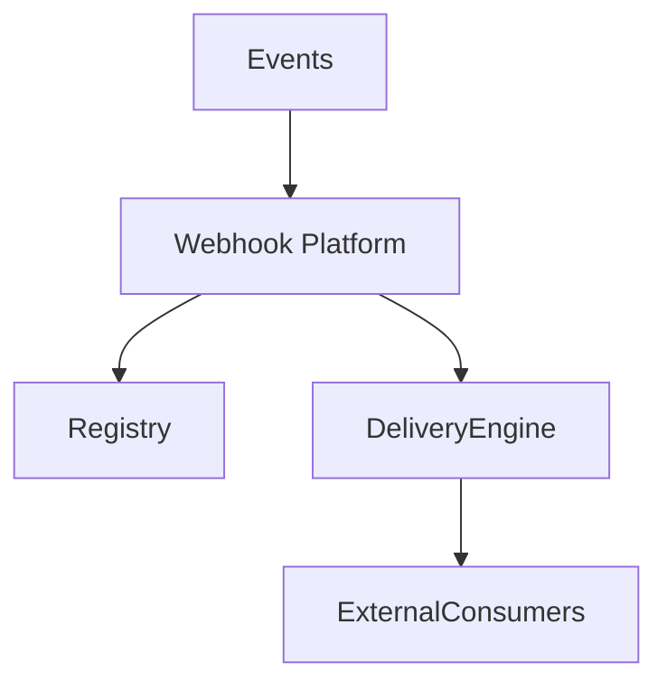
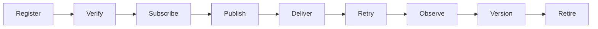
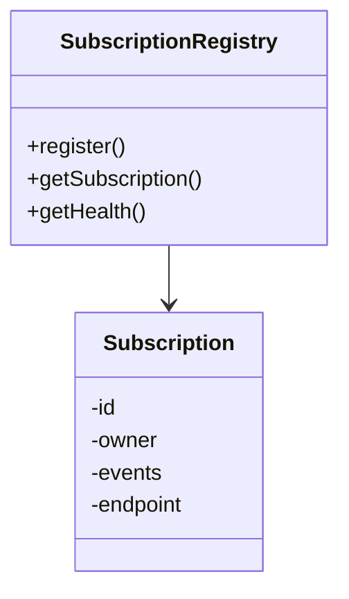
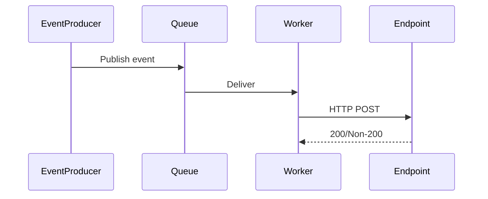
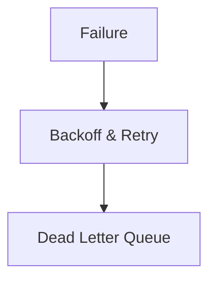
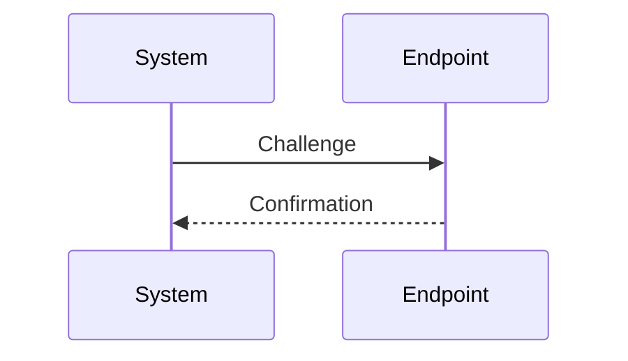
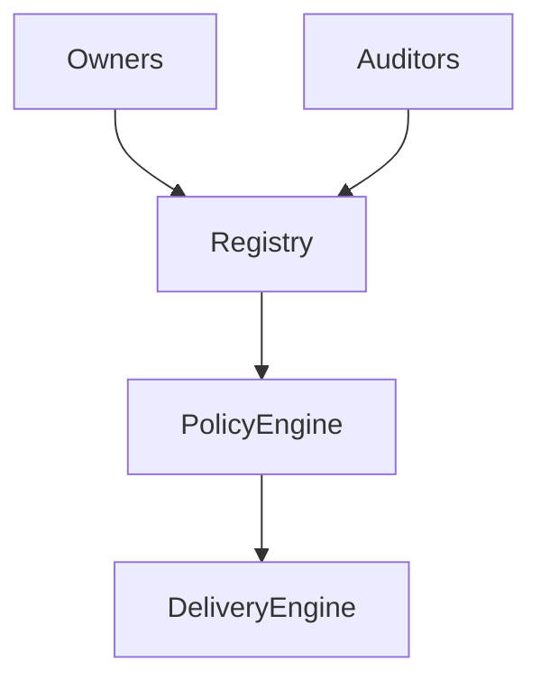
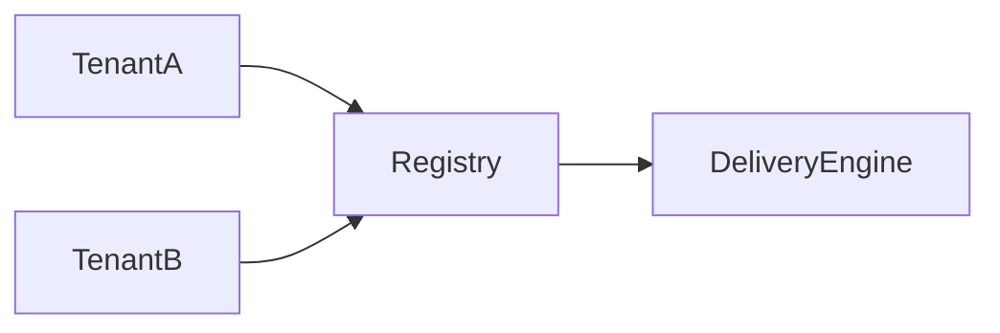
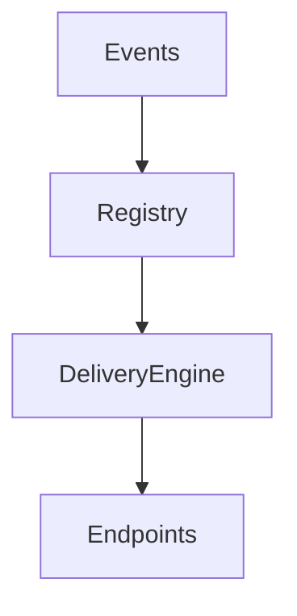
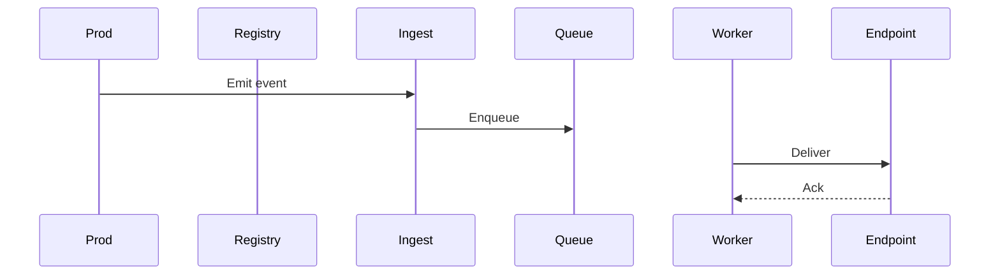

# KB-097 — Webhook Architecture (Draft)

## Executive Summary

The Webhook Platform standardizes asynchronous event delivery between DUKADESK and external systems. It provides secure registration, validation, delivery, retry semantics, observability, tenancy, and governance so that webhooks are reliable, auditable, and policy-governed across the platform.

## Purpose

Define the enterprise architecture for inbound and outbound webhook communication: subscription management, secure delivery, retry and DLQ handling, observability, tenant isolation, and lifecycle governance.

## Scope

Supports webhook needs for:
- Runtime Engine, Builder Studio, Marketplace
- Dashboards, Notifications, AI, Analytics, Reporting
- Payments, Communication Providers, Enterprise Systems, Partner Platforms
- Customer-owned systems (as endpoints)

## Architectural Principles

- Event-Driven Communication
- Secure by Default (verification, signatures)
- Policy-Governed Delivery (throttling, masking)
- Tenant Isolation and Purpose Binding
- Idempotent Processing and Deduplication
- Observable Delivery with Provenance
- Canonical Event Contracts and Versioning
- Retry Without Duplication and DLQ support
- Technology Independence

## Canonical Definitions

- Webhook — asynchronous event delivery to/from an external HTTP endpoint.
- Webhook Endpoint — a registered target for delivery.
- Webhook Subscription — binding between a consumer endpoint and an event contract.
- Webhook Event — a discrete event instance with payload and metadata.
- Webhook Contract — canonical event schema and semantics.
- Webhook Registry — catalog of subscriptions, endpoints, and manifests.
- Delivery Attempt — a single attempt to deliver an event to an endpoint.
- Retry Policy — strategy for re-trying failed deliveries.
- Dead Letter Queue (DLQ) — store for failed events after retries.
- Event Signature — cryptographic signature proving origin.
- Webhook Manifest — metadata describing an endpoint's capabilities and owner.

## Webhook Platform Architecture

```
Platform Events
       │
Webhook Platform
       │
 Registry • Policies • Security
       │
 Delivery Engine
       │
 External Consumers
```

### Core Components
- Subscription Registry: register and manage webhook subscriptions and manifests.
- Endpoint Verification: validation and verification flows (challenge-response, TLS checks).
- Delivery Engine: reliable queuing, fan-out, batching, parallelism, and backoff.
- Retry & DLQ: configurable retry strategies, exponential backoff, and DLQ for inspection.
- Signature & Verification: sign outgoing events and verify incoming request signatures.
- Idempotency & Deduplication: idempotency keys and dedupe logic to prevent duplicates.
- Policy Engine: enforce throttles, masking, residency, and consent rules.
- Observability: delivery metrics, latency, success/failure rates, and tracing with provenance.
- Governance & Auditing: subscription approval, certificates, and audit logs.

## Webhook Domains

Support webhooks across:
- Identity, Runtime, Builder, Marketplace, Payments, Notifications
- AI, Storage, Analytics, Reporting, Governance, Administration

## Webhook Lifecycle

Register
 ↓
Verify (endpoint validation)
 ↓
Subscribe (bind events)
 ↓
Publish (event produced)
 ↓
Deliver (attempts)
 ↓
Retry (on failure)
 ↓
Observe (metrics & audit)
 ↓
Version (contract changes)
 ↓
Retire

## Subscription Architecture

- Subscription Registry: per-tenant subscriptions, event filters, delivery config.
- Subscription Ownership: owner, steward, and approval status.
- Event Selection: filters, transforms, and subscription predicates.
- Delivery Configuration: batching, rate limits, headers, TLS settings.
- Endpoint Validation: challenge-response, certificate pinning hints, and URL verification.
- Version Compatibility: contract version checks and upgrade paths.

## Event Delivery Architecture

- Event Publication: platform events are enriched with metadata and published to delivery engine.
- Queueing: durable queue for each subscription or delivery group (technology-agnostic).
- Delivery Pipeline: worker(s) process queue, attempt delivery, record attempt status.
- Acknowledgement: endpoint 2xx is success; others are treated per policy.
- Retry Management: exponential/backoff retries, jitter, and a configurable cap.
- Failure Handling: move to DLQ after exhaustion and notify owners.

## Webhook Registry

Registry responsibilities:
- Catalog endpoints, subscriptions, manifests, and owners
- Surface subscription health and policies
- Provide discovery and management APIs for platform consumers

## Governance

- Subscription Approval and certification for high-risk events (payments, PII)
- Contract versioning and deprecation windows
- Endpoint certification for partners and vendors
- Audit trails for subscription changes and delivery history

## Responsibilities

Runtime Responsibilities:
- Publish events to the platform event bus with contract metadata.

Backend Responsibilities:
- Register and manage subscription manifests and honor event contracts.

Mobile Runtime Responsibilities:
- Consume webhook-driven updates via platform services; mobile devices are not endpoints.

Builder Responsibilities:
- Define event contracts and recommend subscription parameters.

Marketplace Responsibilities:
- Register partner endpoints and abide by certification and policy checks.

AI Platform Responsibilities:
- Subscribe to consented events for model training, ensuring lineage and purpose limits.

## Security

- Endpoint Verification: ensure only valid endpoints are registered and activated.
- Request Signing: sign outgoing events; require signatures for inbound webhooks where applicable.
- Replay Protection: nonces, timestamps, and short-lived signatures.
- Authentication & Authorization: enforce per-subscription auth models and scopes.
- Tenant Isolation: subscriptions scoped to tenant context and access controls.
- Audit Logging: immutable logs for deliveries, failures, and subscription lifecycle.

## Privacy

- Event Minimization: publish only required fields and apply masking as policy dictates.
- Consent Enforcement: honor consumer consents for personal data in events.
- Sensitive Payloads: restrict or transform PII before delivery.
- Cross-Tenant Isolation: prevent subscriptions that would expose cross-tenant data.

## Performance

- Delivery Throughput: scale delivery workers and queues horizontally.
- Parallel Deliveries: allow concurrency while respecting endpoint quotas.
- Retry Efficiency: backoff strategies and batching to minimize load.
- Subscription Scalability: sharding strategies for large subscriber bases.
- Backpressure Handling: slow endpoints trigger backoff and throttling upstream.

## Observability (see KB-058)

Metrics and traces:
- Delivery success/failure rates per subscription
- Retry counts and DLQ volumes
- Delivery latency and endpoint availability
- Subscription growth and churn

## Failure Scenarios

- Invalid Endpoint: verification fails; subscription remains unactivated.
- Endpoint Timeout: retry per policy; escalate to DLQ after exhaustion.
- Signature Verification Failure: reject and audit.
- Replay Attack: detect via nonce/timestamp and reject.
- Delivery Queue Saturation: backpressure, degrade non-critical deliveries.
- Duplicate Delivery: deduplicate using idempotency keys.
- Cross-Tenant Delivery: detect and block with audit/alerts.

## Anti-patterns

- Treating webhooks as synchronous APIs
- Unverified endpoints or hardcoded callback URLs
- Infinite retries without DLQ
- Mobile devices as webhook endpoints
- Exposing raw provider-specific events without canonical contracts

## Future Evolution

- Intelligent Retry Policies based on endpoint behavior
- AI-Assisted Delivery Optimization and routing
- Adaptive Routing to geo-nearest delivery endpoints
- Autonomous Endpoint Verification and certification
- Federated Event Network integration for large partner ecosystems

## Cross References

- KB-077 Event & Messaging Architecture
- KB-094 Integration Platform Architecture
- KB-095 Integration Connector Architecture
- KB-096 API Gateway Architecture
- KB-098 Integration Policy Architecture (planned)
- KB-099 Secrets & Credential Management Architecture (planned)
- KB-100 Service Discovery Architecture (planned)

## Mermaid Diagrams

1. Webhook Platform Architecture



2. Webhook Lifecycle



3. Subscription Architecture



4. Event Delivery Pipeline



5. Retry Workflow



6. Endpoint Verification Flow



7. Webhook Governance Model



8. Multi-Tenant Webhook Architecture



9. Webhook Dependency Graph



10. End-to-End Webhook Delivery Workflow



## Acceptance Criteria

- Architecture only; queue and vendor independent.
- Enterprise grade, secure, and fully cross-referenced.
- Mermaid diagrams included and conceptual.
- Ready for Knowledge Base inclusion as Draft.

## Completion

- Update PROGRESS_REGISTRY.md: set KB-097 to Draft and queue KB-098.

## Critical DUKADESK Rule

> All webhook communication is governed, authenticated, observable, and event-driven.

All inbound and outbound webhook traffic must pass through the Webhook Platform and obey subscription, verification, retry, and governance policies.

<!-- End of KB-097 -->
