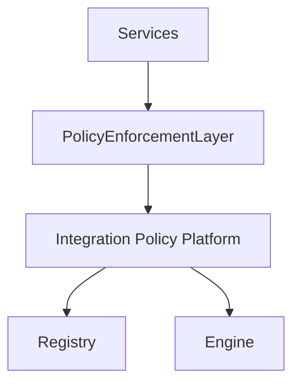
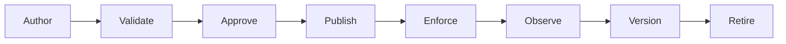
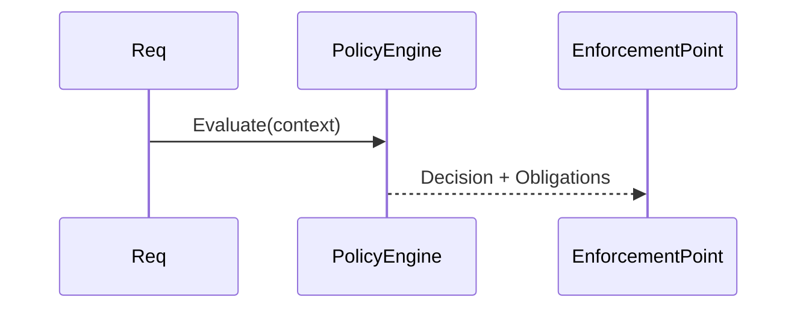
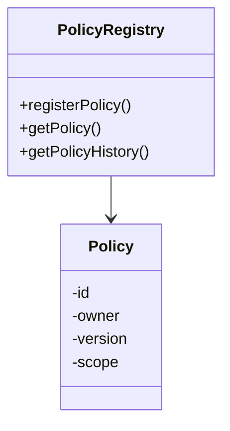
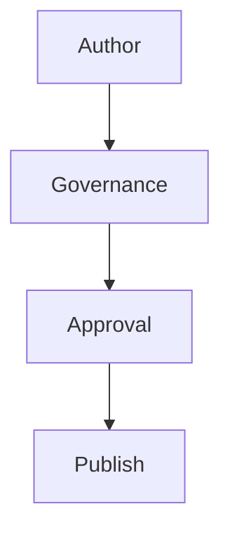
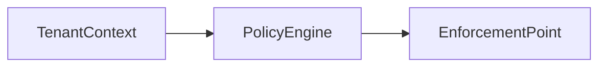
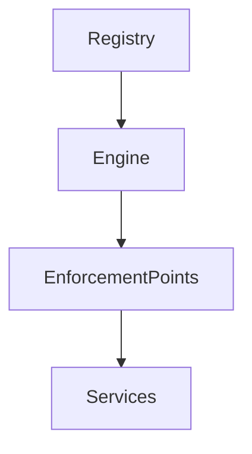
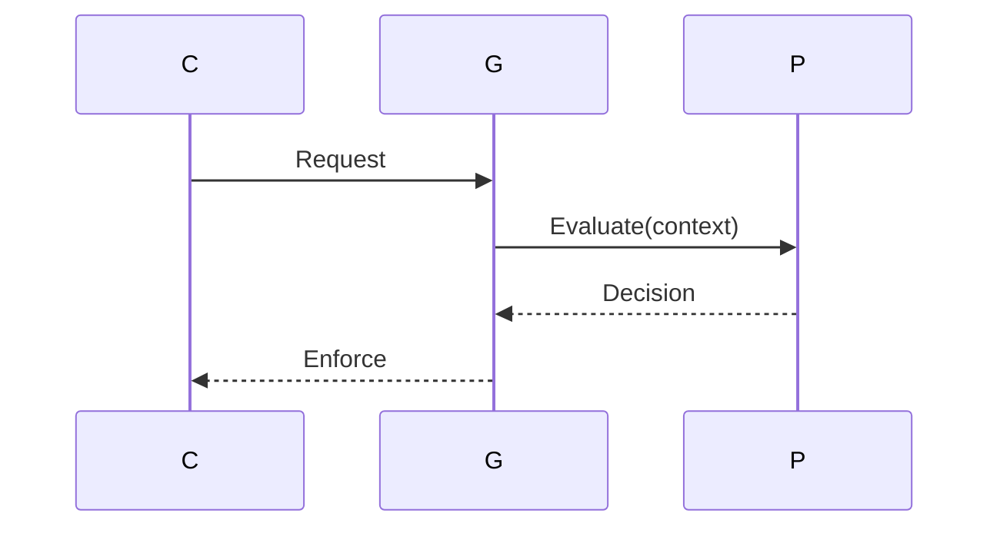
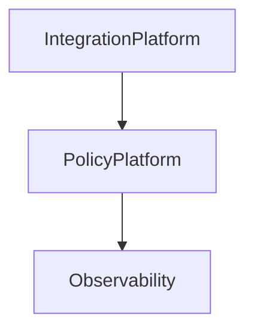
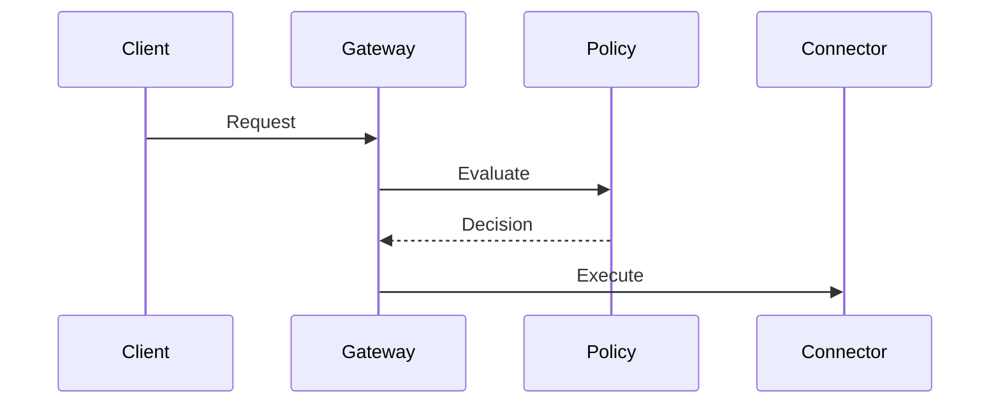

# KB-098 — Integration Policy Architecture (Draft)

## Executive Summary

Integration Policy Architecture centralizes the rules that govern every integration across DUKADESK. Policies determine whether integrations may execute, what data is accessible, who owns them, and how enforcement, auditing, and lifecycle management occur. Policies are mandatory, versioned, auditable, tenant-aware, and enforced before any integration executes.

## Purpose

Define the enterprise architecture for policy creation, validation, enforcement, auditing, lifecycle, and compliance for integrations—irrespective of protocol, provider, or technology.

## Scope

Applies to internal, external, Marketplace, AI, payment, notification, storage, identity, ERP/CRM, government, partner and customer-owned integrations.

## Architectural Principles

- Policy Before Execution
- Deny By Default
- Explicit Trust and Least Privilege
- Zero Trust Integration
- Tenant-Aware Policies
- Observable and Auditable Decisions
- Versioned and Immutable Policy Artifacts
- Technology Independence

## Canonical Definitions

- Integration Policy — the rule-set governing an integration's behavior and allowed actions.
- Policy Engine — evaluates policies against request context and produces decisions.
- Policy Registry — catalog of policies, versions, owners, scopes and dependencies.
- Policy Evaluation — runtime assessment of a policy against context.
- Policy Decision — allow, deny, transform, degrade, or audit.
- Policy Scope — the set of resources, tenants, and actions a policy covers.
- Policy Manifest — machine-readable policy metadata and bindings.
- Policy Version — immutable revision of a policy used for auditing and governance.
- Policy Owner — steward responsible for policy correctness and approvals.
- Policy Exception — approved deviation with constrained scope and TTL.
- Policy Enforcement Point (PEP) — conceptual enforcement location (gateway, connector, webhook delivery engine).
- Compliance Policy — high-assurance policies required by law or regulation.

## Integration Policy Platform Architecture

```
           Platform Services
                  │
      API Gateway • Connectors • Webhooks
                  │
        Policy Enforcement Layer
                  │
      Integration Policy Platform
                  │
 Registry • Evaluation • Governance
                  │
          Policy Decisions
```

### Conceptual Components
- Policy Registry: store policies, metadata, owners, and version history.
- Policy Authoring: interfaces and templates to create machine-readable policies.
- Policy Validation: static checks, conflict detection, and simulation tooling.
- Policy Approval: governance workflows, automated checks, and certification.
- Policy Engine: high-performance evaluator with context inputs (identity, tenant, purpose, provider capabilities).
- Enforcement Gateways (PEPs): points where decisions are enforced (API Gateway, Integration Gateway, Webhook Platform, Connector runtime).
- Decision Cache: short-lived caches for repeat decisions to reduce latency.
- Audit & Explainability: immutable decision logs and explanation metadata.
- Exception & Escalation: managed exception paths with TTL and approvals.

## Policy Domains

Policies cover:
- Identity and Authentication
- Authorization scopes and roles
- Tenant Isolation and Cross-Tenant Rules
- Data Sharing and Residency
- Privacy and Consent
- Payments and Financial Data
- Rate Limiting and Throttling
- Retry and Backoff Behaviour
- Transformation & Masking
- Legal & Compliance constraints

## Policy Lifecycle

Author
 ↓
Validate (static analysis & simulation)
 ↓
Approve (governance)
 ↓
Publish (bind to registry & targets)
 ↓
Enforce (at PEPs)
 ↓
Observe (metrics & violations)
 ↓
Version (create new immutable revisions)
 ↓
Retire

## Policy Types

- Access Policies (who/what can access)
- Authentication Policies (auth methods required)
- Authorization Policies (roles, attributes, ABAC rules)
- Tenant Policies (scoping, sharing rules)
- Privacy Policies (consent, minimization, masking)
- Data Sharing Policies (allowed exports, residency constraints)
- Rate Policies (quota, throttles)
- Retry Policies (behaviour for transient failures)
- Security Policies (threat protection, anomaly detection)
- Compliance Policies (legal holds, audit requirements)
- Provider Policies (approved provider lists and contracts)
- Lifecycle Policies (deprecation, retention)

## Policy Registry

- Registration: policies registered with metadata, owners, scope.
- Ownership: clear steward and contact for each policy.
- Metadata: classification, risk level, dependencies, bindings.
- Versioning: immutable revisions with audit trail.
- Discoverability: APIs for runtime and developers to find applicable policies.
- Dependency Graph: visualize policy interactions and conflicts.

## Policy Evaluation (conceptual)

- Request Context: identity, tenant, purpose, consumer attributes, provider metadata, and environmental signals.
- Identity Evaluation: resolve consumer identity and roles.
- Tenant Evaluation: determine tenant context and scoping constraints.
- Capability Evaluation: check provider/source capabilities and constraints.
- Decision Generation: return allow/deny/transform/audit directives.
- Policy Composition: combine multiple policies deterministically (deny-overrides, explicit precedence).
- Obligation Emission: return obligations (e.g., audit this access, mask fields) to enforcement point.

## Governance

- Policy Ownership and Approval workflows
- Periodic Reviews and Certification
- Exception Management with TTL and audit
- Compliance Verification and Reporting
- Policy Testing and Simulation prior to publishing

## Responsibilities

Runtime Responsibilities:
- Honor policy decisions emitted by the policy platform; do not bypass enforcement.

Backend Responsibilities:
- Register needed policy metadata and participate in policy simulation during development.

Mobile Runtime Responsibilities:
- Rely on platform-enforced decisions; mobile clients do not evaluate integration policies locally.

Builder Responsibilities:
- When composing integrations, present required policies and simulate impacts.

Marketplace Responsibilities:
- Connector vendors must declare required policies and pass certification.

AI Platform Responsibilities:
- Declare intended data usage purpose and enforce consent-driven policy obligations.

## Security

- Zero Trust Enforcement: continuous verification and least privilege.
- Tamper Resistance: policies and audit logs are tamper-evident.
- Policy Authorization: only authorized stewards can publish/approve policies.
- Isolation: per-tenant policy bindings and overrides where permitted.
- Audit Logging: decision logs stored immutably for forensics.

## Privacy

- Consent Enforcement: policy-driven checks preventing unauthorized personal data flows.
- Sensitive Data Handling: mask, redact, or block based on policy.
- Regional Compliance: policy-enforced residency and export controls.
- Right-to-Erasure: policy interactions with archival/retention systems to honor erasure when lawful.

## Performance

- Policy Evaluation Latency: target sub-ms to low-ms evaluations; use decision caches.
- High-Volume Requests: scale policy engine horizontally and partition decisions by domain/tenant.
- Decision Caching: cache recent decisions with short TTL and cache invalidation on policy change.
- Distribution: distribute policy data to edge enforcement points reliably and securely.
- High Availability: active-active policy platform with failover and degraded-mode operations.

## Observability (see KB-058)

Monitor:
- Policy decision volumes and latency
- Policy violations and exception rates
- Enforcement failures and fallback occurrences
- Policy adoption and coverage across integrations
- Audit trails and explainability metrics

## Failure Scenarios

- Missing Policy: default deny and alert governance.
- Invalid Policy: reject publish and notify owner.
- Conflicting Policies: surface deterministic resolution or require manual reconciliation.
- Unauthorized Provider: block interactions and notify stakeholders.
- Policy Registry Failure: fail closed or use cached decisions depending on risk profile.
- Tenant Isolation Violation: immediate containment and audit.
- Compliance Failure: trigger legal workflow and hold data.
- Stale Policy Version: invalidate caches and force refresh.

## Anti-patterns

- Hardcoding rules in services
- Service-owned policy fragments
- Runtime editing of policies in prod without governance
- Implicit trust and broad exemptions
- Duplicate policy definitions across teams
- Bypassing policy evaluation for performance

## Future Evolution

- AI-Assisted Policy Authoring and conflict detection
- Adaptive Policies responding to runtime signals
- Autonomous compliance validation and remediation
- Predictive policy analysis for risk assessment
- Policy federation across enterprises and partners
- Self-healing policy networks to remediate violations

## Cross References

- KB-057 Runtime Security Architecture
- KB-094 Integration Platform Architecture
- KB-095 Integration Connector Architecture
- KB-096 API Gateway Architecture
- KB-097 Webhook Architecture
- KB-099 Secrets & Credential Management Architecture (planned)
- KB-100 Service Discovery Architecture (planned)
- KB-101 External Provider Management Architecture (planned)

## Mermaid Diagrams

1. Integration Policy Platform Architecture



2. Policy Lifecycle



3. Policy Evaluation Flow



4. Policy Registry Model



5. Policy Governance Workflow



6. Multi-Tenant Policy Enforcement



7. Policy Dependency Graph



8. Integration Request Evaluation



9. Cross-Platform Policy Architecture



10. End-to-End Policy Enforcement Workflow



## Acceptance Criteria

- Architecture only; policy engine and vendor independent.
- Enterprise-grade and Zero Trust aligned.
- Centralized, auditable, and mandatory policy evaluation for all integrations.
- Fully cross-referenced and Mermaid-complete.
- Ready for Knowledge Base inclusion as Draft.

## Completion

- Update PROGRESS_REGISTRY.md: set KB-098 to Draft and queue KB-099.

## Critical DUKADESK Rule

> No integration executes without policy evaluation.

Policy evaluation is mandatory for every connector, webhook, API request, external provider interaction, AI workflow, marketplace integration, and builder-generated integration. Policy enforcement is centralized, versioned, auditable, tenant-aware, and mandatory.

<!-- End of KB-098 -->
