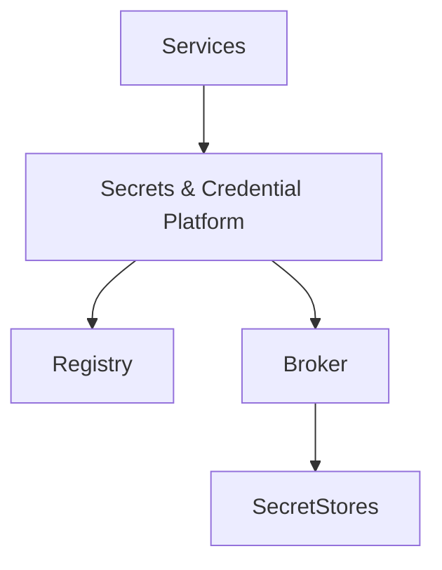
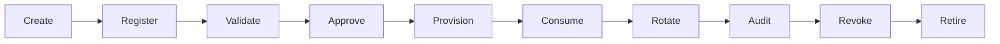
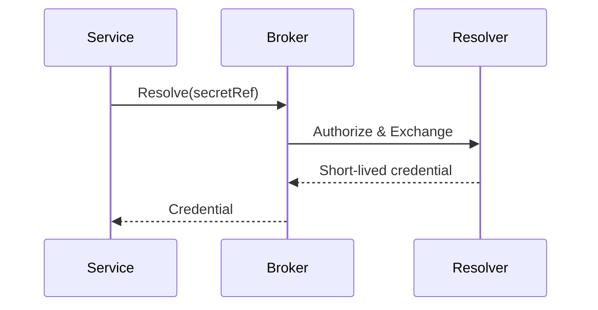
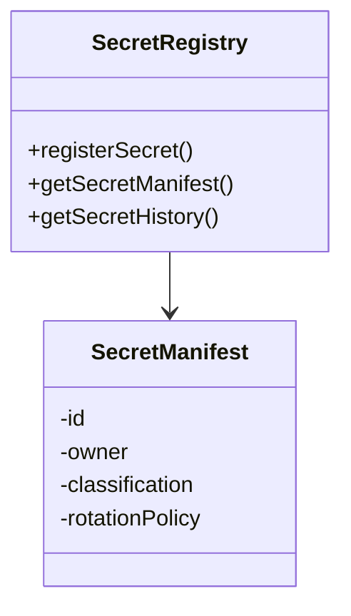
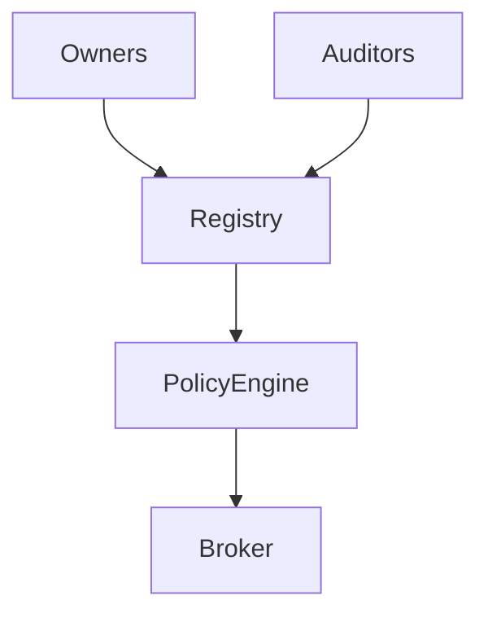
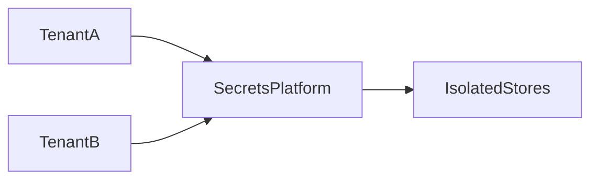
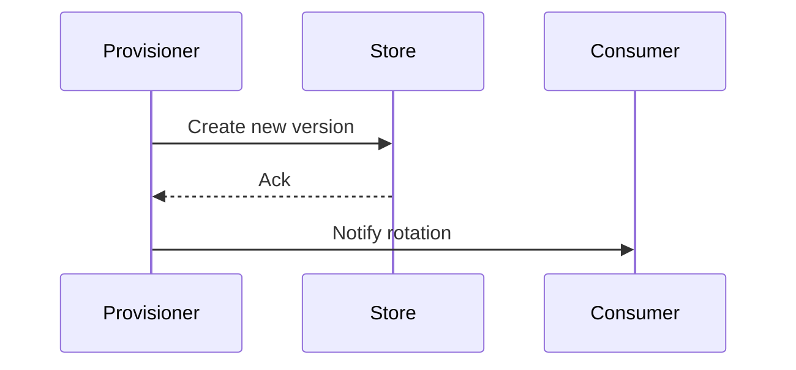
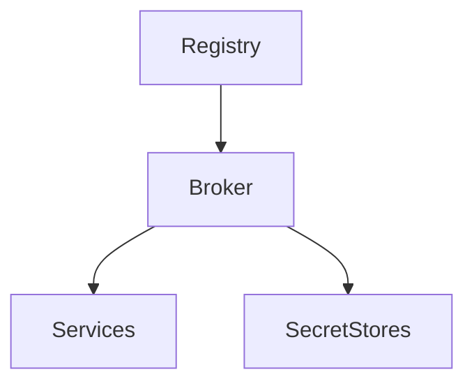
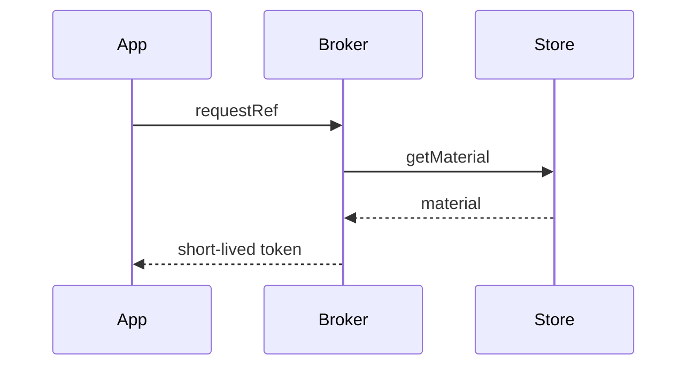
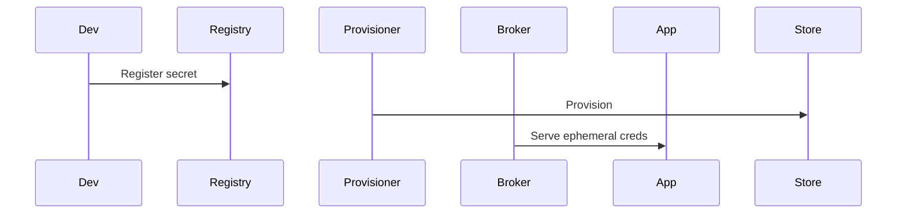

# KB-099 — Secrets & Credential Management Architecture (Draft)

## Executive Summary

The Secrets & Credential Management Platform is the single trusted authority for all sensitive credentials across DUKADESK. It governs lifecycle, provisioning, rotation, revocation, access control, auditing, and secure consumption of secrets. No application or integration owns secrets; they are referenced via secure handles and consumed through policy-controlled access.

## Purpose

Define the enterprise architecture for centralized secret lifecycle management, governance, policy enforcement, tenant-aware secret consumption, and auditability for all credentials and cryptographic artifacts used across the platform.

## Scope

Governs API keys, OAuth credentials, JWT signing keys, encryption key references, TLS certificates, integration secrets, connector credentials, webhook signing secrets, database/storage credentials, provider credentials, machine identities, and other sensitive artifacts.

## Architectural Principles

- Secrets Never Live in Applications
- Reference, Never Embed
- Least Privilege and Rotation by Design
- Zero Trust for secret access
- Tenant Isolation and scoped secrets
- Immutable Audit Trail for secret operations
- Policy-Governed Access and Versioning
- Technology and Cloud Independent
- Observable Secret Usage

## Canonical Definitions

- Secret — opaque sensitive artifact used to authenticate or authorize.
- Credential — specific type of secret (API key, password, token).
- Secret Reference — secure handle used in place of raw secret material.
- Secret Store — conceptual secure storage for secret material.
- Secret Registry — catalog of secret references, metadata, owners, and policies.
- Secret Manifest — metadata describing secret purpose, scope and owner.
- Secret Version — immutable revision of a secret material.
- Rotation — replacement of secret material with new version.
- Revocation — immediate invalidation of secret material.
- Secret Consumer — entity authorized to use a secret reference.
- Secret Owner — steward responsible for secret lifecycle.
- Machine Identity — identity used by services or machines (conceptual).

## Secrets Platform Architecture

```
              Platform Services
                     │
 Runtime • Builder • Marketplace • AI
                     │
      Secrets & Credential Platform
                     │
 Registry • Policies • Audit
                     │
 Secure Secret References
                     │
          External Providers
```

### Conceptual Components
- Secret Registry: record of secrets, metadata, owners, classifications, and versions.
- Secret Store: encrypted, tamper-evident storage for secret material.
- Secret Broker/Resolver: runtime component that resolves references to usable credentials with authorization checks.
- Provisioning & Rotation Engine: automation for issuing, rotating, and revoking secrets.
- Access Control & Policy Engine: governs who may access which secret references under what conditions.
- Audit & Compliance Log: immutable logs of secret creation, access, rotation, and revocation.
- Tenant Isolation Layer: ensures secrets are isolated per tenant unless explicitly shared.
- Secrets Distribution Interface: secure interfaces for connectors, gateways, and runtime to obtain temporary credentials.

## Secret Domains

Covers secrets for:
- Runtime, Builder, Marketplace, Identity, API Gateway
- Integration Platform, Webhooks, Notifications, AI
- Storage, Infrastructure, Analytics, Reporting

## Secret Lifecycle

Create
 ↓
Register (manifest & owner)
 ↓
Validate (policy checks)
 ↓
Approve (governance)
 ↓
Provision (store and issue reference)
 ↓
Consume (resolve with authorization)
 ↓
Rotate (automated or manual)
 ↓
Audit (immutable logs)
 ↓
Revoke
 ↓
Retire

## Secret Registry

- Registration: metadata capture including classification, owner, rotation policy, and expiration.
- Metadata: sensitivity, tenant scope, provider bindings, dependencies.
- Ownership: clear steward and steward contacts.
- Versioning: immutable versions with lineage and rotate history.
- Expiration & TTL: enforce expiry and rotation schedule.
- Discovery: controlled APIs for authorized discovery and automation.

## Credential Consumption Model

- Secret References: services receive opaque handles instead of raw secrets.
- Runtime Resolution: on-demand exchange of reference for short-lived credentials.
- Authorization: ACLs and policies determine which identities can resolve references.
- Temporary Access: issue short-lived tokens or ephemeral credentials for use.
- Rotation Awareness: clients should tolerate rotation and resolve references on use.
- Failure Recovery: fallback flows when resolution fails (degraded mode or fail-closed as policy).

## Secret Classification

- Platform Secrets (global platform-level)
- Tenant Secrets (tenant-scoped)
- Workspace Secrets (workspace-scoped)
- Integration Secrets (connector/provider credentials)
- Provider Secrets (third-party credentials)
- Infrastructure Secrets (databases, services)
- Operational Secrets (ops tooling)
- Development Secrets (dev/test, explicitly scoped and segregated)

## Governance

- Secret Ownership and Stewardship assignment
- Approval workflows for high-risk secrets
- Rotation & revocation policies defined per classification
- Audit and compliance reporting for regulators
- Certification for connector-managed secrets in Marketplace

## Responsibilities

Runtime Responsibilities:
- Never persist raw secret material; request via resolver at runtime.

Backend Responsibilities:
- Register secrets with manifest metadata and adhere to rotation policies.

Mobile Runtime Responsibilities:
- Mobile applications do not embed secrets; authenticate via platform tokens.

Builder Responsibilities:
- Generated artifacts reference secrets via secure handles rather than embedding them.

Marketplace Responsibilities:
- Marketplace packages must not contain embedded secrets; use secure references.

AI Platform Responsibilities:
- Use secret references for provider credentials; ensure consent and lineage recorded.

## Security

- Secret Encryption: all secrets encrypted at rest with managed keys.
- Authorization: RBAC/ABAC to control who can resolve references.
- Tenant Isolation: strict scoping and optional cryptographic segregation per tenant.
- Rotation: automated rotation with zero-downtime patterns where possible.
- Revocation: immediate revocation workflow with audit and alerts.
- Tamper Evidence: immutable logs and cryptographic verification of actions.

## Privacy

- Personal Credentials: classify and protect personal secrets.
- Secret Ownership: map personal or tenant-owned secrets to owners for consent.
- Consent Dependencies: ensure secrets used for personal data access honor consent.
- Sensitive Metadata: limit exposure of metadata that could reveal sensitive mappings.

## Performance

- Secret Resolution Latency: optimize to low-ms for runtime resolution.
- Rotation Scalability: support large-scale simultaneous rotations.
- High Availability: geo-redundant secret stores and caches for resilience.
- Registry Scalability: partition registry for high throughput and low latency.
- Authorization Latency: decision caches and pre-authorized exchange patterns.

## Observability (see KB-058)

Monitor:
- Secret access counts and patterns
- Failed retrievals and unauthorized attempts
- Rotation success/failure rates
- Expired credential usage
- Unauthorized access alerts

## Failure Scenarios

- Expired Credential: detect and force rotation or deny access.
- Rotation Failure: failover to previous version if permitted; alert and remediate.
- Unauthorized Secret Access: revoke and audit.
- Cross-Tenant Exposure: contain, revoke, and audit.
- Secret Registry Corruption: recover from backups and verify integrity.
- Invalid Secret Reference: return clear error and audit.
- Revoked Credential Usage: detect and deny, with alerts.

## Anti-patterns

- Hardcoding secrets in code or config
- Secrets in mobile apps, marketplace artifacts, or repos
- Shared credentials across tenants
- Long-lived static credentials without rotation
- Duplicate secret stores and fragmented governance

## Future Evolution

- AI-Assisted Secret Health & Rotation
- Autonomous Credential Leak Detection
- Dynamic Secret Leasing and Just-in-Time credentials
- Passwordless Machine Identities and PKI Automation
- Federated Secret Management across partner ecosystems
- Self-Healing secret infrastructure that auto-remediates

## Cross References

- KB-057 Runtime Security Architecture
- KB-094 Integration Platform Architecture
- KB-095 Integration Connector Architecture
- KB-096 API Gateway Architecture
- KB-097 Webhook Architecture
- KB-098 Integration Policy Architecture
- KB-100 Service Discovery Architecture (planned)
- KB-101 External Provider Management Architecture (planned)
- KB-102 Identity Federation Architecture (planned)

## Mermaid Diagrams

1. Secrets Platform Architecture



2. Secret Lifecycle



3. Secret Resolution Flow



4. Secret Registry Architecture



5. Secret Governance Model



6. Multi-Tenant Secret Architecture



7. Secret Rotation Workflow



8. Secret Dependency Graph



9. Credential Consumption Flow



10. End-to-End Secret Management Workflow



## Acceptance Criteria

- Architecture only; secret store and cloud independent.
- Enterprise-grade and Zero Trust aligned.
- Enforces "no secret owned by an application" principle.
- Fully cross-referenced and Mermaid-complete.
- Ready for Knowledge Base inclusion as Draft.

## Completion

- Update PROGRESS_REGISTRY.md: set KB-099 to Draft and queue KB-100.

## Critical DUKADESK Rule

> No secret is ever owned by an application.

All credentials and secret material are managed centrally by the Secrets & Credential Management Platform. Applications use secure references and temporary credentials; no secret material is embedded or persisted by applications.

<!-- End of KB-099 -->
