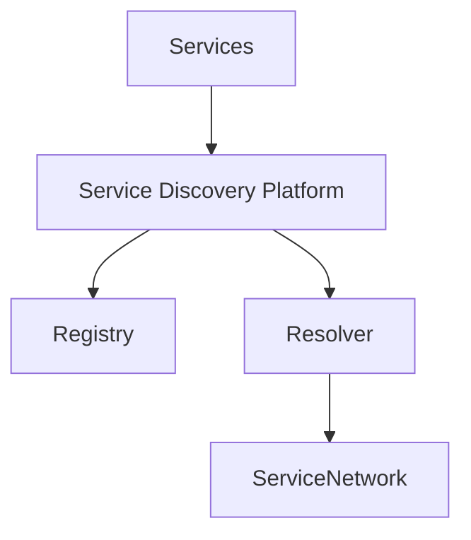
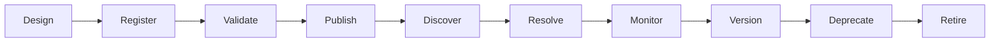
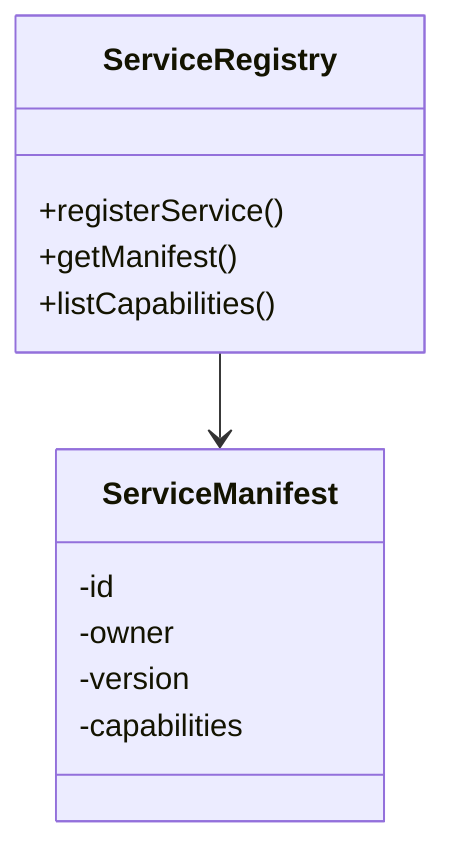
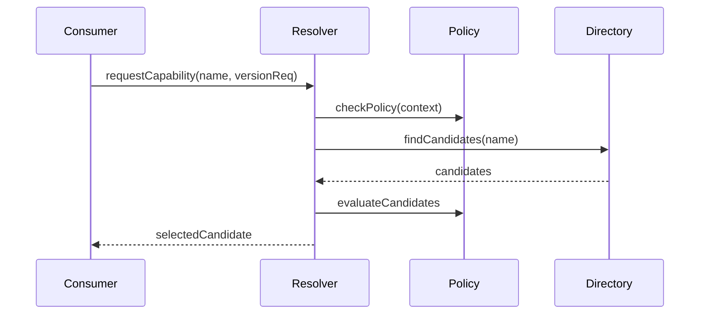
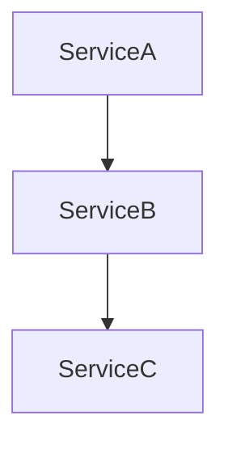
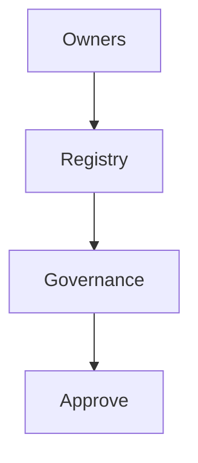
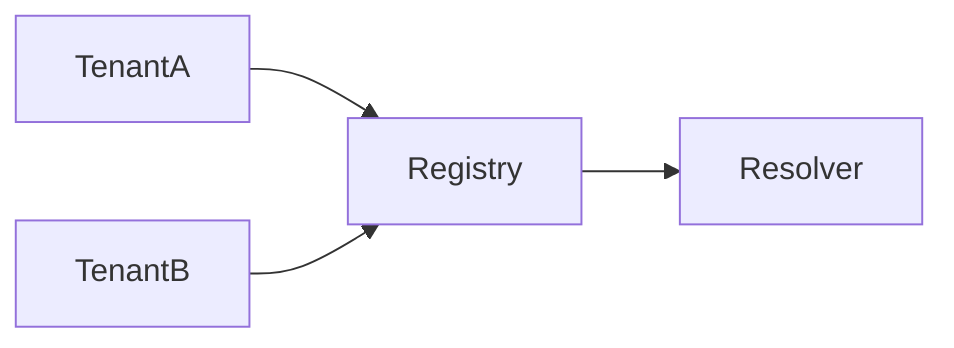
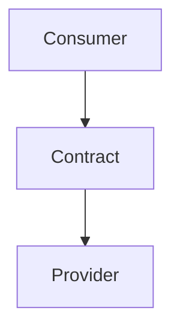
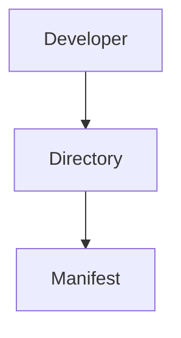
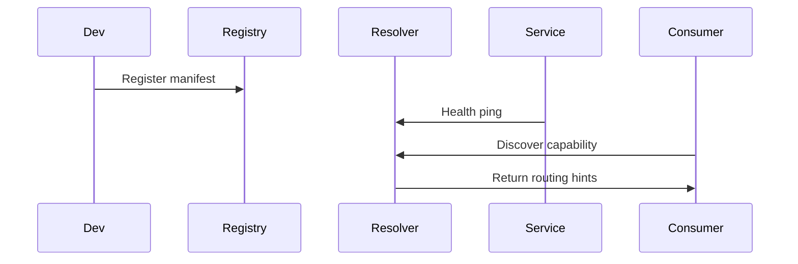

# KB-100 — Service Discovery Architecture (Draft)

## Executive Summary

The Service Discovery Platform provides governed, capability-driven discovery across the DUKADESK ecosystem. It enables consumers to find platform capabilities (not infrastructure), resolve versions and contracts, and make runtime decisions while preserving governance, tenant-awareness, and observability.

## Purpose

Define the enterprise architecture for service registration, capability resolution, dependency management, version governance, lifecycle, and secure discovery of platform capabilities.

## Scope

Governed discovery for:
- Runtime, Identity, Builder, Marketplace, AI, Analytics, Reporting
- Integration, Notification, Storage, Search, Governance, Administration
- Background workers, platform APIs, and future capabilities

## Architectural Principles

- Discover Capabilities, Not Infrastructure
- Registry as the source of discovery
- Canonical Service Identity and Contracts
- Policy-Governed Discovery
- Tenant Awareness and Isolation
- Versioned Service Contracts
- Technology Independence
- Observable Health and Availability
- Zero Trust Service Access
- Dynamic Resolution and Caching

## Canonical Definitions

- Service — logical capability provided by the platform.
- Capability — a named, versioned feature set exposed by a service.
- Service Registry — authoritative catalog of services and capabilities.
- Capability Registry — directory of capabilities, contracts, owners and versions.
- Service Descriptor / Manifest — metadata describing a service or capability.
- Service Identity — canonical identifier for a capability.
- Service Version — semantic version of a contract/interface.
- Service Instance — ephemeral runtime instance (conceptual).
- Capability Resolution — process of mapping a capability request to an endpoint or execution plan.
- Health Status — current availability and readiness of a capability.

## Service Discovery Architecture

```
             Platform Services
                    │
 Runtime • Builder • Marketplace • AI
                    │
       Service Discovery Platform
                    │
 Registry • Resolution • Governance
                    │
         Capability Directory
                    │
         Platform Service Network
```

### Conceptual Components
- Service Registry: stores manifests, owners, versions, and capability metadata.
- Capability Directory: searchable index of exposed capabilities and contracts.
- Registration API: controlled API for services to register and update manifests.
- Resolution Engine: resolves capability requests to candidate instances or routing hints.
- Policy Integration: consults policy platform (KB-098) during resolution for access, residency, and tenant rules.
- Health & Monitoring: ingest health signals and expose availability data.
- Dependency Graph: record service dependencies and detect cycles or risky coupling.
- Governance UI & APIs: manage registrations, approvals, and deprecations.
- Edge Caches & Local Resolvers: low-latency caches with strong invalidation for dynamic environments.

## Discovery Domains

Discovery covers:
- Runtime, Identity, Builder, Marketplace, AI, Analytics, Reporting
- Storage, Notifications, Search, Integrations, Administration

## Service Lifecycle

Design
 ↓
Register (manifest)
 ↓
Validate (schema, contract checks)
 ↓
Publish (make discoverable)
 ↓
Discover (by consumers)
 ↓
Resolve (policy-aware selection)
 ↓
Monitor (health)
 ↓
Version (contract changes)
 ↓
Deprecate
 ↓
Retire

## Service Registry

- Registration: manifest submission with owner, contract, versions, and metadata.
- Metadata: domain, sensitivity, tenant scope, SLA, dependencies, and supported operations.
- Ownership: clear steward per capability and contact for governance.
- Versioning: manifest versions with compatibility notes and deprecation metadata.
- Capability Catalog: searchable catalog used by developers and runtime.
- Discoverability APIs: authenticated APIs for capability queries and filters.

## Capability Resolution

- Capability Discovery: find candidate capabilities by name, domain, or attributes.
- Version Resolution: select compatible versions according to consumer requirements and compatibility policies.
- Dependency Resolution: include dependent capabilities and validate constraints.
- Policy Evaluation: enforce access, residency, and tenant-scoped constraints during selection.
- Availability Evaluation: prefer healthy instances and consider regional/residency requirements.
- Service Selection: return routing hints, endpoint references, or logical plan for composition.

## Service Contracts

- Canonical Contracts: define API, events, schema and SLAs for capabilities.
- Version Compatibility: semantic versioning and compatibility guarantees for consumers.
- Contract Metadata: schema links, examples, and compatibility notes in manifests.
- Consumer Expectations: documented behavior, error models, and rate limits.

## Dependency Architecture

- Dependency Registry: record declared dependencies between capabilities.
- Validation: detect circular dependencies and risky coupling during registration.
- Governance: require owner approval for cross-domain dependencies and high-risk links.

## Responsibilities

Runtime Responsibilities:
- Resolve capabilities via the discovery platform and follow routing hints.

Backend Responsibilities:
- Publish and maintain accurate manifests; emit health and usage signals.

Mobile Runtime Responsibilities:
- Use API Gateway; mobile clients do not discover internal capabilities directly.

Builder Responsibilities:
- Compose apps against capabilities (logical names) and validate compatibility.

Marketplace Responsibilities:
- Publish capability manifests for marketplace services and conform to certification.

AI Platform Responsibilities:
- Discover compute and data capabilities with attention to data residency and consent.

## Security

- Service Authentication: mutual auth for service registration and health reporting.
- Service Authorization: control which consumers can discover which capabilities.
- Capability Authorization: policies determining consumer permissions on capabilities.
- Tenant Isolation: visibility and resolution scoped to tenant context.
- Registry Protection: RBAC and governance on registry operations.
- Audit Logging: immutable logs of registrations, updates, and resolutions.
- Zero Trust: do not assume trust between services—every resolution requires verification.

## Privacy

- Metadata Exposure: limit sensitive metadata in public discovery responses.
- Tenant Visibility: enforce tenant-level visibility and filtering.
- Discovery Permissions: fine-grained permissions for discovery and contract access.

## Performance

- Registry Scalability: partition by domain or tenancy for scale.
- Resolution Latency: sub-ms to low-ms resolution using caching and local resolvers.
- High Availability: geo-redundant registry with strong consistency for critical manifests.
- Caching Integration: edge caches with invalidation on writes.
- Large Platform Discovery: paginated and filtered discovery APIs to cope with scale.

## Observability (see KB-058)

Monitor:
- Registry health and throughput
- Discovery request volumes and latencies
- Resolution success rates and failures
- Service availability and dependency health
- Registry growth and manifest churn

## Failure Scenarios

- Missing Service Registration: fail fast and surface clear diagnostics.
- Invalid Capability Metadata: reject and require correction.
- Version Conflict: surface compatibility errors and block publishing.
- Circular Dependencies: detect and prevent during validation.
- Service Unavailable: return managed fallback or degraded plan.
- Registry Corruption: recovery modes, backups and integrity checks.
- Unauthorized Discovery: block and audit.
- Cross-Tenant Exposure: contain and remediate.

## Anti-patterns

- Hardcoded service endpoints in code
- Static discovery configurations
- Clients depending on physical addresses
- Duplicate registries and inconsistent manifests
- Hidden or undocumented capabilities

## Future Evolution

- AI-Assisted Service Discovery and recommendations
- Autonomous dependency resolution and impact analysis
- Multi-region and federated discovery
- Self-healing capability topologies
- Semantic capability search powered by the Knowledge Graph (KB-089)

## Cross References

- KB-051 Runtime Architecture Overview
- KB-057 Runtime Security Architecture
- KB-094 Integration Platform Architecture
- KB-095 Integration Connector Architecture
- KB-096 API Gateway Architecture
- KB-098 Integration Policy Architecture
- KB-099 Secrets & Credential Management Architecture
- KB-101 External Provider Management Architecture (planned)
- KB-102 Identity Federation Architecture (planned)
- KB-103 Enterprise Connectivity Architecture (planned)

## Mermaid Diagrams

1. Service Discovery Platform Architecture



2. Service Lifecycle



3. Service Registry Architecture



4. Capability Resolution Flow



5. Dependency Graph



6. Service Governance Model



7. Multi-Tenant Discovery Architecture



8. Service Contract Relationships



9. Platform Capability Directory



10. End-to-End Service Discovery Workflow



## Acceptance Criteria

- Architecture only; service mesh and infrastructure independent.
- Enterprise-grade, capability-driven discovery.
- Fully cross-referenced and Mermaid-complete.
- Ready for Knowledge Base inclusion as Draft.

## Completion

- Update PROGRESS_REGISTRY.md: set KB-100 to Draft and queue KB-101.

## Critical DUKADESK Rule

> Platform capabilities are discovered through governed service metadata, never through infrastructure knowledge.

Consumers must discover capabilities using canonical identities, manifests, and governance APIs rather than relying on deployment topology or physical endpoints.

<!-- End of KB-100 -->
