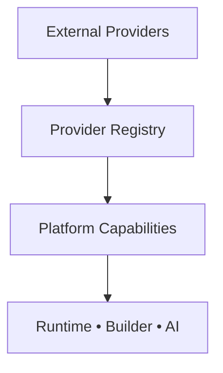
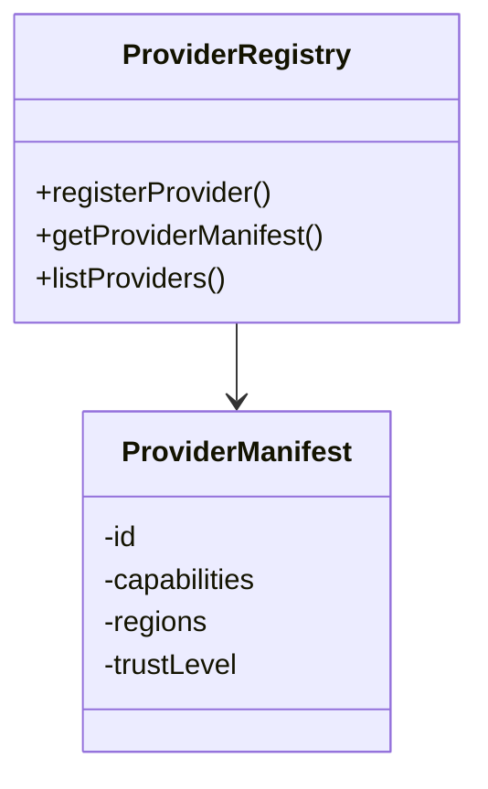
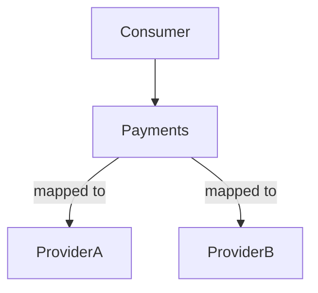
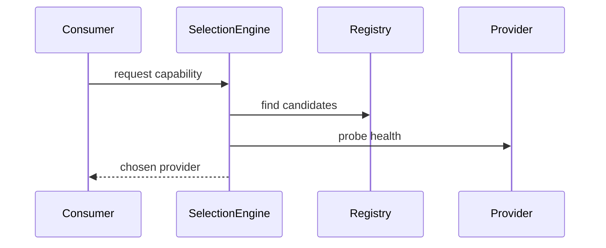
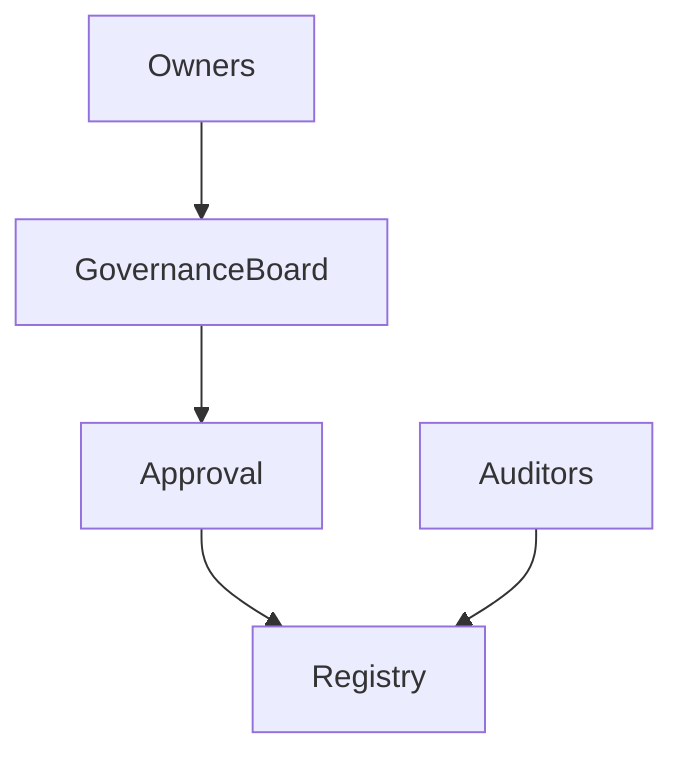
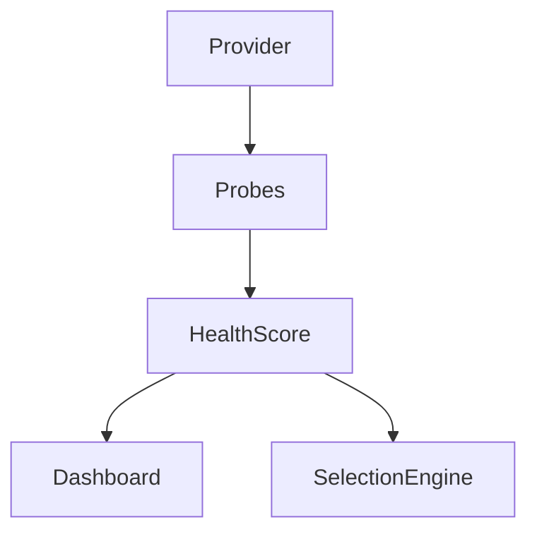
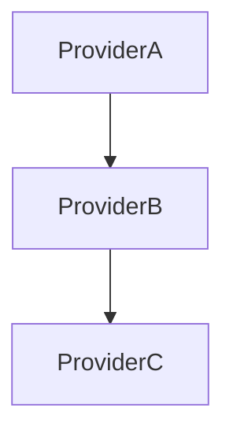
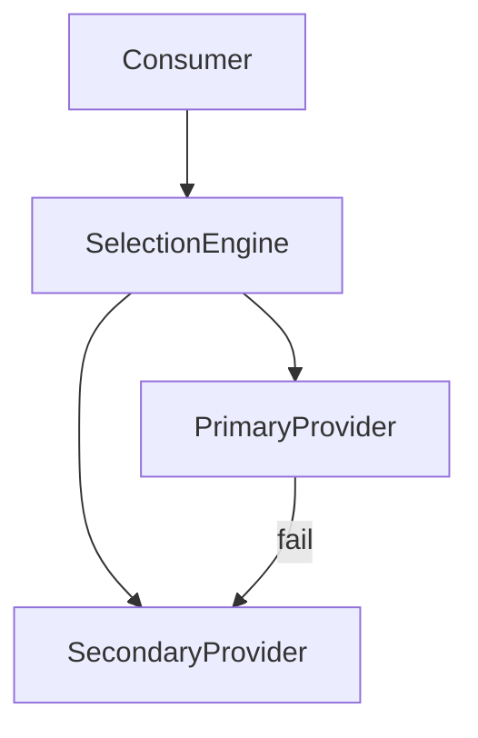
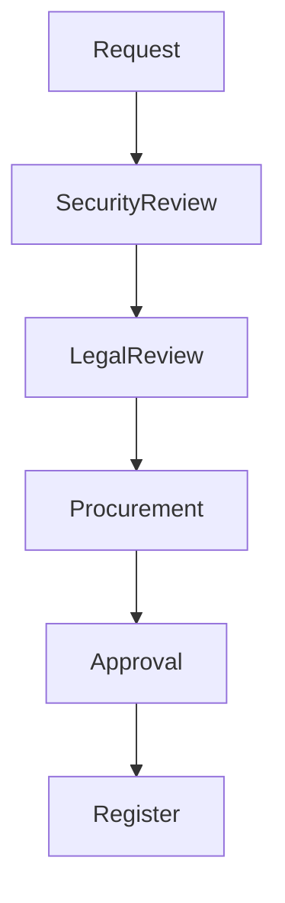

# KB-101 — External Provider Management Architecture

## Executive Summary

External Provider Management treats third-party providers as governed platform resources. The architecture defines provider onboarding, classification, capability mapping, lifecycle, governance, health monitoring, SLAs, failover strategies and replacement, ensuring provider independence, portability, resilience, security, and compliance.

## Purpose

Establish the enterprise architecture for managing external providers (SaaS, AI, payments, communications, identity, logistics, enterprise systems, government services, cloud services and partners) so platform consumers depend on capabilities, not provider specifics.

## Scope

Covers provider registry, classification, onboarding, approval, contracts, trust levels, health, SLAs, ownership, lifecycle, deprecation, retirement, failover, multi-provider abstraction, policy enforcement, regional management, tenant availability, metadata, compliance classification, and ownership.

Excludes implementation details for API Gateway, Secrets, Identity Federation, and connector internals (covered elsewhere).

## Architectural Principles

- Provider independence and capability abstraction
- No vendor lock-in; prefer portable integrations
- Standard provider contracts and capability-first integration
- Security by default and Zero Trust boundaries
- Regional awareness and data residency respect
- Multi-provider redundancy and active failover strategies
- Governance-first lifecycle and certification
- Observable provider health and SLA telemetry
- Clear separation of provider metadata from runtime usage

## Canonical Definitions

- External Provider: third-party system offering capabilities to the platform.
- Provider Registry: authoritative inventory of providers and instances.
- Provider Capability: named feature (e.g., payments, SMS, AI inference).
- Provider Contract: canonical agreement describing interface, limits and SLAs.
- Provider Class/Category: classification by domain, criticality, compliance.
- Provider Instance: configured connection to a specific provider account/region.
- Provider Policy: rules governing use, region, tenancy, and data handling.
- Provider Owner: business and operational steward for the provider.
- Trust Level: classification indicating assurance and allowed uses (e.g., certified, partner, unverified).
- Preferred/Backup/Active/Deprecated/Retired Provider: lifecycle states.

## High-level Architecture

- Provider Registry (catalog): store provider manifests, capabilities, trust levels, metadata, owners, and lifecycle state.
- Capability Abstraction Layer: exposes platform capabilities mapped to provider adapters/connectors.
- Provider Selection Engine: chooses providers per policy, tenant, region, cost and health.
- Multi-Provider Orchestration: active/standby and active/active patterns, failover rules, and composition.
- Provider Health & Observability: health scoring, SLA monitoring, incident tracking and dashboards.
- Governance & Certification: review, legal, security, procurement and compliance gates.
- Contract & SLA Management: track contractual obligations, renewal, and deprecation timelines.
- Provider Lifecycle Manager: onboarding, versioning, testing, deprecation, retirement and replacement workflows.

## Provider Registry

- Manifest model: identity, capabilities, endpoints, supported contracts, regions, data residency, compliance class, owner, contact, trust level, versions, and dependencies.
- Ownership: business owner, operational owner, legal/procurement references.
- Discovery: APIs for capability mapping, authoring, and runtime lookups (service discovery integration).
- Versioning & Compatibility: manifest versions and upgrade path metadata.

## Provider Classification

Classify providers by:
- Business domain (payments, messaging, AI, storage, identity)
- Geography and residency
- Criticality (core, optional)
- Compliance profile (e.g., PCI, GDPR, HIPAA)
- Trust level (certified, partner, community)
- Operational tier (primary, secondary, backup)

Classification informs allowed use-cases, tenant availability, and selection policies.

## Capability Mapping

- Capability-first approach: map provider capabilities to platform capability names and canonical contracts.
- Contract adapters: connectors translate provider-specific semantics to canonical contracts.
- Capability metadata: supported features, limits, cost profile, latency profile, and recommended usage patterns.

## Provider Abstraction & Selection

- Applications bind to platform capabilities, not providers.
- Selection engine evaluates policies, tenant constraints, region, performance, cost, compliance, trust and health to choose provider instance(s).
- Policy layer enforces allowed providers per tenant or capability.
- Selection results provide routing hints or connector instance identifiers for execution.

## Multi-Provider Strategy

Support patterns:
- Primary/Secondary: primary provider with automatic failover to secondary.
- Active-Active: parallel calls with reconciliation strategies for idempotency.
- Active-Passive: warm standby with periodic sync.
- Fan-out & Aggregate: parallelize across providers and aggregate results when required.

Policies define which strategy applies to each capability and tenant.

## Provider Health Architecture

- Health probes and synthetic transactions per provider instance.
- Health scoring combining latency, error rates, and SLA adherence.
- Incident classification: degraded, outage, SLA breach.
- Automated reactions: failover triggers, throttling, circuit breakers and owner notifications.

## Provider Dependency Architecture

- Model provider-to-provider and provider-to-platform dependencies in registry.
- Detect cycles and risky coupling during onboarding and manifest validation.
- Dependency mapping used by impact analysis and change management.

## Lifecycle

Discovery
 → Evaluation (tech, security, legal, risk)
 → Approval (procurement, legal, security)
 → Registration (manifest & onboarding)
 → Integration Authorization (secrets, contracts, connectors)
 → Operational Use (monitoring & SLAs)
 → Version Updates (manifest/contract changes)
 → SLA Review & Renewal
 → Deprecation (notify consumers, block new usage)
 → Retirement (replace and archive)
 → Archive (retain manifests, contracts, audit trail)

Onboarding must include risk assessment, compliance checks, and connector certification.

## Governance

- Governance board: architecture, security, procurement, legal and product representation approve providers.
- Certification requirements for high-risk domains (payments, identity, AI, PII).
- Policy enforcement through KB-098 and Secrets platform KB-099.
- Periodic review cycles and re-certification workflows.
- Contract and SLA recording with renewal reminders in Registry.

## Responsibilities

- Enterprise Architecture: policy, standards, capability definitions.
- Platform Engineering: connectors, selection engine, registry operations.
- Security: risk assessment, certs, continuous validation.
- Compliance & Legal: contract, privacy and regulatory approvals.
- Procurement: commercial agreements and vendor management.
- Product Teams: define required capabilities and acceptance.
- Operations: health monitoring, failover ops and incident response.
- Provider Owners: stewardship, point-of-contact and lifecycle decisions.
- Tenant Administrators: local provider preferences and allowed lists within governance bounds.

## Security

- Trust boundaries and least privilege for provider access.
- Provider authentication models recorded in manifests; secrets held by KB-099.
- Network segmentation, mTLS, and connector isolation by tenancy when required.
- Continuous validation of provider posture and certificate lifecycles.
- Revocation workflows for compromised providers.

## Privacy

- Data residency and processing agreements required for providers handling personal data.
- Provider manifests include data processing classification and contractual constraints.
- Policy-driven filtering or masking when routing data to providers.
- Tenant-specific residency rules and consent enforcement.

## Performance

- Provider selection favors low-latency and compliant providers per region.
- Failover latency budgets defined per capability and reflected in selection policies.
- Capacity planning and provider throttling harmonized with platform quotas.
- Multi-provider load distribution strategies for scalability.

## Observability

- Provider dashboards showing availability, latency, error rates and SLA compliance.
- Per-tenant provider usage metrics, cost signals and anomaly detection.
- Audit trails for onboarding, approval, configuration changes and failover events.
- Dependency maps and lineage for incident response.

## Failure Scenarios

- Provider outage: automatic failover, degrade or queue depending on capability and policy.
- Regional provider outage: route to alternate regional provider respecting residency.
- SLA breach: remediation, owner escalation and potential temporary decommissioning.
- Provider compromise: revoke credentials, circuit-breaker, and forensic audit.
- Contract termination: deprecate provider and migrate tenants to alternatives.
- Data residency conflict: block routing and trigger legal/procurement workflows.
- Provider API breaking change: detect via contract versioning and block until remediated.

## Anti-patterns

- Hardcoding providers in applications
- Single-provider reliance for critical capabilities
- Embedding provider-specific logic in platform services
- Manual provider lifecycle tracking outside Registry
- Direct tenant-to-provider connections that bypass policy and secrets management

## Future Evolution

- Autonomous provider selection and AI-assisted optimization
- Dynamic provider marketplaces with programmatic procurement
- Cross-cloud and multi-region provider federation
- Policy-driven provider choreography and automated migration
- Predictive provider risk scoring and proactive failover

## Cross References

- KB-094 Integration Platform Architecture
- KB-095 Integration Connector Architecture
- KB-096 API Gateway Architecture
- KB-097 Webhook Architecture
- KB-098 Integration Policy Architecture
- KB-099 Secrets & Credential Management Architecture
- KB-100 Service Discovery Architecture
- KB-102 Identity Federation Architecture
- KB-104 API Management Architecture
- KB-105 Integration Observability Architecture
- KB-106 Integration Lifecycle Architecture

## Mermaid Diagrams

1. External Provider Ecosystem

2. Provider Registry Architecture

3. Provider Lifecycle

4. Capability Mapping

5. Multi-Provider Selection Flow

6. Provider Governance Model

7. Provider Health Monitoring

8. Provider Dependency Map

9. Failover Architecture

10. Provider Approval Workflow

## Acceptance Criteria

- Enterprise provider architecture and lifecycle defined.
- Vendor independent, multi-tenant, and supports unlimited providers.
- Capability-first abstraction and provider selection policies.
- Governance, security, privacy and observability built-in.
- All required Mermaid diagrams included and conceptual.
- No implementation guidance included.

## Completion

- KB-101 marked Completed (Approved Architecture).
- Progress Registry updated to reflect completion and KB-102 queued.
- All cross-references recorded.

## Critical Rule

> No DUKADESK application, service, runtime, or tenant workload shall depend directly on a specific external provider. All interactions must occur via governed platform capabilities.

<!-- End of KB-101 -->
