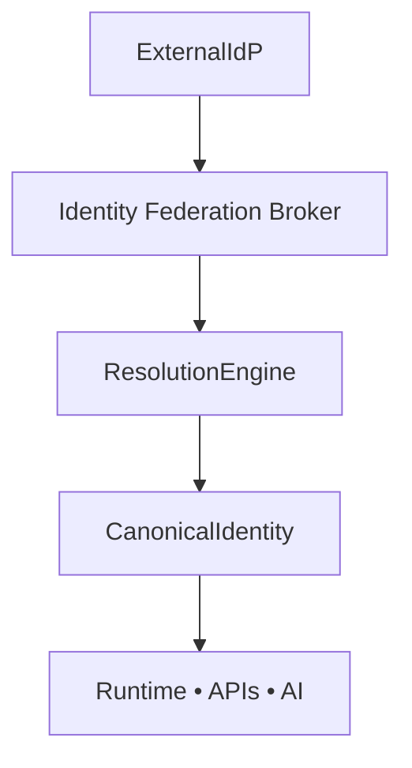
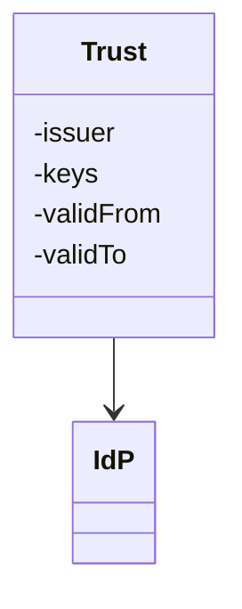
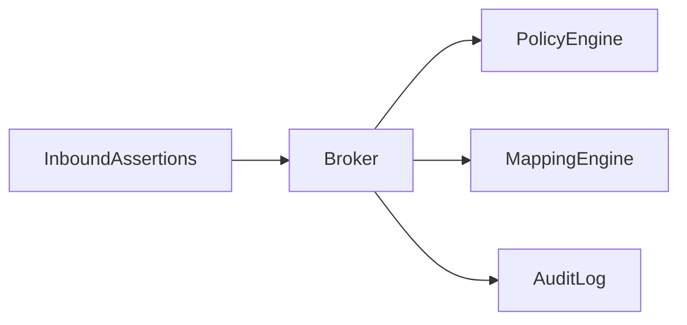
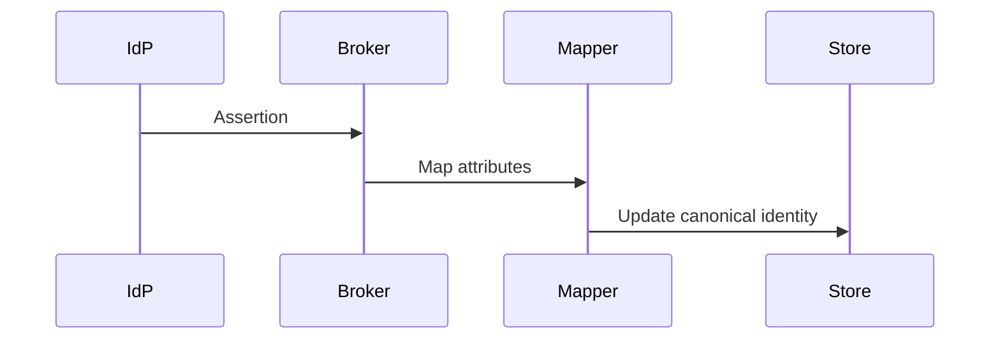
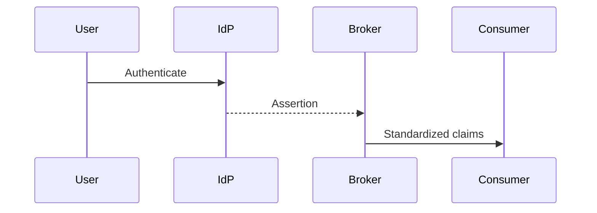
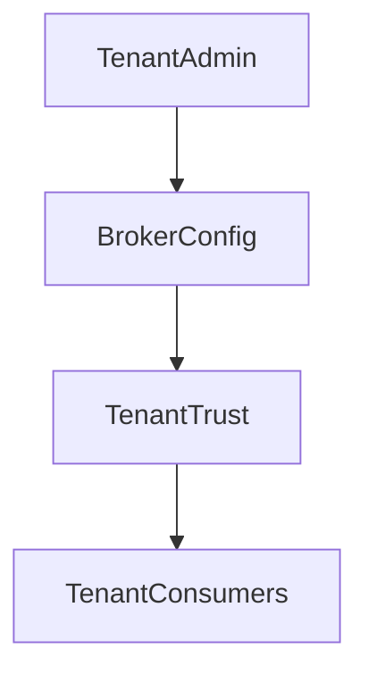
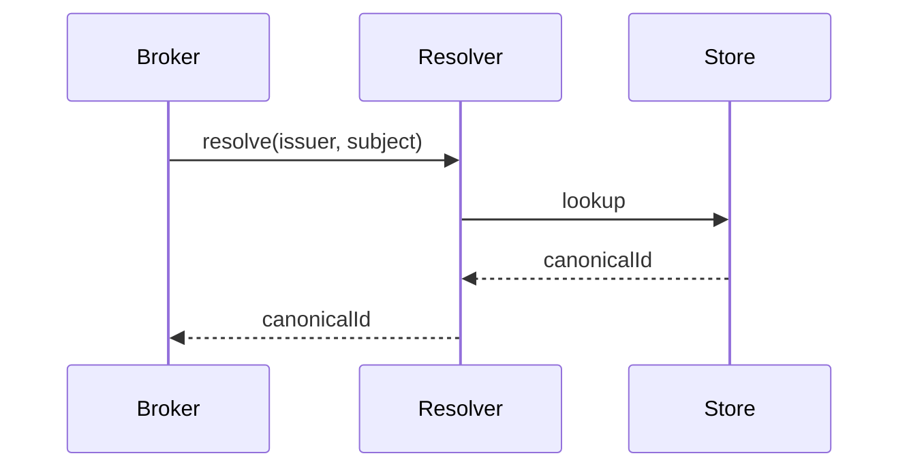
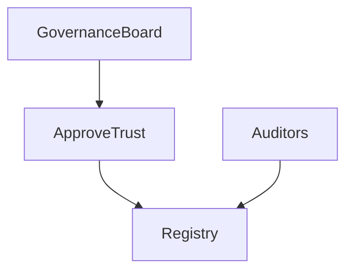
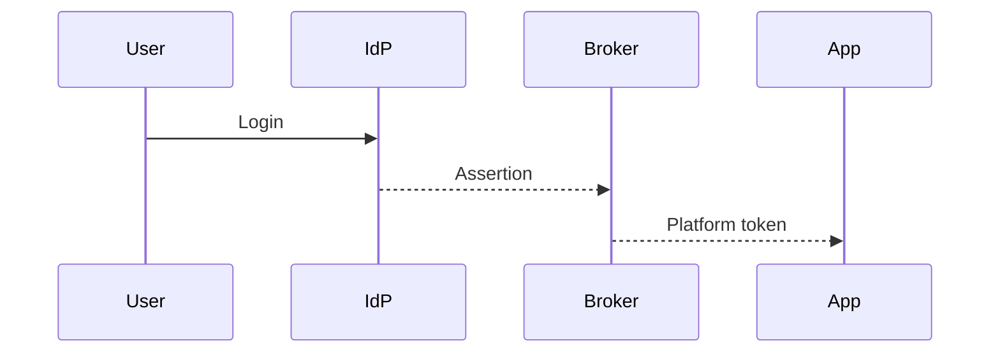

# KB-102 — Identity Federation Architecture (Approved Architecture)

## Executive Summary

Identity Federation enables DUKADESK to establish governed trust relationships with external Identity Providers (IdPs) while maintaining a canonical internal identity model. The architecture supports workforce, customer, partner, service, and future decentralized identities, enforcing Zero Trust, tenant isolation, policy-driven mapping, and consistent authorization across the platform.

## Purpose

Specify the enterprise architecture for federating external identities into a canonical internal identity representation. Ensure trust, provenance, attribute mapping, assurance levels, lifecycle governance, and auditability without coupling to any identity technology or vendor.

## Scope

Covers federation models, trust relationships, federation brokers, identity mapping and linking, claims and attribute translation, tenant federation modes, service identity federation, identity synchronization, policies, lifecycle, governance, and observability. Excludes protocol implementation, session internals, secrets storage, and gateway internals.

## Architectural Principles

- Zero Trust by default
- Identity abstraction: consume identities via canonical model, not provider-specific tokens
- Federation without duplication: avoid copying authoritative data unless necessary
- Least privilege and purpose-limited attribute release
- Tenant isolation and explicit consent
- Provider independence and pluggable trust brokers
- Claims-based architecture and machine-readable manifests
- Policy-driven federation and continuous verification
- Auditable, versioned trust metadata
- Scalable and resilient federation fabric

## Canonical Definitions

- Identity Federation — governed trust relationships enabling external identities to be recognized inside the platform.
- Identity Provider (IdP) — external authority issuing authentication assertions/claims.
- Relying Party — platform component consuming federated identities.
- Trust Relationship — configured, signed agreement describing trust anchors and metadata.
- Federation Broker — logical mediator that normalizes external protocols, enforces policies, and maps attributes.
- Canonical Identity — internal, provider-agnostic identity record used for authorization and audit.
- Identity Mapping — rules that translate external claims into canonical attributes.
- Identity Linking — associating multiple external identities to one canonical identity.
- Claims — assertions about an identity (attributes, roles, assurance level).
- Identity Assurance Level — classification of identity confidence (LOA) used in policy decisions.
- Authentication Context — metadata about how identity was authenticated.

## Federation Model

- Brokered Federation: Federation Broker mediates between IdPs and platform consumers, handling protocol translation, policy enforcement, attribute mapping and trust decisions.
- Direct Trust (service-level): where a tenant or platform establishes explicit trust with an IdP and delegates authentication to that IdP while Broker mediates metadata and policy.
- Hybrid: Broker supports both platform-level and tenant-managed trusts with clear separation and governance.

## Canonical Identity Model

- Canonical identity is an immutable, minimal record containing stable identifiers, canonical attributes, provenance records, linkage references to external identities, and a list of assertions with timestamps.
- Identity records are not authoritative copies of IdP data; they store derived attributes and references with provenance and validity windows.
- Separation of authentication (proof of control) from authorization attributes and roles.

## Identity Mapping & Linking

- Attribute Mapping: declarative mapping manifests define how external claim keys map to canonical attributes, including transformations, normalization, and defaulting.
- Linking: identity linking workflows reconcile multiple external identities to a single canonical identity using deterministic and probabilistic matching with steward approval for ambiguous cases.
- Conflict resolution: explicit policies define precedence (owner-approved, highest assurance, most-recent) and require manual review when automatic resolution is unsafe.

## Claims Architecture

- Standardized set of canonical claims and an extensible schema for additional attributes.
- Claims include provenance, assurance level, timestamp, source IdP, and consent references.
- Claims release policies control which claims are included in assertions to consumers, per tenant, per purpose.

## Trust Relationships

- Trust metadata records: issuer keys, signing algorithms, trust anchors, endpoints, supported claims, and validity windows.
- Trust lifecycle: establishment (requirements/validation), renewal (automated or manual), revocation, and expiration monitoring.
- Trust validation: continuous verification of IdP certificates, metadata signatures, and periodic reassessment.

## Federation Broker

- Broker responsibilities: authenticate inbound assertions, normalize protocols (SAML/OIDC/SCIM/other), enforce attribute release policies, perform attribute mapping, create canonical identity references, and emit standardized platform tokens or session claims.
- Broker integrates with Policy Platform (KB-098) for evaluation and with Secrets Platform (KB-099) for credential handling.
- Broker produces audit records with explainability metadata linking decisions to policies and trust anchors.

## Tenant Federation Modes

- Platform-controlled federation: platform establishes IdP trust and enforces global policies and mappings.
- Tenant-managed federation: tenant registers IdPs via governed workflow; platform enforces baseline security and policy constraints.
- Shared federation: for partner tenants with controlled cross-tenant agreements and explicit governance.

## Identity Resolution

- Resolution engine maps incoming external identity (issuer + subject) to canonical identity using linkage tables and matching indexes.
- Support for as-of resolution: returning canonical view as of a timestamp, with provenance for historical auditing.
- Soft-links: ephemeral associations that can be promoted to persistent links upon verification.

## Service Identity Federation

- Machine/service identities are federated differently: rely on mutual TLS, signed assertions or short-lived tokens issued by trusted authorities; canonical service identities are recorded in registry with ownership and lifecycle metadata.

## Federation Policies

- Policies govern allowed IdPs, minimum assurance levels, attribute consent rules, residency constraints, claim release, and tenant scoping.
- Policy decisions emitted by KB-098 determine mapping behavior, attribute filtering, and authorization context propagation.

## Lifecycle

IdP Evaluation
 ↓
Trust Establishment (metadata exchange & validation)
 ↓
Configuration (attribute mappings, policies)
 ↓
Onboarding (test assertions, SCIM sync if enabled)
 ↓
Operational Use (continuous validation & monitoring)
 ↓
Trust Renewal & Review
 ↓
Deprecation & Revocation
 ↓
Retirement & Archive

## Governance

- Governance board approves high-assurance IdPs and tenant-managed federation plans.
- Periodic audits of trust anchors, mapping rules, and attribute usage.
- Change management for mapping and policy updates with simulation before publishing.

## Responsibilities

- Enterprise Architecture: canonical models, policy requirements, assurance levels.
- Identity Governance: trust approvals, mapping stewardship, audits.
- Security: continuous trust validation, compromise response.
- Platform Engineering: Broker, resolution engine, and observability.
- Tenant Administrators: manage tenant-specific trusts within governance boundaries.
- Provider Owners: manage IdP metadata and contractual obligations.

## Security

- Trust boundaries, signed metadata, certificate lifecycle management, and key rollover policies.
- Continuous verification of IdP signatures and issuer metadata.
- Anti-spoofing: audience restriction, replay protection, nonce/timestamp checks.
- Principle of least privilege for attributes: only required claims released.
- Immediate revocation/containment on compromise.

## Privacy

- Attribute minimization and purpose-limited release based on consent.
- Data residency and cross-border considerations enforced via policy.
- Right-to-be-forgotten handling: canonical model records references; policies determine when linkage or derived attributes are removed or anonymized consistent with legal obligations.

## Performance

- Designed for high scale: broker and resolution engines horizontally scalable.
- Authentication latency optimizations: token caching, short-lived validation caches, and async reconciliation where safe.
- Resilience: multi-region broker deployments and failover for high availability.

## Observability

- Federation metrics: auth successes/failures, mapping rates, link operations, attribute release counts, latency, and assurance-level distributions.
- Trust health: IdP metadata validity, signature expirations, and revocation events.
- Audit trails for trust establishment, mapping changes and identity linking.

## Failure Scenarios

- IdP outage: fall back to alternate IdP or deny per policy; notify tenants.
- Trust revocation: immediate session invalidation and re-authentication paths.
- Claims validation failure: reject authentication and surface clear diagnostics.
- Identity duplication: detect via resolution engine and surface reconciliation workflows.
- Mapping misconfiguration: block publish and require manual remediation.
- Compromised IdP keys: rotate trust anchors and force re-validation.

## Anti-patterns

- Hardcoding provider-specific claims in business logic
- Blindly trusting external attributes without policy checks
- Duplication of identity stores across services
- Manual, ungoverned identity linking
- Broad attribute release without consent

## Future Evolution

- Verifiable credentials and decentralized identity support
- AI-assisted identity risk scoring and continuous assurance
- Adaptive trust models based on behavior and risk signals
- Cross-cloud federation and automated trust negotiation

## Cross References

- KB-094 Integration Platform Architecture
- KB-096 API Gateway Architecture
- KB-098 Integration Policy Architecture
- KB-099 Secrets & Credential Management Architecture
- KB-100 Service Discovery Architecture
- KB-101 External Provider Management Architecture
- KB-103 Enterprise Connectivity Architecture
- KB-104 API Management Architecture

## Mermaid Diagrams

1. Identity Federation Architecture

2. Trust Relationship Model

3. Federation Broker Architecture

4. Canonical Identity Mapping

5. Claims & Attribute Flow

6. Tenant Federation Architecture

7. Identity Resolution Process

8. Federation Lifecycle

9. Trust Governance Model

10. Federated Identity Sequence Diagram

## Acceptance Criteria

- Architecture-only; vendor and protocol independent.
- Supports multi-tenant federation and canonical identity model.
- Defines trust governance, lifecycle, mapping, and observability.
- Includes required Mermaid diagrams and cross-references.
- Ready for Knowledge Base inclusion as Approved Architecture.

## Completion

- KB-102 marked Completed (Approved Architecture).
- Progress Registry updated to reflect completion and KB-103 queued.

## Critical Rule

> All external identities shall be federated through governed trust relationships into a canonical DUKADESK identity model.

No platform component may rely directly on provider-specific identity representations.

<!-- End of KB-102 -->
