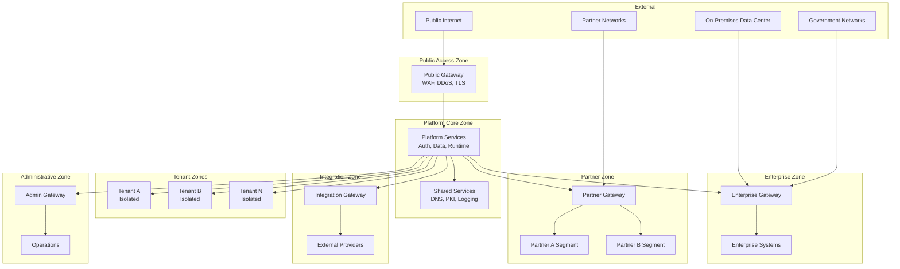
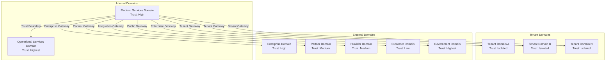
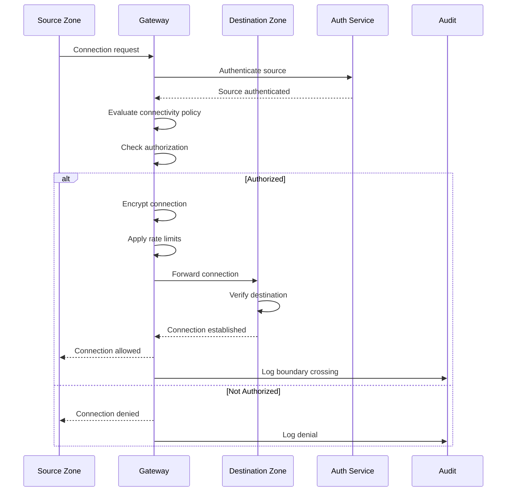
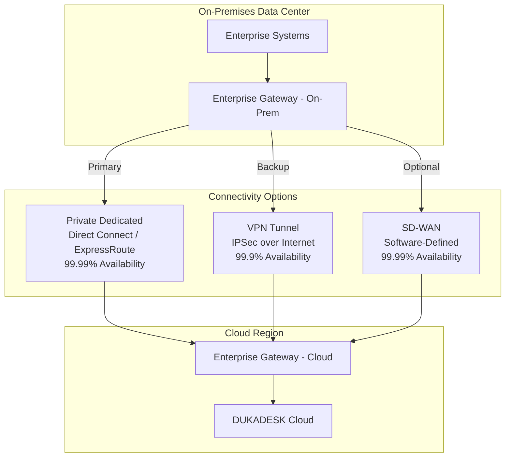
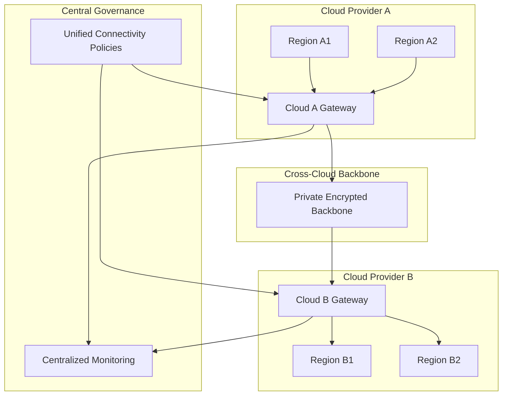
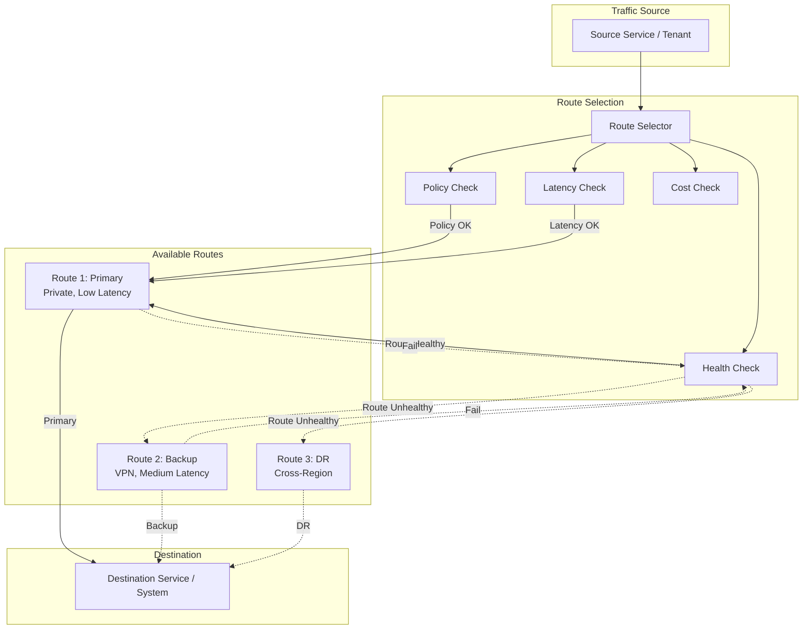
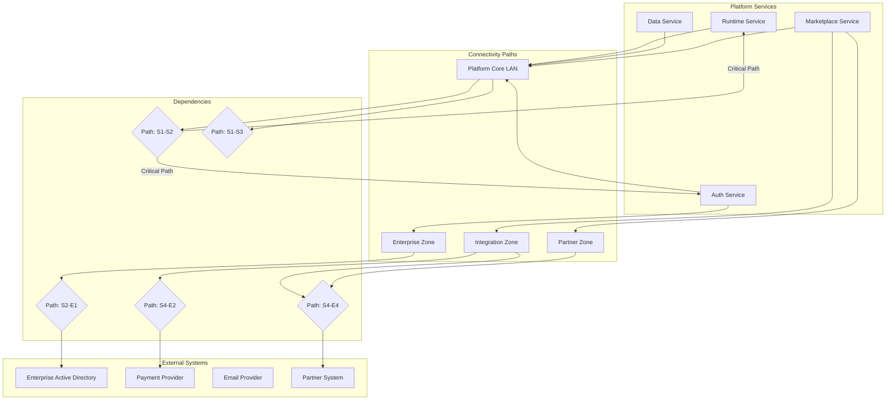
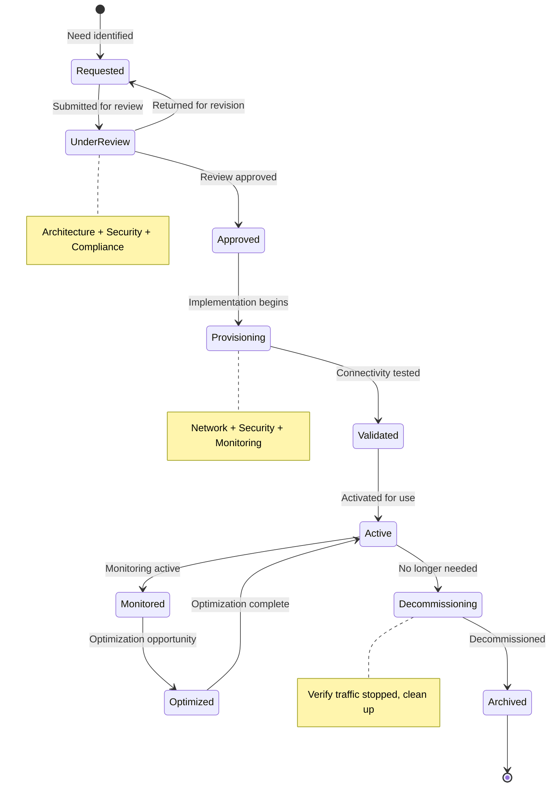
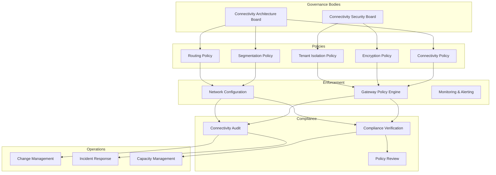

# Enterprise Connectivity Architecture

**KB-103 — Enterprise Connectivity Architecture Specification**

| Metadata | |
|----------|---|
| **KB ID** | KB-103 |
| **Title** | Enterprise Connectivity Architecture |
| **Version** | 0.1.0 |
| **Status** | Draft |
| **Owner** | Architecture Team |
| **Suite** | Platform Integration Architecture |
| **Dependencies** | KB-094 Integration Platform Architecture, KB-096 API Gateway Architecture, KB-098 Integration Policy Architecture, KB-099 Secrets & Credential Management Architecture, KB-100 Service Discovery Architecture, KB-101 External Provider Management Architecture, KB-102 Identity Federation Architecture |
| **Related Documents** | KB-057 Runtime Security Architecture, KB-077 Event & Messaging Architecture, KB-095 Integration Connector Architecture, KB-097 Webhook Architecture, KB-104 API Management Architecture, KB-105 Integration Observability Architecture, KB-106 Integration Lifecycle Architecture |
| **Review Status** | Pending |
| **Last Updated** | 2026-07-11 |

---

### Revision History

| Version | Date | Author | Change |
|---------|------|--------|--------|
| 0.1.0 | 2026-07-11 | AI Architecture Agent | Initial draft |

---

## 1. Executive Summary

### 1.1 Purpose

This document defines the Enterprise Connectivity Architecture for the DUKADESK Platform. Enterprise Connectivity is the architectural foundation for securely interconnecting platform services, tenant environments, enterprise systems, partner ecosystems, cloud environments, and external networks.

All enterprise connectivity within DUKADESK is governed through policy-defined trust boundaries and Zero Trust principles. No application, service, tenant, or external system establishes unmanaged or implicit connectivity. Every communication path is authorized, authenticated, encrypted, monitored, and governed to ensure secure, resilient, auditable, and vendor-independent communication across the entire platform.

This document establishes a unified connectivity architecture supporting cloud, hybrid, on-premises, partner, government, customer, and multi-cloud environments through secure, policy-driven, and highly available connectivity models.

This document defines architecture only. It is network-vendor-independent, cloud-provider-independent, and implementation-independent.

### 1.2 Scope

**In scope:**

- Enterprise Connectivity Model: Logical connectivity architecture for the entire DUKADESK ecosystem
- Connectivity Domains: Platform services, tenants, enterprise systems, external providers, partners, customers, government systems, operational services
- Trust Boundaries: Architectural trust separation between all connectivity domains
- Connectivity Zones: Platform Core, Shared Services, Tenant Zones, Integration Zone, Partner Zone, Enterprise Zone, Public Access Zone, Administrative Zone
- Hybrid Connectivity: Cloud-to-on-premises communication
- Multi-Cloud Connectivity: Cross-cloud communication without vendor coupling
- Partner Connectivity: Governed connectivity for business partners and third-party organizations
- Connectivity Routing: Policy-based routing, prioritization, controlled communication paths
- Connectivity Resilience: Redundant paths, automatic rerouting, regional failover, DR connectivity
- Connectivity Policies: Authorization, segmentation, encryption, routing policies
- Connectivity Lifecycle: Request, provision, operate, decommission
- Connectivity Observability: Metrics, health, tracing, dashboards

**Out of scope:**
- Network implementation (physical or virtual networking)
- API Gateway implementation (covered by KB-096, KB-104)
- Service mesh implementation
- Service discovery implementation (covered by KB-100)
- Infrastructure provisioning
- Physical networking

---

## 2. Architectural Principles

### 2.1 Zero Trust Networking

No connectivity is implicitly trusted. Every communication request is authenticated, authorized, and encrypted regardless of source or destination. Trust is never assumed based on network location — it must be continuously verified.

### 2.2 Policy-Driven Connectivity

All connectivity is governed by policies. Policies define who can communicate with whom, over what paths, with what encryption, and under what conditions. Policies are centrally defined and enforced at every connectivity point.

### 2.3 Least Privilege Connectivity

Connectivity is granted on a least-privilege basis. Services, tenants, and external systems receive only the connectivity they explicitly require. Default-deny applies to all communication paths. Connectivity is periodically reviewed and revoked when no longer needed.

### 2.4 Segmentation by Design

The connectivity architecture is segmented by design. Trust boundaries, connectivity zones, and network segments isolate different trust levels. Segmentation prevents lateral movement and contains security incidents.

### 2.5 Secure-by-Default Communication

All communication is encrypted and authenticated by default. No unencrypted communication paths exist. Mutual TLS or equivalent authentication is required for all service-to-service communication.

### 2.6 Vendor Independence

Connectivity architecture is vendor-independent. No single network vendor, cloud provider, or technology is required. The architecture supports multiple vendors and providers through abstracted connectivity models.

### 2.7 Cloud Neutrality

Connectivity architecture is cloud-neutral. The same connectivity model applies across any cloud provider or on-premises environment. Cloud-specific implementations are abstracted behind standard connectivity interfaces.

### 2.8 Enterprise Resilience

Connectivity is resilient at all levels. Redundant paths, automatic failover, regional diversity, and disaster recovery connectivity ensure that communication continues despite failures.

### 2.9 Multi-Region Readiness

Connectivity architecture supports multi-region deployment from day one. Cross-region communication, regional isolation, and global connectivity are architectural primitives.

### 2.10 Multi-Tenant Isolation

Tenant connectivity is strictly isolated. Communication between tenants is blocked by default and requires explicit authorization. Tenant connectivity paths are independent and non-intersecting.

### 2.11 High Availability

Connectivity paths are highly available. No single point of failure exists in the connectivity architecture. Failover is automatic and transparent to connected systems.

### 2.12 Defense in Depth

Multiple layers of security protect connectivity. Network segmentation, encryption, authentication, authorization, monitoring, and auditing provide overlapping protections.

---

## 3. Canonical Definitions

### 3.1 Enterprise Connectivity

The architectural capability that enables secure, governed communication between all components of the DUKADESK ecosystem — platform services, tenants, enterprise systems, partners, customers, and external networks. Enterprise connectivity encompasses all communication paths, policies, trust boundaries, and resilience mechanisms.

### 3.2 Connectivity Domain

A logical grouping of systems, services, or environments that share connectivity characteristics and trust requirements. Domains provide the basis for connectivity policy, segmentation, and isolation.

### 3.3 Connectivity Zone

A logical network segment with defined trust level, access policies, and security controls. Zones provide segmentation and isolation between different trust levels.

### 3.4 Trust Boundary

An architectural boundary between connectivity domains or zones that enforces security controls. Trust boundaries are points where authentication, authorization, encryption, and monitoring are enforced.

### 3.5 Connectivity Policy

A formal rule governing communication between connectivity domains or zones. Policies define allowed source/destination pairs, required encryption, authentication methods, and routing constraints.

### 3.6 Secure Channel

An encrypted, authenticated communication path between two endpoints. Secure channels provide confidentiality, integrity, and authentication for all traffic.

### 3.7 Connectivity Endpoint

A network-accessible point where connectivity is established. Endpoints include services, APIs, gateways, connectors, and external system interfaces.

### 3.8 Private Connectivity

Communication over private network paths that do not traverse the public internet. Private connectivity provides lower latency, higher bandwidth, and reduced exposure.

### 3.9 Public Connectivity

Communication over public network paths (internet). Public connectivity is encrypted and authenticated but has higher latency and exposure.

### 3.10 Hybrid Connectivity

Communication between cloud and on-premises environments. Hybrid connectivity bridges private data centers with cloud platforms through secure, dedicated paths.

### 3.11 Multi-Cloud Connectivity

Communication across multiple cloud provider environments. Multi-cloud connectivity enables workload distribution, redundancy, and provider independence.

### 3.12 Partner Connectivity

Communication between DUKADESK and external partner organizations. Partner connectivity is governed by agreements, policies, and security controls.

### 3.13 Tenant Connectivity

Communication within and between tenant environments. Tenant connectivity is strictly isolated from other tenants.

### 3.14 Connectivity Route

A defined path between connectivity endpoints. Routes may be static or dynamic, primary or backup, direct or through intermediate gateways.

### 3.15 Connectivity Gateway

A managed entry/exit point for a connectivity domain or zone. Gateways enforce policies, perform protocol translation, and provide security controls.

### 3.16 Connectivity Segment

A subdivision of a connectivity zone that provides finer-grained isolation. Segments limit blast radius and enable targeted policy enforcement.

### 3.17 Connectivity Dependency

A relationship where one connectivity path depends on another. Dependencies must be understood for resilience planning and impact analysis.

### 3.18 Connectivity Health

A measure of connectivity path availability, latency, throughput, and error rate. Health is monitored and used for alerting and failover decisions.

### 3.19 Connectivity Lifecycle

The complete lifespan of a connectivity path from request through provisioning, operation, optimization, decommissioning, and archival.

### 3.20 Connectivity Owner

The enterprise role accountable for a connectivity domain, zone, or path. The owner governs policies, health, lifecycle, and compliance.

---

## 4. Enterprise Connectivity Model

### 4.1 Logical Architecture

The Enterprise Connectivity Architecture follows a hub-and-spoke model with policy-enforced gateways at all trust boundaries:

```
                    +-------------------------+
                    |    Public Internet      |
                    +-----------+-------------+
                                |
                    +-----------v-------------+
                    |   Public Access Zone    |
                    | (External-facing GW)    |
                    +-----------+-------------+
                                |
            +-------------------+-------------------+
            |                   |                   |
    +-------v-------+   +-------v-------+   +-------v-------+
    | Platform Core |   | Integration   |   | Administrative |
    | Zone          |   | Zone          |   | Zone          |
    | (Services,    |   | (Connectors,  |   | (Management,  |
    |  Data, Auth)  |   |  Providers)   |   |  Operations)  |
    +-------+-------+   +-------+-------+   +-------+-------+
            |                   |                   |
            +-------------------+-------------------+
                                |
                    +-----------v-------------+
                    |   Shared Services Zone  |
                    | (Common Infrastructure) |
                    +-----------+-------------+
                                |
            +-------------------+-------------------+
            |                   |                   |
    +-------v-------+   +-------v-------+   +-------v-------+
    | Tenant Zones  |   | Partner Zone  |   | Enterprise    |
    | (Isolated     |   | (Partner      |   | Zone          |
    |  per Tenant)  |   |  Connectivity)|   | (On-Prem,     |
    +---------------+   +---------------+   |  Corp Network)|
                                            +---------------+
```

### 4.2 Connectivity Layers

| Layer | Scope | Trust Level | Security | Latency |
|-------|-------|-------------|----------|---------|
| Layer 0: Public Internet | External users, unauthenticated traffic | Untrusted | WAF, DDoS, TLS | Highest |
| Layer 1: Public Access Zone | Authenticated external traffic | Low | Auth, encryption, rate limiting | High |
| Layer 2: Platform Core | Internal platform services | High | Mutual TLS, service auth | Low |
| Layer 3: Integration Zone | External integrations | Medium | Auth, encryption, policies | Medium |
| Layer 4: Tenant Zones | Tenant workloads | Isolated per tenant | Tenant isolation, encryption | Low |
| Layer 5: Partner Zone | Partner communication | Medium | Partner auth, encryption | Medium |
| Layer 6: Enterprise Zone | Corporate network, on-premises | High | Private connectivity, encryption | Low |
| Layer 7: Administrative Zone | Management, operations | Highest | Strict auth, auditing | Low |

### 4.3 Connectivity Gateways

Gateways are the enforcement points at all trust boundaries:

- **Public Gateway**: Internet-facing entry point with WAF, DDoS protection, TLS termination, rate limiting
- **Integration Gateway**: Provider-facing entry point with mutual authentication, protocol transformation, policy enforcement
- **Tenant Gateway**: Tenant isolation enforcement point with tenant-aware routing, rate limiting, isolation verification
- **Partner Gateway**: Partner-facing entry point with partner authentication, SLA enforcement, traffic shaping
- **Enterprise Gateway**: On-premises connectivity endpoint with private network integration, encryption, failover
- **Administrative Gateway**: Management access enforcement with strict authentication, session recording, audit

---

## 5. Connectivity Domains

### 5.1 Domain Model

Connectivity domains define the logical scope of communication:

| Domain | Description | Trust Level | Examples |
|--------|-------------|-------------|----------|
| Platform Services | Internal DUKADESK services | High | Runtime, Auth, Data, Builder |
| Tenants | Tenant-specific environments | Isolated | Tenant workspaces, data, config |
| Enterprise Systems | Customer enterprise environments | High | On-premises, corporate network |
| External Providers | Third-party service providers | Medium | Cloud providers, SaaS, APIs |
| Partners | Business partner systems | Medium | Integration partners, resellers |
| Customers | End-user access | Low | Browser, mobile app |
| Government | Government-regulated environments | Highest | Sovereign clouds, regulated regions |
| Operational Services | Platform operations | Highest | Monitoring, deployment, security |

### 5.2 Platform Services Domain

Internal DUKADESK platform services communicate within the Platform Core Zone. All service-to-service communication uses mutual TLS and service identity authentication.

**Connectivity characteristics:**
- All communication within Platform Core Zone
- Mutual TLS required for all service-to-service calls
- Service identity verified through service mesh or workload identity
- Low latency, high bandwidth
- No internet transit

### 5.3 Tenant Domain

Each tenant operates within an isolated Tenant Zone. Tenant connectivity is strictly isolated from other tenants and from platform internal zones.

**Connectivity characteristics:**
- Tenant traffic stays within the Tenant Zone
- Tenants cannot communicate directly with each other
- Tenant-to-platform communication goes through the Tenant Gateway
- Tenant access to internet is governed by policy
- All traffic is encrypted

### 5.4 Enterprise Systems Domain

Enterprise customer systems connect through the Enterprise Zone. Connectivity is over private paths (VPN, Direct Connect, ExpressRoute) or encrypted public paths.

**Connectivity characteristics:**
- Private connectivity preferred
- Encrypted tunnels for public paths
- Mutual authentication required
- SLA-guaranteed availability
- Traffic shaping and prioritization

### 5.5 External Provider Domain

External providers connect through the Integration Zone. Provider connectivity is governed by integration contracts and security policies.

**Connectivity characteristics:**
- Provider authentication required
- Rate limiting and quota enforcement
- Circuit breaker for provider failures
- Encrypted communication
- Provider-specific routing

### 5.6 Partner Domain

Business partners connect through the Partner Zone. Partner connectivity is governed by partnership agreements and security requirements.

**Connectivity characteristics:**
- Partner identity verification
- SLA-guaranteed connectivity
- Traffic isolation per partner
- Encrypted communication
- Audited access

### 5.7 Customer Domain

End users access DUKADESK through the Public Access Zone. Customer connectivity is over the public internet with full security controls.

**Connectivity characteristics:**
- TLS encryption
- WAF and DDoS protection
- Authentication at the application layer
- Rate limiting and throttling
- Session management

### 5.8 Government Domain

Government-regulated environments connect through dedicated, sovereign connectivity paths. Government connectivity meets the highest security and compliance requirements.

**Connectivity characteristics:**
- Sovereign connectivity paths (region-locked)
- Highest encryption standards
- Regulatory compliance verified
- Audit logging of all connectivity
- Air-gap support for classified environments

### 5.9 Operational Services Domain

Platform operations services communicate through the Administrative Zone. Operational connectivity is the most restricted and most audited.

**Connectivity characteristics:**
- Strict access controls (break-glass procedures)
- Session recording and auditing
- Multi-factor authentication required
- Dedicated management network
- Out-of-band access for emergency

---

## 6. Trust Boundaries

### 6.1 Trust Boundary Model

Trust boundaries separate connectivity domains and zones with different trust levels. Each boundary enforces security controls appropriate to the trust differential.

```
Public Internet [Untrusted]
    |
    | Trust Boundary 1: WAF, DDoS, TLS, Rate Limiting
    v
Public Access Zone [Low Trust]
    |
    | Trust Boundary 2: Auth, Authorization, Encryption
    v
Platform Core Zone [High Trust]
    |
    | Trust Boundary 3: Mutual TLS, Service Identity
    v
Integration Zone [Medium Trust]
    |
    | Trust Boundary 4: Provider Auth, Policy Enforcement
    v
Tenant Zone [Isolated Trust]
    |
    | Trust Boundary 5: Tenant Isolation, Tenant Gateway
    v
Tenant Internal [Tenant Trust]
```

### 6.2 Boundary Types

| Boundary | Separation | Controls | Enforcement |
|----------|------------|----------|-------------|
| Public Boundary | Internet → Platform | WAF, DDoS, TLS, Rate Limit | Public Gateway |
| Auth Boundary | Unauthenticated → Authenticated | Auth, Authorization, Session | Auth Service |
| Service Boundary | External → Internal Services | Mutual TLS, Service Identity | Service Mesh |
| Integration Boundary | Platform → External Providers | Provider Auth, Encryption | Integration Gateway |
| Tenant Boundary | Tenant → Tenant | Tenant Isolation, VLAN/Segment | Tenant Gateway |
| Partner Boundary | Platform → Partners | Partner Auth, SLA | Partner Gateway |
| Enterprise Boundary | Cloud → On-Premises | Private Connectivity, Encryption | Enterprise Gateway |
| Admin Boundary | User → Admin Services | MFA, Session Recording | Admin Gateway |

### 6.3 Boundary Enforcement

Every trust boundary enforces:
1. **Authentication**: Verify identity of the connecting party
2. **Authorization**: Verify the connection is permitted by policy
3. **Encryption**: Ensure all traffic is encrypted
4. **Inspection**: Inspect traffic for threats and policy violations
5. **Logging**: Record all boundary crossings for audit
6. **Rate Limiting**: Prevent abuse and DoS
7. **Failover**: Provide redundant enforcement points

---

## 7. Connectivity Zones

### 7.1 Zone Architecture

Connectivity zones provide logical segmentation of the connectivity architecture. Each zone has a defined trust level, access policy, and set of security controls.

### 7.2 Platform Core Zone

**Trust Level:** High
**Purpose:** Internal platform services, data stores, authentication systems
**Access:** Only services inside the zone. No direct external access.
**Controls:** Mutual TLS, service identity, network policies, encryption
**Segmentation:** Sub-zones for data, compute, auth, messaging

### 7.3 Shared Services Zone

**Trust Level:** High
**Purpose:** Common infrastructure shared across zones (logging, monitoring, DNS, PKI)
**Access:** All internal zones can access shared services
**Controls:** Service authentication, network policies, encryption
**Segmentation:** Per-service segments

### 7.4 Tenant Zones

**Trust Level:** Isolated per tenant
**Purpose:** Tenant workloads, data, configuration
**Access:** Only the tenant and authorized platform services
**Controls:** Tenant isolation, tenant gateway, encryption, rate limiting
**Segmentation:** Per-tenant network segments, no cross-tenant communication

### 7.5 Integration Zone

**Trust Level:** Medium
**Purpose:** External provider and partner integration points
**Access:** Platform services and authorized external providers
**Controls:** Provider authentication, encryption, circuit breaker, rate limiting
**Segmentation:** Per-provider segments

### 7.6 Partner Zone

**Trust Level:** Medium
**Purpose:** Partner connectivity and data exchange
**Access:** Authorized partners and platform services
**Controls:** Partner authentication, SLA enforcement, encryption, auditing
**Segmentation:** Per-partner segments

### 7.7 Enterprise Zone

**Trust Level:** High
**Purpose:** On-premises and corporate network connectivity
**Access:** Enterprise customers and authorized platform services
**Controls:** Private connectivity, encryption, SLA, failover
**Segmentation:** Per-customer segments

### 7.8 Public Access Zone

**Trust Level:** Low
**Purpose:** External user-facing endpoints
**Access:** Public internet users (authenticated at application layer)
**Controls:** WAF, DDoS, TLS, rate limiting, bot detection
**Segmentation:** Per-service segments

### 7.9 Administrative Zone

**Trust Level:** Highest
**Purpose:** Platform management, operations, security tooling
**Access:** Strictly authorized administrators and operational systems
**Controls:** MFA, session recording, break-glass, audit, dedicated network
**Segmentation:** Per-function segments (deploy, monitor, security, backup)

---

## 8. Hybrid Connectivity

### 8.1 Hybrid Model

Hybrid connectivity bridges cloud and on-premises environments through secure, dedicated communication paths. Hybrid connectivity enables enterprises to extend their on-premises infrastructure into DUKADESK cloud environments.

### 8.2 Connectivity Options

| Option | Description | Use Case | Availability | Latency |
|--------|-------------|----------|-------------|---------|
| Private Dedicated | Dedicated physical connection (Direct Connect, ExpressRoute) | High-volume, low-latency | 99.99% | Lowest |
| VPN Tunnel | IPSec VPN over internet | Moderate-volume, moderate-security | 99.9% | Moderate |
| Cloud VPN | Cloud provider managed VPN | Standard connectivity | 99.95% | Low |
| SD-WAN | Software-defined WAN | Multi-site, dynamic routing | 99.99% | Low |

### 8.3 Hybrid Architecture

```
On-Premises Data Center
    |
    +--- Enterprise Gateway (on-prem)
    |       |
    |       +--- Primary: Private Dedicated
    |       +--- Backup: VPN Tunnel
    |
    +--- Cloud Region
            |
            +--- Enterprise Gateway (cloud)
            |       |
            |       +--- Enterprise Zone
            |               |
            |               +--- Tenant Zones
            |               +--- Integration Zone
            |
            +--- Public Access Zone (for internet break-out)
```

### 8.4 Hybrid Security

- All hybrid traffic is encrypted
- Mutual authentication between on-premises and cloud gateways
- Traffic inspection at both ends
- No asymmetric routing (traffic stays on designated paths)
- Failover is automatic with zero packet loss (stateful failover)

---

## 9. Multi-Cloud Connectivity

### 9.1 Multi-Cloud Model

Multi-cloud connectivity enables DUKADESK to operate across multiple cloud providers without vendor coupling. The connectivity architecture is cloud-neutral — the same policies and controls apply regardless of the underlying cloud provider.

### 9.2 Multi-Cloud Architecture

```
Cloud Provider A (Primary)          Cloud Provider B (Secondary)
    |                                      |
    +--- Platform Core Zone                +--- Platform Core Zone (DR)
    +--- Tenant Zones                      +--- Tenant Zones (Replica)
    +--- Integration Zone                  +--- Integration Zone
    |                                      |
    +------------------+-------------------+
                       |
            Cross-Cloud Connectivity Backbone
            (Encrypted, Redundant, Private)
```

### 9.3 Cross-Cloud Connectivity

**Connectivity backbone:**
- Private, encrypted connections between cloud providers
- Redundant paths across different providers
- Consistent policy enforcement across clouds
- Unified identity and access management
- Centralized connectivity monitoring

**Traffic patterns:**
- Tenant traffic: Stays within primary cloud (no cross-cloud for tenant workloads)
- Data replication: Cross-cloud for DR and backup
- Service calls: Cross-cloud only for platform services (not tenant traffic)
- Management: Cross-cloud for unified operations

### 9.4 Cloud Independence

- No cloud-provider-specific networking APIs in the connectivity model
- Abstracted connectivity interfaces for all cloud providers
- Consistent connectivity policies regardless of provider
- Portable connectivity configurations
- Provider migration without architecture change

---

## 10. Partner Connectivity

### 10.1 Partner Model

Partner connectivity provides governed, secure communication paths for business partners and third-party organizations. Each partner operates in an isolated segment within the Partner Zone.

### 10.2 Partner Onboarding

1. Partnership agreement established
2. Security requirements documented
3. Connectivity request submitted
4. Risk assessment conducted
5. Connectivity provisioned (isolated partner segment)
6. Authentication configured (partner certificates or tokens)
7. SLA and policies defined
8. Monitoring and alerting configured
9. Partner connectivity activated

### 10.3 Partner Segmentation

Each partner operates in an isolated partner segment:

```
Partner Zone
    |
    +--- Partner A Segment
    |       +--- Authentication: Client Certificate
    |       +--- Encryption: TLS 1.3
    |       +--- Rate Limit: 1000 req/s
    |       +--- SLA: 99.9%
    |
    +--- Partner B Segment
    |       +--- Authentication: API Token
    |       +--- Encryption: TLS 1.3
    |       +--- Rate Limit: 500 req/s
    |       +--- SLA: 99.5%
    |
    +--- Partner C Segment
            +--- Authentication: OAuth 2.0
            +--- Encryption: mTLS
            +--- Rate Limit: 2000 req/s
            +--- SLA: 99.95%
```

### 10.4 Partner Security

- Partner authentication at the gateway level
- Per-partner encryption keys (no key sharing)
- Partner traffic isolated from other partners
- Partner SLA monitoring and breach escalation
- Periodic partner security review

---

## 11. Connectivity Routing

### 11.1 Routing Architecture

Connectivity routing is policy-based. Routes are determined by connectivity policies, not just network topology. The routing architecture supports dynamic route selection based on policy, health, cost, and performance.

### 11.2 Routing Policies

| Policy | Description | Default |
|--------|-------------|---------|
| Path Selection | Choose primary/backup path | Primary path preferred |
| Failover | Automatic route change on failure | Failover to backup path |
| Latency Routing | Route based on latency targets | Lowest latency preferred |
| Cost Routing | Route based on cost optimization | Lowest cost when available |
| Affinity Routing | Route based on regional affinity | Same-region preferred |
| Isolation Routing | Route to maintain isolation | Isolated path required |

### 11.3 Route Prioritization

1. **Isolation routes** (tenant isolation must be maintained)
2. **Security routes** (encrypted paths preferred)
3. **Affinity routes** (same-region preferred)
4. **Latency routes** (lowest-latency path)
5. **Cost routes** (lowest-cost path)
6. **Fallback routes** (any available path)

### 11.4 Route Health

- Routes are continuously health-checked
- Unhealthy routes are deprioritized
- Health checks include latency, packet loss, throughput
- Automatic route re-evaluation on health change
- Route health is visible in connectivity dashboards

---

## 12. Connectivity Resilience

### 12.1 Resilience Model

Connectivity resilience ensures that communication continues despite failures at any level — component, path, zone, region, or provider.

### 12.2 Redundancy Layers

| Layer | Redundancy | Coverage |
|-------|------------|----------|
| Path | Multiple network paths | Single-region, multi-path |
| Zone | Multiple gateway instances | Per-zone, active-active |
| Region | Multiple regions | Multi-region, active-passive or active-active |
| Provider | Multiple cloud providers | Multi-cloud, active-passive |
| Hybrid | On-premises + cloud coverage | Hybrid, active-active |

### 12.3 Automatic Rerouting

When a primary path fails:
1. Failure is detected (health check timeout, BGP update, circuit breaker)
2. Route is marked as degraded/unhealthy
3. Traffic is rerouted to backup path
4. Backup path handles full traffic load
5. Primary path recovery is monitored
6. Traffic is restored to primary path (with drain)
7. Failover event is logged and alerted

### 12.4 Regional Failover

When an entire region is unavailable:
1. Regional health check detects outage
2. DNS-based failover redirects traffic
3. Cross-region connectivity activates
4. DR region handles traffic
5. Regional failover is logged and alerted
6. Primary region recovery triggers failback

### 12.5 Disaster Recovery Connectivity

DR connectivity provides:
- Pre-provisioned DR connectivity paths
- Automated DR connectivity activation
- DR region connectivity testing (regular)
- Data replication connectivity
- DR connectivity capacity planning

---

## 13. Connectivity Lifecycle

### 13.1 Lifecycle Stages

Every connectivity path follows a governed lifecycle:

```
Request → Review → Provision → Validate → Operate → Monitor → Optimize → Decommission → Archive
```

### 13.2 Request

A connectivity request documents the need, scope, and requirements.

**Request contents:**
- Source and destination domains/zones
- Required bandwidth and latency
- Security requirements
- Compliance requirements
- Expected duration
- Business justification

### 13.3 Review

Requests are reviewed for architecture, security, and compliance.

**Review steps:**
- Architecture review (alignment with connectivity model)
- Security review (risk assessment, security controls)
- Compliance review (data residency, regulatory requirements)
- Capacity review (bandwidth availability, growth planning)

### 13.4 Provision

Once approved, connectivity is provisioned.

**Provisioning steps:**
- Network configuration (routes, policies, gateways)
- Security configuration (encryption, authentication, firewall rules)
- Monitoring configuration (health checks, metrics, alerts)
- Documentation (connectivity record, runbooks)

### 13.5 Validate

Connectivity is validated before activation.

**Validation checks:**
- Connectivity test (source-destination reachable)
- Bandwidth test (throughput meets requirements)
- Latency test (latency within targets)
- Security test (encryption active, auth working)
- Failover test (backup path works)

### 13.6 Operate

Active connectivity is continuously operated.

**Operational activities:**
- Health monitoring (availability, latency, throughput)
- Incident response (connectivity failures, degradation)
- Capacity management (bandwidth utilization)
- Policy updates (routing, security changes)

### 13.7 Decommission

When connectivity is no longer needed, it is decommissioned.

**Decommission steps:**
- Verify no active traffic on the path
- Notify affected stakeholders
- Remove network configuration
- Revoke credentials and certificates
- Clean up monitoring configuration
- Archive connectivity records

---

## 14. Governance

### 14.1 Governance Model

Connectivity governance ensures that all connectivity paths are authorized, secure, compliant, and aligned with enterprise architecture.

### 14.2 Governance Bodies

**Connectivity Architecture Board:**
- Approves connectivity architecture and standards
- Reviews connectivity requests for new domains/zones
- Governs connectivity policies
- Resolves connectivity architecture conflicts

**Connectivity Security Board:**
- Reviews security posture of connectivity paths
- Approves security-sensitive connectivity changes
- Governs encryption and authentication standards
- Reviews connectivity security incidents

### 14.3 Governance Policies

- **Connectivity Policy**: Defines allowed communication patterns, trust levels, security requirements
- **Segmentation Policy**: Defines zone structure, isolation requirements, boundary controls
- **Encryption Policy**: Defines encryption standards, key management, certificate lifecycle
- **Routing Policy**: Defines path selection, failover, traffic prioritization
- **Tenant Isolation Policy**: Defines tenant isolation requirements and verification

### 14.4 Change Management

Connectivity changes follow a change management process:

1. Change request submitted
2. Impact assessment (which services, tenants, paths affected)
3. Risk assessment (security, availability, compliance)
4. Approval (based on risk level)
5. Implementation (change window, rollback plan)
6. Validation (post-change verification)
7. Documentation update

---

## 15. Responsibilities

### 15.1 Enterprise Architecture

**Responsibilities:**
- Define connectivity architecture and standards
- Govern connectivity policies and zones
- Ensure connectivity vendor independence
- Drive connectivity evolution

### 15.2 Platform Engineering

**Responsibilities:**
- Operate connectivity infrastructure
- Manage connectivity gateways and routing
- Ensure connectivity availability and performance
- Support connectivity incident response

### 15.3 Infrastructure Engineering

**Responsibilities:**
- Provision network infrastructure
- Configure connectivity paths and policies
- Manage network hardware and software
- Support capacity planning

### 15.4 Network Operations

**Responsibilities:**
- Monitor connectivity health
- Respond to connectivity incidents
- Manage connectivity changes
- Maintain connectivity documentation

### 15.5 Security

**Responsibilities:**
- Define connectivity security standards
- Conduct connectivity security reviews
- Monitor connectivity security events
- Investigate connectivity security incidents

### 15.6 Compliance

**Responsibilities:**
- Define connectivity compliance requirements
- Conduct connectivity compliance reviews
- Verify tenant isolation compliance
- Support connectivity audits

### 15.7 Operations & SRE

**Responsibilities:**
- Monitor connectivity health and SLOs
- Respond to connectivity degradation
- Manage connectivity capacity
- Conduct connectivity failover testing

### 15.8 Tenant Administrators

**Responsibilities:**
- Understand tenant connectivity architecture
- Report tenant connectivity issues
- Participate in tenant connectivity changes
- Validate tenant isolation

### 15.9 Integration Teams

**Responsibilities:**
- Define integration connectivity requirements
- Manage partner and provider connectivity
- Ensure integration connectivity health
- Support integration connectivity changes

### 15.10 Enterprise Customers

**Responsibilities:**
- Maintain on-premises connectivity endpoints
- Coordinate connectivity changes
- Participate in failover testing
- Report connectivity issues

### 15.11 Audit Teams

**Responsibilities:**
- Audit connectivity governance compliance
- Review connectivity change records
- Validate connectivity security controls
- Report connectivity audit findings

---

## 16. Security

### 16.1 Zero Trust Enforcement

Zero Trust is enforced at every connectivity point:

- **Verify identity**: Every connection is authenticated
- **Verify authorization**: Every connection is authorized by policy
- **Encrypt traffic**: All traffic is encrypted in transit
- **Inspect traffic**: Traffic is inspected for threats
- **Monitor continuously**: All connections are monitored
- **Never trust, always verify**: No implicit trust based on network location

### 16.2 Mutual Trust Validation

Mutual authentication is required for all service-to-service and cross-boundary communication:

- Mutual TLS for service communication
- Client certificates for partner connectivity
- Token-based authentication for API access
- Certificate revocation checking for all connections

### 16.3 Secure Communication Channels

All communication channels are secured:

- TLS 1.3 minimum for all encrypted communication
- Perfect forward secrecy required
- Strong cipher suites only (no weak ciphers)
- Certificate pinning for critical paths
- HSTS for all HTTP-based communication

### 16.4 Network Segmentation

Segmentation prevents lateral movement:

- Zones have no direct communication (all through gateways)
- Segments within zones provide finer-grained isolation
- Default-deny between all segments
- Explicit allow rules for permitted communication
- Segmentation is enforced at the network level

### 16.5 Connectivity Authorization

Connectivity is authorized by policy, not by network location:

- Policies define allowed source-destination pairs
- Policies are enforced at gateways
- Policies are centrally managed and distributed
- Policy changes follow change management
- Policy violations are logged and alerted

### 16.6 Least Privilege Communication

Connectivity is granted on a least-privilege basis:

- Only required ports and protocols are opened
- Default-deny for all connectivity
- Time-bound connectivity for temporary needs
- Connectivity is reviewed and pruned periodically

### 16.7 Threat Isolation

Threats are isolated through segmentation:

- Compromised zones are isolated (all connectivity blocked)
- Lateral movement is prevented by zone segmentation
- East-west traffic is inspected
- Anomalous traffic patterns trigger alerts
- Automatic isolation on threat detection

### 16.8 Continuous Verification

Trust is continuously verified:

- Health checks verify connectivity path integrity
- Security scans verify gateway configurations
- Compliance scans verify policy enforcement
- Penetration testing validates security controls
- Continuous monitoring detects drift

### 16.9 Encryption Boundaries

Encryption is enforced at all trust boundaries:

- All cross-boundary traffic is encrypted
- Encryption is terminated and re-initiated at gateways (inspection)
- End-to-end encryption for sensitive data paths
- Encryption key rotation is automated

### 16.10 Trust Monitoring

Trust is monitored through:

- Authentication failure monitoring
- Authorization denial monitoring
- Encryption downgrade detection
- Certificate expiry monitoring
- Anomalous connection pattern detection

---

## 17. Privacy

### 17.1 Regional Data Movement

Data movement across regions is governed:

- Data stays within region by default
- Cross-region data transfer is authorized and logged
- Data residency requirements are enforced at the connectivity level
- Regional connectivity paths are isolated

### 17.2 Cross-Border Connectivity

Connectivity that crosses national borders is governed:

- Legal basis documented for cross-border data transfer
- Data transfer impact assessment completed
- Cross-border connectivity is logged and audited
- Regional privacy requirements are enforced

### 17.3 Tenant Isolation

Tenant privacy is protected through isolation:

- Tenant connectivity is fully isolated
- Cross-tenant communication is blocked by default
- Tenant traffic is not inspectable by other tenants
- Tenant connectivity metadata is tenant-owned

### 17.4 Data Residency

Data residency is enforced at the connectivity level:

- Data egress from region is controlled by policy
- Regional connectivity endpoints enforce data residency
- Cross-region connectivity has data residency validation
- Data residency compliance is monitored and reported

### 17.5 Privacy-Aware Routing

Routing respects privacy requirements:

- Sensitive data routes avoid untrusted networks
- Traffic for regulated workloads uses dedicated paths
- Routing policies account for data classification
- Privacy-impacting route changes require review

### 17.6 Connectivity Auditability

All connectivity is auditable:

- Every connection attempt is logged
- Connection logs include source, destination, timestamp, outcome
- Logs are retained per compliance requirements
- Logs are tamper-proof and immutable
- Logs are available for audit

---

## 18. Performance

### 18.1 Latency

Latency targets for connectivity paths:

| Path Type | Target Latency | Measurement |
|-----------|---------------|-------------|
| Platform Core (same region) | < 1ms | p99 |
| Tenant Zone (same region) | < 5ms | p99 |
| Integration Zone (same region) | < 10ms | p99 |
| Enterprise Zone (private) | < 20ms | p99 |
| Partner Zone | < 50ms | p99 |
| Cross-Region | < 100ms | p99 |
| Hybrid (cloud to on-premises) | < 20ms (private), < 100ms (VPN) | p99 |
| Public Access (internet) | < 200ms | p95 |

### 18.2 Throughput

Connectivity paths are provisioned for expected throughput with headroom:

- Platform Core: 100 Gbps+ (scalable)
- Tenant Zones: 10 Gbps per tenant (scalable)
- Integration Zone: 40 Gbps (scalable)
- Enterprise Zone: 10 Gbps per customer (scalable)
- Partner Zone: 1 Gbps per partner (scalable)

### 18.3 Regional Optimization

- Traffic stays within region by default
- Cross-region traffic uses optimized backbone paths
- Edge caching for latency-sensitive global content
- Regional gateways for local traffic termination

### 18.4 Connectivity Scaling

Connectivity scales horizontally:

- Gateway instances scale with traffic volume
- Connectivity paths scale with bandwidth needs
- Zone capacity scales with workload growth
- Scaling is automatic based on utilization

### 18.5 High Availability

Connectivity is highly available:

- Active-active gateways with load balancing
- Active-passive for cross-region failover
- N+1 redundancy for all gateway components
- Automatic failover with zero-touch
- 99.99% availability target for all connectivity paths

### 18.6 Failover Performance

Failover is designed for minimal impact:

- Failover time: < 1 second (same-region), < 30 seconds (cross-region)
- Stateful failover: No connection reset on failover
- Pre-warmed backup paths: No cold-start delay
- Failover testing: Regular without production impact

### 18.7 Capacity Planning

Connectivity capacity is planned and managed:

- Utilization monitoring (bandwidth, connections)
- Growth trend analysis
- Capacity forecasting
- Proactive capacity augmentation
- Burst capacity for traffic spikes

---

## 19. Observability

### 19.1 Connectivity Observability

Connectivity observability provides visibility into every connectivity path, gateway, and trust boundary.

### 19.2 Connectivity Metrics

| Metric | Description | Alert Threshold |
|--------|-------------|----------------|
| Path Availability | Percentage of time path is available | < 99.99% |
| Path Latency | Round-trip time per path | > SLA target |
| Path Throughput | Bandwidth utilization per path | > 80% |
| Packet Loss | Percentage of lost packets | > 0.1% |
| Gateway Health | Gateway availability per zone | < 99.99% |
| Gateway Error Rate | Gateway error percentage | > 1% |
| Connection Count | Active connections per gateway | > 90% capacity |
| Certificate Expiry | Days until certificate expiry | < 30 days |
| Firewall Rule Hits | Rule match count per firewall | Unused rules detected |
| Cross-Zone Traffic | Traffic volume crossing trust boundaries | Anomalous increase |

### 19.3 Health Monitoring

Connectivity health is monitored at multiple levels:

- **Path health**: End-to-end availability per path
- **Gateway health**: Per-gateway metrics (CPU, memory, connections)
- **Zone health**: Aggregate health per connectivity zone
- **Domain health**: Connectivity health per domain (platform, tenant, partner)

### 19.4 Availability Dashboards

- **Global Connectivity Dashboard**: All connectivity paths, zones, gateways (platform-wide view)
- **Tenant Connectivity Dashboard**: Tenant-specific connectivity health (tenant view)
- **Partner Connectivity Dashboard**: Partner-specific connectivity health (partner view)
- **Enterprise Connectivity Dashboard**: Enterprise customer connectivity health (customer view)
- **Security Connectivity Dashboard**: Trust boundary health, security events (security view)

### 19.5 Dependency Visualization

The dependency graph shows connectivity relationships:

- Which services depend on which connectivity paths
- Which zones connect to which other zones
- Which gateways handle which domains
- Connectivity path redundancy and failover relationships

### 19.6 Connectivity Tracing

Distributed tracing extends across connectivity paths:

- Trace context is propagated across connectivity boundaries
- Gateway traversal is captured as trace spans
- Cross-region and cross-provider hops are visible in traces
- Connectivity issues are identifiable in trace analysis

### 19.7 Capacity Reporting

Connectivity capacity is reported:

- Bandwidth utilization by path, zone, domain
- Connection count by gateway, zone
- Growth trends and forecasting
- Capacity exhaustion risk indicators

### 19.8 SLA Monitoring

Connectivity SLAs are monitored:

- Availability SLA compliance per path
- Latency SLA compliance per path
- Throughput SLA compliance per path
- SLA breach alerts and reporting

---

## 20. Failure Scenarios

### 20.1 Regional Outage

**Scenario:** An entire cloud region becomes unavailable due to provider outage or disaster.

**Impact:** All connectivity paths in the region are unavailable. Regional services are inaccessible.

**Mitigation:**
- Multi-region architecture with active-passive failover
- DNS-based traffic redirection to DR region
- Cross-region connectivity pre-provisioned for DR
- Regular DR failover testing

### 20.2 Connectivity Loss

**Scenario:** A specific connectivity path fails due to network issue, gateway failure, or configuration error.

**Impact:** Services or tenants using that path lose connectivity.

**Mitigation:**
- Redundant paths with automatic failover
- Path health monitoring and alerting
- Fast failover (< 1 second)
- Backup path capacity sufficient for full traffic

### 20.3 Trust Boundary Violation

**Scenario:** Traffic crosses a trust boundary without proper authorization or encryption.

**Impact:** Security vulnerability. Potential data exposure.

**Mitigation:**
- Gateway enforcement of all trust boundaries
- Default-deny policies at all boundaries
- Boundary crossing alerting
- Automatic isolation on violation detection

### 20.4 Routing Failure

**Scenario:** Routing configuration error causes traffic to be misrouted or dropped.

**Impact:** Connectivity loss or traffic sent to incorrect destination.

**Mitigation:**
- Route validation before deployment
- Route health monitoring
- Automatic rollback on route failure
- Route configuration change management

### 20.5 Network Partition

**Scenario:** A network partition isolates a portion of the connectivity architecture.

**Impact:** Services in the partitioned segment cannot communicate with services outside.

**Mitigation:**
- Redundant network paths with diverse routing
- Automatic partition detection
- Cross-region backup paths
- Graceful degradation for partitioned services

### 20.6 Hybrid Connectivity Failure

**Scenario:** The connection between cloud and on-premises fails (private dedicated or VPN).

**Impact:** Enterprise customers cannot access cloud services. On-premises data is not accessible.

**Mitigation:**
- Multiple hybrid connectivity options (primary + backup)
- Automatic failover between options
- VPN backup for private dedicated failure
- Local caching for resilience during disconnection

### 20.7 Multi-Cloud Disruption

**Scenario:** Cross-cloud connectivity fails or degrades.

**Impact:** DR and replication capabilities are impaired.

**Mitigation:**
- Private cross-cloud connections with redundancy
- Multiple cloud provider pairs for critical paths
- Cross-cloud connectivity health monitoring
- Automatic failover to single-cloud operation

### 20.8 Partner Connectivity Failure

**Scenario:** Partner connectivity path fails or partner endpoint is unavailable.

**Impact:** Partner integrations are degraded or unavailable.

**Mitigation:**
- Partner gateway redundancy
- Partner endpoint health monitoring
- Circuit breaker to prevent cascading failures
- Partner failover to backup endpoints

### 20.9 Capacity Exhaustion

**Scenario:** Connectivity path or gateway reaches capacity, causing degradation.

**Impact:** Increased latency, packet loss, connection timeouts.

**Mitigation:**
- Capacity monitoring and alerting
- Automatic scaling for gateway capacity
- Bandwidth augmentation for connectivity paths
- Traffic shaping and prioritization during congestion

### 20.10 Connectivity Misconfiguration

**Scenario:** Incorrect connectivity configuration causes availability or security issues.

**Impact:** Connectivity loss or security vulnerability.

**Mitigation:**
- Configuration validation and testing
- Change management for all connectivity changes
- Automated configuration compliance checking
- Configuration backup and rollback

### 20.11 Security Incident Isolation

**Scenario:** A security incident requires isolation of a compromised connectivity segment.

**Impact:** Affected segment is isolated. Services in that segment lose connectivity.

**Mitigation:**
- Automated incident detection and isolation
- Segmentation limits blast radius
- Pre-defined isolation procedures
- Rapid recovery after incident resolution

---

## 21. Anti-Patterns

### 21.1 Flat Network Architecture

A flat network without segmentation is an anti-pattern.

**Why it is harmful:**
- No isolation between trust levels
- Lateral movement is unrestricted
- Security incidents spread easily
- Compliance requirements cannot be met

### 21.2 Implicit Trust

Assuming trust based on network location is an anti-pattern.

**Why it is harmful:**
- No authentication of communication
- No authorization of connections
- Compromised internal systems can access everything
- Zero Trust is violated

### 21.3 Unsegmented Connectivity

Operating without connectivity zones or segments is an anti-pattern.

**Why it is harmful:**
- No blast radius containment
- Cannot isolate tenants, partners, or environments
- Security controls cannot be targeted
- Compliance requirements cannot be met

### 21.4 Hardcoded Routes

Hardcoding network routes or endpoints in configuration is an anti-pattern.

**Why it is harmful:**
- Brittle to network changes
- Requires manual updates for failover
- No dynamic routing
- Configuration drift between environments

### 21.5 Provider-Specific Networking

Designing connectivity around a specific cloud provider's networking model is an anti-pattern.

**Why it is harmful:**
- Vendor lock-in
- Cannot migrate providers
- Inconsistent policies across providers
- Provider changes require architecture changes

### 21.6 Shared Tenant Communication Paths

Allowing tenant traffic to share communication paths without isolation is an anti-pattern.

**Why it is harmful:**
- Cross-tenant data exposure risk
- Tenant isolation cannot be guaranteed
- Compliance violations
- Security incidents can cross tenant boundaries

### 21.7 Manual Connectivity Governance

Managing connectivity through manual processes (tickets, spreadsheets) is an anti-pattern.

**Why it is harmful:**
- Human error risk
- Slow change execution
- Inconsistent governance
- No audit trail

### 21.8 Unapproved Connectivity Channels

Bypassing standard connectivity architecture with unauthorized channels is an anti-pattern.

**Why it is harmful:**
- No security controls on unauthorized channels
- No governance or audit
- Shadow IT connectivity
- Security vulnerabilities

### 21.9 Missing Dependency Mapping

Operating connectivity without understanding dependencies between paths is an anti-pattern.

**Why it is harmful:**
- Cannot assess impact of failures
- Cannot plan maintenance
- Resilience planning is incomplete
- Incident response is hindered

---

## 22. Future Evolution

### 22.1 Autonomous Connectivity Optimization

Connectivity paths are automatically optimized based on real-time conditions:

- Dynamic path selection based on latency, cost, availability
- Automatic bandwidth adjustment based on demand
- Self-tuning gateway configuration
- AI-driven route optimization

### 22.2 AI-Assisted Routing Decisions

AI assists in routing decisions:

- Predictive routing based on traffic patterns
- Anomaly detection triggers proactive rerouting
- AI-driven capacity forecasting
- Intelligent failover decisions based on impact analysis

### 22.3 Intent-Based Networking

Connectivity is managed through intent rather than configuration:

- Define what connectivity is needed (not how to configure it)
- System determines optimal configuration
- Automatic policy enforcement based on intent
- Intent verification and drift correction

### 22.4 Adaptive Zero Trust Networking

Zero Trust enforcement adapts to changing conditions:

- Dynamic trust evaluation based on behavior
- Risk-scored connectivity authorization
- Continuous trust verification with adaptive thresholds
- Automated trust revocation on anomaly detection

### 22.5 Dynamic Connectivity Orchestration

Connectivity is dynamically orchestrated:

- On-demand connectivity provisioning
- Automated connectivity for new tenants, partners, services
- Self-service connectivity for authorized consumers
- Lifecycle automation (provision → operate → decommission)

### 22.6 Cross-Cloud Intelligent Routing

Routing intelligently spans multiple cloud providers:

- Optimal provider selection per workload
- Cost-aware multi-cloud routing
- Latency-optimized cross-cloud paths
- Automated provider failover

### 22.7 Self-Healing Connectivity

Connectivity automatically detects and recovers from failures:

- Automatic failure detection and diagnosis
- Autonomous path restoration
- Self-healing gateway recovery
- Continuous health improvement

---

## 23. Cross-References

| Reference | Relationship |
|-----------|-------------|
| KB-094 Integration Platform Architecture | Integration connectivity as a core integration capability |
| KB-095 Integration Connector Architecture | Connector connectivity patterns and requirements |
| KB-096 API Gateway Architecture | API Gateway as a connectivity endpoint |
| KB-097 Webhook Architecture | Webhook delivery connectivity paths |
| KB-098 Integration Policy Architecture | Connectivity policies as integration policies |
| KB-099 Secrets & Credential Management Architecture | Credential and certificate management for connectivity |
| KB-100 Service Discovery Architecture | Service discovery for connectivity endpoints |
| KB-101 External Provider Management Architecture | Provider connectivity onboarding and management |
| KB-102 Identity Federation Architecture | Federation connectivity and trust establishment |
| KB-104 API Management Architecture | Managed API connectivity and routing |
| KB-105 Integration Observability Architecture | Connectivity observability — metrics, tracing, dashboards |
| KB-106 Integration Lifecycle Architecture | Connectivity lifecycle — request, provision, decommission |

---

## 24. Architecture Diagrams

### 24.1 Enterprise Connectivity Architecture



### 24.2 Connectivity Domains



### 24.3 Trust Boundary Architecture



### 24.4 Connectivity Zones

```mermaid
graph TB
    subgraph "Zone Map"
        Z1[Platform Core Zone<br/>Trust: High]
        Z2[Shared Services Zone<br/>Trust: High]
        Z3[Tenant Zones<br/>Trust: Isolated]
        Z4[Integration Zone<br/>Trust: Medium]
        Z5[Partner Zone<br/>Trust: Medium]
        Z6[Enterprise Zone<br/>Trust: High]
        Z7[Public Access Zone<br/>Trust: Low]
        Z8[Administrative Zone<br/>Trust: Highest]
    end

    Z1 <--> Z2
    Z1 <-->|Tenant Gateway| Z3
    Z1 <-->|Integration Gateway| Z4
    Z1 <-->|Partner Gateway| Z5
    Z1 <-->|Enterprise Gateway| Z6
    Z1 <-->|Public Gateway| Z7
    Z1 <-->|Admin Gateway| Z8

    note right of Z1: Internal services
    note right of Z3: Per-tenant isolation
    note right of Z7: External users
```

### 24.5 Hybrid Connectivity Model



### 24.6 Multi-Cloud Connectivity Architecture



### 24.7 Connectivity Routing Flow



### 24.8 Connectivity Dependency Map



### 24.9 Connectivity Lifecycle



### 24.10 Connectivity Governance Model



---

## 25. References

- KB-094 Integration Platform Architecture
- KB-095 Integration Connector Architecture
- KB-096 API Gateway Architecture
- KB-097 Webhook Architecture
- KB-098 Integration Policy Architecture
- KB-099 Secrets & Credential Management Architecture
- KB-100 Service Discovery Architecture
- KB-101 External Provider Management Architecture
- KB-102 Identity Federation Architecture
- KB-104 API Management Architecture
- KB-105 Integration Observability Architecture
- KB-106 Integration Lifecycle Architecture

---

*End of KB-103 — Enterprise Connectivity Architecture Specification*
