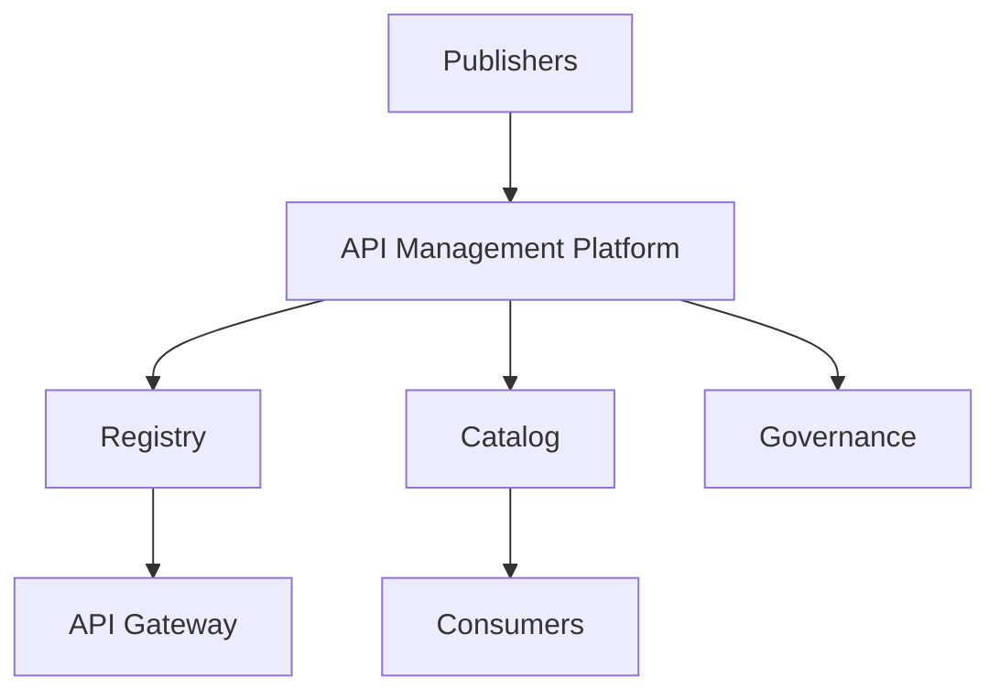
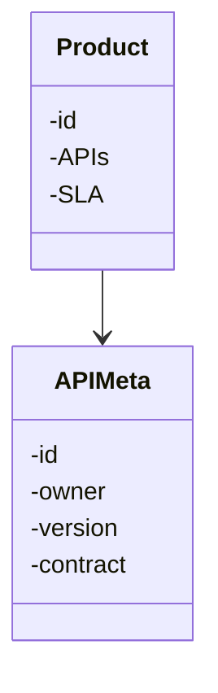
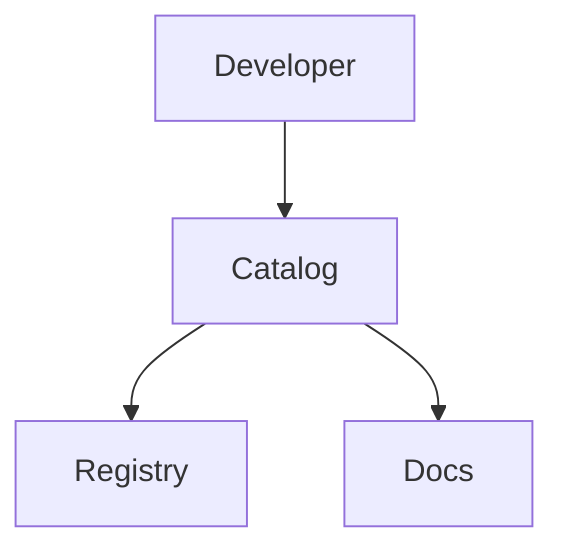
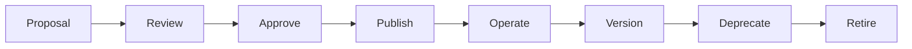
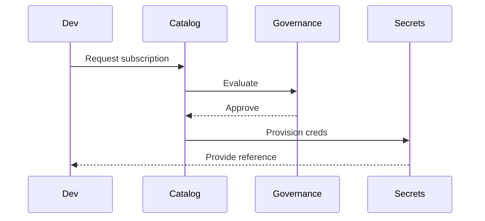
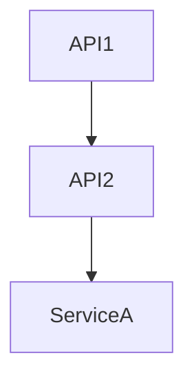
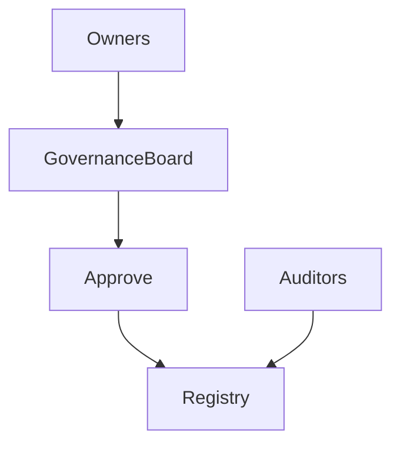
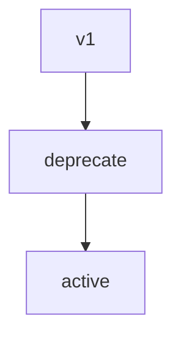
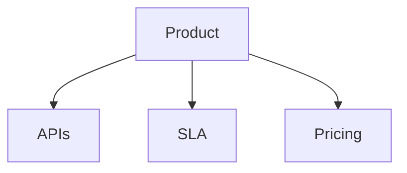
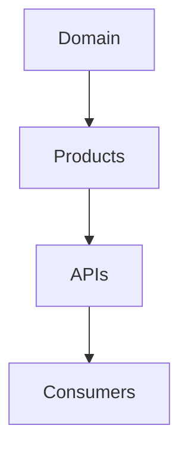

# KB-104 — API Management Architecture (Approved Architecture)

## Executive Summary

API Management treats APIs as governed enterprise products. This architecture defines the platform capability that catalogs, governs, publishes, secures, monitors, versions, and retires APIs while ensuring discoverability, reuse, and lifecycle governance across DUKADESK. API Management complements the runtime enforcement provided by the API Gateway (KB-096) by operating at the product and governance layer.

## Purpose

Establish the enterprise architecture for managing the full lifecycle of APIs as first-class assets: inventory, cataloging, contract governance, consumer onboarding, subscription models, versioning, compliance, and operational insights.

## Scope

Covers API portfolio management, registry and catalog, product model, contract governance, version policy, consumer onboarding, subscription and entitlement models, documentation, dependency mapping, lifecycle workflows, AI-consumable APIs, event APIs, and governance workflows. Omits runtime enforcement and protocol implementation (API Gateway covers runtime concerns).

## Architectural Principles

- APIs are enterprise products with owners, SLAs and lifecycle.
- Contract-first and API-first design.
- Discoverability and developer experience by default.
- Governance before publication; approval required for production APIs.
- Versioning and backward compatibility management.
- Security and privacy by design; Zero Trust at runtime.
- Technology neutrality and vendor independence.
- Reuse prior to new API creation.
- Observable health, adoption and compliance.

## Canonical Definitions

- API — a governed interface exposing platform capability.
- API Product — a packaged, marketable set of APIs with SLA, documentation and pricing (if applicable).
- API Registry — canonical metadata store for APIs, contracts, owners, versions and dependencies.
- API Catalog — discovery UI/API for developers and consumers.
- API Contract — formal interface definition (schema, operations, error models).
- API Consumer — application, tenant or external integrator using an API.
- API Subscription — entitlement binding a consumer to an API Product with quotas and SLA.
- API Lifecycle — proposal, review, publish, operate, version, deprecate, retire.

## API Management Architecture

- API Portfolio: inventory and classification of all APIs across domains.
- API Registry: canonical manifests, contract links, owner and governance metadata.
- API Catalog & Developer Portal: discoverability, docs, sample code, SDKs and onboarding flows.
- Product Model: group APIs into consumable products with entitlements and quotas.
- Contract Governance: review, test and certify API contracts prior to publication.
- Consumer Onboarding: subscription approvals, keys/credentials provisioning via Secrets platform (KB-099), and entitlement management.
- Policy Integration: tie API-level governance to Integration Policy Platform (KB-098) for publishing policy bindings.
- Version Management: semantic versioning, compatibility checks, deprecation windows and migration paths.
- Dependency Mapping: record API-to-API and API-to-service dependencies for impact analysis.
- Analytics & Usage: collect adoption, errors, latency, consumption patterns and business metrics.

## API Portfolio & Registry

- Registry manifest includes: API id, owner, domain, version, contract reference, exposure level, SLA, cost center, compliance classification, lifecycle state and dependencies.
- Owners and stewards recorded with contact and certification status.
- Registry provides authoritative discovery APIs consumed by developer portal, integration pipelines and governance tooling.

## API Catalog & Developer Experience

- Catalog surfaces searchable API products, contract docs, example requests, SDKs, and on-boarding steps.
- Self-service subscription flows for approved consumers; approval workflow for sensitive APIs.
- Documentation is contract-driven and versioned alongside manifests.

## API Product Model

- Product bundles APIs, SLAs, quotas, pricing (if applicable), and support contacts.
- Subscription model enforces entitlements and integrates with policy and secrets platforms for credential issuance.

## API Contracts & Versioning

- Contracts are first-class artifacts (OpenAPI, AsyncAPI, GraphQL schema or equivalent) stored with manifest.
- Versioning strategy: semantic versioning with clear compatibility guarantees; non-compatible changes require major version and migration plan.
- Contract validation and simulation tooling required before publish (policy gates).

## Consumer Onboarding & Entitlement

- Consumers request subscriptions via catalog; governance workflows approve or deny.
- Secrets & credentials issued via KB-099 with tenant scoped references.
- Policies applied from KB-098 define quotas, masking, and residency constraints per subscription.

## API Dependency Architecture

- Map dependencies to enable impact analysis for version changes, deprecation and incidents.
- Visualize consumer-to-provider graphs for operational and governance insight.

## AI & Event APIs

- API Management supports publishing machine-consumable APIs with metadata for AI clients (rate limits, contracts, cost).
- Event APIs and streaming contracts documented and governed similarly to synchronous APIs.

## Governance

- API Governance Board approves high-risk or cross-domain APIs.
- Certification required for sensitive domains (payments, identity, PII handling).
- Periodic reviews and compliance checks; manifests include certification state and expiration.

## Responsibilities

- Enterprise Architecture: product taxonomy, standards and approval criteria.
- API Governance Board: policy, certification and high-level approvals.
- Platform Engineering: registry, catalog, developer portal and integration hooks.
- Product Owners: API ownership, SLA and lifecycle decisions.
- Security & Compliance: risk assessment and certification.
- Developer Experience: docs, SDKs and onboarding flows.
- Operations: monitor API health and enforce lifecycle actions.

## Security & Privacy

- API exposure policies define who may access an API and under what conditions.
- Data minimization, tenant scoping and consent enforced at policy and contract levels.
- Secrets referential issuance for credentials; gateway enforces runtime policies.

## Performance & Scalability

- Registry and catalog designed for scale; partitioned search and caching for large portfolios.
- Versioning and rollout patterns to support gradual migration.
- Analytics pipelines for high-volume telemetry and business metrics.

## Observability

- API adoption metrics, error budgets, latency distributions, consumer churn, and SLA adherence.
- Lifecycle dashboards showing published, deprecated and retired APIs.
- Audit trails for registration, contract changes and subscription events.

## Failure Scenarios

- Orphaned APIs (no owner): governance escalations and quarantine.
- Breaking changes without migration: block publish and notify consumers.
- Unauthorized API publication: revoke and audit remediation.
- Unmanaged proliferation: require registration enforcement and periodic audits.

## Anti-patterns

- Publishing APIs without contracts or owner.
- Hardcoded endpoints in clients.
- Duplicate APIs providing same capability.
- Ungoverned API versioning and breaking changes.

## Future Evolution

- Semantic API catalog with AI-assisted discovery.
- Autonomous contract compatibility testing.
- API-product marketplaces and monetization models.
- Machine-consumable SLAs and dynamic entitlement negotiation.

## Cross References

- KB-094 Integration Platform Architecture
- KB-095 Integration Connector Architecture
- KB-096 API Gateway Architecture
- KB-097 Webhook Architecture
- KB-098 Integration Policy Architecture
- KB-099 Secrets & Credential Management Architecture
- KB-100 Service Discovery Architecture
- KB-101 External Provider Management Architecture
- KB-102 Identity Federation Architecture
- KB-103 Enterprise Connectivity Architecture
- KB-105 Integration Observability Architecture
- KB-106 Integration Lifecycle Architecture

## Mermaid Diagrams

1. API Management Architecture

2. API Portfolio Model

3. API Catalog Architecture

4. API Lifecycle

5. API Consumer Onboarding Flow

6. API Dependency Map

7. API Governance Model

8. API Version Evolution

9. API Product Architecture

10. API Portfolio Relationships

## Acceptance Criteria

- Enterprise API Management architecture defined; distinct from API Gateway.
- Vendor and protocol independent.
- API product, registry, catalog and lifecycle specified.
- Multi-tenant and AI-consumable APIs supported.
- All required Mermaid diagrams included.
- Ready for Knowledge Base inclusion as Approved Architecture.

## Completion

- KB-104 marked Completed (Approved Architecture).
- Progress Registry updated to reflect completion and KB-105 queued.

## Critical Rule

> Every API within DUKADESK shall be treated as a governed enterprise asset with defined ownership, lifecycle, contract, classification and discoverability.

No API may be published or consumed outside the API Management architecture.

<!-- End of KB-104 -->