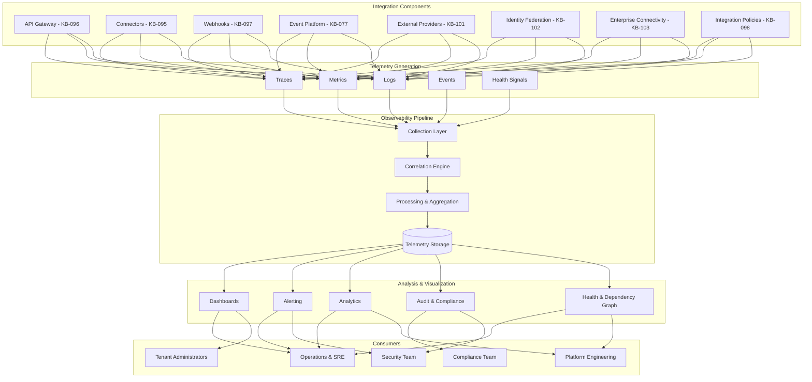
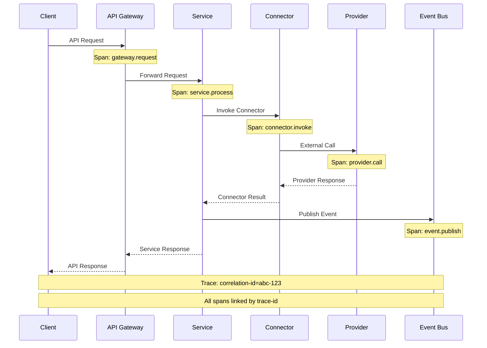
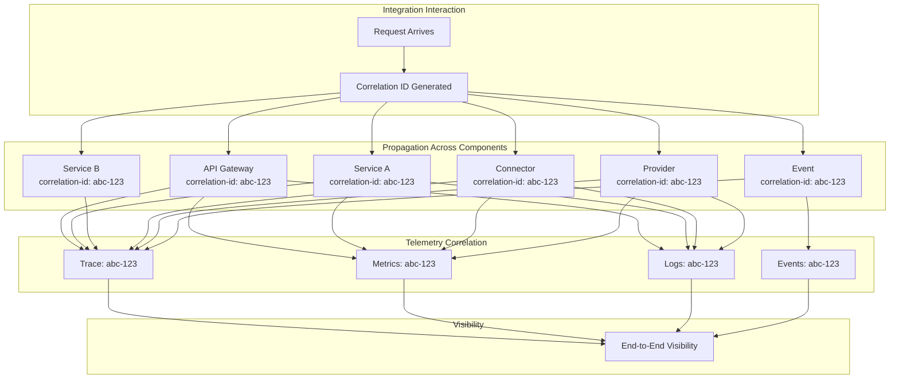
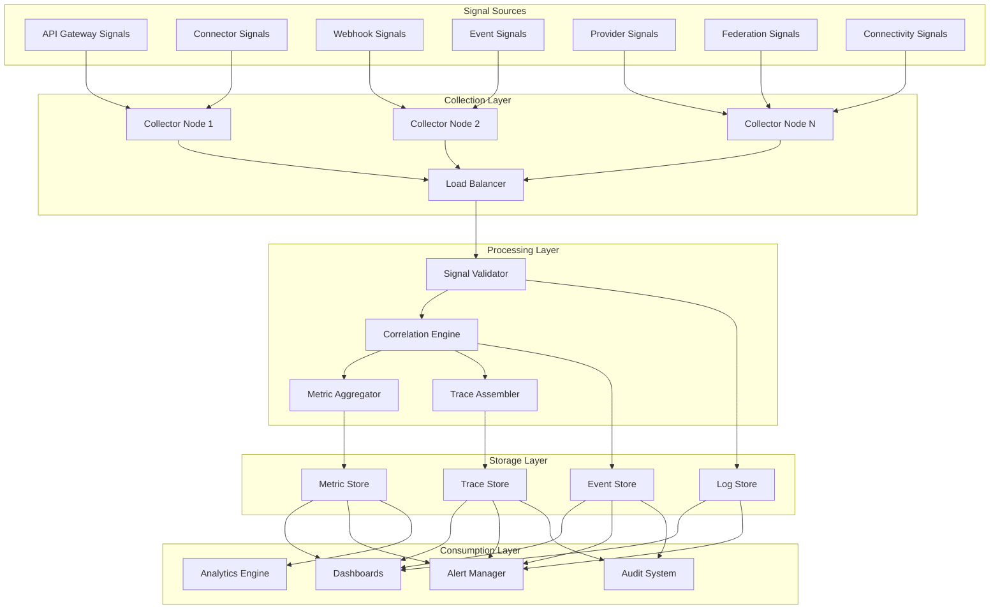
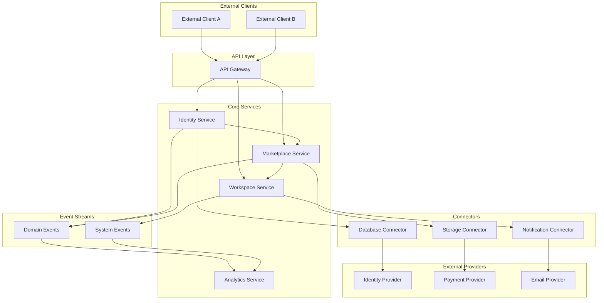
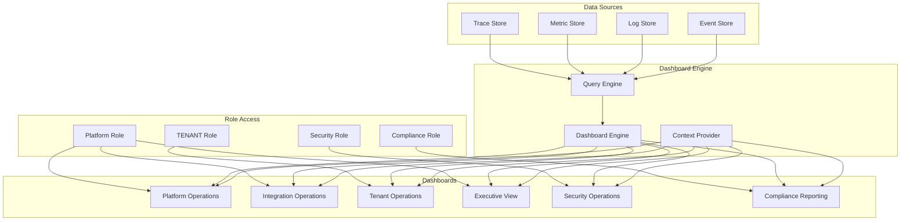
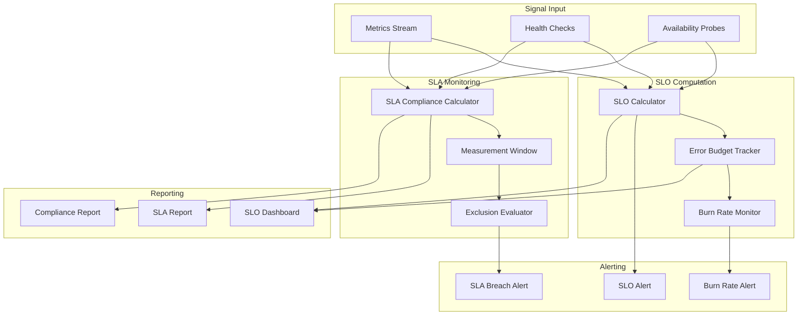
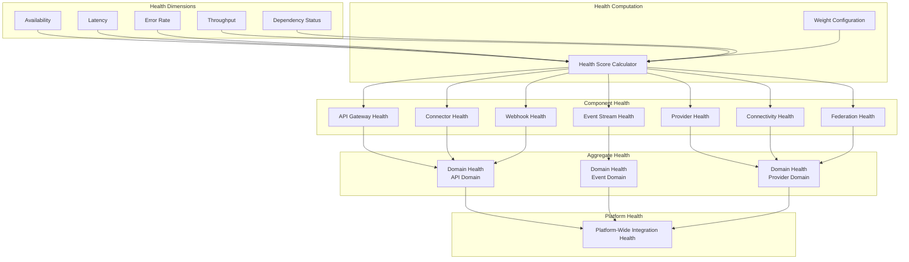
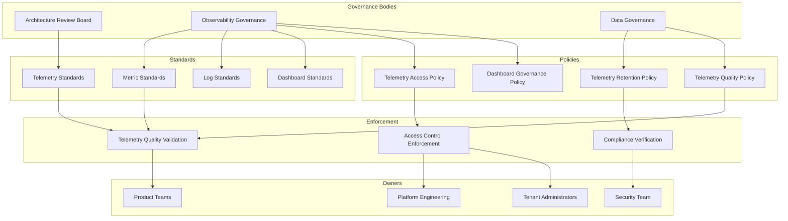
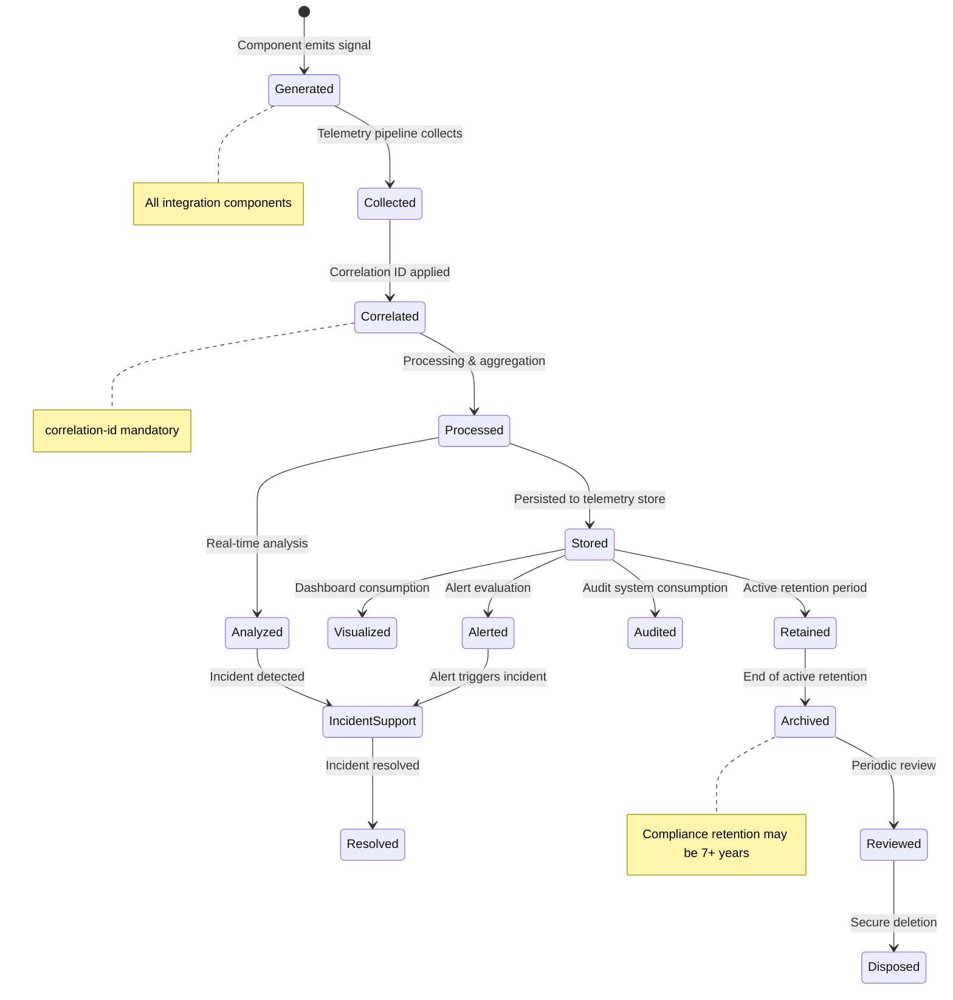

# Integration Observability Architecture

**KB-105 — Integration Observability Architecture Specification**

| Metadata | |
|----------|---|
| **KB ID** | KB-105 |
| **Title** | Integration Observability Architecture |
| **Version** | 0.1.0 |
| **Status** | Draft |
| **Owner** | Architecture Team |
| **Suite** | Platform Integration Architecture |
| **Dependencies** | KB-077 Event & Messaging Architecture, KB-094 Integration Platform Architecture, KB-095 Integration Connector Architecture, KB-096 API Gateway Architecture, KB-097 Webhook Architecture, KB-098 Integration Policy Architecture, KB-100 Service Discovery Architecture, KB-101 External Provider Management Architecture, KB-102 Identity Federation Architecture, KB-103 Enterprise Connectivity Architecture, KB-104 API Management Architecture |
| **Related Documents** | KB-058 Runtime Observability & Diagnostics Architecture, KB-090 Analytics & Business Intelligence Architecture, KB-091 Reporting Architecture, KB-106 Integration Lifecycle Architecture (planned) |
| **Review Status** | Pending |
| **Last Updated** | 2026-07-11 |

---

### Revision History

| Version | Date | Author | Change |
|---------|------|--------|--------|
| 0.1.0 | 2026-07-11 | AI Architecture Agent | Initial draft |

---

## 1. Executive Summary

### 1.1 Purpose

This document defines the Integration Observability Architecture for the DUKADESK Platform. Integration Observability is the enterprise capability that provides complete end-to-end visibility into every integration interaction across the platform — APIs, events, webhooks, connectors, providers, identity federation, enterprise connectivity, and integration policies.

Integration Observability complements platform-wide observability (KB-058) by focusing specifically on integration boundaries and cross-system interactions. Every integration interaction within DUKADESK produces standardized, correlated, and governed operational signals that provide complete visibility across services, tenants, providers, and external systems. No integration capability operates without enterprise observability, ensuring reliability, accountability, security, and continuous operational intelligence.

This document defines architecture only. It is vendor-independent, technology-independent, and implementation-independent.

### 1.2 Scope

**In scope:**

- Integration Telemetry: Unified signal generation for all integration interactions
- Distributed Tracing: End-to-end traceability across APIs, services, connectors, providers, webhooks, events, federation, and connectivity
- Correlation Architecture: Enterprise-wide correlation identifiers linking every integration interaction
- Integration Metrics: Availability, latency, throughput, error rates, retries, timeouts, queue depth, provider health, connectivity health
- Integration Logging: Standardized operational logs for integration analysis and compliance
- Dependency Observability: Visibility into relationships among services, APIs, providers, connectors, tenants, events, external systems
- Operational Dashboards: Platform operations, integration operations, tenant operations, executive, security, compliance
- SLA & SLO Monitoring: Governance and reporting of enterprise integration objectives
- API Observability: Monitoring of API gateway, API policies, API usage patterns
- Webhook Observability: Delivery tracking, retry monitoring, failure analysis
- Event Observability: Event stream health, consumer lag, dead letter monitoring
- Provider Observability: External provider health, latency, availability, dependency tracking
- Federation Observability: Identity federation performance, trust relationship health, token exchange monitoring
- Connectivity Observability: Network paths, regional connectivity, cross-border performance

**Out of scope:**
- Runtime monitoring implementation (covered by KB-058)
- Infrastructure monitoring implementation
- Application Performance Monitoring (APM) implementation
- SIEM implementation
- Infrastructure logging implementation

---

## 2. Architectural Principles

### 2.1 Observability by Design

Every integration capability is observable by design. Observability is not retrofitted — it is architected into every integration component from inception. Each API, connector, webhook, event stream, federation endpoint, and connectivity path produces standardized telemetry without requiring additional instrumentation.

### 2.2 End-to-End Visibility

Integration observability provides complete visibility from request origination to response delivery across all integration boundaries. No integration interaction is invisible. Every request, event, webhook, and federation exchange is traceable across services, providers, tenants, and regions.

### 2.3 Correlation-First Architecture

Correlation is the foundation of integration observability. Every integration interaction carries a standardized correlation identifier that links all telemetry across the interaction lifecycle. Correlation enables end-to-end traceability, dependency analysis, and root cause identification.

### 2.4 Vendor Independence

Integration observability is vendor-independent. No single vendor's monitoring tools, APM solutions, or observability platforms are required. The observability architecture supports pluggable backends and standard telemetry formats, ensuring flexibility and avoiding vendor lock-in.

### 2.5 Immutable Operational Evidence

Operational telemetry is immutable. Integration signals cannot be modified or deleted after generation. Immutability ensures that operational evidence is trustworthy for security investigations, compliance audits, and post-incident analysis.

### 2.6 Security-Aware Telemetry

Telemetry carries security context but never sensitive data. Integration signals include authentication context, authorization decisions, and security boundary crossings without exposing credentials, tokens, or personal data. Telemetry respects data classification policies.

### 2.7 Privacy-Aware Monitoring

Integration observability respects privacy. Telemetry does not contain personal data unless explicitly required and consented. Data minimization applies to operational signals. Telemetry retention respects privacy regulations and right to erasure.

### 2.8 Multi-Tenant Observability

Observability is tenant-aware. Each tenant sees their own integration telemetry. Platform operators see aggregate telemetry across all tenants. Cross-tenant telemetry is isolated. Tenant-specific dashboards, metrics, and alerts operate within tenant boundaries.

### 2.9 AI-Ready Telemetry

Operational signals are structured for AI consumption. Telemetry is generated in standardized, machine-readable formats that support anomaly detection, predictive analytics, automated diagnosis, and intelligent incident response. AI readiness is built in, not retrofitted.

### 2.10 Enterprise Scalability

Integration observability scales to enterprise volumes — millions of integration interactions per second across thousands of services, hundreds of providers, and dozens of regions. Telemetry pipelines, storage, and analysis scale horizontally without degradation.

---

## 3. Canonical Definitions

### 3.1 Integration Observability

The enterprise capability that provides complete visibility into every integration interaction across the DUKADESK platform. Integration observability encompasses telemetry generation, collection, correlation, analysis, visualization, and governance for all integration capabilities.

### 3.2 Telemetry

Standardized operational signals generated by integration components. Telemetry includes traces, metrics, logs, events, and health signals. Telemetry is the raw data of observability.

### 3.3 Trace

A distributed trace that captures the end-to-end path of an integration interaction across services, APIs, connectors, providers, event streams, and network boundaries. Traces consist of linked spans that represent individual processing steps.

### 3.4 Span

A single unit of work within a distributed trace. Each span represents one processing step — an API call, a connector invocation, a webhook delivery, an event publication, a provider request, a federation exchange. Spans carry timing, status, and metadata.

### 3.5 Correlation ID

A globally unique identifier that links all telemetry for a single integration interaction. The correlation ID is propagated across all integration components — services, APIs, connectors, providers, event streams, webhooks — enabling end-to-end traceability.

### 3.6 Transaction

A complete integration interaction that spans multiple integration components. A transaction begins with a request or event and ends when all processing is complete. Transactions are the unit of end-to-end visibility.

### 3.7 Integration Event

A structured signal emitted by an integration component to indicate an operational occurrence — request received, response sent, retry attempted, error encountered, policy evaluated, connection established, protocol transformed.

### 3.8 Integration Metric

A quantitative measurement of integration behavior — request count, latency, error rate, throughput, queue depth, availability percentage. Metrics are aggregated over time windows for trend analysis and alerting.

### 3.9 Integration Log

A structured record of an integration operation. Logs contain correlation context, timing, status, and operational metadata. Logs are the primary source for detailed operational analysis.

### 3.10 Integration Health

A composite measure of integration capability status. Health is determined by availability, latency, error rate, throughput, and dependency status. Integration health is monitored at the domain, provider, and individual connector levels.

### 3.11 Dependency Graph

A visual representation of relationships and dependencies between integration components. The dependency graph shows how services, APIs, connectors, providers, events, and external systems are interconnected.

### 3.12 Service Interaction

An observable exchange between two integration components — service-to-service, service-to-provider, service-to-API, service-to-connector. Each service interaction produces telemetry that feeds into the dependency graph.

### 3.13 Provider Health

A measurement of external provider operational status. Provider health encompasses availability, response latency, error rate, throughput, and compliance with provider SLAs.

### 3.14 Integration SLA

A formal agreement specifying the expected level of service for an integration capability. SLAs define availability targets, latency thresholds, throughput guarantees, and error rate maximums.

### 3.15 Integration SLO

A specific, measurable objective for integration performance. SLOs are derived from SLAs and define the targets that operational teams manage to. SLOs are monitored, reported, and alerted.

### 3.16 Operational Signal

Any telemetry emitted by an integration component that conveys operational state. Operational signals include traces, metrics, logs, events, health checks, and status reports.

### 3.17 Audit Event

An immutable telemetry record that captures integration activity for compliance and security. Audit events include who performed an operation, what operation was performed, when it occurred, and what the outcome was.

### 3.18 Observability Domain

A logical grouping of integration components that share observability characteristics. Observability domains may align with integration domains (API, event, webhook, provider), organizational boundaries, or deployment regions.

### 3.19 Observability Pipeline

The end-to-end flow of telemetry from generation through collection, correlation, processing, storage, analysis, and visualization. The observability pipeline is the infrastructure of integration observability.

### 3.20 Operational Dashboard

A curated view of integration telemetry designed for a specific audience and purpose. Dashboards provide real-time visibility into integration health, performance, and behavior.

---

## 4. Integration Telemetry

### 4.1 Telemetry Model

Integration telemetry is generated by every integration component. Each component emits standardized signals that capture operational state, timing, status, and context.

```
Integration Component
    |
    +--- Emit Trace (distributed trace span)
    +--- Emit Metric (quantitative measurement)
    +--- Emit Log (structured record)
    +--- Emit Event (operational occurrence)
    +--- Emit Health (status signal)
```

### 4.2 Telemetry Types

| Type | Description | Cardinality | Retention | Use Case |
|------|-------------|-------------|-----------|----------|
| Trace | End-to-end request path | Per request | Short (hours-days) | Debugging, latency analysis |
| Span | Single processing step | Per operation | Short (hours-days) | Path analysis |
| Metric | Quantitative measurement | Time-series | Medium (days-months) | Trending, alerting |
| Log | Structured record | Per operation | Medium (days-months) | Detailed analysis |
| Event | Operational occurrence | Per occurrence | Medium (days-months) | State change detection |
| Health | Status signal | Periodic | Short (hours) | Real-time monitoring |

### 4.3 Telemetry Generation

Every integration component generates telemetry automatically. No manual instrumentation is required.

**Automatic telemetry:**
- API Gateway: Trace spans for every API call
- Connector: Trace spans for every connector invocation
- Webhook: Trace spans for every webhook delivery
- Event Bus: Trace spans for every event publication/consumption
- Provider Client: Trace spans for every external provider call
- Federation Endpoint: Trace spans for every federation exchange
- Connectivity Gateway: Trace spans for every connectivity path

### 4.4 Telemetry Structure

Every telemetry signal follows a standardized structure:

```json
{
  "specVersion": "1.0",
  "type": "trace|metric|log|event|health",
  "id": "uuid",
  "timestamp": "ISO 8601 UTC",
  "correlationId": "uuid",
  "traceId": "uuid",
  "spanId": "uuid",
  "source": {
    "component": "api-gateway|connector|webhook|event-bus|provider|federation",
    "service": "service-name",
    "instance": "instance-id",
    "version": "semver"
  },
  "tenant": {
    "id": "tenant-uuid",
    "type": "system|production|development"
  },
  "security": {
    "authenticated": true,
    "identityType": "user|service|system",
    "authMethod": "token|certificate|oauth|saml"
  },
  "payload": {}
}
```

### 4.5 Telemetry Collection

Telemetry is collected through a standardized collection pipeline. Collection is decoupled from generation — components emit telemetry without knowing how it is collected.

**Collection models:**
- Push: Components push telemetry to the collection endpoint
- Pull: Collection agent pulls telemetry from components
- Sidecar: Sidecar agent collects telemetry on behalf of the component

---

## 5. Distributed Tracing

### 5.1 Tracing Architecture

Distributed tracing provides end-to-end visibility into integration interactions. Each interaction produces a trace consisting of linked spans that follow the request or event across all integration components.

```
Client
  |
  +--- Span: API Request
  |      |
  |      +--- Span: API Gateway
  |      |      |
  |      |      +--- Span: Service Logic
  |      |      |      |
  |      |      |      +--- Span: Connector Invocation
  |      |      |      |      |
  |      |      |      |      +--- Span: Provider Call
  |      |      |      |
  |      |      |      +--- Span: Event Publication
  |      |      |             |
  |      |      |             +--- Span: Event Processing
  |      |      |
  |      |      +--- Span: Response
  |      |
  |      +--- Span: API Response
  |
  +--- Trace Complete
```

### 5.2 Span Model

Each span captures a single processing step in the integration flow.

**Span attributes:**
- Span ID: Unique identifier
- Trace ID: Parent trace identifier
- Parent Span ID: Parent span identifier (for nesting)
- Operation Name: What operation was performed
- Start Time: When the span started
- End Time: When the span completed
- Duration: Total elapsed time
- Status: Success, error, or failure
- Tags: Key-value metadata (service, component, endpoint, status code)
- Events: Annotations within the span (retry, timeout, error)

### 5.3 Trace Propagation

Correlation and trace context is propagated across all integration components through standardized headers.

**Propagated context:**
- `trace-id`: Globally unique trace identifier
- `span-id`: Current span identifier
- `parent-span-id`: Parent span identifier
- `correlation-id`: Business correlation identifier
- `tenant-id`: Tenant context
- `user-id`: User context (anonymized)

### 5.4 Trace Sampling

Not all integration interactions require full tracing. Sampling ensures that tracing overhead is proportional to operational value.

**Sampling strategies:**
- Head-based: Sample at the start of the trace (includes all spans)
- Tail-based: Sample after the trace completes (based on outcome)
- Error-based: Always sample errors and failures
- Probability-based: Random sampling at configurable rate
- Tenant-based: Higher sampling rate for critical tenants

---

## 6. Correlation Architecture

### 6.1 Correlation Model

Correlation is the foundation of integration observability. Every integration interaction carries a standardized correlation identifier that links all telemetry across the interaction lifecycle.

```
Request Arrives
    |
    +--- Generate Correlation ID
    |
    +--- Propagate across all integration components
    |      |
    |      +--- API Gateway: correlation-id
    |      +--- Service: correlation-id
    |      +--- Connector: correlation-id
    |      +--- Provider: correlation-id
    |      +--- Event: correlation-id
    |      +--- Webhook: correlation-id
    |      +--- Federation: correlation-id
    |
    +--- All telemetry tagged with correlation-id
    |
    +--- Complete visibility into end-to-end interaction
```

### 6.2 Correlation ID Structure

Correlation IDs follow a standardized structure that enables efficient aggregation and analysis.

```
{version}:{timestamp}:{random-component}:{sequence}
```

**Example:** `v1:20260711T120000Z:a1b2c3d4:0001`

### 6.3 Correlation Propagation

Correlation IDs are propagated through all integration channels.

**Propagation mechanisms:**
- HTTP headers (API calls, webhooks)
- Message headers (events, messages)
- Protocol metadata (federation protocols)
- Connection metadata (connectivity paths)

### 6.4 Correlation Boundaries

Correlation IDs persist across integration boundaries. When an interaction crosses a boundary (service, provider, tenant, region), the correlation ID is preserved.

**Boundary types:**
- Service boundary: Between platform services
- Provider boundary: Between platform and external provider
- Tenant boundary: Between tenants
- Region boundary: Between deployment regions
- Protocol boundary: Between different communication protocols

---

## 7. Metrics Architecture

### 7.1 Metrics Model

Integration metrics are quantitative measurements of integration behavior. Metrics are aggregated over time windows for trend analysis, alerting, and reporting.

**Metric dimensions:**
- Component (API gateway, connector, webhook, event bus, provider)
- Service (specific service or integration)
- Tenant (tenant context)
- Region (deployment region)
- Operation (specific operation type)
- Status (success, error, failure)

### 7.2 Integration Metrics

| Metric | Type | Description | Alert Threshold |
|--------|------|-------------|-----------------|
| Request Count | Counter | Total integration requests | - |
| Request Rate | Gauge | Requests per second | - |
| Latency p50 | Histogram | Median response time | > 500ms |
| Latency p95 | Histogram | 95th percentile latency | > 2s |
| Latency p99 | Histogram | 99th percentile latency | > 5s |
| Error Rate | Gauge | Percentage of failed requests | > 1% |
| Timeout Rate | Gauge | Percentage of timed-out requests | > 0.1% |
| Retry Count | Counter | Total retry attempts | - |
| Retry Rate | Gauge | Percentage of requests retried | > 5% |
| Queue Depth | Gauge | Pending items in integration queues | > 1000 |
| Provider Latency | Histogram | External provider response time | > SLA |
| Provider Error Rate | Gauge | Provider error percentage | > 2% |
| Connectivity Health | Gauge | Connectivity path availability | < 99.9% |
| Federation Latency | Histogram | Identity federation exchange time | > 1s |

### 7.3 API Metrics

Metrics specific to API Gateway integration (KB-096, KB-104).

**API metrics:**
- API calls per second (by endpoint, by method, by tenant)
- API latency (by endpoint, by method)
- API error rate (by status code, by endpoint)
- API rate limiting (throttled requests, quota violations)
- API authentication failures
- API authorization denials

### 7.4 Webhook Metrics

Metrics specific to webhook delivery (KB-097).

**Webhook metrics:**
- Webhooks delivered per second
- Webhook delivery latency (end-to-end)
- Webhook success rate
- Webhook retry count
- Webhook dead letter rate
- Webhook delivery timeouts

### 7.5 Event Metrics

Metrics specific to event stream integration (KB-077).

**Event metrics:**
- Events published per second (by event type, by publisher)
- Events consumed per second (by consumer, by subscription)
- Consumer lag (events pending consumption)
- Event processing latency
- Dead letter queue depth
- Event schema validation failures

### 7.6 Provider Metrics

Metrics specific to external provider integration (KB-101).

**Provider metrics:**
- Provider request rate
- Provider response latency
- Provider error rate (by error type)
- Provider availability
- Provider SLA compliance
- Provider circuit breaker state

### 7.7 Connectivity Metrics

Metrics specific to enterprise connectivity (KB-103).

**Connectivity metrics:**
- Connectivity path availability
- Connectivity latency (by path, by region)
- Connectivity throughput (by path)
- Connectivity error rate
- Connectivity path health
- Cross-region latency

---

## 8. Logging Architecture

### 8.1 Log Model

Integration logs provide detailed, structured records of every integration operation. Logs are the primary source for operational analysis, debugging, and compliance.

### 8.2 Log Structure

Every integration log follows a standardized schema:

```json
{
  "version": "1.0",
  "timestamp": "ISO 8601 UTC",
  "correlationId": "uuid",
  "traceId": "uuid",
  "spanId": "uuid",
  "component": "api-gateway|connector|webhook|event-bus|provider",
  "operation": "operation-name",
  "status": "success|error|failure",
  "duration": "milliseconds",
  "tenantId": "uuid",
  "sourceService": "service-name",
  "targetService": "service-name",
  "request": {
    "method": "GET|POST|PUT|DELETE",
    "path": "/api/v1/endpoint",
    "headers": { "key": "value" },
    "size": "bytes"
  },
  "response": {
    "statusCode": 200,
    "size": "bytes",
    "error": { "code": "ERROR_CODE", "message": "error description" }
  },
  "security": {
    "authenticated": true,
    "identityType": "user|service",
    "authMethod": "token|certificate|oauth"
  }
}
```

### 8.3 Log Categories

| Category | Content | Retention | Use Case |
|----------|---------|-----------|----------|
| Operational | Request/response, timing, status | 30-90 days | Operations, debugging |
| Security | Auth decisions, policy violations | 1-7 years | Security, compliance |
| Audit | Immutable interaction records | 7+ years | Compliance, legal |
| Error | Failure details, stack traces | 30-90 days | Error analysis |
| Diagnostic | Detailed debug information | 7-30 days | Deep debugging |

### 8.4 Log Levels

Integration logs follow standardized log levels:

- **TRACE**: Detailed diagnostic information (sampled)
- **DEBUG**: Debug-level information (temporary)
- **INFO**: Normal operational information
- **WARN**: Warning conditions (retries, degraded performance)
- **ERROR**: Error conditions (failed operations)
- **FATAL**: Critical failures (component unavailable)

---

## 9. Dependency Observability

### 9.1 Dependency Model

Dependency observability provides visibility into relationships among integration components. The dependency graph shows how services, APIs, connectors, providers, events, and external systems are interconnected.

### 9.2 Dependency Graph

The dependency graph is built from trace data. Each service interaction creates an edge in the graph. The graph reveals:

- Which services call which other services
- Which APIs depend on which providers
- Which events are consumed by which services
- Which connectors bridge which systems
- Which integration paths are critical for business operations

### 9.3 Service Interaction Visibility

Every service interaction is visible in the dependency graph:

- Service-to-Service: Internal platform service calls
- Service-to-Provider: External provider calls
- Service-to-API: API gateway interactions
- Service-to-Event: Event publication and consumption
- Service-to-Connector: Connector invocations
- Service-to-Federation: Identity federation exchanges

### 9.4 Dependency Health

Dependency health measures the operational status of each dependency in the graph:

- Healthy: Dependency is available and performing within SLOs
- Degraded: Dependency is available but performing below SLOs
- Unhealthy: Dependency is unavailable or failing
- Unknown: Dependency status cannot be determined

### 9.5 Critical Path Analysis

The dependency graph identifies critical integration paths — the chains of dependencies that are essential for business operations. Critical path analysis enables targeted monitoring and prioritization.

**Critical path characteristics:**
- High business impact if disrupted
- Long dependency chains (many components involved)
- Single points of failure (no redundancy)
- High volume or high value transactions

---

## 10. Operational Dashboards

### 10.1 Dashboard Model

Operational dashboards provide curated views of integration telemetry for specific audiences and purposes. Dashboards are the primary interface for operational visibility.

### 10.2 Platform Operations Dashboard

**Audience:** Platform Engineering, SRE
**Purpose:** Real-time visibility into platform-wide integration health

**Dashboard sections:**
- Overall integration health (composite health score)
- Active incidents and alerts
- Request rate by integration domain
- Error rate by integration domain
- Latency heatmap by service
- Dependency health summary
- Provider health summary
- SLA/SLO compliance status

### 10.3 Integration Operations Dashboard

**Audience:** Integration Team, Operations
**Purpose:** Detailed visibility into integration component health

**Dashboard sections:**
- API Gateway metrics (calls, latency, errors by endpoint)
- Webhook delivery metrics (delivery rate, retries, dead letters)
- Event stream metrics (publication rate, consumer lag, queue depth)
- Connector metrics (invocation rate, error rate, latency)
- Provider metrics (request rate, latency, availability)
- Connectivity metrics (path health, latency, throughput)

### 10.4 Tenant Operations Dashboard

**Audience:** Tenant Administrators
**Purpose:** Visibility into tenant-specific integration activity

**Dashboard sections:**
- Tenant API usage (calls, latency, errors)
- Tenant webhook delivery status
- Tenant event consumption
- Tenant connectivity health
- Tenant SLA compliance
- Tenant integration errors

### 10.5 Executive Dashboard

**Audience:** Leadership
**Purpose:** High-level visibility into integration health and business impact

**Dashboard sections:**
- Platform-wide integration availability
- System-wide SLA/SLO compliance
- Provider health and compliance
- Integration growth trends
- Incident trends and MTTR
- Business impact of integration disruptions

### 10.6 Security Operations Dashboard

**Audience:** Security Team
**Purpose:** Visibility into integration security posture

**Dashboard sections:**
- Authentication failures (by method, by service)
- Authorization denials (by policy, by service)
- Security policy violations
- Suspicious integration patterns
- Federation health and anomalies
- Connectivity security events

### 10.7 Compliance Reporting Dashboard

**Audience:** Compliance Team, Audit
**Purpose:** Visibility into integration compliance posture

**Dashboard sections:**
- Audit event completeness
- Data residency compliance
- Cross-border integration activity
- Tenant isolation verification
- Retention policy compliance
- External provider compliance

---

## 11. SLA & SLO Architecture

### 11.1 SLA/SLO Model

SLAs define the expected level of service for integration capabilities. SLOs define the specific, measurable targets that operational teams manage to. Both are monitored, reported, and alerted.

### 11.2 SLA Definition

**SLA components:**
- Service description: What integration capability is covered
- Availability target: Percentage of uptime (99.9%, 99.99%)
- Latency target: Maximum response time (p95, p99)
- Throughput target: Maximum request rate supported
- Error rate target: Maximum percentage of failed requests
- Measurement period: How SLA compliance is measured (monthly, quarterly)
- Exclusions: What is not covered by the SLA

### 11.3 SLO Definition

**SLO components:**
- Objective name: What is being measured
- Target value: Specific measurable target (e.g., latency p95 < 200ms)
- Measurement window: How the target is measured (rolling 30 days)
- Error budget: Allowed deviation from target
- Burn rate: How fast error budget is being consumed
- Alert threshold: When to alert on SLO risk

### 11.4 Integration SLOs

| SLO | Target | Measurement | Alert |
|-----|--------|-------------|-------|
| API Availability | 99.9% | Rolling 30 days | < 99.9% |
| API Latency p95 | < 500ms | Rolling 7 days | > 500ms |
| API Error Rate | < 1% | Rolling 7 days | > 1% |
| Webhook Delivery Latency | < 5s | Rolling 7 days | > 5s |
| Webhook Success Rate | > 99% | Rolling 30 days | < 99% |
| Event Processing Latency | < 1s | Rolling 7 days | > 1s |
| Consumer Lag | < 1000 | Rolling 7 days | > 1000 |
| Provider Availability | > 99.9% | Rolling 30 days | < 99.9% |
| Provider Latency p95 | < 2s | Rolling 7 days | > 2s |
| Connectivity Availability | 99.99% | Rolling 30 days | < 99.99% |

### 11.5 Error Budget

Error budgets define the allowed deviation from SLO targets. Error budgets enable teams to balance reliability with velocity.

**Error budget management:**
- Budget is consumed by SLO violations
- Budget is replenished over the measurement window
- Critical SLOs have stricter budgets
- Budget exhaustion triggers incident review
- Budget consumption is visible on dashboards

---

## 12. AI Observability

### 12.1 AI Model

AI observability enables intelligent analysis, prediction, and automation of integration operations. Telemetry is structured for AI consumption from the point of generation.

### 12.2 AI-Ready Telemetry

Telemetry is generated in standardized, machine-readable formats that support:

- Anomaly detection: Identify unusual integration patterns
- Predictive analytics: Forecast integration trends and issues
- Automated diagnosis: Correlate signals to identify root causes
- Intelligent alerting: Reduce false positives through contextual analysis
- Capacity planning: Predict integration growth and resource needs

### 12.3 Anomaly Detection

Anomaly detection identifies integration behavior that deviates from expected patterns.

**Detectable anomalies:**
- Sudden latency spikes
- Unexplained error rate increases
- Unusual request patterns
- Provider behavior changes
- Connectivity degradation
- Authentication anomalies

### 12.4 Predictive Analytics

Predictive analytics forecast future integration behavior based on historical patterns.

**Predictive capabilities:**
- Capacity forecasting (request volume, throughput, storage)
- Trend analysis (latency trends, error rate trends)
- Seasonality detection (daily, weekly, seasonal patterns)
- Growth projection (integration domain growth)

### 12.5 Automated Diagnosis

Automated diagnosis correlates telemetry signals to identify root causes of integration issues.

**Diagnosis capabilities:**
- Trace correlation (follow the failing path)
- Dependency impact analysis (what dependencies are affected)
- Change correlation (what changed before the issue)
- Pattern matching (match symptoms to known issues)

---

## 13. Lifecycle

### 13.1 Signal Lifecycle

Every operational signal follows a complete lifecycle from generation to disposal.

### 13.2 Lifecycle Stages

```
Signal Generation
    |
    v
Collection
    |
    v
Correlation
    |
    v
Processing & Aggregation
    |
    v
Analysis
    |
    v
Visualization
    |
    v
Alert Evaluation
    |
    v
Incident Support
    |
    v
Retention
    |
    v
Archival
    |
    v
Review
    |
    v
Disposal
```

### 13.3 Signal Generation

Operational signals are generated by integration components at the point of interaction. Generation is automatic — no manual instrumentation is required.

### 13.4 Collection

Signals are collected through the telemetry pipeline. Collection is reliable, scalable, and non-blocking for integration components.

### 13.5 Correlation

Signals are correlated using the correlation ID. All signals for a single integration interaction are linked together.

### 13.6 Processing & Aggregation

Signals are processed and aggregated. Metrics are computed from raw signals. Traces are assembled from spans. Logs are indexed for search.

### 13.7 Analysis

Processed signals are analyzed for trends, anomalies, and patterns. Analysis may be real-time (streaming) or batch (historical).

### 13.8 Visualization

Analyzed data is visualized through dashboards, charts, and reports. Visualization makes telemetry actionable.

### 13.9 Alert Evaluation

Signals are evaluated against alert conditions. When conditions are met, alerts are triggered with appropriate severity and notification.

### 13.10 Incident Support

During incidents, telemetry provides the data needed for diagnosis, response, and post-incident analysis.

### 13.11 Retention

Signals are retained according to their retention classification. Retention periods balance operational value with storage cost.

### 13.12 Archival

After the active retention period, signals are archived to long-term storage. Archived signals are available for compliance, analysis, and audit.

### 13.13 Review

Archived signals are periodically reviewed for compliance, analysis, and improvement. Reviews identify opportunities for observability enhancement.

### 13.14 Disposal

At the end of the retention and archival period, signals are securely disposed. Disposal respects data privacy regulations.

---

## 14. Governance

### 14.1 Observability Governance

Observability governance ensures that integration telemetry is complete, correct, consistent, and compliant.

### 14.2 Telemetry Ownership

Every telemetry domain has a designated owner. The owner is responsible for telemetry quality, completeness, and governance.

**Owner responsibilities:**
- Ensure complete telemetry coverage for their domain
- Define telemetry retention policies
- Govern telemetry schema evolution
- Monitor telemetry quality and completeness
- Coordinate with platform observability

### 14.3 Data Quality

Telemetry data quality is governed to ensure that operational decisions are based on accurate, complete data.

**Quality dimensions:**
- Completeness: All expected signals are generated
- Accuracy: Signals reflect actual operational state
- Consistency: Signals follow standardized formats
- Timeliness: Signals are delivered within expected latency
- Correlation: Signals are properly correlated

### 14.4 Metric Standards

Integration metrics follow standardized naming, labeling, and aggregation.

**Standardization areas:**
- Metric naming conventions
- Label conventions (service, component, tenant, region)
- Aggregation windows (1m, 5m, 1h, 1d)
- Percentile calculation methods
- Metric retention policies

### 14.5 Dashboard Governance

Dashboards are governed to ensure consistency, relevance, and accuracy.

**Governance rules:**
- Dashboards have designated owners
- Dashboard data sources are validated
- Dashboard refresh rates are appropriate
- Dashboard access is role-based
- Dashboards are reviewed periodically

### 14.6 Retention Policies

Signal retention is governed by classification. Retention policies balance operational value, compliance requirements, and storage cost.

**Retention classes:**

| Class | Active Retention | Archival Retention | Use Case |
|-------|-----------------|-------------------|----------|
| Operational | 30 days | 1 year | Day-to-day operations |
| Security | 90 days | 7 years | Security analysis |
| Audit | 7 years | Permanent | Compliance |
| Diagnostic | 7 days | None | Debugging |
| Compliance | 7 years | Permanent | Regulatory |

### 14.7 Architecture Review

Observability architecture is periodically reviewed to ensure it remains effective, efficient, and aligned with platform evolution.

**Review cadence:** Quarterly

**Review scope:**
- Telemetry coverage completeness
- Pipeline performance and scalability
- Storage efficiency and cost
- Dashboard effectiveness
- Alert accuracy and relevance

---

## 15. Responsibilities

### 15.1 Enterprise Architecture

**Responsibilities:**
- Define integration observability architecture
- Govern telemetry standards and schemas
- Ensure cross-platform consistency
- Drive observability evolution

### 15.2 Platform Engineering

**Responsibilities:**
- Operate the telemetry pipeline
- Manage telemetry storage and retention
- Provide dashboard infrastructure
- Ensure pipeline scalability and reliability

### 15.3 Operations & SRE

**Responsibilities:**
- Monitor integration health and SLOs
- Respond to integration alerts
- Maintain operational dashboards
- Conduct incident analysis

### 15.4 Security

**Responsibilities:**
- Govern telemetry security and privacy
- Monitor security-specific signals
- Ensure audit telemetry integrity
- Investigate security anomalies

### 15.5 Compliance

**Responsibilities:**
- Govern audit telemetry retention
- Ensure compliance signal coverage
- Validate telemetry completeness
- Support audit requests

### 15.6 Product Teams

**Responsibilities:**
- Generate complete telemetry for their integration components
- Maintain telemetry quality
- Respond to integration alerts
- Participate in incident analysis

### 15.7 Tenant Administrators

**Responsibilities:**
- Monitor tenant-specific integration telemetry
- Respond to tenant integration alerts
- Review tenant integration dashboards
- Escalate tenant integration issues

### 15.8 Data Governance

**Responsibilities:**
- Govern telemetry data classification
- Ensure telemetry privacy compliance
- Manage telemetry retention policies
- Review telemetry disposal

### 15.9 Audit Teams

**Responsibilities:**
- Validate telemetry completeness for audit
- Review audit signal integrity
- Verify telemetry retention compliance
- Request telemetry for audit purposes

---

## 16. Security

### 16.1 Secure Telemetry

Telemetry is protected against unauthorized access, modification, and disclosure. Security controls follow the runtime security architecture (KB-057) and integration security policies (KB-098).

**Telemetry security controls:**
- Encryption in transit (all telemetry transport is encrypted)
- Encryption at rest (telemetry storage is encrypted)
- Access control (telemetry access is role-based)
- Integrity verification (telemetry can be verified against tampering)
- Audit logging (telemetry access is audited)

### 16.2 Integrity Protection

Telemetry integrity ensures that operational signals have not been tampered with.

**Integrity mechanisms:**
- Telemetry signing (signals are signed at generation)
- Chain of custody (telemetry provenance is tracked)
- Immutable storage (telemetry cannot be modified after storage)
- Verification on read (signals are verified before consumption)

### 16.3 Tamper Resistance

Audit telemetry is tamper-resistant. Once an audit signal is generated, it cannot be modified or deleted.

**Tamper resistance mechanisms:**
- Append-only storage (audit signals are write-once)
- Cryptographic chaining (audit signals are cryptographically linked)
- Immutable audit log (audit log cannot be truncated)
- Periodic verification (audit signal integrity is periodically verified)

### 16.4 Sensitive Data Masking

Telemetry never contains sensitive data. Sensitive fields are masked or excluded at generation.

**Masking rules:**
- Credentials: Never included in telemetry
- Personal data: Excluded or anonymized
- Authentication tokens: Masked (truncated hash)
- Internal secrets: Never included
- Provider secrets: Never included

### 16.5 Operational Confidentiality

Telemetry access is restricted to authorized personnel and systems.

**Access control model:**
- Platform operators: Full access to all telemetry
- Tenant administrators: Access to tenant-specific telemetry
- Security team: Access to security telemetry
- Compliance team: Access to audit telemetry
- Product teams: Access to their component telemetry

### 16.6 Access Governance

Telemetry access is governed through policies and audits.

**Governance mechanisms:**
- Role-based access control (RBAC) for telemetry
- Access request and approval workflow
- Telemetry access audit trail
- Periodic access review

### 16.7 Tenant Isolation

Telemetry is tenant-isolated. One tenant's telemetry is not visible to other tenants.

**Isolation mechanisms:**
- Tenant-scoped telemetry namespaces
- Tenant-specific dashboards
- Tenant-specific metric aggregation
- Cross-tenant telemetry access is blocked and audited

### 16.8 Zero Trust Observability

Observability operates under Zero Trust principles — no telemetry is trusted by default. Every signal is authenticated, authorized, and verified.

**Zero Trust observability principles:**
- Authenticate all telemetry sources
- Authorize all telemetry access
- Verify telemetry integrity
- Never trust telemetry from unverified sources
- Continuously validate telemetry quality

---

## 17. Privacy

### 17.1 PII Protection

Telemetry does not contain personally identifiable information (PII) unless explicitly required and consented.

**PII protection rules:**
- User identifiers are anonymized in telemetry
- Personal data is excluded from operational signals
- Audit signals may contain anonymized user context
- Telemetry with PII has restricted access

### 17.2 Tenant Telemetry Isolation

Each tenant's telemetry is isolated. Telemetry from one tenant is not commingled with telemetry from another tenant.

**Isolation mechanisms:**
- Tenant ID is a mandatory telemetry dimension
- Telemetry storage is tenant-partitioned
- Telemetry queries enforce tenant scope
- Tenant telemetry export supports data portability

### 17.3 Regulatory Compliance

Telemetry complies with applicable privacy regulations (GDPR, CCPA, LGPD, etc.).

**Compliance mechanisms:**
- Data minimization applied to all telemetry
- Retention limits enforced by telemetry classification
- Right to erasure supported through telemetry deletion
- Telemetry processing has legal basis documented
- Cross-border telemetry governed by data residency

### 17.4 Data Minimization

Only telemetry necessary for operational purposes is collected. Telemetry fields are minimized to what is actionable.

**Minimization rules:**
- Collect only signals that have operational value
- Exclude unnecessary metadata
- Aggregate where possible (avoid raw event collection)
- Purge telemetry that no longer serves its purpose

### 17.5 Regional Observability

Telemetry processing and storage respect regional boundaries. Data residency requirements are enforced.

**Regional rules:**
- Telemetry is processed within the region of origin
- Cross-region telemetry aggregation is minimized
- Regional telemetry storage is region-locked
- Cross-border telemetry has compliance review

### 17.6 Cross-Border Telemetry Governance

Telemetry that crosses regional or national boundaries is governed by data transfer agreements and compliance requirements.

**Governance requirements:**
- Explicit legal basis for cross-border telemetry
- Data transfer impact assessment
- Cross-border telemetry audit trail
- Regional privacy authority notification (if required)

---

## 18. Performance

### 18.1 Telemetry Scalability

The telemetry pipeline scales to handle enterprise volumes without degradation.

**Scalability targets:**
- Millions of spans per second
- Billions of metrics data points per day
- Terabytes of logs per day
- Thousands of concurrent dashboard users

### 18.2 High-Volume Event Processing

The telemetry pipeline processes high volumes of integration events with minimal latency.

**Processing requirements:**
- Sub-second telemetry ingestion latency
- Linear scalability with event volume
- No telemetry loss under peak load
- Backpressure handling for downstream storage

### 18.3 Distributed Tracing Scalability

Tracing scales to support high-cardinality deployments with thousands of services.

**Tracing scalability requirements:**
- Support for millions of traces per second
- Efficient trace storage and retrieval
- Sampled tracing for high-volume paths
- Trace compression and aggregation

### 18.4 Dashboard Responsiveness

Dashboards load and render within acceptable timeframes.

**Responsiveness targets:**
- Dashboard initial load: Under 3 seconds
- Dashboard refresh: Under 5 seconds
- Query execution: Under 10 seconds
- Time range queries: Under 30 seconds

### 18.5 Storage Efficiency

Telemetry storage is optimized for cost and performance.

**Efficiency strategies:**
- Data compression (reduce storage footprint)
- Tiered storage (hot/warm/cold based on access patterns)
- Retention-based pruning (delete expired data)
- Aggregation (store pre-aggregated metrics)

### 18.6 Large-Scale Dependency Mapping

The dependency graph scales to support large integration deployments.

**Dependency mapping requirements:**
- Graph supports thousands of nodes and edges
- Real-time graph updates (within seconds of topology change)
- Historical graph analysis (compare graphs over time)
- Graph visualization for operators

---

## 19. Integration Observability (Capability-Specific)

### 19.1 API Observability

Observing API Gateway interactions (KB-096, KB-104).

**Observable signals:**
- API request and response traces
- API latency, throughput, and error metrics
- API authentication and authorization logs
- API policy evaluation events
- API rate limiting and quota enforcement events

### 19.2 Connector Observability

Observing connector invocations (KB-095).

**Observable signals:**
- Connector invocation traces
- Connector latency and throughput metrics
- Connector error and retry logs
- Connector protocol transformation events
- Connector health signals

### 19.3 Provider Observability

Observing external provider interactions (KB-101).

**Observable signals:**
- Provider request/response traces
- Provider latency, availability, and error metrics
- Provider authentication and authorization logs
- Provider circuit breaker state events
- Provider SLA compliance metrics

### 19.4 Identity Federation Observability

Observing identity federation exchanges (KB-102).

**Observable signals:**
- Federation request traces
- Federation latency and success rate metrics
- Federation token exchange logs
- Federation trust relationship health
- Federation security events

### 19.5 Connectivity Observability

Observing enterprise connectivity paths (KB-103).

**Observable signals:**
- Connectivity path traces
- Connectivity latency, throughput, and availability metrics
- Connectivity error and retry logs
- Connectivity path health signals
- Connectivity security events

### 19.6 Event Observability

Observing event stream interactions (KB-077).

**Observable signals:**
- Event publication and consumption traces
- Event throughput, latency, and lag metrics
- Event schema validation logs
- Event dead letter events
- Event consumer health signals

### 19.7 Webhook Observability

Observing webhook delivery interactions (KB-097).

**Observable signals:**
- Webhook delivery traces
- Webhook delivery latency, success rate, and retry metrics
- Webhook delivery logs
- Webhook dead letter events
- Webhook endpoint health signals

### 19.8 Integration Policy Observability

Observing integration policy enforcement (KB-098).

**Observable signals:**
- Policy evaluation traces (what policies were evaluated)
- Policy enforcement metrics (denials, overrides)
- Policy violation logs
- Policy change events
- Policy effectiveness metrics

### 19.9 Service Dependency Observability

Observing service dependencies across the integration ecosystem.

**Observable signals:**
- Service dependency graph (real-time topology)
- Dependency health metrics
- Dependency latency and error impact
- Dependency change events
- Dependency incident correlation

### 19.10 Platform-Wide Integration Health

Aggregate health of all integration capabilities.

**Health indicators:**
- Composite integration health score
- Integration domain availability
- Provider health summary
- Critical path health
- SLA/SLO compliance summary
- Incident impact summary

---

## 20. Failure Scenarios

### 20.1 Missing Telemetry

**Scenario:** Integration components fail to generate expected telemetry. Caused by instrumentation failure, configuration error, or component upgrade.

**Impact:** Blind spots in integration visibility. Cannot monitor, trace, or alert for affected components.

**Mitigation:**
- Telemetry health monitoring (is the component emitting signals?)
- Telemetry completeness validation (are all expected signals present?)
- Alerting on missing telemetry from critical components
- Automatic telemetry re-instatement after component recovery

### 20.2 Correlation Failure

**Scenario:** Correlation IDs are not propagated correctly across integration boundaries. Traces are fragmented, and telemetry cannot be linked.

**Impact:** No end-to-end visibility. Cannot trace requests across services, providers, or tenants.

**Mitigation:**
- Correlation context propagation validation
- Correlation ID generation at the first integration boundary
- Trace reassembly from correlated span metadata
- Alerting on orphaned spans (spans without parent trace)

### 20.3 Trace Fragmentation

**Scenario:** Distributed traces are incomplete because spans are lost or not collected. The trace does not represent the full integration path.

**Impact:** Incomplete visibility into integration interactions. Root cause analysis is hindered.

**Mitigation:**
- Trace completeness validation
- Span sampling with trace-level consistency
- Trace reassembly from correlated signals
- Alerting on fragmented traces for critical paths

### 20.4 Dashboard Outage

**Scenario:** Operational dashboards are unavailable due to infrastructure failure, data source issues, or configuration errors.

**Impact:** No operational visibility. Teams cannot monitor integration health or respond to issues.

**Mitigation:**
- Dashboard infrastructure redundancy
- Dashboard data source failover
- Dashboard-as-code for rapid recovery
- Offline dashboard access (cached views)

### 20.5 Provider Visibility Loss

**Scenario:** External provider telemetry is unavailable. Provider may have stopped emitting signals, or the collection path has failed.

**Impact:** Cannot monitor provider health. Provider issues may go undetected.

**Mitigation:**
- Provider health probing (active health checks)
- Provider telemetry path redundancy
- Synthetic provider monitoring
- Alerting on provider telemetry loss

### 20.6 Event Loss

**Scenario:** Integration events are lost in the telemetry pipeline. Events may be dropped due to capacity, configuration, or pipeline failure.

**Impact:** Operational signals are missing. Cannot reconstruct integration activity for the affected period.

**Mitigation:**
- At-least-once event delivery in telemetry pipeline
- Event buffering at generation point
- Pipeline health monitoring
- Event replay capability (re-process missed events)

### 20.7 Logging Interruption

**Scenario:** Integration log collection is interrupted. Logs are not being collected or stored.

**Impact:** No detailed operational records. Debugging and analysis are impaired.

**Mitigation:**
- Log collection pipeline redundancy
- Local log buffering at component level
- Alerting on log collection interruption
- Log replay after pipeline recovery

### 20.8 Metrics Inconsistency

**Scenario:** Integration metrics are inconsistent between different sources. Different dashboards show different values for the same metric.

**Impact:** Confusion about actual integration health. Difficulty making operational decisions.

**Mitigation:**
- Single source of truth for metric definitions
- Metric computation validation
- Metric source reconciliation
- Alerting on metric inconsistency

### 20.9 Connectivity Blind Spots

**Scenario:** Certain connectivity paths are not observable. Telemetry does not cover all network paths, regions, or provider connections.

**Impact:** Integration issues in unobserved paths go undetected.

**Mitigation:**
- Telemetry coverage mapping (which paths are observed?)
- Automated connectivity path discovery
- Continuous telemetry coverage validation
- Coverage gap alerting

### 20.10 Regional Telemetry Outage

**Scenario:** Telemetry pipeline in a specific region fails. All integration signals from that region are lost.

**Impact:** No visibility into integrations in the affected region.

**Mitigation:**
- Regional telemetry pipeline redundancy
- Cross-region telemetry failover
- Regional pipeline health monitoring
- Telemetry replay after regional recovery

### 20.11 Audit Data Corruption

**Scenario:** Audit telemetry is corrupted or has integrity violations. Audit records cannot be trusted.

**Impact:** Compliance risk. Inability to provide audit evidence.

**Mitigation:**
- Audit telemetry integrity verification
- Immutable audit storage (append-only, verified)
- Periodic audit integrity audits
- Audit telemetry backup and recovery

### 20.12 Monitoring Overload

**Scenario:** Telemetry volume exceeds pipeline capacity. Pipeline degrades or drops signals.

**Impact:** Telemetry loss. Degraded monitoring and alerting.

**Mitigation:**
- Autoscaling telemetry pipeline
- Telemetry prioritization (critical signals preserved)
- Adaptive sampling (reduce volume under load)
- Load shedding policies (drop low-priority signals first)

---

## 21. Anti-Patterns

### 21.1 Uncorrelated Logs

Integration logs without correlation IDs are an anti-pattern. Without correlation, logs cannot be linked to specific interactions or traces.

**Why it is harmful:**
- Cannot trace end-to-end interactions
- Cannot correlate related operations
- Root cause analysis is severely limited
- Compliance audit evidence is incomplete

### 21.2 Missing Telemetry

Integration components that do not emit telemetry are an anti-pattern. Every integration component must be observable.

**Why it is harmful:**
- Complete blind spot in integration visibility
- Cannot monitor component health
- Cannot trace through unobserved components
- Dependency graph is incomplete

### 21.3 Provider-Specific Monitoring

Using provider-specific monitoring tools instead of the platform observability architecture is an anti-pattern.

**Why it is harmful:**
- Fragmented observability across providers
- No unified correlation across providers
- Vendor lock-in for monitoring
- Inconsistent dashboards and alerts

### 21.4 Manual Health Verification

Requiring manual checks to verify integration health is an anti-pattern. Health verification must be automated.

**Why it is harmful:**
- Human error in health assessment
- Delayed detection of issues
- Scalability limitations
- No historical health data

### 21.5 Hidden Integrations

Integration capabilities that are not registered in the integration registry and not observed are an anti-pattern.

**Why it is harmful:**
- Complete invisibility to operations
- No governance or oversight
- Security and compliance risk
- Dependency mapping is incomplete

### 21.6 Inconsistent Metrics

Integration metrics that do not follow standardized naming, labeling, and aggregation are an anti-pattern.

**Why it is harmful:**
- Cannot correlate metrics across components
- Dashboard confusion (different metrics for same concept)
- Alerting errors (misconfigured thresholds)
- Reporting inaccuracies

### 21.7 Non-Standard Dashboards

Dashboards that do not follow dashboard governance standards are an anti-pattern.

**Why it is harmful:**
- Inconsistent operational views
- Difficult to cross-reference dashboards
- Training burden for new operators
- Dashboard maintenance complexity

### 21.8 Missing Audit Evidence

Integration interactions that are not captured in audit telemetry are an anti-pattern. All integration activity must be auditable.

**Why it is harmful:**
- Compliance risk
- Cannot prove integration activity
- Security incident investigation limitations
- Regulatory non-compliance

### 21.9 Cross-Tenant Telemetry Exposure

Telemetry from one tenant being visible to another tenant is an anti-pattern.

**Why it is harmful:**
- Privacy violation
- Data exposure risk
- Compliance violation
- Trust erosion

### 21.10 Fragmented Observability Platforms

Using multiple incompatible observability platforms for different integration domains is an anti-pattern.

**Why it is harmful:**
- No unified operational view
- Correlation across platforms is impossible
- Operational overhead of maintaining multiple platforms
- Inconsistent alerting and response

---

## 22. Future Evolution

### 22.1 AI-Driven Anomaly Detection

Machine learning models automatically detect anomalies in integration behavior without manual threshold configuration.

**Evolution path:**
- Statistical baselines for normal integration behavior
- ML-based anomaly detection (unsupervised and supervised)
- Automated anomaly classification and prioritization
- Integration with automated incident response

### 22.2 Predictive Integration Analytics

Predictive analytics forecast integration issues before they occur.

**Evolution path:**
- Capacity prediction (forecast when integration resources will be exhausted)
- Failure prediction (identify components at risk of failure)
- Performance prediction (forecast latency and throughput trends)
- Cost prediction (forecast integration operational costs)

### 22.3 Autonomous Incident Diagnosis

Automated systems diagnose integration incidents and recommend remediation actions.

**Evolution path:**
- Automated root cause analysis from correlated telemetry
- Incident pattern matching (match symptoms to known incidents)
- Automated remediation recommendations
- Integration with runbooks and automation tools

### 22.4 Intelligent Dependency Mapping

Dependency graphs are automatically discovered and maintained without manual configuration.

**Evolution path:**
- Automatic service dependency discovery
- Real-time dependency graph updates
- Dependency impact analysis (what breaks if a dependency fails)
- Dependency risk scoring

### 22.5 Self-Healing Integration Ecosystems

Integration ecosystems automatically detect and recover from issues without human intervention.

**Evolution path:**
- Automated issue detection from telemetry
- Automated remediation (retry, failover, scale)
- Self-healing verification (confirm recovery)
- Self-healing reporting and audit

### 22.6 Semantic Observability

Observability signals carry semantic meaning that enables deeper understanding of integration behavior.

**Evolution path:**
- Semantic telemetry annotations (what does this signal mean?)
- Business context enrichment (what business process is this signal part of?)
- Semantic correlation (correlate signals by meaning, not just ID)
- Semantic alerting (alerts with business context)

### 22.7 Autonomous Operational Governance

Observability governance is automated — telemetry quality, completeness, and compliance are continuously validated.

**Evolution path:**
- Automated telemetry quality validation
- Automated compliance verification
- Automated governance reporting
- Automated governance remediation

### 22.8 Digital Twin Observability

A digital twin of the integration ecosystem enables simulation, prediction, and analysis without impacting production.

**Evolution path:**
- Digital twin of integration topology
- Digital twin telemetry mirroring
- Simulation of integration changes in the digital twin
- What-if analysis for integration modifications

---

## 23. Cross-References

| Reference | Relationship |
|-----------|-------------|
| KB-058 Runtime Observability & Diagnostics Architecture | Integration observability extends platform observability to integration boundaries |
| KB-077 Event & Messaging Architecture | Event observability for event streams consumed by integration components |
| KB-090 Analytics & Business Intelligence Architecture | Integration telemetry as input to business analytics |
| KB-091 Reporting Architecture | Integration compliance and operational reporting |
| KB-094 Integration Platform Architecture | Observability as a cross-cutting concern of the integration platform |
| KB-095 Integration Connector Architecture | Connector observability - tracing, metrics, and logs for connector invocations |
| KB-096 API Gateway Architecture | API observability - tracing, metrics, and logs for API interactions |
| KB-097 Webhook Architecture | Webhook observability - delivery tracking, retry monitoring, dead letter analysis |
| KB-098 Integration Policy Architecture | Policy observability - policy evaluation traces, enforcement metrics |
| KB-100 Service Discovery Architecture | Service dependency discovery feeds the dependency graph |
| KB-101 External Provider Management Architecture | Provider observability - health, latency, availability monitoring |
| KB-102 Identity Federation Architecture | Federation observability - token exchange, trust relationship monitoring |
| KB-103 Enterprise Connectivity Architecture | Connectivity observability - path health, latency, availability |
| KB-104 API Management Architecture | API observability for managed APIs across the platform |
| KB-106 Integration Lifecycle Architecture | Telemetry lifecycle aligned with integration lifecycle stages |

---

## 24. Architecture Diagrams

### 24.1 Integration Observability Architecture



### 24.2 End-to-End Trace Flow



### 24.3 Correlation Architecture



### 24.4 Integration Telemetry Pipeline



### 24.5 Dependency Graph



### 24.6 Operational Dashboard Model



### 24.7 SLA/SLO Monitoring Architecture



### 24.8 Integration Health Model



### 24.9 Observability Governance Structure



### 24.10 Integration Signal Lifecycle



---

## 25. References

- KB-058 Runtime Observability & Diagnostics Architecture
- KB-077 Event & Messaging Architecture
- KB-090 Analytics & Business Intelligence Architecture
- KB-091 Reporting Architecture
- KB-094 Integration Platform Architecture
- KB-095 Integration Connector Architecture
- KB-096 API Gateway Architecture
- KB-097 Webhook Architecture
- KB-098 Integration Policy Architecture
- KB-100 Service Discovery Architecture
- KB-101 External Provider Management Architecture
- KB-102 Identity Federation Architecture
- KB-103 Enterprise Connectivity Architecture
- KB-104 API Management Architecture
- KB-106 Integration Lifecycle Architecture (planned)

---

*End of KB-105 — Integration Observability Architecture Specification*
