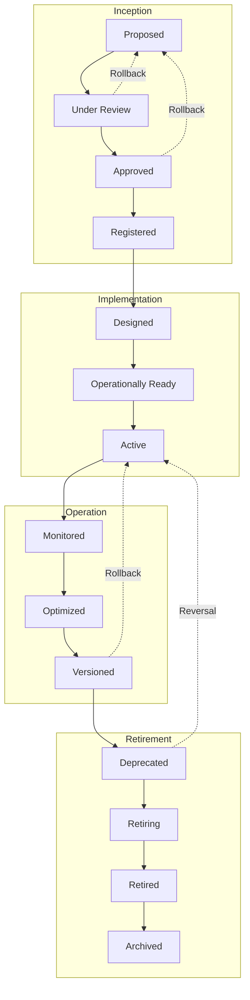
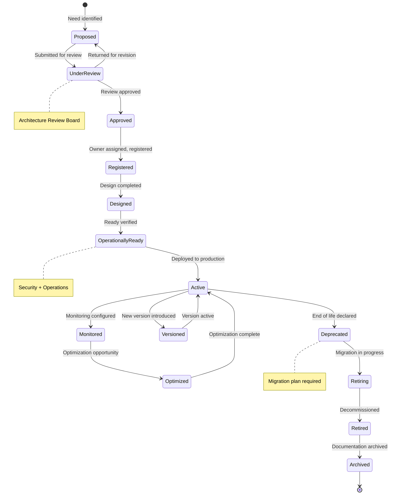
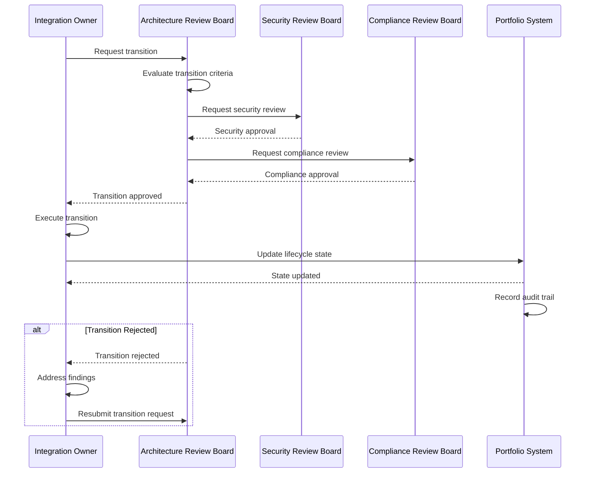
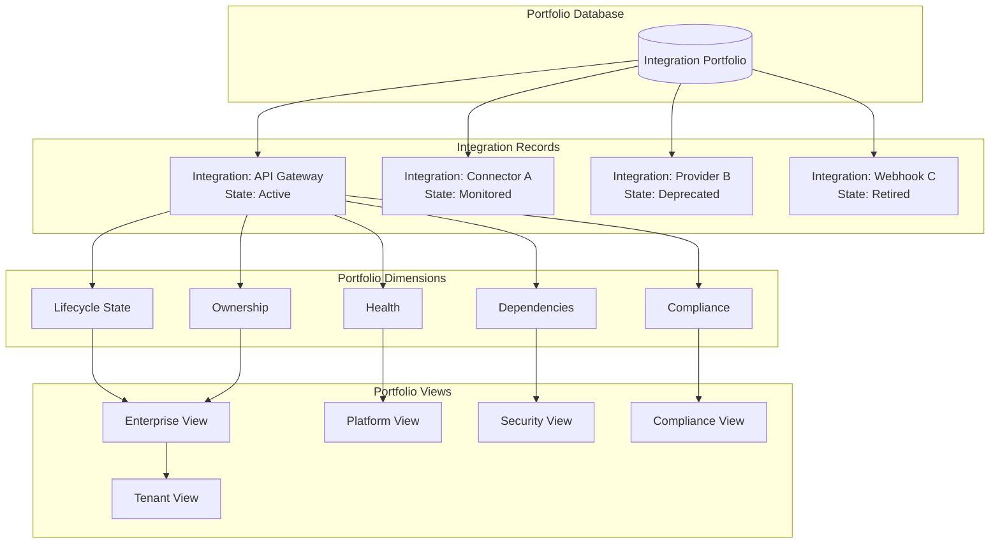
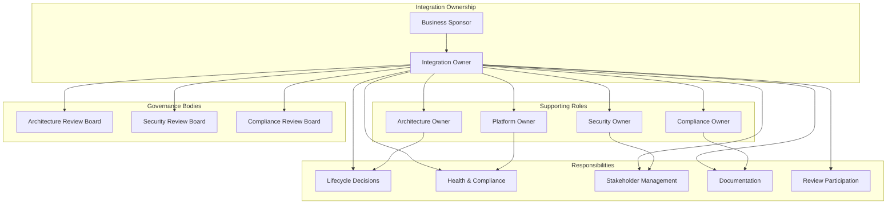
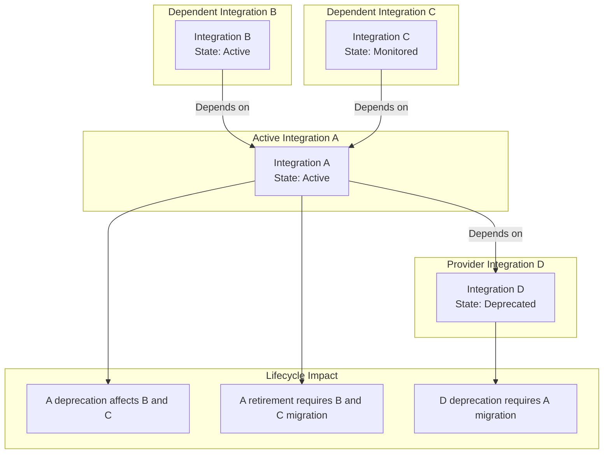
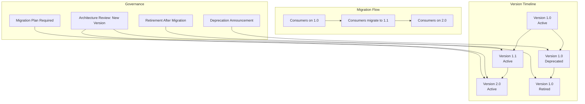
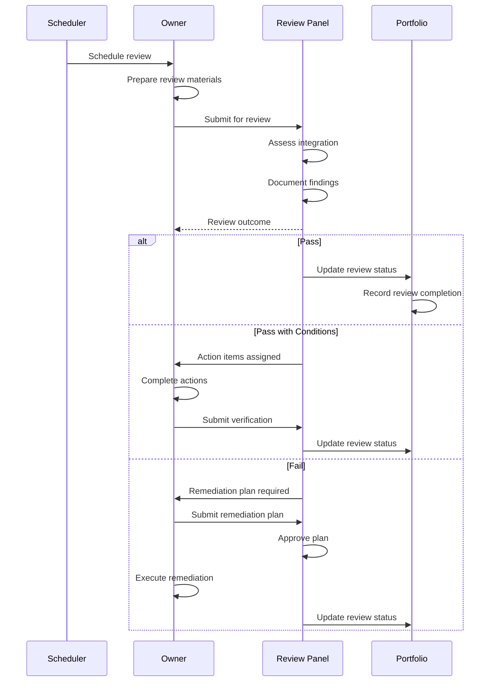
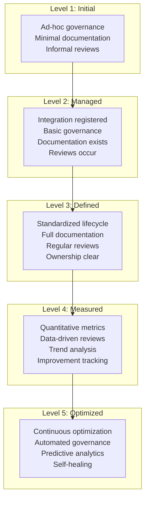
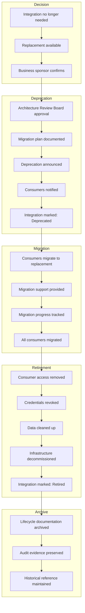

# Integration Lifecycle Architecture

**KB-106 — Integration Lifecycle Architecture Specification**

| Metadata | |
|----------|---|
| **KB ID** | KB-106 |
| **Title** | Integration Lifecycle Architecture |
| **Version** | 0.1.0 |
| **Status** | Draft |
| **Owner** | Architecture Team |
| **Suite** | Platform Integration Architecture |
| **Dependencies** | KB-094 Integration Platform Architecture, KB-095 Integration Connector Architecture, KB-096 API Gateway Architecture, KB-097 Webhook Architecture, KB-098 Integration Policy Architecture, KB-099 Secrets & Credential Management Architecture, KB-100 Service Discovery Architecture, KB-101 External Provider Management Architecture, KB-102 Identity Federation Architecture, KB-103 Enterprise Connectivity Architecture, KB-104 API Management Architecture, KB-105 Integration Observability Architecture |
| **Related Documents** | KB-073 Data Platform Architecture, KB-074 Data Modeling & Schema Governance, KB-077 Event & Messaging Architecture |
| **Review Status** | Pending |
| **Last Updated** | 2026-07-11 |

---

### Revision History

| Version | Date | Author | Change |
|---------|------|--------|--------|
| 0.1.0 | 2026-07-11 | AI Architecture Agent | Initial draft |

---

## 1. Executive Summary

### 1.1 Purpose

This document defines the Integration Lifecycle Architecture for the DUKADESK Platform. The Integration Lifecycle is the enterprise governance layer that coordinates all integration-related architectural assets throughout their operational lifespan — from proposal through retirement.

Every integration within DUKADESK follows a governed enterprise lifecycle. No integration may exist outside the canonical lifecycle model, ensuring consistent governance, security, compliance, ownership, observability, and long-term architectural integrity across the entire platform.

The Integration Lifecycle Architecture standardizes how APIs, connectors, webhooks, event integrations, external providers, identity federation, enterprise connectivity, and future integration capabilities are proposed, evaluated, approved, introduced, operated, evolved, monitored, deprecated, replaced, and retired.

This document defines architecture only. It is vendor-independent, technology-independent, and implementation-independent.

### 1.2 Scope

**In scope:**

- Integration Lifecycle Model: Unified lifecycle governing every integration type
- Lifecycle States: Canonical states from proposal through archival
- State Transition Model: Valid transitions, approvals, checkpoints, and rollback paths
- Integration Portfolio: Enterprise-wide inventory and lifecycle visibility
- Ownership Model: Business, architecture, platform, operations, security, compliance ownership
- Dependency Management: Lifecycle dependencies among APIs, connectors, providers, events, webhooks
- Version Evolution: Introducing, operating, and retiring integration versions
- Lifecycle Review Architecture: Recurring governance reviews
- Maturity Model: Architectural maturity levels and portfolio-wide assessment
- Lifecycle Governance: Approvals, boards, policies, compliance
- Retirement Governance: Deprecation, consumer migration, decommissioning

**Out of scope:**
- Runtime implementation (covered by KB-051, KB-060)
- CI/CD implementation
- Deployment implementation
- Project management processes
- Development workflows

---

## 2. Architectural Principles

### 2.1 Lifecycle Governance by Default

Every integration is governed by the lifecycle model from the moment it is proposed. No integration can exist outside the lifecycle. Governance is not optional — it is the default state for all integration capabilities.

### 2.2 Architecture Before Implementation

Every integration must pass architecture review before implementation begins. Architecture approval ensures that integrations align with platform standards, security requirements, and enterprise strategy before resources are committed.

### 2.3 Policy-Driven Evolution

Integration evolution is governed by policies, not ad-hoc decisions. Policies define when an integration can transition between lifecycle stages, what approvals are required, and what conditions must be met.

### 2.4 Enterprise Ownership

Every integration has a designated owner. Ownership is enterprise-level — the owner is accountable for the integration throughout its entire lifecycle. Ownership cannot be abandoned. When an owner changes, responsibility is explicitly transferred.

### 2.5 Security Throughout the Lifecycle

Security is evaluated at every lifecycle stage. Security reviews are not one-time events — they recur throughout the integration's lifespan. Security posture must be maintained for an integration to remain in an active state.

### 2.6 Continuous Compliance

Compliance is continuously validated throughout the integration lifecycle. Every stage transition includes compliance verification. Active integrations are periodically re-certified for compliance.

### 2.7 Risk-Aware Decision Making

Lifecycle decisions are risk-aware. Each state transition is evaluated for risk. Higher-risk transitions require higher-level approvals. Risk assessment is documented and tracked throughout the lifecycle.

### 2.8 Reuse Before Replacement

Before a new integration is proposed, existing integrations are evaluated for reuse. Reuse reduces portfolio complexity, operational cost, and governance overhead. Replacement is considered only when reuse is infeasible.

### 2.9 Standardized Governance

Lifecycle governance is standardized across all integration types. APIs, connectors, webhooks, events, providers, federation, and connectivity follow the same lifecycle model. Standardization ensures consistent governance across the entire integration portfolio.

### 2.10 Continuous Improvement

Integration lifecycle processes are continuously improved. Lessons from lifecycle events (reviews, transitions, retirements) are captured and used to improve the lifecycle model itself.

---

## 3. Canonical Definitions

### 3.1 Integration

A governed connection between two or more systems, services, or components that enables communication, data exchange, or capability sharing. Integrations include APIs, connectors, webhooks, event integrations, external providers, identity federation, enterprise connectivity, and other integration capabilities.

### 3.2 Integration Portfolio

The complete collection of all integrations within the DUKADESK platform. The portfolio provides enterprise-wide visibility into integration inventory, lifecycle state, ownership, health, and compliance status.

### 3.3 Integration Lifecycle

The complete lifespan of an integration from initial proposal through final retirement and archival. The lifecycle defines the stages, transitions, approvals, and governance that every integration follows.

### 3.4 Lifecycle Stage

A major phase in the integration lifecycle. Stages represent broad categories of integration activity: inception, implementation, operation, and retirement.

### 3.5 Lifecycle State

A specific, discrete condition within a lifecycle stage. States define precisely where an integration is in its lifecycle. Each state has defined entry criteria, activities, and exit criteria.

### 3.6 Lifecycle Transition

A governed movement of an integration from one lifecycle state to another. Transitions require approval, documentation, and verification of entry/exit criteria.

### 3.7 Integration Owner

The enterprise role accountable for an integration throughout its entire lifecycle. The owner is responsible for governance, compliance, health, and lifecycle decisions.

### 3.8 Integration Sponsor

The business role that requested the integration and validates its ongoing business value. The sponsor approves major lifecycle decisions and provides business context.

### 3.9 Integration Review

A formal assessment of an integration at a specific lifecycle checkpoint. Reviews evaluate business value, operational health, security posture, compliance status, cost efficiency, technical alignment, and strategic relevance.

### 3.10 Integration Risk

The assessed level of risk associated with an integration or a lifecycle transition. Risk is evaluated across security, compliance, operational, financial, and strategic dimensions.

### 3.11 Integration Readiness

A measure of whether an integration meets all requirements to transition to the next lifecycle state. Readiness is evaluated against defined entry criteria.

### 3.12 Operational Acceptance

The formal confirmation that an integration is ready for production operation. Operational acceptance validates that all operational requirements are met — monitoring, alerting, support, documentation, runbooks.

### 3.13 Lifecycle Governance

The policies, processes, boards, and roles that govern integration lifecycle decisions. Governance ensures that lifecycle transitions are authorized, documented, and auditable.

### 3.14 Lifecycle Audit

A formal review of an integration's lifecycle history. Audits verify that all lifecycle transitions followed governance requirements and that documentation is complete.

### 3.15 Lifecycle Policy

A formal rule governing lifecycle behavior. Policies define transition criteria, approval requirements, review cadences, and compliance validation rules.

### 3.16 Integration Maturity

A measure of an integration's operational maturity, governance compliance, and technical quality. Maturity is assessed against the integration maturity model.

### 3.17 Lifecycle Metrics

Quantitative measurements of lifecycle performance. Metrics include time-in-state, transition velocity, review completion rate, compliance rate, retirement rate.

### 3.18 Deprecation

The formal process of marking an integration as no longer recommended for new use. Deprecation initiates the consumer migration period.

### 3.19 Retirement

The formal process of decommissioning an integration. Retirement includes consumer migration, data cleanup, credential revocation, and final decommissioning.

### 3.20 Replacement

The process of replacing a retired integration with a new integration. Replacement includes capability gap analysis, migration planning, and cutover coordination.

---

## 4. Enterprise Lifecycle Model

### 4.1 Lifecycle Architecture

The Integration Lifecycle follows a structured architecture with four major stages, each containing multiple states:

```
+====================+
|     INCEPTION      |
|  Proposed → Under  |
|  Review → Approved |
|  → Registered      |
+====================+
         |
         v
+====================+
|  IMPLEMENTATION    |
|  Designed →        |
|  Operationally     |
|  Ready → Active    |
+====================+
         |
         v
+====================+
|     OPERATION      |
|  Monitored →       |
|  Optimized →       |
|  Versioned         |
+====================+
         |
         v
+====================+
|    RETIREMENT      |
|  Deprecated →      |
|  Retiring →        |
|  Retired →         |
|  Archived          |
+====================+
```

### 4.2 Stage 1: Inception

The inception stage covers the initial identification, evaluation, and approval of an integration need.

**States:** Proposed, Under Review, Approved, Registered

**Key activities:** Need identification, business case development, architecture review, risk assessment, security review, compliance review, approval, registration

**Governance:** Architecture Review Board approval required. Security and compliance sign-off required.

### 4.3 Stage 2: Implementation

The implementation stage covers the design, development, and operational preparation of the integration.

**States:** Designed, Operationally Ready, Active

**Key activities:** Solution design, architecture validation, development, testing, security validation, operational readiness verification, production deployment

**Governance:** Design review required. Security validation required. Operational acceptance required.

### 4.4 Stage 3: Operation

The operation stage covers the active lifespan of the integration, including monitoring, optimization, and version evolution.

**States:** Monitored, Optimized, Versioned

**Key activities:** Continuous monitoring, periodic review, performance optimization, version management, dependency management, health management

**Governance:** Periodic reviews required. Version changes require review. Optimizations require approval.

### 4.5 Stage 4: Retirement

The retirement stage covers the planned decommissioning of the integration.

**States:** Deprecated, Retiring, Retired, Archived

**Key activities:** Deprecation announcement, consumer migration, data cleanup, credential revocation, decommissioning, archival

**Governance:** Retirement plan approval required. Consumer migration plan required. Compliance sign-off required.

---

## 5. Lifecycle States

### 5.1 State Model

Each lifecycle state has defined entry criteria, activities, exit criteria, and governance requirements.

### 5.2 Proposed

**Definition:** An integration need has been identified and documented. A proposal exists but no formal review has been conducted.

**Entry criteria:**
- Integration need documented
- Business sponsor identified
- Initial scope defined

**Activities:**
- Document business case
- Identify initial stakeholders
- Assess feasibility

**Exit criteria:**
- Complete proposal package submitted for review

### 5.3 Under Review

**Definition:** The integration proposal is being evaluated by the Architecture Review Board.

**Entry criteria:**
- Complete proposal package received
- Review board meeting scheduled

**Activities:**
- Architecture review
- Risk assessment
- Security review
- Compliance review
- Business value assessment

**Exit criteria:**
- Review completed
- Decision documented (approved, rejected, or returned for revision)

### 5.4 Approved

**Definition:** The integration has been approved for implementation. Resources can be committed.

**Entry criteria:**
- Architecture review approved
- Security review approved
- Compliance review approved
- Risk assessment accepted

**Activities:**
- Assign integration owner
- Register integration in portfolio
- Begin implementation planning

**Exit criteria:**
- Integration registered in portfolio
- Owner assigned
- Implementation plan approved

### 5.5 Registered

**Definition:** The integration is registered in the enterprise integration portfolio. Implementation may begin.

**Entry criteria:**
- Portfolio registration complete
- Owner assigned
- Implementation plan approved

**Activities:**
- Begin design and development
- Conduct design review

**Exit criteria:**
- Design completed
- Design review approved

### 5.6 Designed

**Definition:** The integration design is complete and has passed architecture validation.

**Entry criteria:**
- Design documented
- Design review approved
- Architecture validation passed

**Activities:**
- Complete development
- Conduct security testing
- Prepare operational documentation

**Exit criteria:**
- Development complete
- Security testing passed
- Operational documentation complete

### 5.7 Operationally Ready

**Definition:** The integration is ready for production deployment. All operational requirements are met.

**Entry criteria:**
- Security validation passed
- Operational readiness verified
- Monitoring configured
- Runbooks complete
- Support team trained

**Activities:**
- Production deployment
- Initial monitoring verification

**Exit criteria:**
- Production deployment successful
- Initial health check passed

### 5.8 Active

**Definition:** The integration is in production operation. It is being consumed by authorized consumers.

**Entry criteria:**
- Production deployment verified
- Initial health check passed
- Consumer access enabled

**Activities:**
- Operational monitoring
- Health verification
- Consumer support

**Exit criteria:**
- Periodic review completed
- Health maintained within SLOs

### 5.9 Monitored

**Definition:** The integration is actively monitored for health, performance, and compliance.

**Entry criteria:**
- Monitoring dashboards active
- Alerts configured
- SLOs defined

**Activities:**
- Continuous health monitoring
- Periodic performance review
- Compliance verification
- Dependency health tracking

**Exit criteria:**
- Monitoring verified
- Periodic review completed

### 5.10 Optimized

**Definition:** The integration is being optimized for performance, cost, or operational efficiency.

**Entry criteria:**
- Optimization opportunity identified
- Optimization plan approved

**Activities:**
- Performance optimization
- Cost optimization
- Reliability improvement

**Exit criteria:**
- Optimization complete
- Improvement verified

### 5.11 Versioned

**Definition:** A new version of the integration is being introduced. The existing version remains active until consumers migrate.

**Entry criteria:**
- New version approved
- Version migration plan documented

**Activities:**
- New version deployment
- Consumer migration coordination
- Old version deprecation

**Exit criteria:**
- All consumers migrated
- Old version deprecated

### 5.12 Deprecated

**Definition:** The integration is marked as no longer recommended for new use. Existing consumers are notified.

**Entry criteria:**
- Deprecation approved
- Consumer migration plan in place
- Replacement available (if applicable)

**Activities:**
- Deprecation announcement
- Consumer notification
- Migration support

**Exit criteria:**
- All consumers notified
- Migration period elapsed

### 5.13 Retiring

**Definition:** The integration is in the process of being decommissioned. Active consumers are being migrated.

**Entry criteria:**
- Deprecation period elapsed
- Remaining consumers being migrated
- Decommissioning plan approved

**Activities:**
- Consumer migration completion
- Data cleanup
- Credential revocation
- Integration removal

**Exit criteria:**
- All consumers migrated
- Data cleanup complete
- Credentials revoked

### 5.14 Retired

**Definition:** The integration has been decommissioned. It is no longer available.

**Entry criteria:**
- Decommissioning complete
- Data cleanup verified
- Credentials revoked

**Activities:**
- Final verification
- Audit documentation
- Portfolio status update

**Exit criteria:**
- Retirement documented
- Portfolio updated

### 5.15 Archived

**Definition:** The integration's lifecycle documentation is archived for historical reference and compliance.

**Entry criteria:**
- Retirement complete
- Documentation complete
- Audit requirements satisfied

**Activities:**
- Lifecycle documentation archival
- Historical reference preservation
- Compliance record retention

**Exit criteria:**
- Archive complete
- Retention period set

---

## 6. State Transition Model

### 6.1 Transition Governance

Every state transition is governed by defined entry criteria, approval requirements, and documentation.

### 6.2 Allowed Transitions

```
Proposed → Under Review → Approved → Registered → Designed → Operationally Ready → Active → Monitored → Optimized → Versioned → Deprecated → Retiring → Retired → Archived
```

**Rollback paths:**
- Under Review → Proposed (returned for revision)
- Approved → Proposed (if business case changes)
- Active → Monitored (automatic on monitoring configuration)
- Versioned → Active (if version change is minor)
- Deprecated → Active (if deprecation is reversed)

### 6.3 Transition Criteria

Each transition must satisfy:
1. **Entry criteria**: All conditions for entering the target state are met
2. **Governance check**: Required approvals are obtained
3. **Documentation**: Transition is documented in the lifecycle record
4. **Notification**: Affected stakeholders are notified
5. **Verification**: Transition is verified after completion

### 6.4 Transition Approvals

| Transition | Required Approval | Level |
|------------|------------------|-------|
| Proposed → Under Review | Integration Owner | Standard |
| Under Review → Approved | Architecture Review Board | High |
| Approved → Registered | Integration Owner | Standard |
| Registered → Designed | Architecture Review | Standard |
| Designed → Operationally Ready | Security + Operations | High |
| Operationally Ready → Active | Operations | Standard |
| Active → Deprecated | Architecture Review Board | High |
| Deprecated → Retiring | Architecture Review Board | High |
| Retiring → Retired | Compliance + Operations | High |
| Retired → Archived | Compliance | Standard |

---

## 7. Integration Portfolio

### 7.1 Portfolio Architecture

The Integration Portfolio is the enterprise-wide inventory of all integrations. It provides visibility into every integration's lifecycle state, ownership, health, and compliance status.

**Portfolio dimensions:**
- Integration identification (ID, name, type, version)
- Lifecycle state (current state, last transition, time-in-state)
- Ownership (owner, sponsor, team)
- Health (status, SLO compliance, last health check)
- Compliance (last review, next review, compliance status)
- Dependencies (upstream and downstream dependencies)
- Documentation (links to design, runbooks, audit records)

### 7.2 Portfolio Visibility

The portfolio provides role-based visibility:

- **Enterprise Architecture**: Full portfolio visibility
- **Platform Engineering**: Integration health and operations
- **Security**: Security posture and compliance
- **Compliance**: Audit readiness and retention
- **Product Teams**: Their integrations
- **Tenant Administrators**: Tenant-relevant integrations
- **Business Owners**: Business value and strategy alignment

### 7.3 Portfolio Governance

The portfolio is governed to ensure accuracy and completeness:

- All integrations must be registered
- State changes must be reflected within defined SLA
- Ownership must be current
- Health status must be current
- Review dates must be current

---

## 8. Ownership Model

### 8.1 Ownership Structure

Every integration has a defined ownership structure:

- **Business Sponsor**: Validates business value, approves major decisions
- **Integration Owner**: Enterprise accountability for the integration lifecycle
- **Architecture Owner**: Technical governance and architectural alignment
- **Platform Owner**: Operational management and platform integration
- **Security Owner**: Security posture and compliance
- **Compliance Owner**: Regulatory compliance and audit readiness

### 8.2 Ownership Responsibilities

| Role | Responsibilities |
|------|-----------------|
| Business Sponsor | Business case, value validation, funding approval, strategic alignment |
| Integration Owner | Lifecycle governance, compliance, health, stakeholder management, documentation |
| Architecture Owner | Technical design, architecture review, standards compliance, technology evolution |
| Platform Owner | Operational health, monitoring, support, incident response, capacity management |
| Security Owner | Security review, threat assessment, vulnerability management, security compliance |
| Compliance Owner | Regulatory compliance, data governance, audit support, policy enforcement |

### 8.3 Ownership Transfer

When an integration owner changes, ownership is explicitly transferred:

1. Current owner documents integration status
2. New owner acknowledges responsibilities
3. Architecture Review Board approves transfer
4. Portfolio is updated
5. Transfer is documented

---

## 9. Dependency Management

### 9.1 Dependency Model

Integrations have dependencies on other integrations. Dependencies must be managed across the lifecycle to prevent cascading impacts.

**Dependency types:**
- **Upstream**: Integrations that this integration depends on
- **Downstream**: Integrations that depend on this integration
- **Peer**: Integrations that share dependencies or resources
- **Provider**: External systems or services that this integration consumes

### 9.2 Dependency Lifecycle

Dependencies affect lifecycle decisions:

- **Deprecation**: Cannot deprecate an integration while active dependents exist
- **Retirement**: Cannot retire an integration while active dependents exist
- **Version change**: Dependent integrations must be notified of version changes
- **Health impact**: Dependency health affects integration health assessment

### 9.3 Dependency Map

The dependency map provides visibility into integration relationships:

- Which integrations depend on this integration?
- Which integrations does this integration depend on?
- What is the critical path through the dependency graph?
- Which dependencies are approaching end-of-life?
- Which dependencies lack redundancy?

### 9.4 Dependency Governance

- All dependencies must be documented in the portfolio
- Dependency changes require notification to affected parties
- Dependency health is monitored and alerted
- Dependency risk is assessed as part of lifecycle reviews

---

## 10. Version Evolution

### 10.1 Version Model

Integrations evolve through versions. Versioning enables capability improvement without breaking existing consumers.

### 10.2 Version Types

- **Major version**: Breaking changes (backward-incompatible API changes, new connector protocol)
- **Minor version**: Backward-compatible additions (new endpoints, optional fields)
- **Patch version**: Bug fixes, performance improvements, security patches

### 10.3 Version Lifecycle

Each version follows its own lifecycle within the integration lifecycle:

```
Version Proposed → Version Designed → Version Implemented → Version Active → Version Deprecated → Version Retired
```

### 10.4 Version Governance

- New versions require architecture review
- Breaking changes require consumer migration planning
- Multiple versions may be active simultaneously during migration
- Old versions are deprecated after consumer migration
- Version compatibility is documented

### 10.5 Version Migration

When a new major version is introduced:

1. New version is deployed alongside the existing version
2. Consumers are notified of the new version and migration timeline
3. Consumers migrate at their own pace within the migration window
4. Old version is deprecated after migration window closes
5. Old version is retired after all consumers have migrated

---

## 11. Lifecycle Review Architecture

### 11.1 Review Model

Lifecycle reviews are recurring governance assessments that evaluate every active integration. Reviews ensure that integrations remain aligned with business needs, security requirements, compliance obligations, and platform standards.

### 11.2 Review Types

| Review Type | Cadence | Scope | Participants |
|-------------|---------|-------|--------------|
| Health Review | Monthly | Operational health, SLO compliance, incidents | Platform, Operations, Owner |
| Security Review | Quarterly | Security posture, vulnerabilities, threats | Security, Owner |
| Compliance Review | Quarterly | Regulatory compliance, policy adherence | Compliance, Owner |
| Architecture Review | Semi-annual | Technical alignment, standards compliance | Architecture, Owner |
| Business Value Review | Annual | ROI, strategic alignment, value realization | Sponsor, Owner, Architecture |

### 11.3 Review Process

1. **Scheduling**: Review is scheduled based on cadence
2. **Preparation**: Owner prepares review materials
3. **Assessment**: Review panel evaluates the integration
4. **Findings**: Review findings are documented
5. **Action Items**: Remediation actions are assigned
6. **Tracking**: Action items are tracked to completion
7. **Escalation**: Critical findings are escalated

### 11.4 Review Outcomes

- **Pass**: Integration meets all criteria. No action required.
- **Pass with conditions**: Integration meets criteria with minor findings. Action items assigned.
- **Conditional pass**: Integration requires remediation before next review. Action items with deadlines.
- **Fail**: Integration does not meet criteria. Remediation plan required. Possible lifecycle state change.
- **Critical fail**: Integration poses unacceptable risk. Immediate action required. Potential suspension.

---

## 12. Maturity Model

### 12.1 Maturity Levels

Integration maturity is assessed across five levels:

| Level | Name | Description |
|-------|------|-------------|
| 1 | Initial | Integration exists but governance is ad-hoc. Documentation is minimal. Reviews are informal. |
| 2 | Managed | Integration is registered. Basic governance is followed. Documentation exists. Reviews occur. |
| 3 | Defined | Integration follows standardized lifecycle processes. Full documentation. Regular reviews. |
| 4 | Measured | Integration lifecycle is quantitatively measured. Metrics drive improvement. Reviews are data-driven. |
| 5 | Optimized | Integration lifecycle is continuously optimized. Automated governance. Predictive analytics. |

### 12.2 Maturity Assessment

Maturity is assessed across dimensions:

- **Governance**: Lifecycle compliance, transition documentation, review completion
- **Documentation**: Design docs, runbooks, operational docs, audit trail
- **Security**: Security posture, vulnerability management, review cadence
- **Compliance**: Regulatory compliance, policy adherence, audit readiness
- **Operations**: Monitoring, alerting, incident response, SLO compliance
- **Ownership**: Owner assigned, responsibilities clear, transfer documented

### 12.3 Portfolio Maturity

Portfolio-wide maturity is calculated from individual integration maturities:

- Percentage of integrations at each maturity level
- Average portfolio maturity score
- Maturity distribution by integration type
- Maturity trends over time
- Maturity improvement velocity

---

## 13. Detailed Lifecycle

### 13.1 Proposal

An integration lifecycle begins with a proposal. Proposals document the integration need, business case, and initial scope.

**Proposal contents:**
- Integration name and type
- Business sponsor
- Business case and expected value
- Initial scope and boundaries
- Preliminary risk assessment
- Preliminary compliance requirements

### 13.2 Evaluation

The proposal is evaluated by the Architecture Review Board.

**Evaluation criteria:**
- Strategic alignment (does this support platform strategy?)
- Business value (is the expected value justified?)
- Technical feasibility (can this be implemented?)
- Security posture (are security requirements met?)
- Compliance requirements (are regulatory obligations met?)
- Risk assessment (are risks acceptable?)
- Reuse potential (does an existing integration address this need?)

### 13.3 Architecture Approval

If the evaluation is positive, architecture approval is granted.

**Approval documentation:**
- Architecture decision record
- Approved scope and design constraints
- Security and compliance sign-off
- Risk acceptance
- Implementation timeline expectations

### 13.4 Risk Review

A formal risk assessment is conducted before implementation.

**Risk dimensions:**
- Security risk: Data exposure, unauthorized access, vulnerability
- Operational risk: Availability, reliability, performance impact
- Compliance risk: Regulatory violations, data residency, privacy
- Financial risk: Implementation cost, operational cost
- Strategic risk: Technology lock-in, architectural misalignment

### 13.5 Security Review

Security review validates that the integration meets security requirements.

**Security review areas:**
- Authentication and authorization
- Data encryption (in transit and at rest)
- Secrets management
- Vulnerability assessment
- Security monitoring and alerting
- Incident response integration

### 13.6 Compliance Approval

Compliance review validates regulatory and policy adherence.

**Compliance review areas:**
- Data privacy regulations (GDPR, CCPA, LGPD)
- Data residency requirements
- Industry-specific regulations
- Internal policy compliance
- Audit trail requirements

### 13.7 Registration

The integration is registered in the enterprise integration portfolio.

**Registration data:**
- Integration ID (generated)
- Name and description
- Type (API, connector, webhook, event, provider, federation, connectivity)
- Version (initial version)
- Owner and sponsor
- Lifecycle state (Registered)
- Registration date
- Documentation links

### 13.8 Operational Readiness

Before production activation, operational readiness is verified.

**Readiness checklist:**
- Monitoring configured and verified
- Alerting configured and tested
- Dashboards created
- Runbooks documented
- Support team trained
- Escalation paths defined
- Backup and recovery procedures in place
- Capacity planned

### 13.9 Production Activation

The integration is deployed to production and activated for consumer use.

**Activation steps:**
- Production deployment
- Initial health verification
- Consumer access enabled
- Announcement to consumers
- Monitoring verification

### 13.10 Continuous Monitoring

Active integrations are continuously monitored for health, performance, and compliance.

**Monitoring scope:**
- Health and availability
- Performance and latency
- Error rates and failures
- Security events
- Compliance status
- Dependency health

### 13.11 Periodic Review

Active integrations undergo periodic reviews as defined in the review architecture.

### 13.12 Version Evolution

Integrations evolve through version changes as defined in the version evolution model.

### 13.13 Optimization

Integrations are optimized for performance, cost, and operational efficiency.

**Optimization opportunities:**
- Performance improvements
- Cost reduction
- Reliability enhancements
- Security hardening
- Compliance automation
- Self-service capabilities

### 13.14 Deprecation

When an integration is no longer needed, it enters the deprecation process.

**Deprecation process:**
1. Business sponsor confirms no further need
2. Architecture Review Board approves deprecation
3. Consumer migration plan is documented
4. Deprecation is announced with timeline
5. Consumers are notified individually
6. Integration is marked as Deprecated in the portfolio

### 13.15 Consumer Migration

During the deprecation period, consumers migrate to replacement capabilities.

**Migration support:**
- Migration documentation and guides
- Migration support period
- Technical assistance
- Cutover coordination

### 13.16 Retirement

After the migration period, the integration is retired.

**Retirement steps:**
1. Verify all consumers migrated
2. Remove consumer access
3. Revoke credentials and secrets
4. Clean up data and configuration
5. Decommission infrastructure
6. Update portfolio status to Retired
7. Archive lifecycle documentation

### 13.17 Archive

The integration's lifecycle documentation is archived.

**Archived documentation:**
- Complete lifecycle history
- All review records
- Audit evidence
- Design and operational documentation
- Retirement verification

### 13.18 Historical Reference

Archived integrations remain available for historical reference and compliance audits.

---

## 14. Governance

### 14.1 Governance Model

Lifecycle governance ensures that all integration lifecycle decisions are authorized, documented, and auditable.

### 14.2 Governance Bodies

**Architecture Review Board (ARB):**
- Reviews and approves integration proposals
- Approves major lifecycle transitions
- Governs architecture standards
- Resolves architecture conflicts

**Security Review Board (SRB):**
- Reviews security posture
- Approves security-sensitive transitions
- Governs security standards
- Reviews security incidents

**Compliance Review Board (CRB):**
- Reviews compliance status
- Approves compliance-sensitive transitions
- Governs compliance requirements
- Reviews compliance incidents

### 14.3 Governance Policies

- **Lifecycle Policy**: Defines canonical lifecycle stages, states, and transitions
- **Transition Policy**: Defines approval requirements for each transition
- **Review Policy**: Defines review cadences and requirements
- **Ownership Policy**: Defines ownership requirements and transfer process
- **Retirement Policy**: Defines deprecation and retirement requirements

### 14.4 Approval Workflows

Each lifecycle transition has a defined approval workflow:

1. Owner requests transition
2. Required reviewers are notified
3. Reviewers evaluate against criteria
4. Approvals are collected
5. Transition is executed
6. Portfolio is updated
7. Stakeholders are notified

### 14.5 Audit Trail

All lifecycle governance actions are recorded:

- Transition requests and approvals
- Review findings and outcomes
- Policy exceptions and waivers
- Ownership changes
- Compliance violations and remediation

---

## 15. Responsibilities

### 15.1 Enterprise Architecture

**Responsibilities:**
- Own the lifecycle architecture and governance model
- Chair the Architecture Review Board
- Govern portfolio standards and integration classification
- Ensure lifecycle consistency across integration types
- Drive lifecycle maturity improvement

### 15.2 Integration Governance Board

**Responsibilities:**
- Govern lifecycle policies and standards
- Approve major lifecycle transitions
- Resolve governance escalations
- Review portfolio health and maturity
- Drive governance improvement

### 15.3 Platform Engineering

**Responsibilities:**
- Operate the integration portfolio system
- Ensure lifecycle tracking accuracy
- Support lifecycle automation
- Provide portfolio reporting
- Manage operational readiness verification

### 15.4 Product Owners

**Responsibilities:**
- Business sponsor role for product integrations
- Validate ongoing business value
- Approve major lifecycle decisions
- Provide business context for reviews

### 15.5 Business Owners

**Responsibilities:**
- Sponsor integration proposals
- Validate business case
- Approve funding
- Review business value periodically

### 15.6 Operations & SRE

**Responsibilities:**
- Verify operational readiness
- Monitor integration health
- Support integration incidents
- Provide operational data for reviews

### 15.7 Security

**Responsibilities:**
- Conduct security reviews at each lifecycle stage
- Monitor security posture of active integrations
- Approve security-sensitive transitions
- Govern security standards

### 15.8 Compliance

**Responsibilities:**
- Conduct compliance reviews at each lifecycle stage
- Monitor compliance status of active integrations
- Approve compliance-sensitive transitions
- Govern compliance requirements

### 15.9 Audit Teams

**Responsibilities:**
- Verify lifecycle audit trail completeness
- Review lifecycle documentation
- Validate compliance evidence
- Report lifecycle governance audit findings

### 15.10 Tenant Administrators

**Responsibilities:**
- Review tenant-relevant integration lifecycle status
- Participate in migration planning for tenant integrations
- Provide tenant context for lifecycle decisions

### 15.11 Service Owners

**Responsibilities:**
- Own integration lifecycle for their services
- Complete lifecycle documentation
- Participate in reviews
- Ensure integration health

---

## 16. Security

### 16.1 Security Throughout the Lifecycle

Security is evaluated at every lifecycle stage. Security reviews are not one-time events — they recur throughout the integration's lifespan. Security posture must be maintained for an integration to remain in an active state.

### 16.2 Security Review at Each Stage

| Lifecycle Stage | Security Review |
|-----------------|-----------------|
| Proposed | Initial security screening |
| Under Review | Full security assessment |
| Approved | Security requirements documented |
| Designed | Design security review |
| Operationally Ready | Pre-production security validation |
| Active | Continuous security monitoring |
| Monitored | Periodic security review |
| Deprecated | Security impact of deprecation |
| Retiring | Secure decommissioning plan |
| Retired | Security verification of retirement |

### 16.3 Security Evidence

Each security review produces evidence that is retained for audit:

- Security assessment report
- Vulnerability scan results
- Penetration test results (for high-risk integrations)
- Security exception approvals
- Remediation verification

### 16.4 Zero Trust Validation

Lifecycle transitions include Zero Trust validation:

- Identity verification at each transition
- Authorization verification for transition approvals
- Integrity verification of transition documentation
- Continuous validation of security posture

### 16.5 Risk Reassessment

Security risk is reassessed at each lifecycle stage and during periodic reviews:

- Threat landscape changes
- Vulnerability discoveries
- Configuration changes
- Dependency changes
- Usage pattern changes

### 16.6 Secure Retirement

Retirement includes security-specific steps:

- Credential revocation
- Access removal
- Data cleanup (secure deletion)
- Secret rotation for shared resources
- Security configuration cleanup

### 16.7 Audit Preservation

Security audit records are preserved beyond the integration's retirement:

- Security review records
- Vulnerability assessment reports
- Incident response records
- Security exception documentation

---

## 17. Privacy

### 17.1 Privacy Impact Assessments

Privacy impact assessments are conducted during the inception stage and updated during periodic reviews.

**Assessment areas:**
- Personal data processed by the integration
- Data residency requirements
- Consent management requirements
- Data retention requirements
- Cross-border data transfer requirements

### 17.2 Data Residency Validation

Each integration validates data residency compliance:

- Data storage location compliance
- Data processing location compliance
- Cross-region data transfer compliance
- Regional regulatory compliance

### 17.3 Regulatory Compliance Reviews

Compliance reviews validate regulatory adherence:

- GDPR compliance (data protection, consent, right to erasure)
- CCPA/LGPD compliance (privacy rights, data inventory)
- Industry-specific regulations (HIPAA, PCI-DSS, SOC2)
- Regional regulations (data residency, data sovereignty)

### 17.4 Data Retention Alignment

Integration lifecycle aligns with data retention policies:

- Data retention periods are defined for each integration
- Retirement includes data cleanup per retention policies
- Archived lifecycle records comply with retention requirements
- Data disposal is verified and documented

### 17.5 Cross-Border Integration Assessment

Integrations that cross regional or national boundaries are assessed for compliance:

- Data transfer legal basis
- Cross-border data flow documentation
- Regional privacy authority requirements
- Data transfer impact assessment

### 17.6 Tenant Privacy Protection

Tenant privacy is protected throughout the lifecycle:

- Tenant data isolation is validated
- Cross-tenant data access is governed
- Tenant consent is respected
- Tenant data removal is supported

---

## 18. Performance

### 18.1 Portfolio Scalability

The lifecycle architecture and portfolio system scale to support enterprise volume:

- Support for thousands of integrations
- Real-time portfolio state updates
- Efficient dependency graph queries
- Scalable review management

### 18.2 Governance Scalability

Governance processes scale through automation:

- Automated transition approval workflows
- Automated review scheduling
- Automated compliance verification
- Automated portfolio reporting

### 18.3 Review Efficiency

Reviews are efficient and actionable:

- Standardized review templates
- Automated data collection for reviews
- Pre-populated review materials
- Action item tracking and automation

### 18.4 Lifecycle Automation Readiness

The architecture is designed for progressive automation:

- Stage transitions can be automated for low-risk changes
- Compliance verification can be automated
- Portfolio updates can be automated
- Reporting can be automated

### 18.5 Large-Scale Dependency Analysis

Dependency analysis supports enterprise scale:

- Automated dependency discovery
- Impact analysis for dependency changes
- Critical path identification
- Dependency risk scoring

### 18.6 Enterprise Reporting

Portfolio reporting provides enterprise visibility:

- Lifecycle state distribution
- Portfolio health summary
- Maturity assessment results
- Compliance status summary
- Retirement pipeline visibility

---

## 19. Observability

### 19.1 Lifecycle Dashboards

Dashboards provide visibility into integration lifecycle status:

- **Portfolio Dashboard**: All integrations by lifecycle state, type, owner
- **Transition Dashboard**: Recent and pending lifecycle transitions
- **Review Dashboard**: Upcoming, in-progress, and overdue reviews
- **Compliance Dashboard**: Compliance status by integration
- **Retirement Dashboard**: Deprecation and retirement pipeline

### 19.2 Portfolio Health

Portfolio health metrics measure the overall health of the integration portfolio:

- Percentage of integrations in Active state
- Percentage of integrations with current reviews
- Percentage of integrations with assigned owners
- Percentage of integrations with complete documentation
- Average time-in-state metrics

### 19.3 Governance Metrics

Governance metrics measure lifecycle governance effectiveness:

- Review completion rate (reviews completed on time)
- Transition approval time (time from request to approval)
- Policy compliance rate (percentage of compliant transitions)
- Audit finding rate (findings per review)
- Exception rate (policy exceptions granted)

### 19.4 Maturity Indicators

Maturity indicators track portfolio maturity over time:

- Average maturity level
- Maturity distribution by integration type
- Maturity improvement velocity
- Maturity by lifecycle stage

### 19.5 Risk Reporting

Risk reporting provides visibility into lifecycle risks:

- Integrations with overdue reviews
- Integrations with expired security certifications
- Integrations with unresolved findings
- Integrations with ownership gaps
- Integrations approaching end-of-life

---

## 20. Failure Scenarios

### 20.1 Abandoned Integrations

**Scenario:** An integration is left in an intermediate lifecycle state with no active owner. No one is advancing or retiring it.

**Impact:** Portfolio clutter. Governance gaps. Security and compliance risk from unmanaged integrations.

**Mitigation:**
- Automatic owner assignment at registration
- Owner validation at periodic reviews
- Escalation for integrations without active owners
- Time-in-state alerts (integration stuck in a state too long)

### 20.2 Missing Ownership

**Scenario:** An integration has no documented owner. Lifecycle decisions cannot be made.

**Impact:** Governance paralysis. Integration cannot transition. Reviews cannot be conducted.

**Mitigation:**
- Ownership is mandatory for registration
- Ownership verification at each transition
- Automated owner validation before reviews
- Escalation path for owner vacancies

### 20.3 Lifecycle Bypass

**Scenario:** An integration is deployed to production without following the lifecycle governance process. Required reviews were skipped.

**Impact:** Security and compliance risk. Integration may not meet platform standards. No audit trail.

**Mitigation:**
- Automated portfolio validation
- Integration discovery and registration enforcement
- Security scanning for unregistered integrations
- Compliance auditing for lifecycle adherence

### 20.4 Unauthorized Deployment

**Scenario:** An integration is deployed without operational readiness verification. Monitoring, alerting, and runbooks are not in place.

**Impact:** Operational risk. Integration issues may go undetected. Incident response is impaired.

**Mitigation:**
- Operational readiness gate in the transition from Designed to Operationally Ready
- Automated readiness checklist verification
- Pre-deployment validation
- Post-deployment verification

### 20.5 Failed Migration

**Scenario:** Consumers cannot migrate from a deprecated integration to its replacement. Migration is stalled.

**Impact:** Deprecated integration cannot be retired. Multiple integration versions must be maintained.

**Mitigation:**
- Migration plan review and approval
- Migration support period
- Migration progress tracking
- Escalation for stalled migrations
- Force migration timeline with executive approval

### 20.6 Incomplete Retirement

**Scenario:** An integration is marked as Retired but infrastructure, credentials, or data remain.

**Impact:** Security risk from orphaned resources. Compliance risk from unmanaged data.

**Mitigation:**
- Retirement checklist with verification steps
- Automated credential revocation
- Infrastructure decommissioning verification
- Post-retirement security scan
- Audit verification of retirement completeness

### 20.7 Dependency Conflicts

**Scenario:** A dependency change (upgrade, deprecation, retirement) conflicts with the dependent integration's lifecycle.

**Impact:** Integration may break. Consumer impact if dependency is unavailable.

**Mitigation:**
- Dependency change notification
- Impact analysis before dependency changes
- Coordinated lifecycle transitions for dependencies
- Dependency health monitoring

### 20.8 Compliance Failure

**Scenario:** An integration fails its compliance review. Compliance posture is non-compliant.

**Impact:** Regulatory risk. Potential penalties. Integration may need to be suspended.

**Mitigation:**
- Compliance review scheduling and enforcement
- Remediation plan requirements for failures
- Compliance state (compliant, non-compliant, under remediation)
- Escalation for critical compliance failures

### 20.9 Security Review Omission

**Scenario:** A security review is not conducted at a required lifecycle stage. Security risk is not assessed.

**Impact:** Security vulnerabilities may go undetected. Integration may be exposed to threats.

**Mitigation:**
- Mandatory security review gates at each stage
- Automated security review scheduling
- Security review completion verification before stage transitions
- Alerting on missing security reviews

### 20.10 Version Fragmentation

**Scenario:** Multiple versions of the same integration are active simultaneously with no migration plan. Version proliferation increases operational complexity.

**Impact:** Operational overhead. Consumer confusion. Support burden.

**Mitigation:**
- Version lifecycle policy (maximum concurrent versions)
- Version migration timeline requirements
- Version sunset enforcement
- Portfolio version tracking

### 20.11 Portfolio Sprawl

**Scenario:** The integration portfolio grows without governance. Duplicate, overlapping, or obsolete integrations accumulate.

**Impact:** Portfolio complexity. Operational cost. Governance overhead. Security surface area.

**Mitigation:**
- Portfolio review at regular intervals
- Duplicate integration detection
- Integration consolidation planning
- Portfolio optimization initiatives

### 20.12 Governance Inconsistency

**Scenario:** Lifecycle governance is applied inconsistently across integration types or teams. Some integrations follow the lifecycle while others do not.

**Impact:** Uneven governance coverage. Governance gaps. Audit findings.

**Mitigation:**
- Standardized lifecycle model for all integration types
- Automated governance enforcement where possible
- Governance compliance auditing
- Governance improvement program

---

## 21. Anti-Patterns

### 21.1 Lifecycle-Free Integrations

Integrations that exist without following the lifecycle model are an anti-pattern.

**Why it is harmful:**
- No governance or oversight
- No security or compliance review
- No documentation or audit trail
- Unknown operational risk

### 21.2 Unapproved Integrations

Integrations deployed without architecture approval are an anti-pattern.

**Why it is harmful:**
- May not align with platform architecture
- May introduce security vulnerabilities
- May duplicate existing capabilities
- No governance record

### 21.3 Orphaned Integrations

Integrations without an active owner are an anti-pattern.

**Why it is harmful:**
- No accountability for lifecycle decisions
- Cannot conduct reviews
- Cannot respond to issues
- Cannot plan retirement

### 21.4 Skipped Reviews

Lifecycle transitions that occur without required reviews are an anti-pattern.

**Why it is harmful:**
- Security and compliance risks not assessed
- Operational readiness not verified
- No governance record
- Audit non-compliance

### 21.5 Permanent Legacy Integrations

Integrations that remain active indefinitely without review or retirement planning are an anti-pattern.

**Why it is harmful:**
- Technology debt accumulation
- Security risk from unmaintained integrations
- Operational cost without business value
- Portfolio bloat

### 21.6 Unmanaged Version Proliferation

Allowing unlimited concurrent versions of an integration is an anti-pattern.

**Why it is harmful:**
- Operational complexity
- Consumer confusion
- Support burden
- Security surface area expansion

### 21.7 Hidden Dependencies

Dependencies that are not documented in the portfolio are an anti-pattern.

**Why it is harmful:**
- Cannot assess impact of dependency changes
- Cannot plan coordinated lifecycle transitions
- Risk of breaking changes without warning
- Incomplete dependency graph

### 21.8 Manual Portfolio Tracking

Relying on manual processes (spreadsheets, documents) for portfolio management is an anti-pattern.

**Why it is harmful:**
- Data inconsistency
- Stale information
- No automation
- Human error risk

### 21.9 Retirement Without Migration

Retiring an integration without a consumer migration plan is an anti-pattern.

**Why it is harmful:**
- Consumer impact (broken integrations)
- Business disruption
- Trust erosion
- Emergency reinstatement risk

---

## 22. Future Evolution

### 22.1 AI-Assisted Lifecycle Governance

AI assists in lifecycle governance decisions:

- Automated review data collection and analysis
- AI-powered risk assessment for transitions
- Recommendation engine for lifecycle decisions
- Anomaly detection in lifecycle behavior

### 22.2 Autonomous Portfolio Optimization

Portfolio optimization becomes autonomous:

- Automated duplicate detection and consolidation recommendations
- Automated retirement candidate identification
- Automated portfolio health remediation
- Continuous portfolio optimization

### 22.3 Predictive Lifecycle Analysis

Predictive analytics forecast lifecycle events:

- Retirement timing prediction
- Review outcome prediction
- Risk escalation prediction
- Migration completion prediction

### 22.4 Intelligent Retirement Planning

Retirement planning is AI-assisted:

- Automated consumer identification
- Migration impact analysis
- Migration timeline optimization
- Risk-aware retirement sequencing

### 22.5 Self-Governing Integration Ecosystems

Integration ecosystems become self-governing:

- Automatic lifecycle state enforcement
- Automated review scheduling and execution
- Automatic compliance verification
- Self-healing governance gaps

### 22.6 Continuous Architecture Validation

Architecture validation is continuous:

- Real-time architecture compliance checking
- Automated architecture drift detection
- Continuous standards enforcement
- Automated remediation recommendations

### 22.7 Digital Governance Assistants

AI-powered assistants support governance activities:

- Natural language queries for portfolio status
- Automated review preparation
- Intelligent transition recommendations
- Governance policy question answering

### 22.8 Autonomous Compliance Verification

Compliance verification becomes autonomous:

- Continuous compliance monitoring
- Automated evidence collection
- Real-time compliance dashboards
- Automated compliance reporting

---

## 23. Cross-References

| Reference | Relationship |
|-----------|-------------|
| KB-094 Integration Platform Architecture | Lifecycle governance for all integration platform capabilities |
| KB-095 Integration Connector Architecture | Connector lifecycle — design, operation, retirement |
| KB-096 API Gateway Architecture | API lifecycle — versioning, deprecation, retirement |
| KB-097 Webhook Architecture | Webhook lifecycle — registration, operation, decommissioning |
| KB-098 Integration Policy Architecture | Policy lifecycle — creation, enforcement, retirement |
| KB-099 Secrets & Credential Management Architecture | Credential lifecycle coordination with integration retirement |
| KB-100 Service Discovery Architecture | Service registration and discovery lifecycle |
| KB-101 External Provider Management Architecture | Provider integration lifecycle — onboarding, operation, offboarding |
| KB-102 Identity Federation Architecture | Federation lifecycle — trust establishment, operation, revocation |
| KB-103 Enterprise Connectivity Architecture | Connectivity lifecycle — provisioning, operation, decommissioning |
| KB-104 API Management Architecture | API lifecycle management — publish, version, deprecate, retire |
| KB-105 Integration Observability Architecture | Observability of lifecycle state, transitions, and health |

---

## 24. Architecture Diagrams

### 24.1 Enterprise Integration Lifecycle



### 24.2 Lifecycle State Machine



### 24.3 Governance Workflow



### 24.4 Integration Portfolio Architecture



### 24.5 Ownership Model



### 24.6 Dependency Lifecycle Map



### 24.7 Version Evolution Model



### 24.8 Lifecycle Review Process



### 24.9 Integration Maturity Model



### 24.10 Retirement & Replacement Flow



---

## 25. References

- KB-094 Integration Platform Architecture
- KB-095 Integration Connector Architecture
- KB-096 API Gateway Architecture
- KB-097 Webhook Architecture
- KB-098 Integration Policy Architecture
- KB-099 Secrets & Credential Management Architecture
- KB-100 Service Discovery Architecture
- KB-101 External Provider Management Architecture
- KB-102 Identity Federation Architecture
- KB-103 Enterprise Connectivity Architecture
- KB-104 API Management Architecture
- KB-105 Integration Observability Architecture

---

*End of KB-106 — Integration Lifecycle Architecture Specification*
