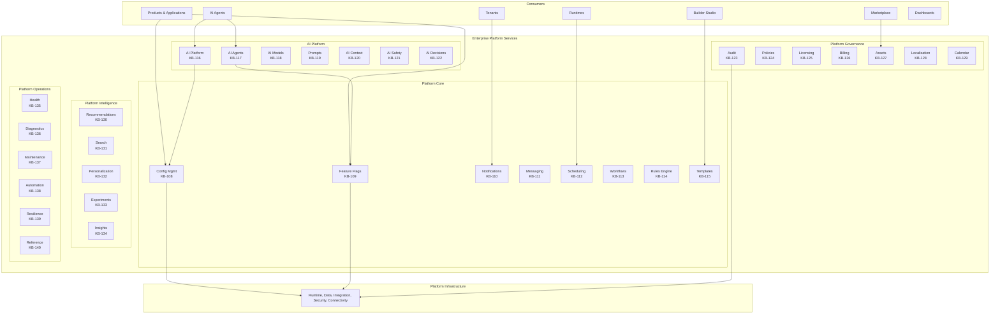
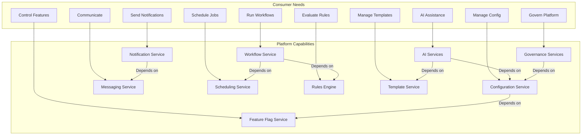
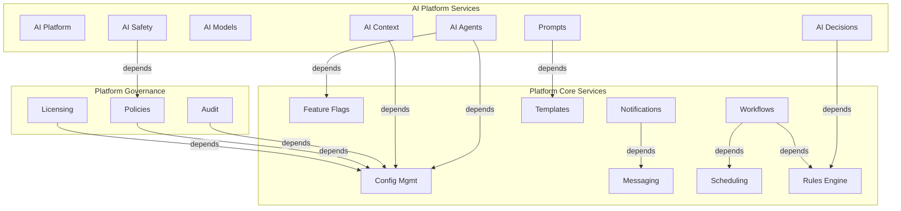
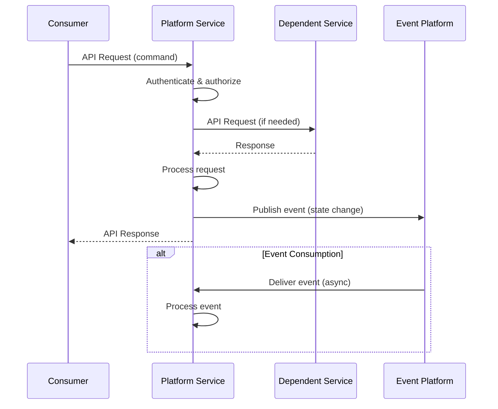
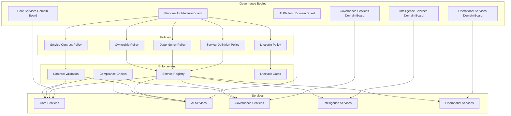
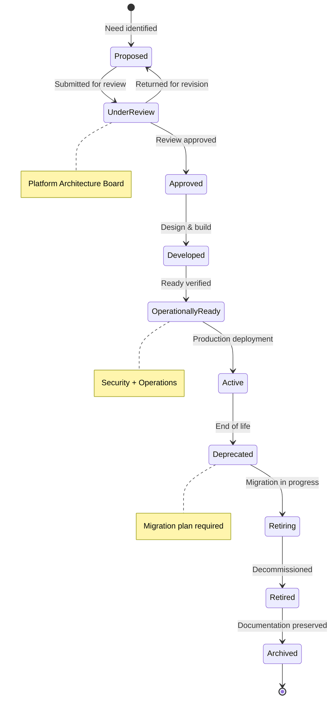
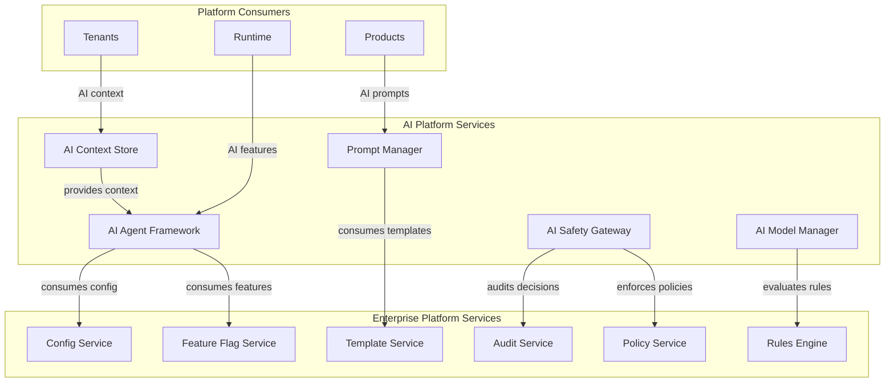

# Enterprise Platform Services Overview Architecture

**KB-107 — Enterprise Platform Services Overview Architecture Specification**

| Metadata | |
|----------|---|
| **KB ID** | KB-107 |
| **Title** | Enterprise Platform Services Overview Architecture |
| **Version** | 0.1.0 |
| **Status** | Draft |
| **Owner** | Architecture Team |
| **Suite** | Enterprise Platform Services |
| **Dependencies** | All prior Architecture Knowledge Base documents (KB-051 through KB-106) |
| **Related Documents** | KB-108 through KB-140 (Enterprise Platform Services suite) |
| **Review Status** | Pending |
| **Last Updated** | 2026-07-11 |

---

### Revision History

| Version | Date | Author | Change |
|---------|------|--------|--------|
| 0.1.0 | 2026-07-11 | AI Architecture Agent | Initial draft |

---

## 1. Executive Summary

### 1.1 Purpose

This document defines the Enterprise Platform Services Overview Architecture for the DUKADESK Platform. The Enterprise Platform Services layer is the canonical collection of shared services used by all DUKADESK products, runtimes, tenants, AI agents, Builder Studio modules, Marketplace assets, and future platform capabilities.

Every shared capability within DUKADESK exists as a governed Enterprise Platform Service with clearly defined ownership, boundaries, contracts, lifecycle, and dependencies. No application, tenant, runtime, or AI component implements or owns platform-wide capabilities independently, ensuring a unified, reusable, secure, and evolvable enterprise platform.

This document is the foundational architecture for the entire Enterprise Platform Services suite (KB-107 through KB-140). It establishes the platform-level service model, architectural boundaries, governance principles, dependency rules, service taxonomy, interaction patterns, and lifecycle model that govern every shared enterprise platform capability.

This document defines architecture only. It is vendor-independent, technology-independent, and implementation-independent.

### 1.2 Scope

**In scope:**

- Enterprise Platform Services definition and taxonomy
- Platform service domains and boundaries
- Service ownership and governance models
- Platform capability mapping
- Service dependency and interaction models
- Canonical service contract model
- Service composition and orchestration
- Multi-tenant service architecture
- AI platform integration model
- Cross-service communication principles
- Service lifecycle management
- Platform security and privacy architecture
- Enterprise operational model

**Out of scope:**
- Individual service specifications (covered by KB-108 through KB-140)
- Runtime implementations (covered by KB-051 through KB-062)
- Integration implementations (covered by KB-094 through KB-106)
- Infrastructure implementations

---

## 2. Architectural Principles

### 2.1 Shared by Default

Capabilities that are needed by multiple consumers are implemented as shared Enterprise Platform Services. No application, tenant, or component implements a capability independently if it is needed by another consumer. The default answer to "should we build this as a shared service?" is yes.

### 2.2 Single Responsibility

Each Enterprise Platform Service has a single, clearly defined responsibility. Services do not accumulate unrelated capabilities. When a service takes on additional responsibilities, a new service is created. Single responsibility ensures clarity, testability, and independent evolution.

### 2.3 Loose Coupling

Enterprise Platform Services are loosely coupled. Services communicate through well-defined contracts and events. No service has direct knowledge of another service's internal implementation. Changes to one service do not require changes to dependent services.

### 2.4 High Cohesion

Capabilities within a service are highly cohesive. Related capabilities are grouped together. Unrelated capabilities are separated into different services. High cohesion ensures that services are intuitive, manageable, and evolvable.

### 2.5 API-First

Every Enterprise Platform Service exposes its capabilities through a well-defined, versioned, and governed API. API-first ensures that all consumers interact with services through consistent interfaces. APIs are the primary interaction mechanism.

### 2.6 Event-Driven

Enterprise Platform Services communicate through events as the primary mechanism for cross-service state propagation. Events ensure loose coupling, scalability, and auditability. Synchronous communication (API calls) is used for request-response patterns. Events are used for state change notification.

### 2.7 AI-Ready

Every Enterprise Platform Service is designed for AI consumption from inception. Service interfaces are structured for machine readability. Telemetry is designed for AI analysis. Service capabilities are discoverable by AI agents. AI readiness is not retrofitted.

### 2.8 Vendor Independence

Enterprise Platform Services are vendor-independent. No service depends on a specific vendor's technology or platform. Vendor-specific implementations are abstracted behind service interfaces. Vendor lock-in is prevented at the architecture level.

### 2.9 Technology Neutrality

Enterprise Platform Services are technology-neutral. The architecture does not prescribe specific programming languages, frameworks, or databases for service implementation. Technology choices are made by service owners within architectural constraints.

### 2.10 Zero Trust

All service interactions are authenticated, authorized, and encrypted. No service trusts another service based on network location. Every interaction verifies identity, authorization, and integrity. Zero Trust is enforced at the service boundary.

### 2.11 Security by Design

Security is incorporated into every Enterprise Platform Service from inception. Security reviews are part of the service lifecycle. Security is not retrofitted — it is architected into the service model.

### 2.12 Multi-Tenant by Design

Every Enterprise Platform Service is multi-tenant from inception. Tenant isolation, tenant-aware routing, and tenant-specific configuration are architectural primitives. Services are not retrofitted for multi-tenancy.

### 2.13 Observability by Design

Every Enterprise Platform Service is observable from inception. Services emit standardized telemetry (metrics, traces, logs). Observability is not retrofitted — it is architected into the service model.

### 2.14 Governance by Default

Every Enterprise Platform Service is governed by default. Service ownership, contracts, lifecycle, and compliance are established before a service is available for consumption. Governance is not an afterthought.

### 2.15 Composability

Enterprise Platform Services are composable. Services can be combined to create higher-level capabilities. Composition is achieved through well-defined contracts and events, not through tight coupling.

---

## 3. Canonical Definitions

### 3.1 Enterprise Platform Service

A governed, shared, reusable service that provides a platform-wide capability to all DUKADESK consumers. Enterprise Platform Services are the building blocks of the platform layer. They are multi-tenant, API-first, event-driven, observable, and governed.

### 3.2 Shared Service

A service that is used by multiple consumers (products, tenants, runtimes, AI agents, components) rather than being owned by a single consumer. Sharing is the defining characteristic of Enterprise Platform Services.

### 3.3 Platform Capability

A distinct, measurable function provided by an Enterprise Platform Service. Capabilities are the units of platform functionality. Examples: configuration management, feature flag evaluation, notification delivery.

### 3.4 Platform Domain

A logical grouping of related Enterprise Platform Services. Domains provide organizational boundaries for ownership, governance, and evolution. Platform domains include Platform Core Services, AI Platform Services, Platform Governance Services, Platform Intelligence Services, and Platform Operational Services.

### 3.5 Service Boundary

The architectural perimeter of an Enterprise Platform Service. The boundary defines what the service does, what it does not do, what it depends on, and how it interacts with other services.

### 3.6 Platform Consumer

Any entity that consumes capabilities from an Enterprise Platform Service. Consumers include products, tenants, runtimes, AI agents, Builder Studio modules, Marketplace assets, and other platform services.

### 3.7 Platform Provider

The team or organization responsible for operating an Enterprise Platform Service. The provider owns the service lifecycle, governance, and operational health.

### 3.8 Canonical Service Contract

A formal, versioned agreement between a Platform Provider and Platform Consumers. The contract defines the service's API, events, SLAs, dependencies, and governance requirements. Contracts are the foundation of service interaction.

### 3.9 Platform Dependency

A relationship where one Enterprise Platform Service depends on another platform service for its operation. Dependencies are documented, governed, and monitored.

### 3.10 Service Composition

The combination of multiple Enterprise Platform Services to create a higher-level capability. Composition is achieved through API calls, event subscriptions, and workflow orchestration.

### 3.11 Platform Governance

The policies, processes, boards, and roles that govern Enterprise Platform Services. Governance ensures that services are consistent, compliant, and aligned with enterprise architecture.

### 3.12 Platform Domain Owner

The enterprise role accountable for a platform domain. The domain owner governs the services within the domain, ensures domain consistency, and coordinates cross-domain interactions.

### 3.13 Service Lifecycle

The complete lifespan of an Enterprise Platform Service from proposal through retirement. The lifecycle defines the stages, transitions, approvals, and governance that every service follows.

### 3.14 Platform Portfolio

The complete collection of all Enterprise Platform Services. The portfolio provides enterprise-wide visibility into service inventory, lifecycle state, ownership, health, and compliance.

### 3.15 Shared Capability

A platform capability that is designed, built, and operated for use by multiple consumers. Shared capabilities are the opposite of application-specific capabilities.

---

## 4. Enterprise Platform Services Layer

### 4.1 Layer Architecture

The Enterprise Platform Services layer sits between the platform infrastructure and the application/tenant layers. It provides shared capabilities to all consumers above it.

```
+--------------------------------------------------------+
|              Products, Tenants, Runtimes, AI,           |
|              Builder, Marketplace, Dashboard            |
+--------------------------------------------------------+
        |                    |                    |
        v                    v                    v
+--------------------------------------------------------+
|              Enterprise Platform Services                |
|                                                         |
|  Platform Core    AI Platform    Platform Governance     |
|  Services         Services       Services               |
|                                                         |
|  Platform Intel   Platform Ops   Cross-Cutting         |
|  Services         Services       (Security, Privacy)    |
+--------------------------------------------------------+
        |                    |                    |
        v                    v                    v
+--------------------------------------------------------+
|           Platform Infrastructure Layer                  |
|  (Runtime, Data, Integration, Connectivity, Security)   |
+--------------------------------------------------------+
```

### 4.2 Layer Responsibilities

**Enterprise Platform Services layer:**
- Provides shared, reusable capabilities to all platform consumers
- Enforces platform governance and policies
- Ensures cross-platform consistency
- Manages service lifecycle and evolution
- Provides AI-ready interfaces

**Consumers (above the layer):**
- Consume platform services through defined contracts
- Comply with platform governance
- Do not implement platform capabilities independently

**Infrastructure (below the layer):**
- Provides foundational capabilities (runtime, data, integration)
- Does not expose application-level functionality
- Is consumed by platform services

---

## 5. Platform Service Taxonomy

### 5.1 Taxonomy Model

Enterprise Platform Services are organized into five domains:

| Domain | ID Range | Description |
|--------|----------|-------------|
| Platform Core Services | KB-107 to KB-115 | Foundational platform capabilities: config, features, notifications, messaging, scheduling, workflows, rules, templates |
| AI Platform Services | KB-116 to KB-122 | AI-native capabilities: AI platform, agents, models, prompts, context, safety, decisions |
| Platform Governance Services | KB-123 to KB-129 | Governance and business capabilities: audit, policies, licensing, billing, assets, localization, calendar |
| Platform Intelligence Services | KB-130 to KB-134 | Intelligence capabilities: recommendations, search, personalization, experimentation, insights |
| Platform Operational Services | KB-135 to KB-140 | Operational capabilities: health, diagnostics, maintenance, automation, resilience, reference |

### 5.2 Platform Core Services

Canonical shared services that form the operational backbone of the DUKADESK platform.

| Service | KB | Primary Capability |
|---------|----|-------------------|
| Configuration Management | KB-108 | Centralized configuration storage, distribution, and governance |
| Feature Flag & Feature Management | KB-109 | Feature lifecycle management, targeting, and rollout |
| Notification Platform | KB-110 | Multi-channel notification delivery and management |
| Messaging & Communication Platform | KB-111 | Real-time messaging and communication services |
| Scheduling & Job Orchestration | KB-112 | Time-based scheduling and job management |
| Workflow Orchestration | KB-113 | Business workflow definition and execution |
| Business Rules Engine | KB-114 | Declarative business rule evaluation |
| Template Management | KB-115 | Template definition, rendering, and governance |

### 5.3 AI Platform Services

AI-native services that provide AI capabilities across the platform.

| Service | KB | Primary Capability |
|---------|----|-------------------|
| AI Platform Architecture | KB-116 | Overall AI platform model and governance |
| AI Agent Framework | KB-117 | AI agent lifecycle, management, and orchestration |
| AI Model Management | KB-118 | Model registry, versioning, deployment, governance |
| Prompt Management | KB-119 | Prompt lifecycle, versioning, optimization |
| AI Context & Memory | KB-120 | Context management, memory persistence, retrieval |
| AI Safety & Governance | KB-121 | Safety guardrails, bias detection, compliance |
| AI Decision Intelligence | KB-122 | AI-powered decision support and automation |

### 5.4 Platform Governance Services

Services that govern and operate the platform business model.

| Service | KB | Primary Capability |
|---------|----|-------------------|
| Audit Platform | KB-123 | Enterprise audit logging and governance |
| Policy Management | KB-124 | Policy definition, enforcement, and governance |
| Licensing & Subscription Platform | KB-125 | License management, subscription lifecycle |
| Billing & Usage Metering | KB-126 | Usage metering, billing, invoicing |
| Digital Asset Management | KB-127 | Asset storage, metadata, lifecycle, governance |
| Localization & Internationalization | KB-128 | Translation, locale management, i18n services |
| Time & Calendar Services | KB-129 | Time zone management, calendar, scheduling |

### 5.5 Platform Intelligence Services

Services that provide intelligence, personalization, and optimization.

| Service | KB | Primary Capability |
|---------|----|-------------------|
| Recommendation Engine | KB-130 | Content and capability recommendations |
| Search Experience | KB-131 | Unified search experience across the platform |
| Personalization Platform | KB-132 | User and tenant personalization |
| Experimentation Platform | KB-133 | A/B testing, feature experimentation |
| Platform Insights | KB-134 | Platform analytics, trends, and insights |

### 5.6 Platform Operational Services

Services that ensure platform health, resilience, and operational excellence.

| Service | KB | Primary Capability |
|---------|----|-------------------|
| Health Management | KB-135 | Platform health monitoring and management |
| Platform Diagnostics | KB-136 | Diagnostic capabilities for issue resolution |
| Maintenance & Service Operations | KB-137 | Maintenance scheduling, service operations |
| Platform Automation | KB-138 | Automated platform operations and remediation |
| Platform Resilience Coordination | KB-139 | Resilience planning, coordination, governance |
| Enterprise Platform Services Reference | KB-140 | Unified reference architecture for the suite |

---

## 6. Platform Capability Map

### 6.1 Capability Model

The Platform Capability Map provides a visual representation of all Enterprise Platform Services and their relationships.

### 6.2 Capability Dimensions

Each capability is described by:

- **Domain**: Which domain the service belongs to
- **Consumers**: Who uses this capability
- **Dependencies**: What other capabilities this depends on
- **Data**: What data the capability manages
- **Events**: What events the capability publishes/consumes
- **Contracts**: What APIs and contracts the capability exposes

### 6.3 Capability Ownership

| Domain | Owner | Governance Body |
|--------|-------|-----------------|
| Platform Core Services | Platform Engineering | Platform Architecture Board |
| AI Platform Services | AI Platform Team | AI Governance Board |
| Platform Governance Services | Platform Engineering | Business Governance Board |
| Platform Intelligence Services | Platform Engineering | Platform Architecture Board |
| Platform Operational Services | Platform Engineering | Operations Governance Board |

---

## 7. Service Dependency Model

### 7.1 Dependency Principles

1. Services may depend on services within the same domain
2. Services may depend on services in the Platform Core domain
3. Services may depend on platform infrastructure (runtime, data, integration)
4. Services should minimize cross-domain dependencies
5. Circular dependencies are prohibited
6. Dependency direction follows the domain hierarchy

### 7.2 Domain Dependency Hierarchy

```
Platform Operational Services
    ^
    |
Platform Governance Services
    ^
    |
Platform Intelligence Services
    ^
    |
Platform Core Services
    ^
    |
AI Platform Services
    ^
    |
Platform Infrastructure (Runtime, Data, Integration, Security)
```

### 7.3 Dependency Documentation

Every service dependency is documented with:
- Dependent service and provider service
- Dependency type (API, event, data)
- Criticality (critical, important, nice-to-have)
- Fallback behavior when dependency is unavailable
- SLA requirements for the dependency

---

## 8. Service Interaction Patterns

### 8.1 Interaction Model

Enterprise Platform Services interact through three primary patterns:

| Pattern | Mechanism | Use Case |
|---------|-----------|----------|
| API Call | Synchronous request-response | Query state, execute action |
| Event Publication | Asynchronous notification | State change notification |
| Event Subscription | Asynchronous consumption | React to state changes |

### 8.2 API Interaction

APIs are the primary synchronous interaction mechanism:

- RESTful APIs for CRUD operations
- gRPC for high-performance service-to-service calls
- GraphQL for complex queries across services
- All APIs are versioned and governed
- All APIs require authentication and authorization

### 8.3 Event Interaction

Events are the primary asynchronous interaction mechanism:

- Services publish events when their state changes
- Services subscribe to events from services they depend on
- Events follow the Event Platform model (KB-077)
- Events include full correlation context
- Event schemas are versioned and governed

### 8.4 Interaction Rules

1. Services prefer event-driven interaction over API calls
2. Services use APIs for commands (create, update, delete)
3. Services use events for notifications (something happened)
4. Services do not block on event processing
5. Services handle API failures gracefully
6. Services handle event processing failures with retry/dead letter

---

## 9. Canonical Service Contracts

### 9.1 Contract Model

Every Enterprise Platform Service has a canonical service contract. The contract is the formal agreement between the service provider and service consumers.

### 9.2 Contract Contents

| Section | Description |
|---------|-------------|
| Service Identity | Service name, ID, domain, version |
| Service Owner | Provider team, business sponsor, domain owner |
| Capabilities | List of capabilities the service provides |
| API Contracts | API endpoints, methods, request/response schemas |
| Event Contracts | Events published and consumed, event schemas |
| Dependencies | Services this service depends on |
| SLAs | Availability, latency, throughput targets |
| Governance | Review cadence, compliance requirements, ownership |
| Lifecycle | Current lifecycle state, version history, deprecation plan |

### 9.3 Contract Versioning

Service contracts follow semantic versioning:

- **Major version**: Breaking changes (API contract change, event schema change)
- **Minor version**: Backward-compatible additions (new API endpoints, new events)
- **Patch version**: Non-functional changes (documentation, SLA refinement)

### 9.4 Contract Governance

- Contracts are registered in the service registry
- Contract changes require governance approval
- Consumers are notified of contract changes
- Contracts have a defined deprecation process

---

## 10. Service Composition

### 10.1 Composition Model

Enterprise Platform Services can be composed to create higher-level capabilities. Composition is achieved through API orchestration and event chaining.

### 10.2 Composition Patterns

**Orchestration:** A consumer calls multiple services in sequence to achieve a result.
```
Consumer → Service A → Service B → Service C → Result
```

**Event Chaining:** Service A publishes an event that triggers Service B, which triggers Service C.
```
Service A → Event → Service B → Event → Service C
```

**Aggregation:** A service aggregates data from multiple services to provide a unified view.
```
Consumer → Aggregation Service → Service A
                                → Service B
                                → Service C → Result
```

### 10.3 Composition Rules

1. Composition is done by consumers or dedicated composition services
2. Services do not hardcode composition logic
3. Composition respects service boundaries
4. Composition transactions are distributed (no ACID across services)
5. Composition failures are handled gracefully (compensating actions, retry)

---

## 11. Multi-Tenant Service Architecture

### 11.1 Multi-Tenant Model

Every Enterprise Platform Service is multi-tenant by design. Tenant isolation, tenant-aware routing, and tenant-specific configuration are architectural primitives.

### 11.2 Isolation Levels

| Level | Description | Use Case |
|-------|-------------|----------|
| Shared | Single service instance handles all tenants | Configuration management, feature flags |
| Tenant-Aware | Service routes requests to tenant-specific data | Notifications, messaging |
| Tenant-Partitioned | Service instances are partitioned by tenant group | High-volume tenants |
| Dedicated | Each tenant has their own service instance | Regulated tenants, government |

### 11.3 Tenant Context Propagation

Tenant context is propagated through all service interactions:

- Tenant ID is included in all API calls
- Tenant ID is included in all event envelopes
- Tenant context is verified at every service boundary
- Cross-tenant operations are authorized and audited

### 11.4 Tenant Isolation Guarantees

- One tenant cannot access another tenant's data
- One tenant's load does not affect another tenant's performance
- One tenant's configuration changes do not affect another tenant
- One tenant's failures do not cascade to other tenants

---

## 12. AI Platform Integration Model

### 12.1 AI Integration Architecture

Enterprise Platform Services are designed for AI consumption. AI agents and AI platform services consume platform service capabilities through the same contracts as human consumers.

### 12.2 AI-Ready Interfaces

Service interfaces are structured for AI consumption:

- Machine-readable API documentation (OpenAPI, GraphQL schema)
- Structured response formats (JSON, Protocol Buffers)
- Predictable error handling
- Rate limiting for AI traffic
- Token-efficient responses

### 12.3 AI Service Consumption

AI Platform Services (KB-116 through KB-122) consume capabilities from other Enterprise Platform Services:

- AI Agent Framework consumes Configuration, Feature Flags, Policies
- AI Model Management consumes Storage, Audit, Licensing
- Prompt Management consumes Templates, Configuration
- AI Context & Memory consumes Data Access, Storage
- AI Safety & Governance consumes Audit, Policies

### 12.4 AI Service Provision

Some Enterprise Platform Services provide capabilities to the AI Platform:

- Recommendation Engine provides AI-powered recommendations
- Personalization Platform provides AI-driven personalization
- Platform Insights provides AI-analyzable telemetry

---

## 13. Service Lifecycle

### 13.1 Lifecycle Model

Enterprise Platform Services follow a governed lifecycle:

```
Proposed → Under Review → Approved → Developed → Operationally Ready → Active → Deprecated → Retiring → Retired → Archived
```

### 13.2 Lifecycle Stages

| Stage | Description | Governance |
|-------|-------------|------------|
| Proposed | Service need identified and documented | Service proposal submitted |
| Under Review | Architecture, security, compliance review | Architecture Review Board |
| Approved | Service approved for development | Approval documented |
| Developed | Service is designed, built, tested | Design review, security review |
| Operationally Ready | Service ready for production | Operational readiness verification |
| Active | Service available for consumption | Continuous monitoring, periodic review |
| Deprecated | Service no longer recommended for new use | Deprecation approved, migration plan |
| Retiring | Service being decommissioned | Consumer migration |
| Retired | Service no longer available | Decommissioning verified |
| Archived | Lifecycle documentation preserved | Compliance retention |

---

## 14. Governance

### 14.1 Governance Model

Enterprise Platform Services are governed at multiple levels:

- **Domain Governance**: Each platform domain has a domain owner who governs services within the domain
- **Architecture Governance**: The Platform Architecture Board governs cross-service architecture
- **Lifecycle Governance**: Service lifecycle transitions are governed by defined approval processes
- **Contract Governance**: Service contracts are governed to ensure consistency and compatibility

### 14.2 Governance Bodies

**Platform Architecture Board (PAB):**
- Governs platform service taxonomy and boundaries
- Approves new service proposals
- Reviews cross-domain dependencies
- Resolves architecture conflicts

**Domain Governance Boards:**
- Govern services within their domain
- Review service contracts and changes
- Ensure domain consistency
- Coordinate cross-service evolution

### 14.3 Governance Policies

- **Service Definition Policy**: What constitutes an Enterprise Platform Service
- **Service Contract Policy**: Contract format, versioning, governance
- **Dependency Policy**: Allowed and prohibited dependencies
- **Lifecycle Policy**: Lifecycle stages, transitions, approvals
- **Ownership Policy**: Ownership requirements and transfer process

### 14.4 Service Registry

All Enterprise Platform Services are registered in the Service Registry. The registry is the authoritative source for:
- Service inventory
- Service contracts and versions
- Service dependencies
- Service ownership
- Service lifecycle state
- Service health

---

## 15. Responsibilities

| Role | Responsibilities |
|------|-----------------|
| Enterprise Architecture | Define platform service model, taxonomy, governance; chair Platform Architecture Board |
| Domain Owners | Govern services within domain; ensure domain consistency; coordinate cross-domain |
| Platform Engineering | Operate platform services; manage service lifecycle; ensure service health |
| Security | Define service security standards; conduct security reviews; monitor security posture |
| Compliance | Define service compliance requirements; conduct compliance reviews; support audits |
| Operations & SRE | Monitor service health; respond to incidents; manage capacity |
| Product Teams | Consume platform services; comply with contracts; provide feedback |
| AI Governance | Govern AI service consumption; ensure AI safety and compliance |
| Tenant Administrators | Understand tenant-relevant platform services; report issues |

---

## 16. Security

### 16.1 Security Model

Enterprise Platform Services follow a Zero Trust security model. Every service interaction is authenticated, authorized, and encrypted.

### 16.2 Service Authentication

- All API calls require authentication (JWT, mTLS, API tokens)
- Service-to-service calls use mutual TLS
- Service identity is verified through workload identity
- Authentication context is propagated through service chains

### 16.3 Service Authorization

- All API calls are authorized against policies
- Authorization is evaluated at the service boundary
- Tenant context is verified for tenant-scoped operations
- Cross-service authorization follows the principle of least privilege

### 16.4 Data Protection

- Data in transit is encrypted (TLS 1.3 minimum)
- Data at rest is encrypted
- Sensitive data is classified and handled according to policy
- Service data is tenant-isolated

### 16.5 Security Reviews

- New services require security review before approval
- Active services undergo periodic security reviews
- Security incidents trigger immediate review
- Security findings are tracked to remediation

---

## 17. Privacy

### 17.1 Privacy Model

Enterprise Platform Services respect user privacy and comply with applicable regulations.

### 17.2 Data Minimization

- Services only collect data necessary for their function
- Personal data is minimized in service contracts and telemetry
- Unnecessary data is not stored or processed

### 17.3 Tenant Privacy

- Tenant data is isolated from other tenants
- Tenant data is processed within tenant boundaries
- Cross-tenant data access is authorized and audited

### 17.4 Regulatory Compliance

- Services comply with applicable privacy regulations (GDPR, CCPA, LGPD)
- Services support data subject rights (access, erasure, portability)
- Services maintain privacy documentation and impact assessments

---

## 18. Performance

### 18.1 Performance Targets

Enterprise Platform Services meet defined performance targets:

| Dimension | Target | Measurement |
|-----------|--------|-------------|
| Availability | 99.99% | Per service, rolling 30 days |
| API Latency p95 | < 100ms | Internal service calls |
| API Latency p99 | < 500ms | All service calls |
| Event Processing Latency | < 1s | Event publication to consumption |
| Throughput | Scalable | Linear scaling with demand |

### 18.2 Scalability

- Services scale horizontally
- Scaling is automatic based on demand
- No service has a fixed capacity limit
- Scaling is tenant-aware (one tenant's growth does not affect others)

### 18.3 Resilience

- Services are resilient to dependency failures (circuit breakers, fallbacks)
- Services are deployed across multiple availability zones
- Services support graceful degradation
- Services have defined recovery procedures

---

## 19. Observability

### 19.1 Observability Model

Every Enterprise Platform Service is observable by design. Services emit standardized telemetry.

### 19.2 Service Metrics

| Metric | Description |
|--------|-------------|
| Request Rate | API calls per second |
| Latency | API response time (p50, p95, p99) |
| Error Rate | Percentage of failed requests |
| Event Rate | Events published/consumed per second |
| Health | Service health status (healthy, degraded, unhealthy) |
| Dependency Health | Health of service dependencies |

### 19.3 Service Telemetry

- Services emit traces for every API call and event
- Services emit metrics for key operational dimensions
- Services emit structured logs for operational analysis
- Telemetry includes full correlation context

### 19.4 Dashboards

- **Platform Services Dashboard**: Health of all platform services
- **Domain Dashboards**: Health of services within each domain
- **Service Detail Dashboard**: Detailed health of a specific service
- **Dependency Dashboard**: Health of service dependencies

---

## 20. Failure Scenarios

### 20.1 Service Failure

**Scenario:** An Enterprise Platform Service becomes unavailable.

**Impact:** All consumers of the service are affected. Dependent services may degrade.

**Mitigation:**
- Redundant service instances across availability zones
- Automatic failover
- Circuit breaker to prevent cascading failures
- Graceful degradation for dependent services

### 20.2 Dependency Failure

**Scenario:** A dependency of an Enterprise Platform Service fails.

**Impact:** The service may be degraded or unavailable. Consumers are indirectly affected.

**Mitigation:**
- Dependency health monitoring
- Fallback behavior (cached data, default values)
- Circuit breaker for the dependency
- Graceful degradation when dependency is unavailable

### 20.3 Governance Failure

**Scenario:** Governance processes are bypassed or ineffective.

**Impact:** Services may be inconsistent, non-compliant, or poorly governed.

**Mitigation:**
- Automated governance enforcement
- Regular governance audits
- Governance policy reviews
- Escalation path for governance failures

### 20.4 Cross-Service Cascading Failure

**Scenario:** A failure in one service cascades through dependencies to affect multiple services.

**Impact:** Wide-spread platform degradation or outage.

**Mitigation:**
- Circuit breakers at all dependency boundaries
- Bulkheads to isolate service failures
- Graceful degradation patterns
- Load shedding to protect critical services

### 20.5 Tenant Isolation Failure

**Scenario:** Tenant isolation is breached, allowing one tenant to access another tenant's data.

**Impact:** Data exposure. Privacy violation. Compliance incident.

**Mitigation:**
- Defense-in-depth tenant isolation
- Automated isolation verification
- Cross-tenant access detection and alerting
- Immediate isolation on breach detection

### 20.6 Service Version Conflicts

**Scenario:** Multiple versions of a service are incompatible, causing consumer failures.

**Impact:** Consumer degradation or failure.

**Mitigation:**
- Version compatibility governance
- Consumer migration support
- Version sunset policy enforcement
- Backward-compatible evolution by default

### 20.7 Platform Degradation

**Scenario:** Multiple platform services are degraded simultaneously.

**Impact:** Platform-wide user experience degradation.

**Mitigation:**
- Platform health monitoring
- Automated degradation detection
- Priority-based recovery
- Communication plan for platform incidents

---

## 21. Anti-Patterns

### 21.1 Application-Owned Shared Services

Implementing platform-wide capabilities within an application is an anti-pattern.

**Why it is harmful:**
- Duplication of platform capabilities
- Inconsistent governance
- Tight coupling between applications and platform capabilities
- Inability to reuse across consumers

### 21.2 Tight Coupling

Services that have direct knowledge of another service's internals are an anti-pattern.

**Why it is harmful:**
- Changes in one service break dependent services
- Services cannot evolve independently
- Testing and deployment are tightly coupled

### 21.3 Duplicate Platform Capabilities

Multiple services implementing the same capability is an anti-pattern.

**Why it is harmful:**
- Wasted development and operational effort
- Inconsistent behavior for consumers
- Governance complexity
- Consumer confusion

### 21.4 Hidden Dependencies

Dependencies that are not documented are an anti-pattern.

**Why it is harmful:**
- Cannot assess impact of dependency changes
- Cannot plan maintenance
- Resilience planning is incomplete
- Incident response is hindered

### 21.5 Direct Service-to-Service Assumptions

Services assuming direct access to another service's data store is an anti-pattern.

**Why it is harmful:**
- Coupling to internal implementation
- Data encapsulation is violated
- Storage changes break dependent services
- Security boundaries are bypassed

### 21.6 Platform Service Sprawl

Creating new services when existing services could be extended is an anti-pattern.

**Why it is harmful:**
- Portfolio complexity
- Consumer confusion (too many services)
- Operational overhead
- Governance dilution

### 21.7 Unmanaged Service Ownership

Services without clear ownership are an anti-pattern.

**Why it is harmful:**
- No accountability for service health or governance
- Lifecycle decisions cannot be made
- Service degrades over time
- No path for retirement

---

## 22. Future Evolution

### 22.1 Autonomous Platform Services

Platform services become self-managing — automatically scaling, healing, and optimizing.

### 22.2 AI-Native Service Orchestration

AI agents dynamically compose platform services based on user intent rather than pre-defined workflows.

### 22.3 Self-Governing Platform Capabilities

Platform services automatically enforce governance policies, detect compliance violations, and remediate.

### 22.4 Intelligent Service Composition

Services are composed intelligently — the platform selects the optimal set of services and interactions for each request.

### 22.5 Dynamic Platform Ecosystems

The platform service ecosystem evolves dynamically — new services are discovered, composed, and governed automatically based on capability needs.

---

## 23. Cross-References

| Reference | Relationship |
|-----------|-------------|
| KB-051 through KB-062 | Runtime Architecture — platform services run on and integrate with the runtime |
| KB-063 through KB-072 | Identity & Access Architecture — platform services consume identity, auth, consent, audit |
| KB-073 through KB-083 | Data Platform Architecture — platform services consume data platform capabilities |
| KB-084 through KB-093 | Analytics & Reporting Architecture — platform services feed analytics and reporting |
| KB-094 through KB-106 | Platform Integration Architecture — platform services use integration capabilities |
| KB-108 through KB-115 | Platform Core Services — services in the Platform Core domain |
| KB-116 through KB-122 | AI Platform Services — services in the AI Platform domain |
| KB-123 through KB-129 | Platform Governance Services — services in the Governance domain |
| KB-130 through KB-134 | Platform Intelligence Services — services in the Intelligence domain |
| KB-135 through KB-140 | Platform Operational Services — services in the Operational domain |

---

## 24. Architecture Diagrams

### 24.1 Enterprise Platform Services Layer



### 24.2 Platform Service Taxonomy

```mermaid
graph TB
    ROOT[Enterprise Platform Services]

    subgraph "Platform Core Services"
        CORE[KB-108 to KB-115]
        CORE1[Configuration]
        CORE2[Feature Flags]
        CORE3[Notifications]
        CORE4[Messaging]
        CORE5[Scheduling]
        CORE6[Workflows]
        CORE7[Rules Engine]
        CORE8[Templates]
    end

    subgraph "AI Platform Services"
        AI[KB-116 to KB-122]
        AI1[AI Platform]
        AI2[AI Agents]
        AI3[AI Models]
        AI4[Prompts]
        AI5[AI Context]
        AI6[AI Safety]
        AI7[AI Decisions]
    end

    subgraph "Platform Governance Services"
        GOV[KB-123 to KB-129]
        GOV1[Audit]
        GOV2[Policies]
        GOV3[Licensing]
        GOV4[Billing]
        GOV5[Assets]
        GOV6[Localization]
        GOV7[Calendar]
    end

    subgraph "Platform Intelligence Services"
        INTEL[KB-130 to KB-134]
        INTEL1[Recommendations]
        INTEL2[Search]
        INTEL3[Personalization]
        INTEL4[Experiments]
        INTEL5[Insights]
    end

    subgraph "Platform Operational Services"
        OPS[KB-135 to KB-140]
        OPS1[Health]
        OPS2[Diagnostics]
        OPS3[Maintenance]
        OPS4[Automation]
        OPS5[Resilience]
        OPS6[Reference]
    end

    ROOT --> CORE
    ROOT --> AI
    ROOT --> GOV
    ROOT --> INTEL
    ROOT --> OPS

    CORE --> CORE1
    CORE --> CORE2
    CORE --> CORE3
    CORE --> CORE4
    CORE --> CORE5
    CORE --> CORE6
    CORE --> CORE7
    CORE --> CORE8

    AI --> AI1
    AI --> AI2
    AI --> AI3
    AI --> AI4
    AI --> AI5
    AI --> AI6
    AI --> AI7

    GOV --> GOV1
    GOV --> GOV2
    GOV --> GOV3
    GOV --> GOV4
    GOV --> GOV5
    GOV --> GOV6
    GOV --> GOV7

    INTEL --> INTEL1
    INTEL --> INTEL2
    INTEL --> INTEL3
    INTEL --> INTEL4
    INTEL --> INTEL5

    OPS --> OPS1
    OPS --> OPS2
    OPS --> OPS3
    OPS --> OPS4
    OPS --> OPS5
    OPS --> OPS6
```



### 24.3 Platform Capability Map



### 24.4 Service Dependency Architecture



### 24.5 Cross-Service Interaction Model



### 24.6 Governance Structure



### 24.7 Lifecycle Model



### 24.8 Multi-Tenant Service Architecture

```mermaid
graph TB
    subgraph "Consumers"
        T1[Tenant A]
        T2[Tenant B]
        T3[Tenant C]
    end

    subgraph "Service Layer"
        GW[Tenant-Aware Gateway]
        SVC[Platform Service Instance]
    end

    subgraph "Tenant Data"
        D1[Tenant A Data]
        D2[Tenant B Data]
        D3[Tenant C Data]
    end

    subgraph "Shared Infrastructure"
        SI[Shared Service Infrastructure]
    end

    T1 --> GW
    T2 --> GW
    T3 --> GW

    GW -->|Tenant A Context| SVC
    GW -->|Tenant B Context| SVC
    GW -->|Tenant C Context| SVC

    SVC --> D1
    SVC --> D2
    SVC --> D3

    SVC --> SI

    note right of GW: Routes by tenant context
    note right of SVC: Isolates by tenant ID
```

### 24.9 AI Platform Integration



### 24.10 Enterprise Platform Reference Context

```mermaid
graph TB
    subgraph "Enterprise Platform Services (KB-107 to KB-140)"
        EPS[Enterprise Platform Services Layer]
    end

    subgraph "Prior Architecture Suites"
        A1[Runtime & Rendering<br/>KB-051 to KB-062]
        A2[Identity & Access<br/>KB-063 to KB-072]
        A3[Data Platform<br/>KB-073 to KB-083]
        A4[Analytics & Reporting<br/>KB-084 to KB-093]
        A5[Platform Integration<br/>KB-094 to KB-106]
    end

    subgraph "All Platform Consumers"
        C1[Products]
        C2[Tenants]
        C3[Runtimes]
        C4[AI Agents]
        C5[Builder]
        C6[Marketplace]
        C7[Dashboards]
    end

    A1 -->|Foundation For| EPS
    A2 -->|Identity For| EPS
    A3 -->|Data For| EPS
    A4 -->|Analytics For| EPS
    A5 -->|Integration For| EPS

    EPS -->|Services For| C1
    EPS -->|Services For| C2
    EPS -->|Services For| C3
    EPS -->|Services For| C4
    EPS -->|Services For| C5
    EPS -->|Services For| C6
    EPS -->|Services For| C7

    note right of EPS: 34 services across 5 domains
    note right of A1: Parent architectures
```

---

## 25. References

- KB-051 through KB-062: Runtime & Rendering Architecture Suite
- KB-063 through KB-072: Identity & Access Architecture Suite
- KB-073 through KB-083: Data Platform Architecture Suite
- KB-084 through KB-093: Analytics & Reporting Architecture Suite
- KB-094 through KB-106: Platform Integration Architecture Suite
- KB-108 through KB-140: Enterprise Platform Services Suite

---

*End of KB-107 — Enterprise Platform Services Overview Architecture Specification*
