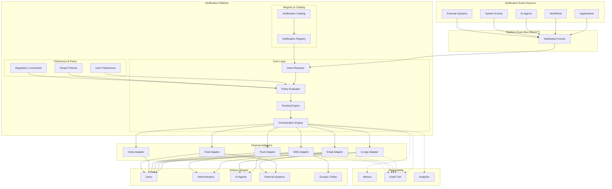
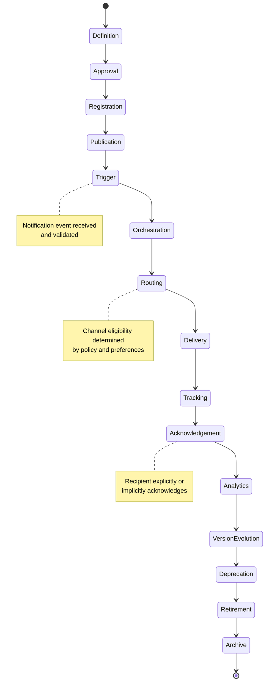
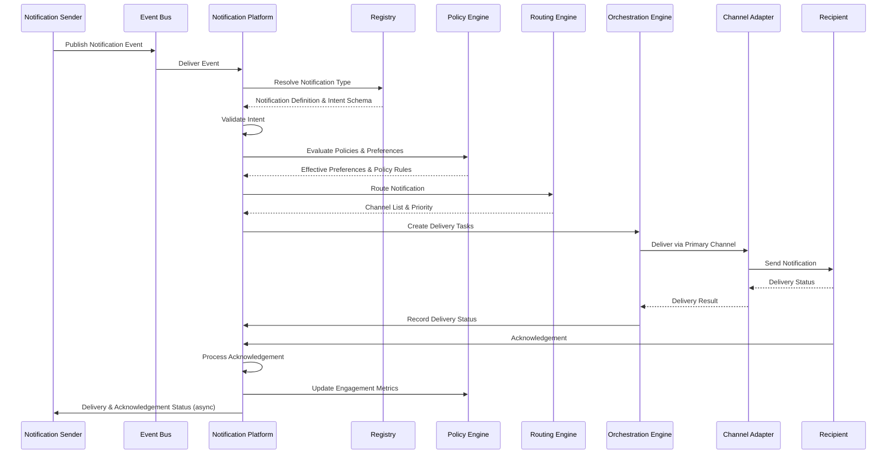
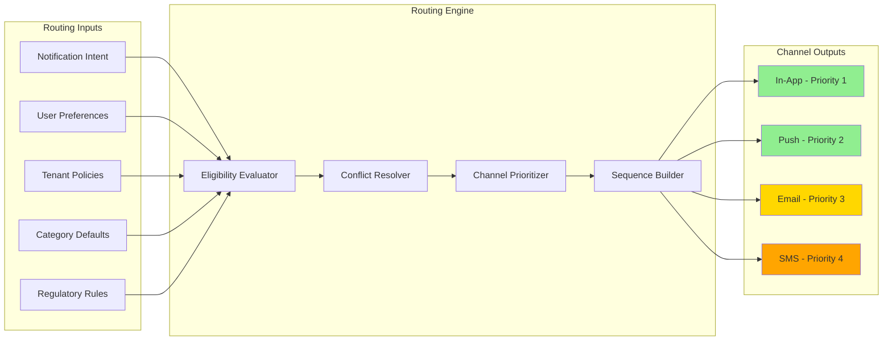
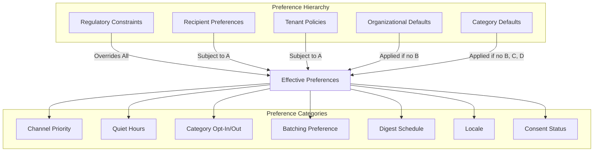
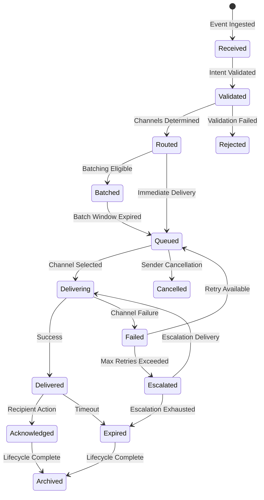
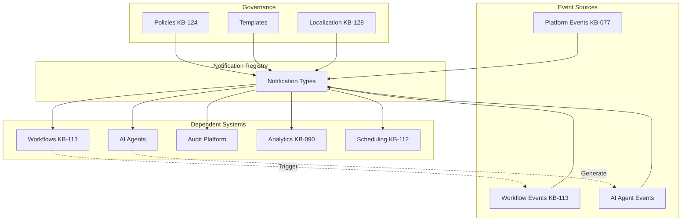
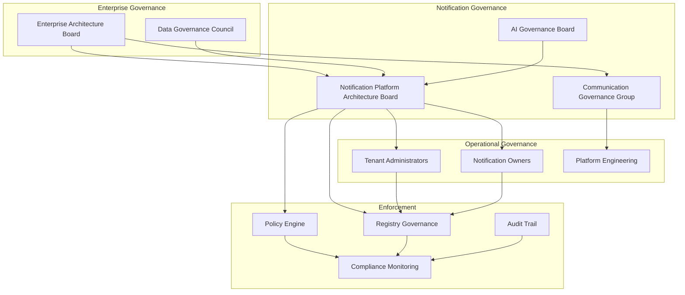
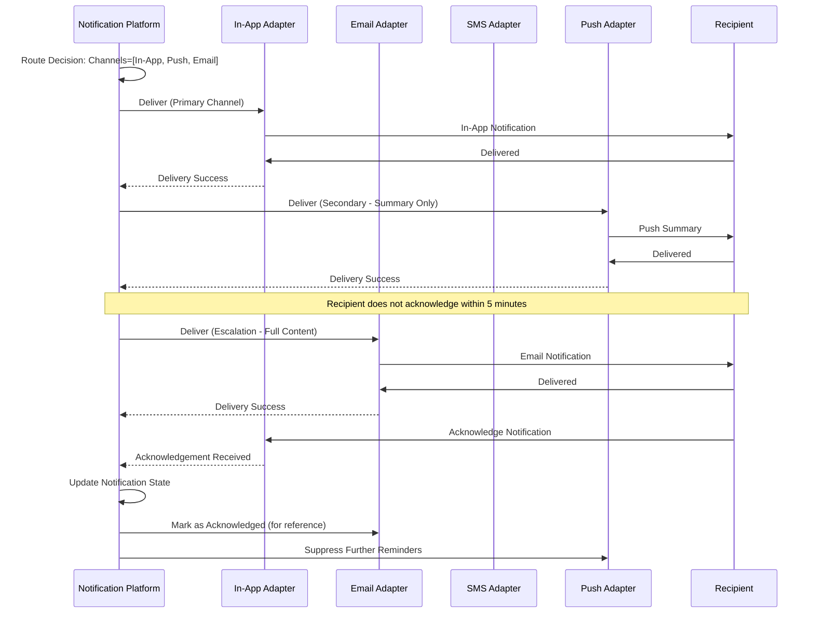
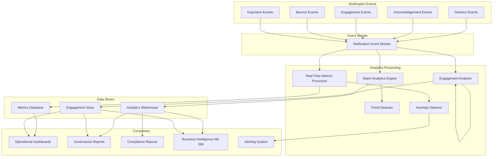

# KB-110 — Notification Platform Architecture

---

## Metadata

| Attribute | Value |
|-----------|-------|
| **Document ID** | KB-110 |
| **Title** | Notification Platform Architecture |
| **Suite** | Enterprise Platform Services |
| **Version** | 1.0 |
| **Status** | Approved Architecture |
| **Classification** | Core Platform Service Architecture |
| **Date** | 2026-07-12 |
| **Architect** | Enterprise Notification Platform Architecture Builder |

---

## Table of Contents

1. Executive Summary
2. Architectural Principles
3. Canonical Definitions
4. Enterprise Notification Architecture
5. Notification Taxonomy
6. Notification Registry
7. Notification Catalog
8. Notification Intent Model
9. Notification Routing
10. Multi-Channel Delivery Architecture
11. Preference Management
12. Notification Orchestration
13. Notification Dependencies
14. Notification Lifecycle
15. Governance
16. Responsibilities
17. Security
18. Privacy
19. Performance
20. Observability
21. Failure Scenarios
22. Anti-Patterns
23. Future Evolution
24. Cross-References
25. Architecture Diagrams

---

## 1. Executive Summary

The Notification Platform is a shared enterprise capability that provides unified, policy-driven, event-aware, multi-channel notification services to every application, tenant, user, AI agent, workflow, and external system across the DUKADESK ecosystem.

This architecture establishes the Notification Platform as the single authoritative mechanism through which all platform notifications are created, governed, personalized, routed, delivered, tracked, and managed. The architecture separates notification intent from notification delivery, ensuring that what a notification communicates is independent of how it reaches its recipient. This separation enables extensibility across communication channels, consistency in governance, vendor independence, and scalability across global deployments.

The Notification Platform sits within the Platform Core domain of the Enterprise Platform Services suite (KB-107). It consumes events from the Event & Messaging Architecture (KB-077), honors preferences governed by Configuration Management (KB-108) and Policy Management (KB-124), and delivers through channels orchestrated by the Messaging & Communication Platform (KB-111).

Key architectural decisions include:
- **Intent-first model**: Notification senders express intent — what to communicate, to whom, with what urgency — without specifying delivery channel.
- **Policy-driven routing**: Delivery decisions flow from recipient preferences, tenant policies, organizational defaults, and regulatory constraints, not from sender code.
- **Unified notification registry**: Every notification type across the platform is defined, registered, and versioned in a canonical registry before it can be emitted.
- **Multi-channel orchestration**: Each notification may be delivered through one or more logical channels in a coordinated, deduplicated, stateful sequence.
- **Zero Trust delivery**: Every notification is authenticated, authorized, validated, and audited throughout its lifecycle regardless of source or destination.

The Notification Platform architecture is technology-neutral and provider-independent. No communication provider, email server, SMS gateway, push infrastructure, or channel-specific implementation is specified herein.

---

## 2. Architectural Principles

### 2.1 Notifications as Platform Capabilities

Notifications are a shared platform service, not an application concern. Every notification flows through the Notification Platform; no application, service, or component bypasses the platform to emit its own ungoverned notifications.

### 2.2 Intent Before Channel

Notification senders specify intent — what to communicate, to whom, why, and with what priority — not delivery mechanism. The platform resolves intent to the appropriate channel(s), respecting policy, preference, and context.

### 2.3 Event-Driven Architecture

Notifications are triggered by events. Every notification originates from a defined notification event published to the platform event bus (KB-077). The Notification Platform subscribes to notification events and processes them asynchronously.

### 2.4 Policy-Driven Delivery

All delivery decisions are governed by policy. Routing, channel selection, timing, batching, escalation, and expiry are determined by policies that are centrally defined, tenant-configurable, and auditable.

### 2.5 User-Centric Preferences

The recipient's preferences are authoritative. Users define how, when, and where they receive notifications, subject to tenant policy constraints and regulatory requirements. Preferences flow from user choices, filtered through tenant defaults and organizational policies.

### 2.6 Tenant-Aware Governance

The Notification Platform operates within DUKADESK's multi-tenant architecture. Each tenant defines its own notification policies, brand guidelines, delivery defaults, and compliance rules within the enterprise governance framework.

### 2.7 Vendor Independence

The Notification Platform abstracts all communication provider details behind a channel adapter interface. Providers may be substituted, upgraded, or retired without affecting notification senders, routing logic, or delivery policies.

### 2.8 Technology Neutrality

The architecture defines canonical models, contracts, and behaviors without prescribing specific technologies, frameworks, or infrastructure. Implementation choices are deferred to platform engineering teams.

### 2.9 Multi-Channel Architecture

The platform supports coordinated delivery across any number of logical communication channels. Notifications may be delivered through one channel or many, with ordering, deduplication, and fallback handled by the platform.

### 2.10 AI-Ready Communication

The architecture supports notifications generated by, consumed by, and orchestrated by AI agents and AI decision intelligence. AI-generated notifications carry clear provenance metadata. AI agents may subscribe to notification events and act upon them programmatically.

### 2.11 Zero Trust

Every notification operation — creation, routing, delivery, acknowledgement — is authenticated, authorized, and validated. No notification is trusted based on its source. Recipient identity is verified at every stage.

### 2.12 Observability by Design

Every notification is tracked from creation through acknowledgement. Delivery metrics, channel health, engagement data, and governance reporting are first-class architectural elements.

### 2.13 High Availability

The Notification Platform is designed for continuous operation. Notification processing is resilient to component failure, provider outages, and regional degradation. At-least-once delivery semantics ensure no notification is lost.

---

## 3. Canonical Definitions

| Term | Definition |
|------|-----------|
| **Notification** | A unit of communication representing a message delivered to one or more recipients through one or more channels, governed by policy and tracked through its lifecycle. |
| **Notification Intent** | The semantic purpose of a notification: what it communicates, to whom, with what urgency, and why, independent of delivery mechanism. |
| **Notification Event** | An event published to the platform event bus that triggers notification processing. Notification events carry notification intent and context. |
| **Notification Message** | The content payload of a notification, which may include subject, body, action URLs, rich media, metadata, and channel-specific variants. |
| **Notification Template** | A parameterized, reusable notification message structure that is resolved at delivery time with recipient and context data. |
| **Notification Channel** | A logical communication medium through which notifications are delivered (in-app, email, SMS, push, voice, chat, webhook, etc.). |
| **Notification Target** | The intended recipient of a notification, which may be a user, role, group, tenant, organization, service, AI agent, or external system. |
| **Notification Preference** | A recipient's stated choices about how, when, and where they receive notifications, including channel priority, quiet hours, and opt-in/opt-out status. |
| **Notification Policy** | A governing rule set that controls notification behavior: routing, delivery timing, channel selection, escalation, batching, retention, and compliance constraints. |
| **Notification Subscription** | A persistent association between a recipient and a notification type, optionally constrained by channel, schedule, and filter criteria. |
| **Notification Delivery** | The act of transmitting a notification message to a recipient through a specific channel and recording the outcome. |
| **Notification Route** | A defined path from notification intent to delivery channel, determined by policy, preference, and context evaluation. |
| **Notification Priority** | The urgency level of a notification, which influences delivery timing, channel selection, escalation behavior, and presentation. |
| **Notification Batch** | A group of notifications delivered together to a recipient within a defined time window, governed by batching policy. |
| **Notification Acknowledgement** | A recipient's explicit or implicit indication that a notification has been received and/or acted upon. |
| **Notification Receipt** | A platform-generated record confirming that a notification was delivered to a specific channel, including delivery metadata. |
| **Notification Status** | The current state of a notification within its lifecycle, tracked from event receipt through delivery and acknowledgement. |
| **Notification Lifecycle** | The complete sequence of states and transitions a notification traverses from creation to archival. |
| **Notification Campaign** | A coordinated set of notifications associated with a common business objective, governed as a unit. |
| **Notification Registry** | The canonical inventory of all defined notification types across the enterprise platform, each with registered schema, ownership, and lifecycle metadata. |

---

## 4. Enterprise Notification Architecture

### 4.1 Architectural Layers

The Notification Platform architecture comprises five logical layers:

1. **Notification Event Layer** — Ingestion of notification-triggering events from the platform event bus and internal notification events.
2. **Notification Core Layer** — Processing of notification intent, policy evaluation, routing resolution, orchestration, and lifecycle management.
3. **Channel Adapter Layer** — Abstraction over logical communication channels, providing a uniform interface for delivery regardless of underlying provider.
4. **Preference & Policy Layer** — Storage, evaluation, and enforcement of recipient preferences, tenant policies, organizational defaults, and regulatory constraints.
5. **Observability & Audit Layer** — Tracking, metrics, logging, audit trails, and analytics for all notification operations.

### 4.2 Notification Flow

1. A notification event is published to the platform event bus by any platform component, service, AI agent, or workflow engine.
2. The Notification Platform subscribes to the notification event and resolves the notification definition from the Notification Registry.
3. Notification intent is extracted and validated against the registered schema.
4. Preference and policy evaluation determines eligible channels, delivery timing, batching rules, and escalation parameters.
5. Routing resolves the notification intent to one or more channel-specific delivery tasks.
6. Orchestration sequences delivery across channels, respecting ordering, deduplication, retry, escalation, and acknowledgement policies.
7. Channel adapters deliver the notification message to the target through the selected logical channel.
8. Delivery results, acknowledgements, and engagement events are recorded and streamed to the observability and audit layer.
9. Notification lifecycle state transitions are persisted for tracking, analytics, and governance reporting.

### 4.3 Architectural Boundaries

The Notification Platform is the sole producer of delivered notification messages to all targets. No application, service, AI agent, or tenant component may directly invoke a communication provider, send email, dispatch SMS, or push notifications without routing through the platform.

The Notification Platform does not:
- Implement communication provider integrations (handled by channel adapters within the Messaging & Communication Platform, KB-111).
- Generate notification content on behalf of senders (senders provide intent and message data).
- Make business decisions about what notifications to send (that is the sender's domain, guided by policy).

### 4.4 Multi-Tenant Architecture

The Notification Platform operates within DUKADESK's multi-tenant model (KB-107):

- **Tenant isolation**: Notification data is partitioned by tenant. One tenant's notification policies, preferences, templates, and delivery history are never accessible to another.
- **Tenant configuration**: Each tenant configures delivery policies, brand templates, quiet hours, compliance rules, and channel enablement within the enterprise framework.
- **Cross-tenant notifications**: Notifications that cross tenant boundaries (e.g., marketplace notifications, partner communications) require cross-tenant policy evaluation and are governed by explicit cross-tenant notification contracts.
- **Global vs. tenant notifications**: Global platform notifications (system maintenance, security alerts) are sent by the platform itself with override capability for tenant-specific delivery policies.

```
┌─────────────────────────────────────────────────────────────────┐
│                   NOTIFICATION PLATFORM                         │
│                                                                 │
│  ┌─────────────────────────────────────────────────────────┐  │
│  │              Notification Event Layer                   │  │
│  │  ┌──────────┐ ┌──────────┐ ┌──────────┐ ┌──────────┐  │  │
│  │  │ Event    │ │ Internal │ │ Schedule │ │ API      │  │  │
│  │  │ Bus Subs │ │ Events   │ │ Events   │ │ Events   │  │  │
│  │  └──────────┘ └──────────┘ └──────────┘ └──────────┘  │  │
│  └─────────────────────────────────────────────────────────┘  │
│                           │                                     │
│  ┌─────────────────────────────────────────────────────────┐  │
│  │              Notification Core Layer                    │  │
│  │  ┌──────────┐ ┌──────────┐ ┌──────────┐ ┌──────────┐  │  │
│  │  │ Intent   │ │ Policy   │ │ Routing  │ │Orchestra-│  │  │
│  │  │ Resolver │ │ Evaluator│ │ Engine   │ │ tion     │  │  │
│  │  └──────────┘ └──────────┘ └──────────┘ └──────────┘  │  │
│  └─────────────────────────────────────────────────────────┘  │
│                           │                                     │
│  ┌─────────────────────────────────────────────────────────┐  │
│  │              Channel Adapter Layer                      │  │
│  │  ┌──────┐ ┌──────┐ ┌──────┐ ┌──────┐ ┌──────┐ ┌────┐  │  │
│  │  │In-App│ │Email │ │ SMS  │ │Push  │ │Voice │ │... │  │  │
│  │  └──────┘ └──────┘ └──────┘ └──────┘ └──────┘ └────┘  │  │
│  └─────────────────────────────────────────────────────────┘  │
│                           │                                     │
│  ┌─────────────────────────────────────────────────────────┐  │
│  │          Preference & Policy Layer                      │  │
│  │  ┌──────────┐ ┌──────────┐ ┌──────────┐ ┌──────────┐  │  │
│  │  │ User     │ │ Tenant   │ │Organiza- │ │Regulatory│  │  │
│  │  │ Prefs    │ │ Policies │ │tion Defs │ │Constratns│  │  │
│  │  └──────────┘ └──────────┘ └──────────┘ └──────────┘  │  │
│  └─────────────────────────────────────────────────────────┘  │
│                           │                                     │
│  ┌─────────────────────────────────────────────────────────┐  │
│  │          Observability & Audit Layer                    │  │
│  │  ┌──────────┐ ┌──────────┐ ┌──────────┐ ┌──────────┐  │  │
│  │  │ Metrics  │ │ Audit    │ │ Tracking │ │ Analytics│  │  │
│  │  │ Pipeline │ │ Trail    │ │ Store    │ │ Engine   │  │  │
│  │  └──────────┘ └──────────┘ └──────────┘ └──────────┘  │  │
│  └─────────────────────────────────────────────────────────┘  │
└─────────────────────────────────────────────────────────────────┘
```

---

## 5. Notification Taxonomy

### 5.1 Classification Categories

All notifications across the DUKADESK platform are classified into the following categories. Each notification type registered in the Notification Registry is assigned exactly one primary category and may be associated with zero or more secondary categories.

| Category | Description | Examples |
|----------|-------------|---------|
| **Business** | Notifications related to core business operations and transactions | Order confirmation, invoice issued, subscription renewed, payment received |
| **Operational** | Notifications about platform operations, deployments, and infrastructure | Deployment complete, backup succeeded, resource quota warning, maintenance window |
| **Security** | Security-related notifications requiring awareness or action | Login from new device, password changed, suspicious activity detected, MFA required |
| **Compliance** | Notifications related to regulatory, legal, or audit requirements | Data retention warning, compliance report due, policy violation detected, audit log review |
| **Workflow** | Notifications generated by workflow or business process orchestration | Approval requested, task assigned, step completed, workflow failed, review required |
| **AI** | Notifications generated by or related to AI platform capabilities | AI insight available, model retrained, anomaly detected, AI-generated report ready, recommendation available |
| **Administrative** | Notifications for tenant and organization administrators | User joined tenant, role changed, configuration updated, billing threshold reached |
| **Marketing** | Promotional and engagement notifications sent with explicit recipient consent | Feature announcement, webinar invitation, product update, educational content |
| **Marketplace** | Notifications related to the DUKADESK marketplace | App installed, app updated, new version available, marketplace billing event |
| **Builder Studio** | Notifications generated by the Builder Studio development platform | Build complete, deployment failed, environment ready, component published |
| **System** | Automated system notifications about platform health, maintenance, and availability | System maintenance scheduled, service degraded, incident resolved, SLA breach warning |
| **Emergency** | High-urgency notifications requiring immediate attention | Security breach, service outage, data loss event, critical compliance violation |

### 5.2 Classification Attributes

Each notification category carries the following attributes:

- **Default priority**: The base urgency level assigned to notifications in this category.
- **Required channels**: Channels that must always be attempted for this category (e.g., emergency requires in-app and SMS).
- **Opt-out eligibility**: Whether recipients may opt out of this category entirely.
- **Quiet hour override**: Whether this category bypasses quiet hour preferences.
- **Escalation template**: The default escalation path for unacknowledged notifications in this category.
- **Audit requirement**: The level of audit detail required (standard, detailed, full).
- **Retention policy**: How long delivery records for this category are retained.
- **Compliance scope**: Regulatory frameworks that apply to notifications in this category.

### 5.3 Category Hierarchy

Notification categories form a hierarchy that supports policy inheritance:

```
Enterprise Notification
├── Platform Notifications
│   ├── System
│   ├── Operational
│   ├── Emergency
│   └── Security
├── Tenant Notifications
│   ├── Administrative
│   ├── Business
│   ├── Compliance
│   └── Workflow
├── User Notifications
│   ├── AI
│   ├── Marketing (opt-in)
│   └── Marketplace
└── Developer Notifications
    └── Builder Studio
```

Policies defined at parent levels are inherited by child categories unless explicitly overridden.

---

## 6. Notification Registry

### 6.1 Purpose

The Notification Registry is the canonical, authoritative inventory of every notification type that may be emitted across the DUKADESK platform. No notification may be sent unless its type is registered in the Notification Registry. The registry ensures that every notification is defined, governed, owned, and observable.

### 6.2 Registration Schema

Each notification type registered in the Notification Registry includes:

| Field | Description |
|-------|-------------|
| **Notification ID** | Globally unique identifier for the notification type |
| **Name** | Human-readable name |
| **Category** | Primary classification category |
| **Secondary Categories** | Zero or more additional category tags |
| **Owner** | The team or entity responsible for this notification |
| **Definition Version** | Semantic version of the notification definition |
| **Description** | Purpose and business context |
| **Intent Schema** | The data contract defining what intent data the notification carries |
| **Default Priority** | Base urgency level |
| **Eligible Channels** | Channels that may be used for this notification type |
| **Default Template** | Reference to the default notification template |
| **Batching Eligibility** | Whether this notification type may be batched |
| **Escalation Policy** | Default escalation path reference |
| **Retention Period** | How long delivery data is retained |
| **Audit Level** | Required audit detail |
| **Status** | Active, deprecated, retired |
| **Lifecycle State** | Current stage in the notification lifecycle |
| **Cross-References** | Related notification types, workflows, events, policies |
| **Effective Date** | When the notification became or will become active |
| **Deprecation Date** | When the notification was or will be deprecated |
| **Retirement Date** | When the notification was or will be retired |

### 6.3 Registry Operations

The Notification Registry supports:

- **Registration**: Adding a new notification type with required metadata.
- **Versioning**: Updating a notification type definition with semantic version tracking.
- **Deprecation**: Marking a notification type as deprecated with scheduled retirement.
- **Retirement**: Removing a notification type from active use.
- **Discovery**: Querying the registry by category, owner, status, keyword, or dependency.
- **Impact Analysis**: Identifying all dependents of a notification type before modification or retirement.
- **Validation**: Ensuring notification events conform to the registered intent schema.

### 6.4 Registry Governance

- Registration requires approval from the Notification Platform Architecture Board.
- Schema changes require version bump and impact analysis.
- Deprecation requires notification of all registered consumers.
- Retirement follows a minimum notice period as defined by governance policy.

---

## 7. Notification Catalog

### 7.1 Purpose

The Notification Catalog provides a searchable, browsable interface to the Notification Registry. It enables teams, administrators, and governance bodies to discover, understand, and reuse notification types across the platform.

### 7.2 Catalog Capabilities

- **Browse**: Navigate notification types by category, owner, status, priority, and channel eligibility.
- **Search**: Full-text search across notification names, descriptions, and metadata.
- **Detail View**: Complete notification type definition, schema, templates, policies, and dependencies.
- **Subscription Management**: For notification types that support subscriptions, users can subscribe directly from the catalog.
- **Usage Analytics**: Delivery volume, channel distribution, engagement rates, and acknowledgement statistics for each notification type.
- **Dependency Graph**: Visual and queryable representation of relationships between notification types, workflows, events, and policies.
- **Change History**: Audit trail of all modifications to each notification type definition.

### 7.3 Catalog Integration

The Notification Catalog integrates with:

- **Developer Portal**: Notification developers discover existing types and register new ones.
- **Tenant Administration Console**: Tenant administrators browse notifications relevant to their tenant.
- **Governance Dashboard**: Governance bodies monitor notification portfolio health and compliance.
- **AI Platform**: AI agents discover notifications they may generate or consume.
- **Workflow Designer**: Workflow authors select notification types to emit during workflow execution.

---

## 8. Notification Intent Model

### 8.1 Intent Structure

Notification intent captures the semantic purpose of a notification independent of delivery mechanism. The intent model ensures that what a notification communicates is defined once and resolved to channel-specific messages by the platform.

### 8.2 Intent Schema

Every notification event carries an intent payload with the following structure:

```
Notification Intent
├── Notification ID (registered type reference)
├── Recipients
│   ├── Direct Recipients (user IDs, service IDs, agent IDs)
│   ├── Role-Based Recipients (role references)
│   ├── Group Recipients (group references)
│   └── Dynamic Recipients (policy-resolved queries)
├── Priority (emergency, high, normal, low)
├── Subject (human-readable summary)
├── Body (primary message content)
├── Actions (zero or more suggested actions)
│   ├── Action ID
│   ├── Label
│   ├── Action Type (navigate, confirm, dismiss, open)
│   └── Payload (contextual data for action execution)
├── Context
│   ├── Source Component
│   ├── Source Workflow / Process
│   ├── Correlation ID
│   ├── Tenant ID
│   ├── Organization ID
│   └── Custom Metadata (key-value pairs)
├── Timestamps
│   ├── Created At
│   ├── Effective At (scheduled delivery time)
│   └── Expires At (time after which notification is invalid)
└── Provenance
    ├── Generated By (component, service, AI agent)
    ├── AI Generated (boolean)
    ├── AI Model Reference (if AI-generated)
    └── Audit Context
```

### 8.3 Intent-to-Message Resolution

The platform resolves notification intent to channel-specific messages:

1. **Template Selection**: The default template for the notification type is loaded, or an override template is selected based on category and tenant.
2. **Context Injection**: Recipient and context data are injected into template placeholders.
3. **Channel Adaptation**: The template is rendered for each selected channel, accommodating channel-specific constraints (character limits, rich media support, interactive element capabilities).
4. **Localization**: Message content is localized based on recipient's language preference and tenant locale configuration.
5. **Personalization**: Message content is personalized using recipient attributes, preferences, and history, within policy constraints.
6. **Compliance Filtering**: Content is filtered to remove sensitive data for channels with insufficient security guarantees.

### 8.4 Intent Validation

Before processing, each notification intent is validated against the registered intent schema:

- Required fields are present and valid.
- Recipients are resolvable and exist.
- Priority is within the allowed range for the notification type.
- Content complies with length and format constraints.
- Source is authorized to emit this notification type.
- Tenant and organization context are consistent.

---

## 9. Notification Routing

### 9.1 Routing Architecture

Notification routing resolves notification intent to one or more delivery channels. Routing decisions are made by the Routing Engine based on:

1. **Recipient preferences**: User-defined channel priorities, quiet hours, opt-in/opt-out status.
2. **Tenant policies**: Tenant-configured delivery rules, brand defaults, compliance constraints.
3. **Organizational defaults**: Organization-level fallback preferences for users who have not set individual preferences.
4. **Notification category defaults**: Base channel eligibility and priority for the notification type.
5. **Contextual factors**: Recipient availability, device status, time of day, location, regulatory region.
6. **Regulatory constraints**: Legal requirements governing communication channels for specific regions or industries.

### 9.2 Routing Resolution Process

```
Notification Intent
        │
        ▼
┌─────────────────┐
│  Category Lookup │
└────────┬────────┘
         │
         ▼
┌─────────────────┐     ┌─────────────────┐
│  Recipient      │────▶│  Preference      │
│  Resolution     │     │  Loading         │
└────────┬────────┘     └────────┬────────┘
         │                       │
         ▼                       ▼
┌─────────────────┐     ┌─────────────────┐
│  Tenant Policy  │     │  Org Defaults    │
│  Evaluation     │     │  Resolution      │
└────────┬────────┘     └────────┬────────┘
         │                       │
         ▼                       ▼
┌──────────────────────────────────────────┐
│         Policy Conflict Resolution        │
│  (User Pref > Tenant Policy > Org Default │
│   > Category Default > Regulatory Override)│
└──────────────────┬───────────────────────┘
                   │
                   ▼
┌──────────────────────────────────────────┐
│         Channel Eligibility               │
│         Determination                     │
│  ┌──────┐ ┌──────┐ ┌──────┐ ┌──────┐    │
│  │In-App│ │Email │ │ SMS  │ │Push  │    │
│  │ Yes  │ │ Yes  │ │ No   │ │ Yes  │    │
│  └──────┘ └──────┘ └──────┘ └──────┘    │
└──────────────────┬───────────────────────┘
                   │
                   ▼
┌──────────────────────────────────────────┐
│         Channel Prioritization            │
│         & Sequence Determination          │
└──────────────────┬───────────────────────┘
                   │
                   ▼
           Delivery Tasks
```

### 9.3 Routing Rules

Routing rules are expressed as policy statements:

- **IF** category IS emergency **THEN** channels = [in-app, sms, push] AND quiet_hours = override
- **IF** recipient.preferences.sms_enabled IS false **THEN** exclude sms
- **IF** tenant.region IS EU **THEN** channels = filter_compliant(channels, "GDPR")
- **IF** notification.priority IS high AND recipient.last_seen < 5min **THEN** channels.priority = [push, in-app, email]
- **IF** notification.type IS marketing **THEN** require recipient.consent.marketing = true

### 9.4 Fallback Routing

If the primary channel fails, the routing engine triggers fallback behavior:

1. Attempt delivery through the next channel in the recipient's channel priority list.
2. If all channels are exhausted, queue the notification for retry.
3. Apply escalation policy if the notification remains undelivered after max retries.
4. Record delivery failure with full context for audit and observability.

### 9.5 Geographic Routing

Notifications are routed through the regional notification infrastructure closest to the recipient:

- Recipient region is determined from tenant configuration or recipient profile.
- Notification processing occurs in the recipient's home region.
- Cross-region delivery is governed by data residency policies.
- Emergency notifications may be routed through any available regional infrastructure.

---

## 10. Multi-Channel Delivery Architecture

### 10.1 Channel Abstraction

The Notification Platform defines a uniform channel adapter interface that abstracts all logical communication channels. Each channel adapter implements:

| Capability | Description |
|------------|-------------|
| **Delivery** | Transmit a notification message to the target through the logical channel |
| **Status Callback** | Receive delivery status (delivered, failed, pending, rejected) |
| **Health Check** | Report channel availability and latency |
| **Capability Discovery** | Advertise channel-specific capabilities (rich text, actions, attachments, thread support) |
| **Quota Management** | Report rate limits and current usage |
| **Provider Abstraction** | Isolate provider-specific implementation details behind the adapter interface |

### 10.2 Supported Logical Channels

The architecture defines the following logical channels. Each channel represents a communication medium, not a specific provider.

| Channel | Characteristics | Typical Use Cases |
|---------|----------------|-------------------|
| **In-App** | Rendered within the DUKADESK application UI. Supports rich content, actions, threading, persistent history. | All notification types. Primary channel for user-facing notifications. |
| **Email** | Delivered to recipient email address. Supports HTML and plain text, attachments, tracking pixels. | Business notifications, compliance notifications, marketing (opt-in), administrative notifications. |
| **SMS** | Short text message delivered to mobile phone. Character-limited, no rich media. | Emergency notifications, authentication codes, time-sensitive alerts. |
| **Push** | Delivered to mobile or desktop push notification infrastructure. Supports actions, badges, sounds. | Time-sensitive notifications, user engagement, workflow notifications. |
| **Voice** | Text-to-speech or recorded voice call. | Emergency notifications, critical alerts, accessibility use cases. |
| **Chat** | Delivered to integrated chat platforms (Slack, Teams, Discord). Supports rich cards and actions. | Operational notifications, workflow notifications, team notifications. |
| **Collaboration** | Delivered to collaboration platforms (Confluence, SharePoint, Notion). Supports embedded content. | Compliance notifications, audit notifications, documentation updates. |
| **Webhook** | HTTP callback to external system endpoint. Carries structured payload. | System-to-system notifications, integration notifications, partner notifications. |

### 10.3 Multi-Channel Coordination

When a notification is routed to multiple channels, the platform coordinates delivery:

1. **Primary Channel Delivery**: The highest-priority eligible channel is attempted first.
2. **Secondary Channel Notification**: If the primary channel delivers successfully, secondary channels may receive a summary or digest notification rather than the full message.
3. **Acknowledgement Propagation**: If the recipient acknowledges on one channel, other channels are updated to reflect the acknowledged state.
4. **Channel Deduplication**: The platform ensures the recipient does not receive duplicate content across channels within the deduplication window.
5. **Channel Synchronization**: Read/unread state, acknowledgement status, and action results are synchronized across channels.

### 10.4 Channel-Specific Constraints

Each channel imposes constraints that the platform must accommodate:

- **Character limits**: SMS (160 characters), push (variable by platform), in-app (effectively unlimited).
- **Media support**: Email and in-app support rich media; SMS and push are text-limited.
- **Interaction depth**: In-app supports full interactive workflows; email supports limited actions; SMS supports replies.
- **Delivery guarantees**: Email and SMS are best-effort; in-app and push are near-real-time.
- **Rate limits**: Each channel has provider- and platform-level rate limits managed by the platform.

### 10.5 Future Channel Addition

New logical channels are added by:

1. Defining the channel adapter interface implementation.
2. Registering the channel in the Channel Registry.
3. Updating routing policies and preference models to include the new channel.
4. Updating delivery tracking and observability for the new channel.
5. No changes required to notification senders, intent models, or orchestration logic.

---

## 11. Preference Management

### 11.1 Preference Hierarchy

Notification preferences are resolved through a hierarchy of sources:

1. **Regulatory Constraints**: Override all other preferences. Legal requirements for communication channels, data handling, and consent.
2. **Recipient Preferences**: User-chosen settings for channel priority, quiet hours, opt-in/opt-out per category.
3. **Tenant Policies**: Tenant-configured defaults, brand requirements, compliance rules, delivery restrictions.
4. **Organizational Defaults**: Organization-level fallback settings for users without individual preferences.
5. **Category Defaults**: Platform-defined default channel eligibility and priority per notification category.

### 11.2 User Preference Model

Each user maintains a preference profile:

| Preference | Description |
|------------|-------------|
| **Channel Priority** | Ordered list of preferred channels for receiving notifications |
| **Category Opt-Ins** | Per-category subscription status (all, none, selected types) |
| **Category Opt-Outs** | Explicit unsubscription from specific notification types |
| **Quiet Hours** | Time ranges during which non-critical notifications are suppressed or batched |
| **Quiet Hour Override Categories** | Categories that may bypass quiet hours |
| **Batching Preference** | Preference for batched vs. real-time delivery per category |
| **Digest Schedule** | Preferred digest frequency (daily, weekly, immediate) |
| **Locale** | Language and regional format preference for notification content |
| **Accessibility** | Accessibility requirements (screen reader, high contrast, large text) |
| **Communication Consent** | Consent status for marketing and promotional communications |
| **Push Token** | Device push notification registration token |
| **Channel-Specific Settings** | Per-channel settings (email address, phone number, chat webhook URL) |

### 11.3 Tenant Policy Model

Each tenant defines notification policies:

| Policy | Description |
|--------|-------------|
| **Default Channel Priority** | Tenant-wide default channel ordering |
| **Mandatory Categories** | Categories that cannot be opted out of within the tenant |
| **Compliance Channels** | Required channels for compliance-related notifications |
| **Brand Templates** | Tenant-branded notification templates |
| **Quiet Hour Policy** | Tenant-enforced quiet hours (may be stricter than user preference) |
| **Retention Policy** | Tenant-defined notification data retention periods |
| **Consent Requirements** | Categories requiring explicit consent before delivery |
| **Cross-Border Rules** | Rules governing cross-region notification delivery |
| **Channel Restrictions** | Channels that are disabled or restricted within the tenant |
| **Escalation Defaults** | Tenant-specified escalation policies for unacknowledged notifications |

### 11.4 Preference Resolution Algorithm

```
1. Start with regulatory constraints (highest priority)
2. Apply tenant policies
3. Apply organizational defaults
4. Apply user preferences
5. For each conflict:
   a. Regulatory constraint overrides all
   b. Tenant policy overrides user preference unless regulatory requires user choice
   c. User preference overrides organizational default
   d. Organizational default overrides category default
6. Validate resolved preferences for consistency
7. Return effective preference set for routing decision
```

### 11.5 Consent Management

- Marketing notifications require explicit opt-in consent from the recipient.
- Consent is recorded with timestamp, source, and consent version.
- Recipients may withdraw consent at any time.
- Consent withdrawal is propagated within defined SLA.
- Consent records are retained for compliance purposes.
- Tenant policies may require additional consent for specific notification categories.

### 11.6 Preference Inheritance

- New users inherit organizational defaults as initial preferences.
- New tenants inherit enterprise defaults as initial policies.
- Preference changes may be scheduled for future activation.
- Preference audit trail records all changes with actor and timestamp.

---

## 12. Notification Orchestration

### 12.1 Orchestration Model

Notification orchestration governs the sequence, timing, and state management of notification delivery across channels. The orchestration engine processes each notification through a defined state machine.

### 12.2 Orchestration States

```
                  ┌──────────────┐
                  │   Received   │
                  └──────┬───────┘
                         │
                         ▼
                  ┌──────────────┐
                  │  Validated   │
                  └──────┬───────┘
                         │
                    ┌────┴────┐
                    │         │
                    ▼         ▼
            ┌──────────┐  ┌──────────┐
            │ Routed   │  │ Rejected │
            └─────┬────┘  └──────────┘
                  │
                  ▼
            ┌──────────┐
            │ Batched  │
            └─────┬────┘
                  │
                  ▼
            ┌──────────┐
            │ Queued   │
            └─────┬────┘
                  │
            ┌─────┴──────┐
            │            │
            ▼            ▼
     ┌──────────┐  ┌──────────┐
     │Delivering│  │ Cancelled│
     └─────┬────┘  └──────────┘
           │
      ┌────┴───────┐
      │            │
      ▼            ▼
┌──────────┐ ┌──────────┐
│ Delivered│ │  Failed  │
└─────┬────┘ └─────┬────┘
      │            │
      ▼            ▼
┌──────────┐ ┌──────────┐
│Acknowled │ │ Escalated│
│ -ged     │ └─────┬────┘
└─────┬────┘       │
      │            ▼
      │      ┌──────────┐
      │      │ Expired  │
      │      └──────────┘
      │
      ▼
┌──────────┐
│ Archived │
└──────────┘
```

### 12.3 Sequencing

- Notifications are delivered through channels in priority order as determined by routing.
- Delivery to subsequent channels may be delayed by a configurable interval to allow acknowledgement on the primary channel.
- If acknowledged on a higher-priority channel, delivery to lower-priority channels is suppressed or converted to a summary notification.
- Sequencing respects channel-specific constraints (e.g., SMS character limits, push notification size limits).

### 12.4 Escalation

Escalation policies define the path for unacknowledged notifications:

| Level | Behavior |
|-------|----------|
| **No Escalation** | No action. Notification remains unacknowledged. |
| **Channel Escalation** | Attempt delivery through next available channel in priority list. |
| **Recipient Escalation** | Notify alternate contact (manager, team lead, on-call). |
| **Group Escalation** | Notify distribution group or role. |
| **Time Escalation** | Escalate if unacknowledged after defined time threshold. |
| **Urgency Escalation** | Increase notification priority after repeated non-acknowledgement. |

Each escalation step includes:
- Trigger condition (timeout, failure, non-acknowledgement)
- Action (new delivery, alternate recipient, priority change)
- Notification senders are notified of escalation events

### 12.5 Retry Policy

- Delivery failures trigger automatic retry based on retry policy.
- Retry intervals use exponential backoff with configurable base and maximum intervals.
- Maximum retry attempts are defined per notification type and category.
- After exhausting retries, the notification is marked as permanently failed and escalated according to escalation policy.
- Retry attempts are logged with full context for observability.

### 12.6 Deduplication

The platform deduplicates notifications to prevent recipients from receiving identical content:

- **Content deduplication**: Identical notifications sent to the same recipient within a deduplication window are merged.
- **Acknowledgement deduplication**: If a notification is acknowledged on one channel, duplicate deliveries on other channels are suppressed.
- **Cross-channel deduplication**: The same notification delivered through multiple channels is presented as a single notification in the in-app notification center.
- **Correlation-based deduplication**: Notifications with the same correlation ID are treated as related and grouped.

### 12.7 Batching

Batching groups multiple notifications into a single delivery:

- Batching is enabled per notification type and per recipient preference.
- Batch windows are configurable (15 minutes, 1 hour, 4 hours, daily, weekly).
- High-priority and emergency notifications bypass batching.
- Batched notifications are delivered as a digest with individual item listing.
- Batch size limits prevent excessively large digests.
- Time-sensitive notifications within a batch window are flagged for immediate display within the batch.

### 12.8 Expiration and Cancellation

- Notifications have an expiration time after which they are no longer delivered.
- Senders may cancel a notification before delivery.
- Cancelled notifications are removed from delivery queues.
- Expired notifications are marked as expired and archived.
- Recipients see expired notifications as unavailable if they attempt to access them.

### 12.9 Acknowledgement Tracking

- Recipients may acknowledge notifications explicitly (click, reply, dismiss) or implicitly (view, read).
- Acknowledgements are recorded with channel, timestamp, and action type.
- Acknowledgement events are propagated across all channels.
- Acknowledgement is a prerequisite for lifecycle transition to the archived state for notifications that require acknowledgement.
- Acknowledgement analytics feed into engagement metrics.

---

## 13. Notification Dependencies

### 13.1 Dependency Model

Notifications exist within a dependency network that relates them to other platform entities:

| Dependency Type | Description |
|----------------|-------------|
| **Notification → Event** | Each notification type is triggered by one or more events from the platform event bus (KB-077) |
| **Notification → Workflow** | Notifications may be emitted by workflow steps and may trigger workflow transitions upon acknowledgement |
| **Notification → Policy** | Delivery, escalation, and retention behavior is governed by notification policies (KB-124) |
| **Notification → Template** | Message rendering depends on notification templates for each channel |
| **Notification → Preference** | Recipient preferences control delivery eligibility, channel selection, and timing |
| **Notification → Audit** | Notification delivery and acknowledgement events feed the audit platform |
| **Notification → AI Agent** | AI agents may generate notifications and may consume notification events as triggers for AI actions |
| **Notification → Scheduling** | Scheduled notifications depend on the Scheduling & Job Orchestration Platform (KB-112) |
| **Notification → Localization** | Message content depends on localization resources (KB-128) |

### 13.2 Dependency Graph

The Notification Platform publishes a dependency graph showing:

- Which notifications are consumed by which workflows, agents, and services.
- Which events trigger which notification types.
- Which policies govern which notification categories.
- Which templates are used by which notification types.
- Impact analysis for proposed changes (e.g., retiring a notification type, modifying a shared template, deprecating an event).

### 13.3 Cross-Notification Dependencies

- Notifications may reference other notifications (e.g., escalation notification references the original notification).
- Notification chains may form (e.g., workflow step A completes → notification sent → recipient action → workflow step B starts → notification sent).
- Notifications may be grouped into campaigns or threads for coordinated delivery and tracking.

### 13.4 Lifecycle Dependencies

- A notification cannot be registered in the registry without a registered owner.
- Template modification requires notification of all dependent notification types.
- Event schema changes require impact analysis on dependent notifications.
- Policy changes affecting notification delivery are validated against all affected notification types.
- Notification type retirement requires verification that no active workflows, AI agents, or subscriptions depend on it.

---

## 14. Notification Lifecycle

### 14.1 Lifecycle Stages

| Stage | Description |
|-------|-------------|
| **Definition** | Notification type is conceived, requirements documented, intent schema designed. |
| **Approval** | Notification type definition is reviewed and approved by Notification Platform Architecture Board. |
| **Registration** | Approved notification type is registered in the Notification Registry with complete metadata. |
| **Publication** | Registered notification type is published and available for subscription and emission. |
| **Trigger** | A notification event is received, validated, and accepted for processing. |
| **Orchestration** | Notification is routed, sequenced, and delivery tasks are created. |
| **Routing** | Channel eligibility is determined, and delivery tasks are assigned to channel adapters. |
| **Delivery** | Channel adapters transmit the notification message to the target recipient. |
| **Tracking** | Delivery status, channel responses, and acknowledgements are recorded. |
| **Acknowledgement** | Recipient acknowledges the notification (explicitly or implicitly). |
| **Analytics** | Delivery and engagement data is processed for analytics and reporting. |
| **Version Evolution** | Notification type definition is updated with semantic version tracking. |
| **Deprecation** | Notification type is marked as deprecated; new emissions are discouraged but existing subscriptions continue. |
| **Retirement** | Notification type is retired; no further emissions are accepted. |
| **Archive** | Notification type definition and historical delivery data are archived. |

### 14.2 Lifecycle State Transitions

```
Definition ──▶ Approval ──▶ Registration ──▶ Publication
                                                    │
                                                    ▼
                                               Trigger ──▶ Orchestration
                                                                │
                                                                ▼
                                                           Routing
                                                              │
                                                              ▼
                                                          Delivery
                                                             │
                                                             ▼
                                                         Tracking
                                                            │
                                                            ▼
                                                     Acknowledgement
                                                            │
                                                            ▼
                                                        Analytics
                                                            │
                                                            ▼
                                                     Version Evolution
                                                            │
                                                            ▼
                                                       Deprecation
                                                            │
                                                            ▼
                                                       Retirement
                                                            │
                                                            ▼
                                                         Archive
```

### 14.3 Lifecycle Governance

- Each state transition is recorded with timestamp, actor, and rationale.
- State transitions may require approval at specific stages (e.g., Approval, Deprecation, Retirement).
- Lifecycle state is visible in the Notification Registry and Catalog.
- Transition to Deprecation triggers notification of all registered consumers.
- Transition to Retirement enforces a minimum notice period.
- Archived notifications are retained for compliance purposes per retention policy.

---

## 15. Governance

### 15.1 Governance Bodies

| Body | Responsibility |
|------|---------------|
| **Notification Platform Architecture Board** | Approves notification type definitions, schema changes, deprecation, and retirement. Governs the Notification Registry. |
| **Communication Governance Group** | Governs communication channels, provider relationships, and channel policies. |
| **Data Governance Council** | Governs notification data retention, privacy, and compliance. |
| **Tenant Governance** | Tenant administrators govern tenant-specific notification policies and preferences. |
| **AI Governance Board** | Governs AI-generated notifications and AI agent notification consumption. |

### 15.2 Governance Domains

| Domain | Description |
|--------|-------------|
| **Notification Ownership** | Every notification type has a designated owner responsible for definition, maintenance, and lifecycle management. |
| **Message Governance** | Notification content complies with platform communication standards, brand guidelines, accessibility requirements, and content policies. |
| **Delivery Governance** | Delivery behavior conforms to defined policies for routing, timing, batching, escalation, and retry. |
| **Policy Governance** | Notification policies are versioned, auditable, and subject to review. Policy changes require impact analysis. |
| **Preference Governance** | User and tenant preferences are stored securely, changes are audited, and consent records are retained per regulatory requirements. |
| **Compliance Governance** | Notification operations comply with applicable regulations (GDPR, CCPA, HIPAA, FINRA, SOC 2). Compliance rules are encoded in policy. |
| **Lifecycle Governance** | Notification type lifecycle transitions follow defined approval workflows and notice periods. |
| **Audit Governance** | All notification operations are auditable. Audit records are retained per compliance requirements. |
| **Version Governance** | Notification type schema changes follow semantic versioning. Breaking changes require major version bumps and consumer coordination. |
| **Change Management** | Changes to notification types, policies, templates, or channel configurations follow the platform change management process. |

### 15.3 Governance Enforcement

- Governance rules are encoded in policy, not implemented in application code.
- Policy violations in notification definitions, delivery, or audit are surfaced in governance dashboards.
- Automated policy compliance checks run on registration, schema update, and delivery.
- Governance review cycles are scheduled per the platform governance calendar.
- Non-compliant notifications may be suspended pending remediation.

---

## 16. Responsibilities

| Role | Responsibilities |
|------|-----------------|
| **Enterprise Architecture** | Define notification platform architecture, principles, and standards. Govern the Notification Registry. Approve notification type definitions and lifecycle transitions. |
| **Platform Engineering** | Implement and operate the Notification Platform core services, routing engine, orchestration engine, and channel adapter framework. Ensure platform scalability, availability, and performance. |
| **Product Teams** | Define notification types for their product capabilities. Register notifications in the Notification Registry. Provide notification intent data and context. Maintain notification templates. |
| **Operations** | Monitor notification platform health, delivery success rates, and channel availability. Respond to delivery failures and provider outages. Manage notification queues and retry operations. |
| **Security** | Define notification security policies. Validate recipient identity. Ensure secure notification generation, routing, and delivery. Conduct security reviews of channel adapters. |
| **Compliance** | Define compliance requirements for notification operations. Ensure regulatory policies are encoded in the policy engine. Review audit trails for compliance violations. |
| **Communication Owners** | Own and maintain specific communication channel adapters. Manage provider relationships. Ensure channel availability and SLAs. |
| **Tenant Administrators** | Configure tenant notification policies, brand templates, and delivery defaults. Manage tenant-level communication consent. Monitor tenant notification compliance. |
| **AI Governance Teams** | Govern AI-generated notification content and provenance. Ensure AI notification metadata is accurate and auditable. Review AI notification patterns for safety and ethics. |
| **Audit Teams** | Review notification audit trails for compliance, security, and governance adherence. Generate compliance reports. Investigate notification-related incidents. |

---

## 17. Security

### 17.1 Secure Notification Generation

- Notification events are authenticated at the event bus level.
- Only authorized components and services may emit notification events for specific notification types.
- Notification senders are validated against the Notification Registry's authorized senders list.
- Notification intent is validated before processing to prevent malformed or malicious payloads.

### 17.2 Recipient Validation

- Recipient identity is verified before delivery using recipient resolution services.
- Recipient contact details (email, phone, push token) are validated through the Identity & Access Architecture identity verification processes.
- Notification delivery to external addresses (email, SMS) is confirmed through delivery receipts where supported by the channel.
- Bounced or invalid recipient addresses are flagged and quarantined.

### 17.3 Authorization

- Recipients must be authorized to receive the notification content based on data sensitivity classification.
- Cross-tenant notification delivery requires explicit cross-tenant authorization.
- Actions embedded in notifications are authorized at the time of action execution, not at notification creation time.
- Escalation to alternate recipients follows authorization rules for the escalated notification content.

### 17.4 Confidential Notifications

- Confidential notifications carry sensitivity classifications that restrict delivery channels.
- Confidential notifications are not delivered over unencrypted or insecure channels.
- Confidential content is not included in push notification previews or SMS messages.
- Recipients must authenticate before viewing confidential notification content in-app.
- Confidential notification audit trails have restricted access.

### 17.5 Tamper Resistance

- Notification intent is signed by the sender to ensure integrity.
- Notification payloads are validated at each processing stage to detect tampering.
- Notification status transitions are recorded immutably in the audit trail.
- Acknowledgement receipts are signed by the platform to prevent repudiation.

### 17.6 Delivery Integrity

- Notifications cannot be modified during routing or delivery.
- Channel adapters validate notification integrity before transmission.
- Delivery receipts confirm content integrity where supported by the channel.
- Failed integrity checks result in delivery failure with full audit trail.

### 17.7 Least Privilege

- Components access only the notification types they are authorized to emit.
- Services access only the recipient data required for their operation.
- Administrators access only the notification configuration and data for their tenant.
- Channel adapters access only the notification content, not recipient preferences or policies.

---

## 18. Privacy

### 18.1 Communication Consent

- Recipients provide explicit consent for non-essential notification communications.
- Consent is recorded with notification category, timestamp, consent version, and source.
- Consent records are stored securely with the recipient's profile.
- Consent withdrawal is processed within defined SLA.
- Marketing notifications require affirmative opt-in; opt-out is available at any time.

### 18.2 Data Minimization

- Notification payloads contain only the data necessary for the communication purpose.
- Channel-specific delivery includes only the data required for that channel (e.g., SMS receives short text, not full HTML).
- Templates inject recipient data only as needed for message rendering.
- Notification analytics use aggregated or anonymized data where possible.

### 18.3 Tenant Privacy

- Notification data is partitioned by tenant.
- One tenant's notification policies, templates, preferences, and delivery history are not accessible to another tenant.
- Cross-tenant notification references are scoped and governed.
- Tenant administrators manage notification data within their tenant boundary.

### 18.4 Regional Compliance

- Notification delivery complies with regional data protection regulations (GDPR, CCPA, LGPD, PIPL).
- Data residency requirements are honored for notification content, delivery records, and audit logs.
- Cross-border notification delivery is governed by data transfer agreements and adequacy determinations.
- Regional regulatory bodies may access notification audit trails within their jurisdiction.

### 18.5 Data Residency

- Notification data is stored in the recipient's home region.
- Delivery records and audit logs are retained in the region of processing.
- Cross-region notification processing follows data residency policies.
- Emergency notification routing may temporarily process data outside the home region with explicit governance approval.

### 18.6 Retention Policies

- Notification delivery records are retained per category retention policy.
- User preferences are retained until account deletion or explicit consent withdrawal.
- Audit logs are retained per compliance requirements (minimum 7 years for regulated industries).
- Archived notification type definitions are retained indefinitely for historical reference.
- Retention policies are configurable per tenant within enterprise bounds.

### 18.7 Privacy-Aware Delivery

- Notifications are delivered through the most privacy-preserving channel that meets the communication requirement.
- Rich personal data is not included in low-security channels (SMS, push previews).
- Recipients control data shared through notification channels.
- Privacy impact assessments are conducted for new notification types with sensitive data.

---

## 19. Performance

### 19.1 Performance Targets

| Metric | Target |
|--------|--------|
| **Notification event ingestion** | < 100ms P99 from event publication to acceptance |
| **Intent validation** | < 50ms P99 |
| **Routing decision** | < 200ms P99 |
| **Channel adapter delivery initiation** | < 500ms P99 (in-app, push), < 5s P95 (email, SMS) |
| **End-to-end in-app delivery** | < 2s P99 from event to recipient-visible notification |
| **Batching window accuracy** | ± 1 minute of configured window |
| **Notification throughput** | Support 100,000+ notifications per minute per region |
| **Multi-region latency** | < 1s cross-region notification status propagation |
| **Acknowledgement processing** | < 100ms P99 |

### 19.2 Scalability

- Notification processing is horizontally scalable across all layers.
- Event ingestion scales with event bus capacity.
- Routing decisions scale with notification volume.
- Channel adapters scale independently per channel.
- Preference and policy evaluation is cached with TTL for routing performance.
- Notification queues support backpressure and priority queuing.

### 19.3 High-Volume Delivery

- High-priority notifications are processed ahead of normal-priority notifications through priority queuing.
- Emergency notifications bypass batching and follow fast-path processing.
- Marketing campaign notifications are throttled to prevent delivery congestion.
- Bulk notification processing uses dedicated queues with capacity planning.
- Notification storms are detected and mitigated through rate limiting and deduplication.

### 19.4 Global Scalability

- Notification Platform is deployed in multiple regions for global coverage.
- Notification processing occurs in the recipient's home region.
- Cross-region notification state is synchronized asynchronously.
- Regional deployments operate independently for availability.
- Global notification delivery is coordinated through the platform event bus.

### 19.5 Delivery Resilience

- Failed deliveries are retried with exponential backoff.
- Channel adapter failures trigger automatic failover to alternate channels.
- Provider outage does not block notification processing; notifications are queued for retry.
- Regional notification infrastructure failure triggers failover to alternate region.
- At-least-once delivery semantics ensure no notification is lost.

### 19.6 Queue Scalability

- Notification queues are partitioned by priority and region.
- Queue partitions are independently scalable.
- Queue depth monitoring triggers auto-scaling of notification processors.
- Dead-letter queues capture notifications that cannot be processed after maximum retries.
- Queue backpressure prevents system overload.

---

## 20. Observability

### 20.1 Delivery Metrics

| Metric | Description |
|--------|-------------|
| **Notifications Created** | Count of notification events received and accepted |
| **Notifications Delivered** | Count of notifications successfully delivered per channel |
| **Delivery Success Rate** | Percentage of delivery attempts that succeed per channel and overall |
| **Delivery Latency** | Time from event receipt to successful delivery, per channel and P50/P95/P99 |
| **Acknowledgement Rate** | Percentage of delivered notifications that are acknowledged |
| **Acknowledgement Time** | Time from delivery to acknowledgement, per channel |
| **Bounce Rate** | Percentage of notifications that bounce per channel |
| **Channel Distribution** | Percentage of deliveries per channel |
| **Retry Count** | Distribution of retry attempts per notification |

### 20.2 Channel Health

- Each channel adapter exposes health metrics: availability, latency, error rate, rate limit status.
- Provider status is monitored through provider health APIs and synthetic probes.
- Channel degradation triggers automated alerts and routing adjustments.
- Channel health dashboards show real-time and historical channel performance.

### 20.3 Engagement Analytics

- Notification open rates per channel and category.
- Notification action click-through rates.
- Notification opt-out rates per category.
- Quiet hour delivery and suppression metrics.
- Batching effectiveness (digest open rates vs. real-time delivery rates).
- User notification fatigue metrics (notification frequency per user).

### 20.4 Operational Dashboards

- Real-time notification throughput dashboard.
- Delivery success rate dashboard with drill-down by channel, category, tenant.
- Queue depth and processing latency dashboard.
- Channel health and provider status dashboard.
- Escalation and retry activity dashboard.
- Regional notification processing distribution dashboard.

### 20.5 SLA Monitoring

- SLA compliance metrics for delivery latency, success rate, and throughput.
- SLA breach alerts with escalation to operations and platform engineering.
- SLA reporting for internal and external stakeholders.
- SLA trend analysis for capacity planning and provider evaluation.

### 20.6 Audit Reporting

- Complete notification audit trail searchable by notification ID, recipient, tenant, category, channel, and time range.
- Compliance reports for regulatory audits.
- Governance reports for notification portfolio health.
- Change history reports for notification type definitions, policies, and preferences.
- Consent and opt-out reporting for privacy compliance.

---

## 21. Failure Scenarios

### 21.1 Delivery Failure

| Scenario | Architecture Mitigation |
|----------|------------------------|
| Channel adapter returns delivery failure | Retry with exponential backoff (configurable max attempts per notification type). After max retries, escalate to next channel or alternate recipient. |
| Provider temporarily unavailable | Queue notification for retry. Mark channel as degraded. Route subsequent notifications to alternate channels. |
| Recipient address invalid | Flag recipient address for verification. Notify recipient to update contact details. Suppress further delivery attempts until verified. |
| Notification content rejected by provider | Log rejection with full context. Fall back to channel-specific content adaptation. Escalate if pattern indicates systemic issue. |

### 21.2 Provider Outage

| Scenario | Architecture Mitigation |
|----------|------------------------|
| Single provider failure | Failover to alternate provider for the same channel through channel adapter abstraction. |
| All providers for a channel fail | Mark channel as unavailable. Route notifications to next available channel in priority list. Queue pending notifications. Alert operations. |
| Regional provider infrastructure failure | Failover to alternate region notification infrastructure. Route notifications through nearest available region. |
| Provider API contract change | Provider abstraction layer isolates changes. Channel adapter update is deployed without affecting notification processing. |

### 21.3 Duplicate Notifications

| Scenario | Architecture Mitigation |
|----------|------------------------|
| Same notification event published twice | Deduplication based on notification ID and correlation ID. Duplicate events are detected and merged. |
| Same notification delivered through multiple channels | Cross-channel state synchronization prevents duplicate delivery. Acknowledgement on one channel suppresses others. |
| Retry causes duplicate delivery | Idempotency keys ensure delivery attempts are idempotent. Channel adapters implement idempotent delivery where supported. |
| Network retry creates duplicate | At-least-once semantics with idempotent processing. Duplicate detection at notification ingestion layer. |

### 21.4 Routing Failure

| Scenario | Architecture Mitigation |
|----------|------------------------|
| Routing policy cannot be evaluated | Apply fail-open or fail-closed policy based on notification category (emergency routes, non-emergency queues). Log policy evaluation failure. |
| Recipient preferences conflict with tenant policy | Preference conflict resolution follows defined hierarchy (Section 11.1). Conflicts are logged and flagged for review. |
| No eligible channel found | Escalate notification. Log routing failure with full context. Notify sender. |
| Cross-tenant routing authorization fails | Log authorization failure. Notify sender. Do not deliver. Escalate to tenant administrators. |

### 21.5 Preference Conflicts

| Scenario | Architecture Mitigation |
|----------|------------------------|
| User opts out of mandatory category | Tenant policy overrides user opt-out for mandatory categories. User is notified that opt-out is not available. |
| User sets conflicting quiet hours | Preference validation prevents conflicting settings. UI enforces consistent preference combinations. |
| Tenant policy changes override user preferences | Users are notified of policy changes that affect their preferences. Preference change log records the override. |
| Consent revoked for in-transit notification | Notification is cancelled if not yet delivered. Delivered notification is marked as consent-revoked for audit purposes. |

### 21.6 Notification Storms

| Scenario | Architecture Mitigation |
|----------|------------------------|
| Rapidly repeated notifications to the same recipient | Deduplication within time window. Rate limiting per recipient, category, and tenant. Throttle notifications exceeding threshold. |
| Bulk notification triggered without throttle | Bulk notification campaigns must be registered and approved. Dedicated queues with rate limiting. Monitoring for anomalous notification patterns. |
| Cascading notifications from workflow | Workflow-generated notifications are subject to the same rate limits. Circuit breakers prevent cascading notification storms. |
| System-generated alerts during incident | Aggregation and deduplication of incident-related notifications. Incident-specific notification policy with controlled delivery. |

### 21.7 Escalation Failure

| Scenario | Architecture Mitigation |
|----------|------------------------|
| Escalation target unreachable | Attempt alternate escalation targets. Log escalation failure. Notify escalation chain administrator. |
| Escalation loop detected | Escalation state tracking prevents infinite loops. Maximum escalation depth enforced. |
| Escalation policy undefined | Apply default escalation policy based on notification category. Log missing escalation policy as governance gap. |
| Escalation notification also fails | Fallback to platform emergency notification procedures. Notify operations. |

### 21.8 Channel Degradation

| Scenario | Architecture Mitigation |
|----------|------------------------|
| Channel latency exceeds threshold | Route to alternate channels. Monitor channel recovery. Alert operations. |
| Channel error rate exceeds threshold | Degrade channel priority in routing decisions. Require manual verification before restoring channel priority. |
| Channel rate limit reached | Queue notifications for delayed delivery. Throttle notification submission to channel. |
| Channel partial failure | Some recipients affected, others not. Platform detects pattern and adjusts routing per recipient region or segment. |

### 21.9 Acknowledgement Failure

| Scenario | Architecture Mitigation |
|----------|------------------------|
| Acknowledgement callback lost | Retry acknowledgement processing. Idempotent acknowledgement handling. |
| Acknowledged on one channel, not propagated | Cross-channel state synchronization retries on failure. Periodic reconciliation of acknowledgement state. |
| Recipient claims non-delivery after acknowledgement | Provide delivery receipt with timestamp and channel. Audit trail provides non-repudiation. |
| Malformed acknowledgement | Validate acknowledgement payload. Reject invalid acknowledgements. Log for security analysis. |

### 21.10 Regional Communication Outage

| Scenario | Architecture Mitigation |
|----------|------------------------|
| Entire region's notification infrastructure down | Failover to alternate region. Route notifications through nearest available region. Queue notifications for region recovery if failover not possible. |
| Cross-region notification state sync fails | Regional notification processing continues independently. State reconciliation when connectivity is restored. |
| Data residency prevents cross-region failover | Queue notifications for local delivery when region recovers. Emergency override with governance approval. |

### 21.11 Compliance Violations

| Scenario | Architecture Mitigation |
|----------|------------------------|
| Notification sent without required consent | Policy engine prevents delivery without consent verification. Audit trail records the attempt for compliance review. |
| Notification data stored in non-compliant region | Data residency enforcement prevents storage outside approved regions. Geofencing at storage layer. |
| Retention policy not applied | Automated retention policy enforcement with compliance monitoring. Scheduled compliance audits. |
| Cross-border delivery without authorization | Cross-border routing policy prevents unauthorized transfers. Authorization check at routing layer. |

### 21.12 Message Expiration

| Scenario | Architecture Mitigation |
|----------|------------------------|
| Notification expires before delivery | Expired notifications are not delivered. Sender is notified of expiration. Expired notifications are archived. |
| Batch window expires before batch delivers | In-flight batches are delivered immediately on window expiry. Partial batches are delivered rather than waiting for full batch. |
| Escalation timer expires | Escalation action is triggered. Notification state transitions. |
| Scheduled notification expires during sender maintenance | Notification is expired rather than delivered stale content. Sender is notified. |

---

## 22. Anti-Patterns

| # | Anti-Pattern | Description | Prohibited Rationale |
|---|--------------|-------------|---------------------|
| 1 | **Application-Managed Notifications** | Individual applications directly invoke communication channels (SMTP, SMS gateway, push SDK) to send notifications outside the platform. | Bypasses policy enforcement, preference resolution, routing, deduplication, audit, and observability. |
| 2 | **Hardcoded Notification Channels** | Applications specify the delivery channel in notification intent rather than declaring intent and letting the platform resolve the channel. | Violates intent-before-channel principle. Prevents preference-driven routing and policy enforcement. |
| 3 | **Direct Provider Coupling** | Notification code references specific providers (SendGrid, Twilio, AWS SNS) directly instead of using channel adapter abstraction. | Creates vendor lock-in. Prevents provider substitution without notification code changes. |
| 4 | **Ignored User Preferences** | Notifications delivered without consulting recipient preferences or tenant policies. | Violates user-centric preference principle. Causes notification fatigue and user dissatisfaction. |
| 5 | **Duplicate Notification Definitions** | Multiple teams define identical or overlapping notification types in the Notification Registry. | Wastes governance effort. Causes duplicate notifications to recipients. Increases maintenance burden. |
| 6 | **Untracked Notifications** | Notifications emitted without registration in the Notification Registry. | Circumvents governance. Bypasses observability. Creates blind spots in notification portfolio management. |
| 7 | **Notification Spam** | High-volume, low-value notifications sent without recipient consent or policy constraints. | Causes user dissatisfaction and notification fatigue. Drains platform delivery capacity. |
| 8 | **Missing Ownership** | Notification types without a clearly designated owner in the Notification Registry. | Leads to unmaintained notifications. No accountability for definition accuracy or lifecycle management. |
| 9 | **Missing Audit Trails** | Notification delivery and acknowledgement events not recorded in the audit trail. | Violates compliance requirements. Prevents incident investigation and governance reporting. |
| 10 | **Channel-Specific Business Logic** | Business logic embedded in channel adapter implementations rather than in the notification intent or policy layer. | Creates tight coupling between business rules and channel technology. Prevents channel substitution and reuse. |

---

## 23. Future Evolution

| Evolution Path | Description |
|----------------|-------------|
| **AI-Generated Notifications** | The Notification Platform evolves to support notifications fully generated by AI agents, with AI provenance metadata, content review gates, and AI-specific policy evaluation. AI agents register as notification senders and may subscribe to notification events. |
| **Intelligent Channel Selection** | Machine learning models optimize channel selection based on recipient engagement history, real-time availability signals, notification content type, and delivery timing. Channel selection becomes predictive rather than rule-based. |
| **Predictive Delivery Optimization** | The platform predicts optimal delivery timing per recipient based on historical engagement patterns, timezone, and calendar data. Notifications are scheduled for the moment of maximum recipient engagement. |
| **Autonomous Notification Orchestration** | Orchestration policies become adaptive, learning from delivery outcomes to adjust sequencing, escalation timing, and batching behavior per recipient. Autonomous optimization within governance guardrails. |
| **Semantic Notification Routing** | Routing decisions incorporate semantic understanding of notification content and recipient context. Notifications are routed based on meaning rather than predefined rules. |
| **Adaptive Communication Policies** | Policies evolve dynamically based on effectiveness. Delivery policies are optimized through A/B testing of channel selection, timing, and content presentation. |
| **Context-Aware Messaging** | Notifications adapt content, tone, and presentation based on recipient context (current application state, recent activity, device type, network condition). Context-aware personalization within policy constraints. |
| **Cross-Platform Communication Intelligence** | Unified communication intelligence across all DUKADESK platforms enables coordinated notification delivery across product lines. Recipient receives consistent, non-redundant communication from all DUKADESK services. |

---

## 24. Cross-References

| KB | Document | Relationship |
|----|----------|--------------|
| KB-077 | Event & Messaging Architecture | Notification events are published to and consumed from the platform event bus. Notification Platform subscribes to notification-triggering events. |
| KB-090 | Analytics & Business Intelligence Architecture | Notification analytics data flows to the analytics platform for business intelligence reporting. |
| KB-091 | Reporting Architecture | Notification delivery and engagement reports are generated through the reporting architecture. |
| KB-107 | Enterprise Platform Services Overview Architecture | The Notification Platform is a Platform Core service within the Enterprise Platform Services suite. This architecture inherits the principles, service model, and multi-tenant architecture defined in KB-107. |
| KB-108 | Configuration Management Architecture | Notification policies, preferences, and templates are managed through configuration management services. |
| KB-109 | Feature Flag & Feature Management Architecture | Feature flags control notification feature rollout and phased delivery of notification platform capabilities. |
| KB-111 | Messaging & Communication Platform Architecture | Channel adapters are implemented and operated by the Messaging & Communication Platform. The Notification Platform defines delivery intent; KB-111 implements channel delivery. |
| KB-112 | Scheduling & Job Orchestration Architecture | Scheduled notifications and notification campaigns use the scheduling platform for timed delivery. |
| KB-113 | Workflow Orchestration Architecture | Workflows emit notification events and may be triggered by notification acknowledgements. |
| KB-114 | Business Rules Engine Architecture | Routing rules, escalation policies, and batching policies may be expressed as business rules. |
| KB-124 | Policy Management Architecture | Notification policies are a specialization of the enterprise policy management framework. |
| KB-128 | Localization & Internationalization Architecture | Notification content localization uses the localization architecture for language and regional adaptation. |
| KB-140 | Enterprise Platform Services Reference Architecture | The Notification Platform is referenced as a platform service in the enterprise reference architecture. |

---

## 25. Architecture Diagrams

### 25.1 Enterprise Notification Platform Architecture



### 25.2 Notification Lifecycle



### 25.3 Notification Intent-to-Delivery Flow



### 25.4 Multi-Channel Routing Architecture



### 25.5 Notification Preference Hierarchy



### 25.6 Notification Orchestration Model



### 25.7 Notification Dependency Map



### 25.8 Notification Governance Structure



### 25.9 Notification Delivery Sequence



### 25.10 Notification Analytics Architecture



---

## References

- DUKADESK Enterprise Platform Services Architecture (KB-107)
- DUKADESK Event & Messaging Architecture (KB-077)
- DUKADESK Messaging & Communication Platform Architecture (KB-111)
- DUKADESK Policy Management Architecture (KB-124)
- DUKADESK Configuration Management Architecture (KB-108)
- DUKADESK Workflow Orchestration Architecture (KB-113)
- DUKADESK Analytics & Business Intelligence Architecture (KB-090)