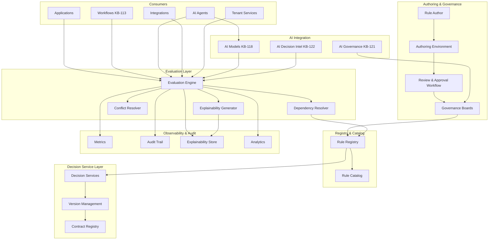
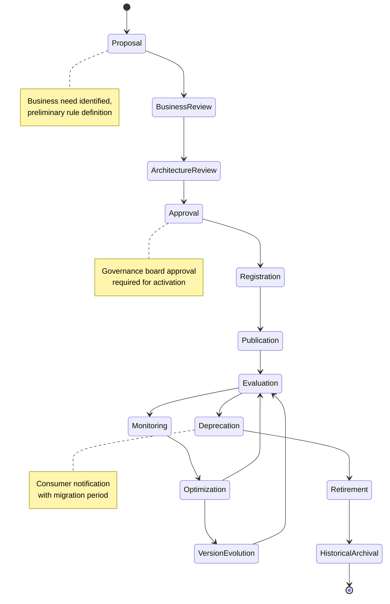
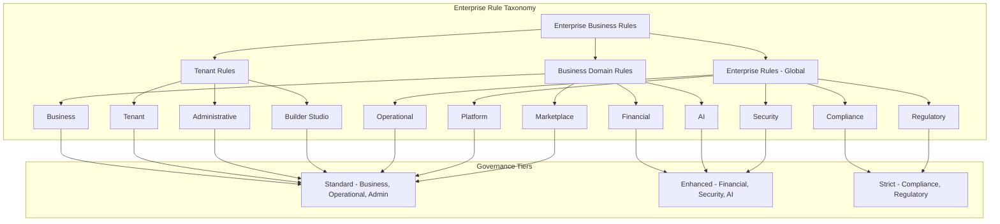
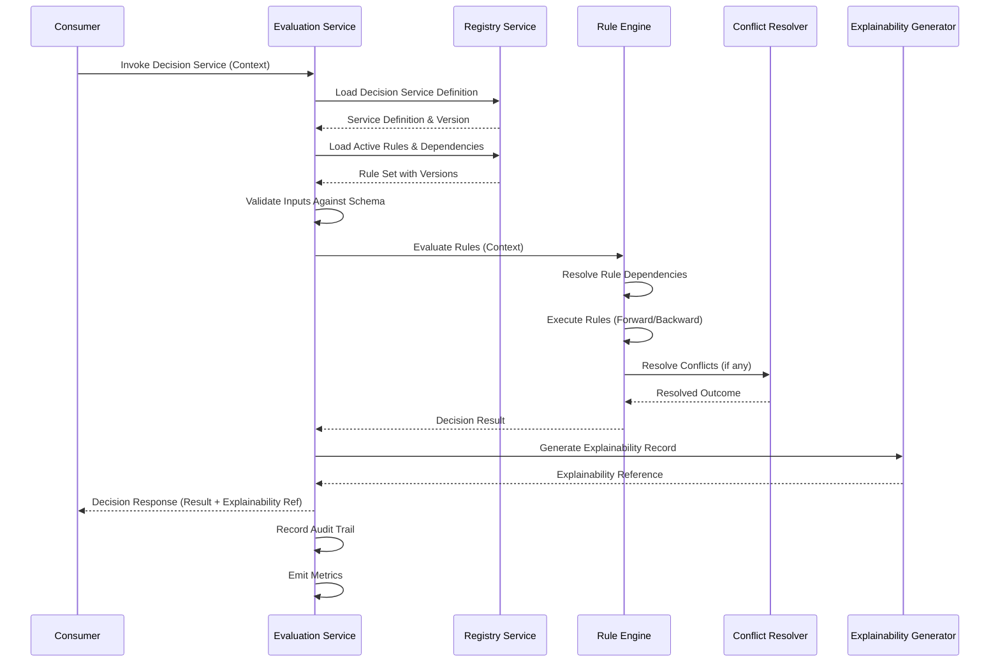
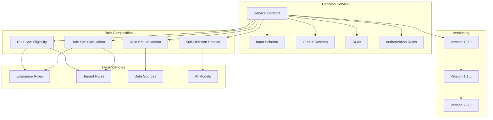
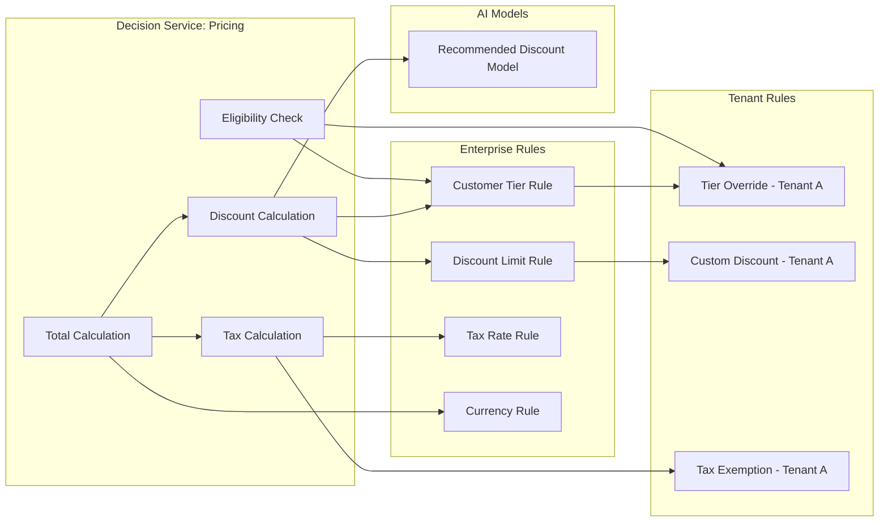
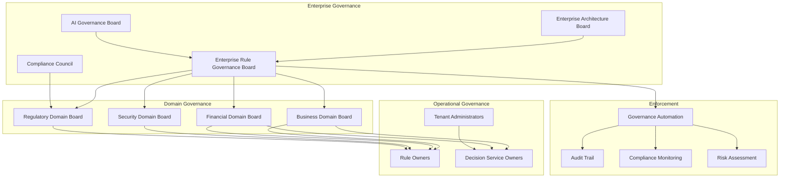
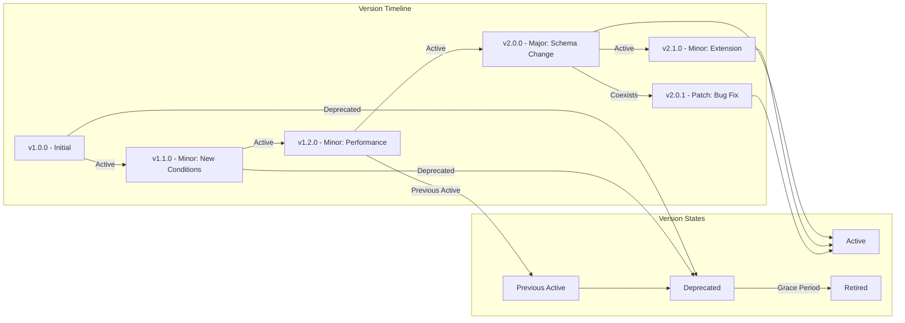
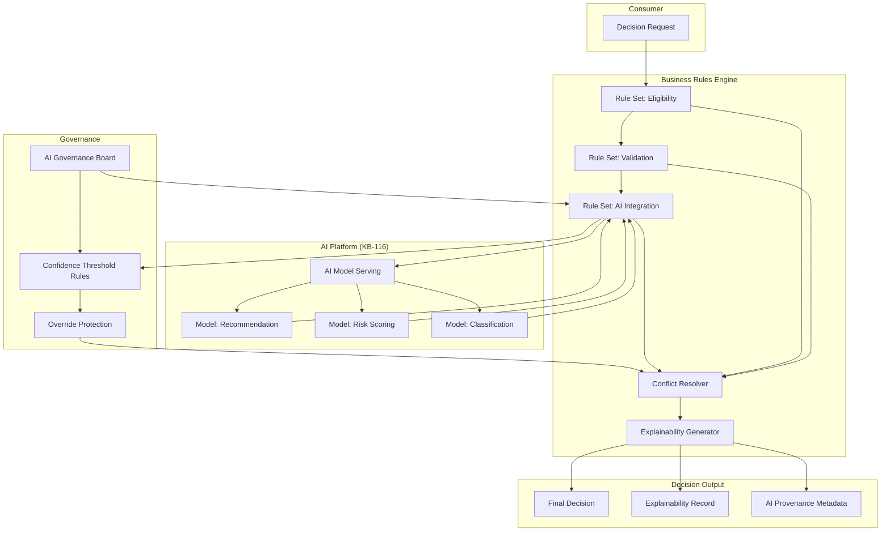
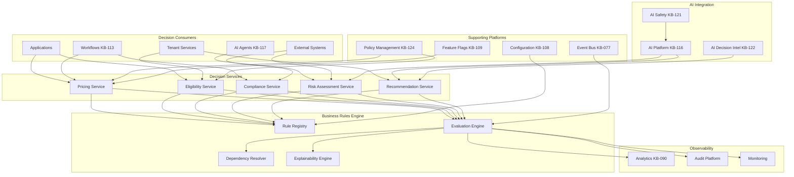

# KB-114 — Business Rules Engine Architecture

---

## Metadata

| Attribute | Value |
|-----------|-------|
| **Document ID** | KB-114 |
| **Title** | Business Rules Engine Architecture |
| **Suite** | Enterprise Platform Services |
| **Version** | 1.0 |
| **Status** | Approved Architecture |
| **Classification** | Core Platform Service Architecture |
| **Date** | 2026-07-12 |
| **Architect** | Enterprise Business Rules Architecture Builder |

---

## Table of Contents

1. Executive Summary
2. Architectural Principles
3. Canonical Definitions
4. Enterprise Business Rules Architecture
5. Rule Taxonomy
6. Rules Registry
7. Rules Catalog
8. Decision Model
9. Rule Evaluation Model
10. Rule Composition
11. Rule Inheritance
12. Rule Versioning
13. AI-Assisted Decision Architecture
14. Rule Lifecycle
15. Governance
16. Responsibilities
17. Security
18. Privacy
19. Performance
20. Observability
21. Failure Scenarios
22. Anti-Patterns
23. Future Evolution
24. Cross-References
25. Architecture Diagrams

---

## 1. Executive Summary

The Business Rules Engine (BRE) is a shared enterprise capability that centralizes the definition, governance, evaluation, and evolution of business decision logic across the entire DUKADESK platform. It establishes the BRE as the single authoritative mechanism through which all business policies, validations, eligibility criteria, calculations, constraints, compliance checks, and AI-assisted decisions are modeled, managed, and executed.

This architecture separates business intent from application implementation. Business rules are defined declaratively, governed centrally, and consumed as decision services by any platform component — applications, workflows, AI agents, integrations, or tenant configurations. No business rule is embedded in application code; no decision is executed without governance; no rule change takes effect without audit.

The BRE sits within the Platform Core domain of the Enterprise Platform Services suite (KB-107). It consumes policies from Policy Management (KB-124), emits events to the Event & Messaging Architecture (KB-077), integrates with Workflow Orchestration (KB-113) for decision-driven workflows, and connects to AI Decision Intelligence (KB-122) for AI-assisted decisions.

Key architectural decisions include:
- **Declarative rule model**: Business rules are expressed declaratively, not embedded in procedural code. Rules state what the policy is, not how to enforce it.
- **Decision service abstraction**: Rules are composed into decision services — reusable, versioned, governed decision units with defined inputs, outputs, and SLAs.
- **Separation of deterministic and AI-assisted**: Deterministic rules and AI-driven recommendations coexist under a unified governance framework. AI recommendations never override governed business rules without human oversight.
- **Canonical rule registry**: Every business rule across the enterprise is registered, versioned, owned, and classified before it can be activated.
- **Composable rule architecture**: Rules compose through inheritance, chaining, and set membership, enabling tenant-specific customization within enterprise governance guardrails.
- **Explainability by design**: Every decision records its rule provenance, input values, evaluation path, and output rationale.

---

## 2. Architectural Principles

### 2.1 Business Rules as Enterprise Assets

Business rules are first-class enterprise assets with defined ownership, lifecycle, versioning, and governance. They are not implementation artifacts owned by individual teams; they are shared intellectual property governed for the enterprise.

### 2.2 Separation of Business Policy from Application Logic

Business rules are declared, governed, and executed independently of application code. Applications invoke decision services but never define, embed, or duplicate business rules.

### 2.3 Centralized Rule Governance

All business rules are governed through a single, enterprise-wide framework. Rule registration, approval, publication, versioning, deprecation, and retirement follow standardized processes enforced by the platform.

### 2.4 Declarative Decision Architecture

Rules are expressed declaratively — what must be true, what must be calculated, what constraints apply — not how to compute or enforce them. The evaluation engine resolves rule execution, not the rule author.

### 2.5 Reusable Decision Services

Rules are composed into decision services that encapsulate related decision logic behind defined contracts. Decision services are discoverable, versioned, and consumable by any authorized component.

### 2.6 Vendor Independence

The BRE abstracts rule evaluation, storage, and execution behind canonical interfaces. Rule engine implementations may be substituted without affecting rule authors, decision consumers, or governance processes.

### 2.7 Technology Neutrality

The architecture defines canonical models, contracts, and behaviors without prescribing specific rule engine technologies, expression languages, or evaluation runtimes. Implementation choices are deferred to platform engineering.

### 2.8 Multi-Tenant Isolation

Rule definitions, evaluations, and results are isolated by tenant. Tenant-specific rule overrides and extensions operate within the enterprise governance framework.

### 2.9 Zero Trust

Every rule operation — authoring, approval, registration, evaluation, audit — is authenticated and authorized. No rule is trusted based on its source. Every evaluation is validated.

### 2.10 Explainability by Design

Every rule evaluation produces an explainability record detailing which rules were evaluated, in what order, with what inputs, and why a particular decision was reached. Explainability is not optional.

### 2.11 Auditability by Default

Every rule lifecycle transition, evaluation result, and governance action is recorded in the immutable audit trail. No decision operation is invisible.

### 2.12 AI-Ready Decision Architecture

The BRE supports a spectrum from fully deterministic rules to AI-assisted decisions. AI recommendations are integrated as decision inputs subject to the same governance, audit, and explainability requirements as deterministic rules.

---

## 3. Canonical Definitions

| Term | Definition |
|------|-----------|
| **Business Rule** | A declarative statement that defines, constrains, or governs some aspect of the business, expressed independently of implementation logic. |
| **Rule Set** | A logical grouping of related business rules that are evaluated together as a unit. |
| **Rule Registry** | The canonical, authoritative inventory of all governed business rules across the enterprise. |
| **Rule Catalog** | A searchable, browsable interface enabling discovery and governance of registered business rules. |
| **Decision** | The outcome produced by evaluating one or more business rules against a given context and set of inputs. |
| **Decision Service** | A named, versioned, governed unit of decision logic that exposes a defined contract (inputs, outputs, SLAs) to consumers. |
| **Decision Context** | The set of facts, data, and state against which business rules are evaluated for a specific decision request. |
| **Rule Evaluation** | The process of applying business rules to a decision context to produce a decision outcome. |
| **Rule Dependency** | A relationship where one rule or decision service references another as part of its evaluation logic. |
| **Rule Composition** | The assembly of multiple rules into rule sets, decision services, or evaluation chains to produce composite decisions. |
| **Rule Version** | A specific iteration of a rule definition, identified by semantic version, with defined compatibility and lifecycle state. |
| **Rule Owner** | The business or technical entity accountable for a rule's definition, accuracy, lifecycle, and governance. |
| **Rule Lifecycle** | The complete sequence of states a business rule traverses from proposal through archival. |
| **Rule Scope** | The boundary within which a rule applies — enterprise, tenant, organization, workflow, or specific context. |
| **Constraint** | A rule that defines a boundary condition that must not be violated. |
| **Validation Rule** | A rule that checks whether data, state, or input satisfies defined criteria. |
| **Eligibility Rule** | A rule that determines whether an entity, action, or state qualifies for a given outcome. |
| **Calculation Rule** | A rule that derives a value based on inputs, formulas, and business logic. |
| **Compliance Rule** | A rule that enforces regulatory, legal, or contractual requirements. |
| **Rule Explainability** | The capability to produce a human-readable account of why a decision was reached, including rule provenance, evaluation path, and input values. |

---

## 4. Enterprise Business Rules Architecture

### 4.1 Architectural Layers

The Business Rules Engine architecture comprises five logical layers:

1. **Authoring & Governance Layer** — Tools and processes for rule creation, review, approval, versioning, and lifecycle management.
2. **Registry & Catalog Layer** — Storage, indexing, discovery, and governance enforcement for all business rules.
3. **Decision Service Layer** — Named, versioned decision services that encapsulate rules behind defined contracts with inputs, outputs, and SLAs.
4. **Evaluation Layer** — Runtime engine that executes rule evaluation against decision contexts, producing decisions with explainability records.
5. **Observability & Audit Layer** — Metrics, logging, audit trails, explainability records, and analytics for all rule operations and decisions.

### 4.2 Architectural Flow

1. A business owner or rule author defines a rule in the authoring environment.
2. The rule undergoes business review, architecture review, and approval through the governance workflow.
3. Approved rules are registered in the Rule Registry with complete metadata.
4. Rules are composed into decision services, which are versioned and published.
5. A consumer (application, workflow, AI agent, integration) invokes a decision service with a decision context.
6. The evaluation engine loads applicable rules, resolves dependencies, evaluates rules against the context, and produces a decision.
7. The decision, including explainability record, is returned to the consumer.
8. Evaluation metrics, audit records, and explainability data are streamed to the observability and audit layer.
9. Rules evolve through version updates, deprecation, and retirement under governance.

### 4.3 Architectural Boundaries

The BRE is the sole authority for governed business decision logic. No application, service, workflow, AI agent, or tenant component may embed enterprise business rules within implementation code.

The BRE does not:
- Execute workflow orchestration (handled by KB-113).
- Enforce runtime policies (handled by KB-124).
- Host AI model inference (handled by KB-118).
- Replace application-specific calculations that are not business rules (e.g., rendering logic, UI state management).

### 4.4 Multi-Tenant Architecture

The BRE operates within DUKADESK's multi-tenant model (KB-107):

- **Rule isolation**: Rule definitions, versions, and evaluation results are partitioned by scope (enterprise vs. tenant).
- **Enterprise rules**: Apply across all tenants. Defined by enterprise governance. Cannot be overridden by tenants.
- **Tenant rules**: Tenant-specific rules, overrides, and extensions operate within enterprise governance guardrails.
- **Rule inheritance**: Tenant rules inherit from enterprise rules by default. Tenants may specialize, but not weaken, enterprise rules.
- **Cross-tenant rules**: Rules that apply across tenants (marketplace, partner) are governed by cross-tenant rule contracts.

```mermaid
graph TB
    subgraph "Authoring & Governance"
        A[Rule Author] --> B[Authoring Environment]
        B --> C[Review & Approval Workflow]
        C --> D[Governance Board]
    end

    subgraph "Registry & Catalog"
        E[Rule Registry]
        F[Rule Catalog]
    end

    subgraph "Decision Service Layer"
        G[Decision Service Definitions]
        H[Version Management]
        I[Contract Registry]
    end

    subgraph "Evaluation Layer"
        J[Evaluation Engine]
        K[Dependency Resolver]
        L[Explainability Generator]
    end

    subgraph "Consumers"
        M[Applications]
        N[Workflows KB-113]
        O[AI Agents]
        P[Integrations]
        Q[Tenant Services]
    end

    subgraph "Observability & Audit"
        R[Metrics]
        S[Audit Trail]
        T[Explainability Store]
        U[Analytics]
    end

    D --> E
    E --> F
    E --> G
    G --> H
    H --> I
    M --> J
    N --> J
    O --> J
    P --> J
    Q --> J
    J --> K
    J --> L
    J --> R
    J --> S
    J --> T
    J --> U
    K --> E
    L --> T

---

## 5. Rule Taxonomy

### 5.1 Classification Categories

Every business rule registered in the Rule Registry is assigned exactly one primary category and may be associated with zero or more secondary categories.

| Category | Description | Examples |
|----------|-------------|---------|
| **Business** | Core business logic governing transactions, operations, and processes | Order discount calculation, shipping cost determination, payment term assignment |
| **Operational** | Rules governing platform operations and infrastructure | Resource allocation policy, deployment eligibility, capacity threshold enforcement |
| **Financial** | Rules governing pricing, billing, invoicing, and financial calculations | Tax calculation, subscription pricing, invoice line-item validation, currency conversion |
| **Compliance** | Rules enforcing regulatory, legal, and audit requirements | Data retention period, consent verification, GDPR data access eligibility, audit log retention |
| **Security** | Rules governing access control, authentication, and threat detection | MFA requirement determination, session timeout calculation, IP allowlist validation |
| **AI** | Rules governing AI platform behavior, model selection, and AI decisions | Model selection criteria, AI recommendation confidence threshold, AI output content policy |
| **Marketplace** | Rules governing marketplace operations | App approval eligibility, revenue share calculation, marketplace rating validation |
| **Builder Studio** | Rules governing the Builder Studio development platform | Build environment eligibility, component publish validation, deployment approval rules |
| **Platform** | Rules governing platform-wide behavior and constraints | API rate limit calculation, feature flag eligibility, tenant quota enforcement |
| **Tenant** | Tenant-specific business rules within enterprise governance | Tenant pricing override, tenant-specific discount policy, tenant branding rules |
| **Administrative** | Rules governing administrative operations | Role assignment eligibility, tenant configuration validation, admin action authorization |
| **Regulatory** | Rules derived from specific regulatory frameworks | HIPAA data handling rule, SOC 2 control validation, PCI DSS compliance check |

### 5.2 Classification Attributes

Each rule category carries:

- **Governance tier**: The level of governance rigor required (standard, enhanced, strict).
- **Approval requirements**: Which governance bodies must approve rule definitions and changes.
- **Audit level**: The level of audit detail required for rule evaluations.
- **Explainability requirements**: The depth of explainability record required (basic, detailed, full).
- **Retention period**: How long rule definitions and evaluation records are retained.
- **Override eligibility**: Whether the rule may be overridden at the tenant level.
- **Default scope**: Whether the rule applies at enterprise, tenant, or context level.

### 5.3 Category Hierarchy

```
Enterprise Business Rules
├── Enterprise Rules (global)
│   ├── Platform
│   ├── Security
│   ├── Compliance
│   ├── Regulatory
│   └── Operational
├── Business Domain Rules
│   ├── Business
│   ├── Financial
│   ├── AI
│   └── Marketplace
├── Tenant Rules
│   ├── Tenant
│   ├── Administrative
│   └── Builder Studio
```

Enterprise rules apply globally and may be extended but not weakened by lower levels.

---

## 6. Rules Registry

### 6.1 Purpose

The Rule Registry is the canonical, authoritative inventory of every governed business rule across the DUKADESK platform. No business rule may be activated — used in evaluation, referenced by a decision service, or applied in any tenant context — unless it is registered in the Rule Registry.

### 6.2 Registration Schema

| Field | Description |
|-------|-------------|
| **Rule ID** | Globally unique identifier for the business rule |
| **Name** | Human-readable name |
| **Category** | Primary classification category |
| **Secondary Categories** | Zero or more additional category tags |
| **Owner** | The business or technical entity accountable for the rule |
| **Definition Version** | Semantic version of the rule definition |
| **Description** | Business purpose and intent of the rule |
| **Expression** | Declarative rule logic (condition → conclusion) |
| **Input Schema** | Data contract defining required inputs for rule evaluation |
| **Output Schema** | Data contract defining the rule's decision output |
| **Dependencies** | Other rules, decision services, or data sources this rule depends on |
| **Scope** | Enterprise, tenant, organization, or context |
| **Governance Tier** | Standard, enhanced, strict |
| **Audit Level** | Required level of audit detail for evaluations |
| **Explainability Level** | Required depth of explainability record |
| **Override Policy** | Whether and how tenant overrides are permitted |
| **Effective Date** | When the rule became or will become active |
| **Expiration Date** | When the rule expires (if time-limited) |
| **Status** | Draft, active, deprecated, retired |
| **Lifecycle State** | Current stage in the rule lifecycle |
| **Change History** | Audit log of all modifications to the rule definition |

### 6.3 Registry Operations

- **Registration**: Adding a new rule with complete metadata and governance approval.
- **Versioning**: Updating a rule definition with semantic version tracking and impact analysis.
- **Activation**: Transitioning a rule to active status for use in evaluations.
- **Deprecation**: Marking a rule as deprecated with scheduled retirement and consumer notification.
- **Retirement**: Removing a rule from active evaluation and archiving its definition.
- **Discovery**: Querying rules by category, owner, scope, status, dependency, and keyword.
- **Impact Analysis**: Identifying all decision services, workflows, AI agents, and tenants that depend on a rule.
- **Validation**: Ensuring rule expressions are valid, dependencies are resolvable, and schemas are consistent.

### 6.4 Registry Governance

- Registration requires approval from the relevant governance board based on the rule's governance tier.
- Schema changes require version bump and impact analysis of all consumers.
- Deprecation requires notification of all registered consumers with a minimum notice period.
- Retirement requires verification that no active decision service or consumer depends on the rule.
- All registry operations are recorded in the immutable audit trail.

---

## 7. Rules Catalog

### 7.1 Purpose

The Rules Catalog provides a searchable, browsable interface to the Rule Registry. It enables business owners, rule authors, developers, tenant administrators, and governance bodies to discover, understand, evaluate impact, and govern business rules across the enterprise.

### 7.2 Catalog Capabilities

- **Browse**: Navigate rules by category, owner, scope, status, governance tier, and lifecycle state.
- **Search**: Full-text search across rule names, descriptions, and metadata.
- **Detail View**: Complete rule definition, expression, input/output schemas, dependencies, and evaluation history.
- **Impact Analysis**: Identify all consumers, decision services, and dependent rules for any rule.
- **Usage Analytics**: Evaluation frequency, latency, and outcome distribution per rule.
- **Version History**: Complete version history of each rule with change diffs.
- **Dependency Graph**: Visual representation of rule dependencies, compositions, and consumer relationships.
- **Compliance View**: Governance compliance status, audit trail, and retention state per rule.

### 7.3 Catalog Integration

The Rules Catalog integrates with:

- **Business Portal**: Business owners discover and govern their rules.
- **Developer Portal**: Developers discover decision services and rules for integration.
- **Tenant Administration Console**: Tenant administrators view tenant-specific rules and overrides.
- **Governance Dashboard**: Governance bodies monitor rule portfolio health and compliance.
- **Workflow Designer**: Workflow authors discover and select rules for decision steps.
- **AI Platform**: AI agents discover rules that constrain or guide their decisions.

---

## 8. Decision Model

### 8.1 Decision Types

The BRE supports multiple decision types to accommodate the full spectrum of business logic:

| Decision Type | Description | Example |
|---------------|-------------|---------|
| **Single Decision** | A rule that evaluates to a single outcome (true/false, approved/rejected, value) | Is user eligible for discount? |
| **Composite Decision** | Multiple rules evaluated together, producing a combined outcome | Calculate order total (subtotal + tax + shipping - discount) |
| **Hierarchical Decision** | Decisions organized in a hierarchy where higher-level decisions depend on lower-level decision results | Determine customer tier (based on spending, tenure, engagement) |
| **Conditional Decision** | Decision path depends on intermediate results; subsequent rules depend on prior outcomes | Loan approval (income check → credit check → ratio calculation → decision) |
| **Context-Aware Decision** | Decision incorporates contextual data (time, location, device, tenant, user role) | Determine applicable tax rate (based on jurisdiction, product type, customer type) |
| **Multi-Stage Decision** | Decision involves multiple sequential stages with state carried between stages | Onboarding flow (identity verification → eligibility → document validation → approval) |

### 8.2 Decision Service Contract

Each decision service exposes a defined contract:

| Element | Description |
|---------|-------------|
| **Service ID** | Globally unique identifier for the decision service |
| **Name** | Human-readable name |
| **Version** | Semantic version |
| **Description** | Business purpose and behavior |
| **Input Schema** | Required input data structure and validation rules |
| **Output Schema** | Decision output structure including result, confidence, explainability reference |
| **SLAs** | Performance targets (P50/P95/P99 latency, throughput) |
| **Dependencies** | Other decision services, data sources, or AI models this service depends on |
| **Authorization** | Which consumers may invoke this decision service |
| **Scope** | Enterprise, tenant, or context scope |
| **Status** | Active, deprecated, retired |

### 8.3 Decision Evaluation Patterns

- **Forward Chaining**: Start with known facts and apply rules to derive new facts. Used for validation, classification, and derivation.
- **Backward Chaining**: Start with a goal or hypothesis and work backward to determine what facts are needed. Used for diagnostics, eligibility, and compliance.
- **Sequential Evaluation**: Rules evaluated in a defined order, with later rules potentially depending on earlier outcomes. Used for multi-stage decisions.
- **Parallel Evaluation**: Independent rules evaluated concurrently for performance. Used for composite decisions with no interdependencies.
- **Conflict Resolution**: When multiple rules produce conflicting outcomes, resolution is governed by rule priority, specificity, and override policy.

### 8.4 Decision Context

Each evaluation receives a decision context containing:

- Input data (facts, parameters, request payload)
- Tenant and organization identifiers
- User and role context
- Environment and deployment context
- Timing and temporal context
- Correlation ID for cross-system tracking
- Previous decision results (for multi-stage decisions)

---

## 9. Rule Evaluation Model

### 9.1 Evaluation Architecture

```
Decision Request (Service ID + Context)
        │
        ▼
┌─────────────────────┐
│  Service Resolution  │── Load decision service definition
└──────────┬──────────┘
           │
           ▼
┌─────────────────────┐
│  Rule Set Loading    │── Load applicable rules with versioning
└──────────┬──────────┘
           │
           ▼
┌─────────────────────┐
│  Dependency          │── Resolve rule dependencies recursively
│  Resolution          │
└──────────┬──────────┘
           │
           ▼
┌─────────────────────┐
│  Context Preparation │── Validate and prepare decision context
└──────────┬──────────┘
           │
           ▼
┌─────────────────────┐
│  Rule Evaluation     │── Execute rules with chosen pattern
│  Engine              │    (forward, backward, sequential, parallel)
└──────────┬──────────┘
           │
           ▼
┌─────────────────────┐
│  Conflict Resolution │── Resolve conflicting rule outcomes
└──────────┬──────────┘
           │
           ▼
┌─────────────────────┐
│  Decision Assembly   │── Assemble final decision output
└──────────┬──────────┘
           │
           ▼
┌─────────────────────┐
│  Explainability      │── Generate explainability record
│  Generation          │
└──────────┬──────────┘
           │
           ▼
      Decision Response (Result + Explainability Ref)
```

### 9.2 Evaluation Guarantees

- **Deterministic**: Given the same inputs and context, the same decision service produces the same result (for deterministic rules).
- **Isolated**: Rule evaluations are isolated by tenant. One tenant's rules do not affect another's evaluations.
- **Audited**: Every evaluation produces an audit record with inputs, outputs, timestamp, and rule version.
- **Explainable**: Every evaluation produces an explainability record describing why the decision was reached.
- **Time-boxed**: Evaluations have a configurable timeout to prevent runaway rule execution.
- **Observable**: Evaluation metrics (latency, frequency, outcome distribution) are collected for every invocation.

### 9.3 Evaluation Optimization

- Rules are cached after loading to reduce registry lookups.
- Rule evaluation results may be cached for repeated identical contexts (TTL-based).
- Independent rules within a rule set are evaluated in parallel.
- Rule evaluation order is optimized based on dependency depth and computational cost.
- Decision service compilation precomputes evaluation plans for frequently invoked services.

---

## 10. Rule Composition

### 10.1 Composition Model

Rules compose through several mechanisms:

| Composition Type | Description | Example |
|-----------------|-------------|---------|
| **Rule Set** | A group of rules evaluated together. Rules in a set may be independent or ordered. | Customer discount rule set: contains eligibility rule, amount calculation rule, stacking rule |
| **Decision Service** | A named, versioned unit composed of rule sets and/or other decision services. | Pricing decision service: composed of base price rule set, discount rule set, tax rule set |
| **Rule Chaining** | Output of one rule serves as input to another rule within the same evaluation. | Income rule result feeds debt-to-income ratio rule, which feeds approval decision rule |
| **Rule Hierarchy** | Rules organized in a parent-child hierarchy with inheritance. Child rules specialize parent rules. | Enterprise discount policy → Tenant discount override → Customer-specific discount |
| **Decision Composition** | A decision service invokes other decision services as part of its evaluation. | Loan decision service invokes credit check decision service, fraud detection decision service, compliance decision service |

### 10.2 Composition Governance

- Composition relationships are registered and versioned.
- Circular composition is detected and prevented during registration.
- Composition changes trigger impact analysis on all upstream consumers.
- Decision service composition depth is bounded by governance policy.
- Tenant compositions may reference only tenant-scoped rules and explicitly authorized enterprise rules.

### 10.3 Composition Validation

- All referenced rules and decision services must exist and be in active state.
- Input/output schemas must be compatible across composition boundaries.
- Evaluation order must be unambiguous (explicit ordering rules or conflict resolution mechanism).
- Composition must not introduce circular dependencies or infinite evaluation chains.

---

## 11. Rule Inheritance

### 11.1 Inheritance Model

Rules support a hierarchical inheritance model that enables specialization without duplication:

```
Enterprise Rule (abstract or concrete)
        │
        ▼
Tenant Rule Override (specializes enterprise rule)
        │
        ▼
Organization Rule Override (further specialization, optional)
```

### 11.2 Inheritance Rules

- Tenant rules inherit from enterprise rules unless explicitly overridden.
- Tenant overrides may strengthen (narrow) but not weaken (widen) enterprise rules unless explicitly permitted by the enterprise rule's override policy.
- Override policy per enterprise rule defines:
  - **None**: No override permitted.
  - **Strengthen Only**: Tenants may add additional constraints but not remove existing ones.
  - **Full Override**: Tenants may fully replace the rule, subject to governance approval.
  - **Extension Only**: Tenants may add additional conditions but not modify the original rule conditions.
- Override versions are tracked independently of parent rule versions.
- Parent rule updates are propagated to child overrides; conflicts are flagged for review.

### 11.3 Specialization Patterns

- **Concrete rule specialization**: Tenant creates a more specific version of an enterprise rule for their context.
- **Rule parameterization**: Enterprise rule defines parameters; tenant provides parameter values without changing rule logic.
- **Rule extension**: Tenant adds additional conditions that complement the enterprise rule without modifying it.
- **Rule substitution**: Tenant replaces an enterprise rule entirely with an approved alternative.

### 11.4 Inheritance Resolution

During evaluation, the effective rule is resolved by:

1. Load the base enterprise rule definition.
2. Check for tenant-level override or extension.
3. Check for organization-level specialization.
4. Merge applicable overrides according to the override policy.
5. Validate the merged rule for consistency.
6. Return the effective rule for evaluation.

---

## 12. Rule Versioning

### 12.1 Version Model

Rules and decision services follow semantic versioning:

| Version Component | Meaning |
|-------------------|---------|
| **Major** | Breaking change: incompatible input/output schema, removed rule, changed behavior that may produce different decisions |
| **Minor** | Backward-compatible addition: new conditions, extended scope, additional outputs |
| **Patch** | Backward-compatible fix: bug fix, performance improvement, clarity update without behavior change |

### 12.2 Version States

| State | Description |
|-------|-------------|
| **Draft** | Initial version, under development, not yet available for evaluation |
| **Active** | Current production version, available for evaluation |
| **Previous Active** | Prior active version, still available for consumers who have not migrated |
| **Deprecated** | Marked for removal; new consumers may not bind; existing consumers are notified |
| **Retired** | Removed from evaluation; consumers using this version receive an error |

### 12.3 Version Compatibility

- **Major version changes**: Consumers must explicitly migrate. Coexistence period allows gradual migration.
- **Minor version changes**: Consumers are automatically eligible for the new version but are not forced to upgrade.
- **Patch version changes**: Automatically applied to all consumers on the same major.minor version.
- **Version coexistence**: Multiple major versions may be active simultaneously during migration windows.
- **Version deprecation**: Deprecated versions continue to function for a defined grace period, then are retired.

### 12.4 Version Migration

- Migration notifications are sent to all registered consumers before major version changes.
- Migration windows provide a defined period for consumers to update.
- Automatic migration is available for minor and patch versions.
- Rollback is supported during the migration window.
- Migration audit trail records which consumers have migrated and when.

### 12.5 Version Governance

- Version bumps require governance approval based on the change type:
  - Patch: Author approval.
  - Minor: Business owner approval.
  - Major: Governance board approval plus impact analysis.
- Version history is immutable; previous versions are retained for audit and rollback.
- Deprecation periods are governed by policy (minimum: 90 days for major versions, 30 days for minor).

---

## 13. AI-Assisted Decision Architecture

### 13.1 AI-Assisted Decision Model

The BRE supports decisions that combine deterministic business rules with AI-driven recommendations. AI-assisted decisions do not replace governed business rules; they augment them by providing recommendations, predictions, and insights that are evaluated within the deterministic rule framework.

### 13.2 Integration Patterns

| Pattern | Description | Example |
|---------|-------------|---------|
| **AI Recommendation Input** | An AI model produces a recommendation that is evaluated by deterministic rules before acceptance | Credit risk assessment: AI predicts risk score; business rules determine if the score qualifies for approval |
| **Rule-Governed AI Output** | AI-generated outputs are validated against business rules before being returned | AI-generated pricing: business rules validate the proposed price is within allowed range |
| **AI Decision Support** | Business rules invoke AI models as decision support, incorporating AI outputs alongside rule conditions | Customer churn prevention: rules determine intervention tier; AI recommends specific intervention action |
| **AI Confidence Threshold** | Rules evaluate AI confidence levels; low-confidence AI outputs trigger alternative handling | Document classification: if AI confidence < 0.8, route to human review |
| **Fallback Decision** | If AI model is unavailable or produces invalid output, deterministic rules provide the decision | Fraud detection: if AI model is degraded, use rule-based fraud scoring |
| **Human-in-the-Loop** | AI recommends; rules determine whether human approval is required before the decision is final | Loan approval: AI recommends approve; rules require human review for amounts > threshold |

### 13.3 Governance of AI-Assisted Decisions

- AI-assisted decisions must be explicitly registered and approved by the AI Governance Board.
- Every AI-assisted decision rule specifies which AI models are authorized to contribute recommendations.
- AI recommendation confidence thresholds are defined as business rules, not AI parameters.
- AI-assisted decisions include provenance metadata identifying which AI model contributed and with what confidence.
- AI recommendations that fall outside business rule boundaries are rejected, with explainability detailing the rule violation.
- AI-assisted decision audit trails include the AI model version, input features, and model output alongside the business rule evaluation path.

### 13.4 Explainability for AI-Assisted Decisions

- Explainability records for AI-assisted decisions include:
  - The business rules evaluated and their outcomes.
  - The AI model recommendation and confidence score.
  - How the AI recommendation was combined with business rules (superseded, validated, used as input, overridden).
  - The reason for the final decision (which rule or combination of rules and AI output produced the result).
  - Human oversight actions if any (override, approval, rejection).

### 13.5 Non-Overridability

- AI recommendations must not override governed business rules that have deterministic outcomes.
- If a business rule definitively determines an outcome (e.g., "reject if credit score < 500"), an AI recommendation cannot change that outcome.
- AI recommendations may influence decisions only where business rules allow discretion (e.g., "approve if credit score ≥ 650, or if score ≥ 600 with AI recommendation").
- This principle is enforced by the evaluation engine, not by policy or convention.

---

## 14. Rule Lifecycle

### 14.1 Lifecycle Stages

| Stage | Description |
|-------|-------------|
| **Proposal** | Business need identified, preliminary rule definition drafted, business case documented. |
| **Business Review** | Business owner reviews rule for correctness, completeness, and alignment with business policy. |
| **Architecture Review** | Architecture review ensures rule fits within the enterprise rule model, has no conflicts or circular dependencies, and follows governance standards. |
| **Approval** | Appropriate governance board approves the rule for registration. |
| **Registration** | Rule is registered in the Rule Registry with complete metadata, schemas, and dependencies. |
| **Publication** | Rule is published and available for inclusion in decision services and evaluations. |
| **Evaluation** | Rule is actively evaluated as part of decision services. Monitoring and optimization occur during this stage. |
| **Monitoring** | Rule performance, accuracy, and compliance are continuously monitored. Optimization opportunities are identified. |
| **Optimization** | Rule is refined for performance, clarity, or correctness through version updates. |
| **Version Evolution** | Rule undergoes version updates for business or regulatory changes, following version governance. |
| **Deprecation** | Rule is marked as deprecated with consumer notification and migration guidance. |
| **Retirement** | Rule is retired and removed from active evaluation. |
| **Historical Archival** | Rule definition, version history, and evaluation records are archived for compliance and reference. |

### 14.2 Lifecycle State Transitions

```
Proposal ──▶ Business Review ──▶ Architecture Review ──▶ Approval
                                                             │
                                                             ▼
                                                        Registration
                                                             │
                                                             ▼
                                                        Publication
                                                             │
                                                             ▼
                                     ┌───────────────────┬──┴───┬───────────────────┐
                                     │                   │      │                   │
                                     ▼                   ▼      ▼                   ▼
                                Evaluation         Monit-   Opti-            Version
                                                   oring    mization          Evolution
                                     │                   │      │                   │
                                     └───────────────────┴──┬───┴───────────────────┘
                                                            │
                                                            ▼
                                                       Deprecation
                                                            │
                                                            ▼
                                                       Retirement
                                                            │
                                                            ▼
                                                   Historical Archival
```

### 14.3 Lifecycle Governance

- Transitions from Approval to Registration require recorded approval decision.
- Transitions from Active to Deprecation require consumer notification and impact analysis.
- Transitions from Deprecation to Retirement require consumer migration completion and governance approval.
- Lifecycle state is visible in the Rule Registry and Catalog.
- Archived rules are retained for compliance purposes and may be reactivated only through a new lifecycle.

---

## 15. Governance

### 15.1 Governance Bodies

| Body | Responsibility |
|------|---------------|
| **Enterprise Rule Governance Board** | Governs enterprise-level rules, approves major version changes, resolves cross-domain rule conflicts. |
| **Domain Rule Governance Boards** | Per-domain boards (business, financial, compliance, security) govern rules within their domain. |
| **AI Governance Board** | Governs AI-assisted decision rules and AI model integration into decision services. |
| **Tenant Governance** | Tenant administrators govern tenant-specific rule overrides and extensions. |
| **Architecture Review Board** | Reviews rule composition, dependency, and integration architecture. |

### 15.2 Governance Domains

| Domain | Description |
|--------|-------------|
| **Rule Ownership** | Every rule has a designated owner accountable for definition, accuracy, lifecycle, and governance. |
| **Decision Ownership** | Every decision service has a designated owner accountable for its behavior, SLAs, and consumer relationships. |
| **Business Governance** | Rules accurately reflect business policy. Business owners validate rule behavior against business intent. |
| **Compliance Governance** | Rules comply with regulatory and legal requirements. Compliance rules are governed at enhanced rigor. |
| **Architecture Governance** | Rules follow the enterprise rule model, avoid conflicts and circular dependencies, and adhere to standards. |
| **Version Governance** | Version changes follow semantic versioning and require appropriate approval per change type. |
| **Lifecycle Governance** | Lifecycle transitions follow defined workflows and approval gates. |
| **Audit Governance** | All rule and decision operations are auditable. Audit records retained per compliance requirements. |
| **Risk Governance** | High-impact rules are subject to enhanced risk assessment, testing, and monitoring. |
| **Change Management** | Rule changes follow the platform change management process with appropriate review and approval. |

### 15.3 Governance Enforcement

- Governance rules are encoded in the BRE platform, not in application code.
- Automated governance checks run on rule registration, version updates, and composition changes.
- Governance violation notifications are sent to rule owners and governance boards.
- Non-compliant rules are quarantined (prevented from evaluation) until remediation.
- Governance dashboards provide real-time visibility into rule portfolio health.

---

## 16. Responsibilities

| Role | Responsibilities |
|------|-----------------|
| **Enterprise Architecture** | Define BRE architecture, principles, and standards. Govern the Rule Registry. Approve architecture review stage of rule lifecycle. |
| **Business Owners** | Define business rule intent and requirements. Validate rule behavior against business policy. Approve business review stage. |
| **Product Teams** | Define rules required for their product capabilities. Register rules in the Rule Registry. Maintain rule definitions and schemas. |
| **Platform Engineering** | Implement and operate the BRE platform, evaluation engine, registry, and catalog. Ensure platform scalability, availability, and performance. |
| **Security** | Define rule security policies. Validate rule authorization and access control. Review rules for security implications. |
| **Compliance** | Define compliance requirements for rules. Ensure compliance rules are accurate and up to date. Review audit trails for compliance violations. |
| **Operations** | Monitor BRE platform health, evaluation performance, and rule execution failures. Respond to evaluation errors and platform incidents. |
| **AI Governance Teams** | Govern AI-assisted decision rules. Review AI model integration with business rules. Ensure AI recommendations respect rule boundaries. |
| **Tenant Administrators** | Manage tenant-specific rule overrides and extensions. Ensure tenant rules comply with enterprise governance. |
| **Audit Teams** | Review rule and decision audit trails for compliance and governance adherence. Generate compliance reports. Investigate decision-related incidents. |

---

## 17. Security

### 17.1 Rule Authorization

- Rule creation, modification, activation, deprecation, and retirement operations are authorized per rule scope and governance tier.
- Authorization is checked at the API layer for every registry and evaluation operation.
- Tenant administrators may manage only tenant-scoped rules; enterprise rules are managed by enterprise governance.

### 17.2 Decision Integrity

- Decision inputs are validated against decision service input schemas before evaluation.
- Rule expressions are validated for correctness and security before registration.
- Evaluation results are signed to ensure integrity between evaluation engine and consumer.
- Decision responses include integrity metadata for non-repudiation.

### 17.3 Secure Evaluation

- Rule evaluation is performed in isolated execution contexts per tenant.
- Rule expressions cannot access external resources, file systems, or network services.
- Evaluation timeouts prevent runaway rule execution.
- Rule evaluation is logged for audit regardless of success or failure.

### 17.4 Tenant Isolation

- Enterprise rules are read-only to tenants; tenant rules are isolated from other tenants.
- Rule evaluation contexts are scoped to the requesting tenant.
- Cross-tenant rule evaluation requires explicit authorization.
- Rule caching is partitioned by tenant to prevent cross-tenant data leakage.

### 17.5 Least Privilege

- Rule authors access only the rule categories and scopes they are authorized to modify.
- Decision service consumers access only the services they are authorized to invoke.
- Audit data access is restricted to authorized auditors and governance bodies.
- Rule owners access only their owned rules for lifecycle management.

### 17.6 Tamper Resistance

- Rule definitions are stored with integrity checksums.
- Rule activation and deactivation events are recorded in the immutable audit trail.
- Rule evaluation audit records include rule version hashes for tamper detection.
- Rule composition graphs are validated during evaluation to detect unauthorized modifications.

### 17.7 Rule Provenance

- Every rule records its origin, author, approval history, and modification history.
- Rule provenance is included in explainability records for every decision.
- AI-assisted decision provenance includes AI model details for full traceability.

---

## 18. Privacy

### 18.1 Tenant Privacy

- Rule definitions are isolated by scope. One tenant's rules are not visible to other tenants.
- Enterprise rules are visible to all tenants in read-only form; tenant rules are private to the owning tenant.
- Evaluation inputs and outputs are tenant-partitioned.

### 18.2 Data Minimization

- Rule definitions store only rule logic, not business data.
- Evaluation inputs and outputs are retained only as long as required by audit and compliance policies.
- Explainability records contain only the minimum data needed to explain the decision.

### 18.3 Regulatory Compliance

- Compliance rules are defined and governed at the enterprise level to ensure consistent enforcement.
- Regional regulatory requirements are encoded as compliance rules with appropriate scope.
- Rule evaluation respects data residency requirements; evaluation occurs in the tenant's home region.

### 18.4 Cross-Border Governance

- Cross-tenant rule evaluation is governed by data transfer policies.
- Enterprise rules are designed to be region-agnostic; region-specific variations are handled through rule parameters.
- Cross-region rule evaluation audit trails are retained per the most stringent applicable regulation.

### 18.5 Retention Policies

- Rule definition versions are retained indefinitely for audit and compliance.
- Evaluation audit records are retained per governance policy (minimum 7 years for regulated rules).
- Explainability records are retained for the evaluation audit retention period.
- Privacy-sensitive evaluation inputs are redacted or anonymized in long-term audit storage.

---

## 19. Performance

| Metric | Target |
|--------|--------|
| **Rule evaluation latency (simple)** | < 10ms P99 |
| **Rule evaluation latency (composite)** | < 100ms P99 |
| **Rule evaluation latency (complex, multi-stage)** | < 500ms P99 |
| **Decision service invocation** | < 50ms P99 (including rule loading and evaluation) |
| **Rule registry lookup** | < 20ms P99 |
| **Concurrent evaluation throughput** | 10,000+ evaluations/second per region |
| **Decision service compilation** | < 1s for standard services |

### 19.1 Scalability

- Evaluation engine scales horizontally across all layers.
- Rule loading and dependency resolution are cached.
- Decision service compilation produces optimized evaluation plans.
- Rule evaluation is stateless; any evaluation node may handle any request.
- High-volume decision services may be deployed to dedicated evaluation nodes.

### 19.2 Latency Optimization

- Rules are compiled into optimized execution plans for frequent decision services.
- Frequently evaluated rules are cached in-memory with version-aware invalidation.
- Parallel evaluation of independent rules within rule sets.
- Decision service response caching for idempotent evaluations with identical inputs.

### 19.3 High Availability

- BRE platform is deployed in active-active configuration across multiple availability zones.
- Evaluation engine instances are stateless and behind load balancers.
- Rule registry data is replicated and consistent across zones.
- Regional deployment for global availability with local evaluation.
- Degraded mode: if dependency resolution fails, cached rule definitions are used for continued evaluation.

---

## 20. Observability

| Metric | Description |
|--------|-------------|
| **Evaluations Per Second** | Decision service invocation rate |
| **Evaluation Latency** | Time from request to decision response, per service and P50/P95/P99 |
| **Evaluation Outcome Distribution** | Percentage of decisions per outcome (approved, rejected, flagged, etc.) |
| **Rule Hit Rate** | Frequency each rule within a service contributes to a decision |
| **Rule Conflict Rate** | Frequency of conflicting rule outcomes requiring resolution |
| **Rule Error Rate** | Percentage of evaluations resulting in errors (validation, timeout, dependency failure) |
| **Cache Hit Rate** | Rule definition and evaluation cache effectiveness |
| **Decision Service Usage** | Invocation count per decision service per tenant per time period |

### 20.1 Decision Analytics

- Outcome trends over time per decision service.
- Decision distribution by tenant, region, channel, and consumer type.
- Rule activation frequency to identify heavily-used and unused rules.
- Rule override frequency to understand tenant-level customization patterns.

### 20.2 Explainability Reporting

- Explainability records are queryable by decision ID, service, rule, tenant, and time range.
- Explainability reports provide human-readable decision justifications.
- AI-assisted decision explainability includes model contribution details.
- Explainability dashboards for governance review and compliance reporting.

### 20.3 Operational Dashboards

- Real-time evaluation throughput and latency dashboard.
- Decision service health dashboard with error rate and availability.
- Rule registry health dashboard (active/deprecated/retired counts).
- Tenant-level evaluation distribution dashboard.
- Rule conflict and error monitoring dashboard.
- Governance compliance dashboard.

### 20.4 SLA Monitoring

- Decision service SLA compliance metrics.
- SLA breach alerts with escalation to platform engineering.
- SLA reporting for consumers and governance bodies.
- Performance trend analysis for capacity planning.

---

## 21. Failure Scenarios

### 21.1 Rule Conflicts

| Scenario | Architecture Mitigation |
|----------|------------------------|
| Two rules within a rule set produce contradictory outcomes for the same inputs | Conflict resolution is governed by explicit rule priority, specificity (more specific rules override general ones), and override policy. Unexplained conflicts are flagged for governance review. |
| Tenant rule override contradicts enterprise rule | Override policy enforcement prevents tenant rules from weakening enterprise rules. Conflicts are logged and flagged for tenant administrator review. |
| Rules from different decision services produce inconsistent results for related decisions | Decision service composition governance ensures consistency. Cross-service impact analysis identifies potential inconsistencies. |

### 21.2 Circular Dependencies

| Scenario | Architecture Mitigation |
|----------|------------------------|
| Rule A depends on Rule B, which depends on Rule A | Circular dependency detection during registration and composition validation. Max dependency depth enforced. Circular references are rejected. |
| Decision service indirectly depends on itself through chain of service invocations | Dependency graph analysis during service publication detects and prevents circular chains. |
| Rule inheritance hierarchy creates circular override | Inheritance depth is bounded. Circular specialization is detected and prevented during registration. |

### 21.3 Invalid Rule Composition

| Scenario | Architecture Mitigation |
|----------|------------------------|
| Rule input schema incompatible with decision service input | Schema validation during composition and registration catches incompatibilities. Version compatibility checks prevent composition of incompatible versions. |
| Required dependency is retired or deprecated | Dependency status validation during evaluation. If required dependency is unavailable, evaluation fails with clear error. |
| Rule composition exceeds maximum depth | Composition depth is bounded by governance policy. Composition validation during registration and publication. |

### 21.4 Decision Ambiguity

| Scenario | Architecture Mitigation |
|----------|------------------------|
| No rule matches the decision context | Default outcome is defined per decision service. No-match situations are logged and monitored. |
| Multiple rules match with different outcomes and no conflict resolution defined | Conflict resolution policy is required for every rule set. Missing resolution policy is flagged as governance violation. |
| Rule evaluation produces unexpected output type | Output schema validation ensures results conform to expected types. Schema validation at registration and evaluation time. |

### 21.5 Version Incompatibility

| Scenario | Architecture Mitigation |
|----------|------------------------|
| Consumer sends input matching old version schema to new version of decision service | Schema validation accepts backward-compatible inputs. Breaking schema changes require major version bump with migration window. |
| Rule dependency updated to version incompatible with dependent rule | Version compatibility checking during dependency resolution. Coexistence of compatible versions during migration windows. |
| Rollback of a rule version causes dependency incompatibility | Rollback impact analysis verifies dependent rule compatibility. Rollback is blocked if it would break active dependencies. |

### 21.6 Rule Corruption

| Scenario | Architecture Mitigation |
|----------|------------------------|
| Rule definition corrupted in storage | Rule definitions are stored with integrity checksums. Corruption detection during loading triggers automatic recovery from backup. |
| Rule expression contains syntax error after update | Rule expression validation during registration prevents invalid expressions. Rollback to previous version on validation failure. |
| Rule dependency reference broken after migration | Dependency resolution verification during activation. Broken references are detected and prevent activation. |

### 21.7 Unauthorized Rule Modification

| Scenario | Architecture Mitigation |
|----------|------------------------|
| Unauthorized user modifies enterprise rule | Authorization enforcement at API layer. Immutable audit trail records all modifications. Tamper detection alerts security. |
| Tenant administrator modifies rule beyond allowed override policy | Override policy enforcement prevents unauthorized modifications. Policy violation is logged and governance board is notified. |
| Rule activated without governance approval | Lifecycle governance enforcement prevents activation without recorded approval. Audit trail reveals bypass attempts. |

### 21.8 Tenant Isolation Breach

| Scenario | Architecture Mitigation |
|----------|------------------------|
| Tenant rule evaluation accesses another tenant's data | Evaluation context isolation prevents cross-tenant data access. Tenant ID is validated at every evaluation boundary. |
| Tenant rule override applies to another tenant | Rule scope enforcement prevents cross-tenant rule application. Scope is validated during rule loading. |
| Tenant views another tenant's rule definitions | Tenant-partitioned registry access prevents cross-tenant rule visibility. Read operations are scoped to authorized tenants. |

### 21.9 Explainability Failure

| Scenario | Architecture Mitigation |
|----------|------------------------|
| Explainability record incomplete due to evaluation error | Explainability generation is mandatory; evaluation fails if explainability cannot be generated. Fallback explainability (detailing the error) is produced. |
| Explainability exceeds storage limits | Explainability records are truncated at defined limits with summary and full record storage separately. |
| AI-assisted explainability cannot be generated (AI model unavailable) | Explainability records the AI model unavailability and documents the fallback deterministic decision path. |

### 21.10 AI Recommendation Conflict

| Scenario | Architecture Mitigation |
|----------|------------------------|
| AI recommends an outcome that violates a deterministic business rule | Evaluation engine enforces that deterministic rules cannot be overridden by AI. AI recommendation is rejected with explainability detailing the rule violation. |
| AI model confidence below threshold for decision | Business rules define minimum confidence thresholds. Below-threshold recommendations trigger alternative handling (fallback to deterministic, human review, or rejection with explanation). |
| AI recommendation contradicts another AI recommendation | AI recommendation precedence is governed by business rules. Conflict resolution follows defined policy (latest, highest confidence, most specific model). |

### 21.11 Policy Inconsistency

| Scenario | Architecture Mitigation |
|----------|------------------------|
| Rule evaluation produces outcome inconsistent with platform policy | Policy compliance validation during rule definition and evaluation. Inconsistent outcomes are flagged for governance review. |
| Tenant-level rule produces outcome inconsistent with enterprise policy | Enterprise rule override enforcement ensures consistency. Violations are logged and governance board is notified. |
| Compliance rule produces outcome inconsistent with regulatory requirement | Compliance rules are governed at strict tier with enhanced review. Regulatory change triggers mandatory rule update with impact analysis. |

### 21.12 Recovery Failure

| Scenario | Architecture Mitigation |
|----------|------------------------|
| Evaluation engine crash causes partial evaluation | Evaluation is atomic within a transaction boundary. Crashes result in no decision; consumer retries. |
| Rule registry data loss | Registry is backed up with point-in-time recovery. Read replicas provide availability during recovery. |
| Version migration fails mid-migration | Migration is transactional; rollback is supported. Migration state is recorded for recovery. |

---

## 22. Anti-Patterns

| # | Anti-Pattern | Description | Prohibited Rationale |
|---|--------------|-------------|---------------------|
| 1 | **Hardcoded Business Rules** | Business rules embedded in application code (if-then-else, switch statements, configuration constants) instead of defined in the BRE. | Bypasses centralized governance, versioning, audit, and explainability. Makes rule changes require application deployment. |
| 2 | **Duplicate Rule Definitions** | The same business logic defined in multiple places (BRE, application code, workflow, configuration). | Creates inconsistency risk. Makes governance impossible. Violates single-source-of-truth principle. |
| 3 | **Application-Owned Decision Engines** | Individual applications implement their own rule evaluation logic instead of using the centralized BRE. | Duplicates effort. Prevents cross-application consistency. Bypasses governance and audit. |
| 4 | **Hidden Rule Logic** | Business rules encoded in database triggers, stored procedures, or other hidden locations outside the BRE. | Invisible to governance. Unversioned. Unauditable. Creates maintenance and compliance risk. |
| 5 | **Missing Ownership** | Business rules without a designated, documented owner. | No accountability for accuracy, lifecycle management, or compliance. Rules become unmaintained and unreliable. |
| 6 | **Unversioned Rules** | Rules modified in place without version tracking or consumer notification. | Consumers cannot predict or control when rule behavior changes. Audit trail is incomplete. Rollback is impossible. |
| 7 | **Non-Auditable Decisions** | Decisions produced without recording inputs, rules evaluated, and outputs. | Compliance violations. No ability to investigate incorrect decisions. No explainability for consumers. |
| 8 | **AI Replacing Governed Business Rules** | AI recommendations directly implemented as decisions without business rule governance, override protection, or explainability. | Violates non-overridability principle. Creates black-box decisions. Exposes the enterprise to compliance and risk exposure. |
| 9 | **Manual Policy Enforcement** | Business policies enforced through manual reviews, human checklists, or informal processes instead of encoded BRE rules. | Inconsistent enforcement. No audit trail. Scales poorly. Creates compliance gaps. |
| 10 | **Rule Evaluation Without Governance** | Rules executed outside the BRE platform (local rule engines, embedded rule evaluators, custom evaluation code). | Bypasses centralized governance, audit, explainability, and version control. Creates ungoverned decision islands. |

---

## 23. Future Evolution

| Evolution Path | Description |
|----------------|-------------|
| **AI-Assisted Rule Authoring** | Business owners author rules using natural language, guided by AI that suggests rule expressions, detects potential conflicts, and recommends optimal evaluation patterns. AI-assisted authoring accelerates rule creation while maintaining governance. |
| **Autonomous Rule Optimization** | The platform automatically identifies optimization opportunities — redundant rules, suboptimal evaluation ordering, caching opportunities — and applies approved optimizations autonomously within governance guardrails. |
| **Predictive Decision Intelligence** | Decision services incorporate predictive models that anticipate decision outcomes and proactively adjust rule parameters to achieve desired business outcomes within governance boundaries. |
| **Semantic Rule Discovery** | Rules are discoverable through semantic search over rule intent, behavior, and dependency context rather than keyword matching on rule names. Semantic understanding of rule purpose enables better reuse and impact analysis. |
| **Adaptive Policy Evaluation** | Rule evaluation adapts to changing conditions (load, latency, availability) by adjusting evaluation depth, caching strategy, and optimization aggressiveness within defined SLAs. |
| **Self-Governing Decision Services** | Decision services autonomously monitor their own effectiveness, compliance, and performance, triggering self-correction actions (version rollback, rule quarantine, evaluation pattern change) within governance guardrails. |
| **Knowledge Graph-Driven Rules** | Rules are derived from and validated against the enterprise knowledge graph (KB-089), enabling rules to automatically adapt to changes in the knowledge model and ensuring rule consistency with enterprise ontology. |
| **Autonomous Enterprise Decision Platforms** | The BRE evolves into an autonomous decision platform that manages its own lifecycle, optimizes its own performance, governs its own rule portfolio, and self-heals from failures — all within human-defined governance guardrails. |

---

## 24. Cross-References

| KB | Document | Relationship |
|----|----------|--------------|
| KB-089 | Knowledge Graph Architecture | Rules may reference knowledge graph entities and relationships. The knowledge graph provides semantic context for rule evaluation and discovery. |
| KB-090 | Analytics & Business Intelligence Architecture | Decision analytics and rule performance data flow to the analytics platform for business intelligence reporting. |
| KB-107 | Enterprise Platform Services Overview Architecture | The BRE is a Platform Core service within the Enterprise Platform Services suite. This architecture inherits principles, service model, and multi-tenant architecture from KB-107. |
| KB-108 | Configuration Management Architecture | Rule configuration parameters, rule engine settings, and decision service configurations are managed through configuration management. |
| KB-109 | Feature Flag & Feature Management Architecture | Feature flags control rule rollout, phased activation of new rule versions, and A/B testing of rule behavior. |
| KB-112 | Scheduling & Job Orchestration Architecture | Scheduled rule evaluations and batch decision services use the scheduling platform for timed execution. |
| KB-113 | Workflow Orchestration Architecture | Workflows invoke decision services as part of workflow steps. Decision outcomes may trigger workflow transitions and conditional paths. |
| KB-116 | AI Platform Architecture | The BRE integrates with the AI Platform for AI-assisted decision services. AI models are invoked through the AI Platform's model serving infrastructure. |
| KB-117 | AI Agent Framework Architecture | AI agents invoke decision services and are governed by business rules that constrain AI agent behavior. |
| KB-118 | AI Model Management Architecture | AI models used for AI-assisted decisions are managed through the AI Model Management lifecycle. |
| KB-121 | AI Safety & Governance Architecture | AI-assisted decisions are governed by AI Safety policies. AI governance board oversees AI rule integration. |
| KB-122 | AI Decision Intelligence Architecture | The BRE provides the deterministic framework within which AI Decision Intelligence operates. AI recommendations are evaluated as inputs to governed business rules. |
| KB-124 | Policy Management Architecture | Business rules implement policies defined in the Policy Management framework. Rules are the executable form of enterprise policies. |
| KB-138 | Platform Automation Architecture | Rule lifecycle automation, governance automation, and decision service deployment use the platform automation framework. |
| KB-140 | Enterprise Platform Services Reference Architecture | The BRE is referenced as a platform service in the enterprise reference architecture. |

---

## 25. Architecture Diagrams

### 25.1 Enterprise Business Rules Architecture



### 25.2 Rule Lifecycle



### 25.3 Rule Taxonomy



### 25.4 Rule Evaluation Flow



### 25.5 Decision Service Architecture



### 25.6 Rule Dependency Graph



### 25.7 Rule Governance Structure



### 25.8 Rule Version Evolution



### 25.9 AI-Assisted Decision Architecture



### 25.10 Enterprise Decision Ecosystem



---

## References

- DUKADESK Enterprise Platform Services Architecture (KB-107)
- DUKADESK Policy Management Architecture (KB-124)
- DUKADESK Workflow Orchestration Architecture (KB-113)
- DUKADESK AI Platform Architecture (KB-116)
- DUKADESK AI Decision Intelligence Architecture (KB-122)
- DUKADESK AI Safety & Governance Architecture (KB-121)
- DUKADESK Event & Messaging Architecture (KB-077)
- DUKADESK Configuration Management Architecture (KB-108)
- DUKADESK Feature Flag & Feature Management Architecture (KB-109)
- DUKADESK Knowledge Graph Architecture (KB-089)