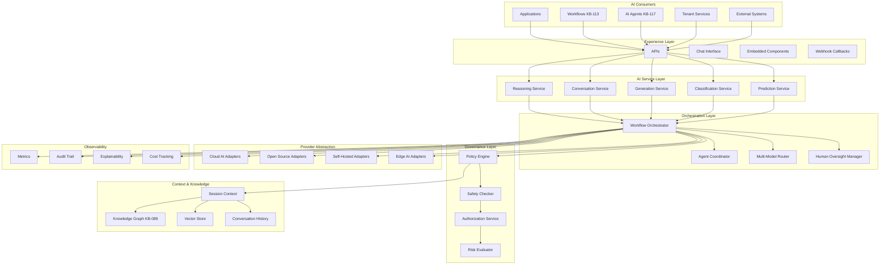
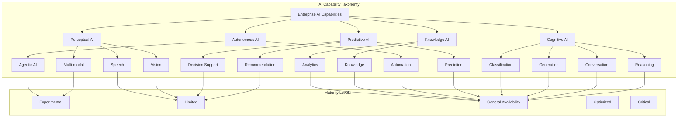
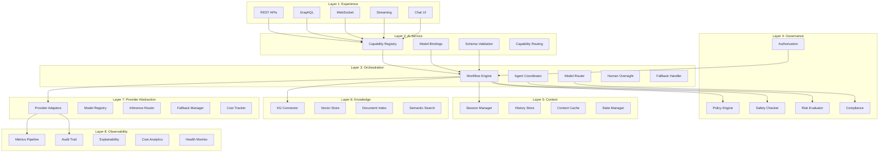
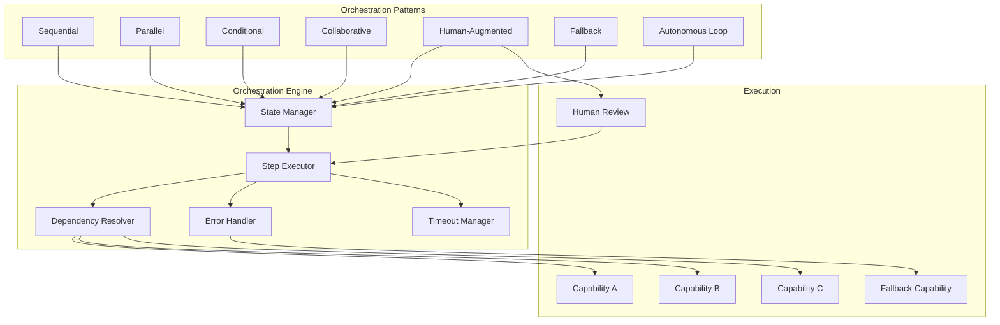
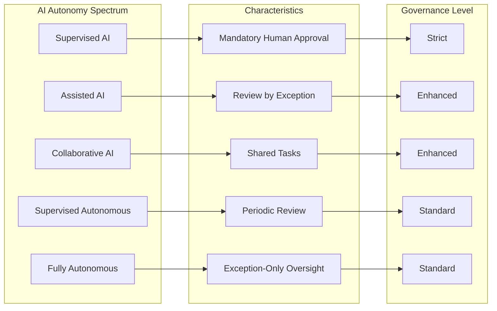
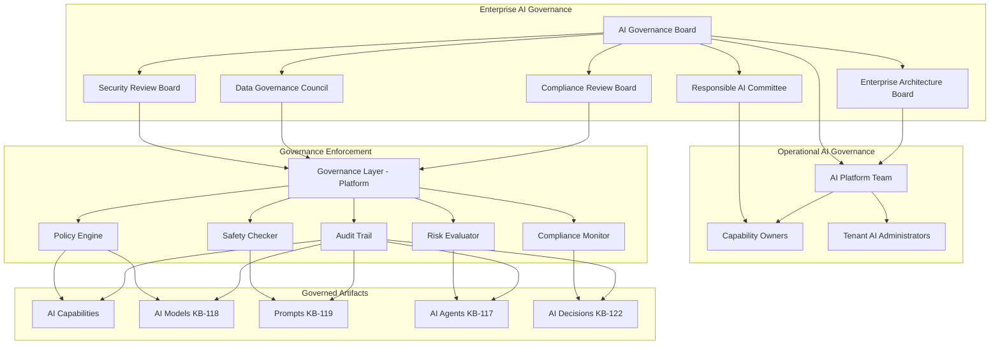
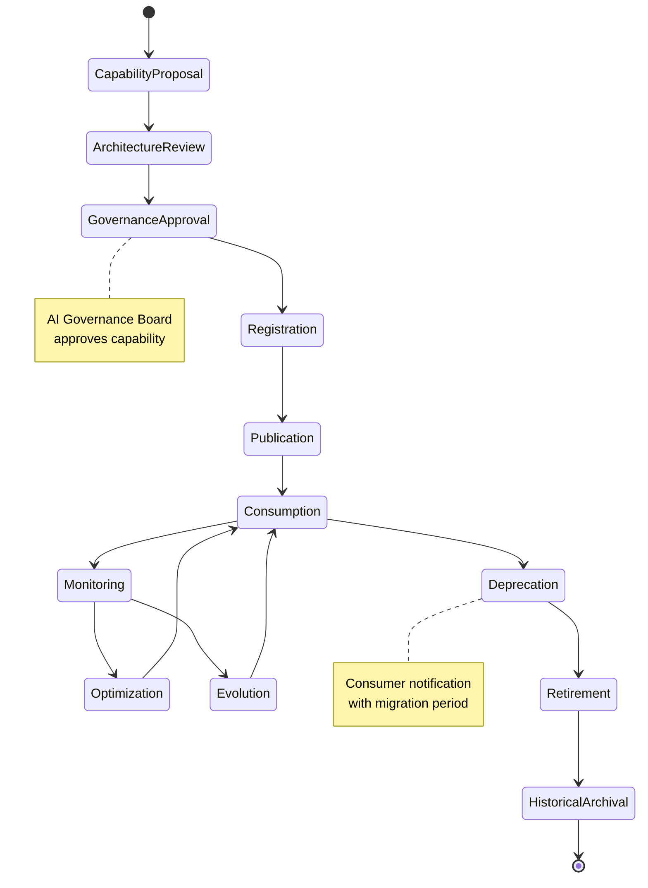
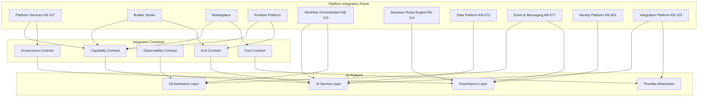
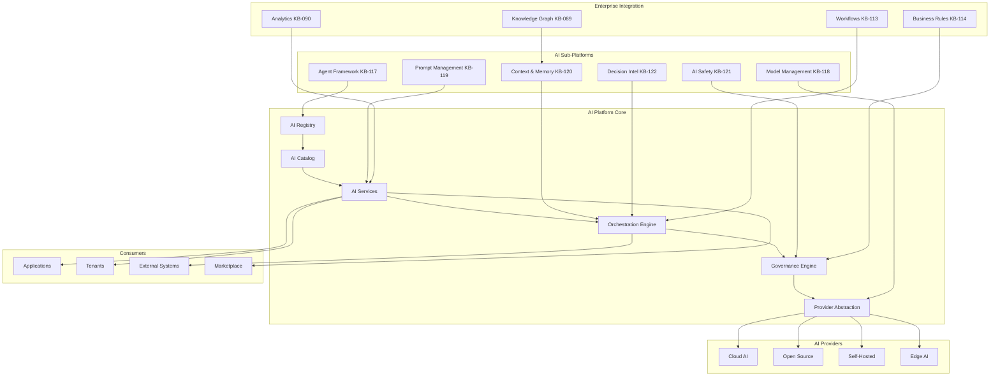

# KB-116 — AI Platform Architecture

---

## Metadata

| Attribute | Value |
|-----------|-------|
| **Document ID** | KB-116 |
| **Title** | AI Platform Architecture |
| **Suite** | Enterprise Platform Services |
| **Version** | 1.0 |
| **Status** | Approved Architecture |
| **Classification** | Foundational AI Platform Architecture |
| **Date** | 2026-07-12 |
| **Architect** | Enterprise AI Platform Architecture Builder |

---

## Table of Contents

1. Executive Summary
2. Architectural Principles
3. Canonical Definitions
4. Enterprise AI Platform Architecture
5. AI Capability Taxonomy
6. AI Service Registry
7. AI Service Catalog
8. AI Platform Layers
9. AI Orchestration
10. AI Integration Model
11. Human-AI Collaboration
12. AI Platform Extensibility
13. AI Lifecycle
14. Governance
15. Responsibilities
16. Security
17. Privacy
18. Performance
19. Observability
20. Failure Scenarios
21. Anti-Patterns
22. Future Evolution
23. Cross-References
24. Architecture Diagrams

---

## 1. Executive Summary

The AI Platform is the foundational enterprise capability that governs every artificial intelligence operation across the DUKADESK ecosystem. It provides a unified, vendor-independent, model-independent architecture for defining, orchestrating, governing, securing, monitoring, and evolving AI capabilities — from simple classification and prediction to multi-agent reasoning and autonomous decision intelligence.

This architecture establishes the AI Platform as the single authoritative mechanism through which all AI capabilities are registered, governed, and consumed. No application, tenant, service, or component integrates AI independently of the platform. Every AI interaction — whether a single model inference, a multi-step AI workflow, a conversational interaction, or an autonomous agent decision — flows through the governed AI Platform.

The AI Platform architecture serves as the parent architecture for KB-117 (AI Agent Framework), KB-118 (AI Model Management), KB-119 (Prompt Management), KB-120 (AI Context & Memory), KB-121 (AI Safety & Governance), and KB-122 (AI Decision Intelligence). Each child architecture inherits the principles, models, and governance framework defined herein.

The AI Platform sits within the AI Domain of the Enterprise Platform Services suite (KB-107). It integrates with the Knowledge Graph (KB-089) for semantic knowledge, the Business Rules Engine (KB-114) for deterministic policy enforcement, Workflow Orchestration (KB-113) for AI-driven processes, and the Analytics platform (KB-090) for AI observability.

Key architectural decisions include:
- **Platform-level AI governance**: Every AI capability is registered, governed, and observable through the platform. AI is not an application feature; it is a governed platform service.
- **Provider and model abstraction**: AI providers and models are abstracted behind a uniform interface. Models may be substituted, upgraded, or mixed without affecting consumers.
- **Separated concerns**: AI capabilities are decomposed into reasoning, conversation, generation, prediction, classification, recommendation, automation, knowledge, and decision support — each governed independently.
- **Composable AI**: AI capabilities compose into higher-order intelligence through orchestration, enabling complex multi-step, multi-model, and multi-agent workflows.
- **Human oversight continuum**: The architecture supports the full spectrum from fully supervised AI (human-in-the-loop) through assisted, collaborative, and autonomous AI — each with appropriate governance guardrails.
- **Built-in safety and privacy**: AI safety, responsible AI principles, privacy preservation, and data minimization are embedded in the platform architecture, not added as afterthoughts.

---

## 2. Architectural Principles

### 2.1 AI as an Enterprise Platform Capability

AI is a shared enterprise platform service, not an application-level feature. Every AI capability is registered, governed, and consumed through the AI Platform. No component integrates AI independently of the platform.

### 2.2 Vendor Independence

The AI Platform abstracts all AI providers — cloud AI services, open-source models, self-hosted models, edge AI, and future AI technologies — behind a uniform provider abstraction layer. Providers may be substituted, upgraded, or retired without affecting consumers.

### 2.3 Model Independence

AI capabilities are defined independently of specific AI models. Models are selected, configured, and versioned through the AI Model Management architecture (KB-118). Capabilities bind to model requirements, not to specific model instances.

### 2.4 Technology Neutrality

The architecture defines canonical models, contracts, and behaviors without prescribing specific AI frameworks, model formats, inference runtimes, or deployment technologies. Implementation choices are deferred to platform engineering.

### 2.5 AI Governance by Default

Every AI capability is governed by default. No AI operation — inference, generation, conversation, agent action, decision — occurs without governance evaluation. Governance is embedded in the platform, not applied after the fact.

### 2.6 Human Oversight

AI operates within human-defined boundaries. The architecture defines guardrails for autonomous AI, requiring human oversight for decisions above configurable risk thresholds. Human-in-the-loop is a first-class architectural pattern.

### 2.7 Explainability

Every AI decision and interaction produces an explainability record detailing what was done, why, using which models, with what inputs, and under what governance rules. Explainability is mandatory, not optional.

### 2.8 Responsible AI

The architecture embeds responsible AI principles: fairness, accountability, transparency, privacy, safety, and human-centeredness. These principles are enforced by the platform, not left to individual capability authors.

### 2.9 Security by Design

AI security is embedded in every layer of the platform — from provider authentication through input validation, output sanitization, policy enforcement, audit, and tamper detection.

### 2.10 Privacy by Design

AI operations minimize data collection, enforce data minimization at every stage, and respect tenant and user privacy throughout the AI lifecycle. Privacy controls are architectural, not optional.

### 2.11 Zero Trust

Every AI operation — capability registration, model invocation, context access, output delivery — is authenticated, authorized, and validated. No AI component is trusted based on its position in the platform.

### 2.12 Multi-Tenant Isolation

AI capabilities, contexts, models, prompts, and decisions are isolated by tenant. One tenant's AI operations are invisible and inaccessible to other tenants, subject to explicit cross-tenant authorization.

### 2.13 Composability

AI capabilities compose through orchestration. Simple AI operations combine into complex AI workflows, multi-agent conversations, and autonomous decision chains. Composition is governed, not ad-hoc.

### 2.14 Observability by Design

Every AI operation is observable: inputs, outputs, latency, cost, model version, governance decisions, safety checks, and explainability records are collected and available for monitoring, audit, and optimization.

### 2.15 AI Interoperability

AI capabilities interoperate through standardized contracts. Any AI service can consume any other AI service's output, any AI agent can invoke any registered capability, and any AI workflow can orchestrate across capabilities.

---

## 3. Canonical Definitions

| Term | Definition |
|------|-----------|
| **Artificial Intelligence** | The simulation of human intelligence by machines, encompassing reasoning, learning, perception, language understanding, generation, and decision-making. |
| **AI Platform** | The enterprise platform that governs, orchestrates, secures, monitors, and evolves all AI capabilities across the DUKADESK ecosystem. |
| **AI Capability** | A named, registered, governed unit of AI functionality (e.g., text classification, content generation, conversational reasoning, predictive scoring). |
| **AI Service** | A deployable, versioned, consumable instance of an AI capability with defined inputs, outputs, SLAs, and governance configuration. |
| **AI Registry** | The canonical inventory of all governed AI capabilities and services across the enterprise. |
| **AI Catalog** | A searchable, browsable interface enabling discovery, governance, and consumption of registered AI capabilities. |
| **AI Orchestration** | The coordination of multiple AI capabilities, models, agents, workflows, and human oversight into coherent AI operations. |
| **AI Context** | The state, knowledge, conversation history, and environmental information available to an AI operation at a given point. |
| **AI Interaction** | A single exchange between a consumer and an AI capability, including input, processing, and output. |
| **AI Workflow** | A multi-step, orchestrated sequence of AI operations, human interactions, and enterprise service invocations. |
| **AI Reasoning** | The process by which an AI capability analyzes information, draws conclusions, and produces decisions or recommendations. |
| **AI Provider** | An external or internal entity that supplies AI models, inference infrastructure, or AI services to the AI Platform. |
| **AI Consumer** | Any entity that invokes an AI capability or service through the AI Platform — application, workflow, agent, service, or external system. |
| **AI Governance** | The framework of policies, rules, oversight, and enforcement that governs all AI operations within the platform. |
| **AI Lifecycle** | The complete sequence of states an AI capability traverses from proposal through archival. |
| **AI Workload** | A unit of AI processing — single inference, generation, conversation turn, agent action, or batch operation. |
| **Human-in-the-Loop** | An architectural pattern where a human reviews, approves, or intervenes in AI operations before they are finalized. |
| **Autonomous AI** | AI operations that execute within defined governance boundaries without requiring human intervention for each operation. |
| **AI Ecosystem** | The complete set of AI capabilities, services, agents, models, providers, consumers, tools, and governance within the enterprise. |
| **Enterprise Intelligence** | The aggregate intelligence of the enterprise, combining AI capabilities, knowledge graphs, business rules, human expertise, and data analytics. |

---

## 4. Enterprise AI Platform Architecture

### 4.1 Architectural Layers

The AI Platform comprises eight logical layers:

1. **Experience Layer** — Interfaces through which consumers interact with AI capabilities: APIs, chat interfaces, embedded AI components, workflow steps, agent-to-agent communication.
2. **AI Service Layer** — Registered, versioned, governed AI capabilities that encapsulate specific AI functionality behind defined contracts.
3. **Orchestration Layer** — Coordinates AI operations across services, models, agents, workflows, human oversight, and enterprise processes.
4. **Governance Layer** — Enforces AI policies, safety rules, compliance requirements, risk evaluation, and authorization for every AI operation.
5. **Context Layer** — Manages AI state, conversation history, session context, knowledge references, and environmental information.
6. **Knowledge Layer** — Integrates with the enterprise Knowledge Graph (KB-089), providing structured and unstructured knowledge to AI operations.
7. **Provider Abstraction Layer** — Abstracts all AI providers behind a uniform interface, enabling model and provider substitution without consumer impact.
8. **Observability Layer** — Collects metrics, audit records, explainability data, cost data, and performance telemetry for all AI operations.

### 4.2 Architectural Flow

1. An AI consumer (application, workflow, agent, service) invokes an AI capability through the Experience Layer.
2. The Governance Layer evaluates the request against AI policies, safety rules, authorization, and risk thresholds.
3. The Orchestration Layer coordinates the AI operation — selecting capabilities, resolving dependencies, managing state, and handling multi-step workflows.
4. The Context Layer provides relevant state, history, and environmental context.
5. The Knowledge Layer provides knowledge graph references and semantic context.
6. The AI Service Layer executes the specific AI capability through the Provider Abstraction Layer.
7. The Provider Abstraction Layer routes the request to the appropriate AI provider and model.
8. The result flows back through governance, observability, and the experience layer to the consumer.
9. Every step is recorded in the Observability Layer for monitoring, audit, and explainability.

### 4.3 Architectural Boundaries

The AI Platform is the sole authoritative mechanism for AI operations in DUKADESK. No application, service, tenant, agent, or component may invoke AI models, AI APIs, or AI services directly without routing through the platform.

The AI Platform does not:
- Implement specific AI models or training pipelines (handled by KB-118).
- Define AI agent behaviors or agent-specific logic (handled by KB-117).
- Manage prompts or prompt templates (handled by KB-119).
- Implement AI memory or context storage (handled by KB-120).
- Define AI safety or responsible AI implementation (handled by KB-121).
- Implement AI decision intelligence logic (handled by KB-122).

### 4.4 Multi-Tenant Architecture

The AI Platform operates within DUKADESK's multi-tenant model:

- **Tenant isolation**: AI capabilities, contexts, prompts, agent instances, and decisions are partitioned by tenant.
- **Enterprise AI capabilities**: Available to all tenants. Governed by enterprise AI governance.
- **Tenant AI capabilities**: Tenant-specific capabilities operate within enterprise governance guardrails.
- **Cross-tenant AI**: AI operations that span tenants (marketplace AI, multi-tenant workflows) require explicit cross-tenant authorization.
- **AI data isolation**: Training data, inference data, context data, and output data are partitioned by tenant.

```
┌──────────────────────────────────────────────────────────────────────┐
│                        AI PLATFORM                                    │
│                                                                      │
│  ┌──────────────────────────────────────────────────────────────┐   │
│  │                    Experience Layer                            │   │
│  │  ┌─────────┐ ┌─────────┐ ┌─────────┐ ┌─────────┐ ┌────────┐  │   │
│  │  │ APIs    │ │ Chat    │ │Embedded │ │Workflow │ │Agent   │  │   │
│  │  │         │ │ UI      │ │Components│ │Steps    │ │Comm    │  │   │
│  │  └─────────┘ └─────────┘ └─────────┘ └─────────┘ └────────┘  │   │
│  └──────────────────────────────────────────────────────────────┘   │
│                              │                                        │
│  ┌──────────────────────────────────────────────────────────────┐   │
│  │                   AI Service Layer                             │   │
│  │  ┌─────────┐ ┌─────────┐ ┌─────────┐ ┌─────────┐ ┌────────┐  │   │
│  │  │Reasoning│ │Conversa-│ │Genera-  │ │Classifi-│ │Predict │  │   │
│  │  │         │ │tion     │ │tion     │ │cation   │ │ion     │  │   │
│  │  └─────────┘ └─────────┘ └─────────┘ └─────────┘ └────────┘  │   │
│  └──────────────────────────────────────────────────────────────┘   │
│                              │                                        │
│  ┌──────────────────────────────────────────────────────────────┐   │
│  │                   Orchestration Layer                          │   │
│  │  ┌─────────┐ ┌─────────┐ ┌─────────┐ ┌─────────┐ ┌────────┐  │   │
│  │  │AI Wkflw│ │Agent    │ │Multi-   │ │Human    │ │Fallback│  │   │
│  │  │Orch    │ │Orch     │ │Model    │ │Oversight│ │Handler │  │   │
│  │  └─────────┘ └─────────┘ └─────────┘ └─────────┘ └────────┘  │   │
│  └──────────────────────────────────────────────────────────────┘   │
│                              │                                        │
│  ┌──────────────────────────────────────────────────────────────┐   │
│  │                   Governance Layer                             │   │
│  │  ┌─────────┐ ┌─────────┐ ┌─────────┐ ┌─────────┐ ┌────────┐  │   │
│  │  │Policy   │ │Safety   │ │Authori- │ │Risk     │ │Complian│  │   │
│  │  │Engine   │ │Checker  │ │zation   │ │Evaluator│ │ce      │  │   │
│  │  └─────────┘ └─────────┘ └─────────┘ └─────────┘ └────────┘  │   │
│  └──────────────────────────────────────────────────────────────┘   │
│                              │                                        │
│  ┌──────────────────────────────────────────────────────────────┐   │
│  │              Context & Knowledge Layer                         │   │
│  │  ┌─────────┐ ┌─────────┐ ┌─────────┐ ┌─────────┐ ┌────────┐  │   │
│  │  │Session  │ │Conversa-│ │Knowledge│ │Memory   │ │State   │  │   │
│  │  │Context  │ │tion Hist│ │Graph    │ │Store    │ │Manager │  │   │
│  │  └─────────┘ └─────────┘ └─────────┘ └─────────┘ └────────┘  │   │
│  └──────────────────────────────────────────────────────────────┘   │
│                              │                                        │
│  ┌──────────────────────────────────────────────────────────────┐   │
│  │               Provider Abstraction Layer                       │   │
│  │  ┌─────────┐ ┌─────────┐ ┌─────────┐ ┌─────────┐ ┌────────┐  │   │
│  │  │Cloud AI │ │Open     │ │Self-    │ │Edge AI  │ │Future  │  │   │
│  │  │Providers│ │Source   │ │Hosted   │ │         │ │Tech    │  │   │
│  │  └─────────┘ └─────────┘ └─────────┘ └─────────┘ └────────┘  │   │
│  └──────────────────────────────────────────────────────────────┘   │
│                              │                                        │
│  ┌──────────────────────────────────────────────────────────────┐   │
│  │                   Observability Layer                          │   │
│  │  ┌─────────┐ ┌─────────┐ ┌─────────┐ ┌─────────┐ ┌────────┐  │   │
│  │  │Metrics  │ │Audit    │ │Explain- │ │Cost     │ │Health  │  │   │
│  │  │Pipeline │ │Trail    │ │ability  │ │Tracking │ │Monitor │  │   │
│  │  └─────────┘ └─────────┘ └─────────┘ └─────────┘ └────────┘  │   │
│  └──────────────────────────────────────────────────────────────┘   │
└──────────────────────────────────────────────────────────────────────┘
```

---

## 5. AI Capability Taxonomy

### 5.1 Capability Categories

Every AI capability registered in the AI Registry is assigned exactly one primary category and may be associated with zero or more secondary categories.

| Category | Description | Examples |
|----------|-------------|---------|
| **Reasoning** | AI capabilities that analyze information, draw conclusions, and produce logical inferences | Document analysis, root cause analysis, compliance reasoning, contract analysis, logical deduction |
| **Conversation** | AI capabilities that engage in natural language dialogue | Customer support chat, AI assistant, conversational search, interactive troubleshooting, guided workflows |
| **Generation** | AI capabilities that produce content — text, code, images, audio, video, structured data | Content writing, code generation, report generation, image creation, data synthesis, email drafting |
| **Classification** | AI capabilities that categorize or label data | Document classification, intent classification, sentiment analysis, content moderation, topic labeling |
| **Prediction** | AI capabilities that forecast future states or outcomes | Demand forecasting, churn prediction, resource utilization prediction, risk prediction, trend analysis |
| **Recommendation** | AI capabilities that suggest actions, items, or decisions | Product recommendation, content recommendation, action recommendation, next-best-action, optimal routing |
| **Automation** | AI capabilities that automate platform operations | Automated ticket resolution, intelligent routing, auto-classification, auto-response, process automation |
| **Knowledge** | AI capabilities that utilize enterprise knowledge | Knowledge retrieval, semantic search, question answering over knowledge graph, document understanding |
| **Analytics** | AI capabilities that analyze data and produce insights | Anomaly detection, pattern recognition, trend identification, data summarization, insight generation |
| **Decision Support** | AI capabilities that assist human decision-making | Risk scoring, opportunity scoring, decision recommendation, what-if analysis, trade-off analysis |
| **Vision** | AI capabilities that process and understand visual information | Image recognition, document scanning, object detection, facial recognition, visual search |
| **Speech** | AI capabilities that process audio speech | Speech-to-text, text-to-speech, voice recognition, speaker identification, audio transcription |
| **Multi-modal** | AI capabilities that process multiple input/output types simultaneously | Visual question answering, image captioning, document understanding (text + layout + images), video analysis |
| **Agentic AI** | AI capabilities that autonomously plan and execute multi-step tasks | Task automation agents, research agents, monitoring agents, orchestration agents, self-healing agents |
| **Future AI Capabilities** | Placeholder for AI capabilities not yet envisioned | Extensibility point for new AI categories |

### 5.2 Capability Maturity Levels

Each AI capability is classified by maturity level:

| Level | Description |
|-------|-------------|
| **Experimental** | Capability under evaluation. Available in sandbox environments. Not for production use. |
| **Limited** | Capability available for limited production use with enhanced governance and monitoring. |
| **General Availability** | Capability fully approved for production use with standard governance. |
| **Optimized** | Capability with proven production performance, SLAs, and cost optimization. |
| **Critical** | Capability considered critical infrastructure. Highest availability, monitoring, and governance requirements. |

### 5.3 Capability Hierarchy

```
Enterprise AI Capabilities
├── Cognitive AI
│   ├── Reasoning
│   ├── Conversation
│   ├── Generation
│   └── Classification
├── Predictive AI
│   ├── Prediction
│   ├── Recommendation
│   └── Decision Support
├── Perceptual AI
│   ├── Vision
│   ├── Speech
│   └── Multi-modal
├── Autonomous AI
│   ├── Agentic AI
│   └── Automation
└── Knowledge AI
    ├── Knowledge
    └── Analytics
```

---

## 6. AI Service Registry

### 6.1 Purpose

The AI Service Registry is the canonical, authoritative inventory of every governed AI capability and service across the DUKADESK platform. No AI capability may be invoked in any environment — development, testing, staging, or production — unless it is registered in the AI Registry with complete governance metadata.

### 6.2 Registration Schema

| Field | Description |
|-------|-------------|
| **Capability ID** | Globally unique identifier for the AI capability |
| **Name** | Human-readable name |
| **Category** | Primary capability category |
| **Secondary Categories** | Zero or more additional category tags |
| **Owner** | The team or entity accountable for the capability |
| **Version** | Semantic version of the capability definition |
| **Description** | Business purpose, behavior, and use cases |
| **Input Schema** | Data contract defining valid inputs |
| **Output Schema** | Data contract defining valid outputs |
| **Maturity Level** | Experimental, Limited, GA, Optimized, Critical |
| **Governance Tier** | Standard, Enhanced, Strict |
| **Required Models** | Model requirements (capability types, not specific models) |
| **Provider Requirements** | Provider capabilities required |
| **SLAs** | Performance targets for latency, throughput, availability |
| **Authorization** | Which consumers may invoke this capability |
| **Scope** | Enterprise, tenant, or context |
| **Status** | Draft, active, deprecated, retired |
| **Lifecycle State** | Current stage in the AI lifecycle |
| **Dependencies** | Other AI capabilities, services, or platform components |
| **Safety Requirements** | Required safety checks and guardrails |
| **Explainability Requirements** | Required level of explainability |
| **Cross-References** | Related capabilities in KB-117 through KB-122 |

### 6.3 Registry Operations

- **Registration**: Adding a new AI capability with complete metadata and governance approval.
- **Versioning**: Updating capability definitions with semantic version tracking and impact analysis.
- **Activation**: Transitioning a capability to active status for production consumption.
- **Deprecation**: Marking a capability as deprecated with consumer notification.
- **Retirement**: Removing a capability from active use and archiving its definition.
- **Discovery**: Querying the registry by category, owner, maturity, status, and dependency.
- **Impact Analysis**: Identifying all consumers, workflows, and agents that depend on a capability.
- **Validation**: Ensuring capability schemas are valid, dependencies are resolvable, and governance metadata is complete.

### 6.4 Registry Governance

- Registration requires approval from the AI Governance Board based on the governance tier.
- Schema changes require version bump and consumer impact analysis.
- Maturity level promotions require governance review and approval.
- Deprecation requires consumer notification with minimum notice period.
- Retirement requires verification that no active consumers depend on the capability.

---

## 7. AI Service Catalog

### 7.1 Purpose

The AI Service Catalog provides a searchable, browsable interface to the AI Registry. It enables teams, administrators, AI agents, and governance bodies to discover, understand, evaluate, and govern AI capabilities across the enterprise.

### 7.2 Catalog Capabilities

- **Browse**: Navigate capabilities by category, owner, maturity, governance tier, status, and lifecycle state.
- **Search**: Full-text and semantic search across capability names, descriptions, and metadata.
- **Detail View**: Complete capability definition, schemas, SLAs, governance configuration, and dependency graph.
- **Usage Analytics**: Invocation volume, latency, cost, error rates, and outcome distribution per capability.
- **Version History**: Complete version history with change diffs and migration status.
- **Dependency Graph**: Visual representation of capability dependencies, consumers, and relationships.
- **Compliance View**: Governance compliance status, safety audit results, and explainability coverage.

### 7.3 Catalog Integration

- **Developer Portal**: Developers discover and integrate AI capabilities into their applications.
- **AI Agent Framework (KB-117)**: AI agents discover capabilities they may invoke.
- **Workflow Designer**: Workflow authors select AI capabilities for workflow steps.
- **Tenant Administration Console**: Tenant administrators view available AI capabilities and tenant-specific configuration.
- **Governance Dashboard**: Governance bodies monitor AI portfolio health and compliance.
- **API Gateway**: AI capabilities are discoverable and invocable through the platform API gateway.

---

## 8. AI Platform Layers

### 8.1 Layer Responsibilities

| Layer | Responsibility | Key Components |
|-------|---------------|----------------|
| **Experience Layer** | Provide interfaces for AI consumption | REST APIs, GraphQL, WebSocket, streaming, chat interface, embedded components, webhook callbacks |
| **AI Service Layer** | Encapsulate AI capabilities behind governed contracts | Capability services, model bindings, input/output validation, capability routing |
| **Orchestration Layer** | Coordinate multi-step, multi-model, multi-agent AI operations | Workflow engine, agent coordinator, model router, human oversight manager, fallback handler |
| **Governance Layer** | Enforce AI policies, safety, authorization, and risk management | Policy engine, safety checker, authorization service, risk evaluator, compliance validator |
| **Context Layer** | Manage AI state and environmental information | Session manager, conversation history store, context assembly, state cache, context lifecycle |
| **Knowledge Layer** | Provide enterprise knowledge to AI operations | Knowledge graph connector (KB-089), vector store, document index, semantic search, knowledge retrieval |
| **Provider Abstraction Layer** | Abstract AI providers behind uniform interface | Provider adapters, model registry, inference router, fallback manager, cost tracker |
| **Observability Layer** | Collect and surface AI operational data | Metrics pipeline, audit trail, explainability store, cost analytics, health monitoring |

### 8.2 Layer Interactions

Layers interact through well-defined contracts:

- Each layer exposes a defined interface to the layer above.
- Layers may not bypass adjacent layers (e.g., Experience Layer cannot invoke Provider Abstraction Layer directly).
- Governance Layer evaluates all cross-layer operations.
- Observability Layer records all cross-layer interactions.
- Context flows down through the layers; results flow back up through the same layers.

### 8.3 Layer Isolation

- Layers are independently scalable and deployable.
- Layer failures are contained; lower-layer failures do not cascade to upper layers without governance intervention.
- Each layer implements its own security controls within the Zero Trust framework.
- Layer telemetry is collected independently for granular observability.

---

## 9. AI Orchestration

### 9.1 Orchestration Model

AI Orchestration coordinates multiple AI capabilities, models, agents, workflows, human oversight, and enterprise services into coherent, governed AI operations. Orchestration transforms individual AI capabilities into complex intelligence.

### 9.2 Orchestration Patterns

| Pattern | Description | Example |
|---------|-------------|---------|
| **Sequential AI** | AI capabilities invoked in sequence, with each step's output feeding the next | Document ingest → classify → extract data → generate summary → store |
| **Parallel AI** | Multiple AI capabilities invoked simultaneously, results merged | Analyze document for sentiment, topics, entities, and language simultaneously |
| **Conditional AI** | AI operation path determined by intermediate results | If classification is "urgent" → route to priority processing; else → standard processing |
| **Collaborative AI** | Multiple AI agents work together on a shared task | Research agent gathers data, analyst agent evaluates, writer agent produces report |
| **Human-Augmented AI** | AI operation includes human review at critical decision points | AI generates response → human approves → response sent |
| **Fallback AI** | Primary AI capability falls back to alternative if it fails or produces low-confidence output | Primary model times out → fallback model invoked → fallback output used |
| **AI Workflow** | Multi-step, multi-capability AI operation with state management and error handling | Customer inquiry → classify intent → retrieve knowledge → generate response → record in CRM |
| **Autonomous AI Loop** | AI agent continuously monitors and acts within defined boundaries | Monitor system metrics → detect anomaly → analyze cause → recommend action → execute if authorized |

### 9.3 Orchestration State Management

- AI workflows maintain state across steps: intermediate results, accumulated context, execution history.
- State is tenant-partitioned and governed by the Context Layer.
- Workflows support suspend/resume for long-running or human-waiting operations.
- Workflow state is persisted in the context layer for recovery and audit.
- Orchestration state expires according to context lifecycle policies.

### 9.4 Orchestration Governance

- Every orchestration pattern is governed by policies defined in the Governance Layer.
- Autonomous loops require explicit authorization from the AI Governance Board.
- Human-in-the-loop patterns define mandatory approval points.
- Orchestration depth (number of chained AI operations) is bounded by governance policy.
- Orchestration execution is fully auditable and explainable.

---

## 10. AI Integration Model

### 10.1 Integration Architecture

The AI Platform integrates with every major DUKADESK platform component through defined integration points. Each integration follows the same pattern: governed interaction through the AI Platform, never direct integration.

### 10.2 Integration Points

| Platform Component | Integration Description | KB Reference |
|--------------------|------------------------|--------------|
| **Platform Services** | AI capabilities are consumed as platform services through the Service Layer | KB-107 |
| **Builder Studio** | Builder Studio components may embed AI capabilities through governed AI components | KB-107 |
| **Marketplace** | Marketplace assets may use AI capabilities registered in the AI Registry | KB-107 |
| **Runtime Platform** | Runtime applications invoke AI capabilities through the Experience Layer | KB-107 |
| **Workflow Orchestration** | Workflow steps may invoke AI capabilities; AI results may trigger workflow transitions | KB-113 |
| **Business Rules Engine** | AI recommendations are evaluated against business rules; rules govern AI decisions | KB-114 |
| **Data Platform** | AI operations access data through governed data platform interfaces | KB-073 |
| **Event & Messaging** | AI capabilities emit and consume events through the platform event bus | KB-077 |
| **Identity Platform** | AI operations use platform identity for authorization and tenant isolation | KB-063 |
| **Integration Platform** | External AI services access the AI Platform through governed integration adapters | KB-103 |

### 10.3 Integration Contracts

Each integration is defined by a canonical contract:

| Contract Element | Description |
|-----------------|-------------|
| **Capability Contract** | What AI capability is provided, with what inputs, outputs, and SLAs |
| **Governance Contract** | What policies, safety rules, and authorization apply |
| **Observability Contract** | What metrics, audit data, and explainability data are produced |
| **SLA Contract** | Performance targets, availability guarantees, and escalation paths |
| **Cost Contract** | Cost allocation model and chargeback mechanism |

### 10.4 Integration Governance

- All integrations with the AI Platform are registered and approved.
- Integration contracts are versioned and governed.
- Integration changes require impact analysis and consumer notification.
- Integrations are monitored for compliance with governance contracts.
- Unauthorized integrations (direct AI model access) are detected and blocked.

---

## 11. Human-AI Collaboration

### 11.1 Collaboration Spectrum

The AI Platform supports the full spectrum of human-AI collaboration, from fully supervised to fully autonomous, each with appropriate governance guardrails.

### 11.2 Collaboration Levels

| Level | Description | Governance Requirements | Examples |
|-------|-------------|------------------------|---------|
| **Supervised AI** | AI performs operations; human reviews and approves every output before use | Mandatory approval gate for every output. Full explainability required. No autonomous execution. | AI-generated content reviewed before publishing, AI recommendations approved before execution |
| **Assisted AI** | AI performs operations; human may review, override, or provide feedback | Review-by-exception for low-risk operations. Mandatory review for high-risk operations. | Email draft assistance, code completion suggestions, search result ranking |
| **Collaborative AI** | AI and human work together on shared tasks; AI has partial autonomy | Collaborative decision framework. AI may act within defined scope. Human escalation for boundary cases. | Co-writing documents, collaborative problem-solving, shared decision-making |
| **Supervised Autonomous** | AI operates autonomously within defined boundaries; human supervises at aggregate level | Autonomous operation within guardrails. Periodic human review. Mandatory escalation for boundary cases. | Automated ticket triage, auto-classification, intelligent routing |
| **Fully Autonomous** | AI operates independently within defined governance framework; human supervises exception-only | Full governance automation. Exception-only human intervention. Continuous compliance monitoring. Maximum audit and explainability. | Automated incident response, self-healing infrastructure, autonomous monitoring agents |

### 11.3 Level Assignment

- The collaboration level is assigned to each AI capability during registration.
- Level assignment is approved by the AI Governance Board.
- Level may vary by context (e.g., higher autonomy for low-risk operations within a capability).
- Level transitions require governance review and approval.
- Consumers may request lower autonomy for specific invocations.

### 11.4 Human Oversight Architecture

- Human oversight interfaces are provided by the Experience Layer.
- Oversight actions (approve, reject, modify, escalate) are recorded in the audit trail.
- Oversight timeouts are configurable; timeout behavior is governed by policy.
- Oversight decisions include explainability context for informed human judgment.
- Oversight delegation (to alternates, groups, or automated rules) is governed by policy.

---

## 12. AI Platform Extensibility

### 12.1 Extensibility Model

The AI Platform is designed for extensibility without fundamental architectural changes. New AI capabilities, provider types, model categories, and collaboration patterns may be added through defined extension points.

### 12.2 Extension Points

| Extension Point | What Can Be Extended | Governance |
|-----------------|----------------------|------------|
| **AI Capability Type** | New categories of AI capability | Registration and approval through AI Registry |
| **AI Provider Adapter** | New AI providers (cloud, open-source, self-hosted, edge) | Provider adapter certification and security review |
| **Model Type** | New model architectures or modalities | Model type registration in Model Management (KB-118) |
| **Orchestration Pattern** | New orchestration patterns for AI workflows | Pattern review and approval by architecture board |
| **Governance Rule Type** | New governance policies, safety checks, risk evaluations | Policy registration in Governance Layer |
| **Context Source** | New types of context or knowledge sources | Context source integration certification |
| **Integration Contract** | New platform integration patterns | Integration contract registration and approval |
| **Collaboration Pattern** | New human-AI collaboration models | Collaboration pattern review by AI Governance Board |
| **Consumption Interface** | New ways to consume AI capabilities | Interface registration and API gateway configuration |
| **Observability Metric** | New observability data types | Metric registration in observability pipeline |

### 12.3 Extensibility Governance

- All extensions must be registered, approved, and versioned.
- Extensions must not break existing contracts or behaviors.
- Extensions are subject to the same governance, security, and observability requirements as core platform components.
- Extension compatibility is enforced through contract testing.
- Extension lifecycle is governed independently of the core platform.

---

## 13. AI Lifecycle

### 13.1 Lifecycle Stages

| Stage | Description |
|-------|-------------|
| **Capability Proposal** | Business need identified, AI capability requirements documented, feasibility assessed. |
| **Architecture Review** | Architecture review ensures capability fits within the AI platform model, has no conflicts or gaps, and follows platform standards. |
| **Governance Approval** | AI Governance Board reviews and approves the capability for development. Risk assessment and compliance review completed. |
| **Registration** | Capability is registered in the AI Registry with complete metadata, schemas, governance configuration, and dependencies. |
| **Publication** | Capability is published in the AI Catalog and available for consumption. |
| **Consumption** | Capability is actively used by consumers. Monitoring, optimization, and governance operate continuously. |
| **Monitoring** | Capability performance, safety, cost, compliance, and usage patterns are continuously monitored. |
| **Optimization** | Capability is refined for performance, accuracy, cost, or safety through version updates. |
| **Evolution** | Capability undergoes version updates for new features, model upgrades, or governance changes. |
| **Deprecation** | Capability is marked as deprecated with consumer notification and migration guidance. |
| **Retirement** | Capability is retired and removed from active consumption. |
| **Historical Archival** | Capability definition, version history, and operational records are archived for compliance and reference. |

### 13.2 Lifecycle State Transitions

```
Proposal ──▶ Architecture Review ──▶ Governance Approval ──▶ Registration
                                                                  │
                                                                  ▼
                                                             Publication
                                                                  │
                                                                  ▼
                                     ┌──────────────────────┬────┴────┬──────────────────────┐
                                     │                      │         │                      │
                                     ▼                      ▼         ▼                      ▼
                                Consumption            Monitoring  Optimization           Evolution
                                     │                      │         │                      │
                                     └──────────────────────┴────┬────┴──────────────────────┘
                                                                  │
                                                                  ▼
                                                             Deprecation
                                                                  │
                                                                  ▼
                                                             Retirement
                                                                  │
                                                                  ▼
                                                        Historical Archival
```

### 13.3 Lifecycle Governance

- Capabilities may not transition to Consumption without Governance Approval.
- Deprecation triggers mandatory consumer notification with minimum notice period.
- Retirement requires verification that no active consumers depend on the capability.
- Lifecycle state is visible in the AI Registry and Catalog.
- Archived capabilities are retained for compliance and may be reactivated only through a new lifecycle.

---

## 14. Governance

### 14.1 Governance Bodies

| Body | Responsibility |
|------|---------------|
| **AI Governance Board** | Highest authority for AI governance. Approves capabilities, sets policies, reviews risk assessments, oversees AI portfolio. |
| **Responsible AI Committee** | Governs responsible AI principles: fairness, accountability, transparency, privacy, safety. Reviews AI capabilities for ethical compliance. |
| **Enterprise Architecture Board** | Reviews AI architecture decisions, extension points, and platform evolution for architectural alignment. |
| **Security Review Board** | Reviews AI security architecture, provider security, and AI-specific threat models. |
| **Data Governance Council** | Governs AI data usage, privacy, retention, and cross-border data flows for AI operations. |
| **Compliance Review Board** | Ensures AI operations comply with regulatory requirements (GDPR, CCPA, HIPAA, AI Act, etc.). |
| **Tenant AI Governance** | Tenant administrators govern tenant-specific AI capability access, configuration, and policies. |

### 14.2 Governance Domains

| Domain | Description |
|--------|-------------|
| **AI Ownership** | Every AI capability has a designated owner accountable for definition, lifecycle, and governance compliance. |
| **Capability Governance** | Capability definitions, schemas, SLAs, and governance configuration are reviewed and approved. |
| **Architecture Governance** | AI capabilities follow the enterprise AI architecture model and platform standards. |
| **Responsible AI Governance** | Capabilities are evaluated for fairness, bias, transparency, and ethical compliance. |
| **Compliance Governance** | AI operations comply with applicable regulations. Compliance rules are encoded in the Governance Layer. |
| **Security Governance** | AI capabilities meet security requirements for authorization, isolation, input validation, and output sanitization. |
| **Lifecycle Governance** | Lifecycle transitions follow defined approval workflows and notice periods. |
| **Version Governance** | Capability version changes follow semantic versioning with appropriate approval per change type. |
| **Risk Governance** | AI capabilities are risk-assessed at registration and periodically reviewed. High-risk capabilities have enhanced governance. |
| **Enterprise AI Portfolio** | The complete AI capability portfolio is governed for strategic alignment, portfolio health, and investment optimization. |

### 14.3 Governance Enforcement

- Governance rules are encoded in the Governance Layer of the AI Platform, not in application code or policy documents.
- Automated governance checks run on every AI capability registration, version update, and consumption request.
- Governance violations block capability activation or consumption until remediation.
- Governance dashboards provide real-time visibility into AI governance health.
- Governance audit trails are immutable and retained per compliance requirements.

---

## 15. Responsibilities

| Role | Responsibilities |
|------|-----------------|
| **Enterprise Architecture** | Define AI platform architecture, principles, and standards. Govern extension points and platform evolution. |
| **AI Platform Team** | Implement and operate the AI Platform core services, orchestration, governance, and provider abstraction layers. Ensure platform scalability, availability, and governance enforcement. |
| **Platform Engineering** | Implement AI capability hosting, provider adapter development, platform infrastructure, and deployment automation. |
| **Product Teams** | Define AI capability requirements for their product domains. Register capabilities in the AI Registry. Maintain capability definitions and schemas. |
| **AI Governance Board** | Approve AI capabilities, review risk assessments, set governance policies, and oversee the AI portfolio. |
| **Security** | Define AI security policies. Review AI capabilities for security implications. Validate provider security. Monitor AI security operations. |
| **Compliance** | Define compliance requirements for AI operations. Review AI capabilities for regulatory compliance. Monitor compliance violations. |
| **Operations** | Monitor AI platform health, capability performance, and cost. Respond to AI incidents and capability degradation. |
| **Data Governance** | Govern AI data usage, privacy, retention, and cross-border data flows. Review AI capabilities for data governance compliance. |
| **Tenant Administrators** | Manage tenant-specific AI capability access and configuration. Monitor tenant AI usage and cost. Ensure tenant AI governance compliance. |

---

## 16. Security

### 16.1 AI Authorization

- Every AI capability invocation is authorized against the consumer's identity, role, and permissions.
- Capability-level authorization is enforced at the Experience Layer and confirmed at the Governance Layer.
- Cross-tenant AI invocation requires explicit cross-tenant authorization.
- AI capabilities may define granular authorization per operation type within the capability.

### 16.2 Identity-Aware AI

- AI operations are aware of the consumer's identity for personalization, authorization, and audit.
- AI capabilities receive identity context for tenant isolation and data access control.
- AI outputs are tagged with consumer identity provenance for audit.
- Anonymous AI operations are governed by strict policies limiting capability access and data usage.

### 16.3 Secure AI Interactions

- All AI inputs are validated against capability input schemas.
- AI outputs are validated and sanitized against output schemas and safety policies.
- AI interactions are encrypted in transit and at rest.
- AI provider communications are authenticated and encrypted.

### 16.4 Tenant Isolation

- AI capability execution contexts are isolated by tenant.
- AI context and memory are tenant-partitioned.
- AI knowledge retrieval respects tenant data boundaries.
- AI provider calls include tenant identity for provider-side isolation.

### 16.5 Zero Trust

- Every AI operation is authenticated, authorized, and validated regardless of source.
- AI capabilities within the platform are not implicitly trusted.
- AI provider responses are validated before delivery to consumers.
- Cross-layer AI operations are re-authenticated at each layer boundary.

### 16.6 AI Policy Enforcement

- Governance policies are enforced at runtime by the Governance Layer.
- Policy violations block AI operations and trigger audit alerts.
- Policy overrides require explicit authorization and are recorded in the audit trail.
- Policy changes are versioned and require governance approval.

### 16.7 Secure Orchestration

- AI orchestration state is encrypted at rest and in transit.
- Orchestration execution traces are protected from unauthorized access.
- Orchestration step results are validated before passing to subsequent steps.
- Autonomous loops have maximum iteration bounds to prevent runaway execution.

### 16.8 AI Provenance

- Every AI output records its provenance: which capability, model version, provider, input context, and governance policies applied.
- Provenance is included in all AI outputs for audit and traceability.
- Provenance data is immutable and retained per audit policy.
- AI provenance enables full reconstruction of how any AI output was produced.

### 16.9 Least Privilege

- AI capabilities access only the data and context they require for their defined operation.
- AI providers receive only the minimum data necessary for inference.
- AI consumers access only the capabilities they are authorized to use.
- AI administrators access only the capabilities and data within their governance scope.

---

## 17. Privacy

### 17.1 Data Minimization

- AI capabilities request only the data required for their specific operation.
- Input data is minimized before transmission to AI providers.
- AI outputs are minimized to contain only necessary information.
- PII and sensitive data are detected and filtered according to policy.

### 17.2 Privacy-Preserving AI

- Privacy-preserving techniques (anonymization, aggregation, differential privacy) are applied where appropriate.
- Sensitive data is not sent to AI providers that do not meet platform privacy requirements.
- AI capabilities that process sensitive data have enhanced governance and audit requirements.
- Privacy impact assessments are conducted for capabilities that process personal data.

### 17.3 Tenant Privacy

- AI data is partitioned by tenant. One tenant's AI operations, context, and data are not accessible to other tenants.
- Tenant AI configuration (models, prompts, policies) is private to the tenant.
- Cross-tenant AI operations require explicit privacy agreements and governance approval.

### 17.4 Regional Compliance

- AI operations comply with regional data protection regulations (GDPR, CCPA, LGPD, PIPL, AI Act).
- Data residency requirements are enforced for AI data storage and processing.
- AI provider selection considers regional compliance requirements.
- Cross-border AI data flows are governed by data transfer agreements.

### 17.5 Consent-Aware AI

- AI operations that use personal data respect user consent preferences.
- Consent status is checked before AI processing of personal data.
- Users may withdraw consent; AI capabilities honor withdrawal within defined SLA.
- Consent records are retained for compliance and audit.

### 17.6 Audit Retention

- AI audit records are retained per compliance requirements.
- Privacy-sensitive audit data is redacted or anonymized in long-term storage.
- Audit access is governed by least privilege and need-to-know principles.
- Audit retention policies are configurable per tenant within enterprise bounds.

---

## 18. Performance

| Metric | Target |
|--------|--------|
| **AI capability invocation latency (simple)** | < 100ms P99 |
| **AI capability invocation latency (complex)** | < 500ms P99 |
| **AI orchestration end-to-end latency** | < 2s P99 for standard workflows |
| **AI provider response time** | < 1s P99 (included in capability SLA) |
| **Concurrent AI workload throughput** | 10,000+ invocations/second per region |
| **AI capability registration latency** | < 200ms P99 |
| **Governance evaluation latency** | < 20ms P99 (added to capability latency) |
| **AI provider failover** | < 500ms |

### 18.1 Enterprise-Scale AI

- AI Platform scales horizontally across all layers.
- AI capabilities are independently scalable based on demand.
- AI provider calls are load-balanced across available providers.
- AI orchestration engines scale elastically with workload volume.
- AI context and knowledge retrieval are optimized with caching.

### 18.2 Elastic AI Workloads

- AI workloads scale in response to demand patterns.
- Burst capacity is handled through queue-based orchestration and provider load balancing.
- Cost-aware scaling balances performance requirements with cost constraints.
- AI workload priority queuing ensures critical capabilities are not starved.

### 18.3 High Availability

- AI Platform operates in active-active configuration across availability zones.
- AI provider failover ensures continued operation during provider outages.
- AI capability routing retries on failure with automatic failover to alternative providers or models.
- AI orchestration state is persisted for recovery.
- AI Platform SLAs are monitored and enforced.

### 18.4 Resource Governance

- AI workload resource consumption is governed by policy.
- Tenant AI usage quotas prevent resource starvation across tenants.
- AI capability cost tracking enables chargeback and optimization.
- AI workload prioritization ensures critical operations are processed first.

---

## 19. Observability

| Metric | Description |
|--------|-------------|
| **AI Invocations Per Second** | AI capability invocation rate |
| **Invocation Latency** | Time from request to response, per capability and P50/P95/P99 |
| **AI Provider Latency** | Time spent in AI provider inference |
| **Governance Latency** | Time spent in governance evaluation |
| **Error Rate** | Percentage of invocations resulting in errors |
| **Safety Check Rate** | Percentage of invocations triggering safety alerts |
| **Cost Per Invocation** | Direct AI provider cost per capability invocation |
| **Cache Hit Rate** | AI capability result cache effectiveness |

### 19.1 AI Health

- AI Platform health monitoring covers all layers: experience, service, orchestration, governance, context, knowledge, provider abstraction, and observability.
- Each AI capability has health status: healthy, degraded, unavailable.
- Provider health is monitored independently; provider degradation triggers routing adjustments.
- AI orchestration health monitors workflow success rates and failure patterns.

### 19.2 AI Utilization

- Capability utilization tracking per tenant, consumer, and capability.
- AI provider utilization and cost allocation.
- AI model utilization for resource planning and optimization.
- AI capacity planning based on utilization trends and forecasting.

### 19.3 AI Performance Metrics

- End-to-end invocation latency breakdown by layer.
- Provider-specific latency and throughput metrics.
- Governance layer performance and policy evaluation latency.
- Context retrieval and knowledge lookup performance.
- AI orchestration step-by-step execution timing.

### 19.4 Governance Dashboards

- AI capability portfolio health: active, deprecated, retired counts.
- Governance compliance status per capability.
- Safety check results and trends.
- Risk assessment status and review schedule.
- AI inventory completeness and governance coverage.

### 19.5 Explainability Reporting

- Explainability records are queryable by invocation ID, capability, consumer, tenant, and time range.
- Explainability reports provide human-readable AI operation justifications.
- AI decision explainability includes capability, model, input context, governance policies applied, and output rationale.
- Explainability dashboards for governance review, compliance reporting, and consumer transparency.

### 19.6 SLA Monitoring

- AI capability SLA compliance metrics for latency, throughput, availability, and error rate.
- SLA breach alerts with escalation to AI Platform Team.
- SLA reporting for internal consumers and external stakeholders.
- SLA trend analysis for capacity planning and provider evaluation.

### 19.7 Cost Visibility

- Cost per AI capability, per tenant, per consumer, and per provider.
- Cost trends for budgeting and optimization.
- Cost anomaly detection for unexpected AI spending.
- Cost allocation and chargeback data for tenant billing.

---

## 20. Failure Scenarios

### 20.1 AI Service Failure

| Scenario | Architecture Mitigation |
|----------|------------------------|
| AI capability returns error due to internal failure | Automatic retry with exponential backoff. Fallback to alternative capability or model. Return clear error to consumer with retry guidance. |
| AI capability returns low-confidence output | Confidence threshold governance routes to human review or fallback processing. Low-confidence outputs are flagged and not used autonomously. |
| AI capability produces invalid output | Output schema validation catches invalid outputs. Capability is quarantined for investigation. Consumers receive validation error. |

### 20.2 AI Provider Failure

| Scenario | Architecture Mitigation |
|----------|------------------------|
| AI provider returns timeout or error | Automatic provider failover to alternative provider or model. Capability continues through alternative provider. Provider health is updated. |
| AI provider returns degraded performance | Provider load balancing shifts traffic to healthy providers. Degraded provider is monitored for recovery. |
| AI provider permanently unavailable | Provider is marked unavailable. Capabilities using this provider are rerouted to alternative providers. Provider replacement is initiated. |
| AI provider contract terminated | Provider replacement is governed by provider abstraction layer. No consumer impact. Provider adapter is decommissioned in controlled manner. |

### 20.3 AI Orchestration Failure

| Scenario | Architecture Mitigation |
|----------|------------------------|
| Orchestration step fails | Retry with exponential backoff. Conditional branching for alternative path. Workflow state is preserved for recovery. |
| Orchestration timeout exceeded | Workflow is terminated with partial result if available. Consumer receives timeout notification with completed steps. |
| Orchestration state corruption | State is persisted with integrity checksums. Corruption detection triggers recovery from last valid state. Orphaned workflows are cleaned up. |
| Circular orchestration detected | Max orchestration depth enforced. Circular reference detection prevents infinite loops. |

### 20.4 AI Governance Failure

| Scenario | Architecture Mitigation |
|----------|------------------------|
| Governance policy cannot be evaluated | Fail-closed: capability invocation is blocked. Policy evaluation failure is logged and alerted. |
| Governance policy inconsistency detected | Governance layer logs inconsistency and applies most restrictive applicable policy. Inconsistency is flagged for governance review. |
| Safety check fails on valid AI output | Safety check false positive is logged. Output is blocked pending manual review. Safety check is flagged for tuning. |
| Authorization service unavailable | Cached authorization decisions used for bounded period. New capabilities are blocked. Authorization degraded mode is activated. |

### 20.5 AI Dependency Failure

| Scenario | Architecture Mitigation |
|----------|------------------------|
| Knowledge Graph unavailable (KB-089) | AI operations proceed with cached knowledge. Fresh knowledge retrieval is deferred. Knowledge staleness is tracked. |
| Context store unavailable | AI operations proceed with minimal context. Context enrichment is deferred. Context staleness is tracked. |
| Business Rules Engine unavailable (KB-114) | AI-assisted decisions must await BRE availability. Deterministic-only AI decisions may proceed with cached rules. |
| AI model registry unavailable | Model routing uses cached model registry data. New model deployments are deferred. |

### 20.6 AI Policy Violations

| Scenario | Architecture Mitigation |
|----------|------------------------|
| AI capability invoked without required authorization | Authorization check blocks invocation. Violation is logged and escalated. Repeated violations trigger capability suspension. |
| AI output contains prohibited content | Output safety check blocks delivery. Output is sanitized or blocked. Violation is logged with full context. |
| AI capability exceeds rate limit | Request is queued or throttled. Consumer is notified of rate limit. Rate limit policy is configurable per consumer. |
| AI capability consumed outside approved scope | Scope validation blocks invocation. Violation is logged and governance board is notified. |

### 20.7 AI Context Loss

| Scenario | Architecture Mitigation |
|----------|------------------------|
| AI session context expires during active session | Context refresh extends session. Context expiry notifications are sent before session termination. |
| AI conversation history truncated due to length | Context summarization preserves key information. Truncation is logged for quality monitoring. |
| AI memory store corruption | Memory is recovered from backup. Corruption is detected through integrity checks. |
| Cross-session context leakage prevented | Tenant-partitioned context stores prevent cross-tenant leakage. Context access is authorized per operation. |

### 20.8 Cross-Tenant Exposure

| Scenario | Architecture Mitigation |
|----------|------------------------|
| AI capability returns data from wrong tenant | Tenant isolation enforcement at every layer prevents cross-tenant data access. Tenant ID is validated in every operation. |
| AI provider receives cross-tenant data | Provider abstraction layer validates tenant isolation. Provider contracts prohibit cross-tenant data mixing. |
| AI context shared across tenants | Context layer enforces tenant partitioning. Cross-tenant context access requires explicit authorization. |
| AI audit data exposes tenant information | Audit data is tenant-partitioned. Cross-tenant audit access requires explicit authorization. |

### 20.9 AI Capability Degradation

| Scenario | Architecture Mitigation |
|----------|------------------------|
| AI capability latency exceeds SLA | Capability is routed to alternative provider or model. Degradation is logged and platform team is alerted. |
| AI capability accuracy degrades over time | Continuous monitoring detects accuracy drift. Capability is flagged for evaluation. Model retraining or replacement is triggered. |
| AI capability cost exceeds budget | Cost monitoring detects anomalous spending. Cost alerts trigger optimization review. Usage throttling may be applied. |
| AI capability becomes obsolete | Deprecation lifecycle manages capability retirement. Consumers are notified with migration guidance. |

### 20.10 Regional AI Outages

| Scenario | Architecture Mitigation |
|----------|------------------------|
| Regional AI provider infrastructure fails | Traffic is rerouted to alternative region. Provider failover is automatic. Regional health is monitored for recovery. |
| Regional AI Platform deployment fails | AI Platform operates in active-active configuration. Regional failure triggers failover to healthy regions. |
| Cross-region AI data synchronization fails | Regional AI operations continue independently. State reconciliation occurs when connectivity is restored. |
| Data residency prevents cross-region failover | AI capabilities requiring local processing are queued for regional recovery. Governance override is available with approval. |

### 20.11 Explainability Failures

| Scenario | Architecture Mitigation |
|----------|------------------------|
| Explainability record generation fails | Invocation is not returned until explainability is generated. Explainability is a mandatory step, not optional. |
| Explainability record too large for storage | Explainability records are structured with summary and detail layers. Summary is stored with invocation; detail is stored separately with reference. |
| AI provider does not support explainability | Platform-level explainability is generated at the orchestration and governance layers regardless of provider explainability support. |

### 20.12 Recovery Failures

| Scenario | Architecture Mitigation |
|----------|------------------------|
| AI capability fails to recover after failure | Automatic health checks trigger recovery attempts. After max recovery attempts, capability is quarantined and platform team is alerted. |
| AI orchestration workflow cannot resume after suspension | Workflow state is preserved; manual recovery is supported. Workflow timeout terminates unrecoverable workflows. |
| AI provider failover fails | Secondary failover target is attempted. If all failover targets fail, capability is marked unavailable and operations team is alerted. |

---

## 21. Anti-Patterns

| # | Anti-Pattern | Description | Prohibited Rationale |
|---|--------------|-------------|---------------------|
| 1 | **Application-Owned AI** | Individual applications integrate AI models, providers, or SDKs directly without routing through the AI Platform. | Bypasses governance, security, observability, and provider abstraction. Creates unmanaged AI sprawl. |
| 2 | **Hardcoded AI Integrations** | Application code references specific AI providers, models, or APIs directly rather than using platform capability contracts. | Violates vendor and model independence. Makes provider changes require application code changes. |
| 3 | **Vendor Lock-In** | AI capabilities tightly coupled to a single AI provider's proprietary features, formats, or APIs. | Prevents provider substitution. Increases vendor risk. Violates platform abstraction principle. |
| 4 | **Unmanaged AI Services** | AI services deployed and operated outside the AI Platform governance framework. | Ungoverned AI operations. No audit trail. No explainability. No safety enforcement. |
| 5 | **Hidden AI Dependencies** | AI capabilities with undocumented dependencies on specific models, providers, or data sources. | Dependency management impossible. Impact analysis unreliable. Capability retirement risks consumer breakage. |
| 6 | **AI Without Governance** | AI capabilities invoked without governance evaluation — no authorization, no safety check, no policy enforcement. | Exposes the enterprise to compliance, security, and reputational risk. |
| 7 | **AI Without Observability** | AI operations executed without metrics, audit, explainability, or cost tracking. | No visibility into AI behavior, performance, or spend. Impossible to audit or optimize. |
| 8 | **Duplicate AI Capabilities** | Multiple teams implementing similar AI functionality independently instead of reusing registered capabilities. | Wastes resources. Creates inconsistency. Makes governance impossible. Confuses consumers. |
| 9 | **AI Bypassing Enterprise Policies** | AI operations that circumvent enterprise policies (data governance, security, privacy, compliance). | Undermines enterprise governance. Creates compliance and security violations. |
| 10 | **AI Operating Outside Human Governance Boundaries** | Autonomous AI operations executing without governance guardrails, risk evaluation, or escalation paths. | Creates uncontrolled AI behavior. Potential for significant business impact without human oversight. |

---

## 22. Future Evolution

| Evolution Path | Description |
|----------------|-------------|
| **Autonomous Enterprise Platforms** | AI platforms evolve to autonomously manage their own lifecycle, optimize their own performance, govern their own capability portfolio, and self-heal from failures within human-defined strategic boundaries. |
| **Federated AI Ecosystems** | AI capabilities are federated across organizational boundaries, enabling secure, governed AI collaboration between enterprises, partners, and ecosystems without centralizing AI data or control. |
| **Agentic Enterprise Intelligence** | Enterprise AI evolves from individual capabilities to coordinated agentic intelligence — swarms of specialized AI agents collaborating autonomously to achieve enterprise goals within governance guardrails. |
| **Distributed AI Collaboration** | AI operations span edge devices, on-premise infrastructure, and cloud providers in a unified, governed architecture. AI workloads move dynamically based on latency, cost, privacy, and availability requirements. |
| **Adaptive AI Orchestration** | Orchestration patterns adapt in real-time based on AI capability performance, cost, latency, and accuracy. The platform autonomously selects optimal orchestration paths for each invocation context. |
| **AI-Native Enterprise Operations** | AI becomes embedded in every enterprise operation — not as a separate capability but as the default execution mechanism. All enterprise activities have AI augmentation by default. |
| **Intelligent Platform Optimization** | The AI Platform optimizes itself — learning from usage patterns to improve capability routing, provider selection, caching strategies, and governance evaluation efficiency. |
| **Future Cognitive Architectures** | The platform architecture anticipates new cognitive AI paradigms — symbolic reasoning, neuro-symbolic AI, causal AI, world models, and artificial general intelligence — without requiring fundamental architectural changes. |

---

## 23. Cross-References

| KB | Document | Relationship |
|----|----------|--------------|
| KB-089 | Knowledge Graph Architecture | AI Platform integrates with the Knowledge Graph for semantic knowledge, entity resolution, and context enrichment. Knowledge Graph is a primary knowledge source for AI capabilities. |
| KB-090 | Analytics & Business Intelligence Architecture | AI Platform observability and analytics data flow to the analytics platform for business intelligence reporting on AI operations. |
| KB-107 | Enterprise Platform Services Overview Architecture | The AI Platform is a domain within the Enterprise Platform Services suite. This architecture inherits principles, service model, and multi-tenant architecture from KB-107. |
| KB-113 | Workflow Orchestration Architecture | AI capabilities are invoked from workflows. Workflow steps may include AI operations as orchestrated steps. AI results may trigger workflow transitions. |
| KB-114 | Business Rules Engine Architecture | AI-assisted decisions are governed by the Business Rules Engine. Deterministic rules provide guardrails for AI recommendations. BRE is invoked by the AI Governance Layer. |
| KB-117 | AI Agent Framework Architecture | Child architecture. Defines the framework for building, governing, and operating AI agents that use AI Platform capabilities. |
| KB-118 | AI Model Management Architecture | Child architecture. Defines the lifecycle, governance, and management of AI models consumed through the AI Platform. |
| KB-119 | Prompt Management Architecture | Child architecture. Defines the architecture for governing, versioning, and managing prompts used by AI capabilities. |
| KB-120 | AI Context & Memory Architecture | Child architecture. Defines the architecture for AI context, session state, conversation history, and long-term memory. |
| KB-121 | AI Safety & Governance Architecture | Child architecture. Defines the safety guardrails, responsible AI framework, and governance implementation for the AI Platform. |
| KB-122 | AI Decision Intelligence Architecture | Child architecture. Defines the architecture for AI-driven decision intelligence within the governed AI Platform framework. |
| KB-138 | Platform Automation Architecture | AI Platform operations, capability lifecycle, and governance automation use the platform automation framework. |
| KB-140 | Enterprise Platform Services Reference Architecture | The AI Platform is referenced as an enterprise platform domain in the enterprise reference architecture. |

---

## 24. Architecture Diagrams

### 24.1 Enterprise AI Platform Architecture



### 24.2 AI Capability Taxonomy



### 24.3 AI Platform Layered Architecture



### 24.4 AI Orchestration Model



### 24.5 Human-AI Collaboration Model



### 24.6 AI Governance Structure



### 24.7 AI Lifecycle



### 24.8 AI Integration Architecture



### 24.9 Enterprise AI Ecosystem



### 24.10 AI Platform Reference Architecture

```mermaid
graph TB
    subgraph "Enterprise Platform Services KB-107"
        A[Platform Core]
        B[AI Domain]
        C[Governance Domain]
        D[Intelligence Domain]
        E[Operations Domain]
    end

    subgraph "AI Domain - KB-116"
        F[AI Platform Core]
        G[KB-117 AI Agent Framework]
        H[KB-118 AI Model Management]
        I[KB-119 Prompt Management]
        J[KB-120 AI Context & Memory]
        K[KB-121 AI Safety & Governance]
        L[KB-122 AI Decision Intelligence]
    end

    subgraph "Supporting Platform Services"
        M[Knowledge Graph KB-089]
        N[Business Rules KB-114]
        O[Workflow Orchestration KB-113]
        P[Analytics KB-090]
        Q[Policy Management KB-124]
    end

    subgraph "Platform Infrastructure"
        R[Event Bus KB-077]
        S[Identity KB-063]
        T[Configuration KB-108]
        U[Automation KB-138]
    end

    B --> F
    F --> G
    F --> H
    F --> I
    F --> J
    F --> K
    F --> L
    F --> M
    F --> N
    F --> O
    F --> P
    F --> Q
    F --> R
    F --> S
    F --> T
    F --> U
    A --> F
    C --> K
    D --> L
    E --> F
```



---

## References

- DUKADESK Enterprise Platform Services Architecture (KB-107)
- DUKADESK AI Agent Framework Architecture (KB-117)
- DUKADESK AI Model Management Architecture (KB-118)
- DUKADESK Prompt Management Architecture (KB-119)
- DUKADESK AI Context & Memory Architecture (KB-120)
- DUKADESK AI Safety & Governance Architecture (KB-121)
- DUKADESK AI Decision Intelligence Architecture (KB-122)
- DUKADESK Knowledge Graph Architecture (KB-089)
- DUKADESK Business Rules Engine Architecture (KB-114)
- DUKADESK Workflow Orchestration Architecture (KB-113)
- DUKADESK Analytics & Business Intelligence Architecture (KB-090)
