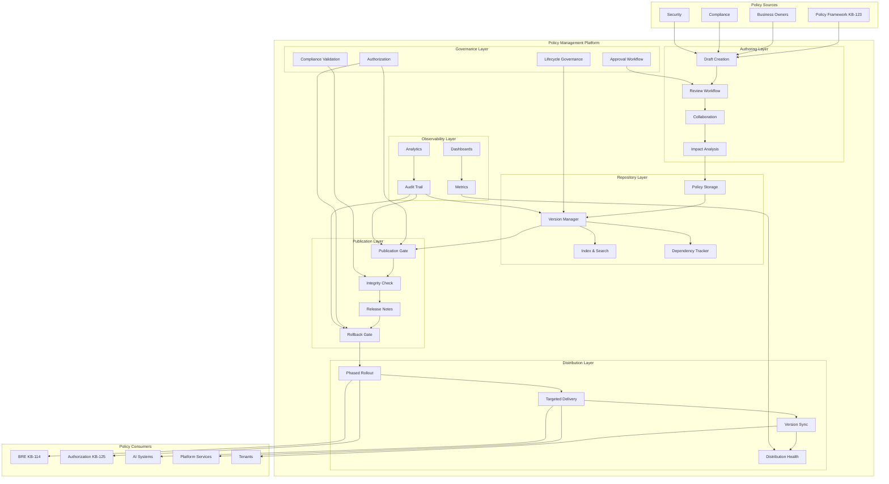
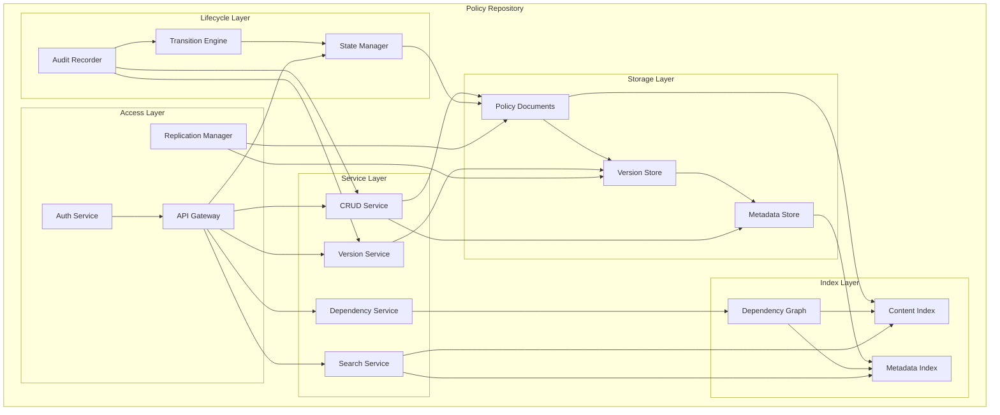
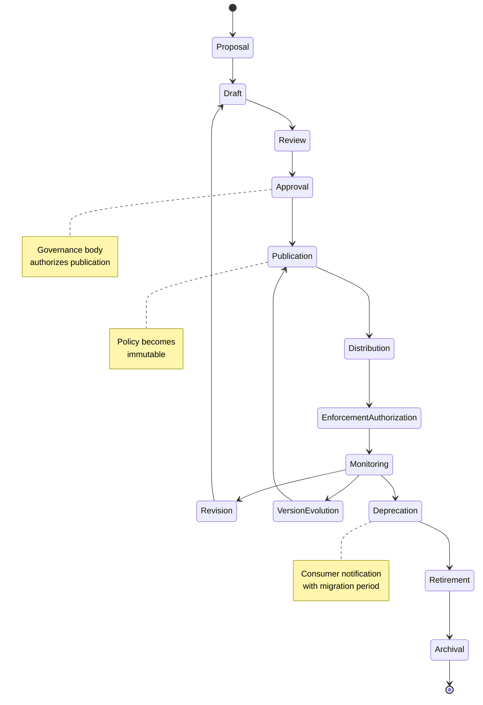
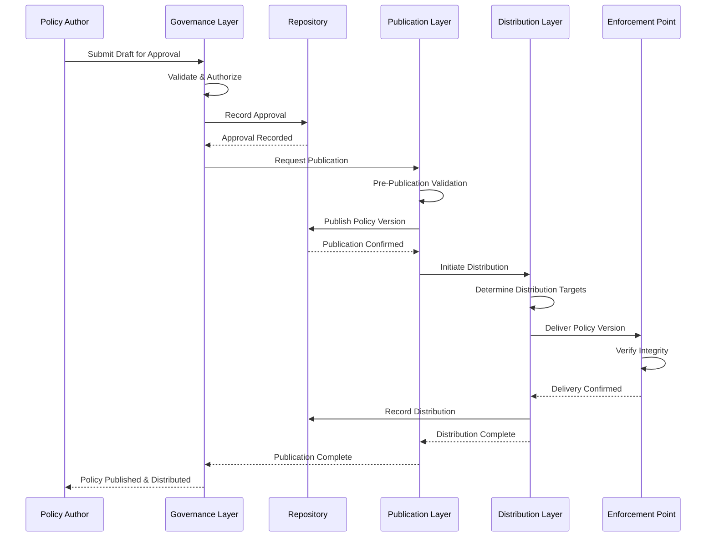
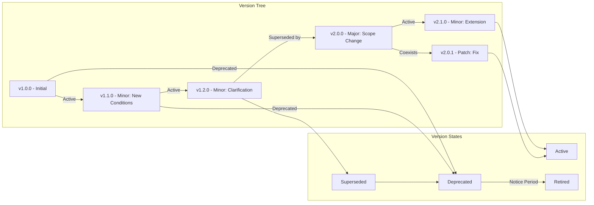
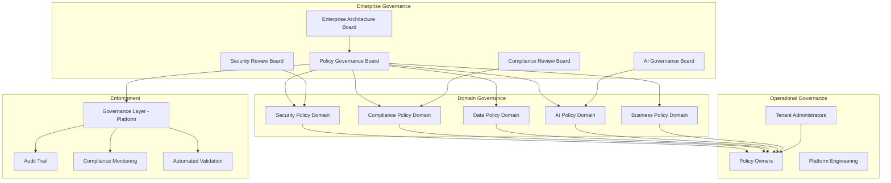
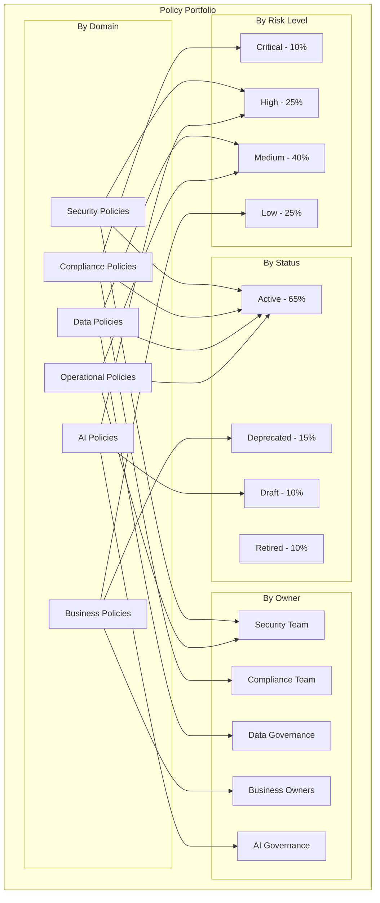
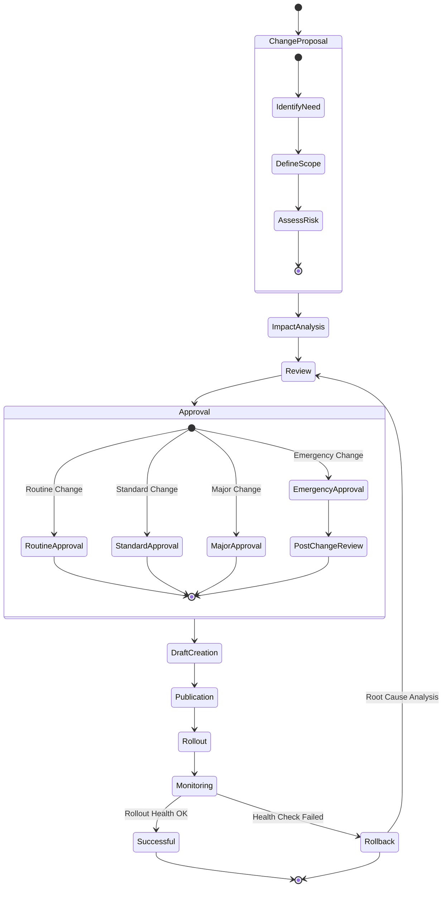
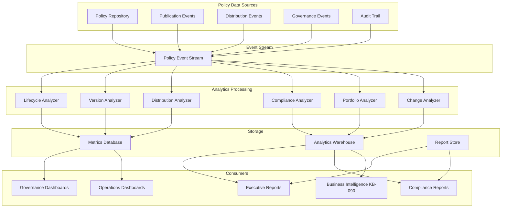
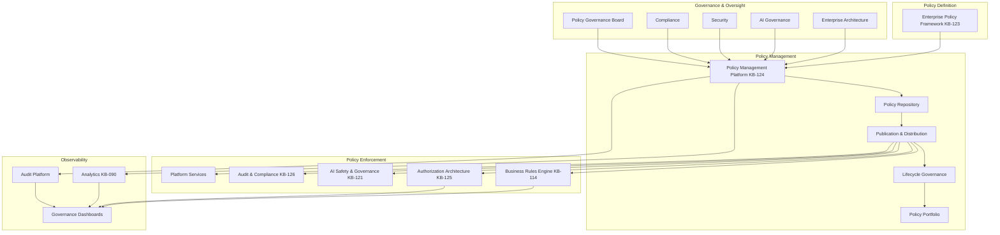

# KB-124 — Policy Management Architecture

---

## Metadata

| Attribute | Value |
|-----------|-------|
| **Document ID** | KB-124 |
| **Title** | Policy Management Architecture |
| **Suite** | Enterprise Platform Services |
| **Version** | 1.0 |
| **Status** | Approved Architecture |
| **Classification** | Enterprise Governance Architecture |
| **Date** | 2026-07-12 |
| **Architect** | Enterprise Policy Management Architecture Builder |

---

## Table of Contents

1. Executive Summary
2. Architectural Principles
3. Canonical Definitions
4. Enterprise Policy Management Architecture
5. Policy Repository Architecture
6. Policy Authoring Architecture
7. Policy Publication Architecture
8. Policy Distribution Architecture
9. Policy Version Management
10. Policy Change Management
11. Policy Portfolio Management
12. Policy Analytics Architecture
13. Policy Lifecycle
14. Governance
15. Responsibilities
16. Security
17. Privacy
18. Performance
19. Observability
20. Failure Scenarios
21. Anti-Patterns
22. Future Evolution
23. Cross-References
24. Architecture Diagrams

---

## 1. Executive Summary

The Policy Management Platform is the centralized enterprise capability that governs the complete operational lifecycle of enterprise policies across the DUKADESK ecosystem. It provides authoritative capabilities for authoring, reviewing, approving, publishing, distributing, versioning, monitoring, auditing, and retiring policies independently of policy definition and runtime enforcement.

This architecture separates policy definition (what the policy says) from policy management (how the policy is governed through its lifecycle) and policy enforcement (how the policy is applied at runtime). This separation ensures that policies are managed consistently, traceably, and auditably while remaining independent of the specific enforcement mechanisms used by any platform service.

The Policy Management Platform sits within the Governance Domain of the Enterprise Platform Services suite (KB-107). It operationalizes the policies defined by the Enterprise Policy Framework (KB-123), distributes enforceable policies to the Business Rules Engine (KB-114), Authorization Architecture (KB-125), and other enforcement points, and provides governance visibility to enterprise stakeholders.

Key architectural decisions include:
- **Definition-Management-Enforcement separation**: Policy definition (KB-123), management (this architecture), and enforcement (KB-114, KB-125, etc.) are independent concerns governed by separate architectures.
- **Immutable published policies**: Once a policy is published, it becomes immutable. Changes are made through new versions, ensuring complete traceability and auditability.
- **Controlled publication and distribution**: Policies move through controlled gates — draft, review, approval, publication, distribution — with authorization, audit, and rollback at every stage.
- **Centralized repository, distributed enforcement**: The Policy Repository is the single source of truth. Enforcement points receive authorized, versioned policy snapshots through governed distribution channels.
- **Version-first architecture**: Every policy change produces a new version. Versions are immutable, traceable, and independently deployable, retirable, and rollbackable.

---

## 2. Architectural Principles

### 2.1 Centralized Policy Management

All enterprise policies are managed through a single, centralized Policy Management Platform. No application, service, tenant, or AI component independently manages enterprise policies outside the governed lifecycle.

### 2.2 Separation of Definition, Management, and Enforcement

Policy definition (content and intent), policy management (lifecycle and governance), and policy enforcement (runtime application) are independent architectural concerns, each governed by its own architecture.

### 2.3 Governance-First Lifecycle

Every policy lifecycle transition is governed. No policy moves from one lifecycle state to another without appropriate authorization, validation, and audit.

### 2.4 Version-First Architecture

Policy changes produce new versions; policies are never modified in place. Every version is immutable, traceable, and independently manageable.

### 2.5 Policy Traceability

Every policy — from its original draft through every version, review, approval, publication, distribution, enforcement action, and retirement — is fully traceable. Traceability is architectural, not optional.

### 2.6 Auditability by Default

Every policy management operation — draft creation, review, approval, publication, distribution, rollback, retirement — is recorded in the immutable audit trail. No operation is invisible.

### 2.7 Policy Immutability After Publication

Published policies are immutable. Enforcement points execute the exact policy version they received. Changes require new versions with controlled rollout.

### 2.8 Controlled Change Management

Policy changes follow a controlled process: proposal, impact analysis, review, approval, rollout, monitoring, and rollback capability. Uncontrolled policy changes are architecturally impossible.

### 2.9 Vendor Independence

Policy management is independent of any specific policy engine, authorization system, rules engine, or enforcement technology. Providers and technologies may be substituted without affecting policy management.

### 2.10 Technology Neutrality

The architecture defines canonical models, contracts, and behaviors for policy management without prescribing specific storage, distribution, or versioning technologies.

### 2.11 Multi-Tenant Governance

Policy management respects tenant boundaries. Enterprise policies are managed centrally; tenant-specific policies operate within enterprise governance guardrails.

### 2.12 Zero Trust

Every policy management operation — from authoring through archival — is authenticated, authorized, and validated. No operation is trusted based on role, location, or system of origin.

### 2.13 Enterprise Observability

Policy management operations, portfolio health, lifecycle status, distribution coverage, and governance compliance are fully observable through enterprise dashboards and reporting.

---

## 3. Canonical Definitions

| Term | Definition |
|------|-----------|
| **Policy Management** | The operational discipline of authoring, reviewing, approving, publishing, distributing, versioning, monitoring, auditing, and retiring enterprise policies throughout their lifecycle. |
| **Policy Repository** | The centralized, authoritative storage system for all enterprise policies, their versions, metadata, and lifecycle state. |
| **Policy Publication** | The act of making an approved policy version available for distribution to enforcement points. |
| **Policy Distribution** | The secure delivery of authorized policy versions from the repository to enforcement points across the platform. |
| **Policy Approval** | The formal authorization of a policy version for publication, granted by the appropriate governance body. |
| **Policy Draft** | A policy version that is under development and has not yet been approved or published. |
| **Published Policy** | A policy version that has been approved and made available for distribution and enforcement. |
| **Policy Rollout** | The controlled activation of a published policy version across enforcement points, which may be phased or gradual. |
| **Policy Rollback** | The controlled deactivation of a policy version and reversion to a previous version, executed under governance. |
| **Policy Retirement** | The formal end-of-life of a policy version, after which it is no longer distributed or enforced. |
| **Policy Archive** | The long-term retention of retired policy versions for compliance, audit, and historical reference. |
| **Policy Ownership** | The assignment of accountability for a policy's definition, lifecycle management, and governance compliance. |
| **Policy Review** | The evaluation of a policy draft or version for correctness, completeness, compliance, and impact before approval. |
| **Policy Change** | A modification to a policy that results in a new version, which may be minor, major, or urgent. |
| **Policy Revision** | A specific iteration of a policy under development, which may become a published version after approval. |
| **Policy Portfolio** | The complete set of enterprise policies managed through the platform, organized by domain, owner, status, and lifecycle state. |
| **Policy Lifecycle** | The complete sequence of states a policy traverses from proposal through archival. |
| **Policy Governance** | The framework of rules, roles, approvals, and oversight that governs policy management operations. |
| **Policy Monitoring** | The continuous observation of policy lifecycle, distribution health, and governance compliance. |
| **Policy Analytics** | The analysis of policy portfolio, lifecycle, distribution, and compliance data for enterprise insights. |

---

## 4. Enterprise Policy Management Architecture

### 4.1 Architectural Layers

The Policy Management Platform comprises six logical layers:

1. **Authoring Layer** — Tools and workflows for creating, reviewing, and approving policy drafts. Supports collaboration, impact analysis, and governance validation before publication.
2. **Repository Layer** — Centralized, versioned, immutable storage for all policies. Provides organization, search, dependency tracking, and lifecycle state management.
3. **Publication Layer** — Controlled gate that transitions approved policies from repository to distribution. Enforces publication authorization, validates policy integrity, and records publication audit.
4. **Distribution Layer** — Secure delivery of published policies to enforcement points. Supports phased rollout, targeted distribution, version targeting, and rollback.
5. **Governance Layer** — Enforces policy management governance rules: authorization, approval workflows, lifecycle transitions, change management, and compliance validation.
6. **Observability Layer** — Metrics, audit, monitoring, analytics, and reporting for all policy management operations and portfolio health.

### 4.2 Architectural Flow

```
Policy Author ──▶ Authoring Layer ──▶ Draft Creation
                                          │
                                          ▼
                                    Review & Approval
                                          │
                                          ▼
                                    Repository Layer
                                          │
                                          ▼
                                    Publication Layer ──▶ Published Policy
                                                              │
                                                              ▼
                                    Distribution Layer ──▶ Enforcement Points
                                                              │
                                                              ▼
                                    Monitoring & Observability
```

### 4.3 Architectural Boundaries

The Policy Management Platform is the sole mechanism for managing enterprise policies. No platform component independently authors, publishes, distributes, versions, or retires policies outside this platform.

The Policy Management Platform does not:
- Define policy content or business rules (handled by KB-123 and KB-114).
- Enforce policies at runtime (handled by KB-114, KB-125, and other enforcement architectures).
- Authorize individual enforcement decisions (handled by runtime enforcement systems).
- Implement policy decision points or policy enforcement points.

### 4.4 Multi-Tenant Architecture

- **Enterprise policies**: Managed centrally, applicable to all tenants. Published by enterprise governance.
- **Tenant policies**: Tenant-specific policies managed through the platform with enterprise governance guardrails. Tenant administrators may author and approve tenant-scoped policies.
- **Policy visibility**: Enterprise policies are visible to all tenants in read-only form. Tenant policies are private to the owning tenant.
- **Cross-tenant policies**: Policies spanning multiple tenants require cross-tenant governance approval.

```
┌──────────────────────────────────────────────────────────────────────┐
│                      POLICY MANAGEMENT PLATFORM                       │
│                                                                      │
│  ┌──────────────────────────────────────────────────────────────┐   │
│  │                     Authoring Layer                            │   │
│  │  ┌──────────┐ ┌──────────┐ ┌──────────┐ ┌──────────────────┐  │   │
│  │  │ Draft    │ │ Review   │ │ Collabor-│ │ Impact Analysis  │  │   │
│  │  │ Creation │ │ Workflow │ │ ation    │ │ & Validation     │  │   │
│  │  └──────────┘ └──────────┘ └──────────┘ └──────────────────┘  │   │
│  └──────────────────────────────────────────────────────────────┘   │
│                              │                                        │
│  ┌──────────────────────────────────────────────────────────────┐   │
│  │                     Repository Layer                           │   │
│  │  ┌──────────┐ ┌──────────┐ ┌──────────┐ ┌──────────────────┐  │   │
│  │  │ Storage  │ │ Version  │ │ Index &  │ │ Dependency       │  │   │
│  │  │          │ │ Manager  │ │ Search   │ │ Tracker          │  │   │
│  │  └──────────┘ └──────────┘ └──────────┘ └──────────────────┘  │   │
│  └──────────────────────────────────────────────────────────────┘   │
│                              │                                        │
│  ┌──────────────────────────────────────────────────────────────┐   │
│  │                   Publication Layer                            │   │
│  │  ┌──────────┐ ┌──────────┐ ┌──────────┐ ┌──────────────────┐  │   │
│  │  │ Publish  │ │ Integrity│ │ Release  │ │ Rollback         │  │   │
│  │  │ Gate     │ │ Check    │ │ Notes    │ │ Gate             │  │   │
│  │  └──────────┘ └──────────┘ └──────────┘ └──────────────────┘  │   │
│  └──────────────────────────────────────────────────────────────┘   │
│                              │                                        │
│  ┌──────────────────────────────────────────────────────────────┐   │
│  │                   Distribution Layer                           │   │
│  │  ┌──────────┐ ┌──────────┐ ┌──────────┐ ┌──────────────────┐  │   │
│  │  │ Phased   │ │ Targeted │ │ Version  │ │ Distribution     │  │   │
│  │  │ Rollout  │ │Delivery  │ │ Sync     │ │ Health           │  │   │
│  │  └──────────┘ └──────────┘ └──────────┘ └──────────────────┘  │   │
│  └──────────────────────────────────────────────────────────────┘   │
│                              │                                        │
│  ┌──────────────────────────────────────────────────────────────┐   │
│  │                    Governance Layer                            │   │
│  │  ┌──────────┐ ┌──────────┐ ┌──────────┐ ┌──────────────────┐  │   │
│  │  │ Authoriz-│ │ Approval │ │ Lifecycle│ │ Compliance       │  │   │
│  │  │ ation    │ │ Workflow │ │Governance│ │ Validation       │  │   │
│  │  └──────────┘ └──────────┘ └──────────┘ └──────────────────┘  │   │
│  └──────────────────────────────────────────────────────────────┘   │
│                              │                                        │
│  ┌──────────────────────────────────────────────────────────────┐   │
│  │                   Observability Layer                          │   │
│  │  ┌──────────┐ ┌──────────┐ ┌──────────┐ ┌──────────────────┐  │   │
│  │  │ Metrics  │ │ Audit    │ │ Dash-    │ │ Analytics &      │  │   │
│  │  │ Pipeline │ │ Trail    │ │ boards   │ │ Reporting        │  │   │
│  │  └──────────┘ └──────────┘ └──────────┘ └──────────────────┘  │   │
│  └──────────────────────────────────────────────────────────────┘   │
└──────────────────────────────────────────────────────────────────────┘
```

---

## 5. Policy Repository Architecture

### 5.1 Repository Model

The Policy Repository is the centralized, authoritative, immutable store for all enterprise policies. It serves as the single source of truth from which all enforcement points receive their policy definitions.

### 5.2 Repository Structure

| Element | Description |
|---------|-------------|
| **Policy Document** | The canonical policy definition, including scope, rules, conditions, and metadata. Stored as an immutable versioned artifact. |
| **Policy Version** | A specific immutable snapshot of a policy document. Each version has a unique ID, semantic version, and content hash. |
| **Policy Metadata** | Governance metadata: owner, domain, status, lifecycle state, approval records, effective dates, and tags. |
| **Policy Dependency Graph** | Declared relationships between policies, including inheritance, override, reference, and conflict relationships. |
| **Policy Change History** | Immutable log of all changes to the policy, including drafts, reviews, approvals, publications, and distributions. |

### 5.3 Repository Capabilities

- **Immutable storage**: Published policy versions are immutable. No modification after publication.
- **Version navigation**: Complete version history with semantic version tree, diffs between versions, and rollback targeting.
- **Search and discovery**: Full-text and faceted search over policy content, metadata, and change history.
- **Dependency tracking**: Declared and inferred dependency graph with impact analysis for proposed changes.
- **Lifecycle state management**: Authoritative tracking of each policy version's lifecycle state.
- **Access control**: Policy-level, version-level, and operation-level authorization.
- **Replication**: Repository data is replicated across regions for availability and distribution performance.
- **Integrity verification**: Content hashing and signing for tamper detection.

### 5.4 Repository Governance

- Repository access is authorized per operation: read, draft, review, approve, publish, retire.
- Repository data is encrypted at rest and in transit.
- Repository backups are point-in-time recoverable.
- Repository audit trail is immutable and independently stored.

---

## 6. Policy Authoring Architecture

### 6.1 Authoring Model

Policy authoring encompasses the creation, review, revision, and approval preparation of policy drafts before they enter the publication pipeline.

### 6.2 Authoring Stages

| Stage | Description | Participants |
|-------|-------------|--------------|
| **Proposal** | Business need identified, policy scope defined, initial draft created. | Policy author, business owner |
| **Draft Creation** | Policy content authored in the policy authoring environment. Structured format with defined schema. | Policy author |
| **Collaboration** | Stakeholders review, comment, suggest changes. Collaborative editing within governance. | Authors, reviewers, subject matter experts |
| **Impact Analysis** | Automated and manual analysis of the draft's impact on existing policies, dependents, and enforcement points. | Author, governance tooling |
| **Governance Validation** | Automated checks: schema validation, conflict detection, compliance scanning, governance rule adherence. | Governance tooling |
| **Approval Preparation** | Draft is finalized, impact report attached, review history compiled, ready for governance approval. | Author, governance body |

### 6.3 Authoring Governance

- Drafts are isolated from published policies until approved and published.
- Multiple drafts may exist simultaneously for the same policy.
- Draft authors are authenticated and authorized based on policy domain.
- Draft changes are versioned within the draft lifecycle; draft versions are distinct from published versions.
- Drafts cannot be published without completing review, impact analysis, and governance validation.

---

## 7. Policy Publication Architecture

### 7.1 Publication Model

Publication is the controlled gate through which approved policy drafts become immutable published policies available for distribution. Publication is a governance event, not a technical operation.

### 7.2 Publication Stages

| Stage | Description |
|-------|-------------|
| **Publication Request** | Authorized request to publish an approved policy draft. Includes version metadata, release notes, and rollout plan. |
| **Pre-Publication Validation** | Final automated validation: integrity check, dependency verification, schema compliance, conflict detection. |
| **Publication Authorization** | Governance body or authorized approver grants publication authorization. Authorization is recorded in audit trail. |
| **Policy Signing** | Policy content is digitally signed to ensure integrity and provenance. |
| **Publication Recording** | Policy version is marked as published in the repository. Publication event is recorded with full metadata. |
| **Release Notification** | Subscribers and enforcement points are notified of the new policy version and its availability for distribution. |

### 7.3 Publication Immutability

- Once published, a policy version is immutable.
- No field in a published policy may be modified.
- Corrections require a new version following the full lifecycle.
- Publication records include the exact content hash for integrity verification.

### 7.4 Publication Rollback

- Published policy versions may be rolled back under governance.
- Rollback creates a new publication event reverting to a previous version.
- Rollback is recorded as a publication event with full audit trail.
- Enforcement points are notified of rollback through the distribution layer.

---

## 8. Policy Distribution Architecture

### 8.1 Distribution Model

Policy distribution delivers authorized, versioned policy snapshots from the central repository to enforcement points across the platform. Distribution is secure, version-aware, and observable.

### 8.2 Distribution Mechanisms

| Mechanism | Description | Use Case |
|-----------|-------------|----------|
| **Push Distribution** | Policy changes are pushed from repository to enforcement points on publication. | Real-time policy updates, urgent policy changes |
| **Pull Distribution** | Enforcement points periodically poll the repository for new versions. | Scheduled policy synchronization, loosely coupled systems |
| **Event-Driven Distribution** | Publication events trigger distribution through the platform event bus (KB-077). | Event-aware enforcement points, reactive distribution |
| **Snapshot Distribution** | Enforcement points receive complete policy snapshots at defined intervals. | Batch synchronization, offline-capable enforcement |
| **Targeted Distribution** | Policy versions are distributed to specific enforcement points or groups. | Phased rollout, A/B testing, tenant-specific distribution |

### 8.3 Distribution Guarantees

- **At-least-once delivery**: Every enforcement point receives each policy version at least once.
- **Ordered delivery**: Policy versions are delivered in publication order within each distribution channel.
- **Integrity-verified**: Each distributed policy includes its content hash for integrity verification.
- **Audit-trailed**: Every distribution event is recorded in the audit trail.
- **Health-monitored**: Distribution success, latency, and coverage are continuously monitored.

### 8.4 Phased Rollout

- Policy versions may be distributed in phases: first to sandbox, then to staging, then to production enforcement points.
- Phased rollout allows monitoring and validation before full distribution.
- Rollout pauses automatically if health checks fail during a phase.
- Rollout phases are configurable per policy domain and risk level.

### 8.5 Distribution Health

- Distribution coverage: percentage of enforcement points that have received and activated the policy version.
- Distribution latency: time from publication to receipt at each enforcement point.
- Distribution errors: failed deliveries, integrity verification failures, activation failures.
- Distribution rollback: percentage of enforcement points that have rolled back to a previous version.

---

## 9. Policy Version Management

### 9.1 Version Model

Policies follow semantic versioning with three levels of change significance:

| Version Component | Meaning | Example |
|-------------------|---------|---------|
| **Major** | Breaking change: policy semantics, scope, or structure changes that may produce different enforcement outcomes | Policy rule set redefined, policy domain changed, enforcement behavior fundamentally altered |
| **Minor** | Backward-compatible addition: new conditions, extended scope, additional exceptions without changing existing behavior | New exception added, additional condition included, scope clarification |
| **Patch** | Backward-compatible fix: correction, clarification, typo fix without behavioral change | Wording clarification, metadata update, reference correction |

### 9.2 Version States

| State | Description |
|-------|-------------|
| **Draft** | Version is under development, not yet approved or published. |
| **Published** | Version is approved, immutable, and available for distribution. |
| **Active** | Version is published and actively distributed to enforcement points. |
| **Superseded** | A newer version has replaced this version; the version remains in the repository for reference. |
| **Deprecated** | Version is marked for retirement; enforcement points are notified to migrate. |
| **Retired** | Version is no longer distributed or enforced; retained in archive for audit. |

### 9.3 Version Lifecycle

```
Draft ──▶ Published ──▶ Active ──▶ Superseded ──▶ Deprecated ──▶ Retired
                │                     ▲
                │                     │
                └─── Rollback ────────┘
```

### 9.4 Version Coexistence

- Multiple published versions may coexist during migration windows.
- Enforcement points may target specific versions; version targeting is governed.
- Version coexistence is time-bounded; governance defines maximum coexistence period.
- Dependency versioning ensures policy references resolve to compatible versions.

### 9.5 Version Compatibility

- Major version changes require explicit consumer migration.
- Minor version changes are backward-compatible; consumers may upgrade at their pace.
- Patch version changes are transparent; consumers automatically receive patches.
- Version compatibility is declared in policy metadata and validated during publication.

---

## 10. Policy Change Management

### 10.1 Change Model

Policy changes follow a controlled governance process from proposal through activation. Every change is traceable, auditable, and reversible.

### 10.2 Change Types

| Type | Description | Approval Required |
|------|-------------|-------------------|
| **Routine Change** | Pre-approved, low-risk policy updates: metadata corrections, minor clarifications, patch-level changes. | Owner approval. |
| **Standard Change** | Medium-risk policy updates: new conditions, minor scope changes, new exceptions. | Governance board approval. |
| **Major Change** | High-risk policy updates: scope redefinition, rule set changes, breaking behavior changes. | Governance board approval + impact analysis + stakeholder review. |
| **Emergency Change** | Urgent policy updates required to address active threats, compliance violations, or production incidents. | Emergency governance approval with post-change review. |

### 10.3 Change Process

```
Proposal ──▶ Impact Analysis ──▶ Review ──▶ Approval ──▶ Draft ──▶ Publication ──▶ Rollout ──▶ Monitoring
                                                                                                │
                                                                                    ┌────────────┴────────────┐
                                                                                    │                         │
                                                                                    ▼                         ▼
                                                                              Success                 Rollback if needed
```

### 10.4 Rollback Governance

- Rollback is a controlled operation, not an ad-hoc action.
- Rollback requires authorization from the original approving body or its delegate.
- Rollback impact analysis ensures rollback does not create new issues.
- Rollback is recorded as a change event with full audit trail.
- Rollback creates a new publication event (reverting to a previous version), not an in-place modification.

### 10.5 Emergency Change Governance

- Emergency changes bypass standard approval but require post-change review within defined SLA.
- Emergency change authorization is limited to designated emergency approvers.
- Emergency changes are automatically flagged for enhanced monitoring.
- Post-change review may require rollback if the emergency change caused unintended effects.
- Emergency changes are subject to the same publication and distribution controls as standard changes.

---

## 11. Policy Portfolio Management

### 11.1 Portfolio Model

The Policy Portfolio is the complete set of enterprise policies managed through the platform, organized for visibility, governance, and strategic management.

### 11.2 Portfolio Organization

| Dimension | Description |
|-----------|-------------|
| **Domain** | Policy domain (security, compliance, AI, business, operational, data, integration) |
| **Owner** | Business or technical entity accountable for the policy |
| **Status** | Active, deprecated, retired, draft |
| **Lifecycle Stage** | Current position in the policy lifecycle |
| **Risk Level** | Low, medium, high, critical |
| **Scope** | Enterprise, tenant, system, service |
| **Maturity** | New, established, mature, legacy |

### 11.3 Portfolio Capabilities

- **Policy inventory**: Complete, searchable inventory of all enterprise policies with metadata.
- **Health dashboard**: Portfolio health metrics: active vs. deprecated counts, lifecycle distribution, ownership coverage.
- **Coverage analysis**: Gap analysis identifying domains, services, or regulations not covered by policies.
- **Dependency visualization**: Interactive dependency graph showing policy relationships.
- **Lifecycle management**: Bulk lifecycle operations for policy groups (e.g., retire all policies in a retired domain).
- **Reporting**: Portfolio reports for governance bodies, executives, auditors, and regulators.
- **Impact analysis**: Portfolio-wide impact analysis for proposed policy changes.

### 11.4 Portfolio Governance

- Portfolio health is reviewed by governance bodies on a scheduled basis.
- Portfolio gaps are identified and remediation actions assigned.
- Portfolio lifecycle balance is governed: excessive deprecated or draft policies trigger governance review.
- Portfolio ownership coverage is monitored; policies without owners are flagged for assignment.

---

## 12. Policy Analytics Architecture

### 12.1 Analytics Model

Policy analytics provides enterprise-wide visibility into policy management operations, portfolio health, lifecycle efficiency, distribution effectiveness, and governance compliance.

### 12.2 Analytics Categories

| Category | Metrics | Purpose |
|----------|---------|---------|
| **Lifecycle Analytics** | Time in each lifecycle stage, approval cycle time, publication frequency, retirement rate | Measure lifecycle efficiency and identify bottlenecks |
| **Version Analytics** | Version count per policy, version churn rate, major vs. minor vs. patch distribution | Understand policy evolution patterns |
| **Distribution Analytics** | Distribution coverage, distribution latency, activation time, rollback frequency | Measure distribution effectiveness |
| **Compliance Analytics** | Governance compliance rate, approval compliance, audit trail completeness | Measure governance adherence |
| **Portfolio Analytics** | Policy count by domain, owner, status, risk level, scope | Measure portfolio health and completeness |
| **Change Analytics** | Change volume by type, approval time, rollback rate, emergency change frequency | Measure change management effectiveness |
| **Usage Analytics** | Policy reference frequency, enforcement invocation count per policy | Measure policy relevance and usage |

### 12.3 Analytics Integration

- Policy analytics data flows to the enterprise Analytics platform (KB-090) for business intelligence reporting.
- Policy analytics dashboards are integrated into the Governance Dashboard.
- Analytics data is tenant-partitioned for tenant-level reporting.
- Analytics retention aligns with enterprise data retention policies.

### 12.4 Analytics Governance

- Policy analytics data is governed by the same access controls as the policies themselves.
- Analytics reports are available to authorized roles only.
- Analytics data retention follows compliance requirements.
- Analytics aggregation respects tenant boundaries.

---

## 13. Policy Lifecycle

### 13.1 Lifecycle Stages

| Stage | Description |
|-------|-------------|
| **Proposal** | Business need identified, policy scope defined, initial impact assessment completed. Stakeholders identified. |
| **Draft** | Policy content authored in the authoring environment. Collaborative review and revision. Multiple draft iterations. |
| **Review** | Formal review by subject matter experts, legal, compliance, and impacted stakeholders. Review comments recorded. |
| **Approval** | Governance body or authorized approver formally approves the policy for publication. |
| **Publication** | Approved policy version is published to the repository. Policy becomes immutable. Publication event recorded. |
| **Distribution** | Published policy is distributed to enforcement points through controlled distribution mechanisms. |
| **Enforcement Authorization** | Enforcement points formally activate the policy version for runtime enforcement. |
| **Monitoring** | Policy effectiveness, distribution health, and enforcement compliance are continuously monitored. |
| **Revision** | Policy is revised through new versions. Revision may be triggered by business change, regulatory change, incident, or scheduled review. |
| **Version Evolution** | Policy undergoes version updates following the version management model. |
| **Deprecation** | Policy version is marked as deprecated. Consumers notified. Migration guidance provided. |
| **Retirement** | Policy version is retired. No longer distributed or enforced. Retention for audit and compliance. |
| **Archival** | Retired policy version is archived for long-term retention. Access for audit and reference only. |

### 13.2 Lifecycle State Transitions

```
Proposal ──▶ Draft ──▶ Review ──▶ Approval ──▶ Publication ──▶ Distribution
                                                                    │
                                                                    ▼
                                                           Enforcement Auth
                                                                    │
                                                                    ▼
                                                              Monitoring
                                                                    │
                                                              ┌─────┴──────┐
                                                              │            │
                                                              ▼            ▼
                                                         Revision    Version Evo
                                                              │            │
                                                              └──────┬─────┘
                                                                     │
                                                                     ▼
                                                               Deprecation
                                                                     │
                                                                     ▼
                                                               Retirement
                                                                     │
                                                                     ▼
                                                                Archival
```

### 13.3 Lifecycle Governance

- No lifecycle transition occurs without authorization.
- Transitions are recorded in the immutable audit trail with actor, timestamp, and rationale.
- Lifecycle state is visible in the Policy Repository and Portfolio.
- Transition to Deprecation triggers mandatory consumer notification with minimum notice period.
- Transition to Retirement requires verification that no active enforcement points consume the policy version.
- Archived policies may be reactivated only through a new lifecycle beginning with Proposal.

---

## 14. Governance

### 14.1 Governance Bodies

| Body | Responsibility |
|------|---------------|
| **Policy Governance Board** | Highest authority for policy management. Approves policy publications, major changes, and lifecycle transitions. Sets policy management standards. |
| **Enterprise Architecture Board** | Reviews policy management architecture, repository structure, and distribution architecture for alignment with enterprise standards. |
| **Security Review Board** | Reviews policy management security: authoring security, publication integrity, distribution security, repository protection. |
| **Compliance Review Board** | Ensures policy management complies with regulatory requirements for policy governance, audit, and retention. |
| **AI Governance Board** | Oversees AI-specific policies managed through the platform. |
| **Domain Governance Boards** | Per-domain bodies (security, compliance, data, business, AI) govern policies within their domain. |
| **Tenant Policy Governance** | Tenant administrators govern tenant-scoped policies within enterprise guardrails. |

### 14.2 Governance Domains

| Domain | Description |
|--------|-------------|
| **Policy Ownership** | Every policy has a designated owner accountable for definition, lifecycle management, and governance compliance. |
| **Publication Governance** | Publications require authorized approval. Pre-publication validation is mandatory. Post-publication audit is recorded. |
| **Change Governance** | Policy changes follow the change management process with appropriate approval based on change type. |
| **Lifecycle Governance** | Lifecycle transitions follow defined workflows and approval gates. |
| **Compliance Governance** | Policy management complies with regulatory requirements for policy governance and audit. |
| **Security Governance** | Policy management operations meet security requirements for authorization, integrity, and audit. |
| **AI Governance** | AI-specific policies have enhanced governance requirements for review, approval, and monitoring. |
| **Architecture Governance** | Policy management follows the enterprise architecture model and platform standards. |
| **Audit Governance** | All policy management operations are auditable. Audit records are retained per compliance requirements. |
| **Enterprise Governance** | The complete policy portfolio is governed for strategic alignment, lifecycle health, and governance compliance. |

### 14.3 Governance Enforcement

- Governance rules are encoded in the Governance Layer of the Policy Management Platform.
- Automated governance checks run on every policy operation: draft, review, approval, publication, distribution, retirement.
- Governance violations block operations until remediation.
- Governance dashboards provide real-time visibility into governance compliance.
- Governance audit trails are immutable and retained per compliance requirements.

---

## 15. Responsibilities

| Role | Responsibilities |
|------|-----------------|
| **Executive Leadership** | Set enterprise policy direction. Approve high-impact policy changes. Provide policy governance oversight. |
| **Enterprise Architecture** | Define policy management architecture, principles, and standards. Govern repository structure and distribution architecture. |
| **Policy Governance Board** | Approve policy publications and major changes. Set policy management governance standards. Resolve policy conflicts. |
| **Platform Engineering** | Implement and operate the Policy Management Platform. Ensure platform scalability, availability, and distribution reliability. |
| **Security** | Define policy management security policies. Review policy management operations for security compliance. |
| **Compliance** | Define compliance requirements for policy management. Review policy lifecycle for regulatory compliance. |
| **AI Governance Board** | Oversee AI-specific policy management. Ensure AI policies follow enhanced governance. |
| **Product Teams** | Author policies for their product domains. Participate in policy review and impact analysis. |
| **Operations** | Monitor policy management platform health, distribution health, and lifecycle operations. Respond to policy management incidents. |
| **Tenant Administrators** | Manage tenant-scoped policies. Ensure tenant policy compliance with enterprise governance. |

---

## 16. Security

### 16.1 Secure Authoring

- Policy authors are authenticated and authorized per policy domain and operation.
- Draft content is encrypted at rest and in transit.
- Authoring tools validate policy content before submission.
- Draft access is governed by need-to-know and least privilege.

### 16.2 Secure Publication

- Publication requires multi-factor authorization for high-impact policies.
- Policy content is digitally signed during publication.
- Publication events are recorded in the immutable audit trail.
- Publication integrity is verified before distribution.

### 16.3 Policy Integrity

- Published policies are content-hashed and signed.
- Policy integrity is verified at every distribution point.
- Tampered policies are detected and quarantined.
- Policy integrity verification is mandatory, not optional.

### 16.4 Policy Authorization

- Every policy management operation is authorized: read, draft, review, approve, publish, distribute, retire.
- Authorization is enforced at the API layer and confirmed by the Governance Layer.
- Authorization decisions are audited.

### 16.5 Tamper Protection

- Repository data is immutable; published policies cannot be modified.
- Audit trail is append-only; audit records cannot be altered or deleted.
- Policy content hashes enable tamper detection at any point.
- Repository backups include integrity verification.

### 16.6 Tenant Isolation

- Enterprise policies are read-only to tenants.
- Tenant policies are isolated from other tenants.
- Policy distribution respects tenant boundaries.
- Policy analytics are tenant-partitioned.

### 16.7 Least Privilege

- Authors access only the policy domains they are authorized to modify.
- Approvers access only policies within their governance scope.
- Operators access only the operational data required for their role.
- Auditors access audit data in read-only mode.

---

## 17. Privacy

### 17.1 Privacy-Aware Policy Management

- Policy definitions do not contain personal data.
- Policy metadata minimizes personal information.
- Policy review and approval records do not expose unnecessary personal data.

### 17.2 Consent Governance

- Policies that govern consent management are managed through the platform.
- Consent-related policies have enhanced audit requirements.
- Consent policy changes are flagged for privacy review.

### 17.3 Regulatory Alignment

- Policy management complies with regulatory requirements for policy governance (GDPR, CCPA, HIPAA, AI Act, SOX).
- Regulatory policies have enhanced lifecycle governance.
- Regulatory policy changes are flagged for compliance review.

### 17.4 Cross-Border Compliance

- Policy distribution respects regional data residency requirements.
- Cross-border policy distribution is governed by data transfer policies.
- Regional policy variants are managed as tenant-specific policies.

### 17.5 Audit Retention

- Policy management audit records are retained per compliance requirements.
- Privacy-sensitive audit data is redacted or anonymized in long-term storage.
- Audit access is governed by least privilege and need-to-know.
- Audit retention policies are configurable per tenant within enterprise bounds.

---

## 18. Performance

| Metric | Target |
|--------|--------|
| **Policy draft creation latency** | < 1s |
| **Policy publication latency** | < 2s (from approval to published in repository) |
| **Policy distribution latency (push)** | < 5s P99 (from publication to enforcement point receipt) |
| **Policy distribution latency (pull)** | Configurable polling interval (default 60s) |
| **Policy repository lookup** | < 50ms P99 |
| **Policy version search** | < 200ms P99 |
| **Concurrent policy publications** | Support 100+ simultaneous publications |
| **Policy distribution throughput** | 10,000+ distribution events/second |

### 18.1 Enterprise-Scale Repositories

- Repository scales horizontally with policy volume.
- Repository data is indexed for efficient search and retrieval.
- Version storage is optimized for immutability and diffing.
- Repository replication ensures global availability.

### 18.2 Global Policy Distribution

- Distribution infrastructure is deployed globally for low-latency delivery.
- Regional distribution caches reduce cross-region traffic.
- Distribution is resilient to regional network degradation.
- Policy distribution uses content-addressable storage for efficiency.

### 18.3 High Availability

- Policy Management Platform is deployed in active-active configuration.
- Repository data is replicated across availability zones.
- Distribution continues during repository maintenance windows.
- Publication is paused during repository unavailability; queued publications resume on recovery.

---

## 19. Observability

| Metric | Description |
|--------|-------------|
| **Policy Lifecycle Distribution** | Count of policies per lifecycle stage |
| **Publication Volume** | Number of policy publications per time period |
| **Publication Latency** | Time from approval to publication |
| **Distribution Coverage** | Percentage of enforcement points with current policy version |
| **Distribution Latency** | Time from publication to enforcement point receipt |
| **Rollback Frequency** | Number of policy rollbacks per time period |
| **Change Volume** | Number of policy changes by type (routine, standard, major, emergency) |
| **Governance Compliance Rate** | Percentage of policy operations passing automated governance checks |

### 19.1 Lifecycle Dashboards

- Policy portfolio health dashboard: active, deprecated, retired, draft counts.
- Lifecycle stage distribution by domain and owner.
- Publication and distribution activity timeline.
- Policy aging: time since last review, time since last version.

### 19.2 Publication Analytics

- Publication volume trends by domain and owner.
- Publication approval cycle time analysis.
- Publication failure rate and root cause distribution.
- Publication rollback analysis.

### 19.3 Compliance Metrics

- Governance compliance rate by governance domain.
- Approval compliance: percentage of publications with required approvals.
- Audit trail completeness: percentage of operations with complete audit records.
- Policy review compliance: percentage of policies reviewed within required interval.

### 19.4 Governance Dashboards

- Real-time governance compliance status.
- Policy operations requiring attention: pending approvals, failed validations, overdue reviews.
- Governance violation trends and resolution time.
- Governance body activity and decision volume.

### 19.5 Audit Reporting

- Complete audit trail searchable by policy ID, version, actor, operation, and time range.
- Compliance reports for regulatory audits.
- Change history reports for policy versions and lifecycle transitions.
- Governance activity reports for governance body oversight.

---

## 20. Failure Scenarios

### 20.1 Publication Failures

| Scenario | Architecture Mitigation |
|----------|------------------------|
| Publication authorization denied | Publication is blocked. Author is notified with reason. Draft remains in review state for resubmission. |
| Pre-publication validation fails | Publication is blocked. Validation errors are reported to author. Draft is returned to review state. |
| Publication integrity check fails | Publication is blocked. Policy content is quarantined for investigation. Repository integrity is verified. |
| Repository unavailable during publication | Publication request is queued. Queue is processed when repository is available. Publication timeout alerts operations. |

### 20.2 Distribution Failures

| Scenario | Architecture Mitigation |
|----------|------------------------|
| Enforcement point unreachable during distribution | Distribution is retried with exponential backoff. After max retries, enforcement point is flagged as unavailable. |
| Distribution integrity verification fails | Distribution is retried. After repeated failures, enforcement point is quarantined. Operations team is alerted. |
| Distribution network partition | Distribution queues messages for delivery when connectivity is restored. Enforcement points use local cached policies. |
| Cross-region distribution latency exceeds SLA | Regional distribution caches reduce cross-region traffic. Distribution health monitoring alerts on SLA breaches. |

### 20.3 Version Conflicts

| Scenario | Architecture Mitigation |
|----------|------------------------|
| Two policies published with conflicting versions | Version uniqueness is enforced at publication. Duplicate version IDs are rejected. |
| Policy version dependency creates circular reference | Dependency graph validation during publication detects and prevents circular references. |
| Rollback to version that has incompatible dependents | Rollback impact analysis detects incompatible dependents. Rollback is blocked until dependents are addressed. |
| Version coexistence window expired but consumers still on old version | Forced distribution of new version. Consumer notification with escalation for non-compliant consumers. |

### 20.4 Rollback Failures

| Scenario | Architecture Mitigation |
|----------|------------------------|
| Rollback target version corrupted | Rollback to next available valid version. Corrupted version is quarantined for investigation. |
| Rollback authorization denied | Rollback is blocked. Alternative mitigation is escalated to governance board. |
| Rollback creates policy gap | Rollback impact analysis identifies policy gaps. Gap is reported for remediation. |
| Rollback not propagated to all enforcement points | Distribution retry ensures eventual consistency. Enforcement points without rollback are flagged. |

### 20.5 Unauthorized Modifications

| Scenario | Architecture Mitigation |
|----------|------------------------|
| Unauthorized user attempts to publish policy | Authorization check blocks publication. Attempt is logged and escalated to security. |
| Unauthorized user attempts to modify published policy | Immutability prevents modification. Attempt is logged and quarantined for investigation. |
| Authorized user exceeds their authorization scope | Scope enforcement blocks out-of-scope operations. Violation is logged and governance body is notified. |
| Stolen credentials used for policy operation | Authorization patterns detect anomalous operations. Operation is blocked. Security incident is triggered. |

### 20.6 Repository Corruption

| Scenario | Architecture Mitigation |
|----------|------------------------|
| Repository data corruption detected | Integrity checks detect corruption. Automatic failover to replica. Corruption investigation initiated. |
| Repository metadata corruption | Version history is reconstructed from immutable policy documents. Corrupted metadata is regenerated. |
| Repository storage failure | Point-in-time recovery from backup. Replica promotion to primary. |
| Repository index corruption | Index is rebuilt from repository content. Read operations continue with degraded search during rebuild. |

### 20.7 Governance Failures

| Scenario | Architecture Mitigation |
|----------|------------------------|
| Governance layer unavailable | Policy management operations requiring governance are blocked. Read-only access to published policies continues. |
| Governance policy inconsistency | Most restrictive applicable policy is enforced. Inconsistency is logged and flagged for review. |
| Approval workflow deadlock | Escalation path is triggered. Governance board administrator intervenes. |
| Emergency approval bypass misused | Emergency approvals are audited. Post-change review may reverse or modify emergency changes. |

### 20.8 Policy Synchronization Failures

| Scenario | Architecture Mitigation |
|----------|------------------------|
| Enforcement point misses policy version | Distribution retry ensures eventual consistency. Enforcement point health monitoring detects missed versions. |
| Enforcement point has stale policy version | Version comparison detects staleness. Stale enforcement points are flagged for update. |
| Policy version activated before dependencies ready | Dependency verification during distribution prevents activation before dependency satisfaction. |
| Policy synchronization creates inconsistent state across enforcement points | Distribution ordering guarantees ensure consistent activation order. |

### 20.9 Audit Failures

| Scenario | Architecture Mitigation |
|----------|------------------------|
| Audit trail storage full | Audit trail has dedicated storage with alerting on capacity. Archival policy frees space. |
| Audit record integrity compromised | Append-only storage prevents modification. Integrity checks detect tampering. |
| Audit record lost before storage | Audit records are buffered with guaranteed delivery. Buffered records are recovered on storage availability. |
| Audit query performance degraded | Audit trail is indexed for query performance. Long-term audit data is tiered to warm storage. |

### 20.10 Compliance Violations

| Scenario | Architecture Mitigation |
|----------|------------------------|
| Policy published without required compliance review | Governance validation ensures compliance review is complete before publication. |
| Policy distributed to non-compliant region | Distribution scope enforcement prevents cross-region distribution without authorization. |
| Policy retention period not applied | Automated retention enforcement with compliance monitoring. Retention violations are flagged. |
| Audit record retention does not meet regulatory minimum | Audit retention is governed by compliance policy. Minimum retention is enforced by the platform. |

### 20.11 Cross-Tenant Leakage

| Scenario | Architecture Mitigation |
|----------|------------------------|
| Tenant policy visible to another tenant | Tenant-partitioned repository access prevents cross-tenant visibility. Access control is validated per operation. |
| Tenant policy distributed to wrong tenant | Distribution scope validation prevents cross-tenant distribution. Tenant ID is validated at distribution. |
| Cross-tenant policy reference unresolved | Dependency validation during publication ensures cross-tenant references are authorized. |
| Tenant policy analytics exposed to other tenants | Tenant-partitioned analytics prevents cross-tenant data exposure. |

### 20.12 Recovery Failures

| Scenario | Architecture Mitigation |
|----------|------------------------|
| Repository recovery from backup fails | Failover to replica. Backup is retried from alternative source. |
| Distribution recovery after outage | Distribution queues preserve undelivered policy versions. Recovery resumes from queue. |
| Publication recovery after platform failure | Queued publications are processed on recovery. Partial publications are rolled back or completed. |
| Governance state recovery after failure | Governance state is persisted. Recovery resumes from last committed governance decision. |

---

## 21. Anti-Patterns

| # | Anti-Pattern | Description | Prohibited Rationale |
|---|--------------|-------------|---------------------|
| 1 | **Manual Policy Distribution** | Policies distributed manually (email, shared drive, wiki) instead of through the governed distribution platform. | No audit trail. No version control. No distribution health monitoring. Enforcement points may miss policy updates. |
| 2 | **Hardcoded Policy Repositories** | Policies stored in application code, configuration files, or hardcoded data structures instead of the centralized Policy Repository. | Bypasses governance, versioning, and audit. Policy changes require application deployment. No centralized visibility. |
| 3 | **Unapproved Policy Publication** | Policies published to enforcement points without governance approval. | Circumvents governance. Policies may conflict, violate compliance, or introduce risk without review. |
| 4 | **Unversioned Policies** | Policies modified in place without version tracking. | Changes cannot be traced, rolled back, or audited. Enforcement points cannot determine which version they are executing. |
| 5 | **Duplicate Repositories** | Multiple independent policy repositories for different services or domains. | No single source of truth. Policy conflicts and inconsistencies. Cross-domain policy management impossible. |
| 6 | **Application-Owned Policy Management** | Individual applications manage their own policy lifecycle outside the centralized platform. | Ungoverned policy lifecycle. No enterprise visibility. Duplicate effort. Inconsistent governance. |
| 7 | **Hidden Policy Lifecycle** | Policy lifecycle transitions occur without documented authorization or audit. | No accountability for lifecycle decisions. Audit gaps. Compliance violations. |
| 8 | **Direct Runtime Policy Editing** | Policies modified directly in enforcement points (runtime systems, policy engines) without going through the management platform. | Bypasses governance, versioning, publication, and distribution audit. Creates unmanaged policy divergence. |
| 9 | **Policy Management Outside Governance** | Policy management operations performed without governance evaluation — no authorization, no compliance check, no audit. | Exposes the enterprise to compliance, security, and operational risk. |
| 10 | **Untracked Policy Changes** | Policy modifications made without recording the change, author, rationale, or approval. | Impossible to audit, trace, or understand policy evolution. Violates compliance and governance requirements. |

---

## 22. Future Evolution

| Evolution Path | Description |
|----------------|-------------|
| **AI-Assisted Policy Authoring** | AI assists policy authors in drafting policies, detecting conflicts, suggesting remediation, and optimizing policy structure. AI-generated policy drafts require human review and governance approval. |
| **Autonomous Policy Validation** | Policy drafts are automatically validated against enterprise rules, regulatory requirements, and existing policy dependencies. AI-driven validation identifies issues before human review. |
| **Federated Policy Ecosystems** | Policy management federates across organizational boundaries, enabling governed policy sharing and synchronization between enterprises, partners, and regulatory bodies. |
| **Semantic Policy Management** | Policies are managed using semantic understanding of policy intent, context, and relationships. Semantic search and discovery enable policy reuse and impact analysis. |
| **Intelligent Policy Lifecycle Optimization** | The platform autonomously optimizes policy lifecycle based on usage patterns, compliance requirements, and business impact. Policies are automatically flagged for review or retirement. |
| **Cross-Platform Governance Federation** | Policy management federates across multiple platforms and ecosystems, enabling consistent governance across the enterprise technology landscape. |
| **Adaptive Enterprise Policy Portfolios** | Policy portfolios adapt dynamically to changing business conditions, regulatory requirements, and risk landscapes. Portfolio optimization is continuous and data-driven. |
| **Enterprise Governance Intelligence** | The platform evolves into an enterprise governance intelligence system that not only manages policies but provides predictive governance insights, risk forecasting, and autonomous governance recommendations. |

---

## 23. Cross-References

| KB | Document | Relationship |
|----|----------|--------------|
| KB-098 | Integration Policy Architecture | Defines integration-specific policies that are managed through the Policy Management Platform. |
| KB-107 | Enterprise Platform Services Overview Architecture | The Policy Management Platform is a Governance Domain service within the Enterprise Platform Services suite. This architecture inherits principles and multi-tenant architecture from KB-107. |
| KB-114 | Business Rules Engine Architecture | Business rules are policies encoded for automated enforcement. The BRE receives policy versions through the distribution layer. |
| KB-123 | Enterprise Policy Framework Architecture | Defines the policy framework and taxonomy. This architecture operationalizes the framework through management lifecycle. |
| KB-125 | Authorization Architecture | Authorization policies are managed through the Policy Management Platform and distributed to authorization enforcement points. |
| KB-126 | Audit & Compliance Architecture | Policy management audit trails are consumed by the audit and compliance architecture. Compliance policies are managed through this platform. |
| KB-130 | Risk Management Architecture | Risk management policies are managed through the Policy Management Platform. Risk assessments inform policy lifecycle decisions. |
| KB-140 | Enterprise Platform Services Reference Architecture | The Policy Management Platform is referenced as a governance service in the enterprise reference architecture. |

---

## 24. Architecture Diagrams

### 24.1 Enterprise Policy Management Architecture



### 24.2 Policy Repository Architecture



### 24.3 Policy Lifecycle



### 24.4 Policy Publication & Distribution Flow



### 24.5 Policy Version Management



### 24.6 Policy Governance Structure



### 24.7 Policy Portfolio Architecture



### 24.8 Policy Change Management Workflow



### 24.9 Policy Analytics Architecture



### 24.10 Enterprise Policy Management Ecosystem



---

## References

- DUKADESK Enterprise Platform Services Architecture (KB-107)
- DUKADESK Enterprise Policy Framework Architecture (KB-123)
- DUKADESK Business Rules Engine Architecture (KB-114)
- DUKADESK Authorization Architecture (KB-125)
- DUKADESK Audit & Compliance Architecture (KB-126)
- DUKADESK Risk Management Architecture (KB-130)
- DUKADESK Integration Policy Architecture (KB-098)
- DUKADESK Enterprise Platform Services Reference Architecture (KB-140)
