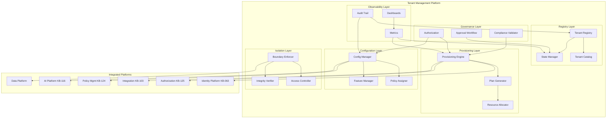
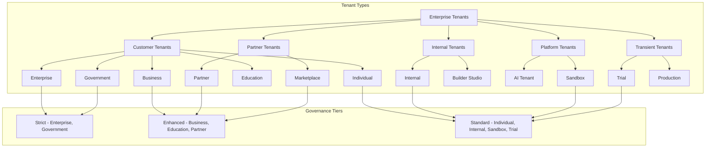
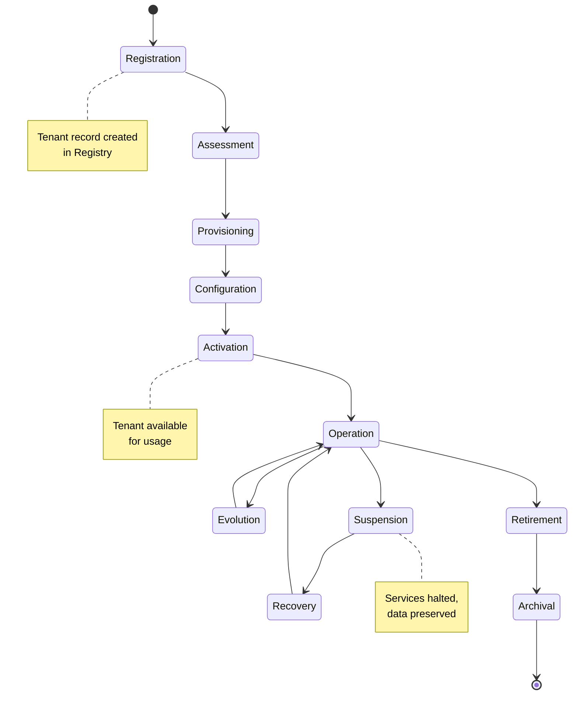
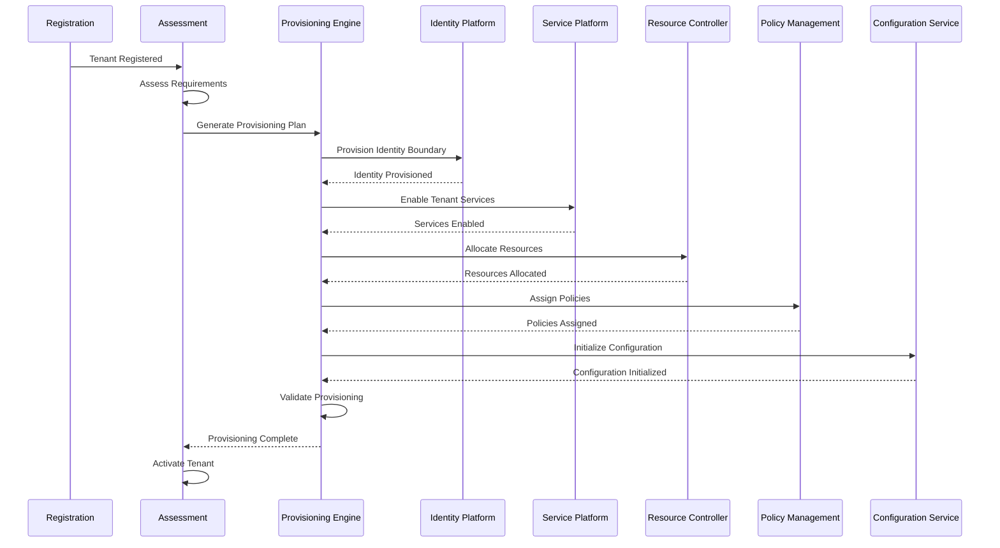
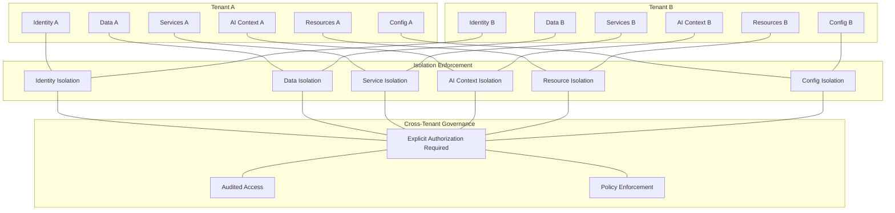
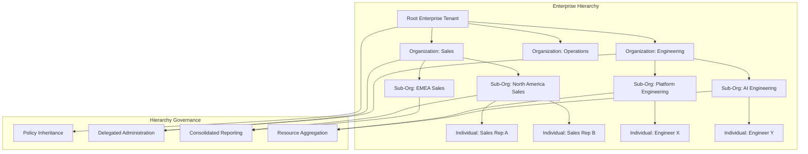
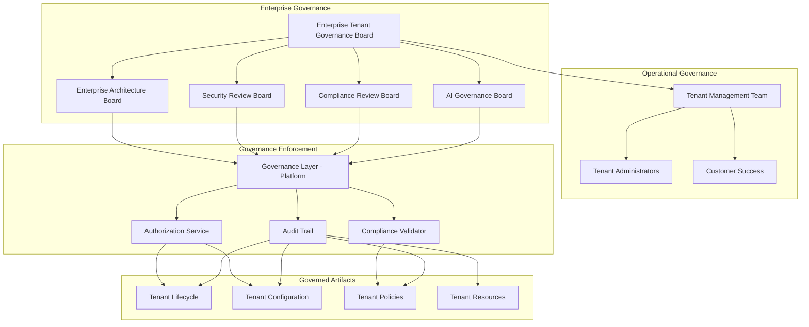
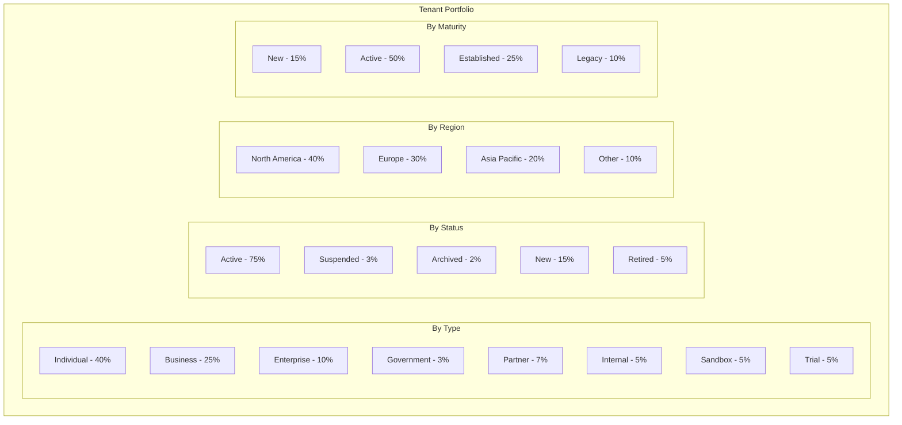
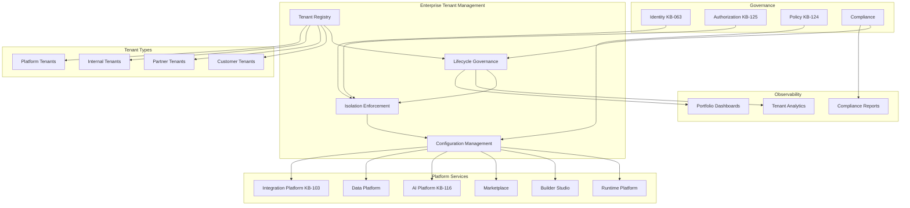

# KB-136 — Enterprise Tenant Management Architecture

---

## Metadata

| Attribute | Value |
|-----------|-------|
| **Document ID** | KB-136 |
| **Title** | Enterprise Tenant Management Architecture |
| **Suite** | Enterprise Platform Services |
| **Version** | 1.0 |
| **Status** | Approved Architecture |
| **Classification** | Enterprise Multi-Tenant Architecture |
| **Date** | 2026-07-12 |
| **Architect** | Enterprise Tenant Management Architecture Builder |

---

## Table of Contents

1. Executive Summary
2. Architectural Principles
3. Canonical Definitions
4. Enterprise Tenant Management Architecture
5. Tenant Taxonomy
6. Tenant Registry
7. Tenant Lifecycle Architecture
8. Tenant Provisioning Architecture
9. Tenant Configuration Architecture
10. Tenant Isolation Architecture
11. Tenant Hierarchy Architecture
12. Enterprise Tenant Operating Model
13. Policy Lifecycle (Tenant)
14. Governance
15. Responsibilities
16. Security
17. Privacy
18. Performance
19. Observability
20. Failure Scenarios
21. Anti-Patterns
22. Future Evolution
23. Cross-References
24. Architecture Diagrams

---

## 1. Executive Summary

The Enterprise Tenant Management Platform is the centralized enterprise capability that governs the complete lifecycle of every tenant across the DUKADESK ecosystem. It provides authoritative mechanisms for tenant registration, provisioning, configuration, isolation, hierarchy management, operational management, monitoring, evolution, suspension, archival, and retirement — independent of any application, service, or business domain.

This architecture establishes tenant management as a foundational enterprise capability. Every tenant — whether an individual user's workspace, a business organization, an enterprise customer, a government entity, a partner system, a Builder Studio project, an AI agent workspace, or an internal team — follows the same governed lifecycle, isolation model, configuration framework, and operational policies.

The Enterprise Tenant Management Platform sits within the Platform Core domain of the Enterprise Platform Services suite (KB-107). It integrates with the Identity Platform for tenant identity boundaries, the Authorization Architecture (KB-125) for tenant-scoped permissions, the Policy Management Platform (KB-124) for tenant policies, the Data Platform for tenant data isolation, the AI Platform for tenant AI context isolation, and the Enterprise Resource Management architecture for tenant resource governance.

Key architectural decisions include:
- **Tenant as first-class entity**: Tenants are not application-level constructs but first-class enterprise entities managed through a dedicated platform.
- **Strong isolation by default**: Every tenant is isolated at the identity, data, service, configuration, AI context, and resource levels. Isolation is architectural, not advisory.
- **Policy-driven configuration**: Tenant configuration is governed by policies, not ad-hoc settings. Configuration changes follow governed lifecycle.
- **Hierarchical tenancy**: Tenants may form parent-child relationships for organizational modeling, delegated administration, and consolidated governance.
- **Lifecycle-governed provisioning**: Every tenant lifecycle transition — from registration through retirement — is governed, audited, and observable.

---

## 2. Architectural Principles

### 2.1 Tenant-First Architecture

Tenants are first-class entities in the enterprise architecture. All platform capabilities — identity, data, services, AI, integrations, operations — are tenant-aware by design.

### 2.2 Strong Tenant Isolation

Tenants are isolated at every architectural layer. One tenant's identity, data, configuration, AI context, resources, and operations are invisible and inaccessible to other tenants unless explicitly authorized through cross-tenant governance.

### 2.3 Centralized Governance

All tenant lifecycle operations are governed through the centralized Tenant Management Platform. No service or application independently manages tenant state outside the governed lifecycle.

### 2.4 Configuration by Policy

Tenant configuration is driven by policies defined in the Policy Management Platform (KB-124). Configuration is not hardcoded, manually set, or application-defined.

### 2.5 Lifecycle by Design

Every tenant progresses through a defined lifecycle with governed transitions. Ad-hoc tenant operations outside the lifecycle are architecturally prohibited.

### 2.6 Zero Trust

Every tenant management operation is authenticated, authorized, and validated. No operation is trusted based on its source, role, or position.

### 2.7 Least Privilege

Tenant administrators access only the tenant management operations and data required for their role and tenant scope. Cross-tenant administration requires explicit governance approval.

### 2.8 Enterprise Scalability

The tenant management platform scales horizontally to support millions of tenants across global regions.

### 2.9 Vendor Independence

Tenant management is independent of any specific infrastructure provider, identity provider, or cloud platform.

### 2.10 Technology Neutrality

The architecture defines canonical models and behaviors without prescribing specific tenant storage, provisioning, or isolation technologies.

### 2.11 AI Readiness

The tenant model supports AI-native tenants: AI agent workspaces, AI model contexts, and AI-driven tenant operations are first-class concepts.

### 2.12 Multi-Region Readiness

Tenant management operates across global regions with data residency, regional isolation, and cross-region governance.

### 2.13 Observability by Default

Every tenant lifecycle operation, configuration change, and governance decision is observable. No tenant operation is invisible.

---

## 3. Canonical Definitions

| Term | Definition |
|------|-----------|
| **Tenant** | A securely isolated entity within the DUKADESK platform that owns identity, data, configuration, policies, resources, and operations within defined boundaries. |
| **Tenant Registry** | The canonical, authoritative inventory of all tenants across the enterprise platform. |
| **Tenant Catalog** | A searchable, browsable interface enabling discovery and governance of registered tenants. |
| **Tenant Profile** | The set of metadata describing a tenant: name, type, owner, status, lifecycle state, region, and contact information. |
| **Tenant Configuration** | The governed set of policies, feature flags, service settings, branding, localization, and operational preferences for a tenant. |
| **Tenant Policy** | A policy that governs tenant behavior, service access, resource limits, compliance requirements, and operational boundaries. |
| **Tenant Context** | The identity, data, policy, and state boundary within which all tenant operations execute. |
| **Tenant Lifecycle** | The complete sequence of states a tenant traverses from registration through retirement. |
| **Tenant Isolation** | The architectural separation that ensures one tenant's resources, data, and operations are inaccessible to other tenants. |
| **Tenant Provisioning** | The governed process of allocating tenant identity, services, resources, policies, and operational boundaries upon tenant creation. |
| **Tenant Administrator** | An authorized user or service that manages tenant configuration, policies, users, and operations within governed scope. |
| **Tenant Ownership** | The assignment of accountability for a tenant's lifecycle, governance compliance, and operational health. |
| **Tenant Hierarchy** | A parent-child relationship structure among tenants that enables organizational modeling and delegated administration. |
| **Tenant Resource** | A platform resource allocated to a tenant: compute, storage, AI capacity, API quota, service instances. |
| **Tenant State** | The current operational status of a tenant: active, suspended, archived, retired. |
| **Tenant Governance** | The framework of policies, roles, approvals, and oversight governing tenant lifecycle and operations. |
| **Tenant Portfolio** | The complete set of tenants managed through the platform, organized by type, status, region, owner, and lifecycle state. |
| **Tenant Metadata** | Structured data describing a tenant: attributes, tags, relationships, configuration, and operational history. |
| **Tenant Boundary** | The logical perimeter that defines what is inside versus outside a tenant for identity, data, services, and operations. |
| **Enterprise Tenant** | A tenant that represents an entire enterprise organization and may contain child tenants. |

---

## 4. Enterprise Tenant Management Architecture

### 4.1 Architectural Layers

The Enterprise Tenant Management Platform comprises six logical layers:

1. **Tenant Registry Layer** — Canonical storage, indexing, and lifecycle state management for all tenants.
2. **Provisioning Layer** — Governed creation and allocation of tenant identity, services, resources, policies, and configuration.
3. **Configuration Layer** — Management of tenant-specific policies, feature flags, service settings, branding, and localization.
4. **Isolation Layer** — Enforcement of tenant boundaries across identity, data, services, AI context, and resources.
5. **Governance Layer** — Authorization, approval workflows, lifecycle governance, compliance validation for all tenant operations.
6. **Observability Layer** — Metrics, audit, monitoring, analytics, and reporting for tenant management operations and portfolio health.

### 4.2 Architectural Flow

```
Tenant Request ──▶ Registration ──▶ Assessment ──▶ Provisioning ──▶ Configuration ──▶ Activation
                                                                                            │
                                                                                            ▼
                                                                                       Operation
                                                                                            │
                                                                                   ┌────────┴────────┐
                                                                                   │                 │
                                                                                   ▼                 ▼
                                                                              Suspension       Evolution
                                                                                   │                 │
                                                                                   └────────┬────────┘
                                                                                            │
                                                                                            ▼
                                                                                       Retirement
                                                                                            │
                                                                                            ▼
                                                                                       Archival
```

### 4.3 Multi-Platform Scope

The Tenant Management Platform governs tenants across all DUKADESK platforms:

- Platform Services (KB-107)
- Runtime Platform
- Builder Studio
- Marketplace
- AI Platform (KB-116)
- Data Platform
- Integration Platform (KB-103)
- Identity Platform (KB-063)

Every tenant has a single unified identity across all platforms, governed by the tenant management platform.

### 4.4 Tenant Boundaries

```
┌────────────────────────────────────────────────────────────────┐
│                      TENANT BOUNDARY                           │
│                                                                │
│  ┌────────────────────────────────────────────────────────┐  │
│  │  Identity Boundary (KB-063)                             │  │
│  │  - Tenant users, roles, groups                          │  │
│  │  - Tenant-specific authentication policies              │  │
│  └────────────────────────────────────────────────────────┘  │
│                                                                │
│  ┌────────────────────────────────────────────────────────┐  │
│  │  Data Boundary (KB-073)                                 │  │
│  │  - Tenant-partitioned storage                           │  │
│  │  - Tenant-specific retention policies                   │  │
│  └────────────────────────────────────────────────────────┘  │
│                                                                │
│  ┌────────────────────────────────────────────────────────┐  │
│  │  Service Boundary                                       │  │
│  │  - Tenant-scoped service instances                      │  │
│  │  - Tenant-specific service configuration                │  │
│  └────────────────────────────────────────────────────────┘  │
│                                                                │
│  ┌────────────────────────────────────────────────────────┐  │
│  │  AI Context Boundary (KB-116)                           │  │
│  │  - Tenant AI agents, models, prompts, memory            │  │
│  │  - Tenant-partitioned AI context                        │  │
│  └────────────────────────────────────────────────────────┘  │
│                                                                │
│  ┌────────────────────────────────────────────────────────┐  │
│  │  Resource Boundary                                      │  │
│  │  - Tenant resource quotas and limits                    │  │
│  │  - Tenant-specific resource allocation                  │  │
│  └────────────────────────────────────────────────────────┘  │
│                                                                │
│  ┌────────────────────────────────────────────────────────┐  │
│  │  Configuration Boundary                                 │  │
│  │  - Tenant policies, feature flags, preferences          │  │
│  │  - Tenant-specific branding and localization            │  │
│  └────────────────────────────────────────────────────────┘  │
└────────────────────────────────────────────────────────────────┘
```

---

## 5. Tenant Taxonomy

### 5.1 Tenant Types

Every tenant is classified by type. The type determines default policies, isolation requirements, provisioning templates, and governance tier.

| Tenant Type | Description | Typical Use Cases |
|-------------|-------------|-------------------|
| **Individual** | A single-user tenant for a personal workspace | Individual developer workspace, personal dashboard, personal AI assistant |
| **Business** | A multi-user tenant representing a business organization | Small business workspace, team collaboration, business analytics |
| **Enterprise** | A large multi-user tenant with complex organizational structure | Enterprise customer workspace, enterprise AI deployment, multi-department operations |
| **Government** | A tenant subject to government-specific compliance and data residency requirements | Government agency workspace, public sector deployment, regulated entity |
| **Education** | A tenant for educational institutions with specific data handling requirements | University workspace, student collaboration platform, educational AI tools |
| **Partner** | A tenant for partner organizations with governed cross-tenant access | Integration partner workspace, marketplace partner, technology partner |
| **Internal** | A DUKADESK internal tenant for platform operations and development | Engineering workspace, QA environment, internal tools, platform administration |
| **Marketplace** | A tenant for marketplace publishers and their assets | Marketplace publisher workspace, app management, marketplace analytics |
| **Builder Studio** | A tenant for Builder Studio development projects | Builder Studio project workspace, component development, automation authoring |
| **AI Tenant** | A tenant for AI agents and AI platform capabilities | AI agent workspace, model training environment, AI evaluation workspace |
| **Sandbox** | An isolated, non-production tenant for testing and evaluation | Developer sandbox, integration testing, proof-of-concept evaluation |
| **Trial** | A time-limited tenant for product evaluation | Customer trial workspace, free tier, evaluation period |
| **Production** | A live production tenant serving real users and workloads | Customer production tenant, live service deployment |

### 5.2 Tenant Maturity Levels

| Level | Description |
|-------|-------------|
| **New** | Tenant recently created, undergoing initial configuration |
| **Active** | Tenant fully operational with regular usage |
| **Established** | Tenant with mature configuration, policies, and operational patterns |
| **Growing** | Tenant expanding in users, services, or resource consumption |
| **Legacy** | Tenant on older platform versions requiring migration |

### 5.3 Tenant Classification Hierarchy

```
Enterprise Tenants
├── Customer Tenants
│   ├── Individual
│   ├── Business
│   ├── Enterprise
│   ├── Government
│   └── Education
├── Partner Tenants
│   ├── Partner
│   └── Marketplace
├── Internal Tenants
│   ├── Internal
│   └── Builder Studio
├── Platform Tenants
│   ├── AI Tenant
│   └── Sandbox
└── Transient Tenants
    ├── Trial
    └── Production
```

---

## 6. Tenant Registry

### 6.1 Purpose

The Tenant Registry is the canonical, authoritative inventory of every tenant across the DUKADESK ecosystem. No tenant may exist — consume services, store data, operate AI capabilities, or interact with any platform component — unless it is registered in the Tenant Registry with complete governance metadata.

### 6.2 Registration Schema

| Field | Description |
|-------|-------------|
| **Tenant ID** | Globally unique identifier for the tenant |
| **Name** | Human-readable tenant name |
| **Type** | Tenant type classification |
| **Owner** | The entity accountable for the tenant |
| **Status** | Active, suspended, archived, retired |
| **Lifecycle State** | Current stage in the tenant lifecycle |
| **Region** | Primary hosting region |
| **Data Residency** | Data residency requirements |
| **Governance Tier** | Standard, enhanced, strict |
| **Parent Tenant** | Parent tenant ID (if hierarchical) |
| **Created At** | Tenant registration timestamp |
| **Activated At** | Tenant activation timestamp |
| **Suspended At** | Most recent suspension timestamp |
| **Retired At** | Tenant retirement timestamp |
| **Contact Information** | Administrative contact |
| **Subscription Reference** | Associated subscription or billing account |
| **Tags** | Custom classification tags |

### 6.3 Registry Operations

- **Registration**: Creating a new tenant record with complete metadata and governance approval.
- **Profile Update**: Updating tenant metadata with versioned change tracking.
- **State Transition**: Moving tenant between lifecycle states (active, suspended, archived, retired).
- **Discovery**: Querying tenants by type, status, region, owner, and metadata.
- **Impact Analysis**: Identifying all platform services, data, and resources associated with a tenant.
- **Lifecycle Management**: Governing tenant lifecycle transitions with automated and manual gates.

---

## 7. Tenant Lifecycle Architecture

### 7.1 Lifecycle Stages

| Stage | Description |
|-------|-------------|
| **Registration** | Tenant record created in the Tenant Registry. Basic metadata captured. Initial governance assessment queued. |
| **Assessment** | Governance review: tenant type validation, compliance requirements identified, resource requirements assessed, provisioning plan created. |
| **Provisioning** | Tenant identity, services, resources, policies, and configuration are allocated according to the provisioning plan. |
| **Configuration** | Tenant-specific policies, feature flags, branding, localization, service settings, and operational preferences are applied. |
| **Activation** | Tenant is activated and available for usage. Users, services, and AI capabilities may begin operations. |
| **Operation** | Tenant operates under governed policies. Monitoring, support, and optimization are continuous. |
| **Evolution** | Tenant evolves through configuration changes, service additions, resource scaling, and policy updates. |
| **Suspension** | Tenant is temporarily suspended due to policy violation, payment issue, or administrative action. Services are halted; data is preserved. |
| **Recovery** | Suspended tenant is restored to active state after issue resolution. |
| **Retirement** | Tenant is permanently retired. Services are decommissioned. Data is archived or deleted per policy. |
| **Archival** | Tenant record and metadata are archived for compliance and historical reference. |

### 7.2 Lifecycle State Transitions

```
Registration ──▶ Assessment ──▶ Provisioning ──▶ Configuration ──▶ Activation ──▶ Operation
                                                                                      │
                                                                                 ┌────┴────┐
                                                                                 │         │
                                                                                 ▼         ▼
                                                                            Evolution  Suspension
                                                                                 │         │
                                                                                 └────┬────┘
                                                                                      │
                                                                                      ▼
                                                                                 Retirement
                                                                                      │
                                                                                      ▼
                                                                                  Archival
```

### 7.3 Lifecycle Governance

- No lifecycle transition occurs without authorization.
- Transitions are recorded in the immutable audit trail.
- Suspension requires governance approval for enhanced-tier tenants.
- Retirement requires verification that all tenant resources are decommissioned.
- Archived tenants may be reactivated only through a new lifecycle.

---

## 8. Tenant Provisioning Architecture

### 8.1 Provisioning Model

Tenant provisioning is the governed process of allocating tenant identity, services, resources, policies, and configuration upon tenant creation. Provisioning follows a plan derived from tenant type, governance tier, and subscription.

### 8.2 Provisioning Stages

| Stage | Description |
|-------|-------------|
| **Plan Generation** | Create provisioning plan based on tenant type, tier, region, and subscription. Plan defines what identity, services, resources, policies, and configuration will be provisioned. |
| **Identity Provisioning** | Create tenant identity boundary in the Identity Platform (KB-063). Provision tenant administrator account. Establish authentication policies. |
| **Service Provisioning** | Enable tenant-accessible services based on subscription and tenant type. Configure service isolation boundaries. |
| **Resource Allocation** | Allocate tenant resource quotas: compute, storage, API capacity, AI capacity, integration capacity. |
| **Policy Assignment** | Apply default tenant policies from Policy Management (KB-124): security policies, compliance policies, operational policies, resource governance policies. |
| **Configuration Initialization** | Apply initial tenant configuration: default feature flags, branding defaults, localization defaults, operational preferences. |
| **Validation** | Verify all provisioned components are correctly configured, isolated, and operational. |

### 8.3 Provisioning Governance

- Provisioning requires authorized approval based on tenant type and governance tier.
- Provisioning operations are fully audited.
- Provisioning failures trigger automated rollback of completed provisioning steps.
- Provisioning templates are versioned and governed by the architecture board.
- Custom provisioning (non-template) requires enhanced governance approval.

---

## 9. Tenant Configuration Architecture

### 9.1 Configuration Model

Tenant configuration governs how a tenant operates within its policies, service access, feature availability, branding, localization, and operational preferences. Configuration is policy-driven, not ad-hoc.

### 9.2 Configuration Domains

| Domain | Description | Examples |
|--------|-------------|---------|
| **Policy Configuration** | Tenant-specific policy settings and overrides | Security policy strength, compliance requirements, data retention periods |
| **Feature Configuration** | Tenant-specific feature availability | Feature flag states, beta feature access, capability enablement |
| **Service Configuration** | Tenant-specific service settings | AI model selection, integration endpoints, service rate limits |
| **Brand Configuration** | Tenant-specific branding | Logo, color scheme, custom domain, email templates |
| **Localization Configuration** | Tenant-specific localization | Default language, date/time format, currency, regional settings |
| **Operational Configuration** | Tenant-specific operational preferences | Notification preferences, audit level, backup schedule, maintenance window |
| **Access Configuration** | Tenant-specific access control | SSO configuration, identity provider settings, MFA policy |
| **Resource Configuration** | Tenant-specific resource limits | Compute quota, storage limit, API rate limit, AI capacity |

### 9.3 Configuration Governance

- Configuration changes follow a governed lifecycle: proposal, review, approval, deployment, validation.
- Configuration changes are versioned and auditable.
- Enterprise-wide configuration defaults apply to all tenants unless explicitly overridden.
- Tenant configuration overrides are governed by enterprise policy; certain settings may be non-overridable.
- Configuration drift from enterprise defaults is monitored and reported.

---

## 10. Tenant Isolation Architecture

### 10.1 Isolation Model

Tenant isolation ensures that one tenant's identity, data, services, AI context, resources, configuration, and operations are inaccessible to other tenants. Isolation is enforced at every architectural layer.

### 10.2 Isolation Domains

| Domain | Isolation Mechanism | Description |
|--------|-------------------|-------------|
| **Identity** | Tenant-partitioned identity store | Users, roles, and groups are scoped to tenant. Authentication verifies tenant context. |
| **Data** | Tenant-partitioned data storage | Data is stored with tenant ID. Queries enforce tenant filtering. Cross-tenant data access is prohibited by default. |
| **Services** | Tenant-scoped service instances | Service instances operate within tenant context. Service requests include tenant ID for isolation enforcement. |
| **AI Context** | Tenant-partitioned AI state | AI agents, conversations, prompts, models, and memory are partitioned by tenant. |
| **Resources** | Tenant-specific resource quotas | Resource consumption is tracked per tenant. Quotas prevent cross-tenant resource starvation. |
| **Configuration** | Tenant-scoped configuration | Configuration changes apply only to the target tenant. Configuration drift is tenant-specific. |
| **Operations** | Tenant-partitioned operations | Operational metrics, audit trails, and monitoring data are partitioned by tenant. |
| **Network** | Tenant-aware network policies | Network traffic is isolated per tenant. Cross-tenant network access requires explicit policy. |

### 10.3 Isolation Levels

| Level | Description | Enforcement |
|-------|-------------|-------------|
| **Strict** | Full isolation at all layers. No cross-tenant access without explicit governance approval. | Enterprise, Government, Partner tenants |
| **Standard** | Strong isolation with governed cross-tenant collaboration capabilities. | Business, Education, Marketplace tenants |
| **Basic** | Standard isolation with relaxed cross-tenant visibility for internal platform operations. | Internal, Sandbox, Trial tenants |

### 10.4 Cross-Tenant Access

- Cross-tenant access is prohibited by default.
- Cross-tenant access is governed by explicit policies approved by both tenants' administrators.
- Cross-tenant access is audited with enhanced detail.
- Cross-tenant access may be revoked by either tenant at any time.

### 10.5 Isolation Verification

- Isolation is continuously verified through automated compliance checks.
- Isolation breaches are detected and trigger automatic containment.
- Isolation verification results are reported in tenant governance dashboards.
- Periodic isolation audits confirm isolation integrity.

---

## 11. Tenant Hierarchy Architecture

### 11.1 Hierarchy Model

Tenants may form parent-child relationships that enable organizational modeling, consolidated governance, delegated administration, and hierarchical policy inheritance.

### 11.2 Hierarchy Levels

| Level | Description | Example |
|-------|-------------|---------|
| **Root Enterprise Tenant** | Top-level tenant representing the entire enterprise | Enterprise customer with multiple departments |
| **Organization Tenant** | Mid-level tenant representing a business unit or department | Sales department, Engineering division |
| **Sub-Organization Tenant** | Lower-level tenant representing a team or project | Product team, Regional office |
| **Individual Tenant** | Leaf-level tenant representing a single user or workspace | Personal workspace, Developer sandbox |

### 11.3 Hierarchy Operations

- **Parent assignment**: A tenant is assigned a parent during provisioning or restructuring.
- **Child discovery**: Parent tenants may discover and manage child tenants within governance scope.
- **Policy inheritance**: Policies may flow from parent to child tenants with override capability.
- **Consolidated administration**: Parent administrators may manage child tenant configuration within governance scope.
- **Resource aggregation**: Resource usage may be aggregated across tenant hierarchies for consolidated reporting and billing.
- **Hierarchy restructuring**: Tenant parents may be reassigned with governance approval.

### 11.4 Hierarchy Governance

- Hierarchy depth is bounded by governance policy.
- Cross-hierarchy tenant visibility is governed by policy.
- Parent tenants may not access child tenant data without explicit authorization.
- Policy inheritance rules are defined at the enterprise level and may not be weakened by parent tenants.
- Hierarchy changes require governance approval.

---

## 12. Enterprise Tenant Operating Model

### 12.1 Operating Model Overview

The Enterprise Tenant Operating Model describes how tenant management interacts with every other platform capability to govern the complete tenant lifecycle.

### 12.2 Platform Interactions

| Platform | Interaction |
|----------|-------------|
| **Identity Platform (KB-063)** | Tenant identity boundary creation, administrator provisioning, authentication policy assignment |
| **Authorization Architecture (KB-125)** | Tenant-scoped authorization policies, role assignment within tenant boundary |
| **Policy Management (KB-124)** | Tenant policy assignment, policy inheritance, tenant-specific policy overrides |
| **AI Platform (KB-116)** | Tenant AI context creation, AI agent tenant isolation, AI model tenant scoping |
| **Data Platform** | Tenant data partitioning, data retention policy enforcement, data isolation verification |
| **Integration Platform (KB-103)** | Tenant-specific integration endpoints, cross-tenant integration governance |
| **Subscription & Billing** | Tenant subscription association, resource consumption tracking, billing integration |
| **Audit & Compliance** | Tenant-level audit trails, compliance monitoring, regulatory reporting |
| **Marketplace** | Marketplace publisher tenant management, marketplace asset tenant scoping |
| **Builder Studio** | Builder Studio project tenant isolation, development environment tenant scoping |

### 12.3 Administrative Model

| Role | Scope | Responsibilities |
|------|-------|-----------------|
| **Enterprise Tenant Administrator** | Enterprise-wide | Manage enterprise tenant hierarchy, configure enterprise-wide policies, oversee tenant portfolio |
| **Tenant Administrator** | Single tenant | Manage tenant configuration, users, policies, resources, and operations within tenant scope |
| **Delegated Administrator** | Subset of tenant capabilities | Manage specific tenant domains (users, billing, security, AI) within tenant scope |
| **Self-Service User** | Own profile and workspace | Manage personal preferences, workspace configuration, personal AI settings |

### 12.4 Multi-Region Operations

- Tenants are associated with a primary region for data residency.
- Tenant data and operations are processed in the tenant's primary region.
- Cross-region tenant operations are governed by data residency policies.
- Tenant migration between regions is a governed lifecycle operation.

---

## 13. Governance

### 13.1 Governance Bodies

| Body | Responsibility |
|------|---------------|
| **Enterprise Tenant Governance Board** | Highest authority for tenant management. Approves tenant lifecycle policies, sets governance standards, oversees tenant portfolio. |
| **Enterprise Architecture Board** | Reviews tenant management architecture, isolation model, and hierarchy model for architectural alignment. |
| **Security Review Board** | Reviews tenant isolation architecture, cross-tenant access policies, and tenant security model. |
| **Compliance Review Board** | Ensures tenant management complies with regulatory requirements for data residency, privacy, and multi-tenant governance. |
| **AI Governance Board** | Oversees AI tenant isolation, AI agent tenant boundaries, and tenant-specific AI governance. |

### 13.2 Governance Domains

| Domain | Description |
|--------|-------------|
| **Tenant Ownership** | Every tenant has a designated owner accountable for lifecycle, governance compliance, and operational health. |
| **Tenant Administration** | Tenant administrators are authorized and governed. Administrative actions are audited. |
| **Configuration Governance** | Tenant configuration changes follow governed lifecycle. Configuration is versioned and auditable. |
| **Security Governance** | Tenant isolation integrity, access control, and security policies are continuously validated. |
| **Compliance Governance** | Tenant operations comply with regulatory requirements. Compliance is validated per tenant. |
| **AI Governance** | AI tenant operations follow AI governance policies. AI tenant boundaries are enforced. |
| **Lifecycle Governance** | Lifecycle transitions follow defined workflows and approval gates. |
| **Policy Governance** | Tenant policies are governed through the Policy Management Platform (KB-124). |
| **Resource Governance** | Tenant resource allocation, consumption, and limits are governed by policy. |
| **Enterprise Governance** | The complete tenant portfolio is governed for strategic alignment, health, and growth. |

### 13.3 Governance Enforcement

- Governance rules are encoded in the Governance Layer of the Tenant Management Platform.
- Automated governance checks run on every tenant operation: registration, provisioning, configuration change, lifecycle transition.
- Governance violations block operations until remediation.
- Governance dashboards provide real-time visibility into tenant governance health.
- Tenant governance compliance is reported in enterprise governance reporting.

---

## 14. Responsibilities

| Role | Responsibilities |
|------|-----------------|
| **Enterprise Architecture** | Define tenant management architecture, principles, and standards. Govern isolation model and hierarchy model. |
| **Tenant Management Team** | Implement and operate the Tenant Management Platform. Govern tenant lifecycle operations and tenant portfolio. |
| **Platform Engineering** | Implement tenant isolation infrastructure, provisioning automation, and configuration management. |
| **Operations** | Monitor tenant health, lifecycle operations, and portfolio metrics. Respond to tenant incidents. |
| **Security** | Define tenant isolation security policies. Review cross-tenant access. Monitor tenant security boundaries. |
| **Compliance** | Define compliance requirements for tenant management. Review tenant operations for regulatory compliance. |
| **AI Governance Board** | Govern AI tenant isolation and AI-specific tenant policies. |
| **Customer Success** | Guide tenants through onboarding, growth, and lifecycle management. Support tenant administrators. |
| **Tenant Administrators** | Manage tenant configuration, users, policies, and operations within governed scope. |
| **Executive Governance** | Provide strategic oversight of tenant portfolio. Approve enterprise-wide tenant policies. |

---

## 15. Security

### 15.1 Tenant Isolation

- Tenant isolation is enforced at the identity, data, service, AI, resource, configuration, and network layers.
- Isolation is verified continuously through automated compliance checks.
- Isolation breaches trigger automatic containment and security incident response.
- Isolation architecture is reviewed by the Security Review Board.

### 15.2 Identity-Aware Management

- All tenant management operations are authenticated and authorized per tenant context.
- Tenant administrators are authenticated by the Identity Platform and authorized per tenant scope.
- Cross-tenant administrative operations require explicit cross-tenant authorization.

### 15.3 Secure Provisioning

- Provisioning operations are authorized based on tenant type and governance tier.
- Provisioning credentials are securely managed through Secrets Management (KB-099).
- Provisioning audit trail records every operation with actor, timestamp, and outcome.

### 15.4 Least Privilege

- Tenant administrators access only the tenants and operations authorized for their role.
- Cross-tenant visibility is prohibited by default; explicit authorization is required.
- Tenant management API operations are granularly authorized.

### 15.5 Boundary Integrity

- Tenant boundaries are continuously monitored for integrity.
- Boundary violations are detected and contained automatically.
- Boundary integrity is verified during every lifecycle transition.

---

## 16. Privacy

### 16.1 Tenant Privacy

- Tenant data is isolated and accessible only within the tenant boundary.
- Tenant configuration and metadata are private to the tenant.
- Cross-tenant data access requires explicit governance approval.

### 16.2 Data Residency

- Tenants are associated with a primary data residency region.
- Tenant data is stored and processed within the designated region.
- Cross-region tenant operations are governed by data transfer policies.
- Tenant migration between regions is a governed lifecycle operation.

### 16.3 Regulatory Compliance

- Tenant management complies with regulatory requirements for multi-tenant isolation (GDPR, CCPA, HIPAA, SOC 2).
- Tenant data retention policies comply with regulatory requirements.
- Tenant audit trails are retained per compliance requirements.

### 16.4 Cross-Border Governance

- Cross-border tenant operations are governed by data transfer agreements.
- Regional tenant policies are managed through the Policy Management Platform.
- Tenant data export is governed by policy and requires authorization.

### 16.5 Data Minimization

- Tenant metadata collection is limited to what is required for tenant management operations.
- Tenant configuration data is retained only as long as required for operational and compliance purposes.
- Tenant audit data is retained per compliance policy and then anonymized or deleted.

---

## 17. Performance

| Metric | Target |
|--------|--------|
| **Tenant registration latency** | < 2s P99 |
| **Tenant provisioning latency** | < 30s P99 (automated provisioning) |
| **Tenant lookup latency** | < 20ms P99 |
| **Tenant configuration deployment** | < 5s P99 |
| **Tenant lifecycle transition** | < 10s P99 |
| **Concurrent tenant operations** | 1,000+ operations/second per region |
| **Tenant registry scale** | 10M+ tenants per region |

### 17.1 Enterprise-Scale Tenant Operations

- Tenant registry scales horizontally with tenant volume.
- Tenant lookup is optimized through caching and indexing.
- Tenant provisioning is parallelized for batch operations.
- Tenant configuration deployment uses event-driven distribution.

### 17.2 Elastic Scalability

- Tenant management platform scales elastically with tenant creation and operation volume.
- Provisioning capacity scales independently of tenant registry operations.
- Configuration deployment scales with tenant configuration change volume.

### 17.3 High Availability

- Tenant Management Platform is deployed in active-active configuration across availability zones.
- Tenant registry data is replicated across zones.
- Tenant operations continue during planned maintenance through rolling updates.

---

## 18. Observability

| Metric | Description |
|--------|-------------|
| **Tenant Count** | Total number of tenants by type, status, region, and lifecycle stage |
| **Tenant Creation Rate** | Number of new tenants per time period |
| **Provisioning Success Rate** | Percentage of provisioning operations completed successfully |
| **Provisioning Latency** | Time from registration to activation |
| **Lifecycle Transition Volume** | Number of lifecycle transitions per time period |
| **Configuration Change Volume** | Number of tenant configuration changes per time period |
| **Tenant Health Score** | Composite health score per tenant based on operational metrics |
| **Tenant Suspension Rate** | Percentage of tenants suspended per time period |
| **Tenant Churn Rate** | Percentage of tenants retired per time period |

### 18.1 Tenant Health

- Tenant health monitoring covers: service availability, resource usage, configuration compliance, isolation integrity.
- Tenant health scores are computed from operational metrics.
- Degraded tenants are flagged for proactive support.
- Tenant health trends are reported in portfolio dashboards.

### 18.2 Lifecycle Analytics

- Tenant lifecycle stage distribution by type and region.
- Time-in-stage analytics for lifecycle bottleneck identification.
- Provisioning funnel analysis: registration → assessment → provisioning → activation conversion rates.
- Tenant evolution patterns: growth, stagnation, decline.

### 18.3 Governance Dashboards

- Tenant governance compliance by governance domain.
- Tenant operations requiring attention: pending approvals, configuration drift, isolation violations.
- Governance violation trends and resolution time.
- Tenant portfolio health overview for executive governance.

### 18.4 Portfolio Analytics

- Tenant portfolio growth trends.
- Tenant distribution by type, region, maturity, and lifecycle stage.
- Tenant resource consumption trends for capacity planning.
- Tenant revenue and value analytics (where applicable).

---

## 19. Failure Scenarios

### 19.1 Provisioning Failures

| Scenario | Architecture Mitigation |
|----------|------------------------|
| Identity provisioning fails | Tenant registration is rolled back. Error is logged with full context. Operations team is alerted. |
| Service provisioning partially fails | Provisioned services are rolled back. Tenant remains in assessment state for retry. |
| Resource allocation exceeds capacity | Provisioning is queued pending resource availability. Tenant is notified of provisioning delay. |
| Provisioning template incompatible with tenant type | Provisioning plan validation catches incompatibility. Alternative template is suggested. |

### 19.2 Configuration Inconsistencies

| Scenario | Architecture Mitigation |
|----------|------------------------|
| Tenant configuration conflicts with enterprise policy | Policy validation during configuration prevents conflicts. Configuration change is rejected with explanation. |
| Configuration change partially deployed | Change is rolled back to last consistent state. Partial deployment is detected and reported. |
| Configuration drift detected from enterprise baseline | Drift is reported in governance dashboard. Automated remediation may be applied for non-critical drifts. |
| Configuration version mismatch across services | Configuration distribution ensures version consistency. Version mismatch is detected and reconciled. |

### 19.3 Isolation Failures

| Scenario | Architecture Mitigation |
|----------|------------------------|
| Cross-tenant data access detected | Isolation breach is contained immediately. Affected tenants are notified. Security incident is triggered. |
| Tenant boundary weakened due to misconfiguration | Boundary integrity verification detects weakening. Configuration is reverted. Governance body is notified. |
| Tenant context leaked to another tenant | Context leakage is detected and contained. Affected tenants are notified. Isolation audit is triggered. |
| Cross-tenant network path discovered | Network isolation policies are enforced. Network path is blocked. Security team is alerted. |

### 19.4 Cross-Tenant Access

| Scenario | Architecture Mitigation |
|----------|------------------------|
| Unauthorized cross-tenant access attempted | Authorization check blocks access. Attempt is logged and escalated. |
| Cross-tenant access policy violated | Policy violation is detected and access is revoked. Both tenant administrators are notified. |
| Cross-tenant access credentials compromised | Credentials are revoked. Cross-tenant access is suspended pending investigation. |
| Cross-tenant data transfer exceeds authorized scope | Data transfer governance detects scope violation. Transfer is blocked. Governance body is notified. |

### 19.5 Resource Allocation Failures

| Scenario | Architecture Mitigation |
|----------|------------------------|
| Tenant exceeds resource quota | Resource governance enforces quota. Tenant is notified. Automated scaling may increase quota within policy. |
| Resource allocation conflicts across tenants | Resource governance resolves conflicts based on priority policies. Conflict is logged for review. |
| Tenant resource consumption anomaly detected | Anomaly detection alerts operations. Tenant administrator is notified. Automated remediation may be applied. |
| Resource rebalancing fails during scaling | Rebalancing is rolled back. Original allocation is preserved. Operations team is alerted. |

### 19.6 Tenant Corruption

| Scenario | Architecture Mitigation |
|----------|------------------------|
| Tenant metadata corrupted | Metadata is recovered from backup. Corruption is investigated. |
| Tenant configuration corrupted | Configuration is restored from last valid version. Configuration change history enables recovery. |
| Tenant registry index corrupted | Index is rebuilt from tenant records. Read operations continue with degraded lookup during rebuild. |
| Tenant relationship data corrupted | Relationship data is recovered from backup. Hierarchy integrity is verified. |

### 19.7 Lifecycle Failures

| Scenario | Architecture Mitigation |
|----------|------------------------|
| Tenant activation fails after provisioning | Tenant remains in provisioning state. Activation is retried. Operations are alerted after max retries. |
| Tenant suspension fails to halt services | Force suspension is triggered. Services are isolated at infrastructure level. |
| Tenant retirement fails to decommission resources | Resource decommissioning is retried. Unreleased resources are flagged for manual intervention. |
| Tenant recovery from suspension fails | Recovery is retried. If recovery fails, tenant remains suspended and operations team is alerted. |

### 19.8 Governance Violations

| Scenario | Architecture Mitigation |
|----------|------------------------|
| Tenant created without governance approval | Governance validation blocks creation. Unauthorized creation attempt is logged and escalated. |
| Tenant configuration changed without authorization | Authorization check blocks change. Attempt is logged and governance body is notified. |
| Tenant lifecycle transition performed without authorization | Authorization check blocks transition. Attempt is logged and escalated. |
| Governance policy bypass attempted | Bypass attempt is detected and blocked. Security incident is triggered. |

### 19.9 Recovery Failures

| Scenario | Architecture Mitigation |
|----------|------------------------|
| Tenant management platform unavailable | Read-only tenant operations continue via cached data. Write operations are queued. |
| Tenant registry data loss | Point-in-time recovery from backup. Data loss window is minimized through continuous replication. |
| Tenant configuration store unavailable | Cached configuration is used for tenant operations. Configuration changes are queued. |
| Tenant isolation enforcement fails open | Fail-closed: tenant operations are blocked until isolation enforcement is restored. |

### 19.10 Administrative Failures

| Scenario | Architecture Mitigation |
|----------|------------------------|
| Tenant administrator locked out | Escalation path enables tenant owner or enterprise administrator to restore access. |
| Tenant administrator actions impact other tenants | Authorization scope enforcement prevents cross-tenant administrative impact. |
| Delegated administrator exceeds authorized scope | Scope enforcement blocks out-of-scope operations. Violation is logged and governance body is notified. |
| Administrative credentials compromised | Credentials are revoked. Tenant administrative operations are suspended pending investigation. |

### 19.11 Synchronization Failures

| Scenario | Architecture Mitigation |
|----------|------------------------|
| Tenant data out of sync across regions | Regional synchronization ensures eventual consistency. Synchronization lag is monitored. |
| Tenant configuration not propagated to all services | Configuration distribution retries until all services acknowledge. Distribution health is monitored. |
| Tenant state inconsistent between registry and services | State reconciliation process detects and resolves inconsistencies. |
| Tenant hierarchy not reflected in authorization | Authorization propagation ensures hierarchy changes are reflected in permission evaluation. |

### 19.12 Policy Conflicts

| Scenario | Architecture Mitigation |
|----------|------------------------|
| Tenant policy contradicts enterprise policy | Policy validation during assignment detects conflict. Enterprise policy takes precedence. |
| Inherited policy conflicts with tenant-specific policy | Policy resolution rules (more specific wins unless enterprise policy is non-overridable) resolve conflicts. |
| Cross-tenant policy assignment creates inconsistency | Cross-tenant policy validation ensures consistency. Inconsistencies are flagged for governance review. |
| Policy change impacts multiple tenants unexpectedly | Impact analysis during policy change identifies affected tenants. Change is flagged for review. |

---

## 20. Anti-Patterns

| # | Anti-Pattern | Description | Prohibited Rationale |
|---|--------------|-------------|---------------------|
| 1 | **Application-Owned Tenant Management** | Individual applications manage tenant lifecycle independently outside the centralized platform. | Ungoverned tenant lifecycle. Duplicate tenant records. Inconsistent lifecycle policies. No enterprise tenant visibility. |
| 2 | **Weak Tenant Isolation** | Tenants share identity, data, or service boundaries without explicit isolation mechanisms. | Security and compliance violations. Cross-tenant data leakage. Inability to meet regulatory requirements. |
| 3 | **Hardcoded Tenant Configuration** | Tenant-specific settings embedded in application code or configuration files instead of governed tenant configuration. | Configuration changes require application deployment. No configuration versioning. No governance. |
| 4 | **Duplicate Tenant Registries** | Multiple independent tenant registries across different platform services. | No single source of truth. Tenant identity fragmentation. Cross-service tenant management impossible. |
| 5 | **Manual Tenant Provisioning** | Tenants provisioned through manual processes (tickets, scripts, direct database operations) instead of automated provisioning. | Inconsistent provisioning. No audit trail. Human error risk. Not scalable. |
| 6 | **Cross-Tenant Resource Sharing Without Governance** | Resources shared across tenants without explicit policy, authorization, or audit. | Security risk. No accountability. Resource allocation cannot be governed. |
| 7 | **Tenant-Specific Application Forks** | Application code forked per tenant instead of using tenant-aware configuration. | Unsustainable maintenance. Inconsistent behavior. No enterprise-wide governance. |
| 8 | **Hidden Tenants** | Tenants that exist in platform services without being registered in the Tenant Registry. | Ungoverned tenants. Security blind spot. No lifecycle management. Compliance violation. |
| 9 | **Tenant Lifecycle Outside Governance** | Tenant creation, suspension, or retirement performed without governance authorization. | Ungoverned lifecycle operations. Audit gaps. Compliance and security violations. |
| 10 | **Unregistered Enterprise Tenants** | Enterprise tenants operating on the platform without being registered in the canonical Tenant Registry. | No enterprise visibility. No governance. Security and compliance risk. |

---

## 21. Future Evolution

| Evolution Path | Description |
|----------------|-------------|
| **Autonomous Tenant Provisioning** | Tenants are provisioned autonomously based on subscription and governance policies. AI-driven provisioning optimization reduces time-to-activation. |
| **AI-Assisted Tenant Governance** | AI assists tenant governance: predictive compliance monitoring, anomaly detection in tenant behavior, automated policy recommendations, proactive lifecycle management. |
| **Predictive Tenant Health** | Tenant health is predicted using machine learning models. Proactive interventions prevent tenant degradation before it occurs. |
| **Federated Tenant Ecosystems** | Tenant management federates across organizational boundaries, enabling governed tenant relationships between enterprises, partners, and ecosystems. |
| **Intelligent Tenant Optimization** | Tenant resource allocation, configuration, and policies are optimized using AI based on usage patterns, growth trends, and business value. |
| **Cross-Platform Tenant Federation** | Tenants are federated across multiple DUKADESK platform deployments, enabling consistent multi-tenant governance across distributed platform instances. |
| **Adaptive Enterprise Tenancy** | Tenant models adapt dynamically to changing business requirements, regulatory landscapes, and technology capabilities without requiring tenant migration. |
| **Enterprise Tenant Intelligence** | The tenant management platform evolves into an enterprise tenant intelligence system providing predictive insights, portfolio optimization, and autonomous governance recommendations. |

---

## 22. Cross-References

| KB | Document | Relationship |
|----|----------|--------------|
| KB-083 | Data Synchronization Architecture | Tenant data synchronization across regions and services is governed by the data synchronization architecture. |
| KB-086 | Data Privacy & Compliance Architecture | Tenant data privacy and compliance requirements are enforced through the data privacy architecture. |
| KB-092 | Data Federation Architecture | Tenant data federation across platforms is governed by the data federation architecture. |
| KB-099 | Secrets & Credential Management Architecture | Tenant provisioning credentials and service secrets are managed through secrets management. |
| KB-107 | Enterprise Platform Services Overview Architecture | The Tenant Management Platform is a Platform Core service within the Enterprise Platform Services suite. This architecture inherits principles and multi-tenant architecture from KB-107. |
| KB-123 | Enterprise Policy Framework Architecture | Tenant policies are defined within the enterprise policy framework and managed through the Policy Management Platform. |
| KB-124 | Policy Management Architecture | Tenant policies are managed through the Policy Management Platform. Policy distribution governs tenant configuration. |
| KB-125 | Authorization Architecture | Tenant-scoped authorization is enforced through the Authorization Architecture. Cross-tenant access is authorized through governed policies. |
| KB-129 | Feature Flag & Configuration Architecture | Tenant-specific feature flags and configuration are managed through the feature flag and configuration architecture. |
| KB-130 | Enterprise Risk Management Architecture | Tenant risk assessments inform tenant lifecycle and governance decisions. |
| KB-140 | Enterprise Platform Services Reference Architecture | The Tenant Management Platform is referenced as a platform service in the enterprise reference architecture. |

---

## 23. Architecture Diagrams

### 23.1 Enterprise Tenant Management Architecture



### 23.2 Tenant Taxonomy



### 23.3 Tenant Lifecycle



### 23.4 Tenant Provisioning Architecture



### 23.5 Tenant Isolation Model



### 23.6 Tenant Hierarchy Architecture



### 23.7 Tenant Governance Structure



### 23.8 Enterprise Tenant Operating Model

```mermaid
graph TB
    subgraph "Tenant Management Platform"
        A[Tenant Registry]
        B[Provisioning]
        C[Configuration]
        D[Isolation]
    end

    subgraph "Platform Interactions"
        E[Identity Platform KB-063]
        F[Authorization KB-125]
        G[Policy Mgmt KB-124]
        H[AI Platform KB-116]
        I[Data Platform]
        J[Integration Platform KB-103]
        K[Subscription & Billing]
        L[Audit & Compliance]
        M[Marketplace]
        N[Builder Studio]
    end

    A --> E
    B --> E
    B --> F
    C --> G
    C --> H
    D --> I
    B --> J
    A --> K
    C --> L
    B --> M
    D --> N

    subgraph "Tenant Lifecycle"
        O[Registration]
        P[Provisioning]
        Q[Operation]
        R[Suspension]
        S[Retirement]
    end

    A --> O
    B --> P
    C --> Q
    D --> R
    A --> S
```



### 23.9 Tenant Portfolio Architecture



### 23.10 Enterprise Multi-Tenant Ecosystem



---

## References

- DUKADESK Enterprise Platform Services Architecture (KB-107)
- DUKADESK Enterprise Policy Framework Architecture (KB-123)
- DUKADESK Policy Management Architecture (KB-124)
- DUKADESK Authorization Architecture (KB-125)
- DUKADESK Identity Platform Architecture (KB-063)
- DUKADESK AI Platform Architecture (KB-116)
- DUKADESK Data Privacy & Compliance Architecture (KB-086)
- DUKADESK Integration Policy Architecture (KB-098)
- DUKADESK Enterprise Risk Management Architecture (KB-130)
- DUKADESK Enterprise Platform Services Reference Architecture (KB-140)
