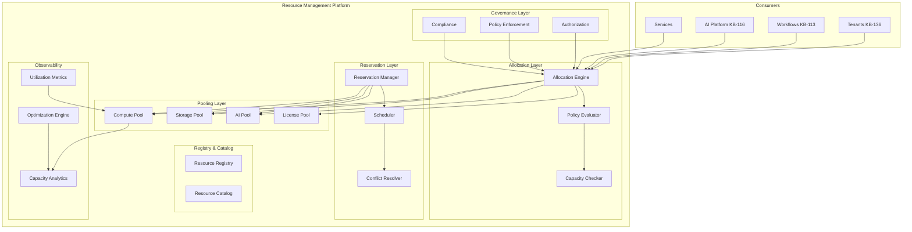
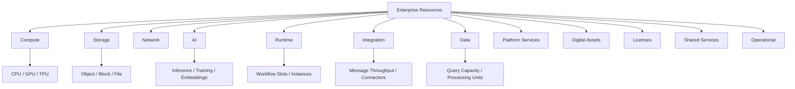
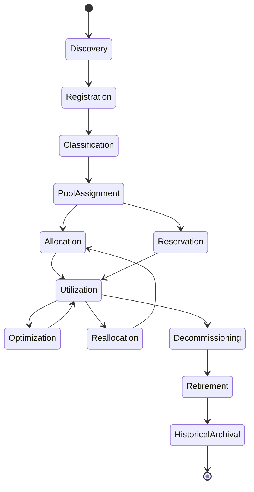
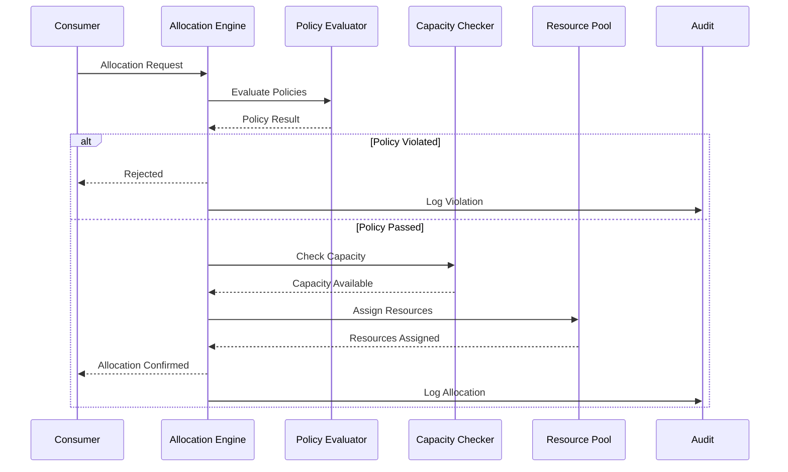
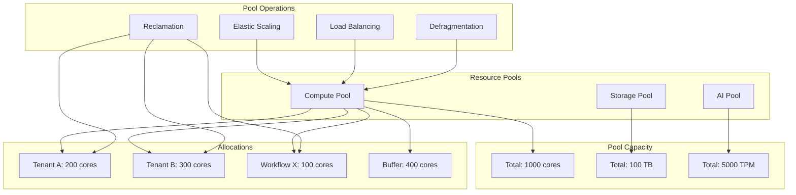
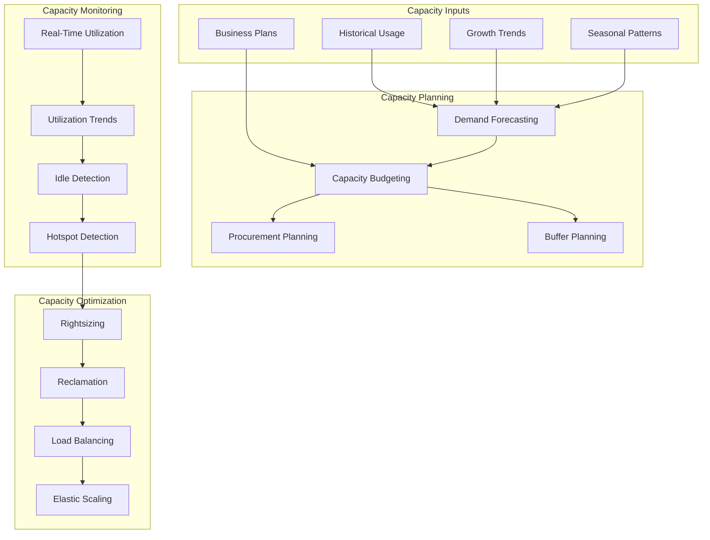
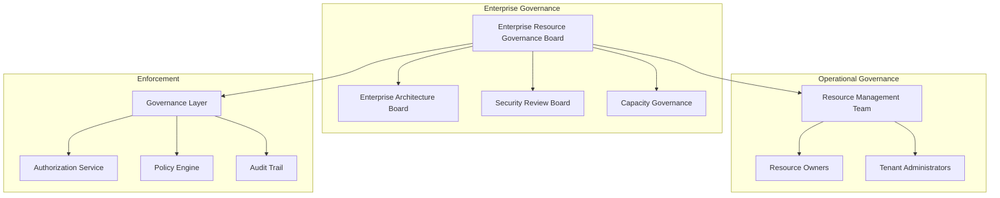
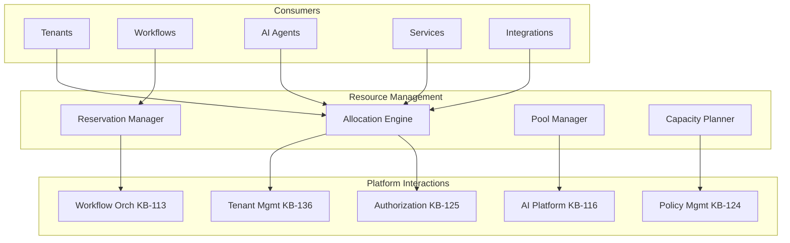
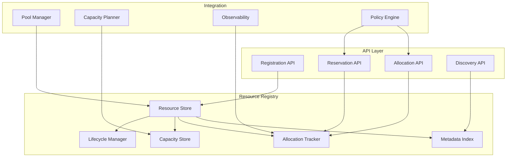
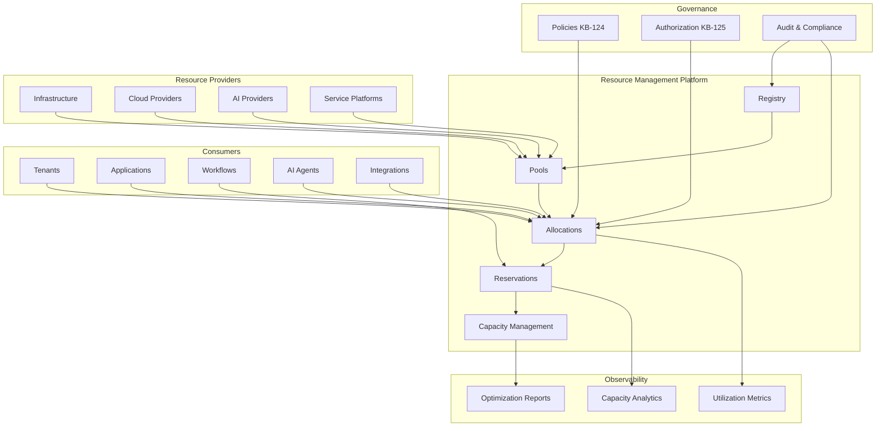

# KB-137 — Enterprise Resource Management Architecture

---

## Metadata

| Attribute | Value |
|-----------|-------|
| **Document ID** | KB-137 |
| **Title** | Enterprise Resource Management Architecture |
| **Suite** | Enterprise Platform Services |
| **Version** | 1.0 |
| **Status** | Approved Architecture |
| **Classification** | Enterprise Resource Services Architecture |
| **Date** | 2026-07-12 |
| **Architect** | Enterprise Resource Management Architecture Builder |

---

## Table of Contents

1. Executive Summary
2. Architectural Principles
3. Canonical Definitions
4. Enterprise Resource Management Architecture
5. Resource Taxonomy
6. Resource Registry
7. Resource Catalog
8. Resource Allocation Architecture
9. Resource Reservation Architecture
10. Resource Pooling Architecture
11. Capacity Management Architecture
12. Resource Lifecycle Architecture
13. Enterprise Resource Operating Model
14. Governance
15. Responsibilities
16. Security
17. Privacy
18. Performance
19. Observability
20. Failure Scenarios
21. Anti-Patterns
22. Future Evolution
23. Cross-References
24. Architecture Diagrams

---

## 1. Executive Summary

The Enterprise Resource Management Platform is the centralized enterprise capability that governs the complete lifecycle of every resource across the DUKADESK ecosystem. It provides authoritative mechanisms for discovering, registering, classifying, allocating, reserving, pooling, monitoring, optimizing, reclaiming, and retiring enterprise resources — independent of any consuming application, service, or infrastructure technology.

This architecture establishes resource management as a foundational enterprise capability. Every resource — whether compute, storage, network, AI capacity, runtime capacity, integration capacity, data capacity, platform service capacity, digital asset, license, or shared service — follows the same governed lifecycle, allocation model, and operational policies.

The Enterprise Resource Management Platform sits within the Operations Domain of the Enterprise Platform Services suite (KB-107). It integrates with Tenant Management (KB-136) for tenant resource allocation, Workflow Orchestration (KB-113) for resource-aware workflow execution, Policy Management (KB-124) for resource governance policies, and Capacity Management for enterprise-wide capacity planning.

Key architectural decisions include:
- **Resources as enterprise assets**: Resources are governed enterprise assets, not infrastructure implementation details. They are registered, classified, and managed independently of their physical manifestation.
- **Policy-driven allocation**: Resource allocation is governed by policies, not hardcoded limits. Policies define allocation rules, priority, quotas, and optimization strategies.
- **Centralized resource pools**: Resources are organized into logical pools that enable elasticity, optimization, and governance. Pools abstract physical resource details.
- **Tenant-aware resource governance**: Resource allocation is tenant-aware. Each tenant operates within its allocated resource boundaries, governed by tenant-specific policies.
- **Lifecycle-governed resources**: Every resource progresses through a defined lifecycle from discovery through retirement. Resource operations outside the lifecycle are governed.

---

## 2. Architectural Principles

### 2.1 Resources as Enterprise Assets

Resources are first-class enterprise assets with defined ownership, classification, lifecycle, and governance. They are not infrastructure implementation details.

### 2.2 Centralized Governance

All resource management operations — allocation, reservation, pooling, optimization, retirement — are governed through the centralized Resource Management Platform.

### 2.3 Policy-Driven Allocation

Resource allocation is determined by policies, not hardcoded limits or manual decisions. Policies are defined in the Policy Management Platform (KB-124).

### 2.4 Tenant-Aware Allocation

Resource allocation is tenant-aware. Each tenant receives its allocated resources within governed boundaries. Cross-tenant resource sharing is explicitly governed.

### 2.5 Elastic Scalability

Resources scale elastically with demand. Resource pools expand and contract based on utilization. Allocation adjusts dynamically within policy boundaries.

### 2.6 Resource Efficiency

Resource utilization is optimized across the enterprise. Underutilized resources are reclaimed and reallocated. Resource waste is minimized.

### 2.7 Lifecycle by Design

Every resource progresses through a defined lifecycle. Ad-hoc resource operations outside the lifecycle are governed.

### 2.8 Security by Design

Resource allocation respects security boundaries. Tenant isolation is maintained. Cross-tenant resource access is governed.

### 2.9 Zero Trust

Every resource management operation is authenticated, authorized, and validated.

### 2.10 Vendor Independence

Resource management is independent of any specific infrastructure provider, cloud platform, or technology vendor.

### 2.11 AI Readiness

The resource model supports AI-native resources: AI compute, AI model capacity, AI context storage, and AI inference capacity.

### 2.12 Observability by Default

Every resource management operation allocation, reservation, utilization, optimization is observable.

---

## 3. Canonical Definitions

| Term | Definition |
|------|-----------|
| **Resource** | A governed enterprise asset that provides capacity, capability, or service to consuming applications, services, or tenants. |
| **Resource Registry** | The canonical, authoritative inventory of all enterprise resources. |
| **Resource Catalog** | A searchable, browsable interface enabling discovery and governance of registered resources. |
| **Resource Pool** | A logical grouping of homogeneous resources that enables elastic allocation, optimization, and governance. |
| **Resource Allocation** | The assignment of a quantity of resource capacity to a consumer, governed by policy. |
| **Resource Reservation** | A guaranteed allocation of resource capacity for a defined time period or workload. |
| **Resource Capacity** | The total available quantity of a resource type within a pool or domain. |
| **Resource Ownership** | The assignment of accountability for a resource's lifecycle, governance, and optimization. |
| **Resource Lifecycle** | The complete sequence of states a resource traverses from discovery through retirement. |
| **Resource Policy** | A policy that governs resource allocation, reservation, utilization, optimization, and retirement. |
| **Resource Consumer** | An entity that consumes resource capacity: application, service, workflow, AI agent, tenant. |
| **Resource Provider** | An entity that supplies resource capacity: infrastructure platform, cloud provider, service platform. |
| **Resource Utilization** | The ratio of consumed resource capacity to total allocated resource capacity. |
| **Resource Optimization** | The process of maximizing resource utilization while meeting consumer requirements and governance policies. |
| **Shared Resource** | A resource whose capacity is shared across multiple consumers governed by sharing policies. |
| **Dedicated Resource** | A resource allocated exclusively to a single consumer. |

---

## 4. Enterprise Resource Management Architecture

### 4.1 Architectural Layers

The Enterprise Resource Management Platform comprises six logical layers:

1. **Registry & Catalog Layer** — Canonical storage, classification, and discovery of all enterprise resources.
2. **Allocation Layer** — Policy-governed allocation of resource capacity to consumers.
3. **Reservation Layer** — Temporary, scheduled, and priority-based resource reservations.
4. **Pooling Layer** — Logical resource pools enabling elasticity, optimization, and governance.
5. **Governance Layer** — Authorization, policy enforcement, compliance validation for all resource operations.
6. **Observability Layer** — Metrics, monitoring, analytics, and reporting for resource utilization and health.

### 4.2 Architectural Flow

```
Resource Discovery ──▶ Registration ──▶ Classification ──▶ Pool Assignment
                                                               │
                                                               ▼
                                                     Allocation/Reservation
                                                               │
                                                               ▼
                                                          Utilization
                                                               │
                                                               ▼
                                                     Monitoring & Optimization
                                                               │
                                                               ▼
                                                     Reallocation or Retirement
```

### 4.3 Resource Boundaries

```
┌────────────────────────────────────────────────────────────────┐
│                  RESOURCE MANAGEMENT DOMAIN                     │
│                                                                │
│  ┌────────────────────────────────────────────────────────┐   │
│  │  Resource Registry                                      │   │
│  │  - All registered enterprise resources                  │   │
│  │  - Classification, ownership, lifecycle state           │   │
│  └────────────────────────────────────────────────────────┘   │
│                                                                │
│  ┌────────────────────────────────────────────────────────┐   │
│  │  Resource Pools                                         │   │
│  │  - Compute Pool    - Storage Pool    - AI Pool          │   │
│  │  - Network Pool    - Runtime Pool    - License Pool     │   │
│  └────────────────────────────────────────────────────────┘   │
│                                                                │
│  ┌────────────────────────────────────────────────────────┐   │
│  │  Allocations & Reservations                             │   │
│  │  - Tenant allocations    - Workload reservations        │   │
│  │  - Service allocations   - Scheduled reservations       │   │
│  └────────────────────────────────────────────────────────┘   │
│                                                                │
│  ┌────────────────────────────────────────────────────────┐   │
│  │  Capacity Management                                    │   │
│  │  - Capacity planning    - Utilization monitoring        │   │
│  │  - Optimization         - Forecasting                   │  │
│  └────────────────────────────────────────────────────────┘   │
└────────────────────────────────────────────────────────────────┘
```

---

## 5. Resource Taxonomy

### 5.1 Resource Domains

| Domain | Description | Examples |
|--------|-------------|---------|
| **Compute** | Processing capacity for applications, services, workflows, and AI | CPU cores, GPU cores, TPU capacity, function execution time, container instances |
| **Storage** | Data persistence capacity | Object storage, block storage, file storage, database capacity, cache capacity |
| **Network** | Data transfer and connectivity capacity | Bandwidth, API calls, data transfer volume, connection count, CDN capacity |
| **AI** | AI-specific processing capacity | AI model inference capacity, AI training compute, token capacity, embedding storage, vector storage |
| **Runtime** | Platform runtime execution capacity | Workflow execution slots, function execution capacity, service instance count, sandbox instances |
| **Integration** | Integration processing capacity | Message throughput, webhook invocations, integration execution time, connector capacity |
| **Data** | Data platform processing capacity | Query capacity, data processing units, stream processing capacity, ETL capacity |
| **Platform Services** | Platform service consumption capacity | API gateway requests, service invocation quota, rate limit capacity |
| **Digital Assets** | Non-consumable digital resources | License seats, digital signatures, certificate capacity, domain names |
| **Licenses** | Software and service license capacity | SaaS licenses, software licenses, API keys, entitlement units |
| **Shared Services** | Shared enterprise service capacity | Secrets management capacity, key generation quota, audit log capacity |
| **Operational** | Operational tooling capacity | Monitoring metric volume, alert capacity, dashboard count, log ingestion capacity |

### 5.2 Resource Classification Dimensions

| Dimension | Values |
|-----------|--------|
| **Domain** | Compute, storage, network, AI, runtime, integration, data, platform, digital, license, shared, operational |
| **Consumption Model** | Dedicated, shared, burstable, reserved, on-demand |
| **Allocation Model** | Dynamic, static, policy-driven, priority-based |
| **Scope** | Enterprise, tenant, service, workflow, AI agent |
| **Criticality** | Critical, high, medium, low |

---

## 6. Resource Registry

### 6.1 Purpose

The Resource Registry is the canonical, authoritative inventory of all enterprise resources. No resource may be allocated, reserved, or consumed unless registered in the Resource Registry.

### 6.2 Registration Schema

| Field | Description |
|-------|-------------|
| **Resource ID** | Globally unique identifier for the resource |
| **Name** | Human-readable name |
| **Domain** | Resource domain classification |
| **Type** | Specific resource type within domain |
| **Owner** | Entity accountable for the resource |
| **Capacity** | Total available capacity |
| **Consumption Model** | Dedicated, shared, burstable, reserved, on-demand |
| **Scope** | Enterprise, tenant, service |
| **Status** | Active, reserved, depleted, retired |
| **Pool** | Assigned resource pool |
| **Provider** | Resource provider reference |
| **Lifecycle State** | Current stage in resource lifecycle |
| **Policies** | Governing policies for allocation and usage |

### 6.3 Registry Operations

- **Registration**: Adding a new resource with complete metadata and classification.
- **Status Update**: Changing resource status (active, reserved, depleted, retired).
- **Capacity Update**: Adjusting resource capacity with version tracking.
- **Discovery**: Querying resources by domain, type, owner, pool, and status.
- **Impact Analysis**: Identifying all consumers and allocations depending on a resource.

---

## 7. Resource Catalog

### 7.1 Purpose

The Resource Catalog provides a searchable, browsable interface to the Resource Registry, enabling discovery, governance, and optimization of enterprise resources.

### 7.2 Catalog Capabilities

- **Browse**: Navigate resources by domain, type, owner, pool, status, and consumption model.
- **Search**: Full-text and faceted search across resource names, descriptions, and metadata.
- **Detail View**: Complete resource definition, capacity, utilization, allocation history, reservation schedule, and dependency graph.
- **Usage Analytics**: Allocation rates, utilization trends, optimization opportunities per resource.
- **Capacity Planning**: Historical utilization data and forecasting for capacity planning.

---

## 8. Resource Allocation Architecture

### 8.1 Allocation Model

Resource allocation assigns resource capacity to consumers under governance policies. Allocation is the primary mechanism through which resources are consumed.

### 8.2 Allocation Types

| Type | Description | Governance |
|------|-------------|------------|
| **Dynamic Allocation** | Resources allocated on-demand based on current demand and policy | Automated within policy boundaries. Post-allocation audit. |
| **Static Allocation** | Fixed resource capacity assigned for a defined duration | Requires governance approval. Audited at allocation and release. |
| **Tenant Allocation** | Resources allocated per tenant based on subscription and policies | Tenant-scoped. Policies define limits and overage handling. |
| **Shared Allocation** | Resources allocated from a shared pool with fairness policies | Pool governance ensures fair distribution. Usage monitored. |
| **Dedicated Allocation** | Exclusive resource capacity for a single consumer | Requires governance approval. Underutilization triggers review. |

### 8.3 Allocation Flow

```
Allocation Request
    │
    ▼
Authorization Check
    │
    ▼
Policy Evaluation ──▶ If violated → Rejected
    │
    ▼
Capacity Check ──▶ If insufficient → Queue or Reject
    │
    ▼
Resource Assignment
    │
    ▼
Consumer Notification
    │
    ▼
Utilization Monitoring
```

### 8.4 Allocation Policies

- **Quota Policy**: Maximum resource capacity per consumer, tenant, or scope.
- **Priority Policy**: Allocation priority for competing requests.
- **Fairness Policy**: Ensures equitable distribution across consumers.
- **Overcommit Policy**: Allows overcommitment with governance guardrails.
- **Expiration Policy**: Automatic release of resources after defined period.

---

## 9. Resource Reservation Architecture

### 9.1 Reservation Model

Resource reservations guarantee capacity for a defined time period, workload, or event. Reservations differ from allocations in that they provide a guarantee rather than immediate consumption.

### 9.2 Reservation Types

| Type | Description | Use Case |
|------|-------------|----------|
| **Temporal Reservation** | Capacity guaranteed for a specific time window | Scheduled AI batch processing, nightly ETL jobs |
| **Workload Reservation** | Capacity guaranteed for a specific workload | Critical workflow execution, tenant onboarding |
| **Priority Reservation** | Capacity reserved for high-priority consumers | Emergency processing, SLA-critical operations |
| **Recurring Reservation** | Repeating capacity reservation on a schedule | Daily reporting, weekly analytics, monthly billing |
| **Burst Reservation** | Additional capacity reserved for expected demand spikes | Seasonal campaigns, product launches, traffic events |

### 9.3 Reservation Governance

- Reservations require authorization based on duration and capacity quantity.
- Reservation conflicts are resolved by priority policy.
- Unused reservations are reclaimed after a grace period.
- Reservation modifications require re-authorization.
- Reservation audit trail records all reservation operations with full provenance.

---

## 10. Resource Pooling Architecture

### 10.1 Pooling Model

Resource pools organize homogeneous resources into logical groups that enable elastic allocation, optimization, governance, and capacity management. Pools abstract physical resource details and provide a uniform interface for consumers.

### 10.2 Pool Types

| Pool Type | Description | Example |
|-----------|-------------|---------|
| **Compute Pool** | Aggregated compute capacity from multiple providers | CPU pool, GPU pool, serverless function pool |
| **Storage Pool** | Aggregated storage capacity | Object storage pool, database capacity pool, cache pool |
| **AI Pool** | Aggregated AI processing capacity | Inference pool, training pool, embedding pool |
| **Integration Pool** | Aggregated integration capacity | Message throughput pool, connector instance pool |
| **License Pool** | Aggregated license capacity | SaaS seat pool, software license pool |

### 10.3 Pool Operations

- **Resource addition**: Register new resource capacity into a pool.
- **Resource removal**: Remove resource capacity from a pool (governed).
- **Capacity adjustment**: Increase or decrease pool capacity.
- **Allocation**: Assign pool capacity to consumers under governance.
- **Reclamation**: Reclaim unused capacity from consumers.
- **Optimization**: Balance load across resources within a pool.

### 10.4 Pool Governance

- Pool capacity is governed by enterprise capacity policies.
- Pool utilization targets are defined and monitored.
- Pool fragmentation is monitored and defragmented.
- Pool membership is governed; resources may not join pools without authorization.

---

## 11. Capacity Management Architecture

### 11.1 Capacity Model

Capacity management governs enterprise-wide resource capacity planning, utilization monitoring, optimization, and forecasting. It ensures resources are available to meet demand while maximizing utilization.

### 11.2 Capacity Planning

- **Demand forecasting**: Predict future resource demand based on historical usage, growth trends, and business plans.
- **Capacity budgeting**: Allocate expected capacity across tenants, services, and domains.
- **Procurement planning**: Plan resource procurement based on capacity forecasts.
- **Buffer planning**: Maintain capacity buffers for demand spikes and emergency allocation.

### 11.3 Utilization Monitoring

- **Real-time utilization**: Current resource consumption across pools and consumers.
- **Utilization trends**: Historical utilization patterns for optimization.
- **Idle detection**: Identify underutilized resources for reclamation.
- **Hotspot detection**: Identify resource contention for capacity expansion.

### 11.4 Capacity Optimization

- **Rightsizing**: Adjust allocated capacity to match actual usage.
- **Reclamation**: Reclaim unused capacity.
- **Load balancing**: Distribute load across available resources.
- **Elastic scaling**: Automatically adjust pool capacity based on demand.

### 11.5 Capacity Policies

- **Utilization targets**: Target utilization ranges per resource type.
- **Overcommit ratios**: Acceptable overcommitment levels for burstable resources.
- **Minimum reserves**: Minimum reserved capacity for critical workloads.
- **Growth buffers**: Additional capacity reserved for expected growth.

---

## 12. Resource Lifecycle Architecture

### 12.1 Lifecycle Stages

| Stage | Description |
|-------|-------------|
| **Discovery** | Resource identified as available for enterprise use. Preliminary classification. |
| **Registration** | Resource registered in Resource Registry with complete metadata. |
| **Classification** | Resource classified by domain, type, consumption model, and criticality. |
| **Pool Assignment** | Resource assigned to appropriate resource pool. |
| **Allocation** | Resource capacity allocated to consumers under governance. |
| **Reservation** | Resource capacity reserved for specific time periods or workloads. |
| **Utilization** | Resource actively consumed. Utilization monitored and optimized. |
| **Optimization** | Resource utilization optimized through rightsizing, load balancing, and reclamation. |
| **Reallocation** | Resource capacity reassigned to different consumers or purposes. |
| **Decommissioning** | Resource prepared for retirement. Consumers notified. Data migrated. |
| **Retirement** | Resource removed from active use. Registry updated. |
| **Historical Archival** | Resource record archived for compliance and reference. |

### 12.2 Lifecycle Governance

- Each lifecycle transition is authorized and audited.
- Decommissioning requires consumer notification and migration completion.
- Retirement requires verification that no active allocations or reservations exist.
- Archived resources may be referenced but not allocated.

---

## 13. Enterprise Resource Operating Model

### 13.1 Platform Interactions

| Platform | Interaction |
|----------|-------------|
| **Tenant Management (KB-136)** | Tenant resource allocation governed by tenant policies. Tenant lifecycle triggers resource provisioning and decommissioning. |
| **Workflow Orchestration (KB-113)** | Workflows consume resources. Resource-aware scheduling ensures capacity availability. |
| **Policy Management (KB-124)** | Resource governance policies are defined and managed through policy management. |
| **AI Platform (KB-116)** | AI compute, inference, and training resources governed through resource management. |
| **Identity Platform (KB-063)** | Resource management operations authenticated and authorized. |
| **Authorization (KB-125)** | Resource allocation and consumption authorized per consumer. |
| **Audit & Compliance** | Resource allocation and utilization audited for compliance. |

### 13.2 Resource Consumer Model

| Consumer Type | Allocation Model | Examples |
|---------------|-----------------|----------|
| **Tenant** | Tenant allocation governed by subscription and policies | Tenant compute quota, tenant storage limit |
| **Service** | Service allocation governed by service SLA | Service instance count, API rate limit |
| **Workflow** | Workload allocation governed by workflow requirements | Workflow execution slots, temporary storage |
| **AI Agent** | AI resource allocation governed by AI policies | AI inference tokens, model capacity |
| **Integration** | Integration allocation governed by integration policies | Message throughput, connector count |

---

## 14. Governance

### 14.1 Governance Bodies

| Body | Responsibility |
|------|---------------|
| **Enterprise Resource Governance Board** | Oversee resource portfolio, approve allocation policies, govern capacity strategy. |
| **Enterprise Architecture Board** | Review resource management architecture and taxonomy. |
| **Security Review Board** | Review resource isolation and cross-tenant resource access. |
| **Capacity Governance** | Govern capacity planning, utilization targets, and procurement. |

### 14.2 Governance Domains

| Domain | Description |
|--------|-------------|
| **Resource Ownership** | Every resource has a designated owner. |
| **Allocation Governance** | Allocation follows policy. Overrides require authorization. |
| **Capacity Governance** | Capacity planning and utilization governed by enterprise policy. |
| **Lifecycle Governance** | Lifecycle transitions follow defined workflows. |

---

## 15. Responsibilities

| Role | Responsibilities |
|------|-----------------|
| **Enterprise Architecture** | Define resource management architecture, taxonomy, and standards. |
| **Platform Engineering** | Implement resource pools, allocation engine, and monitoring. |
| **Infrastructure Operations** | Manage resource providers, capacity, and optimization. |
| **Resource Management Team** | Operate the Resource Management Platform. Govern allocations. |
| **Security** | Define resource isolation policies. Review cross-tenant access. |
| **Compliance** | Ensure resource management meets regulatory requirements. |
| **Tenant Administrators** | Manage tenant resource allocations and monitor utilization. |

---

## 16. Security

- **Resource authorization**: Every allocation, reservation, and modification is authorized.
- **Tenant isolation**: Resource allocations are isolated by tenant. Cross-tenant resource access requires policy.
- **Least privilege**: Consumers access only resources allocated to them.
- **Resource integrity**: Resource capacity and usage data are integrity-protected.
- **Auditability**: All resource operations are audited.

---

## 17. Privacy

- **Sensitive resource governance**: Resources handling sensitive data have enhanced isolation.
- **Tenant privacy**: Resource allocation data is private to the tenant.
- **Regional compliance**: Resource allocation respects data residency requirements.
- **Data minimization**: Resource metadata collection is limited to operational requirements.

---

## 18. Performance

| Metric | Target |
|--------|--------|
| **Allocation latency** | < 100ms P99 |
| **Reservation latency** | < 200ms P99 |
| **Resource lookup** | < 20ms P99 |
| **Capacity check** | < 50ms P99 |
| **Concurrent operations** | 5,000+ per second |

- Resources scale horizontally. Allocation is stateless. Pool capacity adjusts elastically. High availability across zones.

---

## 19. Observability

| Metric | Description |
|--------|-------------|
| **Pool Utilization** | Percentage of pool capacity consumed |
| **Allocation Rate** | Allocations per time period |
| **Reservation Fill Rate** | Percentage of reserved capacity utilized |
| **Idle Resources** | Resources with zero utilization |
| **Contention Events** | Occurences of capacity contention |
| **Optimization Savings** | Capacity reclaimed through optimization |

---

## 20. Failure Scenarios

| Scenario | Architecture Mitigation |
|----------|------------------------|
| **Resource exhaustion** | Capacity monitoring alerts before exhaustion. Allocation queuing prevents failure. Priority allocation protects critical workloads. |
| **Allocation conflicts** | Policy-based conflict resolution. Priority policy determines allocation order. Fairness policy prevents starvation. |
| **Capacity shortages** | Capacity forecasting predicts shortages. Buffer capacity absorbs short-term spikes. Overcommit policy with governance. |
| **Reservation failures** | Reservation conflict resolution by priority. Alternative capacity allocation for failed reservations. |
| **Cross-tenant resource exposure** | Tenant isolation enforcement prevents cross-tenant access. Isolation verification detects breaches. |
| **Resource leaks** | Automatic reclamation of unused resources. Expiration policies release timed allocations. Leak detection alerts operations. |
| **Governance violations** | Authorization enforcement blocks violations. Policy evaluation prevents non-compliant allocations. Violations logged and escalated. |
| **Policy conflicts** | Policy resolution hierarchy (enterprise > domain > tenant). Conflicting policies flagged for review. |
| **Registry corruption** | Point-in-time recovery from backup. Integrity checks detect corruption. Read replicas maintain availability. |
| **Resource orphaning** | Orphan detection identifies resources without owners or consumers. Automated reclamation after grace period. |

---

## 21. Anti-Patterns

| # | Anti-Pattern | Description | Prohibited Rationale |
|---|--------------|-------------|---------------------|
| 1 | **Application-Owned Resource Management** | Applications manage their own resource allocation outside the centralized platform. | No governance. No enterprise visibility. Inefficient utilization. |
| 2 | **Hardcoded Resource Allocation** | Resource limits and quotas embedded in application code. | Changes require deployment. No dynamic adjustment. No governance. |
| 3 | **Manual Capacity Tracking** | Capacity tracked in spreadsheets or manual processes. | Inaccurate. Not real-time. No automated governance. |
| 4 | **Duplicate Resource Registries** | Multiple independent resource inventories. | No single source of truth. Resource conflicts. |
| 5 | **Hidden Enterprise Resources** | Resources consumed without registration. | Ungoverned consumption. Capacity planning blind spot. |
| 6 | **Resource Allocation Without Governance** | Resources allocated without policy evaluation. | No compliance. No fairness. Risk of overconsumption. |
| 7 | **Resource Sharing Outside Policies** | Cross-consumer resource sharing without governance. | Security risk. No accountability. Uncontrolled usage. |
| 8 | **Static Capacity Assumptions** | Capacity treated as fixed rather than elastic. | Over-provisioning waste or under-provisioning failure. |
| 9 | **Unregistered Enterprise Resources** | Enterprise resources operating without registry entry. | No governance coverage. Capacity planning blind spot. |
| 10 | **Resource Lifecycle Bypass** | Resources created or retired outside governed lifecycle. | Ungoverned resource operations. Audit gaps. |

---

## 22. Future Evolution

| Evolution Path | Description |
|----------------|-------------|
| **Autonomous Resource Optimization** | Resources self-optimize: automatic rightsizing, proactive reclamation, intelligent load balancing without human intervention. |
| **AI-Assisted Capacity Management** | AI predicts demand, recommends capacity adjustments, identifies optimization opportunities, and automates capacity planning. |
| **Predictive Resource Allocation** | Allocation decisions anticipate future demand using machine learning. Resources pre-positioned before demand materializes. |
| **Federated Resource Ecosystems** | Resource management federates across organizational boundaries enabling governed resource sharing between enterprises. |
| **Adaptive Resource Governance** | Governance policies adapt dynamically based on resource utilization, demand patterns, and business priorities. |
| **Cross-Platform Resource Federation** | Resources federated across DUKADESK platform deployments for consistent global resource governance. |
| **Intelligent Resource Balancing** | Resources automatically balanced across pools, regions, and providers based on cost, performance, and utilization. |
| **Enterprise Resource Intelligence** | Platform evolves into enterprise resource intelligence system providing predictive insights and autonomous optimization. |

---

## 23. Cross-References

| KB | Document | Relationship |
|----|----------|--------------|
| KB-079 | Caching Architecture | Cache resources are managed as enterprise resources through the resource management platform. |
| KB-083 | Data Synchronization Architecture | Data synchronization consumes resources governed by this architecture. |
| KB-099 | Secrets & Credential Management Architecture | Secrets management capacity is a shared resource governed by this platform. |
| KB-107 | Enterprise Platform Services Overview Architecture | Resource Management is an Operations Domain service within the Enterprise Platform Services suite. |
| KB-113 | Workflow Orchestration Architecture | Workflows consume resources allocated and reserved through this platform. |
| KB-123 | Enterprise Policy Framework Architecture | Resource governance policies are defined within the enterprise policy framework. |
| KB-124 | Policy Management Architecture | Resource policies are managed through the Policy Management Platform. |
| KB-125 | Authorization Architecture | Resource allocation and consumption are authorized through the authorization architecture. |
| KB-130 | Enterprise Risk Management Architecture | Resource risk assessments inform capacity planning and allocation policies. |
| KB-136 | Enterprise Tenant Management Architecture | Tenant resource allocation is governed by tenant management integration. |
| KB-140 | Enterprise Platform Services Reference Architecture | Resource Management is referenced as an operations service in the reference architecture. |

---

## 24. Architecture Diagrams

### 24.1 Enterprise Resource Management Architecture



### 24.2 Resource Taxonomy



### 24.3 Resource Lifecycle



### 24.4 Resource Allocation Architecture



### 24.5 Resource Pooling Architecture



### 24.6 Capacity Management Model



### 24.7 Resource Governance Structure



### 24.8 Enterprise Resource Operating Model



### 24.9 Resource Registry Architecture



### 24.10 Enterprise Resource Ecosystem



---

## References

- DUKADESK Enterprise Platform Services Architecture (KB-107)
- DUKADESK Enterprise Tenant Management Architecture (KB-136)
- DUKADESK Policy Management Architecture (KB-124)
- DUKADESK Workflow Orchestration Architecture (KB-113)
- DUKADESK Authorization Architecture (KB-125)
- DUKADESK Enterprise Risk Management Architecture (KB-130)
- DUKADESK Enterprise Policy Framework Architecture (KB-123)
- DUKADESK Enterprise Platform Services Reference Architecture (KB-140)
