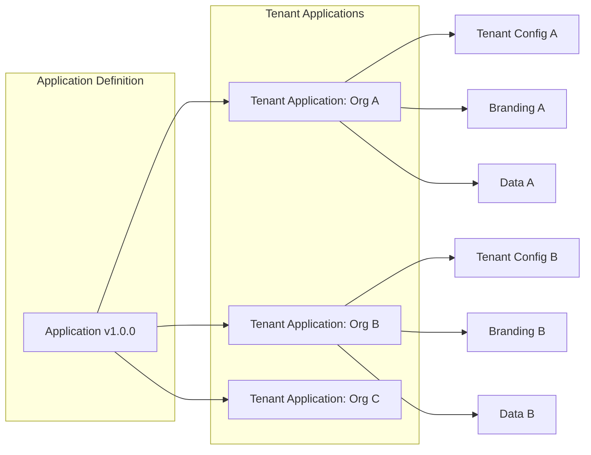
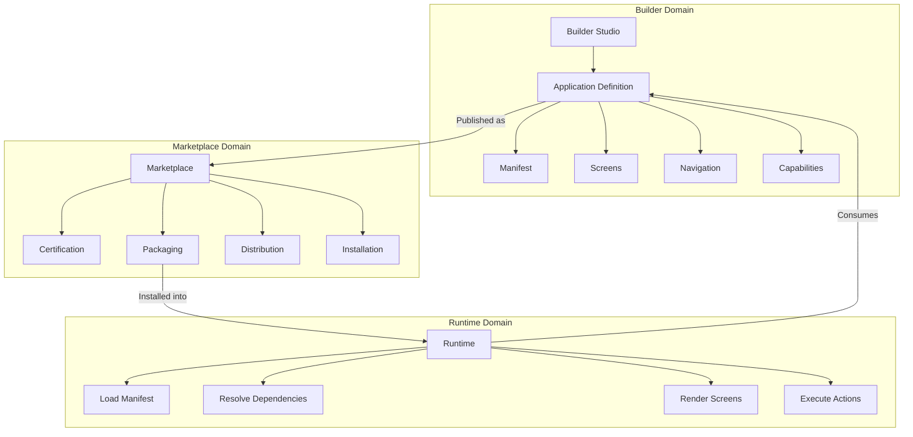
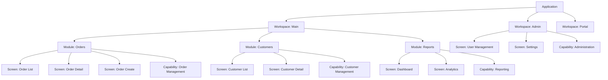
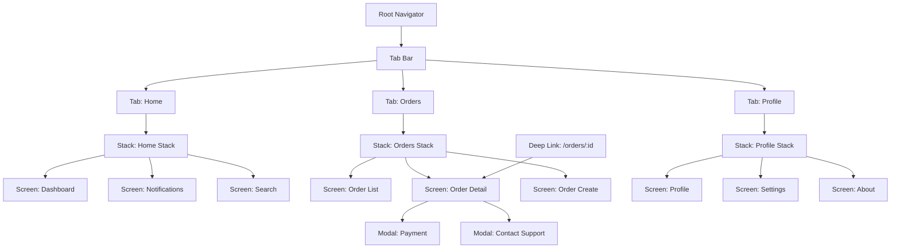
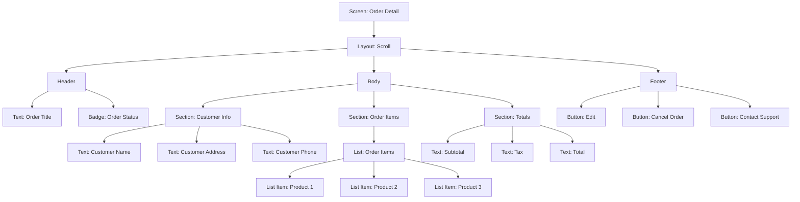
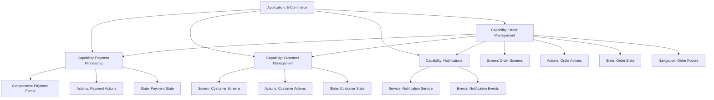
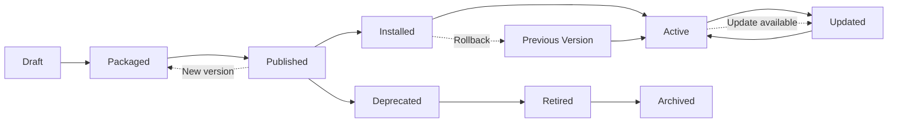

# Application Architecture Overview

**KB-041 — Application Architecture Overview Specification**

| Metadata | |
|----------|---|
| **KB ID** | KB-041 |
| **Title** | Application Architecture Overview |
| **Version** | 0.1.0 |
| **Status** | Drafting |
| **Owner** | Architecture Team |
| **Suite** | Application Model Architecture |
| **Dependencies** | KB-005 Platform Overview, KB-006 System Architecture, KB-032 Marketplace Architecture, KB-033 Package & Artifact Specification |
| **Related Specifications** | Platform Overview (KB-005), System Architecture (KB-006), Manifest Specification (KB-009), Marketplace Architecture (KB-032), Package & Artifact Specification (KB-033), Extension & Plugin Framework (KB-034), Template Marketplace (KB-038), Runtime Architecture Overview (KB-051) |
| **Last Updated** | 2026-07-10 |
| **Intended Audience** | Platform architects, application model engineers, Builder engineers, Runtime engineers, Marketplace engineers, QA engineers, ecosystem partners |

---

### Revision History

| Version | Date | Author | Change |
|---------|------|--------|--------|
| 0.1.0 | 2026-07-10 | AI Architecture Agent | Initial draft |

---

## Executive Summary

This document defines what a DUKADESK Application is — its canonical architectural structure, constituent parts, and the relationships between them. It does not describe how applications are built (that is the Builder's responsibility), how they are packaged (that is the Marketplace's responsibility), or how they are executed (that is the Runtime's responsibility). Instead, it defines the abstract model that all three systems share.

A DUKADESK Application is a formally structured collection of definitions — a Manifest, Screens, Navigation, Themes, Capabilities, Actions, Events, State, Policies, Permissions, and Assets — that together define a complete interactive business application. This structure is the contract between the Builder (which produces it), the Marketplace (which distributes it), and the Runtime (which executes it).

By establishing this model as an explicit architectural layer, DUKADESK ensures that:

- The Builder produces well-formed application definitions that the Runtime can execute predictably.
- The Marketplace distributes application definitions as certified, versioned, immutable packages.
- The Runtime consumes application definitions without needing to understand Builder internals or Marketplace governance.
- Application definitions can be validated, tested, versioned, and evolved independently of any specific Builder, Marketplace, or Runtime implementation.

This document is the foundation of the Application Model Architecture Suite. Subsequent documents in this suite define each constituent part in detail — the Manifest, Workspace & Tenant Model, Navigation Model, Screen Model, Component Tree Model, Action & Event Model, State Model, Theme Model, and Capability Composition.

---

## 1. Purpose

The Application Model defines the canonical structure of every DUKADESK application. It answers the foundational questions that every other system depends on:

**What is an Application?** — A DUKADESK Application is a self-contained, deployable unit of business functionality defined by a Manifest that declares its Screens, Navigation, Themes, Capabilities, Actions, Events, State, Policies, Permissions, and Assets. An Application is the unit of distribution (through the Marketplace), the unit of installation (into a tenant environment), and the unit of execution (by the Runtime).

**What is a Tenant Application?** — A Tenant Application is an instance of an Application installed into a specific tenant environment, bound to that tenant's configuration, branding, data, and policies. A single published Application can produce many Tenant Applications, each independently configured and governed.

**What is a Workspace?** — A Workspace is the top-level logical container of a Tenant Application. It defines the application's identity, navigation root, theme binding, capability set, and global configuration. Every Tenant Application has exactly one primary Workspace. Applications may define additional workspaces for distinct operational contexts (e.g., an Admin Workspace, a Customer Portal Workspace).

**What is a Manifest?** — The Manifest is the root document of every Application. It declares the Application's identity, version, dependencies, screens, navigation structure, theme references, capability requirements, permission rules, and configuration. The Manifest is the contract between the Builder and the Runtime. Every Runtime session begins by loading and validating the Manifest.

**What is a Screen?** — A Screen is a distinct view within an Application. Screens are the units of navigation — users move between screens to accomplish tasks. Each Screen is defined by a layout structure, a component tree, data bindings, action bindings, and lifecycle rules.

**What is a Module?** — A Module is a logical grouping of related screens, components, and capabilities within an Application. Modules organize application functionality into coherent domains (e.g., Orders Module, Customers Module, Reports Module). Modules may be independently versioned, enabled, and composed.

**What is a Capability?** — A Capability is a self-contained unit of business functionality that an Application can declare as a dependency. Capabilities provide screens, components, workflows, data models, actions, events, and state. Applications compose capabilities rather than reimplementing their functionality.

**What is a Component Tree?** — A Component Tree is the hierarchical structure of UI components that compose a Screen. Each node in the tree is a component instance with bound properties, data sources, theme tokens, and action handlers. The Component Tree is the rendering contract between the Application definition and the Runtime renderer.

**What is a Navigation Graph?** — A Navigation Graph is the complete structure of all screens and the transitions between them. It defines the routes users can take, the parameters passed between screens, the guards that control access, and the navigation patterns (tabs, stacks, drawers, modals, wizards).

**What is an Application Definition?** — An Application Definition is the complete set of documents — Manifest, Screen definitions, Navigation definitions, Theme definitions, Capability declarations, Action definitions, Event definitions, State definitions, Policy definitions, Permission definitions, and Asset references — that together describe a DUKADESK Application. The Application Definition is the artifact the Builder produces.

**What is an Application Package?** — An Application Package is a signed, versioned, immutable archive containing an Application Definition along with all its referenced assets — component implementations, theme resources, data model schemas, documentation, and metadata. The Application Package is the artifact the Marketplace distributes.

**What is an Installed Application?** — An Installed Application is an Application Package that has been downloaded, verified, and registered in a tenant environment. Installation resolves dependencies, initializes configuration, registers capabilities, and makes the Application available for activation.

**What is a Published Application?** — A Published Application is an Application Package that has been certified by the Marketplace and made available for discovery and installation by consumers. Publication makes the Application Definition immutable — subsequent changes require a new version.

---

## 2. Scope

### In Scope

This document defines the Application Model — the canonical structure, constituent parts, and relationships that define every DUKADESK Application. It is the architectural foundation that the Manifest Specification, Workspace & Tenant Model, Navigation Model, Screen Model, Component Tree Model, Action & Event Model, State Model, Theme Model, and Capability Composition documents build upon.

### Out of Scope

- **Builder implementation**: How applications are authored is defined in the Builder Architecture Suite.
- **Marketplace distribution**: How applications are packaged, certified, and distributed is defined in the Marketplace Architecture Suite.
- **Runtime execution**: How applications are loaded, rendered, and interacted with is defined in the Runtime Architecture Suite.
- **Implementation technology**: The Application Model is technology-independent. It does not prescribe JSON, XML, YAML, or any specific serialization format.
- **Platform-specific adaptation**: How the Application Model adapts to mobile, web, desktop, or other platforms is a Runtime concern.

---

## 3. Application Model Philosophy

### Definition Over Implementation

An Application is defined by its structure, not by its implementation. The Application Model describes what an application is — its screens, navigation, capabilities, state, and behavior — in purely definitional terms. Implementation details (how screens are rendered, how state is persisted, how actions are executed) belong to the Runtime.

### Composition Over Monolith

Applications compose existing artifacts rather than redefining them. Themes are referenced from the Theme Marketplace. Components are referenced from the Component Marketplace. Capabilities are referenced from the Capability Marketplace. An Application Definition is a composition of references, not a monolithic definition of everything it uses.

### Contract Over Convention

The Application Model establishes explicit contracts between systems. The Builder produces definitions that conform to the contract. The Runtime consumes definitions that conform to the contract. The Marketplace validates that definitions conform to the contract. Convention-based approaches (where systems implicitly agree on structure) are replaced by explicit, versioned, validated contracts.

### Immutability Over Mutability

Published Application Definitions are immutable. Once an Application is published through the Marketplace, its definition is frozen. Changes are expressed through new versions. Immutability guarantees deterministic execution, reliable testing, and auditable deployment.

### Versioned Over Monolithic

Applications are versioned at multiple granularities — the Application itself, its Manifest, each referenced capability, each component, each theme. Versioning enables controlled evolution, dependency resolution, and rollback safety.

### Tenant-Bound Over Single-Tenant

Applications become Tenant Applications through installation and configuration. The same Application Definition, when installed into two different tenant environments, produces two distinct Tenant Applications with independent configuration, branding, data, and governance policies.

### Declarative Over Imperative

Application behavior is expressed declaratively. Screens declare their component trees. Navigation declares its route graphs. Actions declare their pipelines. State declares its structure. There is no imperative application logic in the Application Model. All behavior is defined, not programmed.

### Auditable Over Opaque

Every Application Definition carries its provenance — publisher identity, version history, certification status, dependency declarations, and change records. The Application Model ensures that every application can be traced back to its origin and every change can be audited.

---

## 4. Application Structure

### Canonical Application Structure

Every DUKADESK Application, regardless of its purpose, scale, or target platform, conforms to the following canonical structure:

```
Application
├── Manifest
│     ├── Application Identity
│     ├── Version
│     ├── Dependencies
│     ├── Configuration
│     └── Metadata
├── Workspace Model
│     ├── Workspace Definitions
│     ├── Tenant Bindings
│     └── Module Definitions
├── Navigation Model
│     ├── Navigation Graph
│     ├── Routes
│     ├── Guards
│     └── Deep Links
├── Screen Model
│     ├── Screen Definitions
│     ├── Layout Structures
│     ├── Component Trees
│     └── Lifecycle Rules
├── Theme Model
│     ├── Theme Reference
│     ├── Token Overrides
│     ├── Mode Variants
│     └── Brand Configuration
├── Capability Model
│     ├── Capability Declarations
│     ├── Capability Composition
│     └── Capability Configuration
├── Action & Event Model
│     ├── Action Definitions
│     ├── Event Definitions
│     ├── Action Pipelines
│     └── Event Routes
├── State Model
│     ├── State Schemas
│     ├── Initial State
│     ├── State Persistence
│     └── State Bindings
├── Component Model
│     ├── Component References
│     ├── Component Properties
│     ├── Data Bindings
│     └── Action Bindings
├── Policy & Permission Model
│     ├── Permission Definitions
│     ├── Role Definitions
│     ├── Policy Rules
│     └── Access Control
├── Asset Model
│     ├── Asset References
│     ├── Asset Bundles
│     └── Asset Configuration
└── Metadata
      ├── Publisher Information
      ├── Certification Records
      ├── License Information
      ├── Documentation
      └── Change History
```

### Structural Invariants

The following invariants hold for every valid Application Definition:

1. **Exactly one Manifest**: Every Application has exactly one root Manifest document that declares its identity and references all other constituent parts.

2. **At least one Workspace**: Every Application defines at least one Workspace. The primary Workspace is the default execution context.

3. **At least one Screen**: Every Workspace contains at least one Screen. An Application with zero screens is invalid.

4. **Connected Navigation Graph**: Every Screen in every Workspace must be reachable through the Navigation Graph. Unreachable screens are invalid.

5. **Resolved References**: Every reference — to a component, capability, theme, or asset — must resolve to a valid, compatible target.

6. **Declared Capabilities**: Every capability used by screens, actions, or components must be declared in the Application's Capability Model.

7. **Valid Bindings**: Every data binding, action binding, and theme binding must reference a valid state path, action definition, or theme token.

8. **Compatible Dependencies**: Every declared dependency must be compatible with the Application's version and with other declared dependencies.

---

## 5. Core Definitions

### Application

An Application is a self-contained, deployable unit of business functionality. It is the top-level entity in the DUKADESK Application Model. Every Application has a unique identity, a version, a Manifest, and a set of constituent models that together define its complete structure and behavior.

**Properties**:
- Applications are identified by a globally unique Application ID.
- Applications are versioned using semantic versioning.
- Applications declare dependencies on other Applications, Capabilities, and platform versions.
- Applications are published, discovered, installed, and updated through the Marketplace.

**Cardinality**: One Application Definition produces zero or more Tenant Applications through installation.

### Tenant Application

A Tenant Application is an instance of an Application installed into a specific tenant environment. It inherits the Application Definition and binds it to tenant-specific configuration, branding, data sources, and governance policies.

**Properties**:
- Tenant Applications are scoped to exactly one tenant.
- Multiple Tenant Applications may be derived from the same Application Definition.
- Each Tenant Application has independent configuration, state, and lifecycle.

**Cardinality**: Zero or more Tenant Applications per Application Definition. Exactly one primary Application per tenant environment (a tenant may run multiple Applications).

### Workspace

A Workspace is the top-level logical container of a Tenant Application. It defines the application's navigation root, theme binding, capability set, module organization, and global configuration.

**Properties**:
- Workspaces are the unit of entry — users enter an Application through a Workspace.
- Workspaces define their own navigation structures, screen sets, and capability compositions.
- Workspaces may be nested — a Workspace may contain sub-workspaces for distinct operational contexts.
- Common workspace patterns include: primary application workspace, administration workspace, customer portal workspace, mobile workspace, kiosk workspace.

**Cardinality**: One or more Workspaces per Application. Exactly one primary Workspace.

### Module

A Module is a logical grouping of related screens, navigation structures, capabilities, and configuration within a Workspace. Modules organize application functionality into coherent, independently versionable domains.

**Properties**:
- Modules are the unit of organization within a Workspace.
- Modules may be independently enabled, disabled, and versioned.
- Modules may declare dependencies on other modules or capabilities.
- Modules may contribute screens to the Workspace's navigation structure.

**Cardinality**: Zero or more Modules per Workspace. A Workspace with zero modules is a flat application.

### Manifest

The Manifest is the root document of every Application. It declares the Application's identity, version, dependencies, and references to all constituent models. The Manifest is the entry point that the Runtime loads to begin executing an Application.

**Properties**:
- The Manifest is the only required document in an Application Definition.
- The Manifest must declare all references — no implicit or undeclared dependencies.
- The Manifest is validated against the Manifest schema at build time, publish time, and load time.

**Cardinality**: Exactly one Manifest per Application.

### Screen

A Screen is a distinct view within an Application. Screens are the units of navigation — users move between screens to accomplish tasks. Each Screen is defined by a layout structure, a component tree, data bindings, action bindings, lifecycle rules, and optional configuration.

**Properties**:
- Screens are identified by a route name within their Workspace's Navigation Graph.
- Screens may receive parameters passed from other screens during navigation.
- Screens have a defined lifecycle — appear, activate, interact, deactivate, disappear.
- Screens may declare required capabilities, permissions, and data dependencies.

**Cardinality**: One or more Screens per Workspace. Zero or more Screens per Module.

### Component Tree

A Component Tree is the hierarchical structure of UI components that compose a Screen. Each node in the tree is a component instance with bound properties, data sources, theme tokens, and action handlers.

**Properties**:
- Component Trees are declarative — they describe what to render, not how to render it.
- Each component node references a registered component type from the Component Registry.
- Component Trees support nesting, conditional rendering, list rendering, and slot-based composition.
- Component Trees are the rendering contract between the Application Definition and the Runtime.

**Cardinality**: Exactly one Component Tree per Screen.

### Navigation Graph

A Navigation Graph is the complete structure of all Screens and the transitions between them within a Workspace. It defines the routes users can take, the parameters passed between screens, the guards that control access, and the navigation patterns (tabs, stacks, drawers, modals, wizards).

**Properties**:
- Navigation Graphs are declarative — they describe the route structure, not the navigation implementation.
- Routes are parameterized — screens receive parameters through route data.
- Navigation guards control access based on permissions, authentication state, and application state.
- Deep link handlers map external URLs to routes within the Navigation Graph.

**Cardinality**: Exactly one Navigation Graph per Workspace.

### Capability

A Capability is a self-contained unit of business functionality that an Application can declare as a dependency. Capabilities provide screens, components, workflows, data models, actions, events, and state that extend the Application's functionality.

**Properties**:
- Capabilities are independently versioned, certified, and distributed through the Marketplace.
- Capabilities declare their own dependencies, permissions, and configuration schemas.
- Capabilities contribute screens and navigation entries to the Workspace.
- Capabilities are composed into Applications — never modified by the consuming Application.

**Cardinality**: Zero or more Capabilities per Application.

### Action

An Action is a declarative definition of an operation that the Runtime can execute in response to a user interaction, system event, or workflow trigger. Actions encapsulate operations — navigation, state mutation, API call, event publication, workflow execution — in a structured, auditable form.

**Properties**:
- Actions are defined by type (navigate, setState, apiCall, publishEvent, startWorkflow).
- Actions have defined inputs, outputs, error handlers, and success handlers.
- Actions may be chained — the output of one action feeds into the next.
- Actions are bound to component events through action bindings in the Component Tree.

**Cardinality**: Zero or more Actions per Application. Actions may be defined inline or referenced from Capabilities.

### Event

An Event is a structured message that flows through the Event Bus, enabling decoupled communication between components, screens, capabilities, and subsystems. Events have a type, a payload, and optional metadata.

**Properties**:
- Events are strongly typed — every event type has a defined payload schema.
- Events may be published by components, actions, capabilities, system processes, and external services.
- Events may trigger actions through event-to-action bindings.
- Events may carry state change notifications, navigation requests, data update signals, and system alerts.

**Cardinality**: Zero or more Event definitions per Application. Events may be defined by the Application or provided by Capabilities.

### State

State is the structured data that defines what an Application knows at any point in time. The State Model defines the schema of that data, its initial values, its persistence rules, and its bindings to UI components.

**Properties**:
- State is organized hierarchically — global application state, workspace state, screen state, component state.
- State schemas define the shape, types, and validation rules for state values.
- State may be persisted across sessions, scoped to the current session, or ephemeral.
- State bindings connect state values to component properties for data-driven rendering.

**Cardinality**: Exactly one State Model per Application. State is the aggregate of all capability, module, and application-level state definitions.

### Theme

A Theme is a reference to a visual design system that defines the Application's colors, typography, spacing, shapes, icons, and motion. Applications reference themes from the Theme Marketplace and may provide token overrides for brand customization.

**Properties**:
- Themes are referenced by ID and version constraint — never embedded in the Application.
- Applications may override specific theme tokens for brand identity.
- Themes define mode variants — light, dark, high contrast — that the Application respects.
- Theme resolution happens at Runtime, enabling brand changes without Application updates.

**Cardinality**: Exactly one active Theme reference per Workspace. Zero or more Theme overrides.

### Component

A Component is a reusable UI element registered in the Component Registry. Components are referenced by Application Definitions through Component Trees but are not defined by the Application. Components are the atomic visual building blocks that Screens compose.

**Properties**:
- Components are identified by a globally unique Component ID.
- Components declare their properties, events, and slots through a component schema.
- Components are theme-aware — they consume theme tokens for all visual properties.
- Components are registered through the Component Marketplace and activated through the Package Resolver.

**Cardinality**: Zero or more Component references per Screen. Components are referenced, not defined, by Applications.

---

## 6. Relationship Model

### Application to Manifest

The Application contains exactly one Manifest. The Manifest is the root document that identifies the Application and declares references to all other constituent models. The relationship is compositional — the Manifest does not exist independently of an Application.

### Application to Tenant Application

An Application Definition produces zero or more Tenant Applications through installation. Each Tenant Application binds the Application to a specific tenant's context — configuration, branding, data, governance. The relationship is multiplicative: one Application, many tenants.

### Application to Workspace

An Application contains one or more Workspaces. Each Workspace is a top-level container with its own navigation, screens, capabilities, and configuration. The primary Workspace is the default entry point. Additional Workspaces serve distinct operational contexts.

### Workspace to Module

A Workspace contains zero or more Modules. Modules group related screens, navigation, and capabilities into independently organized domains. Modules decompose large Workspaces into manageable, independently versionable units.

### Workspace to Screen

A Workspace contains one or more Screens organized within its Navigation Graph. Screens are the units of navigation — users move between them to accomplish tasks. Every Screen belongs to exactly one Workspace.

### Workspace to Navigation Graph

Each Workspace has exactly one Navigation Graph that defines all routes and transitions. The Navigation Graph is the complete map of how users move through the Workspace.

### Screen to Component Tree

Each Screen has exactly one Component Tree that defines its UI structure. The Component Tree is the Screen's rendering contract with the Runtime.

### Application to Capability

An Application references zero or more Capabilities as dependencies. Capabilities extend the Application with additional screens, components, actions, events, state, and configuration. Capabilities are referenced, never embedded.

### Application to Theme

An Application references exactly one active Theme per Workspace. Themes define the visual identity. Theme references point to Marketplace-distributed theme packages.

### Application to State

An Application has exactly one State Model that defines the complete data structure. The State Model aggregates state from the Application, its Capabilities, and its Workspaces.

### Application to Action & Event

An Application defines zero or more Actions and zero or more Event types. Actions define operations; Events define communication. Together they define the Application's behavioral model.

### Application to Policy & Permission

An Application defines permission rules, role definitions, and policy configurations that control access to screens, actions, data, and capabilities. Policies are evaluated by the Runtime's Permission Engine.

### Application to Asset

An Application references zero or more Assets — images, fonts, data files, configuration resources. Assets are bundled with the Application Package or referenced from the Asset System.

---

## 7. Model Boundaries

### Builder Boundary

The Builder produces Application Definitions. It is responsible for:

- Creating and editing Manifest documents.
- Designing Screens and their Component Trees.
- Defining Navigation Graphs.
- Configuring Capability compositions.
- Binding Actions, Events, and State.
- Assigning Permissions and Policies.
- Referencing Themes, Components, and Assets.

The Builder does not need to understand how the Runtime executes its definitions. It produces definitions that conform to the Application Model contract.

### Marketplace Boundary

The Marketplace distributes Application Packages. It is responsible for:

- Packaging Application Definitions into signed, versioned archives.
- Certifying Application Definitions against quality, security, and compatibility standards.
- Discovering, browsing, and recommending Applications to consumers.
- Installing Application Packages into tenant environments.
- Managing Application versions, updates, and lifecycle.

The Marketplace does not need to understand how Applications are authored or executed. It validates and distributes definitions that conform to the Application Model contract.

### Runtime Boundary

The Runtime executes Application Definitions. It is responsible for:

- Loading and validating the Manifest.
- Resolving and activating referenced Capabilities, Components, and Themes.
- Rendering Screens from their Component Trees.
- Executing Actions in response to user interactions.
- Managing State according to the State Model.
- Routing Events through the Event Bus.
- Enforcing Permissions and Policies.

The Runtime does not need to understand how Applications are authored or distributed. It executes definitions that conform to the Application Model contract.

---

## 8. Application Identity & Versioning

### Application Identity

Every Application is identified by a globally unique Application Identifier. The identifier is assigned at creation and remains with the Application throughout its lifecycle. The identifier is used by the Manifest, the Marketplace, the Runtime, and all dependent systems.

**Properties**:
- Globally unique across all publishers, tenants, and environments.
- Immutable — once assigned, never changes.
- Publisher-scoped — the identifier includes the publisher's namespace.
- Human-readable for debugging and reference.

### Version Model

Applications follow semantic versioning — MAJOR.MINOR.PATCH:

- **MAJOR**: Breaking changes to the Application Definition — screen removal, navigation restructuring, capability replacement, breaking data model changes.
- **MINOR**: Backward-compatible additions — new screens, new capabilities, new actions, new state fields.
- **PATCH**: Bug fixes, security patches, performance improvements, documentation updates.

### Version Resolution

When an Application declares dependencies on Capabilities, Components, or Themes, it specifies version constraints. The resolver finds the latest version satisfying all constraints. Version resolution is deterministic — the same constraints in the same environment produce the same resolved versions.

### Version Compatibility

Applications are compatible with:

- Other versions of the same Application (for update scenarios).
- Specific versions of referenced Capabilities, Components, and Themes.
- Specific platform and Runtime versions.
- Specific Manifest schema versions.

Compatibility is declared in the Manifest and validated at build time, publish time, and installation time.

---

## 9. Application Lifecycle States

### Draft

The Application is being authored in the Builder. It is not yet packaged, published, or discoverable. The Draft state exists entirely within the Builder's domain.

**Visibility**: Builder only.
**Installable**: No.
**Discoverable**: No.

### Packaged

The Application Definition has been assembled into an Application Package by the Publishing Pipeline. The package is signed, versioned, and ready for submission.

**Visibility**: Publisher only.
**Installable**: No.
**Discoverable**: No.

### Published

The Application Package has passed certification and is published in the Marketplace. It is discoverable and installable by authorized consumers.

**Visibility**: Marketplace consumers.
**Installable**: Yes, to authorized tenants.
**Discoverable**: Yes.

### Installed

The Application Package has been installed into a specific tenant environment. It is registered in the tenant's package catalog and available for activation.

**Visibility**: Installing tenant only.
**Installable**: No (already installed).
**Discoverable**: In tenant catalog.

### Active

The Installed Application has been activated in the tenant environment. The Runtime has loaded its Manifest, resolved its dependencies, and initialized its state. The Application is running and available to users.

**Visibility**: Active in tenant Runtime.
**Installable**: No.
**Discoverable**: In tenant application launcher.

### Updated

A new version of the Application has been installed, replacing the previous version. The update follows the same packaging, certification, and installation lifecycle as the original publication. The previous version is retained for rollback.

**Visibility**: Updated in tenant Runtime.
**Installable**: No.
**Discoverable**: As updated version.

### Deprecated

The Application is marked as deprecated in the Marketplace. New installations are discouraged. Existing installations continue to function.

**Visibility**: Marketplace — flagged as deprecated.
**Installable**: Not recommended.
**Discoverable**: Yes, with deprecation notice.

### Retired

The Application is removed from the Marketplace. New installations are blocked. Existing installations continue to function but no longer receive updates.

**Visibility**: Removed from Marketplace.
**Installable**: No.
**Discoverable**: No.

### Archived

The Application is archived. The package and metadata are preserved for historical reference but are not accessible for installation or discovery.

**Visibility**: Administrative only.
**Installable**: No.
**Discoverable**: No.

---

## 10. Application Model Extension Points

### Custom Capabilities

Applications may declare custom Capabilities that extend the base capability set. Custom Capabilities follow the same structure as Marketplace Capabilities — they declare screens, components, actions, events, state, and configuration. Custom Capabilities are composed into the Application at build time.

### Custom Components

Applications may reference custom Components developed specifically for the Application. Custom Components are registered through the Component Registry and may be distributed as part of the Application Package or as separate Marketplace packages.

### Custom Actions

Applications may define custom Action types that extend the base action set. Custom Actions must declare their input schema, output schema, and handler contract. The Runtime's Action Dispatcher must be extended to support custom Action types.

### Custom Events

Applications may define custom Event types for Application-specific communication patterns. Custom Events follow the same structure as platform events — type identifier, payload schema, publication rules.

### Theme Overrides

Applications may override specific Theme tokens to customize branding without creating a new Theme. Theme overrides are scoped to the Application or Workspace and are applied on top of the referenced Theme.

### Configuration Extensions

The Manifest may be extended with Application-specific configuration sections. Configuration extensions must be declared in the Manifest schema extension point. The Runtime passes configuration values to the appropriate subsystems without interpreting them.

### Policy Extensions

Applications may define custom Policy rules that extend the base permission model. Custom policies are evaluated by the Permission Engine alongside platform-defined policies. Policy extensions must declare their evaluation contract.

---

## 11. Anti-Patterns

### Monolithic Application Definitions

Defining everything in a single, flat Manifest without using Capabilities, Modules, or component references.

**Why discouraged**: Monolithic definitions defeat composition. They cannot be independently versioned, tested, or reused. They create tight coupling between unrelated features and make the Application harder to maintain and evolve.

### Capability Duplication

Including functionality that duplicates existing Marketplace Capabilities instead of declaring them as dependencies.

**Why discouraged**: Duplication wastes the benefits of the Capability ecosystem — version management, certification, shared maintenance. It creates inconsistency, increases package size, and complicates updates.

### Undeclared Dependencies

Using capabilities, components, or themes without declaring them in the Manifest.

**Why discouraged**: Undeclared dependencies cause resolution failures at installation time, runtime errors during execution, and silent compatibility issues during updates. All dependencies must be explicitly declared.

### Platform-Specific Definitions

Creating Application Definitions that include platform-specific logic, assumptions about screen size, input methods, or rendering technology.

**Why discouraged**: Platform-specific definitions couple the Application to a specific target platform. The Application Model is platform-independent — platform adaptation is a Runtime responsibility.

### Mutable Application State After Publication

Designing Applications where the definition changes between publication and installation — runtime-generated screens, dynamic navigation structures, computed component trees.

**Why discouraged**: Immutable definitions are the foundation of deterministic execution, reliable testing, and auditable deployment. Runtime-generated definitions bypass validation, certification, and the Application Model contract.

### Over-Fragmentation

Creating too many fine-grained Capabilities, Modules, or Application packages — each containing trivial functionality.

**Why discouraged**: Over-fragmentation increases dependency complexity, resolution time, and management overhead. Capabilities, Modules, and Applications should represent meaningful units of functionality.

### Implicit State Dependencies

Designing screens or capabilities that depend on state structure changes in other capabilities without declaring the dependency.

**Why discouraged**: Implicit state dependencies create coupling that is invisible to the dependency resolver, the validation system, and the certification process. All state dependencies must be explicit.

---

## 12. Future Evolution

### Application Inheritance

Applications that extend other Applications — inheriting screens, navigation, capabilities, and configuration from a parent Application and adding or overriding specific parts. Application inheritance enables industry-specific variants of general Applications.

### Application Templates

Pre-composed Application Definitions that serve as starting points for new Applications. Templates include default screens, navigation structures, capability selections, theme references, and configuration. Application Templates are distributed through the Template Marketplace.

### Multi-Application Tenants

Tenant environments that run multiple Applications simultaneously — each with its own Workspace, navigation, capabilities, and configuration. Multi-Application tenants enable organizations to deploy multiple business solutions within a single tenant boundary.

### Application Federation

Applications that compose screens and capabilities from other Applications running in the same tenant environment. Application federation enables cross-application navigation, shared capabilities, and unified user experiences across multiple Applications.

### Dynamic Application Composition

AI-assisted composition of Applications from capability and component recommendations based on business requirements. The AI analyzes requirements, recommends capabilities, generates Application Definitions, and submits them for certification.

### Automated Application Validation

AI-driven validation of Application Definitions against best practices, security requirements, accessibility standards, and performance guidelines. Automated validation supplements the certification process and provides real-time feedback during authoring.

---

## 13. Cross References

| Document | Relationship |
|----------|--------------|
| **KB-005 — Platform Overview** | Defines the platform context within which Applications exist. The Application Model is a core platform concept. |
| **KB-006 — System Architecture** | Defines the system-level architecture that Applications integrate with. |
| **KB-009 — Manifest Specification** | Defines the Manifest document that every Application requires. KB-042 will detail the Manifest structure. |
| **KB-032 — Marketplace Architecture** | Defines the Marketplace that distributes Application Packages. Applications are a primary Marketplace asset type. |
| **KB-033 — Package & Artifact Specification** | Defines the package format that Application Packages conform to. |
| **KB-034 — Extension & Plugin Framework** | Defines how Applications can be extended through the Extension Framework. |
| **KB-038 — Template Marketplace** | Defines how Application Templates are distributed. Templates are pre-composed Application Definitions. |
| **KB-051 — Runtime Architecture Overview** | Defines the Runtime that executes Applications. The Application Model is the contract the Runtime consumes. |

---

## Required Mermaid Diagrams

### Application Canonical Structure

```mermaid
graph TD
    APP[Application] --> MAN[Manifest]
    APP --> WS[Workspace Model]
    APP --> NAV[Navigation Model]
    APP --> SCR[Screen Model]
    APP --> THM[Theme Model]
    APP --> CAP[Capability Model]
    APP --> AE[Action & Event Model]
    APP --> ST[State Model]
    APP --> COMP[Component Model]
    APP --> PP[Policy & Permission Model]
    APP --> AS[Asset Model]
    APP --> META[Metadata]

    WS --> WS1[Workspace: Primary]
    WS --> WSN[Workspace: Admin]
    WS --> MOD[Modules]

    NAV --> NG[Navigation Graph]
    NAV --> RT[Routes]
    NAV --> GD[Guards]
    NAV --> DL[Deep Links]

    SCR --> SD[Screen Definitions]
    SCR --> CT[Component Trees]
    SCR --> LL[Lifecycle Rules]

    CAP --> CD[Capability Declarations]
    CAP --> CC[Capability Composition]
    CAP --> CX[Capability Configuration]

    AE --> AD[Action Definitions]
    AE --> ED[Event Definitions]

    PP --> PD[Permission Definitions]
    PP --> RD[Role Definitions]
```



### Application to Tenant Application Relationship



### Model Boundaries



### Workspace & Module Structure



### Navigation Graph Structure



### Component Tree Structure



### Capability Composition



### Application Lifecycle State Machine



---

*This is KB-041, the Application Architecture Overview specification of the DUKADESK Engineering Knowledge Base. It defines the canonical architectural structure of every DUKADESK Application — the formal model that the Builder produces, the Marketplace distributes, and the Runtime consumes. This document establishes the Application Model as the bridge between the Marketplace and Runtime suites, defining the contracts and boundaries that enable independent evolution of each system.*
