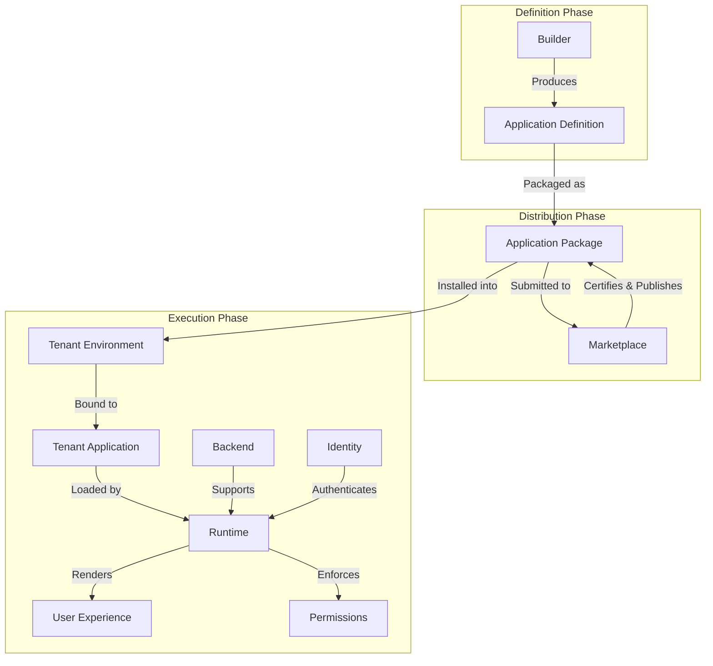
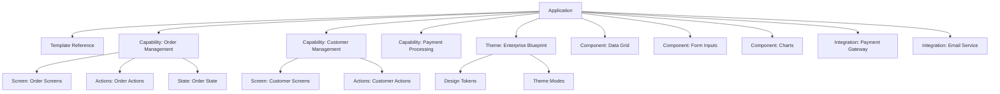
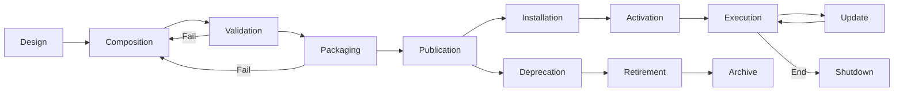
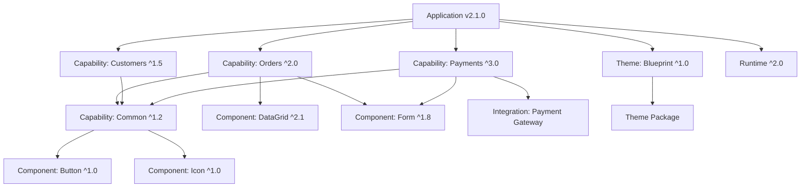
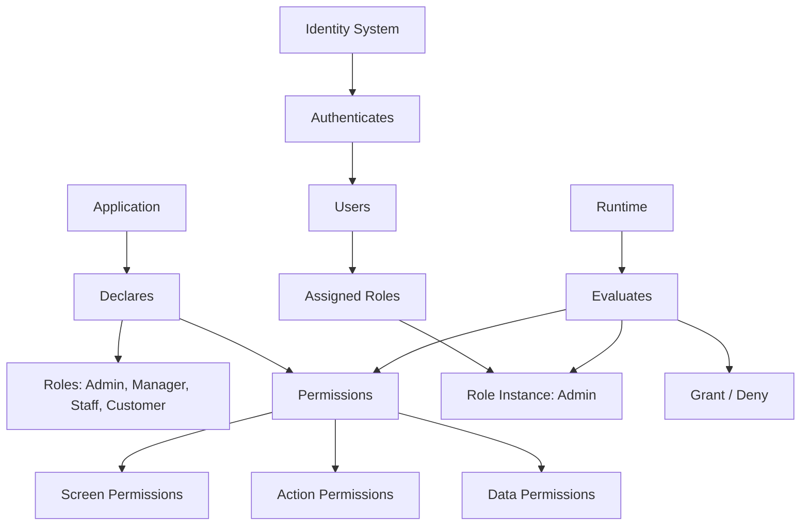
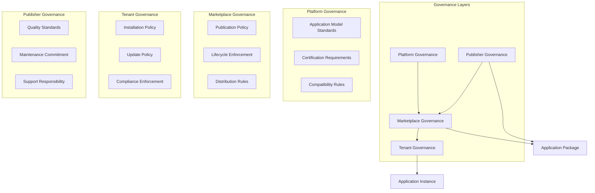
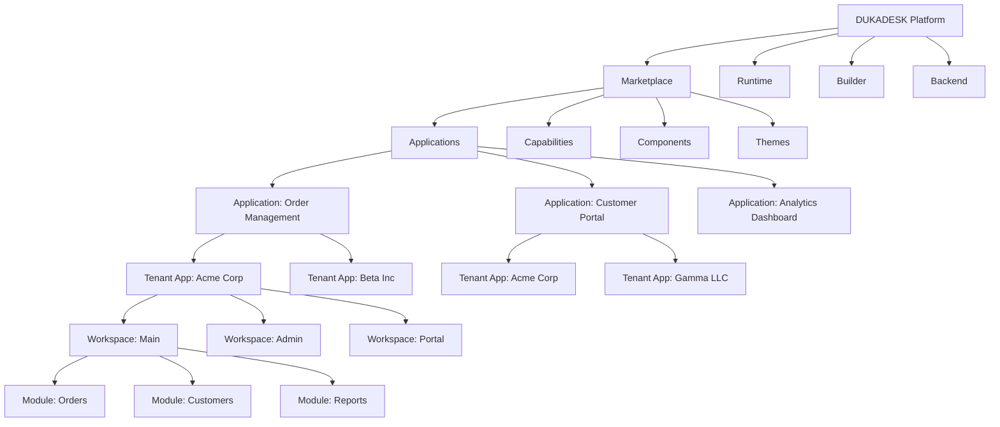
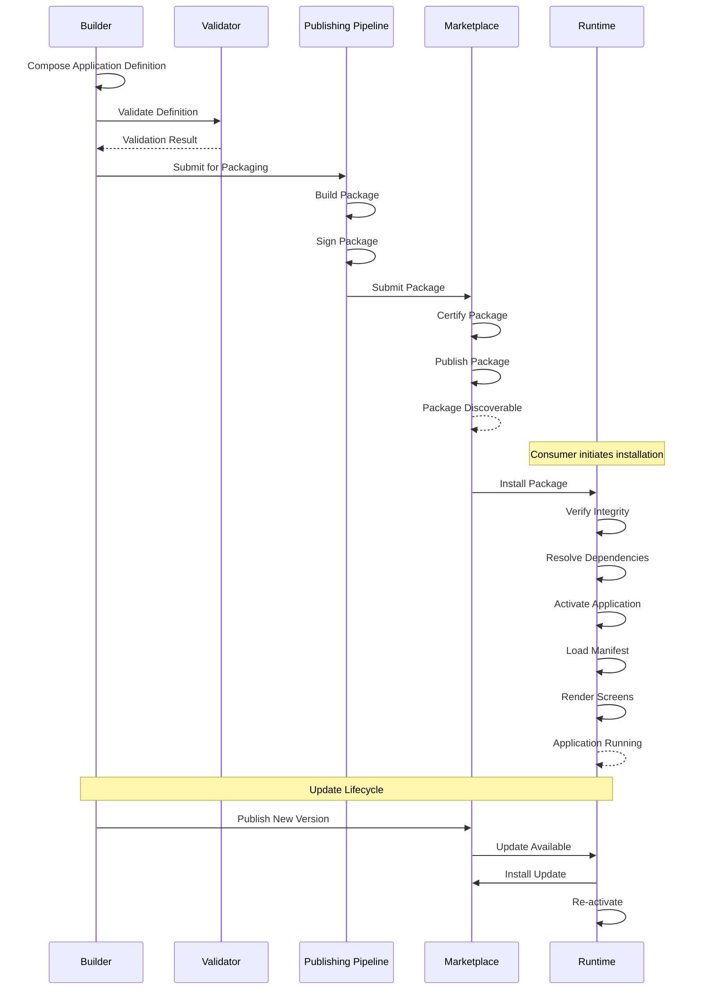

# Application Architecture Overview

**KB-041 — Application Architecture Overview Specification**

| Metadata | |
|----------|---|
| **Document ID** | KB-041 |
| **Title** | Application Architecture Overview |
| **Version** | 0.1.0 |
| **Status** | Drafting |
| **Repository** | KNOWLEDGE-BASE |
| **Suite** | Application Model Architecture |
| **Authors** | Architecture Team |
| **Reviewers** | TBD |
| **Dependencies** | KB-005 Platform Overview, KB-006 System Architecture, KB-032 Marketplace Architecture, KB-033 Package & Artifact Specification |
| **Related Specifications** | Platform Overview (KB-005), System Architecture (KB-006), Manifest Specification (KB-009), Marketplace Architecture (KB-032), Package & Artifact Specification (KB-033), Extension & Plugin Framework (KB-034), Capability Marketplace (KB-035), Component Marketplace (KB-036), Theme Marketplace (KB-037), Template Marketplace (KB-038), Marketplace Distribution & Lifecycle (KB-040), Runtime Architecture Overview (KB-051) |
| **Last Updated** | 2026-07-10 |
| **Intended Audience** | Platform architects, application model engineers, Builder engineers, Runtime engineers, Marketplace engineers, Backend engineers, Mobile engineers, QA engineers, ecosystem partners, technical writers |

---

### Revision History

| Version | Date | Author | Change |
|---------|------|--------|--------|
| 0.1.0 | 2026-07-10 | AI Architecture Agent | Initial draft |

---

## Executive Summary

A DUKADESK Application is a declarative digital product composed of structured metadata, navigation, screens, components, capabilities, assets, policies, and configuration. It is not executable code — it is a formal definition that the Runtime renders, the Builder assembles, the Marketplace distributes, and the Platform manages.

The Application Model is the canonical contract between these systems. It standardizes application architecture across the entire ecosystem, enabling interoperability across mobile, web, desktop, and future runtimes. It supports versioned distribution through the Marketplace, ensuring that every application can be published, discovered, installed, updated, and retired through a governed lifecycle.

The Application Model ensures predictable rendering by defining applications declaratively — the same definition produces the same result on any compliant Runtime. It decouples application definition from implementation, allowing applications to evolve independently of the Runtime, Builder, or Marketplace.

This document is the constitutional foundation of the DUKADESK platform. Every other system — the Builder, the Runtime, the Marketplace, the Backend, and every client application — derives its contracts from the Application Model defined here. Subsequent documents in this suite define each component of the model in detail.

---

## 1. Purpose

The Application Model exists to standardize application architecture across the DUKADESK ecosystem. It serves five primary purposes:

**Standardize Application Architecture** — Every DUKADESK application, regardless of its purpose, scale, or target platform, conforms to the same canonical structure. This standardization enables consistent tooling, predictable behavior, and shared understanding across the entire ecosystem.

**Enable Interoperability Across Runtimes** — The same Application Definition can be executed by any compliant Runtime — mobile, web, desktop, embedded, or future platforms. The Application Model abstracts application structure from rendering technology, ensuring that applications are not coupled to a specific Runtime implementation.

**Support Versioned Distribution** — Applications are versioned, packaged, and distributed through the Marketplace. The Application Model defines the unit of distribution — the Application Package — and the versioning semantics that govern compatibility, updates, and dependency resolution.

**Ensure Predictable Rendering** — Declarative Application Definitions produce deterministic results. The same definition, with the same inputs, produces the same rendered output on any compliant Runtime. Predictable rendering enables reliable testing, reproducible bug reports, and consistent user experiences.

**Decouple Application Definition from Implementation** — The Application Model defines what an application is, not how it is built or rendered. This decoupling allows the Builder, Runtime, Marketplace, and Backend to evolve independently while maintaining compatibility through the shared Application Model contract.

---

## 2. Scope

### In Scope

The Application Model governs:

| Domain | Elements |
|--------|----------|
| **Application Identity** | Unique identifiers, names, slugs, versions, publishers, ownership |
| **Metadata** | Descriptions, categories, tags, documentation, licensing |
| **Manifest** | Root document structure, schema, versioning, references |
| **Workspaces** | Top-level containers, tenant bindings, module organization |
| **Navigation** | Route graphs, navigation patterns, guards, deep links |
| **Screens** | Layout structures, component trees, lifecycle rules |
| **Components** | References, properties, data bindings, action bindings, theme bindings |
| **Themes** | Theme references, token overrides, mode variants, brand configuration |
| **Capabilities** | Declarations, composition, configuration, dependencies |
| **Assets** | References, bundles, configuration |
| **Policies** | Rules, enforcement boundaries, governance |
| **Permissions** | Definitions, roles, access control rules |
| **Integrations** | External system connections, API bindings, authentication configuration |
| **Dependencies** | Internal references, Marketplace references, version constraints |
| **Versioning** | Semantic versioning, compatibility rules, deprecation policies |

### Out of Scope

The Application Model does not govern:

- **Runtime execution**: How applications are loaded, rendered, and interacted with is defined in the Runtime Architecture Suite.
- **Builder implementation**: How applications are authored is defined in the Builder Architecture Suite.
- **Backend services**: How data is stored, processed, and served is defined in the Backend Architecture Suite.
- **Marketplace governance**: How applications are certified, distributed, and lifecycle-managed is defined in the Marketplace Architecture Suite.
- **Infrastructure**: Deployment, scaling, monitoring, and infrastructure management are platform operations concerns.
- **Programming languages**: The Application Model is language-agnostic. It does not prescribe or depend on any programming language.
- **UI framework specifics**: The Application Model does not define how components are implemented in specific UI frameworks.

---

## 3. Architectural Principles

### Declarative by Design

Applications are defined declaratively. Every aspect of an application — its structure, navigation, screens, components, behavior, and configuration — is expressed through structured definitions rather than imperative code. Declarative definitions are safer, more auditable, more portable, and more amenable to validation and certification than code.

### Configuration over Code

Application behavior is expressed through configuration. Themes are token tables. Navigation is a route graph. Actions are pipeline definitions. Permissions are rule sets. Configuration can be validated, certified, and versioned independently of any Runtime implementation. Configuration eliminates the security and portability risks of embedded code.

### Immutable Releases

Every published Application version is immutable. Once an Application Package is published to the Marketplace, its contents cannot be modified. Updates are released as new versions. Immutability guarantees deterministic execution, reliable rollback, and auditable deployment history.

### Composable Architecture

Applications compose existing platform artifacts rather than redefining them. Capabilities are referenced from the Capability Marketplace. Components are referenced from the Component Marketplace. Themes are referenced from the Theme Marketplace. An Application Definition is a composition of references, not a monolithic definition of everything it uses.

### Separation of Concerns

The Application Model separates the concerns of definition, distribution, and execution:
- **Definition**: The Builder produces Application Definitions.
- **Distribution**: The Marketplace distributes Application Packages.
- **Execution**: The Runtime executes Application Definitions.

Each concern is owned by a different system. Each system evolves independently. The Application Model is the contract that keeps them compatible.

### Runtime Independence

Application Definitions are independent of any specific Runtime implementation. The same definition works on mobile, web, desktop, embedded, and future runtimes. Runtime-specific adaptations are the Runtime's responsibility, not the Application Definition's.

### Platform Consistency

The Application Model ensures that applications behave consistently across all platforms. A screen defined once renders predictably on every compliant Runtime. Platform-specific differences — navigation patterns, input methods, screen sizes — are handled by the Runtime's platform adaptation layer, not by the Application Definition.

### Versioned Evolution

Applications evolve through explicit versioning. Every change — a new screen, a modified capability, an updated dependency — produces a new version. Versioning enables controlled rollout, dependency resolution, compatibility validation, and rollback safety.

### Secure by Default

The Application Model operates under a deny-by-default security posture. Applications declare the capabilities, permissions, and integrations they require. Nothing is implicitly available. All access is explicitly declared and validated.

### Observable Behavior

Application Definitions carry metadata that makes them observable — version history, dependency declarations, certification records, publisher identity, and change logs. The Application Model ensures that every application can be traced, audited, and monitored throughout its lifecycle.

---

## 4. Definition of a DUKADESK Application

A DUKADESK Application is a structured composition of declarative definitions and references that together describe a complete interactive business application. It is not executable code — it is a formal definition that the Runtime interprets.

Every DUKADESK Application is composed of the following elements:

| Element | Required | Description |
|---------|----------|-------------|
| **Manifest** | Yes | The root document that identifies the Application and declares all its constituent parts. |
| **Metadata** | Yes | Publisher information, description, category, tags, licensing, documentation. |
| **Theme** | Yes | Reference to a visual design system that defines the application's appearance. |
| **Navigation Graph** | Yes | Complete structure of all screens and the transitions between them. |
| **Workspaces** | Yes | Top-level containers that define the application's operational contexts. |
| **Screens** | Yes | Distinct views within the application, each with a layout and component tree. |
| **Component Tree** | Yes | Hierarchical structure of UI components that compose each screen. |
| **Capabilities** | No | Self-contained units of business functionality that extend the application. |
| **Assets** | No | Images, fonts, data files, and other resources referenced by the application. |
| **Policies** | No | Governance rules that control application behavior and usage. |
| **Permissions** | No | Access control definitions that govern who can do what within the application. |
| **Integrations** | No | Connections to external systems, APIs, and services. |
| **State Definitions** | No | Declarative schemas for application state structure and persistence. |
| **Event Definitions** | No | Declarative schemas for application events and their payloads. |

---

## 5. High-Level Architecture

### Platform Relationships

The Application occupies the central position in the DUKADESK platform architecture, connected to every major subsystem:

```
                    ┌─────────────┐
                    │   Builder   │
                    │  (Authors)  │
                    └──────┬──────┘
                           │ Produces
                           ▼
                    ┌─────────────┐
                    │ Application │
                    │ Definition  │
                    └──────┬──────┘
                           │
              ┌────────────┼────────────┐
              │            │            │
              ▼            ▼            ▼
       ┌──────────┐ ┌──────────┐ ┌──────────┐
       │Marketplace│ │ Runtime  │ │ Backend  │
       │(Distributes)│ │(Executes)│ │(Supports)│
       └──────────┘ └──────────┘ └──────────┘
              │            │            │
              │            ▼            │
              │     ┌──────────┐        │
              └────>│  User    │<───────┘
                    │(Interacts)│
                    └──────────┘
```

### Responsibilities

| System | Responsibility |
|--------|----------------|
| **Builder** | Authors Application Definitions. Provides visual and programmatic tools for composing applications from screens, components, capabilities, themes, and assets. Validates definitions against the Application Model before publishing. |
| **Application Definition** | The formal description of an application. Contains the Manifest, Navigation Graph, Screen definitions, Component Trees, Theme references, Capability declarations, Policies, Permissions, and Assets. Is the unit of distribution, installation, and execution. |
| **Marketplace** | Distributes Application Packages. Certifies, versions, publishes, discovers, and installs applications. Manages the application lifecycle from publication through retirement. Ensures that every package meets quality and security standards before distribution. |
| **Runtime** | Executes Application Definitions. Loads the Manifest, resolves dependencies, renders screens, executes actions, manages state, enforces permissions, and handles user interactions. Is application-agnostic — it executes any valid Application Definition. |
| **Backend** | Supports running applications with data, identity, and integration services. Provides APIs that applications consume through declared integration contracts. Manages tenant data isolation, authentication, and business logic execution. |
| **Tenant** | Owns the application instance. Provides configuration, branding, data, and governance policies that bind the generic Application Definition to a specific organizational context. |
| **Identity** | Provides user authentication and authorization. The Application declares permission requirements; the Identity system provides the user context against which those permissions are evaluated. |
| **User** | Interacts with the running application through the Runtime. Experiences the screens, navigation, and capabilities defined by the Application Model. |

### Flow

```
1. Author (Builder) creates an Application Definition.
2. Definition is packaged and submitted to the Marketplace.
3. Marketplace certifies and publishes the Application Package.
4. Consumer discovers and installs the Application into a Tenant environment.
5. Installation binds the Application to Tenant configuration.
6. Runtime loads the Application Manifest and resolves dependencies.
7. Runtime renders Screens, executes Actions, and manages State.
8. User interacts with the running Application through the Runtime.
9. Backend services support the Application with data and APIs.
10. Application evolves through new versions published by the Author.
```

---

## 6. Application Structure

### Canonical Hierarchy

```
Application
├── Manifest
│     ├── applicationId
│     ├── name
│     ├── version
│     ├── publisher
│     ├── dependencies
│     └── schemaVersion
├── Metadata
│     ├── description
│     ├── category
│     ├── tags
│     ├── license
│     ├── documentation
│     └── support
├── Workspaces
│     ├── primary (required)
│     ├── admin (optional)
│     ├── portal (optional)
│     └── modules[]
├── Navigation
│     ├── graph
│     ├── routes[]
│     ├── guards[]
│     └── deepLinks[]
├── Screens
│     ├── screenId
│     ├── route
│     ├── layout
│     ├── componentTree
│     ├── actions[]
│     ├── stateBindings[]
│     └── lifecycle
├── Theme
│     ├── reference (themeId + version)
│     ├── overrides (token overrides)
│     ├── modes (light, dark, highContrast)
│     └── brand (logo, favicon, colors)
├── Capabilities
│     ├── declarations[]
│     ├── composition[]
│     └── configuration
├── Assets
│     ├── images[]
│     ├── fonts[]
│     ├── data[]
│     └── resources[]
├── Integrations
│     ├── api[]
│     ├── authentication[]
│     ├── webhooks[]
│     └── dataSources[]
├── Policies
│     ├── governance[]
│     ├── compliance[]
│     └── enforcement[]
├── Permissions
│     ├── roles[]
│     ├── rules[]
│     └── accessControl[]
├── Localization
│     ├── defaultLocale
│     ├── supportedLocales[]
│     └── translations
└── Version
      ├── version
      ├── changelog
      ├── dependencies[]
      └── compatibility[]
```

### Element Descriptions

**Manifest** — The root document of every application. It declares the application's identity, version, schema version, publisher, and dependencies. The Manifest is the entry point that the Runtime loads to begin executing an application. Every application has exactly one Manifest.

**Metadata** — Descriptive information about the application: name, description, category, tags, publisher information, license terms, documentation links, and support contacts. Metadata drives discovery in the Marketplace and informs consumers about the application's purpose and terms.

**Workspaces** — Top-level containers that define distinct operational contexts within the application. The primary workspace is the main application interface. Additional workspaces serve administration, customer portal, or specialized use cases. Each workspace has its own navigation structure and screen set.

**Navigation** — The complete route structure of the application. Navigation defines how screens are organized into tabs, stacks, drawers, and modals. It declares the routes users can navigate, the parameters passed between screens, the guards that control access, and the deep links that external systems use to reach specific screens.

**Screens** — Distinct views within the application. Each screen is defined by a layout structure, a component tree, data bindings, action bindings, and lifecycle rules. Screens are the units of navigation — users move between screens to accomplish tasks.

**Theme** — Reference to a visual design system that defines the application's appearance. Applications reference themes from the Theme Marketplace and may override specific tokens for brand customization. The theme defines colors, typography, spacing, shapes, icons, motion, and mode variants.

**Capabilities** — Self-contained units of business functionality that extend the application. Capabilities provide screens, components, actions, events, state, and configuration. Applications declare which capabilities they require and how they are composed into the application structure.

**Assets** — Static resources that the application references: images, icons, fonts, data files, and configuration resources. Assets may be bundled with the application package or referenced from the Asset System.

**Integrations** — Declarative connections to external systems. Integrations define API endpoints, authentication methods, webhook handlers, and data source bindings. Integrations enable applications to communicate with backend services, third-party APIs, and enterprise systems.

**Policies** — Governance rules that control how the application behaves and is managed. Policies include update policies, compliance requirements, data retention rules, and operational constraints. Policies are enforced by the Platform, not by the application itself.

**Permissions** — Access control definitions that govern who can do what within the application. Permissions define roles, role-to-user mappings, permission rules for screens and actions, and data access boundaries. Permissions are evaluated by the Runtime's Permission Engine.

**Localization** — Locale configuration for the application. Localization declares the default locale, supported locales, and translation resources. The Runtime uses localization configuration to render the application in the user's preferred language and locale format.

**Version** — Version information for the application. Every application has a semantic version, a changelog documenting changes, dependency version constraints, and compatibility declarations. Version information drives the Marketplace's version management and update systems.

---

## 7. Application Lifecycle

### Lifecycle Overview

```
Design
  ↓
Composition
  ↓
Validation
  ↓
Packaging
  ↓
Publication
  ↓
Installation
  ↓
Activation
  ↓
Execution
  ↓
Update
  ↓
Deprecation
  ↓
Retirement
  ↓
Archive
```

### Stage Definitions

#### Design

The application concept is defined. Screens are sketched, navigation flows are mapped, capabilities are identified, and the application's purpose, audience, and scope are documented.

**Entry criteria**: Application concept is identified.
**Exit criteria**: Application structure is designed. Required capabilities and components are identified.
**Ownership**: Application designer / product owner.

#### Composition

The application is composed in the Builder. Screens are laid out, components are placed, navigation is structured, capabilities are selected, themes are applied, and configurations are set.

**Entry criteria**: Design phase is complete.
**Exit criteria**: Application Definition is complete in the Builder. All screens, navigation, capabilities, and configuration are defined.
**Ownership**: Builder user (developer / citizen developer).

#### Validation

The Application Definition is validated against the Application Model schema. Validation checks structural correctness, reference resolution, dependency compatibility, permission consistency, and policy compliance.

**Entry criteria**: Application Definition is complete.
**Exit criteria**: Validation passes, or errors are returned to the composition phase.
**Ownership**: Builder validation engine / Application Model validator.

#### Packaging

The validated Application Definition is assembled into an Application Package. The package includes the Manifest, all definitions, referenced assets, signatures, checksums, and metadata. The package is signed by the publisher.

**Entry criteria**: Validation passes.
**Exit criteria**: Application Package is built, signed, and ready for submission.
**Ownership**: Publishing Pipeline.

#### Publication

The Application Package is submitted to the Marketplace. The Marketplace certifies the package against quality, security, and compatibility standards. Certified packages are published and made available for discovery and installation.

**Entry criteria**: Application Package is built and signed.
**Exit criteria**: Package is certified and published. Application is discoverable in the Marketplace.
**Ownership**: Marketplace / Certification & Trust system.

#### Installation

The Application Package is installed into a tenant environment. Installation downloads the package, verifies integrity, resolves dependencies, registers the application in the tenant's package catalog, and initializes tenant-specific configuration.

**Entry criteria**: Consumer selects the application for installation.
**Exit criteria**: Application is installed and registered in the tenant environment.
**Ownership**: Marketplace Installation Manager.

#### Activation

The installed application is activated in the tenant environment. Activation loads the Manifest, resolves and activates capabilities, registers components, applies the theme, initializes state, and makes the application available to users.

**Entry criteria**: Installation is complete.
**Exit criteria**: Application is active and available for use.
**Ownership**: Runtime / Application Loader.

#### Execution

The application runs in the Runtime. Users interact with screens, trigger actions, navigate between views, and accomplish tasks. The Runtime renders screens, executes actions, manages state, enforces permissions, and handles events.

**Entry criteria**: Activation is complete.
**Exit criteria**: Application is shut down or updated.
**Ownership**: Runtime.

#### Update

A new version of the application is published and installed to replace the current version. Updates follow the same packaging, certification, and installation lifecycle as the original publication.

**Entry criteria**: New version is published in the Marketplace.
**Exit criteria**: Update is installed and the application is re-activated with the new version.
**Ownership**: Marketplace Update Manager / Runtime.

#### Deprecation

The application is marked as deprecated in the Marketplace. Deprecation signals that the application is no longer recommended for new installations. Existing installations continue to function. Deprecation includes migration guidance and a timeline for transition.

**Entry criteria**: Publisher declares deprecation or Marketplace initiates deprecation.
**Exit criteria**: Application is flagged as deprecated in the Marketplace. Consumers are notified.
**Ownership**: Marketplace Governance.

#### Retirement

The application is retired from the Marketplace. Retirement removes the application from discovery and blocks new installations. Existing installations continue to function but no longer receive updates.

**Entry criteria**: Deprecation period ends or immediate retirement is triggered.
**Exit criteria**: Application is removed from discovery. New installations are blocked.
**Ownership**: Marketplace Governance.

#### Archive

The application is archived. Archived applications are preserved for historical reference and audit compliance. Archived applications are not discoverable, not installable, and not updatable.

**Entry criteria**: Retirement period ends.
**Exit criteria**: Application is moved to archive storage.
**Ownership**: Marketplace Governance.

---

## 8. Core Concepts

### Application

A self-contained, deployable unit of business functionality defined by a Manifest that declares its Screens, Navigation, Themes, Capabilities, Actions, Events, State, Policies, Permissions, and Assets. An Application is the unit of distribution (through the Marketplace), the unit of installation (into a tenant environment), and the unit of execution (by the Runtime).

- **Uniqueness**: Identified by a globally unique Application ID.
- **Versioning**: Follows semantic versioning (MAJOR.MINOR.PATCH).
- **Immutability**: Published versions are immutable.
- **Composability**: Declares dependencies on Capabilities, Components, and Themes.

### Tenant Application

An instance of an Application installed into a specific tenant environment. A Tenant Application inherits the Application Definition and binds it to tenant-specific configuration, branding, data sources, and governance policies. Multiple Tenant Applications may be derived from the same Application Definition.

- **Scoping**: Scoped to exactly one tenant.
- **Configuration**: Each Tenant Application has independent configuration.
- **Branding**: Each Tenant Application has independent theme overrides.
- **Data**: Each Tenant Application accesses tenant-isolated data.
- **Lifecycle**: Each Tenant Application has an independent lifecycle.

### Workspace

The top-level logical container of a Tenant Application. A Workspace defines the application's navigation root, theme binding, capability set, module organization, and global configuration. Every application has at least one primary workspace. Additional workspaces serve distinct operational contexts.

- **Navigation Root**: Each Workspace has its own Navigation Graph.
- **Theme Binding**: Each Workspace binds to a theme with optional overrides.
- **Capability Set**: Each Workspace declares which capabilities it composes.
- **Module Organization**: Workspaces may be divided into modules for logical grouping.

### Manifest

The root document of every Application. The Manifest declares the Application's identity, version, schema version, publisher, dependencies, and references to all constituent models. The Manifest is the entry point that the Runtime loads to begin executing an Application.

- **Required**: Every application has exactly one Manifest.
- **Validated**: The Manifest is validated at build time, publish time, and load time.
- **Referential**: The Manifest contains references, not embedded definitions.
- **Versioned**: The Manifest schema is versioned independently of the Application.

### Screen

A distinct view within an Application. Screens are the units of navigation — users move between screens to accomplish tasks. Each Screen is defined by a layout structure, a component tree, data bindings, action bindings, lifecycle rules, and optional configuration.

- **Routed**: Screens are identified by a route within the Navigation Graph.
- **Parameterized**: Screens may receive parameters during navigation.
- **Lifecycle**: Screens have defined lifecycle stages — appear, activate, interact, deactivate, disappear.
- **Composed**: Screens are composed from components in a Component Tree.

### Navigation Graph

The complete structure of all Screens and the transitions between them within a Workspace. The Navigation Graph defines routes, parameters, guards, deep links, and navigation patterns (tabs, stacks, drawers, modals, wizards).

- **Declarative**: The Navigation Graph describes the route structure, not the navigation implementation.
- **Guarded**: Routes may be protected by navigation guards that enforce permissions and state conditions.
- **Deep-Linkable**: Routes may be reached from external deep links.
- **Connected**: Every Screen must be reachable through the Navigation Graph.

### Component

A reusable UI element registered in the Component Registry. Components are the atomic visual building blocks that Screens compose. Components are referenced by Application Definitions through Component Trees but are not defined by the Application.

- **Registered**: Components must be registered in the Component Registry before use.
- **Schema-Driven**: Components declare their properties, events, and slots through a component schema.
- **Theme-Aware**: Components consume theme tokens for all visual properties.
- **Referenced**: Applications reference components by ID — they never define them.

### Capability

A self-contained unit of business functionality that an Application can declare as a dependency. Capabilities provide screens, components, actions, events, state, workflows, and configuration. Applications compose capabilities rather than reimplementing their functionality.

- **Independent**: Capabilities are independently versioned, certified, and distributed.
- **Composable**: Capabilities declare their own dependencies and configuration.
- **Contributory**: Capabilities contribute screens, navigation entries, and actions to the Application.
- **Referenced**: Capabilities are referenced from the Capability Marketplace — never embedded in the Application.

### Asset

A static resource that an Application references. Assets include images, icons, fonts, data files, configuration resources, and documentation. Assets may be bundled with the Application Package or referenced from the Asset System.

- **Referenced**: Assets are referenced by URL or asset ID.
- **Bundled**: Assets may be included in the Application Package for offline availability.
- **Versioned**: Assets may be versioned independently of the Application.

### Action

A declarative definition of an operation that the Runtime can execute. Actions encapsulate operations — navigation, state mutation, API call, event publication, workflow execution — in a structured, auditable form. Actions are bound to component events through action bindings in the Component Tree.

- **Typed**: Actions are defined by type (navigate, setState, apiCall, publishEvent, startWorkflow).
- **Declared**: Actions have defined inputs, outputs, error handlers, and success handlers.
- **Chainable**: Actions may be chained — the output of one action feeds into the next.
- **Bound**: Actions are bound to component events (onPress, onSubmit, onChange).

### Event

A structured message that flows through the Event Bus, enabling decoupled communication between components, screens, capabilities, and subsystems. Events have a type, a payload, and optional metadata.

- **Typed**: Every event type has a defined payload schema.
- **Publishable**: Events may be published by components, actions, capabilities, and system processes.
- **Subscribable**: Components and actions may subscribe to events by type.
- **Reactive**: Events may trigger actions through event-to-action bindings.

### Policy

A governance rule that controls how an application behaves or is managed. Policies include update policies, compliance requirements, data retention rules, and operational constraints.

- **Declared**: Policies are declared in the Application Definition.
- **Enforced**: Policies are enforced by the Platform, not by the application itself.
- **Scope**: Policies may be application-wide, workspace-scoped, or tenant-specific.

### Permission

An access control definition that governs who can do what within the application. Permissions define roles, role-to-user mappings, permission rules for screens and actions, and data access boundaries.

- **Role-Based**: Permissions are organized by role.
- **Evaluated**: Permissions are evaluated by the Runtime's Permission Engine at runtime.
- **Scoped**: Permissions may be scoped by screen, action, data entity, or integration.
- **Declared**: All required permissions are declared in the Application Definition.

### Theme

A reference to a visual design system that defines the application's colors, typography, spacing, shapes, icons, and motion. Applications reference themes from the Theme Marketplace and may provide token overrides for brand customization.

- **Referenced**: Themes are referenced by ID and version constraint — never embedded.
- **Overridable**: Applications may override specific theme tokens for brand identity.
- **Modes**: Themes define mode variants — light, dark, high contrast.
- **Tokens**: All visual properties are expressed through theme tokens.

### Integration

A declarative connection to an external system. Integrations define API endpoints, authentication methods, webhook handlers, and data source bindings that enable applications to communicate with backend services, third-party APIs, and enterprise systems.

- **Declared**: Integration endpoints and authentication are declared in the Application Definition.
- **Secured**: Integration credentials are managed by the platform, not embedded in the definition.
- **Observable**: Integration calls are logged and monitored for reliability.

### Package

A signed, versioned, immutable archive containing an Application Definition along with all its referenced assets. The Application Package is the unit of distribution in the Marketplace.

- **Signed**: Packages are cryptographically signed by the publisher.
- **Versioned**: Packages follow semantic versioning.
- **Immutable**: Published packages cannot be modified.
- **Self-Describing**: Packages contain their own Manifest and metadata.

### Runtime Instance

An active execution of an Application within a specific Runtime environment. A Runtime Instance loads the Application Definition, resolves dependencies, initializes state, and renders the application for user interaction.

- **Session**: A Runtime Instance corresponds to a user session.
- **Stateful**: Each Runtime Instance has its own state.
- **Isolated**: Runtime Instances are isolated from each other.
- **Observable**: Runtime Instances report health, performance, and usage metrics.

### Application Identity

Every Application has a formal identity comprising:

| Component | Description | Example |
|-----------|-------------|---------|
| **Unique Identifier** | Globally unique, immutable identifier | `com.acme.order-management` |
| **Human-Readable Name** | Display name for consumers | "Order Management" |
| **Slug** | URL-safe identifier for routing | `order-management` |
| **Version** | Current semantic version | `2.1.0` |
| **Publisher** | Verified publisher identity | `Acme Corp` |
| **Ownership** | Current owner of the application | `Acme Corp, Enterprise Division` |
| **Tenant Association** | Tenant the application is installed in | `acme-prod` |
| **Marketplace Association** | Marketplace listing identifier | `mpkg_acme_ordermanagement` |

---

## 9. Composition Model

### Composition Hierarchy

Applications are composed from reusable assets at multiple levels:

```
Application
├── Templates (pre-composed application blueprints)
│     └── Applications are derived from templates
├── Capabilities (business functionality modules)
│     └── Screens, Actions, Events, State, Components
├── Components (UI building blocks)
│     └── Properties, Events, Data Bindings, Theme Bindings
├── Themes (visual design systems)
│     └── Tokens, Modes, Branding
├── Integrations (external system connections)
│     └── APIs, Authentication, Webhooks
└── Assets (static resources)
      └── Images, Fonts, Data Files
```

### Composition Rules

**Reference over Embed**: Applications reference existing assets rather than embedding copies. A capability is referenced from the Capability Marketplace. A component is referenced from the Component Registry. A theme is referenced from the Theme Marketplace. References ensure that updates to the referenced asset are available to all consuming applications.

**Declare over Imply**: Every composition relationship is explicitly declared. If an application uses a capability, it is declared in the Manifest. If a screen uses a component, it is declared in the Component Tree. Nothing is implicitly available.

**Version Constrain**: Every reference includes a version constraint. The constraint specifies which versions of the referenced asset are compatible with the application. Version constraints enable controlled dependency resolution and safe updates.

**Validate over Trust**: Every composition is validated before publication. The validation system checks that all references resolve to valid, compatible, certified assets. Composition validation is a certification gate.

### Composition Boundaries

The Application Model defines clear composition boundaries:

- **Applications** compose Capabilities, Components, Themes, and Assets.
- **Capabilities** compose Components, Actions, Events, State, and sub-Capabilities.
- **Components** are atomic — they do not compose other components (composition is handled by Screens).
- **Themes** compose tokens, modes, and brand definitions — they do not compose other themes.
- **Integrations** compose API endpoints, authentication methods, and webhook handlers.

### Inheritance Rules

When an application extends a template, it inherits:

- The template's Manifest structure and metadata.
- The template's Navigation Graph, with the ability to add routes.
- The template's Screens, with the ability to modify and extend.
- The template's Capability declarations, with the ability to add capabilities.
- The template's Theme reference, with the ability to override tokens.
- The template's Permission definitions, with the ability to extend.

Inheritance is declarative — the application references its parent template and declares its modifications. The parent template is not modified.

---

## 10. Dependency Model

### Dependency Types

| Type | Description | Example |
|------|-------------|---------|
| **Internal** | Dependencies within the same Application Package | Module-to-module references |
| **Marketplace** | Dependencies on published Marketplace packages | Capability references, Component references, Theme references |
| **Capability** | Dependencies on specific Capabilities | `cap:order-management@^2.0` |
| **Theme** | Dependencies on specific Themes | `theme:enterprise-blueprint@^1.5` |
| **Platform** | Dependencies on platform or Runtime versions | `platform:>=1.2.0`, `runtime:^2.0` |
| **Schema** | Dependencies on Manifest schema versions | `manifest-schema:2` |

### Version Constraints

Dependencies are declared with semantic version constraints:

| Constraint | Example | Matches |
|------------|---------|---------|
| Exact | `1.2.3` | Only version 1.2.3 |
| Compatible | `^1.2.3` | >=1.2.3 and <2.0.0 |
| Patch range | `~1.2.3` | >=1.2.3 and <1.3.0 |
| Wildcard | `*` | Any version |
| Range | `>=1.0.0 <2.0.0` | Versions in range |
| Or | `^1.0.0 \|\| ^2.0.0` | Versions matching either |

### Conflict Resolution

When dependency resolution encounters conflicts:

1. The resolver reports the conflict with the full dependency chain.
2. Suggested resolutions include upgrading one dependent, installing a compatible intermediate version, or forking.
3. Automatic resolution attempts to find a version satisfying all constraints.
4. If no resolution exists, the installation or update is blocked with a clear explanation.

### Compatibility Rules

- **Major versions**: Breaking changes expected. Consumers must test and potentially modify.
- **Minor versions**: New functionality only. Consumers should upgrade without changes.
- **Patch versions**: Bug fixes only. Consumers should upgrade without changes or testing.
- **Pre-release versions**: No compatibility guarantees.
- **LTS versions**: Backward-compatible within the LTS major version. Breaking changes are not backported.

---

## 11. Security Model

### Identity

The Application Model declares identity requirements but does not implement identity. Applications declare which authentication methods they support, which roles they define, and which permissions they require. Identity is provided by the platform's Identity system and consumed by the Runtime's Permission Engine.

- **Declared Roles**: Applications declare the roles that exist within the application.
- **Declared Permissions**: Applications declare the permissions required for screens, actions, and data.
- **Authentication Requirements**: Applications declare minimum authentication levels for different operations.

### Tenant Isolation

Applications are designed for multi-tenant deployment. The Application Model ensures that tenant isolation is maintained through:

- **Tenant-Scoped Configuration**: Each tenant's configuration is isolated.
- **Tenant-Scoped Data**: Each tenant's data is isolated at the data layer.
- **Tenant-Scoped Branding**: Each tenant's theme overrides are applied independently.
- **Tenant-Scoped Policies**: Each tenant's governance policies are enforced independently.

### Permission Boundaries

The Application Model defines permission boundaries at multiple levels:

- **Application-Level**: What the Application is allowed to do (capabilities, integrations).
- **Workspace-Level**: Who can access each workspace.
- **Screen-Level**: Who can view and interact with each screen.
- **Action-Level**: Who can execute each action.
- **Data-Level**: Who can read and write each data entity.

### Secure Defaults

The Application Model operates under secure defaults:

- **Deny by Default**: All permissions are denied unless explicitly granted.
- **Least Privilege**: Applications declare only the capabilities and permissions they require.
- **Explicit Declaration**: All dependencies, capabilities, and permissions must be explicitly declared.
- **Validation Gate**: Security validation is a gate that blocks publication of non-compliant applications.

### Data Ownership

The Application Model defines data ownership boundaries:

- **Application Data**: Data defined by the Application's State Model.
- **Capability Data**: Data defined by composed Capabilities.
- **Tenant Data**: Data belonging to the tenant that owns the application instance.
- **User Data**: Data belonging to individual users within the tenant.

### Secret Management

The Application Model does not embed secrets:

- **References, not values**: Applications reference secrets by identifier, never by value.
- **Platform-Managed**: Secrets are managed by the platform's secret management system.
- **Scoped Access**: Secrets are accessible only to authorized integrations and actions.
- **Audited**: Secret access is logged and audited.

### Policy Enforcement

Policies declared in the Application Model are enforced by the Platform:

- **Installation Policy**: Who can install the application (tenant administrators, platform operators).
- **Update Policy**: How updates are applied (automatic, manual, scheduled).
- **Compliance Policy**: Regulatory and organizational compliance requirements.
- **Data Policy**: Data retention, privacy, and sovereignty requirements.

---

## 12. Governance

### Publisher Responsibilities

- **Definition Quality**: Ensuring Application Definitions meet platform quality standards.
- **Definition Security**: Ensuring definitions are free of vulnerabilities and policy violations.
- **Documentation**: Providing complete and accurate documentation.
- **Maintenance**: Providing updates for bug fixes, security patches, and platform compatibility.
- **Lifecycle Management**: Managing versioning, deprecation, and retirement.
- **Support**: Providing support to consumers consistent with certification commitments.
- **Compliance**: Complying with Marketplace policies, licensing terms, and regulatory requirements.

### Tenant Responsibilities

- **Configuration**: Providing accurate tenant configuration for installed applications.
- **Data Governance**: Managing tenant data in compliance with policies and regulations.
- **User Management**: Managing user access, roles, and permissions within the tenant.
- **Update Management**: Testing and applying application updates within defined timelines.
- **License Compliance**: Complying with application license terms.
- **Security**: Maintaining tenant environment security.

### Platform Responsibilities

- **Application Model Governance**: Maintaining the Application Model schema and contracts.
- **Certification**: Certifying applications against platform standards.
- **Distribution**: Distributing applications securely through the Marketplace.
- **Lifecycle Enforcement**: Enforcing lifecycle policies — publication, deprecation, retirement.
- **Compatibility**: Maintaining backward compatibility for the Application Model schema.
- **Observability**: Providing visibility into application health, performance, and usage.

### Certification Requirements

Before an Application is published to the Marketplace, it must pass certification:

- **Structural Validation**: Application Definition conforms to the Application Model schema.
- **Reference Resolution**: All references resolve to valid, compatible, certified assets.
- **Dependency Validation**: All dependencies are compatible and conflict-free.
- **Security Validation**: Application passes security scanning and policy compliance checks.
- **Documentation Validation**: Application documentation is complete and accurate.
- **Licensing Validation**: License information is complete and valid.

### Lifecycle Governance

The Application lifecycle is governed at every stage:

- **Publication**: Requires certification approval.
- **Installation**: Requires tenant authorization.
- **Update**: Requires compatibility validation and tenant authorization.
- **Deprecation**: Requires publisher declaration or platform initiation with notification.
- **Retirement**: Requires transition period and consumer notification.
- **Archive**: Requires administrative authorization.

### Version Governance

Application versions follow governance rules:

- **Version Increments**: Must follow semantic versioning rules.
- **Version Immutability**: Published versions cannot be modified.
- **Version Deprecation**: Versions may be deprecated with notice.
- **Version Compatibility**: Version changes must respect compatibility rules.

---

## 13. Observability

### Observable Data

The Application Model ensures that every application produces observable data:

| Data | Description |
|------|-------------|
| **Application Versions** | All published versions with metadata and change history |
| **Runtime Instances** | Active Runtime instances per tenant, version, and environment |
| **Activation Events** | When applications are activated and deactivated |
| **Errors** | Definition errors, dependency failures, permission violations |
| **Health** | Application health status by instance and version |
| **Performance** | Startup time, render time, action execution time |
| **Usage** | Screen views, action executions, capability usage |
| **Audit Events** | Installation, update, deprecation, retirement events |

### Observability Mechanisms

Observability data is produced through:

- **Application Metadata**: Version, dependencies, publisher, and certification information are carried in the Application Definition.
- **Runtime Telemetry**: The Runtime reports health, performance, and usage metrics for each active application instance.
- **Marketplace Analytics**: The Marketplace tracks installation counts, version adoption, and update patterns.
- **Audit Logging**: All lifecycle events are recorded with immutable audit trails.
- **Diagnostics Interfaces**: Administrative interfaces provide access to application health and diagnostics data.

### Consumer Visibility

Consumers (tenants and administrators) can observe:

- Which applications are installed in their tenant.
- Which versions are installed and whether updates are available.
- Application health status and error reports.
- Dependency status for installed applications.
- Certification status and history.

---

## 14. Failure Scenarios

### Invalid Manifests

The Manifest fails schema validation or contains unresolved references.

**Detection**: Manifest Resolver detects validation failure during load.
**Impact**: Application cannot be loaded. Runtime reports validation errors.
**Recovery**: Publisher fixes the Manifest and publishes a new version. Existing installations continue to function.

### Missing Dependencies

A declared dependency is not available in the Marketplace or not compatible with the current version.

**Detection**: Package Resolver detects missing or incompatible dependency during installation or update.
**Impact**: Application cannot be installed or updated. Dependency resolution error is reported.
**Recovery**: Dependency is published or updated to a compatible version. Installation or update is retried.

### Incompatible Versions

An application version is incompatible with the current Runtime or platform version.

**Detection**: Compatibility validation detects incompatibility during installation or activation.
**Impact**: Application cannot be activated on the current Runtime. Compatibility error is reported.
**Recovery**: Runtime is upgraded, or application version is downgraded to a compatible version.

### Corrupted Assets

An asset referenced by the application is missing, corrupted, or fails integrity verification.

**Detection**: Asset integrity check fails during package verification or runtime loading.
**Impact**: Application may load with missing assets (graceful degradation) or fail to load (critical asset).
**Recovery**: Assets are reinstalled from the package. Package is re-downloaded if corruption is at the package level.

### Policy Violations

An application violates governance policies — licensing, compliance, security, or organizational policies.

**Detection**: Policy enforcement detects violation during installation, update, or execution.
**Impact**: Application installation or operation is blocked. Policy violation is reported.
**Recovery**: Application is updated to comply with policies, or policy exception is granted.

### Runtime Rejection

The Runtime rejects an application definition that is valid per the schema but incompatible with Runtime expectations.

**Detection**: Runtime security or compatibility validation rejects the definition.
**Impact**: Application fails to load. Runtime reports rejection with details.
**Recovery**: Application Definition is updated or Runtime is upgraded to support the definition.

### Permission Failures

A user attempts to access a screen, execute an action, or view data that they do not have permission for.

**Detection**: Permission Engine evaluates the request and returns denied.
**Impact**: The operation is blocked. The user sees an access denied message or the UI element is hidden.
**Recovery**: User requests elevated permissions from their tenant administrator.

---

## 15. Anti-Patterns

### Embedding Executable Code in Application Definitions

Including JavaScript, Python, or any other executable code in Application Definitions.

**Why discouraged**: The Application Model is a declarative model — not a programming environment. Executable code bypasses validation, certification, sandbox restrictions, and Runtime isolation. All behavior must be expressed through the Action system, not through embedded scripts.

### Tight Coupling Between Applications and Runtime Implementations

Designing applications that depend on specific Runtime behavior, platform APIs, or rendering details.

**Why discouraged**: Runtime coupling defeats cross-platform portability. Applications should depend only on the Application Model contract, not on specific Runtime implementations. Platform adaptation is the Runtime's responsibility.

### Mutable Application Packages

Allowing published Application Packages to be modified after publication.

**Why discouraged**: Mutable packages defeat the guarantees of versioning, certification, and auditability. Consumers cannot trust that a package contains what it was certified with. Immutability is foundational to the entire distribution model.

### Hidden Dependencies

Using capabilities, components, or themes without declaring them in the Manifest.

**Why discouraged**: Hidden dependencies cause resolution failures, compatibility issues, and security vulnerabilities. Every dependency must be explicitly declared to ensure proper validation, resolution, and governance.

### Platform-Specific Application Definitions

Creating application definitions that include platform-specific logic, markup, or behavior.

**Why discouraged**: Platform-specific definitions couple the application to a specific target platform and defeat cross-platform portability. The Application Model is platform-independent — platform adaptation is a Runtime responsibility.

### Business Logic Embedded in UI Definitions

Implementing business logic — calculations, validations, data transformations — in UI component definitions.

**Why discouraged**: Business logic belongs in Capabilities and Backend services, not in UI definitions. UI definitions are for presentation and interaction only. Embedding logic in definitions makes it unversioned, untestable, and insecure.

### Over-Declared Permissions

Declaring more permissions than the application actually requires.

**Why discouraged**: Over-declared permissions violate least-privilege principles, increase security risk, and reduce consumer trust. Applications should declare only the permissions they need for their declared functionality.

### Skipping Certification

Publishing applications without passing through certification.

**Why discouraged**: Certification is the quality and security gate for the entire ecosystem. Skipping certification bypasses validation, security scanning, and compatibility verification. All applications must be certified before publication.

---

## 16. Future Evolution

### Multi-Runtime Support

The Application Model is designed to support multiple Runtime implementations — mobile, web, desktop, embedded, wearable, and future platforms. Each Runtime implements the Application Model contracts in a platform-appropriate way while maintaining consistent application behavior.

### Desktop Applications

Desktop-specific workspaces with window management, menu bars, system tray integration, keyboard shortcuts, multi-window workflows, and offline-first operation. Desktop applications share the same Application Model structure while adapting to desktop interaction patterns.

### Wearable Applications

Wearable-specific workspaces with constrained screen sizes, limited input methods, glanceable information displays, and health/sensor integrations. Wearable applications select subsets of screens and capabilities appropriate for the form factor.

### Edge Execution

Applications that execute at the network edge — CDN nodes, edge servers, on-premises gateways — for low-latency rendering and offline operation. Edge execution uses the same Application Model but distributes computation closer to users.

### AI-Assisted Composition

AI agents that assist in composing Application Definitions — recommending capabilities based on requirements, suggesting navigation structures, generating screen layouts, configuring permissions, and validating definitions against best practices.

### Federated Applications

Applications that compose screens and capabilities from other applications running in the same tenant environment. Federated applications enable cross-application navigation, shared capabilities, and unified user experiences across multiple applications.

### Cross-Application Workflows

Workflows that span multiple applications — initiating a process in one application, continuing it in another, and completing it in a third. Cross-application workflows require the Application Model to support inter-application communication and state sharing.

### Collaborative Editing

Real-time collaborative editing of Application Definitions — multiple authors working on the same application simultaneously, with change tracking, conflict resolution, and approval workflows integrated into the Builder.

### Self-Describing Applications

Applications that expose their own structure through introspection APIs — enabling tools, diagnostics, and AI assistants to discover the application's screens, navigation, capabilities, actions, and state at runtime.

---

## 17. Cross References

| Document | Relationship |
|----------|--------------|
| **KB-005 — Platform Overview** | Defines the platform that applications operate within. The Application Model is a core platform concept. |
| **KB-006 — System Architecture** | Defines the system-level architecture that applications integrate with. |
| **KB-009 — Manifest Specification** | Defines the Manifest document. KB-042 will supersede and extend KB-009 as the authoritative Manifest specification. |
| **KB-032 — Marketplace Architecture** | Defines the Marketplace that distributes Application Packages. |
| **KB-033 — Package & Artifact Specification** | Defines the package format that Application Packages conform to. |
| **KB-034 — Extension & Plugin Framework** | Defines how applications can be extended. |
| **KB-035 — Capability Marketplace** | Defines how capabilities are distributed and composed into applications. |
| **KB-036 — Component Marketplace** | Defines how components are distributed and referenced by application definitions. |
| **KB-037 — Theme Marketplace** | Defines how themes are distributed and applied to applications. |
| **KB-038 — Template Marketplace** | Defines how application templates are distributed. Templates are pre-composed Application Definitions. |
| **KB-040 — Marketplace Distribution & Lifecycle** | Defines the lifecycle that Application Packages follow from publication through retirement. |
| **KB-051 — Runtime Architecture Overview** | Defines the Runtime that executes Application Definitions. The Application Model is the contract the Runtime consumes. |
| **KB-042 — Application Manifest Specification** | Next document in this suite — defines the Manifest document structure. |
| **KB-043 — Workspace & Tenant Model** | Defines workspace and tenant concepts in detail. |
| **KB-044 — Navigation Architecture** | Defines navigation structure and routing. |
| **KB-045 — Screen Model** | Defines screen structure and lifecycle. |
| **KB-046 — Component Tree Model** | Defines component tree structure and binding. |
| **KB-047 — Action & Event Model** | Defines action and event definitions. |
| **KB-048 — State Model** | Defines state structure and persistence. |
| **KB-049 — Theme & Design Token Model** | Defines theme and design token structure. |
| **KB-050 — Capability Composition Model** | Defines how capabilities are composed into applications. |

---

## Required Mermaid Diagrams

### Application Architecture

```mermaid
graph TD
    APP[Application] --> MAN[Manifest]
    APP --> META[Metadata]
    APP --> WS[Workspaces]
    APP --> NAV[Navigation]
    APP --> SCR[Screens]
    APP --> THM[Theme]
    APP --> CAP[Capabilities]
    APP --> AS[Assets]
    APP --> INT[Integrations]
    APP --> POL[Policies]
    APP --> PERM[Permissions]
    APP --> LOC[Localization]
    APP --> VER[Version]

    WS --> WSP[Primary Workspace]
    WS --> WSA[Admin Workspace]
    WS --> WSM[Modules]

    NAV --> NG[Navigation Graph]
    NAV --> RT[Routes]
    NAV --> GD[Guards]
    NAV --> DL[Deep Links]

    SCR --> SD[Screen Definitions]
    SCR --> CT[Component Trees]
    SCR --> AB[Action Bindings]
    SCR --> SB[State Bindings]

    THM --> TR[Theme Reference]
    THM --> TO[Token Overrides]
    THM --> MOD[Mode Variants]

    CAP --> CD[Capability Declarations]
    CAP --> CC[Capability Composition]
    CAP --> CX[Configuration]
```



### Platform Relationships



### Application Composition



### Application Lifecycle



### Dependency Graph



### Identity Relationships



### Governance Model



### Security Boundaries

```mermaid
graph TD
    subgraph "Security Layers"
        L1[Layer 1: Platform Security]
        L2[Layer 2: Marketplace Security]
        L3[Layer 3: Application Security]
        L4[Layer 4: Tenant Security]
        L5[Layer 5: Runtime Security]
    end

    L1 --> IDENTITY[Identity Provider]
    L1 --> AUTH[Authentication]
    L1 --> TLS[Transport Security]

    L2 --> PKG_SIG[Package Signing]
    L2 --> CERT_VAL[Certification Validation]
    L2 --> INTEG_CHECK[Integrity Checking]

    L3 --> PERM_DECL[Permission Declarations]
    L3 --> CAP_DECL[Capability Declarations]
    L3 --> SECURE_DEF[Secure Defaults]

    L4 --> TENANT_ISO[Tenant Isolation]
    L4 --> DATA_ISO[Data Isolation]
    L4 --> POL_ENF[Policy Enforcement]

    L5 --> RUNTIME_ISO[Runtime Isolation]
    L5 --> SANDBOX[Sandbox Restrictions]
    L5 --> NO_CODE[No Remote Code Execution]
```



### Application Hierarchy



### Builder → Marketplace → Runtime Flow



---

*This is KB-041, the Application Architecture Overview specification of the DUKADESK Engineering Knowledge Base. It establishes the constitutional foundation of the DUKADESK platform — the formal definition of what a DUKADESK Application is, its canonical structure, its lifecycle, its security model, its governance model, and its relationships to every other platform subsystem. This document serves as the authoritative reference for every subsequent Application Model, Runtime, Builder, Backend, and Mobile specification.*
