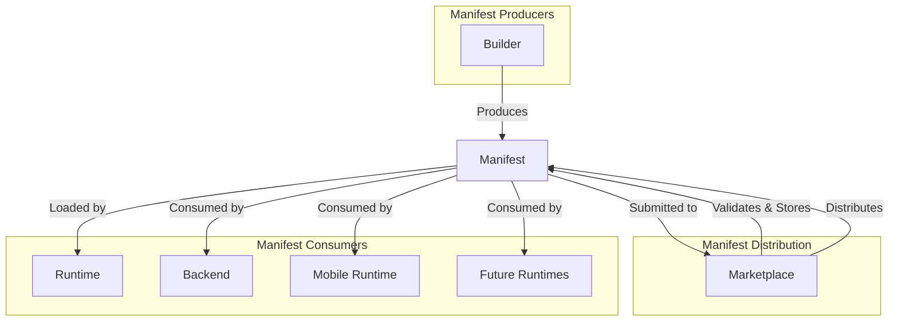
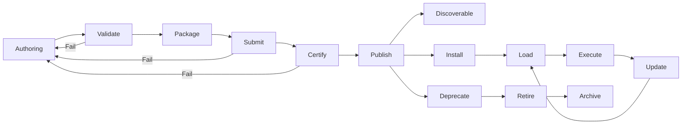
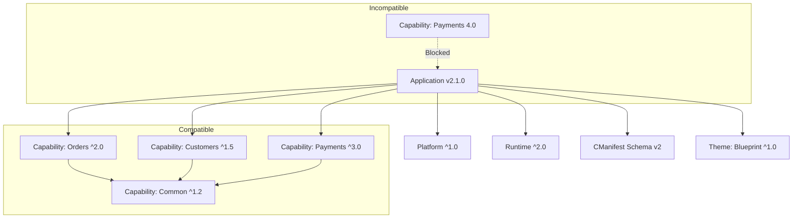
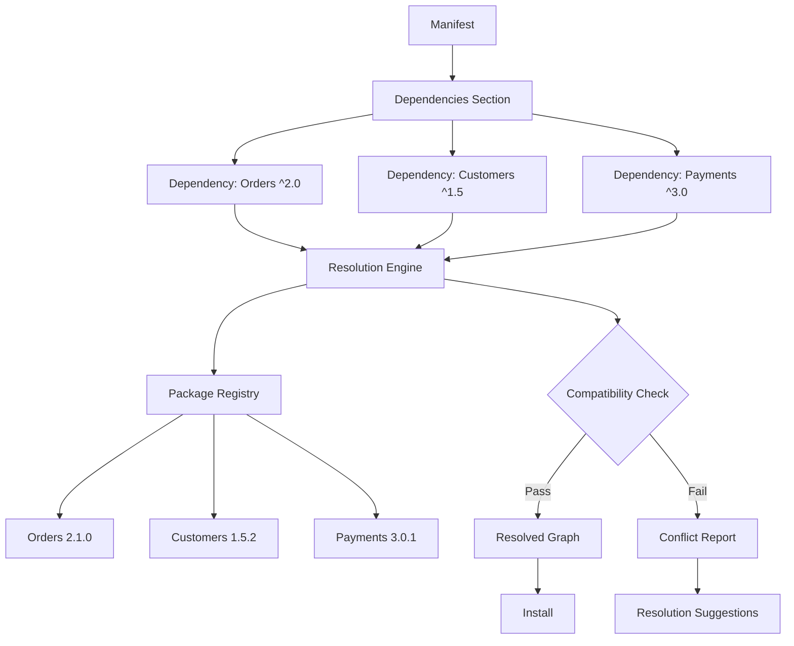
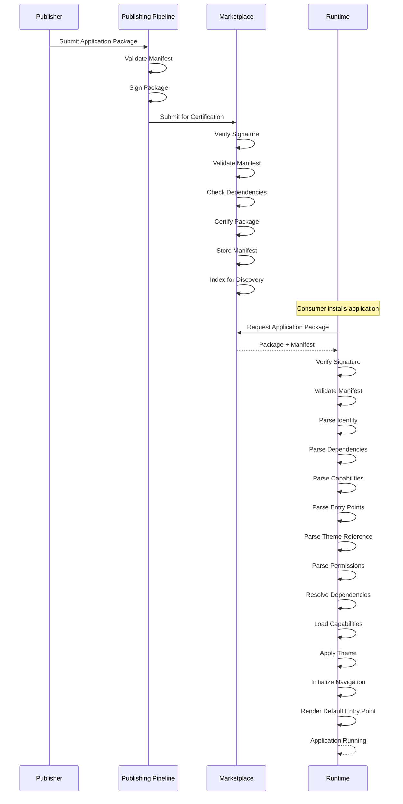
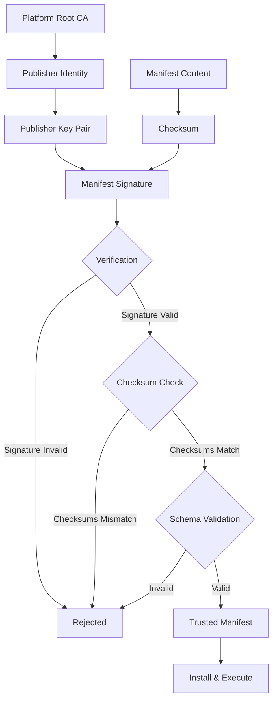
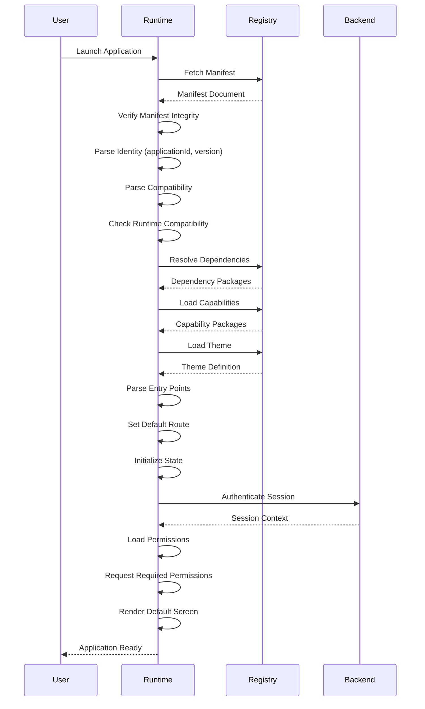

# Application Manifest Specification

**KB-042 — Application Manifest Specification**

| Metadata | |
|----------|---|
| **Document ID** | KB-042 |
| **Title** | Application Manifest Specification |
| **Version** | 0.1.0 |
| **Status** | Drafting |
| **Repository** | KNOWLEDGE-BASE |
| **Suite** | Application Model Architecture |
| **Authors** | Architecture Team |
| **Reviewers** | TBD |
| **Dependencies** | KB-041 Application Architecture Overview, KB-033 Package & Artifact Specification |
| **Related Specifications** | Application Architecture Overview (KB-041), Workspace & Tenant Model (KB-043), Navigation Architecture (KB-044), Screen Model (KB-045), Component Tree Model (KB-046), Package & Artifact Specification (KB-033), Marketplace Architecture (KB-032), Runtime Architecture Overview (KB-051) |
| **Last Updated** | 2026-07-10 |
| **Intended Audience** | Platform architects, application model engineers, Builder engineers, Runtime engineers, Marketplace engineers, Backend engineers, Mobile engineers, SDK developers, ecosystem partners |

---

### Revision History

| Version | Date | Author | Change |
|---------|------|--------|--------|
| 0.1.0 | 2026-07-10 | AI Architecture Agent | Initial draft |

---

## Executive Summary

The Application Manifest is the canonical contract of every DUKADESK application. It is the authoritative declaration of an application's identity, metadata, capabilities, compatibility requirements, dependencies, entry points, governance information, and lifecycle metadata. It is the first document read by every major subsystem of DUKADESK.

The Builder produces the Manifest when an application is composed. The Marketplace validates and stores the Manifest when an application is published. The Runtime loads the Manifest when an application is executed. The Backend consults the Manifest to understand application requirements. The Mobile Runtime uses the Manifest to bootstrap the tenant experience. Every future Runtime — desktop, web, embedded — begins its lifecycle by reading the Manifest.

The Manifest enables every subsystem to understand an application before it is installed or executed. It describes what an application is, what it requires, what it exposes, and how it should be managed — without containing any executable business logic. It is pure metadata, structured for machine consumption and designed for human comprehension.

This document defines the canonical Manifest structure, its sections, its validation rules, its lifecycle, and its relationships to every platform subsystem. It is the authoritative reference for everyone who produces, consumes, validates, or manages DUKADESK Application Manifests.

---

## 1. Purpose

The Application Manifest exists to:

**Identify an Application** — Every application has a unique identity declared in its Manifest. The identity is used by the Marketplace for distribution, the Runtime for execution, the Backend for service routing, and administrators for management.

**Describe Its Metadata** — The Manifest carries all metadata about the application — name, description, category, tags, publisher, license, documentation, and support information. Metadata drives discovery in the Marketplace and informs consumers about the application's purpose and terms.

**Declare Capabilities** — The Manifest declares which capabilities the application requires. Capability declarations enable the Runtime to resolve and activate the correct capability packages, and enable the Marketplace to validate compatibility before installation.

**Declare Dependencies** — The Manifest declares all dependencies — other applications, capabilities, components, themes, platform versions, and Runtime versions. Dependency declarations enable deterministic resolution, compatibility validation, and safe updates.

**Define Compatibility** — The Manifest declares which platform versions, Runtime versions, and dependency versions the application is compatible with. Compatibility declarations prevent installation in incompatible environments and enable graceful upgrade planning.

**Provide Entry Points** — The Manifest identifies the application's entry points — the default screen, workspace entry points, deep-link targets, notification targets, and QR code targets. Entry points enable the Runtime to bootstrap the application correctly.

**Reference Themes and Assets** — The Manifest references the application's theme, logos, icons, fonts, images, and localization resources. References enable the Runtime to load the correct visual identity without embedding assets in the Manifest.

**Support Governance** — The Manifest declares policies, permissions, and governance metadata that control how the application is managed. Governance declarations enable the Platform to enforce organizational policies.

**Enable Validation** — The Manifest is the primary input to all validation systems — structural validation, dependency validation, compatibility validation, security validation, and policy validation. Validation ensures that applications are safe and compatible before they reach users.

**Support Lifecycle Management** — The Manifest carries lifecycle metadata — version, publication date, certification status, deprecation status, and retirement information. Lifecycle metadata enables the Marketplace and Platform to manage applications through their entire lifecycle.

---

## 2. Scope

### In Scope

The Manifest governs:

| Domain | Elements |
|--------|----------|
| **Application Identity** | Application ID, slug, display name, namespace, publisher, marketplace identifier |
| **Metadata** | Description, category, tags, license, documentation, support, website |
| **Publisher Information** | Publisher ID, organization, contact, verification status |
| **Version Information** | Semantic version, build metadata, release channel, LTS designation |
| **Compatibility Declarations** | Platform versions, Runtime versions, dependency version constraints |
| **Dependency Declarations** | Internal dependencies, external dependencies, optional/required, version ranges |
| **Capability Declarations** | Required capabilities, optional capabilities, capability version constraints |
| **Navigation Entry Points** | Default entry point, workspace entry points, deep-link targets, notification targets |
| **Theme References** | Theme ID, version constraint, token overrides, mode preferences |
| **Localization References** | Default locale, supported locales, translation resource references |
| **Asset References** | Logo, icons, fonts, images, data files, configuration resources |
| **Permission Declarations** | Required permissions, optional permissions, permission purposes |
| **Policy References** | Governance policies, compliance policies, update policies |
| **Security Declarations** | Integrity metadata, signature references, trust chain |
| **Lifecycle Metadata** | Publication date, certification status, deprecation status, retirement date |

### Out of Scope

The Manifest does not contain:

- **Screen layouts or component trees**: These are defined in Screen Definitions and Component Tree Definitions, which are part of the Application Definition but stored separately from the Manifest.
- **Business data**: Customer records, product catalogs, transaction histories, and other business data are managed by the Backend.
- **Business logic**: Calculations, validations, data transformations, and workflow logic are implemented in Capabilities and Backend services.
- **Executable code**: The Manifest is pure metadata. It never contains scripts, expressions, or executable content.
- **Runtime state**: User sessions, application state, cache contents, and runtime configuration are Runtime concerns.
- **Backend implementation**: API implementations, database schemas, and service configurations belong to the Backend.

---

## 3. Architectural Principles

### Single Source of Truth

The Manifest is the authoritative source for every piece of information it contains. There is no duplicate or override — if the Manifest declares a dependency, that dependency is required. If the Manifest declares compatibility with a platform version, that compatibility is verified. The Manifest is the single source of truth for application identity, metadata, dependencies, and governance.

### Declarative Metadata

The Manifest is pure metadata. It describes what the application is and what it requires — it never describes how those requirements are fulfilled. Declarative metadata enables every subsystem to understand the application without executing any application-specific logic.

### Immutable Releases

Every published Manifest is immutable. Once an application version is published to the Marketplace, its Manifest cannot be modified. Updates are released as new versions with new Manifests. Immutability guarantees that every subsystem sees the same Manifest for a given application version.

### Explicit Dependencies

Every dependency is explicitly declared. The Manifest leaves nothing implicit — all required capabilities, components, themes, platform versions, and Runtime versions are declared. Explicit dependencies enable deterministic resolution, comprehensive validation, and safe updates.

### Version Transparency

Version information is transparent and machine-readable. Every version is semantic, every dependency carries a version constraint, and every compatibility declaration specifies an exact range. Version transparency enables automated dependency resolution, compatibility checking, and update planning.

### Secure by Default

The Manifest operates under a deny-by-default security posture. Permissions are declared rather than assumed. Dependencies are declared rather than discovered. Everything the application needs is explicitly listed. Nothing is implicitly available.

### Backward Compatibility

The Manifest schema is designed for backward compatibility. New fields can be added without breaking existing consumers. Consumers ignore fields they do not understand. The Manifest schema version is declared in the Manifest itself, enabling consumers to adapt to schema changes.

### Extensible Structure

The Manifest supports extension through well-defined extension points. Custom metadata, application-specific configuration, and publisher-specific declarations are supported without modifying the core Manifest schema. Extensions are namespaced to prevent conflicts.

### Runtime Independence

The Manifest is independent of any specific Runtime implementation. It does not reference platform APIs, rendering technologies, or Runtime-specific concepts. Runtime independence ensures that the same Manifest works on mobile, web, desktop, and future runtimes.

---

## 4. Manifest Responsibilities

### What the Manifest Is Responsible For

The Manifest is responsible for:

- **Declaring identity**: Uniquely identifying the application across the entire platform.
- **Describing metadata**: Providing all descriptive information needed by the Marketplace, consumers, and administrators.
- **Declaring dependencies**: Listing every external dependency the application requires.
- **Declaring capabilities**: Listing every capability the application requires.
- **Declaring compatibility**: Specifying which platform, Runtime, and dependency versions are compatible.
- **Providing entry points**: Identifying how users enter the application — default screen, workspace roots, deep links.
- **Referencing themes**: Specifying which visual design system the application uses.
- **Referencing assets**: Specifying where to find logos, icons, fonts, and localization resources.
- **Declaring permissions**: Listing every platform permission the application requires.
- **Declaring policies**: Specifying governance, compliance, and update policies.
- **Carrying lifecycle metadata**: Supporting the application's lifecycle from publication through retirement.

### What the Manifest Is Not Responsible For

The Manifest is not responsible for:

- **Defining screen layouts**: Screen definitions are separate documents within the Application Definition.
- **Defining component trees**: Component trees are part of Screen Definitions, not the Manifest.
- **Defining business logic**: Business logic belongs in Capabilities and Backend services.
- **Defining workflows**: Workflow definitions are separate artifacts.
- **Containing executable code**: The Manifest is pure metadata — it never executes.
- **Storing application state**: State belongs to the Runtime instance.
- **Configuring deployment**: Deployment configuration (environment variables, infrastructure settings) is separate from the Manifest.
- **Specifying UI text content**: Text content belongs to localization resources, not the Manifest.

### Boundary Clarifications

**Manifest vs. Application Definition**: The Manifest is the root document of the Application Definition. The Application Definition includes the Manifest plus all Screen Definitions, Component Tree Definitions, Theme Definitions, Capability Configurations, and other referenced documents. The Manifest is the entry point; the Application Definition is the complete set.

**Manifest vs. Runtime**: The Manifest describes the application. The Runtime executes it. The Manifest is independent of any specific Runtime. The Runtime consumes the Manifest but does not modify it.

**Manifest vs. Builder**: The Builder produces the Manifest. The Manifest does not contain Builder-specific metadata. The Builder and Manifest communicate through the Manifest schema — not through embedded Builder artifacts.

**Manifest vs. Marketplace Package**: The Marketplace Package contains the Manifest plus all packaged artifacts (screens, components, themes, assets). The Manifest is the package's table of contents. The package is the distribution unit; the Manifest is the metadata contract.

**Manifest vs. Deployment Configuration**: Deployment configuration — environment URLs, API endpoints, feature flags — is separate from the Manifest. The Manifest describes what the application is; deployment configuration describes where and how it runs.

---

## 5. Canonical Manifest Structure

### Logical Sections

```
Manifest
├── manifestVersion
├── identity
│     ├── applicationId
│     ├── slug
│     ├── displayName
│     ├── namespace
│     ├── publisher
│     └── marketplaceId
├── metadata
│     ├── description
│     ├── category
│     ├── tags
│     ├── license
│     ├── documentation
│     ├── support
│     ├── website
│     └── icon
├── version
│     ├── semver
│     ├── buildMetadata
│     ├── releaseChannel
│     ├── lts
│     └── changelog
├── compatibility
│     ├── platform
│     ├── runtime
│     ├── manifestSchema
│     └── dependencies
├── dependencies
│     ├── required[]
│     ├── optional[]
│     ├── capabilities[]
│     └── peer[]
├── capabilities
│     ├── required[]
│     ├── optional[]
│     └── configuration
├── entryPoints
│     ├── default
│     ├── workspaces[]
│     ├── deepLinks[]
│     ├── notification[]
│     └── qr[]
├── theme
│     ├── reference
│     ├── version
│     ├── overrides
│     └── modes
├── localization
│     ├── defaultLocale
│     ├── supportedLocales[]
│     └── resources
├── assets
│     ├── logo
│     ├── icons[]
│     ├── fonts[]
│     ├── images[]
│     └── resources[]
├── permissions
│     ├── required[]
│     ├── optional[]
│     └── purposes
├── policies
│     ├── update
│     ├── compliance
│     ├── data
│     └── governance
├── security
│     ├── signature
│     ├── checksum
│     ├── publisherKey
│     └── trustChain
├── observability
│     ├── metrics
│     ├── logging
│     └── tracing
└── lifecycle
      ├── created
      ├── published
      ├── certified
      ├── deprecated
      ├── retired
      └── archived
```

### Section Descriptions

**manifestVersion** — The version of the Manifest schema that this document conforms to. Enables consumers to adapt to schema changes. Independent of the application version.

**identity** — Uniquely identifies the application across the entire platform. Contains the application ID (globally unique, immutable), slug (URL-safe identifier), display name (human-readable), namespace (publisher or organizational scope), publisher (verified publisher identity), and marketplace ID (Marketplace listing reference).

**metadata** — Descriptive information about the application. Contains description (human-readable summary), category (primary classification), tags (ad-hoc categorization), license (license type and terms), documentation (links to documentation), support (support contact information), website (application website), and icon (application icon reference).

**version** — Version information for this specific release. Contains semver (semantic version), buildMetadata (build-specific information), releaseChannel (development, preview, beta, rc, stable, lts), lts (LTS designation and end-of-life date), and changelog (summary of changes in this version).

**compatibility** — Declares which platform, Runtime, and schema versions this application is compatible with. Contains platform (platform version constraints), runtime (Runtime version constraints), manifestSchema (Manifest schema version), and dependencies (global compatibility rules for dependencies).

**dependencies** — Declares all dependencies this application requires. Contains required (mandatory dependencies), optional (nice-to-have dependencies), capabilities (capability dependencies), and peer (peer dependencies that must be provided by the consumer).

**capabilities** — Declares which capabilities this application requires or optionally supports. Contains required (mandatory capabilities), optional (capabilities that enhance functionality when available), and configuration (capability-specific configuration values).

**entryPoints** — Identifies how users enter the application. Contains default (default screen route), workspaces (entry points per workspace), deepLinks (deep-link route mappings), notification (notification tap targets), and qr (QR code scan targets).

**theme** — References the visual design system the application uses. Contains reference (theme package identifier), version (theme version constraint), overrides (theme token overrides for brand customization), and modes (supported theme modes — light, dark, high contrast).

**localization** — Configures locale support for the application. Contains defaultLocale (default locale), supportedLocales (list of supported locales), and resources (references to translation resource files).

**assets** — References static resources the application uses. Contains logo (application logo), icons (application icons at various resolutions), fonts (custom fonts), images (image resources), and resources (other static resources).

**permissions** — Declares which platform permissions the application requires. Contains required (permissions the application cannot function without), optional (permissions that enhance functionality), and purposes (human-readable explanation of why each permission is needed).

**policies** — Declares governance policies that apply to the application. Contains update (update policy — automatic, manual, scheduled), compliance (compliance requirements), data (data retention and privacy policies), and governance (organizational governance policies).

**security** — Carries integrity and trust metadata. Contains signature (digital signature of the Manifest), checksum (integrity checksum), publisherKey (publisher's public key reference), and trustChain (certificate chain for verification).

**observability** — Declares observability preferences. Contains metrics (metrics configuration), logging (logging configuration), and tracing (distributed tracing configuration).

**lifecycle** — Carries lifecycle metadata. Contains created (creation date), published (publication date), certified (certification date and level), deprecated (deprecation date and reason), retired (retirement date), and archived (archive date).

---

## 6. Application Identity

### Canonical Identifiers

| Identifier | Type | Required | Description | Example |
|------------|------|----------|-------------|---------|
| **applicationId** | URN | Yes | Globally unique, immutable identifier. Assigned at creation. Never changes. | `urn:dk:app:com.acme.order-management` |
| **slug** | String | Yes | URL-safe, human-readable identifier. Used in routes and references. May change on rebranding. | `order-management` |
| **displayName** | String | Yes | Human-readable name shown in the Marketplace, launcher, and management interfaces. | "Order Management" |
| **namespace** | String | Yes | Organizational or publisher scope that prevents identifier collisions. | `com.acme` |
| **publisher** | Object | Yes | Verified publisher identity. Contains publisher ID, organization name, and verification status. | `{ id: "pub_acme", name: "Acme Corp", verified: true }` |
| **marketplaceId** | String | No | Marketplace-specific listing identifier. Assigned by the Marketplace upon publication. | `mpkg_acme_ordermanagement` |

### Uniqueness Rules

- **applicationId** must be globally unique across all publishers, tenants, and environments. It is assigned once and never recycled.
- **slug** must be unique within the publisher's namespace. It may be changed by the publisher, but changing the slug after publication breaks existing references.
- **namespace** must be verified before use. The Marketplace verifies namespace ownership through publisher identity verification.
- **marketplaceId** is assigned by the Marketplace upon first publication. It is unique within the Marketplace instance.

### Ownership Rules

- The **publisher** who creates the application owns it. Ownership includes the right to publish, update, deprecate, and retire the application.
- Ownership may be transferred to another publisher through a formal transfer process.
- The Marketplace records ownership history for audit purposes.
- **Tenant Association** is not part of the Manifest — it is established at installation time when the application is installed into a tenant environment.

---

## 7. Versioning Model

### Semantic Versioning

Every application version follows semantic versioning: MAJOR.MINOR.PATCH.

| Component | When to Increment | Example |
|-----------|-------------------|---------|
| **MAJOR** | Breaking changes — screen removal, navigation restructuring, capability replacement, incompatible data model changes | `2.0.0` |
| **MINOR** | Backward-compatible additions — new screens, new capabilities, new actions, new state fields | `1.3.0` |
| **PATCH** | Backward-compatible fixes — bug fixes, security patches, performance improvements, documentation updates | `1.2.4` |

### Build Metadata

Build metadata may be appended to the version: `1.2.3+build.20260710`. Build metadata is informational only — it does not affect version precedence. Consumers should not use build metadata for compatibility decisions.

### Release Channels

| Channel | Stability | Audience | Certification | Version Suffix |
|---------|-----------|----------|---------------|----------------|
| **Development** | Low | Internal developers | None | `-dev.N` |
| **Preview** | Medium | Early adopters, QA | Automated | `-preview.N` |
| **Beta** | Medium | Beta testers | Automated | `-beta.N` |
| **Release Candidate** | High | All consumers | Full | `-rc.N` |
| **Stable** | High | All consumers | Full | None |
| **Long-Term Support** | High | Enterprise consumers | Enterprise | `-lts.N` |

### Long-Term Support

LTS versions receive security patches and critical bug fixes for an extended period. LTS designation is declared in the Manifest's version section and includes:

- LTS version identifier.
- LTS start date.
- LTS end-of-life date.
- Maintenance commitment (security patches, critical fixes).

### Version Constraints

When applications declare dependencies, they use version constraints:

| Constraint | Semantics | Example |
|------------|-----------|---------|
| Exact | Only the specified version | `1.2.3` |
| Compatible | >= version and < next major | `^1.2.3` |
| Patch range | >= version and < next minor | `~1.2.3` |
| Wildcard | Any version | `*` |
| Range | Versions in inclusive range | `>=1.0.0 <2.0.0` |
| Or | Versions matching either | `^1.0.0 \|\| ^2.0.0` |

### Upgrade Rules

- **Patch upgrades**: Should be safe to apply automatically. Contain only bug fixes and security patches.
- **Minor upgrades**: Should be safe to apply with testing. Contain new functionality but no breaking changes.
- **Major upgrades**: Require testing and explicit approval. May contain breaking changes.
- **Pre-release upgrades**: No compatibility guarantees between pre-release versions.

### Downgrade Rules

- Downgrading to a previous version is supported within the same major version.
- Downgrading across major versions may not be supported — data model changes or capability compatibility may prevent it.
- The Marketplace supports rollback to the previous version as a safety net for failed upgrades.

---

## 8. Compatibility Model

### Compatibility Declarations

The Manifest declares compatibility with:

| Target | Declaration | Validation |
|--------|-------------|------------|
| **Platform Version** | Minimum and maximum platform version | Validated at installation and activation |
| **Runtime Version** | Minimum and maximum Runtime version | Validated at installation and runtime loading |
| **Manifest Schema Version** | Supported Manifest schema versions | Validated at Manifest loading |
| **Capability Versions** | Version constraints for each capability | Validated at dependency resolution |
| **Component Versions** | Version constraints for referenced components | Validated at dependency resolution |
| **Theme Versions** | Version constraints for referenced themes | Validated at theme resolution |
| **Marketplace Package Versions** | Version constraints for referenced packages | Validated at installation |

### Compatibility Validation Responsibilities

| System | Responsibility |
|--------|----------------|
| **Builder** | Validates compatibility during authoring. Warns when declared compatibility conflicts with the author's environment. |
| **Marketplace** | Validates compatibility during publication. Blocks publication if compatibility declarations are invalid or untestable. |
| **Runtime** | Validates compatibility during installation and activation. Reports incompatibility errors with clear remediation guidance. |
| **Update Manager** | Validates compatibility during updates. Blocks updates that would violate compatibility constraints. |

### Versioning Contract

The compatibility model establishes a contract:

- **Major versions**: Breaking changes are expected. Consumers must test and potentially modify integration.
- **Minor versions**: New functionality is added. Consumers should upgrade without changes.
- **Patch versions**: Only bug fixes and security patches. Consumers should upgrade without changes or additional testing.
- **Pre-release versions**: No compatibility guarantees. APIs may change between pre-release versions.
- **LTS versions**: Backward-compatible within the LTS major version. Breaking changes are never backported.

---

## 9. Dependency Model

### Dependency Types

| Type | Required | Resolution | Description |
|------|----------|------------|-------------|
| **Required** | Mandatory | Must resolve | Application cannot function without this dependency |
| **Optional** | Optional | Best effort | Application functions with reduced functionality if unresolved |
| **Capability** | Per declaration | Must resolve | Dependency on a specific Marketplace capability |
| **Peer** | Per consumer | Must be provided | Dependency that must be provided by the consuming application or environment |
| **Platform** | Mandatory | Environment check | Dependency on platform or Runtime version |
| **Theme** | Mandatory | Must resolve | Dependency on a visual design system |

### Version Ranges

Dependencies are declared with version ranges that specify acceptable versions:

- **Minimum version**: The earliest version that provides required functionality.
- **Maximum version**: The latest version tested and verified.
- **Preferred version**: The recommended version for optimal compatibility.
- **Excluded versions**: Versions known to be incompatible.

### Dependency Declaration

Each dependency declaration includes:

- **Identifier**: The unique identifier of the dependency package.
- **Version constraint**: The acceptable version range.
- **Type**: Required, optional, or peer.
- **Purpose**: Human-readable explanation of why this dependency is needed.
- **Compatibility**: Additional compatibility rules specific to this dependency.

### Conflict Resolution

When dependency resolution encounters conflicts:

1. The resolver reports the conflict with the full dependency chain.
2. Suggested resolutions include: upgrading one dependent, installing a compatible intermediate version, or forking.
3. Automatic resolution attempts to find a version satisfying all constraints.
4. If no resolution exists, the installation or update is blocked with a clear explanation.

### Circular Dependency Prevention

The Manifest and dependency resolution system prevent circular dependencies:

- Dependency graphs are validated for cycles during publication and installation.
- Cycles are reported with the full dependency chain.
- Circular dependencies must be resolved by the publisher before publication.
- The Manifest cannot reference itself, either directly or transitively.

---

## 10. Capability Declaration

### Declaration Model

Capabilities are declared in the Manifest as references to Marketplace-distributed capability packages. The Manifest does not define capabilities — it declares requirements.

### Required Capabilities

Required capabilities are mandatory for the application to function. The application cannot be activated if a required capability is missing or incompatible.

**Examples**: Commerce, Messaging, Booking, Authentication, Notifications, Payments, Analytics

Each required capability declaration includes:

- **capabilityId**: The unique identifier of the capability.
- **version**: The version constraint.
- **configuration**: Capability-specific configuration (optional).

### Optional Capabilities

Optional capabilities enhance the application when available but are not required for basic functionality.

**Examples**: Loyalty Programs, Advanced Search, Export Tools

Each optional capability declaration includes:

- **capabilityId**: The unique identifier of the capability.
- **version**: The version constraint.
- **features**: Which features of the capability are used (for informational purposes).

### Capability Configuration

Capability configuration is declared in the Manifest to provide default values that the Runtime passes to the capability at activation time. Configuration values are overridable by tenant administrators after installation.

### Clarification

The Manifest declares capability **requirements**, not capability **implementations**. The capability implementation is provided by the Marketplace-distributed capability package. The Manifest says "this application requires the Payments capability" — it does not contain the payment processing logic.

---

## 11. Navigation Entry Points

### Default Entry Point

The default entry point is the screen that users see when they first launch the application. It is declared as a route reference within the application's Navigation Graph.

**Declaration**: `entryPoints.default.route`

### Workspace Entry Points

Each workspace may have its own entry point. Workspace entry points define the root screen for each workspace — the main workspace, the admin workspace, the portal workspace, etc.

**Declaration**: `entryPoints.workspaces[].route`

### Deep-Link Entry Points

Deep-link entry points map external URLs to internal routes. Each deep-link declaration includes:

- **pattern**: The URL pattern to match (e.g., `/orders/:id`).
- **route**: The internal route to navigate to.
- **parameters**: How URL parameters map to route parameters.
- **authentication**: Whether authentication is required.

**Declaration**: `entryPoints.deepLinks[]`

### Notification Entry Points

Notification entry points define what happens when a user taps a notification. Each notification entry point declares:

- **category**: The notification category this entry point handles.
- **route**: The route to navigate to.
- **parameters**: How notification payload parameters map to route parameters.

**Declaration**: `entryPoints.notification[]`

### QR Entry Points

QR entry points define what happens when a user scans a QR code. Each QR entry point declares:

- **pattern**: The QR code data pattern to match.
- **route**: The route to navigate to.
- **parameters**: How QR code data maps to route parameters.

**Declaration**: `entryPoints.qr[]`

---

## 12. Theme & Asset References

### Theme Reference

The Manifest references the application's theme by theme package identifier and version constraint. The theme is loaded from the Marketplace Theme Registry at runtime.

**Declaration**:
- **reference**: Theme package identifier.
- **version**: Theme version constraint.
- **overrides**: Theme token overrides for brand customization (optional).
- **modes**: Supported theme modes — light, dark, high contrast.

### Asset References

The Manifest references static assets by identifier or path. Assets are either bundled with the Application Package or served from the Asset System.

**logo**: The application logo, used in the Marketplace, launcher, and branding.
**icons**: Application icons at various resolutions (16x16, 48x48, 192x192, 512x512).
**fonts**: Custom fonts used by the application.
**images**: Image resources referenced by screens and components.
**resources**: Other static resources (data files, configuration files).

Each asset reference includes:
- **identifier**: The asset identifier.
- **type**: The asset type (image, font, icon, data).
- **url**: The asset URL (for served assets) or path (for bundled assets).
- **checksum**: The asset integrity checksum.

### Localization Resources

Localization resources are referenced by locale. Each locale reference includes:
- **locale**: The locale identifier (e.g., `en-US`, `fr-FR`, `ar-SA`).
- **resources**: References to translation resource files.

The Manifest declares the default locale and the list of supported locales. Localization resources are loaded by the Runtime's Localization Service.

---

## 13. Permission & Policy Declarations

### Permission Declarations

The Manifest declares which platform permissions the application requires. Permission declarations differentiate between required and optional permissions.

**Required Permissions**: Permissions the application cannot function without. Installation is blocked if required permissions are denied.

**Optional Permissions**: Permissions that enhance functionality when granted. The application degrades gracefully when optional permissions are denied.

**Examples**: Camera, Location, Notifications, Contacts, Microphone, Storage, Bluetooth, Calendar.

Each permission declaration includes:
- **permission**: The platform permission identifier.
- **required**: Whether the permission is required or optional.
- **purpose**: Human-readable explanation of why the permission is needed.
- **usage**: How the permission is used (always, only when in use, only once).

### Declaration vs. Runtime Authorization

Permission **declaration** in the Manifest is distinct from permission **authorization** at runtime:

- **Declaration**: The Manifest declares what permissions the application needs. This information is used by the Marketplace to display permission requirements to consumers and by the Runtime to request permissions from the user.
- **Authorization**: The actual permission grant happens at runtime through the platform's permission system. The user may grant or deny each permission. The application must handle both outcomes.

The Manifest's permission declarations are informational and descriptive — they do not grant or enforce permissions.

### Policy Declarations

The Manifest declares governance policies that apply to the application:

**Update Policy**: How updates are applied — automatic, manual, scheduled. Controls whether updates are pushed to consumers or pulled by consumers.

**Compliance Policy**: Regulatory and organizational compliance requirements the application supports — GDPR, HIPAA, SOC 2, PCI-DSS.

**Data Policy**: Data retention, privacy, and sovereignty requirements — data retention period, data export support, data deletion support, data residency requirements.

**Governance Policy**: Organizational governance policies — approval requirements, audit requirements, reporting requirements.

---

## 14. Security Model

### Manifest Integrity

The integrity of the Manifest is protected at every stage of its lifecycle:

- **Authoring**: The Builder validates the Manifest against the schema.
- **Packaging**: The Publishing Pipeline signs the Manifest and computes checksums.
- **Publication**: The Marketplace verifies the signature and checksum before accepting the package.
- **Distribution**: The Manifest is distributed with the package and verified on download.
- **Installation**: The Runtime verifies the Manifest signature and checksum before loading.
- **Execution**: The Runtime may verify Manifest integrity at startup.

### Digital Signatures

Every published Manifest is digitally signed by the publisher:

- The signature covers the entire Manifest content.
- The signature is created with the publisher's private key.
- The publisher's public key is registered with the Marketplace during identity verification.
- The signature is verified by the Marketplace before publication and by the Runtime before loading.

### Tamper Detection

Tampering with the Manifest is detectable at every stage:

- Checksum verification detects content modification.
- Signature verification detects publisher impersonation.
- Schema validation detects structural corruption.
- Cross-referencing with the Marketplace registry detects version mismatches.

### Trust Chain

The trust chain for Manifest verification:

```
Platform Root CA
  ↓
Publisher Identity (verified by Marketplace)
  ↓
Publisher Key Pair (registered with Marketplace)
  ↓
Manifest Signature (signed by publisher)
  ↓
Manifest Content (verified by consumers)
```

### Publisher Verification

Publisher identity is verified before the publisher can publish Manifests:

- Email verification confirms control of the registered email address.
- Domain verification confirms control of the organization domain.
- Organization verification confirms legal entity status (for enterprise publishers).

### Sensitive Metadata Handling

The Manifest does not contain sensitive data:

- Secrets (API keys, passwords, tokens) are never embedded in the Manifest.
- The Manifest references secrets by identifier — the actual secret values are managed by the platform's secret management system.
- Permission declarations describe what permissions are needed — not how they are obtained.

---

## 15. Validation Lifecycle

### Validation Stages

```
Authoring
  ↓
Pre-Packaging
  ↓
Marketplace Submission
  ↓
Certification
  ↓
Installation
  ↓
Runtime Loading
  ↓
Updates
```

#### Authoring Validation

During application authoring in the Builder, the Manifest is validated in real time:

- Schema validation: Manifest conforms to the Manifest schema.
- Reference validation: All references resolve to valid targets.
- Constraint validation: Version constraints are well-formed.
- Uniqueness validation: Application ID is not already in use.

#### Pre-Packaging Validation

Before the application is packaged, the Manifest undergoes comprehensive validation:

- Dependency validation: All dependencies are available and compatible.
- Capability validation: All declared capabilities exist.
- Permission validation: Permission declarations are complete.
- Policy validation: Policy declarations are consistent.

#### Marketplace Submission Validation

When the application is submitted to the Marketplace:

- Signature verification: The Manifest signature is valid.
- Publisher verification: The publisher is verified.
- Duplicate check: The version has not been previously published.
- Compatibility validation: Declared compatibility is testable.

#### Certification Validation

During Marketplace certification:

- Structural validation: Complete structural correctness check.
- Security validation: Manifest does not contain security concerns.
- Documentation validation: Manifest metadata is complete.
- Policy compliance: Manifest policies comply with Marketplace rules.

#### Installation Validation

When the application is installed into a tenant environment:

- Compatibility validation: Declared compatibility matches the target environment.
- Dependency resolution: All dependencies resolve successfully.
- Permission review: Permissions are reviewed by the tenant administrator.

#### Runtime Loading Validation

When the Runtime loads the Manifest:

- Integrity verification: Signature and checksum are verified.
- Schema validation: Manifest conforms to the expected schema version.
- Reference resolution: All references resolve in the Runtime environment.
- Compatibility check: Runtime version is within the declared compatibility range.

#### Update Validation

When an application update is installed:

- Delta validation: Changed fields are validated.
- Compatibility validation: New version is compatible with current dependencies.
- Rollback safety: Previous version is retained for rollback.

---

## 16. Lifecycle Metadata

### Lifecycle Metadata Fields

| Field | Stage | Description |
|-------|-------|-------------|
| **created** | Design | Timestamp when the application was first created |
| **published** | Publication | Timestamp when this version was published |
| **certified** | Certification | Timestamp and certification level |
| **deprecated** | Deprecation | Timestamp, reason, and replacement recommendation |
| **retired** | Retirement | Timestamp when the application was retired |
| **archived** | Archive | Timestamp when the application was archived |

### Governance Ownership

| Role | Responsibility |
|------|----------------|
| **Publisher** | Manages version creation, publication, deprecation, and retirement |
| **Marketplace** | Manages certification, lifecycle enforcement, and archive |
| **Runtime** | Loads and executes the current version; reports lifecycle status |
| **Builder** | Produces the Manifest; validates before packaging |
| **Platform Governance** | Defines lifecycle policies and compliance requirements |

### Lifecycle Transitions

- **Draft to Published**: Publisher submits validated Manifest. Marketplace certifies and publishes.
- **Published to Deprecated**: Publisher declares deprecation with reason and replacement.
- **Deprecated to Retired**: Deprecation period expires or critical event triggers early retirement.
- **Retired to Archived**: Retirement period expires. Administrative action triggers archive.

---

## 17. Observability

### Auditing Metadata

The Manifest carries metadata useful for auditing:

- **Publisher identity**: Who published this version.
- **Publication timestamp**: When this version was published.
- **Certification record**: Certification level, date, and authority.
- **Version history**: Links to previous versions.
- **Dependency manifest**: Complete dependency tree at time of publication.

### Diagnostics Metadata

The Manifest supports diagnostics through:

- **Schema version**: Which Manifest schema version is in use.
- **Compatibility declarations**: What environments are supported.
- **Dependency constraints**: What dependency versions were declared.
- **Lifecycle status**: Current lifecycle state.

### Version Tracking

The Manifest enables version tracking across the ecosystem:

- **Current version**: What version is installed in each tenant.
- **Available updates**: What versions are available for update.
- **Adoption metrics**: How many tenants are running each version.
- **Compatibility analysis**: Which versions are compatible with which environments.

### Compatibility Analysis

The Manifest supports compatibility analysis through:

- **Explicit declarations**: All compatibility constraints are explicit.
- **Machine-readable format**: Declarations are parseable by automated tools.
- **Version transparency**: Version ranges are transparent and auditable.

---

## 18. Failure Scenarios

### Missing Manifests

The application package does not contain a Manifest, or the Manifest is unreadable.

**Detection**: Package validation fails during installation or loading.
**Impact**: Application cannot be installed or loaded. Error is reported with clear message.
**Recovery**: Publisher rebuilds the package with a valid Manifest.

### Invalid Metadata

The Manifest contains metadata that fails schema validation — missing required fields, incorrect types, malformed values.

**Detection**: Schema validation fails during authoring, packaging, submission, or loading.
**Impact**: Application cannot proceed to the next lifecycle stage until metadata is corrected.
**Recovery**: Publisher corrects the invalid metadata and rebuilds.

### Unsupported Runtime Versions

The Manifest declares compatibility with a Runtime version that is not available in the target environment.

**Detection**: Compatibility validation fails during installation or loading.
**Impact**: Application cannot be installed on the current Runtime.
**Recovery**: Runtime is upgraded to a compatible version, or the application is downgraded to a compatible version.

### Dependency Conflicts

Two or more declared dependencies require incompatible versions of the same package.

**Detection**: Dependency resolution fails during installation or update.
**Impact**: Application cannot be installed or updated. Conflict details are reported.
**Recovery**: Publisher resolves the conflict by updating one of the dependencies or relaxing version constraints.

### Corrupted Manifests

The Manifest content has been corrupted — checksum mismatch, truncated content, encoding errors.

**Detection**: Integrity verification fails during download, installation, or loading.
**Impact**: Application cannot be installed or loaded. Error is reported.
**Recovery**: Package is re-downloaded from the Marketplace. If corruption persists, the package is republished.

### Signature Failures

The Manifest signature is invalid — wrong publisher key, expired certificate, tampered content.

**Detection**: Signature verification fails during publication, installation, or loading.
**Impact**: Application is rejected. Security event is logged.
**Recovery**: Publisher re-signs the Manifest with a valid key and republishes.

### Incompatible Capabilities

An application declares a required capability that is incompatible with the current environment or missing.

**Detection**: Capability resolution fails during activation.
**Impact**: Application cannot be fully activated. Capability-dependent features are unavailable.
**Recovery**: Required capability is installed. Optional capability is gracefully degraded.

---

## 19. Anti-Patterns

### Embedding Executable Logic

Including scripts, expressions, or executable content in the Manifest.

**Why discouraged**: The Manifest is pure metadata. Executable content bypasses validation, certification, and sandbox restrictions. It makes the Manifest untrustworthy and non-portable across Runtimes.

### Runtime-Specific Configuration

Including configuration that targets a specific Runtime implementation — platform API references, rendering technology assumptions, device-specific settings.

**Why discouraged**: Runtime-specific configuration couples the Manifest to a specific Runtime. The Manifest must be Runtime-agnostic to support mobile, web, desktop, and future Runtimes.

### Hard-Coded Environment Values

Embedding environment-specific values — URLs, API keys, feature flags — in the Manifest.

**Why discouraged**: Environment values belong in deployment configuration, not the Manifest. Embedding them makes the Manifest environment-specific and prevents the same package from being deployed across development, staging, and production.

### Hidden Dependencies

Using capabilities, components, or themes without declaring them in the Manifest's dependencies section.

**Why discouraged**: Hidden dependencies cause resolution failures, compatibility issues, and runtime errors. Every dependency must be explicitly declared.

### Mutable Manifests

Modifying the Manifest after publication — correcting metadata, updating compatibility, changing dependencies.

**Why discouraged**: Published Manifests are immutable. Modifications invalidate certification, break consumer trust, and make versioning unreliable. Changes must be released as new versions.

### Duplicated Metadata

Including the same information in multiple Manifest sections, or duplicating information that exists in the Marketplace registry.

**Why discouraged**: Duplication creates inconsistency risk. The Manifest is the single source of truth — information should appear in exactly one place.

### Platform-Specific Declarations

Declaring compatibility with a specific operating system, device type, or hardware configuration.

**Why discouraged**: Platform-specific declarations couple the application to specific environments. The Manifest should declare compatibility with platform versions and Runtime versions — not with operating systems or devices.

### Over-Declared Permissions

Declaring more permissions than the application actually needs.

**Why discouraged**: Over-declared permissions violate least-privilege principles, increase security risk, and reduce consumer trust. Applications should declare only the permissions they need.

---

## 20. Future Evolution

### Multi-Runtime Compatibility

The Manifest will evolve to declare compatibility with multiple Runtime types — mobile, web, desktop, embedded, wearable — with different compatibility constraints for each. The same Manifest will enable a single application to target multiple Runtime types.

### Federated Manifests

Manifests that reference external Manifests — composing applications from sub-applications distributed across multiple Marketplace instances. Federated Manifests enable cross-Marketplace application composition.

### AI-Generated Manifests

AI agents that generate Manifests from natural language descriptions — "Create a point-of-sale application with inventory management and payment processing." AI-generated Manifests are validated against the same schema and certification requirements as authored Manifests.

### Modular Manifests

Manifests that support module-level declarations — individual modules within the application have their own identity, version, dependencies, and compatibility declarations. Modular Manifests enable granular versioning and independent module updates.

### Progressive Capabilities

Capability declarations that adapt based on the consumer's environment — declaring different capability requirements for mobile vs. desktop, online vs. offline, premium vs. free tiers.

### Manifest Inheritance

Manifests that extend other Manifests — inheriting metadata, dependencies, capabilities, and policies from a parent Manifest and overriding specific sections. Manifest inheritance enables application families with shared characteristics.

### Environment Overlays

Manifest overlays that apply environment-specific overrides — development API endpoints, staging feature flags, production performance settings — without modifying the base Manifest.

---

## 21. Cross References

| Document | Relationship |
|----------|--------------|
| **KB-041 — Application Architecture Overview** | Parent document defining the Application Model. The Manifest is the root document of every Application. |
| **KB-033 — Package & Artifact Specification** | Defines the package format that contains the Manifest. The Manifest is the package's table of contents. |
| **KB-032 — Marketplace Architecture** | The Marketplace validates, stores, and distributes Manifests. |
| **KB-043 — Workspace & Tenant Model** | Defines workspaces that Manifest entry points reference. |
| **KB-044 — Navigation Architecture** | Defines the navigation structures that Manifest entry points refer to. |
| **KB-045 — Screen Model** | Defines screens that the Manifest references through entry points. |
| **KB-046 — Component Tree Model** | Defines component trees that screens compose. The Manifest references components indirectly through capability and theme declarations. |
| **KB-049 — Theme & Design Token Model** | Defines themes that the Manifest references. |
| **KB-050 — Capability Composition Model** | Defines how capabilities declared in the Manifest are composed into the application. |
| **KB-051 — Runtime Architecture Overview** | The Runtime loads the Manifest as its first operation. The Manifest is the contract between the Application Definition and the Runtime. |
| **KB-040 — Marketplace Distribution & Lifecycle** | Defines the lifecycle that the Manifest's lifecycle metadata supports. |

---

## Required Mermaid Diagrams

### Manifest Position Within the Platform



### Manifest Structure

```mermaid
graph TD
    MAN[Manifest] --> ID[Identity]
    MAN --> META[Metadata]
    MAN --> VER[Version]
    MAN --> COMPAT[Compatibility]
    MAN --> DEPS[Dependencies]
    MAN --> CAP[Capabilities]
    MAN --> EP[Entry Points]
    MAN --> THM[Theme]
    MAN --> LOC[Localization]
    MAN --> AST[Assets]
    MAN --> PERM[Permissions]
    MAN --> POL[Policies]
    MAN --> SEC[Security]
    MAN --> OBS[Observability]
    MAN --> LIFE[Lifecycle]

    ID --> APP_ID[applicationId]
    ID --> SLUG[slug]
    ID --> NAME[displayName]
    ID --> NS[namespace]
    ID --> PUB[publisher]

    COMPAT --> PLAT[Platform]
    COMPAT --> RT_V[Runtime]
    COMPAT --> SCHEMA[Schema Version]

    DEPS --> REQ[Required]
    DEPS --> OPT[Optional]
    DEPS --> PEER[Peer]

    CAP --> REQ_CAP[Required]
    CAP --> OPT_CAP[Optional]

    EP --> DEFAULT[Default]
    EP --> WORKSPACES[Workspaces]
    EP --> DEEP[Deep Links]
    EP --> NOTIF[Notifications]

    THM --> REF[Reference]
    THM --> OVER[Overrides]

    PERM --> REQ_PERM[Required]
    PERM --> OPT_PERM[Optional]

    LIFE --> CREATED[Created]
    LIFE --> PUBLISHED[Published]
    LIFE --> CERTIFIED[Certified]
    LIFE --> DEPRECATED[Deprecated]
    LIFE --> RETIRED[Retired]
```



### Manifest Lifecycle



### Version & Compatibility Relationships



### Dependency Resolution Overview



### Publisher → Marketplace → Runtime Flow



### Security & Trust Chain



### Validation Pipeline

```mermaid
flowchart LR
    subgraph "Authoring Validation"
        A1[Schema Check]
        A2[Reference Check]
        A3[Constraint Check]
    end

    subgraph "Packaging Validation"
        P1[Dependency Resolution]
        P2[Capability Check]
        P3[Permission Check]
    end

    subgraph "Marketplace Validation"
        M1[Signature Verify]
        M2[Publisher Verify]
        M3[Compatibility Check]
    end

    subgraph "Certification Validation"
        C1[Structural Review]
        C2[Security Scan]
        C3[Policy Check]
    end

    subgraph "Installation Validation"
        I1[Env Compatibility]
        I2[Dependency Resolve]
        I3[Permission Review]
    end

    subgraph "Runtime Validation"
        R1[Integrity Verify]
        R2[Schema Validate]
        R3[Compatibility Check]
    end

    A1 --> A2 --> A3 --> P1 --> P2 --> P3
    P3 --> M1 --> M2 --> M3
    M3 --> C1 --> C2 --> C3
    C3 --> I1 --> I2 --> I3
    I3 --> R1 --> R2 --> R3
```



### Application Bootstrap Using the Manifest



### Cross-System Manifest Consumption

```mermaid
graph TD
    MANIFEST3[Manifest] -->|Builder Reads| BUILDER_USE[Validate Structure]
    MANIFEST3 -->|Builder Reads| BUILDER_REF[Check References]

    MANIFEST3 -->|Marketplace Reads| MP_ID[Register Identity]
    MANIFEST3 -->|Marketplace Reads| MP_META[Index Metadata]
    MANIFEST3 -->|Marketplace Reads| MP_DEPS[Resolve Dependencies]
    MANIFEST3 -->|Marketplace Reads| MP_CERT[Track Certification]

    MANIFEST3 -->|Runtime Reads| RT_ID[Identify Application]
    MANIFEST3 -->|Runtime Reads| RT_COMPAT[Check Compatibility]
    MANIFEST3 -->|Runtime Reads| RT_DEPS[Load Dependencies]
    MANIFEST3 -->|Runtime Reads| RT_CAP[Activate Capabilities]
    MANIFEST3 -->|Runtime Reads| RT_EP[Set Entry Points]
    MANIFEST3 -->|Runtime Reads| RT_THEME[Apply Theme]
    MANIFEST3 -->|Runtime Reads| RT_PERM[Request Permissions]

    MANIFEST3 -->|Backend Reads| BE_SVC[Route Services]
    MANIFEST3 -->|Backend Reads| BE_AUTH[Configure Auth]

    MANIFEST3 -->|Mobile Reads| MOB_BOOT[Bootstrap Experience]
    MANIFEST3 -->|Mobile Reads| MOB_THEME[Load Theme]
    MANIFEST3 -->|Mobile Reads| MOB_NAV[Configure Navigation]
```



---

*This is KB-042, the Application Manifest Specification of the DUKADESK Engineering Knowledge Base. It defines the canonical Manifest that every DUKADESK application requires — the authoritative declaration of identity, metadata, capabilities, compatibility, dependencies, entry points, governance, and lifecycle information. The Manifest is the contract between the Builder, Marketplace, Runtime, Backend, and every client platform. It is the first document read by every major subsystem of DUKADESK.*
