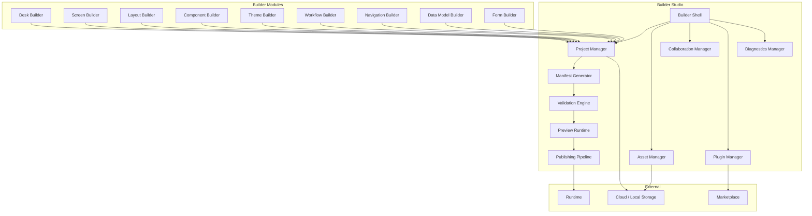
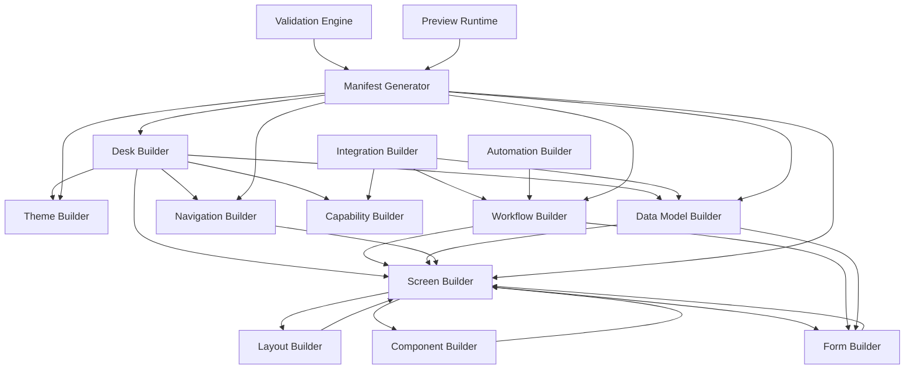
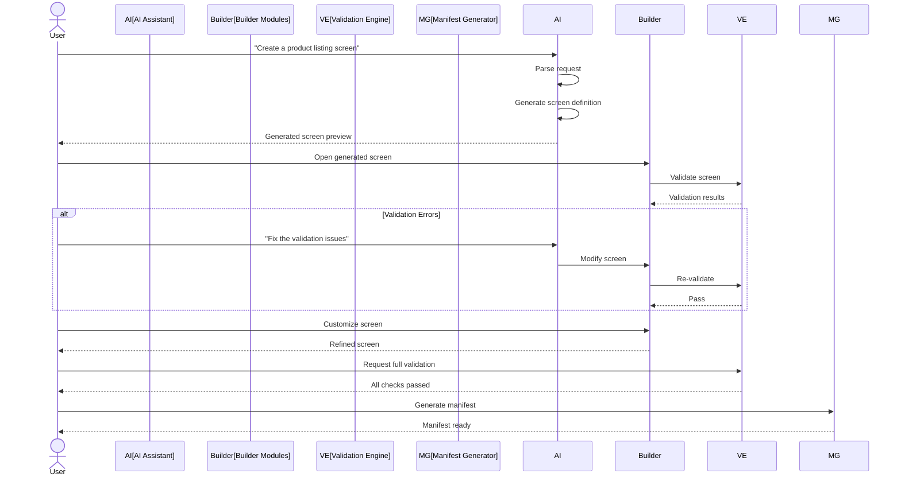
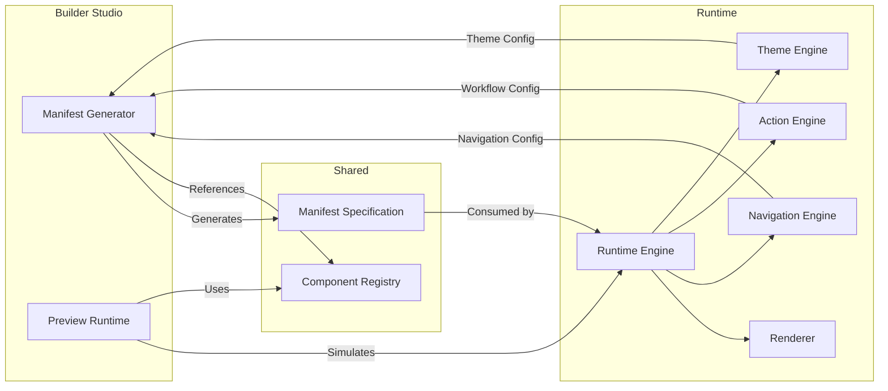

# Builder Studio Architecture

**KB-022 — Builder Studio Architecture Specification**

| Metadata | |
|----------|---|
| **KB ID** | KB-022 |
| **Title** | Builder Studio Architecture |
| **Version** | 0.1.0 |
| **Status** | Drafting |
| **Owner** | Architecture Team |
| **Dependencies** | KB-012 Component Registry, KB-014 Layout System, KB-016 Navigation Engine, KB-017 Theme Engine, Manifest Specification |
| **Related Documents** | Runtime Overview, Manifest Specification, Component Registry (KB-012), Layout System (KB-014), Action Engine (KB-015), Navigation Engine (KB-016), Theme Engine (KB-017), State Management (KB-018), Publishing Pipeline (KB-031) |
| **Review Status** | Pending |
| **Last Updated** | 2026-07-10 |

### Revision History

| Version | Date | Author | Change |
|---------|------|--------|--------|
| 0.1.0 | 2026-07-10 | AI Architecture Agent | Initial draft |

---

## 1. Purpose

Builder Studio is the visual application development environment of the DUKADESK Platform. It enables users to design, configure, assemble, validate, preview, publish, and maintain complete business applications without requiring direct modification of platform runtime code.

Applications are built declaratively because DUKADESK is a manifest-driven platform. The Builder produces declarative artifacts — Manifests, Capability Definitions, Themes, Workflows, Navigation Models, Data Models — that the Runtime interprets. Declarative development separates intent from implementation, enables validation before execution, and allows AI agents to generate and modify applications safely.

The Runtime and Builder are separate systems by design. The Runtime executes applications. The Builder authors them. This separation means:

- **Builder changes** do not affect running applications until published.
- **Runtime improvements** benefit all existing applications without rebuilding.
- **Multiple Builders** (web, desktop, API, AI) can produce compatible artifacts.
- **Validation** occurs at authoring time, not execution time.
- **Versioning** of applications is independent of Runtime versioning.

The Builder outputs declarative artifacts rather than executable platform code because declarative artifacts are portable, auditable, diffable, mergeable, and safe for AI generation. Executable code would tie applications to specific Runtime implementations, prevent static analysis, and introduce security risks from generated code.

Builder Studio supports both low-code and professional development workflows. Business users can compose applications visually using pre-built components and templates. Professional developers can extend every Builder module with custom editors, validators, generators, and integrations. The same architecture serves both audiences.

---

## 2. Builder Philosophy

### Declarative Development

Every artifact produced by the Builder is declarative. Screens, layouts, workflows, themes, navigation, and data models are all defined as structured data — never as imperative code. Declarative artifacts are predictable, testable, and portable across Runtime versions.

### Visual First

The primary interface for application authoring is visual. Screens are composed by dragging components onto a canvas. Workflows are designed by connecting nodes in a graph. Themes are configured through visual property editors. Code editing is available for extension but is never the primary workflow.

### Runtime Compatibility

The Builder produces artifacts that are consumed by the Runtime. Builder and Runtime share the same schema contracts, component registry, and manifest format. Every artifact the Builder produces is validated against the target Runtime version before it is published.

### Manifest-Driven Design

The Manifest is the unit of deployment. The Builder generates Manifests that describe complete applications: screens, navigation, workflows, data models, themes, and capabilities. The Runtime consumes Manifests and produces running applications. There is no compilation step — the Manifest is the application.

### Extensibility

Every Builder module is extensible through the Plugin Manager. Third-party developers can add new editors, validators, generators, palette items, and integrations. The Builder itself is a platform, not a fixed application.

### Modular Builders

The Builder is composed of specialized sub-builders, each responsible for a specific domain: Desk Builder, Screen Builder, Layout Builder, Component Builder, Workflow Builder, Theme Builder, Data Model Builder, and so on. Each sub-builder is independent but integrated through the Builder Shell.

### AI-Assisted Development

AI agents are first-class participants in the Builder workflow. They can generate screens, workflows, forms, themes, and documentation. They can explain validation errors, suggest refactorings, and recommend components. But all AI output remains subject to Builder validation — AI is an assistant, not an authority.

### Collaboration

Multiple users can work on the same Desk simultaneously. The Collaboration Manager supports teams, comments, reviews, version history, change tracking, and approval workflows. Builder projects are collaborative by default.

### Version Awareness

Every artifact in a Builder project carries version metadata. The Builder tracks which Runtime version a project targets, which component versions are used, and which capability versions are referenced. Version conflicts are detected and reported at authoring time.

### Technology Independence

The Builder is not tied to any specific rendering technology, UI framework, or deployment target. The same Builder project can produce applications for Mobile, Web, Desktop, Kiosk, and future platforms. Technology-specific concerns are handled by the Runtime, not the Builder.

---

## 3. Builder Responsibilities

### Project Creation

Initialize new Builder projects with Desk structure, default modules, template selection, and target Runtime configuration.

### Desk Configuration

Configure Desk-level properties: identity, branding, supported platforms, default locale, default theme, capability requirements, and tenant settings.

### Manifest Generation

Produce valid, schema-compliant Manifest artifacts from the user's visual and declarative project configuration. Manifest generation is the central output of the Builder.

### Capability Configuration

Install, configure, and customize capabilities within a Desk. Capability configuration includes setting capability-specific options, mapping data sources, and defining capability-scoped behaviors.

### Workflow Design

Design business workflows using a visual workflow editor. Workflows define sequences of steps, decision points, data mappings, and integration calls.

### UI Composition

Compose application screens by dragging and configuring components on a visual canvas. UI composition covers layouts, containers, components, navigation elements, and responsive variants.

### Theme Design

Create and customize themes using visual theme editors. Theme design covers colors, typography, spacing, shapes, elevations, icons, and brand-specific overrides.

### Data Modeling

Define data models, entity relationships, field schemas, validation rules, and data source bindings. Data models are the foundation for forms, lists, and detail views.

### Validation

Validate all project artifacts against schema definitions, platform standards, security policies, accessibility requirements, and publishing readiness criteria. Validation runs continuously during authoring and on demand.

### Preview

Provide live, interactive preview of the Desk as it would appear on target platforms. Preview supports responsive device simulation, theme switching, capability simulation, and mock data.

### Packaging

Assemble validated project artifacts into deployable packages. Packaging includes dependency resolution, asset bundling, version pinning, and integrity verification.

### Publishing

Submit packaged Desks to the Publication Pipeline for deployment to target environments. Publishing includes versioning, release notes, approval workflows, and deployment targeting.

### Collaboration

Support multi-user project editing, comments, review workflows, change history, and approval gates. Collaboration features are integrated into every Builder module.

### Version Management

Track project versions, support branching and merging concepts, maintain change history, and enable rollback to previous versions.

### Documentation Generation

Auto-generate documentation from project artifacts: screen descriptions, workflow documentation, data model references, and API documentation.

### Responsibility Boundaries

| Responsibility | Owner | Notes |
|---------------|-------|-------|
| Project creation | Builder Studio | Project Manager |
| Manifest generation | Builder Studio | Manifest Generator |
| Workflow execution | Runtime | Builder designs workflows; Runtime executes them |
| Screen rendering | Runtime | Builder designs screens; Runtime renders them |
| Validation | Builder Studio | Validation Engine — pre-publication |
| Preview | Builder Studio | Preview Runtime — simulated environment |
| Publishing | Builder Studio | Publishing Pipeline |
| Deployment | Runtime | Runtime loads published Manifests |
| Artifact storage | Builder Studio | Asset Manager |
| Collaboration | Builder Studio | Collaboration Manager |

---

## 4. Builder Architecture

### 4.1 Builder Shell

| Aspect | Description |
|--------|-------------|
| **Purpose** | The host environment that integrates all Builder modules, editors, panels, and services into a cohesive user interface. |
| **Responsibilities** | Manage workspace layout, host editors and panels, coordinate module lifecycle, provide common services (theming, localization, keyboard shortcuts). |
| **Inputs** | Project data, user interactions, plugin registrations. |
| **Outputs** | Integrated Builder workspace UI. |
| **Extension points** | Custom panels, custom editors, workspace layout presets, theme overrides. |

### 4.2 Project Manager

| Aspect | Description |
|--------|-------------|
| **Purpose** | Manage the lifecycle of Builder projects — creation, opening, saving, versioning, and closing. |
| **Responsibilities** | Initialize project structure, load and save project files, manage project metadata, handle project migration across versions. |
| **Inputs** | Project CRUD commands, file system or cloud storage. |
| **Outputs** | Project data, project metadata, version history. |
| **Extension points** | Custom project storage backends, project templates, migration handlers. |

### 4.3 Manifest Generator

| Aspect | Description |
|--------|-------------|
| **Purpose** | Produce valid, schema-compliant Manifest artifacts from the project's visual and declarative configuration. |
| **Responsibilities** | Translate project state into Manifest format, resolve references, inline assets where appropriate, ensure schema compliance. |
| **Inputs** | Project state from all Builders. |
| **Outputs** | Manifest JSON, validation reports. |
| **Extension points** | Custom manifest output formats, pre-generation hooks, post-generation processors. |

### 4.4 Validation Engine

| Aspect | Description |
|--------|-------------|
| **Purpose** | Validate all project artifacts against schema, standards, policies, and readiness criteria. |
| **Responsibilities** | Run validation rules continuously, report errors and warnings, block publishing on critical errors, provide actionable fix suggestions. |
| **Inputs** | Project state, validation rule definitions, schema definitions. |
| **Outputs** | Validation results (errors, warnings, info), fix suggestions. |
| **Extension points** | Custom validation rules, custom severity levels, external validators. |

### 4.5 Preview Runtime

| Aspect | Description |
|--------|-------------|
| **Purpose** | Provide a simulated Runtime environment within the Builder for live preview of applications. |
| **Responsibilities** | Load project artifacts, simulate Runtime execution, render screens, execute workflows (in simulation), provide responsive preview, support mock data. |
| **Inputs** | Project artifacts from Manifest Generator, device context, theme selection. |
| **Outputs** | Rendered application preview. |
| **Extension points** | Custom device presets, custom mock data providers, preview plugins. |

### 4.6 Publishing Pipeline

| Aspect | Description |
|--------|-------------|
| **Purpose** | Package validated project artifacts and submit them to target environments. |
| **Responsibilities** | Resolve dependencies, bundle assets, create versioned releases, submit to target, handle rollback. |
| **Inputs** | Validated project state, publishing configuration (target environment, version, release notes). |
| **Outputs** | Published release, deployment confirmation. |
| **Extension points** | Custom publishing targets, custom bundling strategies, post-publish hooks. |

### 4.7 Asset Manager

| Aspect | Description |
|--------|-------------|
| **Purpose** | Manage all project assets — images, icons, fonts, documents, media files, and binary resources. |
| **Responsibilities** | Import assets, organize in project structure, optimize for target platforms, handle asset versioning. |
| **Inputs** | Asset files, import commands, optimization requests. |
| **Outputs** | Managed asset library, optimized asset variants. |
| **Extension points** | Custom asset processors, asset source integrations (DAM, cloud storage). |

### 4.8 Collaboration Manager

| Aspect | Description |
|--------|-------------|
| **Purpose** | Enable multi-user collaboration on Builder projects. |
| **Responsibilities** | Manage user presence, coordinate edits, handle merge conflicts, manage comments and reviews, track change history. |
| **Inputs** | User actions, presence data, comment submissions. |
| **Outputs** | Synchronized project state, notifications, activity feed. |
| **Extension points** | Custom collaboration protocols, external review system integration. |

### 4.9 Plugin Manager

| Aspect | Description |
|--------|-------------|
| **Purpose** | Manage Builder extensions — plugins, themes, editors, validators, and integrations. |
| **Responsibilities** | Discover installed plugins, load and unload plugins, manage plugin lifecycle, provide plugin API. |
| **Inputs** | Plugin packages, plugin registration requests. |
| **Outputs** | Loaded plugins, plugin API surfaces. |
| **Extension points** | Plugin registration API, plugin settings UI, plugin marketplace integration. |

### 4.10 Diagnostics Manager

| Aspect | Description |
|--------|-------------|
| **Purpose** | Collect and expose diagnostic information about Builder operations. |
| **Responsibilities** | Log operations, track performance metrics, capture errors, expose health status. |
| **Inputs** | Events from all other modules. |
| **Outputs** | Diagnostic logs, metrics, health status, error reports. |
| **Extension points** | Custom diagnostic sinks, metrics exporters, error reporting services. |

### Builder Studio Architecture Diagram

---

## 5. Builder Workspace

The Builder workspace is the user interface environment that hosts all Builder modules, editors, panels, and services. The workspace is organized into logical areas.

### Navigation

The primary navigation structure of the workspace. Provides access to all Builder modules, recent projects, marketplace, settings, and help. Navigation may be organized as a sidebar, top bar, or adaptive layout depending on screen size and user preference.

### Explorer

A tree view of the current project's structure: Desks, screens, components, workflows, data models, themes, assets, and configuration files. The Explorer supports filtering, searching, drag-and-drop reorganization, and context menus for common operations.

### Editors

Dedicated editing surfaces for each Builder module. Each editor is specialized for its domain:
- **Screen Editor**: Visual canvas with component palette, property inspector, outline panel.
- **Workflow Editor**: Node-graph editor with step palette, connection routing, data mapping panel.
- **Theme Editor**: Visual token editor with live preview, color picker, typography controls.
- **Data Model Editor**: Entity-relationship diagram with field editor, validation rule editor.

### Canvas

The primary visual editing surface. The Canvas renders a live representation of the artifact being edited — a screen, a layout, a form, a workflow graph. The Canvas supports zoom, pan, selection, drag-and-drop, alignment guides, and grid overlays.

### Property Inspector

A context-sensitive panel that displays editable properties for the currently selected element — a component, a container, a workflow step, a data model field. The Property Inspector renders appropriate controls based on the property type: text fields, dropdowns, color pickers, toggle switches, code editors for expressions.

### Outline

A tree representation of the current artifact's structure. For screens, the Outline shows the component hierarchy. For workflows, it shows the step sequence. The Outline enables selection, reordering, grouping, and quick navigation within complex artifacts.

### Problems Panel

Displays validation results — errors, warnings, and informational messages. Problems are grouped by severity and category. Each problem includes a description, location, and actionable fix suggestion. Clicking a problem navigates to the relevant editor and selects the affected element.

### Console

A developer-oriented panel that displays logs, diagnostics, preview errors, and network activity. The Console is primarily used by professional developers and is hidden by default in low-code workflows.

### Preview

An embedded instance of the Preview Runtime that renders the current project or the currently edited screen. The Preview supports device frame selection, orientation toggle, theme switching, and mock data configuration. The Preview updates in real time as the user edits.

### AI Assistant Panel

A conversational interface for AI-assisted development. The AI Assistant can respond to natural language requests: "Create a product listing screen", "Add validation to this form", "Explain this validation error", "Suggest a color palette". The AI Assistant operates within the project context and produces editable artifacts.

### Marketplace

An in-workspace browser for the Builder Marketplace. Users can discover, install, and manage extensions, themes, component packs, capability templates, and workflow templates. Installed items appear in the appropriate Builder modules automatically.

### Version Control

Integrated version control UI showing change history, diffs, commit messages, branch/workspace state, and publish history. Version Control supports reverting changes, comparing versions, and viewing project evolution over time.

---

## 6. Builder Modules

### Desk Builder

The Desk Builder is the entry point for project creation and Desk-level configuration. Responsibilities include:

- Creating new Desks from templates or from scratch.
- Configuring Desk identity (name, description, icon, branding).
- Selecting target platforms (mobile, web, desktop, kiosk).
- Configuring default locale, theme, and capabilities.
- Managing Desk-level settings and metadata.

### Screen Builder

The Screen Builder is the primary UI composition tool. Responsibilities include:

- Creating and organizing screens within a Desk.
- Defining screen layouts and responsive variants.
- Placing and configuring components on the canvas.
- Managing screen navigation and transitions.
- Configuring screen-level lifecycle hooks.

### Component Builder

The Component Builder enables creation and customization of reusable components. Responsibilities include:

- Defining component schemas and configuration properties.
- Configuring component events and actions.
- Binding components to data sources.
- Creating component variants and themes.
- Previewing components in isolation.

### Layout Builder

The Layout Builder defines structural templates for screens and sections. Responsibilities include:

- Designing layout templates (column, grid, tabs, split view).
- Defining responsive breakpoints and adaptive behaviors.
- Configuring container properties (spacing, alignment, constraints).
- Creating reusable layout components.
- Previewing layouts across device sizes.

### Theme Builder

The Theme Builder provides visual tools for creating and customizing themes. Responsibilities include:

- Defining color palettes and semantic color tokens.
- Configuring typography (font families, sizes, weights, line heights).
- Setting spacing and sizing scales.
- Configuring shape, elevation, and shadow tokens.
- Creating theme variants (light, dark, high contrast).
- Previewing themes applied to real screens.

### Workflow Builder

The Workflow Builder is a visual workflow design tool. Responsibilities include:

- Defining workflow steps and their order.
- Configuring step types (form, approval, notification, integration, decision).
- Mapping data between workflow steps.
- Defining workflow triggers and conditions.
- Configuring workflow permissions and assignments.
- Testing workflows in simulation mode.

### Navigation Builder

The Navigation Builder defines the application's navigation structure. Responsibilities include:

- Defining navigation roots, stacks, tabs, and drawers.
- Configuring route definitions and parameters.
- Defining navigation guards and permissions.
- Configuring deep link handling.
- Visualizing the navigation graph.

### Data Model Builder

The Data Model Builder defines the application's data layer. Responsibilities include:

- Defining entities, fields, and relationships.
- Configuring field types, validation rules, and defaults.
- Defining data sources and API bindings.
- Configuring offline synchronization behavior.
- Generating forms and list views from data models.

### Form Builder

The Form Builder is a specialized builder for data-entry screens. Responsibilities include:

- Generating forms from data models.
- Configuring form fields and layout.
- Defining validation rules and error messages.
- Configuring form submission behavior.
- Designing multi-step or conditional forms.

### Automation Builder

The Automation Builder defines automated behaviors within the application. Responsibilities include:

- Configuring event-driven automations.
- Defining scheduled tasks and reminders.
- Setting up notification triggers.
- Configuring data processing pipelines.

### Capability Builder

The Capability Builder configures installed capabilities within the Desk. Responsibilities include:

- Installing and enabling capabilities.
- Configuring capability-specific options.
- Mapping capability data sources.
- Defining capability-scoped workflows and screens.

### Integration Builder

The Integration Builder connects the Desk to external systems. Responsibilities include:

- Configuring API connections and authentication.
- Defining data mappings between internal and external schemas.
- Configuring webhook receivers and event subscriptions.
- Testing integrations in sandbox mode.

### Marketplace Manager

The Marketplace Manager handles extension lifecycle within the Builder. Responsibilities include:

- Browsing and searching the Marketplace.
- Installing extensions (themes, components, capabilities, plugins).
- Managing updates and compatibility.
- Reviewing installed extensions.

### Builder Module Relationships Diagram

---

## 7. Project Model

A Builder project represents a complete Desk — a deployable business application. The project model captures every aspect of the application in a structured, declarative format.

### Desk

The top-level project entity. A Desk has:

- Identity (ID, name, description, icon)
- Target platforms
- Default locale
- Supported locales
- Default theme
- Capability requirements
- Version metadata
- Publishing configuration

### Modules

Logical groupings within the Desk. Modules organize screens, workflows, and data models by domain or feature area. Modules may be independently versioned and published.

### Assets

Binary resources used by the application:

- Images, icons, and illustrations.
- Font files.
- Documents and media files.
- Custom component code (where applicable).

### Themes

Design token definitions that control the application's visual appearance:

- Color palettes and semantic colors.
- Typography scales and font families.
- Spacing and sizing scales.
- Shape and elevation tokens.
- Icon set selection.
- Dark mode and high contrast variants.

### Workflows

Business process definitions:

- Workflow steps and transitions.
- Step configurations (forms, approvals, integrations).
- Data mappings between steps.
- Triggers and conditions.
- Permission assignments.

### Screens

UI composition definitions:

- Screen layouts and responsive variants.
- Component trees with property configurations.
- Navigation references.
- Lifecycle hooks.
- Accessibility metadata.

### Navigation

Navigation structure definitions:

- Navigation graphs (tabs, stacks, drawers).
- Route definitions.
- Deep link mappings.
- Guard and permission configurations.

### Data Models

Entity and data source definitions:

- Entity schemas with fields and relationships.
- Validation rules.
- Data source bindings.
- Synchronization policies.

### Configuration

Desk-level configuration:

- Runtime settings.
- Feature flag defaults.
- Service endpoints.
- Integration credentials (references, not values).

### Localization

Translation data for all user-facing strings in the application:

- Locale-specific translations.
- Pluralization rules.
- Date, time, and number formats.

### Documentation

Auto-generated and manually authored documentation for the Desk:

- Screen descriptions.
- Workflow documentation.
- Data model references.
- User guides.

---

## 8. Manifest Generation

### Declarative Generation

The Manifest Generator translates the project's visual and declarative state into structured Manifest artifacts. Generation is a deterministic transformation — the same project state always produces the same Manifest. There is no compilation, code generation, or interpretation step.

### Validation Pre-Generation

Before generating the Manifest, the Validation Engine runs a pre-generation validation pass. This pass checks:

- All required project fields are populated.
- All component references resolve to registered components.
- All workflow references resolve to defined workflows.
- All navigation routes are unique and connected.
- All data model references resolve to defined entities.
- Theme tokens reference valid theme definitions.

### Schema Compliance

The generated Manifest must comply with the Manifest schema definition for the target Runtime version. Schema compliance ensures:

- All required fields are present.
- Field types match the schema.
- Enum values are within allowed sets.
- Structure matches the expected format.
- Version compatibility is maintained.

### Dependency Resolution

The Manifest Generator resolves all dependencies within the project:

- Component dependencies are resolved to specific versions.
- Capability dependencies are included.
- Theme dependencies are bundled or referenced.
- Asset references are resolved to asset paths or inline data.

### Version Compatibility

The generated Manifest includes version metadata:

- The Runtime version the Manifest targets.
- The Builder version that generated it.
- Version of each component and capability referenced.
- Schema version for forward compatibility.

### Capability Integration

Capability configurations are merged into the Manifest during generation:

- Capability-specific screens are included.
- Capability workflows are incorporated.
- Capability navigation contributions are merged.
- Capability data model extensions are applied.

---

## 9. Preview System

### Live Preview

The Preview Runtime provides a live, interactive preview of the Desk within the Builder. As the user edits, the preview updates in real time. The preview is not a static mockup — it is a running instance of the application's screens rendered with actual components.

### Runtime Simulation

The Preview Runtime simulates the actual Runtime environment:

- Component Registry integration.
- Layout System resolution.
- Navigation Engine behavior.
- Action Engine dispatch.
- State Management operations.
- Theme Engine application.

Differences between preview and production are explicitly documented:

- Preview uses mock data by default.
- Preview simulates, but does not execute, backend integrations.
- Preview runs in a simplified security context.
- Preview performance may differ from production.

### Responsive Preview

The Preview supports multiple device frames:

- Phone (multiple sizes: small, medium, large).
- Tablet (portrait and landscape).
- Desktop (multiple resolutions).
- Custom viewport sizing.
- Orientation toggle.
- Pixel density simulation.

### Offline Preview

The Preview can simulate offline conditions:

- Disable network connectivity.
- Verify offline behavior.
- Test sync queue accumulation.
- Preview offline UI states.

### Theme Preview

The Preview supports theme switching:

- Preview any defined theme.
- Switch between light and dark variants.
- Preview high contrast mode.
- Compare themes side by side.

### Capability Preview

The Preview can simulate capability states:

- Capability installed and active.
- Capability installed but inactive.
- Capability not installed.
- Capability loading or error states.

### Mock Services

The Preview uses mock service implementations:

- Mock API responses based on data models.
- Mock authentication (simulate any user role or permission).
- Mock offline conditions.
- Mock device conditions (battery, connectivity, location).

### Test Data

The Preview can be populated with test data:

- Auto-generated data from data models.
- User-defined seed data.
- Imported data from CSV or JSON.
- Data tailored to specific test scenarios.

---

## 10. Validation System

### Validation Layers

The Validation Engine runs multiple validation layers, each targeting a specific aspect of the project.

**Schema Validation** — Validates all artifacts against their schema definitions. Ensures required fields are present, types are correct, and structure is valid.

**Component Validation** — Validates that all component configurations satisfy their component schemas. Checks required properties, valid values, and correct event/action references.

**Navigation Validation** — Validates the navigation graph for completeness and correctness. Detects unreachable routes, orphaned screens, circular navigation, and missing route handlers.

**Workflow Validation** — Validates workflow definitions for correctness. Detects disconnected steps, missing data mappings, circular flows, and invalid step configurations.

**Security Validation** — Validates security configurations. Detects missing permission checks, unprotected routes, exposed credentials, and insecure data bindings.

**Accessibility Validation** — Validates accessibility compliance. Detects missing labels, insufficient color contrast, missing keyboard handlers, and incorrect ARIA roles.

**Performance Validation** — Validates against performance thresholds. Detects excessive component nesting, oversized assets, unoptimized data queries, and missing lazy loading.

**Publishing Readiness** — Validates that the project is ready for publication. Ensures all required fields are populated, all warnings are reviewed, and no critical errors remain.

### Validation Execution

Validation runs in three modes:

- **Continuous**: Background validation as the user edits. Results appear in the Problems Panel in real time.
- **On Demand**: Full validation triggered manually by the user.
- **Pre-Publish**: Full validation as a gate before publishing. Critical errors block publishing.

### Validation Results

Each validation result includes:

- Severity (error, warning, info).
- Category (schema, component, navigation, workflow, security, accessibility, performance, readiness).
- Description of the issue.
- Location in the project (file, path, element ID).
- Fix suggestion (actionable remediation).
- Documentation link (reference to relevant standard or guide).

---

## 11. Collaboration

### Teams

Builder projects are owned by teams. Team members have roles:

- **Owner**: Full project control, including deletion and transfer.
- **Editor**: Can modify project artifacts.
- **Reviewer**: Can view, comment, and approve changes.
- **Viewer**: Read-only access.

### Comments

Team members can add comments to any project artifact:

- Comments on screens, components, workflows, data models.
- Threaded discussions with replies.
- @mentions to notify specific team members.
- Resolved/unresolved states.
- Comment history.

### Reviews

Formal review workflows:

- Request review from specific team members.
- Reviewer examines changes and approves or requests changes.
- Review comments are linked to specific changes.
- Review status is tracked per artifact and per version.

### Shared Editing (Future)

Future support for real-time collaborative editing:

- Multiple users editing the same artifact simultaneously.
- Cursor presence and selection visibility.
- Conflict resolution for concurrent edits.
- Offline editing with merge on reconnect.

### Version History

Every change to the project is recorded in version history:

- Who made the change.
- When the change was made.
- What was changed (diff view).
- Change description.
- Version number or timestamp.

### Change Tracking

The Collaboration Manager tracks changes at the artifact level:

- Added, modified, and deleted artifacts.
- Unpublished changes vs. published versions.
- Changes grouped by session, user, or time period.

### Branching Concepts

Projects support branching for parallel development:

- Main branch represents the published state.
- Feature branches for in-progress work.
- Branch comparison and merge.
- Branch-based preview environments.

### Approval Workflows

Publishing may require approval:

- Define approval gates (number of reviewers, specific roles).
- Approval request and notification.
- Approval history per published version.
- Automatic rollback on rejection.

---

## 12. AI Integration

### Generate Screens

The AI Assistant can generate complete screens from natural language descriptions. Generated screens include layouts, components, configurations, and placeholder data bindings. The user reviews and refines the result through the Screen Builder.

### Generate Workflows

The AI Assistant can generate workflow definitions from process descriptions. Generated workflows include steps, transitions, data mappings, and condition logic. The user reviews and refines the result through the Workflow Builder.

### Generate Forms

The AI Assistant can generate forms from data model descriptions or natural language field specifications. Generated forms include fields, layout, validation rules, and submission configuration.

### Generate Themes

The AI Assistant can generate theme definitions from brand guidelines or visual references. Generated themes include color palettes, typography scales, spacing systems, and component-specific tokens.

### Generate Documentation

The AI Assistant can generate documentation from project artifacts: screen descriptions, workflow documentation, data model references, and user guides.

### Explain Validation Errors

When validation errors occur, the AI Assistant can explain the error in plain language, describe why it matters, and suggest specific fixes. Explanations are context-aware and reference the affected artifact.

### Refactor Projects

The AI Assistant can suggest and execute project refactoring: renaming screens, restructuring navigation, extracting repeated layouts into templates, and consolidating duplicate configurations.

### Optimize Layouts

The AI Assistant can analyze screen layouts and suggest optimizations: reducing nesting depth, improving responsive behavior, fixing accessibility issues, and optimizing for target platforms.

### Recommend Components

Based on the project context, the AI Assistant can recommend components for specific use cases: "This form would benefit from an autocomplete field", "Consider using a data table instead of a list for this multi-column data."

### AI Assistant Principles

- AI generates artifacts; it does not bypass validation.
- AI output is always editable by the user.
- AI operations are logged for audit and improvement.
- AI suggestions are optional — the user makes the final decision.
- AI must cite sources when referencing platform capabilities or components.

### AI Integration Diagram

---

## 13. Runtime Integration

### Runtime

The Builder produces artifacts that the Runtime consumes. The Runtime is the execution environment; the Builder is the authoring environment. They communicate through Manifests.

### Renderer

The Builder's Preview Runtime simulates the Renderer. The Preview Runtime uses the same component rendering pipeline as the production Renderer, ensuring that what the user sees in preview matches what the production Renderer will produce.

### Manifest Specification

The Manifest is the contract between Builder and Runtime. The Builder generates Manifests that conform to the Manifest Specification. The Runtime interprets Manifests to produce running applications. Both systems evolve independently as long as they maintain schema compatibility.

### Component Registry

The Builder references components from the Component Registry. The Builder does not register components — it discovers and configures them. Component registration is handled by the Registry and Capability System. The Builder queries the Registry for component metadata, schemas, and palette information.

### Theme Engine

The Builder's Theme Builder produces theme definitions that the Theme Engine consumes. The Theme Builder outputs theme token definitions; the Theme Engine resolves them at runtime. The Builder preview applies themes using the same resolution logic as the Runtime.

### Navigation Engine

The Builder's Navigation Builder produces navigation definitions that the Navigation Engine consumes. The Navigation Builder defines routes, stacks, tabs, and guards; the Navigation Engine executes them at runtime.

### Action Engine

The Builder's Workflow Builder defines actions and workflows that the Action Engine executes. The Builder configures action triggers, action handlers, and workflow sequences; the Action Engine runs them at runtime.

### Runtime Relationship Diagram

---

## 14. Marketplace Integration

### Installing Extensions

Users discover and install Builder extensions through the Marketplace:

- Editor plugins (custom editors for specific domains).
- Validator plugins (custom validation rules).
- Generator plugins (custom manifest generators).
- Theme packs (pre-built themes and design systems).
- Component packs (industry-specific component collections).
- Capability templates (pre-configured capabilities).
- Workflow templates (pre-built business process templates).
- Screen templates (pre-built screen layouts).

### Installing Themes

Themes from the Marketplace are installed through the Theme Builder:

- Browse theme packs by category and style.
- Preview themes before installation.
- Install themes to the current project.
- Customize installed themes through the Theme Builder.
- Receive theme updates from publishers.

### Installing Components

Component packs from the Marketplace extend the Builder's component palette:

- New components appear in the Screen Builder palette.
- Component schemas and documentation are available immediately.
- Component dependencies are resolved during installation.
- Component updates are managed through the Marketplace Manager.

### Installing Capabilities

Capability templates from the Marketplace provide pre-built functionality:

- Capability includes screens, workflows, data models, and configurations.
- Capability is integrated into the Desk through the Capability Builder.
- Capability components appear in the palette.
- Capability updates are managed through the Marketplace Manager.

### Package Updates

Installed Marketplace packages receive updates:

- Update notifications appear in the Builder.
- Update details include changelog, compatibility notes, and migration guide.
- Updates are applied through the Marketplace Manager.
- Rollback is supported for problematic updates.

### Compatibility Checks

Before installing or updating a Marketplace package, the Builder checks:

- Runtime version compatibility.
- Builder version compatibility.
- Dependency version compatibility.
- Component Registry compatibility.
- No conflicts with existing packages.

---

## 15. Security

### Workspace Permissions

Access to the Builder itself is controlled by workspace permissions:

- Who can create projects.
- Who can access published projects.
- Who can manage team membership.
- Who can install Marketplace extensions.

### Project Permissions

Within a project, permissions are granular:

- **Read**: View project artifacts.
- **Write**: Modify project artifacts.
- **Admin**: Manage project settings and team membership.
- **Publish**: Submit artifacts for publishing.

### Asset Protection

Project assets are protected:

- Assets are stored with access control matching project permissions.
- Assets are scanned for security issues during import.
- Asset URLs are time-limited and signed.
- Assets are not cached in shared or public locations without authorization.

### Secret Handling

Sensitive configuration values (API keys, tokens, passwords) are handled securely:

- Secrets are stored separately from project artifacts.
- Secrets are encrypted at rest.
- Secrets are never included in generated Manifests.
- Secrets are referenced by ID, not by value, in project configuration.
- Secret values are provided at deployment time by the Runtime.

### Publishing Authorization

Publishing to target environments requires authorization:

- Publishing requires the `Publish` permission.
- Publishing may require approval from designated reviewers.
- Publishing to production may have stricter controls than staging.
- Publishing is logged with user identity and timestamp.

### Audit Logging

All significant Builder operations are logged:

- Project creation, modification, and deletion.
- User access and permission changes.
- Publishing events with version information.
- Marketplace installation and updates.
- AI Assistant operations.

---

## 16. Performance

### Incremental Validation

The Validation Engine validates only changed artifacts, not the entire project, during continuous validation. Full validation runs on demand and before publishing. Incremental validation ensures real-time feedback remains fast even for large projects.

### Incremental Manifest Generation

The Manifest Generator generates only the artifacts that have changed since the last generation. Unchanged artifacts are cached and reused. Incremental generation reduces the time between editing and preview updates.

### Large Project Optimization

For projects with many screens, workflows, and data models:

- Lazy loading of project artifacts — only active artifacts are loaded.
- Virtualized artifact lists in the Explorer.
- Deferred validation of artifacts not currently being edited.
- Background preloading of preview data.

### Asset Caching

Assets are cached aggressively:

- Asset metadata is cached in memory during the session.
- Asset binaries are cached on disk.
- Asset transformations (resizing, optimization) are cached per variant.
- Cache is invalidated when assets are modified.

### Preview Optimization

The Preview Runtime is optimized for rapid iteration:

- Preview uses a lightweight Runtime instance optimized for development.
- Component rendering is incremental — only changed components re-render.
- Mock data is loaded lazily.
- Preview startup is parallelized across artifact types.

### Background Processing

Long-running operations (full validation, manifest generation, asset optimization) run in background threads:

- UI remains responsive during background processing.
- Progress is reported through the Problems Panel and status bar.
- Results are delivered incrementally as processing completes.

---

## 17. Observability

### Diagnostics

The Diagnostics Manager exposes:

- Current project state summary.
- Active Builder module list.
- Plugin load status.
- Recent operation history.
- Error log.

### Validation Reports

Validation results are available as structured reports:

- Error and warning counts by category.
- Fix suggestion statistics.
- Validation duration.
- Validation history over time.

### Build Metrics

The Manifest Generator exposes:

- Generation duration.
- Artifact count per type.
- Manifest size.
- Dependency resolution time.

### Preview Metrics

The Preview Runtime exposes:

- Preview startup time.
- Screen render time.
- Component render count.
- Mock data load time.

### Publishing Metrics

The Publishing Pipeline exposes:

- Packaging duration.
- Bundle size.
- Publish duration.
- Target environment details.

### Error Reporting

Errors are captured with full context:

- Error message and stack trace.
- User action leading to the error.
- Project state at the time of error.
- Builder version and plugin versions.

### Performance Profiling

The Diagnostics Manager supports performance profiling:

- Operation timing breakdown.
- Memory usage tracking.
- Module-level performance traces.
- Plugin performance impact measurement.

---

## 18. Anti-Patterns

### Editing Runtime Artifacts Directly

Editing deployed Runtime artifacts instead of the Builder project source is prohibited. The Builder project is the source of truth; Runtime artifacts are generated outputs. Direct edits to Runtime artifacts are overwritten on the next publish and create divergence between the project and the running application.

### Manual Manifest Editing as the Primary Workflow

Using the Builder's visual editors is the intended workflow. Manually editing Manifest JSON as the primary method of application development defeats the purpose of the Builder. Manual editing bypasses validation, breaks collaboration features, and introduces syntax errors. Manual editing is acceptable for advanced use cases but must not be the default workflow.

### Builder-Specific Business Logic

Embedding business logic in Builder configurations that should be in capabilities or services is prohibited. The Builder configures applications; it does not implement business logic. Business logic belongs in capabilities, action handlers, and backend services.

### Duplicate Project Definitions

Maintaining multiple independent project definitions for the same Desk is prohibited. Multiple definitions inevitably diverge, causing confusion about which is authoritative. The project definition is the single source of truth for the Desk.

### Ignoring Validation Warnings

Publishing a project with unresolved validation warnings is strongly discouraged. Warnings may indicate potential runtime issues, performance problems, or accessibility violations. Warnings should be reviewed and resolved before publishing.

### Publishing Without Compatibility Checks

Publishing a project without verifying compatibility with the target Runtime version is prohibited. Runtime incompatibilities cause deployment failures or runtime errors. Compatibility checks are mandatory before publishing.

### Platform-Specific Builder Assumptions

Designing Builder modules that assume specific platform capabilities (iOS gestures, Android back button, web-specific APIs) is prohibited. The Builder is platform-independent. Platform-specific behavior is handled by the Runtime.

### Storing Secrets in Project Artifacts

Including secret values (API keys, tokens, passwords) in project configuration files is prohibited. Secrets must be stored in the secret store and referenced by ID. Including secrets in project artifacts exposes them to all users with project access and includes them in generated Manifests.

### Overriding Runtime Behavior from Builder

Configuring Builder artifacts to bypass or override Runtime security policies, validation rules, or architectural constraints is prohibited. The Runtime enforces platform policies; the Builder must produce artifacts that comply with those policies.

---

## 19. Future Evolution

### AI Pair Programming

Future AI capabilities may evolve to pair programming:

- AI co-pilot that works alongside the user in real time.
- AI suggests modifications as the user edits.
- AI performs multi-step refactoring operations autonomously.
- AI learns from user corrections and adapts its suggestions.

### Natural Language Application Generation

Future versions may support generating complete applications from natural language descriptions:

- "Create a customer management desk with order tracking and reporting."
- AI generates the full project structure, screens, workflows, and data models.
- User reviews and refines each component.
- AI iterates based on user feedback.

### Collaborative Real-Time Editing

Future support for real-time collaborative editing:

- Multiple users editing the same screen simultaneously.
- Cursor and selection visibility.
- Conflict resolution for concurrent edits.
- Integrated communication (voice, video, chat).

### Enterprise Builder Extensions

Enterprise customers may develop custom Builder extensions:

- Custom editors for domain-specific configuration.
- Custom validators for enterprise compliance rules.
- Custom generators for enterprise Manifest formats.
- Integration with enterprise design systems and component libraries.

### Industry-Specific Builder Packs

Industry verticals may have specialized Builder packs:

- **Healthcare**: Patient record editors, compliance validators, HIPAA configuration.
- **Hospitality**: Booking workflow editors, room management screens.
- **Retail**: Product catalog builders, order management workflows.
- **Education**: Course management builders, student progress tracking.

### Cloud Builder

A fully web-based version of Builder Studio:

- No installation required.
- Project storage in the cloud.
- Collaborative editing out of the box.
- Automatic backup and versioning.
- Access from any device.

### Desktop Builder

A native desktop version of Builder Studio with enhanced capabilities:

- Offline project editing.
- Local asset processing.
- Integration with local development tools.
- Enhanced performance for large projects.

### Headless Builder APIs

Programmatic access to Builder functionality through APIs:

- Create and modify projects via API.
- Validate projects programmatically.
- Generate Manifests in CI/CD pipelines.
- Integrate Builder with external development workflows.

---

## 20. Relationship to Other Documents

| Document | Relationship |
|----------|--------------|
| **KB-012 — Component Registry** | Builder discovers and configures components from the Registry. The Registry is the source of component schemas, metadata, and palette items. |
| **KB-014 — Layout System** | Builder's Screen and Layout Builders produce layout definitions that conform to the Layout System specification. |
| **KB-015 — Action Engine** | Builder's Workflow Builder defines actions and workflows that the Action Engine executes at runtime. |
| **KB-016 — Navigation Engine** | Builder's Navigation Builder produces navigation definitions that the Navigation Engine consumes at runtime. |
| **KB-017 — Theme Engine** | Builder's Theme Builder produces theme token definitions that the Theme Engine resolves at runtime. |
| **KB-018 — State Management** | Builder's Data Model Builder and Form Builder define data structures and state that the State Management subsystem manages at runtime. |
| **KB-020 — Offline & Synchronization** | Builder configures offline data requirements and synchronization policies for application data. |
| **KB-023 through KB-031** | Individual Builder module specifications that extend this architecture for specific domains. |
| **Manifest Specification** | The Manifest is the output of Builder Studio and the input to the Runtime. |
| **Runtime Overview** | The Runtime executes what the Builder produces. The two systems are independent but contractually linked through the Manifest. |

---

*This is KB-022, the Builder Studio Architecture specification of the DUKADESK Engineering Knowledge Base. It defines the visual application development environment that enables users to design, configure, assemble, validate, preview, publish, and maintain complete business applications without requiring direct modification of platform runtime code.*
