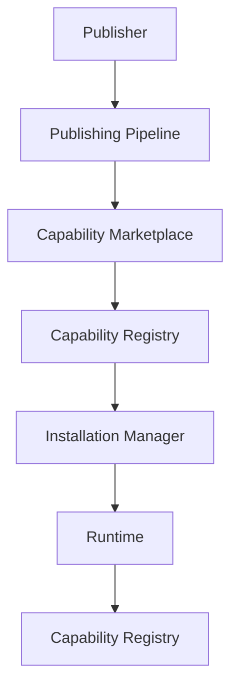
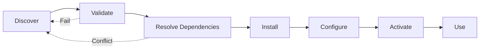
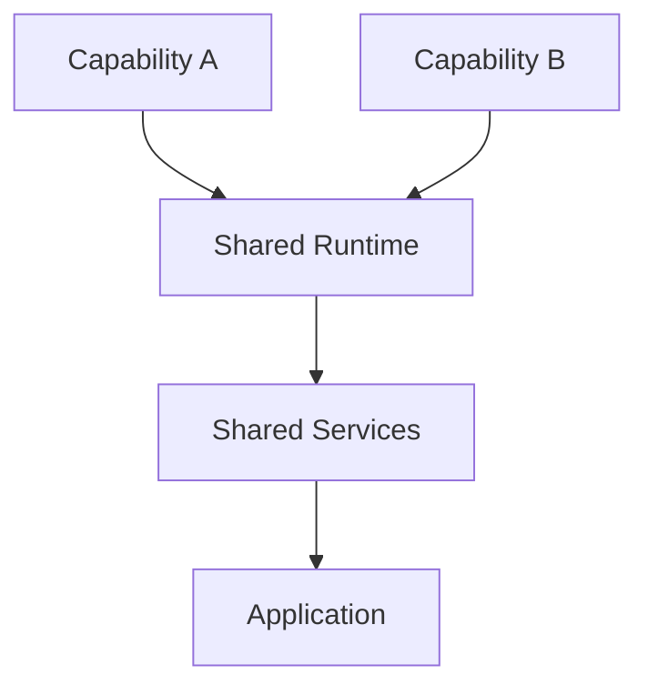
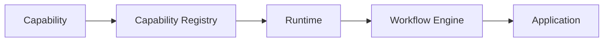

# Capability Marketplace

**KB-035 — Capability Marketplace Specification**

| Metadata | |
|----------|---|
| **KB ID** | KB-035 |
| **Title** | Capability Marketplace |
| **Version** | 0.1.0 |
| **Status** | Drafting |
| **Owner** | Architecture Team |
| **Dependencies** | KB-010 Capability System, KB-032 Marketplace Architecture, KB-033 Package & Artifact Specification, KB-008 Runtime Overview |
| **Related Documents** | Capability System (KB-010), Marketplace Architecture (KB-032), Package & Artifact Specification (KB-033), Extension & Plugin Framework (KB-034), Publishing Pipeline (KB-031), Validation Engine (KB-030), Runtime Overview (KB-008), Builder Studio Architecture (KB-022), Component Registry (KB-012) |
| **Review Status** | Pending |
| **Last Updated** | 2026-07-10 |

### Revision History

| Version | Date | Author | Change |
|---------|------|--------|--------|
| 0.1.0 | 2026-07-10 | AI Architecture Agent | Initial draft |

---

## 1. Purpose

The Capability Marketplace is the Marketplace subsystem responsible for publishing, discovering, installing, composing, upgrading, governing, and retiring reusable business capabilities across the DUKADESK platform. A Capability represents a modular business function packaged according to the Package Specification and executed through the Platform Runtime.

Reusable business capabilities exist because most organizations solve the same business problems — inventory management, customer relationships, accounting, human resources — with different implementations. Without reusable capabilities, every organization builds these functions from scratch, duplicating effort, introducing defects, and creating maintenance burden. The Capability Marketplace makes business functionality reusable at the architectural level.

Business functionality should be modular because monolithic business applications are difficult to maintain, upgrade, and scale. Modular capabilities can be developed, tested, versioned, deployed, and governed independently. An organization can replace its inventory management capability without touching its customer management capability. Modularity reduces risk and accelerates change.

Organizations compose applications from capabilities by selecting, installing, and configuring the business modules they need. A restaurant composes Point of Sale, Menu Management, Online Ordering, and Delivery Tracking capabilities. A clinic composes Patient Management, Appointment Scheduling, Billing, and Electronic Health Records capabilities. The same platform serves both — differentiated by their capability composition, not by custom development.

Capabilities are distributed through the Marketplace because centralized distribution ensures trust, compatibility, and governance. Every capability in the Marketplace is signed, certified, versioned, and dependency-verified. Organizations can discover capabilities, evaluate them through certification metadata and peer usage, install them with dependency resolution, and maintain them through automated updates — all without evaluating each capability's internal implementation.

Capabilities remain independent of implementation technology because the Capability System abstracts business function from technical implementation. A capability's external contracts — screens, workflows, data models, actions, events — are technology-independent. The internal implementation can change without affecting consumers, and consumers can change their technology stack without replacing their capabilities.

---

## 2. Capability Marketplace Philosophy

### Business Modularity

Capabilities are the unit of business modularity. Each capability encapsulates a complete business function — its screens, workflows, data models, forms, configurations, and integrations. Business modularity means an organization can add, remove, upgrade, or replace business functions independently.

### Capability Composition

Capabilities are designed to be composed. A capability may depend on other capabilities, share data models, contribute to shared navigation, and participate in cross-capability workflows. Composition enables organizations to build complex business applications from simple, well-defined building blocks.

### Independent Deployment

Each capability is independently deployable. Installing or upgrading a capability does not require redeploying the entire application. Independent deployment enables continuous improvement without disruption.

### Stable Contracts

Capabilities communicate through stable, versioned contracts. The screens, workflows, data models, actions, and events a capability exposes are its public contract. Breaking changes require major version bumps. Consumers depend on contracts, not implementations.

### Version Compatibility

Every capability version declares its compatibility with platform versions, dependency versions, and other capability versions. Compatibility is verified at install time, update time, and runtime. Incompatible combinations are detected and blocked before they reach production.

### Secure Distribution

Capabilities are distributed through signed, integrity-verified packages. Publisher identity is verified. Package tampering is detectable. Capability permissions are declared in the package and approved at installation. Security is built into the distribution model.

### Enterprise Governance

Organizations control which capabilities their users can install, which publishers are trusted, and which certification levels are required. Governance policies are enforced at the Marketplace level, not at the individual installation level.

### Marketplace Certification

Capabilities undergo certification before appearing in the Marketplace. Certification validates capability quality, security, documentation, and platform compatibility. Certification creates trust and reduces consumer evaluation burden.

### AI-Assisted Discovery

AI agents assist organizations in discovering the right capabilities — recommending capabilities based on business requirements, detecting duplicate functionality, suggesting capability combinations, and predicting compatibility issues.

### Technology Independence

Capability definitions are technology-independent. The same capability package serves mobile, web, desktop, and future platforms. Platform-specific rendering is handled by the Runtime, not by the capability.

---

## 3. Marketplace Responsibilities

### Capability Publishing

Accept capability packages from publishers, validate them against platform standards, certify them for quality and security, and make them available for discovery and installation.

### Discovery

Provide search, browse, filter, and recommendation interfaces for discovering capabilities. Discovery surfaces capabilities by category, business domain, publisher, certification level, compatibility, and usage statistics.

### Installation

Manage the installation of capabilities onto target Desks. Installation includes package resolution, dependency resolution, compatibility verification, permission approval, asset deployment, and capability registration.

### Dependency Resolution

Resolve capability dependencies — required and optional capabilities, shared services, shared data models, and platform version requirements. Resolve dependency conflicts before installation.

### Version Management

Track capability versions, support version selection, manage version compatibility, handle version deprecation, and support rollback to previous versions. Version management covers the entire capability lifecycle.

### Licensing

Manage capability licensing — free, commercial, subscription, enterprise, trial. License enforcement and entitlement verification occur at installation and runtime.

### Updates

Deliver capability updates to installed consumers. Updates preserve consumer configuration, data model compatibility, and workflow continuity. Breaking updates require explicit consumer approval.

### Compatibility Verification

Verify capability compatibility with the target Desk's platform version, installed capabilities, and runtime environment. Compatibility is verified before installation, before updates, and on demand.

### Retirement

Manage the retirement of deprecated capabilities. Retired capabilities are removed from discovery, blocked from new installations, and flagged for existing consumers with migration recommendations.

### Analytics

Collect and report capability usage analytics — installation counts, version distribution, usage frequency, performance metrics, and error rates. Analytics inform publishers and consumers.

### Responsibility Boundaries

| Responsibility | Capability Marketplace | Capability System | Runtime |
|---------------|----------------------|-------------------|---------|
| Capability packaging | Owns package format | Consumes | Loads |
| Discovery | Search and browse | — | — |
| Installation | Package resolution, registration | Activation | Loads registered |
| Dependency resolution | Marketplace-level | Runtime-level | Verifies at load |
| Version management | Releases and deprecation | Declares compatibility | Reads version |
| Licensing | Entitlement and enforcement | — | — |
| Updates | Distribution and notification | Handles migration | Loads new version |
| Compatibility | Pre-install verification | Declares requirements | Runtime validation |
| Certification | Quality and security review | — | — |
| Retirement | Marketplace removal | — | Stops loading |

---

## 4. Capability Marketplace Architecture

### 4.1 Capability Registry

| Aspect | Description |
|--------|-------------|
| **Purpose** | Persistent registry of all published capabilities and their current state. |
| **Responsibilities** | Store capability metadata, track version history, maintain dependency graphs, record installation and usage statistics, support registry queries. |
| **Inputs** | Capability packages from Publishing Pipeline, publisher metadata updates. |
| **Outputs** | Capability search results, metadata responses, dependency graphs. |
| **Extension Points** | Custom registry backends, metadata indexing strategies, regional registry mirrors. |

### 4.2 Discovery Service

| Aspect | Description |
|--------|-------------|
| **Purpose** | Power search, browse, filtering, and recommendation for capability discovery. |
| **Responsibilities** | Index capability metadata, process search queries, apply filters and facets, rank results by relevance and certification, generate recommendations. |
| **Inputs** | Search queries, browse navigation, filter selections, user context. |
| **Outputs** | Search results, category listings, recommendation sets. |
| **Extension Points** | Custom search algorithms, recommendation providers, ranking strategies. |

### 4.3 Dependency Manager

| Aspect | Description |
|--------|-------------|
| **Purpose** | Resolve capability dependencies, verify compatibility, and detect conflicts. |
| **Responsibilities** | Parse capability dependency declarations, resolve dependency graphs, verify version compatibility, detect circular dependencies, report resolution conflicts, manage shared dependency versions. |
| **Inputs** | Capability dependency metadata, installed capability registry, platform version information. |
| **Outputs** | Resolved dependency graph, compatibility reports, conflict descriptions. |
| **Extension Points** | Custom resolution strategies, alternative dependency sources, enterprise dependency overrides. |

### 4.4 Installation Manager

| Aspect | Description |
|--------|-------------|
| **Purpose** | Manage the installation of capabilities onto target Desks. |
| **Responsibilities** | Resolve installation package, verify package integrity, resolve dependencies, obtain permission approvals, deploy assets to target environment, register capability with Capability System, report installation status. |
| **Inputs** | Installation requests (capability ID, version, target Desk), permission approvals. |
| **Outputs** | Installation status, capability registration records. |
| **Extension Points** | Custom installation workflows, pre/post installation hooks, deployment target adapters. |

### 4.5 Compatibility Manager

| Aspect | Description |
|--------|-------------|
| **Purpose** | Validate capability compatibility with target environments before installation and updates. |
| **Responsibilities** | Check platform version compatibility, verify dependency version compatibility, validate Runtime requirements, assess capability interaction compatibility, generate compatibility reports. |
| **Inputs** | Capability compatibility metadata, target environment information, installed capability versions. |
| **Outputs** | Compatibility verification results, compatibility reports. |
| **Extension Points** | Custom compatibility rules, environment-specific compatibility matrices. |

### 4.6 Update Manager

| Aspect | Description |
|--------|-------------|
| **Purpose** | Deliver capability updates to installed consumers. |
| **Responsibilities** | Detect available updates, notify consumers, validate update compatibility, manage update installation, handle breaking changes with consumer approval, preserve consumer configuration during updates, support update rollback. |
| **Inputs** | Updated capability packages, installed consumer registry, compatibility reports. |
| **Outputs** | Update notifications, update installation status. |
| **Extension Points** | Custom update channels, update scheduling policies, staged rollout strategies. |

### 4.7 Licensing Manager

| Aspect | Description |
|--------|-------------|
| **Purpose** | Manage capability licensing — entitlements, enforcement, trials, and billing integration. |
| **Responsibilities** | Verify consumer entitlement for licensed capabilities, manage trial periods, enforce license terms at installation and runtime, integrate with billing systems, report license usage. |
| **Inputs** | License entitlement records, installation requests, runtime license checks. |
| **Outputs** | License grants, license enforcement actions, usage reports. |
| **Extension Points** | Custom license models, billing system integrations, enterprise license management. |

### 4.8 Certification Manager

| Aspect | Description |
|--------|-------------|
| **Purpose** | Manage capability certification — quality, security, documentation, and platform compatibility validation. |
| **Responsibilities** | Define certification criteria, evaluate capability packages against criteria, assign certification levels, manage certification lifecycle, handle certification renewals and revocations. |
| **Inputs** | Capability packages for certification, certification criteria, audit results. |
| **Outputs** | Certification decisions, certification badges, certification reports. |
| **Extension Points** | Custom certification criteria, industry-specific certification packs, automated certification checks. |

### 4.9 Governance Manager

| Aspect | Description |
|--------|-------------|
| **Purpose** | Enforce organizational governance policies for capability discovery, installation, and use. |
| **Responsibilities** | Define organizational capability policies, maintain approved publisher lists, enforce installation approval workflows, manage capability blacklists, audit capability usage. |
| **Inputs** | Organizational policies, installation requests, publisher trust metadata. |
| **Outputs** | Policy enforcement decisions, approval workflow status, audit records. |
| **Extension Points** | Custom governance providers, policy sources, approval workflow engines. |

### 4.10 Diagnostics Manager

| Aspect | Description |
|--------|-------------|
| **Purpose** | Provide health, compatibility, and usage diagnostics for capabilities. |
| **Responsibilities** | Monitor capability health, analyze compatibility status, detect version drift, generate diagnostic reports, provide capability quality scores. |
| **Inputs** | Capability metadata, installation records, compatibility reports, usage statistics. |
| **Outputs** | Diagnostic reports, health status, quality scores. |
| **Extension Points** | Custom diagnostic rules, metric collectors, report renderers. |

---

## 5. Capability Categories

### Business Operations

| Category | Description |
|----------|-------------|
| **Inventory** | Track stock levels, manage warehouses, handle transfers, perform counts, set reorder points, generate inventory reports. |
| **Procurement** | Manage purchase orders, vendor catalogs, requisition workflows, purchase approvals, goods receipt, supplier management. |
| **Warehouse** | Manage warehouse layout, bin locations, pick-pack-ship workflows, receiving, putaway, cycle counting, labor management. |
| **Manufacturing** | Manage bill of materials, production orders, work centers, routing, quality control, batch tracking, shop floor execution. |
| **Logistics** | Manage shipments, carriers, tracking, delivery scheduling, route optimization, freight management, proof of delivery. |

### Customer Management

| Category | Description |
|----------|-------------|
| **CRM** | Manage leads, contacts, accounts, opportunities, sales pipelines, activities, and customer communication history. |
| **Customer Support** | Manage support tickets, knowledge base, service level agreements, customer communication, satisfaction surveys, escalation workflows. |
| **Marketing** | Manage campaigns, email marketing, audience segmentation, content management, marketing automation, analytics and attribution. |
| **Loyalty** | Manage loyalty programs, points accumulation, rewards catalog, tier management, member communication, program analytics. |
| **Sales** | Manage quotations, orders, invoicing, sales contracts, commissions, territory management, sales forecasting. |

### Finance

| Category | Description |
|----------|-------------|
| **Accounting** | Manage general ledger, accounts payable, accounts receivable, chart of accounts, journal entries, financial reporting, period close. |
| **Billing** | Manage invoicing, recurring billing, usage-based billing, dunning, payment collection, billing analytics. |
| **Payments** | Process payments, manage payment gateways, handle refunds, reconcile transactions, support multiple payment methods and currencies. |
| **Budgeting** | Manage budgets, forecasting, variance analysis, budget approvals, scenario planning, financial planning workflows. |
| **Payroll** | Manage employee payroll, tax calculations, deductions, direct deposits, pay stubs, payroll reporting, compliance filings. |

### Human Resources

| Category | Description |
|----------|-------------|
| **Recruitment** | Manage job postings, applicant tracking, interview scheduling, offer management, candidate communication, recruitment analytics. |
| **Employee Management** | Manage employee records, job history, organizational structure, documents, certifications, employee self-service. |
| **Leave** | Manage leave policies, leave requests, approval workflows, attendance tracking, leave balance, leave calendar. |
| **Performance** | Manage performance reviews, goal setting, feedback, performance ratings, development plans, review workflows. |
| **Training** | Manage training courses, enrollments, completions, certifications, training materials, learning paths, compliance training tracking. |

### Productivity

| Category | Description |
|----------|-------------|
| **Projects** | Manage projects, tasks, milestones, dependencies, resource allocation, time tracking, project budgets, project reporting. |
| **Tasks** | Manage personal and team tasks, task lists, assignments, due dates, priorities, task workflows, task automation. |
| **Documents** | Manage document creation, collaboration, versioning, approval workflows, document storage, search, access control. |
| **Meetings** | Manage meeting scheduling, room booking, agenda creation, minutes, action items, meeting reminders, calendar integration. |
| **Collaboration** | Manage team communication, file sharing, announcements, team calendars, collaborative editing, activity feeds. |

### Industry Solutions

| Category | Description |
|----------|-------------|
| **Healthcare** | Patient management, appointment scheduling, electronic health records, medical billing, e-prescriptions, lab integration, HIPAA compliance. |
| **Agriculture** | Crop management, livestock tracking, farm equipment management, harvest planning, supply chain tracking, compliance reporting. |
| **Education** | Student management, course scheduling, enrollment, grading, attendance, learning management, parent communication. |
| **Hospitality** | Property management, booking engine, room management, guest services, housekeeping, point of sale, channel management. |
| **Retail** | Point of sale, omnichannel inventory, customer management, promotions, pricing, vendor management, retail analytics. |
| **Government** | Citizen management, permit and licensing, case management, public records, compliance tracking, service requests. |
| **Energy** | Asset management, meter reading, billing, outage management, field service, energy analytics, regulatory compliance. |

---

## 6. Capability Package Model

| Field | Type | Required | Description |
|-------|------|----------|-------------|
| **capabilityId** | String | Yes | Globally unique identifier. Reverse-domain notation. Immutable. |
| **name** | String | Yes | Machine-readable name. Unique within publisher scope. |
| **version** | String | Yes | Semantic version. |
| **publisher** | String | Yes | Publisher identity reference. |
| **description** | String | Yes | Purpose, features, and typical use cases. |
| **category** | String | Yes | Business category (inventory, crm, accounting, hr, etc.). |
| **businessDomain** | String | Yes | High-level domain (business-operations, customer-management, finance, hr, productivity, industry). |
| **dependencies** | Object[] | No | Required and optional capability dependencies. |
| **runtimeRequirements** | Object | Yes | Minimum Runtime version, required platform features, required device capabilities. |
| **permissions** | String[] | Yes | Permissions required by the capability (data access, device access, network access, storage access). |
| **license** | String | Yes | License type (free, commercial, subscription, enterprise, internal). |
| **certification** | Object | Yes | Certification level and certification metadata. |
| **documentation** | Object | No | Documentation references and included documentation. |
| **supportMetadata** | Object | No | Support contact information, issue tracker, documentation links. |

---

## 7. Capability Composition

### Independent Capabilities

Capabilities that function without requiring other capabilities. Independent capabilities are the simplest building blocks — they provide value on their own and can be installed without dependency resolution.

### Composite Capabilities

Capabilities that compose multiple sub-capabilities into a higher-level business function. A composite capability delegates to its sub-capabilities while presenting a unified interface. Composite capabilities simplify installation — one package installs an entire business domain.

### Shared Services

Capabilities can share runtime services — authentication, notification, search, file storage, audit logging. Shared services are installed once and consumed by multiple capabilities. The Dependency Manager ensures shared services are available before dependent capabilities activate.

### Shared Data Models

Capabilities can share data models — customer data, product catalogs, organizational structures. Shared data models enable cross-capability workflows and unified reporting. Data model ownership and access are defined in the capability contract.

### Shared Navigation

Capabilities contribute to shared navigation — adding routes, tabs, menu items, and deep links to the Desk's navigation structure. Navigation contributions are merged at installation time and can be reorganized by the Desk Builder.

### Shared Workflows

Capabilities can participate in cross-capability workflows — a CRM capability triggering a billing workflow, an inventory capability initiating a procurement workflow. Cross-capability workflows use the Event Bus and Action Engine for loose coupling.

### Cross-Capability Communication

Capabilities communicate through events and action contracts, not through direct references. The Event Bus enables loosely coupled communication. The Action Engine enables capabilities to invoke each other's actions through declared contracts.

---

## 8. Installation Lifecycle

### Discover

The consumer discovers a capability through Marketplace search, browse, recommendations, or direct reference. Discovery surfaces capability metadata — description, category, certification level, publisher, version, dependencies, and ratings.

### Validate

The Installation Manager validates the capability against the target environment — platform version compatibility, dependency availability, permission requirements, licensing entitlement, and organizational policy compliance.

### Resolve Dependencies

The Dependency Manager resolves all required and optional dependencies. Dependencies that are not already installed are added to the installation queue. Dependency conflicts are flagged and must be resolved before proceeding.

### Install

The capability package is resolved, its integrity verified, its assets deployed to the target environment, and its artifacts registered with the appropriate platform registries — Capability Registry, Component Registry, Navigation Engine, Service Registry.

### Configure

The capability's configurable options are presented to the consumer. Configuration may include data source connections, integration endpoints, feature toggles, permission assignments, and theme customizations.

### Register

The capability is registered with the Capability System. Registration makes the capability available for activation. The Capability System verifies capability contracts and dependency integrity during registration.

### Activate

The capability is activated within the Capability System. Activation initializes capability services, registers screens and workflows, subscribes to events, and makes the capability available to users.

### Use

The capability operates normally — users interact with its screens, workflows execute its processes, data models store its data, and integrations communicate with external systems. The capability participates in the Desk alongside other installed capabilities.

### Update

A new version of the capability is published. The Update Manager notifies the consumer, validates compatibility, obtains approval for breaking changes, installs the update, and reactivates the capability.

### Retire

The capability is deprecated by the publisher or retired by the organization. Retired capabilities are deactivated, removed from active use, and their data is migrated or archived according to organizational policy.

---

## 9. Dependency Management

### Required Capabilities

Capabilities that must be installed and active for the capability to function. Required dependencies are resolved and installed before the capability. Installation fails if required dependencies cannot be satisfied.

### Optional Capabilities

Capabilities that enhance the capability when present but are not required. Optional dependencies are installed if available and compatible. The capability degrades gracefully when optional dependencies are absent.

### Shared Capabilities

Capabilities that are shared across multiple consumer capabilities. Shared capabilities are installed once and referenced by all consumers. The Dependency Manager ensures version consistency across shared capability consumers.

### Version Compatibility

Dependencies declare version ranges using semantic versioning. The Dependency Manager resolves version ranges to specific versions. Compatibility is verified against both minimum required versions and maximum tested versions.

### Circular Dependency Detection

The Dependency Manager detects circular dependencies between capabilities. Circular dependencies are reported as validation errors. Installation is blocked until circular dependencies are resolved.

### Conflict Resolution

When two capabilities require incompatible versions of the same dependency, the Dependency Manager reports the conflict with the specific versions, capabilities, and dependency paths involved. Conflicts must be resolved before installation — either by selecting compatible capability versions or by finding alternative capability combinations.

### Upgrade Compatibility

When upgrading a capability, the Dependency Manager verifies that the new version remains compatible with all existing consumers. Breaking changes to shared dependencies are flagged. Consumers are notified of breaking upgrades.

---

## 10. Runtime Integration

### Runtime

The Runtime loads installed capabilities at application startup. Each capability is loaded into the Capability System, which manages its lifecycle — initialization, activation, deactivation, and removal. The Runtime provides the execution context — user identity, permissions, locale, theme — that capabilities consume.

### Capability Registry

The Capability Registry at runtime maintains the active state of all installed capabilities. The Runtime queries the registry to determine which capabilities are available for screen rendering, workflow execution, and action dispatch.

### Component Registry

Capabilities register their screen components, field types, and layout components with the Component Registry. The Screen Builder and Runtime Renderer discover and use components through the registry.

### Navigation Engine

Capabilities contribute navigation routes, tabs, stacks, and deep links to the Desk's navigation structure. The Navigation Engine merges contributions from all active capabilities and presents unified navigation to the user.

### Workflow Engine

Capabilities register their workflow definitions with the Workflow Engine. Workflows are triggered by events, actions, and schedules. Cross-capability workflows orchestrate processes that span multiple capabilities.

### Action Engine

Capabilities register their action types with the Action Engine. Actions are triggered by user interactions, workflow steps, and system events. Capabilities consume actions from other capabilities through declared action contracts.

### State Management

Capabilities declare their state stores, data models, and state persistence rules. State Management provides the runtime infrastructure for capability state — stores, contexts, selectors, and persistence.

### Event Bus

Capabilities publish and subscribe to events through the Event Bus. Events are the primary mechanism for cross-capability communication. Event contracts are declared in capability manifests.

---

## 11. Builder Integration

### Builder Studio

Installed capabilities appear in Builder Studio as available building blocks. The Desk Builder lists installed capabilities alongside available Marketplace capabilities. Capability configuration is accessible through the Builder Studio interface.

### Screen Builder

Capabilities register their screens with the Screen Builder. Screens appear in the screen list and can be customized — layout adjustments, component configuration, action binding — through the Screen Builder.

### Workflow Builder

Capabilities register their workflow definitions with the Workflow Builder. Workflows appear in the workflow list and can be extended with custom steps, triggers, and actions through the Workflow Builder.

### Form Builder

Capabilities register their form definitions with the Form Builder. Forms appear in the form list and can be customized — field additions, validation rule modifications, layout changes — through the Form Builder.

### Data Model Builder

Capabilities register their data models with the Data Model Builder. Data models appear in the data model list and can be extended with additional fields, relationships, and validation rules through the Data Model Builder.

---

## 12. Marketplace Integration

### Marketplace Architecture (KB-032)

The Capability Marketplace is a specialization within the overall Marketplace Architecture. The Marketplace provides the distribution infrastructure; the Capability Marketplace provides capability-specific discovery, installation, and governance.

### Publishing Pipeline (KB-031)

Capabilities are published as standard DUKADESK packages through the Publishing Pipeline. The Pipeline validates capability package structure, resolves dependencies, generates metadata, signs the package, and submits it to the Capability Registry.

### Validation Engine (KB-030)

The Validation Engine validates capability packages during creation, publication, and installation. Validation covers package structure, metadata completeness, dependency integrity, compatibility verification, and security scanning.

### Package Specification (KB-033)

Capability packages follow the standard Package & Artifact Specification. Capability-specific metadata extends the base package model with business domain, category, capability dependencies, and runtime requirements.

### Extension Framework (KB-034)

Capabilities may include extensions for Builder Studio, Runtime, Marketplace, and other platform modules. Extensions follow the Extension & Plugin Framework contracts.

---

## 13. AI Integration

### Recommend Capabilities

The AI Assistant can recommend capabilities based on business requirements — analyzing natural language descriptions of business needs and suggesting capabilities that match. Recommendations include capability names, descriptions, and rationale.

### Suggest Capability Combinations

The AI Assistant can suggest capability combinations — detecting complementary capabilities, recommending capability stacks for common business scenarios, and identifying capabilities that work well together.

### Detect Duplicate Business Functionality

The AI Assistant can analyze installed capabilities and detect overlapping or duplicate business functionality — two capabilities that both manage customer data, conflicting workflow definitions, or redundant data models.

### Explain Dependencies

The AI Assistant can explain capability dependencies — why each dependency is needed, what it provides, and how it relates to the capability's business function. Explanations help consumers understand installation requirements.

### Recommend Upgrades

The AI Assistant can analyze available capability upgrades and recommend upgrade paths — considering compatibility, breaking changes, migration effort, and business value.

### Generate Capability Summaries

The AI Assistant can generate human-readable summaries of capabilities from their metadata and documentation — extracting key features, use cases, requirements, and integration points.

### Predict Compatibility Issues

The AI Assistant can analyze capability combinations and predict potential compatibility issues — data model conflicts, workflow interference, navigation collisions, action contract mismatches.

### AI Integration Principles

- AI recommendations are advisory — consumers make all installation decisions.
- AI analysis does not bypass compatibility verification or certification requirements.
- AI recommendations respect organizational governance policies.

---

## 14. Security

### Capability Permissions

Every capability declares its required permissions in its package manifest. Permissions cover data access, device access, network access, and storage access. Permissions are reviewed and approved at installation time.

### Tenant Isolation

Capabilities execute within tenant boundaries. Capability data, configuration, and state are isolated by tenant. One tenant's capability installation does not affect another tenant's capability behavior.

### Trusted Publishers

Capabilities from trusted publishers undergo reduced validation friction. Trust is established through publisher identity verification, certification history, and security track record. Trust is revocable.

### Package Signing

Every capability package is digitally signed. Signature verification confirms publisher identity and package integrity. Tampered packages are rejected at installation.

### Secure Updates

Capability updates are distributed through signed, integrity-verified channels. Update verification follows the same process as initial installation.

### Audit Logging

All capability operations are logged — installation, configuration, updates, deactivation, removal. Audit logs include who performed the operation, what capability was affected, when the operation occurred, and what configuration changes were made.

### Organizational Approval Policies

Organizations can require approval for capability installation. Approval policies are configured per environment — development, staging, production. Approval workflows integrate with the Governance Manager.

---

## 15. Licensing

### Free

Capabilities available without cost. Free capabilities may be open source, community-maintained, or platform-provided. Free capabilities follow the same certification and security requirements as commercial capabilities.

### Commercial

Capabilities available for purchase. Commercial pricing may be per-installation, per-organization, or per-usage. Commercial capabilities include publisher support commitments.

### Subscription

Capabilities available through recurring subscription. Subscriptions may be monthly or annual. Subscription capabilities include updates, support, and service level commitments.

### Enterprise

Capabilities licensed for entire organizations. Enterprise licenses cover unlimited installations within the organization. Enterprise capabilities may include customization, dedicated support, and source access.

### Internal

Capabilities developed internally by an organization and distributed through the organization's private catalog. Internal capabilities are not visible to external consumers.

### Trial

Capabilities available for limited-time evaluation. Trial capabilities provide full functionality for a defined period. Trial capabilities convert to licensed capabilities after purchase.

---

## 16. Performance

### Installation Optimization

Capability installation is optimized for minimal transfer and processing. Only changed assets are transferred. Shared dependencies are de-duplicated. Installation streams and processes assets incrementally.

### Lazy Activation

Capabilities are activated lazily — only the capabilities required for the current user session are fully activated. Lazy activation reduces startup time and memory footprint.

### Capability Indexing

Capability metadata is indexed for fast discovery queries. Index coverage includes names, descriptions, categories, tags, publishers, and dependency graphs. Index updates are near-real-time.

### Incremental Updates

Capability updates transfer only changed assets. Unchanged files are reused from the local cache. Delta computation uses package integrity hashes.

### Shared Runtime Services

Capabilities that share runtime services consume those services from a single shared instance. Shared services reduce resource consumption and ensure consistent behavior.

### Efficient Dependency Resolution

Dependency resolution is cached and incremental. Previously resolved dependency graphs are reused when no dependency changes have occurred.

---

## 17. Observability

### Installation Metrics

Installation counts by capability, version, publisher, category, and environment type. Installation success and failure rates. Installation duration statistics.

### Usage Analytics

Capability usage metrics — active installations, user sessions, screen views, workflow executions, action invocations, data operations. Usage analytics are aggregated and anonymized.

### Update Metrics

Update availability tracking, update adoption rates, update success and failure rates, update duration statistics. Version distribution across installations.

### Compatibility Reports

Per-environment compatibility reports — which capabilities are compatible with which platform versions, dependency combination reports, known incompatibility matrices.

### Dependency Graphs

Visual dependency graphs for installed capabilities — dependency relationships, version assignments, compatibility status, circular dependency warnings, shared dependency references.

### Capability Health

Capability health indicators — certification status, publisher activity, update frequency, issue resolution time, compatibility verification status, consumer satisfaction.

### Diagnostics

The Diagnostics Manager provides per-capability and per-installation diagnostics — configuration completeness, dependency integrity, version freshness, resource consumption, error rates.

---

## 18. Anti-Patterns

### Monolithic Capabilities

Capabilities that attempt to cover too many business functions become difficult to install, upgrade, and maintain. A capability should cover one cohesive business function. Monolithic capabilities defeat the purpose of modular composition.

### Hidden Dependencies

Declaring fewer dependencies than the capability actually requires causes runtime failures when missing dependencies are absent. Every capability, service, data model, and platform feature that the capability depends on must be declared.

### Duplicate Business Logic

Installing multiple capabilities that implement the same business logic creates confusion, data inconsistency, and maintenance burden. The Discovery Service and AI Assistant help detect functional duplication before installation.

### Tight Runtime Coupling

Capabilities that depend on specific Runtime implementation details rather than published contracts break with Runtime updates. Capabilities should integrate through the Capability System, Component Registry, Event Bus, and Action Engine contracts.

### Breaking Version Compatibility

Releasing a new capability version that breaks existing consumer installations without clear migration paths erodes trust and increases consumer maintenance burden. Breaking changes require major version bumps and documented migration.

### Platform-Specific Assumptions

Capabilities that assume a specific platform (mobile-only workflows, web-only screens, desktop-only device features) limit their consumer base. Capabilities should declare platform requirements and degrade gracefully on unsupported platforms.

### Missing Documentation

Publishing a capability without documentation forces consumers to reverse-engineer its purpose, configuration, screens, workflows, and integration points. Documentation is not optional.

### Overlapping Responsibilities

Capabilities that overlap with core platform functionality or with other installed capabilities create confusion, conflicts, and maintenance issues. Capability scope should be well-defined and non-overlapping.

---

## 19. Future Evolution

### AI-Generated Capabilities

AI agents will generate complete capabilities from business requirements documents — generating screens, workflows, data models, forms, and configurations that implement the described business function. AI-generated capabilities follow the same packaging, validation, and certification processes.

### Industry Capability Packs

Curated collections of capabilities for specific industries — healthcare, retail, manufacturing, hospitality, education. Industry packs include pre-configured capability combinations, shared data models, and cross-capability workflows.

### Cross-Organization Capability Sharing

Organizations can share capabilities with partner organizations — suppliers, distributors, franchisees, subsidiaries. Shared capabilities maintain version integrity and governance across organizational boundaries.

### Federated Capability Marketplaces

Federated marketplace nodes that synchronize capability metadata and packages across regional, organizational, and industry-specific boundaries. Federated marketplaces support air-gapped environments and data sovereignty requirements.

### Enterprise Catalogs

Enterprise-curated capability catalogs that select approved capabilities from the public Marketplace and add organization-specific metadata, compliance annotations, pricing terms, and approval workflows.

### Capability Orchestration

Cross-capability orchestration engines that coordinate business processes across multiple capabilities — order-to-cash, procure-to-pay, hire-to-retire. Orchestration defines capability interaction patterns that span the entire business lifecycle.

### Autonomous Capability Recommendations

AI systems that continuously analyze an organization's business processes, installed capabilities, and Marketplace offerings to autonomously recommend capability additions, replacements, and upgrades.

---

## 20. Relationship to Other Documents

| Document | Relationship |
|----------|--------------|
| **Capability System (KB-010)** | Defines the runtime capability model. The Capability Marketplace distributes capabilities that the Capability System manages at runtime. |
| **Marketplace Architecture (KB-032)** | Defines the overall Marketplace. The Capability Marketplace is a specialized subsystem within the Marketplace Architecture. |
| **Package & Artifact Specification (KB-033)** | Defines the package format that capability packages follow. Capability metadata extends the base package model. |
| **Extension & Plugin Framework (KB-034)** | Capabilities may include extensions. Extension integration follows the Extension Framework contracts. |
| **Publishing Pipeline (KB-031)** | Produces capability packages from Builder artifacts. Capabilities follow the same Pipeline as other package types. |
| **Validation Engine (KB-030)** | Validates capability packages during publishing and installation. Capability-specific validation rules extend the Validation Engine. |
| **Runtime Overview (KB-008)** | Defines the Runtime that executes capabilities. Capability lifecycle and integration follow Runtime contracts. |
| **Builder Studio Architecture (KB-022)** | Builder Studio hosts capability configuration and customization. Installed capabilities are available as Builder building blocks. |

---

## Required Mermaid Diagrams

### Capability Marketplace Architecture

### Capability Installation Lifecycle

### Capability Composition

### Runtime Integration

### AI Recommendation Flow

---

*This is KB-035, the Capability Marketplace specification of the DUKADESK Engineering Knowledge Base. It defines the Capability Marketplace as the authoritative distribution ecosystem for reusable business modules, establishing secure, versioned, composable, and enterprise-grade business capabilities that organizations can assemble into complete business applications.*
