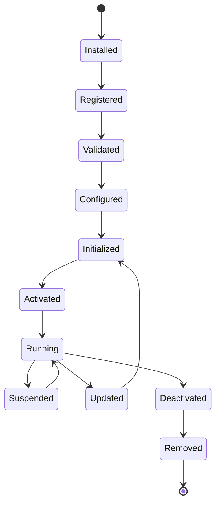
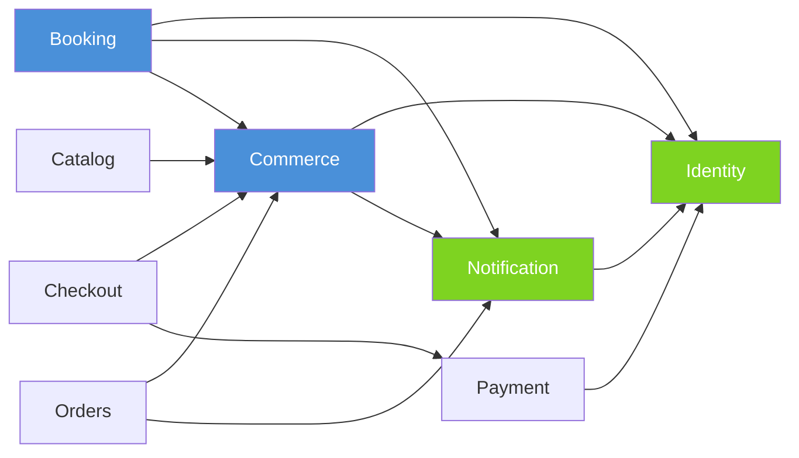
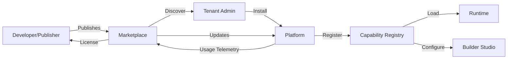
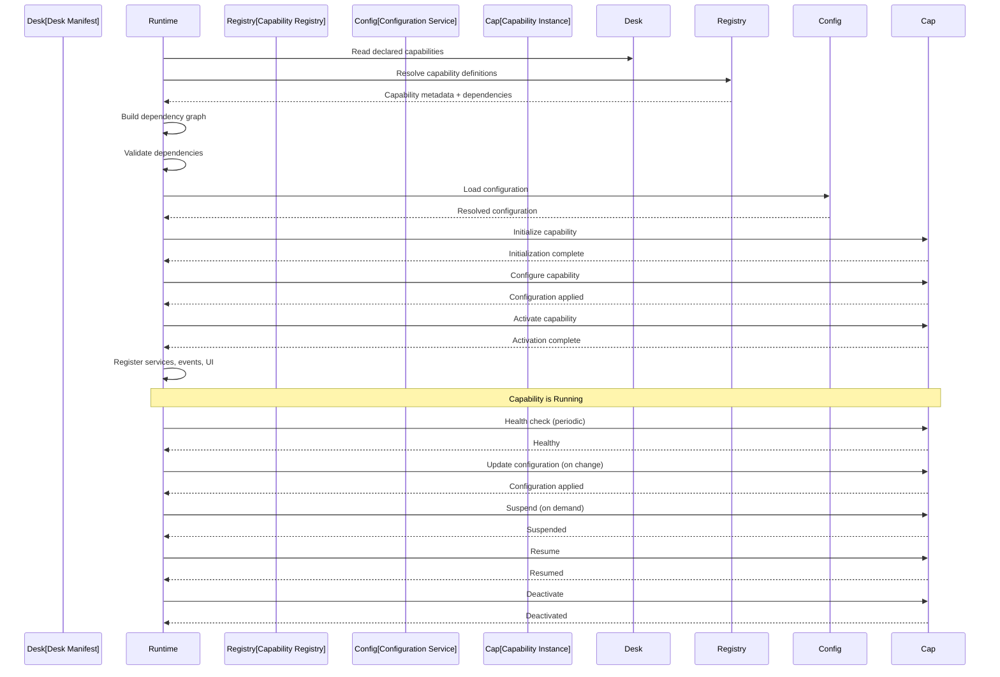
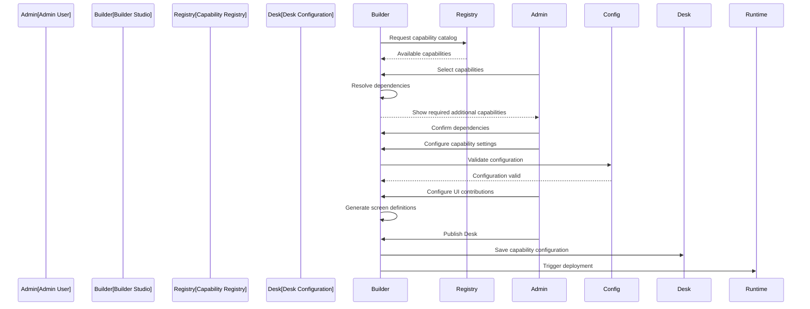

# KB-010 — Capability System

**DUKADESK Platform Architecture — Capability Specification**

| Metadata | Value |
|----------|-------|
| KB-ID | KB-010 |
| Title | Capability System |
| Version | 0.1.0 |
| Status | Drafting |
| Owner | Architecture |
| Dependencies | KB-005 (Platform Overview), KB-006 (System Architecture), KB-007 (Service Boundaries) |
| Related Documents | KB-009 (Manifest Specification), KB-012 (Component Registry), KB-014 (Layout System), KB-016 (Navigation Engine), KB-017 (Theme Engine) |
| Review Status | Not Reviewed |
| Last Updated | 2026-07-10 |

## Revision History

| Version | Date | Author | Change |
|---------|------|--------|--------|
| 0.1.0 | 2026-07-10 | Architecture | Initial capability system specification |

---

## 1. Purpose

The Capability System is the primary mechanism by which functionality is composed within DUKADESK. It is the heart of the Platform OS.

A **Capability** represents a reusable business function that can be enabled, configured, extended, versioned, published, and executed independently. Capabilities are the building blocks from which Desks are assembled.

This document exists because:

- **Business functionality must be modular.** Without capabilities, every Desk is a custom build.
- **Capabilities enable reuse.** A single capability serves many Desks across many tenants.
- **Capabilities decouple concern.** The Builder configures them. The Runtime executes them. The Marketplace distributes them.
- **Capabilities define the platform's surface area.** What DUKADESK can do is defined by what capabilities exist.

The Capability System is central to DUKADESK because it touches every other subsystem — Runtime, Builder, Marketplace, Renderer, SDKs — and the architecture must define it precisely before any of those can be fully specified.

---

## 2. Capability Philosophy

### 2.1 Capability First

Capabilities are the primary unit of platform functionality. Before any feature is implemented, its capability must be defined. This ensures that every feature has a clear home, boundary, and lifecycle.

### 2.2 Reusable by Default

All capabilities are designed to be reused across multiple Desks and tenants. A capability that can only serve one Desk is poorly factored. Reusability is a design requirement, not an afterthought.

### 2.3 Independent Lifecycle

Each capability has its own version, dependencies, configuration, and lifecycle. Capabilities evolve independently. Upgrading one capability does not require upgrading others.

### 2.4 Declarative Activation

Desks declare which capabilities they need. The Runtime loads only declared capabilities. Capabilities are never implicitly activated.

### 2.5 Runtime Discovery

Capabilities are discoverable at runtime. The platform does not hardcode which capabilities exist. New capabilities can be added without modifying core platform code.

### 2.6 Loose Coupling

Capabilities communicate through events, APIs, and shared contracts — never through direct dependencies on other capabilities' internals. A capability should be replaceable without affecting unrelated capabilities.

### 2.7 Extensible Design

The capability structure is designed for extension. Third-party developers can create new capabilities and distribute them through the Marketplace without modifying the platform core.

### 2.8 Configuration over Customization

Capabilities expose configuration points rather than requiring code changes. Business administrators configure capabilities through the Builder Studio. Customization is achieved through configuration, not forks.

### 2.9 Marketplace-Ready

Every capability is packaged with metadata, documentation, and versioning that makes it distributable through the Marketplace. There is no distinction between "platform capabilities" and "marketplace capabilities" — all capabilities follow the same structure.

### 2.10 Versioned Evolution

Capabilities evolve through explicit versioning. Breaking changes require major version bumps. The platform supports running multiple versions of a capability simultaneously during migration.

---

## 3. What is a Capability?

### Formal Definition

A **Capability** is a self-contained business function that:

- Exposes well-defined services, configuration, events, permissions, UI contributions, and APIs.
- Has an independent lifecycle (install, register, configure, activate, run, deactivate, remove).
- Is discoverable at runtime and through the Builder catalog.
- Is reusable across multiple Desks and tenants.
- Declares its dependencies on other capabilities.
- Remains independent from unrelated capabilities.

### What a Capability Is Not

| Not This | Because |
|----------|---------|
| **Not an application** | A capability does not run standalone. It runs within the Platform Runtime. |
| **Not a service** | A capability may contain services, but it is not defined by its deployment topology. |
| **Not a plugin** | A capability does not extend the platform itself — it extends what a Desk can do. |
| **Not a UI screen** | A capability may contribute screens, but it is not a screen. |
| **Not a database** | A capability may own data, but it is not defined by its data schema. |
| **Not a module** | A capability defines *what* the platform can do. A module defines *how* it is implemented. (See §Capability vs Module.) |

### Capability vs Module

This distinction is fundamental to the DUKADESK architecture:

```
Capability: WHAT the platform can do (business function)
     │
     │  Example: Commerce
     │
     └──► Module: Catalog      (how catalog functionality is implemented)
     └──► Module: Cart         (how cart functionality is implemented)
     └──► Module: Checkout     (how checkout functionality is implemented)
     └──► Module: Orders       (how order functionality is implemented)
     └──► Module: Payments     (how payment functionality is implemented)
     └──► Module: Coupons      (how coupon functionality is implemented)
```

| Dimension | Capability | Module |
|-----------|------------|--------|
| **Purpose** | Defines a business function. | Implements part of a capability. |
| **Visibility** | Visible to Desks, Builder, Marketplace. | Internal to the capability. |
| **Lifecycle** | Independent, versioned, governed. | May change as implementation evolves. |
| **Reusability** | Reusable across Desks. | Reusable within a capability. |
| **Discovery** | Discoverable at runtime and in Builder. | Internal to the capability's implementation. |
| **Granularity** | Coarse — represents a complete business domain. | Fine — represents a specific implementation unit. |
| **Dependencies** | On other capabilities. | On platform services and libraries. |

This separation gives DUKADESK a stable public model (Capabilities) while allowing internal implementation to evolve freely (Modules). Desks configure Capabilities. The platform evolves Modules.

---

## 4. Capability Characteristics

| Characteristic | Description |
|----------------|-------------|
| **Reusable** | A single capability can serve any Desk that needs its function. |
| **Configurable** | Capabilities expose configuration points that can be set per-tenant, per-Desk, and per-environment. |
| **Discoverable** | Capabilities are registered in the Capability Registry and discoverable by Runtime, Builder, and Marketplace. |
| **Composable** | Capabilities can depend on other capabilities. Multiple capabilities compose to form a complete Desk. |
| **Independent** | A capability has no knowledge of other capabilities except through declared dependencies. |
| **Versioned** | Capabilities follow semantic versioning. Multiple versions can coexist during migration. |
| **Testable** | Capabilities define test interfaces and can be tested independently of the platform. |
| **Observable** | Capabilities expose health, metrics, and diagnostics. |
| **Secure** | Capabilities declare required permissions. The platform enforces them at runtime. |
| **Extensible** | Capabilities define extension points that other capabilities or modules can use. |

---

## 5. Capability Structure

A capability has the following logical structure. This is implementation-independent — each section represents a concern, not a file or class.

```text
┌──────────────────────────────────────────────────┐
│                   CAPABILITY                      │
├──────────────────────────────────────────────────┤
│  Metadata       — Identity, name, description     │
│  Identity       — Unique capability identifier    │
│  Version        — Semantic version                │
│  Dependencies   — Required and optional caps      │
│  Configuration  — Schema, defaults, overrides     │
│  Permissions    — Required platform permissions   │
│  Lifecycle Hooks— Install, activate, suspend ...  │
│  Services       — Business services provided      │
│  Events         — Events published, consumed      │
│  Actions        — Actions exposed to UI           │
│  UI             — Screens, components, nav        │
│  Settings       — Desk-configurable settings      │
│  Assets         — Static resources                │
│  Localization   — Locale-specific content         │
│  APIs           — Programmatic interfaces         │
│  Diagnostics    — Health checks, metrics          │
│  Documentation  — Usage and reference             │
└──────────────────────────────────────────────────┘
```

### 5.1 Metadata

Every capability has a unique identifier, human-readable name, description, category, and tags. Metadata is used for discovery in Builder and Marketplace.

### 5.2 Identity

A capability's identity is its canonical ID. Identity is permanent — it does not change between versions. The identity establishes the capability as a stable reference point.

### 5.3 Version

Each capability follows semantic versioning. The version is part of its identity — `cap:commerce@1.2.3` refers to a specific version of the Commerce capability.

### 5.4 Dependencies

Capabilities declare which other capabilities they require and which are optional. Dependencies include version constraints. The Runtime resolves the dependency graph during capability loading.

### 5.5 Configuration

Capabilities define a configuration schema with default values, allowed values, and validation rules. Configuration can be set at the platform, tenant, Desk, and environment levels with inheritance.

### 5.6 Permissions

Capabilities declare what platform resources they need to access. Permissions are reviewed during installation and enforced at runtime.

### 5.7 Lifecycle Hooks

Capabilities define hooks that the Runtime calls at each lifecycle stage. These hooks allow the capability to prepare resources, migrate data, validate state, and clean up.

### 5.8 Services

Capabilities expose business services that other capabilities or surfaces can consume through the API Gateway.

### 5.9 Events

Capabilities define the events they publish and the events they consume. Event schemas are part of the capability's contract.

### 5.10 Actions

Capabilities expose actions that the Renderer can invoke from UI components. Actions are the bridge between user interaction and business logic.

### 5.11 UI Contributions

Capabilities contribute screens, components, navigation entries, and menus to the Desk. The Builder renders these contributions for configuration.

### 5.12 Settings

Capabilities define Desk-level settings that business administrators can configure through the Tenant Dashboard.

### 5.13 Assets

Capabilities may include static assets — images, icons, fonts — that are distributed with the capability.

### 5.14 Localization

Capabilities include locale-specific content. The platform resolves the appropriate locale based on user preference and tenant configuration.

### 5.15 APIs

Capabilities expose programmatic interfaces (REST, GraphQL, or gRPC) for consumption by other capabilities, surfaces, and external systems.

### 5.16 Diagnostics

Capabilities expose health checks, metrics, and diagnostic endpoints that the platform uses for monitoring and observability.

### 5.17 Documentation

Capabilities include documentation that feeds into Developer Documentation and the Architecture Portal.

---

## 6. Capability Lifecycle



### Stage Descriptions

| Stage | Description |
|-------|-------------|
| **Installed** | The capability package has been placed in the platform's capability store. Metadata has been extracted. No validation has occurred. |
| **Registered** | The capability has been registered in the Capability Registry. Its metadata is discoverable. Dependencies have not yet been resolved. |
| **Validated** | Dependencies have been resolved and validated. Version constraints are satisfied. The capability is compatible with the current platform version. No circular dependencies exist. |
| **Configured** | Configuration has been applied from all levels (platform, tenant, Desk, environment). Configuration has been validated against the schema. |
| **Initialized** | The capability has been loaded into the Runtime. Lifecycle hooks have executed. Internal state has been initialized. |
| **Activated** | The capability is ready to serve requests. Its services are registered, events are wired, and UI contributions are available. |
| **Running** | The capability is actively serving its function. This is the steady state. |
| **Suspended** | The capability has been temporarily disabled. State is preserved. Resources are released. Suspension may be triggered by the Runtime for resource management or by administrator action. |
| **Updated** | A new version of the capability has been installed. The capability transitions through Updated → Initialized → Activated to apply the update with minimal downtime. |
| **Deactivated** | The capability has been permanently disabled for a Desk. Configuration and data may be retained for reactivation. |
| **Removed** | The capability has been uninstalled. Its data may be archived or deleted per retention policy. |

---

## 7. Capability Registration

### 7.1 Registration Process

Capabilities become known to the platform through registration. Registration can happen through:

| Source | Description |
|--------|-------------|
| **Platform Bundled** | Capabilities shipped with the platform are registered during platform initialization. |
| **Marketplace Install** | Capabilities installed from the Marketplace are registered during installation. |
| **Manual Registration** | Administrators can register capabilities directly through the Platform API. |
| **Development Registration** | Developers can register capabilities in development environments for testing. |

### 7.2 Registration Metadata

Each registration includes:

- Capability ID
- Display name
- Description
- Version
- Publisher
- Category
- Tags
- Dependencies (capability IDs with version constraints)
- Permissions required
- Platform version compatibility
- Documentation URL

### 7.3 Discovery

Registered capabilities are discoverable through:

- **Runtime Discovery**: The Capability Registry returns capability definitions for loading.
- **Builder Discovery**: The Builder catalog shows available capabilities for Desk configuration.
- **Marketplace Discovery**: The Marketplace shows capabilities available for installation.
- **API Discovery**: The Capability Registry API enables programmatic discovery.

---

## 8. Capability Dependencies

### 8.1 Dependency Model

Capabilities may declare dependencies on other capabilities:

| Type | Description | Example |
|------|-------------|---------|
| **Required** | The capability cannot function without this dependency. | Commerce depends on Identity. |
| **Optional** | The capability extends its functionality if the dependency is present. | Commerce extends functionality if Notifications is present. |
| **Incompatible** | The capability cannot coexist with this dependency. | LegacyPayment cannot coexist with ModernPayment. |

### 8.2 Version Constraints

Dependencies specify version constraints using semantic versioning:

| Constraint | Meaning |
|------------|---------|
| `1.2.3` | Exact version required. |
| `^1.2.3` | Compatible with version 1.2.3 (>=1.2.3 <2.0.0). |
| `~1.2.3` | Approximately 1.2.3 (>=1.2.3 <1.3.0). |
| `>=1.2.3` | Minimum version. |
| `<2.0.0` | Maximum version (exclusive). |
| `1.x` | Any 1.x version. |

### 8.3 Dependency Resolution

During capability initialization, the Runtime:

1. Collects all capabilities declared for the Desk.
2. Builds the full dependency graph by resolving transitive dependencies.
3. Validates that all required dependencies are present.
4. Validates version constraints.
5. Detects circular dependencies.
6. Determines initialization order based on the dependency graph.

### 8.4 Circular Dependency Prevention

The dependency graph must be a directed acyclic graph (DAG). If a circular dependency is detected, validation fails with a clear error identifying the cycle.

### Dependency Graph Example



---

## 9. Capability Configuration

### 9.1 Configuration Model

Configuration is hierarchical. Each level inherits from and may override the level above:

```
Platform Defaults
    │
    ▼
Tenant Configuration
    │
    ▼
Desk Configuration
    │
    ▼
Environment Override
```

### 9.2 Configuration Schema

Each capability defines its configuration schema using a platform-neutral schema format. The schema specifies:

- Field names and types
- Default values
- Allowed values (enums, ranges)
- Required vs optional fields
- Validation rules
- Visibility (which roles can view/edit each field)

### 9.3 Configuration Validation

Configuration is validated:

- When the capability is installed (schema conformance)
- When configuration is changed by an administrator
- When the capability is initialized at runtime
- When a Desk is published

### 9.4 Runtime Configuration

At runtime, the capability receives its resolved configuration through the Runtime's configuration service. Configuration changes may trigger lifecycle hooks for hot-reloadable settings.

---

## 10. Capability Interfaces

Capabilities expose the following interfaces to the platform:

| Interface | Purpose | Consumed By |
|-----------|---------|-------------|
| **Services** | Business logic operations. | Other capabilities, surfaces, API Gateway. |
| **Actions** | User-triggered operations from the UI. | Renderer, components. |
| **Events** | State change notifications. | Other capabilities, integrations. |
| **APIs** | Programmatic access for external consumers. | SDKs, CLI, external systems. |
| **Commands** | Administrative operations. | Dashboards, CLI. |
| **Queries** | Read-only data access. | Surfaces, dashboards, reports. |
| **Navigation** | Screen navigation contributions. | Renderer, Desk navigation. |
| **UI Contributions** | Screens, components, menus. | Renderer, Desk. |
| **Runtime Hooks** | Lifecycle callbacks. | Runtime. |

---

## 11. Capability Contributions

Capabilities contribute functionality to the platform without modifying core platform behavior.

| Contribution | Description |
|--------------|-------------|
| **Screens** | Screen definitions that the Renderer displays within the Desk. |
| **Navigation** | Navigation entries (tabs, menu items) that structure the Desk experience. |
| **Components** | Reusable UI components registered in the Component Registry. |
| **Actions** | Action handlers that the Action Engine can dispatch. |
| **Menus** | Context menus and action menus for the Desk interface. |
| **Settings** | Configuration screens for the Tenant Dashboard. |
| **Workflows** | Business workflow definitions for the Workflow Engine. |
| **Forms** | Data collection form definitions. |
| **Dashboard Widgets** | Widgets for the Business Dashboard. |
| **Reports** | Report definitions and data sources. |
| **Event Handlers** | Handlers for events published by other capabilities. |

### Contribution Principle

Capabilities contribute by declaring their contributions in their capability manifest. The platform reads the manifest and integrates contributions at the appropriate points. A capability never directly modifies the platform's runtime data structures or another capability's state.

---

## 12. Capability Permissions

### 12.1 Permission Model

Capabilities declare required permissions. Permission levels:

| Level | Description |
|-------|-------------|
| **Capability** | Access to another capability's services. |
| **Feature** | Access to specific features within a capability. |
| **Data** | Access to specific data types (read, write, admin). |
| **Platform** | Access to platform-level resources (tenants, users, configuration). |

### 12.2 Permission Enforcement

| Point | Enforcement |
|-------|-------------|
| **Registration** | Permissions are reviewed during capability validation. |
| **Installation** | Administrators are shown required permissions before installing. |
| **Activation** | The Runtime checks that all required permissions are granted. |
| **Runtime** | Every service call and event access is authorization-checked. |
| **Reporting** | Permission violations are logged and alerted. |

---

## 13. Capability Communication

Capabilities communicate through defined mechanisms only:

| Mechanism | Type | Description |
|-----------|------|-------------|
| **Events** | Asynchronous | Publish-subscribe for state change notifications. |
| **APIs** | Synchronous | Request-response for service calls. |
| **Runtime Services** | Synchronous | Platform-provided services available to all capabilities. |
| **Commands** | Asynchronous | Fire-and-forget for administrative operations. |
| **Queries** | Synchronous | Read-only data access through defined query interfaces. |
| **Shared Contracts** | Definition | Shared type definitions, schemas, and interfaces. |

### Prohibited Communication

- Direct database access to another capability's data store.
- Shared mutable state between capabilities.
- Internal method calls across capability boundaries.
- File system access to another capability's assets.

---

## 14. Capability Versioning

### 14.1 Semantic Versioning

Capabilities follow strict semantic versioning:

| Component | Change |
|-----------|--------|
| **MAJOR** | Breaking changes to interfaces, events, configuration, or dependencies. |
| **MINOR** | New functionality that is backward-compatible. |
| **PATCH** | Bug fixes, performance improvements, documentation updates. |

### 14.2 Compatibility

- MINOR and PATCH updates are automatically compatible.
- MAJOR updates require explicit upgrade through the governance process.
- The platform may support multiple MAJOR versions simultaneously during migration.

### 14.3 Deprecation

Deprecation follows a defined timeline:

1. Capability is marked **Deprecated** with a deprecation notice and replacement recommendation.
2. After a notice period, the capability is **End of Life** — no further updates.
3. After the EOL period, the capability may be **Removed** from the platform.

### 14.4 Upgrade Paths

When a capability publishes a new MAJOR version:

- The upgrade path and migration guide must be published with the release.
- The platform may run both versions simultaneously during a transition window.
- Desks are upgraded at their own pace within the transition window.

---

## 15. Capability Packaging

A capability package contains:

| Component | Description |
|-----------|-------------|
| **Manifest** | Capability identity, version, dependencies, permissions, and metadata. |
| **Services** | Business logic implementation (platform-neutral representation). |
| **Configuration Schema** | Schema definition for capability configuration. |
| **UI Contributions** | Screen definitions, component registrations, navigation definitions. |
| **Assets** | Static resources (images, icons, fonts). |
| **Localization** | Locale-specific content files. |
| **Documentation** | Usage guide, API reference, configuration guide. |
| **Migration Scripts** | Data and configuration migration between versions. |
| **Diagnostics** | Health check definitions and metric specifications. |

---

## 16. Capability Marketplace



### 16.1 Publication

Publishers submit capabilities to the Marketplace through a defined publication pipeline:

1. Capability is packaged and signed.
2. Metadata, documentation, and screenshots are prepared.
3. The capability is submitted for review.
4. Upon approval, the capability is published with a license and pricing.

### 16.2 Discovery

Tenant administrators discover capabilities through the Marketplace catalog. Discovery filters include category, industry, rating, price, and compatibility.

### 16.3 Installation

When a capability is installed:

1. The package is downloaded and validated (signature, compatibility).
2. The capability is registered in the Capability Registry.
3. Permissions are presented to the administrator for approval.
4. The capability is configured and made available for Desk configuration.

### 16.4 Licensing

Licensing models supported:

| Model | Description |
|-------|-------------|
| **Free** | No cost, available to all tenants. |
| **One-Time** | One-time purchase for permanent use. |
| **Subscription** | Recurring fee for continued use. |
| **Tiered** | Different feature levels at different price points. |

### 16.5 Signature Verification

All Marketplace capabilities are digitally signed. The platform verifies signatures during installation and at runtime to ensure integrity and authenticity.

---

## 17. Runtime Interaction



### Runtime Responsibilities

The Runtime is responsible for:

- Reading capability declarations from the Desk manifest.
- Resolving capability definitions from the Capability Registry.
- Building and validating the dependency graph.
- Loading and validating configuration.
- Initializing capabilities in dependency order.
- Activating capabilities and registering their contributions.
- Monitoring capability health.
- Handling capability lifecycle transitions (suspend, resume, update, deactivate).

---

## 18. Builder Integration



### Builder Responsibilities

The Builder is responsible for:

- Displaying the capability catalog from the Capability Registry.
- Enabling administrators to add/remove capabilities for a Desk.
- Resolving capability dependencies during Desk configuration.
- Validating capability configuration before publishing.
- Rendering capability-specific screens and settings for configuration.
- Generating the Desk manifest with declared capabilities.
- Publishing the Desk configuration to the Runtime.

---

## 19. Security

### 19.1 Capability Isolation

Each capability runs within an isolated boundary. Capabilities cannot access:

- Another capability's data store directly.
- Another capability's runtime state.
- Platform resources not explicitly granted.
- Resources of other tenants.

### 19.2 Trusted Publishers

Capabilities from the Marketplace are published by verified publishers. Publisher identity is established through digital signatures and platform verification.

### 19.3 Digital Signatures

All capability packages are digitally signed. The platform verifies signatures:

- During installation (package integrity).
- During loading (runtime integrity check).
- During updates (delta integrity).

### 19.4 Permission Validation

Before a capability is activated, all declared permissions are validated against:

- The capability's publisher trust level.
- The tenant's security policy.
- The Desk's configuration.

### 19.5 Sandboxing Concepts

Capabilities execute within a sandbox that limits:

- Resource access (CPU, memory, storage).
- Network access (allowed endpoints only).
- File system access (capability-scoped directories).
- System call access (platform-approved APIs only).

### 19.6 Runtime Protection

The Runtime enforces capability isolation at runtime:

- Service calls are intercepted and authorized.
- Event publications are validated against the capability's declared events.
- Configuration changes are validated against the schema.
- Resource usage is monitored and throttled.

---

## 20. Observability

### 20.1 Logging

Capabilities produce structured logs including:

- Capability ID and version
- Event type and payload
- Request context (tenant, desk, user)
- Timestamp and severity
- Correlation ID for distributed tracing

### 20.2 Metrics

Capabilities expose metrics:

- Request rate, latency, and error rate per service.
- Configuration change count.
- Event publication and consumption counts.
- Resource utilization.
- Health check status.

### 20.3 Diagnostics

Capabilities expose diagnostic endpoints:

- Health check (liveness and readiness).
- Configuration dump (current resolved configuration).
- Dependency status (are all dependencies reachable?).
- Version information.
- Uptime and lifecycle state.

### 20.4 Health Reporting

The Runtime polls capabilities for health. A capability that fails health checks may be restarted, suspended, or reported for administrator attention.

### 20.5 Tracing

The platform supports distributed tracing across capability boundaries. Each request carries a trace context that is propagated through service calls and events.

---

## 21. Anti-Patterns

| Anti-Pattern | Why It Is Discouraged |
|--------------|-----------------------|
| **Hidden Dependencies** | A capability that silently depends on another capability without declaring it creates brittle, unreproducible Desk configurations. |
| **Duplicated Capabilities** | Two capabilities that provide the same function should be consolidated. Duplication increases maintenance burden and confuses configuration. |
| **Monolithic Capabilities** | A capability that does too much violates the principle of separation of concerns. It should be split into focused capabilities. |
| **Capability Ownership Violations** | A capability that directly modifies another capability's data or state breaks isolation guarantees. Communication must go through defined interfaces. |
| **Direct Database Access** | A capability that reads or writes another capability's database creates tight coupling and breaks encapsulation. |
| **Hardcoded Configuration** | Configuration values embedded in capability code prevent reuse across tenants and environments. |
| **Cross-Capability Business Logic** | Business logic that spans multiple capabilities indicates missing abstraction. Consider whether the logic belongs in a higher-level capability. |
| **Capability as Service** | Treating a capability as synonymous with a deployable service over-constrains the architecture. Capabilities are logical boundaries; services are deployment units. |
| **Implicit Activation** | A capability that activates itself without being declared in the Desk manifest violates the declarative activation principle. |
| **Orphaned Contributions** | UI contributions, event handlers, or services that are registered but never cleaned up after deactivation leave the platform in an inconsistent state. |

---

## 22. Future Evolution

### 22.1 AI-Generated Capabilities

The structured capability definition format enables future AI-assisted capability generation. Given a natural language description, an AI agent could produce a capability skeleton, configuration schema, and interface definitions that a developer then implements.

### 22.2 Marketplace Ecosystem

As the platform matures, the Marketplace can support:

- Verified publisher programs.
- Enterprise capability packs for specific industries.
- Community-contributed capabilities with review processes.
- Capability bundles that combine multiple capabilities for specific use cases.

### 22.3 Third-Party Vendors

Third-party developers can build and distribute capabilities independently. The capability structure, packaging format, and Marketplace pipeline are designed for this from day one.

### 22.4 Enterprise Capabilities

Enterprise-specific capabilities (SSO integration, audit compliance, data residency, advanced reporting) can be developed as first-class capabilities following the same structure.

### 22.5 Industry-Specific Libraries

Industry-specific capability libraries can be assembled and distributed:

- **Food & Beverage**: Menu management, online ordering, delivery tracking, table management.
- **Retail**: Point of sale, inventory management, loyalty programs, omnichannel ordering.
- **Healthcare**: Appointment scheduling, patient management, prescription management, telehealth.
- **Services**: Resource booking, calendar management, client management, invoicing.

### 22.6 Premium Capability Packs

Capabilities can be grouped into packs for specific business verticals, available through the Marketplace at tiered pricing.

---

## 23. Relationship to Other Documents

```
KB-005 (Platform Overview)
    │  Introduces the platform concept.
    ▼
KB-006 (System Architecture)
    │  Defines the Capability Domain (§3.6).
    ▼
KB-010 (Capability System) ← You are here
    │  Defines what capabilities are and how they work.
    │
    ├──► KB-008 (Runtime Overview)
    │       How the Runtime loads, initializes, and manages capabilities.
    │
    ├──► KB-009 (Manifest Specification)
    │       How Desks declare which capabilities they use.
    │
    ├──► KB-012 (Component Registry)
    │       How capability components are registered and resolved.
    │
    ├──► KB-016 (Navigation Engine)
    │       How capability navigation contributions are integrated.
    │
    ├──► KB-017 (Theme Engine)
    │       How capability themes and visual tokens are applied.
    │
    └──► Specifications
            Concrete capability specifications (Commerce, Booking, etc.).
```

---

*KB-010 (Capability System) — Defines the fundamental building block of the DUKADESK platform. Every Desk, Builder, Runtime, Marketplace, and SDK depends on this specification. Capabilities are what give a Desk its behavior.*
