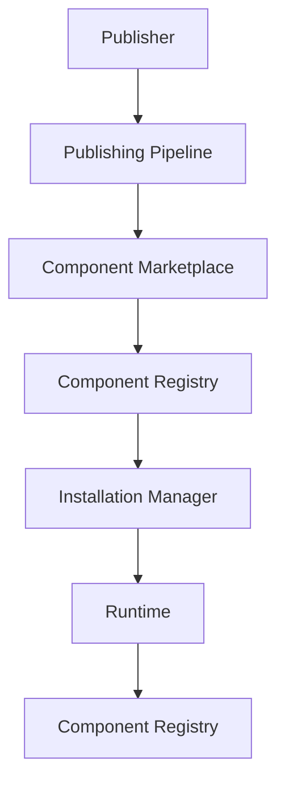
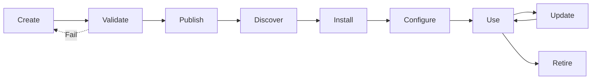
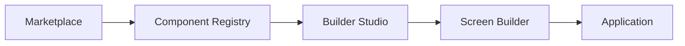

# Component Marketplace

**KB-036 — Component Marketplace Specification**

| Metadata | |
|----------|---|
| **KB ID** | KB-036 |
| **Title** | Component Marketplace |
| **Version** | 0.1.0 |
| **Status** | Drafting |
| **Owner** | Architecture Team |
| **Dependencies** | KB-012 Component Registry, KB-013 Component Model, KB-032 Marketplace Architecture, KB-033 Package & Artifact Specification, KB-008 Runtime Overview |
| **Related Documents** | Component Model (KB-013), Component Registry (KB-012), Marketplace Architecture (KB-032), Package & Artifact Specification (KB-033), Screen & Layout Builder (KB-024), Theme Builder (KB-027), Theme Engine (KB-017), Runtime Overview (KB-008), Builder Studio Architecture (KB-022), Validation Engine (KB-030) |
| **Review Status** | Pending |
| **Last Updated** | 2026-07-10 |

### Revision History

| Version | Date | Author | Change |
|---------|------|--------|--------|
| 0.1.0 | 2026-07-10 | AI Architecture Agent | Initial draft |

---

## 1. Purpose

The Component Marketplace is the Marketplace subsystem responsible for publishing, discovering, certifying, installing, composing, updating, governing, and retiring reusable UI components across the DUKADESK platform. A Component is a reusable presentation building block that conforms to the Platform Component Model and integrates with the Runtime, Builder Studio, Theme Engine, Data Models, Workflow System, Action Engine, Accessibility Framework, and Capability System.

Reusable components exist because UI development is repetitive. Every application needs data grids, charts, forms, calendars, kanban boards, dashboards, and industry-specific visualizations. Without reusable components, every organization builds these from scratch — duplicating effort, introducing accessibility gaps, and creating visual inconsistency. The Component Marketplace makes high-quality, platform-integrated UI building blocks available to every organization.

UI consistency improves platform quality because users develop expectations about how the platform behaves. Buttons should look and behave like buttons. Data grids should follow consistent selection, sorting, and filtering patterns. Accessible interactions should work the same across all screens. A curated component ecosystem enforces consistency at the platform level rather than relying on individual developer discipline.

Components are distributed separately from capabilities because component updates happen on a different cadence than capability updates. A capability may release monthly; a component library may release weekly. Separating distribution channels allows each to evolve independently. Organizations can update their data grid component without touching their inventory management capability, and vice versa.

Component reuse accelerates Builder Studio because the Screen Builder is fundamentally a component composition tool. Every component in the Marketplace is immediately available in the Screen Builder's component palette. The more components available, the faster screens can be assembled. Component reuse directly translates to Builder productivity.

Components remain implementation-independent because the Component Model abstracts presentation from rendering technology. A component defined for the Runtime works identically on mobile, web, desktop, and future platforms. Platform-specific rendering is handled by the Renderer, not by the component definition. Technology independence ensures the component ecosystem remains stable as rendering technologies evolve.

---

## 2. Component Marketplace Philosophy

### Design System Consistency

All Marketplace components adhere to a shared design language. Components use theme tokens for colors, typography, spacing, shapes, and motion. Visual consistency is enforced through certification, not through manual design review.

### Declarative Composition

Components are composed declaratively — nesting, configuration, data binding, and event handling are all expressed in structured metadata. There is no imperative UI composition code. Declarative composition makes components portable, auditable, and safe for AI generation.

### Accessibility-First

Every Marketplace component must meet platform accessibility standards. Accessibility validation is a certification gate, not a best practice suggestion. Components ship with keyboard navigation, screen reader support, high contrast modes, and focus management built in.

### Runtime Compatibility

Components declare their minimum Runtime version and are verified against target Runtime versions at certification time. A component that passes certification is guaranteed to render correctly on all supported Runtime versions.

### Theme-Aware Rendering

Components consume theme tokens for all visual properties. No Marketplace component uses hardcoded colors, fonts, or spacing. Theme awareness ensures that components adapt to brand changes, dark mode, and accessibility preferences automatically.

### Data-Driven Components

Components consume data through declared data bindings. A data grid binds to a data model. A chart binds to a data series. An approval timeline binds to a workflow state. Data-driven components separate presentation from data retrieval.

### Workflow-Aware Interactions

Components can trigger and respond to workflows. A form component can initiate an approval workflow. A kanban component can advance a task through workflow states. An activity feed component can display workflow events. Workflow awareness is declared in the component's action contracts.

### Marketplace Certification

Components undergo certification before appearing in the Marketplace. Certification validates component quality, accessibility, performance, documentation, and platform compatibility. Certified components receive a certification badge that signals quality to consumers.

### AI-Assisted Discovery

AI agents assist users in discovering the right components — recommending components based on screen requirements, suggesting visualizations for data types, detecting duplicate functionality, and generating component layouts.

### Technology Independence

Component definitions are technology-independent. A component defined once renders on mobile, web, desktop, kiosk, and TV. Platform-specific visual adaptations are handled by the Theme Engine and Renderer, not by the component definition.

---

## 3. Marketplace Responsibilities

### Component Publishing

Accept component packages from publishers, validate them against platform standards, certify them for quality and accessibility, and make them available for discovery and installation.

### Discovery

Provide search, browse, filter, and recommendation interfaces for discovering components. Discovery surfaces components by category, supported data types, theme compatibility, certification level, and usage statistics.

### Installation

Manage the installation of components onto target Desks. Installation includes package resolution, dependency resolution, version compatibility verification, asset deployment, and component registration with the Component Registry.

### Version Management

Track component versions, support version selection, manage version compatibility, handle version deprecation, and support rollback to previous versions.

### Dependency Resolution

Resolve component dependencies — required and optional component libraries, shared assets, and platform version requirements. Resolve dependency conflicts before installation.

### Compatibility Validation

Validate component compatibility with the target Desk's Runtime version, theme version, and installed component versions. Compatibility is verified before installation and before updates.

### Certification

Evaluate component packages against certification criteria — quality, accessibility, performance, documentation, theme integration, and platform compatibility. Assign certification levels and manage certification lifecycle.

### Updates

Deliver component updates to installed consumers. Updates preserve consumer configuration, data bindings, and event handlers. Breaking updates require explicit consumer approval.

### Retirement

Manage the retirement of deprecated components. Retired components are removed from discovery, blocked from new installations, and flagged for existing consumers with migration recommendations.

### Analytics

Collect and report component usage analytics — installation counts, rendering frequency, version distribution, performance metrics, and accessibility compliance rates.

### Responsibility Boundaries

| Responsibility | Component Marketplace | Component Registry | Builder Studio | Runtime |
|---------------|----------------------|-------------------|----------------|---------|
| Component publishing | Package validation, certification | Registration | — | — |
| Discovery | Search and browse | Queries | Palette display | — |
| Installation | Package resolution, deployment | Registration | Palette update | — |
| Version management | Releases and deprecation | Version tracking | Version selection | Loads version |
| Compatibility | Pre-install verification | Schema validation | — | Render-time |
| Dependency resolution | Component-level | — | — | Load-time |
| Updates | Distribution and notification | Version update | Palette update | Loads new version |
| Certification | Quality and accessibility review | Certification metadata | — | — |
| Retirement | Marketplace removal | Registry deprecation | Palette removal | Stops rendering |

---

## 4. Component Marketplace Architecture

### 4.1 Component Registry

| Aspect | Description |
|--------|-------------|
| **Purpose** | Persistent registry of all published components and their current state. |
| **Responsibilities** | Store component metadata, track version history, maintain dependency graphs, record installation and usage statistics, support registry queries. |
| **Inputs** | Component packages from Publishing Pipeline, publisher metadata updates. |
| **Outputs** | Component search results, metadata responses, dependency graphs. |
| **Extension Points** | Custom registry backends, metadata indexing strategies, regional registry mirrors. |

### 4.2 Discovery Service

| Aspect | Description |
|--------|-------------|
| **Purpose** | Power search, browse, filter, and recommendation for component discovery. |
| **Responsibilities** | Index component metadata, process search queries, apply filters (category, data type, theme, certification), rank results by relevance, generate recommendations. |
| **Inputs** | Search queries, browse navigation, filter selections, user context. |
| **Outputs** | Search results, category listings, recommendation sets. |
| **Extension Points** | Custom search algorithms, recommendation providers, ranking strategies. |

### 4.3 Installation Manager

| Aspect | Description |
|--------|-------------|
| **Purpose** | Manage the installation of components onto target Desks. |
| **Responsibilities** | Resolve component package, verify package integrity, resolve dependencies, deploy assets to target environment, register component with Component Registry, report installation status. |
| **Inputs** | Installation requests (component ID, version, target Desk). |
| **Outputs** | Installation status, component registration records. |
| **Extension Points** | Custom installation workflows, pre/post installation hooks, deployment target adapters. |

### 4.4 Compatibility Manager

| Aspect | Description |
|--------|-------------|
| **Purpose** | Validate component compatibility with target environments before installation and updates. |
| **Responsibilities** | Check Runtime version compatibility, verify theme compatibility, validate component dependency versions, assess component interaction compatibility, generate compatibility reports. |
| **Inputs** | Component compatibility metadata, target environment information, installed component versions. |
| **Outputs** | Compatibility verification results, compatibility reports. |
| **Extension Points** | Custom compatibility rules, environment-specific compatibility matrices, theme compatibility validators. |

### 4.5 Dependency Manager

| Aspect | Description |
|--------|-------------|
| **Purpose** | Resolve component dependencies, verify compatibility, and detect conflicts. |
| **Responsibilities** | Parse component dependency declarations, resolve dependency graphs, verify version compatibility, detect circular dependencies, report resolution conflicts, manage shared component libraries. |
| **Inputs** | Component dependency metadata, installed component registry, platform version information. |
| **Outputs** | Resolved dependency graph, compatibility reports, conflict descriptions. |
| **Extension Points** | Custom resolution strategies, alternative component sources, enterprise dependency overrides. |

### 4.6 Certification Manager

| Aspect | Description |
|--------|-------------|
| **Purpose** | Manage component certification — quality, accessibility, performance, documentation, and platform compatibility. |
| **Responsibilities** | Define certification criteria, evaluate component packages against criteria, assign certification levels, manage certification lifecycle, handle certification renewals and revocations. |
| **Inputs** | Component packages for certification, certification criteria, audit results. |
| **Outputs** | Certification decisions, certification badges, certification reports. |
| **Extension Points** | Custom certification criteria, industry-specific certification packs, automated accessibility checks. |

### 4.7 Preview Manager

| Aspect | Description |
|--------|-------------|
| **Purpose** | Provide live, interactive preview of components before installation. |
| **Responsibilities** | Render component in multiple themes, demonstrate component configurations, show responsive behavior, display data binding examples, provide code snippets. |
| **Inputs** | Component definition, theme selection, configuration parameters. |
| **Outputs** | Interactive component preview, code examples, configuration documentation. |
| **Extension Points** | Custom preview environments, theme preview providers, interactive demo builders. |

### 4.8 Update Manager

| Aspect | Description |
|--------|-------------|
| **Purpose** | Deliver component updates to installed consumers. |
| **Responsibilities** | Detect available updates, notify consumers, validate update compatibility, manage update installation, handle breaking changes with consumer approval, preserve consumer configuration during updates, support update rollback. |
| **Inputs** | Updated component packages, installed consumer registry, compatibility reports. |
| **Outputs** | Update notifications, update installation status. |
| **Extension Points** | Custom update channels, update scheduling policies, staged rollout strategies. |

### 4.9 Governance Manager

| Aspect | Description |
|--------|-------------|
| **Purpose** | Enforce organizational governance policies for component discovery, installation, and use. |
| **Responsibilities** | Define organizational component policies, maintain approved publisher lists, enforce installation approval workflows, manage component allowlists and blocklists, audit component usage. |
| **Inputs** | Organizational policies, installation requests, publisher trust metadata. |
| **Outputs** | Policy enforcement decisions, approval workflow status, audit records. |
| **Extension Points** | Custom governance providers, policy sources, approval workflow engines. |

### 4.10 Diagnostics Manager

| Aspect | Description |
|--------|-------------|
| **Purpose** | Provide health, compatibility, and usage diagnostics for components. |
| **Responsibilities** | Monitor component health, analyze compatibility status, detect version drift, generate diagnostic reports, provide component quality scores. |
| **Inputs** | Component metadata, installation records, compatibility reports, usage statistics. |
| **Outputs** | Diagnostic reports, health status, quality scores. |
| **Extension Points** | Custom diagnostic rules, metric collectors, report renderers. |

---

## 5. Component Categories

### Basic Components

| Component | Description |
|-----------|-------------|
| **Button** | Pressable action trigger. Supports variants (primary, secondary, outline, ghost, danger), sizes, icons, loading states, and disabled states. |
| **Text** | Typography component with configurable variant (heading, body, caption, label), alignment, color, and truncation. |
| **Icon** | Single icon display. Supports icon library selection, size, color, and decorative vs. semantic roles. |
| **Badge** | Notification count, status indicator, or label badge. Supports position, color, size, and visibility conditions. |
| **Avatar** | User or entity avatar. Supports image, initials, online status indicator, and size variants. |
| **Divider** | Visual separator between sections. Supports horizontal and vertical orientation, spacing, and optional label. |
| **Progress** | Progress indicator. Supports determinate and indeterminate modes, linear and circular variants, size, and label. |
| **Chip** | Compact label or token. Supports removable, selectable, and icon-leading variants. |

### Form Components

| Component | Description |
|-----------|-------------|
| **Input** | Single-line text input. Supports type (text, number, email, phone, password, url), validation, masking, autocomplete, and clearable. |
| **Select** | Single or multi-value selection from a list. Supports search, grouped options, remote data loading, and custom option rendering. |
| **Date Picker** | Date, time, and datetime selection. Supports calendar picker, range selection, min/max constraints, format configuration, and timezone. |
| **File Upload** | File selection and upload. Supports drag-and-drop, file type filtering, size limits, multiple files, and preview. |
| **Signature** | Touch or mouse signature capture. Supports pen color, width, clear, and export options. |
| **Rich Text** | WYSIWYG text editing. Supports formatting, links, lists, tables, images, and document structure. |
| **QR Scanner** | Camera-based QR code scanning. Supports continuous scan, result validation, and torch toggle. |
| **Barcode Scanner** | Camera-based barcode scanning. Supports UPC, EAN, Code 128, Data Matrix, and PDF417 formats. |

### Data Components

| Component | Description |
|-----------|-------------|
| **Table** | Row and column data display. Supports sorting, filtering, pagination, column resizing, row selection, inline editing, and sticky headers. |
| **Data Grid** | Advanced data table with grouping, aggregation, column pinning, tree data, row virtualization, and export. |
| **List** | Vertical list of items. Supports pull-to-refresh, infinite scroll, swipe actions, drag-and-drop reorder, and item variants. |
| **Tree View** | Hierarchical data display. Supports expand/collapse, selection, drag-and-drop, lazy loading, and search. |
| **Timeline** | Chronological event display. Supports custom markers, content slots, alignment (left, right, alternating), and grouping. |
| **Kanban** | Board and card workflow visualization. Supports drag-and-drop between columns, card customization, column management, and WIP limits. |
| **Calendar** | Date and event calendar. Supports month, week, day, and agenda views, event creation, drag-and-drop scheduling, and resource view. |
| **Pivot Table** | Multi-dimensional data aggregation and analysis. Supports row/column grouping, measure aggregation, drill-down, and export. |

### Visualization Components

| Component | Description |
|-----------|-------------|
| **Charts** | Bar, line, area, pie, donut, scatter, bubble, radar, and combo charts. Supports animation, tooltips, legends, axis configuration, and data point interaction. |
| **Graphs** | Network and directed graph visualization. Supports node positioning, edge routing, zoom and pan, node selection, and layout algorithms. |
| **Gauges** | Single-value radial and linear gauges. Supports min/max ranges, thresholds, target markers, and animated transitions. |
| **KPI Cards** | Key performance indicator display. Supports value, trend, comparison, sparkline, and conditional formatting. |
| **Maps** | Interactive map display. Supports markers, polygons, heat maps, clustering, geocoding, and tile layer configuration. |
| **Heat Maps** | Density and intensity visualization over a grid or geographic area. Supports color gradients, value display, and zoom-dependent resolution. |
| **Dashboards** | Composable dashboard container. Supports widget grid layout, drag-and-drop widget placement, resizing, widget configuration, and persistence. |

### Media Components

| Component | Description |
|-----------|-------------|
| **Image Viewer** | Image display with zoom, pan, rotate, fullscreen, and gallery navigation. |
| **Video Player** | Video playback with controls, subtitles, playback speed, picture-in-picture, and stream support. |
| **Audio Player** | Audio playback with waveform display, playback controls, speed control, and playlist support. |
| **Camera Preview** | Live camera feed with capture, flash toggle, front/back switch, and grid overlay. |
| **Gallery** | Media grid with thumbnails, selection, lightbox, and pagination. |
| **Document Viewer** | Document rendering for PDF, office documents, and images with page navigation, zoom, text selection, and annotation. |

### Enterprise Components

| Component | Description |
|-----------|-------------|
| **Approval Timeline** | Visual display of approval workflow state — pending, approved, rejected steps with actor, timestamp, and comments. |
| **Workflow Viewer** | Interactive workflow diagram viewer — step navigation, status highlighting, decision display, and execution history. |
| **Activity Feed** | Real-time activity stream — events, actors, timestamps, and context actions. Supports filtering and infinite scroll. |
| **Audit Log Viewer** | Searchable audit log display — actor, action, resource, timestamp, IP address. Supports filtering, export, and drill-down. |
| **Notification Center** | Notification list with read/unread states, categories, actions, dismiss, and mark-all-read. |
| **AI Assistant Panel** | Conversational AI interface — message list, input, suggested prompts, file attachment, and context awareness. |

### Industry Components

| Component | Description |
|-----------|-------------|
| **POS Terminal** | Point of sale interface — item search, cart, payment, receipt preview, and transaction history. |
| **Inventory Dashboard** | Inventory overview — stock levels, low stock alerts, turnover rates, movement history, and reorder suggestions. |
| **UAV Telemetry Panel** | Drone telemetry display — altitude, speed, battery, GPS position, camera feed, and flight path overlay. |
| **Fleet Tracker** | Vehicle fleet monitoring — real-time positions, routes, driver status, maintenance alerts, and trip history. |
| **Medical Record Viewer** | Patient health record display — demographics, medications, allergies, lab results, visit history, and clinical notes. |
| **Classroom Dashboard** | Education management — student roster, attendance, grades, assignments, behavioral notes, and parent communication. |
| **Manufacturing Monitor** | Production floor monitoring — machine status, OEE, throughput, quality metrics, downtime tracking, and Alerts. |

---

## 6. Component Package Model

| Field | Type | Required | Description |
|-------|------|----------|-------------|
| **componentId** | String | Yes | Globally unique identifier. Reverse-domain notation. Immutable. |
| **name** | String | Yes | Machine-readable name. Unique within publisher scope. |
| **version** | String | Yes | Semantic version. |
| **category** | String | Yes | Component category (basic, form, data, visualization, media, enterprise, industry). |
| **description** | String | Yes | Purpose, features, and typical use cases. |
| **supportedThemes** | String[] | No | Theme IDs this component has been tested with. |
| **supportedLayouts** | String[] | No | Layout containers this component supports (card, panel, modal, fullscreen, inline). |
| **dataBindings** | Object[] | No | Declared data model bindings — entity types, field types, data shapes this component consumes. |
| **runtimeRequirements** | Object | Yes | Minimum Runtime version, required Renderer features, required platform capabilities. |
| **accessibility** | Object | Yes | WCAG compliance level, supported ARIA patterns, keyboard navigation documentation. |
| **documentation** | Object | No | Documentation references and included documentation. |
| **examples** | Object[] | No | Example configurations with data, theme, and layout context. |
| **certificationStatus** | String | Yes | Certification level: `certified`, `verified`, `uncertified`, `deprecated`. |

---

## 7. Component Composition

### Nested Components

Components can contain child components. Nesting is declarative — parent components define content slots or child component arrays. Child components inherit theme context, data context, and event handling from their parent.

### Composite Components

Components that compose multiple sub-components into a higher-level UI building block. A Data Table composite may include a Toolbar, Filter Bar, Table, Pagination, and Column Configuration panel. Sub-components are independently configurable.

### Layout Integration

Components declare their supported layout containers — card, panel, modal, sidebar, fullscreen, inline. The Screen Builder uses layout declarations to offer appropriate placement options. Components adapt their rendering based on the containing layout.

### Data Binding

Components declare their data contract — what data they consume, what data they produce, and what data model shapes they expect. Data binding is configured in Builder Studio and resolved at runtime by the State Management system.

### Event Handling

Components declare the events they emit — click, change, submit, select, scroll, drag, drop, and custom domain events. Events are bound to actions through the Action Engine. Event declarations include event payload schemas.

### Actions

Components can trigger actions through the Action Engine. A button component triggers a `click` action. A form component triggers a `submit` action. A kanban component triggers `cardMoved`, `statusChanged`, and `cardClicked` actions. Action types are declared in the component manifest.

### State Binding

Components can bind to application state through State Management. A component reads state through selectors and writes state through actions. State bindings are declared as part of the component's data contract.

### Theme Inheritance

Components inherit theme tokens from the Desk theme. Component-specific theme tokens are declared in the component's theme contract. Components can override tokens at the instance level through the Theme Builder.

---

## 8. Installation Lifecycle

### Discover

The consumer discovers a component through Marketplace search, browse, recommendations, category browsing, or direct reference. Discovery surfaces component metadata — description, category, certification level, supported themes, data bindings, and preview.

### Preview

The consumer previews the component in the Preview Manager — seeing how it renders in different themes, with different configurations, and with example data. Preview helps consumers evaluate component suitability before installation.

### Validate

The Installation Manager validates the component against the target environment — Runtime version compatibility, theme compatibility, dependency availability, and organizational policy compliance.

### Resolve Dependencies

The Dependency Manager resolves all required and optional component dependencies. Shared component libraries are de-duplicated. Version conflicts are flagged and must be resolved before proceeding.

### Install

The component package is resolved, its integrity verified, its assets deployed to the target environment, and its definition registered with the Component Registry.

### Register

The component is registered with the Component Registry. Registration makes the component available in Builder Studio's component palette and the Runtime's component loader.

### Use

The component appears in Builder Studio's component palette for drag-and-drop screen composition. The component renders in the Preview Runtime and production Runtime with its declared data bindings, event handlers, and theme integration.

### Update

A new version of the component is published. The Update Manager notifies the consumer, validates compatibility, obtains approval for breaking changes, installs the update, and updates the Component Registry.

### Retire

The component is deprecated by the publisher or retired by the organization. Retired components are removed from discovery, blocked from new installations, and flagged for existing consumers with migration recommendations.

---

## 9. Runtime Integration

### Runtime

The Runtime loads installed components through the Component Registry at application startup. Components are rendered by the Renderer according to screen definitions in the Manifest. The Runtime provides the execution context — theme tokens, data bindings, event dispatch, state access — that components consume.

### Renderer

The Renderer interprets component definitions and produces the visual UI. It resolves component configurations, applies theme tokens, establishes data bindings, attaches event handlers, and manages component lifecycle — mount, update, unmount.

### Component Registry

The Component Registry at runtime maintains the active set of all installed components. The Renderer queries the registry to resolve component types by ID. The registry provides component metadata, configuration schemas, and renderer references.

### Theme Engine

Components consume theme tokens for all visual properties. The Theme Engine resolves token references, applies mode variants (light, dark, high contrast), and provides resolved token values to the Renderer. Components never access theme tokens directly.

### Action Engine

Components dispatch events through the Action Engine. Event declarations in the component manifest define the event types, payload schemas, and default action bindings. The Action Engine routes events to registered handlers, which may include navigation, data mutations, workflow triggers, and capability-specific logic.

### Workflow Engine

Components that are workflow-aware consume workflow state and trigger workflow transitions. A kanban component displays workflow columns. An approval timeline component displays workflow progress. A form component initiates a workflow on submission.

### State Management

Components read and write application state through State Management. Data-bound components select state through declared selectors. State writes are performed through declared actions. State bindings are configured in Builder Studio and resolved at runtime.

### Event Bus

Components can publish and subscribe to platform events through the Event Bus. Event subscriptions are declared in the component manifest. The Event Bus decouples components from the systems they interact with.

---

## 10. Builder Integration

### Screen Builder

Installed components appear in the Screen Builder's component palette, organized by category. Components are drag-and-drop placed onto the design surface. Component properties are edited through auto-generated property panels based on the component's configuration schema.

### Layout Builder

Components declare their supported layout containers. The Layout Builder offers appropriate placement options based on component layout declarations. Components adapt their rendering to the containing layout.

### Form Builder

Form-specific components (Input, Select, Date Picker, File Upload, Signature, Rich Text, QR Scanner, Barcode Scanner) appear in the Form Builder's field palette. Form components include validation schemas that the Form Builder uses for configuration.

### Theme Builder

The Theme Builder displays component-specific theme tokens when a component is selected. Component token overrides are configured through the Theme Builder interface. Component token schemas are declared in the component manifest.

### Workflow Builder

Workflow-aware components appear in the Workflow Builder as potential trigger sources and workflow state displays. Components declare their workflow interaction contracts in their manifest.

### Preview Runtime

The Preview Runtime renders installed components with live configuration, data binding, and theme context. Component preview reflects the same rendering pipeline as the production Runtime.

---

## 11. Marketplace Integration

### Marketplace Architecture (KB-032)

The Component Marketplace is a specialization within the overall Marketplace Architecture. The Marketplace provides the distribution infrastructure; the Component Marketplace provides component-specific discovery, preview, installation, and governance.

### Publishing Pipeline (KB-031)

Components are published as standard DUKADESK packages through the Publishing Pipeline. The Pipeline validates component package structure, resolves dependencies, generates metadata, signs the package, and submits it to the Component Registry.

### Validation Engine (KB-030)

The Validation Engine validates component packages during creation, publication, and installation. Validation covers package structure, metadata completeness, dependency integrity, compatibility verification, accessibility scanning, and performance analysis.

### Package Specification (KB-033)

Component packages follow the standard Package & Artifact Specification. Component-specific metadata extends the base package model with category, data bindings, supported themes, accessibility declarations, and component configuration schemas.

### Extension Framework (KB-034)

Components may include Builder extensions — custom property editors, palette items, preview handlers, and drag-and-drop behaviors. Builder extensions follow the Extension & Plugin Framework contracts.

---

## 12. AI Integration

### Recommend Components

The AI Assistant can recommend components based on screen requirements — analyzing natural language descriptions of UI needs and suggesting components that match. Recommendations include component names, descriptions, configuration suggestions, and rationale.

### Generate Component Layouts

The AI Assistant can generate component layouts — arranging recommended components into a screen layout with appropriate spacing, sizing, and responsive behavior.

### Suggest Accessibility Improvements

The AI Assistant can analyze component configurations and suggest accessibility improvements — missing labels, insufficient contrast, keyboard navigation gaps, screen reader announcements.

### Recommend Visualizations

Based on data types and business context, the AI Assistant can recommend appropriate visualizations — suggesting chart types for time series data, maps for geographic data, gauges for KPI values, timelines for process data.

### Detect Duplicate Components

The AI Assistant can analyze installed components and detect functionally similar components — two data grid components, overlapping chart libraries, or redundant form fields.

### Explain Component Behavior

The AI Assistant can explain component behavior — what events a component emits, what data bindings it supports, what accessibility features it provides, and how it integrates with themes and workflows.

### Generate Documentation

The AI Assistant can generate component documentation — overview, configuration guide, examples, accessibility notes, and integration patterns — from the component manifest and definitions.

### AI Integration Principles

- AI recommendations are advisory — consumers make all installation decisions.
- AI-generated component layouts must pass platform validation.
- AI analysis does not bypass certification requirements.

---

## 13. Accessibility

### Keyboard Navigation

All components must be fully navigable and operable using only a keyboard. Tab order follows visual layout. Custom keyboard shortcuts are documented. Focus indicators are visible at all times.

### Screen Reader Compatibility

All interactive elements must have accessible labels, roles, and states. Dynamic content changes are announced. Error messages are associated with their controls. Non-decorative images have alt text.

### High Contrast

Components must render correctly in high contrast mode. All text maintains sufficient contrast against its background. Focus indicators remain visible. Icons and visual indicators are not solely color-dependent.

### Focus Management

Focus moves predictably through component content. Modal interactions trap focus appropriately. Focus returns to the triggering element when popups, dialogs, or dropdowns close.

### Touch Targets

All interactive elements meet minimum touch target size requirements (44x44 points). Touch targets account for the component's layout context.

### Responsive Behavior

Components adapt to available width and height. Content does not overflow containers. Text does not get clipped. Horizontal scrolling is avoided within component boundaries.

### Localization Support

Components support right-to-left layout. Text-overflow respects locale-specific truncation. Date, time, number, and currency formatting follow locale conventions. Components declare their localization requirements in their manifest.

---

## 14. Security

### Trusted Publishers

Components from trusted publishers undergo reduced validation friction. Trust is established through publisher identity verification, certification history, and security track record. Trust is revocable.

### Secure Rendering

Components render within the platform's secure rendering pipeline. Components cannot access platform internals, user data, or system features beyond their declared data bindings and event contracts.

### Component Permissions

Components that require special capabilities — camera access, location access, file system access — declare required permissions in their manifest. Permissions are reviewed and approved at installation time.

### Data Isolation

Components access data only through declared data bindings. Components cannot access data outside their bound data context. Cross-component data access requires explicit data sharing contracts.

### Sandbox Execution

Components that include custom rendering logic execute within a sandboxed environment. Sandbox restrictions prevent unauthorized API access, resource consumption, and platform interference.

### Audit Logging

All component operations are logged — installation, configuration, updates, removal. Audit logs include component identity, version, configuration changes, and installation context.

---

## 15. Performance

### Lazy Loading

Components are loaded lazily — only the components required for the current screen are loaded. Component assets are fetched on demand. Lazy loading reduces application startup time and memory footprint.

### Component Virtualization

Data-intensive components (tables, data grids, lists, calendars) use virtualization to render only visible rows. Virtualization maintains smooth scrolling and responsive interaction regardless of data set size.

### Rendering Optimization

Component rendering is optimized to minimize unnecessary re-renders. Components receive only the data and state changes that affect their rendered output. Rendering optimization is built into the component model.

### Incremental Updates

Component updates transfer only changed assets. Unchanged files are reused from the local cache. Delta computation uses package integrity hashes.

### Shared Resources

Components that share asset libraries (icon sets, charting libraries, mapping tiles) consume those resources from a single shared installation. Shared resources reduce storage and bandwidth requirements.

### Efficient Caching

Component definitions, resolved theme tokens, and configuration defaults are cached for fast load times. Cache invalidation is version-aware.

---

## 16. Observability

### Usage Analytics

Component usage metrics — installations, rendering frequency, active components per Desk, version distribution, configuration patterns.

### Rendering Metrics

Component rendering performance — mount time, update time, layout cost, paint cost. Metrics are collected per component version for regression detection.

### Installation Metrics

Installation counts by component, version, publisher, category, and environment type. Installation success and failure rates.

### Update Metrics

Update availability tracking, update adoption rates, update success and failure rates, update duration statistics.

### Performance Diagnostics

Per-component performance diagnostics — render time distribution, memory usage, event latency, data binding resolution time.

### Component Health

Component health indicators — certification status, publisher activity, update frequency, issue resolution time, compatibility verification status.

---

## 17. Anti-Patterns

### Business Logic Embedded in UI Components

UI components should handle presentation and interaction — not business logic. Embedding business rules, data transformations, or workflow decisions in components makes them non-reusable and couples presentation to business domain.

### Hardcoded Themes

Components that use hardcoded colors, fonts, or spacing values bypass the theme system and create visual inconsistency. All visual properties should reference theme tokens.

### Platform-Specific Rendering Assumptions

Components that assume specific platform behavior — web-only hover states, mobile-only gestures, desktop-only keyboard shortcuts — break on other platforms. Platform-specific behavior should be handled by the Renderer, not the component.

### Duplicate Components

Multiple components providing the same functionality fragment the ecosystem, confuse consumers, and increase maintenance burden. Publishers should extend existing components rather than creating duplicates.

### Poor Accessibility

Components that fail accessibility validation exclude users with disabilities and create legal compliance risk. Accessibility is a certification requirement, not an optional feature.

### Tight Coupling to Capabilities

Components that depend on specific capabilities instead of declaring data contracts and event bindings limit reusability. Components should communicate through contracts, not through capability references.

### Hidden Dependencies

Components that depend on asset libraries, runtime features, or other components without declaring those dependencies cause installation failures and runtime errors. All dependencies must be declared in the component manifest.

---

## 18. Future Evolution

### AI-Generated Components

AI agents will generate complete, production-ready components from natural language descriptions — generating component definitions, configuration schemas, theme contracts, data bindings, and documentation.

### Adaptive Components

Components that adapt their rendering based on user context — role-based visibility, permission-aware interactions, device-appropriate layouts, usage-pattern-optimized defaults.

### Cross-Platform Rendering

Components that render natively on each platform while sharing a single component definition. The Renderer handles platform-specific adaptation without component changes.

### Enterprise Component Libraries

Curated enterprise component catalogs that select approved components from the public Marketplace and add organization-specific metadata, accessibility annotations, and compliance documentation.

### Federated Component Catalogs

Federated catalog nodes that synchronize component metadata and packages across organizational and regional boundaries. Federated catalogs support air-gapped environments and data sovereignty.

### Live Collaborative Component Editing

Multiple designers and developers editing the same component definition simultaneously with real-time preview, change tracking, and conflict resolution.

### Intelligent Component Composition

AI systems that analyze screen requirements and automatically compose optimal component layouts — selecting, arranging, and configuring components to meet functional and aesthetic requirements.

---

## 19. Relationship to Other Documents

| Document | Relationship |
|----------|--------------|
| **Component Model (KB-013)** | Defines the component architecture. All Marketplace components conform to the Component Model. |
| **Component Registry (KB-012)** | Receives component registrations. The Component Marketplace publishes components that the Component Registry manages. |
| **Marketplace Architecture (KB-032)** | Defines the overall Marketplace. The Component Marketplace is a specialized subsystem within the Marketplace Architecture. |
| **Package & Artifact Specification (KB-033)** | Defines the package format that component packages follow. Component metadata extends the base package model. |
| **Screen & Layout Builder (KB-024)** | Consumes installed components. The Screen Builder discovers and composes components from the Component Marketplace. |
| **Theme Builder (KB-027)** | Configures component-specific theme tokens. Component theme contracts define available customization points. |
| **Theme Engine (KB-017)** | Provides theme token resolution. Components consume theme tokens at runtime. |
| **Runtime Overview (KB-008)** | Defines the Runtime that renders components. Component lifecycle and rendering follow Runtime contracts. |
| **Builder Studio Architecture (KB-022)** | Hosts component discovery and composition. Builder Studio integrates with the Component Marketplace. |
| **Validation Engine (KB-030)** | Validates component packages. Component certification relies on Validation Engine rules. |

---

## Required Mermaid Diagrams

### Component Marketplace Architecture

### Component Lifecycle

### Builder Integration

### Runtime Rendering

### AI Recommendation Flow

---

*This is KB-036, the Component Marketplace specification of the DUKADESK Engineering Knowledge Base. It defines the Component Marketplace as the authoritative ecosystem for reusable UI building blocks, establishing secure, accessible, theme-aware, data-driven components that organizations can assemble into complete application interfaces.*
