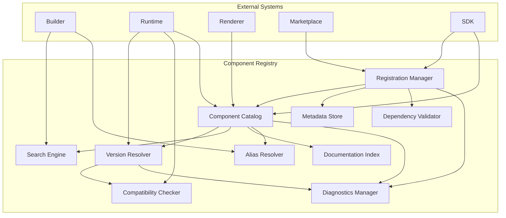
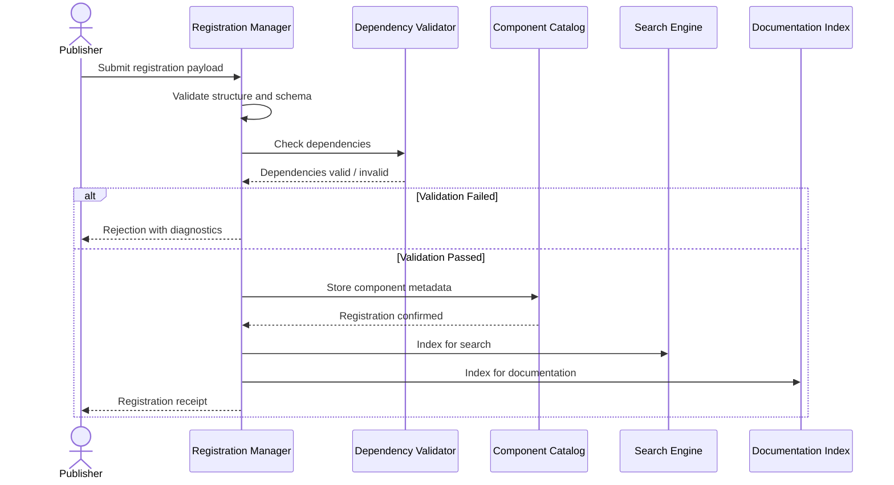
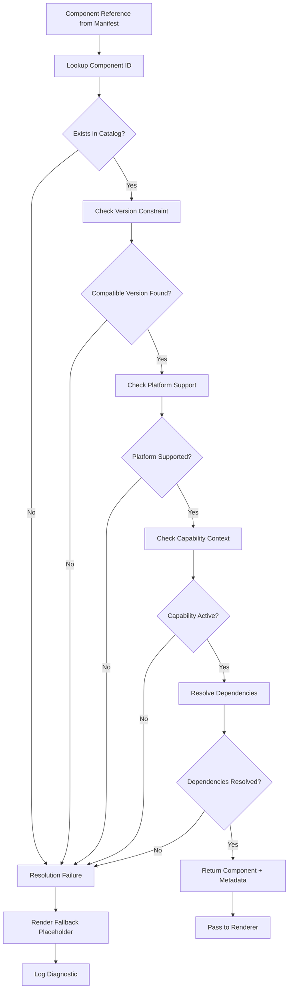
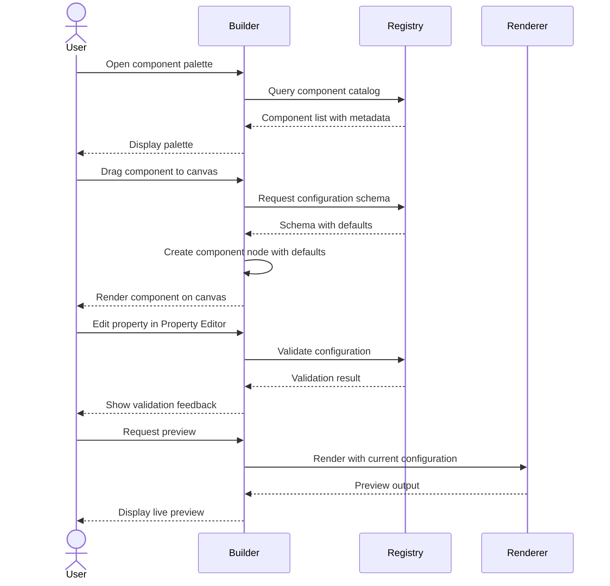
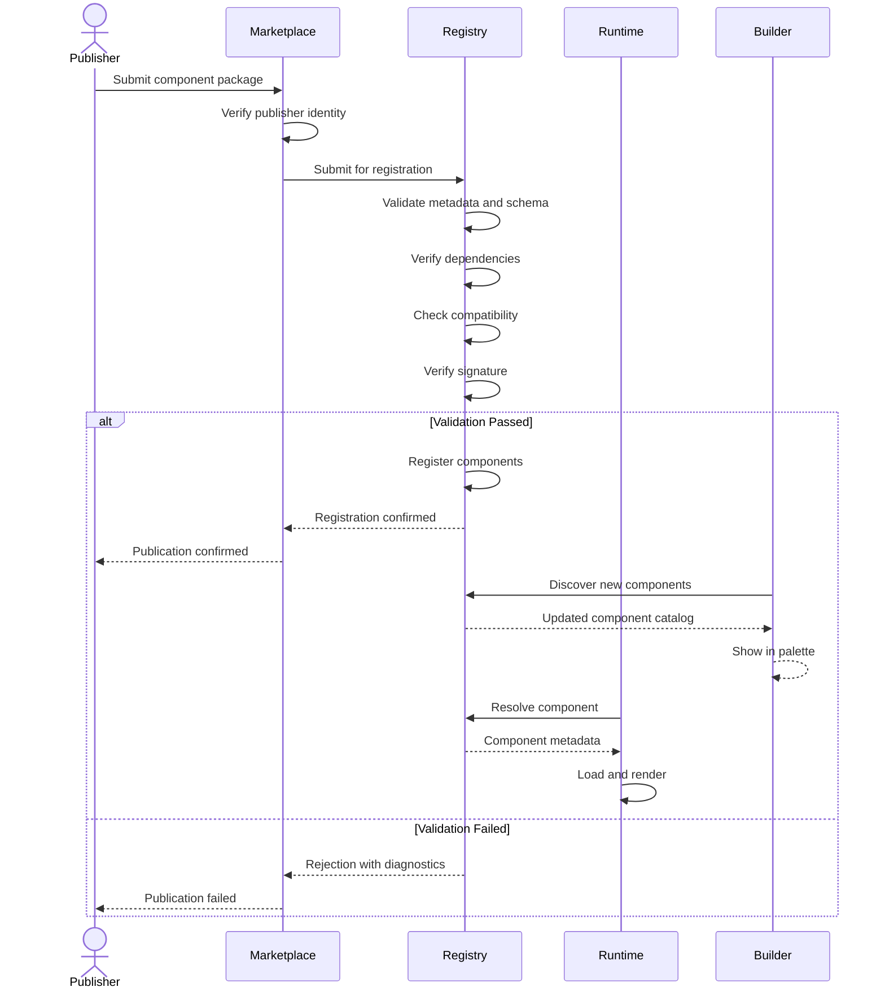

# Component Registry

**KB-012 — Component Registry Specification**

| Metadata | |
|----------|---|
| **KB ID** | KB-012 |
| **Title** | Component Registry |
| **Version** | 0.1.0 |
| **Status** | Drafting |
| **Owner** | Architecture Team |
| **Dependencies** | Manifest Specification, Capability System, Theme Engine |
| **Related Documents** | KB-013 Component Model, Renderer Architecture, Layout System, Builder Studio, Marketplace, Runtime Engine |
| **Review Status** | Pending |
| **Last Updated** | 2026-07-10 |

### Revision History

| Version | Date | Author | Change |
|---------|------|--------|--------|
| 0.1.0 | 2026-07-10 | AI Architecture Agent | Initial draft |

---

## 1. Purpose

The Component Registry is the platform subsystem responsible for discovering, registering, validating, versioning, resolving, and exposing UI components to the Runtime and Renderer.

All UI components must be centrally registered. This is not optional. A component that exists in code but is not registered in the Component Registry is not discoverable, not renderable, and effectively does not exist from the platform's perspective.

The Runtime and Builder rely on the Registry as their sole source of truth for what can be rendered. The Runtime queries the Registry to resolve component references from screen manifests. The Builder queries the Registry to populate the component palette, validate configurations, and generate previews.

The Registry acts as the single source of truth for renderable components because it enforces that every component has a unique identity, a validated schema, declared dependencies, version metadata, and an authorized origin. Without the Registry, the platform would have no mechanism to guarantee that a component reference in a manifest can be resolved to a working renderable unit at runtime.

---

## 2. Registry Philosophy

### Registry First

Every component must be registered before it can be rendered. There is no implicit registration, no auto-discovery of component files, and no runtime scanning of code directories. Registration is an explicit, governed act.

### Declarative Discovery

Components declare their identity, capabilities, and requirements through metadata. Discovery is a query operation against the Registry's catalog — never a filesystem scan or reflection-based enumeration.

### Technology Independence

The Registry operates at the metadata and contract level. It does not prescribe rendering technology, framework, platform, or language. A component registered in the Registry may be a React component, a SwiftUI view, a Kotlin Composable, a Web Component, or a future rendering target. The Registry does not know and does not care.

### Version Awareness

Every component registration carries a semantic version. The Registry enforces that version resolution is explicit, predictable, and safe. A component consumer that requests version `1.x` receives a compatible version. A consumer that requests `^2.0.0` receives the appropriate match. Unversioned components are not permitted.

### Capability Extensibility

Components are associated with capabilities. A capability can introduce new components when installed. The Registry provides the mechanism for capability-scoped registration so that components from different capabilities coexist without conflict.

### Marketplace Integration

Third-party components enter the platform through the Marketplace. The Registry treats Marketplace components as first-class citizens — they undergo the same registration, validation, and resolution processes as core components, albeit with additional provenance and trust checks.

### Backward Compatibility

The Registry maintains a deprecation and migration policy that ensures existing manifests continue to resolve even when components are superseded. Breaking changes require version bumps, explicit deprecation notices, and migration paths.

### Strong Validation

Every registration is validated before it is accepted. Validation covers metadata completeness, schema correctness, dependency existence, version consistency, and naming compliance. Invalid registrations are rejected with diagnostic feedback.

### Predictable Resolution

Given the same component identifier and version constraint, the Registry must always return the same result. Resolution is deterministic. There is no round-robin, no random selection, and no implicit fallback to alternative components unless explicitly configured.

---

## 3. What is a Component?

### Formal Definition

A **Component** is a reusable, declarative, configurable presentation unit that can be rendered by the platform's Renderer. It is the atomic unit of UI composition within DUKADESK.

### Characteristics

A Component is:

- **Reusable** — designed to be instantiated multiple times with different configurations.
- **Declarative** — defined by what it renders, not how it renders.
- **Configurable** — accepts a typed configuration schema that drives its appearance and behavior.
- **Stateless where possible** — state is managed by the Runtime, not the component itself.
- **Renderable** — can be rendered by at least one registered Renderer implementation.
- **Theme-aware** — adapts to the active theme through the Theme Engine.
- **Accessible** — meets platform accessibility standards as defined by the accessibility contract.
- **Composable** — can contain or reference other components through children, slots, or templates.

### What a Component Is Not

| Not This | Because |
|----------|---------|
| Business logic | Components render UI. Business logic belongs in services, stores, and capability handlers. |
| Runtime service | Components do not manage connections, process events, or orchestrate workflows. |
| Capability | A capability installs components; it is not itself a component. |
| Database entity | Components are not persisted as data. Their configuration is, but the component definition is not. |
| API endpoint | Components are rendered, not called. They do not expose HTTP endpoints. |
| Page or Screen | Pages and screens are composed of components. A page is a composition, not a component itself. |
| Application | An application hosts components. A component is not an application. |

---

## 4. Registry Responsibilities

### Registration

Accept, validate, and store component definitions from authorized publishers — including core platform, capabilities, Marketplace packages, SDK extensions, and third-party libraries.

### Discovery

Provide query interfaces that allow the Builder, Runtime, Renderer, and documentation tools to enumerate available components by category, capability, platform, status, and other metadata dimensions.

### Lookup

Resolve a single component by its unique ID, alias, or qualified name. Return the full component metadata and schema on demand.

### Version Management

Store and retrieve component versions. Enforce semantic versioning. Support version ranges, pinning, and compatibility constraints. Prevent version conflicts.

### Compatibility Checks

Verify that a component version is compatible with the requesting Runtime version, platform target, and capability set before resolution.

### Metadata Storage

Maintain the authoritative metadata record for every registered component, including its identity, category, description, schema, events, actions, dependencies, and status.

### Validation

Validate every registration against the platform's naming standards, schema format, dependency graph, and security policies. Reject invalid registrations with actionable error messages.

### Deprecation Tracking

Track component deprecation lifecycle. When a component is deprecated, maintain records of the deprecation reason, replacement component ID, migration path, and sunset date.

### Capability Integration

Associate components with capabilities so that component availability is scoped to the capabilities installed in a given tenant or deployment.

### Marketplace Integration

Support installation, update, and removal of third-party component packages from the Marketplace. Validate signatures, check compatibility, and roll back on failure.

### Builder Discovery

Expose a queryable catalog for the Builder's component palette, including search, filtering, categorization, and preview metadata.

### Documentation Indexing

Generate and serve structured metadata that powers documentation generation, example playgrounds, and SDK reference material.

---

## 5. Registry Architecture

The Component Registry is composed of internal logical modules. Each module has a well-defined purpose, input, output, and extension point.

### 5.1 Registration Manager

| Aspect | Description |
|--------|-------------|
| **Purpose** | Accept component registration requests and orchestrate the registration lifecycle. |
| **Responsibilities** | Validate incoming registrations, invoke the Dependency Validator, store metadata via the Component Catalog, and trigger indexing. |
| **Inputs** | Registration payload (component metadata, schema, dependencies). |
| **Outputs** | Registration receipt (Component ID, registered version, timestamp) or rejection with diagnostics. |
| **Extension points** | Pre-registration hooks (policy checks), post-registration hooks (notification, indexing triggers). |

### 5.2 Component Catalog

| Aspect | Description |
|--------|-------------|
| **Purpose** | Persistent, queryable store of all registered component definitions and versions. |
| **Responsibilities** | Store component metadata, maintain version history, support efficient lookup by ID, alias, category, and capability. |
| **Inputs** | Queries (lookup, search, list). |
| **Outputs** | Component records, version lists, search results. |
| **Extension points** | Custom indexing strategies, alternative storage backends. |

### 5.3 Metadata Store

| Aspect | Description |
|--------|-------------|
| **Purpose** | Store and serve the complete metadata envelope for each registered component. |
| **Responsibilities** | Maintain structured metadata (ID, name, description, schema, events, actions, dependencies, status). Support partial updates. |
| **Inputs** | Metadata write requests from Registration Manager, metadata read requests from consumers. |
| **Outputs** | Metadata records, change notifications. |
| **Extension points** | Metadata enrichment plugins, custom validation rules. |

### 5.4 Version Resolver

| Aspect | Description |
|--------|-------------|
| **Purpose** | Resolve version constraints to concrete component versions using semantic versioning rules. |
| **Responsibilities** | Parse version constraints (exact, range, caret, tilde), select the best matching version, detect conflicts. |
| **Inputs** | Component ID + version constraint. |
| **Outputs** | Resolved version number or resolution failure. |
| **Extension points** | Custom resolution strategies, pre-release version handling, lockfile support. |

### 5.5 Dependency Validator

| Aspect | Description |
|--------|-------------|
| **Purpose** | Validate that all declared dependencies of a component exist in the Registry and are mutually compatible. |
| **Responsibilities** | Walk the dependency graph, check existence and version compatibility, detect circular dependencies, report missing or conflicting dependencies. |
| **Inputs** | Dependency graph from component registration. |
| **Outputs** | Validation pass or failure report. |
| **Extension points** | Custom dependency resolution rules, external dependency providers. |

### 5.6 Compatibility Checker

| Aspect | Description |
|--------|-------------|
| **Purpose** | Verify that a component version is compatible with the requesting Runtime, platform, and capability context. |
| **Responsibilities** | Check Runtime version compatibility, platform target support, capability requirements, and theme engine version. |
| **Inputs** | Component version, Runtime version, platform target, capability context. |
| **Outputs** | Compatibility verdict (compatible / incompatible with reason). |
| **Extension points** | Custom compatibility rules per Runtime version, platform-specific constraints. |

### 5.7 Alias Resolver

| Aspect | Description |
|--------|-------------|
| **Purpose** | Resolve component aliases and qualified names to canonical Component IDs. |
| **Responsibilities** | Maintain alias registry, resolve short names, domain-qualified names, and legacy aliases. |
| **Inputs** | Alias string or qualified name. |
| **Outputs** | Canonical Component ID. |
| **Extension points** | Tenant-specific alias overrides, capability-scoped aliases. |

### 5.8 Search Engine

| Aspect | Description |
|--------|-------------|
| **Purpose** | Provide full-text and faceted search over the Component Catalog. |
| **Responsibilities** | Index component names, descriptions, categories, and tags. Support filtering by category, status, capability, platform. |
| **Inputs** | Search query with optional filters. |
| **Outputs** | Ranked list of matching components. |
| **Extension points** | Custom scoring algorithms, tenant-specific search rankings, synonym dictionaries. |

### 5.9 Documentation Index

| Aspect | Description |
|--------|-------------|
| **Purpose** | Generate and serve structured documentation metadata for consumption by documentation tools and the Builder. |
| **Responsibilities** | Extract examples, descriptions, schema documentation, and usage guides from component registrations. Serve as the data source for auto-generated documentation. |
| **Inputs** | Component metadata, examples, usage documentation. |
| **Outputs** | Structured documentation records. |
| **Extension points** | Custom documentation generators, external documentation system integration. |

### 5.10 Diagnostics Manager

| Aspect | Description |
|--------|-------------|
| **Purpose** | Collect, store, and expose diagnostics about Registry operations. |
| **Responsibilities** | Log registration events, resolution attempts, validation failures, and deprecation warnings. Expose health checks and metrics. |
| **Inputs** | Events from all other modules. |
| **Outputs** | Diagnostic logs, metrics, health status. |
| **Extension points** | Custom diagnostic sinks, metrics exporters, alerting integrations. |

### Registry Architecture Diagram



---

## 6. Component Registration

### Registration Lifecycle

```
Component Created
       │
       ▼
Metadata Generated
       │
       ▼
Validation ──── Failed ──► Rejected
       │
       ▼ Passed
Registration
       │
       ▼
Indexing
       │
       ▼
Availability
       │
       ▼
Discovery
       │
       ▼
Rendering
```

### Stage Descriptions

**Component Created** — A component is authored by a developer, designer, or tool. At this stage it exists only in source form outside the Registry.

**Metadata Generated** — The component author produces the registration metadata: ID, name, category, description, version, configuration schema, events, actions, dependencies, and supported platforms. This metadata is the contract the Registry uses to manage the component.

**Validation** — The Registration Manager validates the submission against all rules: metadata completeness, naming conventions, schema validity, dependency existence, version format, and security policies. If validation fails, the registration is rejected with diagnostic feedback. The author must fix the issues and resubmit.

**Registration** — The validated component is written to the Component Catalog and Metadata Store. The Version Resolver records the new version in the version history. The component is now registered but not yet discoverable.

**Indexing** — The Search Engine and Documentation Index process the component metadata, making it searchable and discoverable. Aliases are registered in the Alias Resolver.

**Availability** — The component is now available for lookup, resolution, and rendering. It appears in search results, Builder palette queries, and Runtime resolution.

**Discovery** — The Builder, Runtime, or documentation tool discovers the component through a Registry query and retrieves its metadata and schema.

**Rendering** — The Runtime resolves the component through the Registry, retrieves its renderable implementation, and passes it to the Renderer.

### Registration Flow Diagram



---

## 7. Component Metadata

Every registered component carries the following metadata. All fields are required unless marked as optional.

| Field | Type | Required | Description |
|-------|------|----------|-------------|
| **Component ID** | `string` | Yes | Globally unique identifier for the component. Must match the naming convention defined in the Naming Standards. Example: `dukadesk.button.primary` |
| **Display Name** | `string` | Yes | Human-readable name shown in Builder palette and documentation. Example: `Primary Button` |
| **Category** | `string` | Yes | Primary category from the standard category list. Example: `Inputs` |
| **Description** | `string` | Yes | Concise description of the component's purpose and behavior. |
| **Version** | `semver` | Yes | Semantic version of this component. Must follow `MAJOR.MINOR.PATCH`. |
| **Owner** | `string` | Yes | Team or individual responsible for the component. Example: `team:mobile` |
| **Capability** | `string` | No | The capability that introduces this component, if any. Core components omit this. |
| **Supported Platforms** | `string[]` | Yes | List of platform targets. Example: `["mobile", "web", "dashboard"]` |
| **Theme Support** | `boolean` | Yes | Whether the component supports theming via the Theme Engine. |
| **Accessibility Support** | `boolean` | Yes | Whether the component meets platform accessibility standards. |
| **Configuration Schema** | `object` | Yes | JSON Schema document defining the component's configurable properties, their types, defaults, and constraints. |
| **Events** | `object[]` | No | List of events the component can emit. Each event has a name, payload schema, and description. |
| **Actions** | `object[]` | No | List of actions the component can dispatch. Each action has a name, payload schema, and description. |
| **Dependencies** | `object[]` | No | List of component dependencies with version constraints. Each entry has a component ID and version range. |
| **Documentation** | `string` | No | Markdown documentation string for the component. |
| **Examples** | `string[]` | No | Array of example configurations as JSON snippets. |
| **Tags** | `string[]` | No | Arbitrary tags for search and categorization. |
| **Status** | `enum` | Yes | One of: `stable`, `beta`, `deprecated`, `experimental`. |
| **Aliases** | `string[]` | No | Alternative names for backward compatibility. |
| **Signature** | `string` | No | Cryptographic signature for verified publishers. |
| **Thumbnail** | `string` | No | URL or reference to a thumbnail image for the component palette. |

---

## 8. Component Categories

Components are categorized into standard groups. These categories organize the Builder palette, drive search filtering, and provide semantic grouping for documentation.

### Layout

Components that structure and arrange other components on the screen.

| Component | Description |
|-----------|-------------|
| Container | Generic wrapper with padding, margin, and background. |
| Row | Horizontal layout container. |
| Column | Vertical layout container. |
| Grid | Multi-column grid layout. |
| Stack | Layered stack of overlapping children. |
| Spacer | Flexible spacing element. |
| Divider | Visual separator line. |

### Inputs

Components that capture user input.

| Component | Description |
|-----------|-------------|
| TextField | Single-line text input. |
| Select | Dropdown or picker selection. |
| Checkbox | Binary selection. |
| Radio | Single-choice from a group. |
| Switch | Toggle control. |
| DatePicker | Date selection control. |
| Signature | Signature capture pad. |
| Scanner | Barcode or QR code scanner. |
| QR | QR code display or scanner. |
| Camera | Camera capture interface. |
| Slider | Range or value slider. |
| FilePicker | File selection dialog. |

### Display

Components that present information.

| Component | Description |
|-----------|-------------|
| Text | Rich text display with formatting. |
| Image | Image display with sizing and fit options. |
| Video | Video player control. |
| Icon | Icon display from the platform icon set. |
| Badge | Notification count or status badge. |
| Avatar | User or entity avatar. |
| Rating | Star or numeric rating display. |
| Chart | Data visualization (bar, line, pie, etc.). |
| QRCode | QR code generation and display. |

### Commerce

Components specific to commerce and transactions.

| Component | Description |
|-----------|-------------|
| ProductCard | Product display card with image, title, price. |
| Cart | Shopping cart summary. |
| CheckoutSummary | Order review before payment. |
| Coupon | Coupon or discount code input and display. |
| OrderTimeline | Order status timeline. |
| Price | Formatted price display. |
| InventoryIndicator | Stock availability indicator. |
| QuantitySelector | Increment/decrement quantity control. |

### Booking

Components specific to booking and reservations.

| Component | Description |
|-----------|-------------|
| Calendar | Month or week calendar view. |
| TimeSlots | Available time slot grid. |
| ServiceCard | Bookable service display card. |
| BookingSummary | Booking details review. |
| AvailabilityGrid | Grid showing available/unavailable slots. |
| DurationPicker | Duration selection control. |

### Feedback

Components that communicate status, errors, or confirmations.

| Component | Description |
|-----------|-------------|
| Alert | Important notification requiring attention. |
| Toast | Transient notification. |
| Snackbar | Brief action feedback at screen bottom. |
| Progress | Indeterminate or determinate progress indicator. |
| Skeleton | Content placeholder during loading. |
| Loader | Full or partial screen loading spinner. |
| Dialog | Modal dialog for confirmations or input. |
| Tooltip | Contextual help tooltip. |

### Navigation

Components that enable screen-to-screen movement.

| Component | Description |
|-----------|-------------|
| Tabs | Tab-based navigation bar. |
| Drawer | Slide-out navigation panel. |
| Breadcrumb | Hierarchical location indicator. |
| Sidebar | Persistent side navigation. |
| Menu | Dropdown or popup menu. |
| BottomNavigation | Bottom tab bar. |
| Stepper | Step-by-step progress indicator. |
| SearchBar | Search input with suggestions. |

### Data

Components that display structured or tabular data.

| Component | Description |
|-----------|-------------|
| Table | Sortable, filterable data table. |
| List | Scrollable item list. |
| Timeline | Chronological event list. |
| Accordion | Expandable section panels. |
| Tree | Hierarchical tree view. |
| Statistics | Summary statistic display (KPIs). |
| Metrics | Dashboard metric cards. |
| Reports | Report summary views. |

### Media

Components that handle rich media content.

| Component | Description |
|-----------|-------------|
| Gallery | Image or media grid gallery. |
| Carousel | Horizontal scrollable media carousel. |
| Player | Audio or video media player. |
| DocumentViewer | Document viewer (PDF, office formats). |
| PDFViewer | Dedicated PDF viewer. |
| ImageEditor | Basic image editing controls. |
| MediaPicker | Media library picker. |

---

## 9. Component Resolution

### ID Lookup

The primary resolution path. Consumers request a component by its canonical Component ID. The Registry returns the component metadata and version matching the requested version constraint.

### Aliases

Components may have aliases for backward compatibility or shorthand access. The Alias Resolver translates the alias to the canonical Component ID before lookup. Aliases are registered at component registration time and cannot conflict with existing IDs.

### Version Selection

When a version constraint is specified (e.g., `^1.2.0`, `>=2.0.0 <3.0.0`), the Version Resolver selects the best matching version using semantic versioning rules:

- **Exact** (`1.2.3`): Returns version `1.2.3` or fails.
- **Caret** (`^1.2.3`): Allows changes that do not modify the left-most non-zero digit.
- **Tilde** (`~1.2.3`): Allows patch-level changes only.
- **Range** (`>=1.0.0 <2.0.0`): Returns the highest matching version.
- **Wildcard** (`1.x`): Returns the highest matching version in the range.
- **Latest** (omitted): Returns the highest non-prerelease version.

### Capability Components

When a component is associated with a capability, resolution is scoped to the requesting context. The Runtime specifies which capabilities are active, and the Registry filters available components accordingly. A component from an inactive capability is not resolvable.

### Marketplace Components

Marketplace components are resolved identically to core components. The Registry does not distinguish between core and third-party components at resolution time. The distinction exists only at registration time (provenance, signature verification).

### Custom Components

Custom components are tenant-specific or deployment-specific overrides registered through an authorized extension path. Custom components may shadow or extend core components within a specific tenant context. The Alias Resolver supports tenant-scoped resolution.

### Unknown Component Handling

When a component ID cannot be resolved, the Registry returns a resolution failure with details:

- Component ID not found.
- Component version not found.
- Component not compatible with requesting Runtime.
- Component not available for requesting platform.
- Component requires capability not active in requesting context.

### Fallback Rendering

The Renderer must handle resolution failures gracefully. When a component cannot be resolved, the Renderer should:

1. Log the failure with full diagnostic context.
2. Render a fallback placeholder component that indicates the missing component by ID.
3. Include the resolution failure reason in the diagnostic output.
4. Continue rendering the remaining screen without crashing.

### Resolution Flow Diagram



---

## 10. Configuration Model

### Configuration Schema

Every component declares its configuration schema using JSON Schema. The schema defines:

- **Properties**: The set of configurable attributes with types, defaults, and constraints.
- **Required fields**: Attributes that must be provided for the component to render.
- **Nested objects**: Complex property structures with their own schemas.
- **Arrays**: Repeatable property groups.
- **Enums**: Restricted value sets.

### Validation

Configuration is validated against the schema at both design time (Builder) and runtime (Renderer). Validation reports:

- Missing required properties.
- Type mismatches.
- Constraint violations (min, max, pattern, enum).
- Unknown properties (if strict mode is enabled).

### Defaults

The schema specifies default values for optional properties. Defaults are applied when the property is not provided in the configuration. Defaults must not produce invalid configurations.

### Overrides

Configurations may be overridden at multiple levels:

1. **Manifest-level**: The screen manifest provides base configuration.
2. **Tenant-level**: Tenant-specific overrides applied during resolution.
3. **Runtime-level**: Dynamic overrides based on runtime state or user context.
4. **Theme-level**: Theme-driven property overrides (colors, spacing, typography).

Override precedence (highest to lowest): Runtime-level > Tenant-level > Manifest-level > Theme-level > Schema defaults.

### Dynamic Properties

Properties whose values are determined at runtime rather than specified statically. Dynamic properties are declared in the schema with an `evaluate` flag. Examples:

- Current user name.
- Device orientation.
- Network status.
- Time and date.
- Location.

### Runtime Bindings

Configurations may reference runtime state through binding expressions. A binding expression is a string that the Runtime evaluates before passing configuration to the Renderer. Binding syntax is defined in the Component Model specification (KB-013).

### Conditional Properties

Properties that apply only when certain conditions are met. Conditions are expressed in the schema using a `conditions` block. The Runtime evaluates conditions and includes or excludes properties accordingly.

---

## 11. Builder Integration

The Builder Studio depends on the Component Registry for its core functionality. Every interaction in the Builder that involves components flows through the Registry.

### Component Palette

The Builder queries the Registry's Search Engine to populate the component palette. Components are grouped by category and filtered by the currently active capabilities. The palette shows:

- Component display name and icon.
- Category grouping.
- Search and filter controls.
- Status badges (beta, deprecated, experimental).
- Drag source for canvas placement.

### Search

The Builder Search Engine integration provides:

- Full-text search across component names, descriptions, and tags.
- Category and status filtering.
- Capability-based filtering.
- Recently used components.
- Favorites and bookmarks.

### Preview

The Builder requests component preview metadata from the Documentation Index. Previews include:

- Static thumbnail or SVG representation.
- Live preview using default configuration.
- Example configurations to load into the editor.

### Documentation

The Builder surfaces inline documentation retrieved from the Registry:

- Component description.
- Property documentation with types and constraints.
- Usage guidelines.
- Related components.
- Change log and version history.

### Drag and Drop

When a component is dragged from the palette to the canvas:

1. The Builder queries the Registry for the component's configuration schema.
2. The Builder creates a new component node with default configuration.
3. The component node is inserted into the screen tree.
4. The Builder validates the configuration against the schema.

### Property Editor

The Property Editor is dynamically generated from the component's configuration schema. The Builder reads the schema and renders appropriate input controls for each property:

- Text fields for string properties.
- Number inputs for numeric properties.
- Toggles for boolean properties.
- Dropdowns for enum properties.
- Object editors for nested properties.
- Array editors for repeatable properties.
- Color pickers for color properties.

### Validation

The Builder validates component configurations in real time as the user edits. Validation errors are shown inline in the Property Editor. The Builder also performs tree-level validation:

- Required children are present.
- Container constraints are satisfied.
- No circular references in component hierarchy.

### Examples

The Builder retrieves example configurations from the Registry and presents them as templates or starting points. Users can load an example into the editor and customize it.

### Builder Integration Diagram



---

## 12. Runtime Integration

The Runtime depends on the Component Registry for resolving component references in screen manifests into renderable components.

### Discovery

At startup or when a new capability is installed, the Runtime queries the Registry for all components available in the current context (platform, capability set, tenant). The Runtime may cache the component catalog for performance.

### Resolution

When the Runtime processes a screen manifest containing component references:

1. The Runtime sends each component reference to the Registry for resolution.
2. The Registry resolves the component ID, applies version constraints, checks compatibility, and returns the component metadata.
3. The Runtime validates the configuration against the resolved component's schema.
4. The Runtime retrieves the renderable implementation associated with the resolved component.

### Loading

The Runtime loads the renderable implementation. The loading strategy depends on the platform:

- **Bundled**: Components included in the application binary.
- **Lazy-loaded**: Components fetched on demand.
- **Streamed**: Components delivered progressively.

The Registry is not responsible for loading implementations — it resolves metadata and identity. The Runtime manages loading.

### Rendering

After resolution and loading, the Runtime passes the component configuration and the renderable implementation to the Renderer. The Renderer produces the visual output.

### Diagnostics

The Runtime collects diagnostics during component resolution:

- Resolution latency.
- Resolution failures with causes.
- Deprecation warnings for components using deprecated versions.
- Compatibility warnings for components nearing incompatibility.

### Version Verification

Before rendering, the Runtime may verify that the loaded component implementation matches the resolved version. This guards against version mismatch between metadata and implementation.

---

## 13. Marketplace Integration

The Marketplace extends the Component Registry by introducing components from third-party publishers.

### Third-Party Components

Third-party publishers submit component packages to the Marketplace. Each package contains:

- Component metadata and schema (in Registry-compatible format).
- Renderable implementation(s) for target platforms.
- Documentation and examples.
- Cryptographic signature.
- License information.

### Installation

When a tenant installs a Marketplace package:

1. The Marketplace sends the package to the Registry's Registration Manager.
2. The Registry validates the package — metadata, schema, dependencies, and signature.
3. The Registry registers all components from the package.
4. The components become available in the tenant's Builder palette and Runtime context.

### Updates

When a Marketplace package is updated:

1. The publisher submits a new version.
2. The Registry registers the new version alongside the existing version.
3. Existing manifests continue to resolve to the previous version until explicitly updated.
4. The Builder and Runtime notify users of available updates.

### Compatibility

Before registering a Marketplace component, the Registry checks:

- Runtime version compatibility.
- Platform target availability.
- Dependency version compatibility.
- Theme engine compatibility.
- No ID conflicts with existing components.

### Signatures

Marketplace packages must be cryptographically signed by a trusted publisher. The Registry verifies signatures before accepting registrations. Signature verification ensures:

- The package originates from the claimed publisher.
- The package has not been tampered with.
- The publisher is authorized to distribute components for the stated capabilities.

### Reviews

The Marketplace maintains review and rating data for component packages. Review metadata is stored alongside component metadata in the Registry but does not affect resolution behavior.

### Licensing

Each Marketplace package declares its license. The Registry stores license information and may enforce licensing rules:

- License compatibility checks.
- License display during installation.
- Usage tracking for licensed components.

### Marketplace Flow Diagram



---

## 14. Documentation Integration

The Registry serves as the data source for all component documentation across the platform.

### Documentation Generation

The Documentation Index module exposes structured metadata that documentation tools consume to generate:

- **Component reference**: Auto-generated pages listing all registered components with metadata.
- **Property reference**: Complete configuration schema documentation for each component.
- **Event reference**: Events and their payload schemas.
- **Action reference**: Actions and their payload schemas.

### Examples

Example configurations stored in the Registry are surfaced as:

- **Builder examples**: Quick-load templates in the Builder.
- **Documentation examples**: Rendered examples in developer documentation.
- **Playground examples**: Starting points for the interactive playground.

### Playground

The Registry provides the component catalog and configuration schemas that power an interactive playground. The playground allows developers to:

- Browse all available components.
- Configure component properties through generated controls.
- Preview components with different configurations.
- Copy configuration as JSON for use in manifests.

### SDK Generation

The Registry's metadata feeds SDK generation tools that produce:

- Type definitions for component configurations.
- Builder plugin stubs for custom property editors.
- Validation code for component configurations.
- Test fixtures and factory functions.

### Builder Help

The Builder surfaces Registry-sourced documentation contextually:

- Tooltips on component palette items.
- Inline documentation in the Property Editor.
- Quick reference for events and actions.
- Links to full documentation.

### API References

For programmatic consumers, the Registry exposes:

- Machine-readable component catalog.
- Configuration schema definitions.
- Dependency graphs.
- Version history.

---

## 15. Versioning

### Semantic Versioning

All components use semantic versioning (`MAJOR.MINOR.PATCH`):

| Bump | Criteria |
|------|----------|
| **MAJOR** | Breaking changes to configuration schema, events, actions, or rendering behavior. Consumers must not upgrade automatically. |
| **MINOR** | New properties, events, or actions added without breaking existing functionality. Consumers may upgrade automatically within the same major version. |
| **PATCH** | Bug fixes, performance improvements, or documentation updates. No API or behavior changes. Consumers should upgrade automatically. |

### Compatibility

The Version Resolver and Compatibility Checker work together to ensure that a resolved component version is compatible with the requesting context.

- **Forward compatibility**: A component published at version `1.0.0` must be resolvable by a Runtime at version `1.x`.
- **Backward compatibility**: A Runtime at version `1.x` must be able to resolve components published after it, as long as they share the same major version.

### Deprecation

When a component is deprecated:

1. The component's status is set to `deprecated`.
2. The deprecation record includes: deprecation reason, replacement component ID (if any), recommended migration path, and sunset date.
3. The Registry continues to resolve the component for existing consumers.
4. The Builder displays deprecation warnings when the component is used.
5. The Runtime logs deprecation warnings during resolution.

### Replacement

When a component is replaced:

1. The replacement component is registered with a new ID.
2. The deprecated component's metadata includes a `replacedBy` reference to the replacement.
3. The Alias Resolver may map the old component ID to the new one temporarily.
4. Consumers are encouraged to migrate during the deprecation period.

### Migration

The migration path from a deprecated component to its replacement is documented in the Registry. The documentation includes:

- Mapping of old configuration to new configuration.
- Changed event or action signatures.
- Behavioral differences.
- Automated migration tooling if available.

### Rollback

If a newly registered component version introduces issues:

1. The previous version remains in the Registry and is available for resolution.
2. Consumers pinned to a specific version are unaffected.
3. Consumers using version ranges may be rolled back by updating the version constraint.
4. The deprecated version can be restored as the recommended version if the new version is withdrawn.

---

## 16. Security

### Trusted Publishers

Only authorized publishers may register components. Publishers are authenticated and their identity is recorded in the component metadata. The platform maintains a registry of trusted publisher keys.

### Component Signatures

All component registrations from external sources (Marketplace, SDK, third-party) must be cryptographically signed. Signatures are verified during registration:

1. The registration payload is hashed.
2. The hash is decrypted using the publisher's public key.
3. The decrypted hash is compared to the computed hash.
4. If they match, the registration is accepted.

### Validation

All registrations undergo security validation:

- No executable code in metadata or schema.
- No external resource references unless explicitly permitted.
- No sensitive capability access without authorization.
- No ID conflicts or impersonation attempts.

### Sandboxing

The Registry itself is a metadata system and does not execute component code. Rendering security (sandboxing of component implementations) is the responsibility of the Renderer and Runtime. The Registry supports sandboxing by:

- Declaring capability requirements that the Runtime can enforce.
- Providing metadata that the Renderer uses to isolate component execution.
- Recording permissions that each component requires.

### Capability Isolation

Components are scoped to capabilities. A component registered under capability A is not resolvable in a context where capability A is not active. This prevents unauthorized component access and ensures that component availability matches capability licensing.

### Safe Rendering

The Registry supports safe rendering by ensuring that:

- Configuration schemas prevent injection of malicious values.
- Component IDs cannot be confused with system identifiers.
- Version resolution cannot be manipulated to load unintended versions.
- Metadata is immutable after registration (updates create new versions).

---

## 17. Observability

### Registration Logs

Every registration event is logged:

- Publisher identity.
- Component ID and version.
- Registration timestamp.
- Validation results.
- Diagnostics on failure.

### Resolution Metrics

The Registry exposes metrics for every resolution request:

- Resolution latency (p50, p95, p99).
- Resolution success rate.
- Resolution failure rate by failure reason.
- Cache hit ratio.
- Active component count.

### Usage Analytics

The Registry tracks component usage for analytics:

- Most frequently resolved components.
- Most frequently used components in Builder.
- Components with highest deprecation rates.
- Components with most resolution failures.
- Version distribution (which versions are in active use).

### Diagnostics

The Diagnostics Manager provides:

- Health check endpoint.
- Detailed status of each internal module.
- Recent error log.
- Dependency graph validation status.
- Deprecation summary.

### Performance Monitoring

Key performance indicators:

- Registration throughput (registrations/second).
- Resolution throughput (resolutions/second).
- Average resolution latency.
- Catalog query latency.
- Storage utilization.

---

## 18. Anti-Patterns

### Duplicate IDs

Registering two components with the same Component ID is prohibited. Duplicate IDs cause ambiguous resolution and unpredictable rendering. The Registry rejects registrations with duplicate IDs.

### Hidden Components

Registering a component that is intentionally excluded from discovery is prohibited. All registered components must be discoverable. Hidden components create confusion, reduce trust in the Registry, and lead to maintenance dead ends.

### Platform-Specific Registration

Registering a component under a platform-specific ID format or naming convention is prohibited. Components must follow the platform naming standards and be registered with uniform metadata regardless of target platform.

### Business Logic Inside Components

Packaging business logic, service calls, or data processing inside a component is prohibited. Components are presentation units. Business logic belongs in capability handlers, services, and stores.

### Tight Coupling

A component that directly references another component's internal structure, bypassing the component contract, is prohibited. Components must interact through declared properties, events, and actions only.

### Runtime Registration Hacks

Registering components dynamically at runtime from within application code is prohibited. All registrations must go through the Registration Manager. Runtime registration hacks bypass validation, prevent dependency checking, and undermine the Registry's role as the single source of truth.

### Unversioned Components

Registering a component without a version or with a non-semantic version string is prohibited. Unversioned components cannot be safely resolved, updated, or deprecated. Every registration must include a valid semantic version.

### Orphaned Dependencies

Dependencies on components that do not exist in the Registry or on unregistered capabilities are prohibited. Orphaned dependencies cause resolution failures and render screens unreachable. The Dependency Validator enforces this at registration time.

### Silent Deprecation

Deprecating a component without recording the deprecation, replacement, and migration path is prohibited. Silent deprecation leaves consumers unaware that they are using a component that will be removed.

### Server-Dependent Defaults

Configuring component defaults that depend on server-side state unavailable during offline rendering is prohibited. Defaults must be self-contained and evaluable without network access.

---

## 19. Future Evolution

### AI-Generated Components

The Registry is designed to support AI-generated components. An AI agent could:

- Register new components with auto-generated metadata and schemas.
- Propose component variations from existing components.
- Auto-generate documentation and examples for registered components.

The Registry's structured metadata and validation framework provide the guardrails for AI-generated registrations.

### Marketplace Ecosystems

As the Marketplace grows, the Registry will support:

- Component collections and bundles.
- Publisher-specific namespaces.
- Component discovery through marketplace ratings and reviews.
- Enterprise component catalogs with access control.

### Enterprise Libraries

Enterprise customers may maintain private component libraries registered with the same Registry but scoped to their tenant:

- Private component namespaces.
- Tenant-specific component overrides.
- Compliance-enforced component usage policies.
- Audit trails for component usage.

### White-Label Component Packs

White-label deployments may rebrand or restyle entire component sets. The Registry supports:

- Theme-scoped component registrations.
- Component variants for different brands.
- Region-specific component configurations.
- Custom component packs that shadow core components.

### Industry-Specific Component Collections

Industry verticals (healthcare, hospitality, retail, education) may maintain specialized component collections:

- Domain-specific input components (e.g., medical chart inputs, hotel booking components).
- Regulatory-compliant display components.
- Industry-standard data visualization components.
- Pre-built screen templates composed of vertical-specific components.

---

## 20. Relationship to Other Documents

| Document | Relationship |
|----------|--------------|
| **KB-013 — Component Model** | Defines the universal component contract — lifecycle, properties, events, accessibility, and rendering contract. The Registry catalogs components that conform to this model. |
| **Renderer Architecture** | Consumes resolved components from the Registry to produce visual output. The Renderer and Registry are separate by design: the Registry knows what to render, the Renderer knows how to render it. |
| **Manifest Specification** | Screen manifests reference components by ID. The Registry resolves those references to concrete component definitions. |
| **Layout System** | Defines how components are arranged on screen. The Registry provides the component catalog; the Layout System uses that catalog to determine valid compositions. |
| **Theme Engine** | Components declared as theme-aware consume theme tokens from the Theme Engine. The Registry stores theme support metadata per component. |
| **Builder Studio** | The primary consumer of the Registry's discovery, search, and schema capabilities for component palette, property editing, and preview. |
| **Marketplace** | The source of third-party components. The Marketplace submits components to the Registry for validation and registration. |
| **Runtime Engine** | The Runtime resolves component references from manifests by calling the Registry, then loads and renders the resolved components. |
| **Capability System** | Capabilities introduce components. The Registry scopes component availability to active capabilities. |
| **Naming Standards** | Component IDs, aliases, and metadata fields must conform to the platform naming standards. |
| **Security Standards** | The Registry's signature verification, publisher authentication, and validation rules align with platform security standards. |

---

*This is KB-012, the Component Registry specification of the DUKADESK Engineering Knowledge Base. It defines the subsystem responsible for discovering, registering, validating, versioning, resolving, and exposing UI components across all platform surfaces.*
