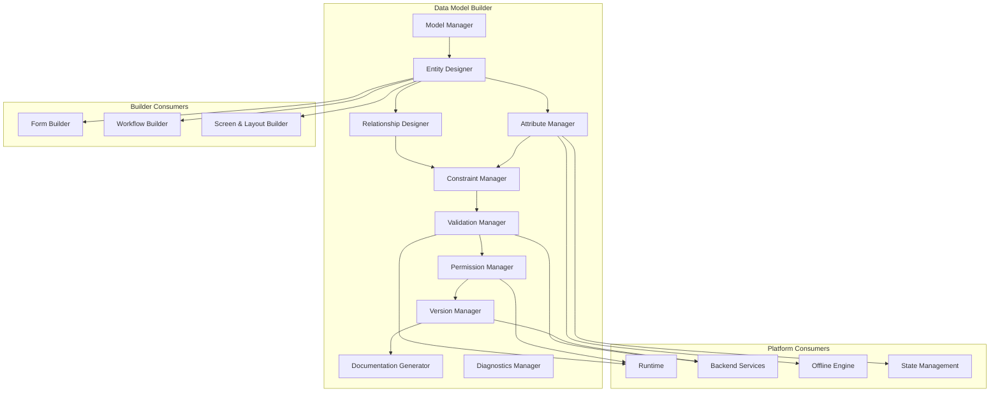

# Data Model Builder

**KB-028 — Data Model Builder Specification**

| Metadata | |
|----------|---|
| **KB ID** | KB-028 |
| **Title** | Data Model Builder |
| **Version** | 0.1.0 |
| **Status** | Drafting |
| **Owner** | Architecture Team |
| **Dependencies** | KB-022 Builder Studio Architecture, KB-018 State Management, KB-020 Offline & Synchronization, KB-026 Form Builder |
| **Related Documents** | Builder Studio Architecture (KB-022), Form Builder (KB-026), Workflow Builder (KB-025), Screen & Layout Builder (KB-024), Runtime Overview, State Management (KB-018), Offline & Synchronization (KB-020), Validation Engine (KB-030), Backend Architecture |
| **Review Status** | Pending |
| **Last Updated** | 2026-07-10 |

### Revision History

| Version | Date | Author | Change |
|---------|------|--------|--------|
| 0.1.0 | 2026-07-10 | AI Architecture Agent | Initial draft |

---

## 1. Purpose

The Data Model Builder is the Builder Studio subsystem responsible for designing, configuring, validating, versioning, and maintaining business data models throughout the DUKADESK platform. It is the authoritative system for defining business entities, attributes, relationships, constraints, validation rules, lifecycle policies, permissions, synchronization behavior, and metadata.

Business models are separated from storage implementations because business concepts evolve independently of database technologies. A Customer entity is a business concept that remains stable whether the backing store is a relational database, a document store, a key-value store, or an in-memory cache. Separating the business model from storage allows each to evolve independently and enables different storage strategies for different deployment contexts.

Business entities should be platform-independent because the same business data is consumed by mobile clients, web dashboards, backend services, offline runtimes, reporting engines, and AI agents. A platform-specific entity definition would require duplication across every consumer. A single platform-independent definition serves all consumers.

Data Models are the foundation of every business application because every application feature operates on data. Forms capture data. Workflows manipulate data. Screens display data. APIs expose data. Offline synchronization stores data. Reports analyze data. AI reasons about data. Without well-defined Data Models, every other Builder module lacks a solid foundation.

The Builder generates declarative models rather than database schemas because a declarative model captures business intent without prescribing implementation. A declarative model says "Order has a Customer" without specifying whether that relationship is implemented as a foreign key, a document reference, or a graph edge. The Backend and Runtime interpret the declarative model and implement it according to the deployment architecture.

---

## 2. Data Modeling Philosophy

### Business-First Modeling

Data Models are designed from the business perspective first. Attributes have business names, not column names. Relationships reflect business semantics, not foreign key constraints. The business user should be able to read and understand the model without database knowledge.

### Entity-Driven Architecture

Everything in DUKADESK revolves around entities. Forms bind to entities. Workflows manipulate entities. Screens display entities. APIs expose entities. The entity is the universal abstraction for business data across the entire platform.

### Declarative Schemas

Every entity is defined declaratively — its attributes, relationships, constraints, validation rules, and metadata are all structured data. Declarative schemas are portable, diffable, mergeable, and safe for AI generation.

### Separation of Business and Storage Concerns

The Data Model defines business concepts. Storage is an implementation detail. The same Data Model may be backed by different storage technologies in different deployments without modifying the model.

### Strong Relationships

Relationships between entities are first-class citizens, not foreign key columns. The Data Model Builder provides visual tools for defining, visualizing, and enforcing relationships. Relationship metadata guides forms, workflows, APIs, and the Offline Engine.

### Validation-First

Validation rules are defined at the model level, not at the form or API level. A "phone number must match pattern" rule defined on the Contact entity applies everywhere that entity is used — forms, APIs, imports, background processes.

### Version-Aware Evolution

Data Models evolve over time. The Data Model Builder tracks entity versions, attribute changes, and relationship modifications. Schema evolution is managed through versioning policies that support additive changes, deprecation, and migration.

### Multi-Tenant Readiness

Every entity declaration includes tenant isolation metadata. The platform uses this metadata to enforce data isolation at the storage and query levels without leaking tenant concerns into the business model.

### Offline Compatibility

Data Models include synchronization metadata that the Offline Engine uses to determine which entities are available offline, how they are synchronized, and how conflicts are resolved.

### AI-Assisted Modeling

AI agents assist in data modeling by generating entity definitions from requirements, inferring relationships from attribute names, detecting normalization issues, and suggesting validation rules.

---

## 3. What is a Data Model?

### Formal Definition

A **Data Model** is a declarative specification of business information. It defines entities, their attributes, relationships between entities, constraints, validation rules, lifecycle policies, permissions, synchronization behavior, and metadata. Data Models are consumed by the Runtime, Backend Services, Forms, Workflows, APIs, Offline Engine, State Management, Reporting Engine, AI Services, and Marketplace extensions.

### Characteristics

A Data Model:

- **Represents business information** — customers, orders, products, bookings, invoices, tasks.
- **Defines entities and relationships** — what things exist and how they relate to each other.
- **Establishes business constraints** — what values are valid, what combinations are allowed.
- **Is consumed by Runtime and Backend** — both environments interpret the same declarative model.
- **Produces implementation-independent metadata** — the model does not prescribe database tables, API endpoints, or UI components.

### What a Data Model Is Not

| Not This | Because |
|----------|---------|
| A database engine | The model describes business entities, not how they are stored. Storage is an implementation concern. |
| A SQL schema | SQL schemas are database-specific. Data Models are platform-independent. |
| A backend implementation | The backend implements the model; it does not redefine it. |
| A UI form | Forms are generated from models. The model is the source; the form is a consumer. |
| A workflow | Workflows manipulate model instances. The model defines the data; workflows define the process. |
| A storage provider | Storage providers persist model instances. The model is independent of the storage technology. |

---

## 4. Builder Responsibilities

### Entity Creation

Create new entity definitions from templates or from scratch. Entity creation establishes the entity type, display name, description, and initial attributes.

### Attribute Definition

Define entity attributes with names, types, constraints, defaults, and metadata. Support all primitive, structured, collection, reference, and rich types.

### Relationship Modeling

Define relationships between entities: one-to-one, one-to-many, many-to-many, hierarchical, and reference relationships. Configure relationship behavior (cascade, restrict, set null) and visualization.

### Constraint Management

Define business constraints on entities and attributes: required fields, uniqueness, range limits, pattern validation, referential integrity, and custom business rules.

### Validation Rule Definition

Define validation rules that apply wherever the entity is used. Validation rules are defined once at the model level and enforced by all consumers.

### Lifecycle Policy Configuration

Define entity lifecycle stages (draft, active, archived, deleted), transition rules, retention policies, and expiration behavior.

### Permission Definition

Define entity-level and attribute-level permissions: who can read, create, update, delete, approve, export, and audit.

### Version Management

Track entity versions, manage schema evolution, support additive changes, deprecate deprecated attributes, and manage migration policies.

### Synchronization Policy Configuration

Define synchronization behavior for the Offline Engine: offline availability, sync direction, conflict resolution strategy, and cache policy.

### Documentation Generation

Generate human-readable documentation from Data Model definitions: entity descriptions, attribute tables, relationship diagrams, and validation rule summaries.

---

## 5. Data Model Architecture

### 5.1 Model Manager

| Aspect | Description |
|--------|-------------|
| **Purpose** | Manage the lifecycle of Data Models within the Builder project. |
| **Responsibilities** | Create, read, update, delete, duplicate, and organize Data Models. Manage model metadata and versioning. |
| **Inputs** | Model CRUD commands, project context. |
| **Outputs** | Data Model definitions, model list, model metadata. |
| **Extension points** | Custom model templates, model lifecycle hooks, external model imports. |

### 5.2 Entity Designer

| Aspect | Description |
|--------|-------------|
| **Purpose** | Provide visual tools for designing entity definitions. |
| **Responsibilities** | Render entity structure, manage attributes, configure entity properties, provide entity templates. |
| **Inputs** | Entity definition, attribute schemas, entity type configuration. |
| **Outputs** | Modified entity definition, entity visualization. |
| **Extension points** | Custom entity types, entity visualization plugins. |

### 5.3 Relationship Designer

| Aspect | Description |
|--------|-------------|
| **Purpose** | Provide visual tools for modeling entity relationships. |
| **Responsibilities** | Render entity-relationship diagrams, manage relationship creation and configuration, visualize relationship paths. |
| **Inputs** | Relationship definitions, entity references, relationship type configuration. |
| **Outputs** | Relationship diagram, relationship metadata. |
| **Extension points** | Custom relationship types, relationship visualization layouts. |

### 5.4 Attribute Manager

| Aspect | Description |
|--------|-------------|
| **Purpose** | Manage attribute definitions for all entities. |
| **Responsibilities** | Define attribute types, configure attribute properties, manage attribute ordering and grouping, support custom attributes. |
| **Inputs** | Attribute definitions, type schemas. |
| **Outputs** | Configured attributes, attribute metadata. |
| **Extension points** | Custom attribute types, custom type validators. |

### 5.5 Constraint Manager

| Aspect | Description |
|--------|-------------|
| **Purpose** | Define and manage business constraints on entities and attributes. |
| **Responsibilities** | Create constraint definitions, validate constraint consistency, manage constraint groups, enforce constraint hierarchy. |
| **Inputs** | Constraint definitions, entity schemas. |
| **Outputs** | Constraint configurations, constraint validation results. |
| **Extension points** | Custom constraint types, external constraint systems. |

### 5.6 Validation Manager

| Aspect | Description |
|--------|-------------|
| **Purpose** | Define validation rules and manage validation logic for entities. |
| **Responsibilities** | Create validation rules, configure rule severity (error, warning), manage rule evaluation order, validate rule consistency. |
| **Inputs** | Validation rule definitions, entity schemas, data type information. |
| **Outputs** | Validation rule configurations, rule validation results. |
| **Extension points** | Custom validation rule types, expression language plugins. |

### 5.7 Permission Manager

| Aspect | Description |
|--------|-------------|
| **Purpose** | Define entity-level and attribute-level permissions. |
| **Responsibilities** | Configure read/write/create/delete/approve/export permissions, manage role-based access, define attribute-level restrictions. |
| **Inputs** | Permission configurations, role definitions. |
| **Outputs** | Permission metadata, access control definitions. |
| **Extension points** | Custom permission providers, external authorization systems. |

### 5.8 Version Manager

| Aspect | Description |
|--------|-------------|
| **Purpose** | Manage Data Model versioning and schema evolution. |
| **Responsibilities** | Track entity versions, manage schema diffs, support additive migrations, deprecate attributes, manage version compatibility. |
| **Inputs** | Entity change events, version policy configuration. |
| **Outputs** | Version history, migration plans, compatibility reports. |
| **Extension points** | Custom migration strategies, external schema registries. |

### 5.9 Documentation Generator

| Aspect | Description |
|--------|-------------|
| **Purpose** | Generate human-readable documentation from Data Model definitions. |
| **Responsibilities** | Produce entity documentation, attribute tables, relationship diagrams, validation summaries, and export to documentation formats. |
| **Inputs** | Data Model definitions. |
| **Outputs** | Generated documentation. |
| **Extension points** | Custom documentation templates, external documentation system integration. |

### 5.10 Diagnostics Manager

| Aspect | Description |
|--------|-------------|
| **Purpose** | Collect and expose diagnostic information about Data Model operations. |
| **Responsibilities** | Log modeling operations, track performance metrics, capture errors, expose health status. |
| **Inputs** | Events from all other modules. |
| **Outputs** | Diagnostic logs, metrics, health status. |
| **Extension points** | Custom diagnostic sinks, metrics exporters. |

### Data Model Architecture Diagram

---

## 6. Canonical Data Model Structure

Every Data Model in the Builder is represented by a structured definition.

### Metadata

| Field | Description |
|-------|-------------|
| **Model ID** | Unique identifier within the Desk. |
| **Display Name** | Human-readable name. |
| **Description** | Purpose and scope of the model. |
| **Version** | Current model version. |
| **Owner** | Team or individual responsible. |
| **Namespace** | Domain namespace for entity identification. |
| **Tags** | Arbitrary tags for organization. |
| **Status** | Draft, Ready for Review, Approved, Published. |

### Entities

The core of the Data Model. Each entity defines a business concept with attributes, relationships, constraints, and lifecycle policies.

### Attributes

Properties of an entity. Each attribute has a name, type, constraints, default value, and metadata.

### Relationships

Connections between entities. Each relationship defines the source entity, target entity, type, cardinality, and behavior.

### Enumerations

Named sets of allowed values. Enumerations may be shared across multiple attributes and multiple entities.

| Field | Description |
|-------|-------------|
| **Enumeration ID** | Unique identifier. |
| **Display Name** | Human-readable name. |
| **Values** | List of allowed values with display names. |
| **Extensible** | Whether new values may be added by capabilities or tenants. |

### Constraints

Business rules that restrict entity and attribute values. Constraints may be simple (required, unique) or complex (expression-based).

### Validation Rules

Executable rules that validate entity instances. Rules are defined once and enforced by all consumers.

### Permissions

Access control metadata for entities and attributes. Permissions specify which roles or users can perform which operations.

### Lifecycle Policies

Rules governing entity state transitions. Lifecycle policies define valid states, transition triggers, and state-dependent behavior.

### Synchronization Policies

Rules governing how entity data is synchronized between local and remote stores. Synchronization policies define offline availability, sync direction, and conflict resolution.

### Search Metadata

Configuration for search indexing and querying. Search metadata defines which fields are searchable, filterable, sortable, and aggregatable.

### Audit Metadata

Configuration for audit logging. Audit metadata defines which operations and which fields are audited.

### Documentation

Human-readable documentation for the model, entities, attributes, and relationships. Documentation may be auto-generated or manually authored.

---

## 7. Entity Modeling

### Business Entity

The primary entity type representing a core business concept. Business entities have identity, lifecycle, relationships, and permissions.

**Examples:** Customer, Order, Product, Invoice, Booking, Task, Employee.

**Characteristics:** Has a unique identifier, may be created and deleted, participates in relationships, has lifecycle stages, requires permissions.

### Value Object

An entity that represents a value rather than an identity. Value objects are immutable, have no independent lifecycle, and are compared by value rather than by identity.

**Examples:** Address, Money, GeoLocation, DateRange, ContactInfo.

**Characteristics:** No independent identity, immutable, compared by value, owned by a business entity.

### Lookup Entity

A reference entity that provides a fixed or slowly changing set of values for dropdowns, selectors, and categorization.

**Examples:** Country, Currency, Status, Category, PaymentMethod.

**Characteristics:** Small to moderate size, rarely changes, referenced by other entities, may have localized display names.

### Reference Entity

An entity that represents a relationship to an external system or service. Reference entities store minimal identifying information and pointers to external data.

**Examples:** ExternalCustomerRef, PaymentGatewayRef, ShippingProviderRef.

**Characteristics:** Stores external identifiers and metadata, does not own the external data, may cache a subset of external attributes.

### Configuration Entity

An entity that stores application or tenant configuration. Configuration entities are managed by administrators and read by the Runtime.

**Examples:** TenantSettings, FeatureFlags, EmailTemplates, WorkflowConfig.

**Characteristics:** Controlled write access, cached aggressively, versioned, may have tenant scope.

### System Entity

An entity managed by the platform rather than by application builders. System entities provide infrastructure data.

**Examples:** User, Role, Permission, Session, AuditLog, Notification.

**Characteristics:** Defined by the platform, extended by applications, guarded by platform-level permissions.

### Temporary Entity

An entity that exists only within a workflow or session and is not persisted permanently.

**Examples:** ShoppingCart (before checkout), FormDraft, WizardState.

**Characteristics:** Ephemeral, session-scoped, may be persisted temporarily for crash recovery, no long-term lifecycle.

### Shared Entity

An entity that is defined in one model and referenced across multiple capabilities or Desks. Shared entities ensure consistent data definitions across the platform.

**Examples:** Customer (shared across Sales and Support Desks), Product (shared across Catalog and Ordering capabilities).

**Characteristics:** Defined in a shared model, imported by consuming models, changes require coordination across consumers.

---

## 8. Attribute Types

### Primitive Types

| Type | Description | Example Values |
|------|-------------|----------------|
| **Text** | Single-line or multi-line string. | Name, description, notes. |
| **Integer** | Whole number. | Quantity, count, version number. |
| **Decimal** | Fixed or floating-point number. | Price, tax rate, percentage. |
| **Boolean** | True/false value. | Is active, is verified, is archived. |
| **Date** | Calendar date without time. | Birth date, order date, start date. |
| **Time** | Time of day without date. | Opening time, appointment time. |
| **DateTime** | Date and time combined. | Created at, updated at, scheduled at. |
| **Duration** | Length of time. | Service duration, delivery window, warranty period. |
| **UUID** | Universally unique identifier. | Entity ID, reference ID, correlation ID. |

### Structured Types

| Type | Description | Sub-Fields |
|------|-------------|------------|
| **Address** | Postal address. | Street, city, state, postal code, country. |
| **Currency** | Currency code. | Code (USD, EUR), symbol, decimal places. |
| **Money** | Monetary amount. | Amount (decimal), currency (Currency). |
| **Email** | Email address. | Address (string), verified (boolean). |
| **Phone** | Phone number. | Number (string), country code (string), type (enum). |
| **URL** | Uniform resource locator. | URL (string), label (string). |
| **GeoLocation** | Geographic coordinates. | Latitude (decimal), longitude (decimal). |

### Collections

| Type | Description | Example |
|------|-------------|---------|
| **List** | Ordered collection of values. | Tags, line items, email addresses. |
| **Set** | Unordered collection of unique values. | Categories, permissions, assigned users. |
| **Map** | Key-value pairs. | Custom fields, localized names, metadata. |
| **Array** | Fixed-size indexed collection. | Coordinates, matrix values, time series. |

### References

| Type | Description | Example |
|------|-------------|---------|
| **Entity Reference** | Reference to another entity in the same model. | Order.customer → Customer. |
| **External Reference** | Reference to an external system entity. | User.externalId → HR System ID. |
| **File Reference** | Reference to a stored file or document. | Invoice.attachment → Document. |
| **User Reference** | Reference to a platform user. | Task.assignee → User. |
| **Organization Reference** | Reference to an organization or tenant. | Customer.organization → Organization. |

### Rich Types

| Type | Description |
|------|-------------|
| **Rich Text** | Formatted text with HTML or Markdown content. |
| **JSON Object** | Arbitrary structured JSON data (conceptual). |
| **Media** | Binary media content with type metadata. |
| **Image** | Image media with dimensions and format metadata. |
| **Video** | Video media with duration and format metadata. |
| **Audio** | Audio media with duration and format metadata. |
| **Document** | Document file with format and page count metadata. |

---

## 9. Relationship Modeling

### One-to-One

Each source entity instance relates to exactly one target entity instance. The target instance relates back to at most one source instance.

**Use when:** An entity has exactly one associated entity of another type.

**Example:** Employee ↔ EmployeeProfile, User ↔ UserSettings.

**Lifecycle implications:** Cascading delete may propagate from source to target. The target is often a value object or subordinate entity.

### One-to-Many

Each source entity instance relates to zero or more target entity instances. Each target instance relates back to exactly one source instance.

**Use when:** An entity has multiple associated entities of another type.

**Example:** Customer → Orders, Order → LineItems, Product → Reviews.

**Lifecycle implications:** Deleting the source may cascade to targets. Targets may be orphaned or restricted from deletion while referenced.

### Many-to-Many

Each source entity instance relates to zero or more target entity instances, and each target instance relates to zero or more source instances.

**Use when:** Entities have independent existence but can be associated with each other.

**Example:** Product ↔ Category, Student ↔ Course, User ↔ Role.

**Lifecycle implications:** Junction relationship is managed independently. Deleting either side removes the junction but does not delete the other side.

### Composition

A strong ownership relationship where the target entity cannot exist without the source entity. Composition implies lifecycle dependency.

**Use when:** The target entity is a part of the source entity and has no independent existence.

**Example:** Order → LineItem (line items are part of the order), Document → Page (pages are part of the document).

**Lifecycle implications:** Deleting the source deletes all composed targets. Targets are not shared across sources.

### Aggregation

A weaker ownership relationship where the target entity may exist independently but is currently associated with the source.

**Use when:** Entities have independent existence but are grouped together for business purposes.

**Example:** Team → Members (members exist independently), Project → Documents (documents exist independently).

**Lifecycle implications:** Deleting the source does not delete the targets. Targets may be reassigned to other sources.

### Hierarchical Relationships

Self-referencing relationships where an entity relates to itself in a parent-child structure.

**Use when:** Entities form a tree or hierarchy.

**Example:** Category → ParentCategory, Employee → Manager, OrganizationUnit → ParentUnit.

**Lifecycle implications:** Deleting a parent may cascade children, restrict deletion, or reassign children to a new parent. Circular hierarchies are detected and prevented.

### Recursive Relationships

Relationships where both ends are the same entity type but with different roles. Recursive relationships are a generalized form of hierarchical relationships.

**Use when:** Entities can be related in arbitrary networks.

**Example:** Task → DependsOn (task dependencies), Product → RelatedProduct (product recommendations).

**Lifecycle implications:** Recursive relationships may create cycles. Cycle detection is enforced at validation time.

### Reference Relationships

A lightweight relationship where the source entity stores a reference to the target entity without maintaining referential integrity at the model level. Reference relationships are used for loose coupling across model boundaries.

**Use when:** Entities in different models or different Desks need to reference each other.

**Example:** Order.referralSource → ExternalCampaign (cross-model reference).

**Lifecycle implications:** No lifecycle coupling. The reference may become stale (dangling reference). Consumers should handle missing references gracefully.

---

## 10. Constraints & Validation

### Required Attributes

Specifies that an attribute must have a non-null value.

- Enforced on create and update operations.
- May be conditional based on entity state or other attribute values.
- Applicable to all attribute types.

### Uniqueness

Specifies that an attribute value must be unique across all entity instances.

- Single-field uniqueness (email must be unique).
- Composite uniqueness (combination of first name, last name, and date of birth must be unique).
- Scoped uniqueness (unique within a tenant, within an organization, within a parent entity).

### Range Constraints

Specifies allowed value ranges for numeric, date, and time attributes.

- Minimum and maximum values.
- Inclusive or exclusive boundaries.
- Applicable to Integer, Decimal, Date, Time, DateTime, Duration.

### Pattern Validation

Specifies that a string attribute must match a defined pattern.

- Regular expression pattern.
- Common pattern presets (email, phone, postal code, URL, credit card).
- Locale-specific pattern validation.

### Referential Integrity (Conceptual)

Specifies that a relationship reference must point to an existing entity instance.

- Enforced on create and update of the referencing entity.
- Cascading behavior options: restrict (block deletion of referenced entity), cascade (delete references when referenced entity is deleted), set null (set reference to null when referenced entity is deleted).
- Applicable to all reference attributes.

### Business Rules

Complex validation logic expressed through the platform's expression language.

- Cross-attribute validation ("end date must be after start date").
- Cross-entity validation ("order total must match sum of line item totals").
- State-dependent validation ("active orders cannot have zero items").
- Context-aware validation ("discount percentage cannot exceed limit for this customer tier").

### Custom Validation Extensions

Extensions that provide application-specific or capability-specific validation logic.

- Custom validator functions registered by capabilities.
- External validation service integration.
- AI-assisted validation analysis.

---

## 11. Lifecycle Policies

### Draft

The initial state for entity instances that are being created but are not yet ready for use. Draft instances are visible only to the creator and users with appropriate permissions.

**Transition:** Draft → Active (on submission or activation).

### Active

The normal operating state for entity instances. Active instances participate fully in relationships, workflows, and queries.

**Transition:** Active → Archived, Active → Deleted.

### Archived

A preserved state for entity instances that are no longer actively used but must be retained for historical or compliance purposes. Archived instances are excluded from most queries and workflows.

**Transition:** Archived → Active (on restoration).

### Deleted (Logical Deletion)

A terminal state where the instance is marked as deleted but not physically removed. Deleted instances are excluded from all queries except audit recovery.

**Transition:** Deleted → Archived (on restoration, if supported).

### Retention Policies

Rules governing how long entity instances are retained in each lifecycle state.

- **Active retention**: Minimum duration before archiving is permitted.
- **Archived retention**: Fixed or indefinite retention period.
- **Deleted retention**: Grace period before physical deletion (purge).
- **Compliance hold**: Instances under legal or regulatory hold cannot be purged.

### Expiration

Automatic lifecycle transitions based on time.

- Expired instances transition to Archived or Deleted based on policy.
- Expiration may trigger notification workflows.
- Expiration may be suspended for instances under audit hold.

### Restoration

The ability to return an instance from Archived or Deleted back to Active.

- Restoration requires appropriate permissions.
- Restoration may require validation of attribute consistency.
- Restoration may trigger compensation workflows.

---

## 12. Permissions

### Entity-Level Permissions

| Permission | Description |
|------------|-------------|
| **Read** | View entity instances. |
| **Create** | Create new entity instances. |
| **Update** | Modify existing entity instances. |
| **Delete** | Delete (logical or physical) entity instances. |
| **Approve** | Approve entity transitions (e.g., approve an order). |
| **Export** | Export entity data. |
| **Audit** | View audit history for entity instances. |
| **Manage Permissions** | Modify permission configuration for the entity. |

### Attribute-Level Permissions

Individual attributes may have more restrictive permissions than their parent entity:

- **Read restricted**: The attribute is visible only to authorized roles.
- **Write restricted**: The attribute is editable only by authorized roles.
- **Sensitive**: The attribute is encrypted, excluded from logs, and restricted to authorized roles.

**Examples:**

- Employee.salary: Read restricted to HR and Finance roles.
- Customer.creditCard: Write restricted to billing system integration.
- User.phoneNumber: Read restricted to admin roles, writable by the user.

### Role-Based Access

Permissions are assigned to roles. A user's effective permissions are the union of all permissions granted by their roles.

| Role Type | Examples |
|-----------|----------|
| Platform roles | Admin, SuperAdmin, Auditor |
| Tenant roles | TenantAdmin, TenantEditor, TenantViewer |
| Domain roles | OrderManager, CustomerService, InventoryClerk |
| Workflow roles | Approver, Reviewer, Delegator |

### Permission Inheritance

Permissions flow through the entity hierarchy:

- Entity-level permissions apply to all attributes unless overridden.
- Relationship permissions are inherited from the source entity unless explicitly configured.
- Tenant-level permissions apply to all entities within the tenant.

---

## 13. Synchronization Policies

### Offline Availability

Defines whether entity instances are available for offline access.

| Policy | Behavior |
|--------|----------|
| **Online Only** | Entity is never available offline. Requires connectivity to access. |
| **Offline Available** | Entity is cached locally and available offline. Changes are queued for sync. |
| **Offline with Preload** | Entity data is preloaded during initial sync for guaranteed offline access. |

### Read-Only Synchronization

Defines whether offline changes are permitted.

| Policy | Behavior |
|--------|----------|
| **Full Sync** | Entities can be created, updated, and deleted offline. Changes sync bidirectionally. |
| **Read-Only** | Entities are available offline for reading. Offline modifications are not permitted. |
| **Write-Only** | Entities can be created and updated offline but are not synced from server. |

### Full Synchronization

All entity instances are synchronized in their entirety. Used for small datasets where full sync is efficient.

### Incremental Synchronization

Only changed entities are synchronized. Used for large datasets where full sync is impractical.

### Conflict Resolution Participation

Defines how the entity participates in conflict resolution.

| Policy | Behavior |
|--------|----------|
| **Server Wins** | Server state is authoritative on conflict. |
| **Client Wins** | Client state is authoritative on conflict. |
| **Merge** | Non-conflicting fields are merged; conflicts are resolved by strategy. |
| **Manual** | Conflicts require user resolution. |

### Cache Policies

Defines how entity data is cached locally.

| Policy | Behavior |
|--------|----------|
| **Cache on Access** | Entity is cached locally when first accessed. |
| **Preload** | Entity is preloaded during initial sync. |
| **TTL Cache** | Entity is cached for a configured time-to-live. |
| **No Cache** | Entity is never cached locally. |

---

## 14. Search & Reporting Metadata

### Searchable Fields

Fields that are indexed for full-text or structured search. Searchable fields are available in the platform's search service.

- **Full-text searchable**: Text, Rich Text, Email, URL.
- **Structured searchable**: Integer, Decimal, Date, DateTime, Boolean, Enumeration.
- **Relationship searchable**: Entity Reference fields for lookup-based search.

### Filterable Fields

Fields that can be used as filter criteria in queries, list screens, and reporting. Filterable fields support equality, range, pattern, and set membership filters.

### Sortable Fields

Fields that can be used as sort criteria. Sortable fields support ascending and descending order.

### Aggregation Support

Fields that support aggregation operations for reporting and analytics.

- **Sum**: Decimal, Integer, Money.
- **Average**: Decimal, Integer, Money, Duration.
- **Count**: All types (count of instances).
- **Min/Max**: Decimal, Integer, Date, DateTime, Money.
- **Group By**: Enumeration, Entity Reference, Boolean.

### Reporting Metadata

Configuration for how entities appear in reports:

- Default report columns and their order.
- Default grouping and aggregation settings.
- Available chart types for the entity (bar, line, pie, table).
- Export format configuration (CSV, Excel, PDF).

### Export Metadata

Configuration for how entity data is exported:

- Available export formats.
- Maximum row limits.
- Column selection and ordering.
- Data transformation rules (formatting, masking, localization).

---

## 15. Runtime Integration

### Runtime

The Runtime loads Data Model definitions from the published Manifest. Data Models inform Runtime behavior: component data bindings, form generation, list screen configuration, detail view layout, and validation enforcement.

### State Management

Data Model entities map to state keys in the State Management subsystem. When an entity is defined, corresponding state registry entries are established with the correct schema, type information, and default values.

State Management uses Data Model metadata to:

- Validate state mutations against entity schemas.
- Enforce attribute-level permissions on state access.
- Manage entity lifecycle transitions.
- Coordinate synchronization with the Offline Engine.

### Forms

The Form Builder consumes Data Model definitions to auto-generate form fields, validation rules, and submission behavior. Changes to the Data Model are automatically reflected in all generated forms.

### Workflow Builder

Workflows manipulate Data Model entities. The Workflow Builder references entity definitions to configure data mappings, validation rules, and state transitions. Workflow steps that operate on entities are validated against the entity schema.

### Action Engine

Actions that operate on data (createRecord, updateRecord, deleteRecord, queryRecords) use Data Model metadata to validate parameters, enforce permissions, and determine storage behavior.

### Renderer

Screens that display entity data use Data Model metadata to determine field types, formatting, validation, and accessibility metadata. The Renderer reads entity metadata to render appropriate input controls for each attribute type.

### Offline Engine

The Offline Engine uses synchronization policies defined in the Data Model to determine which entities are available offline, how they are synchronized, and how conflicts are resolved.

### Event Bus

Entity lifecycle events (created, updated, deleted, archived, restored) are published on the Event Bus with the entity type and instance identifier. Workflows and capabilities subscribe to these events for reactive processing.

### Capability System

Capabilities may extend existing Data Models with additional attributes, relationships, or lifecycle stages. Capability extensions are validated against the base model and merged at runtime.

---

## 16. Backend Integration

### API Contracts

Data Model definitions inform API contract generation:

- REST endpoints are generated for each entity (CRUD + list + search).
- GraphQL types are generated from entity schemas.
- Request and response schemas are derived from attribute definitions.
- Validation rules from the Data Model are enforced at the API layer.
- Permission metadata drives API authorization.

### Validation

Backend validation is derived from Data Model definitions:

- Schema validation (field types, required fields, constraints).
- Business rule validation (expression-based rules).
- Relationship validation (referential integrity).
- Permission validation (attribute-level access control).

Validation rules defined in the Data Model are enforced by the Backend without duplication. The Backend does not redefine validation logic.

### Persistence

Data Model metadata informs persistence decisions:

- Storage technology selection (relational, document, key-value).
- Index strategy based on search and filter metadata.
- Partitioning strategy based on tenant isolation requirements.
- Caching strategy based on entity access patterns.

The Backend implements the storage layer; the Data Model defines what is stored.

### Search Indexing

Search metadata from the Data Model drives search indexing configuration:

- Which fields are indexed for full-text search.
- Which fields are indexed for structured filtering.
- Which fields are indexed for aggregation.
- Index update frequency and strategy.

### Reporting

Reporting metadata from the Data Model drives report generation:

- Available report fields and their data types.
- Default aggregations and groupings.
- Chart type recommendations.
- Export format support.

### Synchronization

Synchronization policies from the Data Model drive the Backend's sync API behavior:

- Conflict detection and resolution logic.
- Incremental sync endpoint configuration.
- Offline data preloading strategy.
- Cache invalidation rules.

### Audit Systems

Audit metadata from the Data Model drives audit logging:

- Which operations are audited (create, update, delete, read).
- Which fields are included in audit records.
- Retention period for audit data.
- Compliance hold configuration.

---

## 17. AI Integration

### Generate Entities

The AI Assistant can generate entity definitions from natural language descriptions: "Create a Customer entity with name, email, phone, address, and loyalty points."

The AI generates the entity with appropriate attribute types, constraints, and metadata. The builder reviews and refines the result.

### Infer Relationships

Based on attribute names and entity context, the AI Assistant infers likely relationships: "The Customer entity has an `orders` field. Should this be a one-to-many relationship to an Order entity?" The builder confirms or adjusts the suggestion.

### Recommend Attributes

Given an entity purpose, the AI Assistant recommends attributes that are commonly associated with that entity type: "For an Order entity, you may want: order date, status, total amount, shipping address, payment method, line items."

### Detect Normalization Issues

The AI Assistant analyzes entity definitions for normalization issues:

- "The Customer entity has `homePhone`, `workPhone`, and `mobilePhone`. Consider a Phone entity with a type attribute."
- "The Address fields are repeated across Customer and Order entities. Consider a shared Address entity."
- "The `tags` field is a comma-separated string. Consider a Tag entity with a many-to-many relationship."

### Suggest Validations

Based on attribute types and business context, the AI Assistant suggests validation rules:

- "Email field should have email format validation."
- "Order total should be greater than zero."
- "End date should be after start date."
- "Phone number should match the locale-specific pattern."

### Generate Documentation

The AI Assistant generates human-readable documentation from Data Model definitions:

- Entity descriptions and purpose.
- Attribute tables with types and constraints.
- Relationship explanations with cardinality.
- Validation rule summaries.
- Example usage scenarios.

### Recommend Indexes

Based on search and filter metadata, the AI Assistant recommends indexing strategies:

- "The `email` field is frequently searched. Consider a unique index."
- "The `status` and `createdDate` fields are frequently filtered. Consider a composite index."
- "The `tags` field is used for faceted search. Consider a GIN index (conceptual)."

### Identify Missing Entities

The AI Assistant analyzes the model for missing entities:

- "The Order entity references a `customerId` but there is no Customer entity. Would you like to create one?"
- "The workflow requires an Approval entity but none is defined. Would you like to create one?"
- "Multiple entities have address fields. Consider extracting a shared Address entity."

---

## 18. Collaboration

### Shared Editing (Future)

Future support for multiple builders editing the same Data Model simultaneously:

- Real-time entity and attribute updates.
- Cursor presence on the ER diagram.
- Conflict resolution for concurrent edits.
- Change attribution.

### Reviews

Data Model definitions can be submitted for review:

- Request review from data architects, domain experts, or compliance officers.
- Reviewer examines entities, attributes, relationships, and constraints.
- Reviewer approves or requests changes.
- Review comments are linked to specific entities or attributes.

### Comments

Builders can add comments to model elements:

- Questions about entity purpose.
- Suggestions for relationship changes.
- Notes about validation requirements.
- Threaded discussions with replies.

### Version History

Every change to the Data Model is recorded:

- Who made the change.
- When the change was made.
- What changed (entity-level diff, attribute diff).
- Change description.
- Version number.

### Change Tracking

The Collaboration Manager tracks changes at the element level:

- Added, modified, and deleted entities.
- Attribute type changes.
- Relationship modifications.
- Constraint and validation changes.

### Approval Workflows

Data Model publication may require approval:

- Define approval gates for model publishing.
- Approval request and notification.
- Approval history per model version.
- Automatic rollback on rejection.

---

## 19. Security

### Sensitive Attributes

Attributes classified as sensitive receive special handling:

- Encrypted at rest and in transit.
- Excluded from diagnostic logs and error reports.
- Redacted in audit records.
- Accessible only to authorized roles.
- Not included in search indexes.

**Examples:** Social security numbers, credit card numbers, health records, authentication tokens.

### Encryption Metadata

Attributes may be marked for encryption:

- **At rest**: Encrypted in the database.
- **In transit**: Encrypted over network connections.
- **End-to-end**: Encrypted on the client, decrypted only by authorized consumers.
- **Field-level**: Individual attribute encryption independent of storage encryption.

### Tenant Isolation

Data Models enforce tenant isolation at the entity level:

- Every entity instance is associated with a tenant.
- Cross-tenant data access is prevented at the storage layer.
- Tenant-scoped queries are enforced by the Backend.
- Tenant isolation metadata is non-bypassable.

### Audit Metadata

Entities and attributes may be marked for audit logging:

- **Create tracking**: Log who created an instance and when.
- **Update tracking**: Log who modified which fields and when.
- **Delete tracking**: Log who deleted an instance and when.
- **Read tracking**: Log who accessed sensitive attributes and when.
- **Export tracking**: Log who exported data and in what format.

### Secure References

References to external systems or sensitive entities are secured:

- External references store identifiers, not secrets.
- Credentials are stored in the secure credential store, not in entity attributes.
- Cross-Desk references are validated against the target Desk's access policies.

### Data Classification

Each entity and attribute may carry a data classification tag:

| Classification | Description | Example |
|----------------|-------------|---------|
| **Public** | No access restrictions. | Product name, category. |
| **Internal** | Accessible to authenticated users. | Order status, task description. |
| **Confidential** | Restricted to authorized roles. | Customer email, employee salary. |
| **Sensitive** | Highly restricted, encrypted. | Credit card number, health record. |
| **Regulated** | Subject to compliance requirements. | GDPR personal data, PCI payment data. |

### Compliance Metadata

Entities subject to regulatory compliance carry additional metadata:

- **GDPR**: Personal data classification, data retention limits, right to erasure support.
- **PCI**: Payment data classification, encryption requirements, access restrictions.
- **HIPAA**: Health data classification, audit requirements, business associate agreements.
- **SOX**: Financial data classification, audit trail requirements, approval workflows.

---

## 20. Performance

### Model Indexing

The Data Model Builder maintains indexes for efficient model access:

- Entity lookup by name and ID.
- Relationship traversal for dependency analysis.
- Attribute search across all entities.
- Constraint and validation rule lookup by entity.

### Incremental Loading

Data Models are loaded incrementally:

- Entity list is loaded first (names and IDs only).
- Full entity definitions are loaded on demand when an entity is opened for editing.
- Relationship diagrams are rendered lazily as the user navigates.
- Large attribute sets are paginated in the Entity Designer.

### Large Model Optimization

For Data Models with many entities and relationships:

- Virtualized entity list rendering.
- Lazy-loaded relationship visualization.
- Deferred validation for entities not currently edited.
- Efficient diff computation for version comparison.

### Efficient Relationship Resolution

Relationship navigation is optimized:

- Relationship metadata is cached after first load.
- Reverse relationship lookups are indexed.
- Circular relationship detection runs incrementally on change.
- Relationship pathfinding for complex graphs is limited to depth-constrained queries.

### Lazy Loading

Entity details are loaded lazily:

- Attribute list loads on entity selection.
- Relationship list loads on entity selection.
- Constraint and validation details load on tab selection.
- Documentation content loads on demand.

### Metadata Caching

Data Model metadata is cached aggressively:

- Entity schemas are cached in memory during editing sessions.
- Attribute type definitions are cached from the type registry.
- Relationship definitions are cached for fast diagram rendering.
- Cache is invalidated when the model is modified.

---

## 21. Observability

### Model Diagnostics

The Diagnostics Manager exposes:

- Entity count and complexity metrics.
- Attribute count distribution across entities.
- Relationship density (relationships per entity).
- Constraint and validation rule counts.
- Model version history and change frequency.

### Relationship Analysis

Relationship diagnostics:

- Entity relationship graph with connectivity metrics.
- Orphaned entities (entities with no relationships).
- Highly connected entities (hub analysis).
- Relationship cardinality distribution.
- Circular dependency detection history.

### Constraint Reports

Constraint coverage analysis:

- Percentage of entities with validation rules.
- Constraint type distribution.
- Validation rule density.
- Most commonly constrained attributes.
- Constraint violation trends (from runtime).

### Validation Summaries

Validation summaries provide:

- Validation pass/fail statistics.
- Most common validation failures.
- Validation performance (evaluation time per rule).
- Validation coverage per entity.

### Performance Metrics

Key performance indicators:

- Model load time.
- Entity open/edit time.
- Relationship diagram render time.
- Validation execution time.
- Documentation generation time.

### Dependency Graphs

Dependency analysis:

- Entity dependency graph (which entities depend on which).
- Impact analysis (changing entity X affects which forms, workflows, screens).
- Circular dependency detection.
- Export dependency graph for documentation.

---

## 22. Anti-Patterns

### Database-First Modeling

Designing Data Models to match a target database schema is prohibited. Data Models should reflect business concepts, not database tables. Database-first modeling couples the business model to storage implementation and makes the model non-portable across deployment architectures.

### Business Logic Inside Entities

Embedding business logic in entity definitions (computed attributes that implement business rules, default values that encode policy decisions, validation rules that enforce business processes) is prohibited. Entities define data structure and constraints. Business logic belongs in workflows, action handlers, and capabilities.

### Duplicate Entities

Creating separate entities for the same business concept in different parts of the model is prohibited. Duplicate entities cause inconsistent data definitions and synchronization issues. Each business concept must have exactly one entity definition.

### Circular Relationships

Defining relationships that create circular dependency chains is prohibited. Circular relationships cause infinite loops in data loading, synchronization, and lifecycle management. The Relationship Designer detects and prevents circular definitions.

### Excessive Normalization

Decomposing entities into excessively granular components (splitting an address into street name, street number, street prefix, street suffix, apartment number, building name, etc.) is discouraged. Over-normalization increases complexity without commensurate business value. Normalize to the level required by business operations.

### Hardcoded Storage Assumptions

Including storage-specific attributes (database IDs, partition keys, shard indicators) in entity definitions is prohibited. Storage concerns are implementation details that must not leak into the business model.

### Missing Ownership

Defining entities without specifying ownership, permissions, or tenant isolation metadata is prohibited. Every entity must have clear ownership and access control policies. Unspecified permissions default to the most restrictive setting.

### Ignoring Lifecycle Policies

Defining entities without lifecycle policies is prohibited. Entities that do not specify lifecycle policies may accumulate indefinitely, causing storage bloat and compliance issues. Every entity must have at least a basic lifecycle policy (create → active → archive → delete).

### Platform-Specific Attribute Types

Using attribute types that are specific to a platform or storage technology (e.g., database-specific types, platform-specific object types) is prohibited. All attribute types must be platform-independent abstractions.

### Synchronizing Everything

Marking all entities for full offline synchronization without considering data volume and sensitivity is prohibited. Only entities that genuinely need offline access should be synchronized. Over-synchronization consumes storage, bandwidth, and battery.

---

## 23. Future Evolution

### AI-Generated Domain Models

AI agents may generate complete domain models from high-level business descriptions:

- "Model the domain for a property management system with buildings, units, tenants, leases, maintenance requests, and payments."
- AI generates entities, attributes, relationships, constraints, and lifecycle policies.
- The data architect reviews, refines, and approves the generated model.

### Industry Model Libraries

Pre-built Data Model libraries for common industries:

- **Healthcare**: Patient, Provider, Appointment, Prescription, InsuranceClaim, MedicalRecord.
- **Hospitality**: Guest, Reservation, Room, Housekeeping, Billing, Amenity.
- **Retail**: Product, Category, Inventory, Customer, Order, Return, Promotion.
- **Education**: Student, Course, Enrollment, Grade, Attendance, Schedule.
- **Manufacturing**: Part, BillOfMaterials, WorkOrder, Inventory, Supplier, QualityCheck.

Industry models serve as starting points that builders customize for their specific needs.

### Shared Enterprise Models

Enterprise-wide Data Models shared across multiple Desks and capabilities:

- Central Customer entity used by Sales, Support, and Billing Desks.
- Shared Product entity used by Catalog, Ordering, and Inventory capabilities.
- Unified Employee entity used by HR, Payroll, and Operations Desks.
- Cross-Desk entity governance and change coordination.

### Semantic Relationships

Future support for semantic relationship types:

- **Synonym**: Two entities represent the same concept (e.g., Client and Customer).
- **Generalization/Specialization**: Entity inheritance (e.g., User → Employee | Contractor | Customer).
- **Temporal**: Time-bound relationships (e.g., Employee → Department, valid during a date range).
- **Spatial**: Location-based relationships.
- **Causal**: Cause-effect relationships between entities.

### Knowledge Graph Integration

Data Models may integrate with a platform knowledge graph:

- Entities become nodes in the knowledge graph.
- Relationships become graph edges with typed semantics.
- Graph queries enable cross-entity reasoning.
- AI agents traverse the knowledge graph for context-aware assistance.

### Federated Data Models

Data Models that span multiple backend services or external systems:

- Entity attributes may be sourced from different services.
- Relationships may cross service boundaries.
- Data synchronization between federated model fragments.
- Consistent validation across federated entity parts.

### Cross-Desk Shared Entities

Entities that are defined in one Desk and referenced by others:

- A Customer entity defined in the CRM Desk is used by the Sales Desk and Support Desk.
- Changes to the shared entity require coordination across Desks.
- Shared entity governance policies define who can modify and who is notified.

---

## 24. Relationship to Other Documents

| Document | Relationship |
|----------|--------------|
| **KB-022 — Builder Studio Architecture** | The Data Model Builder is a subsystem within Builder Studio. This specification extends the Builder Studio architecture for business data modeling. |
| **KB-026 — Form Builder** | Forms are generated from Data Models. Form fields, validation, and submission behavior are derived from entity definitions. |
| **KB-025 — Workflow Builder** | Workflows manipulate Data Model entities. Data mappings, validation, and state transitions reference entity definitions. |
| **KB-024 — Screen & Layout Builder** | Screens display Data Model entities. Component data bindings, list screens, and detail views are configured against entity definitions. |
| **KB-018 — State Management** | Data Model entities map to state registry entries. Entity schemas inform state validation and mutation rules. |
| **KB-020 — Offline & Synchronization** | Synchronization policies from Data Models drive Offline Engine behavior for each entity. |
| **KB-030 — Validation Engine** | Data Model validation rules are enforced by the Validation Engine across all consumers. |
| **Runtime Overview** | The Runtime loads Data Model definitions from the Manifest and uses them for component data binding, validation, and state management. |
| **Backend Architecture** | Backend services consume Data Model definitions to generate API contracts, validation logic, persistence strategies, and search indexing. |

---

*This is KB-028, the Data Model Builder specification of the DUKADESK Engineering Knowledge Base. It defines the Builder Studio subsystem responsible for designing, configuring, validating, versioning, and maintaining business data models — the authoritative business domain modeling system for the entire DUKADESK platform.*
