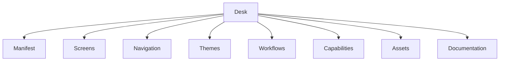
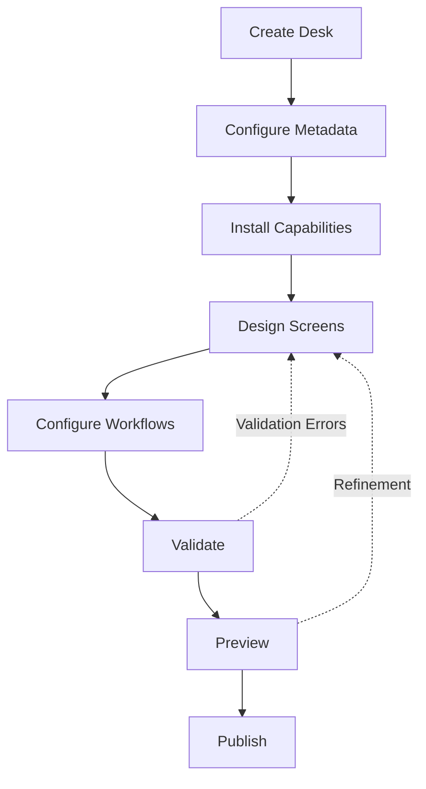
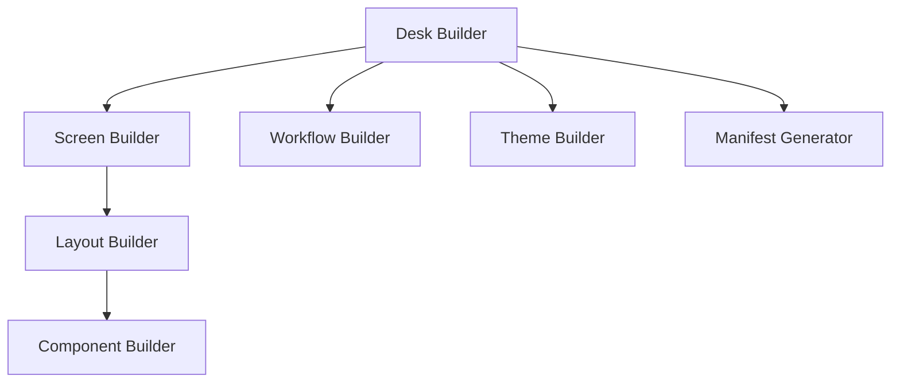
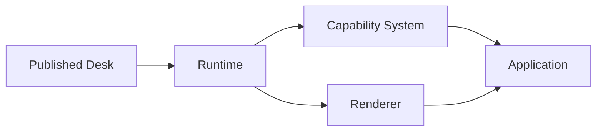
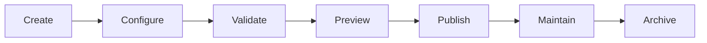

# Desk Builder

**KB-023 — Desk Builder Specification**

| Metadata | |
|----------|---|
| **KB ID** | KB-023 |
| **Title** | Desk Builder |
| **Version** | 0.1.0 |
| **Status** | Drafting |
| **Owner** | Architecture Team |
| **Dependencies** | KB-012 Component Registry, KB-014 Layout System, KB-016 Navigation Engine, KB-017 Theme Engine, KB-022 Builder Studio Architecture, Manifest Specification, Capability System |
| **Related Documents** | Builder Studio Architecture (KB-022), Manifest Specification, Capability System (KB-010), Component Registry (KB-012), Layout System (KB-014), Navigation Engine (KB-016), Theme Engine (KB-017), State Management (KB-018), Screen & Layout Builder (KB-024), Workflow Builder (KB-025), Form Builder (KB-026), Theme Builder (KB-027), Data Model Builder (KB-028), Preview Runtime (KB-029), Validation Engine (KB-030), Publishing Pipeline (KB-031) |
| **Review Status** | Pending |
| **Last Updated** | 2026-07-10 |

### Revision History

| Version | Date | Author | Change |
|---------|------|--------|--------|
| 0.1.0 | 2026-07-10 | AI Architecture Agent | Initial draft |

---

## 1. Purpose

The Desk Builder is the top-level Builder Studio subsystem responsible for creating, configuring, organizing, validating, versioning, and maintaining DUKADESK Desks. It serves as the primary entry point into Builder Studio and orchestrates all subordinate builders.

Every application built on DUKADESK begins as a Desk. The Desk is the root business workspace that encapsulates all assets, capabilities, screens, workflows, themes, navigation, integrations, permissions, localization resources, deployment settings, and metadata required to operate a complete business application. Without a Desk, no other Builder module has context to operate.

The Desk Builder exists because applications on DUKADESK are more than collections of screens. They are complete business solutions that span multiple capabilities, serve distinct user roles, integrate with external services, and evolve across versions. The Desk provides the organizational boundary that holds all of these concerns together. Builder modules — Screen Builder, Layout Builder, Workflow Builder, Theme Builder, Data Model Builder, Form Builder — all operate within the context of a Desk because every artifact they produce belongs to a specific Desk.

---

## 2. Desk Philosophy

### Business-First Organization

The Desk organizes around business domains, not technical layers. Screens, workflows, capabilities, and data models are grouped by business function rather than by artifact type. This mirrors how business stakeholders think about their applications.

### Manifest-Driven Configuration

Every Desk is defined by its Manifest. The Manifest is the authoritative source of truth for Desk identity, structure, capabilities, and configuration. The Manifest is the deployable unit — not a compiled binary, not a container image, not a database dump.

### Modular Composition

Desks are composed of modules. Each module (capabilities, screens, workflows, themes) is independently developed, tested, and versioned. New modules can be added or removed without affecting the rest of the Desk. Modules come from the Marketplace, from the organization's private registry, or from custom development.

### Capability-Based Architecture

A Desk's functionality is defined by its capabilities. A capability is a unit of business function — order management, inventory tracking, appointment scheduling, customer management. The Desk Builder installs, configures, and composes capabilities into a cohesive application. Capabilities encapsulate their own screens, workflows, data models, and configurations.

### Separation of Concerns

The Desk Builder defines what a Desk is and how it is organized. Individual sub-builders define how each aspect of the Desk is designed. The Desk Builder does not design screens, define workflows, or configure themes. It delegates to specialized builders and orchestrates their outputs.

### Reusability

Desk templates, capability configurations, theme presets, workflow patterns, and screen templates are designed for reuse across Desks. The Builder promotes reuse through templates, blueprints, shared organizational libraries, and the Marketplace.

### Version-Aware Evolution

Every Desk has a version. Every capability, component, theme, and configuration referenced by a Desk has version compatibility metadata. The Desk Builder tracks version relationships and prevents incompatible combinations. Desks evolve through explicit version bumps.

### Multi-Tenant Readiness

The Desk model natively supports multi-tenant deployments. A Desk can be associated with a specific tenant, shared across tenants, or offered as a multi-tenant SaaS application. Tenant-specific overrides are part of the Desk structure, not separate application instances.

### Extensibility

The Desk Builder is extensible through the Builder Plugin Manager. Custom Desk-level editors, validators, generators, templates, and integrations can be added without modifying the core Builder. The Marketplace provides Desk-level extensions including industry templates, compliance packs, and regional configurations.

### AI-Assisted Creation

AI agents can generate Desk structures, recommend capabilities, create starter screens, and populate documentation. AI assists with project setup, capability selection, and initial configuration but does not bypass validation or human review.

---

## 3. What is a Desk?

### Formal Definition

A Desk is the highest-level business application container within the DUKADESK Platform. It is a named, versioned, deployable artifact that encapsulates all assets, configurations, and metadata required to operate a complete business application on the Runtime.

A Desk:

- **Represents a complete business application or workspace.** A Desk may serve a restaurant (Mama's Kitchen), a pharmacy (Grace Pharmacy), a retail store, a clinic, a school, or any other organized business entity. Each Desk is a self-contained application that the Runtime can load and execute.

- **Contains one or more business capabilities.** A capability is a unit of business function — menu management, order processing, appointment booking, inventory tracking, customer management. Every Desk has at least one capability that defines its primary function. Most Desks have multiple capabilities that together form a complete business solution.

- **Owns application configuration.** The Desk defines navigation structure, theme, supported languages, security policies, integration endpoints, and deployment settings. These configurations apply to all screens and capabilities within the Desk unless explicitly overridden.

- **Produces a deployable platform artifact.** The Desk can be exported, published, versioned, and deployed. The published artifact is a Manifest that the Runtime interprets. Every deployment targets a specific Desk version.

- **Is consumed by the Runtime.** The Runtime loads a Desk's Manifest, resolves its capabilities, initializes its screens, applies its theme, configures its navigation, and presents it as a running application. The Runtime does not know about Builder concepts — it only consumes the published Manifest.

### What a Desk Is Not

| Misconception | Clarification |
|---------------|---------------|
| A single screen | A Desk contains many screens organized by capabilities and navigation. A screen is a single view within a Desk. |
| A database | A Desk may define data models and reference data sources, but it is not a database. Data is stored and managed by backend services, not by the Desk itself. |
| A capability | A capability is a unit of business function within a Desk. A Desk composes multiple capabilities into a complete application. |
| A workflow | A workflow is a sequence of steps within a capability or screen. A Desk contains many workflows but is not itself a workflow. |
| A runtime process | A Desk is a declarative artifact. The Runtime loads a Desk and produces a running application. The Desk is not a process, container, or service. |
| A deployment environment | The Desk describes what to deploy, not where to deploy it. Deployment environments (development, staging, production) are configured separately. |
| A theme | A theme defines visual appearance. A Desk owns a theme but also contains screens, capabilities, navigation, workflows, and data models — far more than visual styling. |

---

## 4. Desk Responsibilities

### Project Ownership

The Desk owns the project identity, metadata, and lifecycle. It answers the questions: what is this application, who owns it, what version is it, what is its current status.

### Capability Organization

The Desk manages which capabilities are installed, which are active, and how they relate to each other. Capability installation includes resolving dependencies, checking version compatibility, and configuring capability-specific settings.

### Screen Organization

The Desk contains all screens grouped by capability. The Desk defines which screens exist, what capabilities they belong to, and how they are accessed. Individual screen design is delegated to the Screen Builder.

### Navigation Organization

The Desk owns the navigation structure — routes, stacks, tabs, drawers, modals, and deep links. Navigation structure spans capabilities. The Navigation Engine consumes the Desk's navigation definition at runtime.

### Theme Ownership

The Desk selects and configures a theme. The theme applies to all screens within the Desk unless overridden at the capability or screen level. Theme design is delegated to the Theme Builder.

### Workflow Ownership

The Desk aggregates workflows from all installed capabilities. Cross-capability workflows are defined at the Desk level. Individual workflow design is delegated to the Workflow Builder.

### Asset Ownership

All assets (images, icons, fonts, documents, media files) used by the Desk are managed by the Desk. Assets can be shared across capabilities or scoped to specific capabilities.

### Localization

The Desk defines supported locales and owns locale-specific resources (translations, regional formats, localized assets). Capabilities contribute their own translations, which the Desk aggregates.

### Security Configuration

The Desk defines authentication requirements, role definitions, permission policies, and access control rules. Security configuration applies across all capabilities unless explicitly overridden.

### Integration Configuration

The Desk manages external service integrations — API endpoints, authentication credentials, webhook URLs, and service configurations. Integrations can be shared across capabilities or scoped to specific capabilities.

### Publishing Configuration

The Desk defines deployment targets, release channels, rollout strategies, and environment-specific overrides. The Publishing Pipeline consumes this configuration when deploying the Desk.

### Documentation Ownership

The Desk owns its documentation — user guides, administration manuals, capability descriptions, and release notes. Documentation can be auto-generated from project artifacts and manually supplemented.

### Responsibility Boundaries

| Responsibility | Owner | Notes |
|---------------|-------|-------|
| Desk identity and lifecycle | Desk Builder | Metadata, versioning, status |
| Screen design | Screen Builder | Desk Builder aggregates |
| Layout design | Layout Builder | Desk Builder aggregates |
| Workflow design | Workflow Builder | Desk Builder aggregates |
| Theme design | Theme Builder | Desk Builder selects |
| Data model design | Data Model Builder | Desk Builder aggregates |
| Form design | Form Builder | Desk Builder aggregates |
| Capability installation | Desk Builder | Delegates to Capability Manager |
| Navigation structure | Desk Builder | Aggregates from capabilities |
| Asset management | Desk Manager | Asset Manager within Desk Builder |
| Localization resources | Desk Builder | Localization Manager |
| Security policy | Desk Builder | Security Manager |
| Integration configuration | Desk Builder | Integration Manager |
| Validation | Validation Engine | Pre-publish gate |
| Preview | Preview Runtime | Desk Builder orchestrates |
| Publishing | Publishing Pipeline | Desk Builder prepares |
| Documentation | Desk Builder | Documentation Manager |

---

## 5. Desk Architecture

The Desk Builder is composed of logical modules, each responsible for a specific domain of Desk management.

### 5.1 Desk Manager

| Aspect | Description |
|--------|-------------|
| **Purpose** | Manage Desk lifecycle — creation, configuration, organization, and maintenance. |
| **Responsibilities** | Initialize new Desks from templates or blueprints, manage Desk metadata, organize project structure, handle Desk archival and deletion, manage Desk-level settings. |
| **Inputs** | Project CRUD commands, template selection, metadata updates. |
| **Outputs** | Desk project structure, metadata records, project state. |
| **Extension Points** | Custom Desk templates, project initialization hooks, metadata schema extensions. |

### 5.2 Configuration Manager

| Aspect | Description |
|--------|-------------|
| **Purpose** | Manage Desk-level configuration — deployment settings, platform targets, environment overrides, and global defaults. |
| **Responsibilities** | Define supported platforms, configure deployment targets, manage environment-specific overrides, set default locale and theme, manage capability defaults. |
| **Inputs** | Configuration editor changes, environment definitions, platform selections. |
| **Outputs** | Desk configuration manifest, environment profiles. |
| **Extension Points** | Custom configuration editors, environment providers, configuration validators. |

### 5.3 Capability Manager

| Aspect | Description |
|--------|-------------|
| **Purpose** | Manage capability lifecycle within the Desk — installation, configuration, dependency resolution, and version management. |
| **Responsibilities** | Browse and install capabilities from Marketplace or private registry, resolve capability dependencies, check version compatibility, configure capability options, manage capability activation state, remove capabilities. |
| **Inputs** | Capability selection, version constraints, configuration parameters. |
| **Outputs** | Installed capability set, capability dependency graph, capability configuration state. |
| **Extension Points** | Custom capability sources, capability configuration editors, dependency resolvers. |

### 5.4 Asset Manager

| Aspect | Description |
|--------|-------------|
| **Purpose** | Manage all files and media used by the Desk. |
| **Responsibilities** | Upload, organize, version, and reference assets (images, icons, fonts, documents, media). Manage asset metadata (size, format, dimensions, usage). Optimize assets for target platforms. Track asset usage across the Desk. |
| **Inputs** | File uploads, asset references, optimization requests. |
| **Outputs** | Organized asset library, optimized assets, asset usage reports. |
| **Extension Points** | Custom asset processors, cloud storage backends, asset transformation pipelines. |

### 5.5 Localization Manager

| Aspect | Description |
|--------|-------------|
| **Purpose** | Manage multilingual support for the Desk. |
| **Responsibilities** | Define supported locales, manage translation resources, aggregate capability translations, detect missing translations, manage locale-specific assets and configurations. |
| **Inputs** | Locale definitions, translation entries, import/export files. |
| **Outputs** | Localized resource bundles, translation coverage reports. |
| **Extension Points** | Translation service integrations, custom locale providers, automated translation connectors. |

### 5.6 Integration Manager

| Aspect | Description |
|--------|-------------|
| **Purpose** | Manage external service connections and API integrations for the Desk. |
| **Responsibilities** | Define integration endpoints, manage connection credentials, configure authentication, map data contracts, manage webhook registrations, monitor integration health. |
| **Inputs** | Integration definitions, credential entries, endpoint configurations. |
| **Outputs** | Integration configuration, credential references, webhook registrations. |
| **Extension Points** | Custom integration types, credential vault backends, integration testing tools. |

### 5.7 Security Manager

| Aspect | Description |
|--------|-------------|
| **Purpose** | Manage identity, authentication, authorization, and security policy for the Desk. |
| **Responsibilities** | Define authentication requirements, configure identity providers, define roles and permissions, set access control policies, manage secret references, configure audit logging. |
| **Inputs** | Security policy definitions, role configurations, identity provider settings. |
| **Outputs** | Security configuration manifest, role/permission definitions, audit configuration. |
| **Extension Points** | Custom identity providers, permission evaluators, security policy validators. |

### 5.8 Documentation Manager

| Aspect | Description |
|--------|-------------|
| **Purpose** | Generate, organize, and maintain Desk documentation. |
| **Responsibilities** | Auto-generate documentation from project artifacts, organize documentation by audience (end-user, admin, developer), manage manual documentation entries, track documentation completeness, export documentation packages. |
| **Inputs** | Project artifacts, documentation entries, generation requests. |
| **Outputs** | Documentation artifacts, coverage reports, export packages. |
| **Extension Points** | Custom documentation generators, documentation format exporters, external documentation platform connectors. |

### 5.9 Version Manager

| Aspect | Description |
|--------|-------------|
| **Purpose** | Manage Desk versioning, change tracking, and release history. |
| **Responsibilities** | Track Desk version history, manage version numbering, record change logs, support branching concepts, enable version comparison and rollback, manage release labels and channels. |
| **Inputs** | Version increment commands, change descriptions, release channel assignments. |
| **Outputs** | Version history records, change logs, version diffs. |
| **Extension Points** | Custom versioning schemes, changelog generators, release automation hooks. |

### 5.10 Diagnostics Manager

| Aspect | Description |
|--------|-------------|
| **Purpose** | Provide health, dependency, and quality analysis for the Desk. |
| **Responsibilities** | Analyze Desk structure for issues, validate dependency integrity, produce quality metrics, detect dead references and unused resources, generate diagnostic reports, suggest optimizations. |
| **Inputs** | Project state, diagnostic trigger events. |
| **Outputs** | Diagnostic reports, quality scores, optimization suggestions. |
| **Extension Points** | Custom diagnostic rules, metric collectors, report renderers. |

---

## 6. Desk Structure

The canonical Desk structure organizes all elements of a business application into a coherent, navigable, and maintainable structure. The structure is conceptual and implementation-independent.

| Element | Purpose |
|---------|---------|
| **Metadata** | Desk identity, versioning, ownership, categorization, and lifecycle state. |
| **Manifest** | The authoritative, schema-compliant definition of the entire Desk — the deployable artifact. |
| **Screens** | All screens that comprise the application user interface, organized by capability and navigation. |
| **Navigation** | Route definitions, navigation graph, stacks, tabs, drawers, modals, deep links, and navigation guards. |
| **Layouts** | Reusable layout templates that define screen structure — headers, sidebars, content areas, footers. |
| **Components** | Component instances and configurations used across screens — buttons, lists, forms, cards, charts. |
| **Workflows** | Business process definitions — sequences of steps, transitions, decision points, and data mappings. |
| **Themes** | Visual design tokens — colors, typography, spacing, shapes, elevations, icons, branding. |
| **Data Models** | Entity definitions, field schemas, validation rules, relationships, and data source bindings. |
| **Forms** | Form definitions with fields, layouts, validation, conditional logic, and submission configuration. |
| **Integrations** | External service connections — API endpoints, authentication, data contracts, webhooks. |
| **Capabilities** | Installed and configured business capabilities, each contributing screens, workflows, data models, and configurations. |
| **Assets** | Files and media — images, icons, fonts, documents, videos, and other static resources. |
| **Localization** | Locale definitions and translation resources for supported languages. |
| **Security** | Authentication configuration, role definitions, permission policies, and access control rules. |
| **Deployment Configuration** | Target environments, release channels, environment-specific overrides, and rollout settings. |
| **Documentation** | User guides, administration manuals, capability descriptions, and release notes. |

---

## 7. Desk Metadata

| Field | Type | Description |
|-------|------|-------------|
| Desk ID | String | Globally unique identifier for the Desk. Generated on creation, immutable. |
| Name | String | Machine-readable name used in APIs and manifests. Lowercase, hyphenated. |
| Display Name | String | Human-readable name shown in Builder UI, Marketplace listings, and Runtime. |
| Description | String | Brief description of the Desk's purpose and functionality. |
| Version | String | Semantic version of the Desk. Follows SemVer. |
| Owner | String | Team or individual responsible for the Desk. |
| Organization | String | Organization that owns the Desk. |
| Tenant | String | Associated tenant for multi-tenant configurations. |
| Category | String | Business category (e.g., restaurant, retail, healthcare, education). |
| Industry | String | Industry classification (e.g., food-service, pharmacy, general-retail). |
| Tags | String[] | Free-form tags for search and categorization. |
| Supported Platforms | String[] | Target platforms (mobile, web, desktop, kiosk, TV). |
| Supported Languages | String[] | Locale codes for supported languages. |
| Status | String | Lifecycle state (draft, active, deprecated, archived). |
| Created Date | DateTime | Timestamp of Desk creation. |
| Modified Date | DateTime | Timestamp of last modification. |
| Compatibility | Map | Runtime version compatibility, minimum platform versions, required engine versions. |

---

## 8. Capability Management

### Core Capabilities

Capabilities that are required for the Desk to function. The Desk cannot operate without its core capabilities. For example, a restaurant Desk requires a menu management capability as core.

### Optional Capabilities

Capabilities that enhance the Desk but are not required for operation. Users can choose to install optional capabilities based on their business needs. For example, a restaurant Desk may optionally install an online ordering capability.

### Marketplace Capabilities

Capabilities published to the Marketplace by DUKADESK or third-party developers. Marketplace capabilities are discoverable, rated, and versioned. They can be free, paid, or subscription-based.

### Custom Capabilities

Capabilities developed specifically for a Desk or organization. Custom capabilities follow the same structure and lifecycle as Marketplace capabilities but are scoped to the owning organization.

### Capability Dependencies

Capabilities may depend on other capabilities. The Capability Manager resolves dependency graphs, detects circular dependencies, and ensures all dependencies are installed and version-compatible before a capability is activated.

### Capability Version Compatibility

Each capability declares its compatible Desk API version, required Runtime version, and dependency version constraints. The Capability Manager validates compatibility during installation and on every Desk version bump.

### Capability Lifecycle

| Phase | Description |
|-------|-------------|
| Discovered | Capability is found in Marketplace or registry but not yet installed. |
| Installed | Capability is added to the Desk but not yet configured. |
| Configured | Capability settings are populated but not yet active. |
| Active | Capability is fully operational and contributes screens, workflows, and services. |
| Suspended | Capability is temporarily disabled without removing its configuration. |
| Removed | Capability and its contributions are permanently removed from the Desk. |

---

## 9. Project Organization

### Folder Organization (Conceptual)

The Desk project is organized logically, not as a physical filesystem structure. The conceptual organization groups artifacts by capability first, then by type:

- Desks
  - Capabilities
    - Screens
    - Workflows
    - Data Models
    - Forms
  - Shared
    - Layouts
    - Components
    - Themes
    - Assets
  - Configuration
    - Navigation
    - Security
    - Integrations
    - Localization
    - Deployment

### Logical Organization

Within the Builder UI, artifacts can be filtered, grouped, and searched across multiple axes — by capability, by type, by status, by assignee, by last modified. The organization is fluid, not fixed.

### Asset Organization

Assets are organized by type and usage context. Shared assets (logo, brand icons) are at the Desk level. Capability-specific assets (menu item images, product photos) are scoped to their capability.

### Dependency Management

Dependencies are managed at three levels: Desk-level dependencies (Runtime version, platform SDK), capability dependencies (other capabilities, shared libraries), and artifact dependencies (component references, data model imports).

### Shared Resources

Resources shared across capabilities — layouts, component templates, theme tokens, data source connections, integration configurations — are defined at the Desk level and inherited by capabilities unless overridden.

### Modular Organization

Capabilities are the primary modular unit. Each capability encapsulates its screens, workflows, data models, forms, assets, and configurations. Capabilities can be independently developed, tested, versioned, and deployed within the context of a Desk.

---

## 10. Builder Integration

The Desk Builder orchestrates rather than replaces specialized builders. Each sub-builder operates within the Desk context provided by the Desk Builder.

### Screen Builder (KB-024)

The Desk Builder provides the context — which capability the screen belongs to, what navigation it participates in, what theme applies. The Screen Builder designs the screen's visual layout and component configuration.

### Layout Builder (KB-024)

The Desk Builder defines available layout templates. The Layout Builder creates and edits reusable layout definitions that screens reference. Layouts are shared resources managed at the Desk or capability level.

### Component Builder

The Desk Builder maintains the component library available to the Desk. The Component Builder configures individual component instances within screens. Component definitions come from the Component Registry and installed capabilities.

### Workflow Builder (KB-025)

The Desk Builder aggregates workflows from all capabilities and manages cross-capability workflow orchestration. The Workflow Builder designs individual workflow definitions.

### Theme Builder (KB-027)

The Desk Builder selects the active theme and manages theme overrides. The Theme Builder designs the visual tokens — colors, typography, spacing, shapes, and icons — that define the Desk's appearance.

### Data Model Builder (KB-028)

The Desk Builder manages data models contributed by capabilities and shared data models. The Data Model Builder defines entity schemas, field types, validation rules, and relationships.

### Form Builder (KB-026)

The Desk Builder organizes forms by capability and use case. The Form Builder designs form layouts, fields, validation, and submission behavior.

### Validation Engine (KB-030)

Validation runs at the Desk level to detect cross-artifact issues — broken references between screens, missing capability dependencies, navigation gaps, and configuration conflicts. The Validation Engine validates individual artifacts and the Desk as a whole.

### Preview Runtime (KB-029)

The Desk Builder orchestrates preview sessions. The Preview Runtime loads the Desk's Manifest in a simulated environment, allowing users to interact with screens, test workflows, and verify behavior before publishing.

### Publishing Pipeline (KB-031)

The Desk Builder prepares the publishing artifact — validates, packages, versions, and documents the Desk. The Publishing Pipeline handles the actual deployment to target environments.

---

## 11. Runtime Integration

A published Desk is consumed by the Runtime as a Manifest. The Runtime does not know about Builder concepts — it only reads the published Manifest and executes it.

### Runtime

The Runtime loads the Desk Manifest, validates it against the current Runtime version, and bootstraps the application. The Runtime provides the execution environment for all Desk capabilities and screens.

### Renderer

The Renderer reads the Desk's screen definitions, layout templates, and component configurations from the Manifest and produces the visual user interface. The Renderer applies the Desk's theme, adapts to the target platform, and renders each screen according to its layout and component tree.

### Action Engine

The Action Engine executes the Desk's action definitions. Actions are triggered by user interactions (button taps, form submissions, navigation events) and system events. The Action Engine dispatches actions to registered handlers, which may include navigation, data mutations, API calls, or capability-specific logic.

### Navigation Engine

The Navigation Engine interprets the Desk's navigation graph — routes, stacks, tabs, drawers, modals, and deep links. It evaluates navigation guards, manages navigation state, and coordinates screen transitions. The Navigation Engine is configured entirely by the Desk Manifest.

### Theme Engine

The Theme Engine applies the Desk's theme tokens to all rendered screens. It resolves theme references, computes derived values, and provides runtime theming APIs. The Theme Engine supports the Desk's theme inheritance model — Desk-level, capability-level, and screen-level overrides.

### State Management

The Runtime's state management system provides the state stores, contexts, and data flow infrastructure that the Desk's screens and capabilities use at runtime. The Desk defines initial state, data model schemas, and state persistence rules in its Manifest.

### Capability System

The Capability System activates and manages the Desk's installed capabilities at runtime. It resolves capability dependencies, initializes capability services, provides capability-scoped state and configuration, and manages capability lifecycle events within the running application.

---

## 12. AI Integration

### Generate Desk Structure

The AI Assistant can generate a complete Desk structure from a business description. Generated structures include metadata, capability selection, initial screen list, navigation blueprint, theme suggestion, and starter documentation. The user reviews the generated structure and refines it through the Desk Builder.

### Recommend Capabilities

Based on the Desk's category, industry, and business description, the AI Assistant can recommend capabilities to install. Recommendations include core capabilities, optional enhancements, and Marketplace suggestions with rationale for each.

### Generate Starter Screens

The AI Assistant can generate starter screens for each installed capability. Generated screens include layouts, component configurations, placeholder content, and data bindings appropriate to the capability's business function.

### Recommend Workflows

Based on the Desk's capabilities and business domain, the AI Assistant can recommend workflow definitions. Recommendations cover common business processes, integration workflows, and administrative workflows.

### Suggest Navigation

The AI Assistant can suggest navigation structures based on the Desk's capabilities and screen inventory. Suggestions include tab configurations, stack organizations, drawer hierarchies, and deep link mappings.

### Create Documentation

The AI Assistant can generate Desk documentation from project artifacts — capability descriptions, screen walkthroughs, workflow documentation, data model references, and user guides. Generated documentation is organized by audience and exportable to multiple formats.

### Analyze Project Quality

The AI Assistant can analyze the Desk for quality issues — missing configurations, incomplete documentation, unused assets, navigation dead ends, and configuration conflicts. The analysis produces a quality score and prioritized improvement suggestions.

### Identify Missing Configuration

The AI Assistant can scan the Desk and identify configuration gaps — locales without translations, capabilities without screens, screens without navigation entries, workflows without triggers, and integrations without credentials.

### AI Integration Principles

- AI generates artifacts and suggestions; it does not bypass validation.
- AI output is always editable by the user through the appropriate Builder module.
- AI operations are logged for audit trail and continuous improvement.
- AI suggestions are optional — the user makes all final decisions.
- AI must cite sources when recommending Marketplace capabilities or platform features.
- AI-generated artifacts must pass Validation Engine checks before publication.

---

## 13. Collaboration

### Team Ownership

Every Desk is owned by a team. Teams have defined roles:

- **Owner**: Full Desk control including deletion, transfer, and membership management.
- **Editor**: Can modify all Desk artifacts and configurations.
- **Reviewer**: Can view, comment, and approve changes but cannot edit.
- **Viewer**: Read-only access for stakeholders and auditors.

### Reviews

Formal review workflows for Desk-level changes:

- Request review from specific team members or roles.
- Reviewers examine changes and approve or request changes.
- Review comments are linked to specific artifacts and changes.
- Review status is tracked per artifact and per version.
- Publishing may require a minimum number of approvals.

### Change Tracking

The Version Manager tracks changes at the artifact level:

- Added, modified, and deleted artifacts.
- Unpublished changes vs. published versions.
- Changes grouped by session, user, capability, or time period.
- Diff views for all artifact types.

### Version History

Every change to the Desk is recorded in version history:

- Who made the change.
- When the change was made.
- What was changed (artifact-level diff).
- Change description or commit message.
- Version number or timestamp.

### Branching Concepts

Desks support branching for parallel development:

- Main branch represents the last published state.
- Feature branches for in-progress work.
- Branch comparison and merge workflows.
- Branch-based preview environments for isolated testing.

### Approval Workflows

Publishing may require approval based on Desk policy:

- Define approval gates (number of reviewers, specific roles, automated checks).
- Approval request and notification.
- Approval history per published version.
- Automatic rollback on rejection.

---

## 14. Security

### Project Permissions

Access to the Desk is governed by team membership and roles. All operations — viewing, editing, reviewing, publishing, deleting — are subject to permission checks. Permissions are enforced by the Security Manager at the Desk level.

### Tenant Isolation

In multi-tenant deployments, each tenant accesses only their Desk configuration and data. The Security Manager ensures tenant isolation at the project level. Capabilities and configurations from one tenant are never visible to another.

### Secret Management

Integration credentials, API keys, and authentication secrets are never stored in the Desk Manifest or project files in plain text. The Security Manager stores secrets in a secure vault and provides tokenized references to the Manifest. Secrets are resolved at deployment time by the target environment.

### Integration Credentials

Integration configurations reference credentials through the secret management system. Credentials are scoped to specific integrations and environments. Test credentials are used in development and staging; production credentials are only available in production deployments.

### Publishing Authorization

Publishing a Desk requires explicit authorization. Publishing permissions are separate from editing permissions. Organizations can require multi-factor authentication for production publications.

### Audit Logging

All Desk operations are logged:

- Who performed the operation.
- What was changed.
- When the change occurred.
- From which context (Builder UI, API, AI Assistant).
- Audit logs are immutable and retained according to organization policy.

---

## 15. Performance

### Incremental Loading

The Desk Builder loads Desk structure and metadata first, then loads artifact details on demand. Large Desks with many screens, capabilities, and assets remain responsive because content is fetched incrementally.

### Asset Indexing

Assets are indexed on upload for search, usage tracking, and duplicate detection. Asset metadata is cached for fast browsing. Asset files are loaded on demand and optimized for preview environments.

### Large Project Handling

Desks with hundreds of screens, dozens of capabilities, and thousands of assets are supported through virtualized lists, paginated queries, and background processing. Full project scans and bulk operations run asynchronously.

### Background Validation

Validation runs in the background as the user edits. Validation results appear incrementally. Full validation is deferred during rapid editing sequences and coalesced into a single validation pass when the user pauses.

### Incremental Saves

Changes are saved incrementally at the artifact level. Saving a single screen does not require serializing the entire Desk. Incremental saves are fast and create minimal conflict windows for collaborative editing.

### Efficient Project Navigation

The project tree and artifact browser use lazy loading, caching, and search indexing to remain fast regardless of Desk size. Artifacts are grouped by capability with count badges for quick orientation.

---

## 16. Observability

### Project Diagnostics

The Diagnostics Manager provides a health overview of the Desk:

- Total artifacts by type and capability.
- Configuration completeness status.
- Dependency integrity status.
- Validation error and warning counts.
- Version history summary.

### Dependency Analysis

The Diagnostics Manager analyzes the Desk's dependency graph:

- All installed capabilities and their versions.
- Dependency resolution status.
- Version compatibility verification.
- Circular dependency detection.
- Orphaned dependency detection.

### Validation Summaries

The Diagnostics Manager aggregates validation results:

- Errors and warnings by severity and category.
- Artifacts with the most issues.
- Issues grouped by capability.
- Fix rate and recurring issue tracking.

### Asset Reports

Asset usage reports:

- Asset count and total size by type.
- Unused assets (not referenced by any artifact).
- Duplicate asset detection.
- Asset optimization opportunities.

### Capability Reports

Capability contribution reports:

- Screens, workflows, data models, and forms contributed by each capability.
- Capability configuration completion status.
- Capability version and dependency status.
- Capability test coverage in Preview.

### Performance Metrics

Desk performance indicators:

- Project load time.
- Manifest generation time.
- Validation execution time.
- Preview startup time.
- Asset optimization time.

---

## 17. Anti-Patterns

### Multiple Unrelated Businesses in One Desk

Combining unrelated business domains in a single Desk creates configuration conflicts, navigation complexity, and deployment coupling. Each business domain should be its own Desk. If integration between domains is needed, use cross-Desk integration patterns.

### Business Logic Inside Metadata

Metadata fields are descriptive, not executable. Storing business logic in metadata makes it invisible to validation, untestable, and fragile across version upgrades. Business logic belongs in workflow definitions, action handlers, or custom capability code.

### Duplicate Capability Definitions

Installing the same capability twice with different configurations creates confusion, duplicates screens and workflows, and wastes resources. A capability should be installed once and configured for all its use cases.

### Manual Manifest Editing

The Manifest is generated by the Builder from validated artifact definitions. Manually editing the Manifest bypasses validation, creates inconsistency between the Builder state and the published artifact, and prevents clean regeneration. Always use the Builder to modify Desk configuration.

### Hardcoded Platform Configuration

Hardcoding platform-specific settings (screen sizes, OS versions, device capabilities) into Desk configuration reduces portability. Platform-specific concerns belong in the Runtime, not the Desk. The Desk should declare intent; the Runtime adapts.

### Ignoring Validation

Publishing a Desk with unresolved validation errors produces unreliable applications. Validation errors indicate real issues — missing configurations, broken references, incompatible versions — that will manifest as Runtime failures. Treat validation as a publishing gate.

### Tight Coupling Between Builders

Designing screens that depend on specific workflow implementations, or workflows that depend on specific screen layouts, creates coupling that prevents independent evolution. Builders should communicate through well-defined interfaces — the Manifest, capability APIs, and event contracts.

---

## 18. Future Evolution

### AI-Generated Desks

AI agents will generate complete Desks from business requirements documents, existing website analysis, or conversational discovery. The Desk Builder will support progressive refinement of AI-generated Desks through natural language interaction.

### Industry Templates

Pre-configured Desk templates for common industries — restaurants, retail stores, clinics, salons, schools, warehouses. Templates include industry-specific capabilities, screen sets, workflows, themes, and data models with sensible defaults.

### Enterprise Blueprints

Multi-Desk enterprise blueprints that define standard capability sets, shared configurations, brand themes, compliance policies, and integration patterns across an entire organization. Blueprints serve as the starting point for all Desks within an enterprise.

### Multi-Desk Solutions

Support for solutions that span multiple Desks — a franchise management Desk that configures and monitors individual franchise Desks, a corporate Desk that aggregates data from all location Desks, and a supplier Desk that integrates with multiple partner Desks.

### Shared Organizational Assets

Organizational libraries for shared components, layouts, themes, workflow patterns, data models, and configurations. Changes to shared assets propagate to all Desks that reference them, with versioning and impact analysis.

### Cloud-Hosted Collaborative Projects

Real-time collaborative editing with cursor presence, conflict resolution, and offline support. Cloud-hosted projects enable teams to work simultaneously on the same Desk from anywhere.

### Headless Builder APIs

All Desk Builder operations exposed through a public API for automation, CI/CD integration, and custom tooling. Headless APIs enable programmatic Desk creation, configuration, validation, and publishing.

---

## 19. Relationship to Other Documents

| Document | Relationship |
|----------|-------------|
| **Builder Studio Architecture (KB-022)** | Defines the overall Builder platform. The Desk Builder is the top-level subsystem within Builder Studio. |
| **Manifest Specification (KB-009)** | Defines the Manifest format that the Desk Builder produces. All Desk configurations are serialized into a Manifest. |
| **Capability System (KB-010)** | Defines the capability model that the Desk Builder manages. Capabilities are installed, configured, and composed by the Desk Builder. |
| **Component Registry (KB-012)** | Provides the component library that screens within the Desk reference. The Desk Builder manages which component versions are available. |
| **Theme Engine (KB-017)** | Defines the theming system. The Desk Builder selects and configures themes for the Desk. |
| **Screen & Layout Builder (KB-024)** | Designs individual screens owned by the Desk. The Desk Builder provides context and aggregates outputs. |
| **Workflow Builder (KB-025)** | Designs workflows within the Desk's capabilities. The Desk Builder manages cross-capability workflows. |
| **Form Builder (KB-026)** | Designs forms for data entry. The Desk Builder organizes forms by capability and use case. |
| **Theme Builder (KB-027)** | Designs theme tokens. The Desk Builder selects and applies themes. |
| **Data Model Builder (KB-028)** | Designs data models. The Desk Builder manages shared models and capability contributions. |
| **Preview Runtime (KB-029)** | Provides interactive preview. The Desk Builder orchestrates preview sessions. |
| **Validation Engine (KB-030)** | Validates all artifacts. The Desk Builder triggers validation and surfaces results. |
| **Publishing Pipeline (KB-031)** | Handles deployment. The Desk Builder prepares and submits artifacts for publishing. |

---

## Required Mermaid Diagrams

### Desk Architecture

### Desk Builder Workflow

### Builder Relationships

### Runtime Relationship

### Desk Lifecycle

---

*This is KB-023, the Desk Builder specification of the DUKADESK Engineering Knowledge Base. It defines the Desk Builder as the root Builder subsystem, establishes the Desk as the highest-level business application container, and describes how all Builder modules orchestrate around the Desk to produce complete, deployable business applications.*
