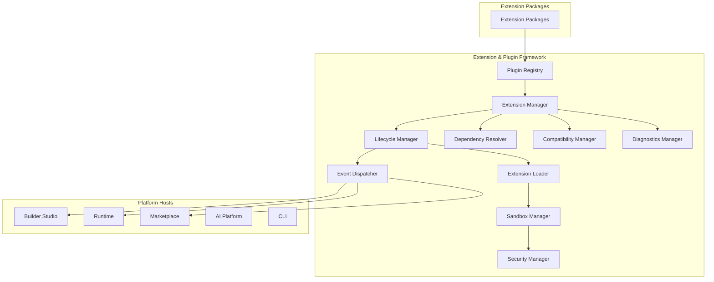
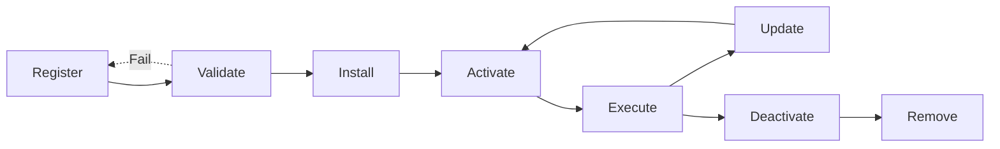

# Extension & Plugin Framework

**KB-034 — Extension & Plugin Framework Specification**

| Metadata | |
|----------|---|
| **KB ID** | KB-034 |
| **Title** | Extension & Plugin Framework |
| **Version** | 0.1.0 |
| **Status** | Drafting |
| **Owner** | Architecture Team |
| **Dependencies** | KB-032 Marketplace Architecture, KB-033 Package & Artifact Specification, KB-022 Builder Studio Architecture, KB-008 Runtime Overview, KB-019 Event Bus |
| **Related Documents** | Marketplace Architecture (KB-032), Package & Artifact Specification (KB-033), Builder Studio Architecture (KB-022), Runtime Overview (KB-008), Event Bus (KB-019), Validation Engine (KB-030), Publishing Pipeline (KB-031), Service Registry, Capability System (KB-010), Component Registry (KB-012) |
| **Review Status** | Pending |
| **Last Updated** | 2026-07-10 |

### Revision History

| Version | Date | Author | Change |
|---------|------|--------|--------|
| 0.1.0 | 2026-07-10 | AI Architecture Agent | Initial draft |

---

## 1. Purpose

The Extension & Plugin Framework is the platform subsystem responsible for defining, registering, loading, executing, securing, and governing all third-party and first-party extensions and plugins. It establishes the architecture, contracts, lifecycle, security model, discovery mechanisms, versioning, and governance for every extension that integrates with DUKADESK.

An Extension Framework exists because no platform can anticipate every feature its users will need. Rather than forcing users to build outside the platform or — worse — modify the platform's internal code, the framework provides stable, versioned extension points that third parties can integrate against. This keeps the platform core clean, upgradable, and secure while enabling unbounded ecosystem growth.

Extensions should never modify platform internals because direct modification creates a support nightmare. When extensions patch, override, or replace internal platform code, every platform update risks breaking those extensions. The platform cannot guarantee backward compatibility for internal implementation details — only for published extension contracts. Modifying internals also bypasses security controls, isolation guarantees, and resource governance that the framework provides.

Extension contracts remain stable because ecosystem investment depends on predictability. A third-party developer who builds an extension against version 1.0 of an extension point needs that contract to remain compatible across platform updates. Breaking extension contracts erodes trust, increases maintenance burden, and discourages ecosystem participation. The framework commits to semantic versioning for all extension points.

Plugins enable ecosystem growth by allowing the platform to serve vertical markets, regional requirements, and organization-specific needs without bloating the core platform. A restaurant business, a healthcare provider, and a retail chain all use the same platform core — their differentiated value comes from the extensions they install, not from customizing the platform itself.

Extensions remain isolated from core platform evolution because the framework decouples their lifecycle from the platform's lifecycle. An extension built for Runtime version 2.0 continues working on Runtime version 2.5 without modification — the framework's compatibility layer handles the mapping. This decoupling means the platform can evolve rapidly without breaking the ecosystem, and the ecosystem can innovate without waiting for platform releases.

---

## 2. Extension Philosophy

### Contract-First Architecture

All extension integration is defined through explicit, versioned, published contracts. Contracts are the only way extensions interact with the platform. There is no implicit access to platform internals, no private API usage, and no undocumented behavior to depend on. Contracts are owned by the platform and versioned independently.

### Loose Coupling

Extensions are loosely coupled from the platform and from each other. They communicate through events, service interfaces, and data contracts — never through direct references to platform implementation classes, internal state, or private APIs. Loose coupling enables independent development, testing, and deployment of extensions and platform updates.

### Isolation

Each extension executes in an isolated context. Isolation prevents extensions from interfering with each other, with the platform core, or with the host process. Isolation mechanisms include sandboxed execution, resource limits, separate lifecycle management, and failure containment. An extension crash never takes down the platform.

### Secure Execution

Extensions execute under a permission model that grants only the capabilities they explicitly declare and the consumer explicitly approves. Permissions are declared in the extension manifest and enforced by the Security Manager. Extensions cannot access platform resources, user data, or system features beyond their granted permissions.

### Version Compatibility

Extension points are semantically versioned. The platform guarantees backward compatibility within the same major version. Extensions declare their required extension point versions. The Compatibility Manager validates compatibility during installation and activation. Incompatible extensions are blocked with clear messages.

### Marketplace-First Distribution

All extensions are distributed through the Marketplace. Marketplace distribution ensures that extensions are signed, certified, versioned, and dependency-verified. Side-loading extensions outside the Marketplace is possible for development but is governed by strict security policies.

### Declarative Registration

Extensions declare themselves through a manifest — what they are, what extension points they implement, what permissions they require, what dependencies they have, and what platform versions they support. The platform discovers and registers extensions through their manifests, never through code scanning or runtime detection.

### Discoverability

Extensions are discoverable through the Marketplace, through the Extension Manager in Builder Studio, and through platform APIs. Discovery metadata — name, description, category, tags, extension points, publisher, certification status — is indexed and searchable.

### AI Extensibility

The extension framework itself is extensible by AI. AI agents can generate extension scaffolds, recommend extension points, analyze contract compliance, and generate extension documentation. AI extensions are first-class citizens in the extension model.

### Enterprise Governance

Organizations control which extensions their users can install. Governance policies cover extension approval workflows, allowed publishers, required certification levels, and mandatory security reviews. Enterprise governance ensures that extension adoption does not bypass organizational policy.

---

## 3. Extension Responsibilities

### Platform Extension

Add new functionality to the platform core — new services, new event types, new data sources, new platform capabilities. Platform extensions extend what the platform can do without modifying how the platform does it.

### Builder Extension

Extend Builder Studio with new editors, panels, tools, property editors, visual designers, wizards, validators, generators, and integrations. Builder extensions enhance the authoring experience for specific domains or workflows.

### Runtime Extension

Extend the Runtime with new services, action providers, event handlers, background services, and device feature integrations. Runtime extensions add runtime capabilities that screens, workflows, and capabilities can consume.

### Marketplace Extension

Extend the Marketplace with new package validators, certification rules, discovery providers, and distribution channels. Marketplace extensions customize the distribution experience for specific package types or organizational needs.

### AI Extension

Extend the AI platform with new agents, prompt libraries, validators, automation patterns, and knowledge providers. AI extensions add domain-specific AI capabilities that the AI Assistant can invoke.

### CLI Extension

Extend the CLI with new commands, subcommands, output formatters, and integrations. CLI extensions enable developers to automate platform operations from the command line.

### SDK Extension

Extend the platform SDKs with new APIs, client libraries, utility functions, and platform service wrappers. SDK extensions make platform capabilities available in specific programming languages and frameworks.

### Service Extension

Extend platform services with new integrations, connectors, middleware, and data transformations. Service extensions sit between the platform and external systems, adapting platform contracts to external interfaces.

### Diagnostics Extension

Extend platform diagnostics with custom monitoring, metrics collection, health checks, and reporting. Diagnostics extensions enable organizations to observe platform behavior through their existing observability infrastructure.

---

## 4. Extension Framework Architecture

### 4.1 Extension Manager

| Aspect | Description |
|--------|-------------|
| **Purpose** | Central management of all extensions — registration, discovery, lifecycle, configuration, and governance. |
| **Responsibilities** | Register extensions from manifests, manage extension lifecycle states, coordinate extension discovery queries, maintain extension configuration, enforce governance policies. |
| **Inputs** | Extension manifests, lifecycle commands, configuration updates, governance policies. |
| **Outputs** | Extension registry state, lifecycle events, discovery responses. |
| **Extension Points** | Custom lifecycle handlers, governance providers, configuration schemas. |

### 4.2 Plugin Registry

| Aspect | Description |
|--------|-------------|
| **Purpose** | Persistent registry of all installed extensions and their current state. |
| **Responsibilities** | Store extension metadata, track lifecycle state, record version history, maintain dependency graph, support registry queries. |
| **Inputs** | Extension registration data, lifecycle state transitions. |
| **Outputs** | Extension metadata queries, dependency resolution data. |
| **Extension Points** | Custom registry backends, extension metadata indexing strategies. |

### 4.3 Extension Loader

| Aspect | Description |
|--------|-------------|
| **Purpose** | Load, resolve, and prepare extensions for execution. |
| **Responsibilities** | Resolve extension assets from storage, verify integrity and signatures, load extension definitions, prepare execution context, manage extension classpath or equivalent. |
| **Inputs** | Extension package reference, loading configuration. |
| **Outputs** | Loaded extension instance, prepared execution context. |
| **Extension Points** | Custom load strategies, asset resolvers, context initializers. |

### 4.4 Lifecycle Manager

| Aspect | Description |
|--------|-------------|
| **Purpose** | Manage the state machine of each extension through its lifecycle. |
| **Responsibilities** | Transition extensions through lifecycle states, validate state transitions, publish lifecycle events, handle lifecycle failures, coordinate dependent extensions during transitions. |
| **Inputs** | Lifecycle transition commands, compatibility validation results. |
| **Outputs** | Lifecycle state updates, lifecycle events, transition results. |
| **Extension Points** | Custom lifecycle state machines, pre/post transition hooks. |

### 4.5 Dependency Resolver

| Aspect | Description |
|--------|-------------|
| **Purpose** | Resolve extension dependencies, verify compatibility, and detect conflicts. |
| **Responsibilities** | Parse extension dependency declarations, resolve dependency graph, verify version compatibility, detect circular dependencies, report resolution conflicts. |
| **Inputs** | Extension dependency declarations, registry of installed extensions. |
| **Outputs** | Resolved dependency graph, compatibility verification results. |
| **Extension Points** | Custom resolution strategies, dependency source providers. |

### 4.6 Compatibility Manager

| Aspect | Description |
|--------|-------------|
| **Purpose** | Validate extension compatibility with platform versions, extension point versions, and other extensions. |
| **Responsibilities** | Maintain platform version registry, validate extension version declarations, check extension point version compatibility, detect breaking changes in extension contracts. |
| **Inputs** | Extension compatibility metadata, platform version information, extension point version records. |
| **Outputs** | Compatibility verification results, version conflict reports. |
| **Extension Points** | Custom compatibility rules, version comparison strategies. |

### 4.7 Security Manager

| Aspect | Description |
|--------|-------------|
| **Purpose** | Enforce the extension permission model — grant verification, sandbox enforcement, resource access control. |
| **Responsibilities** | Parse extension permission declarations, verify permissions against consumer approval, enforce sandbox boundaries, control resource access, audit security-relevant operations. |
| **Inputs** | Extension permission declarations, consumer approval records, security policies. |
| **Outputs** | Permission grants, access control decisions, security audit events. |
| **Extension Points** | Custom permission types, sandbox providers, security policy providers. |

### 4.8 Sandbox Manager

| Aspect | Description |
|--------|-------------|
| **Purpose** | Provide isolated execution environments for extensions. |
| **Responsibilities** | Create extension execution contexts, enforce resource limits, isolate failures, manage extension process or thread boundaries, clean up execution contexts on deactivation. |
| **Inputs** | Extension execution requirements, isolation configuration. |
| **Outputs** | Isolated execution context, resource allocation, failure containment. |
| **Extension Points** | Custom sandbox implementations, resource limit strategies. |

### 4.9 Diagnostics Manager

| Aspect | Description |
|--------|-------------|
| **Purpose** | Provide health, performance, and diagnostic information for all extensions. |
| **Responsibilities** | Collect extension metrics, monitor execution health, detect anomalies, generate diagnostic reports, surface extension issues to administrators. |
| **Inputs** | Extension execution data, health check results, performance metrics. |
| **Outputs** | Diagnostic reports, health status, anomaly alerts. |
| **Extension Points** | Custom metric collectors, health check providers, diagnostic rules. |

### 4.10 Event Dispatcher

| Aspect | Description |
|--------|-------------|
| **Purpose** | Dispatch extension lifecycle events and allow extensions to subscribe to platform events. |
| **Responsibilities** | Publish lifecycle events (registered, activated, deactivated, updated, removed), forward platform events to subscribed extensions, manage extension event subscriptions, enforce event contract compatibility. |
| **Inputs** | Platform events, extension subscriptions, lifecycle state changes. |
| **Outputs** | Dispatched events, event delivery confirmations. |
| **Extension Points** | Custom event filters, event transformation pipelines, event delivery guarantees. |

---

## 5. Extension Categories

### Builder Extensions

| Type | Description |
|------|-------------|
| **Builder Panels** | Custom panels in the Builder Studio workspace — property panels, outline views, diagnostics panels, asset browsers. |
| **Builder Tools** | Custom toolbar actions, context menu items, keyboard shortcuts, and workspace commands. |
| **Property Editors** | Custom editors for component properties, workflow step configurations, form field settings, and any configurable artifact property. |
| **Visual Designers** | Custom visual designers for domain-specific artifacts — email template designer, report layout designer, dashboard composer. |
| **Wizards** | Custom step-by-step wizards for guided workflows — capability setup wizard, migration wizard, compliance configuration wizard. |

### Runtime Extensions

| Type | Description |
|------|-------------|
| **Runtime Services** | Custom services that run within the Runtime — caching services, synchronization services, analytics collectors, feature flag evaluators. |
| **Action Providers** | Custom action types for the Action Engine — integration actions, transformation actions, custom business logic actions. |
| **Event Handlers** | Custom handlers that subscribe to platform events and perform side effects — audit loggers, notification dispatchers, data synchronizers. |
| **Background Services** | Long-running background processes — data cleanup jobs, report generators, integration sync workers, health monitors. |
| **Device Features** | Platform-specific device feature integrations — barcode scanner drivers, printer integrations, NFC readers, biometric sensors. |

### Marketplace Extensions

| Type | Description |
|------|-------------|
| **Marketplace Providers** | Custom distribution channels or repository backends — private registries, regional mirrors, enterprise catalogs. |
| **Package Validators** | Custom validation rules for specific package types — industry-specific validators, compliance validators, organizational policy validators. |
| **Certification Rules** | Custom certification criteria for specialized domains — medical device certification, financial services certification, accessibility advanced certification. |
| **Discovery Providers** | Custom search and recommendation algorithms for the Marketplace discovery service. |

### AI Extensions

| Type | Description |
|------|-------------|
| **AI Agents** | Custom AI agents that handle specific domains or tasks — legal document analysis agent, medical coding assistant, financial report generator. |
| **Prompt Libraries** | Curated collections of prompt templates for domain-specific AI interactions. |
| **AI Validators** | Custom validation rules that use AI to analyze artifacts — natural language description validation, design consistency checking, content appropriateness screening. |
| **AI Automation** | Automated AI-driven workflows — auto-classification of support tickets, auto-generation of release notes, auto-suggestion of form fields. |
| **Knowledge Providers** | Custom knowledge sources for the AI Assistant — product catalogs, regulatory documents, technical manuals, organization policies. |

### Developer Extensions

| Type | Description |
|------|-------------|
| **CLI Commands** | Custom commands for the DUKADESK CLI — deployment commands, migration commands, diagnostic commands, bulk operations. |
| **SDK Modules** | Additional modules for platform SDKs — language-specific wrappers, platform service clients, utility libraries. |
| **Code Generators** | Custom code generation templates and generators — API client generators, data access layer generators, integration stub generators. |
| **Project Templates** | Custom project templates for starting new Desks, capabilities, or extensions with pre-configured structure and defaults. |
| **Diagnostics Tools** | Custom diagnostics and debugging tools — performance profilers, memory analyzers, network inspectors, state explorers. |

### Enterprise Extensions

| Type | Description |
|------|-------------|
| **Governance Providers** | Custom governance policies and enforcement — approval workflows, compliance gates, audit requirements, role-based access extensions. |
| **Audit Providers** | Custom audit logging backends and audit report generators — SIEM integration, immutable audit stores, compliance report builders. |
| **Identity Providers** | Custom identity and authentication integrations — enterprise SSO, multi-factor authentication, directory service integration. |
| **Compliance Packs** | Pre-configured compliance rule collections for regulated industries — HIPAA, GDPR, PCI-DSS, SOC2, SOX. |
| **Organization Policies** | Custom organizational policy definitions — naming conventions, metadata requirements, approval thresholds, retention policies. |

---

## 6. Extension Manifest

| Field | Type | Required | Description |
|-------|------|----------|-------------|
| **extensionId** | String | Yes | Globally unique identifier. Reverse-domain notation. Immutable. |
| **name** | String | Yes | Machine-readable name. Unique within publisher scope. |
| **version** | String | Yes | Semantic version. |
| **publisher** | String | Yes | Publisher identity reference. |
| **category** | String | Yes | Extension category (builder, runtime, marketplace, ai, developer, enterprise). |
| **extensionPoints** | String[] | Yes | List of extension point IDs this extension implements. |
| **dependencies** | Object[] | No | Extension dependencies — other extensions required for correct operation. |
| **compatibility** | Object | Yes | Platform version compatibility, extension point version compatibility. |
| **permissions** | String[] | Yes | Required permissions — API access, resource access, data access, system access. |
| **documentation** | String[] | No | Documentation references — inline documentation or documentation URLs. |
| **license** | String | Yes | License type identifier. |
| **securityClassification** | String | Yes | Security classification: `sandboxed`, `trusted`, `system`. |

---

## 7. Extension Lifecycle

### Registration

The extension is registered with the Extension Manager. Registration reads the extension manifest, validates structure, and adds the extension to the Plugin Registry. Registration does not load or execute the extension.

### Discovery

The registered extension becomes discoverable through Extension Manager queries. Discovery enables Builder Studio, Marketplace, CLI, and other consumers to find available extensions. Discovery respects visibility and authorization settings.

### Validation

The extension is validated against platform requirements — manifest completeness, dependency integrity, compatibility verification, permission validation, security scanning. Validation must pass before installation.

### Installation

The extension package is resolved, its integrity verified, and its assets stored in the extension registry. Installation may trigger dependency installation. Post-install configuration is initialized.

### Activation

The extension is loaded into its execution context and activated. Activation initializes the extension, registers its extension points, subscribes to events, and begins normal operation. Activation may be immediate or deferred (lazy activation).

### Execution

The extension operates normally — responding to extension point invocations, processing events, performing background tasks, and interacting with platform services within its granted permissions.

### Update

A new version of the extension is registered, validated, and installed. Update may require deactivation of the previous version, migration of configuration, and reactivation. Updates preserve consumer configuration and extension state where possible.

### Deactivation

The extension is gracefully deactivated — its execution context is disposed, event subscriptions are removed, extension point registrations are unregistered, and resources are released. Deactivation preserves extension data for future reactivation.

### Removal

The extension is completely removed from the platform — its assets are deleted, its registry entries are cleaned, its configuration is removed, and its execution context is destroyed. Removal is irreversible.

---

## 8. Extension Points

### Builder Studio Extension Points

- **Workspace Panels**: Register custom panels in the Builder Studio workspace layout.
- **Toolbar Actions**: Add custom actions to Builder Studio toolbars.
- **Context Menu Items**: Add items to right-click context menus for artifacts.
- **Property Editors**: Provide custom editors for artifact property fields.
- **Visual Designers**: Host custom visual design surfaces within Builder Studio.
- **Wizard Steps**: Contribute steps to guided wizard workflows.
- **Validators**: Register custom validation rules for Builder artifacts.
- **Generators**: Provide custom artifact generators.
- **Palette Items**: Add items to the component palette, field palette, and asset palette.

### Runtime Extension Points

- **Services**: Register custom runtime services accessible through the service registry.
- **Actions**: Register custom action types for the Action Engine.
- **Event Handlers**: Subscribe to platform events with custom handlers.
- **Background Jobs**: Register long-running background processes.
- **Data Sources**: Provide custom data sources for screens and components.
- **Middleware**: Insert custom middleware into request processing pipelines.
- **Storage Providers**: Provide custom storage backend implementations.
- **Cache Providers**: Provide custom caching implementations.

### Marketplace Extension Points

- **Package Validators**: Register custom validation rules for Marketplace packages.
- **Certification Checks**: Register custom certification criteria.
- **Discovery Providers**: Register custom search and recommendation algorithms.
- **Distribution Channels**: Register custom package distribution backends.
- **License Validators**: Register custom license validation logic.

### AI Extension Points

- **AI Agents**: Register custom AI agents for domain-specific tasks.
- **Prompt Templates**: Provide custom prompt templates for the AI Assistant.
- **Knowledge Sources**: Register custom knowledge bases for AI queries.
- **AI Validators**: Register AI-powered validation rules.
- **AI Actions**: Register custom AI-driven actions.

### Platform Services Extension Points

- **Authentication Providers**: Register custom authentication mechanisms.
- **Authorization Providers**: Register custom authorization policies.
- **Audit Providers**: Register custom audit logging backends.
- **Notification Channels**: Register custom notification delivery channels.
- **Secret Stores**: Register custom secret management backends.
- **Configuration Providers**: Register custom configuration sources.

### CLI Extension Points

- **Commands**: Register custom CLI commands.
- **Subcommands**: Register nested subcommands under existing commands.
- **Output Formatters**: Register custom output formatting for CLI commands.
- **CLI Middleware**: Register middleware for CLI command processing.

---

## 9. Event Integration

### Event Bus

Extensions interact with the platform's Event Bus through approved contracts. The Event Dispatcher manages extension event subscriptions and publishes extension lifecycle events. Extensions subscribe to events through the extension manifest, not through programmatic event bus access.

### Lifecycle Events

The framework publishes lifecycle events that extensions can observe:

- `extension.registered` — Extension registered but not yet validated.
- `extension.validated` — Extension passed validation.
- `extension.installed` — Extension installed and ready for activation.
- `extension.activated` — Extension activated and operational.
- `extension.deactivated` — Extension deactivated.
- `extension.updated` — Extension updated to new version.
- `extension.removed` — Extension completely removed.

### Platform Events

Extensions can subscribe to platform events through declared subscriptions in their manifest. Platform events include screen lifecycle, workflow execution, form submission, navigation events, user session events, and capability lifecycle events.

### Builder Events

Builder events include artifact creation, modification, deletion, validation, preview start/stop, and publication events. Extensions can observe and respond to builder events.

### Runtime Events

Runtime events include application lifecycle, screen rendering, action execution, state changes, and error events. Runtime extensions can observe and respond to runtime events.

### Marketplace Events

Marketplace events include package publication, package update, package installation, package rating, and certification events. Marketplace extensions can observe and respond to marketplace events.

### AI Events

AI events include AI request, AI response, AI generation completion, AI validation result, and AI error events. AI extensions can observe and respond to AI events.

---

## 10. Dependency Management

### Required Dependencies

Extensions that cannot function without another extension. Required dependencies are validated and resolved before activation. Activation fails if required dependencies are unavailable or incompatible.

### Optional Dependencies

Extensions that enhance functionality when present but are not required. Optional dependencies are resolved after activation. The extension degrades gracefully when optional dependencies are absent.

### Peer Extensions

Extensions that are expected to be present and compatible but are not directly depended upon. Peer extension compatibility is verified during validation but peer extensions are not automatically installed.

### Platform Version Compatibility

Extensions declare which platform versions they are compatible with. Platform version compatibility is checked during validation. Incompatible extensions are blocked from installation.

### Circular Dependency Detection

The Dependency Resolver detects circular dependencies between extensions. Circular dependencies are reported as validation errors and block installation.

### Conflict Resolution

When two extensions require incompatible versions of the same dependency, the Dependency Resolver reports the conflict with the specific versions, extensions, and dependency paths involved. Conflicts must be resolved before installation.

---

## 11. Runtime Integration

### Runtime

Extensions integrate with the Runtime through published service contracts. At startup, the Runtime discovers active extensions through the Plugin Registry and initializes their runtime services. Runtime extensions register their services, actions, and event handlers through the extension manifest.

### Capability System

Extensions can extend the Capability System by providing custom capability types or capability service implementations. Capability extensions register through the extension manifest and are managed by the Capability System.

### Component Registry

Extensions can register custom component types with the Component Registry. Component extensions include component definitions, configuration schemas, and renderer references. Components registered by extensions are indistinguishable from platform components.

### Service Registry

Extensions register their runtime services with the Service Registry. Services are discoverable and consumable by other extensions, capabilities, and platform components through service contracts.

### State Management

Extensions can declare state stores that integrate with the platform's State Management system. Extension state stores are isolated from each other and from platform state stores. Extensions manage their own state lifecycle.

### Action Engine

Extensions register custom action types with the Action Engine. Custom actions are available in workflow steps, screen event handlers, and form submission configurations alongside built-in action types.

---

## 12. Builder Integration

### Builder Studio

Builder Studio discovers available Builder extensions through the Extension Manager. Extensions are listed in the Extensions panel and can be enabled, disabled, configured, and removed through the Builder Studio interface.

### Screen Builder

Screen Builder extensions provide custom components, property editors, and design tools. These appear in the component palette, property panel, and design surface alongside built-in options.

### Workflow Builder

Workflow Builder extensions provide custom action types, trigger types, and workflow step configurations. Custom actions appear in the workflow step type selector.

### Form Builder

Form Builder extensions provide custom field types, field validators, and form layouts. Custom field types appear in the form field palette.

### Theme Builder

Theme Builder extensions provide custom token types, token editors, and theme validation rules. Custom token types extend the theme token architecture.

### Validation Engine

Extensions can register custom validation rules with the Validation Engine. Custom rules are available for validating any artifact type. Extension-provided validators are subject to the same validation lifecycle as platform validators.

### Preview Runtime

Extensions can extend the Preview Runtime with custom preview behaviors, mock data providers, and device simulators. Preview extensions enhance the fidelity of the preview environment.

---

## 13. Marketplace Integration

### Publishing Extensions

Extensions are published to the Marketplace as standard DUKADESK packages following the Package & Artifact Specification (KB-033). Extension packages include the extension manifest, assets, and any required runtime components.

### Installing Extensions

Extensions are installed from the Marketplace through the Extension Manager. Installation resolves dependencies, validates compatibility, and registers the extension. Marketplace installation is the recommended path for production extensions.

### Updating Extensions

Extension updates are distributed through the Marketplace. The Update Manager checks for available updates, validates compatibility, and coordinates update installation. Updates preserve extension configuration where possible.

### Certification

Extensions undergo certification before appearing in the Marketplace. Certification validates extension quality, security, documentation, and platform compatibility. Certified extensions receive a certification badge.

### Compatibility Verification

The Marketplace verifies extension compatibility with the consumer's platform version before installation. Incompatible extensions are blocked with clear messages explaining the incompatibility.

### Trust Requirements

Extensions from verified publishers with established trust histories receive priority in search results and reduced validation friction. New publishers undergo additional verification.

---

## 14. AI Integration

### Generate Plugin Scaffolds

The AI Assistant can generate complete extension scaffolds from natural language descriptions. Generated scaffolds include the extension manifest, extension point implementations, permission declarations, and starter documentation.

### Recommend Extension Points

Based on the described extension functionality, the AI Assistant can recommend which extension points to implement. Recommendations include extension point documentation and usage examples.

### Explain APIs

The AI Assistant can explain extension point APIs, permission requirements, and integration patterns. Explanations are context-aware and reference the specific extension category and extension points.

### Detect Contract Violations

The AI Assistant can analyze extension code against extension point contracts and detect violations — missing required implementations, incorrect parameter types, improper event handling patterns.

### Suggest Optimizations

The AI Assistant can suggest performance, security, and compatibility optimizations for extensions based on static analysis and best practices.

### Generate Documentation

The AI Assistant can generate extension documentation — overview, installation guide, configuration reference, usage examples, and API documentation — from the extension manifest and implementation.

### Analyze Compatibility

The AI Assistant can analyze extension compatibility with specific platform versions, predict upgrade impacts, and suggest migration steps for breaking platform changes.

### AI Integration Principles

- AI-generated extensions must pass validation before publication.
- AI recommendations are advisory — extension authors make all implementation decisions.
- AI analysis respects extension access controls.

---

## 15. Security

### Sandboxed Execution

Extensions execute in isolated sandboxes. The sandbox restricts access to platform resources, system APIs, and other extensions' data. Sandbox boundaries are enforced by the Sandbox Manager. Extensions cannot escape their sandbox.

### Permission Model

Extensions declare required permissions in their manifest. Permissions grant access to specific APIs, resources, and data. Permissions are approved at installation time. Consumers can revoke permissions at any time. Extensions operate with least privilege.

### Capability Isolation

Extension capabilities are isolated from each other and from platform capabilities. An extension in one capability cannot access data or services from another extension or capability without explicit permission and approved data contracts.

### Resource Access

Extension resource access is governed by the permission model. Resource types include:

- **API Access**: Permission to call specific platform APIs.
- **Data Access**: Permission to read or write specific data stores.
- **Storage Access**: Permission to read or write file storage.
- **Network Access**: Permission to make network requests.
- **Device Access**: Permission to use device features (camera, location, sensors).

### Secret Management

Extensions that require secrets (API keys, connection strings, credentials) use the platform's Secret Management service. Secrets are never stored in extension packages or configuration. Extension code cannot access secrets directly.

### Trusted Publishers

Extensions from trusted publishers undergo reduced security validation. Trust is established through publisher verification, certification history, and security track record. Trust is revocable.

### Code Signing

Extension packages are digitally signed. The platform verifies package signatures before installation. Signature verification confirms publisher identity and package integrity.

### Audit Logging

All extension security-relevant operations are logged — permission checks, resource access, sandbox violations, lifecycle state changes, security configuration modifications. Audit logs are immutable and retained according to organization policy.

---

## 16. Performance

### Lazy Loading

Extensions are loaded lazily — only the extensions required for the current operation are loaded. Extension assets are fetched on demand. Lazy loading reduces startup time and memory footprint.

### Incremental Activation

Extension activation is incremental — extensions activate in dependency order. Activation is parallelized for independent extensions. Activation progress is reported for long-activating extensions.

### Extension Caching

Extension metadata, resolved dependencies, and compatibility results are cached to avoid redundant processing. Cache invalidation is triggered by platform updates, extension updates, and configuration changes.

### Startup Optimization

The framework prioritizes loading critical extensions during platform startup. Non-critical extensions are loaded after the platform is operational. Startup-critical extensions are declared in the extension manifest.

### Resource Isolation

Each extension's resource consumption is isolated and monitored. Resource limits are enforced — CPU time, memory allocation, network bandwidth, storage space. Extensions that exceed limits are throttled or deactivated.

### Performance Monitoring

The Diagnostics Manager monitors extension performance — response times, memory usage, event processing latency, startup duration. Performance regressions are detected and reported.

---

## 17. Observability

### Extension Metrics

Per-extension metrics — activation count, operation count, error count, average response time, memory usage, dependency resolution time.

### Activation History

Complete history of extension lifecycle transitions — when activated, deactivated, updated, and by whom. Activation history includes configuration changes and permission grants.

### Performance Reports

Per-extension performance reports — resource consumption trends, operation latency distributions, event processing throughput, startup and shutdown duration.

### Error Diagnostics

Extension error logs with stack traces (where applicable), error context, and failure impact assessment. Error diagnostics help extension authors and administrators troubleshoot issues.

### Dependency Analysis

Visual dependency graph for all installed extensions — dependency relationships, version assignments, compatibility status, circular dependency warnings.

### Health Monitoring

Extension health status — active, degraded, failed, deactivated. Health checks run periodically. Health status changes trigger notifications.

---

## 18. Anti-Patterns

### Modifying Core Platform Code

Extensions must never modify, patch, or override platform core code. Platform internals change between versions without notice. Modifications create upgrade blockers, security vulnerabilities, and untestable configurations.

### Private API Usage

Extensions must use only published, documented extension point APIs. Private or internal platform APIs are unstable, undocumented, and unsupported. Extensions that use private APIs break with platform updates.

### Hidden Dependencies

Extensions must declare all dependencies in their manifest. Dynamic loading, runtime discovery, or implicit reliance on other extensions' presence creates fragile, non-deterministic behavior.

### Platform Version Assumptions

Extensions must not assume specific platform version behavior beyond what is declared in their compatibility metadata. Version-specific workarounds, feature detection hacks, and platform implementation assumptions break on version updates.

### Overriding Platform Behavior

Extensions should extend, not replace, platform behavior. Replacing core rendering, navigation, or data flow with extension implementations bypasses platform guarantees and creates support liability.

### Unbounded Resource Consumption

Extensions must respect resource limits. Unbounded memory allocation, infinite loops, excessive network requests, and unbounded storage usage degrade platform performance for all users.

### Tight Coupling to Implementation Details

Extensions must integrate through contracts, not through implementation details. Depending on specific class names, file paths, database schemas, or configuration structures that are not part of published contracts creates brittle extensions.

---

## 19. Future Evolution

### Hot-Swappable Extensions

Extensions that can be installed, activated, deactivated, and updated without restarting the platform. Hot-swappable extensions enable zero-downtime extension lifecycle management.

### Federated Extension Catalogs

Support for federated extension catalogs — organizations can maintain their own extension repositories that sync with the central Marketplace. Federated catalogs support air-gapped environments and enterprise governance.

### Enterprise Extension Repositories

Private extension repositories for enterprise-specific extensions. Enterprise repositories support organization-level governance, compliance, and distribution policies.

### AI-Generated Plugins

AI agents that generate complete, production-ready extensions from natural language requirements. AI-generated extensions follow the same packaging, validation, and certification processes as manually created extensions.

### Remote Extensions

Extensions that execute remotely — on edge devices, in cloud functions, or in partner infrastructure. Remote extensions communicate through the same contracts but execute outside the platform process.

### Cross-Platform Extensions

Extensions that run across multiple platform targets — Runtime, Builder Studio, CLI, and web — from a single codebase. Cross-platform extensions use platform abstraction layers.

### Dynamic Extension Discovery

Extensions that are discovered and activated at runtime based on context — user role, active capability, current screen, device type. Dynamic discovery enables context-adaptive platform experiences.

---

## 20. Relationship to Other Documents

| Document | Relationship |
|----------|--------------|
| **Marketplace Architecture (KB-032)** | Defines the Marketplace that distributes extensions. Extensions are a primary package type in the Marketplace. |
| **Package & Artifact Specification (KB-033)** | Defines the package format that extension packages follow. Extension manifests extend the package metadata model. |
| **Builder Studio Architecture (KB-022)** | Defines Builder Studio that hosts Builder extensions. Builder extension points are defined in this document and consumed by Builder Studio. |
| **Runtime Overview (KB-008)** | Defines the Runtime that hosts Runtime extensions. Runtime extension points are defined in this document and consumed by the Runtime. |
| **Event Bus (KB-019)** | Defines the Event Bus that extensions use for event integration. Extensions subscribe and publish through Event Bus contracts. |
| **Validation Engine (KB-030)** | Validates extension packages during publishing and installation. Extension-specific validation rules extend the Validation Engine. |
| **Publishing Pipeline (KB-031)** | Produces extension packages from Builder artifacts. Extension packages follow the same Pipeline as other package types. |
| **Service Registry** | Hosts extension runtime services. Extensions register services through the Service Registry. |
| **Capability System (KB-010)** | Extensions can extend capabilities. Capability extensions integrate through capability extension points. |
| **Component Registry (KB-012)** | Extensions can register components. Component extensions integrate through component extension points. |

---

## Required Mermaid Diagrams

### Extension Framework Architecture

### Extension Lifecycle

### Extension Point Model

### Runtime Integration

### Security Model

---

*This is KB-034, the Extension & Plugin Framework specification of the DUKADESK Engineering Knowledge Base. It defines the extensibility architecture for the entire platform, establishes stable extension contracts across Builder Studio, Runtime, Marketplace, AI, and Platform Services, and serves as the authoritative specification for all third-party and first-party platform extensions.*
