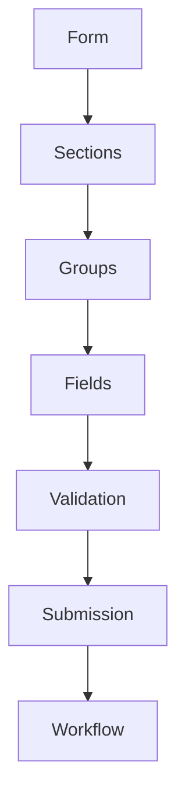
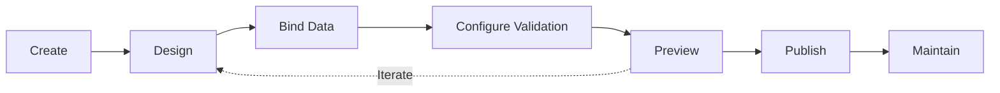
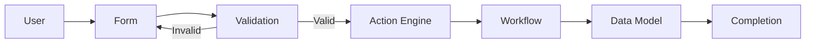
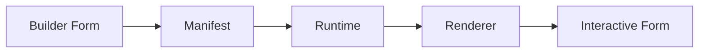
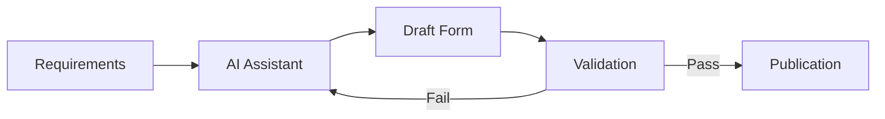

# Form Builder

**KB-026 — Form Builder Specification**

| Metadata | |
|----------|---|
| **KB ID** | KB-026 |
| **Title** | Form Builder |
| **Version** | 0.1.0 |
| **Status** | Drafting |
| **Owner** | Architecture Team |
| **Dependencies** | KB-012 Component Registry, KB-013 Component Model, KB-015 Action Engine, KB-018 State Management, KB-022 Builder Studio Architecture, KB-025 Workflow Builder, KB-028 Data Model Builder |
| **Related Documents** | Builder Studio Architecture (KB-022), Desk Builder (KB-023), Screen & Layout Builder (KB-024), Workflow Builder (KB-025), Data Model Builder (KB-028), Validation Engine (KB-030), Action Engine (KB-015), Theme Engine (KB-017), Offline & Synchronization (KB-020), Event Bus (KB-019), Capability System (KB-010) |
| **Review Status** | Pending |
| **Last Updated** | 2026-07-10 |

### Revision History

| Version | Date | Author | Change |
|---------|------|--------|--------|
| 0.1.0 | 2026-07-10 | AI Architecture Agent | Initial draft |

---

## 1. Purpose

The Form Builder is the Builder Studio subsystem responsible for designing, configuring, validating, previewing, publishing, and maintaining forms across the DUKADESK platform. It enables users to visually construct declarative forms using reusable field components, layouts, validation rules, data bindings, conditional logic, permissions, workflows, and offline capabilities.

Forms should be declarative because imperative form construction couples data collection logic to specific UI frameworks and platform rendering behaviors. Declarative forms describe what data to collect, what validation rules to enforce, what structure to present, and what actions to take on submission — without specifying how the form is rendered. Declarative forms are portable across platforms, testable without a renderer, auditable in their full configuration, and safe for AI generation.

Form logic is separated from UI rendering because data collection behavior — validation, conditional visibility, data binding, submission — is independent of visual appearance. A form may be rendered as a vertical list on mobile, a multi-column layout on desktop, or a conversational interface in a chat widget. The same form definition serves all contexts; only the rendering changes.

Forms integrate with workflows and data models because data collection is rarely an isolated activity. A form typically creates or updates records in a data model, triggers a workflow upon submission, dispatches actions through the Action Engine, and participates in business processes that span screens and capabilities. The Form Builder produces form artifacts that the Workflow Builder, Action Engine, and Data Model Builder consume as first-class participants.

Forms should remain reusable across multiple screens and capabilities. A customer registration form can appear in a mobile app, a web portal, a kiosk, and an embedded widget within another capability. A single form definition serves all contexts, ensuring consistent data collection, validation, and behavior regardless of where the form is rendered.

---

## 2. Form Philosophy

### Declarative Forms

Every form is defined as structured data — a hierarchy of sections, groups, and fields with configured properties, validation rules, data bindings, and submission actions. There is no imperative form construction code. Declarative forms are predictable, portable, auditable, and safe for AI generation.

### Schema-Driven Design

Forms are driven by their data schema. Field types, validation rules, default values, and relationships are derived from the Data Model whenever possible. Schema changes propagate to forms automatically, reducing maintenance and ensuring consistency between data definitions and collection interfaces.

### Component Reuse

Forms are assembled from field components registered in the Component Registry. The Form Builder does not create rendering primitives — it instantiates and configures existing field types. Component-driven form development ensures consistency, accessibility, and compatibility with the Runtime renderer.

### Accessibility by Default

Every form field must include accessibility metadata: labels, hints, error messages, focus order, keyboard handling, and screen reader announcements. The Form Builder enforces accessibility requirements through built-in validation and provides tools for inspecting and improving accessibility.

### Validation-First

Validation is defined at the field, section, and form level — not scattered across UI components. Validation rules are part of the form definition, authored once, enforced consistently across all platforms. The form is the authoritative source of validation behavior.

### Offline-Ready

Forms are designed for offline operation by default. Field values, validation state, and submission data are managed through the Offline & Synchronization system. Forms can be filled, validated, and queued for submission without network connectivity.

### Responsive Layouts

Form layouts adapt to screen size, input method, and platform conventions. A form defined once renders optimally on mobile, tablet, desktop, and kiosk. Responsive behavior is built into form layout primitives — columns stack on narrow screens, wizards collapse to single steps, long forms paginate.

### Workflow Integration

Forms are active participants in workflows. Submission triggers workflows, field values feed workflow decisions, workflow state can control field visibility and enabled state. The Form Builder and Workflow Builder share a common data contract.

### AI-Assisted Authoring

AI agents assist in form creation by generating complete forms from natural language descriptions, recommending fields and validation rules, detecting missing configurations, and improving accessibility. AI output is always editable and subject to validation.

### Platform Independence

Form definitions are platform-independent. The same form renders identically in behavior on mobile, web, desktop, and future platforms. Platform-specific visual adaptations are handled by the theme and renderer, not by the form definition.

---

## 3. What is a Form?

### Formal Definition

A Form is a structured, declarative data collection interface that binds to one or more data models, participates in workflows, and produces validated structured data consumed by the Runtime.

A Form:

- **Represents a structured data collection interface.** A form defines what data to collect, how it is organized, what validation rules apply, and what happens after submission. Every form has a defined schema that governs its fields and their relationships.

- **Contains fields organized into sections and groups.** Fields are the atomic data collection units. Sections and groups provide logical and visual organization. Fields inherit behavior from their containing sections and groups.

- **Binds to one or more data models.** A form maps its fields to data model attributes. Data binding defines how user input maps to data model instances, including create, update, and lookup operations.

- **Participates in workflows.** Forms trigger workflows on submission, provide data to workflow steps, and respond to workflow state changes. A form without workflow integration is a simple data entry interface; a form with workflow integration is a business process participant.

- **Produces structured data consumed by the Runtime.** Form submission produces a validated data payload that the Runtime routes to data models, workflows, actions, and integrations. The form defines the shape and validation rules for this data.

### What a Form Is Not

| Misconception | Clarification |
|---------------|---------------|
| A database table | A form collects data that may map to a data model, but it is not a database table. Multiple forms can map to the same data model. Forms include UI concerns (layout, visibility, conditional logic) that have no database equivalent. |
| A workflow | A form triggers and participates in workflows but is not itself a workflow. A form defines data collection; a workflow defines process orchestration. |
| A component library | Forms use field components from the Component Registry but are not a library of components. A form is a configured assembly of field instances, not a collection of reusable field definitions. |
| A backend API | A form submits data to the Runtime, which may forward it to backend APIs, but the form itself is not an API endpoint. Data transformation, routing, and storage are handled by the Action Engine and data model, not by the form definition. |
| A screen implementation | A form is a reusable artifact that appears within a screen. A screen may contain multiple forms, and a form may appear in multiple screens. Form and screen are separate concerns. |

---

## 4. Form Responsibilities

### Form Creation

Create new forms from scratch, from templates, from data models, or from AI-generated drafts. The Form Builder initializes form structure, metadata, default field configuration, and initial validation rules.

### Field Configuration

Add, remove, reorder, and configure fields within a form. Field configuration includes data type, default value, placeholder, help text, validation rules, visibility conditions, and accessibility metadata.

### Layout Organization

Organize fields into sections, groups, columns, tabs, accordions, wizards, and repeating groups. Layout organization defines the visual structure of the form and its responsive behavior across platforms.

### Validation Configuration

Define validation rules at the field, section, group, and form level. Validation rules include required fields, type constraints, range checks, pattern matching, cross-field validation, and business rule validation.

### Data Binding

Map form fields to data model attributes, define default values, computed values, lookup sources, and relationship bindings. Data binding connects the form to the data layer.

### Conditional Logic

Define visibility rules, enabled/disabled states, required conditions, and calculated values that depend on field values, user context, runtime state, or feature flags.

### Permissions

Configure field-level and section-level permissions. Permissions control who can view, edit, or submit the form based on user roles, tenant context, and capability availability.

### Localization

Configure locale-specific labels, hints, error messages, validation messages, and formatting. Localization resources are contributed to the Desk's Localization Manager.

### Workflow Integration

Configure submission triggers, workflow parameters, post-submission actions, and workflow state bindings. The form participates in workflows as a data producer and workflow state consumer.

### Preview

Preview the form in multiple device sizes, themes, locales, and user roles. Preview uses the Preview Runtime to render the form with mock or real data.

### Testing

Test form validation, conditional logic, data binding, accessibility, and submission behavior. The Form Builder provides a testing mode that simulates user interaction without requiring a full application deployment.

### Publication

Publish the form as part of the Desk Manifest. Published forms are available to all screens and capabilities within the Desk and can be consumed by the Runtime.

---

## 5. Form Builder Architecture

### 5.1 Form Manager

| Aspect | Description |
|--------|-------------|
| **Purpose** | Manage the lifecycle of forms — creation, organization, versioning, and publication. |
| **Responsibilities** | Initialize new forms from templates or data models, manage form metadata and version history, organize forms by capability and use case, handle form archival and deletion, manage form dependencies. |
| **Inputs** | Form CRUD commands, template selection, data model references. |
| **Outputs** | Form definitions, form metadata, form dependency records. |
| **Extension Points** | Custom form templates, form initialization hooks, form metadata schema extensions. |

### 5.2 Field Library

| Aspect | Description |
|--------|-------------|
| **Purpose** | Provide the catalog of available field types that can be placed on a form. |
| **Responsibilities** | Register field types from the Component Registry, categorize fields by purpose (basic, selection, date, media, location, advanced), provide field configuration interfaces, manage field version compatibility. |
| **Inputs** | Component Registry queries, field type registrations, field configuration updates. |
| **Outputs** | Available field type catalog, field configuration schemas, field renderer references. |
| **Extension Points** | Custom field type registrations, field configuration editors, field renderer overrides. |

### 5.3 Layout Designer

| Aspect | Description |
|--------|-------------|
| **Purpose** | Design the visual structure of the form — field organization, sections, groups, responsive behavior, and multi-step wizards. |
| **Responsibilities** | Arrange fields into sections and groups, configure column layouts and responsive breakpoints, design multi-step wizard sequences, manage tab, accordion, and card containers, preview layout at multiple screen sizes. |
| **Inputs** | Field selection and ordering, layout configuration commands, responsive breakpoint definitions. |
| **Outputs** | Form layout definition, responsive layout rules, wizard step definitions. |
| **Extension Points** | Custom layout containers, responsive layout strategies, wizard step templates. |

### 5.4 Validation Manager

| Aspect | Description |
|--------|-------------|
| **Purpose** | Define, configure, and test validation rules for the form. |
| **Responsibilities** | Configure field-level validation (required, type, range, pattern), configure cross-field and cross-section validation, configure business rule validation, validate the form during authoring, produce validation reports. |
| **Inputs** | Validation rule configurations, data model schema references, business rule definitions. |
| **Outputs** | Validation rule definitions, validation test results, validation coverage reports. |
| **Extension Points** | Custom validation rule types, custom validation rule editors, external validation service connectors. |

### 5.5 Data Binding Manager

| Aspect | Description |
|--------|-------------|
| **Purpose** | Bind form fields to data model attributes, define data transformations, and manage form-data model relationships. |
| **Responsibilities** | Map fields to data model attributes, configure default values and computed values, manage lookup field sources, handle relationship fields (one-to-one, one-to-many), configure read-only bindings and derived fields. |
| **Inputs** | Data model definitions, field-to-attribute mapping configurations, lookup source definitions. |
| **Outputs** | Data binding definitions, field mapping configurations, lookup query definitions. |
| **Extension Points** | Custom data binding sources, custom computed value functions, custom lookup providers. |

### 5.6 Conditional Logic Manager

| Aspect | Description |
|--------|-------------|
| **Purpose** | Define conditions that control field and section behavior at runtime. |
| **Responsibilities** | Configure show/hide conditions for fields and sections, configure enable/disable conditions, configure dynamic required fields, define calculated field values, manage runtime context conditions, manage user role conditions and feature flag conditions. |
| **Inputs** | Condition definitions, runtime context schemas, user role definitions, feature flag configurations. |
| **Outputs** | Conditional logic rules, visibility condition evaluators, calculated value expressions. |
| **Extension Points** | Custom condition evaluators, custom context providers, custom expression functions. |

### 5.7 Submission Manager

| Aspect | Description |
|--------|-------------|
| **Purpose** | Configure what happens when the form is submitted. |
| **Responsibilities** | Define submission targets (data model create, data model update, workflow trigger, action dispatch, API call), configure submission data transformations, manage submission confirmation and error handling, configure post-submission navigation and cleanup, support draft saving and auto-save. |
| **Inputs** | Submission action configurations, workflow references, data model operation definitions. |
| **Outputs** | Submission action definitions, post-submission navigation rules, draft save configurations. |
| **Extension Points** | Custom submission handlers, custom data transformers, custom post-submission actions. |

### 5.8 Accessibility Validator

| Aspect | Description |
|--------|-------------|
| **Purpose** | Ensure forms meet accessibility standards. |
| **Responsibilities** | Validate field labels, hints, and error messages, validate keyboard navigation order and touch targets, validate color contrast and focus indicators, validate screen reader announcements and ARIA attributes, generate accessibility reports with fix suggestions. |
| **Inputs** | Form definition, accessibility standards configuration, platform accessibility requirements. |
| **Outputs** | Accessibility validation results, accessibility improvement suggestions, accessibility coverage reports. |
| **Extension Points** | Custom accessibility rules, accessibility standard profiles, accessibility testing integrations. |

### 5.9 Preview Manager

| Aspect | Description |
|--------|-------------|
| **Purpose** | Provide live, interactive preview of the form during authoring. |
| **Responsibilities** | Render the form in multiple device sizes and orientations, simulate form completion and validation, test conditional logic with various field values, preview in different themes and locales, test submission behavior with mock data. |
| **Inputs** | Form definition, device configuration, theme selection, locale selection, mock data. |
| **Outputs** | Interactive form preview, validation simulation results, submission simulation results. |
| **Extension Points** | Custom device profiles, mock data providers, preview simulation hooks. |

### 5.10 Diagnostics Manager

| Aspect | Description |
|--------|-------------|
| **Purpose** | Provide health, quality, and completeness analysis for forms. |
| **Responsibilities** | Analyze form structure for issues, validate field configuration completeness, detect unused or orphaned fields, measure validation coverage, produce quality scores and diagnostic reports, suggest optimizations. |
| **Inputs** | Form definitions, validation results, diagnostic trigger events. |
| **Outputs** | Diagnostic reports, quality scores, optimization suggestions, coverage metrics. |
| **Extension Points** | Custom diagnostic rules, metric collectors, report renderers. |

---

## 6. Form Model

The canonical Form model defines the logical structure of a form definition.

| Element | Purpose |
|---------|---------|
| **Metadata** | Form identity, version, ownership, categorization, localization, and lifecycle state. |
| **Sections** | Top-level organizational divisions of the form. Each section groups related fields and may have its own header, description, visibility conditions, and permissions. |
| **Groups** | Nested organizational units within a section. Groups provide visual grouping of related fields — address fields in an address group, payment fields in a payment group. Groups may repeat for collection data. |
| **Fields** | The atomic data collection units. Each field has a type, label, data binding, validation rules, visibility conditions, and accessibility metadata. |
| **Validation Rules** | Rules that govern acceptable field values. Rules can be field-level, cross-field, section-level, or form-level. Each rule has a severity (error or warning), condition, and error message. |
| **Data Bindings** | Mappings between form fields and data model attributes. Bindings define how field values map to data model create, update, and lookup operations. |
| **Visibility Rules** | Conditions that determine whether a field, group, or section is visible at runtime. Visibility rules reference field values, runtime context, user role, and feature flags. |
| **Conditional Logic** | Rules that dynamically alter field behavior — enabled/disabled state, required/optional status, calculated values, and dynamic options. |
| **Permissions** | Access control rules at the field, section, and form level. Permissions reference user roles, tenant context, and capability availability. |
| **Localization** | Locale-specific content for labels, hints, error messages, validation messages, and placeholders. |
| **Submission Actions** | The actions that execute upon successful form submission — data model operations, workflow triggers, action dispatches, API calls, navigation commands. |
| **Workflow References** | References to workflows that consume form data or control form behavior. References include submission-triggered workflows, field-value-driven workflow decisions, and workflow-state-controlled visibility. |
| **Version Information** | Form version number, change history, compatibility information, and deprecation status. |

---

## 7. Field Library

### Basic Fields

| Field | Purpose |
|-------|---------|
| **Text** | Single-line text input for names, titles, codes, identifiers, and short free-text entries. |
| **Text Area** | Multi-line text input for descriptions, notes, comments, addresses, and longer free-text content. |
| **Number** | Numeric input for quantities, prices, counts, measurements, and any numerical data. Supports integer and decimal modes, min/max constraints, and step values. |
| **Email** | Email address input with built-in email format validation and keyboard type selection on mobile. |
| **Password** | Secure text input with masked characters, optional show/hide toggle, and password strength indicators. |
| **Phone** | Phone number input with format detection, country code selection, and validation against regional phone formats. |
| **URL** | URL input with format validation, protocol detection, and optional link preview. |
| **Search** | Search input with autocomplete suggestions, debounced input handling, and search result display. |

### Selection Fields

| Field | Purpose |
|-------|---------|
| **Checkbox** | Binary selection for yes/no, agree/disagree, enable/disable, and single-option toggles. |
| **Radio** | Single selection from a small set of mutually exclusive options. |
| **Switch** | Toggle control for binary settings — on/off states with immediate effect. |
| **Dropdown** | Single selection from a list of options. Supports categorized options, search filtering, and optional user-custom values. |
| **Multi-select** | Selection of multiple options from a list. Supports checked list, chip display, and count badges. |
| **Tags** | Free-form tag entry for adding multiple short text values. Supports autocomplete from existing tags and type-to-create. |
| **Autocomplete** | Text input with predictive suggestions from a data source. Supports remote search, debounced queries, and custom value entry. |

### Date & Time

| Field | Purpose |
|-------|---------|
| **Date** | Date selection with calendar picker, date format configuration, and min/max date constraints. |
| **Time** | Time selection with time picker, 12/24 hour format, and optional timezone binding. |
| **DateTime** | Combined date and time selection with all date and time configuration options. |
| **Duration** | Duration input for time intervals, appointment lengths, and elapsed time. Supports hours/minutes, days/hours, or custom unit combinations. |
| **Calendar** | Full calendar widget for scheduling, date range selection, and event display. |

### Media

| Field | Purpose |
|-------|---------|
| **Image Upload** | Single or multiple image upload with preview, crop, resize, and compression. |
| **Camera Capture** | Direct camera capture for photos. Supports front/back camera selection, flash toggle, and real-time filters. |
| **Video** | Video upload or camera recording with duration limits, quality selection, and thumbnail generation. |
| **Audio** | Audio recording or upload with waveform display, playback controls, and duration limits. |
| **Document Upload** | File upload for documents (PDF, Word, Excel, text) with file type filtering, size limits, and preview. |
| **Signature** | Touch or mouse signature capture with clear/reset, pen color and width configuration, and export options. |

### Location

| Field | Purpose |
|-------|---------|
| **Address** | Structured address input with street, city, state, postal code, and country fields. Supports autocomplete from geocoding services. |
| **GPS Coordinates** | Latitude/longitude input with map picker, current location detection, and coordinate format support. |
| **Map Picker** | Interactive map for point selection, area selection, or route definition. Supports markers, polygons, and geofencing. |

### Advanced

| Field | Purpose |
|-------|---------|
| **Rich Text** | WYSIWYG text editor for formatted content — bold, italic, lists, links, headings, tables. |
| **Barcode Scanner** | Camera-based barcode and QR code scanner. Supports common formats (UPC, EAN, Code 128, QR, Data Matrix). |
| **QR Scanner** | Dedicated QR code scanner with data extraction and validation. |
| **Rating** | Star rating or numeric rating input for reviews, feedback, and satisfaction scores. |
| **Slider** | Numeric range selection with draggable slider. Supports min/max, step, and range (dual-handle) modes. |
| **Color Picker** | Color selection with swatch palette, color wheel, and hex/RGB input. |
| **File Collections** | Grouped file upload for document sets — multiple files with category labels, ordering, and metadata per file. |
| **Nested Forms** | Embed a complete form as a field within another form. Supports address sub-forms, contact sub-forms, and any reusable form fragment. |
| **Repeating Groups** | Dynamically repeatable field groups for list-like data — order line items, guest lists, task checklists. Supports add/remove, reorder, and min/max item constraints. |

---

## 8. Layout & Organization

### Sections

Top-level divisions that organize the form into logical pages or blocks. Each section has a title, description, and optional visibility conditions. Sections may span one or more columns.

### Field Groups

Nested groupings of related fields within a section. Groups provide visual cohesion for fields that belong together — an address group containing street, city, state, and zip fields. Groups may have labels, borders, and background styling.

### Columns

Fields and groups arranged in multi-column layouts. Column count is configurable per section and per breakpoint. On narrow screens, multi-column layouts collapse to single column automatically.

### Tabs

Section content organized into tabbed panels. Each tab contains one or more groups or fields. Tabs are suitable for forms with distinct categories of information that do not need to be viewed simultaneously.

### Accordions

Section content organized into expandable panels. Accordions allow users to focus on one group at a time while keeping all groups accessible without navigation. Suitable for long forms with independent sections.

### Cards

Distinct visual containers for field groups. Cards provide visual separation with borders, shadows, and background colors. Useful for dashboards, summary sections, and heterogeneous form layouts.

### Wizards (Multi-Step Forms)

Forms divided into sequential steps with progress indication, next/back navigation, and per-step validation. Wizards are the standard pattern for complex data collection — registration, checkout, onboarding, surveys. Each step is a section with independent validation.

### Repeating Sections

Sections that can be dynamically repeated for collection data — multiple addresses, multiple contacts, multiple order items. Each instance validates independently. Supports add, remove, reorder, and min/max item constraints.

### Responsive Layouts

All layout primitives support responsive configuration. Column counts, wizard step layout, accordion expansion behavior, and section ordering adapt to device size, orientation, and input method. Responsive rules are defined declaratively in the form layout definition.

---

## 9. Data Binding

### Binding Fields to Data Models

Each field can be bound to an attribute in a Data Model. The binding defines the data model entity, the target attribute, and the operation (create, update, lookup). Multiple fields may map to the same data model.

### Default Values

Fields can have default values specified from static data, runtime context (current user, current location, current date), computed expressions, or data model default values.

### Computed Values

Field values that are calculated from other field values using expressions. Computed values are read-only and update reactively when their dependencies change. Examples: total = price × quantity, full_name = first_name + " " + last_name.

### Derived Fields

Fields that display data derived from data model relationships. Examples: displaying customer name from a customer ID field, displaying product description from a product SKU field.

### Read-Only Bindings

Fields can be bound in read-only mode where the value is displayed but not editable. Read-only fields are useful for confirmation screens, detail views, and system-generated values.

### Reference Data

Fields that source their options from reference data — lookup tables, enumerations, taxonomies. Reference data can be static (defined in the form) or dynamic (queried at runtime).

### Lookup Fields

Fields that search and select from related data model instances. Lookup fields support search, filtering, pagination, and create-on-the-fly. Examples: selecting a customer from the customer data model, selecting a product from inventory.

### Relationship Fields

Fields that manage relationships between data models. One-to-one relationships (assigning a primary contact), one-to-many relationships (adding line items to an order), and many-to-many relationships (assigning tags to a document).

---

## 10. Validation

### Required Fields

Fields marked as required must have a non-empty value before submission. Required status can be static or conditional based on other field values or runtime context.

### Data Type Validation

Validation that the field value matches its declared data type — string, number, boolean, date, email, URL, phone. Type validation is automatic based on the field type selection.

### Range Validation

Validation that numeric values fall within a specified minimum and maximum range. Supports inclusive/exclusive bounds and configurable error messages.

### Pattern Validation

Validation that string values match a regular expression pattern. Common patterns include postal codes, tax IDs, license plates, and custom format strings.

### Cross-Field Validation

Validation rules that compare multiple field values. Examples: confirm password must match password, end date must be after start date, total must equal sum of line items.

### Business Rule Validation

Validation rules that encode business logic — credit limits, age restrictions, eligibility criteria, policy constraints. Business rules may reference external data, user context, or runtime state.

### Workflow Validation

Validation that the submitted data satisfies workflow preconditions. Examples: an approval form requires a manager to be selected, a prescription form requires a valid license number.

### Custom Validation Extensions

The Validation Engine supports custom validation rule types registered through extension points. Third-party validators can implement domain-specific validation — medical code validation, tax calculation verification, regulatory compliance checks.

---

## 11. Conditional Logic

### Show/Hide Fields

Fields, groups, and sections can be shown or hidden based on condition expressions. Conditions reference field values, runtime context, user roles, and feature flags. Hidden fields are not rendered and their values are not submitted.

### Enable/Disable Fields

Fields can be enabled or disabled based on conditions. Disabled fields are rendered but not editable. Their values are submitted if present. Useful for fields that depend on prior selections — a discount code field that enables only when a promo code option is selected.

### Dynamic Required Fields

Required status can be conditional. A field may be optional by default but become required when a related field has a specific value. Example: a shipping address is required only when the delivery method is "ship".

### Calculated Values

Field values computed from expressions that reference other fields and runtime context. Calculated fields update reactively as their dependencies change. Examples: tax calculation, price total, age from date of birth.

### Conditional Sections

Entire sections can be shown or hidden based on conditions. Useful for optional form sections — a "billing address" section shown only when "billing differs from shipping" is checked.

### Conditional Submission

Submission behavior can vary based on conditions. Different submission targets, data transformations, or post-submission actions can be configured for different form states. Example: a draft save vs. final submission.

### Runtime Context Conditions

Conditions that reference runtime state — current user role, tenant configuration, device type, network status, application state. Example: showing admin-only fields when the current user has the admin role.

### User Role Conditions

Field and section permissions governed by user roles. Example: managers can edit salary fields; employees can only view them.

### Feature Flags

Field and section visibility controlled by feature flags. Example: showing beta fields only when the beta feature flag is enabled for the tenant.

---

## 12. Workflow Integration

### Workflow Builder

The Form Builder and Workflow Builder share a common data contract. Forms define the data shape that workflows consume; workflows define the process state that forms can respond to. The Workflow Builder can reference form fields as data sources for workflow decisions.

### Action Engine

Form submission dispatches actions through the Action Engine. Actions include data model operations, navigation commands, API calls, event emissions, and custom capability actions. The Submission Manager configures which actions execute on submission.

### Event Bus

Forms emit events at key lifecycle points — field change, section completion, form submission, validation failure. The Event Bus publishes these events for other system components to consume. Workflows and other forms can subscribe to form events.

### State Management

Form state (field values, validation state, submission status, dirty state) is managed through State Management stores. Form state is accessible to other components and workflows through state selectors.

### Notifications

Form submission can trigger notifications through the notification system. Notification configuration includes recipients, templates, channels (push, email, SMS), and delivery conditions.

### Approval Workflows

Forms can initiate approval workflows on submission. The approval workflow routes the form data to approvers, tracks approval decisions, and reports the outcome back to the form. The form can display approval status and respond to approval outcomes.

### Automation Triggers

Form submission can trigger automated processes — data sync to external systems, report generation, inventory updates, customer communications. Automation triggers are configured through the Workflow Builder and executed by the Action Engine.

---

## 13. Runtime Integration

### Runtime

The Runtime loads form definitions from the Manifest and initializes the form runtime environment. The Runtime provides the execution context — user identity, permissions, locale, theme, and capability state — that forms consume.

### Renderer

The Renderer interprets the form definition and produces the interactive form UI. It renders fields according to their types, applies layout rules, enforces validation, handles user input, and manages form state. The Renderer uses the Component Registry to instantiate field components.

### Theme Engine

Forms consume theme tokens for spacing, typography, colors, border radius, and input styling. Field components reference theme tokens for consistent visual appearance across the application. The Theme Engine provides the token values at runtime.

### Data Model

At runtime, the Data Model provides the schema that form data bindings reference. Data model validation rules are enforced alongside form validation rules. Data model instances are created, updated, and queried based on form submission actions.

### Offline & Synchronization

Forms operate offline by default. The Offline & Synchronization system manages form state persistence, submission queuing, conflict detection, and data synchronization when connectivity is restored. Form drafts are saved locally and synced when online.

### Navigation Engine

Forms can trigger navigation on submission — redirecting to a confirmation screen, returning to a list view, or navigating to a related entity detail screen. The Navigation Engine handles these transitions, including deep links to form instances.

### Capability System

Forms are contributed by capabilities. The Capability System manages form registration, capability-scoped form access, and form lifecycle within the capability context. Forms from inactive capabilities are hidden.

---

## 14. AI Integration

### Generate Complete Forms

The AI Assistant can generate complete forms from natural language descriptions. Generated forms include sections, fields, validation rules, data bindings, and submission configuration. The user reviews and refines the result through the Form Builder.

### Recommend Fields

Based on the form's purpose, data model context, and business domain, the AI Assistant can recommend fields to include. Recommendations include field types, label suggestions, and expected validation rules.

### Suggest Validation Rules

The AI Assistant can analyze field types and business context to suggest appropriate validation rules — required fields, range constraints, pattern validation, cross-field validation.

### Detect Missing Fields

The AI Assistant can analyze data model bindings and workflow requirements to detect missing fields. Detection includes fields required by the data model, fields referenced by workflows, and fields commonly expected in the business domain.

### Improve Accessibility

The AI Assistant can scan forms for accessibility issues and suggest improvements — missing labels, insufficient color contrast, improper focus order, missing error announcements, undersized touch targets.

### Generate Conditional Logic

The AI Assistant can generate conditional logic rules from natural language descriptions. Example: "Show the shipping address section only when delivery method is ship" produces the corresponding visibility condition.

### Recommend Workflows

Based on form content and business context, the AI Assistant can recommend workflows to trigger on submission — approval workflows, notification workflows, data sync workflows, automation workflows.

### Produce Documentation

The AI Assistant can generate form documentation — field descriptions, validation rule explanations, submission behavior summaries, and user-facing instructions.

### AI Integration Principles

- AI generates form drafts and suggestions; all output is editable.
- AI-generated forms must pass Validation Engine checks before publication.
- AI operations are logged for audit trail and improvement.
- AI suggestions are optional — the user makes all final decisions.
- AI must cite sources when referencing data models, components, or workflows.

---

## 15. Accessibility

### Keyboard Navigation

All form fields, sections, and submission controls must be navigable and operable using only a keyboard. Tab order follows visual layout. Custom keyboard shortcuts are configurable.

### Screen Reader Support

Every field must have an associated label, whether visible or programmatically provided. Error messages, hints, and validation announcements are exposed to screen readers. Dynamic content changes (conditional sections, validation results) are announced.

### Error Announcements

Validation errors are announced to screen readers immediately when they occur. Error messages are associated with their corresponding fields. Multiple errors are enumerated.

### High Contrast

Form fields and controls must be usable in high contrast mode. All text, borders, icons, and focus indicators maintain sufficient contrast against their backgrounds.

### Focus Management

Focus moves predictably through the form — sequentially through fields, into and out of sections, through wizard steps. Modal dialogs and popups trap focus appropriately. Focus returns to the triggering element when popups close.

### Touch Targets

All interactive elements meet minimum touch target size requirements. Fields, buttons, checkboxes, radio buttons, and switches provide adequate touch area regardless of their visual size.

### Font Scaling

Form layouts accommodate font scaling up to 200% without loss of content or functionality. Text does not overflow containers, fields remain usable, and layout does not break.

### Reduced Motion

Form animations, transitions, and auto-advancing wizard steps respect the user's reduced motion preference. Interactive feedback does not rely solely on motion.

---

## 16. Security

### Field-Level Permissions

Individual fields can be restricted by user role, tenant, or capability. Permission-controlled fields may be hidden, read-only, or fully editable based on the user's authorization.

### Sensitive Field Masking

Sensitive fields — passwords, PINs, financial identifiers, personal data — are masked by default. Masking behavior is configurable per field type and user role.

### Secure Uploads

Media upload fields enforce file type allowlists, size limits, virus scanning, and secure transfer protocols. Uploaded files are stored in tenant-isolated storage.

### Encryption Considerations

Form data in transit is encrypted. Sensitive field values may be encrypted at submission for end-to-end protection. Encryption configuration is specified at the field level.

### Audit Logging

All form submissions are logged — who submitted, what values, when, from which device and platform. Audit logs are immutable and retained according to organization policy.

### Tenant Isolation

Forms and their submission data are isolated by tenant. One tenant's form definitions, field configurations, submission data, and uploaded files are never accessible to another tenant.

---

## 17. Performance

### Large Form Optimization

Forms with many fields (>100) are optimized through virtualized rendering, section-level lazy loading, and deferred validation. Only visible fields consume rendering resources.

### Lazy Loading

Section content, field options, and reference data are loaded lazily as the user interacts with the form. Wizard steps load on demand. Lookup fields query data on user interaction.

### Incremental Validation

Validation runs incrementally as the user completes fields. Full form validation is deferred until submission. Validation is coalesced during rapid input to avoid excessive computation.

### Virtualized Field Rendering

Long forms with repeating groups use virtualized rendering to maintain smooth scrolling and responsive interaction. Only visible fields within the viewport are fully rendered.

### Efficient Data Binding

Data binding operations are batched and debounced. Model updates are coalesced to minimize state management overhead. Computed values update reactively with minimal recomputation.

### Offline Performance

Form definitions are cached locally for instant loading. Field configuration, validation rules, and conditional logic execute locally without network dependency. Submission data is queued and synced efficiently.

---

## 18. Observability

### Validation Reports

Per-form validation reports showing field-level, section-level, and form-level validation coverage. Reports include rule counts, rule types, and uncovered fields.

### Submission Analytics

Submission volume, completion rates, abandonment rates, average completion time, and field-level interaction metrics. Analytics are aggregated per form, per capability, and per Desk.

### Error Metrics

Validation error frequency by field and rule type, submission failure rates, error distribution by platform and locale. Error metrics inform form optimization priorities.

### Accessibility Reports

Per-form accessibility scores with pass/fail counts by WCAG success criterion. Reports include specific field-level issues with suggested fixes.

### Performance Metrics

Form load time, field render time, validation execution time, submission processing time. Metrics are collected per form version for regression detection.

### Diagnostics

The Diagnostics Manager provides per-form health overview — completeness score, validation coverage, accessibility grade, performance rating, and optimization suggestions.

---

## 19. Anti-Patterns

### Business Logic Embedded in Field Definitions

Field definitions describe data collection — type, label, validation. Embedding business logic (approval routing, pricing calculations, inventory checks) in field definitions couples data collection to specific business rules, making both harder to maintain. Business logic belongs in workflow definitions and action handlers.

### Duplicate Forms

Creating separate forms for the same data collection purpose across different screens or capabilities leads to inconsistent validation, divergent behavior, and duplicated maintenance. Forms should be defined once and reused.

### Hardcoded Validation

Embedding validation messages, rules, or thresholds in UI component configurations instead of form definitions creates inconsistency across platforms and prevents centralized validation management. All validation should be defined in the form definition.

### Platform-Specific Fields

Using field types or configurations that only work on one platform (mobile-only camera field without desktop fallback, web-only rich text without mobile support) produces inconsistent data collection. Fields should be platform-independent; the Renderer handles platform adaptation.

### Monolithic Forms

Collecting all data for an entire business process in a single form creates poor user experience, high validation complexity, poor performance, and difficult maintenance. Complex data collection should be broken into multiple forms connected by workflows.

### Excessive Required Fields

Marking too many fields as required increases user friction, abandonment rates, and data entry errors. Only fields essential for the business operation should be required. Optional fields should be clearly marked.

### Ignoring Accessibility

Fields without labels, error messages without screen reader announcements, keyboard-inaccessible controls, and low-contrast text exclude users with disabilities and create legal compliance risk. Accessibility is not optional.

### Hidden Mandatory Fields

Fields that are both hidden and required create submission failures that users cannot diagnose or resolve. Conditional logic should never produce a state where a required field is hidden. Validation rules should detect and flag this configuration at authoring time.

---

## 20. Future Evolution

### AI-Generated Adaptive Forms

AI agents will generate forms that adapt to user behavior — field ordering based on usage patterns, validation rules tuned to common error patterns, field suggestions based on historical data, and dynamic section organization optimized for completion rates.

### Conversational Forms

Forms rendered as conversational interfaces — chat-based data collection, voice-driven form filling, step-by-step guided interviews. The same form definition powers both visual and conversational rendering.

### Voice Input

Voice-driven field input with speech-to-text transcription, voice command navigation, and voice confirmation for critical submissions.

### Smart Validation

Validation that learns from historical submission data — automatically adjusting thresholds, detecting anomalous values, suggesting corrections, and predicting validation outcomes.

### Dynamic Schema Evolution

Forms that automatically adapt to data model schema changes — adding fields for new attributes, removing fields for deprecated attributes, updating validation for changed constraints.

### Industry-Specific Form Packs

Pre-built form templates for common industry use cases — medical intake forms, insurance claims, loan applications, inspection checklists, survey instruments. Packs include fields, validation, and workflow integration.

### Collaborative Form Editing

Multiple users editing the same form simultaneously with cursor presence, real-time updates, change tracking, and conflict resolution.

---

## 21. Relationship to Other Documents

| Document | Relationship |
|----------|-------------|
| **Builder Studio Architecture (KB-022)** | Defines the overall Builder platform. The Form Builder is a specialized sub-builder within Builder Studio. |
| **Desk Builder (KB-023)** | Desks own the forms installed through their capabilities. The Desk Builder delegates form design to the Form Builder. |
| **Screen & Layout Builder (KB-024)** | Forms appear within screens. The Screen Builder places form instances on screens alongside other components. |
| **Workflow Builder (KB-025)** | Forms trigger workflows on submission and respond to workflow state. The Workflow Builder consumes form data contracts. |
| **Data Model Builder (KB-028)** | Forms bind to data models. The Data Model Builder defines the schemas that form fields map to. |
| **Validation Engine (KB-030)** | Forms contribute validation rules that the Validation Engine enforces at runtime. |
| **Action Engine (KB-015)** | Form submission dispatches actions. The Action Engine executes submission actions and workflow steps. |
| **Theme Engine (KB-017)** | Forms consume theme tokens for visual styling. The Theme Engine provides design token values at runtime. |
| **Offline & Synchronization (KB-020)** | Forms operate offline. The Offline Engine manages offline form state and submission queuing. |
| **Event Bus (KB-019)** | Forms emit lifecycle events. The Event Bus distributes form events to subscribers. |
| **State Management (KB-018)** | Form state is managed through State Management stores. |

---

## Required Mermaid Diagrams

### Form Architecture

### Form Lifecycle

### Submission Flow

### Runtime Relationship

### AI Form Generation

---

*This is KB-026, the Form Builder specification of the DUKADESK Engineering Knowledge Base. It defines the Form Builder as the authoritative form authoring environment, establishes declarative, reusable, accessible, and workflow-integrated forms, and describes how forms integrate with the Runtime, Workflow Builder, Action Engine, Data Model, Offline Engine, and AI Assistant to serve all data collection needs across the DUKADESK platform.*
