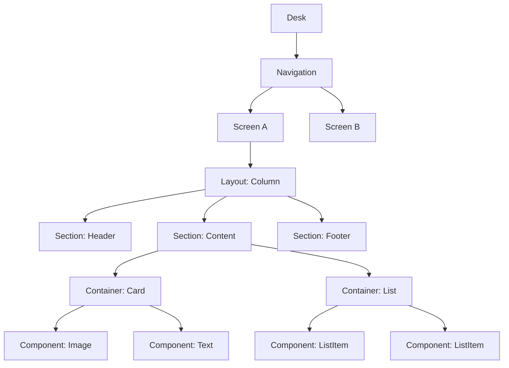

# Layout System

**KB-014 — Layout System Specification**

| Metadata | |
|----------|---|
| **KB ID** | KB-014 |
| **Title** | Layout System |
| **Version** | 0.1.0 |
| **Status** | Drafting |
| **Owner** | Architecture Team |
| **Dependencies** | KB-012 Component Registry, KB-013 Component Model, Theme Engine |
| **Related Documents** | Renderer Architecture, Component Registry, Component Model, Theme Engine, Navigation Engine, Builder Studio, Runtime Overview |
| **Review Status** | Pending |
| **Last Updated** | 2026-07-10 |

### Revision History

| Version | Date | Author | Change |
|---------|------|--------|--------|
| 0.1.0 | 2026-07-10 | AI Architecture Agent | Initial draft |

---

## 1. Purpose

The Layout System is the architectural framework responsible for organizing, arranging, and composing user interfaces across all supported client platforms.

Layout is separated from rendering because structure and presentation are independent concerns. A layout defines what goes where and how elements relate to each other. Rendering defines what it looks like — colors, typography, imagery, animations. Separating them means:

- **Builder** can manipulate layout without understanding rendering.
- **Renderer** can focus on visual output without recomputing structure.
- **Themes** can change appearance without altering arrangement.
- **Responsive adaptation** can restructure layout without touching rendering code.
- **Multiple platform renderers** can share one layout definition.

Layouts are declarative. A layout describes the desired arrangement, not the algorithm to achieve it. Declarative layouts are portable, predictable, testable, and safe for AI generation.

Both Builder and Runtime depend on the Layout System. The Builder uses it to define and edit page structure. The Runtime uses it to resolve manifests into renderable screen hierarchies. The Layout System is the shared language between them.

---

## 2. Layout Philosophy

### Declarative Layouts

Every layout is a declaration of structure, not a sequence of positioning commands. The layout says "these elements are in a column with equal spacing" — not "put element A at x=0 y=0, element B at x=0 y=48." The Runtime determines the concrete positions from the declarative description.

### Composition Over Positioning

Layouts are built by composing containers that arrange their children. Explicit positioning (x, y coordinates) is reserved for overlay and special-purpose layouts only. Business and product UIs use compositional layouts exclusively.

### Responsive by Default

Every layout is assumed to need responsive behavior. The Layout System provides responsive primitives as the default, not as an opt-in afterthought. A layout that does not specify breakpoints still adapts through intrinsic sizing and flexible constraints.

### Platform-Independent

The layout model does not reference screen densities, pixel dimensions, or platform-specific patterns. Layouts are defined in abstract terms (spacing units, relative sizes, breakpoint ranges) and resolved into platform-specific values by the Theme Adapter and Renderer.

### Accessibility-First

Layouts must produce correct reading order, focus order, and touch target sizes without additional effort. Accessibility adaptation (dynamic text sizing, reduced motion, high contrast) is handled at the layout level, not patched on per component.

### Theme-Aware

Layout spacing, sizing, and arrangement reference theme tokens rather than hardcoded values. The same layout produces different visual densities under different themes.

### Nested Composition

Containers nest within containers to produce complex layouts from simple primitives. Nesting depth is flexible but the Layout System provides guidance on optimal depth to avoid performance and maintenance issues.

### Predictable Rendering

Given the same manifest, theme, and device context, the Layout System must produce the same structure every time. Layout resolution is deterministic. There are no random or time-dependent layout decisions.

### Separation of Structure and Presentation

Layout defines structure (containers, sections, order, hierarchy). Themes define presentation (colors, spacing, typography). Components define behavior (interaction, events). The three layers are independent and composable.

---

## 3. Layout Hierarchy

The DUKADESK layout model follows a strict hierarchy. Every level has a defined responsibility.

```text
Desk
 │
 ▼
Navigation
 │
 ▼
Screen
 │
 ▼
Layout
 │
 ▼
Section
 │
 ▼
Container
 │
 ▼
Component
```

### Desk

The outermost container representing the application window or device screen. The Desk manages the root layout context: safe areas, window insets, orientation, and available viewport. A Desk contains exactly one active Navigation at a time.

### Navigation

The navigation structure surrounding the current screen: tabs, drawers, sidebars, headers, or bottom bars. Navigation is managed by the Navigation Engine but rendered within the Layout System's hierarchy. A Navigation contains Screens.

### Screen

A distinct view or page within the application. A Screen has a layout definition that controls how its Sections and Containers are arranged. Screens are the unit of navigation and the level at which most layout definitions are authored.

### Layout

The top-level arrangement strategy for a Screen. The Layout type (Column, Grid, Tabs, etc.) determines how the Screen's Sections are organized. A Screen has exactly one Layout.

### Section

A logical grouping within a Screen. Sections divide a screen into meaningful blocks (header section, content section, footer section). Sections may have their own layout type that applies to their child Containers.

### Container

A structural element that holds Components or nested Containers. Containers control alignment, spacing, padding, and distribution of their children. Containers are the primary building block of compositional layouts.

### Component

A renderable UI element registered in the Component Registry. Components are the leaves of the layout tree. They do not arrange other elements.

### Hierarchy Diagram



---

## 4. Layout Architecture

The Layout System is composed of internal logical modules. Each module has a defined purpose, input, output, and extension point.

### 4.1 Layout Manager

| Aspect | Description |
|--------|-------------|
| **Purpose** | Orchestrate the layout resolution pipeline from manifest to rendered structure. |
| **Responsibilities** | Receive layout definitions, coordinate module execution, manage layout lifecycle. |
| **Inputs** | Layout definition from manifest, device context, theme, runtime state. |
| **Outputs** | Resolved layout tree ready for rendering. |
| **Extension points** | Pre-processing hooks, post-resolution hooks, custom layout providers. |

### 4.2 Layout Resolver

| Aspect | Description |
|--------|-------------|
| **Purpose** | Parse a declarative layout definition and produce an intermediate layout tree. |
| **Responsibilities** | Interpret layout type, build container hierarchy, attach component references, resolve layout references. |
| **Inputs** | Layout definition (JSON or equivalent declarative format). |
| **Outputs** | Intermediate layout tree (unresolved — before responsive/theme adaptation). |
| **Extension points** | Custom layout type parsers, schema version adapters. |

### 4.3 Container Engine

| Aspect | Description |
|--------|-------------|
| **Purpose** | Manage container behavior: nesting, alignment, distribution, spacing, overflow. |
| **Responsibilities** | Apply container constraints to children, compute child positions within containers, handle overflow and scrolling. |
| **Inputs** | Container definition with children, constraints, alignment parameters. |
| **Outputs** | Positioned child layout nodes. |
| **Extension points** | Custom container behaviors, special-purpose containers. |

### 4.4 Responsive Engine

| Aspect | Description |
|--------|-------------|
| **Purpose** | Adapt layout structure and parameters based on device characteristics and viewport. |
| **Responsibilities** | Evaluate breakpoints, apply responsive rules, select adaptive variants, compute responsive parameters. |
| **Inputs** | Layout tree, device context (viewport, orientation, density, platform). |
| **Outputs** | Responsively-adapted layout tree. |
| **Extension points** | Custom breakpoint strategies, device class definitions, responsive rule engines. |

### 4.5 Constraint Engine

| Aspect | Description |
|--------|-------------|
| **Purpose** | Evaluate and resolve layout constraints: min/max sizes, aspect ratios, proportional sizing, intrinsic sizing. |
| **Responsibilities** | Resolve constraint expressions, detect constraint conflicts, compute final sizes. |
| **Inputs** | Constraint declarations from layout definitions and component schemas. |
| **Outputs** | Resolved size and position values. |
| **Extension points** | Custom constraint functions, external constraint solvers. |

### 4.6 Visibility Engine

| Aspect | Description |
|--------|-------------|
| **Purpose** | Determine which layout elements are visible based on context, permissions, and state. |
| **Responsibilities** | Evaluate visibility conditions, filter hidden elements from the layout tree, notify consumers of visibility changes. |
| **Inputs** | Layout tree, runtime state, permissions, capability context, feature flags. |
| **Outputs** | Filtered layout tree with only visible elements. |
| **Extension points** | Custom visibility providers, role-based visibility rules. |

### 4.7 Position Resolver

| Aspect | Description |
|--------|-------------|
| **Purpose** | Compute final positions of all layout elements after responsive adaptation and constraint resolution. |
| **Responsibilities** | Walk the adapted layout tree, compute absolute positions from relative/declarative positions, apply alignment and distribution. |
| **Inputs** | Responsively-adapted and constraint-resolved layout tree. |
| **Outputs** | Positioned layout tree with absolute coordinates. |
| **Extension points** | Custom positioning strategies, RTL layout support. |

### 4.8 Theme Adapter

| Aspect | Description |
|--------|-------------|
| **Purpose** | Map layout spacing, sizing, and typography tokens to concrete theme values. |
| **Responsibilities** | Resolve theme token references in layout definitions, convert abstract spacing units to platform values, apply theme overrides. |
| **Inputs** | Layout tree with theme token references, active theme. |
| **Outputs** | Layout tree with concrete theme values. |
| **Extension points** | Custom token resolvers, theme-specific layout adjustments. |

### 4.9 Accessibility Adapter

| Aspect | Description |
|--------|-------------|
| **Purpose** | Ensure layout output satisfies accessibility requirements. |
| **Responsibilities** | Verify reading order, ensure minimum touch targets, validate focus order, apply accessibility adjustments (dynamic text, reduced motion, high contrast). |
| **Inputs** | Positioned layout tree, accessibility settings. |
| **Outputs** | Accessibility-validated layout tree. |
| **Extension points** | Custom accessibility validators, platform-specific accessibility rules. |

### 4.10 Diagnostics

| Aspect | Description |
|--------|-------------|
| **Purpose** | Collect, store, and expose diagnostics about layout resolution. |
| **Responsibilities** | Log layout resolution steps, measure timing, capture errors, report constraint violations. |
| **Inputs** | Events from all other modules. |
| **Outputs** | Diagnostic logs, metrics, health status. |
| **Extension points** | Custom diagnostic sinks, layout profiling exporters. |

### Layout Resolution Pipeline

```mermaid
graph LR
    Manifest["Screen Manifest"] --> LR["Layout Resolver"]
    LR --> IT["Intermediate Tree"]
    IT --> RE["Responsive Engine"]
    RE --> RT["Responsive Tree"]
    RT --> CE["Constraint Engine"]
    CE --> CT["Constrained Tree"]
    CT --> VE["Visibility Engine"]
    VE --> VT["Visible Tree"]
    VT --> PR["Position Resolver"]
    PR --> PT["Positioned Tree"]
    PT --> TA["Theme Adapter"]
    TA --> TT["Themed Tree"]
    TT --> AA["Accessibility Adapter"]
    AA --> AT["Accessibility Tree"]
    AT --> Renderer
```



---

## 5. Layout Types

The Layout System defines canonical layout types. Each type specifies a distinct arrangement strategy.

### Stack

Layers children on top of each other along the Z-axis. Use for overlapping content, modals, tooltips, and absolute-positioned overlays.

### Row

Arranges children horizontally from left to right. Use for toolbars, button groups, horizontal navigation, and inline element groups.

### Column

Arranges children vertically from top to bottom. Use for forms, article content, feed items, and any primarily vertical arrangement. The most common layout type.

### Grid

Arranges children in a two-dimensional grid with defined rows and columns. Use for product catalogs, image galleries, dashboards, and tabular data displays.

### Wrap

Arranges children in a horizontal flow that wraps to the next line when the container width is exceeded. Use for tag clouds, filter chips, search suggestions, and dynamic collections.

### Overlay

Positions children relative to a parent using anchor points (top-left, center, bottom-right, etc.). Use for badges, tooltips, popovers, floating action buttons, and contextual menus.

### Split View

Divides available space into two or more resizable or fixed panes. Use for master-detail layouts, code editors, email clients, and any interface requiring simultaneous views.

### Tabs

Displays one child at a time with tab headers for switching. Use for preference panels, category browsers, settings screens, and content that benefits from horizontal categorization.

### Accordion

Displays children in collapsible panels stacked vertically. Use for FAQs, settings groups, documentation sections, and progressive disclosure patterns.

### Wizard

Guides the user through a sequence of steps, showing one step at a time with progress indication. Use for multi-step forms, onboarding flows, checkout processes, and setup wizards.

### Flow Layout

Arranges children in a natural reading order (left-to-right in LTR locales, top-to-bottom as needed). Children have intrinsic sizes and flow naturally. Use for document-like content, article layouts, and dynamic content feeds.

### Masonry

Arranges children in columns of variable height, minimizing gaps. Use for image galleries, pin boards, portfolio displays, and any staggered-content presentation.

### Responsive Layout

A layout that changes its internal arrangement based on breakpoints. The same content may be a Column on mobile and a Row on desktop. Use as the top-level layout for any screen that targets multiple device classes.

### Fixed Layout

Positions children at absolute coordinates within the container. Use only for print-style layouts, canvas-based interfaces, and special effects. Not for business or product UIs.

### Adaptive Layout

A layout that selects from multiple predefined structural variants based on context (platform, device class, user preference). Use when responsive adjustments are insufficient and fundamentally different structures are needed for different contexts.

### Nested Layout

Any combination of the above where a child container uses a different layout type than its parent. Nested layouts are the norm, not the exception. A Column may contain a Row that contains a Grid.

---

## 6. Container Model

### Parent-Child Relationships

Every container has zero or more children. Children may be Components or nested Containers. The parent container controls the arrangement of its direct children. Containers do not control the arrangement of grandchildren.

### Nesting

Containers may nest to arbitrary depth. Each nesting level adds structural context. Best practice recommends nesting depth of no more than 5 levels for readability and performance. The Diagnostics module warns beyond 7 levels.

### Padding

Space between a container's border and its children. Padding is uniform or per-side. Padding values reference theme spacing tokens.

```text
Container
┌──────────────────────┐
│  Padding             │
│  ┌────────────────┐  │
│  │  Children area  │  │
│  └────────────────┘  │
└──────────────────────┘
```

### Margins

Space between a container and sibling elements. Margins are specified per-side and collapse with adjacent margins following standard CSS-like margin collapse rules.

### Alignment

How children are aligned within a container along the primary and cross axes:

| Axis | Values |
|------|--------|
| Primary | start, center, end, space-between, space-around, space-evenly |
| Cross | start, center, end, stretch, baseline |

### Distribution

How space is distributed among children when the container has excess space:

- **Proportional**: Children receive space proportional to their `flex` value.
- **Intrinsic**: Children receive space equal to their intrinsic size.
- **Fill**: Children expand to fill available space equally.
- **Min**: Children shrink to their minimum size, remaining space at end.

### Spacing

Gap between children. Specified as a theme spacing token or explicit value. Spacing applies between all adjacent children but not before the first or after the last.

### Constraints

Each container and component declares constraints:

| Constraint | Description |
|------------|-------------|
| `minWidth` | Minimum width the element may occupy. |
| `maxWidth` | Maximum width the element may occupy. |
| `minHeight` | Minimum height the element may occupy. |
| `maxHeight` | Maximum height the element may occupy. |
| `aspectRatio` | Width/height ratio to maintain. |
| `flex` | Proportional growth factor relative to siblings. |
| `shrink` | Proportional shrink factor when space is insufficient. |
| `basis` | Initial size before flexible growth or shrinkage. |

### Overflow

How a container handles children that exceed its bounds:

| Strategy | Behavior |
|----------|----------|
| **visible** | Children render outside container bounds. |
| **hidden** | Children are clipped to container bounds. |
| **scroll** | Container becomes scrollable in the overflow axis. |
| **auto** | Scrollbars appear only when content overflows. |

### Scroll Behavior

Containers with `overflow: scroll` or `auto` support:

- **Direction**: horizontal, vertical, or both.
- **Snap**: Scroll snap points for paginated or aligned scrolling.
- **Bounce**: Overscroll behavior (platform-dependent).
- **Indicator**: Scroll position indicator visibility.

---

## 7. Responsive Design

### Breakpoints

Breakpoints define viewport width thresholds at which layout behavior changes. Breakpoints are expressed in abstract units, not device-specific pixels.

| Breakpoint | Range | Typical Target |
|------------|-------|----------------|
| `xs` | 0–399 | Small phones |
| `sm` | 400–599 | Large phones |
| `md` | 600–839 | Small tablets, landscape phones |
| `lg` | 840–1199 | Large tablets, small desktops |
| `xl` | 1200–1599 | Desktops |
| `xxl` | 1600+ | Wide displays |

Breakpoints are configurable and may be extended by tenants. Each layout may define which properties change at which breakpoints.

### Device Classes

The Layout System recognizes device classes for coarse-grained adaptation:

| Class | Examples |
|-------|----------|
| `phone` | Handheld devices with nominal width < 600 |
| `tablet` | Mid-size devices with nominal width 600–1199 |
| `desktop` | Full-size devices with nominal width >= 1200 |
| `tv` | Large-screen, focus-based navigation |
| `kiosk` | Fixed-purpose, touch-based public terminals |
| `wearable` | Small-screen, glanceable interfaces |

Device classes inform layout defaults but may be overridden by explicit breakpoint rules.

### Orientation

Layouts respond to orientation changes:

- **portrait**: Height exceeds width.
- **landscape**: Width exceeds height.
- **seamless**: Layout adapts continuously without mode switch.

Orientation adaptation may restructure layouts (e.g., Column in portrait becomes Row in landscape).

### Density

Layouts respect display density for touch targets. The minimum touch target is defined as a theme token (typically 44 abstract units). The Accessibility Adapter enforces this minimum at resolution time.

### Safe Areas

The Layout System accounts for platform-specific safe areas:

- Status bars.
- Notches and punch-holes.
- Navigation bars and gesture handles.
- System overlays.

Safe area insets are provided by the platform adapter and applied during Position Resolution.

### Foldable Devices

Layouts on foldable devices respond to:

- **Hinge region**: The physical gap or crease. Layouts must not place interactive elements in the hinge.
- **Posture**: Folded, partially open, fully open.
- **Screen span**: Single-screen, dual-screen, or continuous span.

### Large Screens

On large screens (xl, xxl), layouts may:

- Use multi-column grids.
- Enable sidebars and persistent panels.
- Show master-detail side by side.
- Support window resizing and multi-window.

### Desktop Layouts

Desktop layouts additionally consider:

- Window resize events.
- Minimum window size.
- Multi-monitor configurations.
- Keyboard accessibility (tab stops, hotkeys).

### Multi-Window Environments

Layouts in multi-window environments:

- Respond to window size changes continuously.
- Maintain legibility at all supported sizes.
- Preserve layout state when window is hidden or minimized.

---

## 8. Adaptive Layout Rules

### Conditional Layouts

Layouts may define conditional branches based on context:

```text
Layout: Column
  → If viewport >= lg: Layout: Row
  → If platform == tv: Layout: Grid
```

Conditions are evaluated at resolution time. The appropriate branch is selected and resolved.

### Platform Adaptation

Components and containers may specify platform-specific overrides:

- `mobile`: Touch-optimized sizing, larger hit targets.
- `tablet`: Hybrid touch-pointer sizing.
- `desktop`: Pointer-optimized sizing, hover states.
- `tv`: Focus-based navigation, larger text.

### User Preference Adaptation

Layouts respect user preferences:

- **Font size**: Dynamic type scaling adjusts spacing and sizing.
- **Reduced motion**: Disable animations and transitions.
- **High contrast**: Increase borders and contrast ratios.
- **Color scheme**: Light, dark, or system-following.

### Accessibility Adaptation

The Accessibility Adapter automatically adjusts:

- Touch targets below minimum size are expanded.
- Reading order is verified and corrected.
- Focus order follows visual order by default.
- Keyboard traversal paths are generated.

### Dynamic Resizing

Layouts adapt to runtime size changes:

- Window resize.
- Orientation change.
- Sidebar show/hide.
- Keyboard show/hide.
- Split-screen activation.

### Runtime Adaptation

Layouts may receive runtime updates that trigger re-resolution:

- Capability installed or removed.
- Feature flag toggled.
- User role changed.
- Language or locale changed.
- Theme switched.

---

## 9. Visibility Rules

### Conditional Visibility

Any layout element (Section, Container, Component) may declare visibility conditions:

- `visibleIf`: A boolean expression evaluated against runtime state.
- `visibleWhen`: A set of conditions that must all be true.

### Permissions

Visibility may be gated by permissions:

- `requiresPermission`: The user must hold the specified permission.
- `requiresRole`: The user must have the specified role.
- `requiresCapability`: The capability must be installed and active.

### Feature Flags

Visibility may be controlled by feature flags:

- `featureFlag`: The named feature flag must be enabled.
- `featureFlagGroup`: Any flag in the group must be enabled.

### Capability Availability

Components associated with a capability are visible only when that capability is active. The Visibility Engine enforces this rule even if the component reference exists in the manifest.

### Runtime State

Visibility may depend on runtime conditions:

- `isLoggedIn`: User authentication status.
- `hasData`: Whether data exists for a section.
- `networkStatus`: Online, offline, metered.
- `timeCondition`: Time-based visibility (e.g., show only during business hours).

### Device Class

Visibility may be restricted to specific device classes:

- `showOn`: Device classes where the element appears.
- `hideOn`: Device classes where the element is hidden.

### Connectivity

Visibility may depend on network status:

- `requiresConnectivity`: Element hidden when offline.
- `requiresHighBandwidth`: Element hidden on metered or slow connections.

---

## 10. Theme Integration

### Spacing

Layout spacing references theme spacing tokens:

```text
spacing.xs    → 4 units
spacing.sm    → 8 units
spacing.md    → 16 units
spacing.lg    → 24 units
spacing.xl    → 32 units
spacing.xxl   → 48 units
```

The Theme Adapter resolves abstract spacing tokens to platform-specific values.

### Typography

Typography tokens influence line height and spacing in text-containing layouts. The Layout System does not control typography directly but accounts for font metrics when computing container sizes.

### Colors

Colors are a presentation concern handled by the Renderer and Theme Engine. The Layout System does not define colors but may reference color tokens for container backgrounds, borders, and separators.

### Shape

Shape tokens (border radius) may influence container clipping behavior. The Layout System respects shape tokens but does not compute them.

### Elevation

Elevation tokens define z-order and shadow behavior. The Layout System manages z-order stacking; the Renderer applies elevation visuals.

### Shadows

Shadow definitions are presentation tokens. The Layout System includes shadow space in container bounds when specified.

### Component Sizing

Component sizing references theme tokens for:

- Minimum touch target sizes.
- Standard component heights (button, input, etc.).
- Breakpoint thresholds.
- Safe area insets.

### Brand Overrides

Tenants may override theme tokens, which cascade through the Layout System. A brand override for spacing.lg changes all layouts using that token without modifying layout definitions.

Layout semantics are unchanged by theme overrides. A Column remains a Column regardless of spacing values. Themes influence appearance without changing arrangement.

---

## 11. Accessibility

### Reading Order

The Layout System produces a reading order that matches the visual order by default. Screen readers and assistive technologies follow this order. Explicit reading order overrides are available for complex layouts where visual and logical order differ.

### Focus Order

Interactive elements receive focus in the order they appear in the layout tree. The Accessibility Adapter verifies that focus order produces a logical navigation path. Custom focus order may be specified for complex forms and navigation structures.

### Keyboard Traversal

The Accessibility Adapter generates keyboard traversal paths:

- **Tab**: Move to next interactive element.
- **Shift+Tab**: Move to previous interactive element.
- **Arrow keys**: Navigate within grouped elements (radio groups, tab bars, grid cells).
- **Enter/Space**: Activate focused element.
- **Escape**: Dismiss overlays, modals, popups.

### Screen Readers

Layout elements expose semantic roles and labels to screen readers:

- Containers expose their role (navigation, main, complementary, banner).
- Components expose their role from the Component Model.
- Labels and hints are drawn from component configuration.

### Minimum Touch Targets

The Accessibility Adapter enforces minimum touch target sizes (default: 44 abstract units). Interactive elements below the minimum are expanded during layout resolution.

### Dynamic Text Scaling

When the user increases font size, the Layout System adjusts:

- Container heights expand to accommodate larger text.
- Line heights increase proportionally.
- Minimum touch targets remain satisfied.
- Layouts that break under large text scale trigger responsive adaptation.

### High Contrast

In high contrast mode, the Layout System ensures:

- Borders and separators maintain sufficient contrast.
- Interactive elements have visible boundaries.
- Layout spacing is preserved.

### Reduced Motion

When reduced motion is enabled, the Layout System suppresses:

- Animated layout transitions.
- Scroll animations and bounce effects.
- Expand/collapse animations in accordions.
- Drag-and-drop animations.

---

## 12. Runtime Interaction

### Context

The Runtime provides context that influences layout resolution:

- Viewport dimensions and orientation.
- Device class and platform.
- Active capabilities.
- User permissions and roles.
- Feature flags.
- Theme selection.
- Accessibility settings.
- Network status.
- Locale and language.

### State Changes

When Runtime state changes, affected layouts may need re-resolution. The Layout Manager subscribes to state changes and triggers targeted re-resolution:

- Window resize → responsive re-evaluation.
- Orientation change → full re-resolution.
- Capability change → visibility re-evaluation.
- Theme switch → theme re-adaptation.
- Permission change → visibility re-evaluation.

### Dynamic Sections

Sections may be added, removed, or reordered at runtime based on data, capabilities, or state. The Visibility Engine handles removal. Dynamic section ordering is defined in the manifest.

### Conditional Containers

Containers may appear conditionally based on runtime state. For example, a loading container replaces the content container while data is being fetched.

### Runtime Configuration

Some layout properties may be configured at runtime:

- Collapsible sections (open/closed state).
- Grid column count.
- Sort order within lists.
- Visible vs. hidden columns in tables.

### Capability Contributions

Installed capabilities may contribute layout elements:

- New sections in existing screens.
- New containers in existing sections.
- New components in existing containers.

The Layout Manager merges capability contributions during resolution.

---

## 13. Builder Integration

### Drag-and-Drop Layout Editing

The Builder uses the Layout System to enable drag-and-drop composition:

- Components and containers from the palette are dropped into valid parent containers.
- Drop targets highlight valid insertion points.
- Invalid drops (wrong container type, circular nesting) are prevented.

### Nested Editing

The Builder supports editing nested layouts:

- Click to select any level in the hierarchy.
- Outline view shows the full container tree.
- Breadcrumb navigation shows the current selection path.
- Cut, copy, paste of subtrees.

### Grid Editing

Grid layouts in the Builder provide:

- Visual grid overlay with cell boundaries.
- Column and row resizing handles.
- Span controls (merge cells, split cells).
- Template editing (column widths, row heights).

### Responsive Previews

The Builder displays responsive previews:

- Device frame presets (phone, tablet, desktop).
- Custom viewport sizing.
- Breakpoint indicators.
- Side-by-side comparison across breakpoints.
- Real-time responsive behavior as viewport is resized.

### Validation

The Builder validates layouts during editing:

- Required containers have children.
- Container constraints are satisfiable.
- No circular nesting.
- No orphaned component references.
- All referenced components exist in the Registry.

### Alignment Tools

The Builder provides alignment assistance:

- Snap-to-grid.
- Guide lines for alignment.
- Equal spacing distribution.
- Center and edge alignment.
- Constraint visualization.

### Auto-Layout

The Builder supports auto-layout operations:

- Auto-arrange selected elements in a Row or Column.
- Auto-distribute spacing evenly.
- Auto-wrap overflowing elements.
- Auto-adapt layout for a selected device class.

### Layout Templates

The Builder offers layout templates:

- Pre-built screen layouts (list-detail, form, dashboard, gallery).
- Industry-specific templates (booking, checkout, profile).
- Tenant-branded template packs.
- Custom templates saved from existing layouts.

---

## 14. Renderer Integration

### Layout Interpretation

The Renderer receives a fully resolved layout tree from the Layout System. The Renderer's responsibility is to produce visual output from the positioned, themed, accessibility-validated tree.

### Container Resolution

The Renderer maps each container type to the appropriate rendering strategy:

- Row → horizontal flexbox or equivalent.
- Column → vertical flexbox or equivalent.
- Grid → CSS Grid or equivalent.
- Scroll → scrollable viewport.

### Responsive Adaptation

The Renderer applies responsive adaptation at render time:

- CSS media queries (web).
- Adaptive layout primitives (native mobile).
- Viewport measurement (all platforms).

### Reflow

When layout properties change (spacing, alignment, visibility), the Renderer reflows affected elements:

- Targeted reflow of changed subtrees only.
- Animated transitions where appropriate.
- Avoid full-screen re-render.

### Incremental Updates

The Renderer supports incremental updates to the layout tree:

- Add child to container.
- Remove child from container.
- Reorder children.
- Change container properties.
- Show/hide element.

### Performance Optimization

The Renderer may optimize layout rendering:

- Precompute layout positions for known viewport sizes.
- Cache resolved layout trees.
- Virtualize long lists and grids.
- Defer offscreen layout resolution.
- Batch layout updates.

---

## 15. Performance

### Lazy Layout Evaluation

Layout subtrees outside the visible viewport may be evaluated lazily. The Layout System provides the full tree structure, but the Renderer may defer resolution of offscreen subtrees until they become visible.

### Virtualized Containers

Lists and grids with large child counts support virtualization:

- Only visible children are resolved and rendered.
- Placeholder elements occupy the space of offscreen children.
- As the user scrolls, children enter and leave the visible set.

### Incremental Updates

Layout changes trigger incremental, not full, resolution:

- The Layout Manager identifies the smallest affected subtree.
- Only that subtree is re-resolved.
- Unaffected subtrees retain their resolved state.

### Efficient Reflow

Reflow operations target only changed elements and their direct ancestors:

- Change child spacing → reflow parent only.
- Change container size → reflow parent and children.
- Change visibility → reflow parent and adjust siblings.

### Nested Optimization

Deeply nested containers are optimized by flattening where possible:

- A Row inside a Row with no spacing or padding may be merged.
- A Container with a single child that adds no constraints may be elided.

### Caching

The Layout System caches resolved layout trees keyed by:

- Manifest hash.
- Device context hash.
- Theme hash.
- Capability set hash.

Cache invalidation occurs when any key changes.

### Constraint Evaluation

Constraint resolution is optimized:

- Simple constraints (fixed, proportional) resolve in constant time.
- Complex constraint graphs use incremental solvers.
- Overconstrained layouts are detected early.

---

## 16. Error Handling

### Invalid Layouts

When a layout definition is structurally invalid:
1. The Layout Resolver rejects the definition with specific error messages.
2. The Builder displays inline validation errors.
3. The Runtime falls back to a safe default layout.

### Circular Nesting

When a container contains itself (directly or transitively):
1. Circular nesting is detected during resolution.
2. The circular reference is broken at the cycle point.
3. A diagnostic warning is emitted.

### Missing Containers

When a referenced container type does not exist:
1. The Layout Resolver substitutes a default Container.
2. The component children are placed in the default container.
3. A diagnostic warning is emitted.

### Invalid Constraints

When constraints cannot be satisfied (e.g., minWidth > maxWidth):
1. The Constraint Engine resolves to the most restrictive constraint.
2. A diagnostic warning is emitted.
3. The Renderer clips content if necessary.

### Unsupported Layouts

When a layout type is not supported on the target platform:
1. The Layout Resolver substitutes the nearest supported equivalent.
2. A diagnostic warning is emitted.
3. The Builder marks the layout as unsupported on that platform.

### Runtime Recovery

When layout resolution fails at runtime:
1. The Layout Manager returns a safe fallback layout (single Column containing all components).
2. The error is logged with full diagnostic context.
3. The screen renders in degraded mode.

### Builder Validation

The Builder validates layouts before saving:
1. Full resolution pipeline is run with a simulated device context.
2. All errors and warnings are collected.
3. The user must resolve errors before publishing.

---

## 17. Extensibility

### Custom Layouts

New layout types may be registered with the Layout Manager:

1. Define the layout type identifier and schema.
2. Implement a layout resolver for the type.
3. Register with the Layout Manager.
4. The new layout type becomes available in manifests and Builder.

### Marketplace Layouts

The Marketplace may distribute layout packs:

- Industry-specific layouts (e.g., medical chart layout, hotel booking layout).
- Brand-specific layouts (e.g., custom product showcase layouts).
- Platform-specific layouts (e.g., tv-focused grid layouts).

### Industry-Specific Layouts

Industry verticals may define specialized layouts:

- **Healthcare**: Patient record layouts, vital signs dashboards.
- **Hospitality**: Booking calendars, room comparison grids.
- **Retail**: Product comparison, quick-order grids.
- **Education**: Course catalogs, grade distribution views.

### AI-Generated Layouts

AI agents may generate layout definitions:

- The Layout System validates AI-generated layouts against the same rules as human-authored layouts.
- AI-generated layouts are subject to the same review and versioning processes.
- The Layout System's declarative nature makes it a natural target for AI generation.

### Future Device Classes

New device classes can be supported by:

- Adding the device class to the Responsive Engine.
- Defining breakpoints for the new class.
- Providing any necessary platform adapters.

### Emerging Interaction Models

New interaction models (gesture, voice, gaze) can be supported by:

- Extending the Accessibility Adapter.
- Adding focus and navigation strategies.
- The Layout System's separation of structure from presentation keeps it compatible with new interaction paradigms.

---

## 18. Security

### Safe Layout Evaluation

Layout definitions are declarative and contain no executable code. Layout resolution is a safe transformation from data to data. There is no code evaluation risk in the layout pipeline.

### Permission-Aware Visibility

The Visibility Engine enforces permissions. A layout element requiring a permission the user does not hold is never rendered. This is enforced at resolution time, not as a runtime filter.

### Runtime Validation

The Layout Manager validates resolved layout trees before passing them to the Renderer:

- No disallowed container nesting.
- No oversized or unconstrained elements.
- No references to unregistered components.
- No invalid property values.

### Manifest Validation

Layout definitions in manifests are validated before acceptance:

- Schema validation against the layout definition schema.
- Reference validation against the Component Registry.
- Constraint validation against allowed ranges.

### Trusted Layout Definitions

Layout definitions from untrusted sources (user-generated content, external APIs) must be sanitized before processing:

- Strip unknown properties.
- Reject disallowed layout types.
- Cap maximum container depth.
- Cap maximum child count per container.

---

## 19. Observability

### Layout Diagnostics

The Diagnostics module exposes:

- Full resolution trace for any screen.
- Per-module timing breakdown.
- Constraint conflict reports.
- Visibility filter summaries.

### Performance Metrics

Key performance indicators:

- Layout resolution time (p50, p95, p99).
- Reflow time per change type.
- Cache hit rate.
- Container count per screen.
- Nesting depth distribution.

### Constraint Evaluation Logs

When constraint resolution is complex or fails, detailed logs capture:

- Constraint expressions involved.
- Resolution steps taken.
- Conflict points detected.
- Final resolved values.

### Render Timing

Layout-related render timing is tracked:

- Time from layout resolution to first render.
- Reflow-to-render latency.
- Layout-related frame drops.

### Layout Profiling

The Diagnostics module supports profiling mode:

- Full resolution trace with per-node timing.
- Visualization of the resolved layout tree with metrics.
- Bottleneck identification and recommendations.

---

## 20. Anti-Patterns

### Absolute Positioning for Business Layouts

Using absolute positioning instead of compositional layouts is prohibited for business and product UIs. Absolute positioning breaks responsiveness, accessibility, theme adaptation, and internationalization. Reserve absolute positioning for overlays, tooltips, and special effects only.

### Deeply Nested Containers

Nesting containers beyond 7 levels is discouraged. Deep nesting increases resolution time, complicates debugging, and reduces layout readability. Flatten layout structure where possible by using grids instead of nested rows and columns.

### Platform-Specific Layouts

Authoring separate layouts for each platform instead of using responsive adaptation is prohibited. Platform-specific layouts duplicate effort, diverge over time, and defeat the purpose of a unified Layout System. Use responsive and adaptive rules instead.

### Layout-Driven Business Logic

Embedding business logic in layout definitions is prohibited. Layouts define structure, not behavior. Business logic belongs in capabilities, services, and stores. A layout that says "if cart total > 100 show banner" is acceptable; a layout that computes discounts is not.

### Hardcoded Dimensions

Using hardcoded pixel or point values for spacing, sizing, or positioning in layout definitions is prohibited. All dimensional values must reference theme tokens or use relative units (percentages, flex values, intrinsic sizing).

### Duplicate Layouts

Creating multiple layout definitions that produce identical or near-identical structures is prohibited. Layouts should be reused, not duplicated. Parameterize layouts through configuration rather than copying and modifying.

### Hidden Responsive Behavior

Making layout changes at breakpoints without documenting them in the layout definition is prohibited. All responsive behavior must be explicit in the layout definition. "Magic" breakpoint changes that exist only in renderer code undermine the declarative model.

### Orphaned Sections

Defining sections that are never populated with containers or components is prohibited. Empty sections waste resolution time and create confusion. Every section should have at least one container or be marked as dynamic.

### Container Without Constraints

Defining containers without any sizing constraints (min, max, flex, intrinsic) is prohibited. Unconstrained containers produce unpredictable layouts and defeat the purpose of the Layout System.

### Layout by Exception

Building layouts that rely heavily on conditional overrides instead of a coherent base layout is discouraged. Every conditional rule should have a clear rationale. A layout with more conditional branches than base structure should be refactored into separate adaptive layouts.

---

## 21. Future Evolution

### Foldables

As foldable devices mature, the Layout System will support:

- Hinge-aware layout regions.
- Posture-based layout switching (folded, partially open, fully open).
- Continuous span layouts across folds.
- Application state preservation across folding/unfolding.

### Multi-Display Environments

Layouts may span multiple displays:

- Extended desktop layouts across monitors.
- Secondary display content (presenter notes, supplementary info).
- Device mirroring and casting with layout adaptation.

### Spatial Computing

For AR/VR and spatial computing:

- 3D container positioning.
- Depth-based layout layers.
- Spatial audio anchors.
- Gaze-based focus and navigation.
- Hand and gesture interaction zones.

### AI-Assisted Adaptive Layouts

AI agents may generate adaptive layouts:

- Analyze usage patterns and suggest layout improvements.
- Auto-generate responsive variants from a single layout definition.
- Optimize layouts for conversion, engagement, or accessibility.

### Intelligent Composition

The Layout System may support intelligent composition:

- Auto-compose screens from component requirements.
- Suggest optimal layout types for given content.
- Detect and correct layout anti-patterns automatically.

### Accessibility-Driven Layout Optimization

Future layouts may be optimized by:

- Auto-enforcing accessibility best practices.
- Generating accessible alternatives for complex layouts.
- Personalizing layout structure based on user accessibility needs.

---

## 22. Relationship to Other Documents

| Document | Relationship |
|----------|--------------|
| **KB-012 — Component Registry** | The Registry catalogs components that populate layout containers. Layout definitions reference components by their Registry IDs. |
| **KB-013 — Component Model** | Defines the component contract that every component in a layout must follow. Sizing, constraints, and event contracts are defined in the Component Model. |
| **Renderer Architecture** | Consumes the resolved layout tree from the Layout System and produces visual output. The Renderer and Layout System are separate: Layout decides where things go, Renderer decides how they look. |
| **Theme Engine** | Provides spacing, sizing, and typography tokens that the Layout System references. Theme changes trigger layout re-resolution. |
| **Navigation Engine** | Defines navigation structures (tabs, drawers, stacks) that are part of the layout hierarchy at the Navigation level. |
| **Builder Studio** | The Builder uses the Layout System for drag-and-drop composition, responsive previews, and layout validation. |
| **Runtime Overview** | The Runtime provides context and state that drive responsive adaptation, visibility rules, and conditional layout decisions. |
| **Action Engine (KB-015)** | Components within layouts dispatch actions. Layout structure determines which components are visible and interactive. |
| **State Management (KB-018)** | Runtime state influences visibility, dynamic sections, and conditional containers. Layout re-resolution may be triggered by state changes. |

---

*This is KB-014, the Layout System specification of the DUKADESK Engineering Knowledge Base. It defines the architectural framework for organizing, arranging, and composing user interfaces across all supported platforms.*
