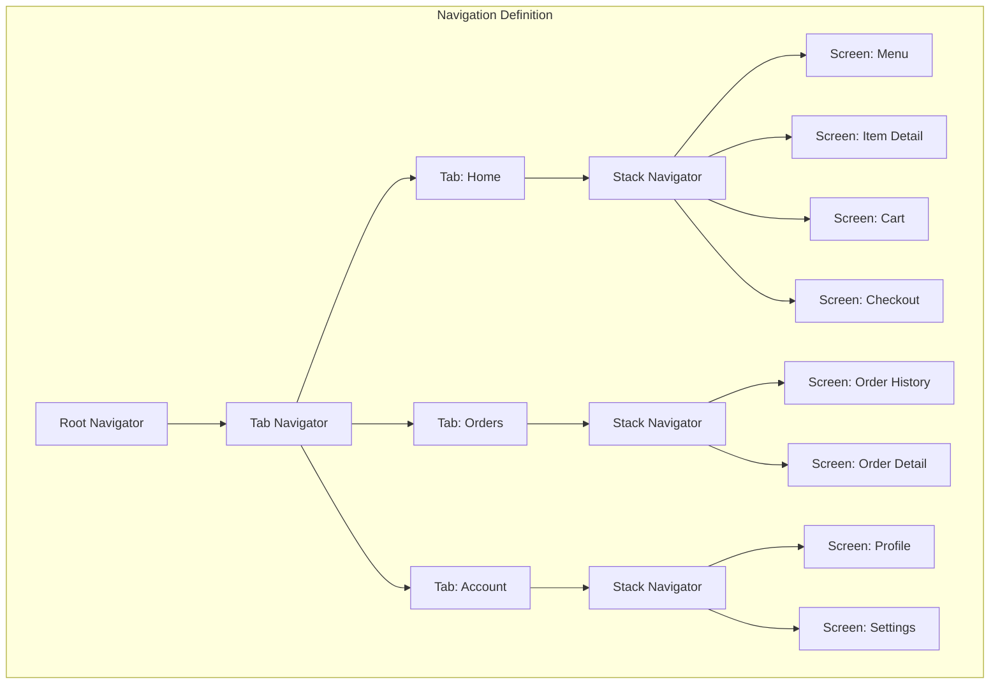
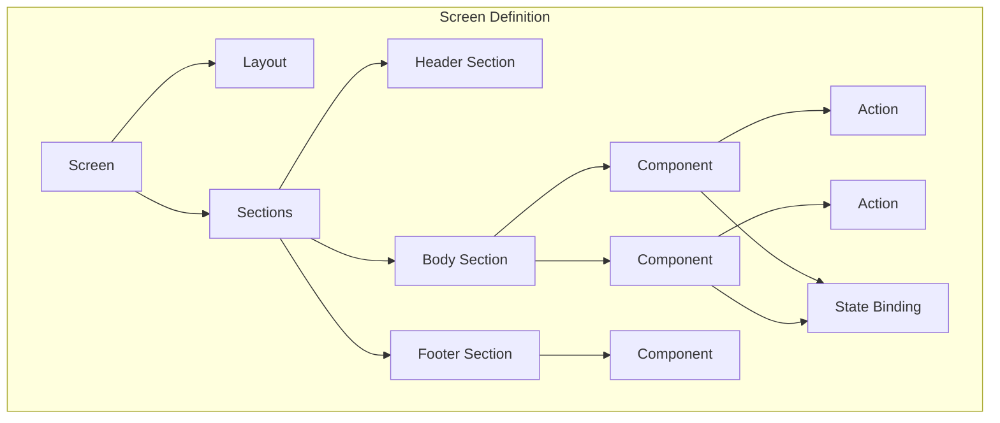
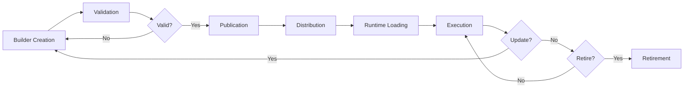
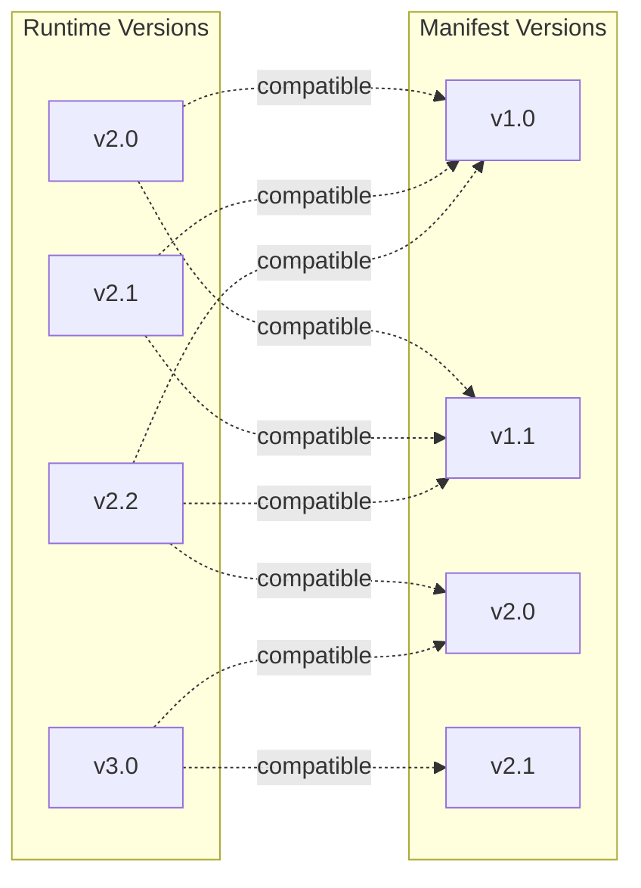

# KB-009 — Manifest Specification

**DUKADESK Core Runtime — Manifest Specification**

| Metadata | Value |
|----------|-------|
| KB-ID | KB-009 |
| Title | Manifest Specification |
| Version | 0.1.0 |
| Status | Drafting |
| Owner | Runtime Architecture |
| Depends On | KB-005, KB-006, KB-007 |
| Required By | KB-010, KB-011, KB-014, KB-019, all Runtime specifications |
| Review Status | Not Reviewed |
| Last Updated | 2026-07-10 |

---

## 1. Purpose

The Manifest is the canonical configuration artifact of the DUKADESK platform. It is the authoritative declaration of a Desk's identity, configuration, capabilities, navigation, screens, themes, permissions, integrations, runtime behavior, environments, assets, and metadata.

Every Desk has exactly one active Manifest at any point in time. The Runtime consumes the Manifest to initialize and execute a Desk consistently across Mobile, Web, Dashboard, Builder Preview, and future renderers. Without a Manifest, no Desk can run.

The Manifest is the single source of truth for Desk configuration. It is:

- **Generated** by the Builder Studio from visual compositions.
- **Validated** before publication against platform schema and business rules.
- **Immutable** once published — every change produces a new version.
- **Consumed** by the Runtime at Desk initialization and on configuration change.
- **Cacheable** by surfaces for offline operation.

This document defines the Manifest conceptually. It specifies the logical structure, sections, responsibilities, validation rules, lifecycle, versioning, and security requirements — independent of any specific serialization format or implementation technology.

---

## 2. Manifest Philosophy

The Manifest is designed according to the following principles, derived from the Platform Philosophy (KB-003).

### 2.1 Declarative Configuration

The Manifest declares what a Desk is and how it behaves. It does not specify how the Runtime implements that behavior. The Manifest describes screens, capabilities, navigation, and themes — it does not contain rendering logic, business rules, or imperative code.

**Rationale:** Declarative configuration separates concerns. The Builder authors the "what." The Runtime implements the "how." Either can evolve independently.

### 2.2 Immutable Versioned Releases

Every published Manifest is immutable. Once a Manifest is published, its contents never change. Updates produce a new Manifest version, not a modification of the existing one. Immutability ensures deterministic behavior, reliable rollbacks, and auditable change history.

**Rationale:** Mutable configuration creates uncertainty. An in-flight request may see half-applied changes. Rollbacks require remembering previous state. Immutable versioned releases eliminate these problems.

### 2.3 Environment Independence

A single Manifest version may be deployed to multiple environments (development, staging, production) without modification. Environment-specific configuration is provided through environment overlays that are applied at deployment time, not baked into the Manifest.

**Rationale:** The same Manifest that passes validation in staging is the same Manifest deployed to production. Environment overlays handle differences in API endpoints, feature flags, and logging levels without requiring separate builds.

### 2.4 Runtime Consumption

The Manifest is authored for the Runtime. Every section of the Manifest corresponds to a Runtime subsystem that consumes it. A section that no subsystem consumes should not exist. This principle ensures that the Manifest remains tightly coupled to the platform's actual execution model.

**Rationale:** Configuration that nobody reads is dead configuration. Each Manifest section must justify its existence by being consumed by at least one Runtime subsystem.

### 2.5 Builder Generation

The Manifest is primarily generated by the Builder Studio, not written by hand. The Builder provides visual tooling for every section of the Manifest. While the Manifest can be inspected and may be authored directly by advanced users, the canonical creation path is through the Builder.

**Rationale:** The Manifest is a machine-readable artifact optimized for Runtime consumption, not human authoring. The Builder provides the human interface. Direct Manifest editing should be rare and governed.

### 2.6 Validation Before Execution

Every Manifest is validated before it is accepted for publication. Validation checks structural integrity, version compatibility, capability dependency resolution, identifier uniqueness, route validity, and schema conformance. A Manifest that fails validation is rejected before any Runtime ever sees it.

**Rationale:** Runtime validation of invalid configuration produces confusing errors. Publication-time validation catches errors before they affect live Desks.

### 2.7 Backward Compatibility

Manifest schema evolution must maintain backward compatibility. A Runtime version that supports a given Manifest schema version must continue to support Manifests published at that version forever. Breaking changes to the Manifest schema require a new schema version that the Runtime can negotiate at load time.

**Rationale:** Tenants publish Manifests and expect them to continue working. A forced migration because of schema changes erodes trust and creates operational burden.

---

## 3. Manifest Structure

A Manifest is composed of the following logical sections. Each section corresponds to a specific domain of Desk configuration and is consumed by a specific Runtime subsystem.

```mermaid
graph TB
    subgraph "Manifest"
        direction TB
        Metadata
        Identity
        Capabilities
        Navigation
        Screens
        Theme
        Runtime
        Environment
        Assets
        Permissions
        Localization
        Integrations
        Extensions
        FeatureFlags
        Security
        Analytics
    end

    subgraph "Runtime Subsystems"
        direction TB
        RuntimeEngine[Runtime Engine]
        CapabilitySystem[Capability System]
        NavigationEngine[Navigation Engine]
        Renderer[Renderer]
        ThemeEngine[Theme Engine]
        AssetSystem[Asset System]
        SecurityGate[Security Gate]
        OfflineEngine[Offline Engine]
    end

    Metadata --> RuntimeEngine
    Identity --> RuntimeEngine
    Capabilities --> CapabilitySystem
    Navigation --> NavigationEngine
    Screens --> Renderer
    Theme --> ThemeEngine
    Runtime --> RuntimeEngine
    Environment --> RuntimeEngine
    Assets --> AssetSystem
    Permissions --> SecurityGate
    Localization --> Renderer
    Integrations --> RuntimeEngine
    Extensions --> CapabilitySystem
    FeatureFlags --> RuntimeEngine
    Security --> SecurityGate
    Analytics --> RuntimeEngine
```

### 3.1 Section Overview

| Section | Purpose | Consumer |
|---------|---------|----------|
| **Metadata** | Desk identity, versioning, authorship, compatibility | Runtime Engine |
| **Identity** | Tenant association, branding identifiers, platform context | Runtime Engine |
| **Capabilities** | Declared capabilities with configuration and dependencies | Capability System |
| **Navigation** | Route structure, tabs, stacks, deep links, guards | Navigation Engine |
| **Screens** | Screen definitions with layouts, sections, components, actions | Renderer |
| **Theme** | Visual identity — colors, typography, spacing, icons, branding | Theme Engine |
| **Runtime** | Runtime behavior settings — caching, offline, logging, safe mode | Runtime Engine |
| **Environment** | Environment-specific overrides for endpoints, features, settings | Runtime Engine |
| **Assets** | Referenced assets — images, icons, fonts, documents | Asset System |
| **Permissions** | Permission requirements for capabilities and screens | Security Gate |
| **Localization** | Locale-specific content, translations, regional settings | Renderer |
| **Integrations** | External service connections and API configurations | Runtime Engine |
| **Extensions** | Third-party extension registrations and configurations | Capability System |
| **Feature Flags** | Conditional feature toggles | Runtime Engine |
| **Security** | Content Security Policy, trusted origins, signing info | Security Gate |
| **Analytics** | Analytics configuration, tracking preferences | Runtime Engine |

### 3.2 Serialization Format

This specification defines the Manifest logically. The canonical serialization format is JSON, but the specification is designed to be format-agnostic. Any serialization format that can represent the logical structure — JSON, YAML, Protocol Buffers, CBOR — is acceptable as long as it preserves the semantics defined in this document.

Future serialization formats may be adopted without changing the Manifest specification.

---

## 4. Manifest Metadata

The Metadata section identifies the Desk and provides versioning, authorship, and compatibility information.

### 4.1 Fields

| Field | Type | Required | Description |
|-------|------|----------|-------------|
| `deskId` | Identifier | Yes | Globally unique identifier for the Desk |
| `name` | String | Yes | Machine-readable name (kebab-case) |
| `displayName` | String | Yes | Human-readable name |
| `description` | String | No | Brief description of the Desk's purpose |
| `version` | String | Yes | Semantic version of the Manifest |
| `buildNumber` | Integer | Yes | Monotonically increasing build number |
| `author` | String | No | Author or creating entity |
| `organizationId` | Identifier | Yes | Owning organization |
| `tenantId` | Identifier | Yes | Owning tenant |
| `publishedDate` | DateTime | Yes | ISO 8601 publication timestamp |
| `compatibility` | Object | Yes | Runtime version compatibility declaration |
| `runtimeVersion` | String | Yes | Target Runtime version this Manifest was built for |
| `minimumPlatformVersion` | String | No | Minimum surface platform version required |
| `schemaVersion` | String | Yes | Manifest schema version for compatibility negotiation |
| `tags` | String[] | No | Arbitrary categorization tags |
| `previousVersion` | String | No | Link to previous Manifest version (for chaining) |

### 4.2 Compatibility Declaration

The `compatibility` object declares which Runtime versions this Manifest supports:

| Field | Type | Required | Description |
|-------|------|----------|-------------|
| `minRuntimeVersion` | String | Yes | Minimum Runtime version required |
| `maxRuntimeVersion` | String | No | Maximum Runtime version supported (optional) |
| `testedRuntimeVersions` | String[] | No | Specific versions the Manifest was tested against |
| `deprecated` | Boolean | No | Whether this Manifest version is deprecated |

### 4.3 Identifier Format

Identifiers (`deskId`, `organizationId`, `tenantId`) are globally unique, stable identifiers. They must not be reassigned or reused. The format is opaque to the Manifest specification — implementations may use UUIDs, hash-based identifiers, or platform-assigned IDs.

---

## 5. Capability Declarations

The Capabilities section declares which capabilities the Desk requires, which it supports optionally, and how each capability is configured.

### 5.1 Structure

Each capability declaration includes:

| Field | Type | Required | Description |
|-------|------|----------|-------------|
| `capabilityId` | Identifier | Yes | Unique identifier for the capability |
| `type` | Enum | Yes | `required` or `optional` |
| `version` | String | Yes | Capability version requirement |
| `configuration` | Object | No | Capability-specific configuration |
| `dependencies` | Identifier[] | No | Other capabilities this depends on |
| `permissions` | String[] | No | Permissions required by this capability |
| `entry` | String | No | Initial screen or route for this capability |
| `enabled` | Boolean | No | Whether the capability is currently enabled |

### 5.2 Required vs Optional Capabilities

| Type | Behavior |
|------|----------|
| **Required** | The Desk cannot initialize without this capability. If the capability is unavailable or fails to load, the Desk enters safe mode. |
| **Optional** | The Desk will operate without this capability. Features gated by optional capabilities are hidden when the capability is unavailable. |

### 5.3 Capability Dependencies

Capabilities may declare dependencies on other capabilities. The Capability System resolves these dependencies at load time and enforces that all transitive dependencies are satisfied. Circular dependencies are rejected during validation.

### 5.4 Capability Configuration

Each capability may accept configuration specific to its domain. The schema for capability configuration is defined by the capability itself, not by the Manifest specification. The Manifest carries the configuration as an opaque object whose structure is validated by the capability at load time.

### 5.5 Capability Permissions

Capabilities declare the permissions they require. The Runtime must verify that the deploying user has granted these permissions before the capability is activated. Permission requirements are additive — a capability may require multiple permissions, and those permissions may differ between runtime environments.

---

## 6. Navigation Declaration

The Navigation section describes how users move through the Desk — the structure of routes, tabs, stacks, drawers, deep links, and navigation guards.

### 6.1 Navigation Structure

### 6.2 Navigator Types

| Navigator | Purpose |
|-----------|---------|
| **Tab** | Bottom or top tab navigation for top-level sections |
| **Stack** | Push/pop navigation for hierarchical screens |
| **Drawer** | Side drawer navigation for secondary navigation |
| **Modal** | Modal presentation for overlays and forms |
| **Custom** | Custom navigator for specialized patterns |

### 6.3 Route Definitions

Each route includes:

| Field | Type | Required | Description |
|-------|------|----------|-------------|
| `routeId` | Identifier | Yes | Unique route identifier |
| `screenId` | Identifier | Yes | Screen to render at this route |
| `path` | String | No | URL path pattern (for deep linking) |
| `title` | String | No | Display title for navigation UI |
| `icon` | AssetRef | No | Icon for tab/drawer navigation |
| `guards` | Guard[] | No | Navigation guards to check before entering |
| `children` | Route[] | No | Child routes (for nested navigators) |
| `params` | Object | No | Static parameters to pass to the screen |
| `visibility` | String | No | Visibility rule expression |
| `initial` | Boolean | No | Whether this is the initial route |

### 6.4 Deep Links

Deep links map external URL patterns to routes:

| Field | Type | Required | Description |
|-------|------|----------|-------------|
| `pattern` | String | Yes | URL pattern (e.g., `/menu/:itemId`) |
| `routeId` | Identifier | Yes | Target route |
| `params` | Object | No | Parameter mapping from URL to route params |

### 6.5 Navigation Guards

Guards are conditions that must be satisfied before navigation proceeds:

| Field | Type | Required | Description |
|-------|------|----------|-------------|
| `type` | Enum | Yes | `auth`, `permission`, `capability`, `custom` |
| `config` | Object | No | Guard-specific configuration |
| `failureAction` | Enum | No | Behavior on guard failure: `redirect`, `block`, `fallback` |
| `failureTarget` | String | No | Redirect target for guard failure |

---

## 7. Screen Definitions

The Screens section defines every screen in the Desk. Each screen is a complete description of what the user sees and how they interact with it.

### 7.1 Screen Structure

### 7.2 Screen Fields

| Field | Type | Required | Description |
|-------|------|----------|-------------|
| `screenId` | Identifier | Yes | Unique screen identifier |
| `name` | String | Yes | Machine-readable name |
| `displayName` | String | No | Human-readable screen name |
| `description` | String | No | Screen purpose description |
| `layout` | Layout | Yes | Screen layout definition |
| `sections` | Section[] | Yes | Screen content sections |
| `actions` | Action[] | No | Global actions available on this screen |
| `state` | StateBinding[] | No | State bindings for dynamic content |
| `visibility` | String | No | Visibility rule expression |
| `permissions` | String[] | No | Permissions required to access this screen |
| `cache` | CachePolicy | No | Screen-level caching behavior |
| `meta` | Object | No | Arbitrary metadata for custom use |

### 7.3 Layout Definition

| Field | Type | Required | Description |
|-------|------|----------|-------------|
| `type` | Enum | Yes | Layout type: `single`, `split`, `tabs`, `scroll`, `grid`, `custom` |
| `orientation` | Enum | No | `vertical`, `horizontal` (default: vertical) |
| `padding` | Spacing | No | Screen-level padding |
| `maxWidth` | String | No | Maximum content width for responsive layouts |
| `background` | Color | No | Screen background color |

### 7.4 Section Definition

| Field | Type | Required | Description |
|-------|------|----------|-------------|
| `sectionId` | Identifier | Yes | Unique section identifier |
| `type` | Enum | Yes | Section type: `header`, `body`, `footer`, `sidebar`, `form`, `list`, `grid`, `card`, `custom` |
| `components` | Component[] | Yes | Components in this section |
| `layout` | Layout | No | Section-level layout override |
| `visibility` | String | No | Visibility rule expression |
| `style` | Style | No | Section style overrides |

### 7.5 Component Definition

| Field | Type | Required | Description |
|-------|------|----------|-------------|
| `componentId` | Identifier | Yes | Unique component instance identifier |
| `type` | String | Yes | Component type (registered in Component Registry) |
| `key` | String | Yes | Component key for state binding and identity |
| `props` | Object | No | Component-specific props |
| `actions` | Object | No | Named actions keyed by trigger event |
| `children` | Component[] | No | Nested components |
| `visibility` | String | No | Visibility rule expression |
| `style` | Style | No | Component style overrides |
| `state` | StateBinding[] | No | Component state bindings |

### 7.6 Action Definition

| Field | Type | Required | Description |
|-------|------|----------|-------------|
| `actionId` | Identifier | No | Unique action identifier |
| `trigger` | String | Yes | Trigger event: `onPress`, `onLongPress`, `onChange`, `onSubmit`, `onFocus`, `onSwipe`, `custom` |
| `type` | String | Yes | Action type (registered in Action Engine) |
| `payload` | Object | No | Static action payload |
| `params` | Object | No | Dynamic param bindings from component state |
| `confirmation` | Confirmation | No | Confirmation dialog before execution |
| `conditions` | Condition[] | No | Conditions that must be true for execution |

### 7.7 State Binding

| Field | Type | Required | Description |
|-------|------|----------|-------------|
| `source` | String | Yes | State source: `local`, `session`, `tenant`, `runtime`, `capability` |
| `key` | String | Yes | State key to bind |
| `target` | String | Yes | Target prop or field to receive the value |
| `transform` | String | No | Transformation expression to apply |
| `default` | Any | No | Default value when state is unavailable |

### 7.8 Visibility Rule Expression

Visibility rules are boolean expressions that determine whether a screen, section, or component is rendered. The expression syntax supports:

- `$capability.{id}` — capability is enabled
- `$permission.{name}` — user has permission
- `$feature.{flag}` — feature flag is enabled
- `$auth` — user is authenticated
- `$role.{name}` — user has role
- `$param.{name}` — route parameter value
- `$state.{path}` — runtime state value
- Logical operators: `and`, `or`, `not`

---

## 8. Theme Configuration

The Theme section defines the complete visual identity of the Desk.

### 8.1 Theme Fields

| Field | Type | Required | Description |
|-------|------|----------|-------------|
| `themeId` | Identifier | Yes | Unique theme identifier |
| `name` | String | Yes | Theme name |
| `version` | String | Yes | Theme version |
| `colors` | ColorPalette | Yes | Color definitions |
| `typography` | Typography | Yes | Font and text style definitions |
| `spacing` | SpacingScale | Yes | Spacing and sizing scale |
| `icons` | IconSet | No | Icon set configuration |
| `shapes` | ShapeDefinitions | No | Border radius, shadow definitions |
| `componentOverrides` | Object | No | Per-component style overrides |
| `darkMode` | ThemeVariant | No | Dark mode variant |
| `accessibility` | AccessibilityConfig | No | Accessibility settings |

### 8.2 Color Palette

| Field | Type | Required | Description |
|-------|------|----------|-------------|
| `primary` | Color | Yes | Primary brand color |
| `secondary` | Color | No | Secondary brand color |
| `accent` | Color | No | Accent color for highlights |
| `background` | Color | Yes | Default background color |
| `surface` | Color | Yes | Surface/card background color |
| `text` | Color | Yes | Default text color |
| `textSecondary` | Color | No | Secondary text color |
| `error` | Color | Yes | Error/alert color |
| `success` | Color | Yes | Success/confirmation color |
| `warning` | Color | Yes | Warning color |
| `border` | Color | No | Default border color |
| `disabled` | Color | No | Disabled state color |
| `custom` | Object | No | Custom color tokens |

### 8.3 Typography

| Field | Type | Required | Description |
|-------|------|----------|-------------|
| `fontFamily` | String | Yes | Primary font family |
| `fontFamilySecondary` | String | No | Secondary font family |
| `sizes` | Object | Yes | Font size scale (xs, sm, md, lg, xl, xxl, display) |
| `weights` | Object | No | Font weight definitions (regular, medium, bold) |
| `lineHeights` | Object | No | Line height scale |
| `letterSpacing` | Object | No | Letter spacing scale |

---

## 9. Runtime Configuration

The Runtime section defines how the Runtime should behave when executing this Desk.

### 9.1 Runtime Fields

| Field | Type | Required | Description |
|-------|------|----------|-------------|
| `startupBehavior` | StartupConfig | No | Startup screen, loading experience |
| `cachePolicies` | CacheConfig | No | Caching behavior for screens, data, assets |
| `offlineBehavior` | OfflineConfig | No | Offline mode behavior |
| `synchronization` | SyncConfig | No | Data synchronization policy |
| `logging` | LogConfig | No | Logging level and verbosity |
| `diagnostics` | DiagConfig | No | Diagnostic data collection |
| `safeMode` | SafeModeConfig | No | Safe mode behavior on errors |
| `session` | SessionConfig | No | Session timeout and management |
| `performance` | PerfConfig | No | Performance budgets and thresholds |

### 9.2 Cache Configuration

| Field | Type | Required | Description |
|-------|------|----------|-------------|
| `screenCacheTTL` | Duration | No | How long screen definitions are cached |
| `assetCacheTTL` | Duration | No | How long assets are cached |
| `dataCacheTTL` | Duration | No | How long API data is cached |
| `maxCacheSize` | Integer | No | Maximum cache size in bytes |
| `staleWhileRevalidate` | Boolean | No | Serve stale cache while fetching fresh data |

### 9.3 Offline Configuration

| Field | Type | Required | Description |
|-------|------|----------|-------------|
| `enabled` | Boolean | Yes | Whether offline mode is supported |
| `gracefulDegradation` | Boolean | No | Whether to reduce functionality when offline |
| `syncOnReconnect` | Boolean | Yes | Whether to sync data when connection restored |
| `conflictStrategy` | Enum | No | Conflict resolution: `lastWriteWins`, `serverWins`, `clientWins`, `manual` |
| `queueSize` | Integer | No | Maximum offline action queue size |
| `offlineScreens` | String[] | No | Screens available offline (by screenId) |

### 9.4 Safe Mode Configuration

| Field | Type | Required | Description |
|-------|------|----------|-------------|
| `enabled` | Boolean | Yes | Whether safe mode is enabled |
| `fallbackScreen` | String | Yes | Screen to show when in safe mode |
| `maxRetries` | Integer | No | Automatic retry attempts before entering safe mode |
| `diagnosticCollection` | Boolean | No | Collect diagnostics when entering safe mode |

---

## 10. Environment Configuration

The Environment section defines environment-specific overrides. The base Manifest contains default values. Environment overlays override specific fields for specific environments.

### 10.1 Environment Overlay Structure

Each environment overlay may override any field in the Manifest:

| Field | Type | Required | Description |
|-------|------|----------|-------------|
| `environment` | Enum | Yes | Target environment: `development`, `preview`, `staging`, `production`, or custom |
| `overrides` | Object | Yes | Partial Manifest overrides (deep merge) |
| `variables` | Object | No | Environment-specific variable values |
| `apiEndpoints` | Object | No | Environment-specific API base URLs |
| `featureOverrides` | Object | No | Environment-specific feature flag overrides |

### 10.2 Environment Variables

Environment variables are referenced in Manifest fields using interpolation syntax. The variable values are resolved at deployment time based on the target environment.

### 10.3 Deployment Resolution

When a Manifest is deployed to an environment:

1. The base Manifest is loaded.
2. The environment overlay for the target environment is applied (deep merge).
3. Environment variables are resolved.
4. The resolved Manifest is validated.
5. The resolved Manifest is distributed to Runtime nodes.

---

## 11. Validation Rules

Every Manifest must pass validation before publication. Validation occurs at multiple stages:

### 11.1 Structural Validation

| Rule | Description |
|------|-------------|
| Required sections present | All required Manifest sections exist |
| Valid identifiers | All identifiers meet format requirements |
| No duplicate identifiers | No two sections, screens, components, or routes share the same identifier |
| Valid references | All internal references (screenId, routeId, capabilityId) point to existing definitions |
| Schema conformance | All fields match their expected types and constraints |

### 11.2 Semantic Validation

| Rule | Description |
|------|-------------|
| Version compatibility | Manifest schema version is compatible with target Runtime version |
| Capability dependencies | All declared capability dependencies are satisfiable |
| No circular references | Capability dependencies, navigation routes, and component references contain no cycles |
| Route validity | All routes reference existing screens |
| Deep link validity | All deep link patterns map to valid routes |
| Guard validity | All guard targets reference existing routes |
| Permission consistency | All permissions referenced in capability declarations exist in permissions section |

### 11.3 Environment Validation

| Rule | Description |
|------|-------------|
| Environment overlay validity | Environment overrides reference valid Manifest paths |
| Variable resolution | All environment variables referenced in the Manifest have values in the target environment |
| Endpoint validity | API endpoint URLs are well-formed |

### 11.4 Security Validation

| Rule | Description |
|------|-------------|
| Manifest integrity | If signed, signature is valid and matches trusted publisher |
| Permission boundaries | Capability permissions do not exceed the publisher's granted permissions |
| Trusted sources | External asset URLs reference trusted origins |

---

## 12. Manifest Lifecycle

### 12.1 Builder Creation

The Manifest is created through the Builder Studio. The Builder provides visual tooling for every section. As the author configures capabilities, designs screens, chooses themes, and configures settings, the Builder constructs the Manifest in memory. The Manifest does not exist as a standalone artifact until publication.

### 12.2 Validation

Before publication, the Manifest undergoes structural, semantic, environment, and security validation. Validation failures are reported back to the Builder with specific guidance on what needs to be corrected. A Manifest cannot be published with unresolved validation errors.

### 12.3 Publication

Publication creates an immutable snapshot of the Manifest. The published Manifest is assigned a unique version identifier, timestamped, and optionally signed. The publication record links to the previous version for audit trail and rollback support.

### 12.4 Distribution

The published Manifest is distributed to Runtime nodes through the Publication Pipeline (KB-019). Distribution may be immediate (for preview environments) or gradual (for production environments with rollback capability).

### 12.5 Runtime Loading

When a Runtime node receives a new Manifest version, it:

1. Verifies the Manifest integrity (signature, checksum).
2. Validates compatibility with the Runtime version.
3. Loads the capability definitions referenced in the Manifest.
4. Resolves capability dependencies.
5. Initializes each capability with its configuration.
6. Registers screens, routes, and components.
7. Applies the Theme.
8. Initializes the navigation structure.
9. Signals readiness for execution.

### 12.6 Execution

The Desk is now live. The Runtime renders screens from the Manifest, executes actions, manages state, and handles offline behavior according to the Manifest's runtime configuration. The Manifest is cached locally for offline operation.

### 12.7 Update

When a new Manifest version is published, the Runtime detects the update (through polling or push notification) and initiates a hot reload or graceful restart depending on the update type:

| Update Type | Behavior |
|-------------|----------|
| **Non-breaking** | Hot reload — screens, themes, and configuration update without disrupting the user |
| **Breaking** | Graceful restart — user is notified and the Desk reinitializes |
| **Emergency** | Immediate reload — used for critical security or functionality fixes |

### 12.8 Retirement

When a Manifest version is superseded by a newer version and the rollback window has expired, the older version may be retired. Retired versions are archived and are no longer loadable by the Runtime. Retirement does not delete the Manifest record — it remains in the audit trail.

---

## 13. Versioning Strategy

### 13.1 Semantic Versioning

Manifest versions follow semantic versioning format: `MAJOR.MINOR.PATCH`.

| Component | Bump When |
|-----------|-----------|
| **MAJOR** | Breaking changes: removed capabilities, incompatible schema changes, navigation restructuring, removed screens |
| **MINOR** | Additive changes: new capabilities, new screens, new routes, theme changes, new configuration options |
| **PATCH** | Fixes: configuration corrections, metadata updates, asset replacements |

### 13.2 Compatibility Model

**Compatibility Rules:**

1. A Runtime may load any Manifest whose MAJOR version is within its supported range.
2. A Runtime must reject any Manifest whose MAJOR version is outside its supported range.
3. MINOR and PATCH versions are forward-compatible within the same MAJOR version.
4. Breaking changes must increment the MAJOR version.
5. The Runtime declares which MAJOR Manifest versions it supports at startup.

### 13.3 Rollback

The platform maintains a configurable rollback window — a number of previous Manifest versions that remain fully deployable. Within the rollback window, reverting to a previous version is a standard deployment operation. Outside the rollback window, restoration requires data migration and manual verification.

### 13.4 Migration

When a MAJOR version change is required:

1. The platform publishes a migration guide.
2. The Builder Studio provides migration tooling where possible.
3. The validation system checks for deprecated features and provides upgrade guidance.
4. The Runtime supports a transition period where both MAJOR versions can coexist.

---

## 14. Security Considerations

### 14.1 Manifest Signing

Published Manifests may be digitally signed by the publisher. Signing provides:

- **Integrity:** Detects unauthorized modification after publication.
- **Authentication:** Verifies the identity of the publisher.
- **Non-Repudiation:** The publisher cannot deny having published the Manifest.

The Runtime must verify the signature before loading a Manifest. Manifests with invalid or missing signatures may be rejected based on configured policy.

### 14.2 Integrity Verification

Each published Manifest carries a checksum over its content. The Runtime verifies the checksum after receiving the Manifest and before loading it. Checksum verification catches transmission errors and storage corruption.

### 14.3 Trusted Sources

The Runtime must only load Manifests from trusted sources — the platform's Publication Pipeline or a verified local cache. Manifests from untrusted sources (arbitrary URLs, user-provided files) must be rejected or require explicit administrative override.

### 14.4 Sensitive Configuration

The Manifest must not contain secrets — API keys, passwords, tokens, or private keys. Sensitive configuration is provided through environment-specific secret stores and injected at deployment time. The Manifest may reference secrets by identifier but must never contain their values.

### 14.5 Permission Validation

Before activating a capability, the Runtime must validate that the publisher has the authority to grant the permissions the capability requires. A capability that declares permissions the publisher does not hold must not be activated.

### 14.6 Content Security Policy

The Manifest may declare a Content Security Policy for web-based surfaces. The policy restricts which origins can be loaded, which scripts can execute, and which resources can be embedded.

---

## 15. Future Evolution

The Manifest specification is designed to evolve without breaking existing Desks.

### 15.1 Adding New Sections

New sections may be added in any MINOR version increment. The Runtime ignores sections it does not recognize. A Manifest with an unknown section remains valid and loadable.

**Constraint:** New sections must not change the interpretation of existing sections.

### 15.2 Adding New Fields

New fields may be added to existing sections in any MINOR or PATCH version. The Runtime must ignore unknown fields. The Builder must preserve fields it does not natively support.

**Constraint:** New fields must have safe defaults that preserve backward-compatible behavior.

### 15.3 Deprecating Fields

Fields may be deprecated but must not be removed in the same MAJOR version in which they were introduced. Deprecated fields trigger a warning during validation but do not prevent publication.

### 15.4 Breaking Changes

Breaking changes require a MAJOR version increment and must be accompanied by:

1. A migration guide for existing Desks.
2. Builder tooling to assist with migration where possible.
3. A transition period where the previous MAJOR version is still supported.
4. An ADR documenting the rationale for the breaking change.

### 15.5 Schema Version Negotiation

The Runtime and Manifest negotiate compatibility through the `schemaVersion` and `compatibility` fields. A Runtime that does not support a Manifest's `schemaVersion` must reject the Manifest with a clear error message indicating the required Runtime version.

---

## 16. Relationship to Other Documents

| Document | Relationship |
|----------|-------------|
| **KB-005 (Platform Overview)** | The Manifest is the configuration artifact that the Platform Overview describes as the source of Desk identity |
| **KB-006 (System Architecture)** | The Manifest is consumed by the Runtime Domain described in System Architecture |
| **KB-007 (Service Boundaries)** | The Manifest defines which capabilities from which services a Desk uses |
| **KB-010 (Capability System)** | The Capability Declarations section of the Manifest is consumed by the Capability System |
| **KB-012 (Component Registry)** | Component types referenced in the Manifest are resolved through the Component Registry |
| **KB-013 (Component Model)** | Components defined in the Manifest conform to the Component Model |
| **KB-014 (Layout System)** | Screen layouts in the Manifest are resolved by the Layout System |
| **KB-015 (Action Engine)** | Actions defined in the Manifest are executed by the Action Engine |
| **KB-016 (Navigation Engine)** | Navigation declarations in the Manifest are interpreted by the Navigation Engine |
| **KB-017 (Theme Engine)** | Theme configuration in the Manifest is applied by the Theme Engine |
| **KB-018 (State Management)** | State bindings in the Manifest are managed by the State Management subsystem |
| **KB-019 (Event Bus)** | Events declared in the Manifest flow through the Event Bus |
| **KB-020 (Offline & Synchronization)** | Offline configuration in the Manifest determines offline behavior |
| **KB-031 (Publishing Pipeline)** | The Publishing Pipeline distributes published Manifests to Runtime nodes |
| **Builder Specification** | The Builder generates Manifests from visual compositions |
| **Runtime Specification** | The Runtime consumes and executes Manifests |

---

## 17. Review Checklist

- [ ] Metadata header: KB-ID, Version, Status, Owner, Review Status, Last Updated, Depends On, Required By
- [ ] Purpose explains why the Manifest exists and why it is the single source of truth
- [ ] Manifest Philosophy defines guiding principles
- [ ] Manifest Structure section documents every logical section
- [ ] Metadata section defines all identity and versioning fields
- [ ] Capability Declarations explains required, optional, dependencies, permissions
- [ ] Navigation Declaration describes navigators, routes, deep links, guards
- [ ] Screen Definitions cover layout, sections, components, actions, state bindings
- [ ] Theme Configuration covers colors, typography, spacing, dark mode
- [ ] Runtime Configuration covers caching, offline, safe mode, logging
- [ ] Environment Configuration defines environment overlay mechanism
- [ ] Validation Rules cover structural, semantic, environment, and security validation
- [ ] Manifest Lifecycle covers creation through retirement
- [ ] Versioning Strategy follows semantic versioning with compatibility model
- [ ] Security Considerations covers signing, integrity, trusted sources
- [ ] Future Evolution defines how new sections and fields are added
- [ ] Relationship to other documents is clearly explained
- [ ] Mermaid diagrams illustrate Manifest structure, loading flow, lifecycle, versioning
- [ ] No technology-specific serialization assumptions
- [ ] All cross-references use canonical IDs

---

## 18. Revision History

| Version | Date | Author | Change |
|---------|------|--------|--------|
| 0.1.0 | 2026-07-10 | Architecture | Initial Manifest specification |

---

*KB-009 (Manifest Specification) — The canonical definition of the DUKADESK Manifest, the single source of truth for every Desk's configuration. The Runtime consumes it. The Builder generates it. Every subsystem references it.*
