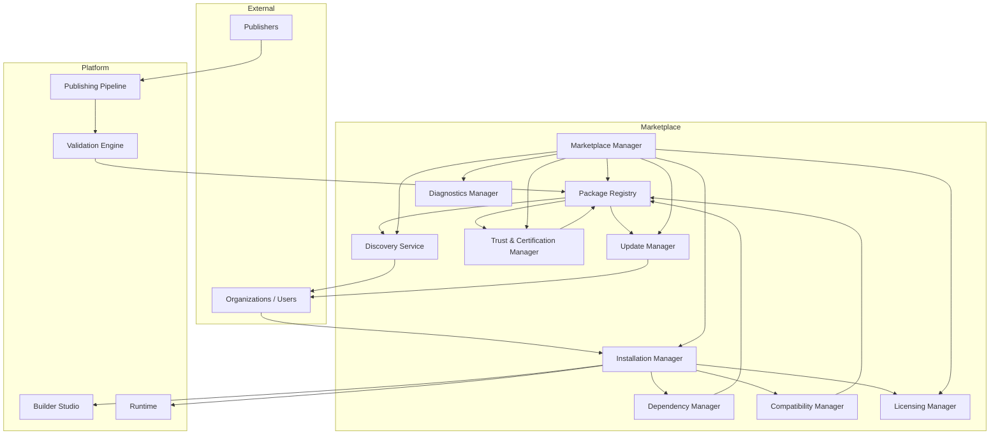

# Marketplace Architecture

**KB-032 — Marketplace Architecture Specification**

| Metadata | |
|----------|---|
| **KB ID** | KB-032 |
| **Title** | Marketplace Architecture |
| **Version** | 0.1.0 |
| **Status** | Drafting |
| **Owner** | Architecture Team |
| **Dependencies** | KB-022 Builder Studio Architecture, KB-030 Validation Engine, KB-031 Publishing Pipeline, KB-008 Runtime Overview |
| **Related Documents** | Publishing Pipeline (KB-031), Validation Engine (KB-030), Builder Studio (KB-022), Runtime Overview (KB-008), Component Registry (KB-012), Capability System (KB-010), Manifest Specification (KB-009), Package & Artifact Specification (KB-033), Extension & Plugin Framework (KB-034), Marketplace Certification & Trust (KB-039), Marketplace Distribution & Lifecycle (KB-040) |
| **Review Status** | Pending |
| **Last Updated** | 2026-07-10 |

### Revision History

| Version | Date | Author | Change |
|---------|------|--------|--------|
| 0.1.0 | 2026-07-10 | AI Architecture Agent | Initial draft |

---

## 1. Purpose

The Marketplace is the platform subsystem responsible for discovering, publishing, certifying, distributing, installing, updating, versioning, licensing, governing, and retiring reusable platform artifacts across the DUKADESK ecosystem. It is the authoritative distribution ecosystem for all reusable platform assets.

The Marketplace exists because reuse is fundamental to platform productivity. Without a central distribution system, every organization reinvents the same capabilities, components, themes, and workflows. Duplication wastes engineering effort, creates maintenance burden, and fragments the platform experience. The Marketplace makes reuse systematic by providing a trusted, versioned, discoverable catalog of platform artifacts.

Reusable artifacts improve platform productivity by enabling organizations to build on shared foundations rather than starting from scratch. A pre-built Capability for payment processing, a certified Component library for data tables, a branded Theme for healthcare — these assets accelerate development, reduce defects, and ensure consistency across the ecosystem. Without the Marketplace, each organization must build, test, and maintain these assets independently.

Distribution is centralized because decentralized distribution creates trust, compatibility, and security problems. When artifacts are distributed through arbitrary channels — email, file shares, unverified repositories — there is no guarantee of integrity, no version tracking, no dependency resolution, and no vetting for security or platform compatibility. Centralized distribution through the Marketplace ensures every artifact is signed, certified, versioned, and dependency-verified before it reaches any organization.

Certification protects platform quality. Without certification, any publisher could distribute artifacts that violate platform standards, introduce security vulnerabilities, break compatibility with Runtime versions, or degrade performance. Certification establishes a quality bar that all Marketplace artifacts must meet. It protects consumers without requiring them to audit every package themselves.

The Marketplace is part of the platform architecture rather than an external service because distribution is a platform concern, not an afterthought. Package formats, versioning schemes, dependency models, and compatibility contracts must be designed as integral parts of the platform, not bolted on later. The Marketplace is as fundamental to the platform as the Runtime or the Builder. External services can integrate with the Marketplace; they do not replace it.

---

## 2. Marketplace Philosophy

### Reuse Over Duplication

Every artifact in the Marketplace exists to be reused. Organizations should never rebuild what they can discover and install. The Marketplace makes discovery effortless, installation safe, and updates automatic. Duplication is permitted only when organizational policy requires it or when the existing artifact genuinely cannot meet the requirements.

### Secure Distribution

All Marketplace artifacts are distributed through signed, integrity-verified channels. Package tampering is detectable and rejectable. Publisher identity is verified. Certification status is transparent. Security is not optional — every artifact, regardless of source, undergoes the same integrity and trust verification.

### Certification First

Artifacts enter the Marketplace only after passing certification. Certification validates platform compatibility, security posture, quality standards, and metadata completeness. Certification is not a gate that blocks innovation — it is a quality signal that consumers rely on. Uncertified artifacts may exist in development registries but cannot reach production environments.

### Version-Aware Compatibility

Every artifact declares its compatibility with specific platform versions, Runtime versions, and dependency versions. Compatibility is verified at publish time, checked at install time, and re-validated at update time. Breaking changes require major version bumps and clear migration paths. The Marketplace never silently breaks a consumer's installation.

### Declarative Packages

Marketplace packages are declarative. A package describes what it is, what it depends on, what it provides, and what it requires — never how it implements those things. Declarative packages enable static analysis, compatibility verification, dependency resolution, and safe installation without executing package code.

### Extensibility

The Marketplace itself is extensible. Custom asset types, certification rules, discovery algorithms, and installation workflows can be added through the Extension & Plugin Framework. Organizations can extend the Marketplace for their specific needs without forking the platform.

### Marketplace Neutrality

The Marketplace treats all publishers equally. Certification criteria are published and applied uniformly. No publisher receives preferential treatment in discovery, certification, or distribution. Neutrality ensures that quality, not marketing budget, determines an artifact's success.

### Enterprise Governance

Organizations control which Marketplace artifacts their users can discover, install, and use. Organization catalogs override global discovery. Approval workflows gate installations. Private catalogs enable internal-only distribution. Enterprise governance ensures that Marketplace adoption does not bypass organizational policy.

### AI-Assisted Discovery

AI agents assist users in discovering the right artifacts. Natural language search, capability matching, usage pattern analysis, and compatibility prediction help users find what they need without browsing thousands of packages. AI recommendations are advisory — they never bypass organizational policy or certification requirements.

### Technology Independence

The Marketplace is not tied to any specific technology stack. Package formats, certification rules, and distribution protocols are technology-agnostic. The same Marketplace that distributes mobile components can distribute web themes, backend capability configurations, and AI agent definitions. Technology-specific concerns are handled by platform layers, not by the Marketplace.

---

## 3. Marketplace Responsibilities

### Package Publishing

Accept, validate, certify, and store packages from publishers. Publishing is the entry point for all artifacts entering the Marketplace. The Publishing Pipeline delivers validated packages; the Marketplace certifies and distributes them.

### Package Discovery

Provide search, browse, filter, and recommendation capabilities for discovering packages. Discovery must be fast, relevant, and organization-aware. Users discover packages that match their platform version, compatibility requirements, and organizational policy.

### Package Installation

Deliver packages to target environments — Builder Studio projects, Runtime instances, organization registries. Installation includes dependency resolution, compatibility verification, integrity checking, and license acceptance.

### Version Management

Track every version of every package. Support semantic versioning with major, minor, and patch increments. Maintain version history for audit, rollback, and migration.

### Dependency Resolution

Resolve package dependencies transitively. Detect conflicts, suggest resolutions, and verify that the resolved dependency graph satisfies all compatibility constraints.

### Compatibility Validation

Verify that packages are compatible with target platform versions, Runtime versions, and other installed packages. Compatibility validation runs at publish time, install time, and update time.

### Licensing

Manage license metadata for every package. Support open-source, commercial, subscription, enterprise, and internal-only licenses. Enforce license acceptance during installation.

### Trust Verification

Verify publisher identity, package integrity, and certification status. Trust is a first-class property of every package, not an afterthought.

### Updates

Notify consumers of available updates. Support automatic, scheduled, and manual update workflows. Verify compatibility before applying updates. Support rollback of problematic updates.

### Deprecation

Mark packages as deprecated with clear migration guidance. Deprecated packages continue to function but are hidden from new discovery. Publishers must provide upgrade paths before deprecating.

### Retirement

Remove packages from active distribution after deprecation period expires. Retired packages are archived and retain their metadata for audit. Retired packages cannot be installed but existing installations continue to function.

### Marketplace Analytics

Collect and expose metrics: downloads, installations, active usage, compatibility reports, certification pass/fail rates, publisher activity. Analytics inform both consumers and publishers about package quality and adoption.

### Responsibility Boundaries

| Responsibility | Marketplace | Builder Studio | Publishing Pipeline | Runtime |
|---------------|-------------|----------------|---------------------|---------|
| Package publishing | Certify and store | Generate packages | Deliver to Marketplace | — |
| Package discovery | Search and browse | Display in-workspace | — | — |
| Package installation | Resolve and deliver | Initiate install | — | Register components |
| Version management | Track all versions | Configure version | Assign version | Load versioned packages |
| Dependency resolution | Resolve graph | Declare dependencies | Bundle dependencies | Load resolved deps |
| Compatibility validation | Verify at all stages | Run pre-publish checks | Verify package schema | Verify at load time |
| Licensing | Manage and enforce | Display license info | Include license metadata | — |
| Trust verification | Sign and certify | — | Verify integrity | — |
| Updates | Notify and deliver | Display update UI | — | Hot-reload packages |
| Deprecation | Mark and migrate | Show deprecation warnings | — | — |
| Analytics | Collect metrics | Display usage data | Report publish metrics | Report usage metrics |

---

## 4. Marketplace Architecture

### 4.1 Marketplace Manager

| Aspect | Description |
|--------|-------------|
| **Purpose** | Orchestrate all Marketplace operations — publishing, discovery, installation, updates, deprecation, and retirement. |
| **Responsibilities** | Coordinate module lifecycle, enforce policies, manage workflows, provide unified API. |
| **Inputs** | Publisher actions, consumer requests, system events. |
| **Outputs** | Coordinated Marketplace operations, lifecycle events. |
| **Extension points** | Custom workflows, policy engines, workflow hooks. |

### 4.2 Package Registry

| Aspect | Description |
|--------|-------------|
| **Purpose** | Store and index all published packages across all versions, categories, and certification levels. |
| **Responsibilities** | Store package metadata and artifacts, index for search, maintain version history, enforce retention policies, support queries by publisher, category, version, compatibility, and certification status. |
| **Inputs** | Published packages from certification pipeline. |
| **Outputs** | Package metadata, package artifacts, search results. |
| **Extension points** | Custom storage backends, indexing strategies, metadata extractors. |

### 4.3 Discovery Service

| Aspect | Description |
|--------|-------------|
| **Purpose** | Enable fast, relevant discovery of packages through search, browse, filtering, recommendations, and organization catalogs. |
| **Responsibilities** | Index packages for full-text search, support faceted filtering by category, publisher, compatibility, license, and certification status, generate recommendations based on usage patterns, maintain organization-specific catalogs, support AI-assisted natural language discovery. |
| **Inputs** | Search queries, filter selections, usage data, organization policy. |
| **Outputs** | Search results, recommendations, catalog views. |
| **Extension points** | Custom search backends, recommendation algorithms, catalog providers. |

### 4.4 Dependency Manager

| Aspect | Description |
|--------|-------------|
| **Purpose** | Resolve package dependency graphs, detect conflicts, verify compatibility, and provide resolution strategies. |
| **Responsibilities** | Parse dependency declarations, resolve transitive dependencies, detect version conflicts, detect circular dependencies, suggest resolution strategies, verify compatibility constraints, cache resolved graphs. |
| **Inputs** | Package dependency declarations, compatibility constraints, installed package state. |
| **Outputs** | Resolved dependency graph, conflict reports, resolution suggestions. |
| **Extension points** | Custom resolvers, conflict strategies, compatibility providers. |

### 4.5 Compatibility Manager

| Aspect | Description |
|--------|-------------|
| **Purpose** | Verify and track compatibility between packages, platform versions, Runtime versions, and other installed packages. |
| **Responsibilities** | Validate compatibility declarations at publish time, check compatibility at install time, re-validate at update time, maintain compatibility matrix, detect breaking changes, generate compatibility reports. |
| **Inputs** | Package compatibility declarations, platform version metadata, Runtime version metadata, installed package state. |
| **Outputs** | Compatibility verdicts, compatibility reports, breaking change detections. |
| **Extension points** | Custom compatibility validators, version comparison strategies, platform version providers. |

### 4.6 Trust & Certification Manager

| Aspect | Description |
|--------|-------------|
| **Purpose** | Verify publisher identity, certify packages, manage trust levels, and enforce organization trust policies. |
| **Responsibilities** | Verify publisher identity, run certification checks, assign certification levels, manage trust policies, verify package signatures, audit certification history, revoke certification for problematic packages. |
| **Inputs** | Package artifacts, publisher identity, certification criteria, organization trust policies. |
| **Outputs** | Certification status, trust verdicts, signed packages, certification reports. |
| **Extension points** | Custom certification checks, trust policy providers, external verification services. |

### 4.7 Licensing Manager

| Aspect | Description |
|--------|-------------|
| **Purpose** | Manage license metadata, enforce license acceptance, and support license policy integration. |
| **Responsibilities** | Store license metadata per package version, enforce license acceptance during installation, support open-source, commercial, subscription, enterprise, trial, and internal-only licenses, integrate with organization license policies, generate license reports. |
| **Inputs** | License declarations, acceptance actions, organization license policy. |
| **Outputs** | License acceptance status, license reports, policy enforcement results. |
| **Extension points** | Custom license types, license policy engines, external licensing integrations. |

### 4.8 Installation Manager

| Aspect | Description |
|--------|-------------|
| **Purpose** | Orchestrate package installation into target environments — Builder projects, Runtime instances, organization registries. |
| **Responsibilities** | Resolve dependencies, verify compatibility, check trust, enforce licenses, install package artifacts, register package with target environment, report installation status. |
| **Inputs** | Install requests, target environment state, organization policy. |
| **Outputs** | Installation status, registered package, environment updates. |
| **Extension points** | Custom installers, target environment adapters, post-install hooks. |

### 4.9 Update Manager

| Aspect | Description |
|--------|-------------|
| **Purpose** | Manage package update lifecycle — notification, download, verification, installation, and rollback. |
| **Responsibilities** | Detect available updates, notify consumers, verify update compatibility, download and verify update artifacts, apply updates, support rollback to previous versions, manage update schedules and policies. |
| **Inputs** | Package registry, installed package state, update policies. |
| **Outputs** | Update notifications, applied updates, rollback confirmations. |
| **Extension points** | Custom update strategies, update policy providers, rollback handlers. |

### 4.10 Diagnostics Manager

| Aspect | Description |
|--------|-------------|
| **Purpose** | Collect, store, and expose Marketplace operational metrics, error reports, and health status. |
| **Responsibilities** | Collect publish, install, update, and discovery metrics, track error rates and failure modes, monitor service health, expose diagnostics API, generate operational reports. |
| **Inputs** | Events from all other modules. |
| **Outputs** | Metrics, reports, health status, error logs. |
| **Extension points** | Custom metric collectors, report generators, monitoring integrations. |

### Marketplace Architecture Diagram



---

## 5. Marketplace Asset Types

### Platform Assets

Platform assets are foundational building blocks that affect the visual and structural layer of applications.

**Components** — Reusable UI elements registered in the Component Registry. Components include their schema, property definitions, event contracts, and default configuration. Marketplace components extend the Builder's component palette and the Runtime's rendering capabilities.

**Themes** — Complete visual identity packages containing color palettes, typography scales, spacing systems, shape tokens, icon sets, and component-specific style overrides. Marketplace themes can be applied through the Theme Builder and resolved by the Theme Engine.

**Layouts** — Reusable structural templates that define screen and section arrangements. Layouts include responsive breakpoints, container configurations, and slot definitions. Marketplace layouts accelerate screen composition in the Screen & Layout Builder.

**Templates** — Pre-configured project starting points that combine screens, layouts, components, themes, workflows, and data models into coherent application blueprints. Templates are the fastest path from idea to running Desk.

### Functional Assets

Functional assets define application behavior and business logic.

**Capabilities** — Self-contained functional units that add complete feature sets to a Desk. Capabilities include their own screens, workflows, data models, components, navigation contributions, and configuration interfaces. The Capability Marketplace (KB-035) governs capability-specific distribution.

**Workflows** — Reusable business process definitions that can be installed and connected within a Desk's Workflow Builder. Marketplace workflows include their trigger conditions, step configurations, data mappings, and error handlers.

**Forms** — Pre-built form definitions for common data entry patterns — registration, checkout, survey, application, feedback. Marketplace forms include field layouts, validation rules, submission behavior, and state bindings.

**Data Models** — Reusable entity definitions that establish canonical data structures for common business domains — customer, product, order, invoice, appointment. Marketplace data models include fields, relationships, validation rules, and data source bindings.

**Navigation Models** — Pre-defined navigation structures — tab layouts, drawer patterns, onboarding flows, wizard sequences. Marketplace navigation models can be installed and adapted through the Navigation Builder.

### Integration Assets

Integration assets connect Desks to external systems and services.

**Connectors** — Pre-built integrations with external platforms and services — CRM, ERP, payment gateways, messaging platforms, analytics services. Connectors include authentication configuration, API mappings, webhook handlers, and data synchronization logic.

**API Integrations** — Declarative API client definitions for REST, GraphQL, and other protocol endpoints. API Integrations include endpoint definitions, request/response schemas, authentication configuration, and error handling.

**Authentication Providers** — Pre-configured authentication integrations — OAuth providers, SAML IdPs, social login, enterprise SSO. Authentication Providers include configuration schemas, token handling, and session management.

**Payment Providers** — Integration packages for payment processing services — Stripe, PayPal, Adyen, Square. Payment Providers include checkout flows, webhook handlers, refund support, and reconciliation data models.

**Messaging Providers** — Integration packages for communication services — email (SendGrid, SES), SMS (Twilio), push notifications (Firebase, APNs). Messaging Providers include template management, delivery tracking, and event handlers.

### AI Assets

AI assets extend the platform's AI capabilities.

**AI Agents** — Pre-trained or configurable AI agents that can be deployed within a Desk. AI Agents include their prompt definitions, knowledge base references, tool configurations, and permission boundaries.

**Prompt Packs** — Curated collections of prompts for common AI interaction patterns — customer support, data extraction, content generation, classification. Prompt Packs include system prompts, few-shot examples, and output format specifications.

**Knowledge Packs** — Domain-specific knowledge bases that AI Agents can reference — product catalogs, policy documents, regulatory guidelines, FAQ databases. Knowledge Packs include document collections, embedding configurations, and query strategies.

**AI Workflows** — Reusable AI-powered workflow templates — document processing, sentiment analysis, content moderation, intelligent routing. AI Workflows include step definitions, AI model references, and human-in-the-loop configurations.

### Development Assets

Development assets extend the platform and the Builder itself.

**SDK Extensions** — Libraries that extend the platform SDK with additional functionality — custom component renderers, platform API clients, utility libraries. SDK Extensions are consumed by developers building custom capabilities and integrations.

**Builder Plugins** — Extensions that add new editors, panels, validators, generators, and palette items to the Builder Studio. Builder Plugins are governed by the Extension & Plugin Framework (KB-034).

**Validation Packs** — Custom validation rule sets for the Validation Engine. Organizations and publishers can distribute domain-specific validation rules — industry regulations, organizational standards, localization requirements.

**Testing Packs** — Pre-configured test scenarios, mock data sets, and test automation scripts for common testing patterns. Testing Packs accelerate quality assurance for Desks that use specific capabilities or components.

### Complete Solutions

Complete solutions are fully assembled applications ready for deployment.

**Desks** — Complete, deployable Desk packages that include all configuration, screens, workflows, capabilities, themes, data models, and assets. Published Desks can be installed directly into tenant environments.

**Industry Solutions** — Pre-built, industry-specific Desk configurations — retail point-of-sale, healthcare patient portal, education learning management, hospitality booking engine. Industry Solutions combine multiple capabilities, themes, and templates into coherent vertical-market offerings.

**Enterprise Packages** — Bundled collections of capabilities, components, themes, and templates designed for enterprise-scale deployment. Enterprise Packages include governance configurations, compliance attestations, and multi-tenant deployment support.

---

## 6. Marketplace Package Model

### Package Identity

| Field | Type | Required | Description |
|-------|------|----------|-------------|
| **packageId** | Identifier | Yes | Globally unique package identifier. |
| **name** | String | Yes | Human-readable package name. |
| **publisher** | Publisher | Yes | Publisher identity and metadata. |
| **version** | String | Yes | Semantic version (MAJOR.MINOR.PATCH). |
| **category** | Enum | Yes | Asset type category. |

### Package Metadata

| Field | Type | Required | Description |
|-------|------|----------|-------------|
| **description** | String | Yes | Human-readable description of the package. |
| **documentation** | URI | No | Link to package documentation. |
| **tags** | String[] | No | Categorization and search tags. |
| **license** | License | Yes | License type and terms. |
| **visibility** | Enum | Yes | `public`, `organization`, `private`. |

### Package Dependencies

| Field | Type | Required | Description |
|-------|------|----------|-------------|
| **platformVersion** | String | Yes | Minimum platform version required. |
| **runtimeVersion** | String | No | Minimum Runtime version required. |
| **dependencies** | Dependency[] | No | Package dependencies with version constraints. |
| **conflicts** | Identifier[] | No | Packages that conflict with this package. |
| **optionalDependencies** | Dependency[] | No | Optional dependencies. |

### Package Trust

| Field | Type | Required | Description |
|-------|------|----------|-------------|
| **signature** | String | Yes | Publisher's digital signature over package contents. |
| **certificationStatus** | Enum | Yes | `uncertified`, `certified`, `verified`, `trusted`. |
| **certificationDate** | DateTime | No | When certification was granted. |
| **certificationLevel** | Enum | No | Certification level if certified. |

### Package Content

| Field | Type | Required | Description |
|-------|------|----------|-------------|
| **artifacts** | Artifact[] | Yes | Package content files. |
| **manifest** | Object | Yes | Package manifest describing contents and structure. |
| **checksums** | Object | Yes | Integrity hashes for all content files. |

---

## 7. Discovery

### Search

Full-text search across package names, descriptions, tags, and documentation. Search supports boolean operators, phrase matching, field-scoped queries, and fuzzy matching for typo tolerance.

### Categories

Packages are browsable by asset category — Platform Assets, Functional Assets, Integration Assets, AI Assets, Development Assets, Complete Solutions. Categories are hierarchical — a Component belongs to Platform Assets > Components.

### Tags

Publishers and consumers use tags for ad-hoc categorization. Tags are free-form but the Marketplace suggests canonical tags for consistency. Consumers can browse and filter by tag combinations.

### Recommendations

The Discovery Service generates recommendations based on:
- Usage patterns (packages frequently installed together).
- Project context (packages relevant to the user's active capabilities).
- Publisher relevance (packages from trusted publishers).
- Trending packages (recently popular in similar organizations).

### Featured Packages

The Marketplace may feature packages selected by curation — high-quality, widely adopted, or platform-recommended packages. Featured status is earned through quality, not purchased.

### Organization Catalogs

Organizations maintain curated catalogs of approved packages. Organization catalogs override global discovery — users see their organization's catalog first, with the option to browse the global Marketplace. Organization catalogs include approval workflows for adding new packages.

### AI-Assisted Discovery

Natural language queries enable discovery without navigation: "Find me a payment processing capability for e-commerce," "What themes support healthcare branding?" AI agents interpret the query, match against package metadata and capabilities, and return ranked results with explanations.

---

## 8. Installation & Dependency Resolution

### Installation Workflow

```
1. Consumer discovers package
2. Consumer reviews package — metadata, dependencies, license, certification
3. Consumer initiates installation
4. Dependency Manager resolves transitive dependencies
5. Compatibility Manager verifies all compatibility constraints
6. Trust & Certification Manager verifies trust and certification
7. Licensing Manager enforces license acceptance
8. Installation Manager downloads and verifies package artifacts
9. Installation Manager registers package with target environment
10. Installation Manager reports installation status
```

### Dependency Resolution

Dependencies are declared with semantic version constraints. The Dependency Manager resolves the minimal set of packages that satisfies all constraints:

- Exact versions (`1.2.3`)
- Compatible versions (`^1.2.3` — any version >=1.2.3 and <2.0.0)
- Patch-level range (`~1.2.3` — any version >=1.2.3 and <1.3.0)
- Wildcard (`*` — any version)
- Range (`>=1.0.0 <2.0.0`)

### Version Conflict Handling

When dependencies require incompatible versions of the same package:

- The Dependency Manager reports the conflict with the full dependency chain.
- Suggested resolutions include: upgrading one dependent, installing a compatible intermediate version, or forking.
- Automatic resolution attempts to find a version satisfying all constraints.
- If no resolution exists, the installation is blocked with a clear explanation.

### Upgrade Paths

Upgrades follow the same dependency resolution and compatibility verification as fresh installations. The Upgrade Manager computes the diff between the current and target dependency graphs and applies only the changes.

### Removal

Package removal verifies that no other installed package depends on the package being removed. If dependents exist, removal is blocked unless forced or cascade-removed.

### Rollback

Installation and update operations retain the previous state. Rollback restores the exact previous dependency graph and package versions. Rollback is available until superseded by a subsequent operation.

### Shared Assets

When multiple installed packages share dependencies, the Installation Manager deduplicates shared assets. Shared dependencies are installed once and referenced by all consumers. Uninstalling a shared dependency requires all consumers to be removed first.

---

## 9. Publishing Integration

### Builder Studio

The Builder Studio integrates with the Marketplace at multiple points:

- **Discovery**: Builders discover and install packages from within the Builder workspace — the Marketplace browser is embedded in the Builder Shell.
- **Composition**: Installed capabilities appear in the Capability Manager, installed components appear in the Screen Builder palette, installed themes appear in the Theme Builder.
- **Publishing**: The Publishing Pipeline delivers the Builder's project artifacts to the Marketplace for certification and distribution.

### Validation Engine

The Validation Engine and Marketplace have complementary roles:

| Aspect | Validation Engine | Marketplace |
|--------|------------------|-------------|
| **Scope** | Single project | All published packages |
| **Timing** | Pre-publication | Pre-distribution |
| **Rules** | Project-level | Package-level + cross-package |
| **Coverage** | Schema, structure, security, accessibility, performance | Schema, compatibility, dependency, trust, certification |

Packages must pass Validation Engine checks before entering the Marketplace. The Marketplace does not re-run project-level validation — it relies on the Publishing Pipeline's validation report.

### Publishing Pipeline

The Publishing Pipeline and Marketplace form the distribution chain:

```
Builder → Validation Engine → Publishing Pipeline → Marketplace → Target Environments
```

The Publishing Pipeline:
1. Validates the project through the Validation Engine.
2. Packages the validated artifacts.
3. Delivers the package to the Marketplace.
4. The Marketplace certifies and registers the package.

Only validated packages may enter the Marketplace. The Publishing Pipeline asserts validation; the Marketplace asserts certification.

---

## 10. Runtime Integration

### Capability Registration

When a capability package is installed, the Installation Manager registers it with the Capability System. The capability becomes available for Desks to declare in their Manifest. No Runtime changes are needed — the Capability System discovers capabilities from the registered catalog.

### Component Registration

When a component package is installed, the Installation Manager registers the component schemas, metadata, and implementations with the Component Registry. The component becomes available in the Builder palette and the Runtime rendering pipeline.

### Theme Registration

When a theme package is installed, the Installation Manager registers the theme definition with the Theme Engine. The theme becomes available in the Theme Builder and the Runtime theme resolution system.

### Service Registration

When an integration package is installed, the Installation Manager registers the service definition with the Service Registry. Integration configurations reference registered services by ID. The Runtime resolves service references at execution time.

### Runtime Independence

The Marketplace and Runtime are independent. The Marketplace distributes packages; the Runtime loads and executes them. They interact through registries and configuration, not through direct coupling. A package installed through the Marketplace is indistinguishable from a package built into the platform — the Marketplace distribution channel is invisible to the Runtime.

---

## 11. Security & Trust

### Publisher Identity

Every publisher has a verified identity before submitting packages. Identity verification may include email verification, organization domain verification, or platform-issued publisher credentials. Publisher identity is attached to every package and visible to consumers.

### Package Signing

Every published package is digitally signed by the publisher. Signing provides:
- **Integrity**: Detects unauthorized modification after publication.
- **Authentication**: Verifies the publisher's identity.
- **Non-Repudiation**: The publisher cannot deny having published the package.

The Marketplace verifies signatures before accepting and serving packages.

### Certification

Certification validates packages against platform standards before they are marked as certified. Certification levels:
- **Certified**: Package passes automated certification checks — schema compliance, compatibility verification, security scanning.
- **Verified**: Package passes automated certification plus manual review — code review, documentation review, security audit.
- **Trusted**: Package from a publisher with a track record of high-quality, secure packages. Trusted status reduces friction without reducing safety.

### Integrity Verification

Every package download includes integrity verification. The Marketplace serves checksums alongside packages. The Installation Manager verifies checksums after download. Tampered packages are rejected with audit logging.

### Malware Screening (Conceptual)

Packages may be screened for malware through automated analysis — static analysis for suspicious patterns, dependency graph analysis for known vulnerable dependencies, behavioral analysis in sandboxed environments. Screening results may affect certification status.

### Organization Trust Policies

Organizations define trust policies that override global Marketplace defaults:
- Require minimum certification level for installation.
- Block packages from specific publishers.
- Require additional approval for packages with certain dependencies.
- Automatically approve packages from trusted publishers.

### Audit Logging

All Marketplace operations are logged: publishing, certification, installation, update, removal, rollback. Logs include publisher identity, consumer identity, package identity, operation type, timestamp, and result.

---

## 12. Licensing

### License Types

| Type | Description |
|------|-------------|
| **Open** | Free to use, modify, and distribute. May include open-source license terms (MIT, Apache 2.0, GPL). |
| **Commercial** | Paid license. Usage requires purchase. Pricing model defined by publisher. |
| **Subscription** | Usage requires active subscription. Subscription management integrated with Marketplace. |
| **Enterprise** | Enterprise-wide license. Usage governed by enterprise agreement. |
| **Internal-Only** | Free to use within the publishing organization. Not available to external consumers. |
| **Trial** | Time-limited or feature-limited free evaluation. Converts to commercial or subscription. |
| **Evaluation** | Free for non-production evaluation. Not for production use. |

### License Enforcement

License enforcement is metadata-based, not technical. The Marketplace records license acceptance. The Licensing Manager prevents installation without license acceptance. License compliance is the responsibility of the consuming organization. The Marketplace does not implement technical license enforcement mechanisms (trial expiry, feature gating) — those are the responsibility of the package itself if desired.

### License Metadata

Every package includes:
- **license**: License type identifier.
- **licenseUrl**: Link to full license terms.
- **pricingModel**: Description of pricing for commercial and subscription licenses (informational).
- **acceptanceRequired**: Whether explicit acceptance is required before installation.

---

## 13. AI Integration

### Recommend Packages

The AI Assistant analyzes the user's project context — installed capabilities, active screens, workflows, themes — and recommends relevant packages: "You have the e-commerce capability installed. Consider adding the 'Advanced Product Search' component for improved product discovery."

### Detect Duplicate Functionality

The AI Assistant analyzes package descriptions and capabilities to detect potential duplication: "The 'Payment Gateway' capability you're about to install provides similar functionality to the already-installed 'Payment Processing' capability. Consider whether both are needed."

### Suggest Upgrades

The AI Assistant monitors installed packages and suggests updates: "Three of your installed packages have available updates. The updates are compatible with your current platform version. Review and apply."

### Explain Package Compatibility

The AI Assistant explains compatibility in plain language: "This component requires platform version 2.1 or later. Your project targets version 2.0. The component will be available after you upgrade your project's target platform version."

### Generate Package Summaries

The AI Assistant generates human-readable summaries from package metadata: "The 'Customer Portal' capability provides account management, order history, support ticket tracking, and payment method management. It integrates with the 'Commerce' capability and requires the 'Authentication' capability."

### Recommend Alternatives

The AI Assistant suggests alternatives when the desired package is unavailable or incompatible: "The 'QuickBooks Connector' is not compatible with your platform version. The 'Xero Connector' provides similar accounting integration and is compatible."

### Predict Dependency Issues

The AI Assistant analyzes installation requests against the resolved dependency graph and predicts potential issues: "Installing this package will upgrade 'Shared UI Kit' from v1.2 to v2.0. This may affect the 'Legacy Dashboard' component that depends on v1.x APIs."

### AI Integration Principles

- AI recommendations are advisory, not authoritative.
- AI recommendations do not override compatibility, trust, or certification requirements.
- AI-generated package summaries are clearly labeled as AI-generated.
- AI-assisted discovery supplements but does not replace structured search.

---

## 14. Collaboration

### Publisher Teams

Publishers may be organizations with multiple team members. Team roles include:
- **Owner**: Full control over packages, publishing, and team membership.
- **Maintainer**: Can publish new versions and manage package metadata.
- **Contributor**: Can publish candidate versions but not release versions.

### Reviews

Consumers can leave reviews for packages they have installed. Reviews include:
- **Rating**: Star rating (1-5).
- **Review Text**: Written feedback.
- **Version**: The package version reviewed.
- **Verified Purchase**: Indicator that the reviewer has installed the package.

### Ratings

Package ratings are aggregated and displayed. Rating calculations may weight verified installations higher than unverified.

### Comments

Package pages support community comments and discussions. Comments are threaded and may include @mentions of publishers or other users.

### Organization Approvals

Organizations may require approval before packages can be added to their catalog or installed in their environments:
- Approval workflow: Request → Review → Approve/Reject.
- Approvers are designated by organization administrators.
- Approval decisions include optional comments.

### Internal Catalogs

Organizations maintain private catalogs of approved packages. Internal catalogs may include:
- Packages from the global Marketplace that have been approved.
- Packages published internally that are not available in the global Marketplace.
- Custom configurations or wrappers around global packages.

### Shared Repositories

Multiple organizations may share repositories for cross-organization collaboration — partner ecosystems, industry consortiums, parent-subsidiary relationships. Shared repositories combine packages from all participating organizations with the union of their access controls.

---

## 15. Performance

### Package Indexing

Packages are indexed at publish time. Indexing extracts searchable metadata, dependency declarations, compatibility information, and license data. Index updates are incremental — only changed metadata is re-indexed.

### Search Optimization

Search is optimized for fast response:
- Pre-computed search indexes with field weighting (name > description > tags).
- Faceted filter pre-aggregation.
- Cached popular search results.
- Progressive loading of result details.

### Metadata Caching

Package metadata is cached aggressively:
- Frequently accessed package metadata is cached in memory.
- Search indexes are cached with periodic refresh.
- Organization catalogs are cached per organization.
- Cache invalidation is event-driven (publish, update, deprecation).

### Incremental Updates

Update checks are incremental. The Update Manager compares installed package versions against registry versions and checks only for packages with available updates. Full registry scans are scheduled and cached.

### Large Catalogs

For catalogs with thousands of packages:
- Search indexes are partitioned by category and certification level.
- Discovery queries limit results by relevance and apply server-side pagination.
- Organization catalogs limit visibility to approved packages, reducing effective catalog size.

### Efficient Dependency Resolution

Dependency resolution is optimized:
- Resolved graphs are cached and reused across installations that share the same root dependency.
- Resolution is iterative — partial results are returned while resolution continues for less critical branches.
- Conflict detection uses pre-computed compatibility matrices where available.

---

## 16. Observability

### Download Metrics

Per-package download tracking:
- Total downloads per version.
- Downloads by platform version.
- Downloads by organization.
- Download trends over time.

### Installation Metrics

Per-package installation tracking:
- Active installations per version.
- Installation success/failure rates.
- Installation duration.
- Common installation failure modes.

### Update Metrics

Update adoption tracking:
- Update adoption rate per version.
- Time-to-update after release.
- Rollback rate per version.
- Update failure modes.

### Compatibility Reports

Compatibility tracking across the ecosystem:
- Packages compatible with each platform version.
- Packages incompatible due to dependency conflicts.
- Breaking change frequency per publisher.
- Deprecation notices and migration adoption.

### Publisher Analytics

Publisher-facing analytics:
- Package adoption and trends.
- Consumer demographics (organization size, industry, region).
- Certification pass/fail rates.
- Review sentiment analysis.

### Diagnostics

Marketplace health metrics:
- Publish pipeline throughput and latency.
- Search query latency and result quality.
- Installation and update success rates.
- Registry storage and replication status.
- Error rates by operation type.

### Marketplace Health

Overall Marketplace health dashboard:
- Service availability.
- Operation latency percentiles.
- Error rates by category.
- Queue depths for async operations.
- Registry replication lag.

---

## 17. Anti-Patterns

### Installing Uncertified Packages in Production

Installing packages that have not passed certification into production environments is prohibited. Certification is the quality gate that protects production stability. Uncertified packages may contain compatibility issues, security vulnerabilities, or performance problems that certification would catch.

### Duplicate Packages

Submitting packages that duplicate functionality already available in the Marketplace is discouraged. Before publishing, publishers should search for existing packages that meet the same need. If a suitable package exists, contributing to it is preferred over creating a duplicate.

### Hidden Dependencies

Declaring incomplete or inaccurate dependencies is prohibited. Every dependency of the package — direct and transitive — must be declared. Hidden dependencies cause resolution failures, compatibility issues, and runtime errors that are difficult to diagnose.

### Breaking Version Compatibility Without Major Version Bump

Introducing breaking changes in a minor or patch version is prohibited. Breaking changes — removed APIs, changed schemas, incompatible behavior — require a major version bump. Consumers rely on semantic versioning to assess upgrade risk.

### Publishing Without Validation

Submitting packages that have not passed the Validation Engine is prohibited. The Publishing Pipeline enforces this gate, but publishers should not attempt to bypass it. Unvalidated packages waste certification resources and may fail certification.

### Bundling Unrelated Functionality

Creating packages that bundle multiple unrelated features is discouraged. Each package should have a single, well-defined purpose. Bundling unrelated functionality makes packages harder to discover, evaluate, and maintain. It also creates unnecessary dependency coupling.

### Runtime-Specific Assumptions

Making assumptions about the Runtime environment in package design is prohibited. Packages must be Runtime-agnostic. A package that assumes a specific rendering technology, device capability, or execution context limits its reusability and may break on other platforms.

### Ignoring Deprecation Notices

Publishers ignoring deprecation notices on platform APIs their packages depend on is prohibited. Deprecated APIs may be removed in future platform versions, breaking packages that still depend on them. Publishers must update their packages before the deprecation period expires.

### Over-Publishing

Rapidly publishing multiple minor versions with trivial changes is discouraged. Version churn creates update fatigue for consumers. Publishers should batch changes into meaningful releases rather than publishing every incremental change.

### Marketplace Registry as Primary Storage

Using the Marketplace Package Registry as the primary storage for unpublished, in-development work is prohibited. The Marketplace is a distribution registry for released packages. Development work belongs in project storage, not the Marketplace.

---

## 18. Future Evolution

### Federated Marketplaces

Multiple Marketplace instances that share catalogs through federation protocols. An organization could subscribe to multiple federated marketplaces — the global DUKADESK Marketplace, an industry-specific marketplace, a regional marketplace — and see all packages through a unified discovery interface.

### Enterprise-Private Marketplaces

Dedicated Marketplace instances deployed within enterprise boundaries. Enterprise-private marketplaces provide complete control over package publishing, certification, discovery, and governance. They synchronize selected packages from the global Marketplace while keeping internal packages private.

### Regional Marketplaces

Marketplace instances deployed in specific geographic regions to reduce latency, comply with data residency requirements, and support region-specific regulations. Regional marketplaces synchronize package metadata while storing package artifacts locally.

### AI-Generated Marketplace Assets

AI agents that generate complete Marketplace packages from natural language specifications — "Create a customer feedback component with rating, comment, and screenshot upload fields." Generated assets are submitted for certification before distribution.

### Automated Certification

AI-assisted certification that automatically validates packages against platform standards, security requirements, and compatibility constraints. Automated certification reduces the time between submission and availability while maintaining quality standards.

### Cross-Platform Distribution

A single Marketplace package that distributes assets to multiple target platforms — mobile, web, desktop, kiosk — with platform-specific packaging handled automatically. Cross-platform distribution eliminates the need for separate packages per platform.

### Marketplace Federation Protocol

A standard protocol for Marketplace-to-Marketplace communication — catalog synchronization, package transfer, identity federation, trust propagation. Federation enables a network of marketplaces that share packages while maintaining independent governance.

---

## 19. Relationship to Other Documents

| Document | Relationship |
|----------|--------------|
| **KB-031 — Publishing Pipeline** | The Publishing Pipeline delivers validated packages to the Marketplace for certification and distribution. This specification defines what happens after publication. |
| **KB-030 — Validation Engine** | The Validation Engine validates packages before they enter the Marketplace. The Marketplace relies on the Validation Engine for pre-distribution quality assurance. |
| **KB-022 — Builder Studio Architecture** | The Builder Studio is the primary consumer of Marketplace packages — components, themes, capabilities, and templates are discovered and installed through the Builder workspace. |
| **KB-008 — Runtime Overview** | The Runtime loads and executes packages installed through the Marketplace. The Marketplace and Runtime are independent but contractually linked through registries and package formats. |
| **KB-012 — Component Registry** | Marketplace component packages are registered in the Component Registry after installation. The Component Registry is the Runtime-visible catalog of available components. |
| **KB-010 — Capability System** | Marketplace capability packages are registered with the Capability System after installation. The Capability System manages the capability lifecycle. |
| **KB-009 — Manifest Specification** | The Manifest declares which Marketplace packages a Desk requires. The Manifest references package IDs and versions that resolve through the Marketplace. |
| **KB-033 — Package & Artifact Specification** | This parent architecture defines the Marketplace system. The Package & Artifact Specification defines the package format in detail. |
| **KB-034 — Extension & Plugin Framework** | The Extension & Plugin Framework defines how Builder plugins and platform extensions are structured. Marketplace packages are one distribution channel for extensions. |
| **KB-039 — Marketplace Certification & Trust** | The Certification & Trust specification defines the certification process, trust model, and security guarantees that this architecture establishes. |
| **KB-040 — Marketplace Distribution & Lifecycle** | The Distribution & Lifecycle specification defines the package lifecycle — publishing, installation, updates, deprecation, and retirement — that this architecture establishes. |
