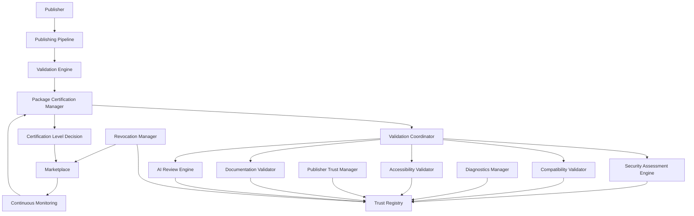
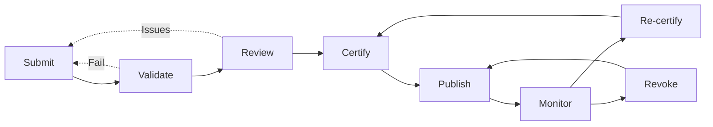
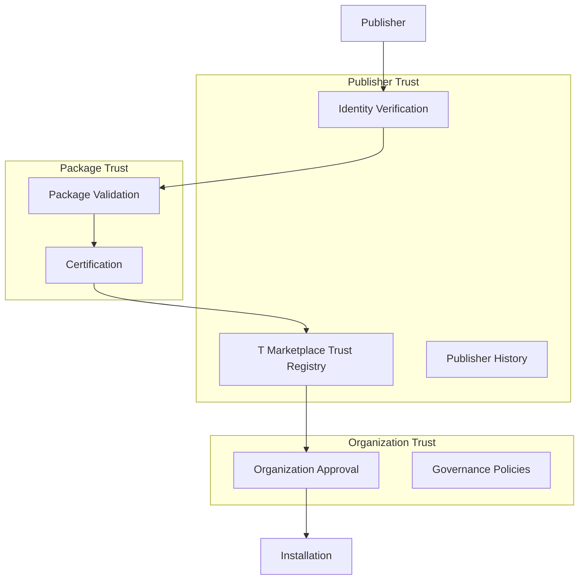
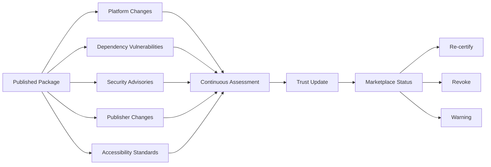
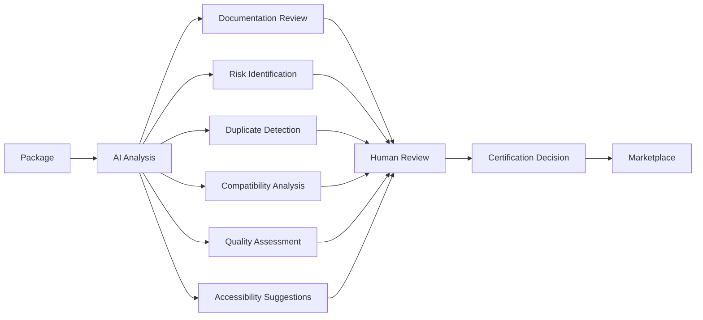

# Marketplace Certification & Trust

**KB-039 — Marketplace Certification & Trust Specification**

| Metadata | |
|----------|---|
| **KB ID** | KB-039 |
| **Title** | Marketplace Certification & Trust |
| **Version** | 0.1.0 |
| **Status** | Drafting |
| **Owner** | Architecture Team |
| **Dependencies** | KB-032 Marketplace Architecture, KB-033 Package & Artifact Specification, KB-030 Validation Engine, KB-031 Publishing Pipeline |
| **Related Documents** | Marketplace Architecture (KB-032), Package & Artifact Specification (KB-033), Validation Engine (KB-030), Publishing Pipeline (KB-031), Capability Marketplace (KB-035), Component Marketplace (KB-036), Theme Marketplace (KB-037), Template Marketplace (KB-038), Extension & Plugin Framework (KB-034), Distribution & Lifecycle (KB-040), Identity & Security (future) |
| **Review Status** | Pending |
| **Last Updated** | 2026-07-10 |

### Revision History

| Version | Date | Author | Change |
|---------|------|--------|--------|
| 0.1.0 | 2026-07-10 | AI Architecture Agent | Initial draft |

---

## 1. Purpose

Marketplace trust is essential because organizations depend on Marketplace assets to build production applications. When an organization installs a Capability, Component, Theme, or Template, they are placing operational confidence in that asset — trusting that it is secure, compatible, well-documented, accessible, and maintained. Without a robust trust system, the Marketplace becomes an ungoverned repository where quality and safety vary unpredictably.

Certification protects organizations by establishing a verifiable quality bar that every Marketplace asset must meet. Certification validates that an asset has passed defined checks for integrity, security, compatibility, accessibility, documentation, and licensing. Organizations can evaluate assets based on their certification level rather than manually auditing every package they consume.

Trust should be continuously evaluated because the ecosystem evolves. Platform versions change, new vulnerabilities are discovered, APIs are deprecated, and publishers release updates. A certification decision made at publication time may not remain valid as the ecosystem shifts. Continuous trust monitoring ensures that certification status reflects the current state of the platform, dependencies, and security landscape.

Publishers and packages are evaluated independently because publisher reputation does not guarantee package quality. A trusted publisher may release a substandard package. A new publisher may release an excellent package. Separating publisher trust from package certification ensures that organizations evaluate each asset on its own merits while still benefiting from publisher history as contextual information.

Certification supports long-term ecosystem quality by creating economic incentives for publishers to invest in quality. Certified assets are discoverable, trusted, and preferred by organizations. Uncertified assets are restricted, less visible, and less competitive. Certification creates a quality-driven market where the best assets rise to the top.

---

## 2. Certification Philosophy

### Trust by Verification

Trust is established through verifiable evidence, not through claims or reputation alone. Every certification decision is based on objective checks — integrity validation, compatibility testing, security scanning, accessibility verification, and documentation review. Verified trust eliminates blind faith from the asset consumption process.

### Continuous Certification

Certification is not a one-time event. Every certified asset is continuously reassessed as the platform evolves, dependencies change, and new threats emerge. Continuous certification ensures that certification status reflects the present reality, not the past moment of publication.

### Publisher Accountability

Publishers are accountable for the assets they distribute. Publisher identity is verified, publisher history is tracked, and publisher trust is earned through consistent quality. Publishers with poor quality, security incidents, or unmaintained assets see their trust indicators reflect that reality.

### Transparent Quality

Certification results are transparent and accessible. Every asset displays its certification level, check results, and certification history. Organizations can inspect exactly which checks passed and which failed. Transparency enables informed decision-making and holds the certification system accountable.

### Secure Distribution

Published assets are cryptographically signed, integrity-verified, and distributed through secure channels. Consumers verify asset integrity before installation. The Marketplace never serves assets that fail integrity verification.

### Standards Compliance

Certification validates assets against defined platform standards — component model compliance, accessibility requirements, security best practices, documentation completeness, and package format correctness. Standards compliance ensures consistency across the ecosystem.

### Accessibility by Default

Accessibility validation is a mandatory certification gate, not an optional feature. Every certified asset must meet platform accessibility requirements — keyboard navigation, screen reader support, contrast compliance, focus management, and reduced motion compatibility. Accessibility is non-negotiable.

### AI-Assisted Governance

AI assists the certification process by analyzing documentation, detecting risks, identifying duplicates, suggesting improvements, and generating certification summaries. AI accelerates certification without replacing human judgment for high-stakes decisions. AI recommendations are transparent and auditable.

### Enterprise Confidence

Enterprise organizations require additional assurance — compliance attestation, security audits, governance integration, and SLAs. The certification system supports enterprise-grade trust through certification levels, organization trust policies, and integration with enterprise governance systems.

### Technology Independence

Certification is defined in implementation-independent terms. Certification checks validate asset metadata, structure, and behavior — not implementation details. Technology independence ensures that certification remains valid across platform evolution and deployment environments.

---

## 3. Certification Responsibilities

### Responsibilities of the Certification & Trust System

**Publisher Verification** — Verify publisher identity, organization credentials, and contact information. Maintain publisher history — certification record, security incidents, package quality trends.

**Package Verification** — Validate package integrity (signatures, checksums), manifest correctness, metadata completeness, and conformance to the Package Specification.

**Dependency Verification** — Verify that declared dependencies exist, are compatible, and are themselves certified or verifiably trustworthy. Detect undeclared transitive dependencies.

**Compatibility Validation** — Validate that the package is compatible with declared platform versions, Runtime versions, and dependency versions. Detect breaking changes across package versions.

**Security Assessment** — Scan packages for known vulnerabilities, sensitive information exposure, malicious patterns, and insecure configurations. Perform static analysis and dependency vulnerability scanning.

**Documentation Review** — Verify that documentation is present, complete, and accurate. Assess documentation quality — installation guides, configuration guides, API references, architecture overviews, and user manuals.

**Accessibility Validation** — Verify that the package meets platform accessibility standards — keyboard navigation, screen reader support, contrast ratios, focus management, motion safety, and responsive behavior.

**Quality Assessment** — Evaluate package quality — code organization, naming conventions, error handling, performance characteristics, and adherence to platform conventions.

**Certification Issuance** — Assign certification levels based on check results. Issue certification badges, maintain certification records, and expose certification metadata through the Marketplace.

**Trust Monitoring** — Continuously monitor certified packages — platform changes, dependency updates, vulnerability disclosures, publisher changes. Reassess certification status when relevant conditions change.

**Revocation Management** — Revoke certification when packages no longer meet standards, publisher trust is compromised, or security vulnerabilities are discovered. Manage revocation notifications and grace periods.

### Responsibilities of the Validation Engine

The Validation Engine is responsible for project-level validation during the Builder Studio publishing process. It validates schema correctness, structural integrity, security baselines, accessibility compliance, and performance characteristics within the project context. The Certification & Trust system relies on Validation Engine results as inputs to certification but does not duplicate project-level validation.

### Responsibilities of the Publishing Pipeline

The Publishing Pipeline is responsible for packaging validated project artifacts, applying signatures, computing checksums, and delivering packages to the Marketplace. The Certification & Trust system validates packages after they enter the Marketplace — ensuring that the delivered package matches what was validated by the Validation Engine.

---

## 4. Certification Architecture

### 4.1 Publisher Trust Manager

| Aspect | Description |
|--------|-------------|
| **Purpose** | Manage publisher identity verification, trust scoring, and reputation tracking across the ecosystem. |
| **Responsibilities** | Verify publisher identity and organization credentials, maintain publisher trust records, compute conceptual trust scores, track certification and security history, manage publisher account status (active, suspended, revoked). |
| **Inputs** | Publisher registration data, identity verification results, certification results, security incident reports, community feedback. |
| **Outputs** | Publisher trust records, trust scores, account status, publisher metadata for Marketplace display. |
| **Extension points** | Custom identity verification providers, organization-level publisher approval workflows, external identity federation. |

### 4.2 Package Certification Manager

| Aspect | Description |
|--------|-------------|
| **Purpose** | Orchestrate end-to-end certification of individual packages — from submission through certification decision and ongoing monitoring. |
| **Responsibilities** | Accept certification requests, orchestrate validation checks across all assessment engines, compile certification results, assign certification levels, issue certification badges, manage re-certification schedules, maintain certification history. |
| **Inputs** | Package submission, Validation Engine reports, security assessment results, accessibility reports, documentation review results, AI review outputs. |
| **Outputs** | Certification decisions, certification levels, certification badges, certification reports, re-certification schedules. |
| **Extension points** | Custom certification workflows, industry-specific certification rules, organization-specific certification profiles. |

### 4.3 Validation Coordinator

| Aspect | Description |
|--------|-------------|
| **Purpose** | Coordinate the execution of validation checks across multiple assessment engines, managing check ordering, parallelism, and result aggregation. |
| **Responsibilities** | Schedule and dispatch validation checks, manage check dependencies, aggregate results, detect failures and timeouts, retry transient failures, produce consolidated validation reports. |
| **Inputs** | Certification request, package artifacts, assessment engine availability. |
| **Outputs** | Consolidated validation reports, check status updates, failure diagnostics. |
| **Extension points** | Custom check orchestrators, priority-based scheduling, distributed validation execution. |

### 4.4 Security Assessment Engine

| Aspect | Description |
|--------|-------------|
| **Purpose** | Scan packages for security vulnerabilities, malicious patterns, sensitive information exposure, and insecure configurations. |
| **Responsibilities** | Scan package dependencies against vulnerability databases, perform static analysis for malicious patterns, detect hardcoded secrets and credentials, analyze permission requirements, assess secure configuration practices, generate security reports. |
| **Inputs** | Package artifacts, dependency manifests, vulnerability databases, security rule sets. |
| **Outputs** | Security assessment reports, vulnerability findings, severity classifications, remediation recommendations. |
| **Extension points** | Custom security scanners, industry-specific security rules, integration with external vulnerability databases. |

### 4.5 Compatibility Validator

| Aspect | Description |
|--------|-------------|
| **Purpose** | Validate package compatibility with declared platform versions, Runtime versions, dependency versions, and other installed packages. |
| **Responsibilities** | Verify declared platform version compatibility, validate Runtime version requirements, check dependency version constraints, detect breaking changes across package versions, verify compatibility with current platform APIs, assess cross-package compatibility for bundled solutions. |
| **Inputs** | Package manifest, platform version metadata, Runtime version metadata, dependency registry, installed package state. |
| **Outputs** | Compatibility reports, version conflict detections, compatibility scores, upgrade compatibility assessments. |
| **Extension points** | Custom compatibility rules, platform-specific compatibility matrices, forward compatibility predictions. |

### 4.6 Accessibility Validator

| Aspect | Description |
|--------|-------------|
| **Purpose** | Validate that packages meet platform accessibility standards for keyboard navigation, screen reader support, contrast, focus, motion, and responsive behavior. |
| **Responsibilities** | Validate component keyboard navigation completeness, verify screen reader announcements and ARIA attributes, check color contrast ratios against WCAG standards, assess focus visibility and management, verify reduced motion support, test responsive behavior across breakpoints, validate localization readiness for accessibility. |
| **Inputs** | Package artifacts, component definitions, theme tokens, platform accessibility standards. |
| **Outputs** | Accessibility reports, violation details, severity classifications, remediation recommendations. |
| **Extension points** | Custom accessibility rules, organization-specific accessibility standards, regional accessibility requirements. |

### 4.7 Documentation Validator

| Aspect | Description |
|--------|-------------|
| **Purpose** | Verify that packages include complete, accurate, and well-structured documentation. |
| **Responsibilities** | Check required documentation presence (installation guide, configuration guide, API reference, architecture overview), validate documentation structure and completeness, assess documentation clarity and accuracy, verify code example correctness, check documentation links and references, generate documentation quality scores. |
| **Inputs** | Package documentation artifacts, documentation quality standards, required documentation checklist. |
| **Outputs** | Documentation quality reports, missing documentation flags, quality scores, improvement suggestions. |
| **Extension points** | Custom documentation requirements, industry-specific documentation standards, automated documentation testing. |

### 4.8 AI Review Engine

| Aspect | Description |
|--------|-------------|
| **Purpose** | Apply AI analysis to assist certification reviewers — identifying risks, detecting issues, suggesting improvements, and generating summaries. |
| **Responsibilities** | Analyze documentation for completeness and clarity, identify potential security risks and anti-patterns, detect duplicate or overlapping functionality with existing packages, assess package quality from structural analysis, generate accessibility improvement suggestions, evaluate upgrade compatibility, produce certification summaries for human reviewers. |
| **Inputs** | Package artifacts, documentation, certification check results, existing package metadata, platform conventions. |
| **Outputs** | AI review reports, risk flags, improvement suggestions, duplicate detection results, certification summaries. |
| **Extension points** | Custom AI models, domain-specific analysis, organization-specific review criteria. |

### 4.9 Trust Registry

| Aspect | Description |
|--------|-------------|
| **Purpose** | Central registry of all trust-related data — certification records, publisher trust status, security incident history, and continuous monitoring state. |
| **Responsibilities** | Store certification records and history, maintain publisher trust state, track security incident timelines, record trust events (certification, revocation, suspension), serve trust data to Marketplace and governance systems, support trust data queries and reporting. |
| **Inputs** | Certification decisions, publisher status changes, security incidents, monitoring results. |
| **Outputs** | Trust records, certification history, publisher trust dashboards, trust data feeds. |
| **Extension points** | External trust data federation, custom trust reporting, blockchain-based trust anchoring. |

### 4.10 Revocation Manager

| Aspect | Description |
|--------|-------------|
| **Purpose** | Manage certification revocation — detecting conditions that require revocation, notifying affected parties, and coordinating remediation. |
| **Responsibilities** | Detect revocation conditions (security vulnerabilities, policy violations, publisher compromise, platform incompatibility), initiate revocation workflows, notify affected organizations and consumers, manage revocation grace periods, coordinate remediation and re-certification, maintain revocation records and audit trails. |
| **Inputs** | Security advisories, monitoring alerts, publisher status changes, policy violation reports, platform deprecation notices. |
| **Outputs** | Revocation notices, revoked certification records, remediation guidance, status update events. |
| **Extension points** | Custom revocation policies, automated revocation triggers, integration with external incident response systems. |

### 4.11 Diagnostics Manager

| Aspect | Description |
|--------|-------------|
| **Purpose** | Collect, store, and expose certification system operational metrics, check performance, error rates, and system health. |
| **Responsibilities** | Collect certification check metrics and timing, track check pass/fail rates, monitor assessment engine health, track certification pipeline throughput, expose diagnostics API, generate operational reports. |
| **Inputs** | Events from all other modules. |
| **Outputs** | Metrics, reports, health status, error logs. |
| **Extension points** | Custom metric collectors, report generators, monitoring integrations. |

---

## 5. Certification Levels

### Community Verified

The base certification level. Indicates that the package has passed automated validation checks — package integrity, manifest correctness, dependency declaration completeness, and basic compatibility verification. Community Verified packages are discoverable in the Marketplace and suitable for development and evaluation environments.

**Checks included**: Package integrity, manifest validation, dependency validation, version format validation, licensing declaration verification.

**Intended usage**: Development environments, evaluation, personal projects, low-risk internal tools. Organizations may allow Community Verified packages in non-production environments by default.

### Platform Certified

The standard certification level for production use. Indicates that the package meets official platform standards for quality, security, accessibility, documentation, and compatibility. Platform Certified packages have passed all automated checks plus AI-assisted review and documentation validation.

**Checks included**: All Community Verified checks plus accessibility validation, security scanning, documentation completeness review, AI-assisted quality assessment, compatibility validation, and licensing compliance verification.

**Intended usage**: Production applications across all industries and environments. Platform Certified is the recommended minimum for production deployment.

### Enterprise Certified

An enhanced certification level for enterprise organizations with additional governance, compliance, and reliability requirements. Enterprise Certified packages undergo manual review by platform certification specialists in addition to all automated checks.

**Checks included**: All Platform Certified checks plus manual security review, manual code review for high-risk packages, performance benchmarking, scalability assessment, SLA verification, compliance attestation, and enterprise governance integration validation.

**Intended usage**: Enterprise production environments, regulated industries, organizations with strict governance requirements, mission-critical applications.

### Government / Regulated Certified

A specialized certification level for packages that support government, regulatory, or compliance-mandated requirements. Regulated Certified packages meet additional standards for data handling, audit logging, retention, accessibility, and security controls.

**Checks included**: All Enterprise Certified checks plus regulatory compliance validation, data handling assessment, audit trail verification, enhanced accessibility standards, security control attestation, and jurisdiction-specific requirements.

**Intended usage**: Government agencies, regulated industries (healthcare, finance, defense), organizations subject to compliance frameworks (HIPAA, GDPR, SOC 2, FedRAMP).

### Internal Organization Certified

A certification level defined and managed by individual organizations for their internal Marketplace. Internal certification allows organizations to apply their own standards and approval workflows to packages in their private catalogs.

**Checks included**: Organization-defined — may reference any subset of automated checks plus custom organizational rules, manual approval workflows, and internal compliance verification.

**Intended usage**: Organization-private Marketplaces, internal tool distribution, approved package catalogs.

---

## 6. Publisher Trust Model

### Publisher Identity

| Field | Type | Required | Description |
|-------|------|----------|-------------|
| **publisherId** | Identifier | Yes | Globally unique publisher identifier. |
| **organization** | String | Yes | Legal organization name. |
| **displayName** | String | Yes | Public-facing publisher name. |
| **contactEmail** | String | Yes | Verified contact email address. |
| **domain** | String | No | Verified organization domain. |
| **verificationStatus** | Enum | Yes | `unverified`, `email-verified`, `domain-verified`, `organization-verified`. |

### Publisher Trust Record

| Field | Type | Required | Description |
|-------|------|----------|-------------|
| **trustScore** | Number | Yes | Conceptual trust score (0-100) based on publisher history and behavior. Informational only — not a sole decision criterion. |
| **certificationHistory** | CertificationRecord[] | Yes | History of certifications earned across all published packages. |
| **securityHistory** | SecurityEvent[] | Yes | Security incidents, vulnerabilities, and resolution timelines. |
| **packageHistory** | PackageRecord[] | Yes | Publication history, update frequency, maintenance responsiveness. |
| **supportReputation** | SupportRecord | No | Support quality metrics — response time, issue resolution rate, community engagement. |
| **complianceStatus** | ComplianceRecord[] | No | Compliance attestations, certifications, and regulatory standing. |

### Trust Score Components

The conceptual trust score is an informational indicator composed of multiple signals:

- **Package Quality Average**: Average certification level across all active packages.
- **Update Responsiveness**: Time between vulnerability disclosure and patch publication.
- **Package Retention Rate**: How many published packages remain actively maintained versus abandoned.
- **Security Record**: Frequency and severity of security incidents.
- **Support Engagement**: Response time to issues and community questions.
- **Account Age**: Duration of verified publisher activity.
- **Certification Compliance Rate**: Percentage of submissions that pass certification.

### Trust Score Principles

- Trust scores are advisory, not authoritative.
- Trust scores are never the sole factor in certification decisions.
- Trust scores are not visible to consumers as a single number — they inform the Package Certification Manager's risk assessment.
- Publishers cannot pay or otherwise influence their trust score.
- Trust scores are computed from verifiable events only.

### Publisher Account Status

| Status | Description |
|--------|-------------|
| **Active** | Publisher in good standing. May publish and certify packages normally. |
| **Restricted** | Publisher may publish but packages face enhanced certification scrutiny. Applied after quality or security concerns. |
| **Suspended** | Publisher may not publish or update packages. Existing installed packages remain functional. Applied after policy violations. |
| **Revoked** | Publisher identity revoked. Packages removed from Marketplace. Installed packages may continue functioning but are marked untrusted. |

---

## 7. Package Certification

### Certification Request

A certification request is submitted when a package is published through the Publishing Pipeline. The request includes the package artifacts, Validation Engine report, publisher identity, and requested certification level.

### Certification Checks

**Package Integrity** — Verify package signatures match publisher identity. Validate checksums for all package artifacts. Detect tampering after publication.

**Manifest Validation** — Validate package manifest against the Package Specification schema. Verify that all required metadata fields are present and correctly formatted. Ensure manifest references are resolvable.

**Dependency Validation** — Verify that all declared dependencies:
- Exist in the Marketplace or are otherwise verifiably available.
- Have compatible version constraints.
- Are themselves certified at a compatible level.
- Do not introduce circular dependencies.

**Version Validation** — Verify that the package version follows semantic versioning. Ensure version has not been previously published (no overwriting). Verify version increment is consistent with change scope.

**Compatibility Validation** — Verify that the package declares compatible platform, Runtime, Builder, and dependency versions. Detect incompatibilities with current platform APIs. Verify that the package does not use deprecated APIs without migration declarations.

**Documentation Completeness** — Verify that required documentation is present: installation guide, configuration guide, API reference, architecture overview, and user manual (as applicable to the asset type). Verify that documentation is correctly structured and references are valid.

**Licensing Verification** — Verify that license information is complete and valid. Confirm that the package's license is compatible with the intended distribution channel. Verify that commercial packages include pricing information.

**Accessibility Compliance** — Verify that the package meets platform accessibility standards. Component packages must pass keyboard navigation, screen reader, contrast, focus, and motion safety checks. Theme packages must provide accessible color combinations. Template packages must ensure all included screens and components are accessible.

**Security Review** — Scan package for known vulnerabilities, secrets exposure, malicious patterns, and insecure configurations. Dependencies are scanned against vulnerability databases. Permission requirements are reviewed for appropriateness.

**Runtime Compatibility** — Verify that the package functions correctly on target Runtime versions. Component packages are rendered in a test Runtime environment. Capability packages are loaded and their screens rendered. Theme packages are applied and visually verified.

### Certification Result

| Outcome | Description |
|---------|-------------|
| **Certified** | Package meets all requirements for the requested certification level. Certification badge issued. |
| **Certified with Conditions** | Package meets core requirements but has minor issues that must be addressed by the next update. Conditionally certified packages display their conditions publicly. |
| **Not Certified** | Package fails one or more certification checks. Detailed report provided to publisher. Publisher may fix issues and resubmit. |
| **Deferred** | Certification requires additional review (manual review for Enterprise Certified, for example). Deferred packages are held in a pending state. |

### Certification Badges

Certified packages receive badges that are displayed in Marketplace search results, package pages, and package metadata. Badges indicate certification level at a glance. Badges include a link to the certification report showing detailed check results.

---

## 8. Continuous Trust Monitoring

### New Platform Releases

When a new platform version is released, all certified packages are reassessed for compatibility. Packages that pass reassessment retain their certification. Packages that fail are flagged with compatibility warnings and given a grace period for remediation.

### Dependency Vulnerabilities

When a vulnerability is disclosed in a dependency used by certified packages, the affected packages are automatically flagged. The Security Assessment Engine evaluates severity and affected versions. Critical vulnerabilities trigger immediate notification and certification review.

### Deprecated APIs

When platform APIs used by certified packages are deprecated, the affected packages are identified and notified. Package publishers receive deprecation timelines and migration guidance. Packages still using deprecated APIs at the end of the deprecation period are re-assessed.

### Security Advisories

When security advisories are published that affect the platform, Runtime, or common dependencies, all potentially affected packages are scanned. Packages confirmed affected are notified with severity, impact assessment, and remediation guidance.

### Publisher Changes

Changes to publisher status — ownership transfer, identity re-verification, account suspension — trigger reassessment of all packages published by that publisher. Packages remain certified during publisher review but may have their status updated based on the outcome.

### Compatibility Changes

When platform APIs, Runtime behavior, or dependency contracts change in ways that affect certified packages, the Compatibility Validator reassesses affected packages. Breaking changes detected after publication trigger certification review.

### Accessibility Regressions

When platform accessibility standards are updated, all certified packages are reassessed against the new standards. Packages that fail updated standards are given a compliance timeline.

### Documentation Quality

Documentation quality monitoring is ongoing. Outdated documentation, broken links, or inaccurate API references discovered after certification trigger documentation review. Publishers are notified and asked to update documentation.

### Monitoring Cadence

Continuous monitoring runs on an event-driven basis — triggered by platform releases, vulnerability disclosures, publisher changes, and scheduled re-certification intervals. Scheduled re-certification occurs at defined intervals based on certification level:

| Certification Level | Re-certification Interval |
|---------------------|---------------------------|
| Community Verified | Every 12 months |
| Platform Certified | Every 6 months |
| Enterprise Certified | Every 3 months |
| Government / Regulated | Every 1 month or per regulatory requirement |

---

## 9. Security Assessment

### Package Signing

Every published package is cryptographically signed by the publisher. Signing provides:
- **Integrity**: Detects unauthorized modification after publication.
- **Authentication**: Verifies the publisher's identity.
- **Non-Repudiation**: The publisher cannot deny having published the package.

The Marketplace verifies signatures before accepting packages and before serving packages to consumers.

### Publisher Verification

Publisher identity is verified during registration:
- **Email Verification**: Publisher confirms control of the registered email address.
- **Domain Verification**: Publisher confirms control of the organization domain (DNS record or email at domain).
- **Organization Verification**: Publisher provides business documentation for enterprise-grade trust.

### Integrity Validation

Every package download includes integrity verification:
- Package checksum is computed and compared against the published checksum.
- Package signature is verified against the publisher's public key.
- Tampered packages are rejected with audit logging and publisher notification.

### Secret Detection

Packages are scanned for hardcoded secrets — API keys, passwords, tokens, certificates, database connection strings, and cloud credentials. Secrets detected during certification are reported to the publisher. Packages with hardcoded secrets are not certified.

### Malicious Behavior Detection (Conceptual)

Conceptual analysis for malicious behavior includes:
- Static analysis for patterns associated with malware — code obfuscation, dynamic code execution, unauthorized data exfiltration.
- Behavioral analysis in sandboxed environments — network connections, file system access, process execution.
- Dependency graph analysis for typosquatting, dependency confusion, and malicious dependency injection.

Malicious behavior detection is a conceptual capability. Implementation details depend on the platform's security infrastructure.

### Permission Review

Package permission requirements are reviewed for appropriateness:
- Does the package request permissions commensurate with its functionality?
- Are permission explanations provided for sensitive or elevated permissions?
- Do permissions align with the package's declared purpose?

### Secure Update Verification

Package updates go through the same security assessment as initial publication:
- Signatures are verified.
- Dependencies are re-scanned for vulnerabilities.
- Changes between versions are analyzed for security impact.

### Audit Logging

All security events are logged:
- Package signing and verification events.
- Vulnerability scan results and timelines.
- Secret detection findings and resolutions.
- Security incident reports and remediation actions.
- Publisher verification changes.

---

## 10. Accessibility Certification

### Keyboard Navigation

Components and screens are validated for complete keyboard navigation:
- All interactive elements are reachable via keyboard.
- Tab order follows logical reading order.
- Focus indicators are visible and meet contrast requirements.
- No keyboard traps exist.
- Custom keyboard shortcuts are documented and configurable.

### Screen Reader Support

Components are validated for screen reader compatibility:
- All meaningful elements have appropriate ARIA roles, states, and properties.
- Non-decorative images have alternative text.
- Dynamic content changes are announced.
- Form inputs have associated labels.
- Error messages are announced.
- Status updates are communicated without moving focus unexpectedly.

### Contrast Validation

All visual elements are validated against WCAG contrast requirements:
- Normal text meets minimum 4.5:1 contrast ratio.
- Large text meets minimum 3:1 contrast ratio.
- UI components and graphical objects meet minimum 3:1 contrast ratio.
- Focus indicators meet minimum 3:1 contrast ratio against adjacent colors.
- Contrast is validated across all theme modes (light, dark, high contrast).

### Focus Visibility

Focus management is validated:
- Visible focus indicator on all interactive elements.
- Focus indicator meets size and contrast requirements.
- Focus order is logical and predictable.
- Skip navigation links are present on screens with repetitive navigation.
- Focus is managed predictably during dynamic content changes.

### Responsive Behavior

Components and screens are validated for responsive accessibility:
- Content is readable and functional at all supported screen sizes.
- Touch targets meet minimum size requirements.
- Content does not require horizontal scrolling at supported widths.
- Zoom behavior does not break layout or hide content.
- Orientation changes preserve content and functionality.

### Localization Readiness

Accessibility is validated across locales:
- Text overflow and wrapping in translated content.
- RTL layout support for bidirectional locales.
- Date, time, number, and currency formatting accessibility.
- Screen reader support for target languages.

### Reduced Motion Support

Components respect the platform's reduced motion setting:
- Animations are disabled or reduced when reduced motion is enabled.
- Parallax, auto-scrolling, and decorative motion respond to motion preferences.
- Critical motion (progress indicators, loading states) remains visible but simplified.

### Accessibility Certification Gate

Accessibility validation is a mandatory gate for Platform Certified and above. Packages that fail accessibility checks cannot achieve Platform Certified or higher levels. Accessibility violations with remediation recommendations are provided to publishers.

---

## 11. AI Integration

### Documentation Review

The AI Review Engine analyzes package documentation for completeness, clarity, and accuracy. AI identifies missing sections, unclear explanations, broken references, and outdated content. AI-generated documentation improvement suggestions are provided to publishers.

### Risk Identification

AI analyzes package structure, code patterns, and metadata for potential risks — overly broad permission requests, unnecessary dependencies, suspicious naming patterns, and inconsistency between description and functionality. Identified risks are flagged for human reviewer attention.

### Duplicate Detection

AI compares new package submissions against existing Marketplace packages to detect functional duplicates. Duplicate detection considers package name, description, category, declared capabilities, and included artifacts. Potential duplicates are flagged for review.

### Compatibility Analysis

AI analyzes package dependencies, API usage, and platform version declarations to assess compatibility risk. AI predicts potential compatibility issues based on patterns observed across the ecosystem — "This package declares API version X, but uses patterns deprecated in version Y."

### Quality Assessment

AI evaluates package quality from structural analysis — documentation coverage, metadata completeness, naming consistency, configuration schema quality, and adherence to platform conventions. Quality assessments are advisory and used to guide certification decisions.

### Accessibility Suggestions

AI analyzes component and screen definitions for accessibility improvements — missing ARIA attributes, insufficient contrast ratios, keyboard navigation gaps, and focus management issues. AI-generated suggestions help publishers fix issues before certification review.

### Upgrade Recommendations

When packages are recertified after platform updates, AI analyzes version differences and recommends upgrade paths — highlighting breaking changes, suggesting migration strategies, and flagging deprecated API usage.

### Certification Summaries

AI generates concise certification summaries for human reviewers — summarizing check results, highlighting risks, describing package purpose, and recommending certification level. Summaries accelerate the review process without replacing human judgment.

### AI Integration Principles

- AI recommendations are advisory, not authoritative.
- AI does not override required validation or governance checks.
- AI-generated certification summaries are clearly labeled as AI-generated.
- AI risk flags require human review before affecting certification decisions.
- AI models are regularly validated for accuracy, fairness, and drift.

---

## 12. Enterprise Governance

### Organization Approval Workflows

Organizations define approval workflows for Marketplace asset consumption:
- **Automatic Approval**: Certified packages from trusted publishers are automatically approved.
- **Administrator Approval**: Packages require explicit approval from designated administrators.
- **Committee Approval**: Sensitive packages require approval from a designated review committee.
- **Compliance Review**: Packages in regulated categories require compliance team review.

### Internal Certification

Organizations define internal certification levels that supplement or override Marketplace certification:
- **Organization Verified**: Package has passed internal review in addition to Marketplace certification.
- **Organization Restricted**: Package is approved but restricted to specific teams or environments.
- **Organization Blocked**: Package is blocked from installation across the organization.

### Private Marketplace Policies

Organizations manage their private Marketplace catalogs with policies:
- **Allowlist Mode**: Only explicitly approved packages are available in the organization catalog.
- **Denylist Mode**: All Marketplace packages are available except explicitly blocked packages.
- **Hybrid Mode**: Core packages are allowlisted; additional packages are request-and-approve.

### Compliance Requirements

Organizations define compliance requirements that packages must meet:
- Regulatory compliance (HIPAA, GDPR, SOC 2, FedRAMP, PCI-DSS).
- Data residency requirements.
- Accessibility standards beyond platform minimum.
- Security clearance requirements for publishers.
- Licensing compliance verification.

### Package Allowlists

Organization-maintained lists of approved packages. Allowlisted packages are immediately available for installation. Allowlists may specify approved versions or version ranges.

### Package Denylists

Organization-maintained lists of blocked packages. Denylisted packages are hidden from discovery and prevented from installation. Denylists may include specific versions, publishers, or entire categories.

### Organizational Trust Rules

Organizations define trust rules that override global Marketplace defaults:
- Require minimum certification level (e.g., Platform Certified minimum for production).
- Require additional approval for packages from new or unverified publishers.
- Automatically approve packages from trusted publishers with a track record.
- Block packages with certain dependency patterns or risk profiles.

### Integration with Identity & Access Management

Enterprise governance integrates with the organization's identity and access management system:
- Approval workflows integrate with existing approval systems.
- Audit logs feed into organizational SIEM systems.
- Certification events trigger notifications to compliance teams.
- Governance policies are enforced based on organizational roles.

---

## 13. Marketplace Integration

### Marketplace Architecture

The Certification & Trust system is a subsystem within the overall Marketplace Architecture. It provides trust services to all Marketplace modules — discovery, installation, updates, and governance.

### Publishing Pipeline

The Publishing Pipeline submits packages to the Certification & Trust system after validation:
1. Builder submits project to Publishing Pipeline.
2. Pipeline validates project through Validation Engine.
3. Pipeline packages validated artifacts and signs the package.
4. Pipeline delivers package to the Marketplace.
5. Marketplace submits package to Certification & Trust system.
6. Certification & Trust system runs certification checks.
7. Certification result is returned to the Marketplace.
8. Marketplace registers the package with its certification status.

### Validation Engine

The Certification & Trust system and Validation Engine have complementary roles:

| Aspect | Validation Engine | Certification & Trust |
|--------|------------------|----------------------|
| **Scope** | Single project | All published packages |
| **Timing** | Pre-publication | Post-publication + continuous |
| **Rules** | Project-level schemas, structure, security, accessibility, performance | Package-level + cross-package + ecosystem-level |
| **Coverage** | Schema correctness, structural integrity, security baselines | Package integrity, cross-package compatibility, certification levels, continuous monitoring, publisher trust |
| **Duration** | One-time per publication | Continuous throughout package lifecycle |

Packages must pass Validation Engine checks before entering the Marketplace. The Certification & Trust system does not re-run project-level validation — it relies on the Publishing Pipeline's validation report.

### Package Specification

The Certification & Trust system validates packages against the Package Specification schema. Packages that deviate from the specification cannot be certified. Certification checks verify that the package conforms to the specification's requirements for metadata, artifact structure, signatures, and dependency declarations.

### Extension Framework

Extensions and plugins undergo the same certification process as other asset types. The Certification & Trust system validates extension-specific requirements — extension point compatibility, sandbox compliance, permission declarations, and integration contracts.

### Update Manager

When update requests arrive, the Certification & Trust system re-certifies the updated package. Update certification is streamlined — checks focus on what changed between versions:
- Changed dependencies are re-scanned.
- Changed components are re-validated.
- Documentation updates are reviewed.
- Security assessment is re-run on changed artifacts.
- Compatibility is re-validated against current platform version.

Packages retain their certification level during update certification. If the update fails certification, the previous version remains certified.

---

## 14. Runtime Integration

### Certification Metadata in Runtime

The Runtime recognizes certification metadata but does not depend on certification services during execution. Certification metadata is embedded in package manifests — stored alongside the package definition, not fetched from a live service during operation.

### Runtime Behavior

The Runtime uses certification metadata for informational purposes:
- Displaying certification level in developer tools and diagnostics.
- Logging certification warnings for uncertified packages.
- Enforcing organization policies that reference certification levels (if configured).
- Recording certification status in audit events.

### Registration Bypass

The Runtime does not block uncertified packages from loading. Certification is a Marketplace governance concept, not a Runtime enforcement mechanism. Organizations that require certification enforcement implement it through governance policies, not Runtime modifications.

### Independence from Certification Services

The Runtime functions independently of the Certification & Trust system:
- Package installation does not require live certification checks.
- Package execution does not require certification service availability.
- Certification metadata is packaged with the asset — no runtime dependency on certification infrastructure.

This independence ensures that the Runtime remains operational during certification service outages, network partitions, and offline deployments.

### Registry Integration

The Capability Registry, Component Registry, and Theme Engine store certification metadata alongside asset definitions. The Runtime reads certification metadata from these registries without communicating with the Certification & Trust system directly.

---

## 15. Observability

### Certification Metrics

Per-certification tracking:
- Certification requests by level and asset type.
- Certification pass/fail rates.
- Certification duration by phase and level.
- Check-level pass/fail rates (security, accessibility, documentation, compatibility).
- Re-certification outcomes.

### Validation History

Historical validation records:
- Check results for every certification request.
- Changes in check results across versions.
- Common failure patterns and trends.
- Check performance and reliability.

### Publisher Metrics

Publisher-facing analytics:
- Certification pass/fail rate across all packages.
- Average certification duration.
- Common failure reasons.
- Security incident frequency and resolution time.
- Update responsiveness metrics.

### Trust Events

Trust event tracking:
- Certification issuances and revocations.
- Publisher status changes.
- Security incident reports and resolutions.
- Compliance status changes.
- Governance policy violations.

### Revocations

Revocation tracking:
- Revocation rate by certification level.
- Revocation reasons (security, policy, compatibility).
- Time between certification and revocation.
- Remediation and re-certification rate after revocation.

### Accessibility Reports

Accessibility tracking:
- Accessibility check pass/fail rates.
- Common accessibility violations.
- Accessibility quality trends across the ecosystem.
- Publisher accessibility improvement over time.

### Security Reports

Security tracking:
- Vulnerability detection rate by severity.
- Common vulnerability patterns.
- Publisher vulnerability response time.
- Dependency vulnerability trends across the ecosystem.

### Certification Diagnostics

System health metrics:
- Certification pipeline throughput and latency.
- Assessment engine availability and performance.
- Check execution duration percentiles.
- Certification queue depth and wait times.
- Error rates by check type and certification level.

---

## 16. Performance

### Incremental Validation

Certification checks are incremental — only changed artifacts are re-validated during re-certification. The Validation Coordinator tracks which artifacts changed and dispatches only the relevant checks. Incremental validation reduces re-certification time from hours to minutes for typical package updates.

### Cached Certification Metadata

Certification results are cached aggressively:
- Check results are cached per package version.
- Dependency certification status is cached and invalidated only when dependencies change.
- Security scan results are cached with vulnerability database version tracking.
- Accessibility results are cached per component definition.

### Parallel Assessments

Independent certification checks run in parallel:
- Security scanning, accessibility validation, documentation review, and compatibility validation execute concurrently.
- The Validation Coordinator dispatches independent checks simultaneously.
- Results are aggregated when all parallel checks complete.

### Efficient Re-certification

Re-certification prioritizes efficiency:
- Continuous monitoring triggers targeted re-checks rather than full re-certification.
- Platform version changes trigger compatibility-only reassessment.
- Dependency vulnerabilities trigger dependency-only re-scanning.
- Full re-certification is scheduled at defined intervals based on certification level.

### Large Marketplace Scalability

The certification system scales to support thousands of packages and millions of certification checks:
- Assessment engines are horizontally scalable — additional workers handle increased certification volume.
- Certification queues prioritize based on certification level and publisher trust.
- Marketplace trust data is partitioned by certification level and asset type.
- Certification results are served from cache with sub-millisecond latency.

### Check Optimization

Individual certification checks are optimized for performance:
- Security scanning uses incremental vulnerability databases.
- Compatibility validation uses pre-computed compatibility matrices.
- Accessibility validation uses cached component analysis results.
- Documentation review uses text analysis with configurable depth.

---

## 17. Anti-Patterns

### Blind Trust

Trusting Marketplace assets without verifying certification status is prohibited. Certification status is the primary trust indicator. Installing uncertified or low-certification-level packages into production environments without additional review is discouraged.

### Certification Bypass

Bypassing certification for convenience — installing packages through non-Marketplace channels or disabling certification checks — is prohibited. Certification is the quality and security gate for the entire ecosystem. Bypassing certification undermines ecosystem trust.

### Hidden Publisher Identity

Publishing packages under anonymous, unverifiable, or misleading publisher identities is prohibited. Publisher identity must be verifiable through email, domain, or organization verification. Hidden publishers undermine accountability.

### Missing Documentation

Publishing packages without complete documentation is prohibited. Documentation is a certification requirement — not an afterthought. Packages without documentation cannot be properly evaluated, installed, configured, or maintained by consuming organizations.

### Ignored Security Warnings

Ignoring or dismissing security warnings during certification is prohibited. Security findings must be addressed before certification. Security warnings flagged during continuous monitoring must be addressed within defined timelines.

### Static Trust Assumptions

Treating certification as a permanent status rather than a continuous assessment is discouraged. Trust is continuously monitored — certification status can change based on platform evolution, vulnerability disclosures, and publisher behavior. Organizations should not assume that a package certified today remains trusted indefinitely.

### Manual-Only Certification

Relying exclusively on manual review for certification is discouraged for large-scale Marketplaces. Manual review does not scale, introduces inconsistency, and cannot keep pace with the volume of package submissions. Automated checks should handle the majority of certification, with manual review reserved for high-risk or high-certification-level packages.

### Version Drift

Allowing published packages to drift from their certified state is prohibited. Every package update — even minor and patch versions — must go through certification. Organizations consuming packages rely on the contract that every certified version has passed the appropriate checks.

### Trust Score as Sole Criterion

Using the publisher trust score as the sole criterion for certification or installation decisions is prohibited. Trust scores are conceptual indicators that inform decisions — they are not a substitute for package-level certification. A high-trust publisher can release a low-quality package; a new publisher can release an excellent one.

### Over-Privileged Packages

Requesting excessive permissions for the package's declared functionality is prohibited. Packages should request the minimum permissions necessary. Over-privileged packages increase security risk and are flagged during certification.

---

## 18. Future Evolution

### AI-Assisted Continuous Certification

AI agents that continuously monitor certified packages and automatically trigger re-certification when relevant conditions change. AI detects platform API deprecation, analyzes vulnerability disclosures against installed packages, monitors dependency trees for transitive risk, and generates re-certification requests without human intervention.

### Federated Trust Networks

Multiple Marketplace instances that share trust data through federation protocols. A package certified in one Marketplace may be recognized in another — with trust data, certification history, and publisher reputation shared across the network. Federated trust eliminates redundant certification across ecosystem boundaries.

### Cross-Marketplace Certification

Certification standards harmonized across multiple platform Marketplaces. A package certified in the DUKADESK Marketplace may carry weight in partner Marketplaces, and vice versa. Cross-Marketplace certification reduces publisher burden and expands the trusted ecosystem.

### Automated Compliance Validation

AI-driven compliance validation that automatically certifies packages against regulatory frameworks — HIPAA, GDPR, SOC 2, FedRAMP, PCI-DSS. Compliance validation analyzes package data handling, security controls, audit logging, and documentation against regulatory requirements.

### Reputation Ecosystems

Community-driven reputation systems that complement formal certification. Organizations and individuals can endorse publishers, review packages, and share trust signals. Reputation data is transparent, verifiable, and resistant to manipulation.

### Organization-Defined Certification Profiles

Organizations define custom certification profiles that specify which checks are required, at what thresholds, and with what weightings. Organization profiles override global certification defaults — enabling organizations to enforce their specific quality, security, and compliance requirements.

### Adaptive Trust Models

Trust models that adapt based on package risk profile — high-risk packages (payment processing, healthcare data, authentication) require stricter certification than low-risk packages (display components, utility functions). Adaptive trust allocates certification resources proportionally to risk.

### Self-Sovereign Publisher Identity

Publisher identity anchored to decentralized identity systems — publishers control their identity across Marketplace instances without relying on centralized identity providers. Self-sovereign identity enhances portability, privacy, and publisher autonomy.

---

## 19. Relationship to Other Documents

| Document | Relationship |
|----------|--------------|
| **KB-032 — Marketplace Architecture** | Parent architecture defining the overall Marketplace system. The Certification & Trust system is the governance foundation within this architecture. |
| **KB-033 — Package & Artifact Specification** | Defines the package format that certification checks validate against. Certification verifies package specification conformance. |
| **KB-030 — Validation Engine** | The Validation Engine performs pre-publication validation. The Certification & Trust system relies on Validation Engine results as inputs but does not duplicate project-level checks. |
| **KB-031 — Publishing Pipeline** | The Publishing Pipeline delivers packages to the Marketplace and initiates certification. This specification defines the certification step after publication. |
| **KB-035 — Capability Marketplace** | Capability packages are certified through this system. Capability-specific certification rules extend the base certification process. |
| **KB-036 — Component Marketplace** | Component packages are certified through this system. Component-specific accessibility and compatibility rules extend the base process. |
| **KB-037 — Theme Marketplace** | Theme packages are certified through this system. Theme-specific accessibility and compatibility rules extend the base process. |
| **KB-038 — Template Marketplace** | Template packages are certified through this system. Template-specific composition, dependency, and documentation rules extend the base process. |
| **KB-034 — Extension & Plugin Framework** | Extensions and plugins are certified through this system. Extension-specific sandbox and permission rules extend the base process. |
| **KB-040 — Marketplace Distribution & Lifecycle** | Defines the package lifecycle that certification integrates with — certification status affects package discoverability, installation, and updates. |
| **Identity & Security (future)** | Publisher identity verification depends on the platform's Identity system. Security assessment integrates with the platform's Security framework. |

---

## Required Mermaid Diagrams

### Certification Architecture

### Certification Lifecycle

### Trust Model

### Continuous Monitoring

### AI Review Flow

---

*This is KB-039, the Marketplace Certification & Trust specification of the DUKADESK Engineering Knowledge Base. It defines the Certification & Trust subsystem as the governance foundation of the DUKADESK Marketplace, establishing continuous trust, publisher accountability, and package certification. The specification integrates with the Marketplace, Validation Engine, Publishing Pipeline, Runtime, and Enterprise Governance to support secure, transparent, enterprise-grade Marketplace operations across the DUKADESK platform.*
