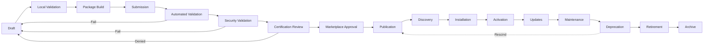
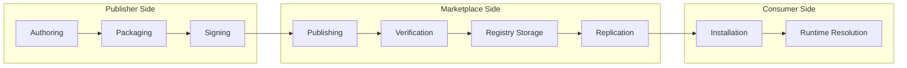
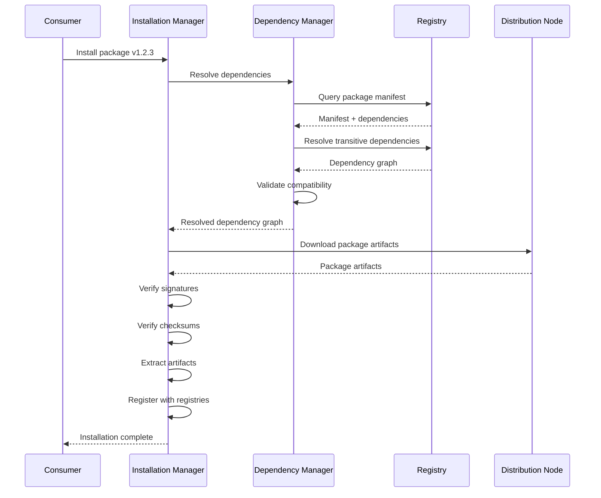
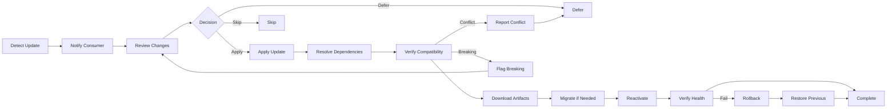
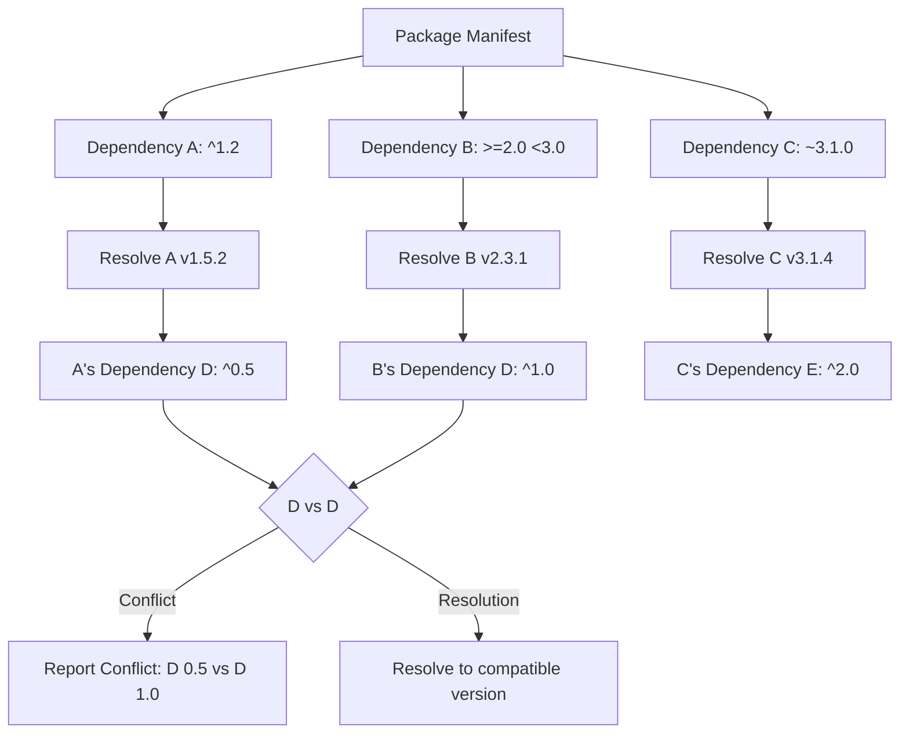
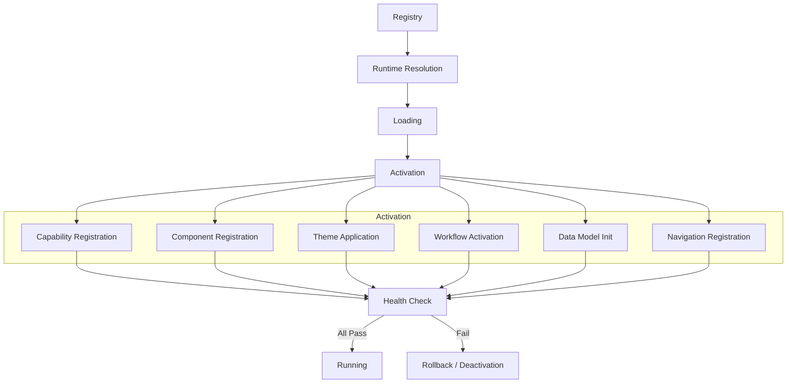
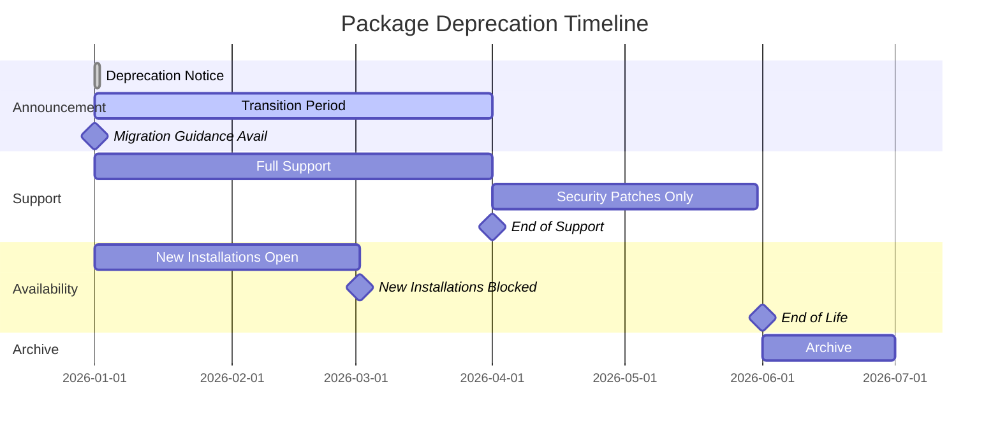
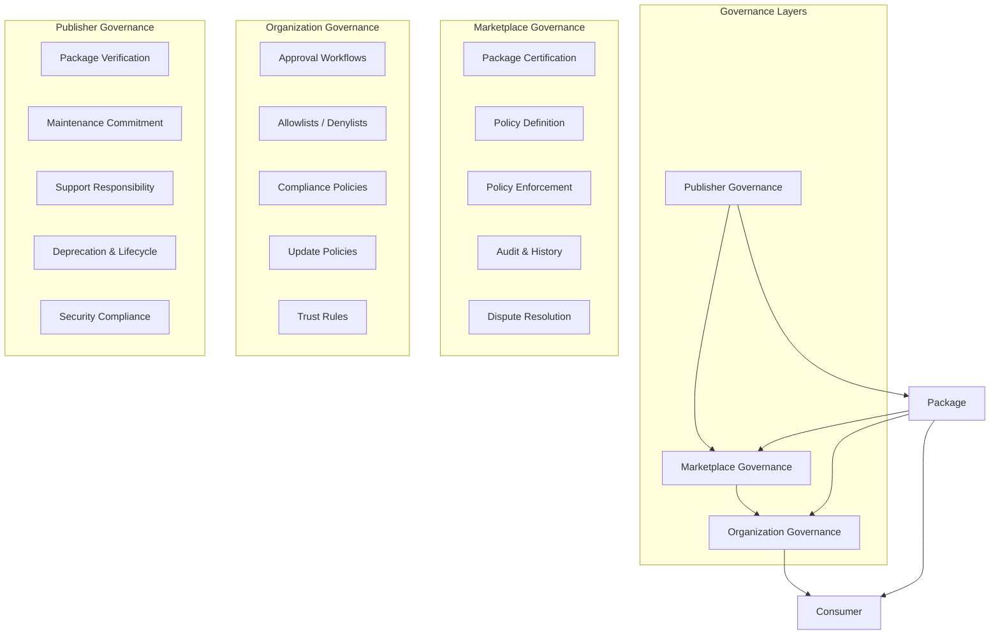
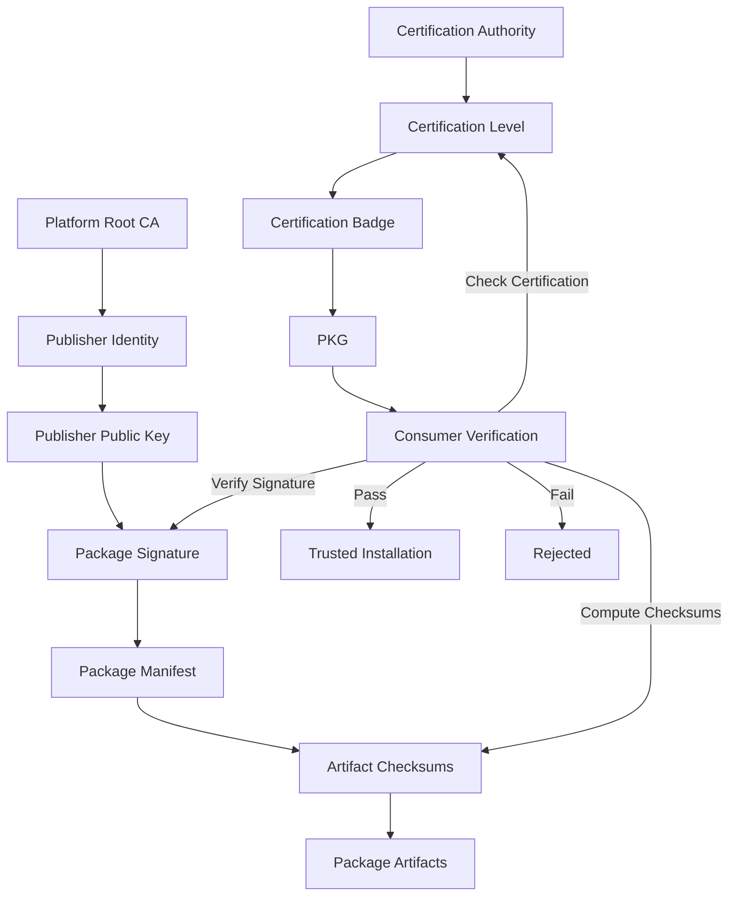

# Marketplace Distribution & Lifecycle

**KB-040 — Marketplace Distribution & Lifecycle Specification**

| Metadata | |
|----------|---|
| **KB ID** | KB-040 |
| **Title** | Marketplace Distribution & Lifecycle |
| **Version** | 0.1.0 |
| **Status** | Drafting |
| **Owner** | Architecture Team |
| **Dependencies** | KB-032 Marketplace Architecture, KB-033 Package & Artifact Specification, KB-039 Marketplace Certification & Trust, KB-030 Validation Engine, KB-031 Publishing Pipeline, KB-008 Runtime Overview |
| **Related Specifications** | Marketplace Architecture (KB-032), Package & Artifact Specification (KB-033), Extension & Plugin Framework (KB-034), Capability Marketplace (KB-035), Component Marketplace (KB-036), Theme Marketplace (KB-037), Template Marketplace (KB-038), Marketplace Certification & Trust (KB-039), Validation Engine (KB-030), Publishing Pipeline (KB-031), Runtime Overview (KB-008), Manifest Specification (KB-009) |
| **Last Updated** | 2026-07-10 |
| **Intended Audience** | Platform architects, Marketplace engineers, Runtime engineers, Builder Studio engineers, security engineers, DevOps, ecosystem partners |

---

### Revision History

| Version | Date | Author | Change |
|---------|------|--------|--------|
| 0.1.0 | 2026-07-10 | AI Architecture Agent | Initial draft |

---

## Executive Summary

Marketplace assets are long-lived digital artifacts governed by a standardized lifecycle. Every Marketplace artifact — Capabilities, Components, Themes, Templates, Extensions, Integrations, AI Assets, Workflows, Forms, Data Models, and complete Desks — follows the same lifecycle regardless of implementation technology.

Lifecycle management guarantees consistency by ensuring every asset moves through the same defined stages from creation to retirement. It guarantees security through package signing, integrity verification, vulnerability scanning, and continuous trust monitoring at every stage. It guarantees quality through automated validation, certification gates, and documentation requirements at each transition.

Lifecycle management guarantees upgradeability through semantic versioning, dependency resolution, migration paths, and rollback safety — ensuring that assets can evolve without breaking consumers. It guarantees compatibility through platform version declarations, cross-package validation, and continuous monitoring against platform changes.

Lifecycle management guarantees governance through defined publisher responsibilities, certification requirements, organizational policies, and audit trails at every lifecycle stage. It guarantees auditability through immutable event records, signed package manifests, publication timestamps, and full lifecycle history.

Lifecycle management guarantees long-term maintainability through deprecation windows, retirement processes, archive policies, and historical preservation — ensuring that the ecosystem remains healthy as assets age and are replaced.

---

## 1. Scope

### In Scope

This specification defines the distribution and lifecycle architecture for the following Marketplace asset types:

- **Capabilities**: Self-contained functional units that add complete feature sets to a Desk.
- **Components**: Reusable UI elements registered in the Component Registry.
- **Themes**: Complete visual identity packages consumable by the Theme Engine.
- **Templates**: Complete application blueprints composing multiple artifact types.
- **Extensions**: Builder plugins and platform extensions governed by the Extension Framework.
- **Integrations**: Connectors, API integrations, authentication providers, and messaging providers.
- **Workflows**: Reusable business process definitions.
- **AI Assets**: AI agents, prompt packs, knowledge packs, and AI workflows.
- **Forms**: Pre-built form definitions for common data entry patterns.
- **Data Models**: Reusable entity definitions establishing canonical data structures.
- **Desks**: Complete, deployable Desk packages including all configuration and assets.

### Out of Scope

- **Runtime execution**: How assets are loaded, rendered, and executed at runtime is defined in the Runtime Architecture Suite.
- **Builder authoring**: How assets are created and edited in Builder Studio is defined in the Builder Architecture Suite.
- **Certification details**: How assets are validated and certified is defined in KB-039 Marketplace Certification & Trust.
- **Package format**: The canonical package structure and metadata schema are defined in KB-033 Package & Artifact Specification.
- **Monetary transactions**: Payment processing, billing, and revenue sharing are platform-specific implementation concerns.
- **User interface design**: Marketplace storefront UI, discovery interfaces, and installation wizards are implementation-specific.

---

## 2. Architectural Principles

### Immutable Releases

Every published package version is immutable. Once a version is published, its contents cannot be modified, replaced, or deleted. Immutability guarantees that consumers always receive the exact artifact that was certified. Corrections are released as new versions, not as modifications to existing versions.

### Versioned Distribution

All distribution is versioned. Every package has a unique version identifier following semantic versioning. Consumers reference packages by their exact version or version constraint. Versioned distribution enables safe upgrades, rollbacks, and parallel coexistence of multiple versions.

### Traceable History

Every lifecycle event is recorded with immutable audit trails. Publication, certification, installation, update, deprecation, and retirement events are timestamped, signed, and persisted. Traceable history enables forensic analysis, compliance reporting, and ecosystem health monitoring.

### Package Integrity

Every package is cryptographically signed by its publisher. Checksums are computed for all package artifacts. The Marketplace verifies integrity at every transition — ingestion, storage, replication, and distribution. Consumers verify integrity before installation.

### Trust by Certification

Every package in the Marketplace carries a certification level determined by the Certification & Trust system. Certification status affects discoverability, installation policies, and governance enforcement. Trust is established through verification, not through publisher claims alone.

### Rollback Safety

Every installation and update operation retains the previous state. Rollback restores the exact previous package versions and dependency graph. Rollback is available until superseded by a subsequent operation. Rollback safety ensures that consumers can recover from failed updates.

### Backward Compatibility

Package publishers are responsible for maintaining backward compatibility within a major version. Breaking changes require a major version bump. Backward compatibility is verified during certification. Consumers within the same major version range can upgrade without breaking changes.

### Consumer Independence

Consumers control when they upgrade. The Marketplace notifies consumers of available updates but does not force upgrades except for critical security patches. Consumers can pin versions, schedule updates, and test upgrades in staging environments.

### Lifecycle Transparency

The current lifecycle state of every package is publicly visible. Consumers can see whether a package is active, deprecated, or retired. Lifecycle transitions are announced with timelines, migration guidance, and replacement recommendations.

### Repeatable Distribution

Distribution is deterministic. Installing the same package version in the same environment produces identical results. Package resolution, dependency installation, and activation follow repeatable processes. Repeatable distribution guarantees consistency across environments.

---

## 3. Marketplace Lifecycle Model

### Lifecycle Overview

```
Draft
  ↓
Local Validation
  ↓
Package Build
  ↓
Submission
  ↓
Automated Validation
  ↓
Security Validation
  ↓
Certification Review
  ↓
Marketplace Approval
  ↓
Publication
  ↓
Discovery
  ↓
Installation
  ↓
Activation
  ↓
Updates
  ↓
Maintenance
  ↓
Deprecation
  ↓
Retirement
  ↓
Archive
```

### Stage Definitions

#### Draft

The package is being authored in Builder Studio or an external development environment. The Draft stage is outside the Marketplace — it is the responsibility of the authoring environment.

**Entry criteria**: Author begins creating a new asset.
**Exit criteria**: Author completes authoring and initiates validation.
**Responsibilities**: Author ensures asset meets platform conventions and documentation requirements.

#### Local Validation

The package undergoes validation in the author's environment before submission. Local validation checks schema correctness, structural integrity, metadata completeness, and basic compatibility.

**Entry criteria**: Author initiates validation.
**Exit criteria**: Validation passes or author returns to Draft to fix issues.
**Responsibilities**: The Validation Engine (integrated into Builder Studio) performs local validation. The author resolves validation failures.

#### Package Build

The validated assets are packaged into the canonical Marketplace package format. Packaging includes artifact collection, manifest generation, dependency declaration, metadata assembly, and package signing.

**Entry criteria**: Local validation passes.
**Exit criteria**: Package is built, signed, and ready for submission.
**Responsibilities**: The Publishing Pipeline builds the package. The author provides signing credentials.

#### Submission

The signed package is submitted to the Marketplace. Submission includes the package artifact, publisher identity, certification level request, and any supplementary documentation.

**Entry criteria**: Package is built and signed.
**Exit criteria**: Package is accepted by the Marketplace ingestion service and queued for validation.
**Responsibilities**: The Publishing Pipeline submits the package. The Marketplace ingestion service validates submission format and publisher identity.

#### Automated Validation

The Marketplace runs automated validation checks on the submitted package. Validation verifies package integrity (signatures, checksums), manifest correctness, dependency declarations, version format, and metadata completeness.

**Entry criteria**: Submission is accepted.
**Exit criteria**: Automated validation passes or fails. Failed packages are returned to the publisher with detailed reports.
**Responsibilities**: The Validation Coordinator executes automated checks. The publisher resolves failures and resubmits.

#### Security Validation

The package undergoes security scanning — vulnerability assessment, secret detection, malicious pattern analysis, and dependency vulnerability scanning.

**Entry criteria**: Automated validation passes.
**Exit criteria**: Security validation passes or fails. Failed packages are returned to the publisher with security reports and remediation guidance.
**Responsibilities**: The Security Assessment Engine performs scanning. The publisher remediates findings and resubmits.

#### Certification Review

The package undergoes certification review appropriate to the requested certification level. Review may include automated checks, AI-assisted analysis, and manual review depending on certification level.

**Entry criteria**: Security validation passes.
**Exit criteria**: Certification is granted, granted with conditions, deferred, or denied.
**Responsibilities**: The Package Certification Manager orchestrates review. The Certification & Trust system makes the certification decision.

#### Marketplace Approval

The package is approved for the Marketplace. Approval may include additional organizational or regional approval steps depending on Marketplace configuration.

**Entry criteria**: Certification is granted.
**Exit criteria**: Package is registered in the Marketplace and queued for publication.
**Responsibilities**: The Marketplace Manager records approval. Organizational governance policies are enforced if applicable.

#### Publication

The package is published to the Marketplace. Publication makes the package discoverable and installable. Publication includes indexing for search, updating the registry, and notifying subscribers.

**Entry criteria**: Marketplace approval is granted.
**Exit criteria**: Package is indexed, discoverable, and available for installation.
**Responsibilities**: The Package Registry records the publication. The Discovery Service indexes the package. Notification Service notifies subscribers.

#### Discovery

Published packages are discoverable through the Marketplace discovery interface. Discovery includes search, browse, filtering, recommendations, and previews.

**Entry criteria**: Package is published.
**Exit criteria**: Not applicable — Discovery is an ongoing stage.
**Responsibilities**: The Discovery Service serves package metadata. The Preview Manager generates and serves previews. The AI Assistant provides recommendations.

#### Installation

Consumers install the package into their environment. Installation includes dependency resolution, compatibility validation, artifact download, integrity verification, registry registration, and configuration initialization.

**Entry criteria**: Consumer initiates installation.
**Exit criteria**: Package is installed, dependencies are resolved, and registry registrations are complete.
**Responsibilities**: The Installation Manager orchestrates installation. The Dependency Manager resolves dependencies. The Compatibility Validator verifies compatibility.

#### Activation

The installed package is activated in the target environment. Activation includes registering capabilities with the Capability Registry, components with the Component Registry, themes with the Theme Engine, and workflows with the Workflow Engine.

**Entry criteria**: Installation is complete.
**Exit criteria**: Package is active and its functionality is available in the Runtime.
**Responsibilities**: The Installation Manager activates the package. Target registries accept registrations. The Runtime recognizes the activated assets.

#### Updates

Published packages may receive updates — new features, bug fixes, security patches, and platform compatibility updates. Updates follow the same lifecycle stages as initial publication, with streamlined validation for version increments.

**Entry criteria**: Author creates a new package version.
**Exit criteria**: Update is published and available to consumers.
**Responsibilities**: The publisher follows the publication lifecycle for the new version. The Update Manager notifies consumers of available updates.

#### Maintenance

Published packages are maintained by their publishers. Maintenance includes bug fixes, security updates, platform compatibility updates, documentation updates, and support. Maintenance expectations vary by certification level.

**Entry criteria**: Package is published.
**Exit criteria**: Package enters deprecation or publisher ceases maintenance.
**Responsibilities**: The publisher provides maintenance consistent with certification commitments. The Marketplace monitors maintenance activity and updates publisher trust indicators.

#### Deprecation

The package is marked as deprecated. Deprecated packages remain available for existing consumers but are not recommended for new installations. Deprecation includes announcement, migration guidance, and replacement recommendations.

**Entry criteria**: Publisher declares deprecation or Marketplace initiates deprecation due to publisher inactivity, security concerns, or platform incompatibility.
**Exit criteria**: Package enters retirement or deprecation is rescinded.
**Responsibilities**: The publisher provides migration guidance. The Marketplace communicates deprecation to consumers. The Discovery Service deprioritizes deprecated packages.

#### Retirement

The package is retired from the Marketplace. Retired packages are removed from discovery — they cannot be newly installed. Existing installations continue to function but no longer receive updates.

**Entry criteria**: Deprecation period ends or immediate retirement is triggered by critical security or policy violations.
**Exit criteria**: Package is removed from discovery and new installations are blocked.
**Responsibilities**: The Marketplace removes the package from discovery. Existing consumers are notified. The package remains in the registry for historical reference.

#### Archive

The package is archived. Archived packages are preserved for historical reference, audit compliance, and potential restoration. Archived packages are not discoverable, not installable, and not updatable.

**Entry criteria**: Retirement period ends or immediate archival is required.
**Exit criteria**: Package is moved to cold storage with restricted access.
**Responsibilities**: The Marketplace archives package artifacts and metadata. Access controls restrict archival retrieval to authorized personnel. Audit records are preserved indefinitely.

---

## 4. Distribution Architecture

### Participant Model

```
Publisher
  ↓
Marketplace
  ↓
Registry
  ↓
Discovery
  ↓
Consumer
  ↓
Installation
  ↓
Runtime
```

### Participant Responsibilities

#### Publisher

The publisher creates, packages, signs, submits, and maintains Marketplace assets. Publisher responsibilities include:

- Authoring assets that meet platform conventions and quality standards.
- Packaging assets in the canonical Marketplace package format.
- Signing packages with verified publisher credentials.
- Submitting packages through the Publishing Pipeline.
- Maintaining published assets — bug fixes, security patches, compatibility updates.
- Providing documentation, support, and migration guidance.
- Managing asset lifecycle — versioning, deprecation, retirement.

#### Marketplace

The Marketplace is the distribution platform. Marketplace responsibilities include:

- Accepting and validating package submissions.
- Orchestrating certification and approval workflows.
- Storing and indexing published packages.
- Serving discovery, search, and browsing interfaces.
- Managing distribution policies — public, private, enterprise, regional.
- Coordinating installation and update operations.
- Monitoring package health and ecosystem metrics.
- Enforcing lifecycle policies — deprecation, retirement, archive.

#### Registry

The Registry is the authoritative catalog of all Marketplace packages. Registry responsibilities include:

- Storing package metadata, versions, and artifact references.
- Maintaining version catalogs with semantic versioning.
- Managing dependency indexes for resolution.
- Storing compatibility matrices for cross-version validation.
- Recording certification status and trust information.
- Maintaining audit history of all lifecycle events.
- Tracking download statistics and installation counts.
- Storing publisher information and trust records.
- Managing version lifecycle states.

#### Discovery

The Discovery service enables consumers to find packages. Discovery responsibilities include:

- Indexing packages for full-text search.
- Supporting faceted browsing by category, industry, certification level, and publisher.
- Generating AI-assisted recommendations.
- Serving package previews and documentation.
- Filtering based on organization policies and certification requirements.

#### Consumer

The consumer installs and uses Marketplace assets. Consumer responsibilities include:

- Selecting packages appropriate for their requirements.
- Reviewing certification levels, documentation, and compatibility.
- Managing installation, configuration, and activation.
- Controlling update policies — pinning, scheduling, testing.
- Reporting issues and providing feedback.
- Complying with license terms and organizational governance policies.

#### Installation

The Installation Manager orchestrates package deployment. Installation responsibilities include:

- Resolving dependencies and verifying compatibility.
- Downloading and verifying package integrity.
- Registering assets with target registries.
- Initializing configuration.
- Managing rollback state.

#### Runtime

The Runtime executes installed packages. Runtime responsibilities include:

- Loading and resolving package assets at startup and on demand.
- Activating capabilities, components, themes, and workflows.
- Monitoring package health during execution.
- Handling failures and graceful deactivation.
- Reporting usage and health metrics.

### Distribution Flow

```
1. Publisher builds and signs package.
2. Publisher submits to Marketplace.
3. Marketplace validates, certifies, and approves.
4. Marketplace registers package in Registry.
5. Marketplace indexes package for Discovery.
6. Consumer discovers package.
7. Consumer initiates installation.
8. Installation Manager resolves dependencies.
9. Installation Manager downloads and verifies.
10. Installation Manager registers with target registries.
11. Activation registers assets with Runtime.
12. Runtime loads and executes assets.
```

---

## 5. Package Distribution Pipeline

### Pipeline Stages

```
Authoring
  ↓
Packaging
  ↓
Signing
  ↓
Publishing
  ↓
Verification
  ↓
Registry Storage
  ↓
Replication
  ↓
Installation
  ↓
Runtime Resolution
```

#### Authoring

Assets are created in Builder Studio or external development tools. Authoring produces the source artifacts — Desk definitions, screens, components, workflows, forms, data models, themes, capabilities, and supporting resources.

#### Packaging

The Publishing Pipeline collects authored artifacts and assembles them into the canonical Marketplace package format. Packaging includes:

- Collecting all artifacts and verifying completeness.
- Generating the package manifest with metadata, dependencies, and version information.
- Compiling artifact indexes and checksums.
- Assembling the package archive.

#### Signing

The package is cryptographically signed by the publisher. Signing includes:

- Computing checksums for all package contents.
- Signing the manifest with the publisher's private key.
- Embedding the publisher's certificate or public key reference.
- Creating a signature file as part of the package.

#### Publishing

The signed package is submitted to the Marketplace. Publishing includes:

- Transmitting the package to the Marketplace ingestion endpoint.
- Verifying publisher identity and submission authorization.
- Accepting the package into the validation queue.

#### Verification

The Marketplace verifies the package before storage. Verification includes:

- Checking signature validity against publisher's public key.
- Computing and comparing checksums.
- Validating manifest structure and metadata.
- Verifying dependency declarations.

#### Registry Storage

The verified package is stored in the Marketplace Registry. Storage includes:

- Persisting package artifacts to artifact storage.
- Recording metadata in the metadata store.
- Updating the version catalog.
- Indexing for discovery.

#### Replication

Package artifacts are replicated across distribution nodes. Replication includes:

- Copying artifacts to regional or edge distribution nodes.
- Synchronizing metadata across registry replicas.
- Maintaining consistency through checksum verification.
- Handling replication failures with retry and alerting.

#### Installation

The consumer's Installation Manager downloads the package from the nearest distribution node. Installation includes:

- Resolving the optimal distribution endpoint.
- Downloading package artifacts.
- Verifying integrity.
- Extracting and registering assets.

#### Runtime Resolution

The Runtime resolves and loads the installed package assets. Resolution includes:

- Reading package metadata from registries.
- Loading asset definitions.
- Injecting dependencies.
- Activating capabilities and components.

### Package Immutability

Once published, a package version is immutable:

- Package artifacts cannot be modified, replaced, or deleted.
- Package metadata (except certification status and lifecycle state) cannot be changed.
- A new version must be published for any content or metadata change.
- The original publication timestamp, publisher identity, and checksums are permanently recorded.

Immutability guarantees that consumers always receive the exact artifact that was certified. It eliminates the class of bugs and security issues caused by silently modified packages. It enables deterministic rebuilds and forensic analysis.

---

## 6. Registry Architecture

### Registry Components

#### Artifact Storage

Persistent storage for package artifacts. Artifacts are stored by package ID and version. Storage supports content-addressable retrieval for deduplication. Storage is immutable — once written, artifacts are read-only.

#### Metadata Store

Catalog of all package metadata — name, description, publisher, version, category, tags, license, certification status, dependencies, and lifecycle state. The metadata store powers discovery, search, and browsing.

#### Version Catalog

Index of all published versions for each package. The version catalog tracks version lifecycle state — pre-release, stable, LTS, deprecated, retired, archived. The version catalog supports semantic version range queries and version comparison.

#### Dependency Index

Graph of all package dependencies across the ecosystem. The dependency index enables dependency resolution, conflict detection, impact analysis, and vulnerability propagation tracking. The dependency index is updated on every publication.

#### Compatibility Matrix

Pre-computed compatibility data for packages across platform versions, Runtime versions, and interdependent package versions. The compatibility matrix accelerates compatibility validation during installation and update operations.

#### Trust Information

Certification records, publisher trust data, and security status for every package. Trust information is maintained by the Certification & Trust system and consumed by the Marketplace for certification display and governance enforcement.

#### Certification Records

Full certification history for every package — certification level, check results, certification dates, re-certification events, and revocation records. Certification records are append-only and permanently retained.

#### Audit History

Immutable log of all lifecycle events — publication, certification, installation, update, deprecation, retirement, and archive. Each audit record includes timestamp, actor identity, operation type, and cryptographic linkage to the previous record.

#### Download Statistics

Aggregated download and installation counts per package, version, time period, and geography. Download statistics are used for popularity ranking, trending detection, and ecosystem health monitoring.

#### Publisher Information

Publisher identity records — name, organization, verification status, contact information, and trust indicators. Publisher information is maintained by the Publisher Trust Manager.

### Version Lifecycle States

| State | Description | Discoverable | Installable | Updatable | Support |
|-------|-------------|--------------|-------------|-----------|---------|
| **Pre-release** | Alpha, beta, or release candidate. | Yes, flagged | Yes | Yes | Best effort |
| **Stable** | Production-ready release. | Yes | Yes | Yes | Full support |
| **LTS** | Long-term support release. | Yes, featured | Yes | Security only | Extended |
| **Deprecated** | No longer recommended. | Yes, flagged | Existing only | No | Limited |
| **Unsupported** | No longer supported by publisher. | No | Existing only | No | None |
| **Retired** | Removed from active distribution. | No | No | No | None |
| **Archived** | Preserved for historical reference. | No | No | No | None |

### Semantic Versioning

All packages follow semantic versioning: MAJOR.MINOR.PATCH.

- **MAJOR**: Breaking changes — incompatible API changes, removed functionality, behavioral changes that break existing consumers.
- **MINOR**: Backward-compatible new functionality — new APIs, new features, new configuration options.
- **PATCH**: Backward-compatible bug fixes — security patches, performance improvements, documentation corrections.

#### Pre-release Versions

Pre-release versions are indicated by appending a hyphen and identifier: `1.0.0-alpha.1`, `2.3.0-beta.2`, `3.0.0-rc.1`. Pre-release versions have lower precedence than the associated release version. Pre-release versions are discoverable but clearly flagged as not production-ready.

#### Release Candidates

Release candidates (suffix `-rc.N`) are feature-complete versions undergoing final validation before stable release. Release candidates are suitable for testing and staging environments but not production.

#### Stable Releases

Stable releases are production-ready versions that have passed full certification. Stable releases are the default discovery and installation target.

#### LTS Releases

Long-term support releases receive security patches and critical bug fixes for an extended period. LTS releases are selected by the publisher and certified by the Marketplace. LTS releases are featured in discovery for enterprise consumers.

#### Deprecated Versions

Deprecated versions are flagged in discovery and not recommended for new installations. Existing installations continue to function. Deprecation includes a timeline for transition to retirement.

#### Unsupported Versions

Unsupported versions no longer receive updates from the publisher. Unsupported versions remain installed but may become incompatible with future platform versions. The Marketplace may flag unsupported versions with warnings.

#### Archived Versions

Archived versions are preserved in cold storage for historical reference and audit compliance. Archived versions are not discoverable or installable. Restoration from archive is possible but requires administrative authorization.

### Compatibility Expectations

- **Major versions**: Breaking changes expected. Consumers must test and potentially modify their integration.
- **Minor versions**: New functionality only. Consumers should be able to upgrade without changes.
- **Patch versions**: Bug fixes only. Consumers should be able to upgrade without changes or testing.
- **Pre-release versions**: No compatibility guarantees. APIs may change between pre-release versions.
- **LTS versions**: Backward-compatible within the LTS major version. Breaking changes are not backported.

---

## 7. Dependency Lifecycle

### Dependency Resolution

When a package is installed or updated, the Dependency Manager resolves the complete dependency graph:

1. Read the package manifest's dependency declarations.
2. For each dependency, find the latest version satisfying the declared version constraint.
3. Recursively resolve transitive dependencies.
4. Verify that all resolved versions are compatible with each other.
5. Detect and report conflicts.

### Version Constraints

Dependencies are declared with semantic version constraints:

| Constraint | Example | Matches |
|------------|---------|---------|
| Exact | `1.2.3` | Only version 1.2.3 |
| Compatible | `^1.2.3` | >=1.2.3 and <2.0.0 |
| Patch range | `~1.2.3` | >=1.2.3 and <1.3.0 |
| Wildcard | `*` | Any version |
| Range | `>=1.0.0 <2.0.0` | Versions in range |
| Or | `^1.0.0 \|\| ^2.0.0` | Versions matching either constraint |

### Conflict Detection

The Dependency Manager detects three types of conflicts:

**Direct conflicts**: Two dependencies declare incompatible version constraints for the same package.
**Transitive conflicts**: Two transitive paths through the dependency graph resolve to incompatible versions of the same package.
**Platform conflicts**: A dependency requires a platform version incompatible with the target environment.

### Circular Dependency Prevention

The Dependency Manager detects and prevents circular dependencies:

- Dependency graphs are validated for cycles during publication and installation.
- Cycles are reported with the full dependency chain.
- Circular dependencies must be resolved by the publisher before publication.

### Dependency Graph Evolution

The dependency graph evolves as packages are published, updated, and retired:

- **New publications**: Add nodes and edges to the graph.
- **Version updates**: May change edge constraints and introduce new compatibility requirements.
- **Deprecation**: Flags nodes as deprecated but does not remove them.
- **Retirement**: Nodes are removed from active resolution but preserved for historical compatibility.

### Compatibility Validation

During dependency resolution, the Compatibility Validator verifies:

- Package version compatibility with declared platform version.
- Package version compatibility with Runtime version.
- Cross-dependency compatibility — all resolved versions must be compatible with each other.
- Deprecated API usage — packages using deprecated APIs are flagged.
- Breaking change detection — version increments are validated against actual changes.

---

## 8. Distribution Policies

### Public Assets

Public assets are discoverable and installable by any Marketplace consumer. Public assets have passed Marketplace certification at Community Verified level or above.

**Access**: Any authenticated consumer.
**Discovery**: Visible in global Marketplace search and browse.
**Installation**: Available to any consumer.
**Certification requirement**: Community Verified minimum.

### Private Assets

Private assets are restricted to a specific organization or group of organizations. Private assets are not visible to consumers outside the authorized scope.

**Access**: Authorized organization members only.
**Discovery**: Visible only within the organization's catalog.
**Installation**: Available only to authorized organizations.
**Certification requirement**: Organization-defined.

### Enterprise Assets

Enterprise assets are available under enterprise licensing agreements. Enterprise assets may include enhanced support, compliance attestation, and SLA guarantees.

**Access**: Organizations with enterprise agreements.
**Discovery**: Visible to all with enterprise licensing indicators.
**Installation**: Requires enterprise license acceptance.
**Certification requirement**: Platform Certified minimum.

### Licensed Assets

Licensed assets require license acceptance before installation. Licensing terms are defined by the publisher and displayed during discovery.

**Access**: Any consumer.
**Discovery**: Visible with license requirements displayed.
**Installation**: Requires license acceptance.
**Certification requirement**: Depends on certification level.

### Regional Assets

Regional assets are restricted to specific geographic regions for compliance, data residency, or licensing reasons.

**Access**: Consumers in authorized regions.
**Discovery**: Visible only to consumers in authorized regions.
**Installation**: Restricted to authorized regions.
**Certification requirement**: May include region-specific certification.

### Internal Assets

Internal assets are published by an organization for its own use. Internal assets are not available in the global Marketplace.

**Access**: Internal organization members only.
**Discovery**: Organization catalog only.
**Installation**: Organization environments only.
**Certification requirement**: Organization-defined.

### Partner Assets

Partner assets are shared between specific organizations through partner agreements. Partner assets are visible to partner organizations but not to the general Marketplace.

**Access**: Partner organizations.
**Discovery**: Partner catalog.
**Installation**: Partner environments only.
**Certification requirement**: Platform Certified minimum.

### Time-Limited Assets

Time-limited assets have defined availability windows — evaluation licenses, time-limited trials, event-specific assets. Time-limited assets expire after their defined period.

**Access**: Any consumer during availability window.
**Discovery**: Visible with expiration information.
**Installation**: Available during window.
**Expiration**: Asset is disabled or converted to full license at expiration.
**Certification requirement**: Community Verified minimum.

---

## 9. Release Channels

### Channel Model

Release channels group packages by stability, audience, and support commitment. Channels enable publishers to release packages at different maturity levels to different audiences.

### Development Channel

Frequent releases with minimal stability guarantees. Development channel packages are suitable for early testing and integration validation.

**Stability**: Low — breaking changes may occur between releases.
**Audience**: Developers, early adopters, integration testers.
**Support**: Best effort.
**Certification**: Not required.
**Naming**: Pre-release versioning.

### Preview Channel

Feature-complete releases undergoing final validation. Preview channel packages are suitable for staging environments and user acceptance testing.

**Stability**: Medium — feature-complete but may contain bugs.
**Audience**: QA teams, beta testers, staging environments.
**Support**: Limited.
**Certification**: Automated validation only.
**Naming**: Release candidate versioning.

### Beta Channel

Early access releases for feature testing and feedback collection. Beta channel packages are suitable for opt-in test groups.

**Stability**: Low to medium — may contain incomplete features.
**Audience**: Opt-in beta testers.
**Support**: Community or best effort.
**Certification**: Automated validation only.
**Naming**: Beta versioning.

### Release Candidate Channel

Final validation releases before stable publication. Release candidate packages are suitable for production-like testing.

**Stability**: High — expected to become stable.
**Audience**: All consumers for pre-production validation.
**Support**: Full.
**Certification**: Full certification (except manual review if applicable).
**Naming**: Release candidate versioning.

### Stable Channel

Production-ready releases with full support commitment. Stable channel packages are the default discovery and installation target.

**Stability**: High.
**Audience**: All consumers.
**Support**: Full.
**Certification**: Full certification at requested level.
**Naming**: Stable versioning.

### Long-Term Support Channel

Releases with extended support timelines. LTS channel packages receive security patches and critical bug fixes for the LTS duration.

**Stability**: High.
**Audience**: Enterprise consumers, regulated environments.
**Support**: Extended (defined LTS period).
**Certification**: Enterprise Certified minimum.
**Naming**: LTS versioning with defined end-of-life date.

### Enterprise Channel

Enterprise-specific releases with enhanced certification, SLA commitments, and compliance attestation.

**Stability**: High.
**Audience**: Enterprise consumers.
**Support**: SLA-backed.
**Certification**: Enterprise Certified.
**Naming**: Enterprise versioning.

### Channel Selection

Consumers select which release channels they follow:

- Development consumers may follow the Development and Preview channels.
- QA teams may follow the Beta and Release Candidate channels.
- Production consumers follow the Stable or LTS channels.
- Enterprise consumers may follow the Enterprise channel.

Publishers decide which channels their packages are available in. Consumers may mix channels — using Stable for dependencies and Release Candidate for specific packages under test.

---

## 10. Installation Lifecycle

### Discovery

Consumer discovers the package through the Marketplace discovery interface. Discovery may be initiated by search, browse, recommendation, or direct reference.

**Consumer action**: Selects package for installation.
**Marketplace action**: Presents package metadata, certification level, documentation, dependencies, and compatibility information.

### Selection

Consumer selects the specific package version or version constraint for installation.

**Consumer action**: Chooses version (latest stable, specific version, or version range).
**Marketplace action**: Validates version availability and compatibility with the target environment.

### Dependency Resolution

The Dependency Manager resolves the complete dependency graph:

1. Read the package manifest.
2. Resolve direct dependencies to concrete versions.
3. Recursively resolve transitive dependencies.
4. Verify version compatibility across all resolved dependencies.
5. Detect and report conflicts.
6. Lock the resolved dependency graph.

**Output**: Locked dependency graph with concrete version for every dependency.

### Validation

The Installation Manager validates the installation against the target environment:

1. Verify platform version compatibility.
2. Verify Runtime version compatibility.
3. Verify no conflicts with already-installed packages.
4. Verify licensing acceptance.
5. Verify organizational policy compliance.

### Installation

The Installation Manager executes the installation:

1. Download package artifacts from the nearest distribution node.
2. Verify package integrity (signatures, checksums).
3. Extract package contents.
4. Install dependency packages (recursively).
5. Register package in target registries.
6. Initialize configuration with defaults.
7. Load sample data if applicable.

### Activation

The installed package is activated in the target environment:

1. Register capabilities with the Capability Registry.
2. Register components with the Component Registry.
3. Register themes with the Theme Engine.
4. Register workflows with the Workflow Engine.
5. Register data models with the Data Model Registry.
6. Register navigation contributions with the Navigation Engine.
7. Execute activation hooks (if defined by the package).
8. Verify successful activation through health checks.

### Health Verification

The Installation Manager verifies that the package is functioning correctly:

1. Verify all registrations completed successfully.
2. Verify declared screens render without errors.
3. Verify declared workflows are executable.
4. Verify declared data models are accessible.
5. Report installation success or failure.

### Rollback

If installation or activation fails, the system rolls back to the previous state:

1. Deactivate any partially registered assets.
2. Remove package artifacts from registries.
3. Restore the previous dependency graph.
4. Report rollback with failure details.

Rollback state is captured before installation begins. Rollback is automatic for failed installations and available on demand for completed installations.

### Removal

Consumer may remove an installed package:

1. Verify that no other installed package depends on the package being removed.
2. Deactivate the package's assets.
3. Remove registrations from target registries.
4. Remove package artifacts.
5. Update the dependency graph.
6. Report removal completion.

### Reinstallation

Consumer may reinstall a previously removed package. Reinstallation follows the same lifecycle as fresh installation, with the exception that configuration from the previous installation may be restored if available.

---

## 11. Update Lifecycle

### Update Detection

The Update Manager detects available updates for installed packages:

1. Periodically check the Registry for new versions of installed packages.
2. Compare installed versions against available versions.
3. Filter by the consumer's release channel preferences.
4. Notify consumers of available updates with version comparison, change logs, and compatibility assessment.

### Update Types

**Automatic Updates**: Consumer has configured automatic updates for specific packages or update types. Automatic updates are applied without manual intervention. Security patches and critical bug fixes are candidates for automatic updates.

**Manual Updates**: Consumer reviews available updates and explicitly initiates installation. Manual updates are the default for all packages.

**Scheduled Updates**: Consumer configures update windows — maintenance windows, off-peak hours, specific days. Scheduled updates are applied automatically within the defined window.

**Security Updates**: Urgent updates addressing security vulnerabilities. Security updates may be automatically applied based on organizational policy. Security updates are flagged with severity and urgency indicators.

**Critical Updates**: Urgent updates addressing production-impacting bugs or platform incompatibilities. Critical updates follow the same process as security updates but address stability rather than security.

### Update Process

1. Consumer selects update version.
2. Dependency Manager resolves the new dependency graph.
3. Compatibility Validator verifies compatibility with the target environment.
4. Update Manager computes the diff between current and target states.
5. Update Manager preserves the customization layer.
6. Update Manager downloads new artifacts.
7. Update Manager applies changes.
8. Update Manager re-activates if necessary.
9. Update Manager verifies health.
10. Update Manager reports completion.

### Rollback

Consumers may rollback to the previous version:

1. Update Manager restores the previous dependency graph.
2. Deactivates new version assets.
3. Reactivates previous version assets.
4. Verifies health.
5. Reports rollback completion.

Rollback is available until superseded by a subsequent update operation.

### Migration

Updates that include breaking changes or structural modifications may require migration:

1. Update Manager detects migration requirements.
2. Executes migration scripts (provided by the publisher).
3. Verifies migration success.
4. Reports migration results.

Migration scripts are packaged with the update and executed during the update process. Failed migrations block the update and trigger rollback.

### Version Pinning

Consumers may pin specific package versions to prevent automatic updates:

- **Exact pinning**: Lock to a specific version.
- **Major pinning**: Allow only patch and minor updates within the current major version.
- **Minor pinning**: Allow only patch updates within the current minor version.
- **Range pinning**: Allow updates within a specified version range.

### Compatibility Validation

During updates, the Compatibility Validator verifies:

- Compatibility with the current platform version.
- Compatibility with currently installed packages.
- Breaking changes between the current and target versions.
- Deprecated API usage in the target version.
- Customization compatibility — changes in the customization layer that may conflict with the update.

---

## 12. Runtime Lifecycle

### Package Resolution

At startup or on demand, the Runtime resolves installed packages:

1. Read the installed package catalog from the target registries.
2. Load package metadata and version information.
3. Resolve package dependencies.
4. Prepare package assets for activation.

### Loading

The Runtime loads package assets:

1. Load asset definitions from registries.
2. Parse and validate asset structures.
3. Compile or interpret asset definitions as needed.
4. Prepare asset instances.

### Activation

The Runtime activates package assets:

1. Register capabilities with the Capability Registry.
2. Register components with the Component Registry.
3. Apply themes through the Theme Engine.
4. Activate workflows in the Workflow Engine.
5. Initialize data models.
6. Expose navigation structures.
7. Make screens available for rendering.

### Health Monitoring

The Runtime monitors package health during execution:

1. Track asset loading success and failure rates.
2. Monitor component rendering errors.
3. Track workflow execution failures.
4. Monitor capability availability.
5. Report health metrics to the diagnostics system.

### Dependency Injection

The Runtime injects dependencies at activation time:

1. Resolve dependency references from package manifests.
2. Load dependency assets.
3. Connect dependency outputs to dependent inputs.
4. Verify dependency availability before activation.

### Runtime Compatibility

The Runtime verifies compatibility with loaded packages:

1. Check package platform version requirements against Runtime version.
2. Verify API compatibility between Runtime and package expectations.
3. Detect deprecated API usage.
4. Log compatibility warnings for diagnostics.

### Failure Recovery

When a package fails during runtime:

1. The Runtime isolates the failure to prevent cascading failures.
2. Deactivates the affected package.
3. Logs the failure with context for diagnostics.
4. Notifies consumers through the Event Bus.
5. Attempts automatic recovery if the failure is transient.
6. Reports persistent failures for administrator intervention.

### Graceful Deactivation

When a package is removed or updated, the Runtime performs graceful deactivation:

1. Notify active consumers of impending deactivation.
2. Complete in-progress operations.
3. Unregister from target registries.
4. Release resources.
5. Confirm deactivation completion.

---

## 13. Deprecation Strategy

### Announcement

Deprecation begins with an announcement from the publisher or Marketplace:

- **Deprecation notice**: Published on the package page, sent to installed consumers, and recorded in the Registry.
- **Deprecation reason**: Documented — platform incompatibility, replacement available, publisher ceasing maintenance, security concerns.
- **Timeline**: Clear dates for deprecation period, end-of-support, and retirement.
- **Replacement recommendation**: Suggested replacement package with comparison and migration guidance.

### Transition Period

A defined period during which the deprecated package remains fully functional:

- **Duration**: Defined by the publisher or Marketplace policy (minimum 90 days for Platform Certified, longer for Enterprise Certified).
- **Support**: Full support continues during the transition period.
- **Updates**: Security patches and critical bug fixes continue.
- **New installations**: May be blocked or require explicit override.

### Migration Guidance

The publisher provides migration guidance for consumers:

- **Migration guide**: Step-by-step instructions for transitioning to the replacement package.
- **Compatibility mapping**: How existing configuration, data, and customizations map to the replacement.
- **Automated migration**: Migration scripts or tools where feasible.
- **Support**: Publisher support for migration-related issues.

### Replacement Recommendation

The deprecation includes a recommended replacement:

- **Package ID and version**: The recommended replacement package.
- **Comparison**: Feature comparison between deprecated and replacement packages.
- **Migration effort estimate**: Expected effort for migration.
- **Timeline alignment**: Replacement availability aligned with deprecation timeline.

### Compatibility Window

A window during which the deprecated package remains compatible with the current platform:

- **Duration**: Guaranteed compatibility period after deprecation announcement.
- **Testing**: The deprecated package is tested against platform updates during the window.
- **Compatibility commitment**: No breaking changes to the deprecated package's APIs or behavior during the window.

### End-of-Life

The date after which the package reaches end-of-life:

- **Support ends**: No further updates, security patches, or publisher support.
- **Installation blocked**: New installations are blocked.
- **Existing installations**: Continue to function but may become incompatible with future platform versions.

### Archive

After end-of-life, the package is archived:

- **Discovery removal**: Package is removed from search and browse.
- **Installation blocked**: No new installations allowed.
- **Artifact preservation**: Package artifacts are preserved in archive storage.
- **Metadata preservation**: Package metadata and lifecycle history remain available.
- **Restoration**: Archive restoration is possible but requires administrative authorization.

---

## 14. Retirement

### Retirement Criteria

A package may be retired for the following reasons:

- **Publisher-initiated retirement**: Publisher ceases maintenance and requests retirement after the deprecation period.
- **Marketplace-initiated retirement**: Marketplace retires packages that are incompatible with the current platform version for more than two major versions.
- **Security-initiated retirement**: Packages with unpatched critical vulnerabilities that the publisher has not addressed within the vulnerability disclosure timeline.
- **Policy-initiated retirement**: Packages that violate Marketplace policies.

### Removal Policy

Retirement follows a graduated removal policy:

1. **Deprecation**: Package is flagged as deprecated for a minimum period.
2. **End-of-life announcement**: Final date for end-of-life is announced.
3. **End-of-life**: Package reaches end-of-life. New installations are blocked.
4. **Archive**: Package is moved to archive storage.

### Consumer Notifications

Consumers are notified at each retirement stage:

- **Deprecation notice**: Initial notification with timeline and migration guidance.
- **Mid-transition reminder**: Reminder at midpoint of transition period.
- **End-of-life notice**: Final notice before end-of-life.
- **Archive notice**: Notification that the package has been archived.

### Historical Preservation

Retired packages are preserved for historical reference:

- **Package artifacts**: Retained in archive storage indefinitely.
- **Metadata**: Package metadata, version history, and certification records are preserved.
- **Audit records**: All lifecycle events are permanently retained.
- **Documentation**: Package documentation is archived.

### Audit Requirements

Retirement records must satisfy audit requirements:

- **Publisher identity**: Record of which publisher owned the package at retirement.
- **Retirement reason**: Documented reason for retirement.
- **Timeline**: Complete deprecation and retirement timeline.
- **Consumer impact**: Record of affected consumers and notifications sent.
- **Certification history**: Full certification history at time of retirement.

### Long-Term Storage

Archived packages are stored in long-term storage:

- **Cold storage**: Low-cost, infrequently accessed storage.
- **Checksum verification**: Periodic integrity verification of archived artifacts.
- **Retention period**: Indefinite retention for audit and historical purposes.
- **Access control**: Restricted access requiring administrative authorization.

---

## 15. Package Integrity

### Digital Signatures

Every published package is digitally signed:

- **Signature algorithm**: Platform-defined signature algorithm (conceptual — implementation-dependent).
- **Publisher key pair**: Each publisher has a cryptographic key pair. The private key is used for signing. The public key is registered with the Marketplace.
- **Signature scope**: The entire package manifest and artifact checksums are signed.
- **Signature file**: The signature is included as part of the package.

### Checksums

Every package artifact has a checksum:

- **Checksum algorithm**: Platform-defined cryptographic hash algorithm.
- **Per-artifact checksum**: Each artifact within the package has an individual checksum.
- **Package manifest checksum**: The manifest includes the checksum of every artifact.
- **Top-level checksum**: The package itself has a checksum computed from the manifest.

### Publisher Identity

Publisher identity is cryptographically linked to packages:

- **Public key registration**: Publisher registers their public key with the Marketplace during identity verification.
- **Key rotation**: Publishers may rotate keys. Old keys remain valid for verifying previously signed packages.
- **Key revocation**: Compromised keys are revoked. Revoked keys cannot sign new packages.

### Tamper Detection

Package tampering is detectable at every stage:

- **Storage verification**: Marketplace verifies checksums periodically.
- **Distribution verification**: Distribution nodes verify checksums before serving packages.
- **Installation verification**: Installation Manager verifies signatures and checksums before extraction.
- **Runtime verification**: Runtime may verify loaded asset integrity.

### Package Provenance

Package provenance is recorded:

- **Publisher identity**: Who published the package.
- **Build system**: Which system built the package (if attested).
- **Source repository**: Source code repository reference (if disclosed).
- **Build timestamp**: When the package was built.
- **Certification timestamp**: When the package was certified.

### Chain of Trust

The chain of trust connects publishers to packages to consumers:

```
Root CA (Platform)
  ↓
Publisher Identity (Verified by Platform)
  ↓
Publisher Key Pair (Registered with Marketplace)
  ↓
Package Signature (Signed by Publisher)
  ↓
Package Artifacts (Signed Manifest + Checksums)
  ↓
Consumer Verification (Verified Signature + Checksums)
```

### Verification Workflow

Every package transaction includes integrity verification:

1. Consumer requests package.
2. Marketplace serves package with signature and checksums.
3. Consumer downloads package and signature.
4. Consumer verifies signature against publisher's public key.
5. Consumer computes checksums and compares against manifest.
6. Consumer extracts artifacts only if verification passes.
7. Tampered packages are rejected with audit logging.

---

## 16. Security

### Package Verification

Every package is verified at multiple points:

- **Ingestion verification**: Signature, checksum, and manifest validation upon submission.
- **Storage verification**: Periodic integrity checks of stored artifacts.
- **Distribution verification**: Checksum verification at distribution nodes.
- **Installation verification**: Full signature and checksum verification before installation.

### Malware Scanning

Packages are scanned for malware during certification and on an ongoing basis:

- **Static analysis**: Pattern matching against known malware signatures.
- **Behavioral analysis**: Analysis of package behavior in sandboxed environments.
- **Dependency scanning**: Transitive dependency analysis for malicious packages.
- **Update scanning**: Updates are scanned with the same rigor as initial publications.

### Vulnerability Assessment

Packages are assessed for known vulnerabilities:

- **Dependency vulnerability scanning**: All direct and transitive dependencies are scanned against vulnerability databases.
- **Platform API vulnerability scanning**: Usage of platform APIs with known vulnerabilities is detected.
- **Continuous monitoring**: Installed packages are continuously monitored for newly disclosed vulnerabilities.

### Supply Chain Protection

The Marketplace protects against supply chain attacks:

- **Publisher verification**: All publishers are identity-verified.
- **Package signing**: All packages are signed — modifications after publication are detectable.
- **Dependency verification**: All dependencies are verified through the Marketplace.
- **Build attestation**: Publishers may attest their build process for enhanced trust.

### Publisher Authentication

All publisher actions require authentication:

- **Submission**: Publisher must authenticate to submit packages.
- **Update**: Publisher must authenticate to publish updates.
- **Deprecation**: Publisher must authenticate to deprecate packages.
- **Transfer**: Publisher must authenticate to transfer package ownership.

### Secure Distribution

Distribution uses secure channels:

- **TLS encryption**: All package downloads are encrypted in transit.
- **Integrity verification**: All downloaded packages are integrity-verified.
- **Distribution node authentication**: Distribution nodes authenticate to the Marketplace.
- **Replica consistency**: Distribution replicas maintain consistency through verified synchronization.

### Revocation

Certification revocation may be triggered by:

- **Security vulnerability**: Critical vulnerability discovered in the package.
- **Publisher compromise**: Publisher's signing key is compromised.
- **Policy violation**: Package violates Marketplace policies.
- **Platform incompatibility**: Package is incompatible with the current platform version.

Revocation process:

1. Revocation condition is detected.
2. Certification Manager revokes certification.
3. Revocation Manager notifies affected consumers.
4. Package is removed from discovery (new installations blocked).
5. Existing installations are flagged with security warning.
6. Publisher is notified and given remediation timeline.

### Compromised Package Response

When a package is confirmed compromised:

1. **Immediate revocation**: Certification is revoked immediately.
2. **Consumer notification**: All consumers are notified with severity and impact.
3. **Package removal**: Package is removed from discovery.
4. **Forensic analysis**: Compromise is analyzed and documented.
5. **Publisher investigation**: Publisher account is investigated.
6. **Ecosystem impact assessment**: Impact on dependent packages is assessed.
7. **Remediation guidance**: Consumers receive remediation guidance.

---

## 17. Governance

### Publisher Responsibilities

Publishers are responsible for:

- **Package quality**: Ensuring packages meet platform quality standards.
- **Package security**: Ensuring packages are free of vulnerabilities and malicious code.
- **Documentation**: Providing complete and accurate documentation.
- **Maintenance**: Providing updates for bug fixes, security patches, and platform compatibility.
- **Support**: Providing support to consumers consistent with certification commitments.
- **Lifecycle management**: Managing versioning, deprecation, and retirement.
- **Compliance**: Complying with Marketplace policies, licensing terms, and regulatory requirements.

### Marketplace Responsibilities

The Marketplace is responsible for:

- **Platform integrity**: Ensuring the Marketplace operates securely and reliably.
- **Certification**: Certifying packages against platform standards.
- **Distribution**: Distributing packages securely to consumers.
- **Governance**: Enforcing Marketplace policies and lifecycle rules.
- **Monitoring**: Monitoring package health and ecosystem metrics.
- **Transparency**: Providing transparent information about package status and lifecycle.
- **Dispute resolution**: Resolving disputes between publishers and consumers.

### Consumer Responsibilities

Consumers are responsible for:

- **License compliance**: Complying with package license terms.
- **Security**: Maintaining the security of their environments.
- **Updates**: Applying updates in a timely manner, especially security patches.
- **Testing**: Testing updates in staging environments before production deployment.
- **Reporting**: Reporting issues, vulnerabilities, and policy violations to the Marketplace.
- **Governance compliance**: Complying with organizational governance policies.

### Certification Responsibilities

The Certification & Trust system is responsible for:

- **Publisher verification**: Verifying publisher identity and trustworthiness.
- **Package certification**: Certifying packages against defined standards.
- **Continuous monitoring**: Continuously monitoring certification status.
- **Revocation**: Revoking certification when conditions warrant.
- **Transparency**: Providing transparent certification information to consumers.

### Audit Responsibilities

Audit systems are responsible for:

- **Event recording**: Recording all lifecycle events immutably.
- **History preservation**: Preserving audit history indefinitely.
- **Compliance reporting**: Generating compliance reports for organizations.
- **Forensic analysis**: Supporting forensic analysis of security incidents.
- **Regulatory compliance**: Meeting regulatory audit requirements.

### Policy Enforcement

Policies are enforced at multiple points:

- **Publication**: Packages must meet certification requirements before publication.
- **Discovery**: Discovery respects organizational policies — allowlists, denylists, certification requirements.
- **Installation**: Installation enforces licensing, certification, and organizational policies.
- **Updates**: Updates respect consumer version pinning and scheduling.
- **Deprecation**: Deprecation follows defined timelines and notification requirements.
- **Retirement**: Retirement follows graduated removal policies.

### Exception Handling

Exceptions to policies may be granted:

- **Temporary exceptions**: Time-limited exceptions for specific conditions (e.g., emergency deployment of uncertified package).
- **Organizational overrides**: Organizations may override global policies for their internal Marketplace.
- **Audit trail**: All exceptions are recorded with justification, approver, and expiration.
- **Review**: Exceptions are periodically reviewed for renewal or closure.

---

## 18. Observability

### Metrics

**Downloads**: Per-package, per-version download counts by time period, geography, and organization. Download trends and growth rates.

**Installations**: Active installation counts by package, version, platform version, and geography. Installation success and failure rates.

**Updates**: Update adoption rates by version. Time-to-update after publication. Rollback rate and rollback reasons.

**Failures**: Installation failure rates by failure mode. Update failure rates. Activation failure rates. Runtime error rates by package.

**Activation Rate**: Percentage of installations that successfully activate. Activation duration percentiles.

**Compatibility Failures**: Compatibility validation failures by package and platform version. Breaking change detection rate.

**Rollback Rate**: Rollback frequency by package and version. Rollback reasons distribution.

**Deprecated Usage**: Number of active installations using deprecated packages. Migration rate from deprecated to replacement packages.

**Publisher Health**: Publisher update frequency, vulnerability response time, support responsiveness, certification pass rate.

**Marketplace Health**: Registry query latency, distribution throughput, replication lag, certification pipeline throughput, error rates by operation type.

### Dashboards

Operational dashboards provide visibility into:

- Overall Marketplace health — service availability, latency, error rates.
- Package ecosystem — total packages, active installations, growth trends.
- Publisher ecosystem — active publishers, publication rates, certification trends.
- Consumer ecosystem — active consumers, installation patterns, update adoption.
- Security — vulnerability disclosures, compromised packages, revocation events.
- Lifecycle — deprecation and retirement activity, package aging.

---

## 19. Auditability

### Recorded Events

All lifecycle events are recorded:

- **Publishing Events**: Package submission, validation results, certification decision, publication timestamp.
- **Version Changes**: New version publication, version deprecation, version retirement, version archive.
- **Certification Decisions**: Certification level assignment, re-certification results, certification revocation.
- **Ownership Transfers**: Publisher ownership transfer, package transfer between publishers.
- **Downloads**: Package download events with package ID, version, consumer identity, timestamp.
- **Installations**: Installation events with package ID, version, consumer identity, environment, timestamp, success/failure.
- **Security Events**: Vulnerability disclosures, security scan results, compromised package detection, revocation events.
- **Package Revocations**: Revocation events with reason, authority, affected versions, notification records.

### Audit Record Structure

Each audit record includes:

- **Event ID**: Globally unique event identifier.
- **Timestamp**: Event timestamp with timezone.
- **Event Type**: Type of lifecycle event.
- **Actor**: Identity of the actor who performed the operation.
- **Package ID**: The affected package.
- **Version**: The affected version.
- **Previous State**: State before the event.
- **New State**: State after the event.
- **Reason**: Human-readable reason for the event.
- **Signature**: Cryptographic signature over the audit record.
- **Previous Event Hash**: Cryptographic hash of the previous audit record (forming a hash chain).

### Audit Chain

Audit records form a cryptographic hash chain:

```
Event 1: Hash = H(Event1_Data || "0")
Event 2: Hash = H(Event2_Data || Hash1)
Event 3: Hash = H(Event3_Data || Hash2)
...
```

The hash chain ensures that audit records cannot be modified, deleted, or reordered without detection. The current tail of the chain proves the integrity of the entire audit history.

### Audit Retention

- **Active period**: Audit records are retained in primary storage for the current year plus two years.
- **Archive period**: Audit records older than the active period are moved to archive storage.
- **Indefinite retention**: Audit records are retained indefinitely for historical and compliance purposes.
- **Tamper-evident storage**: Archive storage preserves the cryptographic hash chain for verification.

---

## 20. Failure Scenarios

### Corrupted Packages

A package artifact is corrupted during storage or distribution.

**Detection**: Periodic checksum verification detects checksum mismatch.

**Impact**: Consumers cannot install or update the corrupted package. Existing installations are unaffected.

**Resolution**: Package is re-published from the original signed artifact. Corrupted artifacts are replaced. An audit event is recorded.

### Broken Dependencies

A dependency package is removed or becomes unavailable.

**Detection**: Dependency resolution fails during installation or update.

**Impact**: Packages depending on the broken dependency cannot be installed or updated. Existing installations with the dependency already resolved continue to function.

**Resolution**: Dependency is restored if the removal was in error. If permanent, dependent packages must be updated to remove the dependency or use an alternative.

### Invalid Signatures

A package signature is invalid or the publisher's key is revoked.

**Detection**: Signature verification fails during ingestion, distribution, or installation.

**Impact**: Package cannot be installed. Existing installations are unaffected but may be flagged for re-verification.

**Resolution**: Publisher signs the package with a valid key. If the publisher's key was revoked, the publisher must obtain a new key and re-sign.

### Version Conflicts

Two packages require incompatible versions of a shared dependency.

**Detection**: Dependency resolution detects version conflict.

**Impact**: Both packages cannot be installed simultaneously. One or both must be updated to use compatible dependency versions.

**Resolution**: The Dependency Manager reports the conflict with the full dependency chain. The consumer or publisher must resolve by updating one of the conflicting packages.

### Registry Outages

The Marketplace Registry is unavailable.

**Detection**: Registry health monitoring detects service degradation or outage.

**Impact**: Discovery, search, and browsing are unavailable. Installation and update operations that require registry queries may fail. Already-resolved packages in local caches continue to function.

**Resolution**: Registry is restored from replicas. Failed operations are retried. An incident report is generated.

### Publisher Removal

A publisher is removed from the Marketplace.

**Detection**: Publisher account is suspended or revoked.

**Impact**: The publisher's packages are no longer updatable. Existing installations continue to function. New installations of the publisher's packages may be blocked depending on policy.

**Resolution**: The publisher may appeal the removal. If permanent, the publisher's packages enter deprecation and consumers are notified.

### Revoked Certificates

A publisher's signing certificate is revoked.

**Detection**: Certificate revocation list is checked during signature verification.

**Impact**: New packages from the publisher cannot be verified. Existing packages signed with the revoked certificate are flagged.

**Resolution**: Publisher obtains a new certificate and re-signs existing packages. The Marketplace verifies the new certificate and updates package signatures.

### Security Incidents

A security incident affects one or more packages.

**Detection**: Security monitoring, vulnerability scanning, or consumer reports.

**Impact**: Affected packages may be compromised. Certification is revoked. Consumers are notified.

**Resolution**: Incident response process is executed — investigation, containment, eradication, recovery, lessons learned.

### Rollback Failures

A rollback operation fails.

**Detection**: Rollback process reports failure.

**Impact**: The system remains in the post-update state. The package may be in an inconsistent state.

**Resolution**: Manual intervention is required. The affected package is restored from backup or re-installed from the original version.

---

## 21. Anti-Patterns

### Mutable Releases

Modifying published package versions instead of publishing new versions. Mutable releases break consumer trust, make rollback impossible, and create undetectable behavior changes.

**Why discouraged**: Immutability is the foundation of package integrity. Mutable releases are indistinguishable from tampering. Consumers cannot verify what they actually received.

### Direct Runtime Modification

Modifying Runtime behavior through package installation — overriding Runtime APIs, modifying Runtime internals, or installing code that bypasses Runtime isolation.

**Why discouraged**: Runtime modification violates platform integrity, creates security vulnerabilities, prevents clean uninstallation, and breaks with Runtime updates.

### Unsigned Packages

Publishing or installing packages without cryptographic signatures.

**Why discouraged**: Unsigned packages cannot be verified — tampering, publisher impersonation, and integrity violations are undetectable. The entire trust model depends on package signing.

### Breaking Changes in Patch Versions

Introducing incompatible API changes, removed functionality, or behavioral breaks in a patch version.

**Why discouraged**: Semantic versioning commits to backward compatibility within patch versions. Breaking changes in patches violate consumer trust and create unexpected failures.

### Hidden Dependencies

Declaring incomplete or inaccurate dependencies — omitting transitive dependencies, declaring looser version constraints than actually required, or using undeclared packages at runtime.

**Why discouraged**: Hidden dependencies cause resolution failures, compatibility issues, and runtime errors that are difficult to diagnose. They undermine the dependency management system.

### Untracked Assets

Using assets that are not registered in the Marketplace — manually copying components, themes, or capabilities between environments without going through the Marketplace.

**Why discouraged**: Untracked assets bypass certification, version management, update distribution, and governance. They create invisible dependencies that complicate maintenance and auditing.

### Duplicate Package IDs

Publishing multiple distinct packages with the same package ID.

**Why discouraged**: Duplicate IDs create ambiguity in dependency resolution, installation, and audit records. Package IDs must be globally unique.

### Ignoring Compatibility

Publishing packages without verifying compatibility with declared platform versions, Runtime versions, or dependency versions.

**Why discouraged**: Unverified compatibility causes installation failures, runtime errors, and consumer frustration. Compatibility validation is a certification requirement.

### Manual Registry Modification

Directly modifying the Marketplace Registry outside of the standard lifecycle processes — manually inserting, updating, or deleting registry entries.

**Why discouraged**: Manual modifications bypass validation, certification, signing, and audit recording. They introduce untracked changes that undermine the integrity of the entire distribution system.

---

## 22. Future Evolution

### Edge Distribution

Distribution nodes deployed at edge locations — CDN points of presence, on-premises gateways, and device-local caches. Edge distribution reduces latency for package downloads and enables offline installation scenarios.

### Regional Registries

Registry instances deployed in specific geographic regions to reduce latency, comply with data residency requirements, and support region-specific governance. Regional registries synchronize metadata while storing package artifacts locally.

### Federated Marketplaces

Multiple Marketplace instances that share catalogs through federation protocols. An organization could subscribe to multiple federated marketplaces and see all packages through a unified discovery interface. Federation enables industry-specific, regional, and enterprise-private marketplaces alongside the global Marketplace.

### Offline Distribution

Distribution mechanisms that work without continuous network connectivity — package bundles for air-gapped environments, USB distribution for isolated deployments, and peer-to-peer distribution for device meshes. Offline distribution enables the Marketplace to serve disconnected and restricted environments.

### Peer Distribution

Consumers sharing packages with other consumers to reduce central distribution load. Peer distribution uses content-addressable networking, checksum verification for trust, and local caching for efficiency. The Registry coordinates peer discovery without storing packages on peers.

### AI-Assisted Dependency Resolution

AI agents that optimize dependency resolution — predicting conflicts before resolution, suggesting alternative dependency combinations, recommending version upgrades that minimize risk, and automatically resolving common conflict patterns.

### Predictive Compatibility

AI agents that predict package compatibility with future platform versions before they are released. Predictive compatibility uses analysis of platform API changes, package API usage, and historical compatibility patterns to forecast compatibility windows.

### Policy-Driven Updates

Policy engines that automatically manage update decisions based on organizational policies — automatically applying security patches within defined windows, deferring feature updates to scheduled maintenance, blocking updates that violate compliance requirements, and rolling back updates that fail health checks.

### Marketplace Mirroring

Complete or partial Marketplace mirrors that synchronize package catalogs for high-availability, disaster recovery, and geographic distribution. Mirrors maintain independent availability while staying synchronized with the primary Registry.

### Package Streaming

Streaming distribution that delivers package artifacts on demand rather than requiring full download before installation. Streaming enables faster installation for large packages and reduces storage requirements for consumers.

---

## 23. Cross References

| Document | Relationship |
|----------|--------------|
| **KB-032 — Marketplace Architecture** | Parent architecture defining the overall Marketplace system. This specification defines the distribution and lifecycle details within that architecture. |
| **KB-033 — Package & Artifact Specification** | Defines the package format that this lifecycle manages. Distribution operates on packages conforming to this specification. |
| **KB-034 — Extension & Plugin Framework** | Extensions and plugins follow the same lifecycle defined in this specification. Extension-specific lifecycle rules extend the base lifecycle. |
| **KB-035 — Capability Marketplace** | Capability packages follow the distribution and lifecycle defined in this specification. Capability-specific lifecycle concerns are addressed there. |
| **KB-036 — Component Marketplace** | Component packages follow the distribution and lifecycle defined in this specification. |
| **KB-037 — Theme Marketplace** | Theme packages follow the distribution and lifecycle defined in this specification. |
| **KB-038 — Template Marketplace** | Template packages follow the distribution and lifecycle defined in this specification. Template composition introduces additional lifecycle considerations. |
| **KB-039 — Marketplace Certification & Trust** | Certification status affects distribution — only certified packages are published. Trust monitoring triggers lifecycle transitions. |
| **KB-030 — Validation Engine** | Validation is a prerequisite for publication. The Validation Engine provides pre-publication validation that feeds into the distribution pipeline. |
| **KB-031 — Publishing Pipeline** | The Publishing Pipeline implements the packaging, signing, and submission stages of the lifecycle. |
| **KB-008 — Runtime Overview** | The Runtime is the consumer of installed packages. Runtime lifecycle — resolution, loading, activation — is defined in the Runtime Architecture Suite. |
| **KB-009 — Manifest Specification** | Package dependencies declared in manifests drive the dependency lifecycle. Manifest resolution is a prerequisite for installation. |

---

## Required Mermaid Diagrams

### Complete Marketplace Lifecycle



### Distribution Pipeline



### Registry Architecture

```graph TD
    subgraph "Marketplace Registry"
        AS[Artifact Storage]
        MS[Metadata Store]
        VC[Version Catalog]
        DI[Dependency Index]
        CM[Compatibility Matrix]
        TI[Trust Information]
        CER[Certification Records]
        AH[Audit History]
        DS[Download Statistics]
        PI[Publisher Information]
    end

    PP[Publishing Pipeline] --> AS
    PP --> MS
    MS --> VC
    MS --> DI
    MS --> CM

    CTS[Certification & Trust] --> TI
    CTS --> CER

    EV[Lifecycle Events] --> AH

    PKG[Package Registry] --> DS
    PKG --> PI

    DISC[Discovery Service] --> MS
    DISC --> VC
    IM[Installation Manager] --> AS
    IM --> DI
    IM --> CM
    IM --> TI
```

### Package Resolution Flow



### Update Lifecycle



### Dependency Resolution



### Runtime Activation



### Deprecation Timeline



### Governance Responsibilities



### Package Trust Chain



---

*This is KB-040, the Marketplace Distribution & Lifecycle specification of the DUKADESK Engineering Knowledge Base. It defines the complete lifecycle of every Marketplace asset from creation through retirement, establishing the distribution architecture, registry model, installation lifecycle, update lifecycle, deprecation strategy, security framework, and governance policies that govern the entire Marketplace ecosystem.*

*With KB-040, the Marketplace Architecture Suite is complete — establishing DUKADESK's end-to-end ecosystem for creating, distributing, governing, and consuming reusable platform assets.*
