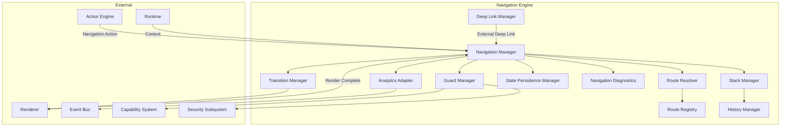
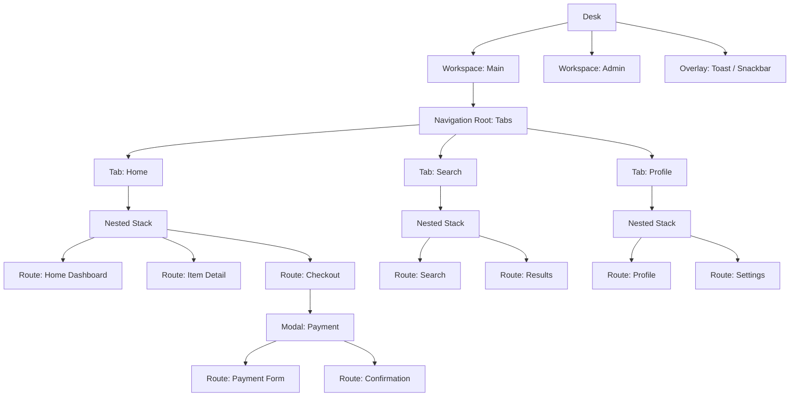
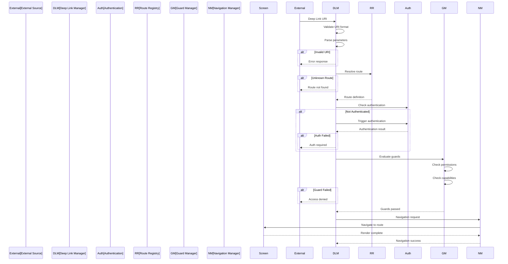
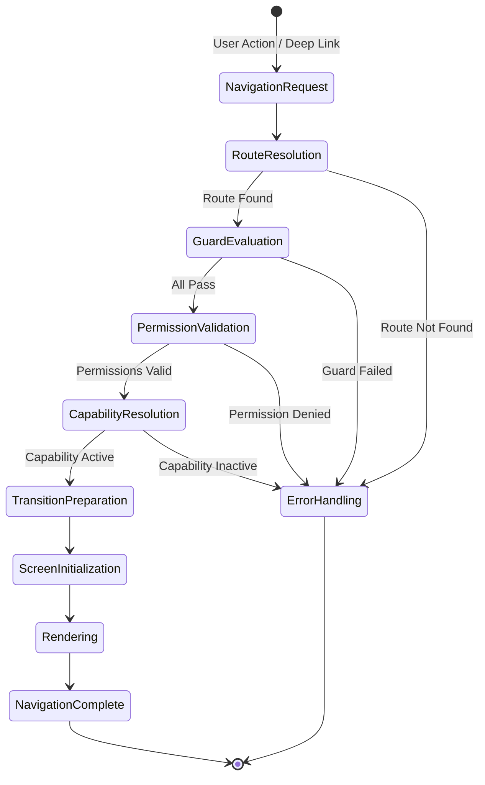

# Navigation Engine

**KB-016 — Navigation Engine Specification**

| Metadata | |
|----------|---|
| **KB ID** | KB-016 |
| **Title** | Navigation Engine |
| **Version** | 0.1.0 |
| **Status** | Drafting |
| **Owner** | Architecture Team |
| **Dependencies** | KB-012 Component Registry, KB-013 Component Model, KB-014 Layout System, Manifest Specification, Capability System |
| **Related Documents** | Runtime Overview, Manifest Specification, Renderer Architecture, Action Engine (KB-015), Theme Engine (KB-017), State Management (KB-018), Event Bus (KB-019), Builder Studio |
| **Review Status** | Pending |
| **Last Updated** | 2026-07-10 |

### Revision History

| Version | Date | Author | Change |
|---------|------|--------|--------|
| 0.1.0 | 2026-07-10 | AI Architecture Agent | Initial draft |

---

## 1. Purpose

The Navigation Engine is the platform subsystem responsible for managing navigation, routing, screen transitions, deep linking, navigation state, access control, and the navigation lifecycle across all DUKADESK client platforms.

Navigation is separated from rendering because navigation is a structural and behavioral concern, not a visual one. Where the user can go, what they can access, and how they get there are decisions independent of how screens are rendered. Separating them means:

- **Navigation logic** can change without affecting rendering.
- **Deep links** bypass normal navigation paths without renderer involvement.
- **Permission and guard checks** occur before rendering begins.
- **Navigation state** persists independently of screen content.
- **Multiple renderers** share one navigation model.

Navigation is declarative. Routes, stacks, tabs, and transitions are defined in configuration — not in code. Declarative navigation is auditable, testable, portable, and safe for AI generation.

Every platform follows the same navigation model. Mobile, web, desktop, TV, and kiosk all use the same route definitions, guard logic, and navigation graph structure. Platform-specific behavior (swipe gestures, tab bars, sidebar width) is handled by the Renderer, not by navigation logic.

---

## 2. Navigation Philosophy

### Navigation Is State

Navigation is not a side effect — it is first-class state. The current route, stack history, active tabs, and modal state are part of the application's global state. Treating navigation as state means it can be serialized, restored, tested, and observed like any other state.

### Navigation Is Declarative

Routes, transitions, and navigation graphs are defined declaratively in manifests. There is no programmatic route registration or imperative navigation wiring. The Navigation Engine interprets declarations; it does not execute navigation code.

### Navigation Is Runtime-Managed

The Runtime owns the navigation lifecycle. Screens do not navigate to each other. Components dispatch actions, and actions may trigger navigation. The Runtime evaluates guards, resolves routes, manages stacks, and coordinates transitions. Components and screens are passive participants.

### Navigation Is Permission-Aware

Every navigation decision is subject to permission evaluation. The Navigation Engine checks authentication status, user roles, resource permissions, and capability availability before committing to a navigation. A route that the user is not authorized to access is never resolved.

### Navigation Is Capability-Driven

Navigation structure may change based on installed capabilities. A capability may contribute new routes, tabs, or navigation items. The Navigation Engine merges capability contributions into the navigation graph at resolution time.

### Navigation Is Platform-Independent

The navigation model makes no assumptions about platform navigation idioms. Stack navigation, tab navigation, drawer navigation, and sidebar navigation are all expressed in the same abstract terms. The Renderer maps abstract navigation types to platform-specific UI patterns.

### Navigation Supports Offline Operation

Navigation state, route definitions, and guards must be available offline. Deep links received while offline are queued and resolved when connectivity returns. The navigation graph is resolved from local manifest data, not server requests.

### Navigation Remains Observable

All navigation events are observable through the Event Bus. Route changes, guard evaluations, transitions, and navigation failures emit events that analytics, diagnostics, and other subsystems consume.

---

## 3. Navigation Responsibilities

### Route Resolution

Accept a navigation request (route ID, path, or deep link) and resolve it to a concrete route definition. Resolution includes parameter extraction, route matching, and default parameter application.

### Navigation Stack Management

Maintain the navigation stack per navigation root. Support push, pop, pop-to-root, replace, and insert operations. Each stack is independent and preserves its own history.

### History Management

Track the complete navigation history for session analytics, back-button support, and state restoration. History includes route parameters, scroll position, and screen state references.

### Deep Linking

Receive internal and external deep links, validate them, resolve them to routes, and execute navigation. Deep link handling includes authentication checks, capability activation, and error handling for unresolvable links.

### Screen Transitions

Coordinate screen transitions including enter, exit, replace, and overlay transitions. Transition parameters (animation, duration, interaction) are defined in the route or transition configuration and executed by the Renderer.

### Guard Evaluation

Evaluate navigation guards before route resolution completes. Guards check authentication, permissions, roles, capabilities, connectivity, and runtime conditions. Failed guards produce specific error states that the Navigation Engine handles.

### Permission Enforcement

Verify that the current user holds required permissions for the target route. Permission enforcement occurs during guard evaluation and is non-bypassable.

### State Restoration

Restore navigation state after application restart, process death, or session timeout. State restoration returns the user to their previous position in the navigation graph.

### Nested Navigation

Support navigation within navigation — stacks within tabs, tabs within drawers, modals within stacks. Each nested navigation root maintains its own independent stack and state.

### Modal Navigation

Manage modal presentation and dismissal. Modals are navigation events with specific transition and interaction semantics (blocking, dismissible, swipeable).

### Overlay Management

Manage transient overlays — toasts, dialogs, action sheets, popovers. Overlays are navigation-level concerns because they affect the navigation state (blocking interaction, requiring dismissal).

### External Navigation

Handle navigation to external destinations: web URLs, other applications, system settings, third-party app deep links.

### Navigation Analytics

Emit navigation events for analytics: route entries, exits, transitions, guard failures, deep-link resolutions, and navigation errors.

### Responsibility Boundaries

| Responsibility | Owner | Notes |
|---------------|-------|-------|
| Route resolution | Navigation Engine | Core responsibility |
| Stack operations | Navigation Engine | Push, pop, replace |
| Guard evaluation | Navigation Engine | Before route resolution |
| Permission checks | Navigation Engine | Delegates to security subsystem |
| Screen rendering | Renderer | After navigation confirms route |
| Transition animation | Renderer | Receives transition parameters from Navigation Engine |
| Action dispatch | Action Engine | Actions may trigger navigation; Navigation Engine executes it |
| Screen state persistence | State Management | Navigation Engine stores route context |
| Analytics events | Navigation Engine | Emitted through Event Bus |

---

## 4. Navigation Architecture

### 4.1 Navigation Manager

| Aspect | Description |
|--------|-------------|
| **Purpose** | Orchestrate the navigation lifecycle from request to screen rendering. |
| **Responsibilities** | Accept navigation requests, coordinate module execution, manage navigation state, emit lifecycle events. |
| **Inputs** | Navigation request (route ID, deep link, action), current navigation state, runtime context. |
| **Outputs** | Resolved navigation state, transition command, lifecycle events. |
| **Extension points** | Pre-navigation hooks, post-navigation hooks, custom navigation strategies. |

### 4.2 Route Registry

| Aspect | Description |
|--------|-------------|
| **Purpose** | Store and manage all route definitions from manifests, capabilities, and tenant overrides. |
| **Responsibilities** | Index routes by ID and path, manage route overrides, support route queries. |
| **Inputs** | Route definitions from manifests, capability contributions, tenant configurations. |
| **Outputs** | Route lookup results, route list by navigation root. |
| **Extension points** | Dynamic route registration, tenant route overlays. |

### 4.3 Route Resolver

| Aspect | Description |
|--------|-------------|
| **Purpose** | Match a navigation request to a concrete route definition. |
| **Responsibilities** | Parse route path, extract path and query parameters, match against registered routes, apply default parameters. |
| **Inputs** | Navigation request (route ID, path, or deep link URI). |
| **Outputs** | Resolved route definition with extracted parameters. |
| **Extension points** | Custom path matching strategies, parameter transformers. |

### 4.4 Stack Manager

| Aspect | Description |
|--------|-------------|
| **Purpose** | Manage navigation stacks for each navigation root. |
| **Responsibilities** | Execute push, pop, pop-to-root, replace operations. Enforce stack policies (max depth, duplicate prevention). |
| **Inputs** | Stack operation commands from Navigation Manager. |
| **Outputs** | Updated stack state. |
| **Extension points** | Custom stack policies, stack observation hooks. |

### 4.5 History Manager

| Aspect | Description |
|--------|-------------|
| **Purpose** | Maintain complete navigation history for the session. |
| **Responsibilities** | Record every navigation event, support forward/back navigation, prune history by policy, serialize for restoration. |
| **Inputs** | Navigation events from Stack Manager. |
| **Outputs** | History records, back/forward availability. |
| **Extension points** | Custom history storage backends, history pruning strategies. |

### 4.6 Deep Link Manager

| Aspect | Description |
|--------|-------------|
| **Purpose** | Handle incoming deep links from internal and external sources. |
| **Responsibilities** | Parse deep link URIs, validate format, resolve to routes, check authentication, handle errors. |
| **Inputs** | Deep link URI, source indicator (internal, external, push notification). |
| **Outputs** | Navigation request or error response. |
| **Extension points** | Custom URI scheme handlers, deep link validation rules. |

### 4.7 Guard Manager

| Aspect | Description |
|--------|-------------|
| **Purpose** | Evaluate all applicable guards before navigation is committed. |
| **Responsibilities** | Collect guards for the target route, evaluate in order, short-circuit on failure, report results. |
| **Inputs** | Resolved route, runtime context, user session. |
| **Outputs** | Guard evaluation verdict (pass/fail with reason). |
| **Extension points** | Custom guard types, configurable guard evaluation order. |

### 4.8 Transition Manager

| Aspect | Description |
|--------|-------------|
| **Purpose** | Coordinate screen transitions based on route and transition configuration. |
| **Responsibilities** | Select transition type, resolve transition parameters, coordinate with Renderer for execution. |
| **Inputs** | Source and destination routes, transition configuration, user preferences (reduced motion). |
| **Outputs** | Transition command for Renderer. |
| **Extension points** | Custom transition types, platform-specific transition adapters. |

### 4.9 State Persistence Manager

| Aspect | Description |
|--------|-------------|
| **Purpose** | Serialize and restore navigation state across sessions. |
| **Responsibilities** | Capture navigation state on suspend, restore on resume, handle version migration. |
| **Inputs** | Current navigation state, serialization triggers (suspend, background, crash). |
| **Outputs** | Serialized state for storage, restored state on resume. |
| **Extension points** | Custom serialization formats, selective state filtering. |

### 4.10 Navigation Diagnostics

| Aspect | Description |
|--------|-------------|
| **Purpose** | Collect and expose diagnostic information about navigation operations. |
| **Responsibilities** | Log navigation events, measure transition timing, track errors, expose health metrics. |
| **Inputs** | Events from all other modules. |
| **Outputs** | Diagnostic logs, metrics, health status. |
| **Extension points** | Custom diagnostic sinks, metrics exporters. |

### 4.11 Analytics Adapter

| Aspect | Description |
|--------|-------------|
| **Purpose** | Emit navigation analytics events through the Event Bus. |
| **Responsibilities** | Map navigation events to analytics schema, emit on Event Bus, support privacy filtering. |
| **Inputs** | Navigation events from Navigation Manager. |
| **Outputs** | Analytics events on Event Bus. |
| **Extension points** | Custom analytics schemas, privacy filter rules. |

### Navigation Architecture Diagram



---

## 5. Navigation Model

### Desk

The top-level navigation container representing the application window or device screen. A Desk contains one or more Workspaces. On mobile there is typically one Desk. On desktop there may be multiple windows, each with its own Desk.

### Workspace

A user-visible context within a Desk. Workspaces group related navigation graphs. Examples: "Main Workspace" for primary app flows, "Admin Workspace" for administration screens. Each Workspace has its own navigation state and history.

### Navigation Root

The entry point into a navigation graph. A Navigation Root defines the top-level navigation structure: stack, tabs, drawer, sidebar, or split view. Every screen lives within a Navigation Root.

### Navigation Graph

The complete structure of routes, stacks, tabs, and navigation relationships within a Navigation Root. The Navigation Graph is defined declaratively in the manifest and may be extended by capabilities.

### Route

A single navigable destination. A Route maps to a Screen (or in some cases, a Layout). Routes have identifiers, paths, parameters, guards, transitions, and metadata. Routes are the atomic unit of navigation.

### Screen

The visual destination of a Route. A Screen is composed of a Layout containing Sections, Containers, and Components. Multiple Routes may reference the same Screen definition with different parameters.

### Modal

A screen presented modally on top of the current navigation context. Modals block interaction with the underlying screen until dismissed. Modals have their own navigation stack or present a single screen.

### Drawer

A slide-out panel that reveals navigation options or content. Drawers may be persistent (sidebar) or temporary (menu drawer). Drawers contain their own navigation structure (typically a list of routes).

### Bottom Navigation

A persistent bottom bar with navigation items. Each item represents a top-level route or section of the application. Bottom Navigation is common on mobile and may collapse to a hamburger menu on smaller devices.

### Tabs

A tabbed navigation structure. Tabs may be top tabs, bottom tabs, or nested tabs. Each tab maintains an independent navigation stack. Tabs are defined declaratively with their associated routes.

### Nested Stack

A navigation stack within a tab, modal, or drawer. Nested stacks enable drill-down navigation within a section while preserving the parent navigation context. Each nested stack is isolated from other stacks.

### Overlay

A transient, non-blocking UI layer presented above the navigation hierarchy. Overlays include toasts, snackbars, popovers, tooltips, and action sheets. Overlays are part of the navigation model because they affect interaction state.

### Navigation Hierarchy Diagram



---

## 6. Route Definition

Every route is defined with the following properties. All fields are required unless marked as optional.

| Field | Type | Required | Description |
|-------|------|----------|-------------|
| **Route ID** | `string` | Yes | Unique identifier for the route within its navigation root. Must follow naming standards. Example: `orders.detail` |
| **Path** | `string` | Yes | URL-like path pattern for route matching. Supports parameters with `:param` syntax. Example: `/orders/:orderId` |
| **Parameters** | `object[]` | No | Declared path and query parameters. Each has a name, type, and optional default value. |
| **Query Parameters** | `string[]` | No | Declared query string parameter names. Undeclared query parameters are silently dropped. |
| **Title** | `string` | No | Human-readable title for the route. Used in navigation UI, document title, and screen reader announcements. |
| **Visibility** | `enum` | No | `visible` (default), `hidden` (accessible by direct navigation but not shown in menus), `private` (accessible only via deep link or internal navigation). |
| **Permissions** | `string[]` | No | Required permissions. The user must hold all permissions to navigate to this route. |
| **Feature Flags** | `string[]` | No | Required feature flags. All flags must be enabled for the route to be resolvable. |
| **Capability Owner** | `string` | No | The capability that owns this route. Routes from inactive capabilities are removed from the navigation graph. |
| **Metadata** | `object` | No | Arbitrary key-value metadata for analytics, documentation, and custom extension points. |
| **Transition** | `object` | No | Transition configuration: type (slide, fade, scale), duration, easing, interaction (swipeable, dismissible). |
| **Lifecycle Hooks** | `object[]` | No | Hooks executed at navigation lifecycle stages: `onEnter`, `onExit`, `onResume`, `onPause`. Each hook is an action reference. |

### Route Definition Example

```text
Route ID:          orders.detail
Path:              /orders/:orderId
Parameters:
  - orderId:       string (required)
Query Parameters:
  - source         string (default: "direct")
Title:             Order Detail
Visibility:        visible
Permissions:       [ "orders.read" ]
Capability Owner:  orders-management
Transition:
  type:            slide
  duration:        300ms
  direction:       left
Lifecycle Hooks:
  onEnter:         actions.logNavigation
  onExit:          actions.clearOrderCache
```

---

## 7. Navigation Types

### Stack Navigation

A linear navigation model where screens are pushed onto and popped from a stack. Each push shows a new screen; each pop returns to the previous screen. Use for drill-down flows: list to detail, product to checkout, settings subpages.

### Tab Navigation

A persistent set of navigation items, each representing a top-level section. Tabs may have nested stacks for drill-down within the section. Use for primary application sections that should be equally accessible: Home, Search, Orders, Profile.

### Drawer Navigation

A slide-out panel that reveals navigation options. Drawers may be persistent (on large screens) or temporary (overlaid on small screens). Use for settings menus, account navigation, and any secondary navigation structure.

### Bottom Navigation

A persistent bottom bar with 3–5 navigation items. Each item represents a top-level route. Bottom navigation is the dominant mobile navigation pattern. Use for the primary navigation structure on mobile applications.

### Sidebar Navigation

A persistent side panel containing navigation items. Common on desktop and tablet applications. Use for dashboard navigation, admin panels, and content management interfaces.

### Split View Navigation

Master-detail navigation where a list (master) and detail view coexist side by side. Selecting an item in the master updates the detail. Use for email clients, document browsers, and any list-detail workflow.

### Modal Navigation

A screen presented modally that blocks interaction with the underlying content. Modals have their own navigation context and may contain a stack. Use for forms, confirmations, checkout flows, and any task that should be completed before returning.

### Wizard Navigation

A step-by-step sequential flow. Each step is a screen; the user progresses forward and may go back. Use for onboarding, multi-step forms, setup flows, and checkout wizards.

### Nested Navigation

Any combination of the above where navigation types are embedded within each other: tabs within a drawer, stacks within tabs, modals within stacks. Nested navigation is the norm in feature-rich applications.

### Dynamic Navigation

Navigation structure that changes based on runtime conditions: capability installation, user role, feature flags, or tenant configuration. Dynamic navigation merges contributed routes into the navigation graph at resolution time.

### Navigation Type Selection

| When You Need | Use |
|---------------|-----|
| Top-level sections, equally important | Tab Navigation |
| Drill-down content hierarchy | Stack Navigation |
| Secondary or settings navigation | Drawer Navigation |
| Mobile-first primary navigation | Bottom Navigation |
| Desktop dashboard or admin panel | Sidebar Navigation |
| List + detail side by side | Split View Navigation |
| Interrupting task with required completion | Modal Navigation |
| Sequential multi-step process | Wizard Navigation |

---

## 8. Deep Linking

### Internal Deep Links

Navigation requests originating from within the application. Internal deep links use Route IDs or relative paths. The Navigation Engine resolves them directly through the Route Registry.

### External Deep Links

Navigation requests from outside the application: push notifications, email links, SMS links, QR codes, or other application URLs. External deep links are URIs that the Deep Link Manager parses and resolves.

### Universal Links

Platform-specific universal link formats: Universal Links (iOS), App Links (Android), or standard web URLs. The Deep Link Manager normalizes these to the internal route format before resolution.

### Dynamic Links

Links generated at runtime that contain dynamic parameters: campaign tracking codes, referral identifiers, or session tokens. Dynamic links are resolved identically to static links after parameter extraction.

### Parameter Mapping

Deep link parameters are mapped to route parameters:

| Source | Example | Route Parameter |
|--------|---------|-----------------|
| Path segment | `/orders/123` | `orderId: "123"` |
| Query string | `?source=email` | `source: "email"` |
| Fragment | `#section=reviews` | `section: "reviews"` |
| Custom scheme | `dukadesk://orders/123` | `orderId: "123"` |

### Validation

Deep links are validated before resolution:

- URI format validation.
- URI scheme whitelist.
- Parameter type validation.
- Required parameter presence.
- Maximum URI length enforcement.

### Authentication Requirements

If the target route requires authentication and the user is not authenticated:

1. The Navigation Engine intercepts the deep link.
2. The authentication flow is triggered.
3. Upon successful authentication, the original deep link is replayed.
4. If authentication fails, the deep link is discarded and an error is reported.

### Capability Activation

If the target route belongs to a capability that is not installed or not active:

1. The Navigation Engine checks whether the capability can be activated on demand.
2. If yes, capability activation is triggered.
3. Upon activation, the deep link proceeds.
4. If activation is not possible, an error is reported with guidance.

### Error Handling

| Scenario | Behavior |
|----------|----------|
| Malformed URI | Return error, log diagnostic |
| Unknown route | Show fallback screen, log diagnostic |
| Missing required parameter | Show parameter input screen or error |
| Authentication required | Trigger auth flow, replay on success |
| Permission denied | Show access denied screen, log analytics |
| Capability not available | Show capability unavailable message |
| Rate limited | Show rate limit message, log warning |

### Deep Link Resolution Diagram



---

## 9. Navigation Guards

### Authentication Guard

Verifies that the user has an active authenticated session. If not, the guard triggers the authentication flow and blocks navigation until authentication is confirmed. Authentication guards apply to all protected routes by default.

### Permission Guard

Verifies that the authenticated user holds the permissions declared on the route. Permission checks are granular and resource-specific. A route requiring `orders.read` and `orders.write` requires both.

### Role Guard

Verifies that the user has the required role or role hierarchy level. Role guards are evaluated after authentication but before permission guards.

### Capability Guard

Verifies that the capability owning the route is installed and active. If the capability is installable on demand, the guard may trigger activation.

### Subscription Guard

Verifies that the user's subscription plan includes access to the route's feature set. Subscription guards are evaluated after permission guards.

### Tenant Guard

Verifies that the route is available in the current tenant context. Some routes are tenant-specific or restricted to certain tenant tiers.

### Runtime Guard

Evaluates runtime conditions: application state, connectivity, device capabilities, available memory. Runtime guards prevent navigation when conditions would produce a poor experience.

### Connectivity Guard

Verifies that the required connectivity level is available. Routes requiring online access may be blocked when offline, with an appropriate message.

### Guard Evaluation Order

Guards are evaluated in a specific order. Each guard must pass before the next is evaluated. Short-circuit evaluation stops at the first failure.

```text
1. Authentication Guard
       │
       ▼ (if passes)
2. Capability Guard
       │
       ▼ (if passes)
3. Subscription Guard
       │
       ▼ (if passes)
4. Role Guard
       │
       ▼ (if passes)
5. Permission Guard
       │
       ▼ (if passes)
6. Tenant Guard
       │
       ▼ (if passes)
7. Runtime Guard
       │
       ▼ (if passes)
8. Connectivity Guard
       │
       ▼ (if all pass)
→ Navigation Proceeds
```

---

## 10. Navigation Lifecycle

### Lifecycle Stages

```
Navigation Request
       │
       ▼
Route Resolution
       │
       ▼
Guard Evaluation ──── Failed ──► Error Handling
       │
       ▼ Passed
Permission Validation
       │
       ▼
Capability Resolution
       │
       ▼
Transition Preparation
       │
       ▼
Screen Initialization
       │
       ▼
Rendering
       │
       ▼
Navigation Complete
```

### Stage Descriptions

**Navigation Request** — A navigation event is triggered by a user action (button tap, link click, gesture), a system event (deep link, push notification, timer), or programmatic dispatch (Action Engine). The request includes the target route identifier, parameters, and source context.

**Route Resolution** — The Route Resolver matches the request against the Route Registry. Path parameters and query parameters are extracted. Default parameters are applied. If the route cannot be resolved, an error is returned.

**Guard Evaluation** — The Guard Manager collects all applicable guards for the resolved route and evaluates them in order. If any guard fails, navigation is blocked and the error handling flow begins. Guard failures produce specific error states for diagnostics and user feedback.

**Permission Validation** — The user's permissions are verified against the route's required permissions. Permission validation is non-bypassable and enforced at the Navigation Engine level, not at the screen level.

**Capability Resolution** — If the route is owned by a capability, the Navigation Engine confirms the capability is active. If not, capability activation is attempted. If activation fails, navigation is blocked.

**Transition Preparation** — The Transition Manager selects the appropriate transition based on route configuration, platform, and user preferences (reduced motion). Transition parameters are prepared and passed to the Renderer.

**Screen Initialization** — The target screen's layout is resolved and components are prepared. Lifecycle hooks (`onEnter`) are executed. The screen initializes its state from route parameters and runtime context.

**Rendering** — The Renderer executes the transition animation while loading and displaying the screen content. The previous screen's lifecycle hooks (`onExit`) execute as it is removed.

**Navigation Complete** — The Navigation Manager records the navigation in history, updates navigation state, emits analytics events, and notifies subscribers through the Event Bus. The screen is now the active destination.

### Navigation Lifecycle Diagram



---

## 11. State Management Integration

### Navigation State

Navigation state is a first-class citizen in the application state model. The Navigation Engine exposes:

- Current route ID and parameters.
- Active navigation root and stack.
- Full back-stack per navigation root.
- Open modals and overlays.
- Tab selection state.
- Scroll position per screen.

### Back Stack

Each navigation root maintains an independent back stack. The back stack contains:

- Route ID and parameters for each entry.
- Screen state reference (for state restoration).
- Scroll position.
- Timestamp.

Back-stack operations:

- **push**: Add entry to stack top.
- **pop**: Remove and return top entry.
- **popToRoot**: Remove all entries except root.
- **peek**: Return top entry without removing.
- **replace**: Replace top entry with new route.

### Restoration

Navigation state is serialized on application suspend and deserialized on resume:

1. The State Persistence Manager captures the full navigation state tree.
2. State is serialized to a platform-appropriate storage.
3. On resume, the state is deserialized and validated.
4. If state is invalid (capability removed, route deleted), graceful fallback is applied.
5. The user is returned to their previous position.

### Persistence

Navigation state may be persisted beyond session boundaries:

- Cross-session persistence for long-running workflows.
- Crash recovery.
- Background state preservation.

### Session Recovery

After a crash or forced termination:

1. The Navigation Engine checks for persisted state on startup.
2. If found, state is restored and validated.
3. Invalid routes are replaced with fallback destinations.
4. The user is returned to the nearest valid navigation position.

### Cross-Device Continuation (Future)

Future support for:

- Serialize navigation state to cloud storage.
- Resume navigation on a different device.
- Share navigation state between companion devices.

---

## 12. Runtime Integration

### Runtime

The Runtime provides the execution context for the Navigation Engine:

- Application lifecycle events (foreground, background, suspend).
- Device context (platform, orientation, connectivity).
- User session and authentication state.
- Feature flag state.
- Theme selection.

### Manifest

Navigation definitions originate from manifests. The Runtime loads manifests and passes them to the Navigation Engine's Route Registry. Manifests define:

- Navigation root structure.
- Route definitions.
- Navigation guards.
- Transition configurations.
- Capability contributions to navigation.

### Capability System

Capabilities contribute routes and navigation items to the navigation graph:

1. On capability installation, the capability's navigation contribution is merged into the active Route Registry.
2. The Navigation Engine re-evaluates the navigation graph.
3. New routes become available; new tabs or navigation items appear.
4. On capability removal, contributed routes are removed and the graph is re-evaluated.

### Renderer

The Navigation Engine and Renderer interact through the Transition Manager:

- The Navigation Engine resolves where to go (route, parameters).
- The Transition Manager decides how to get there (animation, duration).
- The Renderer executes the transition and displays the screen.

### Action Engine

Navigation is triggered through actions:

- `navigate(routeId, params)` — Navigate to a route.
- `goBack()` — Pop the stack.
- `goBackToRoot()` — Pop to root of current stack.
- `openModal(routeId, params)` — Present a modal.
- `dismissModal()` — Dismiss current modal.
- `openDrawer()` — Open the drawer.
- `closeDrawer()` — Close the drawer.
- `switchTab(tabId)` — Switch to a tab.
- `deepLink(uri)` — Process a deep link.

The Action Engine dispatches these actions; the Navigation Manager executes them.

### State Management

Navigation state is a subset of application state. The Navigation Engine reads and writes navigation state through the State Management subsystem. State changes in other domains may trigger navigation (e.g., login state change triggers route to home).

### Event Bus

The Navigation Engine emits navigation events through the Event Bus:

- `navigation.started` — Navigation request received.
- `navigation.routeResolved` — Route matched.
- `navigation.guardEvaluated` — Guard result.
- `navigation.transitionStarted` — Transition beginning.
- `navigation.transitionComplete` — Transition finished.
- `navigation.complete` — Navigation fully complete.
- `navigation.failed` — Navigation failed with reason.
- `navigation.deepLinkReceived` — Deep link processed.

---

## 13. Builder Studio Integration

### Navigation Designer

The Builder provides a visual navigation designer:

- Drag-and-drop navigation graph construction.
- Visual linking of routes to screens.
- Stack, tab, and drawer configuration.
- Transition preview.

### Route Editor

The Builder includes a route editor for configuring:

- Route ID and path.
- Parameters and query parameters.
- Permissions and guards.
- Metadata and lifecycle hooks.
- Transition type and parameters.

### Navigation Graph Visualization

The Builder displays the navigation graph as an interactive diagram:

- Nodes represent routes and screens.
- Edges represent navigation relationships.
- Tabs and stacks are shown as grouped containers.
- Modals are shown as overlapping nodes.
- Color coding indicates guarded routes, protected routes, and capability-owned routes.

### Deep-Link Testing

The Builder provides deep-link testing tools:

- Enter a deep-link URI and simulate navigation.
- View the full resolution pipeline.
- See guard evaluation results.
- Preview the target screen in context.

### Preview Mode

The Builder supports navigation preview:

- Simulate navigation flows without a live Runtime.
- Test transitions between screens.
- Verify guard and permission behavior.
- Validate deep links and parameter passing.

### Validation

The Builder validates navigation definitions:

- Route ID uniqueness within navigation root.
- Path pattern correctness.
- Parameter consistency between routes.
- Guard configuration validity.
- Cycle detection in navigation graphs.
- Orphaned routes (routes not reachable from any navigation root).

### Guard Configuration

The Builder provides guard configuration interfaces:

- Visual guard chain builder.
- Permission and role selectors.
- Capability and feature flag toggles.
- Connectivity requirement settings.
- Guard test mode for verifying behavior.

---

## 14. Theme Integration

### Navigation Bars

Theme tokens control the appearance of navigation bars:

- Background color.
- Foreground color (title, icons).
- Elevation and shadow.
- Border and separator styles.
- Height and padding.

### Drawers

Theme tokens control drawer appearance:

- Width (collapsed, expanded).
- Background and foreground colors.
- Item selection indicators.
- Icon colors and sizes.

### Menus

Theme tokens control menu appearance:

- Item height and padding.
- Active and hover states.
- Separator styles.
- Submenu indentation.

### Breadcrumbs

Theme tokens control breadcrumb appearance:

- Separator symbol and color.
- Active and inactive link styles.
- Font size and weight.

### Transitions

Theme tokens may influence transition parameters:

- Duration (reduced motion override).
- Easing curves.
- Scale and opacity factors.

### Icons

Theme tokens control icon selection:

- Icon set selection.
- Icon sizes per navigation element.
- Active and inactive icon styles.

### Responsive Layouts

Theme tokens may define breakpoints that influence navigation layout:

- Breakpoint at which tabs collapse to a drawer.
- Breakpoint at which sidebar switches from persistent to temporary.
- Breakpoint at which bottom navigation appears.

Themes affect appearance, not navigation logic. A route guarded by permissions remains guarded regardless of theme. A stack navigation behaves identically under light and dark themes.

---

## 15. Accessibility

### Keyboard Navigation

The Navigation Engine supports full keyboard navigation:

- **Tab**: Move between navigable elements (tabs, links, buttons).
- **Shift+Tab**: Reverse navigation.
- **Enter/Space**: Activate focused navigation item.
- **Arrow keys**: Navigate within tab bars, menus, and drawer items.
- **Escape**: Close drawers, modals, popovers.
- **Ctrl+Tab / Ctrl+Shift+Tab**: Switch tabs (desktop).

### Focus Management

On navigation:

1. Focus is moved to the new screen's first interactive element or a designated skip-to-content target.
2. Focus is preserved when returning to a previous screen via back navigation.
3. Focus is trapped within modals until dismissed.
4. Focus restoration returns the user to their previous focus position on backward navigation.

### Screen Reader Announcements

The Navigation Engine triggers screen reader announcements on navigation events:

- "Navigating to [Route Title]"
- "Modal opened: [Modal Title]"
- "Tab selected: [Tab Name]"
- "Back to [Previous Route Title]"
- "Navigation failed: [Reason]"

### Landmark Regions

Navigation elements are assigned ARIA landmark roles:

- `navigation` — Main navigation, tabs, drawers.
- `banner` — Top navigation bar.
- `complementary` — Sidebars.
- `main` — Primary content area.
- `contentinfo` — Footer navigation.

### Skip Navigation

The first focusable element on every screen is a "Skip to content" link that bypasses navigation UI and moves focus to the main content area.

### Reduced Motion

When reduced motion is enabled:

- All navigation transitions are instantaneous (zero duration).
- All slide and scale animations are disabled.
- Fade transitions are replaced with instant appearance.
- Progress indicators in wizards animate with CSS-only or reduced alternatives.

### High Contrast Support

Navigation elements maintain sufficient contrast ratios in high contrast mode:

- Active and inactive navigation items are visually distinct.
- Focus indicators are visible and high-contrast.
- Separator lines and borders are preserved.

---

## 16. Performance

### Route Preloading

Routes likely to be navigated next may be preloaded:

- Preload the first screen in each tab on application start.
- Preload linked screens on hover or long-press (desktop).
- Preload the previous screen during forward navigation.
- Preload based on predictive navigation models.

### Lazy Loading

Routes not immediately needed are loaded lazily:

- Screens in inactive tabs.
- Screens deep in a navigation stack.
- Screens gated by permissions the user does not hold.
- Screens from capabilities not yet activated.

### Predictive Navigation

The Navigation Engine may predict next navigation based on:

- Common user flows.
- Current screen context.
- Time-based patterns.
- Usage analytics.

Predicted routes are candidates for preloading but are never resolved or rendered before explicit navigation.

### Navigation Caching

Resolved navigation state and route definitions are cached:

- Route registry is cached on application start.
- Resolved navigation state is cached during the session.
- Deep-link resolution results are cached for repeated links.
- Guard evaluation results are cached for the session duration.

### Transition Optimization

Transitions are optimized for performance:

- GPU-accelerated transitions where available.
- Transition animations run on the compositor thread, not the main thread.
- Heavy screens begin rendering before the transition animation completes.
- Screen content is progressively revealed (text before images, above-fold before below-fold).

### History Pruning

Navigation history is pruned to prevent unbounded growth:

- Maximum stack depth per navigation root (configurable, default 50).
- Maximum total history entries (configurable, default 200).
- Oldest entries are pruned first.
- Critical routes (checkout, form steps) are protected from pruning.

---

## 17. Security

### Route Authorization

Routes are authorized at the Navigation Engine level, not at the screen level. Authorization is evaluated during guard evaluation, before any screen code executes. This prevents unauthorized access even if a screen is somehow referenced directly.

### Deep-Link Validation

Deep links from external sources are validated:

- URI scheme must be in the whitelist.
- URI format must match expected patterns.
- Parameters must not contain injection payloads.
- Redirect URLs must be in the allowlist (open redirect prevention).

### Protected Routes

Routes with sensitive content or actions are flagged as protected:

- Protected routes require re-authentication for access.
- Protected routes may be time-gated (require recent authentication).
- Protected routes may be session-scoped (expire with session).

### Sensitive Parameter Handling

Route parameters containing sensitive data (PII, tokens, session IDs) are:

- Stripped from navigation history.
- Excluded from analytics events.
- Removed from serialized navigation state.
- Logged only in secure audit trails.

### Session Verification

Navigation events may trigger session verification:

- Periodic re-verification of session validity.
- Session verification on sensitive route entry.
- Session termination detection and navigation to login.

### Open Redirect Prevention

Navigation to external URLs is validated:

- External navigation targets must be in an allowlist.
- User confirmation is required for navigation to unknown domains.
- Deep link parameters are not used as redirect targets without validation.

---

## 18. Observability

### Navigation Logs

Every navigation event is logged:

- Timestamp.
- Source (user action, deep link, system).
- Source route (if applicable).
- Target route ID and parameters.
- Resolution result.
- Guard evaluation results.
- Transition type and duration.
- Error details (if any).
- User ID (anonymized where required).

### Transition Timing

Navigation transitions are timed and recorded:

- Route resolution time.
- Guard evaluation time.
- Screen initialization time.
- Transition animation duration.
- Total navigation-to-render time.

### Route Analytics

Aggregated route analytics:

- Most frequently navigated routes.
- Route entry and exit counts.
- Average time spent per route.
- Navigation funnel analysis (where users go from each route).
- Abandonment rates per flow.

### User Journey Tracking

The Navigation Engine supports user journey tracking:

- Track complete navigation paths through the application.
- Identify common and uncommon navigation patterns.
- Detect navigation loops and dead ends.
- Correlate navigation with business outcomes.

### Diagnostics

The Navigation Diagnostics module exposes:

- Current navigation state tree.
- Active route and parameters.
- Back stack contents per navigation root.
- Open modals and overlays.
- Pending navigation requests.
- Guard evaluation history.

### Error Reporting

Navigation errors are reported with full context:

- Route resolution failures.
- Guard evaluation failures.
- Transition execution errors.
- State serialization/deserialization errors.
- Deep link processing errors.

---

## 19. Anti-Patterns

### Hardcoded Routes

Embedding route identifiers or paths in component code is prohibited. Components must dispatch abstract actions; the Navigation Engine maps actions to routes through the manifest. Hardcoded routes create tight coupling between components and navigation structure.

### Direct Navigation from Business Logic

Allowing business logic (services, stores, capability handlers) to directly trigger navigation is prohibited. Business logic must dispatch actions through the Action Engine. The Navigation Engine is the only subsystem that executes navigation.

### Duplicate Route Definitions

Defining the same route ID in multiple manifests or in multiple locations within a navigation root is prohibited. Duplicate route definitions cause ambiguous resolution. The Route Registry enforces uniqueness.

### Navigation Without Authorization

Navigating to a route without evaluating guards and permissions is prohibited. Every navigation request must pass through the full guard evaluation pipeline. Bypassing guards is a security violation.

### Circular Navigation

Creating navigation paths that can loop indefinitely without user-initiated direction changes is prohibited. Circular navigation causes poor user experience and potential stack overflow. The Navigation Engine detects and warns about circular navigation patterns.

### Platform-Specific Route Assumptions

Defining routes that assume specific platform navigation idioms (e.g., swipe gestures on iOS, hamburger menus on Android) is prohibited. Routes are platform-independent. Platform-specific navigation UI is handled by the Renderer, not the navigation definition.

### Hidden Routes

Registering routes with `visibility: hidden` as a substitute for proper permission-based access control is prohibited. Hidden routes are still resolvable through direct navigation. Access control must use guards and permissions, not visibility settings.

### Navigation in Renderer

Allowing the Renderer to make navigation decisions is prohibited. The Renderer executes transitions and displays screens. It must not decide where to navigate, resolve routes, or evaluate guards.

### Unmanaged Back Stack

Allowing unbounded stack growth or failing to prune history is prohibited. Unmanaged stacks degrade performance and user experience. The Stack Manager enforces stack depth limits and pruning policies.

### Ignoring Navigation State

Failing to serialize, restore, or validate navigation state on application restart is prohibited. Users expect to return to their previous position. State restoration is a mandatory capability of the Navigation Engine.

---

## 20. Future Evolution

### Multi-Window Navigation

Future support for multiple application windows (desktop, tablet multi-window):

- Each window has an independent Desk and navigation state.
- Navigation actions may target specific windows.
- Drag-and-drop navigation items between windows.
- Window position and size persistence.

### Foldable Devices

Navigation on foldable devices:

- Posture-aware navigation (folded, partially open, flat).
- Navigation state transfer between screens when unfolding.
- Hinge-aware navigation (avoid placing navigation elements on hinge).
- Continuous navigation experience across folding state changes.

### Desktop Workspaces

Desktop navigation may support workspaces:

- Multiple independent workspaces per Desk.
- Workspace-level navigation state.
- Workspace switching with preview.
- Persistent workspace state across sessions.

### Voice Navigation

Future support for voice-driven navigation:

- Voice commands mapped to navigation actions.
- Screen reader announcements for voice feedback.
- Voice navigation guard evaluation.
- Voice deep-link processing.

### AI-Assisted Navigation

AI agents may:

- Suggest navigation optimizations based on usage patterns.
- Auto-generate navigation graphs from screen requirements.
- Predict user navigation and preload routes.
- Detect navigation anti-patterns and suggest corrections.

### Adaptive Navigation

Navigation that adapts to user behavior:

- Reorder navigation items based on frequency of use.
- Surface contextually relevant routes.
- Collapse infrequently used sections.
- Personalize navigation structure per user.

### Spatial Computing

Navigation in AR/VR environments:

- Spatial navigation roots (rooms, zones).
- Gaze-based navigation selection.
- Gesture-based navigation commands.
- 3D navigation transitions.

### Cross-Device Session Continuity

Future support for seamless navigation across devices:

- Serialize navigation state to cloud.
- Resume navigation on another device.
- Synchronize back stack across devices.
- Handoff active navigation between companion devices.

---

## 21. Relationship to Other Documents

| Document | Relationship |
|----------|--------------|
| **Runtime Overview** | The Runtime owns the navigation lifecycle. Navigation Engine is a subsystem of the Runtime. |
| **Manifest Specification** | Navigation definitions originate from manifests. Route definitions, navigation graphs, and guard configurations are manifest-level concerns. |
| **Renderer Architecture** | The Renderer executes transitions and displays screens determined by the Navigation Engine. |
| **KB-012 — Component Registry** | Components are the content of screens reached through navigation. The Registry is not navigation-aware. |
| **KB-013 — Component Model** | Screen components follow the Component Model contract. Navigation lifecycle hooks are component-level events. |
| **KB-014 — Layout System** | Screens (navigation destinations) contain layouts. The Layout System defines screen structure; the Navigation Engine defines screen access. |
| **KB-015 — Action Engine** | Navigation is triggered by actions. The Action Engine dispatches navigation actions; the Navigation Engine executes them. |
| **KB-017 — Theme Engine** | Themes influence navigation appearance (bars, drawers, tabs) without affecting navigation logic. |
| **KB-018 — State Management** | Navigation state is a subset of application state. State changes may trigger navigation; navigation changes update state. |
| **KB-019 — Event Bus** | Navigation events are published on the Event Bus for analytics, diagnostics, and cross-subsystem coordination. |
| **Builder Studio** | The Builder provides navigation design, editing, and testing tools based on this specification. |

---

*This is KB-016, the Navigation Engine specification of the DUKADESK Engineering Knowledge Base. It defines the platform subsystem responsible for managing navigation, routing, screen transitions, deep linking, navigation state, and access control across all client platforms.*
