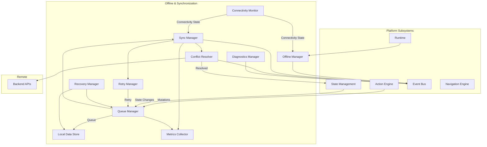
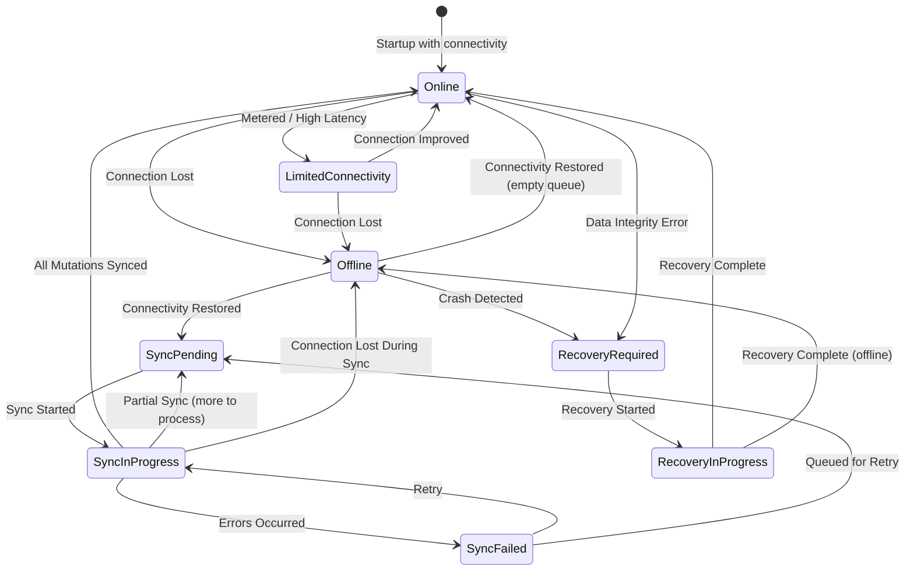
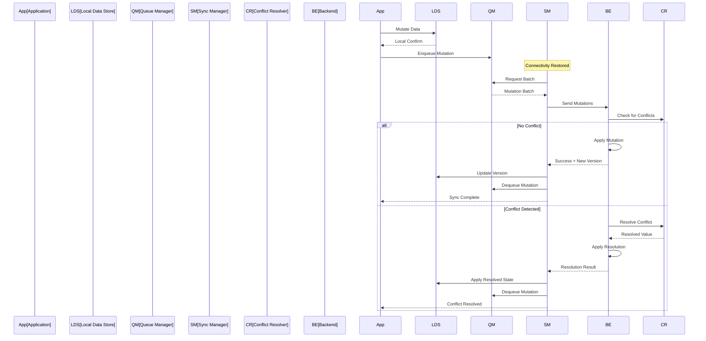
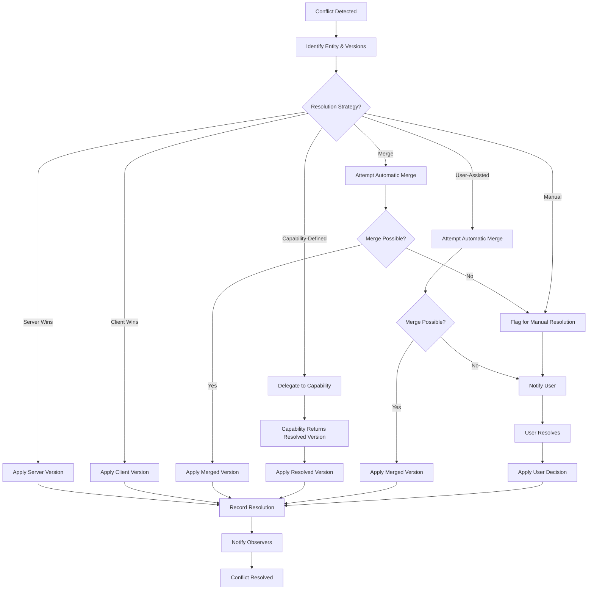

# Offline & Synchronization

**KB-020 — Offline & Synchronization Specification**

| Metadata | |
|----------|---|
| **KB ID** | KB-020 |
| **Title** | Offline & Synchronization |
| **Version** | 0.1.0 |
| **Status** | Drafting |
| **Owner** | Architecture Team |
| **Dependencies** | KB-018 State Management, KB-019 Event Bus, KB-015 Action Engine |
| **Related Documents** | Runtime Overview (KB-008), State Management (KB-018), Event Bus (KB-019), Action Engine (KB-015), Capability System (KB-010), Publishing Pipeline (KB-031), Backend Architecture, Builder Studio (KB-022) |
| **Review Status** | Pending |
| **Last Updated** | 2026-07-10 |

### Revision History

| Version | Date | Author | Change |
|---------|------|--------|--------|
| 0.1.0 | 2026-07-10 | AI Architecture Agent | Initial draft |

---

## 1. Purpose

Offline capability is a core platform feature of DUKADESK, not an optional enhancement. The platform targets businesses operating in regions with unreliable connectivity, field workers moving through coverage gaps, and users who expect applications to work regardless of network status. Every client — Mobile, Desktop, Web (where supported), and future platforms — must function without a constant internet connection.

Synchronization is separated from application logic because synchronization is a cross-cutting concern that applies to every mutation, every state change, and every data entity. Embedding synchronization logic in individual capabilities, services, or components would produce inconsistent behavior, duplicated code, and fragile error handling. The Offline & Synchronization subsystem provides a unified mechanism that all capabilities and components use transparently.

Eventual consistency is preferred over blocking users because DUKADESK users cannot wait for server confirmation to continue working. A field worker processing an order, a technician updating a job status, or a salesperson creating a quote must complete their task immediately and trust that synchronization will resolve any conflicts later. Blocking the user for network round trips violates the offline-first principle.

Synchronization policies should be configurable because different data has different consistency requirements. An order mutation may need stronger guarantees than a product view counter. Each capability defines its synchronization policy — immediate, batched, scheduled, or priority-based — and the subsystem enforces it.

---

## 2. Offline Philosophy

### Offline First

All application features must work without network connectivity. Offline-first means the local device is the primary data store and the server is a synchronization target. Features are not classified as "online" or "offline" — all features work in both modes. The only difference is synchronization timing.

### Local Before Remote

Every mutation is written to the local store first. The local write is the authoritative write from the user's perspective. The remote write follows asynchronously. If the remote write fails (connectivity issue, conflict, validation error), the local state reflects the user's intent and the system resolves the discrepancy later.

### Eventual Consistency

The system guarantees that all clients will converge to the same state over time, provided no new mutations are made. Eventual consistency means users may see slightly different data in the short term, but the system guarantees convergence. This trade-off is explicit and accepted in favor of continuous availability.

### Predictable Conflict Resolution

Conflicts are resolved according to declared policies, not ad-hoc decisions. Every synchronizable entity declares its conflict resolution strategy. Users and developers can predict exactly how a conflict will be resolved. There are no surprises.

### Retry by Policy

Failed synchronization attempts are retried according to configurable policies. Retry is not infinite, not silent, and not blocking. Policies define backoff schedules, retry limits, permanent failure conditions, and user notification rules.

### Durable Local Storage

Local data is stored durably and survives application restart, device reboot, and storage pressure. The local store is not a cache — it is an authoritative copy of the user's data. Data integrity is maintained through transactional writes and validation on read.

### Transparent Synchronization

Synchronization operates in the background without user intervention. Users are notified only when their attention is required: a conflict that needs manual resolution, a permanent failure that prevents sync, or connectivity restoration after extended offline periods.

### User Awareness

Users are informed of synchronization status without being burdened by it. A subtle indicator shows connectivity state. Synchronization progress is accessible but not prominent. Conflicts requiring user input are surfaced clearly with context.

### Data Integrity

Local and remote data must converge to a consistent state. Data integrity is maintained through version tracking, ordered mutation logs, and transactional conflict resolution. Data is never lost, duplicated, or corrupted through the synchronization process.

### Security by Default

Synchronized data is protected in transit and at rest. Local storage is encrypted. Synchronization channels use authenticated and encrypted connections. Sensitive data is never synchronized in plaintext and is excluded from synchronization where local-only storage is required.

---

## 3. Responsibilities

### Local Persistence

Store data durably on the device. Local persistence handles read and write operations against the local data store, maintains data integrity through transactions, and manages storage quotas and pruning.

### Offline Operation

Ensure all application features remain functional without network connectivity. The Offline Manager provides connectivity status to the Runtime, intercepts outbound requests when offline, and ensures the UI reflects availability state.

### Request Queuing

Capture mutations made while offline, preserve their order, and prepare them for synchronization. The Queue Manager maintains the mutation queue with ordering, prioritization, deduplication, and expiration.

### Synchronization Scheduling

Determine when to synchronize based on connectivity state, policy configuration, queue state, and system conditions. The Sync Manager evaluates sync triggers (connectivity restored, timer elapsed, queue threshold reached) and initiates synchronization.

### Conflict Detection

Detect when the same data has been modified in multiple places before synchronization completes. Conflict detection compares versions, timestamps, or revision identifiers to determine whether a conflict exists.

### Conflict Resolution

Apply the configured resolution strategy when a conflict is detected. Resolution may be automatic (server wins, client wins, merge) or manual (user decision). The result is written to both local and remote stores.

### Retry Management

Retry failed synchronization attempts according to the configured policy. Retry management handles backoff scheduling, retry limits, permanent failure detection, and user notification escalation.

### Connectivity Monitoring

Monitor network connectivity state and notify subscribers of changes. The Connectivity Monitor detects connection type (wifi, cellular, offline), bandwidth estimates, and connectivity quality metrics.

### Recovery

Handle recovery after extended offline periods, application crash during sync, or data corruption. The Recovery Manager validates local data integrity, replays the mutation queue, and reconciles any inconsistencies.

### Diagnostics

Collect and expose diagnostic information about offline operation, synchronization performance, conflict history, and error states. Diagnostics support debugging, monitoring, and analytics.

### Responsibility Boundaries

| Responsibility | Owner | Notes |
|---------------|-------|-------|
| Local persistence | Offline Manager | Writes to Local Data Store |
| Offline operation | Offline Manager | Monitors connectivity, routes requests |
| Request queuing | Queue Manager | Preserves mutation order and priority |
| Sync scheduling | Sync Manager | Evaluates triggers, initiates sync |
| Conflict detection | Sync Manager | During sync, before resolution |
| Conflict resolution | Conflict Resolver | Configurable per entity type |
| Retry management | Retry Manager | Backoff, limits, escalation |
| Connectivity monitoring | Connectivity Monitor | Provides connectivity state |
| Recovery | Recovery Manager | After crash or extended offline |
| Diagnostics | Diagnostics Manager | Always active |
| State after mutation | State Management | Writes to State Registry first |
| Action dispatch | Action Engine | Triggers mutations that enter queue |
| Event publication | Event Bus | Sync lifecycle events |
| Queue persistence | Queue Manager | Delegates to Local Data Store |

---

## 4. Offline Architecture

### 4.1 Offline Manager

| Aspect | Description |
|--------|-------------|
| **Purpose** | Orchestrate offline operation and synchronization lifecycle. |
| **Responsibilities** | Initialize offline subsystem, coordinate modules, handle lifecycle events, emit status events. |
| **Inputs** | Connectivity state, lifecycle events (startup, suspend, resume), policy configuration. |
| **Outputs** | Offline status, synchronization triggers, lifecycle events on Event Bus. |
| **Extension points** | Custom offline behaviors per platform, policy overrides per deployment. |

### 4.2 Connectivity Monitor

| Aspect | Description |
|--------|-------------|
| **Purpose** | Detect and report network connectivity state and quality. |
| **Responsibilities** | Monitor network interfaces, detect state changes, estimate bandwidth and latency, report connectivity quality. |
| **Inputs** | Platform network APIs, periodic probes. |
| **Outputs** | Connectivity state (online, offline, limited), quality metrics. |
| **Extension points** | Custom connectivity detectors, platform-specific network monitoring. |

### 4.3 Local Data Store

| Aspect | Description |
|--------|-------------|
| **Purpose** | Provide durable, queryable local storage for all offline-capable data. |
| **Responsibilities** | Store data entities, support CRUD operations, maintain indexes, enforce schema validation, manage storage quotas. |
| **Inputs** | Read and write requests from State Management, Queue Manager, and capabilities. |
| **Outputs** | Query results, write confirmations, storage metrics. |
| **Extension points** | Custom storage backends, encryption providers, data migration handlers. |

### 4.4 Queue Manager

| Aspect | Description |
|--------|-------------|
| **Purpose** | Manage the queue of mutations awaiting synchronization. |
| **Responsibilities** | Enqueue mutations, preserve order, support prioritization, deduplicate, expire stale entries, persist queue across restarts. |
| **Inputs** | Mutations from Action Engine (via State Management), retry requests from Retry Manager. |
| **Outputs** | Ordered mutation batches for Sync Manager, queue status metrics. |
| **Extension points** | Custom queue ordering strategies, priority schemes, deduplication rules. |

### 4.5 Sync Manager

| Aspect | Description |
|--------|-------------|
| **Purpose** | Execute synchronization of queued mutations with remote backends. |
| **Responsibilities** | Evaluate sync triggers, batch mutations for transmission, send to backend, receive responses, handle partial success, coordinate conflict resolution. |
| **Inputs** | Queue batches from Queue Manager, sync triggers (connectivity, timer, threshold). |
| **Outputs** | Sync results (success, partial, failed), conflict notifications, status updates. |
| **Extension points** | Custom sync protocols, batching strategies, transport backends. |

### 4.6 Conflict Resolver

| Aspect | Description |
|--------|-------------|
| **Purpose** | Detect and resolve conflicts between local and remote data versions. |
| **Responsibilities** | Compare versions during sync, apply configured resolution strategy, record resolution decisions, notify affected consumers. |
| **Inputs** | Local and remote data versions, resolution strategy configuration. |
| **Outputs** | Resolved data, conflict records, notifications on Event Bus. |
| **Extension points** | Custom resolution strategies per entity type, merge algorithms, user resolution interfaces. |

### 4.7 Retry Manager

| Aspect | Description |
|--------|-------------|
| **Purpose** | Manage retry of failed synchronization operations. |
| **Responsibilities** | Schedule retries with backoff, enforce retry limits, detect permanent failures, escalate to user notification. |
| **Inputs** | Failed sync results from Sync Manager, retry policy configuration. |
| **Outputs** | Retry triggers for Queue Manager, permanent failure notifications. |
| **Extension points** | Custom backoff algorithms, escalation policies, notification channels. |

### 4.8 Recovery Manager

| Aspect | Description |
|--------|-------------|
| **Purpose** | Handle recovery after application crash, extended offline periods, or data corruption. |
| **Responsibilities** | Validate local data integrity, replay mutation queue, reconcile with server state, report recovery status. |
| **Inputs** | Startup events, crash detection, data integrity check results. |
| **Outputs** | Recovery status, reconciliation results, diagnostic reports. |
| **Extension points** | Custom recovery strategies, data integrity validators. |

### 4.9 Diagnostics Manager

| Aspect | Description |
|--------|-------------|
| **Purpose** | Collect and expose diagnostic information about offline and synchronization operations. |
| **Responsibilities** | Log sync events, track metrics, record conflict history, expose health status. |
| **Inputs** | Events from all other modules. |
| **Outputs** | Diagnostic logs, metrics, health status, conflict reports. |
| **Extension points** | Custom diagnostic sinks, metrics exporters, audit trail backends. |

### 4.10 Metrics Collector

| Aspect | Description |
|--------|-------------|
| **Purpose** | Collect and aggregate performance and operational metrics. |
| **Responsibilities** | Track sync durations, queue depths, conflict rates, retry counts, bandwidth usage. |
| **Inputs** | Events from Queue Manager, Sync Manager, Retry Manager, Connectivity Monitor. |
| **Outputs** | Aggregated metrics for diagnostics, analytics, and monitoring. |
| **Extension points** | Custom metric definitions, reporting destinations. |

### Offline Architecture Diagram



---

## 5. Offline Data Categories

### Runtime Data

Data that describes the application environment and configuration. Must be available offline for the application to function.

| Data | Local Storage | Sync Behavior | Notes |
|------|---------------|---------------|-------|
| Application configuration | Persistent | One-way (server→client) | Downloaded on first launch |
| Feature flags | Persistent | One-way (server→client) | Cached with TTL |
| Capability manifests | Persistent | One-way (server→client) | Downloaded on capability install |
| Navigation metadata | Persistent | One-way (server→client) | Navigation graph definition |
| Theme definitions | Persistent | One-way (server→client) | Downloaded on theme change |

### User Data

Data describing the current user and their personal context.

| Data | Local Storage | Sync Behavior | Notes |
|------|---------------|---------------|-------|
| User profile | Persistent | Bidirectional | Cached on login, synced on change |
| Preferences | Persistent | Bidirectional | Synced on change |
| Session information | Encrypted | One-way (server→client) | Available while session is valid |
| Permissions | Persistent | One-way (server→client) | Synced on login and permission change |

### Business Data

Domain entities that the user creates, reads, updates, and deletes. This is the core offline data category.

| Data | Local Storage | Sync Behavior | Notes |
|------|---------------|---------------|-------|
| Products | Persistent | Bidirectional | Full local catalog or cached subset |
| Orders | Persistent | Bidirectional | Created offline, synced when online |
| Bookings | Persistent | Bidirectional | Created and managed offline |
| Tasks | Persistent | Bidirectional | Assigned and updated offline |
| Customers | Persistent | Bidirectional | CRM data available offline |
| Messages | Persistent | Bidirectional | Queued when offline |
| Forms and submissions | Persistent | One-way (client→server) | Submitted when online |

### Media

Binary assets that may be cached locally for offline access.

| Data | Local Storage | Sync Behavior | Notes |
|------|---------------|---------------|-------|
| Product images | Cache (LRU) | One-way (server→client) | Downloaded on demand |
| Documents | Persistent on pin | On-demand | User may pin documents for offline |
| Videos | Cache (LRU) | On-demand | Streamed or downloaded for offline |
| Offline assets | Persistent | One-way (server→client) | Preloaded for offline operation |

### Queue Data

Operational data maintained by the Offline subsystem itself.

| Data | Local Storage | Sync Behavior | Notes |
|------|---------------|---------------|-------|
| Pending mutations | Persistent | Internal | Mutation queue |
| Pending uploads | Persistent | Internal | Media upload queue |
| Pending downloads | Persistent | Internal | Download queue |
| Retry queue | Persistent | Internal | Failed mutations awaiting retry |
| Sync metadata | Persistent | Internal | Version tracking, timestamps |

### System Data

Data required for the Offline subsystem's own operation.

| Data | Local Storage | Sync Behavior | Notes |
|------|---------------|---------------|-------|
| Sync metadata | Persistent | Internal | Last sync time, cursor, versions |
| Version information | Persistent | Internal | Schema versions for migration |
| Device registration | Persistent | One-way (client→server) | Device identity for push sync |
| Diagnostics | Persistent | Periodic upload | Sync logs, error reports |

---

## 6. Connectivity States

### State Definitions

| State | Description | Transitions |
|-------|-------------|-------------|
| **Online** | Network connectivity is available and reliable. Synchronization proceeds normally. | → Limited Connectivity → Offline |
| **Limited Connectivity** | Network is available but constrained — metered connection, high latency, low bandwidth, or restricted access. Synchronization adapts (defer large transfers, compress data). | → Online → Offline |
| **Offline** | No network connectivity is available. All mutations are queued locally. UI indicates offline status. | → Online → Limited Connectivity |
| **Sync Pending** | Connectivity is available and queued mutations are waiting to be synchronized. Sync has not yet started. | → Sync In Progress → Online (if queue empties without sync) |
| **Sync In Progress** | Synchronization is actively being executed. Mutations are being sent and responses are being processed. | → Online → Sync Failed → Sync Pending |
| **Sync Failed** | Synchronization encountered errors. Some or all mutations were not synced. Retry is scheduled. | → Sync In Progress → Sync Pending |
| **Recovery Required** | Data integrity issues detected or application crashed during sync. Recovery must complete before normal operation resumes. | → Recovery In Progress |
| **Recovery In Progress** | Recovery operations are being executed — validating data integrity, replaying queue, reconciling state. | → Online → Offline |

### State Transitions Diagram



---

## 7. Synchronization Lifecycle

```
Data Changed (Local)
       │
       ▼
Stored Locally
       │
       ▼
Queued for Sync
       │
       ▼
Connectivity Available
       │
       ▼
Synchronization Started
       │
       ▼
Conflict Detection
       │
       ├── No Conflict ──► Server Updated
       │                        │
       └── Conflict ──► Conflict Resolution
                              │
                              ▼
                        Server Updated
       │
       ▼
Local Confirmation
       │
       ▼
Synchronization Complete
```

### Stage Descriptions

**Data Changed (Local)** — A mutation is applied to the local State Registry. The mutation may originate from a user action, a capability workflow, or a system process.

**Stored Locally** — The mutation is written to the Local Data Store. The local write is transactional and durable. The local state now reflects the mutation even though it has not been synchronized.

**Queued for Sync** — The mutation is added to the synchronization queue. The queue preserves mutation order, assigns a sequence number, and records metadata (timestamp, entity ID, mutation type, source).

**Connectivity Available** — The Connectivity Monitor detects that network connectivity is available and meets the quality threshold for synchronization.

**Synchronization Started** — The Sync Manager begins processing the queue. Mutations are batched according to the configured strategy (immediate, batch, priority). The batch is sent to the backend.

**Conflict Detection** — The backend compares the received mutation against the current server state. Version numbers, timestamps, or revision identifiers are compared to determine whether a conflict exists.

**Conflict Resolution** — If a conflict is detected, the configured resolution strategy is applied. Resolution may be automatic (server wins, client wins, merge) or may require user input. The resolved state is determined.

**Server Updated** — The resolved mutation is applied to the server. The server returns a confirmation with the new server version. If the server rejects the mutation (validation error, permission error), the rejection is recorded and the client's local state may need to be adjusted.

**Local Confirmation** — The client receives the server confirmation. The mutation is removed from the queue. The local state is updated with the server's version number. If the server's response modified the data (e.g., server-generated fields), those changes are applied locally.

**Synchronization Complete** — The sync is recorded in the sync history. Observers are notified through the Event Bus. The next mutation in the queue begins processing.

### Synchronization Lifecycle Diagram



---

## 8. Synchronization Strategies

### Immediate

Mutations are synchronized as soon as connectivity is available. The queue is processed continuously, mutation by mutation. Suitable for critical data that requires minimal latency between local change and server confirmation.

**When to use:** Authentication state, payments, critical business transactions.

### Scheduled

Synchronization occurs on a fixed schedule (every N minutes, at specific times, during specific windows). Suitable for non-urgent data that can tolerate bounded delay.

**When to use:** Analytics events, usage logs, preference updates, non-critical state.

### Background

Synchronization occurs opportunistically in the background when the system is idle, the device is charging, or the network is unmetered. Suitable for large data transfers that should not impact foreground performance.

**When to use:** Media uploads, large document sync, cached data refresh.

### Manual

Synchronization is triggered explicitly by the user. Suitable for operations where the user wants explicit control over when data is sent to the server.

**When to use:** Submitting a completed form, publishing content, finalizing a draft.

### Batch

Mutations are accumulated and synchronized in batches. Batching improves efficiency by reducing network round trips and enabling server-side bulk processing.

**When to use:** High-frequency mutations (inventory updates, status changes), event logs.

### Incremental

Only changed data is synchronized. The Sync Manager tracks which entities have been modified since the last sync and transmits only the differences. Incremental sync reduces bandwidth and server load.

**When to use:** Large datasets with sparse changes (product catalog, customer database).

### Priority-Based

Mutations are assigned a priority level. Higher-priority mutations are synchronized before lower-priority ones. Priority prevents important data from being blocked behind a large queue of low-priority mutations.

**When to use:** Mixed workloads with varying urgency.

### Capability-Specific

Each capability defines its own synchronization strategy based on its data characteristics and business requirements. The capability declares the strategy during registration; the Offline Manager enforces it.

**When to use:** Capabilities with distinct consistency requirements (orders vs. analytics).

### Strategy Selection Guide

| Requirement | Recommended Strategy |
|-------------|---------------------|
| Minimal sync latency | Immediate |
| Bounded, predictable sync | Scheduled |
| Minimize foreground impact | Background |
| User control over timing | Manual |
| High mutation frequency | Batch |
| Large dataset, sparse changes | Incremental |
| Mixed urgency mutations | Priority-based |
| Capability-specific needs | Capability-Specific |

---

## 9. Queue Management

### Queue Creation

A queue entry is created when a mutation is applied to local state while offline or when immediate sync is not possible. Each entry records:

- Mutation ID (unique, monotonic)
- Entity type and ID
- Mutation type (create, update, delete)
- Previous version number
- Payload (the mutation data)
- Timestamp
- Priority
- Source capability

### Ordering

Queue entries maintain the original mutation order within an entity. Mutations to different entities may be reordered by priority but mutations to the same entity are always processed in order.

### Prioritization

Priority levels:

| Level | Description | Examples |
|-------|-------------|----------|
| **Critical** | Synchronized before any other mutations. Skips ahead of queue. | Payment confirmations, authentication |
| **High** | Synchronized after critical mutations, before normal. | Order submissions, booking confirmations |
| **Normal** | Default priority. Synchronized in order. | Most business data mutations |
| **Low** | Synchronized after all higher-priority mutations. | Preference updates, analytics events |
| **Background** | Synchronized only during background sync windows. | Media uploads, log uploads |

### Persistence

The queue is persisted durably in the Local Data Store. Queue persistence ensures that mutations are not lost on application restart, crash, or device reboot. The queue is written transactionally — a mutation is not considered queued until the write confirms.

### Retry

Failed mutations remain in the queue and are retried according to the Retry Manager's policy. Each failure is recorded with the error code, timestamp, and retry count.

### Cancellation

A queued mutation may be canceled if:

- The mutation is superseded by a later mutation to the same entity (last-write-wins within the queue).
- The entity is deleted before sync.
- The capability that created the mutation is uninstalled.
- The user explicitly cancels a pending operation.

Cancellation removes the mutation from the queue without sending it to the server.

### Duplicate Detection

Before enqueuing a mutation, the Queue Manager checks for existing queued mutations to the same entity:

- If an existing mutation of the same type exists, it may be superseded (updated with the new payload).
- If a create mutation exists and a delete mutation arrives, both may be removed (entity created and deleted while offline).
- If conflicting mutations exist (update vs. delete), resolution follows the configured strategy.

### Expiration

Queued mutations may expire after a configured duration:

- Normal mutations: expire after 7 days.
- Low-priority mutations: expire after 30 days.
- Background mutations: expire after 90 days.

Expired mutations are removed from the queue and recorded as expired in sync history. The application may need to re-fetch the current state from the server after expiration.

---

## 10. Conflict Detection

### Version Comparison

Every synchronizable entity carries a version number. The version is incremented on every successful mutation (local or remote). Conflict detection compares the version of the local mutation against the server's current version:

- If local version == server version: no conflict (fast-forward).
- If local version < server version: conflict (remote changes exist).

### Timestamp Comparison

Each mutation carries a monotonic timestamp. Timestamps are compared when versions are not available or not reliable:

- If local timestamp > server timestamp: local change is newer.
- If server timestamp > local timestamp: remote change is newer.
- Timestamp-only comparison requires synchronized clocks or server-assigned timestamps.

### Revision Identifiers

Entities may use revision identifiers (hashes, UUIDs) instead of numeric versions. Each mutation produces a new revision. Conflict detection compares whether the mutation's base revision matches the current server revision:

- If base revision == server revision: no conflict.
- If base revision != server revision: conflict.

### Entity Versioning

The versioning scheme is declared per entity type:

| Scheme | Description | Use Case |
|--------|-------------|----------|
| Monotonic integer | Incremented on each mutation | Simple entities |
| UUID revision | New UUID per revision | Distributed systems |
| Hybrid logical clock | Combines timestamp and node ID | Multi-device scenarios |
| Server-assigned version | Server assigns version on confirm | Server-authoritative systems |

### Server-Side Detection

The backend is the authoritative conflict detector. When a mutation arrives, the backend checks the entity's current version against the version provided in the mutation. If they differ, the backend returns a conflict response with the current server state.

### Client-Side Detection

The client may also detect potential conflicts preemptively:

- When receiving remote changes through push or pull, compare with locally queued mutations.
- If a remote change affects an entity with pending local mutations, flag for conflict resolution during sync.
- Display a warning to the user if conflicts are likely.

---

## 11. Conflict Resolution

### Server Wins

The server's version of the data is authoritative. The local mutation is discarded and replaced with the server's current state. Appropriate when the server is the system of record and local changes should not override server state.

**Use when:** Data that is primarily server-managed, reference data, configuration.

### Client Wins

The client's version of the data is authoritative. The server's state is overwritten with the local mutation. Appropriate when the user is the primary authority over the data.

**Use when:** Draft content, user-generated data, personal preferences.

### Merge

Where possible, the local and remote changes are merged. Merging is entity-type specific and may involve:

- Field-level merge: non-conflicting fields from both versions are preserved.
- List merge: items from both versions are combined.
- Structural merge: nested objects are merged recursively.

Conflict fields (fields changed in both versions) require a sub-resolution strategy: server wins, client wins, or manual.

**Use when:** Data with independent fields that can be combined.

### Manual Resolution

The conflict is surfaced to the user for decision. The user sees both versions side by side and chooses which to keep or manually edits the combined result. Appropriate when the data is too complex or sensitive for automatic resolution.

**Use when:** Critical business data, complex documents, data with high consequence.

### Capability-Defined Resolution

Each capability declares its own resolution strategy for its entities. The capability may implement custom logic that considers business rules, data relationships, and domain constraints.

**Use when:** Domain-specific conflict requirements that cannot be expressed through generic strategies.

### User-Assisted Resolution

A hybrid approach where automatic resolution is attempted first, but the user is notified and may review or override the result. Appropriate when automatic resolution works most of the time but human judgment is occasionally needed.

**Use when:** Data where automatic resolution covers common cases but edge cases require human input.

### Resolution Strategy Selection

| Data Characteristic | Recommended Strategy |
|--------------------|---------------------|
| Server is system of record | Server Wins |
| User is primary authority | Client Wins |
| Independent fields | Merge |
| High consequence, complex | Manual Resolution |
| Domain-specific rules | Capability-Defined |
| Common case automatic, edge case manual | User-Assisted |

### Conflict Resolution Flow Diagram



---

## 12. Retry Policies

### Exponential Backoff

Retry intervals increase exponentially with each attempt:

| Attempt | Delay |
|---------|-------|
| 1 | Immediate |
| 2 | 1 second |
| 3 | 5 seconds |
| 4 | 30 seconds |
| 5 | 5 minutes |
| 6 | 15 minutes |
| 7 | 1 hour |
| 8+ | 4 hours (capped) |

### Retry Limits

| Limit Type | Default | Description |
|------------|---------|-------------|
| Maximum attempts | 10 | Hard limit on retry attempts |
| Maximum duration | 48 hours | Maximum time before permanent failure |
| Maximum queue age | 7 days | Queue entries older than this are discarded |

### Permanent Failure

A mutation is marked as permanently failed when:

- Maximum retry attempts have been exhausted.
- Maximum retry duration has been exceeded.
- The server returns a permanent error (validation failure, permission denied, entity deleted).
- The source capability has been uninstalled.

Permanently failed mutations are removed from the queue and recorded in sync history with the failure reason. The application or user may need to take corrective action.

### User Notification

Users are notified of sync failures at escalating levels:

| Level | Condition | Notification |
|-------|-----------|--------------|
| Info | First retry | None (background) |
| Warning | 3+ retries | Subtle indicator in sync status |
| Important | 5+ retries or permanent failure | In-app notification with details |
| Critical | Permanent failure + data loss risk | Alert requiring user action |

### Queue Recovery

When a permanent failure occurs, the queue may be repaired:

- Remove the failed mutation.
- Apply compensation logic (e.g., revert local state, flag entity as unsynced).
- Continue processing remaining queue entries.
- Report the failure to the user with recovery options.

### Background Retry

Retries occur in the background without blocking the UI. The Retry Manager schedules retries even when the application is in the background (platform permitting). Foreground retries are prioritized over background retries.

---

## 13. Runtime Integration

### Runtime

The Runtime owns the Offline Manager's lifecycle. On startup, the Runtime initializes connectivity monitoring, loads the local data store, replays the recovery queue, and transitions the connectivity state. On suspend, the Runtime ensures the queue is persisted. On resume, the Runtime re-evaluates connectivity and triggers pending sync.

### Action Engine

Actions that produce data mutations flow through the Offline Manager:

1. The Action Engine dispatches a mutation action.
2. The mutation is applied to the State Registry.
3. The State Registry notifies the Offline Manager of the change.
4. The Offline Manager writes the change to the Local Data Store.
5. The Offline Manager enqueues the mutation for synchronization.

The Action Engine is unaware of whether the device is online or offline. The Offline Manager handles the routing transparently.

### Event Bus

Offline and synchronization lifecycle events are published on the Event Bus:

- `offline.stateChanged` — Connectivity state transition.
- `offline.mutationQueued` — Mutation added to queue.
- `offline.mutationDequeued` — Mutation removed from queue.
- `offline.syncStarted` — Synchronization batch started.
- `offline.syncCompleted` — Synchronization batch completed.
- `offline.syncFailed` — Synchronization batch failed.
- `offline.conflictDetected` — Conflict found.
- `offline.conflictResolved` — Conflict resolved.
- `offline.recoveryStarted` — Recovery process started.
- `offline.recoveryCompleted` — Recovery process completed.

### State Management

The State Registry is the primary interface for offline data access. Local reads and writes go through the State Registry, which delegates persistence to the Local Data Store. The State Registry is the single source of truth for the application; the Local Data Store is the durable backing store.

### Navigation Engine

Navigation state is available offline. All route definitions, navigation graphs, and navigation metadata are stored locally. The user can navigate freely while offline. Navigation analytics are queued for sync when online.

### Capability System

Capabilities declare their offline requirements during registration:

- Which data entities they need locally.
- Their synchronization strategy.
- Their conflict resolution strategy.
- Their storage quota requirements.

The Offline Manager fulfills these requirements by preloading data, configuring queues, and allocating storage.

### Backend APIs

The backend exposes synchronization endpoints:

- `POST /sync/push` — Receive a batch of mutations from the client.
- `POST /sync/pull` — Return changes since the client's last sync cursor.
- `POST /sync/conflict/resolve` — Submit a manual conflict resolution.
- `GET /sync/status` — Return server-side sync status for the client.

---

## 14. Builder Studio Integration

### Offline Simulation

The Builder provides offline simulation tools:

- Toggle connectivity state (online, offline, limited).
- Simulate connectivity quality (high latency, low bandwidth, metered).
- Configure offline duration and timing.
- Simulate connectivity patterns (intermittent, flaky).

### Synchronization Testing

The Builder supports synchronization testing:

- Trigger sync manually.
- View queued mutations.
- Inspect sync batches before transmission.
- Simulate sync success, partial success, and failure.
- Verify conflict detection behavior.

### Queue Inspection

The Builder displays the full synchronization queue:

- Queue depth and composition.
- Mutation details (entity, type, timestamp, priority).
- Retry count and next retry time.
- Queue age and expiration status.

### Conflict Simulation

The Builder simulates conflict scenarios:

- Simulate server-side changes that conflict with local mutations.
- Configure conflict resolution strategies per entity.
- Preview how each strategy would resolve the conflict.
- Manually resolve conflicts and verify the result.

### Retry Testing

The Builder tests retry behavior:

- Simulate sync failures at different stages.
- Verify backoff timing and escalation.
- Test permanent failure conditions.
- Validate user notification behavior.

### Diagnostics

The Builder provides diagnostic views:

- Synchronization history with timestamps.
- Connectivity state log.
- Conflict history with resolution details.
- Retry statistics and failure analysis.
- Storage usage and quota status.
- Sync performance metrics.

---

## 15. Security

### Local Encryption

All locally stored data is encrypted at rest. Encryption uses platform-provided secure storage (Keychain on iOS, EncryptedSharedPreferences on Android, DPAPI on Windows). Encryption keys are device-bound and protected by biometric or device authentication where available.

### Secure Storage

Data sensitivity determines storage backend:

| Sensitivity | Storage | Encryption |
|-------------|---------|------------|
| Public/reference | Local Data Store | At-rest encryption |
| User data | Local Data Store | At-rest encryption |
| Session tokens | Secure storage | Keychain/Keystore |
| PII | Secure storage | Keychain/Keystore + field-level |

### Sensitive Data Handling

Sensitive data is handled with additional protections:

- Never included in sync queues in plaintext.
- Synchronized through separate, authenticated channels.
- Excluded from diagnostic logs and analytics.
- Subject to automatic purge on session end.

### Queue Protection

The synchronization queue is stored in the Local Data Store with at-rest encryption. Queue entries containing sensitive data are encrypted at the field level. Queue access is restricted to the Offline Manager process.

### Session Isolation

Each user session maintains an isolated offline data scope. Session A's local data is inaccessible to Session B. Session switching clears session-scoped data from the Local Data Store and loads the new session's data.

### Tenant Isolation

Tenant data is isolated within the Local Data Store using tenant-scoped keys and storage partitions. Cross-tenant data access is prevented at the storage layer.

### Secure Synchronization

Synchronization channels are protected:

- All sync traffic uses TLS 1.3 or equivalent.
- Client certificate authentication for device identity.
- Request signing to prevent tampering.
- Server certificate pinning to prevent MITM.
- Rate limiting and throttling at the API level.

---

## 16. Performance

### Incremental Sync

Only changed data is transmitted. The Sync Manager tracks dirty entities and transmits only the mutations since the last successful sync. Full data syncs occur only on initial setup or after recovery.

### Differential Updates

For large entities, only changed fields are transmitted rather than the full entity. Differential updates reduce bandwidth and improve sync speed for entities with many fields where only a few change.

### Compression

Sync payloads are compressed using platform-appropriate compression (gzip, brotli, or equivalent). Compression ratios of 5–10x are expected for text-heavy payloads.

### Lazy Synchronization

Large data transfers (media uploads, bulk data sync) are deferred to background sync windows. Foreground sync prioritizes small, interactive mutations. Lazy sync prevents large transfers from blocking critical mutations.

### Background Processing

Synchronization runs as a background task (platform permitting). Background sync is scheduled opportunistically when:

- The device is connected to unmetered WiFi.
- The device is charging.
- The application is in the background.
- System conditions are favorable (sufficient battery, storage, and memory).

### Queue Optimization

The Queue Manager optimizes queue processing:

- Batches multiple mutations to the same entity into a single sync operation (coalescing).
- Removes redundant mutations (update followed by another update — only the latest is sent).
- Reorders queue for priority-based processing.
- Parallelizes independent mutations across entities.

### Battery Awareness

Synchronization adapts to battery state:

- On battery: Normal sync with compression.
- Low battery (15–30%): Reduced sync frequency, defer non-critical mutations.
- Critical battery (<15%): Stop sync entirely, resume when charging.
- Charging: Full sync with background processing.

---

## 17. Observability

### Synchronization History

The Diagnostics Manager maintains a complete history of synchronization operations:

- Timestamp of each sync batch.
- Number of mutations in the batch.
- Success/failure count.
- Duration of the sync operation.
- Data transferred (bytes sent and received).
- Errors encountered.

### Queue Metrics

The Metrics Collector exposes queue metrics:

- Current queue depth.
- Queue depth by priority level.
- Queue age (oldest entry).
- Mutations enqueued per minute.
- Mutations dequeued per minute.
- Queue growth rate.

### Connectivity Logs

Connectivity state is logged with timestamps:

- State transitions (online → offline, offline → online).
- Connection type changes (wifi → cellular).
- Quality metrics (latency, bandwidth estimates).
- Duration of each connectivity state.

### Conflict Metrics

Conflict statistics are tracked:

- Total conflicts detected.
- Conflicts by resolution strategy.
- Conflicts by entity type.
- Automatic resolution success rate.
- Manual resolution count and average resolution time.

### Retry Statistics

The Metrics Collector tracks retry behavior:

- Total retry attempts.
- Retries by failure reason.
- Average retry count before success.
- Permanent failure count.
- Retry duration distribution.

### Diagnostics

The Diagnostics Manager exposes:

- Current connectivity state.
- Queue status (depth, oldest entry, last sync time).
- Sync status (idle, in progress, failed).
- Storage usage (total, by data category, by capability).
- Last sync attempt and result.
- Pending conflicts requiring user attention.

### Performance Metrics

Key performance indicators:

- Average sync latency (time from queue to server confirmation).
- Average queue wait time.
- Sync success rate.
- Sync throughput (mutations per second).
- Storage read/write latency.
- Compression ratio achieved.

---

## 18. Anti-Patterns

### Blocking the UI While Offline

Blocking the user interface to wait for network connectivity is prohibited. The application must remain fully interactive while offline. Blocking violates the offline-first principle and degrades user experience. All mutations must be accepted locally and queued for sync.

### Direct Network Dependency

Application code that directly checks network status and branches behavior (if online do X, if offline do Y) is prohibited. The Offline subsystem handles connectivity transparently. Application code should not be aware of the current connectivity state for normal operations.

### Infinite Retries

Retrying failed mutations indefinitely without limit is prohibited. Infinite retries consume battery, bandwidth, and storage. Every retry policy must have a maximum attempt count and a permanent failure condition.

### Duplicate Synchronization

Synchronizing the same mutation multiple times due to missing deduplication is prohibited. Duplicate syncs cause data inconsistencies, wasted bandwidth, and server-side processing overhead. Each mutation carries a unique ID for deduplication.

### Silent Conflict Resolution

Resolving conflicts without recording the resolution decision or notifying affected consumers is prohibited. Silent resolution hides data divergence and undermines trust. Every conflict resolution must be recorded in sync history and the relevant state must be communicated to observers.

### Unsynchronized Local Mutations

Allowing local mutations that are never synchronized to the server is prohibited. Every mutation to shared data must be queued for synchronization. Local-only mutations create data silos that diverge from the server's authoritative state.

### Ignoring Connectivity State

Failing to monitor and respond to connectivity state changes is prohibited. The application must know when it is offline to queue mutations, when it is online to trigger sync, and when connectivity quality degrades to adapt behavior.

### Synchronizing Everything

Synchronizing all local data to the server without considering sensitivity, necessity, or cost is prohibited. Only data that needs to be shared across devices or persisted server-side should be synchronized. Local-only data, cache, and transient state should not be synced.

### Assuming Sync Always Succeeds

Designing application logic that assumes synchronization will always succeed on the first attempt is prohibited. Sync can fail for many reasons (connectivity, validation, permissions, conflicts). Application logic must handle sync failures gracefully, retain the user's intent, and retry or escalate.

### No Offline Testing

Releasing features without testing them under offline conditions is prohibited. Every feature must be verified to work correctly without network connectivity and to synchronize reliably when connectivity is restored.

---

## 19. Future Evolution

### Edge Synchronization

Future support for synchronization through edge infrastructure:

- Low-latency edge caches for frequently accessed data.
- Regional edge nodes for geographic data distribution.
- Edge-based conflict resolution for local consistency.
- Gradual propagation to central servers.

### Peer-to-Peer Synchronization

Devices may synchronize directly with each other without a central server:

- LAN-based sync for devices on the same network.
- Mesh network sync for devices in proximity.
- Bluetooth-based sync for nearby devices.
- Conflict resolution across peer-synced data.

### Multi-Device Collaboration

Multiple devices belonging to the same user or team may synchronize through a shared cloud state:

- Real-time collaboration on shared entities.
- Presence awareness for concurrent editing.
- Operation-based conflict resolution (OT/CRDT).
- Change attribution and rollback.

### AI-Assisted Conflict Resolution

AI agents may assist with conflict resolution:

- Analyze conflict patterns and recommend resolution strategies.
- Automatically resolve common conflict types based on historical decisions.
- Predict conflicts before they occur based on access patterns.
- Suggest merge strategies for complex data structures.

### Distributed Edge Runtimes

Offline runtimes may operate at the network edge:

- Edge nodes that process mutations locally.
- Distributed data stores with local consistency.
- Edge-based authentication and authorization.
- Synchronization between edge nodes and central servers.

### Predictive Synchronization

The system may predict synchronization needs before the user requests them:

- Pre-sync data likely to be needed based on navigation patterns.
- Pre-sync entities likely to be edited based on user behavior.
- Background sync of data for upcoming appointments or tasks.
- Intelligent scheduling based on usage patterns and connectivity history.

### Smart Background Scheduling

Synchronization scheduling may become context-aware:

- Learn connectivity patterns and schedule sync accordingly.
- Predict connectivity windows (commute, office, home).
- Prioritize sync based on data criticality and user activity.
- Coordinate sync with system idle times and charging cycles.

---

## 20. Relationship to Other Documents

| Document | Relationship |
|----------|--------------|
| **KB-018 — State Management** | State Management provides the local state that the Offline subsystem persists and synchronizes. Local mutations flow from State Management into the Offline queue. |
| **KB-019 — Event Bus** | Offline and synchronization lifecycle events are published on the Event Bus for cross-subsystem observation. |
| **KB-015 — Action Engine** | Actions produce the mutations that enter the Offline queue. The Action Engine is unaware of connectivity state — the Offline subsystem handles the routing. |
| **Runtime Overview** | The Runtime owns the Offline Manager lifecycle — initialization, suspend, resume, and shutdown. |
| **Capability System** | Capabilities declare their offline requirements (data entities, sync strategy, conflict resolution) to the Offline Manager. |
| **KB-031 — Publishing Pipeline** | The Publishing Pipeline may trigger synchronization as part of content publication workflows. |
| **Backend Architecture** | The backend exposes synchronization endpoints that the Sync Manager communicates with. |
| **Builder Studio** | The Builder provides offline simulation, queue inspection, conflict testing, and diagnostics based on this specification. |

---

*This is KB-020, the Offline & Synchronization specification of the DUKADESK Engineering Knowledge Base. It defines the platform subsystem responsible for enabling reliable offline operation, local persistence, synchronization, conflict resolution, and eventual consistency across all client platforms.*
