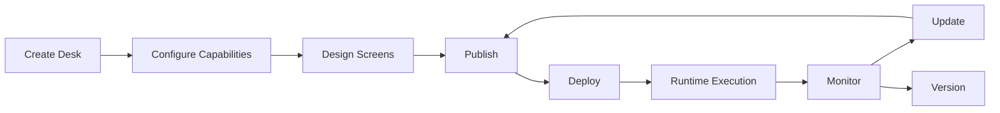

# KB-005 — Platform Overview

**DUKADESK Platform Architecture**

| Metadata | Value |
|----------|-------|
| KB-ID | KB-005 |
| Title | Platform Overview |
| Version | 0.1.0 |
| Status | Drafting |
| Owner | Architecture |
| Dependencies | KB-003 (Platform Philosophy), KB-004 (Core Principles) |
| Related Documents | KB-006 (System Architecture), KB-007 (Runtime Overview), KB-008 (Service Boundaries) |
| Review Status | Not Reviewed |
| Last Updated | 2026-07-10 |

## Revision History

| Version | Date | Author | Change |
|---------|------|--------|--------|
| 0.1.0 | 2026-07-10 | Architecture | Initial platform overview |

---

## 1. Purpose

This document introduces the DUKADESK platform at the highest architectural level.

It is the first architecture document that every engineer, architect, AI assistant, and contributor should read. It answers the question "What is DUKADESK?" not in terms of technology or implementation, but in terms of architectural concepts, boundaries, and responsibilities.

This document intentionally avoids implementation details. It establishes the conceptual foundation that subsequent Knowledge Base documents build upon:

- **KB-006 (System Architecture)** provides the system-level component breakdown.
- **KB-007 (Runtime Overview)** details the runtime environment.
- **KB-008 (Service Boundaries)** defines service ownership and communication.
- **Specifications** describe concrete implementations of specific subsystems.

Think of this document as the map of a city. Subsequent documents are the blueprints of individual buildings. Both are necessary, but you need the map first to understand where the buildings sit and how they connect.

---

## 2. What is DUKADESK?

DUKADESK is a **Platform Operating System (Platform OS)** — an operating environment for business applications.

Just as an operating system provides common services (process management, memory, I/O, file systems) to applications, DUKADESK provides common business services (identity, runtime, rendering, commerce, messaging) to Desks. Each Desk is an application running within this operating environment.

### DUKADESK Is:

| Dimension | Description |
|-----------|-------------|
| **A Multi-Tenant Digital Business Platform** | Many independent businesses operate on a single shared platform, each isolated from the others. |
| **A Desk Operating Environment** | Every tenant gets a branded Desk — their unique business interface presented to their customers. |
| **A Server-Driven Application Platform** | The platform defines UI structure, behavior, and content through data, not hardcoded layouts. |
| **A Runtime-Based Ecosystem** | Applications execute within a managed runtime that handles lifecycle, state, configuration, and capabilities. |
| **A Modular Software Platform** | Functionality is packaged as capabilities and modules that can be composed, extended, and replaced. |
| **A Capability-Driven Architecture** | Features are gated by declared capabilities — a Desk only loads what it needs. |
| **An Extensible Business Operating System** | The platform can be extended through modules, custom components, themes, and integrations without modifying core services. |

### DUKADESK Is Not:

- **Not simply a mobile application.** The mobile surface is one of many delivery channels (mobile, web, dashboard, API).
- **Not simply a backend.** Backend services support the platform but are not the platform itself.
- **Not a single product.** DUKADESK is an ecosystem that hosts many independent business solutions.
- **Not a low-code tool that generates code.** It is a runtime that interprets configuration at runtime.
- **Not a template or theme system.** Templates and themes exist within the platform, but the platform itself is the operating environment that runs them.

### The Platform OS Analogy

```
┌─────────────────────────────────────────────────────────┐
│                   DUKADESK Platform OS                   │
│                                                         │
│  ┌──────────┐  ┌──────────┐  ┌──────────┐  ┌────────┐ │
│  │  Desk A  │  │  Desk B  │  │  Desk C  │  │  ...   │ │
│  │ (Mama's  │  │ (Grace   │  │ (Third   │  │        │ │
│  │ Kitchen) │  │ Pharmacy)│  │  Party)  │  │        │ │
│  └────┬─────┘  └────┬─────┘  └────┬─────┘  └───┬────┘ │
│       │              │             │             │      │
│       └──────────────┴─────────────┴─────────────┘      │
│                        │                                │
│              ┌─────────▼──────────┐                     │
│              │   Platform OS      │                     │
│              │   (Common Services)│                     │
│              │  ┌───────────────┐ │                     │
│              │  │  Identity     │ │                     │
│              │  │  Runtime      │ │                     │
│              │  │  Renderer     │ │                     │
│              │  │  Commerce     │ │                     │
│              │  │  Messaging    │ │                     │
│              │  │  ...          │ │                     │
│              │  └───────────────┘ │                     │
│              └────────────────────┘                     │
└─────────────────────────────────────────────────────────┘
```

Just as Windows or Linux manage processes, memory, and devices for applications, the DUKADESK Platform OS manages identity, runtime, rendering, commerce, and messaging for Desks.

---

## 3. Platform Goals

| Goal | Description |
|------|-------------|
| **Maximize Reuse** | Common platform services eliminate the need to rebuild identity, payments, notifications, or rendering for each Desk. |
| **Reduce Development Effort** | New business solutions are composed from existing capabilities rather than built from scratch. |
| **Simplify Deployment** | Desks are configured and published through the platform, not deployed as independent applications. |
| **Accelerate Digital Transformation** | Businesses can launch branded digital experiences without building software. |
| **Enable Low-Code Development** | Business administrators configure Desks through the Builder Studio — no programming required. |
| **Support White-Label Solutions** | Every Desk is fully branded to its tenant. No visual cross-contamination between tenants. |
| **Encourage Ecosystem Growth** | Third-party developers can extend the platform through modules, components, and integrations. |
| **Support Multiple Industries** | The capability model allows the same platform to serve restaurants, pharmacies, retail, services, and more. |
| **Minimize Operational Complexity** | One platform serves many tenants. Updates and operations are centralized. |
| **Enable Rapid Innovation** | New capabilities can be added to the platform and immediately available to all Desks. |

---

## 4. Core Platform Components

### 4.1 Identity Platform

The Identity Platform manages who can access what within the DUKADESK ecosystem. It serves both end users (customers of tenants) and platform users (tenant administrators, business owners, developers).

| Function | Description |
|----------|-------------|
| Authentication | Verifies user identity across all platform surfaces. |
| Authorization | Determines what authenticated users are allowed to do. |
| Sessions | Manages user sessions across devices and surfaces. |
| Permissions | Fine-grained access control for platform resources. |
| Organizations | Represents tenant structures — businesses, teams, hierarchies. |
| Roles | Predefined and custom role definitions for access management. |

The Identity Platform is not a single service. It is a cross-cutting concern embedded in every surface and service, with a centralized authority for policy and verification.

### 4.2 Platform Runtime

The Platform Runtime is the execution environment for Desks. It manages the lifecycle of every Desk application running within the platform.

| Function | Description |
|----------|-------------|
| Application Lifecycle | Manages Desk initialization, execution, suspension, and termination. |
| Runtime Management | Allocates and manages resources for running Desks. |
| Configuration | Provides configuration to Desks from manifests and tenant settings. |
| Capability Loading | Loads only the capabilities a Desk has declared. |
| State Restoration | Recovers Desk state after interruptions or failures. |
| Error Recovery | Handles runtime errors gracefully without affecting other Desks. |

The Runtime is the core of the Platform OS — it is what makes DUKADESK an operating environment rather than just a collection of services.

### 4.3 Renderer

The Renderer transforms platform data into user interfaces. It is the component that makes Server-Driven UI possible.

| Function | Description |
|----------|-------------|
| Server-Driven UI | Renders interfaces defined by data, not code. |
| Component Rendering | Resolves component type names to visual components and renders them with provided data. |
| Theme Application | Applies tenant branding (colors, typography, spacing) consistently across all surfaces. |
| Navigation Rendering | Renders navigation structures (tabs, stacks, modals) from navigation definitions. |
| Action Execution | Dispatches user interactions to the Action Engine for processing. |

### 4.4 Builder Studio

The Builder Studio is the authoring environment where tenants create and configure their Desks.

| Function | Description |
|----------|-------------|
| Visual Application Builder | Drag-and-drop interface for building Desks without code. |
| Screen Designer | Design screen layouts, component placement, and data binding. |
| Workflow Designer | Define business workflows, state transitions, and action sequences. |
| Form Designer | Create and configure data collection forms. |
| Capability Configuration | Enable, disable, and configure capabilities for the Desk. |
| Publishing | Package and publish Desk configurations to the platform. |

### 4.5 Backend Services

Backend Services provide the data processing, business logic, and integration capabilities of the platform.

| Function | Description |
|----------|-------------|
| Business Services | Domain-specific business logic (orders, catalog, customers). |
| API Gateway | Single entry point for all client-to-service communication. |
| Event Processing | Asynchronous event routing and processing. |
| Repositories | Data storage and retrieval for all platform entities. |
| Messaging | Cross-service and cross-surface communication. |
| Synchronization | Data synchronization for offline-capable surfaces. |
| Notifications | Push notifications, in-app notifications, and email. |
| Commerce | Shopping cart, checkout, pricing, tax, and inventory. |
| Bookings | Reservation management, scheduling, and availability. |
| Payments | Payment processing orchestration (delegated to providers). |

### 4.6 Business Dashboard

The Business Dashboard is the administrative surface for business owners who operate one or more Desks.

| Function | Description |
|----------|-------------|
| Administration | Business-level settings, configurations, and preferences. |
| Analytics | Business performance metrics, customer insights, and trends. |
| Operations | Day-to-day management of orders, bookings, customers, and staff. |
| Customer Management | Customer profiles, history, and engagement. |
| Catalog Management | Product and service catalog management. |
| Orders | Order management, fulfillment, and history. |
| Bookings | Booking management, scheduling, and calendar. |
| Marketing | Promotions, offers, and customer communication. |
| Settings | Business configuration, integrations, and preferences. |

### 4.7 Tenant Dashboard

The Tenant Dashboard is the administrative surface for tenant administrators who manage the white-label customization and platform configuration of their Desk.

| Function | Description |
|----------|-------------|
| Workspace Management | Desk configuration, environment management, and workspace settings. |
| Tenant Settings | Business information, localization, and preferences. |
| Themes | Visual branding — colors, typography, imagery, and styling. |
| Capabilities | Capability enablement, configuration, and feature management. |
| Billing | Subscription management, invoices, and payment methods. |
| Publishing | Desk publication workflow, versioning, and rollout. |
| Team Management | User management, roles, and permissions within the tenant. |

### 4.8 Marketplace

The Marketplace is the discovery and distribution channel for Desk templates, extensions, and platform add-ons.

| Function | Description |
|----------|-------------|
| Desk Discovery | Browse, search, and preview available Desk templates. |
| Templates | Pre-built Desk configurations for common business types. |
| Extensions | Third-party modules that add capabilities to the platform. |
| Capabilities | Additional capabilities published for tenant use. |
| Modules | Reusable modules that can be composed into Desks. |
| Themes | Commercial and free themes for Desk branding. |
| Publishing | Tooling for partners to publish to the Marketplace. |
| Licensing | License management for commercial Marketplace items. |

### 4.9 Developer Experience

The Developer Experience encompasses all tooling and documentation for developers building on the DUKADESK platform.

| Function | Description |
|----------|-------------|
| Knowledge Base | The architectural and engineering documentation (this repository). |
| Developer Documentation | Guides, tutorials, and reference documentation. |
| SDKs | Software Development Kits for platform integration. |
| CLI | Command-line tooling for platform interaction and development. |
| APIs | Platform APIs for programmatic access. |
| Examples | Reference implementations and sample code. |
| Templates | Starter templates for module and component development. |
| Testing Utilities | Tools for testing platform extensions and integrations. |

---

## 5. Platform Layers

The DUKADESK platform is organized into seven layers. Each layer has a specific responsibility and may only depend on layers below it.

```text
    Experience Layer
          │
          ▼
  Presentation Layer
          │
          ▼
     Runtime Layer
          │
          ▼
   Capability Layer
          │
          ▼
    Service Layer
          │
          ▼
     Domain Layer
          │
          ▼
Infrastructure Layer
```

### 5.1 Experience Layer

**Responsibility:** Delivering platform functionality to end users through various surfaces.

The Experience Layer includes all user-facing applications: Mobile App, Website, Business Dashboard, and Tenant Dashboard. Each surface adapts platform capabilities to its specific interaction model.

**Allowed dependencies:** Presentation Layer, Runtime Layer (read-only).

### 5.2 Presentation Layer

**Responsibility:** Rendering user interfaces from platform data.

The Presentation Layer includes the Renderer, component libraries, theme engine, and navigation system. It translates capability data and screen definitions into interactive interfaces. It has no knowledge of business logic — it only knows how to display and interact.

**Allowed dependencies:** Runtime Layer.

### 5.3 Runtime Layer

**Responsibility:** Managing the lifecycle and execution environment for Desks.

The Runtime Layer includes the Platform Runtime, capability loader, configuration system, and state management. It provides the execution context within which capabilities operate.

**Allowed dependencies:** Capability Layer.

### 5.4 Capability Layer

**Responsibility:** Defining and managing platform capabilities.

The Capability Layer includes the capability registry, capability definitions, module system, and feature gating. It determines what a Desk can do based on declared capabilities.

**Allowed dependencies:** Service Layer.

### 5.5 Service Layer

**Responsibility:** Providing business and platform services.

The Service Layer includes all backend services: identity, commerce, messaging, notifications, bookings, payments, and the API gateway. Services are independent and communicate through events and APIs.

**Allowed dependencies:** Domain Layer.

### 5.6 Domain Layer

**Responsibility:** Defining core business entities and logic.

The Domain Layer includes the data model, business rules, validation, and domain services. It is the authoritative source for what each business entity is and how it behaves.

**Allowed dependencies:** Infrastructure Layer.

### 5.7 Infrastructure Layer

**Responsibility:** Providing foundational capabilities.

The Infrastructure Layer includes databases, queues, storage, networking, and cloud infrastructure. It has no business logic — it provides the foundation upon which everything else runs.

**Allowed dependencies:** None (foundational layer).

### Dependency Rules

- Layers may only depend on layers below them. A layer never depends on a layer above.
- The Experience Layer may read from the Runtime Layer but must not modify it directly.
- Cross-layer communication within the same tier (e.g., Service-to-Service) uses events.
- Violations of layer boundaries must be documented and approved through the governance process.

---

## 6. Platform Ecosystem

The DUKADESK platform is composed of multiple cooperating systems. Each system has a distinct responsibility, and together they form the complete platform.

```mermaid
graph TB
    subgraph "Builder Studio"
        Builder
    end

    subgraph "Marketplace"
        Marketplace
    end

    subgraph "Runtime"
        Runtime
        Renderer
    end

    subgraph "Backend"
        APIGateway[API Gateway]
        Services[Business Services]
        EventProcessor[Event Processing]
        DataLayer[(Data Layer)]
    end

    subgraph "Dashboards"
        BizDashboard[Business Dashboard]
        TenantDashboard[Tenant Dashboard]
    end

    subgraph "Developer Experience"
        Docs[Documentation]
        SDKs
        CLI
    end

    subgraph "Surfaces"
        Mobile
        Website
    end

    Builder --> Marketplace
    Marketplace --> Runtime
    Builder --> Runtime
    Runtime --> Renderer
    Mobile --> Runtime
    Website --> Runtime
    Runtime --> APIGateway
    APIGateway --> Services
    Services --> EventProcessor
    Services --> DataLayer
    BizDashboard --> APIGateway
    TenantDashboard --> APIGateway
    Docs -.->|informs| Builder
    Docs -.->|informs| SDKs
    SDKs --> APIGateway
    CLI --> APIGateway
```

### System Responsibilities

| System | Responsibility |
|--------|---------------|
| **Mobile** | Primary end-user surface. Renders Desks through the Runtime and Renderer. Operates offline with synchronization. |
| **Website** | Public-facing surface for Desk discovery, documentation, and web-based Desk access. |
| **Backend** | Provides all business and platform services through the API Gateway. Processes events, manages data, and integrates with external systems. |
| **Builder Studio** | Authoring environment for Desk creation, configuration, and publishing. |
| **Business Dashboard** | Administrative surface for business owners to manage operations, analytics, and customers. |
| **Tenant Dashboard** | Administrative surface for tenant administrators to configure branding, capabilities, and settings. |
| **Marketplace** | Discovery and distribution channel for templates, extensions, and platform add-ons. |
| **Documentation** | Knowledge Base and developer documentation. The authoritative source of platform truth. |
| **SDKs** | Software Development Kits for third-party developers building platform extensions. |
| **CLI** | Command-line tooling for platform interaction, automation, and development workflows. |

### Cooperation without Coupling

Systems cooperate through defined interfaces, not direct dependencies:

- **Surfaces (Mobile, Website)** depend on the Runtime and API Gateway. They have no knowledge of each other.
- **Dashboards** are independent applications that consume the same APIs as other surfaces.
- **Builder Studio** publishes configurations that the Runtime consumes. They never interact directly.
- **Marketplace** provides metadata about available items. The Runtime loads items from the Marketplace at initialization.
- **Documentation, SDKs, and CLI** are developer-facing systems that describe and access the platform without being part of its runtime.

This separation ensures that any system can evolve independently as long as its interfaces remain stable.

---

## 7. Platform Lifecycle

The lifecycle of a Desk spans from creation through continuous operation.



### 7.1 Create Desk

A tenant is onboarded to the platform. A Desk is provisioned with default configuration, identity, and workspace. The tenant chooses a starting template from the Marketplace or begins with a blank Desk.

### 7.2 Configure Capabilities

The tenant selects which capabilities their Desk supports (catalog, cart, checkout, orders, notifications, booking, etc.). Capabilities determine what features are available and which module defaults are loaded.

### 7.3 Design Screens

Using the Builder Studio, the tenant designs the visual experience of their Desk — screen layouts, component placement, navigation structure, branding, and content. The Builder produces screen definitions that the Runtime will later render.

### 7.4 Publish

The Desk configuration is packaged and published. Publishing creates a versioned snapshot of the Desk's screens, capabilities, theme, and navigation. Published configurations are immutable — changes require a new publication.

### 7.5 Deploy

The published configuration is deployed to the Runtime. Deployment may be staged (preview environment first, then production) and can include gradual rollout.

### 7.6 Runtime Execution

The deployed Desk runs within the Platform Runtime. End users access it through the Mobile app or Website. The Runtime loads capabilities, renders screens, processes actions, and manages state. The Desk is now live.

### 7.7 Monitor

The platform monitors Desk health, performance, usage, and errors. Monitoring data feeds the Business Dashboard analytics and informs the tenant about their Desk's operation.

### 7.8 Update

Tenants iterate on their Desk — adding capabilities, redesigning screens, updating content. Each change follows the same lifecycle: configure → design → publish → deploy. Updates are versioned and can be rolled back.

### 7.9 Version

The platform maintains a version history of every Desk. Tenants can view previous versions, compare changes, and roll back if needed. The version history is the complete audit trail of Desk evolution.

---

## 8. Major Architectural Characteristics

| Characteristic | Description | Rationale |
|----------------|-------------|-----------|
| **Modular** | Functionality is packaged as independent modules and capabilities. | Enables composition, reuse, and independent evolution of features. |
| **Capability-Driven** | Features are gated by declared capabilities. Desks only load what they need. | Minimizes resource usage, simplifies configuration, and enables progressive enhancement. |
| **Event-Driven** | Services communicate primarily through asynchronous events. | Decouples services, enables eventual consistency, and supports reactive architectures. |
| **Server-Driven UI** | Interfaces are defined by data, not code. | Allows UI changes without app updates, enables centralized branding, and supports A/B testing. |
| **Multi-Tenant** | One platform instance serves many independent tenants with strict isolation. | Maximizes resource sharing while ensuring data privacy and security. |
| **Cloud-Agnostic** | The platform is not locked to any single cloud provider. | Prevents vendor lock-in, enables cost optimization, and supports regional deployment. |
| **Scalable** | The platform scales horizontally to support growing tenant and user bases. | Ensures consistent performance as adoption grows. |
| **Resilient** | The platform continues operating through component failures. | Maintains availability for all tenants even when individual components fail. |
| **Observable** | The platform provides comprehensive monitoring, logging, and tracing. | Enables rapid diagnosis of issues and data-driven optimization. |
| **Secure** | The platform enforces security at every layer. | Protects tenant data, prevents unauthorized access, and maintains compliance. |
| **Extensible** | Third-party developers can extend the platform through defined interfaces. | Enables ecosystem growth and customization without forking core platform code. |
| **Maintainable** | The platform architecture prioritizes clarity, consistency, and documentation. | Reduces the cost of changes, onboarding, and long-term ownership. |

---

## 9. Platform Boundaries

### Inside the Platform

The following components are part of the DUKADESK platform core:

- Platform Runtime
- Builder Studio
- Renderer
- Backend Services (API Gateway, business services, event processing)
- Business Dashboard
- Tenant Dashboard
- Marketplace
- Platform APIs
- SDKs
- CLI
- Knowledge Base and Developer Documentation
- Identity Platform
- Notification Engine
- Commerce Engine

### Outside the Platform

The following are intentionally **not** part of the DUKADESK platform:

- **Customer-Owned ERP Systems** — Integrate through APIs. The platform does not replace existing ERP investments.
- **External CRMs** — Integrate through APIs and webhooks. Customer data may be synchronized but is not owned by the platform.
- **Payment Providers** — Payment processing is delegated to third-party providers (Stripe, PayPal, etc.). The platform orchestrates but does not execute payments.
- **SMS Providers** — SMS delivery is delegated to providers like Twilio. The platform manages templates and triggers.
- **Email Providers** — Email delivery is delegated to providers like SendGrid. The platform manages templates and triggers.
- **Third-Party Analytics** — Analytics data may be exported to tools like Google Analytics, Mixpanel, or custom solutions.
- **External Identity Providers** — The platform supports integration with identity providers (OAuth, SAML) but maintains its own identity authority.

### Integration Principle

External systems integrate with DUKADESK through **defined interfaces** — APIs, events, and webhooks. They are not absorbed into the platform core. This boundary ensures that:

1. The platform remains focused on its core mission.
2. External systems can be replaced without platform changes.
3. Tenants can use their preferred external tools.
4. Integration points are documented, versioned, and tested.

---

## 10. Architectural Principles Applied

The principles defined in KB-003 (Platform Philosophy) are not abstract ideals — they are directly reflected in the platform architecture.

| Principle | How It Shapes the Architecture |
|-----------|-------------------------------|
| **Capability First** | The Capability Layer is a first-class architectural layer. Every component checks capabilities before exposing features. The Builder Studio configures capabilities. The Runtime loads only declared capabilities. |
| **API First** | Every capability is exposed through a well-defined API before any UI is built. The API Gateway is the primary entry point for all service interactions. SDKs and CLI are generated from API definitions. |
| **SDUI First** | The Renderer is a dedicated architectural component. Screen definitions are data, not code. The Builder Studio produces screen definitions. Surfaces consume screen definitions without hardcoding layouts. |
| **Multi-Tenant First** | The Identity Platform enforces tenant isolation. Data repositories scope all queries by tenant. The Runtime isolates Desk execution. The deployment model supports per-tenant configuration. |
| **Offline First** | The Runtime includes state management and synchronization. Surfaces cache screen definitions locally. Actions queue when offline. The synchronization service reconciles offline changes. |
| **Extensibility First** | The Marketplace provides distribution for extensions. Modules are composable at the capability level. The Builder Studio allows custom component registration. APIs support third-party integration. |

Each principle constrains the architecture in specific ways. For example, "SDUI First" means the Renderer must be a separately identifiable component — it cannot be embedded within surfaces. "Multi-Tenant First" means data isolation must be enforced at the repository level, not just the application level.

---

## 11. Relationship to Other Knowledge Base Documents

This document is the gateway to the detailed architecture:

```
KB-005 (Platform Overview) ← You are here
    │
    ├──► KB-006 (System Architecture)
    │       Detailed component breakdown of every subsystem.
    │       Builds on the platform components introduced here.
    │
    ├──► KB-007 (Runtime Overview)
    │       Deep dive into the Platform Runtime.
    │       Explains lifecycle management, configuration, capability loading.
    │
    ├──► KB-008 (Service Boundaries)
    │       Defines service ownership, communication patterns, data ownership.
    │       Maps services to the Service Layer introduced here.
    │
    ├──► Engineering Standards (KB-011 through KB-017)
    │       Implementation conventions that realize the principles.
    │       All standards must be consistent with this architecture.
    │
    ├──► Specifications
    │       Concrete descriptions of specific subsystems.
    │       Each specification references the relevant KB documents.
    │
    ├──► Alignment Reviews
    │       Verify that specifications and implementations conform to this architecture.
    │
    └──► Developer Documentation
            Generated from verified specifications.
            The public face of this architecture for developers.
```

### Reading Order

New contributors should read in this order:

1. **KB-005 (Platform Overview)** — The conceptual map (this document)
2. **KB-003 (Platform Philosophy)** — The principles behind the architecture
3. **KB-006 (System Architecture)** — How the platform is built
4. **KB-007 (Runtime Overview)** — How Desks execute
5. **KB-008 (Service Boundaries)** — How services are organized
6. **Relevant Specification** — The specific subsystem to work on

This document intentionally provides the "what" and "why." Subsequent documents provide the "how."

---

*KB-005 (Platform Overview) — The first architecture document every contributor should read. It provides the conceptual map of DUKADESK as a Platform Operating System, defines the major building blocks, and establishes the architectural foundation for all subsequent Knowledge Base documents.*
