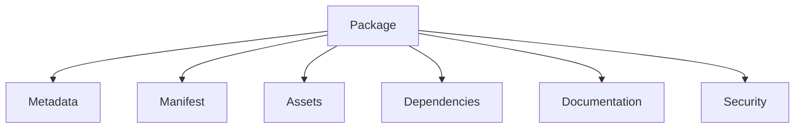
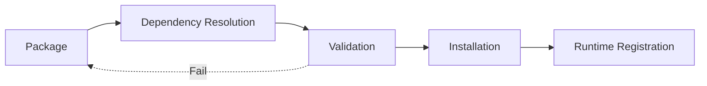

# Package & Artifact Specification

**KB-033 — Package & Artifact Specification**

| Metadata | |
|----------|---|
| **KB ID** | KB-033 |
| **Title** | Package & Artifact Specification |
| **Version** | 0.1.0 |
| **Status** | Drafting |
| **Owner** | Architecture Team |
| **Dependencies** | KB-032 Marketplace Architecture, KB-031 Publishing Pipeline, KB-030 Validation Engine, KB-008 Runtime Overview, Manifest Specification |
| **Related Documents** | Marketplace Architecture (KB-032), Publishing Pipeline (KB-031), Validation Engine (KB-030), Runtime Overview (KB-008), Manifest Specification (KB-009), Component Registry (KB-012), Capability System (KB-010), Extension & Plugin Framework (KB-034), Marketplace Certification & Trust (KB-039) |
| **Review Status** | Pending |
| **Last Updated** | 2026-07-10 |

### Revision History

| Version | Date | Author | Change |
|---------|------|--------|--------|
| 0.1.0 | 2026-07-10 | AI Architecture Agent | Initial draft |

---

## 1. Purpose

The Package & Artifact Specification defines the canonical package format used throughout the DUKADESK platform. It establishes a unified, implementation-independent model for packaging, distributing, validating, installing, updating, signing, versioning, and retiring reusable platform artifacts.

The platform uses a unified package format because consistency in packaging drives consistency across the entire ecosystem. When every distributable artifact — whether a Component, Theme, Capability, Template, Workflow, Form, Data Model, AI Agent, Integration, Builder Plugin, SDK Extension, or complete Desk — follows the same package structure, the platform can provide uniform tooling for installation, dependency management, validation, upgrades, and distribution. A single package format means a single installer, a single dependency resolver, a single validation pipeline, and a single update mechanism.

Every Marketplace artifact must follow the same contract because consumers should not need to understand different packaging conventions for different artifact types. A developer installing a Theme should have the same experience as a developer installing a Capability. The package format abstracts artifact type so that tooling and infrastructure treat all packages uniformly.

Packaging is independent of implementation technology because the platform does not dictate how artifacts are built. A Component may be implemented in any language or framework; its package format remains the same. The package declares metadata, dependencies, and compatibility; it does not prescribe implementation details. Technology independence ensures the package format remains stable as implementation technologies evolve.

Package metadata is as important as package contents because metadata drives discovery, compatibility checking, dependency resolution, and security verification. A package with perfect contents but missing metadata is undetectable by search, unverifiable by validation, and uninstallable by the dependency resolver. Metadata is the package's interface to the platform.

Packages must remain immutable after publication because mutability breaks every assumption that consumers and the platform depend on. If a published package can be modified, installed versions become unreliable, dependency resolution becomes non-deterministic, security verification is defeated, and audit trails are invalidated. Immutability is the foundation of trust in the package ecosystem.

---

## 2. Packaging Philosophy

### One Package Model

Every distributable artifact in the DUKADESK ecosystem conforms to the same package structure. There is no distinction between a Component package, a Theme package, a Capability package, or a Desk package at the format level. The package type is metadata; the structure is universal.

### Immutable Artifacts

Once published, a package version is never modified. Updates are new versions. Immutability ensures deterministic installations, reliable rollbacks, and verifiable audit trails. Consumers can trust that the package they installed yesterday is exactly the package they have today.

### Self-Describing Packages

Every package contains all metadata required to understand, install, and use it without external context. Package name, version, description, dependencies, compatibility, publisher, license, and documentation are all included within the package. A package is a standalone unit of distribution.

### Declarative Metadata

All metadata is declarative — structured data that describes the package without prescribing implementation. Metadata covers identity, dependencies, compatibility, permissions, installation requirements, and documentation. Declarative metadata enables static analysis, automated tooling, and safe processing without executing package code.

### Version Awareness

Versions are semantic, comparable, and auditable. Every package declares its version and the versions of its dependencies. Version ranges express compatibility. Breaking changes are signaled through major version bumps. The platform uses version information to resolve dependencies, detect conflicts, and plan upgrades.

### Dependency Transparency

Every dependency is declared with identity, version range, and purpose — required, optional, or peer. Hidden or undeclared dependencies are prohibited. Dependency transparency ensures that consumers understand what they are installing, that dependency resolution is deterministic, and that conflicts are detected before installation.

### Secure Distribution

Every package carries integrity verification and publisher identity. Packages are signed, hashed, and verifiable. Tampered packages are rejected at every touchpoint — Marketplace, installation, update, and runtime loading. Security is built into the package format, not added as an afterthought.

### Runtime Independence

Packages describe what they provide and what they require — not how they execute. The same package format serves Components rendered by the Runtime, Themes applied by the Theme Engine, Workflows executed by the Action Engine, and Builder Plugins running in Builder Studio. The package format does not change based on runtime context.

### Extensibility

The package format supports extension through custom metadata sections, custom asset types, and custom dependency types. Platform extensibility mechanisms allow new artifact categories to be packaged without modifying the core specification. Extensions are validated through the same tooling as core package types.

### AI Discoverability

Package metadata is structured for AI consumption. Descriptions, tags, categories, dependency graphs, and compatibility matrices enable AI agents to search, compare, recommend, and analyze packages programmatically. AI discoverability is a first-class concern of the metadata design.

---

## 3. Package Responsibilities

### Artifact Encapsulation

A package encapsulates one or more related artifacts into a single distributable unit. Encapsulation includes the artifacts themselves, their configuration, and all supporting files required for installation and use. The package is the atomic unit of distribution.

### Metadata Declaration

A package declares its identity, purpose, and characteristics through structured metadata. Metadata enables discovery, comparison, selection, and automated processing without inspecting package contents.

### Dependency Declaration

A package declares all external dependencies — other packages, platform services, runtime versions, and capabilities — required for correct operation. Dependency declarations include identity, version range, dependency type (required, optional, peer), and purpose.

### Version Declaration

A package declares its version using semantic versioning. Version information is used for compatibility checking, dependency resolution, upgrade planning, and rollback decisions.

### Compatibility Declaration

A package declares compatibility with specific platform versions, Runtime versions, Builder versions, and other package versions. Compatibility metadata prevents installation of incompatible combinations and guides upgrade planning.

### Publisher Identification

A package identifies its publisher — the individual or organization that created and published the package. Publisher identity is cryptographically verified through package signing. Publisher reputation and certification status are associated with the publisher identity.

### Integrity Verification

A package includes integrity verification data — cryptographic hashes of all package contents and a digital signature over the package manifest. Integrity data enables consumers to verify that the package has not been tampered with since publication.

### Documentation Inclusion

A package may include documentation — installation guide, configuration guide, usage examples, API reference, release notes, and troubleshooting information. Documentation is part of the package, not an external resource.

### Localization Support

A package may include localized resources — translations, region-specific configurations, and locale-dependent assets. Localization resources follow the package's localization metadata structure.

### Licensing Metadata

A package declares its license terms — the legal terms under which the package is distributed and used. Licensing metadata includes license type, license text, attribution requirements, and usage restrictions.

### Responsibility Boundaries

| Responsibility | Package | Consumer | Platform |
|---------------|---------|----------|----------|
| Artifact encapsulation | Declares and contains | Installs | Validates structure |
| Metadata provision | Declares | Reads | Indexes and searches |
| Dependency declaration | Declares | Resolves | Validates at install |
| Version declaration | Declares | Selects | Compares and tracks |
| Compatibility declaration | Declares | Verifies | Enforces at install |
| Publisher identity | Signs | Verifies | Certifies |
| Integrity protection | Hashes and signs | Verifies | Rejects tampered |
| Documentation | Includes | Reads | Indexes |
| Localization | Includes | Selects locale | Resolves |
| Licensing | Declares | Complies | Tracks |

---

## 4. Package Architecture

A DUKADESK package is composed of logical sections. Each section serves a specific purpose in the package lifecycle.

### Package Metadata

| Aspect | Description |
|--------|-------------|
| **Purpose** | Declare package identity, type, version, publisher, and discovery information. |
| **Required** | Package ID, name, version, package type, publisher ID, created date, license. |
| **Optional** | Display name, description, tags, categories, organization, support information, documentation URLs. |
| **Extension Points** | Custom metadata fields, industry-specific metadata schemas, enterprise governance metadata. |

### Manifest

| Aspect | Description |
|--------|-------------|
| **Purpose** | Declare the package's contents, structure, and entry points — what the package provides and how it is loaded. |
| **Required** | File listing with integrity hashes, entry point references (component definitions, capability definitions, theme tokens, workflow definitions). |
| **Optional** | Secondary entry points, conditional provides, platform-specific entry points. |
| **Extension Points** | Custom entry point types, platform-registered content types. |

### Assets

| Aspect | Description |
|--------|-------------|
| **Purpose** | Contain the actual artifact files — source data, configurations, media, and supporting files. |
| **Required** | At least one asset file referenced by the manifest. |
| **Optional** | Multiple asset files organized by type, platform variant asset files, optimized variants. |
| **Extension Points** | Custom asset types, asset optimization pipelines, streaming asset references. |

### Dependencies

| Aspect | Description |
|--------|-------------|
| **Purpose** | Declare all external packages and platform services required by this package. |
| **Required** | Dependency declarations for all required external packages and platform services. |
| **Optional** | Optional dependency declarations, peer dependency declarations, environment-specific dependencies. |
| **Extension Points** | Custom dependency types, registry-specific dependency resolution. |

### Documentation

| Aspect | Description |
|--------|-------------|
| **Purpose** | Provide human-readable documentation for the package. |
| **Required** | At minimum, an overview or README. |
| **Optional** | Installation guide, configuration guide, usage examples, API reference, release notes, changelog, troubleshooting guide, FAQ. |
| **Extension Points** | Custom documentation formats, documentation generation scripts, external documentation references. |

### Localization

| Aspect | Description |
|--------|-------------|
| **Purpose** | Provide locale-specific translations and regional configurations. |
| **Required** | None — localization is optional. |
| **Optional** | Translation files for each supported locale, locale-specific assets, region-specific configurations. |
| **Extension Points** | Custom locale definitions, translation provider integration. |

### License

| Aspect | Description |
|--------|-------------|
| **Purpose** | Declare the legal terms of package distribution and use. |
| **Required** | License type identifier and license text. |
| **Optional** | Attribution requirements, usage restrictions, third-party license notices, export control information. |
| **Extension Points** | Custom license types, enterprise license overrides. |

### Compatibility

| Aspect | Description |
|--------|-------------|
| **Purpose** | Declare compatibility with platform, Runtime, Builder, and dependency versions. |
| **Required** | Minimum Runtime version, minimum platform version. |
| **Optional** | Maximum Runtime version, specific Builder version compatibility, tested platform versions, known incompatible configurations. |
| **Extension Points** | Custom compatibility matrices, platform-specific compatibility rules. |

### Security Metadata

| Aspect | Description |
|--------|-------------|
| **Purpose** | Provide security-related information — signing, integrity, vulnerability status. |
| **Required** | Package signature, integrity hashes for all assets, publisher certificate reference. |
| **Optional** | Vulnerability disclosure contacts, security advisory references, trust classification. |
| **Extension Points** | Custom security attestations, compliance certifications. |

### Installation Metadata

| Aspect | Description |
|--------|-------------|
| **Purpose** | Declare what is required to install and configure the package. |
| **Required** | Required permissions, required capabilities, minimum Runtime requirements. |
| **Optional** | Post-install configuration steps, migration requirements, environment requirements, setup instructions. |
| **Extension Points** | Custom installation hooks, environment-specific installation requirements. |

---

## 5. Package Types

### UI Packages

| Type | Description |
|------|-------------|
| **Component** | A reusable UI component registered in the Component Registry. Includes component definition, configuration schema, default properties, and event declarations. |
| **Layout** | A reusable layout template defining screen structure — columns, grids, sections, responsive breakpoints. |
| **Theme** | A complete visual theme with color palettes, typography scales, spacing systems, shape tokens, elevation definitions, iconography, motion tokens, and component token overrides. |
| **Icon** | A set of icons in a consistent style. Includes SVG definitions, metadata (name, category, tags), and usage guidelines. |
| **Design Asset** | Reusable design resources — brand logos, illustration sets, placeholder images, texture packs. |

### Business Packages

| Type | Description |
|------|-------------|
| **Capability** | A complete business capability — screens, workflows, data models, forms, configurations, and dependencies bundled as a unit of business function. A Capability package is the primary unit of business functionality in the Marketplace. |
| **Workflow** | A reusable workflow definition — trigger conditions, step sequences, decision logic, data mappings, error handling. |
| **Form** | A reusable form definition — field layout, validation rules, data bindings, conditional logic, submission actions. |
| **Data Model** | A reusable data model definition — entity schemas, field types, validation rules, relationships, indexing hints. |
| **Template** | A project template that serves as a starting point for new Desks, capabilities, or screens. Includes default structure, sample configurations, placeholder content, and setup instructions. |

### Integration Packages

| Type | Description |
|------|-------------|
| **Connector** | An integration connector for a specific external service — API client configuration, authentication flow, data mapping, error handling. |
| **External Service** | A packaged integration with a third-party platform — payment gateway, CRM, ERP, shipping provider, communication platform. |
| **Payment Provider** | A payment service integration — Stripe, Square, PayPal, or regional payment providers. Includes payment flow, webhook handling, receipt generation. |
| **Identity Provider** | An authentication and identity integration — OAuth provider, SAML identity provider, social login. |
| **Messaging Provider** | A notification and messaging integration — email service, SMS gateway, push notification service, chat platform. |

### Platform Packages

| Type | Description |
|------|-------------|
| **Builder Plugin** | An extension that adds functionality to Builder Studio — custom editors, validators, generators, palette items, workspace panels. |
| **SDK Extension** | An extension to a platform SDK — additional API clients, utility libraries, platform service wrappers. |
| **Validation Pack** | A collection of validation rules for specific domains or standards — healthcare validation, financial regulation, accessibility standards. |
| **AI Extension** | An extension that adds AI capabilities — custom AI actions, specialized prompt templates, domain-specific AI models. |

### Solution Packages

| Type | Description |
|------|-------------|
| **Desk** | A complete Desk application — the highest-level package type. A Desk package contains or references all capabilities, themes, workflows, screens, forms, data models, integrations, assets, and configurations required to run a complete business application. |
| **Industry Solution** | A pre-configured Desk for a specific industry — restaurant, retail, healthcare, education, logistics. Includes industry-specific capabilities, workflows, data models, themes, and compliance configurations. |
| **Enterprise Solution** | A multi-Desk enterprise package that includes standard capability sets, shared configurations, brand themes, compliance policies, and integration patterns across an organization. |

---

## 6. Package Metadata

| Field | Type | Required | Description |
|-------|------|----------|-------------|
| **packageId** | String | Yes | Globally unique identifier. Reverse-domain notation (e.g., `com.dukadesk.component.data-table`). Immutable after publication. |
| **name** | String | Yes | Machine-readable name. Lowercase, hyphenated, unique within publisher scope. |
| **displayName** | String | No | Human-readable name shown in Marketplace listings and platform UI. |
| **description** | String | Yes | Brief description of the package's purpose and functionality. Shown in search results and listings. |
| **version** | String | Yes | Semantic version (MAJOR.MINOR.PATCH). Follows SemVer 2.0. Pre-release labels permitted. |
| **packageType** | String | Yes | One of the defined package types (component, theme, capability, workflow, form, data-model, template, connector, builder-plugin, sdk-extension, desk, etc.). |
| **publisher** | String | Yes | Publisher identity. References the publisher's verified identity in the Marketplace trust system. |
| **organization** | String | No | Organization that owns the package. Used for enterprise catalogs and governance. |
| **tags** | String[] | No | Free-form tags for search and categorization. |
| **category** | String | No | Primary business category (e.g., payments, communication, analytics, navigation). |
| **createdDate** | DateTime | Yes | Package creation timestamp. |
| **updatedDate** | DateTime | Yes | Last modification timestamp. Reset on new version. |
| **compatibility** | Object | Yes | Platform, Runtime, Builder, and dependency version compatibility declarations. |
| **license** | String | Yes | License type identifier (e.g., MIT, Apache-2.0, DUKADESK-EULA, Commercial). |
| **visibility** | String | Yes | Publication visibility: `public`, `organization`, `private`. |
| **documentation** | String[] | No | URLs to external documentation, or inline documentation section references. |
| **supportInfo** | Object | No | Support contact information — email, URL, issue tracker reference. |
| **certificationStatus** | String | Yes | Current certification status: `uncertified`, `certified`, `verified`, `deprecated`. |

---

## 7. Dependency Model

### Required Dependencies

Dependencies that must be installed for the package to function. The dependency resolver installs required dependencies automatically. Installation fails if required dependencies cannot be resolved.

### Optional Dependencies

Dependencies that enhance the package but are not required. The consumer chooses whether to install optional dependencies. The package degrades gracefully when optional dependencies are absent.

### Peer Dependencies

Dependencies that the consumer must provide independently. Peer dependencies are not installed automatically but are verified for compatibility. Common peer dependencies include Runtime versions, platform versions, and shared platform services.

### Platform Dependencies

Dependencies on platform services — Runtime, Component Registry, Capability System, Theme Engine, Action Engine, Event Bus, Navigation Engine, State Management, Offline & Synchronization. Platform dependencies specify minimum and maximum compatible versions.

### Runtime Dependencies

Dependencies on specific Runtime versions or Runtime capabilities. A package may require specific Runtime features (e.g., push notifications, offline sync, camera access) that are only available in certain Runtime versions.

### Capability Dependencies

Dependencies on specific Capabilities. A package may require installation of one or more Capabilities. Capability dependencies specify capability ID and version range.

### Builder Dependencies

Dependencies on specific Builder versions or Builder features. A Builder Plugin package may require specific Builder API versions. A Template package may require specific Builder features for project generation.

### Dependency Resolution Principles

- Dependency resolution is deterministic — given the same set of package versions, resolution produces the same result every time.
- Version ranges are inclusive of the minimum and exclusive of the maximum (caret semantics by default).
- Conflicting dependencies block installation with clear conflict reports.
- Optional dependencies are resolved after required dependencies; conflicts in optional dependencies produce warnings, not errors.
- Peer dependencies are verified but not automatically resolved; the consumer must provide compatible versions.

---

## 8. Versioning

### Semantic Versioning

All packages follow Semantic Versioning 2.0:

- **MAJOR**: Breaking changes — incompatible API changes, removed features, changed behavior that breaks existing consumers.
- **MINOR**: Backward-compatible new functionality — new features, new APIs, new configuration options that do not break existing consumers.
- **PATCH**: Backward-compatible bug fixes — corrections that do not change API or behavior.

### Compatibility Ranges

Dependencies declare compatibility using version ranges:

| Expression | Meaning |
|------------|---------|
| `1.2.3` | Exact version only. |
| `^1.2.3` | Compatible with version 1.2.3 (>=1.2.3 <2.0.0). |
| `~1.2.3` | Approximately equivalent (>=1.2.3 <1.3.0). |
| `>=1.2.3 <2.0.0` | Explicit range. |
| `*` | Any version (discouraged — use ranges). |

### Breaking Changes

Breaking changes require a MAJOR version bump. The package manifest must document breaking changes in the release notes. Breaking changes include:

- Removed or renamed APIs, components, or configuration options.
- Changed default behavior that affects existing consumers.
- Removed or changed dependency requirements.
- Changed minimum Runtime or platform version.
- Restructured or removed assets.

### Deprecation

Packages may be deprecated. Deprecated packages remain available for existing consumers but are not recommended for new installations. Deprecation metadata includes:

- Deprecation reason.
- Recommended replacement package (if any).
- Deprecation date.
- End-of-life date (if applicable).

### Upgrade Recommendations

The package manifest may include upgrade recommendations — suggested version paths, recommended migration steps, and compatibility notes for upgrading across major versions.

### Rollback Compatibility

Packages declare whether they support rollback to previous versions. Rollback compatibility metadata includes:

- Whether data migrations are reversible.
- Whether configuration changes are backward compatible.
- Whether state changes persist across downgrades.

---

## 9. Installation Metadata

### Required Permissions

Permissions that the package requires at runtime. Permissions are declared at the capability, component, or service level. Examples: camera access, location access, notification sending, network access, file storage access.

### Required Capabilities

Capabilities that must be installed on the target Desk for the package to function. Required capabilities are verified during installation.

### Runtime Requirements

Specific Runtime features or versions required by the package. Examples: minimum Runtime version, specific Runtime APIs, required platform features.

### Builder Requirements

Specific Builder features or versions required for packages that include Builder extensions. Examples: minimum Builder version, specific Builder APIs, required plugin interfaces.

### Configuration Requirements

Required or recommended configuration steps after installation. Examples: API key configuration, endpoint URL setup, feature flag enabling, theme token mapping.

### Migration Requirements

Whether the package requires data migration on installation or update. Migration metadata includes migration scripts (conceptual), rollback procedures, and data compatibility information.

### Post-Install Actions

Actions that should be performed after installation. Examples: register components in Component Registry, register capabilities in Capability System, apply theme tokens, register workflows, register event handlers.

---

## 10. Security Metadata

### Digital Signature Metadata

Every package includes a digital signature:

- Signature algorithm identifier.
- Signature value.
- Signing timestamp.
- Signing certificate reference.
- Signature verification key reference.

### Integrity Hashes

Every file in the package is hashed:

- Hash algorithm identifier (SHA-256 minimum).
- Hash value for each file.
- Combined hash for the complete package.
- Hash for the manifest (signed separately).

### Publisher Identity

Publisher identity is cryptographically verified:

- Publisher ID linked to signing certificate.
- Certificate chain for verification.
- Publisher metadata (name, organization, verification status).

### Trust Classification

Packages carry a trust classification:

- **Verified**: Publisher identity verified, package certified, no known vulnerabilities.
- **Certified**: Package passed platform certification, meets quality and security standards.
- **Uncertified**: Package published but not yet certified. Use at own risk.
- **Deprecated**: Package no longer maintained. Known issues may exist.
- **Blocked**: Package identified as malicious or non-compliant. Installation blocked.

### Security Advisories

Security advisory metadata:

- Advisory ID.
- Severity (critical, high, medium, low).
- Affected versions.
- Fixed versions.
- Workaround description.
- CVE references (if applicable).

### Vulnerability Metadata

Vulnerability reporting information:

- Vulnerability disclosure contact.
- Responsible disclosure policy reference.
- Security audit references.
- Bug bounty information (if applicable).

### Audit Information

Package audit trail:

- Publication history with timestamps.
- Certification events.
- Security review history.
- Signing key rotation history.

---

## 11. Documentation Metadata

### Overview

High-level description of the package's purpose, features, and typical use cases. The overview is the primary documentation entry point and appears in Marketplace listings.

### Installation Guide

Step-by-step installation instructions — prerequisites, installation methods, verification steps, post-installation configuration.

### Configuration Guide

Detailed configuration documentation — all configuration options, default values, required vs. optional settings, environment-specific configuration, configuration examples.

### Usage Examples

Practical examples showing common use cases. Examples are specific, runnable, and cover the package's primary functionality. Examples may include screen configurations, workflow definitions, form setups, or code snippets.

### API References

API documentation for packages that expose APIs — endpoints, request/response formats, authentication, rate limiting, error codes, SDK usage.

### Release Notes

Per-version release notes describing what changed, what was added, what was fixed, and what was deprecated. Release notes are required for every published version.

### Changelog

Chronological list of all changes across all versions. The changelog is generated from release notes and provides a complete change history.

### Troubleshooting

Common issues, their causes, and solutions. Troubleshooting documentation covers installation issues, configuration problems, compatibility issues, and known limitations.

### Support Contacts

How to get help — documentation links, community forums, issue tracker, email support, professional support contacts.

---

## 12. Runtime Integration

### Runtime

The Runtime discovers installed packages through the package registry at application startup. Packages are loaded based on the Desk Manifest's dependency declarations. The Runtime verifies package integrity before loading and rejects tampered packages.

### Component Registry

Component packages register their components with the Component Registry during installation. The Component Registry makes registered components available to the Screen Builder and Runtime Renderer. Component packages include component definitions, configuration schemas, and renderer references.

### Capability System

Capability packages register their capabilities with the Capability System. The Capability System manages capability lifecycle — installation, activation, dependency resolution, and configuration. Capability packages include capability definitions, screens, workflows, data models, and configurations.

### Theme Engine

Theme packages register their theme definitions with the Theme Engine. The Theme Engine resolves theme tokens and provides them to the Renderer. Theme packages include token definitions, mode variants, platform variants, and component token overrides.

### Service Registry

Integration packages (connectors, external services, payment providers, identity providers) register their services with the Service Registry. The Service Registry manages service endpoints, authentication, and runtime service resolution.

---

## 13. Marketplace Integration

### Marketplace

The Marketplace is the primary distribution channel for packages. The Marketplace indexes package metadata, provides search and discovery, manages publisher identity, enforces certification, and controls distribution. Packages are published to the Marketplace through the Publishing Pipeline.

### Publishing Pipeline

The Publishing Pipeline produces packages from Builder artifacts. The Pipeline validates package structure, resolves dependencies, generates metadata, signs the package, and submits it to the Marketplace. The Pipeline is the only authorized path for package publication.

### Validation Engine

The Validation Engine validates packages during creation and before publication. Validation covers metadata completeness, dependency integrity, compatibility verification, security scanning, and structural correctness. The Validation Engine also validates packages during installation to ensure compatibility with the target environment.

### Discovery Service

The Discovery Service powers search, browsing, filtering, and recommendation in the Marketplace. Discovery relies on package metadata — names, descriptions, tags, categories, publisher, certification status, and usage statistics.

### Update Manager

The Update Manager tracks installed packages and their available updates. It checks for new versions, evaluates compatibility, manages update dependencies, and coordinates update installation. The Update Manager uses package version metadata and dependency declarations.

### Certification Manager

The Certification Manager manages package certification. Certification validates packages against platform standards, security requirements, and quality criteria. Certified packages receive a certification badge and priority in search results.

---

## 14. AI Integration

### Package Summarization

The AI Assistant can generate human-readable summaries of packages from their metadata and documentation — extracting key features, use cases, and requirements. Summaries appear in Marketplace listings and search results.

### Dependency Explanation

The AI Assistant can explain package dependencies — why each dependency is needed, what it provides, and how it relates to the package's functionality. Explanations help consumers understand installation requirements.

### Compatibility Analysis

The AI Assistant can analyze compatibility between packages and target environments — checking version ranges, identifying conflicts, and suggesting compatible version combinations.

### Documentation Generation

The AI Assistant can generate or enhance package documentation — installation guides, configuration examples, usage tutorials, and troubleshooting content from package metadata and structure.

### Alternative Recommendations

The AI Assistant can suggest alternative packages based on feature comparison — "Package A provides similar functionality to Package B but requires fewer dependencies and has higher certification status."

### Upgrade Analysis

The AI Assistant can analyze upgrade paths — comparing package versions, identifying breaking changes, summarizing migration steps, and assessing upgrade risk.

### Duplicate Detection

The AI Assistant can detect functionally similar packages — flagging potential duplicates, comparing feature sets, and helping consumers choose between alternatives.

### AI Integration Principles

- AI enriches package understanding and discovery; it does not modify package integrity.
- AI-generated documentation is clearly labeled as AI-generated.
- AI recommendations are advisory — consumers make final installation decisions.
- AI analysis respects package visibility and access controls.

---

## 15. Collaboration

### Publisher Teams

Packages are published by teams, not individuals. Teams have defined roles — owner, maintainer, contributor, reviewer. Team ownership ensures continuity and shared responsibility.

### Maintainers

Maintainers are responsible for package updates, issue resolution, and compatibility verification. Maintainer roles are transferable. Packages without active maintainers may be deprecated.

### Ownership Transfer

Package ownership can be transferred between teams or organizations. Transfer preserves version history, certification status, and consumer installations. Ownership transfer requires approval from both parties and the Marketplace.

### Release Approvals

Package releases may require approval based on organizational policy. Approval workflows verify release readiness, compatibility, and documentation completeness before publication.

### Review Process

Package reviews assess quality, security, documentation, and platform compatibility. Reviews are required for certification. Review results are transparent to consumers.

### Community Contributions

The platform supports community contributions through forking, pull request concepts, and collaborative maintenance. Community contributions follow the same packaging, validation, and certification processes as first-party packages.

---

## 16. Performance

### Package Indexing

Package metadata is indexed for fast search and discovery. Indexing covers names, descriptions, tags, categories, publishers, and dependency graphs. Index updates are near-real-time after publication.

### Metadata Caching

Package metadata is aggressively cached at multiple levels — Marketplace CDN, organization registries, and local package caches. Metadata cache invalidation is version-aware.

### Efficient Installation

Installation is optimized for minimal transfer and processing:

- Only required assets are downloaded.
- Shared dependencies are de-duplicated.
- Assets are streamed and processed incrementally.
- Installation status is reported in real time.

### Incremental Updates

Package updates transfer only changed assets. Unchanged files are reused from the local cache. Delta computation uses package integrity hashes to identify changed files.

### Delta Packages

Future support for delta packages — packages that contain only the differences from the previous version. Delta packages reduce update size for large packages with frequent updates.

### Large Asset Optimization

Large assets (images, media files, font files) are optimized for distribution:

- Compression is applied based on asset type.
- Multi-resolution variants are provided for different device classes.
- Streaming delivery for large media assets.
- Lazy loading for assets not required at installation time.

---

## 17. Observability

### Download Metrics

Per-package download counts, download trends, and download sources. Metrics are aggregated and anonymized. Publisher-visible download statistics.

### Installation Metrics

Installation counts by platform, Runtime version, and environment type. Installation success and failure rates. Installation duration statistics.

### Version Adoption

Version adoption curves — how quickly consumers adopt new versions, which versions are most used, and version sunset tracking.

### Dependency Statistics

Dependency usage statistics — most depended-on packages, dependency depth analysis, circular dependency detection.

### Update Metrics

Update availability, update adoption rates, update failure rates, and update duration statistics.

### Package Health

Package health indicators:

- Certification status and history.
- Issue tracker activity.
- Update frequency.
- Maintainer responsiveness.
- Compatibility verification status.

### Diagnostics

The Diagnostics Manager provides per-package health overview — metadata completeness, dependency integrity, version freshness, documentation coverage, and optimization suggestions.

---

## 18. Anti-Patterns

### Missing Metadata

Publishing a package without complete metadata reduces discoverability, prevents automated compatibility checking, and creates confusion for consumers. All required metadata fields must be populated before publication.

### Hidden Dependencies

Declaring fewer dependencies than the package actually requires causes runtime failures when missing dependencies are absent. Every external package, platform service, or capability that the package depends on must be declared.

### Mutable Packages

Modifying a published package version invalidates integrity verification, breaks existing installations, and defeats the audit trail. Package versions are immutable. Updates are new versions.

### Platform-Specific Assumptions

Designing packages that assume a specific platform (mobile-only features, web-only APIs, desktop-only capabilities) reduces portability and limits the consumer base. Packages should declare platform requirements and degrade gracefully on unsupported platforms.

### Duplicate Package IDs

Creating packages with the same ID as existing packages causes identity conflicts and installation confusion. Package IDs must be globally unique. The Marketplace enforces uniqueness at publication.

### Missing Documentation

Publishing a package without documentation forces consumers to reverse-engineer the package's purpose, configuration, and usage. Documentation is not optional — at minimum, an overview, installation guide, and usage example are required.

### Hardcoded Versions

Declaring dependencies with exact version pins prevents consumers from benefiting from patch updates and creates unnecessary upgrade friction. Version ranges should allow compatible updates.

### Bundling Unrelated Assets

Including assets that are not related to the package's purpose increases package size, complicates maintenance, and confuses consumers. Each package should contain only the assets required for its function.

---

## 19. Future Evolution

### AI-Generated Packages

AI agents will generate complete packages from natural language descriptions — generating metadata, documentation, and initial artifact structure. AI-generated packages follow the same format and must pass the same validation and certification as manually created packages.

### Federated Repositories

Support for federated package repositories — organizations can run their own package registries that synchronize with the central Marketplace. Federated repositories support air-gapped environments, regional data sovereignty, and enterprise governance.

### Enterprise Package Catalogs

Curated enterprise catalogs that select approved packages from the Marketplace and add organization-specific metadata, compliance annotations, and approval workflows.

### Signed Update Channels

Cryptographically signed update channels that enable automatic, verified updates. Consumers opt into update channels. Updates are signed and verified before installation.

### Delta Distribution

Efficient distribution of package updates through delta files — only the differences between versions are transmitted. Delta distribution reduces bandwidth usage and speeds up updates.

### Cross-Platform Packages

Packages that contain platform-specific variants for multiple target platforms within a single package. The platform selects the appropriate variant at installation time.

### Cross-Marketplace Interoperability

Standards-based interoperability between DUKADESK Marketplace and other package ecosystems. Common package metadata exchange, dependency resolution across marketplaces, and shared publisher identity.

---

## 20. Relationship to Other Documents

| Document | Relationship |
|----------|--------------|
| **Marketplace Architecture (KB-032)** | Defines the Marketplace that distributes packages. This specification defines the package format that the Marketplace uses. |
| **Publishing Pipeline (KB-031)** | Produces packages from Builder artifacts. The Publishing Pipeline validates, assembles, and signs packages according to this specification. |
| **Validation Engine (KB-030)** | Validates packages during creation, publication, and installation. Validation rules enforce this specification. |
| **Runtime Overview (KB-008)** | The Runtime consumes installed packages. This specification defines how packages are structured for Runtime consumption. |
| **Manifest Specification (KB-009)** | The Manifest is the primary artifact within Desk packages. Package structure extends the Manifest format for distribution. |
| **Component Registry (KB-012)** | Component packages register their components with the Component Registry. Package structure includes Component Registry integration metadata. |
| **Capability System (KB-010)** | Capability packages integrate with the Capability System. Package structure includes capability registration metadata. |
| **Extension & Plugin Framework (KB-034)** | Platform packages use the extension framework. Package structure includes extension registration metadata. |
| **Marketplace Certification & Trust (KB-039)** | Defines certification criteria. Packages carry certification metadata defined in this specification. |

---

## Required Mermaid Diagrams

### Package Structure

### Package Lifecycle

### Installation Flow

### Package Relationships

### Package Trust Flow

---

*This is KB-033, the Package & Artifact Specification of the DUKADESK Engineering Knowledge Base. It defines the canonical package format used throughout the platform, establishes a unified model for all distributable artifacts, and serves as the common contract between Builder Studio, Publishing Pipeline, Marketplace, Runtime, and enterprise governance systems.*
