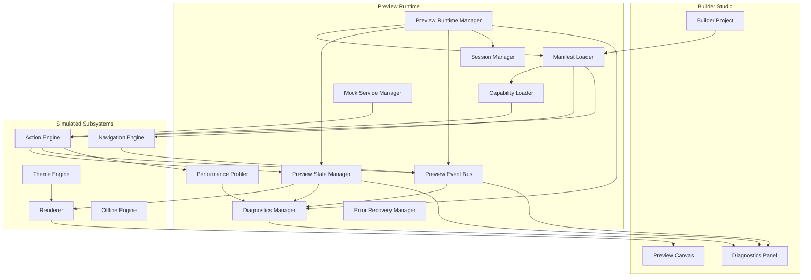

# Preview Runtime

**KB-029 — Preview Runtime Specification**

| Metadata | |
|----------|---|
| **KB ID** | KB-029 |
| **Title** | Preview Runtime |
| **Version** | 0.1.0 |
| **Status** | Drafting |
| **Owner** | Architecture Team |
| **Dependencies** | KB-022 Builder Studio Architecture, KB-030 Validation Engine, Runtime Overview |
| **Related Documents** | Builder Studio Architecture (KB-022), Runtime Overview, Action Engine (KB-015), Event Bus (KB-019), State Management (KB-018), Offline & Synchronization (KB-020), Validation Engine (KB-030), Publishing Pipeline (KB-031), Component Model (KB-013), Theme Engine (KB-017) |
| **Review Status** | Pending |
| **Last Updated** | 2026-07-10 |

### Revision History

| Version | Date | Author | Change |
|---------|------|--------|--------|
| 0.1.0 | 2026-07-10 | AI Architecture Agent | Initial draft |

---

## 1. Purpose

The Preview Runtime is the Builder Studio subsystem responsible for executing, simulating, debugging, validating, profiling, and inspecting DUKADESK applications before publication. It provides an isolated execution environment that faithfully reproduces production Runtime behavior while enabling interactive development, testing, diagnostics, mock integrations, AI-assisted debugging, and rapid iteration.

Preview execution is separate from production execution because the two environments have fundamentally different requirements. Production execution prioritizes stability, security, and performance. Preview execution prioritizes observability, debuggability, and rapid iteration. Combining them would compromise both. A Builder editing a screen preview must never risk affecting production users or data.

Simulation is essential before publishing because the gap between design-time and runtime is where the majority of defects are introduced. A screen layout that appears correct in the static Builder canvas may behave unexpectedly when the Runtime resolves it. A workflow that validates in the Workflow Builder may fail when executed against real state. The Preview Runtime closes this gap by executing the same artifacts the production Runtime will execute, in a safe environment.

The Preview Runtime mirrors production Runtime behavior because preview is only useful if it accurately predicts production behavior. If the Preview Runtime renders a screen differently than production, or executes a workflow differently, then preview feedback is misleading. The Preview Runtime must implement the same architectural contracts — the same component resolution, layout computation, action dispatch, state management, event routing, theme application, and navigation logic — as the production Runtime.

The Preview Runtime never replaces production validation. Preview demonstrates that the application works in a simulated environment. Production validation confirms that it works with real data, real integrations, real authentication, and real device conditions. Both are necessary; neither substitutes for the other.

---

## 2. Preview Philosophy

### Production Fidelity

The Preview Runtime must behave as closely as possible to the production Runtime. Discrepancies between preview and production erode trust and lead to post-publishing defects. Fidelity is achieved by implementing the same architectural contracts, not by sharing code or infrastructure.

### Safe Isolation

The Preview Runtime operates in a completely isolated environment. It never connects to production services, never accesses production data, and never affects production state. Isolation is enforced at the architectural level, not through configuration.

### Deterministic Execution

Preview execution must be reproducible. Given the same artifacts and the same mock configuration, the Preview Runtime must produce the same result every time. Nondeterministic behavior (random values, timing-dependent execution, external service variability) is eliminated or explicitly controlled in preview mode.

### Rapid Iteration

The Preview Runtime must respond quickly to artifact changes. Builders edit a screen and expect to see the result in the preview immediately. Long load times, slow rebuilds, or delayed updates break the design flow. Preview startup, artifact loading, and hot reload are optimized for speed over production-level optimization.

### Mock-First Development

The Preview Runtime uses mock services by default. Mock APIs, mock databases, mock authentication, and mock external integrations enable builders to develop and test applications without access to real systems. Mocks are realistic but controlled — they produce predictable responses and can be configured to simulate error conditions.

### Full Observability

Every operation in the Preview Runtime is observable. State changes, action dispatches, event publications, navigation transitions, component renders, API calls, and workflow executions are all visible in the diagnostics panel. Full observability enables builders to understand exactly what their application is doing at every moment.

### Reproducible Debugging

When a builder encounters a problem in preview, they must be able to reproduce it reliably. The Preview Runtime supports session recording, state snapshots, input replay, and deterministic mock configuration to ensure that bugs can be reproduced and investigated.

### Runtime Parity

The Preview Runtime implements the same contracts as the production Runtime but is a separate implementation. It does not share code paths that could introduce production defects. It does, however, share schema definitions, component metadata, manifest parsing, and validation rules to ensure behavioral parity.

### AI-Assisted Diagnostics

The Preview Runtime integrates with the AI Assistant to provide intelligent diagnostics. When the builder encounters an error, the AI Assistant can inspect the runtime state, trace the execution path, and suggest specific fixes.

### Platform Independence

The Preview Runtime is platform-independent. It simulates mobile, web, desktop, and future platform behavior without being tied to any specific rendering technology or device API. Platform-specific behavior is simulated through mock device capabilities.

---

## 3. Preview Responsibilities

### Application Execution

Load and execute the full application — screens, navigation, workflows, actions, themes, data models, and capabilities — within the preview environment. The Preview Runtime presents the running application to the builder for interaction and inspection.

### Runtime Simulation

Simulate all production Runtime subsystems: Navigation Engine, Action Engine, Event Bus, State Management, Renderer, Theme Engine, and Offline Engine. Each subsystem behaves according to its specification but operates in simulation mode.

### Workflow Execution

Execute workflow definitions step by step, with full tracing and inspection. Workflow steps that call external services use mock implementations. Workflow execution can be paused, stepped, and resumed for debugging.

### Navigation Simulation

Simulate the Navigation Engine including route resolution, stack management, guard evaluation, deep link handling, and screen transitions. Navigation behavior in preview matches production behavior for the same route definitions.

### State Inspection

Provide full visibility into the State Management subsystem: all registered state keys, current values, mutation history, subscription counts, and state lifecycle events. Builders can inspect, search, and filter state in real time.

### Event Inspection

Provide full visibility into the Event Bus: all published events, subscriber lists, event payloads, and event timing. Builders can inspect event flow and verify that events are published and consumed as expected.

### Theme Rendering

Render the application with the selected theme, including light, dark, high contrast, and brand-specific variants. Theme preview matches production theme rendering using the same theme token resolution logic.

### Mock Integrations

Provide mock implementations for all external integrations: API calls, databases, file storage, authentication, payment processing, email, SMS, and push notifications. Mock integrations are configurable and support success, error, timeout, and edge case simulation.

### Diagnostics

Collect and expose comprehensive diagnostic information: execution traces, state history, event history, performance metrics, error logs, and validation results. Diagnostics are available through the Builder diagnostics panel and programmatic interfaces.

### Performance Profiling

Measure and report performance metrics: startup time, screen render time, action execution duration, workflow step timing, state update frequency, and memory usage. Profiling data helps builders identify and resolve performance issues before publication.

### Responsibility Boundaries

| Responsibility | Preview Runtime | Production Runtime | Notes |
|---------------|-----------------|-------------------|-------|
| Application execution | Yes | Yes | Same artifacts, different environment |
| Real data access | No | Yes | Preview uses mocks |
| Real service integration | No | Yes | Preview uses mocks |
| Full observability | Yes | Limited | Preview is fully instrumented |
| Performance profiling | Yes | Yes | Different profiles |
| Error recovery | Graceful | Robust | Preview sacrifices robustness for observability |
| Security enforcement | Simulated | Real | Preview mocks auth |
| Isolation | Strict | Tenant-isolated | Preview is single-tenant |

---

## 4. Preview Runtime Architecture

### 4.1 Preview Runtime Manager

| Aspect | Description |
|--------|-------------|
| **Purpose** | Orchestrate the preview lifecycle — startup, execution, inspection, and shutdown. |
| **Responsibilities** | Initialize preview environment, load artifacts, coordinate module execution, handle lifecycle events, manage session state. |
| **Inputs** | Builder project reference, preview configuration (device, theme, locale). |
| **Outputs** | Running preview instance, diagnostics data, lifecycle events. |
| **Extension points** | Custom preview initializers, lifecycle hooks, environment providers. |

### 4.2 Manifest Loader

| Aspect | Description |
|--------|-------------|
| **Purpose** | Load and resolve Builder artifacts into the preview environment. |
| **Responsibilities** | Parse Manifest, resolve component references, load capability definitions, resolve dependencies, initialize artifact cache. |
| **Inputs** | Builder project artifacts. |
| **Outputs** | Resolved artifact registry, dependency graph. |
| **Extension points** | Custom artifact resolvers, pre-load hooks. |

### 4.3 Capability Loader

| Aspect | Description |
|--------|-------------|
| **Purpose** | Load capability definitions and register them in the preview environment. |
| **Responsibilities** | Load capability manifests, register capability components, register capability actions, register capability state, establish capability isolation. |
| **Inputs** | Capability definitions from Manifest. |
| **Outputs** | Loaded capabilities, registered components and actions. |
| **Extension points** | Custom capability loaders, capability initialization hooks. |

### 4.4 Mock Service Manager

| Aspect | Description |
|--------|-------------|
| **Purpose** | Provide and manage mock implementations for all external integrations. |
| **Responsibilities** | Register mock API handlers, configure mock responses, simulate integration behavior, support error condition simulation. |
| **Inputs** | Mock configuration, API request intercepts. |
| **Outputs** | Mock responses, integration logs. |
| **Extension points** | Custom mock providers, Marketplace mock extensions, response templates. |

### 4.5 Preview State Manager

| Aspect | Description |
|--------|-------------|
| **Purpose** | Manage application state within the preview environment. |
| **Responsibilities** | Initialize state from Manifest defaults, apply mock data, record mutation history, support state inspection and modification. |
| **Inputs** | State changes from Action Engine, initial state configuration. |
| **Outputs** | State values, mutation history, change notifications. |
| **Extension points** | Custom state initializers, mock data providers. |

### 4.6 Preview Event Bus

| Aspect | Description |
|--------|-------------|
| **Purpose** | Provide an in-process Event Bus that mirrors production Event Bus behavior with full event recording. |
| **Responsibilities** | Route events between subsystems, record all events for inspection, support event replay and filtering. |
| **Inputs** | Published events from all subsystems. |
| **Outputs** | Event delivery, event history. |
| **Extension points** | Custom event interceptors, event filters. |

### 4.7 Diagnostics Manager

| Aspect | Description |
|--------|-------------|
| **Purpose** | Collect, store, and expose comprehensive diagnostic data. |
| **Responsibilities** | Record execution traces, capture logs, track performance metrics, manage diagnostic storage, expose diagnostics API. |
| **Inputs** | Events from all other modules. |
| **Outputs** | Diagnostic data, execution traces, metrics. |
| **Extension points** | Custom diagnostic collectors, trace exporters. |

### 4.8 Performance Profiler

| Aspect | Description |
|--------|-------------|
| **Purpose** | Measure and report performance characteristics of the running application. |
| **Responsibilities** | Time startup and rendering, measure action and workflow execution, track memory and state metrics, generate profiling reports. |
| **Inputs** | Execution events from all modules. |
| **Outputs** | Performance metrics, profiling reports. |
| **Extension points** | Custom profilers, metric definitions. |

### 4.9 Session Manager

| Aspect | Description |
|--------|-------------|
| **Purpose** | Manage preview session state — setup, persistence, and teardown. |
| **Responsibilities** | Create preview session, persist session state across preview restarts, restore previous session state, clean up on shutdown. |
| **Inputs** | Preview configuration, session lifecycle events. |
| **Outputs** | Active session, session state. |
| **Extension points** | Custom session persistence, session migration. |

### 4.10 Error Recovery Manager

| Aspect | Description |
|--------|-------------|
| **Purpose** | Handle errors gracefully within the preview environment. |
| **Responsibilities** | Catch runtime errors, preserve error context, recover to last known good state, present diagnostic information. |
| **Inputs** | Runtime errors from all modules. |
| **Outputs** | Error diagnostics, recovery actions. |
| **Extension points** | Custom error handlers, recovery strategies. |

### Preview Runtime Architecture Diagram



---

## 5. Preview Environment

### Runtime Configuration

The Preview Runtime configures itself based on the builder's preview settings:

- **Target platform**: Mobile, tablet, desktop, or custom viewport.
- **Runtime version**: The Runtime version the project targets.
- **Locale**: The locale to simulate.
- **Theme**: The active theme (light, dark, high contrast, brand).

### Mock Authentication

The Preview Runtime provides mock authentication:

- Simulated login screen or auto-login.
- Configurable user identity (ID, name, email, roles, permissions).
- Configurable authentication state (authenticated, unauthenticated, expired session).
- Mock token generation and validation.

### Mock Tenants

The Preview Runtime simulates multi-tenant behavior:

- Configurable tenant context (tenant ID, name, configuration).
- Tenant-scoped data isolation.
- Tenant feature flag configuration.
- Tenant-specific theme overrides.

### Mock Organizations

The Preview Runtime simulates organizational structure:

- Configurable organization hierarchy.
- Organization-specific settings.
- Department and team membership.

### Mock Users

The Preview Runtime provides mock user profiles:

- Configurable user identity and attributes.
- Assignable roles and permissions.
- Configurable user preferences.
- Simulated user switching for role-based testing.

### Mock Permissions

The Preview Runtime evaluates permissions using mock data:

- Permission grants based on mock user configuration.
- Permission evaluation logging (which permissions were checked, what the result was).
- Configurable permission overrides for testing edge cases.

### Mock Feature Flags

The Preview Runtime simulates feature flag state:

- Feature flags configured per tenant, per user, or globally.
- Flag state toggling during preview for testing.
- Flag evaluation logging.

### Mock Localization

The Preview Runtime provides mock localization data:

- Configurable locale and language.
- Translation data from the project's localization resources.
- Locale-specific formatting (dates, numbers, currencies).

### Mock Device Capabilities

The Preview Runtime simulates device capabilities:

- Camera availability.
- Location services.
- Biometric authentication.
- Push notification support.
- Storage availability.
- Network type (wifi, cellular, offline).

### Mock Connectivity

The Preview Runtime simulates network connectivity:

- Online mode (full connectivity).
- Offline mode (no connectivity).
- Limited mode (metered, high latency, low bandwidth).
- Connectivity quality toggling during preview.

---

## 6. Artifact Loading

### Loading Order

Artifacts are loaded in a specific order to satisfy dependencies:

```
1. Desk Configuration
       ↓
2. Theme Definitions
       ↓
3. Data Models
       ↓
4. Capability Manifests
       ↓
5. Component Registry References
       ↓
6. Navigation Definitions
       ↓
7. Screen Definitions
       ↓
8. Form Definitions
       ↓
9. Workflow Definitions
       ↓
10. Assets (images, icons, fonts)
       ↓
11. Localization Resources
```

### Desk Configuration

The Manifest Loader begins by loading the Desk-level configuration: identity, supported platforms, default locale, default theme, capability requirements, and publishing metadata.

### Theme Definitions

Theme definitions are loaded next so that all visual elements can reference theme tokens from the start. The Theme Engine is initialized with the loaded theme definitions.

### Data Models

Data Models are loaded before screens and forms because screens, forms, and workflows reference entity definitions. The State Manager initializes state keys based on Data Model definitions.

### Capability Manifests

Capability manifests are resolved and their components, actions, and state extensions are registered. Capability initialization hooks are executed.

### Component Registry References

Component references are resolved against the Component Registry. The Preview Runtime loads component metadata and schemas. Component implementations are provided by the preview environment.

### Navigation Definitions

Navigation graphs are loaded and the Navigation Engine is initialized with all route definitions, guards, and deep link mappings.

### Screen Definitions

Screen definitions are loaded and registered with their associated routes. Screen layouts, component placements, and property configurations are parsed and cached.

### Form Definitions

Form definitions are loaded with their field configurations, validation rules, and submission behaviors.

### Workflow Definitions

Workflow definitions are loaded with their triggers, steps, decisions, error handlers, and data mappings. The Action Engine registers workflow triggers.

### Assets

Project assets (images, icons, fonts, media files) are loaded and cached in the preview asset store.

### Localization Resources

Localization resources are loaded and registered with the localization service. The preview locale is applied.

---

## 7. Runtime Simulation

### Navigation Simulation

The Preview Runtime simulates the full Navigation Engine:

- Route resolution matches production behavior exactly.
- Stack operations (push, pop, replace) behave identically.
- Guard evaluation runs all configured guards with mock context.
- Deep link processing parses URIs and resolves routes.
- Tab and drawer navigation is fully functional.
- Navigation lifecycle events are published on the Preview Event Bus.

Differences from production: Guards evaluate against mock permissions. Deep links do not trigger external system interactions.

### Action Simulation

The Preview Runtime simulates the Action Engine:

- All action types are supported (navigation, data, state, notifications, API, capability).
- Action validation matches production rules.
- Action execution uses mock services for external calls.
- Action timing is recorded for profiling.

Differences from production: API calls go to mock handlers. Payments use mock processors. Notifications are logged but not sent.

### Event Simulation

The Preview Runtime provides a fully functional Event Bus:

- Events are published and delivered to subscribers.
- Event filtering and pattern matching work identically to production.
- All events are recorded for inspection.
- Event timing and ordering match production semantics.

Differences from production: The Preview Event Bus runs in-process with no network transport.

### State Simulation

The Preview Runtime simulates the full State Management subsystem:

- State registration, mutation, and observation match production behavior.
- State persistence is simulated (state persists during preview session but not across sessions).
- State synchronization is mocked (offline queue accumulates but does not send).
- Mutation history is recorded for inspection.

Differences from production: Persistence is session-scoped. Synchronization is logged but not executed against real backends.

### Offline Simulation

The Preview Runtime simulates offline and synchronization behavior:

- Connectivity can be toggled between online, offline, and limited.
- Offline mutations are queued and tracked.
- Synchronization flow is simulated with mock conflict scenarios.
- Conflict resolution strategies are executed with mock conflicts.

Differences from production: No real synchronization occurs. Conflicts are simulated.

### Device Capability Simulation

The Preview Runtime simulates device capabilities:

- Camera, location, biometric, and notification APIs return mock data.
- Capability permission requests are simulated.
- Device state (battery, storage, orientation) is configurable.

### Permission Simulation

The Preview Runtime evaluates permissions using mock user data:

- Permission checks execute the same evaluation logic as production.
- Results depend on mock permission configuration.
- Permission failures produce the same error states as production.

### Notification Simulation

The Preview Runtime simulates notifications:

- Push notifications are logged and displayed in the preview UI.
- Email and SMS notifications are captured and inspectable.
- In-app notifications render in the preview.

### Background Execution (Conceptual)

The Preview Runtime may simulate background execution behavior:

- Workflows triggered by background events (timers, push, geofence).
- State mutations occurring while the application is backgrounded.
- Navigation state preservation across background/foreground transitions.

---

## 8. Mock Services

### Mock APIs

The Mock Service Manager intercepts all HTTP API calls made by the application:

- Requests are intercepted before reaching the network layer.
- Mock responses are returned based on configured response templates.
- Response templates may be static data, dynamic data generators, or error simulations.
- API call logs are available for inspection.

### Mock Databases

Data operations (create, read, update, delete, query) use an in-memory mock database:

- Mock database is initialized with seed data from the project's Data Models.
- Mock data is generated automatically or configured manually.
- CRUD operations behave identically to production database operations.
- Query, filter, sort, and aggregation operations are supported.

### Mock File Storage

File upload and download operations use mock file storage:

- Uploaded files are stored in memory during the preview session.
- File metadata (name, size, type) is preserved.
- Download requests return mock file content.

### Mock Authentication

Authentication operations are simulated:

- Login accepts any credentials (or configured mock credentials).
- Token generation and validation behave like production.
- Session management works identically.
- Authentication errors can be simulated (invalid credentials, expired session).

### Mock Payment Providers

Payment operations are simulated:

- Payment processing returns configurable results (success, failure, pending).
- Refund operations are supported.
- Payment webhook callbacks can be triggered manually for testing.
- No real payment processing occurs.

### Mock Email

Email operations are captured and inspectable:

- Sent emails are stored in a mock outbox.
- Email content (to, from, subject, body) is fully inspectable.
- Email deliverability can be simulated (sent, failed, delayed).

### Mock SMS

SMS operations are captured and inspectable:

- Sent SMS messages are stored in a mock outbox.
- Message content and recipient are inspectable.
- Delivery status can be simulated.

### Mock Push Notifications

Push notification operations are captured:

- Sent push notifications are stored for inspection.
- Notification payload and target are recorded.
- Notification delivery can be simulated.

### Mock External Integrations

The Mock Service Manager supports custom mock providers for Marketplace extensions and SDK integrations:

- Extension developers register mock implementations for their services.
- Mock providers follow the same interface as real providers.
- Mock configuration is available through the Mock Service Manager.

---

## 9. Debugging & Inspection

### Runtime Inspection

The diagnostics panel shows the current state of all Runtime subsystems:

- Loaded artifacts and their versions.
- Active capabilities.
- Registered components and actions.
- Current navigation state (route, stack, history).
- Active workflow instances.

### State Inspection

The state inspector provides full visibility into the State Management subsystem:

- All registered state keys and their current values.
- State type information and schemas.
- Mutation history (who changed what, when).
- Active subscriptions grouped by consumer.
- State diffs between mutations.

### Workflow Tracing

Workflow execution is fully traceable:

- Step-by-step execution log with timestamps.
- Variable values at each step.
- Decision evaluation results.
- Error and retry events.
- Workflow instance timeline.

### Event Tracing

Event bus activity is fully inspectable:

- All published events with payloads.
- Event subscribers and delivery status.
- Event timing and ordering.
- Event pattern matching results.

### Component Inspection

Components rendered in the preview can be inspected:

- Component identity (ID, type, instance ID).
- Current property values.
- Incoming data bindings.
- Event bindings and action references.
- Accessibility metadata.

### Navigation Inspection

Navigation state is fully inspectable:

- Current route and parameters.
- Full back-stack.
- Tab selection state.
- Open modals and overlays.
- Navigation guard evaluation results.

### Network Inspection

All API calls (real and mock) are captured:

- Request method, URL, headers, and body.
- Response status, headers, and body.
- Request duration.
- Error details (if any).

### Error Inspection

All runtime errors are captured with full context:

- Error type and message.
- Stack trace.
- Application state at time of error.
- Component or workflow context.
- Suggested fix (where available).

### Log Inspection

Application log output is collected and displayable:

- Log level filtering (debug, info, warn, error).
- Log source filtering (component, workflow, service).
- Searchable log history.
- Configurable log retention.

---

## 10. Performance Profiling

### Startup Profiling

Measure application startup performance:

- Time to load and resolve artifacts.
- Time to initialize Runtime subsystems.
- Time to render initial screen.
- Breakdown by artifact type.

### Render Profiling

Measure screen rendering performance:

- Screen load time.
- Component render time per component.
- Layout resolution time.
- Theme application time.
- Number of components rendered.

### Workflow Execution Timing

Measure workflow performance:

- Trigger-to-first-step latency.
- Per-step execution duration.
- Decision evaluation time.
- Integration call duration (mock).
- Total workflow execution time.

### Action Timing

Measure action execution performance:

- Action dispatch time.
- Action validation time.
- Action handler execution time.
- State update propagation time.

### Memory Usage

Track memory consumption:

- Total memory allocated to preview.
- Memory per subsystem (state, events, components).
- Memory growth over time.
- Detected memory leaks.

### State Updates

Measure state management performance:

- State mutation application time.
- Observation notification delivery time.
- Subscription evaluation time.
- State key count and update frequency.

### Event Throughput

Measure Event Bus performance:

- Events published per second.
- Event delivery latency.
- Subscriber execution time.
- Event queue depth.

### Asset Loading

Measure asset loading performance:

- Asset load time per asset.
- Asset cache hit rate.
- Total asset size.
- Asset decoding/processing time.

### Offline Performance Simulation

Measure offline-related performance:

- Queue write and read latency.
- Sync batch processing time.
- Conflict resolution time.
- Storage size growth during offline operation.

---

## 11. AI Integration

### Explain Runtime Failures

When a runtime error occurs in preview, the AI Assistant can:
- Analyze the error in context of the application state.
- Trace the execution path leading to the error.
- Identify the root cause (component configuration, workflow logic, data binding, permission).
- Explain the error in plain language with actionable guidance.

### Suggest Fixes

Based on error analysis, the AI Assistant suggests specific fixes:
- "The navigation action references a route 'order.detail' that does not exist. Did you mean 'order.details'?"
- "The workflow step is calling an API with an invalid URL template. The '{orderId}' parameter is not being resolved."
- "The component 'ProductCard' requires a 'productId' property but none is provided. Check the data binding configuration."

### Detect Performance Bottlenecks

The Performance Profiler data feeds AI analysis:
- "This screen renders 47 components. Consider using list virtualization or reducing component count."
- "The workflow 'ProcessOrder' has a step that takes 2.3 seconds (simulated). Consider optimizing the API call or adding caching."
- "State mutations are occurring at 200 updates/second. Consider batching or debouncing."

### Analyze Workflows

The AI Assistant can analyze workflow execution traces:
- "The workflow took the 'approval required' path 3 out of 5 test cases. Verify that the condition logic matches the business requirement."
- "Step 4 'Notify Manager' failed in 2 test cases because the manager role is not configured. Add a default manager or error handler."

### Inspect State Changes

The AI Assistant can analyze state mutation history:
- "The 'cart.items' state is being updated 12 times during checkout. Consider using a single update instead of incremental updates."
- "The 'user.preferences' state was modified by 3 different components. Verify that state ownership rules are being followed."

### Recommend Optimizations

Based on profiling data, the AI Assistant recommends optimizations:
- "Three API calls in this workflow are independent and could run in parallel."
- "This component re-renders on every state change. Memoize or narrow the subscription."
- "This screen layout has 8 levels of container nesting. Consider flattening to improve performance."

### Generate Test Scenarios

The AI Assistant can generate test scenarios based on the application structure:
- "Generate test cases for the 'Order Approval' workflow covering: approval, rejection, escalation, and timeout paths."
- "Generate mock data for the 'Customer' entity with valid and invalid edge cases."

### Explain Validation Failures

When validation fails during preview, the AI Assistant can:
- "This screen fails accessibility validation because 3 images are missing alt text and 2 buttons have insufficient contrast."
- "The workflow validation error is caused by a missing data mapping between Step 2 output and Step 3 input."

---

## 12. Runtime Integration

### Runtime

The Preview Runtime mirrors the production Runtime's architectural contracts. It does not share code with the production Runtime but implements the same interfaces, consumes the same artifact formats, and produces the same behavioral results.

**Real:** Manifest loading, artifact resolution, component rendering, layout computation, navigation execution, action dispatch, state management, event routing, theme application.
**Simulated:** External API calls, database access, authentication, payment processing, push notifications, email/SMS, file storage, device capabilities.

### Renderer

The Preview Renderer implements the same rendering contract as the production Renderer:
- Component resolution from the Component Registry.
- Layout computation from the Layout System.
- Theme application from the Theme Engine.
- Responsive adaptation across breakpoints.

**Differences from production:** The Preview Renderer operates in a controlled environment with mock data. Rendering fidelity is prioritized over rendering performance.

### Navigation Engine

The Preview Navigation Engine implements the same navigation contract:
- Route registration and resolution.
- Stack, tab, drawer, and modal management.
- Guard evaluation with mock context.
- Deep link processing.

**Differences from production:** Guards evaluate against mock permissions. Deep links do not activate external system callbacks.

### Action Engine

The Preview Action Engine implements the same action contract:
- Action registration and resolution.
- Action validation and execution.
- Workflow trigger and step execution.
- Action result handling.

**Differences from production:** API call actions go to mock handlers. Payment actions use mock processors. Notification actions are captured for inspection.

### Event Bus

The Preview Event Bus implements the same event contract:
- Event publication and subscription.
- Event filtering and pattern matching.
- Event delivery guarantees (in-process delivery).

**Differences from production:** In-process only, no network transport. All events are recorded for inspection.

### State Management

The Preview State Manager implements the same state contract:
- State registration, mutation, and observation.
- State schema validation.
- State lifecycle management.

**Differences from production:** State persists only for the preview session. Synchronization is simulated.

### Offline & Synchronization

The Offline simulation implements the same synchronization contract:
- Mutation queuing.
- Conflict detection and resolution.
- Sync lifecycle.

**Differences from production:** No real synchronization occurs. Conflicts are simulated with mock data.

### Theme Engine

The Preview Theme Engine uses the same theme definition format and token resolution logic as the production Theme Engine. Theme rendering is identical between preview and production.

### Capability System

The Preview Capability Loader registers capabilities and their components, actions, and state extensions exactly as the production Runtime would. Capability behavior in preview matches production behavior for the same capability definitions.

---

## 13. Validation Integration

### Validation Engine

The Preview Runtime and Validation Engine are complementary systems:

| Aspect | Preview Runtime | Validation Engine |
|--------|-----------------|-------------------|
| **Purpose** | Execute and inspect | Analyze and verify |
| **When** | During authoring | Before publishing |
| **Finds** | Runtime errors, behavior issues | Schema violations, standard violations |
| **Mode** | Interactive | Batch |
| **Scope** | Single application execution | All artifacts, all rules |

### Schema Validation

The Preview Runtime validates artifact schemas during loading:
- Manifest schema compliance.
- Component configuration schema compliance.
- Workflow definition schema compliance.
- Data Model schema compliance.

Schema validation errors during preview are reported as load failures with specific error messages.

### Runtime Validation

The Preview Runtime validates runtime behavior:
- Action parameter validation.
- State mutation schema validation.
- Navigation guard evaluation.
- Workflow step input/output validation.

Runtime validation errors during preview are captured and displayable in the diagnostics panel.

### Accessibility Validation

The Preview Runtime can surface accessibility issues during preview:
- Missing labels on form fields.
- Insufficient color contrast.
- Missing ARIA attributes.
- Focus order issues.

Accessibility issues are displayed alongside other diagnostics.

### Security Validation

The Preview Runtime can surface potential security issues:
- Missing permission checks on routes.
- Unprotected sensitive data exposure.
- Insecure action configurations.

### Performance Validation

The Preview Runtime's Performance Profiler can flag performance issues:
- Excessive component count.
- Deep layout nesting.
- Slow action execution.
- Excessive state updates.

---

## 14. Collaboration

### Shared Preview Sessions (Future)

Future support for multiple users viewing the same preview session:

- QA engineers and developers see the same application state.
- Designers and stakeholders review the same rendered screens.
- Training sessions using a shared preview instance.

### QA Review Sessions

QA engineers can use the Preview Runtime for structured review:

- Load a specific project version into preview.
- Execute predefined test scenarios.
- Record session interactions for bug reproduction.
- Attach diagnostics data to bug reports.

### Commenting

Preview sessions support commenting:

- Add comments to specific screens, components, or workflow steps.
- @mention team members for feedback.
- Threaded discussions with replies.
- Comment visibility scoped to review sessions.

### Recorded Preview Sessions

Preview sessions can be recorded for later review:

- Full interaction recording (navigation, actions, state changes).
- Session timeline with scrubbing.
- Export session recordings for offline review.
- Compare recordings across application versions.

### Version Comparison

The Preview Runtime supports comparing different versions of the same application:

- Load version A and version B side by side.
- Visual diff of screen rendering.
- Behavioral diff of workflow execution.
- State diff across versions.

### Change Tracking

Preview sessions track changes made during the session:

- Which artifacts were modified.
- Who made the changes.
- Before/after comparison.
- Session change summary.

---

## 15. Security

### Preview Isolation

The Preview Runtime is fully isolated from production systems:

- No network access to production services.
- No access to production databases.
- No access to production authentication systems.
- No access to production file storage.
- No production credential exposure.

Isolation is enforced at the architectural level. The Preview Runtime does not have the capability to connect to production endpoints even if misconfigured.

### Mock Credential Protection

Mock credentials used in preview are:

- Generated randomly for each session.
- Never derived from or related to real credentials.
- Stored only in memory during the preview session.
- Discarded when the preview session ends.

### Secret Masking

Any secrets or sensitive values that appear in preview diagnostics are automatically masked:

- API keys are shown as `***` in logs.
- Tokens are truncated in event payloads.
- Passwords are never displayed in plain text.
- PII data is masked in state inspection.

### Tenant Isolation

Preview sessions simulate single-tenant environments. Cross-tenant data access is not possible because there is only one tenant in the preview context.

### Safe Execution

The Preview Runtime executes application code in a sandboxed environment:

- No file system access beyond the preview storage.
- No device API access beyond mock implementations.
- No network access beyond mock service handlers.
- Execution is terminated if resource limits are exceeded.

### Audit Logging

Preview session activity is logged:

- Session start and end timestamps.
- Artifacts loaded.
- Actions executed.
- Errors encountered.
- Diagnostics data collected.

---

## 16. Performance

### Incremental Loading

The Preview Runtime loads artifacts incrementally:

- Desk configuration loads first.
- Screens and workflows load on demand when first accessed.
- Assets load lazily as they are referenced.
- Capabilities load when their screens or workflows are accessed.

### Lazy Initialization

Subsystems are initialized lazily:

- The Navigation Engine initializes when the first navigation occurs.
- The Workflow Engine initializes when the first workflow is triggered.
- Mock services initialize on first use.
- The Performance Profiler initializes when profiling is requested.

### Efficient Hot Reload (Conceptual)

When project artifacts change during a preview session:

- Only changed artifacts are reloaded.
- Affected subsystems are updated incrementally.
- Application state is preserved across reloads when possible.
- Screens that depend on changed artifacts are re-rendered.

### Asset Caching

Loaded assets are cached for the duration of the preview session:

- Component metadata is cached after first load.
- Theme token values are cached after resolution.
- Image and media assets are cached in memory.
- Cache is invalidated when project artifacts change.

### Mock Service Optimization

Mock services are optimized for fast response:

- Mock data is pre-generated during session initialization.
- Mock API responses use in-memory data structures.
- Mock database operations use indexed in-memory collections.
- Mock response times are configurable (instant or simulated latency).

### Session Reuse

Preview sessions may be reused across multiple preview requests:

- Session state persists when switching between artifacts.
- Navigation state is preserved when returning to preview.
- State mutation history accumulates across the session.
- Session is reset explicitly, not automatically.

---

## 17. Observability

### Runtime Diagnostics

The Diagnostics Manager exposes:

- Currently loaded artifacts and their versions.
- Active subsystem status (initialized, running, error).
- Runtime configuration (platform, theme, locale).
- Session information (ID, duration, activity count).

### Execution Traces

Detailed execution traces for all runtime operations:

- Navigation events with route resolution details.
- Action dispatches with validation and execution results.
- Workflow step executions with variable values.
- State mutations with before/after values.
- Event publications with subscriber delivery status.

### State History

Complete history of state mutations during the session:

- Timestamped mutation log.
- Mutation source (action, workflow, component).
- State key path.
- Previous and new values.
- Subscription notification count.

### Event History

Complete history of Event Bus activity:

- All published events with payloads.
- Subscriber registration list.
- Event delivery status per subscriber.
- Event processing duration.

### Performance Metrics

Real-time performance metrics:

- Screen render time.
- Action execution duration.
- Workflow step timing.
- State update frequency.
- Event throughput.
- Memory usage.

### Error Reports

Structured error reports for all runtime errors:

- Error type and message.
- Stack trace.
- Application state at error time.
- Component or workflow context.
- Suggested fix (where available).

### Timeline Visualization

The diagnostics panel provides a timeline view:

- Time-synchronized view of navigation, actions, events, state changes, and errors.
- Scrubbing through session history.
- Zoom in/out for granularity control.
- Filter by event type.

---

## 18. Anti-Patterns

### Preview Directly Modifying Production Data

The Preview Runtime accessing or modifying production data is prohibited. The Preview Runtime must never connect to production databases, APIs, authentication systems, or storage. Violating this isolation defeats the purpose of preview and creates data integrity and security risks.

### Preview-Specific Business Logic

Adding business logic that only executes in preview mode is prohibited. Preview-specific logic creates discrepancies between preview and production behavior. If a workflow must behave differently in preview, that difference should be limited to integration points (mocks) rather than business logic.

### Ignoring Production Parity

Accepting known behavioral differences between preview and production without documenting them is prohibited. Every difference between preview and production reduces the value of preview. Differences must be documented, justified, and minimized.

### Hardcoded Mock Values

Embedding mock values directly in preview configuration that do not reflect realistic production data is discouraged. Mock data should represent realistic volumes, formats, and edge cases. Unrealistic mocks hide defects that would surface with production data.

### Skipping Validation

Relying on the Preview Runtime to catch all defects instead of running the Validation Engine is prohibited. Preview finds runtime errors. Validation finds specification violations. Both are required before publishing.

### Hidden Runtime Behavior

The Preview Runtime should not execute code paths that are silent or invisible to the builder. All Runtime activity should be observable through the diagnostics panel. Hidden behavior prevents builders from understanding what their application is doing.

### Non-Deterministic Preview Execution

Preview execution that produces different results on repeated runs with the same inputs is prohibited. Non-deterministic behavior makes debugging impossible. Random values, timing dependencies, and uncontrolled external factors must be eliminated in preview mode.

### Preview-Specific Performance Characteristics

Optimizing the Preview Runtime for performance in ways that do not reflect production behavior is misleading. Preview profiling should accurately represent production performance characteristics. If preview is faster due to mock services, that should be clearly documented.

### Ignoring Error States

The Preview Runtime should not hide error states from the builder. If a component fails to render, a workflow step fails, or an action returns an error, the Preview Runtime must surface that error visibly. Silent failures defeat the purpose of preview.

### Using Preview as a Testing Tool

The Preview Runtime is a development and inspection tool, not a testing framework. It supports manual exploration and debugging. Automated testing is handled by the Validation Engine and dedicated testing tools.

---

## 19. Future Evolution

### Cloud Preview Runtime

A cloud-hosted Preview Runtime that enables:

- Preview from any device without local Builder installation.
- Share preview links with stakeholders for review.
- Load testing with simulated concurrent users.
- Integration testing with cloud-hosted mock services.

### Multi-User Preview Sessions

Multiple users interacting with the same preview instance:

- Collaborative debugging sessions.
- QA and developer reviewing the same application state.
- Trainer and trainee sharing a preview session.
- Stakeholder review with guided navigation.

### Device Farm Simulation

Simulation across a range of real device characteristics:

- CPU performance profiles (low-end, mid-range, flagship).
- Memory constraints (1GB, 2GB, 4GB, 8GB).
- Network conditions (2G, 3G, 4G, 5G, WiFi, satellite).
- Display characteristics (size, resolution, pixel density, refresh rate).
- OS version variants.

### AI-Driven Debugging

AI agents that actively assist in debugging:

- Automatically detect anomalies in application behavior.
- Compare execution traces against expected patterns.
- Identify regression when artifacts change.
- Suggest root cause analysis for complex failures.

### Cross-Platform Preview

Simultaneous preview across multiple target platforms:

- View mobile, tablet, and desktop layouts side by side.
- Compare rendering and behavior across platforms.
- Identify platform-specific issues before publishing.

### Real-Time Collaboration

Real-time collaborative preview sessions:

- Multiple builders navigating the same preview.
- Cursor and selection visibility.
- Shared diagnostics panel.
- Built-in communication channels.

### Enterprise Preview Environments

Enterprise-grade preview environments with:

- Preview deployment pipelines integrated with CI/CD.
- Preview environment per feature branch.
- Preview environment per pull request.
- Automated preview environment lifecycle management.
- Preview environment access control and audit logging.

---

## 20. Relationship to Other Documents

| Document | Relationship |
|----------|--------------|
| **KB-022 — Builder Studio Architecture** | The Preview Runtime is a subsystem within Builder Studio. This specification extends the Builder Studio architecture for pre-publication execution. |
| **KB-030 — Validation Engine** | The Preview Runtime and Validation Engine are complementary — preview finds runtime errors; validation finds specification violations. |
| **KB-031 — Publishing Pipeline** | Preview validates that an application works; publishing deploys it. Preview is a gate before publishing. |
| **Runtime Overview** | The Preview Runtime mirrors the production Runtime's architectural contracts. The Runtime Overview defines the contracts that Preview implements. |
| **KB-015 — Action Engine** | The Preview Runtime simulates action execution using Action Engine contracts. |
| **KB-019 — Event Bus** | The Preview Runtime provides a Preview Event Bus that mirrors production Event Bus behavior. |
| **KB-018 — State Management** | The Preview Runtime simulates State Management with full observability. |
| **KB-020 — Offline & Synchronization** | The Preview Runtime simulates offline behavior and synchronization flow. |
| **KB-013 — Component Model** | The Preview Runtime renders components according to the Component Model contract. |
| **KB-017 — Theme Engine** | The Preview Runtime applies themes using the Theme Engine contract. |

---

*This is KB-029, the Preview Runtime specification of the DUKADESK Engineering Knowledge Base. It defines the Builder Studio subsystem responsible for executing, simulating, debugging, validating, profiling, and inspecting DUKADESK applications before publication — closing the gap between design-time and runtime.*
