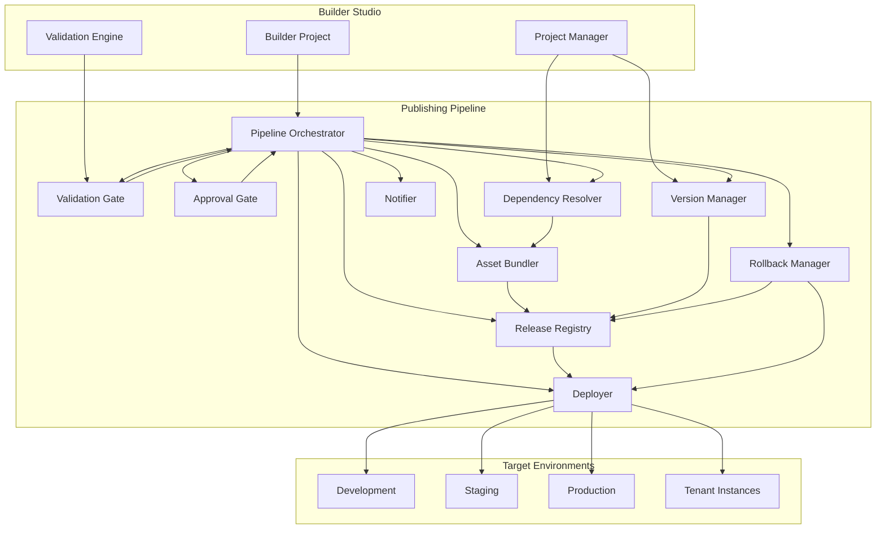
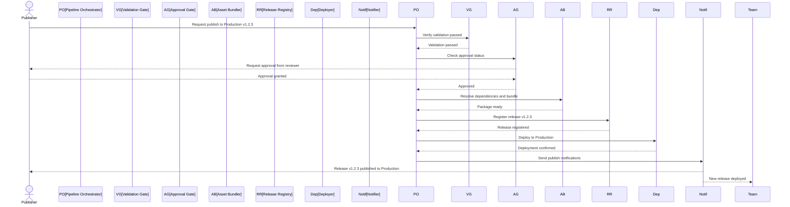

# Publishing Pipeline

**KB-031 — Publishing Pipeline Specification**

| Metadata | |
|----------|---|
| **KB ID** | KB-031 |
| **Title** | Publishing Pipeline |
| **Version** | 0.1.0 |
| **Status** | Drafting |
| **Owner** | Architecture Team |
| **Dependencies** | KB-022 Builder Studio Architecture, KB-030 Validation Engine, Manifest Specification, Runtime Overview |
| **Related Documents** | Builder Studio Architecture (KB-022), Validation Engine (KB-030), Preview Runtime (KB-029), Project Manager, Asset Manager, Component Registry (KB-012), Tenant Model |
| **Review Status** | Pending |
| **Last Updated** | 2026-07-10 |

### Revision History

| Version | Date | Author | Change |
|---------|------|--------|--------|
| 0.1.0 | 2026-07-10 | AI Architecture Agent | Initial draft |

---

## 1. Purpose

The Publishing Pipeline is the Builder Studio subsystem responsible for packaging validated project artifacts into deployable releases, submitting them to target environments, managing versioned release history, and supporting rollback. It is the final stage of the authoring workflow — the bridge between building an application and deploying it to users.

Packaging is necessary because a Builder project is an authoring representation — a collection of interconnected artifacts optimized for editing, not for consumption. The Publishing Pipeline transforms this authoring representation into a deployment representation: a self-contained, versioned, integrity-verified package that the Runtime can load and execute.

Publishing is a controlled process because deploying to production carries risk. The Publishing Pipeline enforces gates: validation must pass, approvals must be granted, compatibility must be verified. It does not blindly package and ship; it verifies, records, and safeguards every publication.

Separation between authoring and publishing exists because the two concerns have fundamentally different requirements. Authoring prioritizes flexibility, iteration speed, and collaboration. Publishing prioritizes stability, reproducibility, auditability, and safety. A project under active editing must never accidentally become a production release.

The Publishing Pipeline is environment-aware. A project may publish to multiple target environments: development, staging, production, or tenant-specific instances. Each environment has its own publishing requirements, approval gates, and deployment targets. The same Pipeline handles all environments with environment-appropriate rigor.

---

## 2. Publishing Philosophy

### Validation Gate

No project enters the Publishing Pipeline without passing pre-publish validation. The Validation Engine is the gatekeeper. If validation fails, publishing is blocked with clear reasons. This gate is non-negotiable — bypassing it would introduce unverified artifacts into production.

### Immutable Releases

Every published release is immutable. Once a release is published, its contents cannot be modified. A new release is created for any change. Immutability ensures that deployed environments are reproducible, auditable, and safe from accidental modification.

### Versioned History

Every publication creates a versioned entry in the release history. Versions follow semantic versioning (MAJOR.MINOR.PATCH) with optional pre-release labels. The version history provides a complete audit trail of what was published, when, by whom, and to which environment.

### Environment Awareness

The Publishing Pipeline tailors its behavior to the target environment:

- **Development**: Minimal gates, auto-deploy, immediate availability.
- **Staging**: Standard gates, approval optional, deployment to staging infrastructure.
- **Production**: Full gates, mandatory approval, deployment to production infrastructure, rollback plan required.
- **Tenant-specific**: Tenant isolation, tenant-specific configuration, targeted deployment.

### Safe Rollback

Every publication is reversible. The Publishing Pipeline maintains the previous release for each environment and supports rollback to any previous version. Rollback is a first-class operation, not an emergency procedure.

### Audit Trail

All publishing operations are recorded: who requested, who approved, what was published, to which environment, when, and what the result was. The audit trail is immutable and tamper-evident.

### Reproducible Builds

Given the same project version and publishing configuration, the Publishing Pipeline must produce the same release package every time. Reproducibility ensures that releases can be verified, audited, and reconstructed if needed.

---

## 3. Publishing Responsibilities

### Validation Gate

Require and verify pre-publish validation before accepting a project for publishing. The Publishing Pipeline does not run validation itself — it verifies that validation has been run and passed.

### Approval Gate

Enforce publishing approval workflows. Approval requirements vary by target environment. The Pipeline checks approval status before proceeding with publication.

### Dependency Resolution

Resolve all project dependencies — components, capabilities, themes, assets — to specific versions. Dependency resolution ensures that the published package is self-contained and version-pinned.

### Asset Bundling

Assemble all project artifacts and resolved dependencies into a deployable package. Asset bundling may include optimization (minification, compression, image optimization) depending on the target environment.

### Version Assignment

Assign a version to the release based on the project's version configuration and publishing history. Version assignment follows semantic versioning rules and detects version conflicts.

### Release Packaging

Create a release package containing all artifacts, resolved dependencies, asset bundles, version metadata, integrity hashes, and deployment instructions.

### Release Submission

Submit the release package to the target environment's deployment infrastructure. Submission may be synchronous (direct API call) or asynchronous (upload to release registry, trigger deployment pipeline).

### Release Verification

Verify that the release was successfully received and accepted by the target environment. Verification includes status checking and integrity confirmation.

### Release History Management

Maintain a complete history of all published releases, including version metadata, release notes, artifacts, environment targets, timestamps, and publishing actors.

### Rollback

Support rollback to any previous release in the release history. Rollback restores the target environment to the state of the selected previous release.

### Notification

Notify relevant stakeholders of publishing events: success, failure, approval required, rollback performed. Notifications are delivered through the Builder and through integrated communication channels.

### Responsibility Boundaries

| Responsibility | Publishing Pipeline | Builder Studio | Runtime |
|---------------|-------------------|----------------|---------|
| Pre-publish validation | Verify gate | Execute validation | — |
| Approval management | Enforce gates | Display approval UI | — |
| Dependency resolution | Yes | — | Load dependencies |
| Asset bundling | Yes | Provide assets | Load bundles |
| Version assignment | Yes | Configure version | Read version |
| Release packaging | Yes | — | — |
| Release submission | Yes | — | Accept releases |
| Release verification | Yes | — | Confirm receipt |
| History management | Yes | Display history | — |
| Rollback | Yes | Initiate rollback | Support rollback |
| Deployment | — | — | Apply release |

---

## 4. Publishing Pipeline Architecture

### 4.1 Pipeline Orchestrator

| Aspect | Description |
|--------|-------------|
| **Purpose** | Orchestrate the end-to-end publishing workflow — gates, stages, rollbacks, and notifications. |
| **Responsibilities** | Manage pipeline state machine, coordinate stage execution, enforce gate conditions, handle failures, manage retries. |
| **Inputs** | Publish request (project, target environment, version, release notes), validation report, approval status. |
| **Outputs** | Published release, deployment confirmation, pipeline execution log. |
| **Extension points** | Custom pipeline stages, stage hooks, pipeline event handlers. |

### 4.2 Validation Gate

| Aspect | Description |
|--------|-------------|
| **Purpose** | Verify that pre-publish validation has passed and that the validation report is current and complete. |
| **Responsibilities** | Check validation report presence, verify report freshness, confirm no critical errors, check warning acknowledgment status, validate report integrity. |
| **Inputs** | Validation report from Validation Engine. |
| **Outputs** | Gate pass/fail verdict. |
| **Extension points** | Custom validation gate conditions, additional pre-publish checks. |

### 4.3 Approval Gate

| Aspect | Description |
|--------|-------------|
| **Purpose** | Enforce publishing approval requirements based on target environment and project configuration. |
| **Responsibilities** | Determine approval requirements, check approval status, request approvals when needed, record approval decisions. |
| **Inputs** | Publishing configuration, project team roster, approval policy definitions. |
| **Outputs** | Approval status, approval requests. |
| **Extension points** | Custom approval workflows, external approval system integration. |

### 4.4 Dependency Resolver

| Aspect | Description |
|--------|-------------|
| **Purpose** | Resolve all project dependencies to specific versions for inclusion in the release package. |
| **Responsibilities** | Resolve component versions, capability versions, theme versions, asset references; verify compatibility; detect conflicts; pin resolved versions. |
| **Inputs** | Project artifact references, dependency registry, version compatibility matrix. |
| **Outputs** | Resolved dependency manifest, version pinning report. |
| **Extension points** | Custom resolvers, version resolution strategies, external registry integration. |

### 4.5 Asset Bundler

| Aspect | Description |
|--------|-------------|
| **Purpose** | Assemble and optimize project artifacts and resolved dependencies into the release package. |
| **Responsibilities** | Collect artifacts, bundle assets, optimize for target environment (minification, compression, image optimization), generate integrity hashes, create package manifest. |
| **Inputs** | Project artifacts, resolved dependencies, asset files, bundling configuration. |
| **Outputs** | Release package, package manifest, integrity hashes. |
| **Extension points** | Custom bundling strategies, optimization plugins, package format support. |

### 4.6 Version Manager

| Aspect | Description |
|--------|-------------|
| **Purpose** | Assign and manage release versions according to semantic versioning and project publishing history. |
| **Responsibilities** | Determine next version from project configuration and history, detect version conflicts, support pre-release labels, manage version metadata. |
| **Inputs** | Project version configuration, publishing history, requested version (optional). |
| **Outputs** | Assigned version, version metadata. |
| **Extension points** | Custom versioning schemes, version policy enforcement. |

### 4.7 Release Registry

| Aspect | Description |
|--------|-------------|
| **Purpose** | Store and manage the complete history of all published releases. |
| **Responsibilities** | Record release metadata, store release packages, support version queries, provide release comparison, manage release retention. |
| **Inputs** | Release package, release metadata. |
| **Outputs** | Release history, release artifacts. |
| **Extension points** | Custom storage backends, release indexing strategies, external registry integration. |

### 4.8 Deployer

| Aspect | Description |
|--------|-------------|
| **Purpose** | Submit release packages to target environments and verify successful deployment. |
| **Responsibilities** | Connect to target environment, transfer release package, trigger deployment, monitor deployment status, confirm completion. |
| **Inputs** | Release package, deployment configuration, target environment credentials. |
| **Outputs** | Deployment confirmation, deployment status. |
| **Extension points** | Custom deployment targets, deployment protocols, infrastructure providers. |

### 4.9 Rollback Manager

| Aspect | Description |
|--------|-------------|
| **Purpose** | Support rollback of target environments to any previous release version. |
| **Responsibilities** | Retrieve previous release, initiate rollback deployment, verify rollback success, record rollback in history. |
| **Inputs** | Rollback request (target version, environment), release history. |
| **Outputs** | Rollback confirmation, deployment status. |
| **Extension points** | Custom rollback strategies, rollback hooks, pre-rollback validation. |

### 4.10 Notifier

| Aspect | Description |
|--------|-------------|
| **Purpose** | Send notifications for publishing events to relevant stakeholders. |
| **Responsibilities** | Determine notification recipients, format notifications by channel, deliver notifications, track delivery status. |
| **Inputs** | Publishing events, stakeholder registry, notification templates. |
| **Outputs** | Delivered notifications. |
| **Extension points** | Custom notification channels, notification templates, external integration hooks. |

### Publishing Pipeline Architecture Diagram



---

## 5. Publishing Workflow

### Publishing Stages

The Publishing Pipeline executes a sequence of stages for every publication:

```
Validation Gate → Approval Gate → Dependency Resolution → Version Assignment → Asset Bundling → Release Registration → Deployment → Verification → Notification
```

### Stage 1: Validation Gate

The Pipeline checks that pre-publish validation has been run and passed:

- Validation report exists and is current (not stale).
- No critical errors in the report.
- All warnings are acknowledged.
- Validation report integrity hash matches.
- Publishing readiness check passed.

If any condition fails, the Pipeline rejects the publish request with a clear explanation.

### Stage 2: Approval Gate

The Pipeline checks publishing approval requirements for the target environment:

- **Development**: No approval required (auto-publish).
- **Staging**: Approval recommended but not required. Optional approval gate.
- **Production**: Approval required. Designated approvers must approve.
- **Tenant-specific**: Approval may be required based on tenant configuration.

If approval is required and not yet granted, the Pipeline pauses and sends approval requests. Publishing proceeds only when all required approvals are received.

### Stage 3: Dependency Resolution

The Pipeline resolves all project dependencies to specific versions:

- All component references are resolved to registered component versions.
- All capability references are resolved to installed capability versions.
- All theme references are resolved to theme definitions.
- All asset references are resolved to asset files.
- All version pins are verified for compatibility.
- Resolution conflicts are reported as errors.

### Stage 4: Version Assignment

The Pipeline assigns a version to the release:

- **Auto-version**: Increment the appropriate segment (major, minor, patch) based on project configuration and change analysis.
- **Manual version**: Use the version explicitly requested by the publisher.
- **Pre-release**: Apply pre-release label for development and staging publications.

Version conflicts (attempting to publish a version that already exists) are detected and reported.

### Stage 5: Asset Bundling

The Pipeline assembles the release package:

- Collect all project artifacts.
- Resolve and inline or reference all dependencies.
- Bundle assets with optional optimization (minification, compression, image optimization per environment).
- Generate integrity hashes for all package contents.
- Create package manifest describing contents and structure.
- Sign the package for integrity verification.

### Stage 6: Release Registration

The Pipeline registers the release in the Release Registry:

- Store release metadata (version, environment, timestamp, publisher, approvers).
- Store release artifacts (package, manifest, integrity hashes).
- Update version history.
- Associate release with project and environment.

### Stage 7: Deployment

The Pipeline submits the release to the target environment:

- Transfer release package to target environment's deployment infrastructure.
- Trigger deployment process (may be immediate or scheduled).
- Monitor deployment progress.
- Confirm successful deployment.

### Stage 8: Verification

The Pipeline verifies that the deployment was successful:

- Target environment confirms receipt and acceptance.
- Release integrity is verified at the target.
- Deployment health checks pass.

### Stage 9: Notification

The Pipeline notifies relevant stakeholders:

- Publisher: "Release v1.2.3 published to Production successfully."
- Approvers: "The release you approved has been deployed."
- Team: "New release available in Staging for verification."
- Subscribers: "Release v1.2.3 is now live."

### Publishing Workflow Diagram



---

## 6. Release Package

### Package Structure

A release package contains:

```
release-v1.2.3/
├── manifest.json              # Main application Manifest
├── manifest.signature         # Manifest integrity signature
├── components/                # Resolved component definitions
│   ├── component-a.json
│   └── component-b.json
├── capabilities/              # Resolved capability definitions
│   ├── capability-x.json
│   └── capability-y.json
├── themes/                    # Theme definitions
│   ├── default-theme.json
│   └── dark-theme.json
├── workflows/                 # Workflow definitions
│   ├── order-approval.json
│   └── customer-onboarding.json
├── data-models/               # Data model definitions
│   ├── customer.json
│   └── order.json
├── assets/                    # Bundled assets
│   ├── images/
│   ├── icons/
│   ├── fonts/
│   └── media/
├── localization/              # Localization resources
│   ├── en.json
│   ├── es.json
│   └── fr.json
├── package.json               # Package metadata (version, dependencies, hashes)
└── package.signature          # Package integrity signature
```

### Package Manifest

The `package.json` within the release package includes:

| Field | Description |
|-------|-------------|
| **packageVersion** | Package format version. |
| **releaseVersion** | The release version (e.g., `1.2.3`). |
| **buildTimestamp** | When the package was built. |
| **builtBy** | Builder version that built the package. |
| **targetRuntime** | Minimum Runtime version required. |
| **dependencies** | Resolved dependency versions. |
| **integrity** | Integrity hashes for all contents. |
| **signature** | Package signature for verification. |
| **releaseNotes** | Human-readable release notes. |

### Package Integrity

Every release package includes integrity verification:

- SHA-256 hashes for every file in the package.
- Merkle tree hash for the complete package.
- Digital signature from the Publishing Pipeline.
- Signature verification key reference.

The Runtime verifies package integrity before loading. Tampered packages are rejected.

### Package Optimization

The Asset Bundler may optimize packages per environment:

| Optimization | Development | Staging | Production |
|-------------|-------------|---------|------------|
| Minification | No | Yes | Yes |
| Compression | No | Optional | Yes |
| Image optimization | No | Yes | Yes |
| Tree shaking | No | Optional | Yes |
| Source maps | Yes | Optional | No |

---

## 7. Release Registry

### Registry Structure

The Release Registry organizes releases by project and environment:

```
/projects/{projectId}/environments/{environment}/releases/
    ├── 1.0.0/
    ├── 1.1.0/
    ├── 1.2.0/
    └── 1.2.3/    (current)
```

### Release Metadata

Each release record includes:

| Field | Description |
|-------|-------------|
| **version** | Semantic version. |
| **environment** | Target environment. |
| **publishedAt** | Publication timestamp. |
| **publishedBy** | Publisher identity. |
| **approvedBy** | Approver identities (if applicable). |
| **validationReport** | Reference to the validation report. |
| **releaseNotes** | Release notes. |
| **packageRef** | Reference to stored package. |
| **status** | `pending`, `deploying`, `active`, `rolled-back`, `failed`. |
| **rollbackOf** | Version this release rolled back from (if applicable). |

### Release Queries

The Release Registry supports queries:

- Latest release for an environment.
- All releases for a project.
- Releases between versions.
- Releases by status.
- Release comparison (diff between any two versions).

### Retention Policy

Release retention follows configurable policies:

- **Development**: Keep last 10 releases.
- **Staging**: Keep last 20 releases.
- **Production**: Keep all releases (infinite retention for audit).
- **Tenant**: Keep last 5 releases per tenant.

Older releases may be archived (package removed, metadata retained) or deleted per policy.

---

## 8. Approval Workflows

### Approval Requirements

Approval requirements are configured per environment and per project:

| Environment | Default Approval | Notes |
|-------------|-----------------|-------|
| Development | None | Auto-publish on validation pass. |
| Staging | Optional | Team lead may approve. |
| Production | Required | At least one designated approver. |
| Tenant | Per tenant config | Tenant admin may require approval. |

### Approval Request

When approval is required, the Pipeline:

1. Determines the list of eligible approvers from project configuration and team roster.
2. Sends approval requests through the Builder and configured communication channels.
3. Presents the validation report, release notes, and version diff to approvers.
4. Waits for approval decisions (approve, reject, request changes).

### Approval Decision

Approvers can:

- **Approve**: Publishing proceeds.
- **Reject**: Publishing is cancelled. Publisher is notified.
- **Request changes**: Publishing is paused. Publisher is notified with change request details.

### Approval Escalation

If approval is not received within a configurable timeout:

- Reminder notifications are sent.
- Escalation to alternative approvers.
- Publishing timeout with cancellation if no approval within maximum wait time.

### Approval History

All approval decisions are recorded in the release metadata:

- Who approved or rejected.
- When the decision was made.
- Any comments or change requests.
- Approval or rejection reason.

---

## 9. Rollback

### Rollback Triggers

Rollback may be triggered:

- **Manual**: Publisher or administrator initiates rollback.
- **Automated**: Deployment health checks fail after publishing.
- **Scheduled**: Rollback as part of a release plan.

### Rollback Process

```
1. Select target version from release history
2. Verify target version is compatible with current environment
3. Retrieve target version's release package
4. Deploy target version to the environment
5. Verify deployment success
6. Record rollback in release history
7. Notify stakeholders
```

### Rollback Safety

Rollback is designed to be safe:

- Rollback is itself a deployment — it goes through the same deployment process.
- Rollback does not bypass validation (but uses the already-validated previous package).
- Rollback restores the exact previous release package, not a re-built version.
- Rollback is recorded in history for audit.
- Multiple rollbacks are supported (rollback of a rollback).

### Rollback Restrictions

- Rollback to a version that is incompatible with the current Runtime version is blocked.
- Rollback may require approval (same as publishing).
- Rollback to a version that has been deleted from the registry is not possible.
- Rollback across major version boundaries may require data migration and is treated as a new deployment.

---

## 10. Environment Configuration

### Environment Types

| Environment | Purpose | Gates | Deployment Target |
|-------------|---------|-------|-------------------|
| Development | Active development and testing | Validation only | Dev cluster or local |
| Staging | Pre-production verification | Validation + optional approval | Staging cluster |
| Production | Live user-facing deployment | Validation + approval + health checks | Production cluster |
| Tenant | Tenant-specific instances | Per tenant configuration | Tenant infrastructure |

### Environment Configuration

Each environment is configured with:

| Configuration | Description |
|---------------|-------------|
| **deploymentTarget** | URL, endpoint, or infrastructure reference. |
| **approvalRequired** | Whether approval is needed. |
| **approvers** | List of eligible approvers. |
| **validationProfile** | Validation profile to require. |
| **optimizationProfile** | Bundling optimization level. |
| **healthChecks** | Post-deployment health check configuration. |
| **rollbackPolicy** | Auto-rollback conditions and restrictions. |
| **notificationChannels** | Where to send notifications. |

### Environment-Specific Configuration

Environments may have specific configuration values:

- API endpoint URLs.
- Feature flag defaults.
- Performance budgets.
- Compliance requirements.
- Data retention policies.

These values are injected during packaging or deployment, never stored in the project artifacts.

---

## 11. AI Integration

### Generate Release Notes

The AI Assistant can generate release notes from the project's change history:

- "This release includes 3 new screens (Product Catalog, Order History, User Profile), 2 workflow updates (Approval Flow, Notification), and 5 bug fixes."
- "Changes since version 1.2.0: Added dark mode support, updated customer form validation, fixed navigation guard issue."

### Analyze Publishing Risks

The AI Assistant can analyze the publishing request for potential risks:

- "This release modifies 12 screens and 3 workflows. The navigation restructure affects 8 routes. Consider additional testing on the checkout flow."
- "This release includes a capability update from version 2.1.0 to 2.3.0. Verify that breaking changes in the capability do not affect your custom configurations."

### Suggest Rollback

If deployment health checks fail, the AI Assistant can suggest rollback:

- "Deployment health checks show increased error rates on the Order API endpoint. The previous version (1.2.2) was stable. Recommend rolling back to 1.2.2."

### Compare Releases

The AI Assistant can compare release packages:

- "This release differs from version 1.2.2 in the following artifacts: ProductList screen (modified), checkout workflow (modified), theme tokens (added dark mode variants)."

### Recommend Version Bump

Based on change analysis, the AI Assistant can recommend the appropriate version increment:

- "This release includes breaking changes to the navigation model. Recommend a major version bump from 1.2.3 to 2.0.0."

---

## 12. Integration

### Builder Studio Integration

The Publishing Pipeline integrates with:

- **Validation Engine**: Receives validation reports, enforces pre-publish gate.
- **Project Manager**: Reads project state, configuration, and publishing history.
- **Asset Manager**: Retrieves project assets for bundling.
- **Manifest Generator**: Receives the generated Manifest for inclusion in the release package.
- **Collaboration Manager**: Manages approval workflows.

### Runtime Integration

The Publishing Pipeline delivers release packages to the Runtime's deployment infrastructure:

- Runtime provides deployment endpoints per environment.
- Runtime confirms receipt and acceptance of release packages.
- Runtime reports deployment status back to the Pipeline.
- Runtime supports version queries for health checks.

### External Integration

The Publishing Pipeline may integrate with external systems:

- **CI/CD pipelines**: Trigger builds, run integration tests, approve releases.
- **Incident management**: Create incident tickets for deployment failures.
- **Monitoring systems**: Report deployment events and health check results.
- **Communication platforms**: Send notifications through Slack, email, SMS, or webhooks.
- **Audit systems**: Forward publishing events to centralized audit logging.

---

## 13. Performance

### Fast Packaging

Asset bundling is optimized for speed:

- Parallel artifact collection and processing.
- Incremental packaging — only changed artifacts are reprocessed between publications.
- Cached dependency resolution results.
- Pre-computed asset optimization where possible.

### Efficient Deployment

Deployment is optimized for minimal downtime:

- Blue-green deployment support (conceptual).
- Progressive rollout with traffic shifting (conceptual).
- Health check verification before full deployment confirmation.
- Rollback readiness maintained during deployment.

### Release Registry Optimization

The Release Registry is optimized for fast queries:

- Indexed release metadata for version lookups.
- Cached latest release for each environment.
- Lazy loading of release artifacts (metadata first, package on demand).
- Compression of stored release packages.

---

## 14. Observability

### Publishing Metrics

The Publishing Pipeline exposes:

- Publishing duration (total and per stage).
- Package size and composition.
- Deployment duration.
- Approval turnaround time.
- Rollback frequency and causes.

### Publishing Health

Pipeline health metrics:

- Pipeline status (idle, running, blocked, failed).
- Queue depth for pending publications.
- Stage completion rates.
- Error rates per stage.
- Gate failure rates by type.

### Audit Log

All publishing operations are logged:

- Who published, what, when, to which environment.
- Who approved, when, with what decision.
- Rollback events with reason and target version.
- Gate failures with cause.
- Deployment status changes.

### Deployment Status

The Pipeline exposes real-time deployment status:

- Current deployment progress.
- Active deployments per environment.
- Deployment health check results.
- Rollback availability and target versions.

---

## 15. Security

### Package Integrity

Release packages are integrity-protected:

- Every package includes hashes of all contents.
- Packages are digitally signed by the Publishing Pipeline.
- Signatures are verified by the Runtime before loading.
- Tampered packages are rejected with audit logging.

### Access Control

Publishing operations are access-controlled:

- Publishing requires the `Publish` permission for the target environment.
- Approval requires the `Approve` permission.
- Rollback requires the `Rollback` permission.
- Release registry access is read-protected.

### Credential Management

The Publishing Pipeline handles credentials securely:

- Target environment credentials are stored in a secrets manager.
- Credentials are never included in release packages.
- Credentials are scoped to specific environments.
- Credential access is audited.

### Audit Trail

All publishing operations are recorded in an immutable audit trail:

- Publishing requests and outcomes.
- Approval decisions.
- Rollback events.
- Configuration changes.
- Access to release packages.

---

## 16. Anti-Patterns

### Bypassing the Validation Gate

Publishing without passing pre-publish validation is prohibited. The validation gate exists to prevent defective, insecure, or non-compliant applications from reaching users. Bypassing it defeats the entire quality system.

### Manual Package Modification

Modifying a release package after it has been created by the Publishing Pipeline is prohibited. Release packages are immutable artifacts. Manual modification breaks integrity verification, introduces untracked changes, and invalidates the audit trail.

### Publishing Unversioned Releases

Publishing without a proper semantic version is prohibited. Every release must have a unique, meaningful version that follows the project's versioning scheme. Unversioned releases cannot be tracked, compared, or rolled back.

### Skipping Production Approval

Publishing to production without required approval is prohibited. Production deployments affect real users and real data. Approval ensures that a qualified reviewer has verified the release.

### Ignoring Rollback Readiness

Publishing without verifying that rollback is possible is strongly discouraged. Every publication should ensure that the previous release is available and that the rollback mechanism is functional.

### Publishing Stale Projects

Publishing a project that has not been re-validated after significant changes is prohibited. The validation report used for the publishing gate must be current — based on the exact project state being published.

### Direct Database or API Modifications

Making direct modifications to deployed Runtime artifacts (databases, API responses, feature flags) to "fix" a release without going through the Publishing Pipeline is prohibited. Direct modifications create drift between the release package and the deployed state, making future updates and rollbacks unreliable.

---

## 17. Future Evolution

### Canary Deployments

Gradual rollout of releases to a subset of users before full deployment. Automated rollback if error rates exceed thresholds. Canary deployments reduce the blast radius of defective releases.

### A/B Testing Integration

The Publishing Pipeline may support publishing multiple versions of an application simultaneously for A/B testing. Traffic is split between versions based on configuration. Metrics are collected to determine the winning version.

### Scheduled Publishing

Support for scheduling publications at specific times or during maintenance windows. Scheduled publishing enables coordination with business calendars and reduces deployment risk during peak hours.

### Multi-Environment Promotion

Workflow for promoting a release from one environment to the next (Development → Staging → Production). Promotion includes environment-specific configuration injection and progressive gate enforcement.

### Automated Rollback on Health Check Failure

The Publishing Pipeline automatically initiates rollback if health checks fail after deployment. Automated rollback reduces mean time to recovery (MTTR) for defective releases.

### Release Freeze Windows

Support for configuring release freeze periods (holidays, blackout dates, end-of-quarter). The Pipeline blocks publications during freeze windows and queues requests for when the freeze ends.

### Compliance Attestation

The Publishing Pipeline generates compliance attestation documents for regulated industries. Attestation includes validation reports, approval records, change summaries, and deployment evidence.

### Cross-Environment Release Synchronization

Coordinated publishing across multiple environments and regions. Ensures that a release is deployed consistently across all targets and that rollback is synchronized.

---

## 18. Relationship to Other Documents

| Document | Relationship |
|----------|--------------|
| **KB-022 — Builder Studio Architecture** | The Publishing Pipeline is a subsystem within Builder Studio. This specification extends the Builder Studio architecture for post-validation publication. |
| **KB-029 — Preview Runtime** | Preview demonstrates behavior before publication. The Publishing Pipeline delivers to production after preview and validation. |
| **KB-030 — Validation Engine** | The Validation Engine provides the quality gate that the Publishing Pipeline enforces. This document defines how validation results are used to control publishing flow. |
