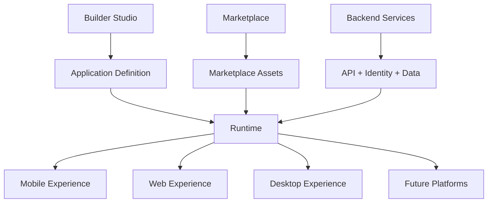
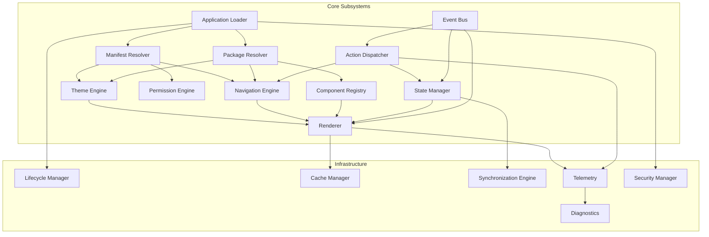
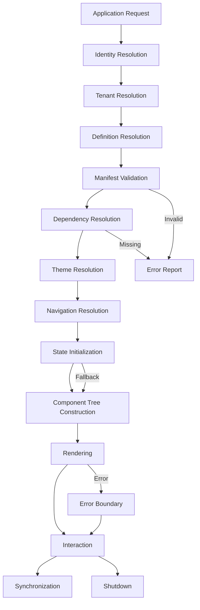
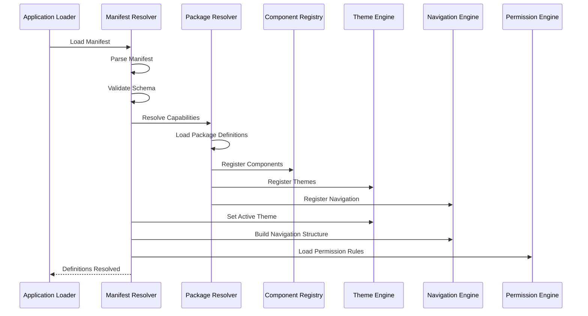
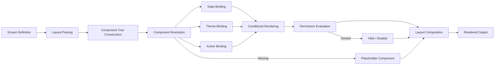
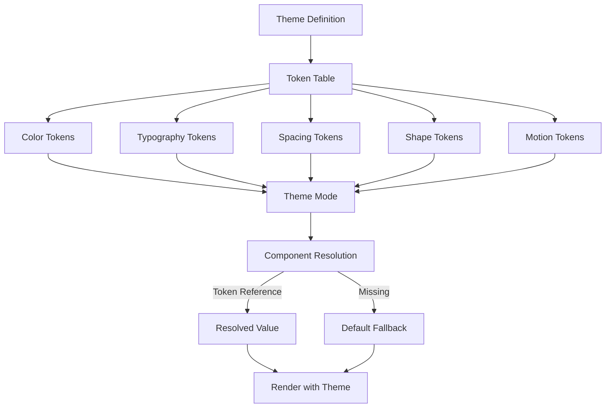
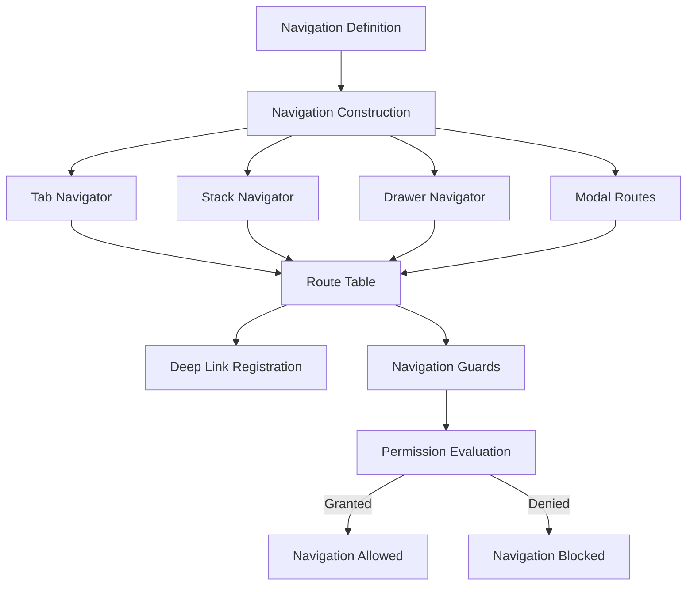
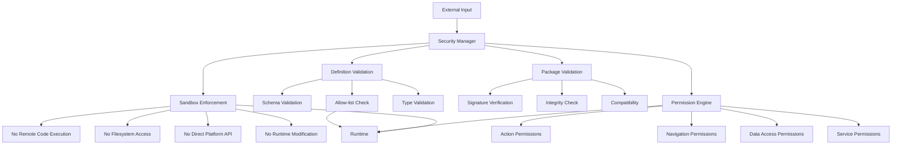
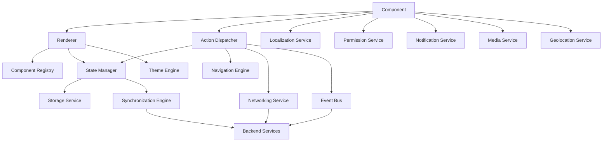

# Runtime Architecture Overview

**KB-041 — Runtime Architecture Overview Specification**

| Metadata | |
|----------|---|
| **KB ID** | KB-041 |
| **Title** | Runtime Architecture Overview |
| **Version** | 0.1.0 |
| **Status** | Drafting |
| **Owner** | Architecture Team |
| **Suite** | Runtime & Rendering Architecture |
| **Dependencies** | KB-005 Platform Overview, KB-006 System Architecture, KB-007 Service Boundaries, KB-008 Runtime Overview, KB-009 Manifest Specification, KB-032 Marketplace Architecture |
| **Related Specifications** | Platform Overview (KB-005), System Architecture (KB-006), Runtime Overview (KB-008), Manifest Specification (KB-009), Component Registry (KB-012), Navigation Engine (KB-016), Theme Engine (KB-017), State Management (KB-018), Event Bus (KB-019), Action Engine (KB-015), Marketplace Architecture (KB-032), Package & Artifact Specification (KB-033) |
| **Last Updated** | 2026-07-10 |
| **Intended Audience** | Platform architects, Runtime engineers, rendering engineers, security engineers, mobile engineers, web engineers, desktop engineers, QA engineers |

---

### Revision History

| Version | Date | Author | Change |
|---------|------|--------|--------|
| 0.1.0 | 2026-07-10 | AI Architecture Agent | Initial draft |

---

## Executive Summary

The Runtime is the execution environment of the DUKADESK platform. It is responsible for converting Marketplace assets and Builder-generated application definitions into running, interactive applications across mobile, web, desktop, and future platforms.

The Runtime acts as the bridge between the Builder, Marketplace, Backend, Identity system, and presentation layers without executing arbitrary remote code. It reads declarative application definitions — Manifests, screen layouts, component configurations, themes, navigation structures, workflows — and transforms them into native, interactive user experiences.

The Runtime is not a JavaScript interpreter, plugin host, or remote code execution environment. It is a controlled execution engine that renders approved platform components from declarative definitions. Every component, action, and screen that the Runtime renders has been defined in the Builder, distributed through the Marketplace, and validated by the Certification & Trust system. The Runtime enforces this contract at every layer.

This document is the architectural foundation of the Runtime & Rendering Architecture Suite. It defines the Runtime's philosophy, position within the platform, major subsystems, lifecycle, rendering model, security model, and governance principles. Subsequent documents in this suite dive deeper into specific subsystems — the Rendering Engine, SDUI Architecture, State Management, Navigation & Routing, Component Registry, Event & Action Pipeline, Caching & Synchronization, Security & Isolation, and Observability & Diagnostics.

---

## 1. Purpose

The Runtime's primary responsibility is to transform declarative application definitions into running, interactive applications. This transformation encompasses:

**Application Resolution** — Loading and validating the application Manifest, resolving tenant configuration, and determining which Desks, screens, capabilities, and themes compose the running application.

**Manifest Loading** — Parsing the Manifest document, validating its structure against the Manifest schema, and extracting the definitions that drive every subsequent Runtime subsystem.

**Theme Resolution** — Loading the active theme definition, resolving theme tokens, and applying brand identities — colors, typography, spacing, shapes, and motion — to every rendered element.

**Navigation Resolution** — Interpreting navigation definitions from the Manifest and installed capabilities, constructing navigation structures — tabs, stacks, drawers, modals, wizards — and managing route resolution and deep links.

**Screen Rendering** — Rendering screens from their declarative layout definitions, composing component trees, binding data and actions, and managing screen lifecycles.

**Component Rendering** — Resolving components from the Component Registry by their declared identifiers, instantiating them with provided properties, binding theme tokens, data sources, and action handlers, and managing component lifecycles.

**Action Dispatching** — Intercepting user interactions and system events, resolving action definitions, dispatching actions to the appropriate handlers — local state mutations, API calls, workflow triggers, navigation commands — and processing action results.

**Event Processing** — Routing events between components, capabilities, screens, and subsystems through the Event Bus, enabling decoupled communication across the application.

**State Hydration** — Initializing application state from persisted storage, server-defined defaults, and configuration, maintaining state through user interactions, and persisting state across sessions.

**Permission Enforcement** — Evaluating permission rules against the current user, context, and requested operation, blocking unauthorized actions, and providing feedback when permissions are insufficient.

**Runtime Validation** — Validating all incoming definitions against their schemas, verifying component availability, checking dependency satisfaction, and ensuring the application remains in a consistent state.

**Cache Management** — Caching Manifest data, screen definitions, asset URLs, API responses, and resolved dependencies for performance and offline operation, managing cache invalidation and freshness.

---

## 2. Scope

### In Scope

The Runtime governs:

- **Runtime Lifecycle** — Initialization, configuration, execution, suspension, and shutdown of the Runtime environment.
- **Rendering** — Transformation of declarative screen and component definitions into rendered output on the target platform.
- **State Initialization** — Loading and hydrating application state from all sources — Manifest defaults, persisted state, server responses, configuration.
- **Navigation Orchestration** — Resolution, construction, and management of navigation structures and routing.
- **Component Composition** — Resolution, instantiation, property binding, and lifecycle management of UI components.
- **Event Routing** — Publication, subscription, and delivery of events across all Runtime subsystems and components.
- **Runtime Services** — Provision of shared services — storage, networking, localization, logging, permissions, media, notifications, clipboard, deep linking, geolocation — to all running components and capabilities.
- **Package Activation** — Loading and activating installed Marketplace packages — capabilities, components, themes — into the Runtime environment.
- **Theme Application** — Resolving theme tokens and applying them across all rendered visual elements.

### Out of Scope

The Runtime does not govern:

- **Builder** — The Builder is a separate system that produces application definitions. The Runtime only consumes those definitions.
- **Marketplace Governance** — Marketplace certification, distribution, and lifecycle management are handled by the Marketplace architecture.
- **Infrastructure** — Server infrastructure, database management, load balancing, and deployment are platform infrastructure concerns.
- **Authentication Implementation** — Authentication mechanisms are handled by the Identity system. The Runtime consumes authentication state.
- **Payment Gateways** — Payment processing is handled by integration capabilities. The Runtime renders payment forms and dispatches payment actions.

---

## 3. Runtime Philosophy

### Declarative over Imperative

Application definitions are declarative — they describe what to render, not how to render it. Screens are defined as component trees with property bindings. Navigation is defined as route structures. Actions are defined as declarative operations. The Runtime interprets these declarations and handles the imperative details of rendering, state management, and event processing.

### Configuration over Code

Application behavior is expressed through configuration, not code. Themes are token configurations. Layouts are structural configurations. Actions are pipeline configurations. Permissions are rule configurations. Configuration is safer, more auditable, and more portable than code. Configuration can be validated, certified, and distributed through the Marketplace.

### Immutable Definitions

Application definitions loaded from the Manifest and Marketplace are treated as immutable during a Runtime session. Definitions are cached and referenced, not modified. Mutation of application structure happens through the Builder and is reflected in new Manifest versions, not through Runtime modifications. Immutable definitions guarantee deterministic rendering and eliminate a class of runtime bugs.

### Secure by Default

The Runtime operates under a deny-by-default security model. Every operation — rendering a component, executing an action, navigating to a screen, accessing a service — is permitted only if explicitly authorized. Permission rules are evaluated before every operation. Components cannot access capabilities they have not declared. Screens cannot navigate to unauthorized routes.

### Component-Driven Rendering

Every visual element in the Runtime is a component registered in the Component Registry. There is no ad-hoc rendering, no inline HTML or native markup, and no direct platform API access from definitions. Component-driven rendering ensures consistency, accessibility, and platform independence.

### Deterministic Execution

Given the same Manifest, theme, state, and inputs, the Runtime produces the same rendered output. Deterministic execution enables reliable testing, predictable behavior across devices, and reproducible bug reports. Non-determinism — random values, timing-dependent rendering, platform-specific behavior — is explicitly managed and documented.

### Cross-Platform Consistency

The Runtime presents a unified abstraction layer that insulates application definitions from platform-specific details. The same Manifest produces consistent behavior and appearance across mobile, web, desktop, and future platforms. Platform-specific adaptations — navigation patterns, input methods, screen sizes — are handled by the Runtime's platform adaptation layer, not by application definitions.

### Runtime Isolation

The Runtime isolates applications, tenants, capabilities, and components from each other. A failing component does not crash the Runtime. A misbehaving capability does not corrupt another capability's state. A tenant's data is inaccessible to another tenant. Isolation boundaries are enforced at every layer.

### Observable Behavior

Every Runtime operation is observable through structured logs, metrics, and traces. Component rendering, action execution, navigation events, state mutations, and service calls produce observable telemetry. Observable behavior enables debugging, performance analysis, usage analytics, and anomaly detection without modifying application definitions.

---

## 4. Runtime Position Within DUKADESK

### Platform Integration

The Runtime occupies the central position in the DUKADESK platform architecture, connecting the definition-producing systems to the experience-consuming systems:

```
Builder
  ↓
Application Definition (Manifest + Screens + Capabilities)
  ↓
Marketplace Assets (Components + Themes + Packages)
  ↓
Backend Services (API + Identity + Data)
  ↓
Runtime
  ↓
Rendered Experience (Mobile / Web / Desktop / Future)
```

### Interactions

**Builder → Runtime**: The Builder produces application definitions — Manifests, screen layouts, component configurations, navigation structures, theme references, and capability declarations. The Runtime consumes these definitions. The Builder and Runtime never share runtime state. They communicate exclusively through the Manifest contract.

**Marketplace → Runtime**: The Marketplace distributes packages — capabilities, components, themes, templates, extensions. The Runtime activates installed packages, registering their assets with the appropriate Runtime subsystems. The Runtime does not participate in Marketplace governance — it consumes the certified packages that the Marketplace delivers.

**Backend → Runtime**: The Backend serves API data, identity information, and real-time events to the Runtime. The Runtime manages network requests, response caching, offline queuing, and data synchronization. The Runtime does not implement business logic — it delegates to Backend services through defined API contracts.

**Identity → Runtime**: The Identity system provides authentication state — user identity, session tokens, permissions. The Runtime consumes authentication state to enforce permissions, personalize experiences, and secure service calls. The Runtime does not implement authentication flows — it delegates to the Identity system.

**Platform → Runtime**: Each target platform — mobile, web, desktop — provides a host environment with platform-specific capabilities. The Runtime adapts its behavior to the host platform through a platform adaptation layer while maintaining consistent application behavior across platforms.

---

## 5. Runtime Architecture

### Subsystem Overview

The Runtime is composed of the following major subsystems:

| Subsystem | Primary Responsibility |
|-----------|----------------------|
| Application Loader | Initialize the Runtime environment and load the application definition |
| Manifest Resolver | Parse, validate, and resolve the application Manifest |
| Package Resolver | Resolve and activate installed Marketplace packages |
| Theme Engine | Resolve theme tokens and manage visual identity |
| Navigation Engine | Resolve navigation structures and manage routing |
| Renderer | Transform screen definitions into rendered output |
| Component Registry | Register, resolve, and manage component lifecycle |
| State Manager | Maintain application state and manage mutations |
| Action Dispatcher | Resolve and execute declarative action definitions |
| Event Bus | Route events between Runtime subsystems and components |
| Permission Engine | Evaluate permission rules and enforce access control |
| Lifecycle Manager | Manage Runtime, screen, and component lifecycles |
| Cache Manager | Manage data caching and cache invalidation |
| Synchronization Engine | Manage offline operation and data synchronization |
| Telemetry | Collect and export observability data |
| Diagnostics | Monitor Runtime health and diagnose issues |
| Security Manager | Validate definitions, enforce isolation, and manage sandbox |

### Detailed Subsystem Definitions

#### 5.1 Application Loader

| Aspect | Description |
|--------|-------------|
| **Purpose** | Initialize the Runtime environment, load the primary application definition, and orchestrate the startup sequence. |
| **Responsibilities** | Bootstrap the Runtime environment, resolve the target application identifier, load the application Manifest, initialize all Runtime subsystems, coordinate subsystem startup ordering, manage startup timeout and failure recovery. |
| **Inputs** | Application identifier, tenant context, user session, platform context. |
| **Outputs** | Initialized Runtime environment, loaded Manifest, activated subsystems. |
| **Interactions** | Coordinates with every other subsystem during startup. Delegates Manifest loading to the Manifest Resolver. Delegates package activation to the Package Resolver. |
| **Constraints** | Must complete startup within defined timeout. Must handle missing or invalid definitions gracefully. Must report startup failures with actionable diagnostics. |

#### 5.2 Manifest Resolver

| Aspect | Description |
|--------|-------------|
| **Purpose** | Parse, validate, and resolve the application Manifest into the structured definitions that drive all Runtime subsystems. |
| **Responsibilities** | Fetch the Manifest from the configured source, parse the Manifest document, validate against the Manifest schema, resolve references to external definitions, extract screen definitions, navigation structures, capability declarations, theme references, permission rules, and configuration values. |
| **Inputs** | Raw Manifest document, Manifest schema, tenant configuration. |
| **Outputs** | Resolved Manifest object with validated definitions. |
| **Interactions** | Provides definitions to the Package Resolver, Theme Engine, Navigation Engine, Renderer, and Permission Engine. |
| **Constraints** | Must validate all definitions before providing them to other subsystems. Must fail gracefully with clear error messages for invalid Manifests. Must support Manifest versioning for backward compatibility. |

#### 5.3 Package Resolver

| Aspect | Description |
|--------|-------------|
| **Purpose** | Resolve and activate installed Marketplace packages — capabilities, components, themes, and extensions — into the Runtime environment. |
| **Responsibilities** | Read the installed package catalog, resolve package dependencies, verify package compatibility, load package definitions, register package assets with appropriate Runtime subsystems, manage package activation ordering, handle package activation failures. |
| **Inputs** | Installed package catalog, package definitions, Manifest capability declarations. |
| **Outputs** | Activated packages with registered components, capabilities, themes, and extensions. |
| **Interactions** | Registers components with the Component Registry. Registers capabilities with the State Manager and Action Dispatcher. Provides theme definitions to the Theme Engine. Registers navigation contributions with the Navigation Engine. |
| **Constraints** | Must verify package compatibility before activation. Must isolate package failures to prevent cascading Runtime failures. Must support dynamic activation and deactivation. |

#### 5.4 Theme Engine

| Aspect | Description |
|--------|-------------|
| **Purpose** | Resolve theme tokens and manage visual identity across all rendered elements. |
| **Responsibilities** | Load the active theme definition, resolve theme token values — colors, typography, spacing, shapes, motion — apply theme tokens to all rendered components, support theme switching at runtime, manage theme mode variants (light, dark, high contrast), provide theme token resolution API to components. |
| **Inputs** | Theme definition, active theme identifier, theme mode preference. |
| **Outputs** | Resolved theme token set, theme-aware component rendering. |
| **Interactions** | Provides token resolution to the Renderer and Component Registry. Receives theme references from the Manifest Resolver. Receives theme definitions from the Package Resolver. |
| **Constraints** | Must resolve all tokens before rendering begins. Must support synchronous token resolution for performance. Must handle missing tokens gracefully with fallback values. |

#### 5.5 Navigation Engine

| Aspect | Description |
|--------|-------------|
| **Purpose** | Resolve navigation structures, manage routing, and orchestrate screen transitions. |
| **Responsibilities** | Parse navigation definitions from the Manifest and installed capabilities, construct navigation structures (tabs, stacks, drawers, modals, wizards), manage route resolution and deep link handling, orchestrate screen transitions, maintain navigation state (history, current route, navigation stack), support conditional navigation based on permissions and state. |
| **Inputs** | Navigation definitions, route requests, deep links, permission state. |
| **Outputs** | Screen transitions, navigation state, route resolution. |
| **Interactions** | Receives navigation definitions from the Manifest Resolver and Package Resolver. Requests screen rendering from the Renderer. Consults the Permission Engine for route authorization. Publishes navigation events to the Event Bus. |
| **Constraints** | Must support programmatic and user-initiated navigation. Must handle invalid routes gracefully. Must support deep link resolution at any point in the Runtime lifecycle. |

#### 5.6 Renderer

| Aspect | Description |
|--------|-------------|
| **Purpose** | Transform declarative screen definitions into rendered output on the target platform. |
| **Responsibilities** | Parse screen layout definitions, construct component trees, resolve components from the Component Registry, bind data sources, theme tokens, and action handlers to components, manage component lifecycle (mount, update, unmount), handle layout composition and responsive adaptation, manage screen lifecycle. |
| **Inputs** | Screen definitions, component definitions, resolved theme tokens, state values, action bindings. |
| **Outputs** | Rendered screen output on the target platform. |
| **Interactions** | Receives screen definitions from the Manifest Resolver. Resolves components through the Component Registry. Binds state from the State Manager. Binds actions through the Action Dispatcher. Applies theme tokens from the Theme Engine. |
| **Constraints** | Must support incremental rendering for performance. Must handle missing or invalid component references gracefully. Must support conditional rendering based on permissions and state. Must remain platform-independent while allowing platform-specific adaptations. |

#### 5.7 Component Registry

| Aspect | Description |
|--------|-------------|
| **Purpose** | Register, resolve, and manage the lifecycle of all UI components available to the Runtime. |
| **Responsibilities** | Maintain a registry of all available components — their identifiers, schemas, property definitions, event contracts, and platform implementations. Resolve components by identifier for the Renderer. Manage component registration from the Package Resolver and platform defaults. Validate component references against registered identifiers. Manage component lifecycle — mount, update, unmount. |
| **Inputs** | Component registration requests, component resolution requests, component lifecycle events. |
| **Outputs** | Resolved component implementations, component lifecycle notifications. |
| **Interactions** | Receives component registrations from the Package Resolver and platform initialization. Provides component implementations to the Renderer. Publishes component lifecycle events to the Event Bus. |
| **Constraints** | Must enforce component allow-list — only registered components can be rendered. Must support lazy loading of component implementations. Must handle missing components gracefully with fallback rendering. |

#### 5.8 State Manager

| Aspect | Description |
|--------|-------------|
| **Purpose** | Maintain application state and manage state mutations in a predictable, observable manner. |
| **Responsibilities** | Initialize application state from Manifest defaults, persisted state, and server responses. Manage state mutations triggered by actions and events. Notify subscribers of state changes. Persist state across sessions. Support state scoping by tenant, session, screen, and component. Provide state resolution API for data binding. |
| **Inputs** | State initialization values, state mutation requests, action results. |
| **Outputs** | Current state values, state change notifications, persisted state. |
| **Interactions** | Provides state values to the Renderer for data binding. Receives state mutations from the Action Dispatcher. Persists state through the Cache Manager. Publishes state change events to the Event Bus. |
| **Constraints** | Must support synchronous state reads for rendering performance. Must support atomic state mutations. Must isolate state by tenant and session. Must handle state persistence failures gracefully. |

#### 5.9 Action Dispatcher

| Aspect | Description |
|--------|-------------|
| **Purpose** | Resolve and execute declarative action definitions in response to user interactions and system events. |
| **Responsibilities** | Parse action definitions from component bindings and event handlers. Resolve action handlers by action type. Execute action pipelines with defined inputs, error handling, and success/failure callbacks. Manage action lifecycle — dispatch, execute, complete, fail. Support action chaining and composition. |
| **Inputs** | Action definitions, action triggers (user interactions, events, system conditions), action inputs. |
| **Outputs** | Action execution results, state mutations, navigation commands, API calls, event publications. |
| **Interactions** | Receives action triggers from components and the Event Bus. Mutates state through the State Manager. Executes navigation commands through the Navigation Engine. Makes API calls through the networking service. Publishes action events to the Event Bus. |
| **Constraints** | Must validate action definitions before execution. Must enforce permission checks on all actions. Must handle action failures gracefully with defined error handlers. Must support asynchronous actions with loading states. |

#### 5.10 Event Bus

| Aspect | Description |
|--------|-------------|
| **Purpose** | Route events between Runtime subsystems, components, capabilities, and external services. |
| **Responsibilities** | Manage event publication and subscription. Route events to subscribed handlers based on event type. Support event filtering and wildcard subscriptions. Manage subscriber lifecycle — subscribe, unsubscribe, cleanup. Support event propagation patterns — broadcast, unicast, targeted. |
| **Inputs** | Event publications with event type and payload. |
| **Outputs** | Event delivery to subscribed handlers. |
| **Interactions** | Connects all Runtime subsystems — components publish events, actions subscribe to events, state changes are broadcast, navigation events are published. |
| **Constraints** | Must support decoupled communication — publishers and subscribers have no direct reference to each other. Must handle subscriber failures without affecting publishers. Must support event prioritization for critical system events. |

#### 5.11 Permission Engine

| Aspect | Description |
|--------|-------------|
| **Purpose** | Evaluate permission rules and enforce access control across all Runtime operations. |
| **Responsibilities** | Parse permission rules from the Manifest and installed packages. Evaluate permission rules against the current user, context, and requested operation. Enforce access control for screen access, action execution, data access, service calls, and navigation. Provide permission evaluation API for all subsystems. Manage permission inheritance and override. |
| **Inputs** | Permission rules, user identity and roles, operation context. |
| **Outputs** | Permission evaluation results (granted, denied, deferred). |
| **Interactions** | Consults user identity from the Security Manager. Provides permission decisions to the Navigation Engine, Action Dispatcher, Renderer, and State Manager. |
| **Constraints** | Must evaluate permissions synchronously for interactive operations. Must operate under deny-by-default. Must support context-aware permissions (time-based, location-based, state-based). |

#### 5.12 Lifecycle Manager

| Aspect | Description |
|--------|-------------|
| **Purpose** | Manage Runtime, application, screen, and component lifecycles in a predictable, observable manner. |
| **Responsibilities** | Define lifecycle stages for the Runtime, Desks, screens, and components. Manage transitions between lifecycle stages. Publish lifecycle events for observability. Enforce lifecycle contracts — required initialization before use, required cleanup before destruction. Manage lifecycle timeouts and failure handling. |
| **Inputs** | Lifecycle events from all subsystems. |
| **Outputs** | Lifecycle state transitions, lifecycle notifications. |
| **Interactions** | Coordinates with every subsystem for startup and shutdown sequences. Publishes lifecycle events to the Event Bus. |
| **Constraints** | Must guarantee initialization ordering. Must guarantee cleanup on shutdown. Must handle lifecycle failures without leaking resources. |

#### 5.13 Cache Manager

| Aspect | Description |
|--------|-------------|
| **Purpose** | Manage data caching across all Runtime subsystems for performance and offline operation. |
| **Responsibilities** | Cache Manifest data, screen definitions, asset URLs, API responses, and resolved dependencies. Manage cache invalidation strategies — time-based, event-based, version-based. Support cache persistence across sessions. Manage cache size limits and eviction policies. Provide cache statistics for observability. |
| **Inputs** | Cache write requests, cache read requests, invalidation events. |
| **Outputs** | Cached data, cache hit/miss notifications, cache statistics. |
| **Interactions** | Serves cached data to the Manifest Resolver, Renderer, State Manager, and Synchronization Engine. Receives invalidation events from the Event Bus. |
| **Constraints** | Must support synchronous cache reads. Must handle cache misses gracefully by falling back to source data. Must support cache isolation by tenant and session. |

#### 5.14 Synchronization Engine

| Aspect | Description |
|--------|-------------|
| **Purpose** | Manage offline operation and data synchronization between the Runtime and Backend services. |
| **Responsibilities** | Detect connectivity state changes, queue mutations during offline operation, manage synchronization priorities, resolve synchronization conflicts, apply server-side state changes to local state, manage synchronization retry and backoff. |
| **Inputs** | Connectivity state, queued mutations, server responses. |
| **Outputs** | Synchronized state, conflict resolutions, synchronization status. |
| **Interactions** | Queues mutations from the Action Dispatcher during offline operation. Provides synchronized state to the State Manager. Consumes connectivity state from the networking service. |
| **Constraints** | Must guarantee mutation ordering during synchronization. Must handle conflict resolution with defined strategies (last-write-wins, server-wins, manual). Must support incremental synchronization for performance. |

#### 5.15 Telemetry

| Aspect | Description |
|--------|-------------|
| **Purpose** | Collect and export observability data — logs, metrics, and traces — from all Runtime subsystems. |
| **Responsibilities** | Collect structured logs from all subsystems. Collect performance metrics — startup time, render time, action execution time, network latency. Collect usage metrics — screen views, action executions, component renders. Export telemetry to configured backends. Manage telemetry sampling and filtering. |
| **Inputs** | Log events, metric values, trace spans from all subsystems. |
| **Outputs** | Exported telemetry data. |
| **Interactions** | Receives telemetry from every subsystem. Exports to configured telemetry backends. |
| **Constraints** | Must not impact Runtime performance. Must support configurable verbosity. Must respect user privacy preferences and data residency requirements. |

#### 5.16 Diagnostics

| Aspect | Description |
|--------|-------------|
| **Purpose** | Monitor Runtime health, detect anomalies, and diagnose issues. |
| **Responsibilities** | Monitor subsystem health and responsiveness. Detect and report Runtime anomalies — crashes, hangs, memory pressure, state corruption. Provide diagnostic APIs for debugging. Generate health reports. Support remote diagnostics for production issues. |
| **Inputs** | Health check results, anomaly signals, diagnostic queries. |
| **Outputs** | Health status, diagnostic reports, anomaly alerts. |
| **Interactions** | Monitors all subsystems through health checks. Consumes telemetry data from the Telemetry subsystem. |
| **Constraints** | Must operate without impacting Runtime performance. Must support diagnostic queries without Runtime disruption. Must protect diagnostic data from unauthorized access. |

#### 5.17 Security Manager

| Aspect | Description |
|--------|-------------|
| **Purpose** | Validate definitions, enforce isolation, manage sandbox boundaries, and coordinate security across all Runtime subsystems. |
| **Responsibilities** | Validate all incoming definitions against schemas and allow-lists. Enforce tenant isolation boundaries. Manage sandbox restrictions — no remote code execution, no direct API access from definitions, no filesystem access. Verify package signatures and integrity. Coordinate with the Permission Engine for access control. Manage secure storage for credentials and tokens. |
| **Inputs** | Definitions, packages, operations requiring security validation. |
| **Outputs** | Validation results, isolation enforcement, security events. |
| **Interactions** | Validates definitions for the Manifest Resolver and Package Resolver. Provides identity and authentication state to the Permission Engine. Enforces sandbox restrictions for the Renderer and Action Dispatcher. |
| **Constraints** | Must validate every definition before it reaches any other subsystem. Must enforce isolation without impacting Runtime performance. Must log all security events for audit. |

---

## 6. Runtime Lifecycle

### Lifecycle Stages

```
Application Request
  ↓
Identity Resolution
  ↓
Tenant Resolution
  ↓
Definition Resolution
  ↓
Manifest Validation
  ↓
Dependency Resolution
  ↓
Theme Resolution
  ↓
Navigation Resolution
  ↓
State Initialization
  ↓
Component Tree Construction
  ↓
Rendering
  ↓
Interaction
  ↓
Synchronization
  ↓
Shutdown
```

### Stage Descriptions

#### Application Request

The Runtime receives a request to load an application. The request includes the application identifier, tenant context, user credentials or session token, and platform context. The Application Loader initiates the startup sequence.

**Entry criteria**: Runtime is initialized and ready. Application request is received.
**Exit criteria**: Application identity is resolved. Startup sequence is initiated.
**Failure handling**: Invalid application identifier returns an error. Unauthorized access returns authentication required.

#### Identity Resolution

The Runtime resolves the user's identity and authentication state. The Security Manager validates the provided credentials or session token against the Identity system. User identity, roles, and permissions are loaded for the Permission Engine.

**Entry criteria**: Application request is received.
**Exit criteria**: User identity is resolved. Authentication state is established. Permission context is initialized.
**Failure handling**: Invalid credentials return authentication error. Expired session triggers re-authentication. Unauthenticated access proceeds with anonymous identity.

#### Tenant Resolution

The Runtime resolves the tenant context — which organization's configuration, branding, data, and policies apply to this session. Tenant configuration is loaded for Manifest resolution and theme application.

**Entry criteria**: Identity is resolved.
**Exit criteria**: Tenant configuration is loaded. Tenant-specific settings are applied.
**Failure handling**: Invalid tenant identifier returns error. Tenant configuration load failure triggers fallback to default configuration.

#### Definition Resolution

The Manifest Resolver fetches and parses the application Manifest. The Manifest defines the application's Desks, screens, navigation, themes, capabilities, permissions, and configuration. The Manifest Resolver validates the Manifest structure against the schema.

**Entry criteria**: Tenant context is resolved.
**Exit criteria**: Manifest is loaded, parsed, and validated. Resolved definitions are available for downstream subsystems.
**Failure handling**: Manifest fetch failure returns network error. Manifest validation failure returns validation errors with details.

#### Manifest Validation

The Security Manager validates the Manifest against security policies — schema compliance, component reference allow-lists, permission rule safety, and package integrity. The Validation Engine (integrated into the Runtime) performs structural and security validation.

**Entry criteria**: Manifest is loaded.
**Exit criteria**: Manifest passes all validation checks.
**Failure handling**: Invalid component references trigger component resolution fallback. Security policy violations block application load with detailed error.

#### Dependency Resolution

The Package Resolver resolves all dependencies declared in the Manifest — capabilities, component packages, theme packages, and extensions. Dependencies are loaded from the installed package catalog and activated in dependency order.

**Entry criteria**: Manifest is validated.
**Exit criteria**: All dependencies are resolved and activated. Package assets are registered with appropriate subsystems.
**Failure handling**: Missing dependencies block activation with resolution error. Incompatible dependencies trigger compatibility report. Optional dependencies gracefully degrade.

#### Theme Resolution

The Theme Engine loads the active theme definition from the Manifest's theme reference or tenant configuration. Theme tokens are resolved for all visual properties — colors, typography, spacing, shapes, motion. Theme mode (light, dark, high contrast) is determined from user preference and tenant configuration.

**Entry criteria**: Dependencies are resolved.
**Exit criteria**: Theme tokens are resolved and available for rendering.
**Failure handling**: Missing theme definition falls back to platform default theme. Incomplete theme tokens use defaults for missing values.

#### Navigation Resolution

The Navigation Engine parses navigation definitions from the Manifest and installed capabilities. Navigation structures are constructed — root navigation container, tab configurations, stack navigators, drawer menus, modal routes. Deep link handlers are registered.

**Entry criteria**: Theme is resolved.
**Exit criteria**: Navigation structure is constructed. Initial route is resolved. Deep link handlers are registered.
**Failure handling**: Invalid navigation definition falls back to default navigation structure. Unresolvable initial route falls back to first available route.

#### State Initialization

The State Manager initializes application state from all sources — Manifest defaults, persisted state from previous sessions, server-provided initial state, tenant configuration, and user preferences. State is hydrated and made available for data binding.

**Entry criteria**: Navigation is resolved.
**Exit criteria**: Application state is initialized and available. Persisted state is restored. Initial state is consistent.
**Failure handling**: Persisted state corruption falls back to default state. Server state fetch failure uses cached or default state.

#### Component Tree Construction

The Renderer constructs the initial component tree for the first screen. Components are resolved from the Component Registry. Properties, data bindings, theme tokens, and action handlers are bound to each component. Conditional rendering rules are evaluated.

**Entry criteria**: State is initialized.
**Exit criteria**: Component tree is constructed. Components are bound to data, theme, and actions.
**Failure handling**: Missing component identifier triggers component resolution fallback (placeholder component). Binding errors render component with safe defaults.

#### Rendering

The Renderer renders the component tree on the target platform. Components are mounted, laid out, and displayed. The screen lifecycle begins — appear, interact, disappear. Subsequent screens are rendered on demand through navigation.

**Entry criteria**: Component tree is constructed.
**Exit criteria**: First screen is rendered and interactive. Application is visible to the user.
**Failure handling**: Rendering errors are caught by error boundaries. Failed components display fallback UI. Critical rendering failures trigger safe mode with diagnostic information.

#### Interaction

The Runtime enters the interaction phase. Users interact with the application — tapping buttons, scrolling lists, filling forms, navigating between screens. Each interaction triggers action dispatching, state mutations, event publication, and potentially re-rendering.

**Entry criteria**: Rendering is complete.
**Exit criteria**: Runtime remains in interaction phase until shutdown.
**Failure handling**: Action execution failures display error states. Navigation failures remain on current screen. Network failures enable offline mode.

#### Synchronization

During interaction, the Synchronization Engine manages data synchronization with Backend services. Mutations made offline are queued and synchronized when connectivity is restored. Server-side changes are applied to local state. Conflict resolution strategies are executed as needed.

**Entry criteria**: Runtime is in interaction phase with network connectivity changes.
**Exit criteria**: State is synchronized with Backend services.
**Failure handling**: Synchronization conflicts are resolved using defined strategies. Persistent synchronization failures are reported for user intervention.

#### Shutdown

The Runtime shuts down in response to user action (closing the application), system event (low memory, incoming call), or error (fatal crash). The Lifecycle Manager orchestrates graceful shutdown — persisting state, deactivating packages, unsubscribing from events, releasing resources.

**Entry criteria**: Shutdown signal is received.
**Exit criteria**: State is persisted. Resources are released. Runtime is terminated.
**Failure handling**: Shutdown timeout forces termination. Persistence failures log warning but do not block shutdown. State corruption during shutdown is detected on next startup.

---

## 7. Runtime Contexts

### Context Model

The Runtime maintains multiple contextual scopes that define the boundaries within which definitions, state, permissions, and behavior are evaluated. Contexts form a hierarchy — each context inherits properties from its parent and may override or extend them.

### Platform Context

The outermost context representing the target platform and Runtime environment. Platform context includes platform type (mobile, web, desktop), platform version, screen dimensions, input methods, available hardware features, and Runtime version.

**Scope**: Global — available to all subsystems and components.
**Immutability**: Read-only during a Runtime session.
**Usage**: Platform adaptation, conditional feature enablement, responsive layout decisions.

### Tenant Context

The tenant context represents the organization whose configuration, branding, and policies apply to the current session. Tenant context includes tenant identifier, tenant name, tenant configuration, tenant-specific theme overrides, and tenant governance policies.

**Scope**: Application-wide.
**Immutability**: Fixed for the session duration.
**Usage**: Theme resolution, permission evaluation, data scoping, configuration resolution.

### Session Context

The session context represents the current Runtime session — a continuous period of user interaction. Session context includes session identifier, session start time, session state, and accumulated session metrics.

**Scope**: Session-wide.
**Immutability**: Created at session start, terminated at session end.
**Usage**: Session-scoped state, analytics, session management.

### User Context

The user context represents the current authenticated user. User context includes user identifier, display name, roles, permissions, preferences, authentication state, and session token.

**Scope**: Session-wide.
**Immutability**: May change during session (permission updates, role changes).
**Usage**: Permission evaluation, personalized rendering, user-specific data binding.

### Workspace Context

The workspace context represents the current Desk — the primary business application container. Workspace context includes Desk identifier, Desk configuration, active capability set, and workspace-level state.

**Scope**: Workspace-wide.
**Immutability**: Fixed for the workspace duration.
**Usage**: Desk-level state, capability scoping, workspace-specific configuration.

### Execution Context

The execution context represents the current operation being performed — action execution, navigation transition, state mutation. Execution context includes operation type, caller identity, inputs, start time, and cancellation state.

**Scope**: Per-operation.
**Immutability**: Created at operation start, discarded at operation end.
**Usage**: Permission evaluation, action validation, performance monitoring.

### Navigation Context

The navigation context represents the current navigation state — active route, navigation history, current screen parameters, and navigation stack state. Navigation context is updated on every navigation event.

**Scope**: Application-wide.
**Immutability**: Mutable — updated on navigation.
**Usage**: Screen rendering, route resolution, deep link handling, navigation state persistence.

### Component Context

The component context represents the currently rendering component. Component context includes component identifier, component instance, bound properties, bound data, bound actions, and component lifecycle state.

**Scope**: Per-component instance.
**Immutability**: Mutable — updated on property changes and state updates.
**Usage**: Component rendering, data binding, action binding, lifecycle management.

---

## 8. Runtime Services

### Service Model

Runtime Services are shared capabilities that the Runtime provides to all components and subsystems through defined interfaces. Services abstract platform-specific implementations behind consistent APIs.

### Storage Service

Provides persistent key-value storage for application state, user preferences, and cached data.

**Capabilities**: Read, write, delete, clear, query by prefix.
**Platform adaptation**: SQLite on mobile, IndexedDB on web, file-based on desktop.
**Security**: Tenant-isolated storage namespaces. Encrypted storage for sensitive values.

### Networking Service

Manages HTTP communication with Backend services.

**Capabilities**: GET, POST, PUT, PATCH, DELETE requests. Request/response interception. Authentication header injection. Request queuing for offline operation. Response caching.
**Platform adaptation**: Fetch API on web, URLSession on native, custom implementations on desktop.
**Security**: TLS enforcement. Certificate pinning. Token-based authentication. Request signing.

### Localization Service

Provides localized strings, formatting, and locale-aware behavior.

**Capabilities**: String resolution by key and locale. Pluralization rules. Date, time, number, and currency formatting. Locale-aware collation. RTL layout support.
**Platform adaptation**: Platform locale APIs, CLDR data.
**Security**: Locale selection only — no sensitive data exposure.

### Analytics Service

Captures and reports application usage and behavior.

**Capabilities**: Screen view tracking, event tracking, user property tracking, session tracking. Configurable sampling. Privacy-compliant data collection.
**Platform adaptation**: Platform-specific analytics SDKs.
**Security**: Anonymous tracking options. User opt-in/opt-out. Data residency compliance.

### Logging Service

Provides structured logging across all Runtime subsystems.

**Capabilities**: Log levels (debug, info, warn, error, fatal). Structured log records with context. Log filtering by subsystem and level. Log export for diagnostics.
**Platform adaptation**: Console logging on all platforms, file logging on native, remote logging when configured.
**Security**: Sensitive data redaction. Log access control.

### Permission Service

Provides runtime permission query and request for device capabilities.

**Capabilities**: Check permission status. Request permission. Handle permission denial gracefully. Support permission categories — camera, microphone, location, notifications, contacts, storage.
**Platform adaptation**: Platform-specific permission APIs.
**Security**: Deny-by-default. Transparent permission requests. Permission rationale display.

### Media Service

Provides camera and media library access for image and video capture.

**Capabilities**: Camera capture, media library browsing, image picking, video recording. Media metadata retrieval. Media upload support.
**Platform adaptation**: Platform-specific camera and media APIs.
**Security**: Permission-based access. Media isolation by tenant.

### Notification Service

Manages local and push notifications.

**Capabilities**: Local notification scheduling, push notification registration, notification handling, notification categories and actions, badge management.
**Platform adaptation**: Platform-specific notification APIs.
**Security**: Permission-based notifications. Notification data isolation.

### Clipboard Service

Provides clipboard read and write access.

**Capabilities**: Write text to clipboard. Read text from clipboard. Clipboard change detection.
**Platform adaptation**: Platform clipboard APIs.
**Security**: Read permission required. Clipboard access logging.

### Deep Linking Service

Handles incoming deep links and routes them to the appropriate application destination.

**Capabilities**: Deep link registration, deep link parsing, deep link routing, universal link support.
**Platform adaptation**: Platform-specific deep link APIs.
**Security**: Deep link origin validation. Allowed URL scheme configuration.

### Geolocation Service

Provides device location access.

**Capabilities**: One-time location request, continuous location tracking, geofencing, location permission management.
**Platform adaptation**: Platform-specific location APIs.
**Security**: Permission-based access. Location accuracy configuration. Background location restrictions.

### Offline Storage Service

Provides structured offline data storage for complex data sets.

**Capabilities**: Offline data store creation and querying. Synchronization with Backend services. Conflict resolution. Offline query support.
**Platform adaptation**: SQLite, WatermelonDB, or similar on each platform.
**Security**: Tenant-isolated storage. Encrypted offline data.

---

## 9. Rendering Model

### Server-Driven Rendering

The Runtime implements a server-driven rendering model. Application definitions — screen layouts, component configurations, data bindings, and action bindings — are defined on the server (via the Builder) and delivered to the Runtime as structured data. The Runtime interprets these definitions and renders them on the target platform.

Server-driven rendering enables:

- **Instant updates**: Application changes are deployed by updating the Manifest — no app store submission required.
- **Consistent experience**: The same definition produces the same experience across all platforms.
- **A/B testing**: Server can deliver different definitions to different user segments.
- **Personalization**: Definitions can include conditional rendering based on user context.
- **Governance**: All rendered experiences pass through the Manifest and Component Registry — no uncontrolled rendering.

### Component Tree Generation

The Renderer transforms screen definitions into component trees:

1. Parse the screen layout definition — a hierarchical structure of rows, columns, scroll containers, and component slots.
2. For each component slot, resolve the component identifier against the Component Registry.
3. Recursively resolve nested containers and components.
4. Bind properties, data sources, theme tokens, and action handlers to each component.
5. Evaluate conditional rendering rules — hide components that do not meet visibility criteria.
6. Evaluate permission rules — hide or disable components the user is not authorized to see or interact with.

### Layout Composition

Layouts are composed from primitive containers:

- **Rows**: Horizontal arrangement of children with configurable alignment, spacing, and distribution.
- **Columns**: Vertical arrangement of children with configurable alignment, spacing, and distribution.
- **Scroll containers**: Scrollable content areas for overflow content.
- **Grids**: Structured grid layouts for consistent item placement.
- **Cards**: Grouped content sections with optional header and footer.
- **Modals**: Overlay content that appears above the current screen.
- **Drawers**: Slide-in panels for secondary content or navigation.

Each container supports responsive behavior — adapting layout, visibility, and sizing based on screen dimensions, orientation, and platform.

### State Binding

Components bind to application state through declarative data bindings defined in the screen definition. Data bindings specify:

- **State path**: The path in the state tree to bind to.
- **Transformation**: Optional transform to apply to the state value before rendering.
- **Formatting**: Optional locale-aware formatting for dates, numbers, and currencies.
- **Fallback**: Fallback value when the state path is undefined or null.

The State Manager notifies the Renderer when bound state values change. The Renderer updates only the affected components — not the entire screen.

### Theme Binding

Components consume theme tokens through declared token references in their property definitions. Theme tokens include:

- **Color tokens**: Primary, secondary, background, surface, text, error colors for each theme mode.
- **Typography tokens**: Font family, size, weight, line height, letter spacing for each text style.
- **Spacing tokens**: Margin, padding, and gap values at each spacing scale level.
- **Shape tokens**: Border radius values for each shape category.
- **Motion tokens**: Animation duration, easing, and delay values.

The Theme Engine resolves token references to concrete values at render time. Components never reference raw color values or font sizes — they reference theme tokens.

### Action Binding

Components bind to actions through declarative action bindings in their property definitions. Action bindings specify:

- **Trigger**: The event that triggers the action (onPress, onSubmit, onChange, onScroll).
- **Action type**: The type of action to execute (navigation, mutation, API call, event, workflow).
- **Action parameters**: Input parameters for the action.
- **Success handler**: Action to execute on success.
- **Failure handler**: Action to execute on failure.
- **Confirmation**: Optional confirmation dialog before execution.

### Visibility Rules

Components may declare visibility rules that determine whether they are rendered:

- **Permission-based**: Component is visible only if the user has the required permission.
- **State-based**: Component is visible only if a state condition is met.
- **Role-based**: Component is visible only for specific user roles.
- **Platform-based**: Component is visible only on specific platforms.
- **Feature-flag-based**: Component is visible only if a feature flag is enabled.

### Permission Rules

Components may declare permission rules that determine whether they are interactive:

- **View permission**: User can see the component.
- **Interact permission**: User can interact with the component (tap, type, swipe).
- **Admin permission**: User can access administrative actions within the component.
- **Custom permissions**: Domain-specific permissions defined by capabilities.

### Conditional Rendering

The Renderer supports conditional rendering patterns:

- **If/else**: Render one component or another based on a condition.
- **Switch**: Render one of multiple components based on a value.
- **ForEach**: Render a component for each item in a list.
- **Show/Hide**: Show or hide a component based on a condition without conditional structure.

---

## 10. Runtime Security Model

### Definition Validation

Every definition the Runtime consumes is validated before use:

- **Schema validation**: Definitions must conform to their declared schema.
- **Reference validation**: Component references must resolve to registered components.
- **Type validation**: Property values must be of the expected type.
- **Bound validation**: Values must be within declared bounds and constraints.
- **Security validation**: Definitions must not contain patterns flagged by the Security Manager.

### Package Validation

Installed Marketplace packages are validated before activation:

- **Signature verification**: Package signatures are verified against the publisher's public key.
- **Integrity verification**: Package checksums are verified.
- **Compatibility verification**: Package is compatible with the current Runtime version.
- **Dependency verification**: All declared dependencies are available and compatible.
- **Allow-list verification**: Package and its components are in the platform allow-list.

### Component Allow-List

The Runtime maintains a component allow-list:

- **Built-in components**: Platform-provided components (button, text, image, input, list, scroll, etc.).
- **Marketplace components**: Components installed through the Marketplace and certified.
- **Custom components**: Organization-specific components registered through the Extension Framework.
- **No ad-hoc components**: Components must be registered before rendering. There is no mechanism for rendering unregistered components.

### Permission Enforcement

All Runtime operations are subject to permission enforcement:

- **Screen access**: Navigation to a screen requires the screen's declared permission.
- **Action execution**: Executing an action requires the action's declared permission.
- **Data access**: Reading or mutating state requires the state path's declared permission.
- **Service access**: Using a Runtime service requires the service's declared permission.
- **API access**: Making an API call requires the endpoint's declared permission.

### Action Restrictions

Actions are restricted to defined types within the action system:

- **Navigation actions**: Navigate to a screen, go back, open modal, close modal.
- **State actions**: Set state, toggle state, increment state, append to array.
- **API actions**: GET, POST, PUT, PATCH, DELETE requests to defined endpoints.
- **Event actions**: Publish event, subscribe to event.
- **Workflow actions**: Start workflow, approve step, reject step.
- **Link actions**: Open URL, open deep link, call phone number.

Actions cannot execute arbitrary code, access the filesystem, or perform operations outside the defined action type catalog.

### Identity Verification

The Runtime verifies identity at every security boundary:

- **Session verification**: Session tokens are verified on every API call.
- **Permission verification**: User identity and roles are verified for each permission check.
- **Tenant verification**: Tenant identity is verified for data access and configuration resolution.

### Data Isolation

Data is isolated by tenant and user:

- **Tenant isolation**: One tenant's data is inaccessible to another tenant's Runtime session.
- **User isolation**: One user's data is inaccessible to another user within the same tenant.
- **Session isolation**: Data from one session is inaccessible to another session.
- **State isolation**: Component state is scoped to the component instance. Capability state is scoped to the capability.

### Tenant Isolation

Tenants are isolated at multiple layers:

- **Configuration isolation**: Tenant configuration is loaded per-tenant and never shared.
- **State isolation**: Tenant state is stored in tenant-scoped namespaces.
- **Theme isolation**: Tenant branding is applied per-tenant.
- **Data isolation**: API calls are scoped to the tenant identifier.

### Sandbox Principles

The Runtime operates under strict sandbox principles:

- **No remote code execution**: The Runtime never executes code received from the server. All application behavior is defined declaratively.
- **No filesystem access**: Definitions cannot access the device filesystem. Storage is mediated through the Storage Service.
- **No network access outside defined APIs**: Components cannot make arbitrary network requests. All networking goes through defined API endpoints.
- **No direct platform API access**: Components cannot access platform APIs directly. Platform capabilities are mediated through Runtime Services.
- **No Runtime modification from definitions**: Definitions cannot modify Runtime behavior, register new components, or alter Runtime configuration.

### No Remote Code Execution

The Runtime explicitly prohibits remote code execution:

- **No eval() or equivalent**: The Runtime never evaluates strings as code.
- **No dynamic imports from remote sources**: The Runtime never loads or executes code from remote URLs.
- **No plugin execution**: The Runtime does not support plugins that execute arbitrary code.
- **No script interpretation**: The Runtime does not interpret scripting languages.
- **Definition-only execution**: The Runtime only interprets structured definitions — JSON or equivalent serialized data formats.

---

## 11. Runtime Performance

### Performance Goals

**Fast Startup** — The Runtime should initialize and render the first screen within two seconds on mobile devices under normal conditions. Startup time includes identity resolution, Manifest loading, dependency resolution, theme resolution, and initial rendering.

**Incremental Rendering** — Screens should render incrementally — priority content (navigation bars, headers, visible content) renders first while off-screen content loads in the background. Users should see meaningful content within 500 milliseconds of navigation.

**Lazy Loading** — Components, screens, and packages should load lazily — only definitions required for the current screen are loaded at startup. Additional screens and their dependencies are loaded on demand during navigation.

**Definition Caching** — Manifest data, screen definitions, component definitions, and theme definitions should be cached aggressively after first load. Cache hits should serve definitions in under 10 milliseconds.

**Memory Management** — The Runtime should maintain a predictable memory footprint. Screens and components should be released from memory when they are no longer visible. Memory pressure handling should gracefully degrade non-essential caching.

**Asset Reuse** — Theme tokens, component implementations, and resolved definitions should be shared across instances. A single component definition should be instantiated many times without duplicating the definition in memory.

**Background Synchronization** — Synchronization operations should run in the background without impacting rendering performance. Mutation queuing should be asynchronous and non-blocking.

**Offline Resilience** — The Runtime should remain fully functional offline. Screen rendering, navigation, and state management should not depend on network availability. Offline operations should synchronize transparently when connectivity is restored.

### Performance Constraints

- **No synchronous network calls on the main thread**: All network operations are asynchronous.
- **No blocking operations during rendering**: Rendering must not be blocked by state resolution, permission evaluation, or definition parsing.
- **No unbounded caching**: Cache sizes are bounded and managed through eviction policies.
- **No memory leaks**: Component and screen destruction must release all associated resources.

---

## 12. Runtime Observability

### Logs

The Logging Service produces structured logs for every subsystem:

- **Lifecycle logs**: Runtime startup, shutdown, and state transitions.
- **Definition logs**: Manifest loading, validation, and resolution events.
- **Rendering logs**: Screen rendering, component mounting, and layout events.
- **Navigation logs**: Route resolution, screen transitions, and navigation errors.
- **Action logs**: Action dispatch, execution, success, and failure events.
- **State logs**: State initialization, mutation, and persistence events.
- **Service logs**: Service initialization, operation, and error events.
- **Security logs**: Permission evaluation, validation results, and security events.

### Metrics

The Telemetry subsystem collects performance metrics:

- **Startup duration**: Time to first render, broken down by phase.
- **Render duration**: Screen render time, component render time.
- **Action execution duration**: Time to resolve and execute actions.
- **Network latency**: API call duration and response size.
- **Cache hit rate**: Definition and data cache performance.
- **Memory usage**: Runtime memory footprint by subsystem.
- **Crash rate**: Runtime and component crash frequency.

### Tracing

Distributed tracing spans capture end-to-end operation flows:

- **Navigation trace**: From user tap to screen rendered.
- **Action trace**: From trigger to completion.
- **Data flow trace**: From state mutation to UI update.
- **Startup trace**: From application request to first render.

### Health

The Diagnostics subsystem monitors Runtime health:

- **Subsystem health**: Each subsystem reports health status and last healthy timestamp.
- **Component health**: Component render success rate and error count.
- **Service health**: Runtime service availability and response time.
- **Memory health**: Memory pressure level and allocation rate.
- **Network health**: Connectivity state and latency.

### Crash Reporting

The Runtime captures and reports crashes:

- **Component crashes**: Caught by error boundaries — component failure does not crash the Runtime.
- **Subsystem crashes**: Isolated by subsystem boundaries — subsystem failure triggers subsystem restart.
- **Runtime crashes**: Unrecoverable errors trigger crash report generation before termination.
- **Context capture**: Crash reports include Runtime version, platform, tenant, screen, action, and state snapshot.

### Performance Monitoring

Performance monitoring tracks:

- **Frame rate**: Render frame rate during interaction.
- **Startup time**: Cold start, warm start, and hot start durations.
- **Navigation time**: Time between navigation request and screen render.
- **Action latency**: Time between user action and visible response.
- **Network impact**: Time spent waiting for network during rendering.

### Component Diagnostics

The Diagnostics subsystem provides component-level visibility:

- **Component tree**: Current component hierarchy for the active screen.
- **Component properties**: Bound properties and their current values.
- **Component state**: Component-local state values.
- **Component bindings**: Data, theme, and action bindings with resolution status.
- **Component lifecycle**: Current lifecycle state and transition history.

### Runtime Diagnostics

Runtime-level diagnostics provide system-wide visibility:

- **Subsystem status**: All subsystems with health status and metrics.
- **Active definitions**: Currently active Manifest, screen, and component definitions.
- **Cache state**: Cache contents, hit rates, and size.
- **Service state**: All Runtime services with availability and metrics.
- **Event bus state**: Active subscriptions and recent events.
- **State tree**: Current application state tree with values.

---

## 13. Failure Handling

### Definition Errors

When a definition is invalid — schema violation, missing required field, type mismatch:

**Detection**: Manifest Resolver or Security Manager validates the definition.
**Impact**: The affected feature may not be available. Other features continue to function.
**Recovery**: Invalid definition is logged with details. Fallback definition or safe default is used. Developer is notified through diagnostics.

### Theme Failures

When a theme definition is missing, incomplete, or invalid:

**Detection**: Theme Engine fails to resolve theme tokens.
**Impact**: Visual appearance may fall back to default theme. Missing tokens use default values.
**Recovery**: Missing tokens are resolved to platform defaults. Incomplete themes render with partial styling. Theme load failure falls back to platform default theme.

### Missing Components

When a screen references a component that is not registered in the Component Registry:

**Detection**: Renderer fails to resolve component from Component Registry.
**Impact**: The component slot is not rendered. Surrounding content continues to render normally.
**Recovery**: Placeholder or error component is rendered in the component's place. The error is logged and reported through diagnostics.

### Corrupt Packages

When an installed Marketplace package is corrupt — checksum mismatch, invalid signature, unreadable definitions:

**Detection**: Package Resolver or Security Manager detects corruption during activation.
**Impact**: The affected package is not activated. Its capabilities, components, and features are unavailable.
**Recovery**: Package is deactivated and flagged for reinstallation. Other packages continue to function. Administrator is notified.

### Network Failures

When network requests fail — timeout, server error, connectivity lost:

**Detection**: Networking Service detects failure.
**Impact**: API-dependent features show stale data or error states. Offline-capable features continue to function.
**Recovery**: Synchronization Engine queues mutations for later sync. Cache serves stale data where available. User is informed of connectivity state through UI indicators.

### Dependency Failures

When a required dependency is missing, incompatible, or fails to load:

**Detection**: Package Resolver detects dependency failure during resolution.
**Impact**: The dependent package is not activated. Its features are unavailable.
**Recovery**: Dependency failure is reported with resolution guidance. Dependent package may be partially activated if optional dependency. Other independent packages continue to function.

### Permission Failures

When a user attempts an operation they are not authorized to perform:

**Detection**: Permission Engine evaluates permission and returns denied.
**Impact**: The operation is blocked. The user may see the UI element but cannot interact with it.
**Recovery**: UI reflects denied state — disabled buttons, hidden actions, informational messages. User is informed of permission requirements when appropriate.

### Navigation Failures

When a navigation target is invalid — unresolvable route, missing screen, permission denied:

**Detection**: Navigation Engine fails to resolve navigation target.
**Impact**: Navigation does not occur. User remains on current screen.
**Recovery**: Invalid route returns user to current screen with error indicator. Permission-denied routes show authorization required message.

### Recovery Strategies

The Runtime employs multiple recovery strategies:

- **Graceful degradation**: Non-essential features fail without affecting essential features.
- **Fallback rendering**: Missing or invalid definitions render fallback content.
- **Safe mode**: Critical failures trigger safe mode with minimal functionality and diagnostic information.
- **Automatic retry**: Transient failures trigger automatic retry with exponential backoff.
- **State recovery**: State corruption triggers rollback to last known good state.
- **Crash recovery**: Runtime crashes trigger state persistence and recovery on next startup.

---

## 14. Runtime Governance

### Runtime Ownership

The Runtime is owned by the platform architecture team. Ownership includes:

- **Definition**: Runtime architecture, interfaces, and contracts.
- **Evolution**: Runtime version planning, feature development, and deprecation.
- **Quality**: Runtime performance, stability, and security standards.
- **Compatibility**: Runtime backward compatibility and migration strategy.
- **Documentation**: Runtime architecture documentation, API references, and integration guides.

### Version Compatibility

The Runtime maintains backward compatibility within major versions:

- **Major versions**: May introduce breaking changes. Consumers must test and adapt.
- **Minor versions**: Add new capabilities without breaking existing functionality.
- **Patch versions**: Bug fixes and security patches with no API changes.
- **Definition compatibility**: Manifest versions are declared independently of Runtime versions. The Runtime supports multiple Manifest versions.

### Backward Compatibility

The Runtime guarantees backward compatibility for:

- **Manifest format**: New Runtime versions support Manifests written for previous versions.
- **Component interfaces**: Component contracts (properties, events, lifecycle) remain stable within a major Runtime version.
- **Service interfaces**: Runtime Service APIs remain stable within a major Runtime version.
- **State structure**: State schemas defined by capabilities remain compatible.
- **Action definitions**: Action type definitions remain stable.

### Upgrade Strategy

Runtime upgrades follow a defined strategy:

- **Non-breaking upgrades**: Minor and patch upgrades are applied automatically or on next restart.
- **Breaking upgrades**: Major upgrades require testing and explicit migration. Migration guides are provided.
- **Rollback**: Runtime upgrades support rollback to the previous version.
- **Grace period**: Major version changes include a grace period where both versions are supported.

### Definition Compatibility

The Runtime supports multiple Manifest definition versions:

- **Version negotiation**: The Runtime and Manifest negotiate the highest mutually supported version.
- **Backward compatibility**: The Runtime supports Manifest versions going back two major versions.
- **Migration paths**: Deprecated definition features include migration paths and timelines.
- **Validation**: Manifest version is validated against Runtime version at load time.

### Marketplace Compatibility

The Runtime maintains compatibility with Marketplace packages:

- **Package version compatibility**: Packages declare their minimum Runtime version.
- **Runtime support window**: The Runtime supports packages certified for the current and previous Runtime major version.
- **Compatibility verification**: Package compatibility is verified during installation and activation.
- **Graceful degradation**: Incompatible packages are reported with clear migration guidance.

---

## 15. Anti-Patterns

### Executing Remote Code

Processing code received from the server — eval(), dynamic script loading, remote module execution.

**Why discouraged**: Remote code execution bypasses all security controls — schema validation, component allow-lists, permission enforcement, and sandbox restrictions. It introduces arbitrary code execution vulnerabilities and makes the Runtime untrustworthy.

### Platform-Specific Definitions

Creating application definitions that include platform-specific logic, markup, or behavior.

**Why discouraged**: Platform-specific definitions defeat the cross-platform consistency goal. They create divergent experiences, increase testing complexity, and couple definitions to specific platforms. Platform adaptation is the Runtime's responsibility, not the definition's.

### Mutable Runtime Definitions

Modifying application definitions at runtime based on user input, server responses, or computed values.

**Why discouraged**: Mutable definitions introduce non-determinism, bypass validation, and create security vulnerabilities. Definitions are immutable during a Runtime session. Runtime behavior changes are expressed through state mutations and conditional rendering, not definition modification.

### Bypassing Component Registry

Rendering components without going through the Component Registry — direct instantiation, inline rendering, platform-specific UI code.

**Why discouraged**: The Component Registry is the single source of truth for available components. Bypassing it circumvents component allow-lists, property validation, lifecycle management, and theme binding. Every rendered element must go through the Component Registry.

### Direct API Access from Definitions

Allowing definitions to make direct API calls without going through the Action Dispatcher and Networking Service.

**Why discouraged**: Direct API access bypasses permission enforcement, offline queuing, caching, authentication, and request/response validation. All external communication must go through the defined Runtime services.

### Unvalidated Packages

Activating Marketplace packages without signature verification, integrity checking, and compatibility validation.

**Why discouraged**: Unvalidated packages may be tampered with, contain malicious definitions, or be incompatible with the current Runtime. Every package must be validated before activation.

### Unrestricted Permissions

Granting components or capabilities access to operations, data, or services beyond what they need for their declared functionality.

**Why discouraged**: Unrestricted permissions violate the principle of least privilege. They increase the blast radius of compromised components and make audit difficult. Permissions must be specific to declared functionality.

### Runtime Modification from Definitions

Allowing definitions to register components, modify Runtime behavior, or alter Runtime configuration.

**Why discouraged**: Definitions are application data, not Runtime extensions. Modifying the Runtime from definitions blurs the boundary between application and platform, creates security vulnerabilities, and makes Runtime behavior unpredictable.

---

## 16. Future Evolution

### Desktop Runtime

A dedicated Desktop Runtime supporting native desktop experiences — window management, menu bars, system tray, keyboard shortcuts, multi-window workflows, and offline-first operation. The Desktop Runtime shares the same Runtime architecture and rendering model while adapting to desktop interaction patterns.

### Embedded Runtime

A lightweight Runtime for embedded systems — kiosks, digital signage, IoT dashboards, and point-of-sale terminals. The Embedded Runtime prioritizes minimal resource consumption, deterministic rendering, and simplified interaction models.

### Edge Runtime

A Runtime variant that runs at the network edge — CDN nodes, edge servers, on-premises gateways — for low-latency definition resolution and rendering optimization. The Edge Runtime caches definitions and renders screens close to the user.

### Wearable Runtime

A Runtime variant for wearable devices — smartwatches, smart glasses, health monitors — with constrained screen sizes, limited input methods, and specialized interaction patterns. The Wearable Runtime adapts the rendering model to wearable form factors.

### AI-Assisted Rendering

AI agents that optimize rendering performance — predicting navigation paths to pre-render screens, recommending component combinations for performance, detecting rendering bottlenecks, and suggesting caching strategies.

### Streaming UI

Incremental UI streaming where screens are rendered progressively as definitions arrive from the server. The user sees a gradually filling screen rather than a loading spinner. Streaming UI reduces perceived latency for complex screens.

### Collaborative Runtime

A Runtime variant supporting multi-user collaboration — shared screen state, synchronized cursors, real-time co-editing, presence indicators. The Collaborative Runtime extends the State Manager and Event Bus for real-time multi-user scenarios.

### Offline-First Runtime

An enhanced offline mode where the Runtime operates as a fully functional offline application, synchronizing with the Backend when connectivity is available. The Offline-First Runtime extends the Synchronization Engine for conflict resolution, local-first data architecture, and progressive data loading.

### Runtime Plugins

A controlled plugin system for extending Runtime capabilities — custom services, rendering optimizations, platform adaptations — within defined sandbox boundaries. Runtime plugins are certified through the Marketplace and activated through the Extension Framework.

### Distributed Runtime

A Runtime architecture where Runtime responsibilities are distributed across multiple devices — mobile device paired with a wearable, desktop driving a secondary display, edge server coordinating multiple local Runtimes. The Distributed Runtime manages state synchronization and event routing across device boundaries.

---

## 17. Cross References

| Document | Relationship |
|----------|--------------|
| **KB-005 — Platform Overview** | Defines the platform that the Runtime operates within. The Runtime is the execution environment of the Platform OS. |
| **KB-006 — System Architecture** | Defines system-level components. The Runtime is a core system component with defined boundaries. |
| **KB-007 — Service Boundaries** | Defines service ownership and communication. The Runtime consumes Backend services through defined boundaries. |
| **KB-008 — Runtime Overview** | Earlier high-level Runtime specification. KB-041 supersedes and extends KB-008 as the authoritative Runtime architecture reference. |
| **KB-009 — Manifest Specification** | Defines the Manifest format that the Runtime loads and validates. The Manifest is the primary input to the Runtime. |
| **KB-012 — Component Registry** | Defines the component registration and resolution system that the Renderer depends on. |
| **KB-015 — Action Engine** | Defines the action system that the Action Dispatcher implements. |
| **KB-016 — Navigation Engine** | Defines the navigation system that the Navigation Engine implements. |
| **KB-017 — Theme Engine** | Defines the theme system that the Theme Engine implements. |
| **KB-018 — State Management** | Defines the state management system that the State Manager implements. |
| **KB-019 — Event Bus** | Defines the event system that the Event Bus implements. |
| **KB-020 — Offline & Synchronization** | Defines the offline synchronization architecture that the Synchronization Engine implements. |
| **KB-032 — Marketplace Architecture** | Defines the Marketplace that distributes packages the Package Resolver activates. |
| **KB-033 — Package & Artifact Specification** | Defines the package format that the Package Resolver reads. |
| **KB-039 — Marketplace Certification & Trust** | Defines the certification that verifies packages before the Runtime activates them. |
| **KB-040 — Marketplace Distribution & Lifecycle** | Defines the package lifecycle that determines which packages are available for Runtime activation. |

---

## Required Mermaid Diagrams

### Runtime Position in Platform



### Runtime Internal Architecture



### Runtime Lifecycle



### Definition Resolution Flow



### Rendering Pipeline



### Theme Resolution



### Navigation Resolution



### Runtime Context Relationships

```mermaid
graph TD
    PC[Platform Context] --> TC[Tenant Context]
    TC --> SESC[Session Context]
    SESC --> UC[User Context]
    UC --> WC[Workspace Context]
    WC --> NAC[Navigation Context]
    NAC --> CC[Component Context]
    NAC --> EC[Execution Context]

    subgraph "Inheritance"
        PC --> TC
        TC --> SESC
        SESC --> UC
        UC --> WC
        WC --> NAC
        NAC --> CC
        NAC --> EC
    end

    subgraph "Context Properties"
        PC[Platform: mobile/web/desktop<br/>Version: x.y.z<br/>Screen: 390x844]
        TC[Tenant ID: org_123<br/>Config: {...}<br/>Branding: {...}]
        UC[User ID: user_456<br/>Roles: admin<br/>Permissions: {...}]
        NAC[Route: /orders/789<br/>History: [...]]]
        CC[Component: data-grid<br/>Props: {...}<br/>State: {...}]
    end
```

### Runtime Security Model



### Runtime Service Interaction



---

*This is KB-041, the Runtime Architecture Overview specification of the DUKADESK Engineering Knowledge Base. It defines the architectural foundation of the DUKADESK Runtime — the controlled execution environment responsible for transforming server-defined application definitions into secure, interactive, native experiences across supported platforms. This document establishes the Runtime's philosophy, position within the platform, major subsystems, lifecycle, rendering model, security model, and governance principles that subsequent Runtime & Rendering Architecture Suite specifications build upon.*
