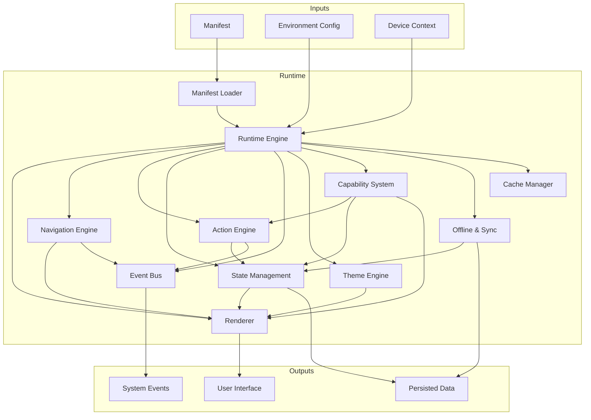
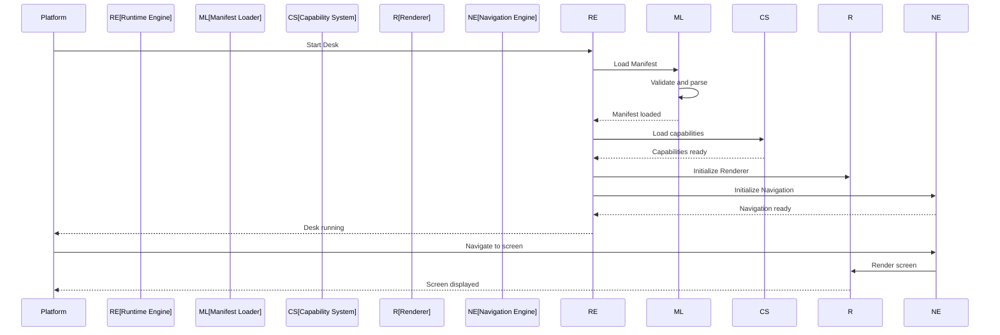

# Runtime Overview

**KB-008 — Runtime Overview**

| Metadata | Value |
|----------|-------|
| KB-ID | KB-008 |
| Title | Runtime Overview |
| Version | 0.1.0 |
| Status | Drafting |
| Owner | Architecture |
| Dependencies | KB-005 (Platform Overview), KB-006 (System Architecture), KB-007 (Service Boundaries) |
| Related Documents | KB-009 (Manifest Specification), KB-015 (Action Engine), KB-016 (Navigation Engine), KB-017 (Theme Engine), KB-018 (State Management), KB-019 (Event Bus), KB-020 (Offline & Synchronization) |
| Review Status | Pending |
| Last Updated | 2026-07-10 |

### Revision History

| Version | Date | Author | Change |
|---------|------|--------|--------|
| 0.1.0 | 2026-07-10 | AI Architecture Agent | Initial draft |

---

## 1. Purpose

The Runtime is the execution environment of the DUKADESK platform. It is the system that loads, interprets, and runs applications (Desks) from their declarative Manifest representations. The Runtime is the bridge between what the Builder produces and what the user experiences.

This document provides a high-level overview of the Runtime: its responsibilities, lifecycle, subsystems, and interactions. Detailed specifications for each Runtime subsystem exist in their own documents.

The Runtime is distinct from the Builder. The Builder authors applications; the Runtime executes them. They are independent systems that communicate through the Manifest contract. The Runtime does not know how the Builder works, and the Builder does not know how the Runtime implements its contracts.

---

## 2. Runtime Responsibilities

The Runtime is responsible for:

- **Desk Initialization**: Loading and validating the Manifest, resolving dependencies, initializing subsystems, and establishing the execution environment.
- **Screen Rendering**: Rendering screens as defined in the Manifest, resolving layouts, applying themes, and managing component lifecycles.
- **Navigation Management**: Interpreting navigation definitions, managing stacks, tabs, drawers, modals, and handling route resolution and deep links.
- **Action Execution**: Dispatching and executing actions in response to user interactions, system events, and workflow triggers.
- **State Management**: Maintaining application state, managing state mutations, notifying subscribers, and persisting state across sessions.
- **Event Routing**: Publishing and subscribing to events across subsystems, capabilities, and components.
- **Capability Loading**: Loading and initializing capabilities, registering their components, actions, and state extensions.
- **Theme Application**: Resolving and applying theme tokens to all rendered visual elements.
- **Offline & Synchronization**: Managing offline operation, queuing mutations, and synchronizing when connectivity is restored.
- **Cache Management**: Caching Manifest data, screen definitions, assets, and API responses for performance and offline operation.
- **Security Enforcement**: Evaluating permissions, authentication state, and navigation guards.

---

## 3. Runtime Architecture

### 3.1 Runtime Engine

| Aspect | Description |
|--------|-------------|
| **Purpose** | The central orchestrator that manages the Runtime lifecycle and coordinates all subsystems. |
| **Responsibilities** | Initialize and shut down the Runtime, load Manifests, coordinate subsystem startup, manage safe mode, handle lifecycle events. |
| **Inputs** | Manifest, environment configuration, device context. |
| **Outputs** | Running Desk instance, lifecycle events. |

### 3.2 Subsystems

The Runtime is composed of cooperating subsystems, each specified in its own document:

| Subsystem | KB ID | Responsibility |
|-----------|-------|----------------|
| Manifest Loader | KB-008 (this doc) | Parse, validate, and load Manifests |
| Renderer | KB-011 (Renderer Architecture) | Render screens, resolve layouts, apply themes |
| Navigation Engine | KB-016 | Manage navigation stacks, routes, deep links, guards |
| Action Engine | KB-015 | Dispatch and execute actions |
| State Management | KB-018 | Manage application state |
| Event Bus | KB-019 | Route events between subsystems |
| Theme Engine | KB-017 | Resolve and apply theme tokens |
| Capability System | KB-010 | Load and manage capabilities |
| Offline & Sync | KB-020 | Manage offline operation and synchronization |
| Cache Manager | — | Cache screen definitions, assets, API data |

### Runtime Architecture Diagram

### Execution Flow

---

## 4. Runtime Lifecycle

### Initialization

1. **Manifest Loading**: The Runtime Engine receives a Manifest reference and delegates to the Manifest Loader. The Loader fetches, validates, and parses the Manifest.
2. **Dependency Resolution**: Component references, capability dependencies, and asset references are resolved.
3. **Subsystem Initialization**: Subsystems are initialized in dependency order: Event Bus → State Management → Cache Manager → Capability System → Theme Engine → Navigation Engine → Renderer → Action Engine → Offline & Sync.
4. **Capability Loading**: Each declared capability is loaded, its components registered, and its initialization hooks executed.
5. **Screen Registration**: All screens from the Manifest are registered with their routes.
6. **Navigation Setup**: The navigation structure is built from route definitions.
7. **Ready Signal**: The Runtime signals readiness and displays the initial screen.

### Execution

During execution, the Runtime processes user interactions, system events, and background operations. Subsystems communicate through the Event Bus. State changes propagate through the State Management system.

### Shutdown

1. **Suspend**: Active operations are paused. State is persisted. Navigation state is saved.
2. **Capability Teardown**: Each capability is notified and cleans up.
3. **Subsystem Shutdown**: Subsystems shut down in reverse initialization order.
4. **Resource Release**: Memory, file handles, and network connections are released.

---

## 5. Runtime Modes

| Mode | Description |
|------|-------------|
| **Normal** | Full execution. All subsystems active. Standard security enforcement. |
| **Safe Mode** | Reduced functionality when critical errors occur. Fallback screen displayed. Diagnostics collected. |
| **Maintenance** | Runtime accepts configuration updates but limits user interaction. Used for hot reload and non-breaking updates. |
| **Offline** | Full execution with limited connectivity. Operations queued for synchronization. Cached data served. |

---

## 6. Relationship to Other Documents

| Document | Relationship |
|----------|--------------|
| **KB-005 — Platform Overview** | The Runtime is one of the core components of the DUKADESK platform. This document describes the Runtime in detail. |
| **KB-006 — System Architecture** | The Runtime is the execution domain within the system architecture. This document describes its internal structure. |
| **KB-007 — Service Boundaries** | The Runtime is a service within the platform. This document defines its boundaries and interactions. |
| **KB-009 — Manifest Specification** | The Runtime consumes Manifests. The Manifest Specification defines the contract between Builder and Runtime. |
| **KB-022 — Builder Studio Architecture** | The Builder produces what the Runtime executes. The two systems are independent but contractually linked through the Manifest. |
