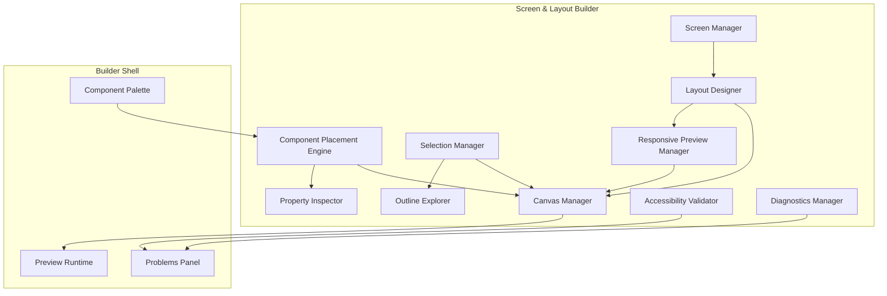
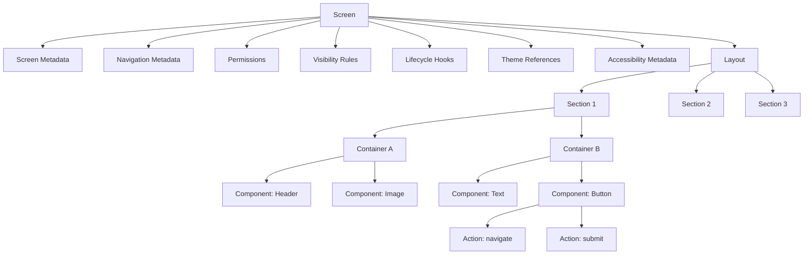
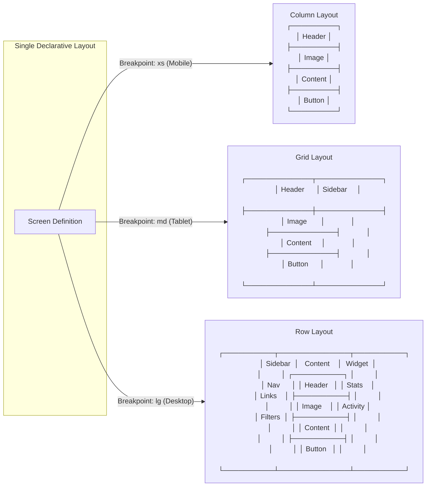
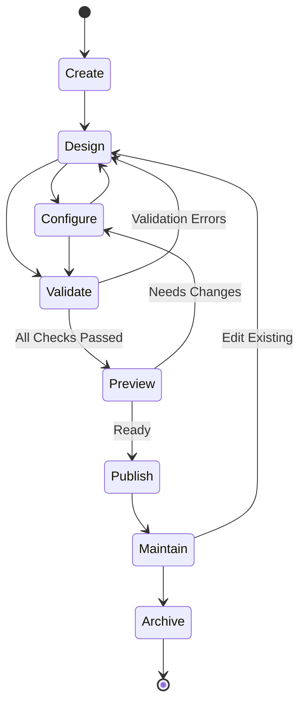

# Screen & Layout Builder

**KB-024 — Screen & Layout Builder Specification**

| Metadata | |
|----------|---|
| **KB ID** | KB-024 |
| **Title** | Screen & Layout Builder |
| **Version** | 0.1.0 |
| **Status** | Drafting |
| **Owner** | Architecture Team |
| **Dependencies** | KB-014 Layout System, KB-012 Component Registry, KB-013 Component Model, KB-022 Builder Studio Architecture |
| **Related Documents** | Builder Studio Architecture (KB-022), Desk Builder (KB-023), Component Model (KB-013), Component Registry (KB-012), Layout System (KB-014), Theme Engine (KB-017), Navigation Engine (KB-016), Runtime Overview, Renderer Architecture |
| **Review Status** | Pending |
| **Last Updated** | 2026-07-10 |

### Revision History

| Version | Date | Author | Change |
|---------|------|--------|--------|
| 0.1.0 | 2026-07-10 | AI Architecture Agent | Initial draft |

---

## 1. Purpose

The Screen & Layout Builder is the Builder Studio subsystem responsible for creating, organizing, designing, validating, previewing, and maintaining application screens and layouts. It is the primary visual canvas that users interact with inside Builder Studio.

Screens are defined declaratively because DUKADESK is a manifest-driven platform. A screen definition describes what components appear, how they are arranged, and how they behave — without specifying how they are rendered. Declarative screen definitions are portable across platforms, testable without a renderer, and safe for AI generation.

Layout is separated from rendering because the arrangement of UI elements is an architectural concern, not a visual one. A layout defines structure — columns, rows, grids, spacing, and hierarchy. Rendering defines appearance — colors, typography, shadows, and animations. Separating them means:

- Layouts can be validated independently of rendering.
- Multiple renderers (mobile, web, desktop) share one layout definition.
- Themes can change appearance without altering structure.
- Responsive adaptation restructures layout without changing component configuration.

Responsive design is a platform responsibility because every DUKADESK application targets multiple device classes. The Screen & Layout Builder provides responsive primitives as a first-class feature, not an afterthought. Builders define how a screen adapts across breakpoints, and the Runtime ensures consistent adaptation behavior across all platforms.

The Builder must produce Runtime-compatible screen definitions because the Runtime is the execution environment. Screen definitions authored in the Builder are serialized into Manifest entries that the Runtime resolves, validates, and renders. Compatibility is enforced through schema validation and component registry references.

---

## 2. Screen Philosophy

### Declarative UI

Every screen is defined as structured data — a tree of sections, containers, and components with configured properties, events, and actions. There is no imperative UI code. Declarative UI is predictable, portable, and auditable.

### Composition Over Positioning

Screens are built by composing containers that arrange their children. Explicit positioning (x, y coordinates) is not used for business UI layouts. Composition produces layouts that naturally adapt to content size, screen dimensions, and theme changes.

### Responsive by Default

Every screen is assumed to need responsive behavior. The Builder provides responsive editing as the default editing mode, not as an opt-in feature. Builders define how a screen looks at each breakpoint; the Layout System handles the adaptation logic.

### Accessibility-First

Screen definitions must include accessibility metadata: labels, hints, roles, focus order, and touch target sizes. The Builder enforces accessibility requirements through validation and provides tools for inspecting and improving accessibility.

### Theme-Aware

Screens reference theme tokens for spacing, colors, typography, and shapes. Hardcoded visual values are not permitted. Theme awareness ensures that screens adapt to brand changes, dark mode, and high contrast settings without manual editing.

### Component-Driven

Screens are assembled from components registered in the Component Registry. The Builder does not create rendering primitives — it instantiates and configures existing components. Component-driven development ensures consistency, reusability, and compatibility with the Runtime renderer.

### Reusable Layouts

Layouts and screen sections should be reusable across multiple screens. The Builder supports saving layouts as templates, creating layout libraries, and sharing layouts across a Desk or organization.

### Previewable

Every screen must be previewable at any point during authoring. The Builder's Preview Runtime renders screens using the same component pipeline as the production Runtime. What builders see in preview is what users will see in production.

### Runtime-Compatible

Screen definitions must conform to the Manifest schema and reference only registered components and capabilities. The Builder validates compatibility continuously and flags issues before publishing.

### AI-Assisted Design

AI agents assist in screen design by generating layouts, recommending components, optimizing responsive behavior, and detecting accessibility issues. AI output is always editable and subject to the same validation as human-authored screens.

---

## 3. What is a Screen?

### Formal Definition

A **Screen** is a user-facing workspace within a Desk. It represents a distinct view or page that the user can navigate to. A Screen contains one or more Sections and Layouts, references Components from the Component Registry, and is resolved by the Runtime and Renderer when the user navigates to its associated route.

### Characteristics

A Screen:

- **Represents a user-facing workspace** — a logical view within the application (e.g., Order List, Product Detail, Customer Profile).
- **Contains one or more Sections and Layouts** — structured using the Layout System's hierarchy.
- **References Components rather than implementing them** — components are registered in the Component Registry; screens declare which components appear and how they are configured.
- **Is resolved by the Runtime and Renderer** — the Runtime loads the screen definition from the Manifest, resolves component references, and passes the resolved structure to the Renderer.

### What a Screen Is Not

| Not This | Because |
|----------|---------|
| A Component | A screen is a composition of components. A component is a single reusable presentation unit. |
| A Capability | A capability provides cross-cutting functionality. A screen is a user-facing view within a capability. |
| A Workflow | A workflow defines business process steps. A screen is a UI view that may participate in a workflow. |
| A Runtime View | Screens are authored in the Builder and serialized into Manifests. Runtime views are instantiated from those manifests. |
| A Platform-specific page | Screens are platform-independent. Platform-specific rendering is handled by the Renderer, not the screen definition. |

---

## 4. Builder Responsibilities

### Screen Creation

Create new screens from templates, from scratch, or by duplicating existing screens. Screen creation sets up the initial structure: layout type, default sections, and navigation binding.

### Layout Composition

Design the structural arrangement of the screen using layout primitives: rows, columns, grids, tabs, accordions, split views, and custom containers. Layout composition is performed visually on the canvas.

### Component Placement

Place and configure components within the screen's containers. Component placement includes drag-and-drop positioning, insertion into containers, and configuration through the Property Inspector.

### Responsive Configuration

Define how the screen adapts across device classes and breakpoints. Responsive configuration covers layout changes, component visibility, container sizing, and spacing adjustments per breakpoint.

### Navigation Assignment

Assign screens to navigation routes, define entry screens, configure deep link parameters, and set navigation guards. Navigation assignment links the screen to the Navigation Engine's route registry.

### Accessibility Validation

Validate screens against accessibility standards: reading order, focus order, touch target sizes, color contrast, labels, and screen reader metadata. Accessibility validation runs continuously and on demand.

### Theme Preview

Preview screens under different themes: light, dark, high contrast, and brand-specific themes. Theme preview helps builders verify that screens render correctly across all visual contexts.

### Reusable Templates

Create, save, and manage reusable screen templates and layout sections. Templates accelerate development by providing pre-built structures for common patterns: list-detail, dashboard, form, and gallery.

### Screen Organization

Organize screens within the Desk: grouping by module, naming and tagging, setting screen order, and managing screen-level metadata.

### Screen Duplication

Duplicate screens within or across projects. Duplication preserves the full screen structure, component configuration, and responsive settings.

### Screen Validation

Validate screens against all applicable rules: schema compliance, component references, navigation integrity, accessibility standards, and performance thresholds.

---

## 5. Builder Architecture

### 5.1 Screen Manager

| Aspect | Description |
|--------|-------------|
| **Purpose** | Manage the lifecycle of screens within the Builder project. |
| **Responsibilities** | Create, read, update, delete, duplicate, and organize screens. Maintain the screen registry for the project. |
| **Inputs** | Screen CRUD commands, project context. |
| **Outputs** | Screen definitions, screen list, screen metadata. |
| **Extension points** | Custom screen templates, screen lifecycle hooks, external screen imports. |

### 5.2 Layout Designer

| Aspect | Description |
|--------|-------------|
| **Purpose** | Provide visual tools for designing screen layouts using Layout System primitives. |
| **Responsibilities** | Render layout structure on canvas, support layout type selection, manage container hierarchy, handle responsive breakpoints. |
| **Inputs** | Layout definition, canvas interactions, breakpoint configuration. |
| **Outputs** | Modified layout definition, layout preview. |
| **Extension points** | Custom layout types, layout plugins, layout import/export. |

### 5.3 Component Placement Engine

| Aspect | Description |
|--------|-------------|
| **Purpose** | Manage the placement, configuration, and arrangement of components within screen layouts. |
| **Responsibilities** | Handle drag-and-drop from palette, enforce nesting rules, manage component selection, coordinate with Property Inspector. |
| **Inputs** | Component palette items, drop target information, component configuration. |
| **Outputs** | Component placement in layout tree, component configuration data. |
| **Extension points** | Custom drop behaviors, placement validation rules, component defaults. |

### 5.4 Canvas Manager

| Aspect | Description |
|--------|-------------|
| **Purpose** | Manage the visual canvas rendering and interaction. |
| **Responsibilities** | Render the screen layout, handle zoom and pan, manage selection state, render guides and overlays, coordinate with Preview. |
| **Inputs** | Layout definition, viewport state, selection state. |
| **Outputs** | Rendered canvas, interaction events. |
| **Extension points** | Custom canvas renderers, overlay plugins, canvas grid providers. |

### 5.5 Selection Manager

| Aspect | Description |
|--------|-------------|
| **Purpose** | Manage element selection on the canvas and in the Outline Explorer. |
| **Responsibilities** | Track selected element, manage multi-select, synchronize selection between canvas and outline, broadcast selection changes. |
| **Inputs** | Click/tap events, outline selection, programmatic selection. |
| **Outputs** | Current selection state, selection change events. |
| **Extension points** | Custom selection behaviors, selection change hooks. |

### 5.6 Property Inspector

| Aspect | Description |
|--------|-------------|
| **Purpose** | Display and edit properties of the selected layout element or component. |
| **Responsibilities** | Load property schema for selected element, render appropriate input controls, validate property values, emit change events. |
| **Inputs** | Selected element metadata, property schema from Component Registry. |
| **Outputs** | Property values, change events. |
| **Extension points** | Custom property editors, property validation rules, property grouping strategies. |

### 5.7 Outline Explorer

| Aspect | Description |
|--------|-------------|
| **Purpose** | Display a tree view of the screen's structural hierarchy. |
| **Responsibilities** | Render component and container tree, support drag-and-drop reordering, support selection synchronization with canvas, show element status indicators. |
| **Inputs** | Screen layout definition, element metadata. |
| **Outputs** | Tree view rendering, reorder events, selection events. |
| **Extension points** | Custom tree node renderers, context menu items. |

### 5.8 Responsive Preview Manager

| Aspect | Description |
|--------|-------------|
| **Purpose** | Manage responsive preview across device breakpoints. |
| **Responsibilities** | Provide device frame rendering, manage breakpoint selection, coordinate responsive rule editing, compare layouts across breakpoints. |
| **Inputs** | Screen definition, device frame configuration, breakpoint state. |
| **Outputs** | Responsive preview rendering, breakpoint comparison views. |
| **Extension points** | Custom device presets, breakpoint plugins. |

### 5.9 Accessibility Validator

| Aspect | Description |
|--------|-------------|
| **Purpose** | Validate screens against accessibility standards. |
| **Responsibilities** | Run accessibility checks on current screen, report violations, provide fix suggestions, track accessibility score. |
| **Inputs** | Screen definition, accessibility rule definitions. |
| **Outputs** | Accessibility validation results, fix suggestions, score. |
| **Extension points** | Custom accessibility rules, external accessibility scanners. |

### 5.10 Diagnostics Manager

| Aspect | Description |
|--------|-------------|
| **Purpose** | Collect and expose diagnostic information about screen editing operations. |
| **Responsibilities** | Log editing operations, track performance metrics, capture errors, expose health status. |
| **Inputs** | Events from all other modules. |
| **Outputs** | Diagnostic logs, metrics, health status. |
| **Extension points** | Custom diagnostic sinks, metrics exporters. |

### Builder Canvas Architecture Diagram



---

## 6. Screen Model

Every screen in the Builder is represented by a structured model. The model captures all aspects of the screen's definition.

### Screen Metadata

| Field | Description |
|-------|-------------|
| **Screen ID** | Unique identifier within the Desk. |
| **Display Name** | Human-readable name shown in navigation and documentation. |
| **Description** | Brief description of the screen's purpose. |
| **Module** | The module or functional area this screen belongs to. |
| **Tags** | Arbitrary tags for organization and search. |
| **Status** | Draft, Ready for Review, Approved, Published. |
| **Version** | Screen definition version. |

### Layout

The top-level layout type for the screen (column, grid, tabs, split view, etc.) and its responsive variants. The Layout references the Layout System specification (KB-014).

### Sections

Logical divisions within the screen. Each Section has:

- Section ID and display name.
- Section layout type (may differ from screen-level layout).
- Visibility rules and permissions.
- Theme token references.

### Containers

Structural elements within sections. Each Container has:

- Container type (row, column, card, panel, etc.).
- Padding, margin, alignment, and spacing configuration.
- Constraint settings (min/max sizes, flex, aspect ratio).
- Overflow and scroll behavior.
- Theme token references.

### Components

Component instances placed within containers. Each Component instance has:

- Component ID reference (from Component Registry).
- Instance ID (unique within the screen).
- Configuration properties matching the component's schema.
- Event bindings and action references.
- Conditional visibility rules.

### Navigation Metadata

- Route ID assignment.
- Route parameters (static and dynamic).
- Deep link configuration.
- Navigation guard references.

### Permissions

- Required permissions to access the screen.
- Role-based access configuration.
- Feature flag requirements.

### Visibility Rules

- Conditional visibility based on runtime state.
- Device class visibility (show on mobile, hide on desktop).
- Connectivity requirements.

### Lifecycle Hooks

- `onEnter` actions executed when the screen is navigated to.
- `onExit` actions executed when navigating away.
- `onResume` actions executed when returning to the screen.
- `onPause` actions executed when leaving the screen.

### Theme References

- Theme token overrides for this screen (if any).
- Theme variant requirements (requires dark mode support).

### Accessibility Metadata

- Screen-level ARIA label / accessibility label.
- Keyboard navigation configuration.
- Focus management behavior.
- Screen reader announcement configuration.

### Screen Structure Diagram



---

## 7. Layout Composition

The Screen & Layout Builder supports all canonical layout types defined in the Layout System specification (KB-014). Layout composition is performed visually on the canvas.

### Rows

Horizontal arrangement of containers and components. Builders configure alignment (top, center, bottom), distribution (start, center, end, space-between), and spacing between children.

### Columns

Vertical arrangement of containers and components. Builders configure alignment (left, center, right, stretch) and distribution. Columns are the most common top-level layout.

### Grids

Two-dimensional arrangement with defined rows and columns. Builders configure column and row templates (fixed, proportional, auto), gaps, and cell spanning.

### Cards

Elevated containers with header, content, and footer sections. Builders configure card elevation, padding, header content, and action areas.

### Panels

Collapsible or expandable containers with headers. Builders configure panel title, default state (open/closed), and animation behavior.

### Tabs

Tabbed containers where each tab contains its own layout. Builders configure tab items, tab position (top, left, bottom), and tab styling.

### Accordions

Vertically stacked, collapsible sections. Builders configure accordion items, default expanded state, and multi-expand or single-expand behavior.

### Split Views

Divided containers with resizable panes. Builders configure pane sizes, resize handles, and orientation (horizontal or vertical split).

### Overlays

Containers positioned above the normal flow. Builders configure overlay type (modal, popover, tooltip, drawer), anchor position, and dismissal behavior.

### Responsive Containers

Containers that change their layout type based on breakpoint. A container might be a Row on desktop and a Column on mobile. Builders configure the layout type and properties per breakpoint in a single container.

### Nested Layouts

Any layout type may be nested within another. A Column may contain a Row that contains a Grid. The Builder supports arbitrary nesting depth with visual hierarchy indicators.

---

## 8. Component Placement

### Drag-and-Drop Placement

Builders drag components from the Component Palette onto the canvas. Drop targets highlight valid insertion points. Invalid drops (wrong container type, circular nesting, container constraints) are prevented with visual feedback.

### Component Insertion

Components may be inserted at specific positions within a container:

- **Prepend**: Insert as first child.
- **Append**: Insert as last child.
- **Before**: Insert before a selected sibling.
- **After**: Insert after a selected sibling.
- **Into**: Insert into an empty container.

### Component Replacement

An existing component may be replaced by dragging a new component onto it. Replacement preserves the container position and transfers compatible property values where possible.

### Duplication

Components may be duplicated within the same screen. Duplication copies all property values, event bindings, and responsive configurations.

### Nesting Rules

The Component Placement Engine enforces nesting rules:

- Some containers accept only specific component types.
- Some components may not contain children.
- Nesting depth is limited (configurable per project).
- Circular references are prevented.

### Alignment Tools

The Builder provides alignment assistance during placement:

- Snap-to-grid alignment.
- Guide lines for vertical and horizontal alignment.
- Equal spacing distribution among siblings.
- Center and edge alignment within containers.
- Constraint visualization.

### Snapping

Components snap to alignment guides, grid lines, and container edges during drag. Snapping is configurable (snap tolerance, grid size) and may be toggled on and off.

### Constraints

Builders can set sizing constraints on placed components:

- Fixed width/height.
- Proportional (flex) sizing relative to siblings.
- Min/max width and height.
- Aspect ratio preservation.
- Intrinsic sizing (fit content).

---

## 9. Responsive Design

### Mobile Layouts

The default editing view targets mobile dimensions. Builders start with the mobile layout and add breakpoints for larger screens. Mobile-first responsive design ensures screens work on the smallest target device.

### Tablet Layouts

Builders configure how the layout adapts at tablet breakpoints:

- Single-column layouts may become two-column.
- Side-by-side content may stack vertically.
- Tab bars may switch from bottom to top.
- Drawers may switch from overlay to persistent.

### Desktop Layouts

Builders configure how the layout takes advantage of additional screen space:

- Multi-column grids expand column count.
- Sidebars become persistent.
- Master-detail views display side by side.
- Content density may decrease (more white space).

### Wide Displays

For ultra-wide screens and large monitors:

- Content may be centered with max-width constraints.
- Additional panels may appear in margins.
- Multi-column layouts may show more data.
- Responsive containers may switch to horizontal orientation.

### Foldable Devices

Layouts adapt to foldable device postures:

- **Folded**: Standard phone layout.
- **Partially open**: Content shifts away from hinge.
- **Flat**: Extended layout across both screens, hinge-aware positioning.

### Orientation Changes

Builders configure layout behavior for portrait and landscape:

- Column layouts may switch to Row in landscape.
- Image sizes may increase in landscape.
- Additional content may be visible in landscape.
- Hidden sections may appear in landscape.

### Safe Areas

The Builder provides safe area visualization on the canvas:

- Notch and status bar areas are marked.
- System navigation bar areas are marked.
- Home indicator areas are marked.
- Builders can configure content to extend into or avoid safe areas.

### Adaptive Containers

Containers with responsive type switching:

- A container configured as `Column` on mobile and `Row` on desktop.
- A grid that changes column count per breakpoint.
- A tabs container that becomes an accordion on mobile.
- Hidden sections that appear only on specific breakpoints.

### Responsive Layout Flow Diagram



---

## 10. Screen Lifecycle

```
Create
  │
  ▼
Design
  │
  ▼
Configure
  │
  ▼
Validate
  │
  ▼
Preview
  │
  ▼
Publish
  │
  ▼
Maintain
  │
  ▼
Archive
```

### Stage Descriptions

**Create** — A new screen is created from a template or from scratch. The Screen Manager initializes the screen with default properties: screen ID, display name, layout type, and empty sections.

**Design** — The builder composes the screen layout using the Layout Designer. Sections, containers, and components are placed and arranged on the canvas. Layout types are selected and configured.

**Configure** — Components are configured through the Property Inspector. Properties, events, actions, and data bindings are set. Responsive breakpoints are defined. Navigation, permissions, and lifecycle hooks are configured.

**Validate** — The screen is validated against all applicable rules. Validation runs continuously during design and configuration, and is explicitly triggered before preview and publish.

**Preview** — The screen is rendered in the Preview Runtime. Preview validates that the screen renders as expected, responds correctly to breakpoints, and behaves consistently with the configured properties. Theme preview verifies visual appearance across themes.

**Publish** — The screen is included in the Manifest generated for the Desk. Publishing makes the screen available in the Runtime. The screen's version is recorded for change tracking.

**Maintain** — Published screens may be updated. Changes go through the same design, configure, validate, preview cycle. Updated screens are published as new versions.

**Archive** — Screens that are no longer needed are archived. Archived screens are removed from navigation but retained in project history.

### Screen Lifecycle Diagram



---

## 11. Navigation Integration

### Navigation Engine

Screens are assigned to routes in the Navigation Engine. The Screen & Layout Builder provides route assignment during screen creation or configuration. Each screen is associated with exactly one primary route.

### Route Assignment

Builders assign screens to routes through the Navigation Builder integration:

- Select an existing route or create a new one.
- Configure route parameters (static and dynamic).
- Set the screen as an entry screen for the route.
- Configure route-level permissions and guards.

### Screen Hierarchy

Screens are organized within the Desk's navigation hierarchy:

- Top-level screens in tabs or bottom navigation.
- Nested screens in stacks (drill-down flows).
- Modal screens for tasks requiring completion.
- Drawer screens for secondary navigation.

The Builder's Outline Explorer shows the screen hierarchy in relation to the navigation structure.

### Entry Screens

Each navigation root has an entry screen — the screen shown when the user first enters that section. Builders designate entry screens during navigation configuration.

### Deep Links

Screens may be configured as deep link targets:

- Define the deep link URI pattern.
- Map URI parameters to screen parameters.
- Configure authentication requirements for deep link access.
- Set fallback behavior for invalid deep links.

### Navigation Guards

Screens inherit navigation guards from their routes. Builders may also configure screen-level guards:

- Permission requirements specific to the screen.
- Role requirements.
- Feature flag requirements.
- Runtime state conditions.

---

## 12. Theme Integration

### Theme Preview

The Builder's Preview Runtime applies the active theme to the screen being edited. Builders can switch between themes to verify appearance:

- Light theme.
- Dark theme.
- High contrast theme.
- Brand-specific themes.
- Custom themes defined in the Theme Builder.

### Live Token Resolution

As builders edit theme tokens in the Theme Builder, the Screen & Layout Builder preview updates in real time. Token changes are reflected immediately in all screens that reference those tokens.

### Typography

Screens reference typography tokens for all text elements:

- Heading styles (h1–h6).
- Body text styles.
- Caption and label styles.
- Font families, sizes, weights, and line heights.

Typography tokens are configured in the Theme Builder and applied to screens through component properties and container defaults.

### Color System

Screens reference color tokens for all visual properties:

- Primary, secondary, accent, and neutral colors.
- Semantic colors (success, warning, error, info).
- Surface and background colors.
- Text and icon colors.

### Spacing

Screens reference spacing tokens for all dimensional properties:

- Container padding and margins.
- Component spacing and gaps.
- Section separators.
- List item padding.

### Dark Mode

The Builder provides dark mode preview:

- Automatically applies dark mode color tokens.
- Builders can adjust screen-specific properties for dark mode.
- Contrast verification for dark mode colors.
- Image and icon adjustments for dark backgrounds.

### High Contrast

The Builder provides high contrast preview:

- Enforces minimum contrast ratios.
- Adjusts borders and separators for visibility.
- Verifies interactive element visibility.
- Tests focus indicators.

### Brand Previews

For multi-tenant Desks, builders can preview screens under different brand configurations:

- Switch between brand themes.
- Compare brand appearance side by side.
- Verify brand-specific token overrides.

---

## 13. Runtime Integration

### Runtime

The Runtime consumes screen definitions from the Manifest. Screen definitions authored in the Builder must conform to the Manifest schema that the Runtime expects. The Builder validates schema compliance before publishing.

### Renderer

The Renderer interprets the resolved screen structure and produces visual output. The Builder's Preview Runtime simulates the production Renderer, ensuring that screens render consistently across both environments.

### Component Registry

The Builder discovers components through the Component Registry. When a builder places a component on the canvas, the Builder retrieves the component's schema, metadata, and default configuration from the Registry.

### Layout System

The Builder uses the Layout System's layout types, container model, and responsive primitives. Screen layouts authored in the Builder are compatible with the Runtime's Layout System implementation.

### Action Engine

Components on screens dispatch actions through the Action Engine. The Builder configures action bindings in the Property Inspector — mapping component events to action handlers defined in capabilities or workflows.

### State Management

Screens read from and write to the State Management subsystem. The Builder configures data bindings that connect component properties to state keys. Data bindings are validated against the state schema during screen validation.

---

## 14. AI Integration

### Generate Complete Screens

The AI Assistant can generate complete screens from natural language descriptions: "Create a product detail screen with image gallery, description, pricing, and add-to-cart button." The AI generates the layout, component placement, property configuration, and basic data bindings.

### Convert Sketches Into Layouts

The AI Assistant can interpret wireframes, sketches, or screenshots and produce equivalent screen definitions. The builder reviews and refines the generated layout through normal editing tools.

### Recommend Components

Based on the screen context and the builder's intent, the AI Assistant recommends specific components:

- "This field would be better as a dropdown with search."
- "Consider using a data table instead of a list for this multi-column data."
- "An autocomplete component would improve this search flow."

### Optimize Layouts

The AI Assistant analyzes screen layouts and suggests optimizations:

- Reduce container nesting depth.
- Improve responsive behavior.
- Fix spacing inconsistencies.
- Consolidate duplicate configurations.
- Improve loading performance.

### Improve Accessibility

The AI Assistant scans screens for accessibility issues and suggests fixes:

- Add missing labels to form fields.
- Adjust touch target sizes.
- Improve color contrast.
- Add ARIA roles and properties.
- Fix focus order.

### Detect Inconsistent Designs

The AI Assistant identifies design inconsistencies across screens:

- Different spacing values for similar layouts.
- Inconsistent button styles.
- Mismatched color usage.
- Divergent component configurations.

### Generate Responsive Variants

The AI Assistant can auto-generate responsive layout variants from a base layout: "Generate tablet and desktop layouts from this mobile layout." The builder reviews and adjusts the generated variants.

### Suggest Reusable Sections

When the AI detects repeated layout patterns across screens, it suggests extracting them into reusable sections or templates: "This header pattern appears on 5 screens. Would you like to create a reusable section?"

---

## 15. Collaboration

### Shared Editing (Future)

Future support for multiple builders editing the same screen simultaneously:

- Cursor and selection visibility.
- Real-time layout updates.
- Conflict resolution for concurrent edits.
- Change attribution.

### Comments

Builders can add comments to screens, sections, containers, and components:

- Feedback and review comments.
- @mentions to notify team members.
- Threaded discussions.
- Resolved and unresolved states.

### Reviews

Screen designs can be submitted for review:

- Request review from designated reviewers.
- Reviewer examines the screen definition.
- Reviewer approves or requests changes.
- Review comments are linked to specific elements.

### Version History

Every change to a screen is recorded:

- Who made the change.
- When the change was made.
- What changed (element-level diff).
- Change description.
- Version number.

### Change Tracking

The Collaboration Manager tracks changes at the screen element level:

- Added, modified, and deleted components.
- Property value changes.
- Layout structure changes.
- Responsive configuration changes.

### Approval Workflows

Screen publication may require approval:

- Define approval gates for screen publishing.
- Approval request and notification.
- Approval history per screen version.
- Automatic rollback on rejection.

---

## 16. Security

### Screen Permissions

Screens may require specific permissions to access:

- Read permission to view the screen.
- Write permission to modify data on the screen.
- Admin permission for screen-specific administration actions.

Permissions are enforced by the Runtime at navigation time.

### Role-Aware Visibility

Screen elements may be conditionally visible based on user roles:

- Show/hide sections based on role.
- Enable/disable components based on role.
- Configure different layouts per role.

### Protected Screens

Screens containing sensitive functionality or data are marked as protected:

- Protected screens require re-authentication.
- Protected screens may have session timeouts.
- Protected screens are excluded from caching.

### Builder Permissions

Within the Builder, screen editing is controlled by permissions:

- Who can create screens.
- Who can edit specific screens.
- Who can delete screens.
- Who can approve screen changes.

### Audit Logging

Screen-related operations are logged:

- Screen creation, modification, and deletion.
- Permission changes on screens.
- Screen publishing events.
- Screen review and approval actions.

---

## 17. Performance

### Large Canvas Optimization

For screens with many components and containers:

- Virtualized canvas rendering — only visible elements are rendered.
- Level-of-detail rendering — components at low zoom show simplified representations.
- Deferred offscreen layout resolution.
- Canvas interaction remains responsive regardless of screen complexity.

### Virtualized Editing

The Outline Explorer uses virtualization for large component trees. Only visible tree nodes are rendered. Scrolling through the tree is smooth regardless of tree depth.

### Incremental Rendering

The canvas updates incrementally as builders edit:

- Property changes update only the affected component.
- Layout changes reflow only the affected subtree.
- Adding or removing components updates only the container's children.

### Efficient Property Updates

The Property Inspector updates efficiently:

- Only the properties panel for the selected element is re-rendered.
- Property changes are debounced during continuous editing.
- Schema lookups are cached per component type.

### Lazy Loading

Screen definitions are loaded lazily:

- Only the currently edited screen is fully loaded in memory.
- Screens not being edited retain only metadata.
- Screen preview loads on demand.

### Asset Caching

Component icons, thumbnails, and preview images are cached:

- Palette item thumbnails are cached in memory.
- Component preview images are cached on disk.
- Asset cache is invalidated when the Component Registry updates.

---

## 18. Observability

### Screen Diagnostics

The Diagnostics Manager exposes:

- Screen definition size and complexity metrics.
- Component count per screen.
- Container nesting depth.
- Responsive breakpoint count.
- Data binding count.

### Layout Diagnostics

Layout-specific diagnostics:

- Layout type distribution across screens.
- Responsive configuration coverage.
- Nested layout depth statistics.
- Container constraint analysis.

### Accessibility Reports

Accessibility reports are generated per screen:

- Accessibility score (percentage of checks passed).
- Violation count by severity.
- Violation count by WCAG category.
- Fix suggestion coverage.

### Component Statistics

Component usage statistics across the Desk:

- Most and least used components.
- Component variant distribution.
- Component configuration patterns.
- Deprecated component usage warnings.

### Performance Metrics

Key performance indicators:

- Screen load time in Preview.
- Screen validation duration.
- Canvas render time.
- Property Inspector update latency.

### Validation Reports

Validation results include:

- Error and warning counts by category.
- Element-level error details.
- Validation duration.
- Validation trend over time.

---

## 19. Anti-Patterns

### Absolute Positioning for Business UIs

Using absolute positioning (x, y coordinates) to arrange business UI elements is prohibited. Absolute positioning breaks responsive behavior, accessibility, theme adaptation, and internationalization. Use compositional layouts (rows, columns, grids) instead.

### Deeply Nested Layouts

Nesting containers more than 5–7 levels deep is discouraged. Deep nesting increases layout resolution time, complicates debugging, and reduces screen maintainability. Flatten layout structure where possible by using grids and flex layouts.

### Hardcoded Styles

Using hardcoded visual values (specific pixel sizes, fixed colors, hardcoded font sizes) instead of theme token references is prohibited. Hardcoded styles prevent theme adaptation, dark mode, and brand customization.

### Platform-Specific Layouts

Creating separate screen definitions for each platform instead of using responsive configuration is prohibited. Platform-specific layouts duplicate effort, diverge over time, and defeat the purpose of a unified Layout System.

### Duplicate Screens

Creating multiple screen definitions with identical or near-identical structure is prohibited. Screens should be reused, not duplicated. Parameterize screens through route parameters and data bindings.

### Business Logic in Screen Definitions

Configuring business logic, validation rules, or data processing in screen definitions is prohibited. Screens define UI structure and component configuration. Business logic belongs in capabilities, workflows, and action handlers.

### Ignoring Responsive Behavior

Publishing screens without responsive configuration for target device classes is prohibited. All screens must be verified on all target platforms. Screens that only work on one device class are not complete.

### Orphaned Component References

Referencing components that are not registered in the Component Registry or are not available for the target platform is prohibited. All component references must be validated against the Registry during screen editing.

### Circular Navigation

Creating navigation structures where screens reference each other in a loop without user-initiated direction changes is prohibited. Circular navigation causes poor user experience and potential stack overflows.

### Platform-Specific Data Bindings

Binding screen data sources to platform-specific APIs or data formats is prohibited. Data bindings must use platform-independent state keys and data model references.

---

## 20. Future Evolution

### AI-Generated Interfaces

AI agents may generate complete screen interfaces from high-level requirements:

- "Create an order management screen with search, filtering, bulk actions, and export."
- AI generates the full screen layout, component configuration, data bindings, and action mappings.
- The builder reviews, refines, and approves the generated screen.

### Voice-Designed Screens

Builders may design screens through voice commands:

- "Add a text field for customer name."
- "Make the image gallery span two columns."
- "Hide the sidebar on mobile."
- Voice commands are interpreted by the AI Assistant and applied to the screen definition.

### Collaborative Visual Editing

Future support for real-time collaborative screen editing:

- Multiple builders editing the same screen simultaneously.
- Visual cursor presence and selection visibility.
- Real-time layout updates across all editors.
- Integrated communication channels.

### Design System Synchronization

The Screen & Layout Builder may integrate with external design systems:

- Import design tokens from Figma, Sketch, or Adobe XD.
- Sync component definitions from design system packages.
- Maintain bi-directional sync between design system changes and Builder screens.
- Detect design system version drift and suggest updates.

### AR/VR Interfaces

Future support for authoring spatial interfaces:

- 3D layout containers and positioning.
- Spatial component placement.
- Gaze and gesture interaction design.
- Depth-based layout layers.

### Adaptive Layouts

AI-driven adaptive layouts that optimize for each user:

- Layout adjusts based on user behavior and preferences.
- Frequently used components are more prominent.
- Infrequently used sections are collapsed or hidden.
- Layout density adapts to user proficiency.

### Multi-Display Workspaces

Support for authoring multi-display experiences:

- Define layouts that span multiple screens or windows.
- Configure content distribution across displays.
- Design secondary display experiences (presentation mode, companion views).
- Preview multi-display layouts in simulation.

---

## 21. Relationship to Other Documents

| Document | Relationship |
|----------|--------------|
| **KB-022 — Builder Studio Architecture** | The Screen & Layout Builder is a subsystem within Builder Studio. This specification extends the Builder Studio architecture for the screen and layout domain. |
| **KB-023 — Desk Builder** | Screens are organized within Desks. The Desk Builder defines the project structure that screens belong to. |
| **KB-013 — Component Model** | Screens are composed of components that conform to the Component Model. Component schemas, events, and actions are defined in the Component Model. |
| **KB-012 — Component Registry** | The Builder discovers components from the Component Registry. Component metadata, schemas, and palette information come from the Registry. |
| **KB-014 — Layout System** | Screen layouts use the Layout System's canonical layout types, container model, and responsive primitives. |
| **KB-017 — Theme Engine** | Screens reference theme tokens for spacing, colors, typography, and shapes. Theme preview in the Builder uses the Theme Engine. |
| **KB-016 — Navigation Engine** | Screens are assigned to routes in the Navigation Engine. Navigation configuration is integrated into the screen definition. |
| **Runtime Overview** | The Runtime consumes screen definitions from the Manifest and resolves them for the Renderer. |
| **Renderer Architecture** | The Renderer interprets the resolved screen structure and produces visual output. The Builder's Preview Runtime simulates the Renderer. |

---

*This is KB-024, the Screen & Layout Builder specification of the DUKADESK Engineering Knowledge Base. It defines the Builder Studio subsystem responsible for creating, organizing, designing, validating, previewing, and maintaining application screens and layouts.*
