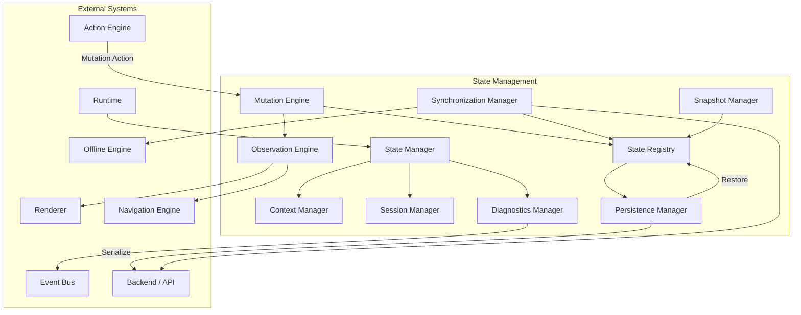
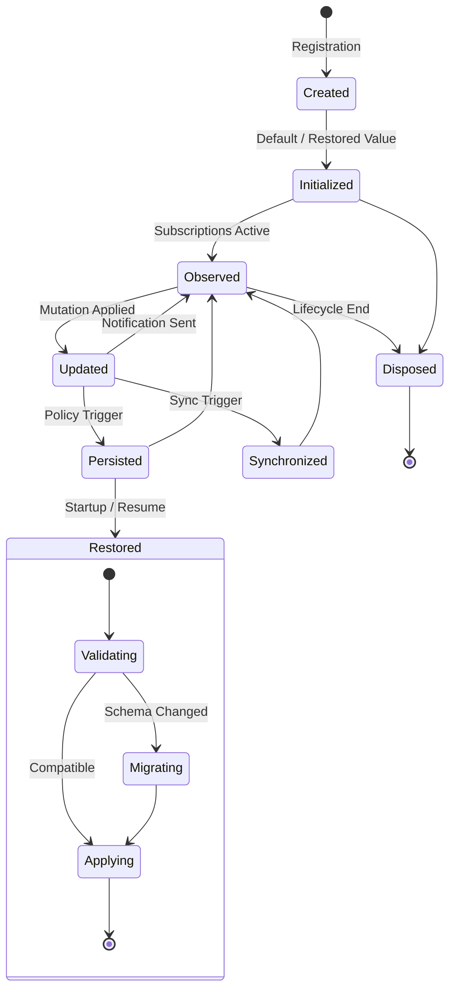
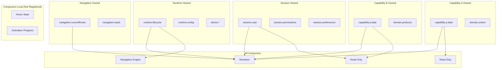

# State Management

**KB-018 — State Management Specification**

| Metadata | |
|----------|---|
| **KB ID** | KB-018 |
| **Title** | State Management |
| **Version** | 0.1.0 |
| **Status** | Drafting |
| **Owner** | Architecture Team |
| **Dependencies** | KB-015 Action Engine, KB-016 Navigation Engine, KB-019 Event Bus, KB-020 Offline & Synchronization |
| **Related Documents** | Runtime Overview, Action Engine (KB-015), Navigation Engine (KB-016), Event Bus (KB-019), Offline & Synchronization (KB-020), Capability System, Renderer Architecture, Builder Studio |
| **Review Status** | Pending |
| **Last Updated** | 2026-07-10 |

### Revision History

| Version | Date | Author | Change |
|---------|------|--------|--------|
| 0.1.0 | 2026-07-10 | AI Architecture Agent | Initial draft |

---

## 1. Purpose

State Management is the platform-wide architecture responsible for representing, storing, synchronizing, observing, mutating, persisting, and restoring application state across the DUKADESK ecosystem.

State ownership must be explicit because every piece of state has a natural owner. Runtime state belongs to the Runtime. Session state belongs to the session. Capability state belongs to the capability. Component-local UI state belongs to the component. When ownership is ambiguous, state becomes unpredictable — multiple consumers may mutate the same data, conflicts go undetected, and persistence behaves inconsistently.

A single source of truth is required because every consumer must observe the same reality. If the Renderer, Navigation Engine, and Offline Engine each hold their own copy of the same concept, they inevitably diverge. The State Registry is the authoritative source for every state category. Derived or cached copies are explicitly marked as such and never treated as authoritative.

State is separated from UI rendering because state has a lifecycle independent of the viewport. A screen that is not currently visible still has state. A component that is recycled still has state in the registry. Separating state from rendering means:

- State survives navigation away from and back to a screen.
- State can be persisted and restored independently of UI.
- Multiple renderers can observe the same state.
- State can be tested without rendering.

State must survive runtime changes where appropriate. Navigation, capability switching, theme changes, and even application restart should not destroy state that has persistence policy. Users expect their session, their form progress, and their application position to be preserved.

---

## 2. State Philosophy

### Single Source of Truth

Every distinct piece of application state exists in exactly one authoritative location in the State Registry. No duplicates. No shadows. Consumers subscribe to changes; they do not copy. When a consumer needs a derived or transformed view, it computes it reactively from the single source.

### Predictable State Flow

State changes follow a unidirectional flow: Action → Mutation Engine → State Registry → Observation Engine → Consumers. There is no reverse flow. Components do not write to shared state directly. The Renderer does not mutate state. Predictable flow makes state changes auditable, testable, and debuggable.

### Declarative Updates

State changes are declared as mutations, not executed as imperative operations. A mutation declares the target state key, the operation (set, merge, delete, increment), and the value. The Mutation Engine applies the change atomically and notifies observers.

### Immutable State Concepts

State in the Registry is conceptually immutable. A mutation does not modify existing state in place — it produces a new version of the affected subtree. Previous versions remain accessible for snapshots, debugging, and rollback. Immutability enables time-travel debugging, predictable observation, and safe concurrent access.

### Explicit Ownership

Every state key has exactly one owner declared at registration time. The owner may be the Runtime, a capability, the session, the Navigation Engine, or a component. Ownership defines who may mutate the state, who may persist it, and who is responsible for its lifecycle.

### Observable State

All state in the Registry is observable by default. Consumers subscribe to specific keys or patterns and receive notifications when those keys change. Observation is selective — a consumer observes only the state it needs and is notified only when relevant keys change.

### Minimal Duplication

State should appear in exactly one place. Derived state (computed from other state) is not stored — it is computed on demand or cached with an invalidation policy. Duplication causes synchronization problems and should be eliminated wherever it is found.

### Persistence by Policy

What gets persisted, when, and for how long is determined by policy, not by implementation. Each state category declares its persistence policy: `persistent` (survives app restart), `session` (survives until logout), `temporary` (survives until screen close), or `volatile` (survives until next mutation).

### Offline-Aware

State management must work identically online and offline. Mutations made offline are queued, synchronized when connectivity returns, and reconciled through conflict resolution. The State Registry does not distinguish between online and offline mutations at the point of application — the distinction exists only in the synchronization layer.

### Runtime-Managed

The Runtime owns the State Manager lifecycle. It initializes state on startup, triggers persistence on suspend, restores state on resume, and disposes state on shutdown. Capabilities and components do not manage their own persistence or lifecycle — they declare their requirements and the Runtime fulfills them.

---

## 3. State Responsibilities

### State Creation

Initialize state with default values. State creation occurs when a capability is installed, a session begins, a screen is navigated to, or a component is mounted. Created state must have an initial value and a declared type.

### State Ownership

Every state key is assigned to an owner at creation. The owner is responsible for the state's lifecycle, mutation permissions, and persistence policy. Ownership is declared at registration time and enforced by the Mutation Engine.

### State Mutation

Apply changes to state atomically. Mutations are validated against the state's schema, checked against ownership, and applied as a single atomic operation. The Mutation Engine broadcasts change notifications after successful application.

### State Observation

Notify consumers when state changes. Consumers subscribe to specific keys or patterns and receive the new value after each mutation. Observation is push-based — the Observation Engine delivers notifications without polling.

### State Synchronization

Coordinate state between the local Registry and remote backends. Synchronization is bidirectional: local mutations are sent to the server; server-side changes are received and applied locally. The Synchronization Manager handles ordering, deduplication, and conflict resolution.

### State Persistence

Write state to durable storage according to policy. Persistence covers application suspend, crash recovery, and cross-session state. The Persistence Manager serializes state, writes to the configured storage backend, and manages expiration and pruning.

### State Restoration

Restore persisted state on application start or session resume. Restoration must validate that persisted state is still valid — capabilities may have been removed, schemas may have changed, or sessions may have expired.

### State Disposal

Clean up state when it is no longer needed. Disposal occurs when a capability is uninstalled, a session ends, a screen is destroyed, or a component unmounts. Disposed state is removed from the Registry and any persisted copies are deleted.

### Conflict Resolution

Resolve conflicts that arise when the same state is mutated in multiple places (local and remote, or on multiple devices). The Conflict Resolution subsystem applies the configured strategy: last-write-wins, merge, manual resolution, or application-specific logic.

### Diagnostics

Collect and expose diagnostic information about state operations: mutation history, change logs, synchronization metrics, performance data, and error reports.

### Responsibility Boundaries

| Responsibility | Owner | Notes |
|---------------|-------|-------|
| State creation | Runtime, Capability System | Runtime creates system state; capabilities create their own |
| State ownership | Declared at registry | Enforced by Mutation Engine |
| State mutation | Mutation Engine | Never by components directly |
| State observation | Observation Engine | Push-based notifications |
| State synchronization | Synchronization Manager | Delegates to Offline Engine when needed |
| State persistence | Persistence Manager | Policy-driven |
| State restoration | Persistence Manager | On startup or resume |
| State disposal | State Manager | Triggered by lifecycle events |
| Conflict resolution | Synchronization Manager | Configurable per state key |
| Diagnostics | Diagnostics Manager | Always active |

---

## 4. State Architecture

### 4.1 State Manager

| Aspect | Description |
|--------|-------------|
| **Purpose** | Orchestrate the state management lifecycle — creation, mutation, observation, persistence, and disposal. |
| **Responsibilities** | Initialize state on startup, coordinate module execution, manage lifecycle events, emit state lifecycle events on the Event Bus. |
| **Inputs** | State registration requests, mutation actions, lifecycle events (startup, suspend, resume, shutdown). |
| **Outputs** | State lifecycle events, mutation confirmations, diagnostics data. |
| **Extension points** | Pre-mutation hooks, post-mutation hooks, startup initializers, shutdown handlers. |

### 4.2 State Registry

| Aspect | Description |
|--------|-------------|
| **Purpose** | The authoritative single source of truth for all registered state. |
| **Responsibilities** | Store state values, maintain state schemas, enforce ownership, support key-based and pattern-based lookup. |
| **Inputs** | State registration, lookup queries, key subscriptions. |
| **Outputs** | State values, subscription tokens, ownership records. |
| **Extension points** | Custom storage backends, state migration handlers, schema validators. |

### 4.3 Context Manager

| Aspect | Description |
|--------|-------------|
| **Purpose** | Manage hierarchical state context — the current screen, capability, tenant, and session scope. |
| **Responsibilities** | Resolve contextual state scope, provide context-scoped lookups, manage context lifecycle (enter, exit, switch). |
| **Inputs** | Context lifecycle events (navigation, capability switch, tenant switch). |
| **Outputs** | Active context stack, context-scoped state references. |
| **Extension points** | Custom context providers, context-aware state resolvers. |

### 4.4 Session Manager

| Aspect | Description |
|--------|-------------|
| **Purpose** | Manage session-level state — authentication, user profile, permissions, preferences. |
| **Responsibilities** | Initialize session state on login, clear on logout, persist session across app restarts, handle session expiry and refresh. |
| **Inputs** | Authentication events, session lifecycle triggers. |
| **Outputs** | Session state, session expiry notifications. |
| **Extension points** | Custom session providers, multi-session support. |

### 4.5 Persistence Manager

| Aspect | Description |
|--------|-------------|
| **Purpose** | Persist and restore state according to configured policies. |
| **Responsibilities** | Serialize state to storage, deserialize on restoration, manage storage backends, enforce expiry and pruning, handle migration. |
| **Inputs** | Persistence policies, serialization triggers (suspend, interval, explicit), restoration triggers (startup, resume). |
| **Outputs** | Persisted state, restoration events, storage metrics. |
| **Extension points** | Custom serialization formats, storage backends (local, secure, cloud), encryption providers. |

### 4.6 Synchronization Manager

| Aspect | Description |
|--------|-------------|
| **Purpose** | Synchronize state between local and remote sources. |
| **Responsibilities** | Track changed state, push local changes to server, receive remote changes, handle ordering and deduplication, coordinate conflict resolution. |
| **Inputs** | Mutation notifications from Mutation Engine, remote change events from network layer. |
| **Outputs** | Synchronization events, conflict notifications, sync status. |
| **Extension points** | Custom synchronization strategies, conflict resolution handlers, merge algorithms. |

### 4.7 Observation Engine

| Aspect | Description |
|--------|-------------|
| **Purpose** | Deliver state change notifications to subscribers. |
| **Responsibilities** | Manage subscription registry, filter notifications to relevant subscribers, batch and debounce notifications, support derived and computed state. |
| **Inputs** | Mutation completions from Mutation Engine, subscription requests from consumers. |
| **Outputs** | Change notifications to subscribers. |
| **Extension points** | Custom notification channels, derived state definitions, computed value resolvers. |

### 4.8 Mutation Engine

| Aspect | Description |
|--------|-------------|
| **Purpose** | Validate and apply state mutations atomically. |
| **Responsibilities** | Validate mutations against schema, check ownership permissions, apply atomic updates, record mutation history, notify Observation Engine. |
| **Inputs** | Mutation requests (target, action, value, source). |
| **Outputs** | Mutation confirmations, validation errors, history records. |
| **Extension points** | Custom mutation validators, transactional mutation support, rollback handlers. |

### 4.9 Snapshot Manager

| Aspect | Description |
|--------|-------------|
| **Purpose** | Capture and manage point-in-time snapshots of state. |
| **Responsibilities** | Capture snapshots on demand or on schedule, manage snapshot retention, provide snapshot comparison, support rollback to snapshot. |
| **Inputs** | Snapshot triggers (manual, periodic, pre-mutation), rollback requests. |
| **Outputs** | Snapshots, diff results, rollback confirmations. |
| **Extension points** | Custom snapshot policies, incremental snapshot strategies. |

### 4.10 Diagnostics Manager

| Aspect | Description |
|--------|-------------|
| **Purpose** | Collect and expose diagnostic information about state operations. |
| **Responsibilities** | Log mutations, track performance metrics, expose state health, report errors. |
| **Inputs** | Events from all other modules. |
| **Outputs** | Diagnostic logs, metrics, health status, mutation history. |
| **Extension points** | Custom diagnostic sinks, metrics exporters, audit trail backends. |

### State Architecture Diagram



---

## 5. State Categories

### Runtime State

State owned by the Runtime. Describes the application execution environment.

| Key | Type | Persistence | Description |
|-----|------|-------------|-------------|
| `runtime.lifecycle` | `enum` | Volatile | Current lifecycle state: foreground, background, suspended |
| `runtime.desk` | `string` | Temporary | Current active Desk identifier |
| `runtime.capability` | `string[]` | Temporary | Set of active capability identifiers |
| `runtime.config` | `object` | Persistent | Runtime configuration values |
| `runtime.platform` | `object` | Volatile | Platform information: OS, version, device model |

### Navigation State

State owned by the Navigation Engine. Describes where the user is and how they got there.

| Key | Type | Persistence | Description |
|-----|------|-------------|-------------|
| `navigation.currentRoute` | `string` | Session | Current active route ID |
| `navigation.params` | `object` | Session | Current route parameters |
| `navigation.stack` | `array` | Session | Navigation stack per root |
| `navigation.history` | `array` | Temporary | Navigation history for analytics |
| `navigation.deepLinks` | `array` | Temporary | Pending deep links |

### UI State

State owned by the Renderer or individual components. Describes transient UI conditions.

| Key | Type | Persistence | Description |
|-----|------|-------------|-------------|
| `ui.tabs.selected` | `string` | Session | Selected tab per tab group |
| `ui.panels.expanded` | `string[]` | Temporary | Expanded panel identifiers |
| `ui.scroll.positions` | `object` | Temporary | Scroll position per scrollable container |
| `ui.dialogs.visible` | `string` | Volatile | Currently visible dialog identifier |
| `ui.loading` | `object` | Volatile | Loading states per key |
| `ui.input.draft` | `object` | Temporary | Temporary input values before submission |

### Session State

State owned by the Session Manager. Describes the current user and their context.

| Key | Type | Persistence | Description |
|-----|------|-------------|-------------|
| `session.authenticated` | `boolean` | Session | Whether the user is authenticated |
| `session.user` | `object` | Session | Current user profile |
| `session.permissions` | `string[]` | Session | Granted permission identifiers |
| `session.tenant` | `object` | Session | Current tenant context |
| `session.organization` | `object` | Session | Current organization context |
| `session.subscription` | `object` | Session | Subscription plan and limits |
| `session.preferences` | `object` | Persistent | User preferences (theme, locale) |
| `session.tokens` | `object` | Encrypted | Authentication tokens |

### Capability State

State owned by capabilities. Describes capability-specific runtime data.

| Key | Type | Persistence | Description |
|-----|------|-------------|-------------|
| `capability.{id}.status` | `enum` | Temporary | Capability activation status |
| `capability.{id}.data` | `object` | Varies | Capability-specific state |
| `capability.{id}.workflow` | `object` | Session | Active workflow progress |
| `capability.{id}.cache` | `object` | Temporary | Capability-specific cache |

### Domain State

State owned by domain capabilities. Describes business entities and domain data.

| Key | Type | Persistence | Description |
|-----|------|-------------|-------------|
| `domain.orders` | `object[]` | Persistent | Order entities |
| `domain.products` | `object[]` | Persistent | Product catalog |
| `domain.bookings` | `object[]` | Persistent | Booking entities |
| `domain.customers` | `object[]` | Persistent | Customer profiles |
| `domain.documents` | `object[]` | Persistent | Document entities |

### Device State

State owned by the Runtime / device layer. Describes device capabilities and conditions.

| Key | Type | Persistence | Description |
|-----|------|-------------|-------------|
| `device.connectivity` | `enum` | Volatile | Network status: online, offline, metered |
| `device.battery` | `number` | Volatile | Battery level 0–100 |
| `device.location` | `object` | Volatile | Current location coordinates |
| `device.permissions` | `object` | Session | Granted device permissions |
| `device.storage` | `object` | Volatile | Available storage space |

### Offline State

State owned by the Offline Engine. Describes offline queue and synchronization status.

| Key | Type | Persistence | Description |
|-----|------|-------------|-------------|
| `offline.queue` | `array` | Persistent | Queued mutations pending sync |
| `offline.syncStatus` | `enum` | Volatile | Current sync status |
| `offline.conflicts` | `array` | Persistent | Detected conflicts |
| `offline.lastSync` | `timestamp` | Persistent | Last successful sync timestamp |

---

## 6. State Lifecycle

```
State Created
       │
       ▼
Initialized
       │
       ▼
Observed ──────────── Consumers subscribe
       │
       ▼
Updated ←──────────── Mutations applied
       │
       ▼
Persisted ←────────── According to policy
       │
       ▼
Synchronized ←─────── Local ↔ Remote
       │
       ▼
Restored ──────────── On startup or resume
       │
       ▼
Disposed ──────────── On lifecycle end
```

### Stage Descriptions

**State Created** — A new state entry is registered with the State Registry. Creation specifies the key, initial value, schema, owner, persistence policy, and synchronization policy. Creation may be triggered by capability installation, screen initialization, or Runtime startup.

**Initialized** — The created state receives its initial value. For persistent state, initialization may load a previously persisted value. For session state, initialization may load server-provided data. The initialization stage sets the state to a known good value before any consumer observes it.

**Observed** — Consumers subscribe to state changes. Subscriptions are registered with the Observation Engine, specifying which keys to observe and a callback or channel for notifications. Observation begins after initialization and continues until the state is disposed.

**Updated** — A mutation request is received, validated, and applied. The Mutation Engine checks schema conformance, verifies ownership, applies the change atomically, records the mutation in history, and notifies the Observation Engine. Subscribers receive the new value.

**Persisted** — The Persistence Manager writes state to durable storage according to its policy. Persistent state is written on every mutation or on a debounced schedule. Session state is written on lifecycle transitions (suspend, background). Volatile state is never persisted.

**Synchronized** — The Synchronization Manager coordinates state between the local Registry and remote backends. Local mutations are sent to the server. Remote changes are received and applied. Conflicts are detected and resolved according to the configured strategy.

**Restored** — On application startup or session resume, the Persistence Manager reads persisted state and restores it to the State Registry. Restoration validates state compatibility — if the state schema has changed or a capability has been removed, restoration applies migration or falls back to defaults.

**Disposed** — State is removed from the Registry when it is no longer needed. Disposal triggers cleanup of persisted copies, cancellation of subscriptions, and emission of disposal events. Disposed state cannot be observed or mutated.

### State Lifecycle Diagram



---

## 7. State Ownership

### Ownership Rules

Every state key has exactly one owner. Ownership is declared at registration time and enforced by the Mutation Engine. Only the owner may mutate the state directly. Other consumers may request mutations through the owner's interface.

### Runtime-Owned State

The Runtime owns lifecycle, configuration, device, and platform state. No capability or component may mutate Runtime-owned state. The Runtime exposes read-only access to all consumers.

**Examples:** `runtime.*`, `device.*`

### Capability-Owned State

Each capability owns its domain and internal state. A capability may define its own state keys under its namespace. Only the owning capability may mutate its state. Other capabilities may read but not write.

**Examples:** `capability.{id}.*`, `domain.*`

### Session-Owned State

The Session Manager owns authentication, user profile, permissions, and session-scoped preferences. Session state is established at login and cleared at logout. Components and capabilities may read session state but not mutate it directly.

**Examples:** `session.*`

### Navigation-Owned State

The Navigation Engine owns navigation state — current route, stack, history, and deep links. No other subsystem may mutate navigation state directly. Navigation state changes are triggered through navigation actions routed through the Action Engine.

**Examples:** `navigation.*`

### Component-Local State

Components may own local UI state that is not shared. Component-local state is not registered in the State Registry — it lives in the component's local scope. Local state is used for transient UI concerns: animation progress, temporary hover state, internal expansion state.

**Examples:** Animation progress, drag state, local form validation messages.

### Temporary State

Temporary state is owned by the context that created it. It has no persistence policy and is disposed when the creating context ends. Temporary state may be used for screen-scoped data, wizard progress, or draft input before submission.

**Examples:** `ui.input.draft`, `ui.dialogs.visible`

### Shared State

Shared state is owned by a single owner but may be observed and read by multiple consumers. The owner is responsible for lifecycle and mutation. Shared state enables cross-capability communication — Capability A owns the state; Capability B observes and reacts.

### Ownership Boundaries Diagram



---

## 8. State Mutation

### Action-Driven Mutations

All shared state mutations originate from actions dispatched through the Action Engine. A component or capability that needs to change state dispatches an action with the mutation intent. The Action Engine routes the action to the State Manager, which applies the mutation through the Mutation Engine.

```
Component → dispatch(action) → Action Engine → Mutation Engine → State Registry
```

Components never call the Mutation Engine directly. They never write to the State Registry. The Action Engine is the sole entry point for state mutations.

### Mutation Request Format

A mutation request specifies:

| Field | Description |
|-------|-------------|
| **target** | State key to mutate. |
| **operation** | One of: `set`, `merge`, `delete`, `increment`, `append`, `remove`, `toggle`. |
| **value** | The new value or payload for the operation. |
| **source** | Identifier of the requesting actor (capability, screen, component). |
| **timestamp** | Monotonic timestamp for ordering and conflict resolution. |

### Validation

Every mutation is validated before application:

1. **Key existence**: Does the target state key exist in the Registry?
2. **Ownership**: Does the requesting actor own this state?
3. **Schema**: Does the value conform to the declared schema?
4. **Constraints**: Are business rules satisfied (min, max, required)?
5. **Permissions**: Does the requesting context have permission to mutate?

If validation fails, the mutation is rejected and the caller receives a validation error with details.

### Atomic Updates

Mutations are applied atomically. A mutation either fully succeeds or fully fails. There is no partial application. If a mutation targets multiple keys in a transaction, all succeed or all fail together.

### Transactions

Multiple related mutations may be grouped into a transaction:

1. Begin transaction.
2. Queue mutations.
3. Validate all mutations.
4. Apply all mutations atomically.
5. Commit transaction.
6. Emit single change notification for all affected keys.

If any mutation in a transaction fails validation, the entire transaction is rolled back.

### Rollback

State mutations may be rolled back:

- **Automatic rollback**: If a downstream process (e.g., API call) fails after a state mutation, the mutation is automatically rolled back.
- **Manual rollback**: The Snapshot Manager supports rollback to a previous snapshot.
- **Optimistic rollback**: If an optimistic update is rejected by the server, the local mutation is rolled back and the server's value is applied.

### Optimistic Updates

For mutations that require server confirmation:

1. Apply the mutation optimistically to local state.
2. Send the mutation to the server.
3. If the server confirms, the optimistic update becomes permanent.
4. If the server rejects, the optimistic update is rolled back and the server's response is applied.

Optimistic updates are marked in the mutation history so they can be identified and rolled back if necessary.

### Conflict Detection

Conflicts are detected when:

- The same state key is mutated by two sources with different timestamps.
- A local optimistic update conflicts with a server-side change.
- Two offline devices mutate the same key before synchronization.

The Synchronization Manager detects conflicts during the synchronization process and applies the configured resolution strategy.

---

## 9. State Observation

### Reactive Updates

The Observation Engine delivers state changes to subscribers reactively. When a mutation completes, the Observation Engine identifies all subscribers affected by the changed keys and delivers the new values.

### Subscriptions

Consumers subscribe to state changes by registering with the Observation Engine:

- **Key subscription**: Subscribe to a specific state key.
- **Pattern subscription**: Subscribe to all keys matching a pattern (`session.*`, `capability.orders.*`).
- **Wildcard subscription**: Subscribe to all state changes.

Each subscription returns a subscription token used for unsubscribing.

### Selective Observation

Consumers should subscribe to the minimum specific keys they need. Subscribing to broad patterns or wildcards when a specific key is sufficient is wasteful. The Observation Engine tracks subscription granularity and may warn on broad subscriptions.

### Derived State

Derived state is computed from one or more source state keys. Derived state is not stored in the Registry — it is computed on demand or cached with automatic invalidation when source keys change.

Examples:

- `fullName` derived from `firstName` and `lastName`.
- `cartTotal` derived from `cart.items` and `pricing.tax`.
- `isCheckoutReady` derived from `cart.items`, `session.user`, and `validation.status`.

### Computed Values

The Observation Engine supports computed values — functions that transform one or more state keys into a derived value. Computed values are:

- **Lazy**: Computed only when a subscriber requests them.
- **Cached**: Cached until a source key changes.
- **Reactive**: Automatically recomputed when sources change.

### Change Notifications

Change notifications include:

- The affected state key.
- The new value.
- The previous value.
- The operation applied.
- The timestamp.
- The source of the mutation.

Notifications are delivered synchronously for the same tick or batched for microtask delivery. Consumers that perform expensive work on notifications should defer to an asynchronous queue.

---

## 10. Persistence

### Persistence Policies

| Policy | Behavior | Examples |
|--------|----------|----------|
| **Persistent** | Survives application restart, stored to durable storage. | `domain.orders`, `session.preferences` |
| **Session** | Survives navigation and screen changes, cleared on logout. | `session.user`, `navigation.currentRoute` |
| **Temporary** | Survives within the current screen or workflow, cleared on navigation away. | `ui.input.draft`, `ui.scroll.positions` |
| **Volatile** | Survives only within the current render cycle, never persisted. | `ui.dialogs.visible`, `device.connectivity` |
| **Encrypted** | Persistent with encryption at rest. | `session.tokens`, PII data |

### Serialization

The Persistence Manager serializes state for storage:

- **Format**: Platform-neutral format (JSON or equivalent).
- **Schema versioning**: Each persisted state key carries a schema version for migration support.
- **Selective serialization**: Only keys with `persistent` or `encrypted` policies are serialized during normal operation. Session and temporary keys are serialized only during suspend for restoration.

### Storage Backends

| Backend | Use Case |
|---------|----------|
| Local storage | General persistence |
| Secure storage | Encrypted state (tokens, PII) |
| Cache storage | Expirable cached state |
| Cloud storage | Cross-device synchronization (future) |

### Expiration

Persisted state may have an expiration:

- **Time-based**: "Expire after 7 days."
- **Event-based**: "Expire on logout."
- **Version-based**: "Expire when schema version changes."
- **Policy-based**: "Expire when storage exceeds limit."

Expired state is removed from storage on the next persistence cycle.

### Restoration

On application startup:

1. The Persistence Manager reads all persisted state from storage.
2. Each key is validated against the current Registry schema.
3. Compatible state is restored to the Registry.
4. Incompatible state is migrated or discarded.
5. Missing state (new keys since last persistence) receives default values.

On session resume (from background):

1. Session and temporary state are restored from in-memory cache.
2. Persisted state is verified against storage for any remote changes.
3. The restored state is compared to the pre-suspend state; mutations that occurred while suspended are detected.

---

## 11. Synchronization

### Local Synchronization

The State Registry is the single source of truth for all consumers within a single Runtime instance. Local synchronization is handled by the Observation Engine — when state changes, all local subscribers are notified on the same tick.

### Server Synchronization

The Synchronization Manager coordinates state between the local Registry and remote backends:

1. **Push**: Local mutations are collected, serialized, and sent to the server in batches.
2. **Pull**: Server-side changes are received through long-polling, WebSocket, or periodic fetch.
3. **Reconcile**: Incoming remote changes are applied to the local Registry through the Mutation Engine, ensuring all observers are notified.

### Incremental Synchronization

Only changed state is synchronized. The Synchronization Manager tracks dirty keys — keys that have been mutated since the last successful sync. Only dirty keys are included in the next sync batch.

### Conflict Resolution

When the same state key has diverged between local and remote:

| Strategy | Behavior | Use Case |
|----------|----------|----------|
| **Last-Write-Wins** | The mutation with the most recent timestamp wins. | Non-critical state, counters |
| **Merge** | Values are merged recursively where possible. | Deep objects, user preferences |
| **Remote Wins** | The server value is always authoritative. | Server-validated state |
| **Local Wins** | The local value is always preferred. | Offline-first forms |
| **Manual** | Conflict is surfaced for user resolution. | Critical business data |
| **Custom** | Application-defined resolution logic. | Domain-specific conflict rules |

### Retry

Failed synchronization attempts are retried with exponential backoff:

1. Immediate retry.
2. 1-second delay.
3. 5-second delay.
4. 30-second delay.
5. 5-minute delay.
6. Continue at 5-minute intervals until success or max retries.

### Version Awareness

Each synchronized state key carries a version number. The version is incremented on every successful mutation (local or remote). Version conflicts indicate that a stale value was used as the basis for a mutation — the Synchronization Manager detects version mismatches and triggers conflict resolution.

### Multi-Device Synchronization (Future)

Future support for synchronizing state across multiple devices belonging to the same user:

- Cloud-based state registry.
- Change propagation through push channels.
- Cross-device conflict resolution.
- Device-specific state isolation.

---

## 12. Runtime Integration

### Runtime

The Runtime owns the State Manager's lifecycle. On startup, the Runtime initializes the State Manager, which loads persisted state and establishes default values. On suspend, the Runtime triggers persistence. On resume, the Runtime triggers restoration. On shutdown, the Runtime triggers disposal of volatile and temporary state.

### Renderer

The Renderer is a consumer of state, not a producer. It subscribes to the Observation Engine for the state keys it needs to render the current screen. When state changes, the Observation Engine notifies the Renderer, which re-renders affected components.

### Navigation Engine

The Navigation Engine owns navigation state. When navigation occurs, the Navigation Engine mutates its state in the Registry. The Observation Engine notifies the Renderer and other subscribers. Navigation state also influences which capability and domain state is contextually active.

### Action Engine

Actions are the sole entry point for state mutations. The Action Engine receives action dispatches from components and capabilities, validates them, and routes mutation requests to the Mutation Engine. The Action Engine may also trigger side effects (API calls, analytics) in response to mutations.

### Event Bus

State lifecycle events are published on the Event Bus:

- `state.created` — A new state key was registered.
- `state.mutated` — A state mutation was applied.
- `state.persisted` — State was written to storage.
- `state.restored` — State was loaded from storage.
- `state.disposed` — State was removed from the Registry.
- `state.syncStarted` — Synchronization began.
- `state.syncCompleted` — Synchronization completed.
- `state.conflictDetected` — A conflict was detected.

### Offline Engine

When offline, mutations are queued by the Offline Engine. The Synchronization Manager coordinates with the Offline Engine to determine which mutations to queue and how to replay them when connectivity returns. The Offline Engine also provides connectivity state (`device.connectivity`) that the State Manager and Synchronization Manager consume.

### Capability System

Each capability registers its own state keys with the State Registry during installation. The capability defines the schema, initial values, persistence policy, and ownership. When a capability is uninstalled, the State Manager disposes the capability's state keys, cleans up persisted copies, and notifies observers.

---

## 13. Builder Studio Integration

### State Inspection

The Builder provides a state inspector panel showing:

- All registered state keys with current values.
- State hierarchy organized by owner.
- Persistence policies per key.
- Subscription counts per key.
- Mutation history with timestamps.

### Live Preview

The Builder's live preview is driven by the same State Management architecture. Changes made in the Builder (property edits, component additions) are applied as state mutations, which flow through the Observation Engine to the preview Renderer.

### State Simulation

The Builder supports state simulation:

- Override any state key with a test value.
- Simulate different authentication states.
- Simulate device conditions (offline, low battery, slow network).
- Simulate capability installation and removal.

### Debugging

The Builder's debugging tools include:

- Time-travel through mutation history.
- Snapshot comparison (before and after mutation).
- State diff viewer.
- Subscription tree visualization.
- Mutation trace (which action caused which state change).

### Mock Data

The Builder provides mock data generation for domain state:

- Generate realistic sample data for orders, products, bookings.
- Configure mock data schemas and volumes.
- Persist mock data across Builder sessions.

### Workflow Testing

The Builder supports state-driven workflow testing:

- Define initial state conditions.
- Simulate user actions that trigger mutations.
- Assert expected state outcomes.
- Visualize state changes through the workflow.

### Runtime Emulation

The Builder can emulate Runtime behavior:

- Simulate application lifecycle events (suspend, resume).
- Simulate connectivity changes.
- Simulate permission changes.
- Verify state behavior under each condition.

---

## 14. Security

### State Encryption

State with sensitivity classification (`encrypted` persistence policy) is encrypted before storage:

- Encryption at rest using platform secure storage.
- Encryption keys managed by the platform keychain.
- Encrypted state is never written to unsecured storage.
- Encryption is transparent to consumers — the Persistence Manager handles it.

### Sensitive Data Handling

Sensitive data (PII, tokens, credentials) has special handling:

- Marked with `sensitive: true` in the state schema.
- Excluded from diagnostic logs and mutation history.
- Redacted in snapshot captures.
- Never included in analytics events.
- Cleared from memory on session end.

### Session Isolation

Each session has an isolated state scope. Session A's state cannot be accessed by Session B's consumers. Session isolation is enforced by the State Registry through session-scoped state keys.

### Tenant Isolation

Tenant state is isolated within the Registry. State keys for Tenant A are prefixed with the tenant identifier and inaccessible to Tenant B consumers. The Context Manager enforces tenant scoping during lookup.

### Permission-Aware Access

State access may be gated by permissions:

- Read permission required to subscribe to a state key.
- Write permission required to mutate a state key.
- Admin permission required to access diagnostic state.

The Mutation Engine enforces write permissions. The Observation Engine enforces read permissions at subscription time.

### Secure Persistence

Persisted state is protected:

- Storage location is access-controlled (platform file permissions).
- Encrypted state uses platform-level encryption.
- Cache storage is cleared on logout.
- Storage is pruned on schema version changes.

### Memory Protection

Sensitive state in memory is protected:

- Zeroed on disposal.
- Not included in heap snapshots.
- Guarded against debugger attachment in production builds.

---

## 15. Performance

### Efficient Updates

State mutations target specific keys. A mutation to `session.user.name` affects only that leaf key. The Mutation Engine does not serialize or copy unrelated state subtrees. Observation notifications include only the changed key path.

### Incremental Synchronization

Only dirty keys are synchronized. The Synchronization Manager tracks which keys have changed since the last successful sync and includes only those in the next batch. Unchanged keys are not serialized or transmitted.

### Selective Observation

Consumers subscribe to the minimum specific keys they need. The Observation Engine delivers notifications only for subscribed keys. A component that subscribes to `session.user.name` is not notified when `session.user.email` changes.

### Lazy Initialization

State is initialized on first access, not on application start. If a capability's state is never accessed, it is never initialized. Lazy initialization reduces startup time and memory footprint.

### Snapshot Optimization

Snapshots use structural sharing. Unchanged subtrees are referenced, not copied. Snapshot creation is O(change) not O(total state). Multiple snapshots share unchanged nodes.

### Memory Management

The State Manager monitors memory usage:

- Temporary state is pruned when the creating context ends.
- Cache state is evicted based on LRU or TTL.
- Large state collections are paginated or virtualized.
- Memory warnings trigger aggressive pruning of non-critical state.

### Cache Strategies

Cached state (capability cache, domain data cache) follows:

- **TTL-based**: Evict after a configured time-to-live.
- **LRU-based**: Evict least recently used entries when cache is full.
- **Stale-while-revalidate**: Serve cached value while fetching fresh data in background.
- **Prefetch**: Populate cache predictively based on navigation and usage patterns.

---

## 16. Observability

### State Snapshots

The Snapshot Manager captures point-in-time views of the full state tree:

- Automatic snapshots before and after every mutation (for debugging).
- Periodic snapshots for diagnostics.
- On-demand snapshots for inspection.

Snapshots include the full state tree, timestamps, and the last mutation that was applied.

### Mutation History

Every mutation is recorded:

- Timestamp.
- Target key.
- Previous value.
- New value.
- Operation.
- Source (actor that requested the mutation).

Mutation history is stored as a ring buffer with configurable capacity. History may be exported for debugging and analysis.

### Change Logs

Change logs are the sequence of mutation events in chronological order. Change logs support:

- Replay (re-execute all mutations from a starting point).
- Reverse replay (undo all mutations to a previous point).
- Export for analysis and bug reproduction.

### Performance Metrics

Key performance indicators exposed by the Diagnostics Manager:

- Average mutation application time.
- Average observation notification delivery time.
- Subscription count per key.
- Total registered state keys.
- Average state lookup time.
- Persistence write and read latencies.
- Synchronization batch sizes and latencies.
- Snapshot creation and restore times.

### Diagnostics

The Diagnostics Manager exposes:

- Full state tree with current values.
- Mutation history with timestamps.
- Active subscriptions grouped by consumer.
- Persistence status per key.
- Synchronization status and last sync time.
- Conflict history.

### Synchronization Metrics

The Synchronization Manager exposes:

- Total mutations pushed.
- Total mutations pulled.
- Conflict count.
- Average sync latency.
- Queue depth.
- Retry count and distribution.

---

## 17. Anti-Patterns

### Multiple Sources of Truth

Storing the same data in multiple places with independent lifecycles is prohibited. If two state keys contain the same information, they will inevitably diverge. Eliminate duplicates. If a derived value is needed, compute it from the single source.

### Direct Component Mutations

Components mutating shared state directly (bypassing the Action Engine) is prohibited. Direct mutations bypass validation, ownership checks, and observation. They produce unreproducible state changes and break the unidirectional flow.

### Hidden Global State

Storing global state outside the State Registry — in module-level variables, singletons, or framework-specific stores — is prohibited. The State Registry is the only authoritative location for shared state. Hidden global state cannot be observed, persisted, or synchronized.

### Unbounded State Growth

Adding state to the Registry without a disposal policy is prohibited. Every state key must have a declared lifecycle end. Unbounded growth causes memory pressure, slow persistence, and degraded observation performance.

### Circular Dependencies

Two state keys depending on each other for their derived values is prohibited. Circular dependencies cause infinite recomputation loops. The Observation Engine detects circular dependent state definitions and rejects them.

### Business Logic in State Containers

Embedding business logic in state definitions, computed values, or mutation handlers is prohibited. State containers hold data. Business logic belongs in capabilities, services, and action handlers. A computed value should format data, not enforce business rules.

### Persistent Temporary State

Marking inherently temporary state (scroll position, dialog visibility, animation progress) with a persistent or session policy is prohibited. Temporary state pollutes the persistence store, increases serialization overhead, and causes unexpected restoration of transient UI conditions.

### Oversubscription

Subscribing to broad state patterns when only specific keys are needed is wasteful. A component that needs `session.user.name` should subscribe to `session.user.name`, not `session.*`. Oversubscription causes unnecessary re-renders and observation overhead.

### Synchronizing Everything

Attempting to synchronize every state key to the server is prohibited. Only domain state and critical session state should be synchronized. UI state, device state, and volatile runtime state have no business on the server.

### State in the Renderer

Allowing the Renderer to hold authoritative state is prohibited. The Renderer displays state from the Registry; it does not own it. Renderer-held state cannot be observed by other consumers and breaks the single-source-of-truth principle.

---

## 18. Future Evolution

### AI-Assisted State Optimization

AI agents may analyze state usage patterns and recommend optimizations:

- Identify unused or rarely-used state keys for cleanup.
- Suggest optimal persistence policies based on access patterns.
- Detect oversubscription patterns and recommend granular subscriptions.
- Predict state access patterns for proactive loading.

### Predictive Caching

The State Manager may predict which state will be needed next:

- Based on navigation patterns, preload state for likely next screens.
- Based on time patterns, prefetch state before likely access times.
- Based on user behavior, preload state for common workflows.

### Distributed Runtime State

Future support for distributed Runtime instances sharing state:

- State Registry backed by a distributed data store.
- Cross-instance observation through Event Bus.
- Consistent state across Runtime instances.
- Partition-tolerant state for unreliable network conditions.

### Collaborative Editing

Multiple users editing the same entity simultaneously:

- Operation-based conflict resolution (OT/CRDT).
- Real-time state synchronization through WebSocket.
- Presence awareness (who is editing what).
- Change attribution and review.

### Cross-Device Continuity

Seamless state continuity across user devices:

- Cloud-synchronized state Registry.
- Device-specific state overlays.
- Session transfer between devices.
- Unified mutation history across devices.

### Edge Synchronization

Synchronization through edge infrastructure:

- Low-latency edge caches for frequently accessed state.
- Regional state replication.
- Offline-first with edge-based conflict resolution.
- Gradual consistency for non-critical state.

### Intelligent Conflict Resolution

AI-assisted conflict resolution:

- Analyze conflict patterns and suggest resolution strategies.
- Automatically resolve common conflict types.
- Learn from manual resolutions and apply similar patterns.
- Predict conflicts before they occur based on access patterns.

---

## 19. Relationship to Other Documents

| Document | Relationship |
|----------|--------------|
| **KB-015 — Action Engine** | Actions are the sole entry point for state mutations. The Action Engine dispatches mutation requests to the Mutation Engine. |
| **KB-016 — Navigation Engine** | Navigation state is a subset of application state owned by the Navigation Engine. Navigation changes update state; state changes may trigger navigation. |
| **KB-019 — Event Bus** | State lifecycle events are published on the Event Bus. The Event Bus enables cross-subsystem observation of state changes. |
| **KB-020 — Offline & Synchronization** | The Offline Engine queues mutations made while offline. The Synchronization Manager coordinates with the Offline Engine for replay and conflict resolution. |
| **Runtime Overview** | The Runtime owns the State Management lifecycle. State initialization, persistence, restoration, and disposal are Runtime responsibilities. |
| **Renderer Architecture** | The Renderer consumes state through the Observation Engine. State drives rendering; rendering does not produce state. |
| **Capability System** | Capabilities register their state keys during installation. State is scoped and isolated per capability. |
| **Builder Studio** | The Builder provides state inspection, simulation, and debugging tools based on this specification. |

---

*This is KB-018, the State Management specification of the DUKADESK Engineering Knowledge Base. It defines the platform-wide architecture for representing, storing, synchronizing, observing, mutating, persisting, and restoring application state across all client platforms.*
