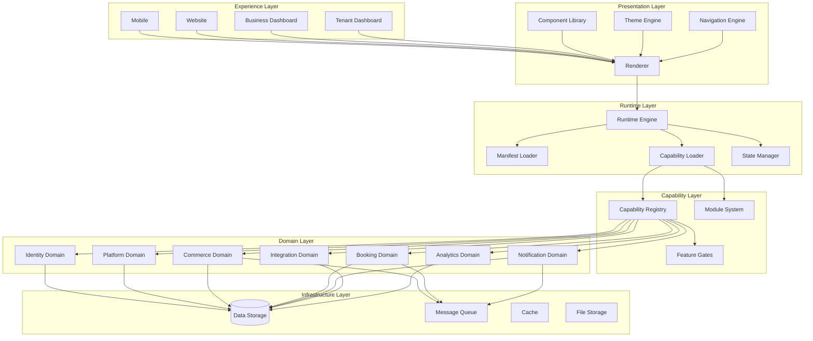
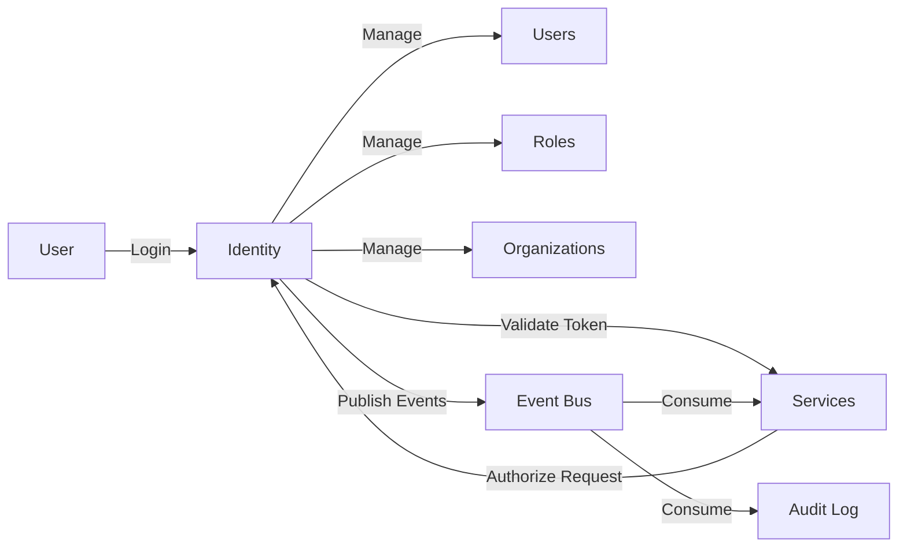
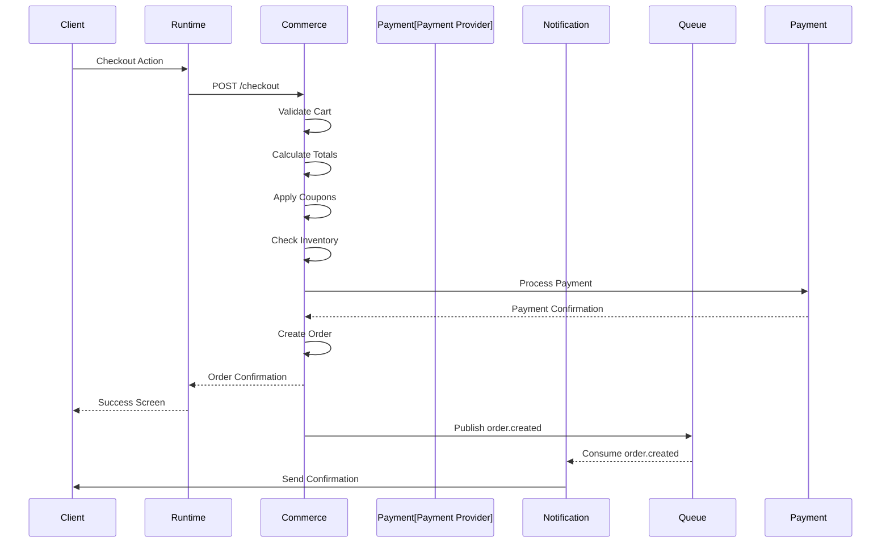
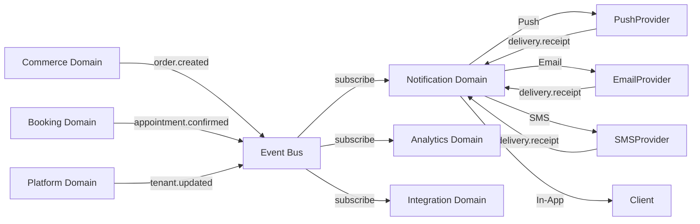

# KB-006 — System Architecture

**DUKADESK Platform Architecture — Blueprint**

| Metadata | Value |
|----------|-------|
| KB-ID | KB-006 |
| Title | System Architecture |
| Version | 0.1.0 |
| Status | Drafting |
| Owner | Architecture |
| Dependencies | KB-005 (Platform Overview), KB-003 (Platform Philosophy) |
| Related Documents | KB-007 (Runtime Overview), KB-008 (Service Boundaries), KB-010 (Technology Stack) |
| Review Status | Not Reviewed |
| Last Updated | 2026-07-10 |

## Revision History

| Version | Date | Author | Change |
|---------|------|--------|--------|
| 0.1.0 | 2026-07-10 | Architecture | Initial system architecture document |

---

## 1. Purpose

This document defines the complete high-level architecture of the DUKADESK platform.

It answers the question "How is DUKADESK built?" by describing every architectural domain, its responsibilities, boundaries, communication patterns, and operational principles.

This is **not** an implementation guide. It establishes the official architectural blueprint that all implementations must follow. The architecture should remain valid even if individual technologies, frameworks, databases, cloud providers, or programming languages change.

Implementation details belong in subsystem specifications. This document exists to ensure that every specification, every service, every surface, and every line of code aligns with a coherent architectural vision.

---

## 2. Architectural Overview

DUKADESK is organized as a collection of independently evolving **architectural domains** that collaborate through well-defined interfaces.

### Architectural Qualities

| Quality | How It Is Achieved |
|---------|--------------------|
| **Loose Coupling** | Domains communicate through events and APIs, never through shared state or direct dependencies. |
| **High Cohesion** | Each domain owns a complete set of related concepts and behaviors. No concept spans multiple domains. |
| **Separation of Concerns** | The layered architecture separates presentation, runtime, capabilities, business logic, and infrastructure. |
| **Capability-Driven** | Features are gated by declared capabilities. The platform loads only what each Desk needs. |
| **Event-Driven** | Asynchronous events are the primary communication mechanism between domains. |
| **Runtime Composition** | Screens, actions, and workflows are composed at runtime from data, not compiled from code. |
| **API-First** | Every capability exposes a well-defined API before any UI is built. APIs are the contract layer. |
| **Cloud-Agnostic** | The architecture does not depend on any specific cloud provider. Infrastructure abstractions isolate platform code from provider specifics. |

### Overall Platform Architecture



### Canonical Platform Domains

The following domains are **stable architectural boundaries**. They are defined by business ownership and responsibility, not by how code is deployed today.

```
┌─────────────────────────────────────────────────────────────┐
│                    CANONICAL DOMAIN MAP                      │
│                                                             │
│  These boundaries do not change when deployment changes.    │
│  A domain may be a monolith module, a microservice, or      │
│  split across services — the domain boundary is stable.     │
│                                                             │
│  ┌──────────┐  ┌──────────┐  ┌──────────┐  ┌────────────┐  │
│  │ Identity │  │ Platform │  │ Runtime  │  │  Renderer  │  │
│  └──────────┘  └──────────┘  └──────────┘  └────────────┘  │
│  ┌──────────┐  ┌──────────┐  ┌──────────┐  ┌────────────┐  │
│  │ Commerce │  │  Booking │  │   Notification  │           │
│  └──────────┘  └──────────┘  └──────────┘  │             │
│  ┌──────────┐  ┌──────────┐  ┌──────────┐  │             │
│  │Integr8n │  │ Analytics│  │ Builder  │  │ Developer   │
│  └──────────┘  └──────────┘  └──────────┘  │ Experience  │
│                                   └────────────┘
└─────────────────────────────────────────────────────────────┘
```

This distinction is critical. It means the architecture does not need to change when the deployment topology changes. A domain can start as a module within a larger service and later be extracted into its own service without altering the domain boundary, its interfaces, or its responsibilities.

---

## 3. Architecture Domains

### 3.1 Identity Domain

| Attribute | Description |
|-----------|-------------|
| **Purpose** | Manages who can access the platform and what they are authorized to do. |
| **Responsibilities** | Authentication, authorization, user management, organization management, role management, permission enforcement, session management, multi-factor authentication. |
| **Owned Concepts** | User, Organization, Role, Permission, Session, AuthenticationMethod, IdentityProvider. |
| **Public Interfaces** | Authentication API, Authorization API, User Management API, Organization API, Role API. |
| **Dependencies** | Infrastructure Layer (data storage). |
| **Consumers** | All domains, all surfaces, the API Gateway. |
| **Events Published** | `identity.user.created`, `identity.user.updated`, `identity.user.deleted`, `identity.session.created`, `identity.session.expired`, `identity.role.assigned`, `identity.role.revoked`. |
| **Events Consumed** | `platform.tenant.created` (provision identity for new tenant), `platform.tenant.deactivated`. |
| **Security Responsibilities** | Password hashing, token issuance and validation, MFA enforcement, session invalidation, brute force protection. |
| **Scalability Considerations** | Authentication tokens enable stateless validation. Session storage may require distributed cache. Identity providers externalize MFA processing. |

#### Domain Interaction



---

### 3.2 Platform Domain

| Attribute | Description |
|-----------|-------------|
| **Purpose** | Manages the lifecycle of tenants, Desks, and workspaces on the platform. |
| **Responsibilities** | Tenant lifecycle, Desk lifecycle, workspace management, configuration management, publishing, platform administration. |
| **Owned Concepts** | Tenant, Desk, Workspace, Configuration, Publication, Environment, PlatformSettings. |
| **Public Interfaces** | Tenant API, Desk API, Workspace API, Configuration API, Publishing API. |
| **Dependencies** | Identity Domain (tenant administrators), Infrastructure Layer. |
| **Consumers** | Builder Domain, Runtime Domain, Business Dashboard, Tenant Dashboard. |
| **Events Published** | `platform.tenant.created`, `platform.tenant.updated`, `platform.tenant.deactivated`, `platform.tenant.deleted`, `platform.desk.created`, `platform.desk.published`, `platform.desk.deployed`, `platform.desk.archived`, `platform.configuration.changed`. |
| **Events Consumed** | `builder.desk.published` (trigger deployment). |
| **Security Responsibilities** | Tenant isolation enforcement, cross-tenant access prevention, configuration integrity. |
| **Scalability Considerations** | Tenant data is inherently partitionable. Each tenant's configuration can be cached independently. |

---

### 3.3 Runtime Domain

| Attribute | Description |
|-----------|-------------|
| **Purpose** | Provides the execution environment for Desks. |
| **Responsibilities** | Application lifecycle management, manifest loading, capability initialization, state restoration, error recovery, offline execution, safe mode operation. |
| **Owned Concepts** | Manifest, RuntimeContext, ApplicationState, CapabilityInstance, SessionState. |
| **Public Interfaces** | Runtime API, Manifest API, State API. |
| **Dependencies** | Platform Domain (tenant configuration), Capability Domain (capability definitions), Infrastructure Layer. |
| **Consumers** | Renderer Domain, Experience Layer surfaces. |
| **Events Published** | `runtime.desk.initialized`, `runtime.desk.started`, `runtime.desk.suspended`, `runtime.desk.resumed`, `runtime.desk.terminated`, `runtime.capability.loaded`, `runtime.capability.failed`, `runtime.error.recovered`. |
| **Events Consumed** | `platform.desk.deployed` (reload configuration), `platform.desk.archived`. |
| **Security Responsibilities** | Desk isolation — no Desk should be able to access another Desk's runtime state. |
| **Scalability Considerations** | Each Desk instance is independent. Runtime can scale horizontally by distributing Desks across runtime nodes. |

---

### 3.4 Renderer Domain

| Attribute | Description |
|-----------|-------------|
| **Purpose** | Transforms screen definitions into interactive user interfaces. |
| **Responsibilities** | Screen rendering, component rendering, theme application, navigation rendering, layout engine, action dispatch, animation orchestration, accessibility support. |
| **Owned Concepts** | ScreenDefinition, ComponentDefinition, LayoutDefinition, NavigationDefinition, ThemeDefinition, ActionDefinition. |
| **Public Interfaces** | Renderer API, Component Registry API, Theme API. |
| **Dependencies** | Runtime Domain (screen definitions, runtime context), Infrastructure Layer (component registrations, theme data). |
| **Consumers** | Experience Layer surfaces (Mobile, Website, Dashboards). |
| **Events Published** | `renderer.screen.rendered`, `renderer.component.rendered`, `renderer.action.dispatched`, `renderer.error.rendering`. |
| **Events Consumed** | `runtime.capability.loaded` (register capability-specific components). |
| **Security Responsibilities** | The Renderer executes actions on behalf of users. Action execution must respect the user's authorization context. |
| **Scalability Considerations** | Rendering is client-side. The Renderer domain's server-side responsibilities are limited to serving screen definitions and component registrations. |

---

### 3.5 Builder Domain

| Attribute | Description |
|-----------|-------------|
| **Purpose** | Provides the authoring environment for Desk creation and configuration. |
| **Responsibilities** | Visual desk design, manifest generation, workflow design, theme editing, form building, capability configuration, publishing, version management. |
| **Owned Concepts** | DeskBlueprint, ScreenDesign, WorkflowDefinition, ThemeDefinition, FormDefinition, PublishedVersion. |
| **Public Interfaces** | Builder API, Publishing API, Version API, Template API. |
| **Dependencies** | Platform Domain (tenant, desk), Capability Domain (available capabilities), Theme Domain (theme definitions), Infrastructure Layer. |
| **Consumers** | Business Dashboard, Tenant Dashboard, Marketplace. |
| **Events Published** | `builder.desk.drafted`, `builder.desk.published`, `builder.version.created`, `builder.template.created`. |
| **Events Consumed** | `capability.registered` (make new capability available in builder), `marketplace.item.installed`. |
| **Security Responsibilities** | Publishing requires authorization. Only authorized users may publish Desk configurations to production. |
| **Scalability Considerations** | Builder sessions are per-designer. Publishing may require background processing for configuration validation and distribution. |

---

### 3.6 Capability Domain

| Attribute | Description |
|-----------|-------------|
| **Purpose** | Defines, registers, and manages platform capabilities. |
| **Responsibilities** | Capability registry, capability lifecycle, capability discovery, dependency resolution, capability permissions. |
| **Owned Concepts** | Capability, CapabilityDefinition, CapabilityVersion, CapabilityDependency, CapabilityPermission. |
| **Public Interfaces** | Capability Registry API, Capability Discovery API, Capability Lifecycle API. |
| **Dependencies** | All business domains (capability definitions are owned by their respective domains). |
| **Consumers** | Runtime Domain (capability loading), Builder Domain (capability configuration), Marketplace (capability discovery). |
| **Events Published** | `capability.registered`, `capability.updated`, `capability.deprecated`, `capability.removed`, `capability.dependency.resolved`. |
| **Events Consumed** | Domain-level events that indicate capability state changes. |
| **Security Responsibilities** | Capability definitions include permission requirements. The capability registry enforces that capabilities cannot be loaded without required permissions. |
| **Scalability Considerations** | The capability registry is read-heavy — most operations are lookups during Desk initialization. Caching capability definitions is critical for runtime performance. |

---

### 3.7 Commerce Domain

| Attribute | Description |
|-----------|-------------|
| **Purpose** | Provides commerce capabilities to Desks. |
| **Responsibilities** | Catalog management, inventory tracking, cart management, checkout processing, coupon application, order management, payment orchestration, delivery management, invoice generation, refund processing. |
| **Owned Concepts** | Product, Catalog, Category, InventoryItem, Cart, CartItem, Order, OrderItem, Payment, PaymentTransaction, Invoice, Refund, Coupon, Delivery, Shipment. |
| **Public Interfaces** | Catalog API, Cart API, Checkout API, Order API, Payment API, Coupon API, Inventory API, Delivery API. |
| **Dependencies** | Identity Domain (customer identity, authorization), Notification Domain (order confirmations, shipping updates), Integration Domain (payment providers, shipping providers). |
| **Consumers** | Runtime Domain (Desk commerce screens), Builder Domain (commerce capability configuration), Business Dashboard (order management). |
| **Events Published** | `commerce.product.created`, `commerce.product.updated`, `commerce.inventory.changed`, `commerce.cart.updated`, `commerce.order.created`, `commerce.order.confirmed`, `commerce.order.shipped`, `commerce.order.delivered`, `commerce.order.cancelled`, `commerce.payment.received`, `commerce.payment.failed`, `commerce.refund.issued`. |
| **Events Consumed** | `identity.user.created` (provision customer profile), `notification.preferences.updated` (respect communication preferences). |
| **Security Responsibilities** | Payment data is never stored in the platform. Payment orchestration delegates to PCI-compliant providers. Order data is tenant-isolated. |
| **Scalability Considerations** | Cart and checkout are write-heavy during peak hours. Inventory updates require consistency. Order processing can be queued and batch-processed. Payment orchestration must be idempotent. |

#### Request Lifecycle: Checkout



---

### 3.8 Booking Domain

| Attribute | Description |
|-----------|-------------|
| **Purpose** | Provides booking and scheduling capabilities to Desks. |
| **Responsibilities** | Appointment management, scheduling, resource management, availability calculation, reservation management, recurring booking support, calendar integration. |
| **Owned Concepts** | Appointment, Schedule, Resource, Availability, Reservation, RecurringPattern, Calendar, TimeSlot. |
| **Public Interfaces** | Booking API, Schedule API, Availability API, Resource API, Calendar API. |
| **Dependencies** | Identity Domain (customer identity), Commerce Domain (booking payment), Notification Domain (reminders, confirmations). |
| **Consumers** | Runtime Domain (Desk booking screens), Builder Domain (booking capability configuration), Business Dashboard (booking management). |
| **Events Published** | `booking.appointment.created`, `booking.appointment.confirmed`, `booking.appointment.cancelled`, `booking.appointment.rescheduled`, `booking.availability.changed`, `booking.reminder.sent`. |
| **Events Consumed** | `commerce.order.created` (link booking to order), `platform.tenant.updated` (update business hours). |
| **Security Responsibilities** | Appointment data is tenant-isolated. Customer booking data must respect privacy requirements. |
| **Scalability Considerations** | Availability queries are read-heavy and benefit from caching. Recurring booking expansion can be deferred to background processing. |

---

### 3.9 Notification Domain

| Attribute | Description |
|-----------|-------------|
| **Purpose** | Manages all communication with users across channels. |
| **Responsibilities** | Push notification delivery, email delivery, SMS delivery, in-app notification rendering, template management, subscription management, preference management, delivery tracking. |
| **Owned Concepts** | Notification, Template, Channel, Subscription, Preference, DeliveryReceipt. |
| **Public Interfaces** | Notification API, Template API, Subscription API, Preference API. |
| **Dependencies** | Identity Domain (user identity, contact information), Integration Domain (provider integrations for push, email, SMS). |
| **Consumers** | Commerce Domain (order confirmations), Booking Domain (appointment reminders), Platform Domain (tenant notifications), Business Dashboard (alerts). |
| **Events Published** | `notification.sent`, `notification.delivered`, `notification.failed`, `notification.preferences.updated`, `notification.template.created`. |
| **Events Consumed** | `commerce.order.created`, `booking.appointment.confirmed`, `booking.appointment.reminder`, `platform.tenant.updated`. |
| **Security Responsibilities** | Notification content may contain sensitive information. Delivery channels must respect user privacy preferences. |
| **Scalability Considerations** | Notifications are inherently asynchronous. The domain can queue notifications and process them through configurable channel providers. Template caching reduces rendering overhead. |

#### Event Flow



---

### 3.10 Integration Domain

| Attribute | Description |
|-----------|-------------|
| **Purpose** | Manages integrations between the platform and external systems. |
| **Responsibilities** | External API gateway, webhook management, SDK maintenance, plugin system, extension registry, connector development, import/export processing, data transformation. |
| **Owned Concepts** | Integration, Webhook, Connector, Plugin, Extension, ImportJob, ExportJob, DataMapping. |
| **Public Interfaces** | Integration API, Webhook API, Plugin API, Import API, Export API. |
| **Dependencies** | All business domains (integration definitions reference domain concepts), Identity Domain (API authentication). |
| **Consumers** | External systems, third-party developers, Builder Domain (integration configuration). |
| **Events Published** | `integration.webhook.triggered`, `integration.import.completed`, `integration.export.completed`, `integration.connector.registered`, `integration.connector.error`. |
| **Events Consumed** | Platform events that trigger webhooks or integrations. |
| **Security Responsibilities** | Webhooks must be authenticated. API keys must be stored securely. Import/export data must be validated. External API credentials must be encrypted. |
| **Scalability Considerations** | Webhook delivery can be queued and retried. Import/export processing benefits from background job processing. Rate limiting protects external systems. |

---

### 3.11 Analytics Domain

| Attribute | Description |
|-----------|-------------|
| **Purpose** | Collects, processes, and exposes platform metrics and insights. |
| **Responsibilities** | Metrics collection, reporting, monitoring, audit logging, usage analytics, platform health monitoring, business intelligence. |
| **Owned Concepts** | Metric, Report, Dashboard, AuditEvent, AnalyticsEvent, PlatformHealthIndicator, Insight. |
| **Public Interfaces** | Analytics API, Reporting API, Audit API, Health API. |
| **Dependencies** | All domains (analytics consumes events from every domain), Infrastructure Layer (time-series storage, log storage). |
| **Consumers** | Business Dashboard, Platform administration, Tenant Dashboard. |
| **Events Published** | `analytics.report.generated`, `analytics.anomaly.detected`, `analytics.threshold.exceeded`. |
| **Events Consumed** | All domain events (for metrics and audit). |
| **Security Responsibilities** | Analytics data may contain sensitive business information. Access to analytics is role-gated. Audit logs are immutable. |
| **Scalability Considerations** | Analytics is a data-intensive domain. Event ingestion must be decoupled from analytics processing. Aggregation pipelines can batch-process raw events into pre-computed metrics. |

---

### 3.12 Developer Experience Domain

| Attribute | Description |
|-----------|-------------|
| **Purpose** | Provides the tooling and documentation that enables development on the platform. |
| **Responsibilities** | Knowledge Base maintenance, developer documentation generation, SDK development, CLI tooling, template creation, testing utilities, sample project maintenance. |
| **Owned Concepts** | KnowledgeBase, Documentation, SDK, CLI, Template, ExampleProject, TestingUtility. |
| **Public Interfaces** | Developer Portal API, SDK packages, CLI commands, Documentation API. |
| **Dependencies** | All domains (documentation and SDKs reflect all domain APIs). |
| **Consumers** | Third-party developers, platform engineers, AI agents. |
| **Events Published** | `dx.documentation.updated`, `dx.sdk.released`, `dx.cli.updated`. |
| **Events Consumed** | Domain-level API changes (trigger documentation updates). |
| **Security Responsibilities** | SDKs and CLI must not expose internal platform credentials. Documentation must not leak sensitive information. |
| **Scalability Considerations** | Documentation and SDKs are authored, not served dynamically. CDN delivery for static content. |

---

## 4. Architecture Layers

The layered architecture enforces dependency direction and separates concerns at the highest level.

```text
    ┌─────────────────────────────────────┐
    │         Experience Layer            │
    │  Mobile · Website · Dashboards      │
    │  Responsibilty: Surface delivery    │
    │  Depends on: Presentation, Runtime  │
    └──────────────┬──────────────────────┘
                   │
    ┌──────────────▼──────────────────────┐
    │        Presentation Layer           │
    │  Renderer · Components · Themes     │
    │  Responsibility: UI construction    │
    │  Depends on: Runtime                │
    └──────────────┬──────────────────────┘
                   │
    ┌──────────────▼──────────────────────┐
    │          Runtime Layer              │
    │  Engine · State · Lifecycle         │
    │  Responsibility: Execution env      │
    │  Depends on: Capability             │
    └──────────────┬──────────────────────┘
                   │
    ┌──────────────▼──────────────────────┐
    │        Capability Layer             │
    │  Registry · Loading · Gating        │
    │  Responsibility: Feature mgmt       │
    │  Depends on: Domain                 │
    └──────────────┬──────────────────────┘
                   │
    ┌──────────────▼──────────────────────┐
    │           Domain Layer              │
    │  Identity · Commerce · Booking ...  │
    │  Responsibility: Business logic     │
    │  Depends on: Infrastructure         │
    └──────────────┬──────────────────────┘
                   │
    ┌──────────────▼──────────────────────┐
    │       Infrastructure Layer          │
    │  Data · Queue · Cache · Storage     │
    │  Responsibility: Foundational svcs  │
    │  Depends on: Nothing                │
    └─────────────────────────────────────┘
```

### Layer Definitions

| Layer | Purpose | Allowed Dependencies | Forbidden Dependencies |
|-------|---------|---------------------|----------------------|
| **Experience** | Deliver platform functionality through user-facing surfaces. | Presentation, Runtime (read-only) | Direct access to Domain or Infrastructure |
| **Presentation** | Construct user interfaces from platform data. | Runtime | Domain, Infrastructure |
| **Runtime** | Provide execution environment for Desks. | Capability | Experience, Presentation |
| **Capability** | Manage feature definitions and gating. | Domain | Experience, Presentation, Runtime |
| **Domain** | Implement business logic and own data. | Infrastructure | Experience, Presentation, Runtime, Capability |
| **Infrastructure** | Provide foundational data and communication services. | None | Any layer above |

### Cross-Layer Communication

Communication between layers must go through the layer immediately below. A layer may not skip layers. For example, the Experience Layer cannot directly access the Domain Layer — it must go through Presentation → Runtime → Capability → Domain.

The exception is **event publication and consumption**. Events may be published by any layer and consumed by any other layer, because events are asynchronous and do not create the tight coupling that direct calls would.

---

## 5. Communication Model

### 5.1 Communication Patterns

| Pattern | Purpose | When to Use |
|---------|---------|-------------|
| **REST APIs** | Synchronous request-response between clients and services. | CRUD operations, querying data, commands that require immediate confirmation. |
| **GraphQL APIs** | Flexible data querying for client surfaces. | When clients need to request exactly the data they need, especially for screen rendering. |
| **Events** | Asynchronous notification of state changes. | When a state change in one domain may be relevant to other domains. |
| **Message Queues** | Reliable asynchronous processing of work items. | When work must be processed exactly once, in order, or with retry guarantees. |
| **Webhooks** | Notifying external systems of platform events. | When external integrations need real-time event delivery. |
| **Internal Service Calls** | Synchronous communication between backend services. | When a service needs data from another service synchronously to complete a request. |
| **Scheduled Jobs** | Periodic processing of batch work. | Reports, cleanup, batch notifications, data aggregation. |

### 5.2 When to Use Each Pattern

```
Synchronous (REST/GraphQL/Internal)
    │
    ├── User-facing operations requiring immediate response
    ├── Querying current state
    ├── Validating data before proceeding
    └── Administrative operations

Asynchronous (Events/Queues)
    │
    ├── Notifying other domains of state changes
    ├── Processing that can happen after the response
    ├── Batch operations
    ├── Integration with external systems
    └── Workflow orchestration

Scheduled (Jobs)
    │
    ├── Periodic reporting
    ├── Data aggregation
    ├── Cleanup and maintenance
    └── Batch notifications
```

### 5.3 Event Contracts

Every event must include:

| Field | Description |
|-------|-------------|
| `eventId` | Unique identifier for deduplication |
| `eventType` | Namespaced type string (e.g., `commerce.order.created`) |
| `source` | Domain that published the event |
| `timestamp` | ISO 8601 timestamp of occurrence |
| `tenantId` | Tenant context (if applicable) |
| `data` | Event payload (schema-validated) |

Events are immutable once published. Consumers are responsible for handling idempotency.

---

## 6. Domain Ownership

Every concept in the platform has exactly one owning domain. No concept is shared between domains.

| Concept | Owning Domain |
|---------|---------------|
| User, Organization, Role, Permission, Session | Identity |
| Tenant, Desk, Workspace, Configuration, Publication | Platform |
| Manifest, RuntimeContext, ApplicationState | Runtime |
| ScreenDefinition, ComponentDefinition, ThemeDefinition | Renderer |
| DeskBlueprint, PublishedVersion | Builder |
| Capability, CapabilityDefinition, CapabilityDependency | Capability |
| Product, Cart, Order, Payment, Invoice, Coupon, Shipment | Commerce |
| Appointment, Schedule, Resource, Availability, Reservation | Booking |
| Notification, Template, Channel, Subscription, Preference | Notification |
| Integration, Webhook, Connector, Plugin, Extension | Integration |
| Metric, Report, AuditEvent, PlatformHealthIndicator | Analytics |
| KnowledgeBase, SDK, CLI | Developer Experience |

### Ownership Rules

1. **One owner per concept.** If two domains need to reference the same concept, one domain owns the canonical definition and the other references it by ID.
2. **Data ownership follows concept ownership.** The owning domain is responsible for the storage, integrity, and lifecycle of its data.
3. **Cross-domain references use IDs, not data duplication.** A Commerce Order may reference a User by ID, but the User record is owned by Identity.
4. **Ownership may only change through an ADR.** Domain ownership is an architectural decision that must follow governance.

---

## 7. Cross-Cutting Concerns

### 7.1 Security

Security is enforced at every layer. Every request must be authenticated (Identity Domain) and authorized (permission check). The platform follows a Zero Trust model: no request is trusted based on network location alone.

### 7.2 Logging

All domains produce structured logs with consistent fields: timestamp, domain, service, requestId, tenantId, userId, eventType, severity. Logs are aggregated and searchable through the Analytics Domain.

### 7.3 Observability

Every domain exposes health endpoints, metrics, and distributed tracing. The Analytics Domain consumes observability data for platform health monitoring and alerting.

### 7.4 Caching

Caching is applied at multiple levels: client-side (screen definitions, assets), API Gateway (API responses), domain-level (capability registry, configuration). Cache invalidation is event-driven.

### 7.5 Validation

All input validation happens at the domain boundary. The API Gateway validates request structure. Domain APIs validate business rules. The Runtime validates screen definitions before rendering.

### 7.6 Localization

The platform supports localization at the content level. Screen definitions, notifications, and templates can include locale-specific content. The appropriate locale is determined by user preference and tenant configuration.

### 7.7 Feature Flags

Capability gating serves as the primary feature flag mechanism. Additional feature flags may be used per domain for gradual rollout, A/B testing, and emergency toggles.

### 7.8 Rate Limiting

Rate limiting is applied at the API Gateway for external-facing APIs. Domain-level rate limiting protects internal services. Rate limits are configurable per tenant and per API.

### 7.9 Auditing

All state-changing operations are recorded in the audit log. The audit log is immutable and includes who performed the operation, what was changed, when, and the previous state.

### 7.10 Error Handling

Errors are categorized as client errors (4xx), server errors (5xx), and domain errors (business logic failures). Every error includes a machine-readable code and a human-readable message. Domains publish error events for monitoring.

### 7.11 Versioning

APIs are versioned to allow independent evolution. The API Gateway routes requests based on version headers. Deprecated versions follow a defined deprecation lifecycle. Events include version metadata.

### 7.12 Configuration

Configuration is centralized in the Platform Domain and distributed to domains through the Runtime. Each domain has its own configuration schema. Configuration changes are versioned and can be rolled back.

---

## 8. Scalability Strategy

### 8.1 Horizontal Scaling

Every domain is designed to scale horizontally by adding more instances. Stateless domains (API Gateway, Runtime) scale by adding instances behind a load balancer. Stateful domains (Identity, Commerce) scale by partitioning data (e.g., by tenant).

### 8.2 Independent Deployment

Each domain can be deployed independently. The domain boundary defines the deployment unit. This allows teams to release changes to their domain without coordinating with other domains, as long as interfaces are maintained.

### 8.3 Future Service Decomposition

Canonical domain boundaries are stable, but the number of deployable services within a domain may change over time. A domain that starts as a module in a larger service can be extracted into its own service as the platform grows.

```text
Phase 1 (Monolith):
┌─────────────────────────────────────────────┐
│         Backend Application                  │
│  Identity  Platform  Commerce  Booking ...   │
└─────────────────────────────────────────────┘

Phase 2 (Domain Services):
┌──────┐ ┌──────┐ ┌──────┐ ┌──────┐ ┌──────┐
│Identity│Platform│Commerce│Booking│  ...  │
└──────┘ └──────┘ └──────┘ └──────┘ └──────┘

Phase 3 (Sub-Domain Services):
┌──────┐ ┌──────┐ ┌──────┐ ┌──────┐
│Identity│Platform│Commerce│Booking│
└──────┘ └──────┘ ┌──────┐ ┌──────┐
                   │Catalog│Cart│
                   └──────┘ └──────┘
                   ┌──────┐ ┌──────┐
                   │Orders│Payment│
                   └──────┘ └──────┘
```

The architecture does not change between phases. The domain boundaries remain the same. Only the deployment topology changes.

### 8.4 High Availability

Critical domains (Runtime, Identity, Commerce) are deployed with redundant instances across availability zones. Non-critical domains may have reduced redundancy. The architecture supports graceful degradation — if a non-critical domain is unavailable, the platform continues operating with reduced functionality.

### 8.5 Fault Isolation

Domain boundaries serve as fault isolation boundaries. A failure in one domain must not cascade to other domains. Asynchronous communication (events, queues) provides natural circuit-breaking between domains.

### 8.6 Disaster Recovery

All domain data is backed up with configurable retention. Recovery point objectives (RPO) and recovery time objectives (RTO) are defined per domain based on data criticality. The Platform Domain manages disaster recovery configuration.

### 8.7 Multi-Region Readiness

The architecture supports deployment in multiple geographic regions. Tenant data is partitioned by region. Cross-region communication uses asynchronous replication. The control plane (identity, platform) may be global; the data plane (commerce, booking) is regional.

---

## 9. Security Architecture

### 9.1 Zero Trust

The platform operates on Zero Trust principles:

- No request is trusted based on network location.
- Every request is authenticated and authorized.
- Communication between services is encrypted.
- Access is granted on a least-privilege basis.
- All access is logged and auditable.

### 9.2 Authentication Boundaries

| Boundary | Authentication Method |
|----------|-----------------------|
| End user → Mobile/Website | Token-based (JWT) |
| Surface → API Gateway | Token-based (JWT) |
| Service → Service | Mutual TLS or service tokens |
| External → Webhook | HMAC signatures or API keys |
| Builder → Platform | Token-based + session |

### 9.3 Authorization Boundaries

Authorization is enforced at three levels:

1. **API Gateway**: Validates authentication and routes requests.
2. **Domain API**: Enforces resource-level permissions.
3. **Data Layer**: Enforces tenant-level data isolation.

### 9.4 Tenant Isolation

- All data queries are scoped by tenant ID.
- Runtime instances are isolated per Desk.
- Cache keys include tenant ID.
- Queue messages include tenant context.

### 9.5 Secret Management

Secrets (API keys, database credentials, encryption keys) are stored in a dedicated secret management system. Secrets are never logged, never committed to version control, and rotated on a defined schedule.

### 9.6 Secure Communication

- All external communication uses TLS.
- Internal service communication uses TLS where possible.
- Events in transit are encrypted.
- Data at rest is encrypted.

### 9.7 Audit Trails

Every state-changing operation produces an audit event. Audit events are immutable and stored separately from operational data. Audit trails support compliance, incident investigation, and usage analysis.

---

## 10. Extensibility Model

### 10.1 New Capabilities

New capabilities are added by registering them in the Capability Registry. Each capability defines its dependencies, permissions, and required runtime configuration. Once registered, capabilities are discoverable and configurable through the Builder.

### 10.2 New Modules

Modules package capabilities, screens, components, and workflows into reusable units. Modules are distributed through the Marketplace and installed per-tenant. Modules extend the platform without modifying core platform code.

### 10.3 Plugins and Extensions

The platform supports two extension mechanisms:

| Mechanism | Purpose | Isolation |
|-----------|---------|-----------|
| **Plugins** | Extend platform functionality at the domain level. | Run within the platform with defined extension points. |
| **Extensions** | Integrate external systems with the platform. | Run outside the platform, communicate through APIs and events. |

### 10.4 SDK Support

SDKs provide programmatic access to platform capabilities. Each SDK wraps platform APIs, handles authentication, and provides language-idiomatic interfaces. SDKs enable third-party developers to build extensions, integrations, and custom surfaces.

### 10.5 Future Renderers

The Renderer domain is designed to support multiple rendering targets. A screen definition produced by the Builder can be rendered by any conformant renderer (mobile, web, future surfaces). Adding a new renderer does not require changes to any other domain.

### 10.6 Marketplace Additions

The Marketplace supports templates, modules, themes, and capabilities as distributable items. Each item type has a defined schema and lifecycle. Adding a new item type to the Marketplace requires a Capability Registry update but no architectural change.

### 10.7 Extensibility Guarantee

The platform guarantees that no extension, plugin, module, or custom surface requires modification of core platform code. All extension points are defined interfaces, not implementation details.

---

## 11. Architecture Governance

Architectural changes follow the defined governance process:

1. **RFC** — A lightweight proposal is written and discussed (see KB-018).
2. **ADR** — If the change affects architecture, an ADR is written.
3. **Review** — The ADR is reviewed against the Knowledge Base by the appropriate Review Agent.
4. **KB Update** — If approved, the relevant KB documents are updated.
5. **Implementation** — Only after the KB has been updated.

### What Constitutes an Architectural Change

Any change that:

- Alters a domain boundary or ownership
- Changes a communication pattern between domains
- Introduces a new architectural domain
- Removes or merges existing domains
- Changes the layered architecture
- Alters cross-cutting concern responsibilities
- Modifies the extensibility model

requires governance. Implementation-level decisions (technology choice within a domain, internal service decomposition) do not require governance but should still be documented.

---

## 12. Relationship to Other Knowledge Base Documents

```
KB-005 (Platform Overview)
    │  Conceptual introduction to the platform.
    │  Read this first.
    ▼
KB-006 (System Architecture) ← You are here
    │  Architectural domains, boundaries, communication.
    │  The blueprint every implementation follows.
    │
    ├──► KB-007 (Runtime Overview)
    │       Deep dive into the Runtime Domain.
    │       Lifecycle, state management, offline execution.
    │
    ├──► KB-008 (Service Boundaries)
    │       Detailed domain ownership matrix.
    │       Service decomposition guidance.
    │
    ├──► KB-010 (Technology Stack)
    │       Approved technologies per domain.
    │       Technology decision framework.
    │
    ├──► Engineering Standards (KB-011–KB-017)
    │       Implementation conventions that realize the architecture.
    │
    ├──► Specifications
    │       Concrete subsystem designs.
    │       Each spec references its parent domain from this document.
    │
    └──► Alignment Reviews
            Verify that implementations conform to this architecture.
```

---

*KB-006 (System Architecture) — The architectural blueprint for the DUKADESK platform. Every implementation, specification, and alignment review references this document. It defines the domains, boundaries, communication patterns, and principles that all engineering work must follow.*
