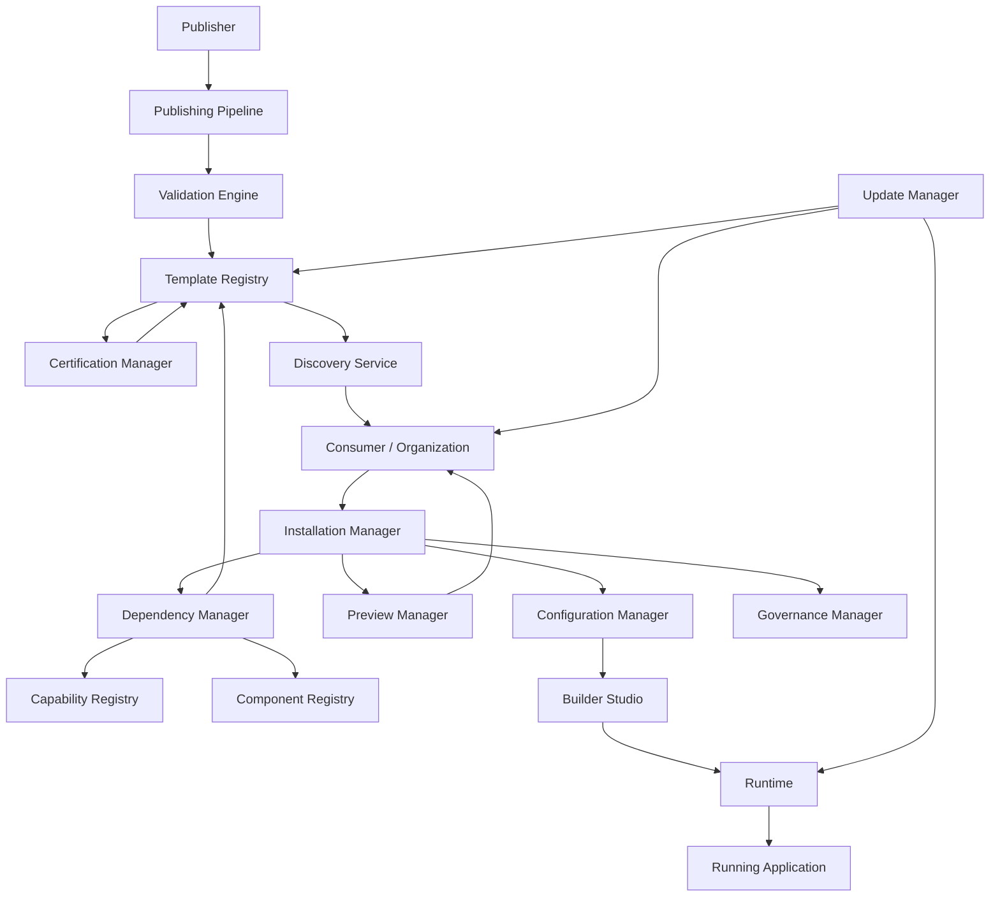
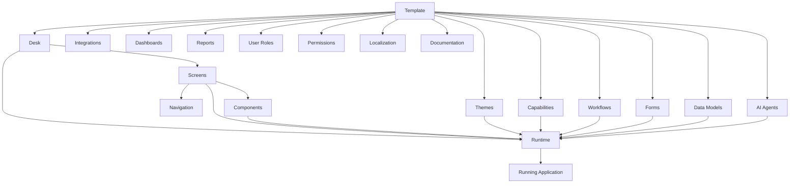
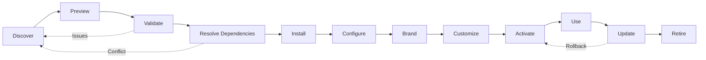
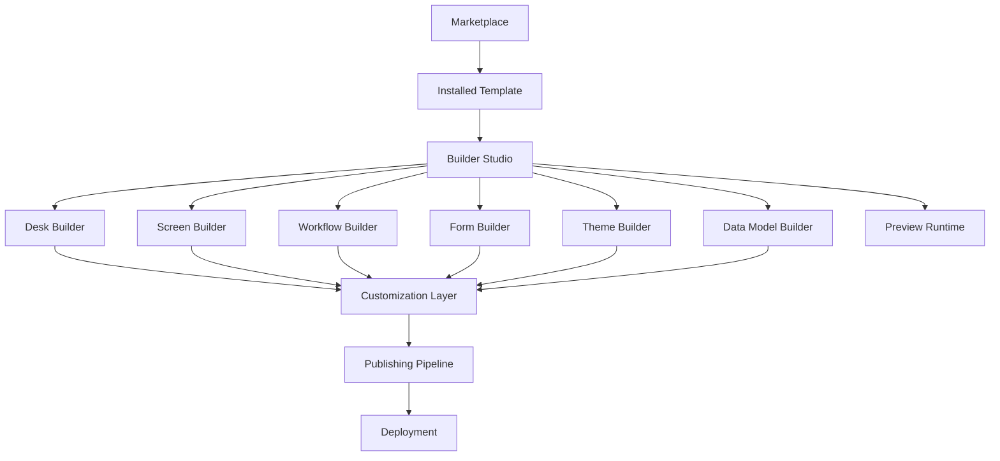
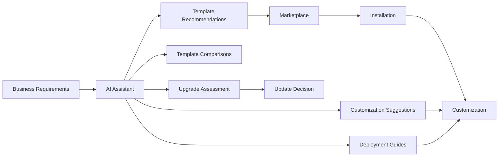

# Template Marketplace

**KB-038 — Template Marketplace Specification**

| Metadata | |
|----------|---|
| **KB ID** | KB-038 |
| **Title** | Template Marketplace |
| **Version** | 0.1.0 |
| **Status** | Drafting |
| **Owner** | Architecture Team |
| **Dependencies** | KB-032 Marketplace Architecture, KB-033 Package & Artifact Specification, KB-022 Builder Studio Architecture, KB-023 Desk Builder, KB-031 Publishing Pipeline, KB-030 Validation Engine, KB-008 Runtime Overview |
| **Related Documents** | Marketplace Architecture (KB-032), Package & Artifact Specification (KB-033), Capability Marketplace (KB-035), Component Marketplace (KB-036), Theme Marketplace (KB-037), Builder Studio Architecture (KB-022), Desk Builder (KB-023), Publishing Pipeline (KB-031), Validation Engine (KB-030), Runtime Overview (KB-008), Extension & Plugin Framework (KB-034), Market Certification & Trust (KB-039), Distribution & Lifecycle (KB-040) |
| **Review Status** | Pending |
| **Last Updated** | 2026-07-10 |

### Revision History

| Version | Date | Author | Change |
|---------|------|--------|--------|
| 0.1.0 | 2026-07-10 | AI Architecture Agent | Initial draft |

---

## 1. Purpose

The Template Marketplace is the Marketplace subsystem responsible for publishing, discovering, certifying, installing, configuring, customizing, upgrading, governing, and retiring reusable application templates across the DUKADESK platform. A Template represents a complete or partial application blueprint composed of multiple reusable platform artifacts — Desks, Screens, Components, Themes, Workflows, Forms, Data Models, Capabilities, Integrations, AI Agents, and supporting resources.

Reusable application templates exist because building production-ready business software from scratch is expensive and slow. Every ERP, CRM, POS, or industry-specific solution requires the same foundational decisions — navigation structure, screen layouts, data models, user roles, permission schemes, workflow patterns, and visual identity. Without templates, every organization repeats these decisions, duplicating effort and introducing inconsistency. The Template Marketplace makes complete, production-ready business solutions available to every organization.

Organizations should begin from complete business solutions rather than blank projects because a template provides a proven starting point that encodes years of domain expertise. A hospital deploying a patient portal should not start by designing a navigation system, building a patient data model, and configuring appointment workflows from scratch. They should start with a Healthcare Patient Portal template that includes all of these decisions, then customize branding, localization, and specific workflows for their organization. Starting from a template reduces time-to-value from months to days.

Templates improve delivery speed and consistency because they capture best practices, architectural decisions, and domain conventions in a reusable package. Every organization that installs the same template benefits from the same proven foundation. Template updates propagate improvements to all consuming organizations simultaneously, ensuring that the entire ecosystem improves together.

Templates remain customizable after installation because they compose existing platform artifacts rather than embedding them. A template declares which Desks, Screens, Components, Themes, Capabilities, Workflows, Forms, and Data Models it requires. After installation, each artifact remains individually editable through Builder Studio. Organizations customize templates through configuration, branding, and targeted modifications — not through forking and diverging.

Templates are Marketplace assets rather than Builder projects because distribution through the Marketplace provides discoverability, certification, version management, dependency resolution, update propagation, and governance. A Builder project is a single organization's work product. A Marketplace template is a reusable asset certified for distribution across the ecosystem. The distinction enables organizations to consume templates from trusted publishers while maintaining their own customization layer.

---

## 2. Template Marketplace Philosophy

### Solution-First Development

Templates embody a solution-first approach to application development. Instead of starting from individual components and assembling them into a solution, organizations start from a complete solution and customize downward. Solution-first development ensures that the end-to-end application architecture is coherent from the start — navigation, data flow, permissions, and workflows are designed together rather than assembled organically.

### Composition Over Duplication

Templates compose existing platform artifacts rather than redefining them. A template does not ship its own copy of a Desk — it declares a reference to a Desk definition. When the Desk definition is updated in the platform, all templates that reference it benefit from the update. Composition over duplication ensures that templates remain lightweight, upgradeable, and consistent with the platform.

### Customization Without Modification

Organizations customize templates through configuration, branding, and extension — not through source modification. Configuration changes (branding colors, organization name, feature flags) are stored separately from the template definition. Extensions (custom workflows, additional screens, supplementary data models) are layered on top of the template. This separation ensures that template updates can be applied without overwriting customizations.

### Enterprise Readiness

Templates are designed for enterprise deployment from day one. Every template includes role definitions, permission schemes, audit configurations, and governance policies. Templates support multi-tenant deployment, organization-level configuration inheritance, and compliance attestation. Enterprise readiness is a certification requirement, not an optional feature.

### Modular Architecture

Templates are modular — organizations can install a template and selectively enable or disable its constituent artifacts. A full-suite ERP template may include financials, inventory, procurement, and HR modules. An organization may install the full template but activate only financials and inventory, adding HR later. Modular architecture supports incremental adoption.

### Upgrade-Aware Templates

Templates are designed for evolution. Template publishers release updates — new features, bug fixes, compliance updates, platform compatibility — and consuming organizations apply these updates at their own pace. Templates include migration paths that preserve customizations across upgrades. Upgrade-aware templates prevent the ecosystem from fragmenting into unmaintained forks.

### AI-Assisted Solution Discovery

AI agents assist organizations in discovering, comparing, and selecting templates. Organizations describe their business requirements in natural language, and the AI recommends matching templates, explains architectural trade-offs, and suggests customization paths. AI-assisted discovery reduces the evaluation effort for organizations navigating a growing template ecosystem.

### Marketplace Certification

Every template undergoes certification before appearing in the Marketplace. Certification validates template quality, documentation completeness, dependency correctness, security posture, and platform compatibility. Certified templates receive a certification badge that signals quality and trustworthiness to consuming organizations.

### Governance by Default

Templates include governance configurations — approval workflows for template installation, update policies for consuming organizations, compliance reporting, and audit logging. Governance by default ensures that organizations adopting templates maintain control over their application ecosystem without additional configuration effort.

### Technology Independence

Templates are defined in implementation-independent metadata. A template definition describes artifacts, dependencies, configurations, and constraints without referencing specific rendering technologies, programming languages, or infrastructure. Technology independence ensures that templates remain valid across platform evolution and deployment environments.

---

## 3. Marketplace Responsibilities

### Responsibilities of the Template Marketplace

**Template Publishing** — Receive, validate, certify, and index template packages from publishers. Publishing includes dependency validation, compatibility verification, metadata extraction, and search indexing.

**Discovery** — Provide search, browse, filter, and recommendation interfaces for organizations to find templates. Discovery surfaces template metadata, documentation, ratings, and compatibility information.

**Preview** — Generate interactive previews of templates in their default configuration. Preview enables organizations to evaluate templates before installation — exploring screens, navigation, workflows, and branding.

**Installation** — Orchestrate the end-to-end installation of a template, including dependency resolution, artifact extraction, registry registration, configuration initialization, and activation.

**Configuration** — Provide configuration interfaces for template-level settings — organization name, branding, feature selection, capability selection, and localization.

**Dependency Resolution** — Resolve the complete dependency graph of a template, including transitive dependencies across Capabilities, Components, Themes, and platform versions. The Dependency Manager ensures that all dependencies are compatible before installation proceeds.

**Version Management** — Maintain version history for every template, support semantic versioning, manage upgrade paths, and provide rollback capability.

**Updates** — Detect, notify, and apply template updates. Updates include template definition changes, dependency updates, and platform compatibility updates. Update Manager preserves customizations during upgrades.

**Certification** — Certify templates against platform quality, security, accessibility, and compatibility standards. Certification is a prerequisite for Marketplace listing.

**Retirement** — Manage template deprecation and retirement. Retired templates are removed from discovery but remain available for existing consumers. Retirement includes migration guidance and sunset timelines.

**Analytics** — Collect and expose template adoption metrics, usage patterns, update adoption rates, and quality indicators.

### Responsibilities of Builder Studio

Builder Studio is responsible for template customization, not template discovery or installation. After a template is installed through the Marketplace, Builder Studio opens the template's Desks, Screens, Workflows, Forms, and Data Models for editing. Builder Studio is the customization environment; the Marketplace is the distribution environment.

### Responsibilities of the Runtime

The Runtime is responsible for executing templates as running applications, not for managing template lifecycle. After a template is installed, configured, and activated, the Runtime renders the resulting Desks, resolves themes, executes workflows, and manages application state. The Runtime is template-unaware — it treats all installed Desks identically regardless of their origin.

---

## 4. Template Marketplace Architecture

### 4.1 Template Registry

| Aspect | Description |
|--------|-------------|
| **Purpose** | Central catalog of all published templates with their metadata, versions, dependencies, and certification status. |
| **Responsibilities** | Store template metadata and version history, index templates for search, manage template lifecycle states (draft, published, deprecated, retired), serve template metadata to all other modules. |
| **Inputs** | Publishing Pipeline output, Certification Manager decisions, Update Manager results. |
| **Outputs** | Template metadata, version history, search results, compatibility information. |
| **Extension points** | Custom metadata fields, webhook notifications on state changes, external catalog synchronization. |

### 4.2 Discovery Service

| Aspect | Description |
|--------|-------------|
| **Purpose** | Enable organizations to find, compare, and evaluate templates through search, browse, filtering, and AI-assisted recommendations. |
| **Responsibilities** | Full-text search across template metadata, faceted browsing by category/industry/publisher, AI-assisted natural language recommendations, featured and trending template curation, organization-specific catalog filtering. |
| **Inputs** | Template Registry data, organization context, AI recommendation models. |
| **Outputs** | Search results, browse categories, recommendations, preview links. |
| **Extension points** | Custom ranking algorithms, organization-specific recommendation models, external search integration. |

### 4.3 Preview Manager

| Aspect | Description |
|--------|-------------|
| **Purpose** | Generate interactive previews of templates in isolation, enabling evaluation before installation. |
| **Responsibilities** | Provision isolated preview environments, render template Desks with default configuration, demonstrate key screens and workflows, generate screenshot galleries and walkthrough videos, surface documentation and architecture overviews. |
| **Inputs** | Template package, template metadata, Preview Runtime. |
| **Outputs** | Interactive preview, screenshots, documentation, architecture summary. |
| **Extension points** | Custom preview renderers, environment-specific preview configurations, demo data generation. |

### 4.4 Installation Manager

| Aspect | Description |
|--------|-------------|
| **Purpose** | Orchestrate the end-to-end installation of templates into target environments. |
| **Responsibilities** | Validate organization eligibility and licensing, resolve and install all dependencies, extract template artifacts, register templates with target environment registries, initialize configuration, activate template, report installation status. |
| **Inputs** | Template package, installation target, organization context, licensing data. |
| **Outputs** | Installed template, registered artifacts, configuration store entries, activation confirmation. |
| **Extension points** | Custom installation strategies, pre/post-installation hooks, integration with external deployment systems. |

### 4.5 Configuration Manager

| Aspect | Description |
|--------|-------------|
| **Purpose** | Manage template-level configuration — organization identity, branding, feature flags, capability selection, localization settings, and integration credentials. |
| **Responsibilities** | Present configuration interfaces during and after installation, store configuration separately from template definition, validate configuration values, apply configuration changes to running Desks, support configuration export/import for multi-environment deployment. |
| **Inputs** | Template configuration schema, organization preferences, user configuration input. |
| **Outputs** | Applied configuration, configuration store, configuration validation results. |
| **Extension points** | Custom configuration editors, configuration validation rules, configuration migration scripts. |

### 4.6 Dependency Manager

| Aspect | Description |
|--------|-------------|
| **Purpose** | Resolve and manage the complete dependency graph of templates, including transitive dependencies across all artifact types. |
| **Responsibilities** | Resolve template dependency graph at installation and update time, verify version compatibility across all dependencies, detect and report conflicts, suggest resolution paths, deduplicate shared dependencies across multiple installed templates. |
| **Inputs** | Template package manifest, installed package state, platform version, available package versions. |
| **Outputs** | Resolved dependency graph, compatibility report, conflict diagnostics, resolution suggestions. |
| **Extension points** | Custom resolution strategies, dependency override policies, organization-specific mirror configurations. |

### 4.7 Certification Manager

| Aspect | Description |
|--------|-------------|
| **Purpose** | Certify templates against platform quality, security, accessibility, documentation, and compatibility standards. |
| **Responsibilities** | Validate template structure and metadata completeness, verify dependency declarations and compatibility, scan for security vulnerabilities, verify documentation and licensing, assess template quality against platform standards, assign certification level. |
| **Inputs** | Template package, Validation Engine report, security scan results, documentation review. |
| **Outputs** | Certification decision, certification level, certification report, certification badge. |
| **Extension points** | Custom certification rules, industry-specific certification standards, automated certification pipelines. |

### 4.8 Update Manager

| Aspect | Description |
|--------|-------------|
| **Purpose** | Manage template updates — detecting, notifying, and applying new versions while preserving customizations. |
| **Responsibilities** | Detect available updates for installed templates, notify organization administrators, verify update compatibility with current customizations, compute update diff and migration path, apply updates while preserving configuration and customizations, support rollback to previous versions, manage update schedules and policies. |
| **Inputs** | Template Registry, installed template state, customization layer, update policies. |
| **Outputs** | Update notifications, applied updates, rollback confirmations, customization compatibility reports. |
| **Extension points** | Custom update strategies, update policy providers, rollback handlers, pre/post-update hooks. |

### 4.9 Governance Manager

| Aspect | Description |
|--------|-------------|
| **Purpose** | Enforce organizational governance policies on template consumption — approval workflows, compliance checks, audit logging, and policy enforcement. |
| **Responsibilities** | Enforce installation approval workflows, verify template compliance with organizational policies, maintain audit log of all template operations, enforce update policies, manage template retirement and migration, generate compliance reports. |
| **Inputs** | Organization governance policies, template metadata, installed template state, user actions. |
| **Outputs** | Approval requests, compliance reports, audit logs, enforcement decisions. |
| **Extension points** | Custom policy providers, external compliance system integration, custom approval workflows. |

### 4.10 Diagnostics Manager

| Aspect | Description |
|--------|-------------|
| **Purpose** | Collect, store, and expose Template Marketplace operational metrics, error reports, and health status. |
| **Responsibilities** | Collect publish, install, update, and discovery metrics, track error rates and failure modes, monitor service health, expose diagnostics API, generate operational reports. |
| **Inputs** | Events from all other modules. |
| **Outputs** | Metrics, reports, health status, error logs. |
| **Extension points** | Custom metric collectors, report generators, monitoring integrations. |

---

## 5. Template Categories

### Business Starters

Complete business application templates for core business functions.

**CRM** — Customer relationship management templates including contact management, lead tracking, opportunity pipeline, activity history, email integration, reporting dashboards, and customer self-service portal.

**ERP** — Enterprise resource planning templates including financial management, supply chain, procurement, inventory, order management, and business intelligence. Full-suite ERP templates may be modular, allowing organizations to activate individual modules incrementally.

**POS** — Point-of-sale templates including transaction processing, payment integration, receipt generation, inventory lookup, customer display, employee management, shift management, and offline mode.

**Inventory** — Inventory management templates including stock tracking, warehouse management, bin location, transfer orders, stock counts, reorder automation, supplier management, and inventory analytics.

**Accounting** — Accounting templates including chart of accounts, general ledger, accounts payable/receivable, invoicing, expense management, bank reconciliation, financial reporting, and tax configuration.

**HR** — Human resources templates including employee directory, onboarding workflows, time-off requests, performance reviews, document management, training tracking, and HR reporting.

**Procurement** — Procurement templates including purchase requisition, purchase order management, vendor management, contract management, approval workflows, goods receipt, and procurement analytics.

### Industry Solutions

Domain-specific application templates designed for vertical markets.

**Healthcare** — Patient portal, appointment scheduling, electronic health records access, prescription management, telemedicine integration, billing, insurance verification, and compliance documentation.

**Education** — Student portal, course management, enrollment workflows, grade tracking, attendance management, learning management system integration, parent communication, and academic reporting.

**Agriculture** — Farm management, crop tracking, livestock management, supply chain traceability, weather integration, equipment maintenance, harvest planning, and compliance reporting.

**Hospitality** — Booking engine, property management, guest portal, housekeeping management, concierge services, event management, restaurant POS integration, and guest analytics.

**Retail** — E-commerce storefront, product catalog, shopping cart, order management, customer accounts, loyalty programs, omnichannel inventory, and retail analytics.

**Logistics** — Fleet management, route optimization, shipment tracking, warehouse operations, delivery management, driver portal, customer tracking portal, and logistics analytics.

**Manufacturing** — Production planning, bill of materials, work order management, quality control, equipment maintenance, shop floor dashboard, supply chain integration, and manufacturing analytics.

**Government** — Citizen portal, permit and license management, service request tracking, document management, public records, payment processing, compliance reporting, and accessibility compliance.

**Aviation** — Flight operations, crew management, maintenance tracking, passenger services, baggage handling, ground operations, compliance documentation, and aviation analytics.

**Maritime** — Vessel management, crew management, port operations, cargo tracking, compliance documentation, maintenance scheduling, voyage planning, and maritime analytics.

### Operational Solutions

Templates for managing day-to-day business operations and field activities.

**Project Management** — Project planning, task management, resource allocation, timeline tracking, budget management, team collaboration, client portal, and project analytics.

**Field Operations** — Field service management, technician dispatch, work order management, mobile data collection, customer communication, inventory in field, and field operations analytics.

**Asset Management** — Asset registry, maintenance scheduling, depreciation tracking, lifecycle management, audit trails, compliance documentation, and asset analytics.

**Customer Service** — Ticket management, knowledge base, customer portal, SLA tracking, agent workspace, omnichannel inbox, satisfaction surveys, and service analytics.

**Warehouse Operations** — Receiving, putaway, picking, packing, shipping, cycle counting, labor management, and warehouse analytics.

**Fleet Management** — Vehicle tracking, maintenance scheduling, fuel management, driver management, route optimization, compliance documentation, and fleet analytics.

### Smart Platform Solutions

Templates for IoT-enabled and autonomous system management.

**IoT Monitoring** — Device management, telemetry collection, alerting, dashboarding, predictive maintenance, and IoT analytics.

**UAV Operations** — Drone fleet management, mission planning, flight monitoring, payload management, data collection, compliance documentation, and operations analytics.

**Smart City** — Urban monitoring, traffic management, waste management, public safety, environmental monitoring, citizen engagement, and city analytics.

**Smart Factory** — Production monitoring, quality tracking, equipment health, energy management, predictive maintenance, and factory analytics.

**Energy Monitoring** — Energy consumption tracking, renewable generation monitoring, grid integration, demand forecasting, energy analytics, and sustainability reporting.

### Enterprise Accelerators

Foundation templates for common enterprise deployment patterns.

**Multi-tenant Starter** — Complete multi-tenant application architecture including tenant onboarding, tenant isolation, subscription management, tenant-specific branding, and tenant administration dashboards.

**White-label Starter** — White-label application architecture including partner onboarding, partner-specific branding, partner-managed customization, usage tracking, and partner portal.

**Compliance Starter** — Compliance-ready application architecture including audit logging, document retention, access control, compliance reporting, certification evidence collection, and regulatory update management.

**Organization Portal** — Employee portal including announcements, directory, document center, service requests, benefits information, company news, and integrations with HR, IT, and facilities systems.

**Internal Operations Suite** — Comprehensive internal operations platform including IT service management, facilities management, procurement requests, travel booking, expense reporting, and internal knowledge base.

---

## 6. Template Package Model

### Template Identity

| Field | Type | Required | Description |
|-------|------|----------|-------------|
| **templateId** | Identifier | Yes | Globally unique template identifier. |
| **name** | String | Yes | Human-readable template name. |
| **version** | String | Yes | Semantic version (MAJOR.MINOR.PATCH). |
| **publisher** | Publisher | Yes | Publisher identity and metadata. |

### Template Classification

| Field | Type | Required | Description |
|-------|------|----------|-------------|
| **category** | Enum | Yes | Template category from the defined taxonomy. |
| **industry** | String[] | No | Target industries for industry-specific templates. |
| **tags** | String[] | No | Categorization and search tags. |
| **description** | String | Yes | Human-readable description of the template's purpose, capabilities, and target audience. |

### Template Content

| Field | Type | Required | Description |
|-------|------|----------|-------------|
| **includedAssets** | AssetReference[] | Yes | References to all platform artifacts included in the template. |
| **requiredCapabilities** | Dependency[] | No | Capabilities required by the template. |
| **requiredThemes** | Dependency[] | No | Themes required by the template. |
| **requiredComponents** | Dependency[] | No | Component packages required by the template. |
| **runtimeRequirements** | Object | No | Minimum Runtime version, target platforms (mobile, web, desktop, kiosk). |
| **builderRequirements** | Object | No | Minimum Builder Studio version, required Builder plugins. |

### Template Trust

| Field | Type | Required | Description |
|-------|------|----------|-------------|
| **certificationStatus** | Enum | Yes | `uncertified`, `certified`, `verified`, `trusted`. |
| **certificationDate** | DateTime | No | When certification was granted. |
| **certificationLevel** | Enum | No | Certification level if certified. |
| **signature** | String | Yes | Publisher's digital signature over template contents. |

### Template Documentation

| Field | Type | Required | Description |
|-------|------|----------|-------------|
| **documentation** | URI[] | Yes | Links to template documentation — installation guide, customization guide, architecture overview, API references. |
| **supportInformation** | Object | No | Support contact, SLA, support portal URL. |
| **licensing** | Object | Yes | License type, terms URL, pricing model. |

### Template Configuration Schema

| Field | Type | Required | Description |
|-------|------|----------|-------------|
| **configurationSchema** | Object | Yes | JSON Schema defining configuration options exposed to consuming organizations. |
| **brandingSchema** | Object | No | JSON Schema for branding configuration — logo, colors, fonts. |
| **localizationSchema** | Object | No | JSON Schema for localization configuration — supported locales, default locale, translation overrides. |
| **featureSchema** | Object | No | JSON Schema for feature selection — which template features are enabled by default and which are optional. |

*Conforms to the Package & Artifact Specification (KB-033) for package structure, artifact format, and metadata conventions.*

---

## 7. Template Composition

Templates compose existing platform artifacts rather than redefining them. Each artifact is referenced by its package identifier and version constraint. The template's composition declaration specifies which artifacts are included and how they integrate into the resulting application.

### Desks

Templates include one or more Desk definitions that establish the top-level application containers. A CRM template may include a Sales Desk, a Customer Service Desk, and a Marketing Desk. Desk definitions reference the screens, navigation structures, and capabilities that constitute each Desk.

### Screens

Templates include screen definitions that populate each Desk. Screens include their layout structure, component references, data bindings, and action configurations. Templates may include dozens of screens composing a complete application flow — from login dashboards to detailed transaction forms.

### Navigation

Templates include navigation structures that define how users move through the application. Navigation includes tab bars, side menus, breadcrumbs, wizards, and contextual navigation. Templates define navigation at the Desk level, screen level, and workflow level.

### Components

Templates reference component packages from the Component Marketplace rather than defining new components. A POS template references the Product Grid, Cart, Payment Form, and Receipt components from the Marketplace. Component references include version constraints ensuring compatibility.

### Themes

Templates reference theme packages from the Theme Marketplace. Templates may include a recommended theme and allow organizations to substitute their own theme during installation. The template's visual identity is defined by theme reference, not by hardcoded styles.

### Workflows

Templates include workflow definitions that encode business processes — approval chains, onboarding sequences, order fulfillment, incident response. Workflows reference capability actions and form submissions, composing process logic from declarative step definitions.

### Forms

Templates include form definitions for data entry patterns specific to the template's domain — patient intake, purchase order, timesheet submission, incident report. Forms reference data models for structure and validation.

### Data Models

Templates include data model definitions that establish the template's data architecture. A CRM template includes Contact, Account, Opportunity, Lead, and Activity data models. Data model definitions include fields, relationships, validation rules, and data source bindings.

### Capabilities

Templates include or reference capability packages from the Capability Marketplace. A full-suite ERP template may include Financials, Inventory, Procurement, and HR capabilities. Templates may include capabilities directly or reference externally published capabilities.

### Integrations

Templates include integration configurations that connect the template to external systems. Integration configurations reference Connectors, API Integrations, and Authentication Providers — connecting the template to payment gateways, email services, SMS providers, analytics platforms, and enterprise systems.

### AI Agents

Templates include AI agent definitions that provide intelligent assistance within the application. A Customer Service template includes an AI agent for automated ticket triage, response suggestion, and knowledge base search. AI agent definitions include prompt configurations, knowledge base references, and permission boundaries.

### Dashboards

Templates include dashboard definitions that provide operational visibility. Dashboards aggregate data from the template's capabilities and data models into visualizations — KPIs, charts, tables, activity feeds. Dashboard definitions include layout, data sources, visualization components, and refresh policies.

### Reports

Templates include report definitions for structured data analysis and export. Reports define data sources, filters, grouping, aggregation, and output formats. Templates may include scheduled report delivery configurations.

### Sample Data

Templates may include sample data sets that demonstrate the template in action — sample customers, products, orders, transactions, and users. Sample data is loaded during installation and clearly marked as non-production. Sample data includes clear removal instructions for production deployment.

### User Roles

Templates define user roles appropriate to the application domain. A Healthcare template includes Doctor, Nurse, Administrator, Patient, and Billing roles. Role definitions include permission sets, screen access, action authorization, and data visibility boundaries.

### Permissions

Templates include permission configurations that control access to screens, actions, workflows, data entities, and administrative functions. Permissions are role-based and may include hierarchical inheritance and tenant-scoped overrides.

### Localization Resources

Templates include localization resources — translation files, locale-specific formatting rules, date/time/number conventions, and RTL layout support. Templates declare their base locale and supported locales.

### Documentation

Templates include comprehensive documentation: installation guide, configuration guide, customization guide, user manual, architecture overview, API references, and FAQ. Documentation is distributed with the template and accessible through Builder Studio and the Runtime.

---

## 8. Installation Lifecycle

### Discover

Organizations discover templates through the Marketplace discovery interface — searching by category, industry, use case, or natural language description. Discovery surfaces template metadata, ratings, compatibility information, and preview links.

### Preview

Organizations evaluate templates through interactive previews. The Preview Manager provisions an isolated environment running the template with default configuration. Organizations explore screens, test workflows, review data models, and assess the template's fit for their requirements.

### Validate

Before installation, the system validates the template against the target environment — checking platform version compatibility, dependency availability, licensing eligibility, and organizational policy compliance. Validation reports any issues that would prevent successful installation.

### Resolve Dependencies

The Dependency Manager resolves the complete dependency graph — all Desks, Screens, Components, Themes, Capabilities, Workflows, Forms, Data Models, and their transitive dependencies. Resolution verifies version compatibility, detects conflicts with already-installed artifacts, and computes the minimal set of installations required.

### Install

The Installation Manager executes the installation — downloading the template package, installing all dependencies, registering artifacts with their respective registries, loading sample data, creating default roles and permissions, and initializing the configuration store. Installation is transactional — if any step fails, the entire installation is rolled back.

### Configure

Organizations configure the template through the Configuration Manager — setting organization name, branding colors, logo, contact information, default locale, feature flags, and capability selections. Configuration values are stored separately from the template definition, ensuring they survive template updates.

### Brand

Organizations apply their brand identity — selecting or substituting themes, uploading logos, configuring color schemes, setting typography, and customizing the application's visual identity. Branding is applied at the organization or tenant level and can differ across deployment environments.

### Customize

Organizations customize the template through Builder Studio — modifying screens, extending data models, adding workflows, creating custom components, and integrating additional capabilities. Customizations are stored in a customization layer that overlays the template definition. The customization layer is preserved during template updates.

### Activate

The activated template becomes a running application. The Installation Manager registers the template with the target environment, activates all Desks, deploys workflows, and makes the application available to users. Activation may be staged — deploying to staging environments before production.

### Use

Users interact with the running application through the Runtime. The template's Desks, Screens, Workflows, and Capabilities operate as any native DUKADESK application would. The Runtime is template-unaware — it renders Desks identically regardless of template origin.

### Update

When the template publisher releases updates, the Update Manager detects the available update, verifies compatibility with the organization's customizations, computes the migration path, and notifies administrators. Updates are applied with the customization layer preserved. Administrators may schedule updates, test them in staging environments, and roll back if issues arise.

### Retire

When a template is deprecated or retired, the Governance Manager notifies consuming organizations, provides migration guidance, and enforces retirement timelines. Retired templates remain installed and functional but no longer receive updates. Organizations are expected to migrate to successor templates or custom implementations.

---

## 9. Configuration & Customization

### Configuration

Configuration refers to parameterized settings that modify the template's behavior and appearance without altering its structure. Configuration is stored separately from the template definition and applied at installation or runtime.

**Branding** — Organization name, logo, favicon, color palette, typography, spacing, and icon set. Branding configuration is applied through the Theme Engine and affects all screens and components in the template.

**Organization Information** — Organization name, address, contact details, timezone, date/number formatting, and legal identifiers. Organization information is used throughout the application — headers, footers, reports, invoices, and communications.

**Localization** — Default locale, supported locales, language selection, translation overrides, and locale-specific formatting. Localization configuration affects all user-facing text, date/time displays, number formatting, and RTL layout.

**Feature Selection** — Enablement or disablement of optional template features. An ERP template may allow organizations to enable Financials without enabling HR. Feature selection affects which screens, capabilities, and navigation items appear in the resulting application.

**Capability Selection** — Selection of which capabilities to activate. A full-suite template may include multiple capabilities that organizations can activate independently. Capability selection determines which functional modules are available.

**Theme Selection** — Choice of theme from the organization's available themes. Templates may recommend a default theme but allow substitution. Theme selection affects the entire application's visual identity.

### Customization

Customization refers to structural modifications that extend or modify the template's artifacts. Customizations are stored in a customization layer that overlays the template definition, ensuring that template updates do not overwrite organizational changes.

**Workflow Customization** — Modification of workflow definitions — adding steps, changing conditions, reassigning approvers, modifying notifications. Workflow customizations are stored as overlays that reference the original workflow definition and apply targeted changes.

**Form Customization** — Modification of form definitions — adding or removing fields, changing validation rules, rearranging layout, updating data bindings. Form customizations are stored as overlays that preserve the original form structure while applying targeted modifications.

**Data Model Extensions** — Extension of data model definitions — adding custom fields, creating new relationships, adding validation rules. Data model extensions are additive, never modifying existing field definitions in ways that would break compatibility with the template.

**Screen Customization** — Modification of screen layouts — adding or removing components, changing layout structure, updating data bindings, modifying action configurations. Screen customizations are stored as overlays.

**Permission Configuration** — Modification of role definitions and permission sets — adding custom roles, modifying permission scopes, creating tenant-specific overrides. Permission configurations are organization-specific and stored separately from the template.

### Distinction Between Configuration and Structural Modification

Configuration changes parameterized values within the template's defined boundaries. Configuration never creates new artifacts, changes artifact structure, or modifies the template's data model. Configuration is safe, reversible, and guaranteed to survive template updates.

Customization creates new artifacts or modifies existing artifact definitions. Customization is powerful but carries upgrade implications — customized artifacts may need migration when the template updates. The Template Marketplace's update machinery is designed to detect and preserve customizations, but organizations should understand the distinction when deciding whether to configure or customize.

---

## 10. Runtime Integration

### Desk Resolution

When a template is installed, its Desk definitions are registered with the Runtime through the Manifest Resolver. The Runtime discovers installed Desks through the same mechanism as any other Desk — there is no template-specific resolution path. Template-installed Desks are indistinguishable from natively built Desks.

### Capability Registration

Template-required capabilities are registered with the Capability Registry during installation. Capabilities loaded through template installation behave identically to capabilities installed individually — they provide screens, actions, workflows, and configuration interfaces to the Runtime.

### Theme Resolution

Template-configured themes are resolved by the Theme Engine. The Theme Engine applies branding configuration — organization colors, logos, typography — identically regardless of whether the theme was installed through a template or individually.

### Component Resolution

Template-required components are registered with the Component Registry during installation. The Screen Renderer resolves components by their registry identifier, not by their template origin. Components installed through templates appear in the Screen Builder palette, the Runtime rendering pipeline, and the component inspector identically.

### Workflow Execution

Template-installed workflows are executed by the Workflow Engine. Workflows are triggered by events, user actions, or scheduled conditions — the Workflow Engine treats all workflows identically. Template origin is transparent to workflow execution.

### Navigation

Template-installed navigation structures are resolved by the Navigation Engine. Navigation definitions — tabs, menus, drawers, wizards — are composed from the installed Desks and screens. The Navigation Engine is unaware of whether the navigation came from a template or was built directly.

### State Management

Template-installed Desks use the platform's state management — Zustand stores, Form Data Context, and application state. State management is template-agnostic. Organizations can extend state with custom stores that coexist with template-defined stores.

### Event Bus

Template-installed components, capabilities, and workflows communicate through the platform Event Bus. Events are routed by event type and payload, not by template origin. Template-defined events can be consumed by organization-customized handlers, and vice versa.

### Runtime Independence

The Marketplace and Runtime are independent. The Template Marketplace distributes templates; the Runtime executes the resulting Desks. They interact through registries and configuration, not through direct coupling. An application built from a template is identical to a custom-built application from the Runtime's perspective.

---

## 11. Builder Integration

### Desk Builder

Installed templates appear as editable projects in the Desk Builder. Organizations can modify Desk structure — adding, removing, or reordering screens, modifying navigation, and configuring Desk-level settings. Desk Builder edits are stored in the customization layer, preserving the original template definition.

### Screen Builder

Template screens are fully editable in the Screen Builder. Organizations can modify screen layouts, add or remove components, update data bindings, configure actions, and adjust responsive behavior. Screen Builder edits are overlay-based and preserved during template updates.

### Workflow Builder

Template workflows are editable in the Workflow Builder. Organizations can add steps, modify conditions, change approvers, update notifications, and extend error handling. Workflow customizations are stored as overlays referencing the original workflow.

### Form Builder

Template forms are editable in the Form Builder. Organizations can add fields, modify validation, rearrange layout, and update data bindings. Form customizations are overlay-based.

### Theme Builder

Template themes can be customized through the Theme Builder. Organizations can adjust color schemes, typography, spacing, and component styles. Theme customizations are stored as theme extensions that reference the original theme.

### Data Model Builder

Template data models can be extended through the Data Model Builder. Organizations can add custom fields, create new relationships, and add validation rules. Data model extensions are additive and stored separately from the template definition.

### Preview Runtime

The Preview Runtime enables organizations to preview their customizations before deploying to production. Preview Runtime instances are created from the template plus the organization's customization layer. Organizations can verify that customizations are compatible with upcoming template updates.

### Customization Layer

All Builder Studio edits are stored in a customization layer that sits between the template definition and the Runtime. The customization layer records only the changes made by the organization — it does not duplicate the entire template. This architecture ensures that template updates can be applied by replacing the template definition while leaving the customization layer intact.

---

## 12. Marketplace Integration

### Marketplace Architecture

The Template Marketplace is a subsystem within the overall Marketplace Architecture. It delegates shared concerns — package storage, search indexing, licensing, user identity — to the Marketplace core while maintaining template-specific logic for composition, customization, and governance.

### Publishing Pipeline

Templates are published through the Publishing Pipeline. The pipeline validates the template package, runs Validation Engine checks, extracts metadata, and delivers the certified template to the Template Registry. Publishing a template follows the same pipeline as publishing any other asset type, with template-specific validation rules.

### Validation Engine

The Validation Engine validates template packages during publishing and installation. Template-specific validation rules include: verifying that all referenced artifacts exist and are compatible, validating the configuration schema, checking that sample data conforms to data model definitions, and confirming documentation completeness.

### Package Specification

Template packages conform to the Package & Artifact Specification. The template package format extends the base package format with template-specific metadata — composition declarations, configuration schema, branding schema, feature definitions, and customization boundaries.

### Capability Marketplace

Templates may reference capability packages from the Capability Marketplace. The Dependency Manager resolves capability dependencies during installation. Capabilities included in a template are installed through the same mechanism as individually installed capabilities — they are registered with the Capability Registry and available for use across the organization.

### Component Marketplace

Templates may reference component packages from the Component Marketplace. Component dependencies are resolved and installed during template installation. Components included in a template are registered with the Component Registry and available for use in the Screen Builder.

### Theme Marketplace

Templates may reference theme packages from the Theme Marketplace. Theme dependencies are resolved during installation. Organizations may accept the template's recommended theme or substitute their own.

### Publication Process

Publishers submit templates through the Publishing Pipeline. The pipeline:
1. Validates template structure and metadata.
2. Verifies that all referenced artifacts exist and are compatible.
3. Executes Validation Engine checks.
4. Packages the template artifacts.
5. Submits to the Certification Manager.
6. Upon certification, registers the template in the Template Registry.
7. Indexes the template for discovery.

### Update Process

Template updates follow the same pipeline as initial publication, with additional verification that the update is compatible with existing installed versions. The Update Manager computes the diff between versions and verifies that the migration path preserves existing customizations.

---

## 13. AI Integration

### Recommend Templates

The AI Assistant analyzes an organization's business requirements, industry, scale, and existing platform investments to recommend matching templates. Organizations describe their needs in natural language — "I need a pharmacy management system with prescription handling and insurance billing" — and the AI returns ranked template recommendations with explanations of why each template matches.

### Compare Templates

The AI Assistant compares multiple templates side by side — feature coverage, architectural approach, included capabilities, required dependencies, certification level, pricing, and community ratings. The AI highlights differences that matter for the organization's specific context, such as which templates support their required locale or integrate with their existing systems.

### Suggest Customizations

After a template is installed, the AI Assistant analyzes the organization's usage patterns and suggests customizations — adding screens for frequently accessed data, creating workflows for common processes, or configuring dashboards for key metrics. Suggestions are specific to the template and the organization's context.

### Recommend Missing Capabilities

The AI Assistant analyzes the organization's installed templates and recommends additional capabilities that complement their current deployment. An organization with the CRM template installed may be recommended to add the Email Integration and Customer Portal capabilities.

### Generate Deployment Guides

The AI Assistant generates deployment guides specific to the organization's environment — installation steps, configuration recommendations, customization guidance, testing scripts, and go-live checklists. Deployment guides incorporate the template's documentation, the organization's configuration choices, and platform best practices.

### Explain Template Architecture

The AI Assistant explains template architecture in plain language — how the template's Desks relate to each other, which capabilities provide which features, how data flows through the system, and how workflows connect screens and processes. Architectural explanations help organizations understand the template before installation and guide customization after installation.

### Recommend Upgrades

When template updates are available, the AI Assistant analyzes the organization's customizations and assesses upgrade compatibility. The AI explains what changed in the new version, whether customizations are affected, and what migration steps are needed. Organizations make informed decisions about when to upgrade.

### AI Integration Principles

- AI recommendations are advisory, not authoritative.
- AI recommendations do not override compatibility, trust, or certification requirements.
- AI-generated comparisons and explanations are clearly labeled as AI-generated.
- AI-assisted discovery supplements but does not replace structured search and filtering.
- AI recommendations respect organizational governance policies — the AI does not suggest templates that violate organizational policies.

---

## 14. Security

### Trusted Publishers

Every template publisher has a verified identity before submitting templates. Identity verification includes email verification, organization domain verification, or platform-issued publisher credentials. Publisher identity is attached to every template and visible to consuming organizations.

### Template Integrity

Every published template is digitally signed by the publisher. Signing provides integrity verification, publisher authentication, and non-repudiation. The Marketplace verifies signatures before accepting and serving templates.

### Package Signing

Template packages are signed at the package level and optionally at the individual artifact level. Signing covers template metadata, all included artifact references, configuration schemas, and supporting resources. Consumers can verify template integrity before installation.

### Organization Approval

Organizations may require approval before templates can be installed in their environments. Approval workflows include submission, review, approval or rejection, and audit logging. Approvers review template metadata, dependencies, certification status, and security assessments.

### Tenant Isolation

Template installation respects tenant boundaries. Data, configuration, and customizations are scoped to the installing tenant. Multi-tenant templates include tenant-specific configuration stores and tenant isolation guarantees.

### Audit Logging

All template operations are logged: publishing, certification, installation, configuration, customization, update, rollback, and retirement. Logs include publisher identity, consumer identity, template identity, operation type, timestamp, and result. Audit logs are tamper-evident and retained according to organizational policies.

### Secure Configuration

Template configuration interfaces enforce input validation, output encoding, and secure storage of sensitive values. Configuration secrets — API keys, connection strings, credentials — are stored encrypted and never exposed in logs, error messages, or configuration exports.

### Dependency Security

Template dependencies are verified for known vulnerabilities before installation. The Dependency Manager checks dependency packages against vulnerability databases and blocks installation if known vulnerabilities are found without remediation. Organizations may configure vulnerability tolerance policies.

---

## 15. Licensing

### License Types

| Type | Description |
|------|-------------|
| **Free** | No-cost template. Free to use, may include restrictions on commercial use or redistribution. |
| **Commercial** | Paid license. Template usage requires purchase. Pricing model defined by publisher — one-time fee, per-instance, or per-organization. |
| **Subscription** | Template usage requires active subscription. Subscription management integrated with Marketplace. Includes updates and support during active subscription. |
| **Enterprise** | Enterprise-wide license. Usage governed by enterprise agreement. Includes all subsidiaries and departments. |
| **Internal** | Free to use within the publishing organization. Not available to external consumers. Used for internal distribution of proprietary templates. |
| **White-label** | Licensed for white-label distribution. Consuming organization may brand the template as their own and distribute to their customers. |
| **Evaluation** | Time-limited or feature-limited free evaluation. Converts to commercial, subscription, or enterprise license. |

### License Enforcement

License enforcement is metadata-based, not technical. The Marketplace records license acceptance. The Licensing Manager prevents installation without license acceptance. License compliance is the responsibility of the consuming organization. The Marketplace does not implement technical license enforcement mechanisms — those are the responsibility of the template itself if desired.

### License Metadata

Every template includes:
- **license**: License type identifier.
- **licenseUrl**: Link to full license terms.
- **pricingModel**: Description of pricing for commercial and subscription licenses (informational).
- **acceptanceRequired**: Whether explicit acceptance is required before installation.
- **supportTerms**: Support entitlement included with the license.

---

## 16. Performance

### Large Template Installation

Templates may include dozens of artifacts — multiple Desks, hundreds of Screens, numerous Capabilities, complex Workflows, and extensive Data Models. The Installation Manager optimizes large installations by parallelizing independent artifact installations, streaming package downloads, and reporting progress incrementally.

### Incremental Installation

When a template is installed into an environment that already has some of its dependencies installed, the Installation Manager installs only the missing artifacts. Incremental installation avoids redundant downloads and registration operations.

### Asset Reuse

When multiple installed templates share dependencies, the Dependency Manager deduplicates shared assets. Shared Desks, Components, Capabilities, and Themes are installed once and referenced by all consuming templates. Asset reuse reduces storage requirements and installation time.

### Shared Dependencies

The platform maintains a shared dependency cache. When a template is installed, the Installation Manager checks the shared cache before downloading. Dependencies already present in the cache are linked rather than re-installed. The shared cache is updated when dependencies are upgraded.

### Efficient Updates

Template updates are differential — only changed artifacts are downloaded and updated. The Update Manager computes the diff between the installed version and the target version, downloads only the deltas, and applies changes incrementally. Differential updates reduce bandwidth requirements and update duration.

### Installation Optimization

The Installation Manager uses parallel downloads, stream processing, and lazy artifact registration to optimize installation performance. Large artifacts (sample data, documentation) are downloaded in the background while essential artifacts (Desks, Screens, Capabilities) are registered immediately.

### Preview Performance

Template previews are provisioned with minimal startup time. The Preview Manager maintains a pool of warm preview environments, shares common dependencies across preview instances, and uses lazy loading for non-essential artifacts.

---

## 17. Observability

### Installation Metrics

Per-template installation tracking:
- Installation success and failure rates.
- Installation duration by phase (download, dependency resolution, registration, configuration, activation).
- Common installation failure modes.
- Installation cancellation rates.

### Usage Analytics

Aggregate template usage metrics:
- Active installations per version.
- Organization count per template.
- Industry distribution of template consumers.
- Geographic distribution of template consumers.
- Tenant count for multi-tenant templates.

### Adoption Metrics

Template adoption tracking:
- Installation rate over time.
- Time-to-install after publication.
- Trial-to-purchase conversion rate.
- Organization retention rate (templates still active after 30, 90, 180 days).

### Update Metrics

Update adoption tracking:
- Update adoption rate per version.
- Median time-to-update after release.
- Rollback rate per version.
- Customization compatibility rate (updates that applied without customization conflicts).

### Dependency Reports

Template dependency analytics:
- Most commonly used dependencies across templates.
- Dependency version distribution.
- Dependency conflict frequency.
- Shared dependency utilization rate.

### Template Health

Template health indicators:
- Certification status and history.
- Publisher activity (time since last update).
- Community rating trend.
- Issue report frequency and resolution time.
- Compatibility status with current platform version.

### Diagnostics

Marketplace health metrics:
- Template Registry query latency.
- Search result quality and relevance.
- Installation pipeline throughput.
- Preview provisioning latency.
- Update notification delivery rate.
- Error rates by operation type and template.

---

## 18. Anti-Patterns

### Monolithic Templates

Creating templates that bundle all possible functionality into a single, indivisible package is discouraged. Monolithic templates force organizations to accept features they do not need, create unnecessary dependencies, and complicate updates. Templates should be modular — organizations should be able to select which parts of a template to activate.

### Duplicate Capabilities

Including capability definitions in a template that duplicate capabilities already available in the Capability Marketplace is discouraged. Templates should reference Marketplace capabilities rather than redefining them. Duplicating capabilities creates maintenance burden, version inconsistency, and update conflicts.

### Hardcoded Branding

Embedding publisher branding — logos, colors, organization name — directly into template artifacts is prohibited. Templates must use theme references and configuration parameters for all visual identity elements. Hardcoded branding makes templates unusable for organizations that need their own brand identity.

### Embedded Organization Data

Including real organization data — customer records, transaction histories, employee information — in template sample data is prohibited. Sample data must be clearly synthetic and free of any real personally identifiable information, financial data, or confidential business information.

### Platform-Specific Assumptions

Making assumptions about the deployment platform, rendering technology, device capabilities, or infrastructure in template design is prohibited. Templates must be platform-agnostic. A template that assumes web deployment may break on mobile or kiosk platforms.

### Missing Documentation

Publishing templates without comprehensive documentation is prohibited. Templates are complex multi-artifact packages — consuming organizations cannot evaluate, install, configure, customize, or operate templates without documentation. Documentation is a certification requirement.

### Hidden Dependencies

Declaring incomplete or inaccurate dependencies is prohibited. Every dependency of the template — direct and transitive — must be declared in the template manifest. Hidden dependencies cause installation failures, runtime errors, and update conflicts.

### Unmaintained Templates

Publishing templates without commitment to maintenance is discouraged. Templates are long-lived assets. Consuming organizations depend on template updates for platform compatibility, security patches, and bug fixes. Publishers should establish maintenance commitments and communicate them to consumers.

### Breaking Customizations Without Migration

Publishing template updates that break existing customizations without providing migration paths is prohibited. Template updates must include migration scripts, documentation of breaking changes, and customization compatibility assessment. Organizations should be able to apply updates with confidence that their customizations are preserved.

### Template-as-Black-Box

Publishing templates that cannot be inspected, customized, or extended is prohibited. Templates are not black boxes — consuming organizations must be able to understand the template's architecture, inspect its artifacts, customize its behavior, and extend its functionality through Builder Studio.

---

## 19. Future Evolution

### AI-Generated Templates

AI agents that generate complete templates from natural language specifications — "Create a property management template with tenant portal, maintenance tracking, rent collection, and financial reporting." AI-generated templates are submitted for certification before distribution. The AI generates template metadata, artifact references, configuration schemas, and documentation from the specification.

### Industry Template Libraries

Curated libraries of industry-specific templates developed in partnership with industry associations, domain experts, and leading organizations in each vertical. Industry template libraries include certified templates, best practice guides, regulatory compliance configurations, and industry-specific component packs.

### Enterprise Private Template Catalogs

Dedicated template catalogs within enterprise boundaries. Enterprise private catalogs contain templates developed internally for the organization's specific needs, templates approved from the global Marketplace, and templates developed by partner organizations. Private catalogs support organizational governance, branding, and compliance requirements.

### Collaborative Template Development

Multi-publisher templates developed collaboratively by multiple organizations. A template may be published by a consortium — each member contributing capabilities, components, or domain expertise. Collaborative development enables templates that combine specialized knowledge from multiple publishers.

### Template Inheritance

Templates that extend other templates — inheriting Desks, Screens, Capabilities, and configurations from a parent template and adding or overriding artifacts. Template inheritance enables industry-specific variations of general templates. A Retail POS template may extend a General POS template, adding retail-specific capabilities and configurations.

### Dynamic Solution Assembly

AI-driven assembly of templates from component parts based on organization requirements. Instead of selecting a single template, organizations specify their requirements and the system dynamically composes a solution from multiple templates, capabilities, and components. Dynamic assembly enables solutions that match organizations' exact needs without the constraints of predefined template boundaries.

### Autonomous Solution Recommendations

AI agents that continuously monitor an organization's platform usage, growth patterns, and business context to recommend solution evolution — suggesting template upgrades, additional capabilities, complementary components, and integration opportunities. Autonomous recommendations become more precise over time as the AI learns the organization's patterns and preferences.

---

## 20. Relationship to Other Documents

| Document | Relationship |
|----------|--------------|
| **KB-032 — Marketplace Architecture** | Parent architecture defining the overall Marketplace system. The Template Marketplace is a specialized subsystem within this architecture. |
| **KB-033 — Package & Artifact Specification** | Defines the package format that Template packages conform to. Template packages extend the base format with template-specific metadata. |
| **KB-022 — Builder Studio Architecture** | Builder Studio is the customization environment for installed templates. This specification defines how templates integrate with Builder Studio's editors. |
| **KB-023 — Desk Builder** | Installed templates include Desk definitions editable through the Desk Builder. This specification defines the Desk composition layer in templates. |
| **KB-031 — Publishing Pipeline** | The Publishing Pipeline delivers validated template packages to the Marketplace for certification and distribution. This specification defines what happens after publication. |
| **KB-030 — Validation Engine** | The Validation Engine validates template packages during publishing and installation. Template-specific validation rules extend the Validation Engine. |
| **KB-008 — Runtime Overview** | The Runtime executes templates as running applications. Installed templates are Runtime-agnostic — the Runtime treats all Desks identically. |
| **KB-035 — Capability Marketplace** | Templates may reference capability packages. The Dependency Manager resolves capability dependencies during installation. |
| **KB-036 — Component Marketplace** | Templates may reference component packages. Component dependencies are resolved during installation. |
| **KB-037 — Theme Marketplace** | Templates may reference theme packages. Organizations may substitute themes during installation. |
| **KB-034 — Extension & Plugin Framework** | Templates may include or reference extensions. Extension integration follows the Extension Framework contracts. |
| **KB-039 — Marketplace Certification & Trust** | Defines the certification process and trust model for all Marketplace assets, including templates. |
| **KB-040 — Marketplace Distribution & Lifecycle** | Defines the package lifecycle — publishing, installation, updates, deprecation, and retirement — that templates follow. |

---

## Required Mermaid Diagrams

### Template Marketplace Architecture

### Template Composition

### Installation Lifecycle

### Builder Relationship

### AI Solution Recommendation

---

*This is KB-038, the Template Marketplace specification of the DUKADESK Engineering Knowledge Base. It defines the Template Marketplace as the authoritative ecosystem for reusable application solutions, establishing templates as composable collections of existing platform artifacts that integrate with Builder Studio, Runtime, Marketplace, Publishing Pipeline, Validation Engine, and AI services. Templates enable organizations to rapidly deploy production-ready business solutions while preserving flexibility for customization, branding, governance, and future evolution.*
