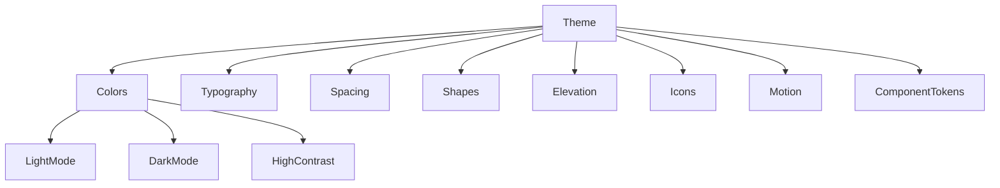
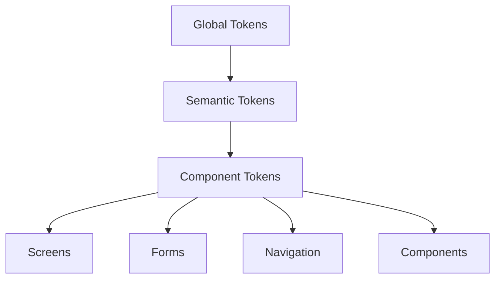
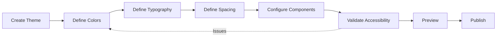
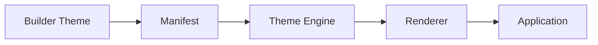

# Theme Builder

**KB-027 — Theme Builder Specification**

| Metadata | |
|----------|---|
| **KB ID** | KB-027 |
| **Title** | Theme Builder |
| **Version** | 0.1.0 |
| **Status** | Drafting |
| **Owner** | Architecture Team |
| **Dependencies** | KB-017 Theme Engine, KB-012 Component Registry, KB-013 Component Model, KB-022 Builder Studio Architecture |
| **Related Documents** | Builder Studio Architecture (KB-022), Desk Builder (KB-023), Screen & Layout Builder (KB-024), Theme Engine (KB-017), Component Registry (KB-012), Navigation Engine (KB-016), Form Builder (KB-026), Preview Runtime (KB-029) |
| **Review Status** | Pending |
| **Last Updated** | 2026-07-10 |

### Revision History

| Version | Date | Author | Change |
|---------|------|--------|--------|
| 0.1.0 | 2026-07-10 | AI Architecture Agent | Initial draft |

---

## 1. Purpose

The Theme Builder is the Builder Studio subsystem responsible for creating, customizing, organizing, validating, previewing, and maintaining visual themes across the DUKADESK platform. It enables users to define the complete visual identity of a Desk — colors, typography, spacing, shapes, elevations, icons, motion, and platform-specific adaptations — through visual editors and declarative configuration.

Themes should be authored visually because design is a visual discipline. Defining colors through hex code editors, typography through font pickers, and spacing through slider controls lets designers and developers collaborate on the same artifact without translating between design tools and code. The Theme Builder bridges the gap between design intent and platform configuration.

Theme authoring is separated from theme execution because design-time and runtime have different concerns. At design time, the Theme Builder provides visual editors, token browsers, live previews, accessibility checking, and export tools. At runtime, the Theme Engine resolves token values, computes derived tokens, and applies styling efficiently. Separating them means theme editing tools can evolve without affecting runtime performance.

Themes must be validated before publication because visual defects affect every screen and component in a Desk. An invalid color reference, a missing font file, a contrast violation, or an incomplete dark mode definition degrades the entire user experience. The Theme Builder validates themes continuously and prevents publication of invalid theme definitions.

---

## 2. Theme Philosophy

### Declarative Themes

Every theme is defined as structured data — a hierarchy of tokens organized by category, component, and state. There is no imperative styling code. Declarative themes are portable across platforms, testable for accessibility, and safe for AI generation.

### Design Token Architecture

Themes are built on a token architecture. At the foundation are global tokens (color palette, type scale, spacing units). Semantic tokens reference global tokens (primary color, heading font, card padding). Component tokens reference semantic tokens (button background, input border, card shadow). This layered architecture ensures consistency and simplifies global changes.

### Visual Editing

The primary interface for theme authoring is visual. Colors are edited with color pickers and palettes. Typography is configured with font selectors and size sliders. Spacing is adjusted with drag handles and numeric inputs. Token values are represented visually, not as code.

### Accessibility by Default

Every theme configuration is validated against accessibility standards. Color combinations are checked for contrast compliance. Typography is validated for readability at all sizes. Focus indicators are verified for visibility. Accessibility validation is built into the theme editor, not bolted on as a separate step.

### Platform-Aware But Platform-Independent

Themes define intent, not pixel-perfect output. A theme specifies "headline font size should be 2x the body size" — not "headline should be 32px on desktop and 24px on mobile." Platform-specific adaptations are handled by the Theme Engine and Renderer, not by the theme definition.

### Live Preview

Every theme change is reflected immediately in the Preview Runtime. Designers can see how a color change affects every screen, how a typography change affects every component, and how a spacing change affects every layout — all without leaving the Theme Builder.

### Reusability

Themes are first-class artifacts that can be exported, imported, shared, and versioned. A theme designed for one Desk can be applied to another with a single selection. Theme fragments (a color palette, a typography scale) can be shared as standalone assets.

### Version Awareness

Themes carry version metadata. Component tokens reference specific theme versions. A Desk pins its theme version to ensure consistent appearance across deployments. Theme updates are published through the same pipeline as other Desk artifacts.

### AI-Assisted Design

AI agents assist in theme creation by generating color palettes from brand guidelines, recommending typography pairings, suggesting spacing systems, and ensuring accessibility compliance. AI output is always editable and subject to human review.

---

## 3. What is a Theme?

### Formal Definition

A Theme is a structured, versioned collection of design tokens and visual configuration that defines the appearance of all screens, components, and surfaces within a DUKADESK Desk.

A Theme:

- **Defines the complete visual identity of a Desk.** A theme encompasses colors, typography, spacing, shapes, elevations, icons, motion, and platform-specific visual behavior. Every visual aspect of the application is governed by the theme.

- **Is structured as a token hierarchy.** Global tokens define raw values. Semantic tokens express design intent. Component tokens map intent to specific UI elements. The hierarchy ensures consistency and enables systematic changes.

- **Is applied by the Theme Engine at runtime.** The Theme Engine resolves token references, computes derived values, and provides token values to the Renderer. The theme is consumed as data, not executed as code.

- **Can be overridden at multiple levels.** A Desk theme can be overridden by a tenant theme, a capability theme, or a screen-level theme override. Overrides follow a predictable inheritance model.

- **Is validated for accessibility.** Every theme is checked against contrast, readability, and focus visibility standards before publication.

### What a Theme Is Not

| Misconception | Clarification |
|---------------|---------------|
| A CSS file or stylesheet | A theme is a structured token collection, not a styling language. The Theme Engine resolves tokens into platform-specific styles. |
| A design tool output | A theme is a consumable platform artifact, not a design file. Design tools produce themes; the Theme Builder consumes and refines them. |
| A component skin | Themes define global visual language, not per-component overrides. Component-specific styling uses component tokens that reference the global theme. |
| A brand guide | A brand guide is documentation; a theme is executable configuration. The Theme Builder helps translate brand guides into working themes. |
| A dark/light mode variant | A theme contains all mode variants (light, dark, high contrast) as part of its definition. Each variant is a coherent set of token values within the same theme. |

---

## 4. Theme Responsibilities

### Theme Creation

Create new themes from scratch, from templates, from brand guidelines, or from AI-generated drafts. Initialize theme structure with sensible defaults for colors, typography, spacing, and component tokens.

### Color System Management

Define and manage the color palette — primary, secondary, neutral, accent, success, warning, error, and info colors. Configure light and dark mode variants. Define color roles and surface colors.

### Typography Management

Define the type system — font families, font sizes, font weights, line heights, letter spacing, and text styles for headings, body, captions, labels, and code.

### Spacing System Management

Define the spacing scale — base unit, gap sizes, padding presets, margin presets, and layout spacing tokens.

### Shape and Elevation Management

Define border radii, shadow levels, and surface elevations. Configure component-level shape and elevation tokens.

### Icon Management

Select and configure icon libraries. Define icon sizes, stroke widths, and color treatment tokens. Manage custom icon uploads.

### Motion and Animation

Define motion tokens — durations, easing curves, transition presets, and animation behaviors for interactive components and screen transitions.

### Component Token Configuration

Configure token values for every component in the Component Registry. Component tokens reference global and semantic tokens and may add component-specific overrides.

### Platform Variants

Configure platform-specific token values for mobile, web, desktop, kiosk, and TV where platform conventions differ. Platform variants inherit from the base theme and override only what differs.

### Mode Variants

Define light mode, dark mode, and high contrast mode token values. Each mode variant provides a complete coherent token set. Mode switching is handled by the Theme Engine.

### Accessibility Validation

Validate color contrast for all text-background combinations, verify focus indicator visibility, check touch target sizes, and validate typography readability across all device classes.

### Preview

Preview the theme applied to live screens, components, and layouts. Preview supports mode switching, platform switching, and device size switching.

### Export and Import

Export themes as portable artifacts for sharing, backup, or migration. Import themes from external sources, design tool exports, or other Desks.

---

## 5. Theme Builder Architecture

### 5.1 Theme Manager

| Aspect | Description |
|--------|-------------|
| **Purpose** | Manage the lifecycle of themes — creation, organization, versioning, and application to Desks. |
| **Responsibilities** | Initialize new themes from templates or design imports, manage theme metadata and version history, organize themes by Desk, handle theme archival and deletion. |
| **Inputs** | Theme CRUD commands, template selection, design imports. |
| **Outputs** | Theme definitions, theme metadata, version records. |
| **Extension Points** | Custom theme templates, import handlers, theme metadata schemas. |

### 5.2 Color Editor

| Aspect | Description |
|--------|-------------|
| **Purpose** | Visually define and manage the color system. |
| **Responsibilities** | Define color palette with color pickers and palette generators, configure light and dark mode variants, manage color roles and surface colors, generate accessible color ramps, preview color combinations. |
| **Inputs** | Color selections, palette generation parameters, accessibility targets. |
| **Outputs** | Color token definitions, palette scales, contrast validation results. |
| **Extension Points** | Custom color models, palette generation algorithms, color blindness simulators. |

### 5.3 Typography Editor

| Aspect | Description |
|--------|-------------|
| **Purpose** | Visually define the typography system. |
| **Responsibilities** | Select font families, configure type scale with size and weight, set line heights and letter spacing, define text styles for all semantic roles, preview typography in context. |
| **Inputs** | Font selections, type scale configuration, text style definitions. |
| **Outputs** | Typography token definitions, type scale tables, font reference metadata. |
| **Extension Points** | Custom font providers, type scale algorithms, web font integration. |

### 5.4 Spacing Editor

| Aspect | Description |
|--------|-------------|
| **Purpose** | Define the spacing and sizing system. |
| **Responsibilities** | Configure base spacing unit, define spacing scale presets, set padding and margin tokens, manage layout spacing tokens, preview spacing in context. |
| **Inputs** | Spacing scale parameters, preset configurations. |
| **Outputs** | Spacing token definitions, spacing scale tables. |
| **Extension Points** | Custom spacing algorithms, proportional scale generators. |

### 5.5 Shape and Elevation Editor

| Aspect | Description |
|--------|-------------|
| **Purpose** | Define shapes, borders, and shadows. |
| **Responsibilities** | Configure border radius presets, define shadow levels with offset, blur, and color, manage elevation tokens for surfaces and components. |
| **Inputs** | Shape and shadow parameters, visual adjustments. |
| **Outputs** | Shape and elevation token definitions. |
| **Extension Points** | Custom shadow algorithms, shape presets. |

### 5.6 Icon Manager

| Aspect | Description |
|--------|-------------|
| **Purpose** | Manage icon libraries and icon tokens. |
| **Responsibilities** | Select icon libraries, configure icon sizes and stroke widths, manage custom icon uploads, organize icons by category and usage, preview icons in context. |
| **Inputs** | Icon library selections, icon uploads, configuration parameters. |
| **Outputs** | Icon token definitions, icon library metadata, optimized icon assets. |
| **Extension Points** | Custom icon libraries, icon optimization pipelines, icon search providers. |

### 5.7 Motion Editor

| Aspect | Description |
|--------|-------------|
| **Purpose** | Define motion and animation behavior. |
| **Responsibilities** | Configure duration presets, define easing curves, set transition tokens for interactive states, define animation tokens for screen transitions and micro-interactions. |
| **Inputs** | Motion parameter configurations, easing curve selections. |
| **Outputs** | Motion token definitions, transition presets, animation definitions. |
| **Extension Points** | Custom easing curves, animation behavior definitions. |

### 5.8 Component Token Editor

| Aspect | Description |
|--------|-------------|
| **Purpose** | Configure token values for individual component types. |
| **Responsibilities** | Map global and semantic tokens to component-level properties, configure component-specific visual overrides, preview component tokens applied to live components, ensure component token completeness. |
| **Inputs** | Component registry schemas, token mapping configurations. |
| **Outputs** | Component token definitions, token mapping tables. |
| **Extension Points** | Custom component token schemas, component-specific token editors. |

### 5.9 Mode Manager

| Aspect | Description |
|--------|-------------|
| **Purpose** | Manage mode variants — light, dark, high contrast. |
| **Responsibilities** | Define token overrides for each mode, ensure mode coherence, validate contrast across all modes, preview mode switching behavior. |
| **Inputs** | Mode variant definitions, token override configurations. |
| **Outputs** | Mode variant token sets, mode coherence validation results. |
| **Extension Points** | Custom mode definitions, adaptive mode strategies. |

### 5.10 Accessibility Validator

| Aspect | Description |
|--------|-------------|
| **Purpose** | Validate themes against accessibility standards. |
| **Responsibilities** | Check all text-background color combinations against WCAG contrast ratios, verify focus indicator visibility, validate touch target sizes implied by spacing tokens, check typography readability, generate accessibility reports. |
| **Inputs** | Theme token definitions, accessibility standard configurations. |
| **Outputs** | Accessibility validation results, contrast reports, fix suggestions. |
| **Extension Points** | Custom accessibility standards, platform-specific requirements, advanced contrast analysis. |

---

## 6. Token Architecture

The theme token architecture follows a three-layer hierarchy.

### Global Tokens

Raw design values that form the foundation of the theme.

| Category | Examples |
|----------|----------|
| Color Palette | Primary-50 through Primary-900, Neutral-50 through Neutral-900, accent, success, warning, error |
| Type Scale | Font family stack, size scale (xs through 6xl), weight scale (thin through black) |
| Spacing Scale | Base unit (4px), spacing presets (xs through 4xl) |
| Shape Scale | Border radius presets (none, sm, md, lg, xl, full) |
| Elevation Scale | Shadow levels (0 through 24) |
| Duration Scale | Transition durations (fast, normal, slow) |

### Semantic Tokens

Tokens that express design intent by referencing global tokens.

| Category | Examples |
|----------|----------|
| Color Roles | primary, secondary, surface, background, text-primary, text-secondary, border, divider |
| Text Styles | heading-1 through heading-6, body, body-small, caption, label, code |
| Spacing Roles | page-margin, section-gap, card-padding, list-item-gap |
| Surface Roles | card, modal, sidebar, navigation-bar, bottom-sheet |

### Component Tokens

Tokens that map semantic tokens to specific component properties.

| Category | Examples |
|----------|----------|
| Button | button-primary-background, button-primary-text, button-border-radius |
| Input | input-background, input-border, input-focus-ring, input-border-radius |
| Card | card-background, card-shadow, card-border-radius, card-padding |
| Navigation | nav-bar-background, nav-item-active-color, nav-item-inactive-color |

---

## 7. Mode Variants

### Light Mode

The default mode. All tokens have light mode values that assume a light background and dark text environment.

### Dark Mode

A complete token override set optimized for dark backgrounds and light text. Every color token has a coherent dark mode equivalent. Surface colors invert. Text colors invert. Shadows are reduced or removed.

### High Contrast Mode

A token override set optimized for maximum visibility. Color contrast ratios exceed WCAG AAA standards. Focus indicators are emphasized. Text sizes may increase. Visual decorations are minimized.

### Mode Inheritance

If a token is not explicitly defined in a mode variant, the Theme Engine falls back to the light mode value. Modes are coherent by convention, not by enforcement — validation ensures that mode variants are complete.

---

## 8. Platform Variants

Platform variants allow the theme to adapt to platform conventions while maintaining brand identity.

| Platform | Typical Variants |
|----------|-----------------|
| Mobile | Larger touch targets, bottom navigation, gesture-friendly spacing |
| Web | Mouse hover states, smaller touch targets, sidebar navigation |
| Desktop | Keyboard shortcuts, window management, hover and focus states |
| Kiosk | Full-screen, large touch targets, simplified navigation, auto-hide UI |
| TV | Focus-based navigation, large text, high contrast, 10-foot UI |

Platform variants inherit all token values from the base theme and override only what differs. The Theme Engine applies platform variants automatically based on the runtime environment.

---

## 9. Builder Integration

### Desk Builder (KB-023)

The Desk Builder selects the active theme for a Desk and manages theme-level overrides. The Theme Builder provides the theme definitions and editing interface.

### Screen & Layout Builder (KB-024)

Screens and layouts consume theme tokens for all visual properties. The Screen Builder references theme tokens through component properties. The Theme Builder defines the available token set.

### Component Registry (KB-012)

Every registered component declares its configurable visual properties and their token types. The Component Token Editor uses component schemas to present the correct editing interface for each component.

### Form Builder (KB-026)

Forms consume theme tokens for field styling, layout spacing, and visual feedback states. The Form Builder references theme tokens through its field component configurations.

### Navigation Engine (KB-016)

Navigation elements — bars, tabs, drawers, modals — consume theme tokens for their visual appearance. The Theme Builder defines navigation-specific component tokens.

### Preview Runtime (KB-029)

The Preview Runtime applies the theme in real time as the user edits. Theme changes are reflected immediately in all active preview sessions.

### Publishing Pipeline (KB-031)

The theme is serialized into the Desk Manifest as part of the publishing process. The Publishing Pipeline validates theme completeness and compatibility before deployment.

---

## 10. Runtime Integration

### Theme Engine

The Theme Engine loads the theme definition from the Manifest and provides token resolution services to the Renderer at runtime. It resolves token references, computes derived values, applies mode and platform variants, and delivers resolved token values to components.

### Renderer

The Renderer consumes resolved token values from the Theme Engine and applies them to component rendering. The Renderer handles platform-specific styling conventions while respecting the theme's token values.

### State Management

Theme state — active mode, active platform variant, any runtime overrides — is managed through State Management. Components react to theme state changes and re-render with updated token values.

### Capability System

Capabilities may contribute component token overrides that extend or modify the base theme. The Capability System manages capability-scoped theme contributions alongside other capability artifacts.

---

## 11. AI Integration

### Generate Color Palette

The AI Assistant can generate a complete color palette from brand guidelines, logo images, or natural language descriptions. Generated palettes include primary, secondary, neutral, accent, and semantic colors with accessible variants.

### Suggest Typography Pairings

Based on the brand context and target platforms, the AI Assistant can recommend font pairings, type scale configurations, and text style definitions.

### Generate Complete Themes

The AI Assistant can generate a complete theme from brand documentation — colors, typography, spacing, shapes, and component tokens. Generated themes include light, dark, and high contrast mode variants.

### Detect Accessibility Issues

The AI Assistant can scan the theme for accessibility issues — insufficient contrast, missing focus indicators, problematic color combinations — and suggest specific fixes.

### Recommend Component Tokens

Based on the Component Registry and component usage patterns, the AI Assistant can suggest component token configurations and identify missing component token definitions.

### Optimize for Platforms

The AI Assistant can recommend platform-specific token overrides for mobile, web, desktop, kiosk, and TV based on platform conventions and best practices.

### Generate Documentation

The AI Assistant can generate theme documentation — color system guide, typography specifications, component token reference, and usage guidelines.

### AI Integration Principles

- AI generates theme drafts and suggestions; all output is editable.
- AI-generated themes must pass accessibility validation before use.
- AI operations are logged for audit trail and improvement.
- AI suggestions are optional — human designers make final decisions.

---

## 12. Accessibility

### Color Contrast

Every text-background color combination is validated against WCAG AA (4.5:1 for normal text, 3:1 for large text) and WCAG AAA (7:1 for normal text, 4.5:1 for large text). Validation covers all mode variants.

### Focus Indicators

Focus indicator tokens must produce visible focus states with sufficient contrast against all adjacent surfaces. Focus indicators are validated for size, color contrast, and visibility across all interactive elements.

### Touch Targets

Spacing tokens that influence interactive element sizing are validated against minimum touch target requirements (44x44 points on mobile, 24x24 on desktop).

### Typography Readability

Body text sizes are validated against minimum readability thresholds. Line heights are checked for adequate spacing. Font weights are validated for legibility at target sizes.

### Reduced Motion

Motion tokens respect the user's reduced motion preference. Animation durations and transitions have reduced-motion alternatives. Parallax, scale, and drift animations are identified for potential reduction.

### Accessibility Reports

The Accessibility Validator produces per-mode, per-platform accessibility reports with pass/fail status for each criterion, specific violation locations, and suggested fixes.

---

## 13. Collaboration

### Theme Ownership

Themes are owned by teams with defined roles — owner, editor, reviewer, and viewer. Team members collaborate on theme design through shared projects.

### Review Workflows

Theme changes can go through review workflows. Reviewers examine token changes, accessibility reports, and preview screenshots before approving theme updates.

### Version History

Every theme change is recorded in version history — who changed what, when, and why. Theme versions are comparable through diff views that show token value changes.

### Shared Theme Libraries

Organizations can maintain shared theme libraries — brand themes, accessible base themes, industry-specific themes. Shared themes serve as starting points for Desk-specific customization.

---

## 14. Security

### Token Integrity

Theme tokens are validated for type correctness and reference integrity. Broken token references are detected and reported before publication.

### Secure Font Loading

Custom fonts are loaded from trusted sources. Font file integrity is verified. Third-party font services must meet platform security requirements.

### Tenant Isolation

Themes are isolated by tenant. One tenant's theme definitions are never accessible to another tenant.

### Audit Logging

All theme modifications are logged — who changed which token, when, and from which context.

---

## 15. Performance

### Incremental Token Resolution

Token values are resolved incrementally as the user edits. Only changed tokens are re-resolved. Full resolution occurs on preview and publication.

### Optimized Token Storage

Themes are stored in an optimized format for fast loading and resolution. Runtime token resolution is designed for single-pass evaluation.

### Preview Performance

Theme preview applies changes in real time without full application reload. Preview sessions cache resolved token values for responsive editing.

### Large Theme Handling

Themes with many component tokens and multiple mode/platform variants are optimized through lazy loading and selective token resolution.

---

## 16. Observability

### Token Coverage

Token coverage reports show which components are fully themed, partially themed, or missing component token definitions.

### Accessibility Metrics

Per-mode contrast compliance rates, focus indicator coverage, and typography readability scores.

### Theme Usage

Reports showing which themes are active on which Desks, theme version distribution, and mode variant adoption.

### Diagnostics

The Diagnostics Manager provides per-theme health overview — completeness score, accessibility grade, token reference integrity, and optimization suggestions.

---

## 17. Anti-Patterns

### Hardcoded Visual Values

Using raw color hex codes or hardcoded pixel values instead of theme tokens creates inconsistency and prevents systematic theme changes. All visual values should reference theme tokens.

### Platform-Specific Themes

Creating separate themes per platform duplicates maintenance, drifts over time, and defeats the purpose of a unified design system. One theme with platform-specific overrides is the correct approach.

### Ignoring Dark Mode

Designing only a light mode theme excludes users who prefer or require dark mode. Dark mode is not optional — it must be a coherent variant of every published theme.

### Overriding Too Many Component Tokens

Customizing every component token individually creates maintenance burden and defeats the purpose of semantic token hierarchy. Component tokens should reference semantic tokens, not duplicate them.

### Neglecting Accessibility

Publishing a theme without validating contrast, focus visibility, and readability creates an inaccessible application. Accessibility validation is a publishing gate.

### Incomplete Mode Variants

Defining some tokens in dark mode but not others creates visual inconsistency when the user switches modes. Mode variants must be complete and coherent.

---

## 18. Future Evolution

### AI-Generated Brand Themes

AI agents will generate complete brand-aligned themes from logo uploads, website analysis, and brand guideline documents with minimal human input.

### Adaptive Themes

Themes that adapt to user preferences — auto-adjusting contrast based on ambient light, switching typography based on reading speed, optimizing spacing for input method.

### Design Tool Integration

Bidirectional sync with design tools (Figma, Sketch, Adobe XD) — theme changes in the Builder update design libraries, and design changes flow into theme definitions.

### Component-Specific Theme Overrides

Future support for per-instance component theme overrides at the screen or form level, enabling targeted visual customization without modifying the base theme.

### Community Theme Marketplace

A marketplace for sharing, discovering, and installing themes published by the community and third-party designers.

---

## 19. Relationship to Other Documents

| Document | Relationship |
|----------|-------------|
| **Theme Engine (KB-017)** | Defines the runtime theming system. The Theme Builder produces the theme definitions that the Theme Engine consumes. |
| **Builder Studio Architecture (KB-022)** | Defines the overall Builder platform. The Theme Builder is a specialized sub-builder within Builder Studio. |
| **Desk Builder (KB-023)** | Desks select and configure themes. The Desk Builder delegates theme design to the Theme Builder. |
| **Screen & Layout Builder (KB-024)** | Screens and layouts consume theme tokens. The Screen Builder references tokens defined by the Theme Builder. |
| **Component Registry (KB-012)** | Components declare their configurable visual properties. The Component Token Editor uses these schemas. |
| **Form Builder (KB-026)** | Forms consume theme tokens for field and layout styling. |
| **Preview Runtime (KB-029)** | Applies the theme in real time during Theme Builder editing sessions. |
| **Publishing Pipeline (KB-031)** | Serializes the theme into the Desk Manifest for deployment. |

---

## Required Mermaid Diagrams

### Theme Architecture

### Token Hierarchy

### Theme Builder Workflow

### Runtime Relationship

---

*This is KB-027, the Theme Builder specification of the DUKADESK Engineering Knowledge Base. It defines the Theme Builder as the visual theme authoring environment, establishes the design token architecture as the foundation of visual consistency, and describes how themes are created, validated, and applied across all DUKADESK platforms.*
