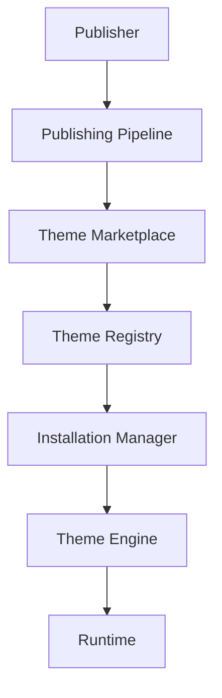
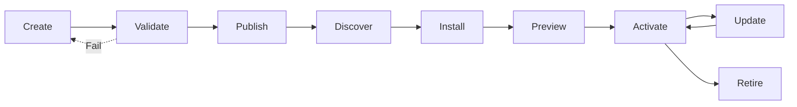
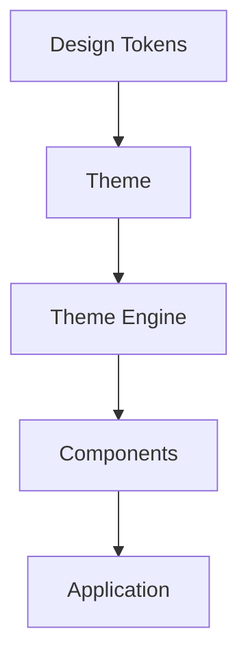
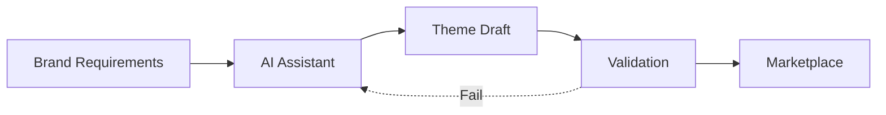

# Theme Marketplace

**KB-037 — Theme Marketplace Specification**

| Metadata | |
|----------|---|
| **KB ID** | KB-037 |
| **Title** | Theme Marketplace |
| **Version** | 0.1.0 |
| **Status** | Drafting |
| **Owner** | Architecture Team |
| **Dependencies** | KB-017 Theme Engine, KB-027 Theme Builder, KB-032 Marketplace Architecture, KB-033 Package & Artifact Specification |
| **Related Documents** | Theme Engine (KB-017), Theme Builder (KB-027), Marketplace Architecture (KB-032), Package & Artifact Specification (KB-033), Component Marketplace (KB-036), Component Registry (KB-012), Runtime Overview (KB-008), Builder Studio Architecture (KB-022), Validation Engine (KB-030) |
| **Review Status** | Pending |
| **Last Updated** | 2026-07-10 |

### Revision History

| Version | Date | Author | Change |
|---------|------|--------|--------|
| 0.1.0 | 2026-07-10 | AI Architecture Agent | Initial draft |

---

## 1. Purpose

The Theme Marketplace is the Marketplace subsystem responsible for publishing, discovering, certifying, installing, configuring, versioning, updating, governing, and retiring reusable design systems and themes across the DUKADESK platform. A Theme represents a reusable visual design system that integrates with the Theme Engine, Runtime, Builder Studio, Component Registry, Layout System, and Accessibility Framework.

Reusable themes exist because visual design is expensive to create and maintain. A well-crafted design system with consistent colors, typography, spacing, and component styles takes months to build and requires specialized expertise. The Theme Marketplace makes professional design systems available to every organization, eliminating the need for each organization to invest in design system creation from scratch.

Branding should be separated from business logic because visual identity changes independently of application functionality. An organization may rebrand, launch a sub-brand, create a white-label version for partners, or develop industry-specific visual identities — all without changing a single screen, workflow, or capability. Theme separation enables brand agility.

Organizations require independent visual identities because brand differentiation is a strategic advantage. A luxury retailer, a healthcare provider, and a logistics company all use DUKADESK — their applications should look nothing alike. The Theme Marketplace enables each organization to express its brand through the platform while sharing the same application logic.

Themes are distributed through the Marketplace because centralized distribution ensures quality, accessibility, and compatibility. Every theme in the Marketplace is validated for accessibility compliance, tested against the Component Registry, verified for theme engine compatibility, and certified for quality. Organizations can discover, preview, and install themes with confidence.

Themes remain technology-independent because the Theme Engine abstracts design tokens from rendering technology. A theme defined once works on mobile, web, desktop, kiosk, and TV. Platform-specific visual adaptation is handled by the Renderer, not by the theme. Technology independence ensures the theme ecosystem survives rendering technology evolution.

---

## 2. Theme Marketplace Philosophy

### Design System Consistency

All Marketplace themes adhere to the platform's design token architecture. Themes define global tokens, semantic tokens, and component tokens in a consistent structure. Consistency in token architecture enables tooling, preview, and runtime theme switching.

### Token-Driven Design

Every visual property in a theme is expressed through tokens — not hardcoded values. Tokens are organized hierarchically: global tokens (raw values), semantic tokens (design intent), and component tokens (specific UI application). Token-driven design enables systematic changes, theme inheritance, and mode variants.

### Brand Independence

The platform ships with a neutral default theme. Every organization, Desk, tenant, and partner can apply their own theme without modifying platform code. Brand independence enables white-label solutions, multi-brand organizations, and partner ecosystems.

### Accessibility-First

Every Marketplace theme must meet platform accessibility standards. Color contrast, typography readability, focus visibility, and motion safety are validated before certification. Accessibility is a certification gate, not a theme option.

### Runtime Compatibility

Themes declare their minimum Theme Engine version and are verified against target Runtime versions at certification time. A theme that passes certification is guaranteed to render correctly on all supported Runtime versions and component combinations.

### Component Compatibility

Themes declare which component families they support. A theme designed for enterprise data applications may support data grid, chart, and dashboard components, while a theme designed for consumer applications may prioritize media, card, and navigation components.

### Enterprise Branding

The Marketplace supports enterprise branding requirements — multi-tier brand hierarchies (corporate brand, sub-brands, partner brands), brand compliance validation, and centralized brand governance. Enterprise branding ensures consistency across the organization while enabling local adaptation.

### Marketplace Certification

Themes undergo certification before appearing in the Marketplace. Certification validates theme quality, accessibility, documentation, component coverage, and platform compatibility. Certified themes receive a certification badge.

### AI-Assisted Discovery

AI agents assist users in discovering the right theme — recommending themes based on brand requirements, generating brand-aligned themes from logos and guidelines, suggesting accessibility improvements, and detecting inconsistent branding.

### Technology Independence

Theme definitions are technology-independent. A theme defined once renders on mobile, web, desktop, kiosk, and TV. Platform-specific visual adaptations are handled by the Theme Engine and Renderer, not by the theme definition.

---

## 3. Marketplace Responsibilities

### Theme Publishing

Accept theme packages from publishers, validate them against platform standards, certify them for quality and accessibility, and make them available for discovery and installation.

### Discovery

Provide search, browse, filter, and recommendation interfaces for discovering themes. Discovery surfaces themes by category, design language, supported components, certification level, and brand compatibility.

### Installation

Manage the installation of themes onto target Desks. Installation includes package resolution, version compatibility verification, asset deployment, and theme registration with the Theme Engine.

### Version Management

Track theme versions, support version selection, manage version compatibility, handle version deprecation, and support rollback to previous versions.

### Compatibility Validation

Validate theme compatibility with the target Desk's Runtime version, installed components, layout system version, and accessibility requirements. Compatibility is verified before installation and before updates.

### Certification

Evaluate theme packages against certification criteria — token completeness, accessibility compliance, component coverage, documentation quality, and platform compatibility. Assign certification levels and manage certification lifecycle.

### Updates

Deliver theme updates to installed consumers. Updates preserve consumer customizations, theme overrides, and mode variant configurations. Breaking updates require explicit consumer approval.

### Retirement

Manage the retirement of deprecated themes. Retired themes are removed from discovery, blocked from new installations, and flagged for existing consumers with migration recommendations.

### Licensing

Manage theme licensing — free, commercial, enterprise, white-label. License enforcement and entitlement verification occur at installation and runtime.

### Analytics

Collect and report theme usage analytics — installation counts, active usage, version distribution, accessibility compliance rates, and performance metrics.

### Responsibility Boundaries

| Responsibility | Theme Marketplace | Theme Engine | Theme Builder | Builder Studio |
|---------------|------------------|--------------|---------------|----------------|
| Theme publishing | Validation, certification | — | Consumes | — |
| Discovery | Search and browse | — | Choose | Theme selector |
| Installation | Package resolution | Registration | — | Theme selection |
| Version management | Releases and deprecation | Version loading | Version display | Version selector |
| Compatibility | Pre-install verification | Runtime resolution | Design-time check | — |
| Certification | Quality and accessibility | — | — | Badge display |
| Updates | Distribution | Runtime loading | Update notification | Update selector |
| Token resolution | — | Runtime resolution | Token authoring | Token preview |
| Theme application | — | Apply to Renderer | Customization | Preview |

---

## 4. Theme Marketplace Architecture

### 4.1 Theme Registry

| Aspect | Description |
|--------|-------------|
| **Purpose** | Persistent registry of all published themes and their current state. |
| **Responsibilities** | Store theme metadata, track version history, maintain component compatibility matrices, record installation and usage statistics, support registry queries. |
| **Inputs** | Theme packages from Publishing Pipeline, publisher metadata updates. |
| **Outputs** | Theme search results, metadata responses, compatibility reports. |
| **Extension Points** | Custom registry backends, metadata indexing strategies, regional registry mirrors. |

### 4.2 Discovery Service

| Aspect | Description |
|--------|-------------|
| **Purpose** | Power search, browse, filter, and recommendation for theme discovery. |
| **Responsibilities** | Index theme metadata, process search queries, apply filters (category, design language, supported components, certification), rank results by relevance, generate recommendations. |
| **Inputs** | Search queries, browse navigation, filter selections, user context. |
| **Outputs** | Search results, category listings, recommendation sets. |
| **Extension Points** | Custom search algorithms, recommendation providers, ranking strategies. |

### 4.3 Installation Manager

| Aspect | Description |
|--------|-------------|
| **Purpose** | Manage the installation of themes onto target Desks. |
| **Responsibilities** | Resolve theme package, verify package integrity, validate compatibility, deploy assets to target environment, register theme with Theme Engine, report installation status. |
| **Inputs** | Installation requests (theme ID, version, target Desk). |
| **Outputs** | Installation status, theme registration records. |
| **Extension Points** | Custom installation workflows, pre/post installation hooks, deployment target adapters. |

### 4.4 Compatibility Manager

| Aspect | Description |
|--------|-------------|
| **Purpose** | Validate theme compatibility with target environments before installation and updates. |
| **Responsibilities** | Check Runtime version compatibility, verify component registry coverage, validate layout system compatibility, assess mode variant completeness, generate compatibility reports. |
| **Inputs** | Theme compatibility metadata, target environment information, installed component versions. |
| **Outputs** | Compatibility verification results, compatibility reports. |
| **Extension Points** | Custom compatibility rules, environment-specific compatibility matrices, component coverage validators. |

### 4.5 Certification Manager

| Aspect | Description |
|--------|-------------|
| **Purpose** | Manage theme certification — token completeness, accessibility compliance, component coverage, documentation quality. |
| **Responsibilities** | Define certification criteria, evaluate theme packages against criteria, assign certification levels, manage certification lifecycle, handle certification renewals and revocations. |
| **Inputs** | Theme packages for certification, certification criteria, audit results. |
| **Outputs** | Certification decisions, certification badges, certification reports. |
| **Extension Points** | Custom certification criteria, industry-specific certification packs, accessibility audit integrations. |

### 4.6 Preview Manager

| Aspect | Description |
|--------|-------------|
| **Purpose** | Provide live, interactive preview of themes before installation. |
| **Responsibilities** | Render theme applied to reference screens, demonstrate component styling, show mode variants (light, dark, high contrast), display responsive behavior, compare themes side by side. |
| **Inputs** | Theme definition, reference screen library, component library, mode selection. |
| **Outputs** | Interactive theme preview, mode variant demonstrations, component styling examples. |
| **Extension Points** | Custom preview environments, reference screen providers, brand-specific preview configurations. |

### 4.7 Update Manager

| Aspect | Description |
|--------|-------------|
| **Purpose** | Deliver theme updates to installed consumers. |
| **Responsibilities** | Detect available updates, notify consumers, validate update compatibility, manage update installation, handle breaking changes with consumer approval, preserve consumer customizations during updates, support update rollback. |
| **Inputs** | Updated theme packages, installed consumer registry, compatibility reports. |
| **Outputs** | Update notifications, update installation status. |
| **Extension Points** | Custom update channels, update scheduling policies, staged rollout strategies. |

### 4.8 Governance Manager

| Aspect | Description |
|--------|-------------|
| **Purpose** | Enforce organizational governance policies for theme discovery, installation, and use. |
| **Responsibilities** | Define organizational theme policies, maintain approved theme lists, enforce brand compliance rules, manage theme approval workflows, audit theme usage. |
| **Inputs** | Organizational policies, installation requests, brand guidelines. |
| **Outputs** | Policy enforcement decisions, approval workflow status, brand compliance reports. |
| **Extension Points** | Custom governance providers, brand compliance engines, approval workflow integrations. |

### 4.9 Branding Manager

| Aspect | Description |
|--------|-------------|
| **Purpose** | Manage brand identity assets and brand theme relationships. |
| **Responsibilities** | Store brand assets (logos, icons, brand guidelines), associate themes with brands, manage brand hierarchy (corporate brand, sub-brands, partner brands), validate brand compliance, generate brand reports. |
| **Inputs** | Brand asset uploads, brand hierarchy definitions, theme-brand associations. |
| **Outputs** | Brand asset library, brand compliance reports, brand hierarchy visualizations. |
| **Extension Points** | Custom brand asset types, brand guideline parsers, brand management integrations. |

### 4.10 Diagnostics Manager

| Aspect | Description |
|--------|-------------|
| **Purpose** | Provide health, compatibility, and usage diagnostics for themes. |
| **Responsibilities** | Monitor theme health, analyze token completeness, detect missing component styles, track version drift, generate diagnostic reports, provide theme quality scores. |
| **Inputs** | Theme metadata, installation records, compatibility reports, usage statistics. |
| **Outputs** | Diagnostic reports, token coverage reports, quality scores. |
| **Extension Points** | Custom diagnostic rules, token coverage analyzers, report renderers. |

---

## 5. Theme Categories

### Corporate Themes

| Category | Description |
|----------|-------------|
| **Enterprise** | Professional, neutral design system for corporate environments. Emphasizes readability, data density, and brand restraint. |
| **Financial** | Trust-oriented design with conservative colors, clear hierarchies, and precision typography. Suitable for banking, insurance, and investment applications. |
| **Government** | Accessible, compliant design with high contrast options, clear information architecture, and civic branding neutrality. |
| **Healthcare** | Calming, clean design with patient-centered visual hierarchy, medical color associations, and clinical workflow optimization. |
| **Education** | Engaging, approachable design with learning-optimized typography, intuitive navigation, and accessibility for diverse learners. |

### Industry Themes

| Category | Description |
|----------|-------------|
| **Retail** | Vibrant, brand-forward design optimized for product discovery, promotions, and checkout flows. Supports rich media and marketing content. |
| **Hospitality** | Warm, experience-oriented design for hotels, restaurants, and travel. Emphasizes ambiance, imagery, and service-focused interactions. |
| **Manufacturing** | Industrial, functional design with high-density data displays, alert systems, and shop-floor readability. Prioritizes status visibility and quick scanning. |
| **Agriculture** | Nature-inspired design with outdoor readability, simple information hierarchies, and offline-optimized visual feedback. |
| **Energy** | Technical, monitoring-oriented design for dashboards, control panels, and telemetry displays. Emphasizes status indicators and data visualization. |
| **Logistics** | Operational, real-time design with tracking visibility, status flows, and geospatial data optimization. Prioritizes quick decision-making. |

### Product Themes

| Category | Description |
|----------|-------------|
| **Dashboard** | Data-dense design optimized for monitoring, analytics, and KPI displays. Emphasizes charts, grids, and data visualization components. |
| **Mobile-First** | Touch-optimized design with large targets, simplified navigation, and gesture-friendly interactions. Suitable for field worker and consumer applications. |
| **Data-Intensive** | Screen-density optimized design for applications with complex data tables, forms, and workflows. Prioritizes information hierarchy and scanability. |
| **Minimal** | Reduced visual noise design with ample whitespace, limited color usage, and content-focused layouts. Suitable for premium and editorial applications. |
| **Executive** | High-impact design for leadership dashboards, strategic overviews, and presentation contexts. Emphasizes visual polish and brand presence. |

### Brand Themes

| Category | Description |
|----------|-------------|
| **Organization Identity** | Full brand implementation for a single organization. Includes all brand colors, typography, iconography, and visual language. |
| **White-Label** | Theme framework designed for rebranding by partners or resellers. Includes configurable brand slots for logo, colors, and typography. |
| **Partner Branding** | Brand implementation for partner organizations with cooperative brand guidelines. Balances partner identity with platform consistency. |
| **Client Branding** | Implementation of client brand guidelines within the platform. Used by agencies and service providers delivering branded applications. |
| **Franchise Branding** | Multi-entity brand system supporting master brand with franchisee customization. Balances brand consistency with local adaptation. |

### Accessibility Themes

| Category | Description |
|----------|-------------|
| **High Contrast** | Maximum contrast ratios for visually impaired users. Bold borders, strong color differences, and emphasized focus indicators. |
| **Large Text** | Enlarged typography scale for readability-impaired users. Larger body text, increased line heights, and expanded touch targets. |
| **Reduced Motion** | Minimal animation and transition theme for users with vestibular disorders. Static alternatives for all motion-based interactions. |
| **Accessibility Optimized** | Comprehensive accessibility theme addressing multiple WCAG criteria simultaneously. Suitable as organizational accessibility standard. |

### Seasonal & Campaign Themes

| Category | Description |
|----------|-------------|
| **Promotional** | Time-limited brand variant for marketing campaigns, product launches, and seasonal promotions. Includes campaign-specific colors and imagery. |
| **Holiday** | Seasonal brand variant for holiday periods. Includes holiday-appropriate color palettes, icons, and decorative elements. |
| **Event** | Event-specific brand implementation for conferences, trade shows, and corporate events. Time-limited with event-specific branding. |
| **Marketing Campaign** | Campaign-specific visual identity for targeted marketing initiatives. Includes campaign colors, typography, and visual language. |

---

## 6. Theme Package Model

| Field | Type | Required | Description |
|-------|------|----------|-------------|
| **themeId** | String | Yes | Globally unique identifier. Reverse-domain notation. Immutable. |
| **name** | String | Yes | Machine-readable name. Unique within publisher scope. |
| **version** | String | Yes | Semantic version. |
| **publisher** | String | Yes | Publisher identity reference. |
| **description** | String | Yes | Purpose, design language, and recommended use cases. |
| **themeCategory** | String | Yes | Theme category (corporate, industry, product, brand, accessibility, seasonal). |
| **designLanguage** | String | No | Design language or system reference (e.g., Material Design, Fluent, custom). |
| **supportedComponents** | String[] | Yes | Component families this theme provides token coverage for. |
| **supportedLayouts** | String[] | No | Layout patterns this theme has been tested with. |
| **accessibility** | Object | Yes | WCAG compliance level, contrast ratios, supported accessibility features. |
| **brandMetadata** | Object | No | Brand identity information, brand hierarchy position, white-label support. |
| **documentation** | Object | No | Documentation references — design guidelines, token reference, usage guide. |
| **certificationStatus** | String | Yes | Certification level: `certified`, `verified`, `uncertified`, `deprecated`. |

---

## 7. Theme Composition

### Design Tokens

Token architecture follows the three-layer hierarchy: global tokens (raw color values, type scale, spacing units), semantic tokens (design intent — primary color, heading font, card padding), and component tokens (specific UI application — button background, input border, card shadow).

### Color Palettes

Complete color system including primary, secondary, neutral, accent, success, warning, error, and info colors. Each color includes light, base, and dark variants. Surface colors for backgrounds, cards, modals, and navigation elements.

### Typography Systems

Complete type system including font family stack, type scale (headings h1-h6, body, caption, label, code), font weights, line heights, letter spacing, and responsive type adjustments.

### Spacing Scales

Consistent spacing system based on a base unit. Spacing presets for padding, margin, gap, and inset. Responsive spacing adjustments for different screen sizes.

### Elevation

Shadow system with consistent elevation levels for surfaces, cards, modals, dropdowns, and tooltips. Elevation includes shadow color, offset, blur radius, and spread.

### Motion

Motion token system with duration presets, easing curves, transition definitions, and animation behavior for interactive states, screen transitions, and micro-interactions.

### Icons

Icon library integration with consistent stroke weights, sizes, and color treatment. Icon sets may be included in the theme package or referenced from external libraries.

### Illustrations

Brand-specific illustration style and illustration component library. Illustrations support light and dark mode variants.

### Logos

Brand logo assets in multiple formats and orientations. Logo usage guidelines including clear space, minimum size, and prohibited modifications.

### Responsive Rules

Breakpoint definitions, responsive layout behavior, component adaptation rules, and typography/ spacing adjustments per breakpoint. Responsive rules ensure consistent brand expression across all screen sizes.

### Component Variants

Component-specific token overrides for every component in the supported component list. Component variants define visual treatment for each component state — default, hover, active, disabled, focused, error.

---

## 8. Installation Lifecycle

### Discover

The consumer discovers a theme through Marketplace search, browse, recommendations, category browsing, or brand reference. Discovery surfaces theme metadata — description, design language, supported components, certification level, and preview.

### Preview

The consumer previews the theme in the Preview Manager — seeing how reference screens render, how components are styled, how mode variants look, and how responsive behavior adapts.

### Validate

The Installation Manager validates the theme against the target environment — Runtime version compatibility, component coverage, mode variant completeness, accessibility requirements, and organizational brand policy.

### Install

The theme package is resolved, its integrity verified, its assets deployed to the target environment, and its tokens registered with the Theme Engine.

### Apply

The theme is applied to the Desk. The Theme Engine resolves the theme's tokens and makes them available to the Renderer. The Desk's visual appearance updates to reflect the new theme.

### Customize

The consumer may customize the installed theme through the Theme Builder — adjusting brand colors, modifying spacing, overriding component tokens, or configuring mode variants. Customizations are stored as theme overrides.

### Activate

The theme becomes the active theme for the Desk. All screens, components, and surfaces render using the theme's token values. Mode switching (light, dark, high contrast) is enabled based on theme mode support.

### Update

A new version of the theme is published. The Update Manager notifies the consumer, validates compatibility, preserves consumer customizations (where compatible), installs the update, and reapplies the theme.

### Retire

The theme is deprecated by the publisher or retired by the organization. Retired themes are removed from discovery, blocked from new installations, and existing consumers are notified with migration recommendations.

---

## 9. Runtime Integration

### Runtime

The Runtime loads the active theme at application startup. Theme resolution is the first step in the rendering pipeline — before any screen is rendered or any component is mounted. The Runtime provides theme metadata to the Theme Engine for token resolution.

### Theme Engine

The Theme Engine resolves theme tokens at runtime — traversing the token hierarchy, applying mode variants (light, dark, high contrast), computing derived values, and providing resolved token values to the Renderer. Token resolution is lazy and cached.

### Renderer

The Renderer consumes resolved token values from the Theme Engine and applies them to component rendering. The Renderer handles platform-specific styling conventions while respecting the theme's token values.

### Component Registry

Components discover their theme tokens through the Component Registry's theme contract. Each component declares its configurable token properties. The Renderer resolves component token values from the active theme.

### Layout Engine

Layout components consume spacing, sizing, and responsive tokens from the theme. Layout adaptation across breakpoints uses theme-defined responsive rules.

### Accessibility Framework

The accessibility framework reads theme accessibility metadata — contrast ratios, focus indicator styles, motion preferences, and typography scaling — and applies accessibility adaptations at render time.

---

## 10. Builder Integration

### Theme Builder

Installed themes appear in the Theme Builder as base themes that can be customized. The Theme Builder loads theme tokens, presents them in visual editors, and saves customizations as theme overrides.

### Screen Builder

The Screen Builder renders screens using the active theme's tokens. Component property editors display theme-compatible options. Token values are displayed as theme references rather than raw values.

### Form Builder

Form components inherit the active theme's field styling, spacing, and typography tokens. The Form Builder displays form previews using the active theme.

### Preview Runtime

The Preview Runtime supports live theme switching — consumers can preview their Desk with different installed themes before selecting one. Theme switching in preview is instantaneous.

### Component Marketplace

The Component Marketplace displays component previews using the consumer's active theme. Component documentation includes theme integration notes and component token references.

---

## 11. Marketplace Integration

### Marketplace Architecture (KB-032)

The Theme Marketplace is a specialization within the overall Marketplace Architecture. The Marketplace provides the distribution infrastructure; the Theme Marketplace provides theme-specific discovery, preview, installation, and governance.

### Publishing Pipeline (KB-031)

Themes are published as standard DUKADESK packages through the Publishing Pipeline. The Pipeline validates theme package structure, generates token metadata, signs the package, and submits it to the Theme Registry.

### Validation Engine (KB-030)

The Validation Engine validates theme packages during creation, publication, and installation. Validation covers token structure completeness, accessibility compliance, component coverage, documentation quality, and compatibility verification.

### Package Specification (KB-033)

Theme packages follow the standard Package & Artifact Specification. Theme-specific metadata extends the base package model with design tokens, component mappings, mode variants, and brand assets.

### Extension Framework (KB-034)

Themes may include Builder extensions — custom token editors, preview handlers, and theme import/export tools. Builder extensions follow the Extension & Plugin Framework contracts.

---

## 12. AI Integration

### Recommend Themes

The AI Assistant can recommend themes based on brand requirements — analyzing brand guidelines, logo images, and industry context to suggest compatible themes.

### Generate Brand Themes

The AI Assistant can generate complete brand themes from brand assets — extracting color palettes from logos, selecting complementary typography, and generating component token values.

### Suggest Accessibility Improvements

The AI Assistant can analyze theme color combinations and suggest accessibility improvements — adjusting contrast ratios, recommending accessible color alternatives, and identifying potential accessibility violations.

### Generate Dark/Light Variants

The AI Assistant can generate dark mode and high contrast variants from a light mode theme — computing inverted color values, adjusting contrast, and preserving brand identity across modes.

### Detect Inconsistent Branding

The AI Assistant can analyze theme application across a Desk and detect branding inconsistencies — screens that don't match the selected theme, components with overridden token values that drift from brand standards.

### Recommend Typography

Based on brand context and target platforms, the AI Assistant can recommend font pairings, type scale configurations, and text style definitions that complement the brand identity.

### Generate Documentation

The AI Assistant can generate theme documentation — design token reference, component styling guide, mode variant documentation, brand usage guidelines, and migration notes.

### AI Integration Principles

- AI-generated themes must pass platform validation and accessibility certification.
- AI recommendations are advisory — designers make all brand decisions.
- AI theme generation respects brand guidelines and organizational policies.

---

## 13. Accessibility

### WCAG Alignment

Themes are validated against WCAG criteria at certification time. Minimum compliance level is WCAG 2.1 AA. Accessibility validation covers all mode variants — light, dark, and high contrast.

### Color Contrast

All text-background color combinations are validated against WCAG contrast ratios: 4.5:1 for normal text, 3:1 for large text (AA), and 7:1 for normal text, 4.5:1 for large text (AAA). Validation covers all component states and mode variants.

### Typography Scaling

Body text sizes meet minimum readability thresholds. Type scale supports user font scaling preferences. Line heights and letter spacing are validated for readability. Themes declare their typography scaling behavior.

### Reduced Motion

Themes provide reduced motion alternatives for all animated properties. Motion tokens respect the user's reduced motion preference. Animations that convey information have static alternatives.

### Focus Indicators

All interactive element focus indicators meet minimum size and contrast requirements. Focus indicator tokens are validated for visibility across all surface colors and mode variants.

### Screen Reader Compatibility

Theme tokens that affect screen reader behavior — decorative vs. semantic icons, decorative imagery, visual-only content — are declared in theme metadata. The Accessibility Framework uses this metadata for screen reader announcements.

### High Contrast Variants

Themes provide high contrast mode variants that exceed WCAG AAA contrast requirements. High contrast mode emphasizes borders, increases text weight, and removes purely decorative elements.

---

## 14. Security

### Trusted Publishers

Themes from trusted publishers undergo reduced validation friction. Trust is established through publisher identity verification, certification history, and design quality track record.

### Theme Integrity

Theme token integrity is verified at installation and load time. Token references are validated for completeness. Missing or invalid token references are reported and blocked.

### Package Signing

Every theme package is digitally signed. Signature verification confirms publisher identity and package integrity. Tampered theme packages are rejected.

### Secure Assets

Brand assets (logos, icons, fonts) are distributed through secure, integrity-verified channels. Asset integrity is validated at installation time.

### Audit Logging

All theme operations are logged — installation, activation, customization, mode switching, updates, removal. Audit logs include theme identity, version, customizations, and operational context.

### Organization Approval

Organizations can require approval for theme installation and activation. Approval workflows integrate with the Governance Manager. Organization brand guidelines are enforced during approval.

---

## 15. Licensing

### Free

Themes available without cost. Free themes may be community-maintained, open source, or platform-provided base themes. Free themes follow the same certification and accessibility requirements as commercial themes.

### Commercial

Themes available for purchase. Commercial pricing may be per-installation, per-organization, or per-brand. Commercial themes include publisher support and update commitments.

### Enterprise

Themes licensed for entire organizations. Enterprise licenses cover unlimited installations and brands within the organization. Enterprise themes may include customization support.

### Internal

Themes developed internally by an organization for its own use. Internal themes are distributed through the organization's private catalog and are not visible externally.

### Subscription

Themes available through recurring subscription. Subscription themes include continuous updates, new component token coverage, and priority support.

### White-Label Licensing

Themes licensed for redistribution under the licensee's brand. White-label licensing enables partners and agencies to rebrand and resell themes as their own.

---

## 16. Performance

### Lazy Loading

Theme assets are loaded lazily — only the active mode's tokens and assets are loaded at startup. Dark mode and high contrast variant assets are loaded on demand when the user switches modes.

### Token Caching

Resolved theme tokens are aggressively cached for fast render performance. Token cache invalidation is triggered by theme switching, mode changes, and theme updates.

### Efficient Theme Switching

Theme switching applies only changed tokens. Components re-render only if their consumed tokens change. Theme switching is instantaneous for the user.

### Asset Optimization

Theme assets (fonts, icons, illustrations, logos) are optimized for distribution — compressed, subsetted, and multi-resolution. Asset loading is prioritized based on viewport visibility.

### Incremental Updates

Theme updates transfer only changed tokens and assets. Unchanged tokens are reused from the local cache. Delta computation uses package integrity hashes.

### Shared Design Resources

Themes that share design resources (common icon sets, popular font families, standard illustration libraries) consume those resources from a single shared installation. Shared resources reduce storage and bandwidth requirements.

---

## 17. Observability

### Theme Adoption Metrics

Active theme installations per organization, Desk, and environment. Theme version distribution. Theme switching frequency. Mode variant usage statistics.

### Installation Metrics

Installation counts by theme, version, publisher, category, and environment type. Installation success and failure rates.

### Update Metrics

Update availability tracking, update adoption rates, update success and failure rates. Consumer customization preservation rates during updates.

### Accessibility Reports

Per-theme accessibility compliance scores. Contrast ratio distributions. Mode variant completeness. Accessibility improvement recommendations.

### Rendering Performance

Theme token resolution time. Component render time attribution. Theme switching duration. Memory usage by mode variant.

### Diagnostics

The Diagnostics Manager provides per-theme health overview — token coverage completeness, component coverage gaps, mode variant completeness, accessibility compliance grade, and optimization suggestions.

---

## 18. Anti-Patterns

### Hardcoded Colors

Themes that include hardcoded color values outside the token system bypass platform accessibility validation and create maintenance burden. All colors must be declared as tokens within the token hierarchy.

### Component-Specific Themes

Creating separate themes for different component types fragments the design system and creates visual inconsistency. A single theme should cover all components in the supported component list.

### Business Logic Inside Themes

Themes should define visual appearance — not business behavior. Embedding business logic, conditional rendering rules, or data transformations in theme tokens couples presentation to business domain and breaks theme reusability.

### Inaccessible Color Palettes

Themes with color combinations that fail WCAG contrast requirements exclude users with visual impairments and create legal compliance risk. Accessibility validation is a certification gate.

### Duplicate Themes

Multiple themes providing the same visual language fragment the ecosystem and confuse consumers. Publishers should extend existing themes or contribute improvements rather than creating duplicates.

### Missing Design Tokens

Themes that omit required tokens create rendering gaps where components fall back to default styling. Token completeness is validated during certification. Missing tokens must be resolved before publication.

### Runtime-Specific Assumptions

Themes that assume specific platform rendering behavior — web-only shadows, mobile-only touch feedback, desktop-only hover effects — break on other platforms. Platform-specific adaptations should be handled by the Theme Engine and Renderer.

---

## 19. Future Evolution

### AI-Generated Themes

AI agents will generate complete, production-ready themes from brand guidelines, logo uploads, and website analysis — generating token hierarchies, color systems, typography scales, and component mappings.

### Adaptive Themes

Themes that adapt to user context — adjusting contrast based on ambient light sensors, switching typography based on reading speed, optimizing spacing for input method, and personalizing colors based on user preferences.

### Context-Aware Themes

Themes that adapt to application context — data-intensive screens use denser token values, content-focused screens use expanded spacing, operational screens use high-visibility token values.

### Enterprise Design Systems

Comprehensive enterprise design system packages that include multiple theme variants, brand hierarchy support, component library integration, design guideline documentation, and Figma/Sketch design kit exports.

### Cross-Brand Themes

Themes that support multiple brands within a single theme package — master brand with sub-brand overrides, partner brand slots, and client brand customization points.

### Live Collaborative Theme Editing

Multiple designers editing the same theme simultaneously with real-time preview, token change tracking, version comparison, and collaborative review workflows.

### Dynamic Personalization

Runtime theme personalization based on user preferences, role, context, and device capabilities — without modifying the base theme or creating theme variants.

---

## 20. Relationship to Other Documents

| Document | Relationship |
|----------|--------------|
| **Theme Engine (KB-017)** | Defines the runtime theming system. The Theme Marketplace distributes themes that the Theme Engine consumes at runtime. |
| **Theme Builder (KB-027)** | Provides the visual theme authoring environment. The Theme Marketplace supplies base themes that the Theme Builder customizes. |
| **Marketplace Architecture (KB-032)** | Defines the overall Marketplace. The Theme Marketplace is a specialized subsystem within the Marketplace Architecture. |
| **Package & Artifact Specification (KB-033)** | Defines the package format that theme packages follow. Theme metadata extends the base package model with design tokens. |
| **Component Marketplace (KB-036)** | Defines component distribution. The Theme Marketplace and Component Marketplace share component-theme compatibility contracts. |
| **Component Registry (KB-012)** | Components declare their theme token contracts. The Theme Marketplace validates theme coverage against registered components. |
| **Runtime Overview (KB-008)** | Defines the Runtime that renders themes. Theme lifecycle and application follow Runtime contracts. |
| **Builder Studio Architecture (KB-022)** | Hosts theme selection, preview, and customization. Builder Studio integrates with the Theme Marketplace. |
| **Validation Engine (KB-030)** | Validates theme packages during publishing and installation. Theme certification relies on Validation Engine rules. |

---

## Required Mermaid Diagrams

### Theme Marketplace Architecture

### Theme Lifecycle

### Theme Composition

### Runtime Rendering

### AI Theme Generation

---

*This is KB-037, the Theme Marketplace specification of the DUKADESK Engineering Knowledge Base. It defines the Theme Marketplace as the authoritative ecosystem for reusable design systems, establishing secure, accessible, token-driven, brand-aware themes that enable organizations to express their visual identity through the platform.*
