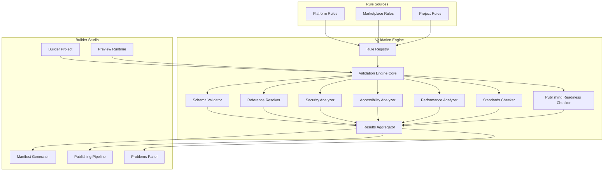
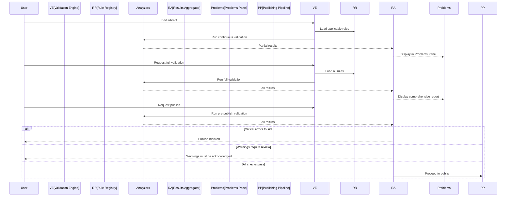

# Validation Engine

**KB-030 — Validation Engine Specification**

| Metadata | |
|----------|---|
| **KB ID** | KB-030 |
| **Title** | Validation Engine |
| **Version** | 0.1.0 |
| **Status** | Drafting |
| **Owner** | Architecture Team |
| **Dependencies** | KB-022 Builder Studio Architecture, Manifest Specification, Component Registry (KB-012), Layout System (KB-014), Navigation Engine (KB-016), State Management (KB-018) |
| **Related Documents** | Builder Studio Architecture (KB-022), Preview Runtime (KB-029), Publishing Pipeline (KB-031), Screen & Layout Builder (KB-024), Workflow Builder (KB-025), Data Model Builder (KB-028), Form Builder (KB-026), Theme Builder (KB-027) |
| **Review Status** | Pending |
| **Last Updated** | 2026-07-10 |

### Revision History

| Version | Date | Author | Change |
|---------|------|--------|--------|
| 0.1.0 | 2026-07-10 | AI Architecture Agent | Initial draft |

---

## 1. Purpose

The Validation Engine is the Builder Studio subsystem responsible for analyzing all project artifacts against schema definitions, platform standards, security policies, accessibility requirements, business rules, and publishing readiness criteria before publication. It ensures that only correct, complete, compliant, secure, accessible, and consistent applications reach the Publishing Pipeline.

Validation occurs at authoring time because detecting defects early is exponentially cheaper than fixing them after deployment. A missing required field caught during screen editing costs seconds to fix. The same defect caught after production deployment costs hours of triage, remediation, and rollback. The Validation Engine makes early detection systematic and automatic.

Validation is separate from preview because the two systems find different classes of problems. Preview executes the application and surfaces runtime behavior — what happens when a user navigates, submits a form, or triggers a workflow. Validation analyzes the application's structure and configuration — whether all required fields are present, whether component configurations satisfy their schemas, whether navigation routes are correctly connected, and whether the project meets publishing standards. Both are necessary; neither substitutes for the other.

Validation is a gate, not a suggestion. Critical errors block publishing. Warnings require review before publishing. Informational messages provide guidance. The Validation Engine enforces the platform's quality bar consistently across all projects, teams, and Builder modules.

---

## 2. Validation Philosophy

### Prevent, Don't Just Report

The Validation Engine should prevent defects from being created when possible, not just report them after the fact. In-editor validation catches issues as the user types. Pre-generation validation prevents invalid artifacts from entering the Manifest. Pre-publish validation catches cross-cutting concerns that span multiple artifacts.

### Continuous and On-Demand

Validation runs in three modes: continuous (background during editing), on-demand (triggered manually), and pre-publish (as a gate). Continuous validation provides instant feedback. On-demand validation provides a comprehensive health check. Pre-publish validation enforces the quality gate.

### Actionable Results

Every validation result includes a clear description, the exact location of the issue, a specific fix suggestion, and a reference to relevant documentation. Validation results that require interpretation or investigation are failures of the Validation Engine.

### Extensible by Design

The validation rule system is extensible. Platform teams define core rules. Marketplace extension authors define domain-specific rules. Teams define project-specific rules. All rules follow the same interface, severity model, and reporting format.

### Layered Analysis

Validation operates in layers, each focusing on a specific concern: schema compliance, structural integrity, security, accessibility, performance, standards conformance, publishing readiness, and business rules. Layers are independent but composable — a single validation run executes all layers and aggregates results.

### Consistent Enforcement

The same validation rules apply regardless of how the artifact was created — visual editor, AI generation, API import, or manual JSON editing. The Validation Engine is the single authority on correctness. No path bypasses validation.

### Progressive Severity

Errors block publishing. Warnings require acknowledgment. Informational messages provide guidance. Severity is determined by the rule definition, not by the artifact being validated. Rules may define conditions under which severity escalates or de-escalates.

### Deterministic

Validation must produce the same result for the same project state every time. Non-deterministic validation erodes trust and makes debugging impossible. Rules must not depend on external state, timing, or random values.

---

## 3. Validation Responsibilities

### Schema Validation

Validate all project artifacts against their schema definitions. Schema validation ensures required fields are present, field types are correct, enum values are within allowed sets, and structure matches the expected format. Schema validation covers Manifests, component configurations, workflow definitions, data models, theme definitions, navigation graphs, and form definitions.

### Structural Validation

Validate the structural integrity of the project. Structural validation detects broken references, orphaned artifacts, circular dependencies, duplicate identifiers, and missing required connections between artifacts.

### Security Validation

Validate security configurations. Security validation detects missing permission checks, unprotected routes, exposed credentials, insecure data bindings, insufficient authentication requirements, and violations of the platform's security policies.

### Accessibility Validation

Validate accessibility compliance. Accessibility validation detects missing labels, insufficient color contrast, missing keyboard handlers, incorrect ARIA roles, focus order issues, touch target size violations, and violations of accessibility standards (WCAG, platform-specific guidelines).

### Performance Validation

Validate against performance thresholds. Performance validation detects excessive component nesting, oversized assets, unoptimized data queries, missing lazy loading, excessive re-render triggers, and violations of performance budgets.

### Standards Validation

Validate conformance to platform engineering standards. Standards validation detects naming convention violations, formatting inconsistencies, deprecated API usage, version incompatibilities, and violations of documented conventions.

### Publishing Readiness Validation

Validate that the project is ready for publication. Publishing readiness validation ensures all required fields are populated, all warnings are reviewed and acknowledged, all critical errors are resolved, version metadata is complete, release notes are provided, and target environment compatibility is confirmed.

### Business Rule Validation

Validate against project-specific and domain-specific business rules. Business rule validation catches violations of custom rules defined by the project team, capability authors, or Marketplace extensions.

### Responsibility Boundaries

| Responsibility | Validation Engine | Preview Runtime | Notes |
|---------------|------------------|-----------------|-------|
| Schema validation | Yes | During load | Validation Engine is authoritative |
| Structural validation | Yes | No | Static analysis |
| Security validation | Yes | Surface issues | Validation Engine is authoritative |
| Accessibility validation | Yes | Surface issues | Validation Engine is authoritative |
| Performance validation | Yes | Profile | Different measurement approaches |
| Standards validation | Yes | No | |
| Publishing readiness | Yes | No | |
| Business rules | Yes | No | |
| Runtime behavior | No | Yes | Preview finds runtime errors |
| Integration behavior | No | Yes | Preview simulates integrations |

---

## 4. Validation Engine Architecture

### 4.1 Validation Engine Core

| Aspect | Description |
|--------|-------------|
| **Purpose** | Orchestrate validation execution — rule loading, scheduling, execution, result aggregation, and reporting. |
| **Responsibilities** | Manage validation lifecycle, coordinate rule execution across layers, aggregate results, enforce severity rules, provide validation API. |
| **Inputs** | Project state, validation trigger (continuous, on-demand, pre-publish). |
| **Outputs** | Aggregated validation results, severity summary, fix suggestions. |
| **Extension points** | Custom validation pipelines, result processors, severity strategies. |

### 4.2 Rule Registry

| Aspect | Description |
|--------|-------------|
| **Purpose** | Discover, load, and manage validation rules from all sources — platform, Marketplace, project. |
| **Responsibilities** | Register rules by category and severity, resolve rule dependencies, manage rule versioning, provide rule metadata. |
| **Inputs** | Rule definitions from platform, plugins, project configuration. |
| **Outputs** | Loaded and indexed rule collection. |
| **Extension points** | Custom rule sources, rule composition, rule overrides. |

### 4.3 Schema Validator

| Aspect | Description |
|--------|-------------|
| **Purpose** | Validate artifacts against JSON Schema and domain-specific schema definitions. |
| **Responsibilities** | Load schema definitions, validate artifact structure and types, report schema violations with exact paths, support draft and strict schema modes. |
| **Inputs** | Artifact data, schema definitions. |
| **Outputs** | Schema validation results. |
| **Extension points** | Custom schema formats, schema preprocessors, schema migration handles. |

### 4.4 Reference Resolver

| Aspect | Description |
|--------|-------------|
| **Purpose** | Resolve and validate all cross-references between project artifacts. |
| **Responsibilities** | Build reference graph, detect unresolved references, detect circular references, validate reference target types, report orphaned artifacts. |
| **Inputs** | All project artifacts. |
| **Outputs** | Reference graph, resolution results. |
| **Extension points** | Custom reference types, reference resolution strategies. |

### 4.5 Security Analyzer

| Aspect | Description |
|--------|-------------|
| **Purpose** | Analyze project artifacts for security violations. |
| **Responsibilities** | Check permission configurations, detect unprotected routes, identify credential exposure, validate authentication requirements, inspect data binding security. |
| **Inputs** | Project artifacts, security policy definitions. |
| **Outputs** | Security validation results. |
| **Extension points** | Custom security scanners, policy definitions, threat models. |

### 4.6 Accessibility Analyzer

| Aspect | Description |
|--------|-------------|
| **Purpose** | Analyze project artifacts for accessibility violations. |
| **Responsibilities** | Check component accessibility properties, validate color contrast ratios, detect missing ARIA attributes, verify keyboard navigation support, validate touch target sizes. |
| **Inputs** | Project artifacts, accessibility standards definitions. |
| **Outputs** | Accessibility validation results. |
| **Extension points** | Custom accessibility rules, platform-specific standards, screen reader simulators. |

### 4.7 Performance Analyzer

| Aspect | Description |
|--------|-------------|
| **Purpose** | Analyze project artifacts for performance risks. |
| **Responsibilities** | Measure component tree depth, detect oversized assets, identify missing lazy loading, flag excessive data queries, compute estimated render complexity. |
| **Inputs** | Project artifacts, performance budget definitions. |
| **Outputs** | Performance validation results. |
| **Extension points** | Custom performance budgets, platform-specific thresholds, complexity models. |

### 4.8 Standards Checker

| Aspect | Description |
|--------|-------------|
| **Purpose** | Validate conformance to platform engineering standards. |
| **Responsibilities** | Check naming conventions, detect deprecated API usage, verify version compatibility, flag formatting violations, validate documentation completeness. |
| **Inputs** | Project artifacts, standards definitions. |
| **Outputs** | Standards validation results. |
| **Extension points** | Custom standards, convention definitions, version compatibility matrices. |

### 4.9 Publishing Readiness Checker

| Aspect | Description |
|--------|-------------|
| **Purpose** | Validate that the project meets all requirements for publication. |
| **Responsibilities** | Check version metadata completeness, verify release notes presence, confirm target environment compatibility, validate approval status, ensure all critical errors are resolved. |
| **Inputs** | Project artifacts, publishing configuration, validation results from all layers. |
| **Outputs** | Publishing readiness verdict (pass, fail, conditional). |
| **Extension points** | Custom readiness criteria, environment-specific requirements, approval integrations. |

### 4.10 Results Aggregator

| Aspect | Description |
|--------|-------------|
| **Purpose** | Collect, deduplicate, prioritize, and format validation results from all layers. |
| **Responsibilities** | Merge results from parallel validation layers, deduplicate overlapping violations, sort by severity and location, group by category, generate fix suggestions. |
| **Inputs** | Validation results from all analyzers. |
| **Outputs** | Consolidated and ordered validation report. |
| **Extension points** | Custom result processors, output formatters, reporting integrations. |

### Validation Engine Architecture Diagram



---

## 5. Validation Rule System

### Rule Definition

Every validation rule is defined with:

| Field | Description |
|-------|-------------|
| **ID** | Unique identifier for the rule (e.g., `SCHEMA-001`, `SEC-042`, `A11Y-017`). |
| **Name** | Human-readable name. |
| **Category** | `schema`, `structural`, `security`, `accessibility`, `performance`, `standards`, `readiness`, `business`. |
| **Severity** | `error`, `warning`, `info`. |
| **Scope** | `artifact` (single artifact), `cross-artifact` (multiple artifacts), `project` (entire project). |
| **Selector** | Expression identifying which artifacts the rule applies to (e.g., `screen.*`, `workflow.*.step`). |
| **Condition** | Logic that evaluates to pass or fail. |
| **Message** | Human-readable description template with placeholders for context. |
| **Suggestion** | Specific fix suggestion template. |
| **Documentation** | Reference link to relevant standard, guide, or schema. |
| **Dependencies** | Other rules that must pass before this rule runs. |

### Rule Categories

#### Schema Rules

Schema rules validate artifact structure against JSON Schema or domain-specific schema definitions:

- Required field presence
- Field type correctness
- Enum value validity
- Array length constraints
- String pattern constraints
- Numeric range constraints
- Conditional schema validation (if/then/else)
- Schema version compatibility

#### Structural Rules

Structural rules validate the integrity of artifact relationships:

- Reference resolution (all references point to existing targets)
- Circular dependency detection
- Duplicate identifier detection
- Orphaned artifact detection
- Required connection enforcement
- Consistency between related fields across artifacts

#### Security Rules

Security rules validate security posture:

- Route protection (all routes have required permission checks)
- Permission reference validity
- Credential exposure detection (hardcoded keys, tokens, passwords)
- Sensitive data binding warnings
- Authentication requirement enforcement
- Secure communication enforcement (HTTPS, TLS)
- Input validation completeness
- Output encoding verification

#### Accessibility Rules

Accessibility rules validate WCAG and platform-specific compliance:

- Label presence (form fields, icons, buttons)
- Color contrast ratios (text, interactive elements)
- ARIA attribute correctness
- Keyboard navigation completeness
- Focus order logic
- Touch target sizing
- Screen reader text availability
- Heading hierarchy correctness
- Error message association with inputs

#### Performance Rules

Performance rules validate against performance budgets:

- Component tree depth limits
- Screen component count limits
- Asset size limits
- Data query depth limits
- Unoptimized rendering pattern detection
- Missing lazy loading detection
- Excessive re-render trigger detection
- Bundle size estimation

#### Standards Rules

Standards rules validate platform convention conformance:

- Naming convention compliance (camelCase, PascalCase, kebab-case per context)
- Deprecated API usage detection
- Version compatibility between artifacts
- Documentation completeness
- Formatting consistency
- Comment and description requirements

#### Publishing Readiness Rules

Publishing readiness rules validate pre-publication requirements:

- Version metadata completeness
- Release notes presence and quality
- Target environment compatibility
- Approval status verification
- Critical error resolution confirmation
- Warning acknowledgment status
- Required artifact presence
- Manifest schema compliance

#### Business Rules

Business rules validate project-specific and domain-specific requirements:

- Custom validation logic defined by project teams
- Domain-specific integrity constraints
- Industry regulation compliance
- Organizational policy enforcement
- Capability-specific validation requirements

### Rule Execution

Rules execute in dependency order within each category. Categories may execute in parallel if no cross-category dependencies exist. The Validation Engine Core manages execution ordering and parallelism.

Rules are stateless — given the same artifact state, the same rule produces the same result. Rules may cache intermediate results within a single validation run but must not maintain state across runs.

### Rule Lifecycle

```
Discovered → Loaded → Registered → Enabled → Executed → Updated (or Deprecated → Removed)
```

- **Discovered**: Rule found in platform, Marketplace, or project configuration.
- **Loaded**: Rule definition parsed and validated.
- **Registered**: Rule added to Rule Registry with metadata.
- **Enabled**: Rule active for validation runs (may be disabled per project or environment).
- **Executed**: Rule runs during validation.
- **Updated**: Rule definition updated (version increment, new conditions, changed severity).
- **Deprecated**: Rule scheduled for removal.
- **Removed**: Rule removed from Registry.

---

## 6. Validation Execution

### Continuous Validation

Continuous validation runs in the background as the user edits artifacts in the Builder:

- Validation triggers on artifact modification (debounced).
- Only changed artifacts and their dependents are validated.
- Results appear in the Problems Panel in real time.
- Critical errors are surfaced immediately with visual indicators.
- Warnings and info messages update without interrupting the user.

Continuous validation is optimized for speed. Only rules that can evaluate quickly run in continuous mode. Heavy rules (full project analysis, cross-artifact validation) are deferred to on-demand or pre-publish validation.

### On-Demand Validation

On-demand validation runs all rules across all artifacts:

- Triggered manually by the user or programmatically.
- Full project analysis including cross-artifact validation.
- All rule categories execute.
- Results are aggregated and displayed in the Problems Panel.
- Validation report can be exported.

On-demand validation is comprehensive but may take longer than continuous validation. Progress is reported in the status bar.

### Pre-Publish Validation

Pre-publish validation runs as a gate before the Publishing Pipeline accepts the project:

- All rules execute across all artifacts.
- Critical errors block publishing with a clear message.
- Warnings require explicit acknowledgment to proceed.
- Publishing readiness check must pass.
- Validation report is attached to the publish request.

Pre-publish validation is the strictest validation mode. No project can bypass it.

### Validation Flow



### Incremental Validation Scope

When an artifact changes, the Validation Engine determines the minimal validation scope:

- **Single artifact**: Rules that only evaluate the changed artifact itself.
- **Dependents**: Rules that evaluate artifacts that reference the changed artifact.
- **Dependencies**: Rules that evaluate artifacts referenced by the changed artifact.
- **Cross-cutting**: Rules that evaluate global project state (may still require full run).

Incremental validation reduces validation time by orders of magnitude for large projects.

### Validation Caching

Validation results are cached per artifact per rule:

- Cache is invalidated when the artifact changes.
- Cache is invalidated when rules are updated.
- Cache is invalidated when dependencies change.
- Cache is scoped to the validation mode (continuous vs. on-demand may have different caches).

---

## 7. Validation Results

### Result Structure

Every validation result includes:

| Field | Description |
|-------|-------------|
| **Rule ID** | The rule that produced this result (e.g., `SCHEMA-042`). |
| **Severity** | `error`, `warning`, `info`. |
| **Category** | Rule category. |
| **Artifact** | The artifact ID and type that contains the issue. |
| **Location** | Exact path within the artifact (JSON path, element ID, field name). |
| **Message** | Human-readable description of the issue. |
| **Suggestion** | Actionable fix suggestion. |
| **Documentation** | Reference link. |
| **Context** | Additional diagnostic data (expected value, actual value, affected components). |

### Severity Model

| Severity | Meaning | Publishing Impact |
|----------|---------|-------------------|
| **Error** | Defect that will cause runtime failure, security vulnerability, or standards violation. | Blocks publishing. Must be resolved. |
| **Warning** | Potential issue that may cause problems in specific conditions. | Requires explicit acknowledgment to publish. Should be resolved. |
| **Info** | Advisory message about best practices, optimization opportunities, or informational notes. | Does not block publishing. Recommended for review. |

### Severity Escalation

Certain conditions may escalate severity:

- A warning may escalate to an error in production publishing targets.
- An info message may escalate to a warning for specific artifact types.
- Repeated warnings of the same type across multiple artifacts may escalate to an error.

Severity escalation is defined in rule metadata and is deterministic.

### Result Grouping

Results are grouped for display in the Problems Panel:

- **By severity**: Errors first, then warnings, then info.
- **By category**: Grouped by rule category within each severity level.
- **By artifact**: Grouped by affected artifact.
- **By location**: Ordered by position within each artifact.

Users can filter, search, and sort results by any field.

### Fix Suggestions

Fix suggestions are specific and actionable:

- "Add the missing `label` property to component `productNameField` in screen `productDetail`."
- "Replace `fontSize: 10px` with `fontSize: 12px` in theme token `bodyText` to meet minimum contrast ratio."
- "Add permission check `order:read` to route `/orders/:id`."
- "Remove circular reference between workflow `orderApproval.step3` and workflow `escalation.step2`."

Suggestions are generated by the rule definition, not by AI. AI may provide additional context or alternative fixes.

---

## 8. Validation Profiles

### Profile Definition

Validation profiles define which rules run, with what severity, and in which validation modes:

- **Default profile**: Platform standard rules for all projects.
- **Strict profile**: All rules with escalated severity. Used for regulated industries or production deployments.
- **Relaxed profile**: Reduced ruleset for prototyping, development, and internal tools.
- **Custom profile**: Project-specific selection of rules, severities, and modes.

### Profile Application

Profiles are applied hierarchically:

1. **Platform default**: Base rules for all projects.
2. **Target environment**: Rules specific to mobile, web, desktop, or kiosk targets.
3. **Marketplace extensions**: Rules contributed by installed extensions.
4. **Project configuration**: Project-specific rule overrides and custom rules.

### Profile Inheritance

Profiles inherit from parent profiles:

- A strict profile inherits all default platform rules and adds additional rules or escalations.
- A project profile inherits from its target environment profile and adds project-specific rules.
- A custom profile may explicitly include or exclude rules from any parent profile.

---

## 9. Validation Overrides

### Warning Acknowledgment

Warnings may be acknowledged by authorized users:

- Acknowledgment records who acknowledged, when, and why.
- Acknowledged warnings do not block publishing.
- Acknowledgment may have an expiration date (re-review required).
- Acknowledgment is tracked per artifact version.

### Rule Suppression

Rules may be suppressed for specific artifacts or conditions:

- Suppression is scoped to an artifact, a path within an artifact, or a condition.
- Suppression reasons are documented as part of the artifact metadata.
- Suppressions are reviewed periodically.
- Suppressions do not carry across artifact versions.

### Profile Exceptions

Project profiles may add exceptions to the validation ruleset:

- Exceptions must be approved by the project lead or platform team.
- Exceptions are documented in the project configuration.
- Exceptions expire and require renewal.
- Exceptions are visible in audit logs.

---

## 10. AI Integration

### Explain Validation Errors

The AI Assistant can explain validation errors in plain language:

- "This error means the component 'ProductCard' is missing its required 'productId' property. Without it, the component won't know which product to display."
- "This warning indicates the color contrast between text and background is too low for users with visual impairments. WCAG requires a minimum ratio of 4.5:1 for normal text."

### Suggest Fixes

Based on the validation error context, the AI Assistant can suggest specific fixes:

- "To fix the missing label, add `label: "Product Name"` to the field configuration in the form definition."
- "To fix the contrast issue, change the text color to a darker shade. The current color #999999 on white background has a ratio of 2.8:1. Try #595959 for a 5.1:1 ratio."

### Batch Fix Application

The AI Assistant can apply fixes for multiple related validation errors:

- "Found 12 missing label errors across 3 screens. I can add default labels based on the field names. Review and confirm."
- "Found 5 deprecated API usages. I can update them to the recommended replacements."

### Generate Validation Rules

The AI Assistant can generate custom validation rules from natural language descriptions:

- "Create a rule that warns when any screen has more than 20 components."
- "Create a rule that requires all workflow steps to have an error handler."

### Analyze Validation Trends

The AI Assistant can analyze validation history to identify patterns:

- "Your project has had 15 accessibility warnings over the last 3 versions. Most are missing labels on form fields."
- "The most common validation error in this project is unresolved references, typically caused by renaming components without updating their references."

### AI Integration Principles

- AI explains and suggests; it does not bypass validation.
- AI-generated rule suggestions are subject to review before activation.
- AI-assisted fix application is logged and auditable.
- AI analysis of validation trends is advisory, not authoritative.

---

## 11. Validation Integration

### Builder Studio Integration

The Validation Engine integrates with every Builder module:

| Module | Validation Integration |
|--------|----------------------|
| Screen Builder | Validates component configurations, layouts, responsive variants. |
| Workflow Builder | Validates step configurations, data mappings, trigger conditions. |
| Form Builder | Validates field configurations, validation rules, submission behavior. |
| Data Model Builder | Validates entity schemas, field types, relationships. |
| Theme Builder | Validates token definitions, contrast ratios, completeness. |
| Navigation Builder | Validates route definitions, guard configurations, deep links. |
| Desk Builder | Validates desk configuration, platform selection, capability requirements. |
| Component Builder | Validates component schemas, property definitions, event contracts. |

### Manifest Generator Integration

The Manifest Generator calls the Validation Engine before generating artifacts:

- Pre-generation validation ensures only valid artifacts enter the Manifest.
- Validation results may block generation if critical errors are found.
- Generated artifacts are re-validated against the Manifest schema.

### Preview Runtime Integration

The Preview Runtime and Validation Engine are complementary:

- Validation Engine performs static analysis during authoring.
- Preview Runtime performs dynamic analysis during execution.
- Validation results are accessible from the Preview diagnostics panel.
- Preview Runtime may surface validation warnings alongside runtime diagnostics.

### Publishing Pipeline Integration

The Publishing Pipeline requires pre-publish validation to pass:

- Validation report is attached to the publish request.
- Publishing is blocked if critical errors exist.
- Warnings must be acknowledged before publishing.
- Publishing readiness check must pass.

### External Tool Integration

Validation results are accessible through programmatic APIs:

- CI/CD pipelines can trigger validation and check results.
- Code review tools can display validation results in pull request comments.
- Reporting tools can aggregate validation data across projects and teams.

---

## 12. Performance

### Incremental Validation

Continuous validation validates only changed artifacts and their immediate dependents. Incremental validation ensures real-time feedback remains fast even for projects with thousands of artifacts.

### Parallel Rule Execution

Rules within the same category that have no interdependencies execute in parallel. Independent categories execute in parallel. The Validation Engine Core manages thread pool and resource allocation.

### Rule Result Caching

Rule results are cached per artifact per rule. Cache invalidation is granular — changing one field invalidates only the rules that depend on that specific field.

### Deferred Heavy Rules

Rules that require full project analysis (cross-artifact validation, global reference resolution) are deferred from continuous mode. They execute only during on-demand and pre-publish validation.

### Progressive Results

Validation results are delivered progressively. Errors appear in the Problems Panel as soon as they are detected, before the full validation run completes. Users do not wait for all rules to finish before seeing feedback.

### Validation Budget

Pre-publish validation has a configurable time budget. If validation exceeds the budget, partial results are reported with a warning that some rules did not complete. The project may still publish with incomplete validation if explicitly authorized.

---

## 13. Observability

### Validation Reports

Validation reports include:

- Total error, warning, and info counts.
- Breakdown by category.
- Breakdown by artifact.
- List of all results with details.
- Validation duration.
- Rule execution statistics.

### Validation History

Validation history tracks:

- Validation runs over time.
- Error and warning counts per run.
- Rule pass/fail rates.
- Average resolution time for errors and warnings.
- Most frequently violated rules.

### Rule Performance Metrics

Rule-level performance metrics:

- Execution time per rule.
- Cache hit rate per rule.
- Number of artifacts evaluated per rule.
- Error and warning generation rate per rule.

### Validation Health

The Validation Engine exposes health metrics:

- Currently running validations.
- Queue depth for pending validations.
- Average validation duration by mode.
- Rule registry size and status.
- Error rate for rule execution failures.

---

## 14. Security

### Rule Integrity

Validation rules are loaded from trusted sources only:

- Platform rules are signed and verified.
- Marketplace rules are reviewed and signed.
- Project rules are validated before registration.

### Result Integrity

Validation results are tamper-proof:

- Results are computed deterministically from artifact state.
- Pre-publish validation results are hashed and included in the publish request.
- Validation report integrity is verified before publishing acceptance.

### Access Control

Validation configuration is access-controlled:

- Profile selection and modification require appropriate permissions.
- Rule suppression requires documentation and approval.
- Warning acknowledgment is attributed and audited.
- Validation override permissions are restricted to authorized roles.

---

## 15. Anti-Patterns

### Bypassing Validation

Publishing without running pre-publish validation is prohibited. Validation is the quality gate. Bypassing it undermines the entire quality system and introduces defects into production.

### Silently Fixing Errors

The Validation Engine must not silently fix errors. Automatic fixing hides defects from the user, prevents learning, and may introduce unintended side effects. Validation reports errors; the user or AI Assistant fixes them.

### Validation as a Testing Tool

Validation is static analysis, not dynamic testing. It analyzes the structure and configuration of artifacts but does not execute them. Runtime behavior testing is the responsibility of the Preview Runtime and dedicated testing tools.

### Overly Permissive Profiles

Using relaxed or custom profiles that disable critical rules is strongly discouraged. Profiles should tighten, not loosen, the validation bar. Disabling security or accessibility rules creates unacceptable risk.

### Ignoring Warnings

Publishing with unacknowledged warnings is prohibited when warnings are unacknowledged. Warnings exist because the platform team has determined they indicate real risk. Ignoring them is ignoring risk.

### Duplicate Validation Logic

Embedding validation logic in individual Builder modules that duplicates Validation Engine rules is prohibited. Validation rules should be defined once in the Rule Registry and reused across all modules. Duplicate logic inevitably diverges and produces inconsistent results.

### Validation Without Actionable Suggestions

A validation result that reports a problem without suggesting a fix is a failure of the rule definition. Every rule must include a specific, actionable fix suggestion. Rules without suggestions should not be enabled.

---

## 16. Future Evolution

### Real-Time Collaborative Validation

Multiple builders editing the same project receive consistent validation results simultaneously. Validation state is synchronized across editing sessions.

### Automated Rule Generation

AI agents analyze project patterns and generate custom validation rules automatically. Generated rules are proposed for review before activation.

### Predictive Validation

The Validation Engine predicts potential defects based on historical patterns and project characteristics. Predictive validation surfaces risks before they manifest as errors.

### Runtime Validation Integration

Validation results from the Preview Runtime feed back into the Validation Engine. Runtime errors are correlated with validation rules to improve rule accuracy and coverage.

### Cross-Project Validation

Validation rules that span multiple projects, shared libraries, and capability dependencies. Enterprise-wide consistency enforcement across all projects.

### Natural Language Validation Queries

Builders can ask questions about validation state in natural language: "Show me all accessibility errors in the checkout workflow," "What errors would remain if I suppress warning SEC-012?"

---

## 17. Relationship to Other Documents

| Document | Relationship |
|----------|--------------|
| **KB-022 — Builder Studio Architecture** | The Validation Engine is a subsystem within Builder Studio. This specification extends the Builder Studio architecture for pre-publication validation. |
| **KB-029 — Preview Runtime** | The Preview Runtime and Validation Engine are complementary — static analysis vs. dynamic execution. This document defines the validation layer; the Preview Runtime document defines the execution layer. |
| **KB-031 — Publishing Pipeline** | The Validation Engine provides the quality gate that the Publishing Pipeline requires before accepting a project for publication. |
