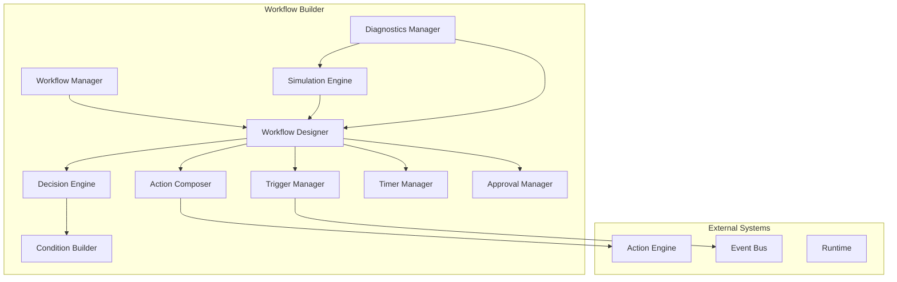

# Workflow Builder

**KB-025 — Workflow Builder Specification**

| Metadata | |
|----------|---|
| **KB ID** | KB-025 |
| **Title** | Workflow Builder |
| **Version** | 0.1.0 |
| **Status** | Drafting |
| **Owner** | Architecture Team |
| **Dependencies** | KB-015 Action Engine, KB-019 Event Bus, KB-018 State Management, KB-022 Builder Studio Architecture |
| **Related Documents** | Builder Studio Architecture (KB-022), Desk Builder (KB-023), Screen & Layout Builder (KB-024), Action Engine (KB-015), Event Bus (KB-019), State Management (KB-018), Navigation Engine (KB-016), Capability System, Offline & Synchronization (KB-020), Runtime Overview |
| **Review Status** | Pending |
| **Last Updated** | 2026-07-10 |

### Revision History

| Version | Date | Author | Change |
|---------|------|--------|--------|
| 0.1.0 | 2026-07-10 | AI Architecture Agent | Initial draft |

---

## 1. Purpose

The Workflow Builder is the Builder Studio subsystem responsible for designing, configuring, validating, simulating, testing, publishing, and maintaining business workflows across the DUKADESK platform.

Business processes should be declarative because imperative workflow code is difficult to audit, modify, or reuse. Declarative workflow definitions describe what steps to execute, in what order, under what conditions, and with what data — without specifying how the Runtime executes them. Declarative workflows are portable across Runtime versions, testable in simulation, and safe for AI generation.

Workflows are separated from UI components because business processes are independent of screen layout. A workflow may be triggered from multiple screens, run in the background without any UI, or continue executing after the user navigates away. Embedding workflow logic in components would couple business processes to specific UI contexts, preventing reuse and complicating maintenance.

Workflows are reusable across multiple screens and capabilities. An approval workflow can be referenced from an order detail screen, a customer management screen, and a mobile push notification. A single workflow definition serves all contexts, ensuring consistent business logic regardless of where it is triggered.

The Runtime executes workflows instead of the Builder because workflows run in production, not in the authoring environment. The Builder is the design-time environment; the Runtime is the execution environment. The Builder produces workflow definitions as declarative artifacts; the Runtime loads, interprets, and executes them. This separation means workflows continue running even when the Builder is closed, and workflow updates are deployed through the same publishing pipeline as other application artifacts.

---

## 2. Workflow Philosophy

### Declarative Workflows

Every workflow is defined as structured data — a graph of triggers, actions, conditions, decisions, timers, and error handlers. There is no imperative workflow code. Declarative workflows are predictable, auditable, portable, and safe for AI generation.

### Event-Driven Execution

Workflows are triggered by events, not by direct invocation. A workflow listens for specific events on the Event Bus (user action, state change, schedule, integration webhook) and executes when the triggering event occurs. Event-driven execution decouples workflows from their triggers and enables loose coupling between components and business processes.

### Action-Based Orchestration

Workflows orchestrate actions. Each step in a workflow is an action — a discrete, reusable operation defined in the Action Engine. Workflows compose actions into sequences, branches, and parallel paths. Actions are the vocabulary; workflows are the sentences.

### Separation of UI and Business Logic

UI components trigger workflows through actions; they do not contain workflow logic. Business logic — decisions, approvals, integrations, data transformations — lives in workflow definitions, not in component configurations. This separation ensures that business processes can be modified without touching UI code and vice versa.

### Reusability

Workflows are first-class artifacts that can be referenced from any trigger context: screens, capabilities, events, schedules, and other workflows. A workflow defined once can be reused across the entire Desk.

### Composability

Workflows may call other workflows. Sub-workflows encapsulate reusable process fragments — approval chains, notification sequences, data validation routines. Composition enables complex business processes to be built from simpler, testable building blocks.

### Auditability

Every workflow execution produces a complete audit trail: which workflow was triggered, by what event, which actions executed, what decisions were made, how long each step took, and whether the workflow succeeded or failed. Audit trails support compliance, debugging, and process optimization.

### Observability

Workflow execution is observable in real time. The Workflow Builder's monitoring view shows active workflow instances, their current step, pending decisions, and execution history. Operational dashboards surface workflow health, performance metrics, and failure patterns.

### AI-Assisted Workflow Creation

AI agents assist in workflow creation by generating workflow definitions from natural language descriptions, recommending automations, detecting missing steps, and optimizing workflow structure. AI output is always editable and subject to validation.

### Platform Independence

Workflow definitions are platform-independent. The same workflow definition executes identically on mobile, web, desktop, and future platforms. Platform-specific behavior is handled by the Runtime and Action Engine, not by the workflow definition.

---

## 3. What is a Workflow?

### Formal Definition

A **Workflow** is a declarative definition of a business process. It is triggered by one or more events, executes one or more actions in a defined sequence or parallel structure, and may include branching, conditions, approvals, timers, integrations, retries, and error handling. Workflows are authored in the Workflow Builder and executed by the Runtime's Action Engine.

### Characteristics

A Workflow:

- **Represents a business process** — a sequence of steps that accomplishes a business goal (e.g., process order, approve expense, onboard customer).
- **Is triggered by one or more events** — user actions, runtime events, schedule events, or integration events.
- **Executes one or more actions** — each action is a discrete operation defined in the Action Engine.
- **May include branching, approvals, conditions, retries, timers, and integrations** — workflows model real-world business complexity.
- **Is executed by the Runtime** — the Runtime loads workflow definitions and runs them through the Action Engine.

### What a Workflow Is Not

| Not This | Because |
|----------|---------|
| A UI screen | A workflow orchestrates business logic. A screen presents UI. They interact through actions and events. |
| A component | A component is a reusable presentation unit. A workflow is a reusable process unit. |
| A navigation route | Navigation routes define where the user can go. Workflows define what happens when they get there. |
| A backend endpoint | Backend endpoints handle API requests. Workflows orchestrate multi-step processes across services. |
| A database transaction | A database transaction ensures atomicity of data operations. A workflow orchestrates long-running business processes with human steps. |
| A platform service | Platform services provide infrastructure. Workflows define application-specific business logic using those services. |

---

## 4. Workflow Responsibilities

### Process Modeling

Provide a visual graph editor for modeling business processes as workflow diagrams. Support nodes for actions, decisions, timers, approvals, and sub-workflows. Enable drag-and-drop composition of process steps.

### Trigger Configuration

Configure what events trigger the workflow: user actions (button click, form submission), runtime events (state change, application lifecycle), scheduled events (cron, timer, delay), or integration events (webhook, API response).

### Action Orchestration

Define the sequence and structure of action execution: sequential steps, parallel branches, conditional execution, loops, and sub-workflow calls. Configure action parameters and data mappings between steps.

### Decision Modeling

Model branching logic using conditions, rules, switch/case structures, and expression evaluation. Decisions determine which path the workflow takes based on data, context, or user input.

### Approval Flows

Design multi-step approval processes: parallel approvals (all must approve), sequential approvals (chain of approvers), conditional routing (escalate based on amount or risk), and delegation.

### Parallel Execution

Define steps that execute concurrently. Parallel execution is used for independent operations: sending multiple notifications, calling multiple integrations, processing multiple data items.

### Sequential Execution

Define steps that execute one after another. Sequential execution is the default flow for dependent operations where each step relies on the previous step's output.

### Retry Policies

Configure retry behavior for steps that may fail: maximum retry attempts, backoff strategy, retry conditions (which errors trigger retry), and timeout handling.

### Error Handling

Define what happens when a step fails: abort the workflow, skip the step, execute a fallback action, notify an administrator, or trigger a compensation workflow.

### Workflow Validation

Validate workflow definitions against all applicable rules: schema compliance, action existence, data mapping correctness, cycle detection, reachability analysis, and performance thresholds.

### Workflow Simulation

Execute workflows in a simulated environment with mock data, simulated events, and step-by-step execution tracing. Simulation validates workflow behavior before publication.

### Workflow Publishing

Publish workflow definitions as part of the Desk Manifest. Published workflows are deployed to the Runtime and become available for execution.

---

## 5. Workflow Architecture

### 5.1 Workflow Manager

| Aspect | Description |
|--------|-------------|
| **Purpose** | Manage the lifecycle of workflow definitions within the Builder project. |
| **Responsibilities** | Create, read, update, delete, duplicate, and organize workflows. Manage workflow metadata and versioning. |
| **Inputs** | Workflow CRUD commands, project context. |
| **Outputs** | Workflow definitions, workflow list, workflow metadata. |
| **Extension points** | Custom workflow templates, workflow lifecycle hooks, external workflow imports. |

### 5.2 Workflow Designer

| Aspect | Description |
|--------|-------------|
| **Purpose** | Provide a visual graph editor for designing workflow diagrams. |
| **Responsibilities** | Render workflow graph on canvas, support node placement and connection, manage zoom and pan, provide node configuration panels. |
| **Inputs** | Workflow definition, canvas interactions, node palette. |
| **Outputs** | Modified workflow definition, workflow graph rendering. |
| **Extension points** | Custom node types, custom edge types, graph layout algorithms. |

### 5.3 Trigger Manager

| Aspect | Description |
|--------|-------------|
| **Purpose** | Configure and manage workflow triggers. |
| **Responsibilities** | Define trigger types, configure trigger parameters, validate trigger configurations, manage trigger-event bindings. |
| **Inputs** | Trigger configuration, Event Bus event registry, schedule configuration. |
| **Outputs** | Configured triggers, trigger-event bindings. |
| **Extension points** | Custom trigger types, external event sources. |

### 5.4 Action Composer

| Aspect | Description |
|--------|-------------|
| **Purpose** | Configure actions within workflow steps. |
| **Responsibilities** | Browse available actions from Action Engine, configure action parameters, map data between steps, validate action configurations. |
| **Inputs** | Action catalog from Action Engine, action parameter schemas, data mapping configuration. |
| **Outputs** | Configured workflow steps with actions and data mappings. |
| **Extension points** | Custom action resolvers, data transformation plugins. |

### 5.5 Decision Engine

| Aspect | Description |
|--------|-------------|
| **Purpose** | Model branching logic and conditional execution paths. |
| **Responsibilities** | Define conditions, build decision trees, configure rule evaluation, validate decision completeness (all paths covered). |
| **Inputs** | Condition definitions, decision tree configuration. |
| **Outputs** | Decision nodes, condition evaluations, branching paths. |
| **Extension points** | Custom condition evaluators, external rule engines. |

### 5.6 Condition Builder

| Aspect | Description |
|--------|-------------|
| **Purpose** | Build and validate conditions used in decisions and filters. |
| **Responsibilities** | Provide visual condition builder, support field-value comparisons, support expression evaluation, validate condition syntax and type safety. |
| **Inputs** | Condition expression, available context variables, data type information. |
| **Outputs** | Validated condition definitions. |
| **Extension points** | Custom condition operators, expression language plugins. |

### 5.7 Timer Manager

| Aspect | Description |
|--------|-------------|
| **Purpose** | Configure time-based and schedule-based triggers and delays. |
| **Responsibilities** | Define schedule triggers (date, time, recurring), configure delays between steps, manage timezone handling, validate schedule expressions. |
| **Inputs** | Schedule configuration, delay configuration. |
| **Outputs** | Timer definitions, schedule configurations. |
| **Extension points** | Custom schedule formats, calendar integration. |

### 5.8 Approval Manager

| Aspect | Description |
|--------|-------------|
| **Purpose** | Design and configure approval processes within workflows. |
| **Responsibilities** | Define approval steps, configure approver assignment (specific users, roles, managers), set approval rules (all, any, sequential), configure escalation paths. |
| **Inputs** | Approval configuration, user/role directory, escalation rules. |
| **Outputs** | Approval step definitions, approver assignments. |
| **Extension points** | Custom approver resolution, external approval systems. |

### 5.9 Simulation Engine

| Aspect | Description |
|--------|-------------|
| **Purpose** | Execute workflows in a simulated environment for validation and testing. |
| **Responsibilities** | Load workflow definition, execute step by step, simulate events and data, record execution traces, report validation results. |
| **Inputs** | Workflow definition, mock data, simulation configuration. |
| **Outputs** | Execution trace, validation report, simulation results. |
| **Extension points** | Custom simulation data providers, step mock implementations. |

### 5.10 Diagnostics Manager

| Aspect | Description |
|--------|-------------|
| **Purpose** | Collect and expose diagnostic information about workflow editing and simulation. |
| **Responsibilities** | Log editing operations, track performance metrics, capture simulation errors, expose health status. |
| **Inputs** | Events from all other modules. |
| **Outputs** | Diagnostic logs, metrics, health status. |
| **Extension points** | Custom diagnostic sinks, metrics exporters. |

### Workflow Architecture Diagram

---

## 6. Workflow Model

Every workflow in the Builder is represented by a structured model.

### Metadata

| Field | Description |
|-------|-------------|
| **Workflow ID** | Unique identifier within the Desk. |
| **Display Name** | Human-readable name shown in Builder and documentation. |
| **Description** | Brief description of the workflow's purpose. |
| **Category** | Business domain or process category. |
| **Tags** | Arbitrary tags for organization and search. |
| **Status** | Draft, Ready for Review, Approved, Published. |
| **Version** | Workflow definition version. |
| **Owner** | Team or individual responsible for the workflow. |

### Triggers

One or more trigger configurations that define how the workflow is initiated. Each trigger specifies:

- Trigger type (user, runtime, event, schedule, integration).
- Trigger-specific configuration (event name, schedule expression, action binding).
- Trigger conditions (only trigger when conditions are met).

### Variables

Local variables scoped to the workflow instance. Variables store intermediate data, accumulate results, and carry context between steps. Each variable has a name, type, and optional default value.

### Context

Workflow execution context shared across all steps:

- Trigger context (who triggered it, from where, with what parameters).
- User context (current user, roles, permissions).
- Device context (platform, connectivity, locale).
- Tenant context (tenant ID, configuration).
- Capability context (active capabilities).

### Actions

The sequence of steps in the workflow. Each step contains:

- Step ID and display name.
- Action reference (from Action Engine).
- Action parameter configuration.
- Data mappings (input from previous steps, output to variables).
- Error handling configuration.
- Retry configuration.

### Conditions

Conditional expressions used in decision nodes and step guards:

- Field comparisons (equals, greater than, contains, matches pattern).
- Logical operators (and, or, not).
- Context variable references.
- Expression language evaluation.

### Decisions

Branching nodes that route the workflow based on conditions:

- Decision node ID and display name.
- Decision type (if/else, switch/case, rule evaluation).
- Condition-to-path mappings.
- Default path (when no condition matches).

### Loops

Iteration over collections or repeated execution:

- Loop type (for-each, while, repeat-until).
- Collection or condition reference.
- Loop body (nested steps).
- Loop variable binding.
- Maximum iteration limit.

### Timers

Time-based controls within the workflow:

- Delay between steps.
- Scheduled step execution.
- Timeout for step completion.
- Deadline for workflow completion.

### Integrations

External system interactions:

- API call configuration (method, URL, headers, body).
- Authentication reference (from credential store).
- Response handling (data extraction, error handling).
- Webhook configuration.

### Error Handling

Global and step-level error handling:

- Error type matching.
- Retry configuration (max attempts, backoff).
- Fallback actions.
- Compensation actions (rollback).
- Error notification configuration.

### Completion Rules

Rules that determine when the workflow is complete:

- All steps executed successfully.
- Any step reached terminal error.
- Manual termination.
- Timeout reached.

### Outputs

Data produced by the workflow:

- Return values.
- Side effects (state changes, API calls, notifications).
- Audit trail (execution log, decisions made, timing).

### Version Information

- Semantic version of the workflow definition.
- Compatible Runtime version.
- Change log for this version.
- Published date.

---

## 7. Workflow Triggers

### User Triggers

Workflows triggered directly by user interaction.

| Trigger | Description |
|---------|-------------|
| **Button Click** | User clicks a button or tap target. The workflow receives the button's context and any associated data. |
| **Form Submission** | User submits a form. The workflow receives the form data as input variables. |
| **Menu Selection** | User selects a menu item. The workflow receives the menu context. |
| **Gesture** | User performs a gesture (swipe, long press). The workflow receives gesture context and target data. |
| **Manual Execution** | User manually triggers the workflow from a workflow list or dashboard. |

User triggers are configured by binding the trigger to a component event in the Screen & Layout Builder. When the component's event fires, the Action Engine dispatches the workflow trigger.

### Runtime Triggers

Workflows triggered by application lifecycle events.

| Trigger | Description |
|---------|-------------|
| **Application Started** | Workflow executes when the application launches. Used for initialization, data preloading, and session setup. |
| **Application Closed** | Workflow executes when the application closes. Used for cleanup, state persistence, and session logging. |
| **Capability Loaded** | Workflow executes when a capability is loaded. Used for capability-specific initialization. |
| **Configuration Changed** | Workflow executes when configuration or feature flags change. Used for runtime reconfiguration. |
| **State Updated** | Workflow executes when a specific state key changes. Used for reactive automation. |

### Event Triggers

Workflows triggered by events on the Event Bus.

| Trigger | Description |
|---------|-------------|
| **Published Event** | Workflow subscribes to a specific event on the Event Bus. When the event is published, the workflow executes with the event payload. |
| **Event Bus Subscription** | Workflow subscribes to a pattern of events (e.g., `order.*`). Any matching event triggers the workflow. |
| **Workflow Completion** | Workflow executes when another workflow completes. Used for chaining workflows. |
| **Action Completion** | Workflow executes when a specific action completes. Used for action-driven orchestration. |

Event triggers decouple the workflow from its source. The publisher does not know which workflows are subscribed to its events.

### Schedule Triggers

Workflows triggered by time-based conditions.

| Trigger | Description |
|---------|-------------|
| **Date/Time** | Workflow executes at a specific date and time. |
| **Recurring Schedule** | Workflow executes on a recurring schedule (every hour, daily at 9 AM, weekdays only). |
| **Delayed Execution** | Workflow executes after a configured delay from a triggering event. |
| **Cron-Style Schedule** | Workflow executes according to a cron expression for complex scheduling requirements. |

Schedule triggers support timezone configuration and daylight saving time handling.

### Integration Triggers

Workflows triggered by external systems.

| Trigger | Description |
|---------|-------------|
| **Webhook** | Workflow exposes a webhook URL. External systems send HTTP requests to trigger the workflow. |
| **API Response** | Workflow executes when a specific API call receives a response. Used for callback-driven flows. |
| **Message Queue** | Workflow subscribes to a message queue topic. Messages trigger workflow execution. |
| **Email Received** | Workflow executes when an email is received at a configured address. |
| **Payment Callback** | Workflow executes when a payment processor sends a callback (success, failure, refund). |

---

## 8. Actions

### Navigation Actions

| Action | Description |
|--------|-------------|
| `navigate` | Navigate to a route with optional parameters. |
| `goBack` | Return to the previous screen. |
| `openModal` | Present a modal screen. |
| `dismissModal` | Dismiss the current modal. |
| `openDrawer` | Open the navigation drawer. |
| `closeDrawer` | Close the navigation drawer. |

### Data Operations

| Action | Description |
|--------|-------------|
| `createRecord` | Create a new data record. |
| `updateRecord` | Update an existing data record. |
| `deleteRecord` | Delete a data record. |
| `queryRecords` | Query data records with filters and sorting. |
| `uploadFile` | Upload a file to storage. |
| `downloadFile` | Download a file from storage. |

### State Updates

| Action | Description |
|--------|-------------|
| `setState` | Set a state key to a specific value. |
| `mergeState` | Merge an object into an existing state key. |
| `deleteState` | Remove a state key. |
| `incrementState` | Increment a numeric state value. |

### Notifications

| Action | Description |
|--------|-------------|
| `showToast` | Show a transient toast notification. |
| `showAlert` | Show an alert dialog. |
| `showSnackbar` | Show a snackbar with optional action. |
| `sendPushNotification` | Send a push notification to the device. |
| `sendEmail` | Send an email notification. |
| `sendSMS` | Send an SMS notification. |

### API Calls

| Action | Description |
|--------|-------------|
| `httpRequest` | Make an HTTP request to an external API. |
| `graphqlQuery` | Execute a GraphQL query. |
| `graphqlMutation` | Execute a GraphQL mutation. |
| `uploadToAPI` | Upload data to an external API. |

### Capability Invocation

| Action | Description |
|--------|-------------|
| `invokeCapability` | Invoke a capability-specific action. |
| `enableCapability` | Enable a capability. |
| `disableCapability` | Disable a capability. |
| `configureCapability` | Update capability configuration. |

### File Operations

| Action | Description |
|--------|-------------|
| `readFile` | Read a file from local storage. |
| `writeFile` | Write data to a file in local storage. |
| `deleteFile` | Delete a file from local storage. |

### Payment Actions

| Action | Description |
|--------|-------------|
| `processPayment` | Initiate a payment transaction. |
| `refundPayment` | Process a refund. |
| `getPaymentStatus` | Check the status of a payment. |

### Messaging

| Action | Description |
|--------|-------------|
| `sendMessage` | Send an in-app message to a user. |
| `sendChatMessage` | Send a message to a chat channel. |
| `publishEvent` | Publish an event to the Event Bus. |

### Device Features

| Action | Description |
|--------|-------------|
| `takePhoto` | Capture a photo using the device camera. |
| `scanBarcode` | Scan a barcode or QR code. |
| `getLocation` | Get the device's current location. |
| `vibrate` | Trigger device vibration. |
| `setClipboard` | Copy text to the device clipboard. |

---

## 9. Decisions & Conditions

### Boolean Conditions

Evaluate a single condition that produces a true/false result. Boolean conditions are the simplest decision mechanism:

- Field value equals/not equals a comparison value.
- Field value is greater than/less than a threshold.
- Field value contains/does not contain a substring.
- Field value matches a regular expression.
- Field value is null/not null.

### Rule Evaluation

Evaluate multiple conditions as a rule set. Rules may be combined with AND/OR logic:

- All conditions must be true (AND).
- Any condition must be true (OR).
- Custom combination with nested logic groups.

Rules produce a single true/false result for the entire expression.

### Switch/Case

Route the workflow based on a field's value against multiple possible values:

- Define a switch expression (e.g., `order.status`).
- Define case values and their corresponding workflow paths.
- Define a default path for unmapped values.

### Expressions

Evaluate arbitrary expressions using the platform's expression language:

- Arithmetic expressions (`total * taxRate`).
- String operations (`firstName + " " + lastName`).
- Collection operations (`items.filter(i => i.active)`).
- Date/time operations (`now() + days(7)`).
- Ternary expressions (`status == "active" ? Approve : Reject`).

### Data Comparisons

Compare data from multiple sources:

- Compare workflow variables.
- Compare workflow data with state values.
- Compare workflow data with API response data.
- Compare data against configured thresholds.

### User Roles

Route based on the current user's role:

- Is the user an admin?
- Does the user have a specific role?
- Is the user in a specific group?
- What is the user's permission level?

### Permissions

Route based on permission evaluation:

- Does the user have permission to perform the next step?
- Is the user authorized to view the target data?
- Does the user's subscription include this feature?

### Feature Flags

Route based on feature flag state:

- Is the feature enabled for this tenant?
- Is the feature enabled for this user?
- Is the feature in beta or generally available?

### Runtime Context

Route based on runtime conditions:

- Is the device online or offline?
- Is the application in foreground or background?
- What platform is the application running on?
- What is the current connectivity quality?

### Tenant Context

Route based on tenant-specific configuration:

- Does the tenant have this workflow enabled?
- What is the tenant's configured approval threshold?
- What timezone is the tenant in?

---

## 10. Workflow Patterns

### Sequential

Steps execute one after another in a defined order. Each step completes before the next begins. Use for linear processes where each step depends on the previous: data validation → processing → confirmation.

### Parallel

Multiple steps execute concurrently. All parallel steps must complete before the workflow continues. Use for independent operations: send notifications to multiple recipients, call multiple APIs simultaneously, process multiple data items in parallel.

### Conditional

The workflow branches based on a condition. Different paths execute depending on the evaluation result. Use for decision points: if order value exceeds threshold, require approval; otherwise, process automatically.

### Approval

A human must review and approve before the workflow continues. Approval workflows include:

- **Single approval**: One approver reviews and decides.
- **Sequential approval**: Approvers review one after another in a chain.
- **Parallel approval**: Multiple approvers review simultaneously (all must approve, or any may approve).
- **Escalating approval**: If not approved within a time limit, escalate to the next level.
- **Conditional approval**: Routing depends on approval criteria (amount, risk level, department).

### Human-in-the-Loop

A workflow pauses and waits for human input before continuing. Unlike approvals (which are approve/reject), human-in-the-loop steps may request arbitrary data: fill in missing information, resolve a conflict, choose among options, provide manual review notes.

### Event-Driven

The workflow waits for an external event before continuing. The workflow pauses at a "wait for event" step and resumes when the matching event is received. Use for long-running processes: wait for payment confirmation, wait for shipment tracking update, wait for regulatory approval.

### Scheduled

The workflow executes on a schedule rather than in response to an event. Use for periodic tasks: daily report generation, weekly data cleanup, monthly billing.

### Long-Running

Workflows that execute over hours, days, or weeks, with pauses for human steps, external events, or scheduled delays. Long-running workflows maintain state across pauses and resume from where they stopped. Use for complex business processes: onboarding, contract approval, regulatory compliance.

### Compensation (Saga Concept)

When a workflow step fails after preceding steps have already been committed, compensation actions undo the completed steps. Each step defines a compensating action that reverses its effect. Use for distributed transactions: booking a trip (flight + hotel + car — if one fails, cancel the others).

### Retryable Workflows

Workflows designed to handle transient failures through retry. Each step may have its own retry policy. The workflow as a whole may have a global retry policy. Retryable workflows are common in integration-heavy processes: API calls, webhook deliveries, file processing.

### Pattern Selection Guide

| Requirement | Recommended Pattern |
|-------------|---------------------|
| Linear, dependent steps | Sequential |
| Independent concurrent operations | Parallel |
| Branching based on data | Conditional |
| Human review required | Approval |
| Human data input needed | Human-in-the-Loop |
| Wait for external system | Event-Driven |
| Periodic execution | Scheduled |
| Multi-day process with pauses | Long-Running |
| Distributed transaction safety | Compensation |
| Transient failure tolerance | Retryable |

---

## 11. Error Handling

### Validation Failures

When step input data fails validation:

- Log the validation error with field-level details.
- If configured, retry with corrected data.
- If retry is not configured or exhausted, transition to error path.
- Notify the workflow initiator of the validation failure.

### Action Failures

When an action execution fails:

- Capture the action's error code and message.
- Check if the error type matches a configured retry condition.
- If retryable, increment retry count and schedule retry.
- If not retryable or retries exhausted, execute the error handler.

### Integration Failures

When an API call or external integration fails:

- Distinguish between transient errors (timeout, network error) and permanent errors (auth failure, invalid request).
- Transient errors trigger retry with backoff.
- Permanent errors trigger the error handler without retry.
- Log the integration name, endpoint, request, and response for debugging.

### Timeout Handling

When a step exceeds its configured timeout:

- Abort the step execution.
- Log the timeout with the step name and duration.
- Execute the timeout error handler.
- If the step supports partial completion, preserve any results.

### Retry Strategies

| Strategy | Behavior | Use Case |
|----------|----------|----------|
| **Fixed interval** | Retry after a fixed delay. | Predictable retry timing. |
| **Exponential backoff** | Double delay between each retry. | Reduce load on failing service. |
| **Immediate** | Retry immediately without delay. | Optimistic retry for transient errors. |
| **Incremental** | Increase delay by a fixed amount each retry. | Gradual backoff. |
| **Custom** | Application-defined delay calculation. | Domain-specific retry timing. |

### Compensation

When a step fails and compensation is configured:

1. Identify completed steps that have compensating actions.
2. Execute compensating actions in reverse order.
3. Record compensation execution in the audit trail.
4. Transition the workflow to a failed or compensated state.

### User Notifications

Error notifications may be sent to:

- The workflow initiator.
- The workflow owner.
- System administrators.
- A configured notification channel (email, push, in-app).

### Audit Recording

All errors are recorded in the workflow audit trail:

- Timestamp.
- Step name and ID.
- Error type and message.
- Input data at time of failure.
- Retry count (if applicable).
- Resolution (retried, compensated, aborted).

---

## 12. Simulation & Testing

### Workflow Simulation

The Simulation Engine executes workflow definitions in a sandboxed environment:

- Workflow steps run in simulation mode — actions are mocked, not executed.
- Simulation produces a trace of which steps would execute, in what order, with what data.
- Simulation reveals unreachable paths, infinite loops, and data flow errors.

### Mock Data

Simulation uses mock data for variables, context, and external responses:

- Auto-generated mock data based on data types.
- User-defined mock values for specific variables.
- Mock API responses for integration steps.
- Mock event payloads for event-triggered workflows.

### Event Simulation

The Simulation Engine can simulate triggering events:

- Simulate user actions (button click, form submission).
- Simulate runtime events (state change, application start).
- Simulate schedule triggers (date/time, recurring).
- Simulate integration events (webhook, API callback).

### Integration Simulation

Integration steps are simulated, not executed:

- Mock responses are returned instead of making actual API calls.
- Simulated responses may include success, failure, timeout, and error scenarios.
- Integration simulation validates request construction (method, URL, headers, body).

### Breakpoints (Conceptual)

Builders can set conceptual breakpoints in the workflow:

- Pause execution at a specific step.
- Inspect variable values and context.
- Modify variable values to test different scenarios.
- Step through execution one action at a time.

### Step Execution

The Simulation Engine supports step-by-step execution:

- Execute one step at a time.
- View input data before execution.
- View output data after execution.
- Modify data between steps to test edge cases.

### Validation Reports

Simulation produces validation reports:

- Execution trace (full path through the workflow).
- Data flow analysis (variable creation, modification, usage).
- Path coverage (which branches were and were not executed).
- Error scenarios tested.
- Performance estimates (step count, estimated duration).

---

## 13. Runtime Integration

### Runtime

The Runtime loads workflow definitions from the published Manifest. When a trigger event occurs, the Runtime initiates a new workflow instance. The Runtime manages workflow instance state, schedules step execution, and handles persistence for long-running workflows.

### Action Engine

Workflow steps reference actions from the Action Engine. When a step executes, the Action Engine resolves the action, validates the parameters, and executes the action handler. The Action Engine returns the result (success or failure) and any output data.

### Event Bus

Workflows interact with the Event Bus in multiple ways:

- **Trigger**: Event-triggered workflows subscribe to Event Bus topics.
- **Publish**: Workflows may publish events during execution (publishEvent action).
- **Wait**: Workflows may pause and wait for a specific event on the Event Bus.
- **Notify**: Workflow lifecycle events (started, step completed, failed, completed) are published to the Event Bus.

### State Management

Workflows read from and write to the State Management subsystem:

- **Read**: Workflows access state values through context variables.
- **Write**: Workflows update state through setState, mergeState, and deleteState actions.
- **Watch**: Workflows may be triggered by state changes (State Updated trigger).

### Capability System

Workflows invoke capability-specific actions through the Action Engine. Capabilities register their available actions during installation. Workflows reference those actions by name; the Action Engine resolves them at execution time.

### Offline & Synchronization

Workflow execution respects the device's connectivity state:

- Workflows triggered offline queue their execution.
- Steps that require connectivity are deferred until online.
- API call steps are queued for execution when connectivity is restored.
- Workflow state is persisted locally and synchronized.

### Navigation Engine

Workflows may trigger navigation actions: navigate to a screen, open a modal, or go back. Navigation actions are executed through the Navigation Engine. The workflow may pass route parameters and context to the target screen.

---

## 14. AI Integration

### Generate Workflows from Natural Language

The AI Assistant can generate complete workflow definitions from natural language descriptions: "Create an order approval workflow: when an order exceeds $1000, it needs manager approval. If approved, notify the warehouse. If rejected, notify the customer." The AI generates the trigger configuration, steps, decisions, approvals, and error handling.

### Recommend Automation

Based on screen and capability analysis, the AI Assistant recommends automation opportunities: "This form submission could trigger a workflow to create a customer record, send a welcome email, and assign an account manager." The builder reviews and customizes the recommendation.

### Detect Missing Steps

The AI Assistant analyzes workflow definitions and detects missing steps: "This approval workflow has no rejection path. What should happen when the approver rejects?" The AI suggests completing the uncovered paths.

### Optimize Workflow Performance

The AI Assistant analyzes workflow structure and suggests performance optimizations:

- "These two API calls are independent and could run in parallel."
- "This sequential loop could be parallelized for faster execution."
- "This step has no error handling — adding retry would improve reliability."

### Suggest Reusable Sub-Workflows

When the AI detects repeated workflow patterns across multiple definitions, it suggests extracting them into reusable sub-workflows: "This approval pattern appears in 5 workflows. Would you like to create a reusable approval sub-workflow?"

### Explain Workflow Behavior

The AI Assistant can explain workflow behavior in natural language: "This workflow triggers when an order status changes to 'shipped'. It sends a notification to the customer, updates the inventory count, and creates a shipment tracking record."

### Generate Documentation

The AI Assistant generates workflow documentation from the workflow definition: step descriptions, decision logic explanations, integration details, and data flow diagrams.

### Detect Anti-Patterns

The AI Assistant scans workflow definitions for anti-patterns:

- Circular dependencies between workflows.
- Steps that could cause infinite loops.
- Missing error handlers.
- Potentially long-running synchronous operations.
- Hardcoded values that should be configurable.

---

## 15. Collaboration

### Shared Workflow Editing (Future)

Future support for multiple builders editing the same workflow simultaneously:

- Cursor and selection visibility on the workflow graph.
- Real-time updates to workflow structure.
- Conflict resolution for concurrent edits.
- Change attribution.

### Reviews

Workflow definitions can be submitted for review:

- Request review from designated reviewers (peers, domain experts, compliance officers).
- Reviewer examines the workflow graph, step configurations, and error handling.
- Reviewer approves or requests changes.
- Review comments are linked to specific steps or decisions.

### Comments

Builders can add comments to workflow elements:

- Feedback on specific steps or decisions.
- Questions about workflow logic.
- Suggestions for improvement.
- Threaded discussions with replies.

### Version History

Every change to a workflow is recorded:

- Who made the change.
- When the change was made.
- What changed (step-level diff).
- Change description.
- Version number.

### Approval Workflows

Workflow publication may require approval:

- Define approval gates for workflow publishing.
- Approval request and notification.
- Approval history per workflow version.
- Automatic rollback on rejection.

### Change Tracking

The Collaboration Manager tracks changes at the workflow element level:

- Added, modified, and deleted steps.
- Trigger configuration changes.
- Decision logic changes.
- Error handling changes.

---

## 16. Security

### Permission-Aware Workflows

Workflows can require specific permissions to execute:

- Which roles can trigger the workflow.
- Which roles can approve workflow steps.
- Which roles can view workflow execution history.
- Which roles can modify workflow definitions.

### Role-Based Execution

Workflow steps may execute in the context of specific roles:

- An "admin approval" step requires the executing user to have the admin role.
- A "manager notification" step uses the manager role to resolve recipients.
- Step data access is scoped to the executing role's permissions.

### Secure Integration Credentials

Integration configurations reference credentials stored in the secure credential store:

- Credentials are never stored in workflow definitions.
- Credentials are referenced by ID and resolved at execution time.
- Credential access is audited and logged.
- Credential rotation does not require workflow modification.

### Tenant Isolation

Workflow definitions and execution data are tenant-isolated:

- Tenant A workflows cannot be triggered or viewed by Tenant B.
- Tenant A workflow data is stored separately from Tenant B.
- Workflow execution context is tenant-scoped.

### Audit Logging

All workflow operations are logged:

- Workflow creation, modification, and deletion.
- Workflow execution start and completion.
- Step execution results.
- Decision evaluation results.
- Error and retry events.
- Approval decisions.

### Workflow Authorization

Workflow execution requires authorization:

- The triggering user must have permission to start the workflow.
- Approval steps require the approver to hold the approval role.
- Integration steps require the workflow to have the integration credential.
- Sensitive actions (payment, data deletion) require additional authorization.

---

## 17. Performance

### Efficient Execution

The Runtime executes workflows efficiently:

- Workflow definitions are cached after loading.
- Step execution is optimized for the common path.
- Conditional branches are evaluated minimally.
- Parallel steps are executed concurrently with thread/process limits.

### Parallel Action Optimization

When multiple steps execute in parallel:

- Independent steps are distributed across available executors.
- The number of parallel executions is configurable (max concurrency).
- Resource-intensive steps are rate-limited.
- Parallel execution is monitored for resource contention.

### Workflow Caching

Workflow definitions are cached after first load:

- Cache keyed by workflow ID and version.
- Cache invalidated when workflow is updated.
- Cache supports efficient lookup by trigger event.
- Preloading for frequently triggered workflows.

### Incremental Validation

The Validation Engine validates only changed workflow elements:

- Modified steps are re-validated.
- Unchanged steps use cached validation results.
- Dependency validation cascades from changed elements.
- Full validation runs on demand and before publishing.

### Large Workflow Handling

Workflows with many steps are optimized:

- Virtualized workflow graph rendering in the Designer.
- Lazy loading of step configuration panels.
- Efficient data mapping for large variable sets.
- Pagination for long execution histories.

### Simulation Performance

The Simulation Engine is optimized for rapid iteration:

- Simulation executes in-process without network calls.
- Mock data is pre-generated and cached.
- Simulation traces are streamed, not buffered.
- Large workflows may be simulated incrementally.

---

## 18. Observability

### Execution Traces

Every workflow execution produces a detailed trace:

- Trigger event and payload.
- Step-by-step execution log with timestamps.
- Variable values at each step.
- Decision evaluation results.
- Error and retry events.
- Final workflow status and output.

### Workflow Metrics

Aggregated workflow metrics:

- Execution count (total, by trigger type, by status).
- Average execution duration.
- Step completion rate.
- Error rate by step and error type.
- Retry rate and retry success rate.
- Approval turnaround time.

### Performance Analysis

Performance analysis per workflow:

- Step-level duration breakdown.
- Bottleneck identification (slowest steps).
- Parallel execution efficiency.
- Integration call latency.
- Workflow instance age distribution.

### Failure Reports

Failure reports provide actionable information:

- Failure rate trend.
- Most common failure types and steps.
- Failure correlation with time, data, and context.
- Recommended fixes based on failure patterns.

### Audit History

Complete audit history for compliance:

- Who triggered each workflow execution.
- What data was processed.
- What decisions were made and by whom.
- What external systems were called.
- What changes were made to data.

### Diagnostics Dashboards

The Diagnostics Manager provides operational dashboards:

- Active workflow instance count.
- Workflow throughput (executions per minute).
- Error rate dashboard with drill-down.
- Performance distribution charts.
- Top workflows by execution count and duration.

---

## 19. Anti-Patterns

### Business Logic in UI Components

Embedding business process logic in UI component configurations (button onClick handlers, screen lifecycle hooks) instead of workflow definitions is prohibited. Business logic in UI components is not reusable, not auditable, and not visible to the Workflow Builder.

### Circular Workflow Dependencies

Workflow A calling Workflow B which calls Workflow A (directly or through a chain) is prohibited. Circular dependencies cause infinite execution loops and make workflows impossible to reason about. The Validation Engine detects circular references.

### Infinite Loops

Workflows with loop constructs that have no termination condition or insufficient maximum iteration limits are prohibited. Every loop must have a defined maximum iteration count and at least one exit condition.

### Duplicate Workflows

Creating multiple workflow definitions that implement the same business process is prohibited. Duplicate workflows diverge over time, causing inconsistent business logic. Workflows should be reused, not duplicated.

### Hardcoded API Endpoints

Embedding API endpoint URLs, authentication tokens, or environment-specific values in workflow definitions is prohibited. Integration configurations must reference environment-specific configuration values or credential store entries.

### Unhandled Failures

Defining workflow steps without error handling — no retry, no fallback, no compensation — is prohibited. Every step that can fail must have an error handling strategy. Unhandled failures cause workflow instances to get stuck in an error state.

### Hidden Side Effects

Workflow steps that produce side effects (state changes, API calls, notifications) without declaring them in the step configuration are prohibited. All side effects must be explicit and visible in the workflow definition.

### Long-Running Synchronous Operations

Executing operations that take more than a few seconds synchronously within a workflow step is prohibited. Long-running operations should use asynchronous patterns: publish an event and continue, or pause the workflow and resume on completion callback.

### Direct Database Access

Workflow steps that access databases directly instead of going through the Action Engine or capability APIs are prohibited. All data operations must go through the defined platform interfaces.

### Workflows Without Triggers

Defining workflows that are never connected to any trigger is prohibited. A workflow without a trigger can never execute. Every workflow must have at least one configured trigger before publication.

---

## 20. Future Evolution

### AI-Generated Business Processes

AI agents may generate complete business process definitions from high-level requirements: "Create an employee onboarding process including document collection, manager approvals, IT provisioning, and training assignment." The AI generates a multi-step workflow with triggers, decisions, approvals, integrations, and error handling.

### Enterprise Orchestration

Workflows may orchestrate across multiple enterprise systems:

- ERP integration for order-to-cash processes.
- CRM integration for lead-to-opportunity processes.
- HCM integration for hire-to-retire processes.
- Cross-system data synchronization workflows.

### BPMN Interoperability (Conceptual)

Future support for importing and exporting workflow definitions in BPMN-compatible formats. BPMN interoperability would enable:

- Import processes modeled in external BPMN tools.
- Export DUKADESK workflows for external analysis.
- Integration with enterprise BPM suites.

### Cross-Desk Workflows

Workflows that span multiple Desks within an organization:

- A workflow in the Sales Desk triggers a workflow in the Fulfillment Desk.
- Shared workflow definitions across Desks.
- Cross-Desk data access with tenant isolation.

### Cross-Organization Workflows

Workflows that span organizational boundaries:

- Supplier onboarding workflows involving external organizations.
- Customer-facing approval processes.
- Partner integration workflows.
- Federated workflow execution.

### Intelligent Optimization

AI-driven workflow optimization:

- Analyze execution data to suggest workflow improvements.
- Automatically adjust retry policies based on success rates.
- Recommend parallelization opportunities.
- Suggest optimal timeout values based on historical execution data.

### Autonomous Workflow Recommendations

The platform may proactively recommend workflow automation:

- Detect repetitive user actions and suggest workflow automation.
- Identify manual processes that could be automated.
- Recommend workflow templates based on Desk configuration and capability usage.
- Suggest trigger bindings based on component and event analysis.

---

## 21. Relationship to Other Documents

| Document | Relationship |
|----------|--------------|
| **KB-015 — Action Engine** | Workflow steps execute actions defined in the Action Engine. The Action Engine resolves and executes each step's action at runtime. |
| **KB-019 — Event Bus** | Workflows are triggered by and publish events on the Event Bus. Event-driven workflows subscribe to Event Bus topics. |
| **KB-018 — State Management** | Workflows read from and write to the State Management subsystem. State changes can trigger workflows; workflows can modify state. |
| **KB-022 — Builder Studio Architecture** | The Workflow Builder is a subsystem within Builder Studio. This specification extends the Builder Studio architecture for business process modeling. |
| **KB-023 — Desk Builder** | Workflows are defined within a Desk project. The Desk Builder manages the project that contains workflow definitions. |
| **KB-024 — Screen & Layout Builder** | Screens trigger workflows through component events. The Screen Builder configures event-to-workflow bindings. |
| **KB-016 — Navigation Engine** | Workflows may trigger navigation actions. Navigation actions are executed through the Navigation Engine. |
| **KB-020 — Offline & Synchronization** | Workflow execution respects connectivity state. Offline-queued workflows synchronize when connectivity is restored. |
| **Capability System** | Capabilities register actions that workflows can invoke. Capabilities may also define their own workflow templates. |
| **Runtime Overview** | The Runtime executes workflow definitions published from the Workflow Builder. |

---

*This is KB-025, the Workflow Builder specification of the DUKADESK Engineering Knowledge Base. It defines the Builder Studio subsystem responsible for designing, configuring, validating, simulating, testing, publishing, and maintaining business workflows — the heart of DUKADESK's low-code automation capabilities.*
